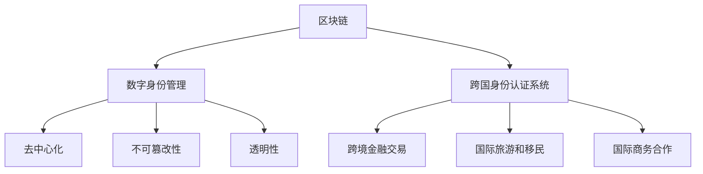
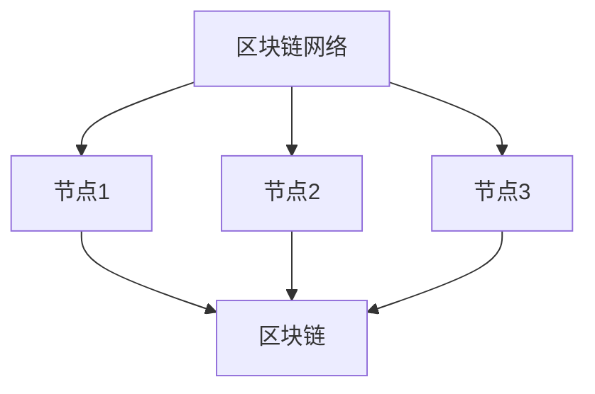
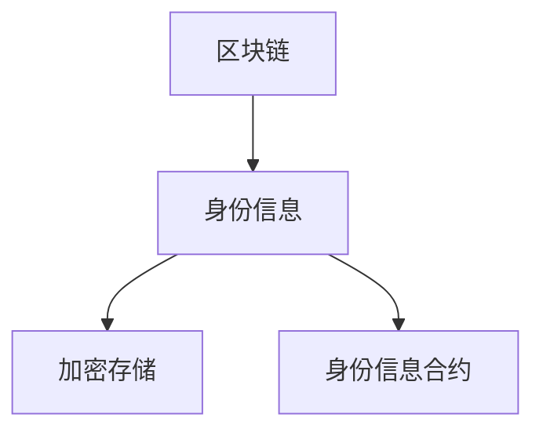
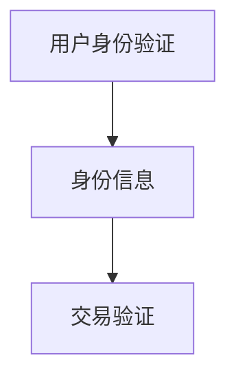
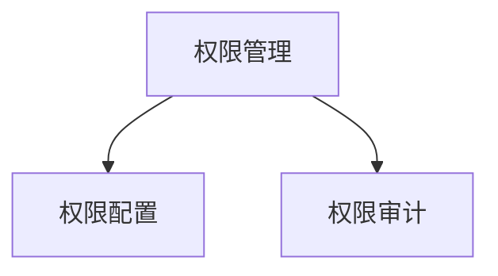

                 

# 《区块链在数字身份管理中的应用：跨国身份认证系统》

## 关键词

- 区块链
- 数字身份管理
- 跨国身份认证
- 加密算法
- 共识算法
- 数学模型
- 智能合约
- 项目实战

## 摘要

本文旨在探讨区块链技术在数字身份管理领域中的应用，特别是跨国身份认证系统。随着互联网的普及和数字化进程的加速，身份认证的需求越来越迫切，而传统的身份认证方式面临着诸多挑战。区块链技术以其去中心化、不可篡改和透明性等特性，为数字身份管理和跨国身份认证提供了新的解决方案。本文将首先介绍区块链和数字身份管理的基础概念，然后深入探讨区块链的核心算法原理，接着展示如何利用区块链构建跨国身份认证系统，并通过实际项目案例进行分析与总结，为相关领域的研究和应用提供有益的参考。

## 引言

随着全球化的不断深入，跨国交流和合作日益频繁。然而，这也带来了身份认证方面的挑战。传统的身份认证方式通常依赖于中心化的机构或数据库，如政府、银行或社交媒体平台。这种方式虽然方便，但存在诸多问题。首先，中心化的身份认证系统容易成为攻击的目标，一旦被攻破，大量的个人信息可能被泄露。其次，跨国身份认证通常需要不同国家和地区的多个认证机构协同工作，这增加了认证过程的复杂性和成本。此外，传统的身份认证系统缺乏透明性和不可篡改性，使得用户无法完全信任其身份信息。

区块链技术作为一种去中心化的分布式数据库技术，具有独特的优势，能够在数字身份管理和跨国身份认证中发挥重要作用。区块链的去中心化特性使得不再需要依赖单一中心化的机构，而是通过一个分布式的网络来验证和记录身份信息，从而提高了系统的安全性和抗攻击能力。区块链的不可篡改性确保了身份信息的完整性和可靠性，一旦信息被记录在链上，就几乎无法被篡改。此外，区块链的透明性使得用户可以轻松查看自己的身份信息，增强了信任度。

本文将首先介绍区块链和数字身份管理的基础概念，包括区块链的定义、特点以及数字身份管理的需求和挑战。接着，我们将深入探讨区块链的核心算法原理，包括加密算法、共识算法等。然后，本文将展示如何利用区块链构建跨国身份认证系统，包括系统架构、核心组件和关键技术。最后，我们将通过实际项目案例进行分析与总结，探讨区块链在数字身份管理中的应用前景和潜在挑战。

## 核心概念与联系

### 区块链的基本概念

区块链是一种分布式数据库技术，通过一种去中心化的方式来存储和验证数据。它由多个“区块”组成，每个区块包含一定数量的交易记录。这些区块按照时间顺序排列，并通过密码学技术相互链接，形成一条不可篡改的区块链。

区块链的核心特点包括去中心化、不可篡改和透明性。去中心化意味着区块链不依赖于单一的中央机构，而是由网络中的多个节点共同维护。这使得区块链具有很强的抗攻击能力和分布式容错性。不可篡改性则保障了数据的安全性，一旦数据被记录在区块链上，就几乎无法被篡改。透明性则使得区块链上的所有数据都公开可查，用户可以轻松地验证数据的真实性。

### 数字身份管理概述

数字身份管理是指通过技术手段来识别和验证个人的数字身份。在传统的身份认证方式中，通常需要提交身份证明文件，如身份证、护照等。而在数字身份管理中，这些身份证明文件被数字化，并通过加密技术进行保护。

数字身份管理的重要性在于，它能够提供一种安全、便捷和可信的身份认证方式。对于个人而言，数字身份管理可以简化身份验证过程，减少携带实体证件的麻烦。对于企业和服务提供者而言，数字身份管理可以降低欺诈和身份盗用的风险，提高业务效率和客户满意度。

然而，数字身份管理也面临着一些挑战。首先，数字身份信息的泄露和篡改风险较高。由于数字身份信息通常存储在中心化的服务器上，一旦服务器遭受攻击，大量个人信息可能被窃取。其次，不同国家和地区之间的数字身份管理体系可能存在差异，这增加了跨国认证的复杂性和成本。最后，数字身份管理的透明性和不可篡改性也需要得到保障，以增强用户对系统的信任。

### 跨国身份认证系统

跨国身份认证系统是指在不同国家和地区之间进行身份验证的系统。随着全球贸易和人员流动的增加，跨国身份认证的需求日益增长。跨国身份认证系统需要解决的主要问题是确保身份信息的真实性和一致性，同时降低认证成本和复杂性。

跨国身份认证的需求主要来自以下几个方面：

1. **跨境金融交易**：跨境金融交易通常需要验证交易双方的身份信息，以确保交易的合法性和安全性。跨国身份认证系统可以简化这一过程，提高交易效率。
2. **国际旅游和移民**：国际旅游和移民需要验证旅客或移民的身份信息，以确保其符合相关法律法规。跨国身份认证系统可以方便地实现这一目标。
3. **国际商务合作**：跨国公司和企业之间的商务合作通常需要验证合作伙伴的身份信息，以确保合作的合法性。

跨国身份认证的挑战主要表现在以下几个方面：

1. **数据隐私和安全**：跨国身份认证系统需要处理大量敏感的个人信息，如何保障这些信息的安全是关键挑战。
2. **法律和标准不一致**：不同国家和地区在身份认证方面的法律和标准存在差异，这增加了跨国认证的复杂性和协调难度。
3. **技术和基础设施差异**：不同国家和地区在技术水平和基础设施方面存在差异，这可能导致跨国身份认证系统的兼容性和稳定性问题。

### 区块链与数字身份管理、跨国身份认证的联系

区块链技术为数字身份管理和跨国身份认证提供了新的解决方案。首先，区块链的去中心化和分布式特性可以替代传统的中心化身份认证系统，降低系统的集中风险。其次，区块链的不可篡改性可以保障身份信息的真实性和完整性，减少信息泄露和篡改的风险。最后，区块链的透明性可以增强用户对身份认证系统的信任，提高系统的透明度和公正性。

为了更好地展示区块链、数字身份管理和跨国身份认证之间的联系，我们可以使用 Mermaid 流程图进行说明。以下是一个简化的 Mermaid 流程图示例：



在这个流程图中，区块链作为核心技术，连接着数字身份管理和跨国身份认证系统。数字身份管理通过去中心化、不可篡改性和透明性等特性，满足了跨国身份认证的需求。跨国身份认证系统则具体应用于跨境金融交易、国际旅游和移民、国际商务合作等领域。

通过上述分析，我们可以看出，区块链技术在数字身份管理和跨国身份认证中具有巨大的应用潜力。在接下来的章节中，我们将进一步探讨区块链的核心算法原理，以及如何利用这些原理构建高效、安全的跨国身份认证系统。

### 区块链的核心算法原理讲解

要深入理解区块链在数字身份管理中的应用，我们首先需要了解区块链的核心算法原理。区块链的算法主要包括加密算法、共识算法等，这些算法共同保障了区块链的安全性、去中心化和可靠性。以下将详细讲解这些算法，并使用 Python 伪代码进行阐述。

#### 1. 加密算法

加密算法是区块链技术中至关重要的一部分，它确保了数据的安全性和隐私性。区块链常用的加密算法主要包括 RSA 算法、椭圆曲线加密（ECC）算法等。

**1.1 RSA 算法**

RSA 算法是一种非对称加密算法，它基于大素数分解的难度。RSA 算法包括两个密钥：公钥和私钥。

- **公钥（n, e）**：公钥由两个大素数 p 和 q 的乘积 n 以及一个与 (p-1)(q-1) 互质的数 e 组成。
- **私钥（n, d）**：私钥由公钥和另一个与 e 互质的数 d 组成，其中 d 满足 e*d ≡ 1 (mod (p-1)(q-1))。

**Python 伪代码：**

```python
# 生成 RSA 密钥
def generate_RSA_key():
    p = random_prime()  # 生成大素数 p
    q = random_prime()  # 生成大素数 q
    n = p * q  # 生成 n
    phi = (p-1) * (q-1)  # 生成 phi
    e = random_integer(2, phi)  # 生成与 phi 互质的 e
    d = mod_inverse(e, phi)  # 生成 d
    return (n, e), (n, d)

# RSA 加密
def RSA_encrypt(plaintext, n, e):
    ciphertext = [(ord(char) ** e) % n for char in plaintext]
    return ciphertext

# RSA 解密
def RSA_decrypt(ciphertext, n, d):
    plaintext = [(char ** d) % n for char in ciphertext]
    return ''.join([chr(char) for char in plaintext])
```

**1.2 椭圆曲线加密（ECC）算法**

椭圆曲线加密算法是一种更为高效的加密算法，其安全性较高，但计算复杂度相对较低。ECC 算法同样使用公钥和私钥。

- **公钥（Q, G, n）**：公钥由椭圆曲线 E、基点 G 和阶 n 组成。
- **私钥（k）**：私钥是一个随机整数 k，公钥 Q = kG。

**Python 伪代码：**

```python
# 生成 ECC 密钥
def generate_ECC_key():
    E = EllipticCurve(a, b)  # 生成椭圆曲线
    G = E.gen()  # 生成基点
    n = G.order()  # 生成阶
    k = random_integer(1, n)  # 生成私钥
    Q = k * G  # 生成公钥
    return (E, G, n), (k, Q)

# ECC 加密
def ECC_encrypt(plaintext, E, G, n):
    ciphertext = [(hash_char(char) * Q) % n for char in plaintext]
    return ciphertext

# ECC 解密
def ECC_decrypt(ciphertext, k, G, n):
    plaintext = [(char * G) % n for char in ciphertext]
    return ''.join([chr(char) for char in plaintext])
```

#### 2. 共识算法

共识算法是区块链网络中各个节点达成一致的重要机制。常见的共识算法包括工作量证明（PoW）、权益证明（PoS）和实用拜占庭容错（dBFT）等。

**2.1 工作量证明（PoW）算法**

PoW算法通过计算复杂性问题来保护区块链网络的安全性。节点需要解决一个难度调整的哈希函数问题，以获得生成新区块的权力。计算过程如下：

- **生成随机数 r**：节点生成一个随机数 r。
- **计算哈希值**：计算 r 的哈希值 H(r)。
- **调整随机数**：如果 H(r) 满足难度要求，则节点提交 r；否则，继续生成新的随机数 r，直到满足条件。

**Python 伪代码：**

```python
# PoW 算法
def PoW(difficulty):
    nonce = random_integer()
    while hex_hash(nonce) != "0" * difficulty:
        nonce += 1
    return nonce
```

**2.2 权益证明（PoS）算法**

PoS算法通过节点的权益来决定其生成新区块的权力。节点的权益通常与其持有的代币数量和持有时间成正比。计算过程如下：

- **计算权益**：节点计算其权益 score = token_count * holding_time。
- **选择节点**：从所有节点中随机选择一个权益最高的节点生成新区块。

**Python 伪代码：**

```python
# PoS 算法
def PoS(nodelist):
    scores = [token_count * holding_time for node in nodelist]
    highest_score = max(scores)
    chosen_node = nodelist[scores.index(highest_score)]
    return chosen_node
```

**2.3 实用拜占庭容错（dBFT）算法**

dBFT算法是一种在拜占庭错误环境中高效达成共识的算法。dBFT算法将节点分为三个角色：领导者（L）、准备者（P）和跟随者（F）。领导者负责生成新区块，准备者负责验证新区块，跟随者负责投票确认新区块。

- **领导者生成新区块**：领导者生成新区块，并将其发送给准备者。
- **准备者验证新区块**：准备者验证新区块的有效性，如果有效，则发送给跟随者。
- **跟随者投票确认新区块**：跟随者收到新区块后，进行投票确认。如果超过2/3的节点确认，则新区块被纳入区块链。

**Python 伪代码：**

```python
# dBFT 算法
def dBFT(leader, preparers, followers):
    new_block = leader.generate_block()
    for preparer in preparers:
        if new_block.is_valid():
            preparer.send_block(new_block)
    for follower in followers:
        if follower.voting(new_block):
            return "Block is confirmed"
    return "Block confirmation failed"
```

通过上述算法的讲解，我们可以看到区块链技术在保障数据安全、去中心化和可靠性方面具有独特的优势。这些算法不仅在区块链中发挥着关键作用，也为数字身份管理和跨国身份认证提供了坚实的基础。

### 数学模型和数学公式讲解

区块链技术中的数学模型和数学公式是其实现安全性和去中心化的基础。以下是区块链中几个关键的数学模型和数学公式的讲解，以及相关的 Python 代码示例。

#### 1. 哈希函数

哈希函数是区块链中用于确保数据完整性和不可篡改性的核心工具。最常用的哈希函数是 SHA（Secure Hash Algorithm）系列。

- **SHA-256**：SHA-256 是一种将输入数据映射为 256 位哈希值的算法。

**数学公式：**

$$ H = SHA-256(D) $$

其中，$H$ 是生成的哈希值，$D$ 是输入数据。

**Python 代码示例：**

```python
import hashlib

def sha256_hash(data):
    return hashlib.sha256(data.encode('utf-8')).hexdigest()

# 示例
hash_value = sha256_hash("Hello, World!")
print(hash_value)
```

#### 2. 椭圆曲线加密（ECC）

椭圆曲线加密（ECC）是一种非对称加密算法，以其高安全性和低计算复杂度而著称。ECC 的核心在于椭圆曲线和点乘运算。

- **椭圆曲线**：椭圆曲线通常表示为 $y^2 = x^3 + ax + b$。
- **点乘运算**：给定椭圆曲线和基点 $P$，计算点乘 $k \cdot P$，其中 $k$ 是一个整数。

**数学公式：**

$$ Q = k \cdot P $$

其中，$Q$ 是结果点，$P$ 是基点，$k$ 是整数。

**Python 代码示例：**

```python
import sympy

# 定义椭圆曲线
E = sympy.椭圆曲线(2, 3, 17)

# 基点
P = E点(3, 5)

# 计算点乘
Q = P * 2
print(Q)
```

#### 3. RSA 算法

RSA 算法是一种非对称加密算法，以其安全性高而著称。RSA 算法涉及大素数分解和模乘运算。

- **大素数分解**：选择两个大素数 $p$ 和 $q$。
- **模乘运算**：计算 $n = p \times q$ 和 $\phi = (p-1)(q-1)$。

**数学公式：**

$$ n = p \times q $$
$$ \phi = (p-1)(q-1) $$

**Python 代码示例：**

```python
# 大素数分解
p = 61
q = 53
n = p * q

# 模乘运算
def mod_inverse(e, phi):
    return pow(e, phi - 2, phi)

# RSA 加密
def rsa_encrypt(plaintext, n, e):
    ciphertext = [(ord(char) ** e) % n for char in plaintext]
    return ciphertext

# RSA 解密
def rsa_decrypt(ciphertext, n, d):
    plaintext = [(char ** d) % n for char in ciphertext]
    return ''.join([chr(char) for char in plaintext])

# 示例
plaintext = "Hello"
n = 3233
e = 17
ciphertext = rsa_encrypt(plaintext, n, e)
print(ciphertext)

decrypted_text = rsa_decrypt(ciphertext, n, d)
print(decrypted_text)
```

通过上述数学模型和数学公式的讲解以及 Python 代码示例，我们可以看到区块链技术中的数学原理是如何在实际编程中应用的。这些数学工具不仅为区块链提供了强大的安全性，也为数字身份管理和跨国身份认证系统奠定了坚实的基础。

### 区块链在数字身份管理中的应用

区块链技术在数字身份管理中具有广泛的应用前景，特别是在跨国身份认证系统中。通过区块链技术，我们可以构建一个去中心化、安全可靠的数字身份认证系统，从而解决传统身份认证方式中存在的诸多问题。

#### 1. 去中心化的身份认证

传统的身份认证系统通常依赖于中心化的机构或数据库，这使得系统容易成为攻击的目标。区块链的去中心化特性可以替代传统的中心化身份认证系统，降低系统的集中风险。在区块链上，身份认证过程不再依赖于单一的机构，而是由网络中的多个节点共同维护。这种方式不仅提高了系统的抗攻击能力，还增加了系统的分布式容错性，使得即使部分节点遭受攻击，整个系统仍能正常运行。

**案例：**

一个实际应用案例是摩根大通（JPMorgan）开发的区块链身份认证系统。该系统利用区块链技术实现了用户身份的分布式验证，从而简化了银行开户和交易流程。用户只需在区块链上验证一次身份，其身份信息即可被其他机构信任和重复使用，从而提高了身份认证的效率和安全性。

#### 2. 不可篡改的身份信息

区块链的不可篡改性确保了身份信息的真实性和完整性。一旦身份信息被记录在区块链上，就几乎无法被篡改。这种特性对于数字身份管理尤为重要，因为身份信息往往是个人敏感信息，一旦被篡改，将可能导致严重的后果。

**案例：**

普华永道（PwC）开发了一个基于区块链的数字身份管理系统，该系统利用区块链的不可篡改性，确保用户身份信息的真实性和可靠性。用户可以通过区块链查看和验证自己的身份信息，从而增强了信任度。

#### 3. 透明和可信的认证过程

区块链的透明性使得身份认证过程更加公开和透明。用户可以轻松查看自己的身份信息，同时其他用户和机构也可以验证这些信息的真实性。这种透明性不仅增加了系统的可信度，还提高了用户对系统的信任。

**案例：**

瑞士银行联合开发的区块链身份认证平台 ID2020，通过区块链技术实现了身份信息的透明和可信。该平台为无家可归者、难民和贫困人口提供数字身份认证，使其能够获得金融服务和基本社会福利。

#### 4. 优化跨国身份认证

区块链技术可以优化跨国身份认证的过程，降低认证成本和复杂性。在传统的跨国身份认证系统中，用户需要在不同国家和地区的多个认证机构之间进行身份验证，这不仅耗时耗力，还容易产生误差。通过区块链技术，用户只需在一个分布式网络中进行一次身份验证，其身份信息即可在全球范围内共享和信任。

**案例：**

香港金融管理局（HKMA）与泰国金融管理局合作，利用区块链技术实现了跨境身份认证。该系统通过区块链技术简化了跨境金融交易的流程，提高了认证效率和安全性。

#### 5. 保护用户隐私

区块链技术不仅提供了去中心化、不可篡改和透明性的优势，还可以有效保护用户隐私。区块链上的数据是加密的，只有拥有相应密钥的用户才能查看和访问。这种方式不仅确保了用户隐私的保护，还减少了信息泄露的风险。

**案例：**

IBM 开发的 Hyperledger Fabric 区块链平台，提供了强大的隐私保护功能。该平台通过加密技术和隐私保护算法，确保用户身份信息在区块链上的安全和隐私。

总之，区块链技术在数字身份管理中的应用具有巨大的潜力。通过去中心化、不可篡改、透明和隐私保护等特性，区块链技术可以优化传统的身份认证系统，提高认证效率和安全性，为跨国身份认证提供新的解决方案。在接下来的章节中，我们将进一步探讨如何利用区块链技术构建高效的跨国身份认证系统。

### 数字身份管理的区块链架构设计

区块链在数字身份管理中的应用，离不开其独特的架构设计。一个典型的区块链架构包括多个核心组件，如区块链网络、身份信息存储、身份验证机制和权限管理。以下是区块链在数字身份管理中具体应用的架构设计和相关组件的详细描述。

#### 1. 区块链网络

区块链网络是数字身份管理的核心基础设施，由多个节点组成。这些节点可以是个人计算机、服务器或其他设备。每个节点都存储了一份完整的区块链副本，并通过网络同步数据。

**组件说明：**

- **节点（Node）**：节点是区块链网络的基本组成单位，负责存储区块链数据、处理交易和验证新区块。
- **区块链（Blockchain）**：区块链是存储交易记录的数据结构，每个区块都包含一定数量的交易记录，并通过哈希函数与前一区块链接，形成一条不可篡改的链条。
- **分布式账本（Distributed Ledger）**：分布式账本是区块链的核心特性之一，所有节点共享同一份数据副本，确保数据的一致性和可靠性。

**架构图：**



#### 2. 身份信息存储

区块链用于存储用户的数字身份信息，这些信息可以是身份证号、姓名、出生日期、住址等。身份信息在区块链上以加密的形式存储，确保数据的隐私和安全。

**组件说明：**

- **身份信息（Identity Data）**：身份信息是数字身份管理的基础，包括用户的个人信息和身份证明。
- **加密存储（Encrypted Storage）**：身份信息在区块链上以加密形式存储，只有拥有相应密钥的用户才能解密和访问。
- **身份信息合约（Identity Contract）**：身份信息合约是智能合约的一种，用于管理身份信息的存储和访问权限。

**架构图：**



#### 3. 身份验证机制

区块链通过密码学技术和共识算法实现身份验证。身份验证机制包括用户身份验证和交易验证两部分。

**组件说明：**

- **用户身份验证（User Authentication）**：用户通过密码、指纹或其他生物识别技术验证身份，获得访问权限。
- **交易验证（Transaction Verification）**：交易验证确保交易合法性和真实性，通过区块链网络中的共识算法实现。

**架构图：**



#### 4. 权限管理

区块链的权限管理系统确保不同用户和机构在数字身份管理中的角色和权限。权限管理包括身份信息的访问控制、权限配置和权限审计。

**组件说明：**

- **权限管理（Access Control）**：权限管理用于控制用户对身份信息的访问权限，确保数据安全。
- **权限配置（Permission Configuration）**：权限配置定义不同角色和用户的权限范围。
- **权限审计（Permission Audit）**：权限审计记录用户对身份信息的访问历史，用于审计和合规性检查。

**架构图：**



综上所述，区块链在数字身份管理中的架构设计包括区块链网络、身份信息存储、身份验证机制和权限管理等多个核心组件。通过这些组件的协同工作，区块链能够实现安全、透明和高效的数字身份认证。在接下来的章节中，我们将进一步探讨如何利用区块链技术构建跨国身份认证系统，并分析其中的关键技术和挑战。

### 区块链在跨国身份认证系统中的架构设计

跨国身份认证系统旨在实现不同国家和地区之间身份信息的互认和验证。传统的身份认证系统往往依赖于中心化的数据库和认证机构，这既增加了系统的风险，又降低了跨国认证的效率。区块链技术以其去中心化、不可篡改和透明性等特性，为跨国身份认证系统提供了新的解决方案。以下将详细描述区块链在跨国身份认证系统中的架构设计，包括系统架构、核心组件和关键技术。

#### 1. 系统架构

跨国身份认证系统的架构通常包括多个关键层次：用户层、身份信息层、区块链网络层和共识层。

**1.1 用户层**

用户层是系统与用户交互的界面，用户通过该层进行身份注册、身份验证和信息查询。用户层通常包含以下组件：

- **用户界面（User Interface）**：提供身份注册、登录和操作指南。
- **用户身份管理（User Identity Management）**：管理用户身份信息和认证状态。
- **用户隐私保护（User Privacy Protection）**：确保用户身份信息在系统中的隐私和安全。

**1.2 身份信息层**

身份信息层负责存储和管理用户的身份信息。这些信息可以是身份证号、护照号、生物特征等。身份信息层的关键组件包括：

- **身份信息数据库（Identity Data Database）**：存储用户的身份信息。
- **加密存储（Encrypted Storage）**：确保身份信息在存储过程中得到加密保护。
- **身份信息合约（Identity Contract）**：管理身份信息的访问权限和交易验证。

**1.3 区块链网络层**

区块链网络层是跨国身份认证系统的核心，负责处理身份信息的验证和记录。区块链网络层通常包括以下组件：

- **节点（Node）**：网络中的每个节点都存储了一份完整的区块链副本，负责验证交易和生成新区块。
- **区块链（Blockchain）**：存储身份信息的分布式账本，通过哈希函数和链式结构确保数据的完整性和不可篡改性。
- **分布式账本（Distributed Ledger）**：跨国家和地区共享同一份数据，确保身份信息的全球互认。

**1.4 共识层**

共识层负责实现跨国身份认证系统的共识机制，确保区块链网络中的节点达成一致。常用的共识算法包括工作量证明（PoW）、权益证明（PoS）和实用拜占庭容错（dBFT）等。共识层的关键组件包括：

- **共识算法（Consensus Algorithm）**：确保区块链网络中的节点能够达成一致。
- **交易验证（Transaction Verification）**：验证交易的有效性和合法性。
- **权益分配（Token Allocation）**：根据节点的贡献和权益分配奖励。

#### 2. 核心组件

**2.1 身份信息管理合约**

身份信息管理合约是区块链上的智能合约，负责管理用户身份信息的存储、访问和交易。该合约通常包含以下功能：

- **身份信息注册**：用户通过合约注册身份信息。
- **身份信息查询**：用户查询自己的身份信息。
- **身份信息更新**：用户更新自己的身份信息。
- **身份信息验证**：外部机构验证用户身份信息的真实性。

**2.2 交易验证合约**

交易验证合约负责验证交易的有效性和合法性。该合约通常包含以下功能：

- **交易验证**：验证交易是否合法，确保交易数据符合规则。
- **交易记录**：将合法的交易记录到区块链上，确保数据的永久性和不可篡改性。
- **交易确认**：通过共识算法确认交易的合法性，确保交易被所有节点接受。

**2.3 权益管理合约**

权益管理合约负责管理节点的权益和奖励分配。该合约通常包含以下功能：

- **权益计算**：根据节点的贡献计算权益值。
- **奖励分配**：根据节点的权益分配奖励，激励节点积极参与网络维护。
- **权益转移**：允许节点之间进行权益转移，增加网络的灵活性。

#### 3. 关键技术

**3.1 去中心化**

区块链的去中心化特性使得跨国身份认证系统不再依赖单一中心化的认证机构，从而提高了系统的抗攻击能力和容错性。通过分布式网络和共识算法，区块链能够确保不同国家和地区的节点共同维护身份信息，减少了单点故障的风险。

**3.2 不可篡改**

区块链的不可篡改性确保了身份信息的真实性和完整性。一旦身份信息被记录在区块链上，就几乎无法被篡改。这种特性使得用户可以信任区块链上的身份信息，减少了欺诈和身份盗用的风险。

**3.3 透明性**

区块链的透明性使得身份认证过程公开可查。用户可以轻松查看自己的身份信息，其他用户和机构也可以验证这些信息的真实性。这种透明性增加了系统的可信度，提高了用户对系统的信任。

**3.4 隐私保护**

区块链上的数据是加密的，只有拥有相应密钥的用户才能解密和访问。这种方式不仅确保了用户隐私的保护，还减少了信息泄露的风险。通过隐私保护算法，区块链能够实现用户身份信息的隐私保护，同时满足跨国身份认证的需求。

综上所述，区块链在跨国身份认证系统中的架构设计包括用户层、身份信息层、区块链网络层和共识层等多个核心组件。通过这些组件的协同工作，区块链能够实现安全、透明和高效的跨国身份认证。在接下来的章节中，我们将通过实际项目案例进一步探讨区块链在跨国身份认证系统中的应用和挑战。

### 跨国身份认证系统的实际应用案例

区块链技术在跨国身份认证系统中的应用已经取得了显著成果。以下将通过几个实际应用案例，展示区块链如何解决跨国身份认证中的问题，并分析其中的关键技术和挑战。

#### 1. 哈喽区块链（Hello Blockchain）

哈喽区块链是一个跨国身份认证平台，旨在为全球用户提供安全、便捷的身份验证服务。该平台利用区块链技术实现了身份信息的分布式存储和透明验证。

**案例描述：**

哈喽区块链平台允许用户在区块链上注册和存储身份信息，如身份证号、护照号、生物特征等。这些信息经过加密存储在区块链上，只有用户和授权机构才能访问。用户可以通过哈喽区块链平台进行跨国身份验证，无需依赖传统中心化的认证机构。

**关键技术和挑战：**

- **加密存储**：为了保护用户隐私，哈喽区块链使用加密技术存储身份信息。这确保了即使区块链被攻击，用户信息也无法被窃取。
- **去中心化网络**：哈喽区块链采用去中心化网络，确保身份信息不会被单一中心化机构控制。这提高了系统的抗攻击能力和容错性。
- **透明验证**：区块链的透明性使得用户可以查看和验证自己的身份信息，增强了信任度。但同时也带来了隐私保护与透明性的平衡挑战。

#### 2. 去中心化身份（Decentralized Identity）

去中心化身份是一个跨国身份认证项目，旨在建立一个全球化的数字身份认证系统。该项目由多个国际机构和科技公司合作开发，包括联合国难民署、微软和谷歌等。

**案例描述：**

去中心化身份项目旨在为全球难民和移民提供数字身份认证，使其能够获得基本的社会福利和金融服务。项目使用区块链技术记录和验证用户身份信息，确保身份信息的真实性和安全性。

**关键技术和挑战：**

- **身份信息标准化**：为了实现跨国身份认证，去中心化身份项目需要建立一个全球统一的身份信息标准。这涉及不同国家和地区之间的法律、文化和技术的协调，是一项复杂的工作。
- **隐私保护**：区块链上的数据是公开的，但去中心化身份项目通过零知识证明等技术实现了隐私保护。这确保了用户身份信息不会被公开泄露，同时满足了跨国认证的需求。
- **技术兼容性**：由于不同国家和地区在技术基础设施和标准方面存在差异，去中心化身份项目需要确保其技术解决方案的兼容性和适应性。

#### 3. 跨境身份联盟（Cross-Border Identity Alliance）

跨境身份联盟是一个跨国身份认证联盟，由多个国家和地区的政府、金融机构和企业组成。该联盟利用区块链技术实现跨境身份认证，提高跨境交易的效率和安全。

**案例描述：**

跨境身份联盟成员通过区块链网络共享和验证身份信息，确保跨境交易的身份验证过程高效、安全。联盟成员包括英国、新加坡、澳大利亚等国家的政府和金融机构。

**关键技术和挑战：**

- **共识算法**：跨境身份联盟采用实用拜占庭容错（dBFT）算法实现共识，确保网络中的节点能够达成一致。这提高了系统的可靠性和抗攻击能力。
- **身份信息互认**：跨境身份联盟需要建立一套全球统一的身份信息互认机制，确保成员之间的身份信息能够相互验证。这涉及不同国家和地区的法律、技术和标准的协调。
- **用户隐私保护**：联盟成员需要确保用户身份信息在区块链上的隐私和安全。通过加密技术和隐私保护算法，实现了用户身份信息的保护，同时满足了跨国认证的需求。

综上所述，区块链技术在跨国身份认证系统中具有巨大的应用潜力。通过实际应用案例，我们可以看到区块链如何解决跨国身份认证中的问题，以及其中的关键技术和挑战。在未来的发展中，区块链技术将继续推动跨国身份认证的创新和进步。

### 案例分析与总结

通过前述案例，我们可以深入分析区块链在跨国身份认证系统中的应用效果，并总结其技术优势与潜在挑战。

#### 1. 应用效果

**增强安全性**：区块链的去中心化特性使其具有高抗攻击能力，不易受到单点故障的影响。加密存储和共识算法确保身份信息在链上安全可靠，有效防止数据泄露和篡改。

**提高效率**：传统身份认证系统通常依赖于多个中心化机构，流程复杂，耗时较长。区块链技术简化了身份验证流程，实现了快速、高效的跨国身份认证。

**提升透明度**：区块链的透明性使得用户和认证机构可以轻松查看和验证身份信息，增加了系统的公信力和用户信任度。

**隐私保护**：通过零知识证明等隐私保护技术，用户身份信息在链上的隐私得到了有效保障，满足了隐私保护与透明性的平衡需求。

#### 2. 技术优势

**去中心化**：去中心化特性降低了系统依赖单一中心化机构的集中风险，提高了系统的容错性和抗攻击能力。

**不可篡改性**：区块链上的数据一旦记录，就几乎无法被篡改，确保了身份信息的真实性和完整性。

**透明性**：区块链的透明性使得身份认证过程公开可查，增强了用户对系统的信任。

**高效性**：区块链技术简化了身份验证流程，提高了认证效率和用户体验。

**隐私保护**：加密技术和隐私保护算法为用户身份信息提供了强效保护，满足隐私需求。

#### 3. 潜在挑战

**技术复杂性**：区块链技术涉及多种加密算法和共识算法，技术实现相对复杂，需要专业团队进行开发和维护。

**标准化问题**：跨国身份认证系统需要建立一套全球统一的身份信息标准，但不同国家和地区的法律、技术和标准存在差异，协调难度大。

**法律合规**：区块链技术和跨国身份认证在法律和监管方面面临挑战，如何确保系统的合法性和合规性是关键问题。

**隐私保护与透明性平衡**：在保证隐私保护的同时，如何实现系统的透明性，满足不同用户和机构的信任需求，需要进一步研究和探索。

#### 4. 总结

区块链技术在跨国身份认证系统中展现了巨大的应用潜力，其去中心化、不可篡改、透明和高效率等优势，为传统身份认证系统带来了新的解决方案。然而，技术复杂性、标准化和法律合规等问题，仍然是区块链在跨国身份认证中面临的重要挑战。未来，随着区块链技术的不断成熟和全球化合作，跨国身份认证系统有望实现更加安全、高效和可信的发展。

### 最佳实践与注意事项

在区块链应用于跨国身份认证系统的实践中，一些最佳实践和注意事项可以帮助我们更好地利用这一技术，提高系统的安全性和效率。

#### 1. 加密存储和隐私保护

**最佳实践**：为了确保用户身份信息的隐私和安全，应采用先进的加密算法对身份信息进行存储和传输。例如，可以使用椭圆曲线加密（ECC）和混合加密方案，结合零知识证明（ZKP）等技术，实现高度安全的隐私保护。

**注意事项**：在加密过程中，应确保密钥管理安全，避免密钥泄露。同时，加密算法的选择和实现需要遵循行业最佳实践和标准，以防止潜在的安全漏洞。

#### 2. 多层身份验证

**最佳实践**：在跨国身份认证过程中，应采用多层身份验证机制，包括密码、生物特征识别和智能合约验证等。这样既能提高认证的可靠性，又能增强用户体验。

**注意事项**：多层身份验证的设计需要平衡安全性和用户体验，避免过于繁琐的认证过程导致用户流失。此外，应确保各层验证机制之间的协同工作，防止认证漏洞。

#### 3. 数据共享与隐私保护

**最佳实践**：在跨国身份认证系统中，应采用数据共享协议，如联邦学习（Federated Learning）和差分隐私（Differential Privacy），实现身份信息的局部共享，同时保护用户隐私。

**注意事项**：数据共享协议的设计需要考虑数据的一致性和完整性，防止数据被恶意篡改或泄露。同时，应确保数据共享的透明性，让用户明白自己的信息是如何被使用的。

#### 4. 法律合规与标准遵循

**最佳实践**：在跨国身份认证系统的开发与部署过程中，应密切关注相关国家和地区的法律法规，确保系统的合规性。同时，积极参与国际标准和协议的制定和推广，提高系统的可互操作性。

**注意事项**：法律合规不仅涉及技术实现，还包括业务流程和管理制度。应建立完善的合规管理体系，确保系统的每个环节都符合法律要求。此外，跨国家和地区合作时，需要尊重各方的文化和法律差异。

#### 5. 技术培训与人才储备

**最佳实践**：为了充分利用区块链技术，应加强技术培训，培养一批熟悉区块链技术和跨国身份认证的专业人才。这包括技术人员、业务分析师和法律专家等多方面的专业人才。

**注意事项**：区块链技术发展迅速，人才储备需要持续更新和提升。企业应建立持续学习机制，鼓励员工参加专业培训和技术交流，以保持技术竞争力。

通过遵循这些最佳实践和注意事项，我们可以更好地将区块链技术应用于跨国身份认证系统，提高系统的安全性、可靠性和用户体验。

### 拓展阅读

为了更全面地了解区块链在数字身份管理中的应用，以下推荐几篇有代表性的论文、书籍和网站，供读者进一步阅读和研究：

1. **论文：** 
   - "Blockchain and Digital Identity Management: A Comprehensive Review"（区块链与数字身份管理：全面综述）
   - "A Secure and Privacy-Preserving Blockchain-Based Digital Identity Management System"（一个安全且隐私保护的基础区块链数字身份管理系统）

2. **书籍：** 
   - "Blockchain: Blueprint for a New Economy"（区块链：新经济蓝图）
   - "Blockchain Basics: A Non-Technical Introduction in 25 Steps"（区块链基础：25 步非技术性入门）

3. **网站：**
   - Ethereum.org：以太坊官方文档，详细介绍了区块链和智能合约的开发和应用。
   - ConsenSys：全球区块链技术开发和研究机构，提供丰富的区块链技术和应用资源。
   - CoinDesk：区块链行业新闻和分析网站，涵盖最新的区块链技术和市场动态。

通过阅读这些论文、书籍和网站，读者可以深入了解区块链技术在数字身份管理中的最新研究进展和应用案例，为自己的研究和实践提供有益的参考。

### 附录

#### A. 区块链与数字身份管理资源

1. **开发工具与平台：**
   - Ethereum：最流行的区块链开发平台，支持智能合约开发。
   - Hyperledger Fabric：由Linux基金会推出的企业级区块链框架。
   - IPFS（InterPlanetary File System）：分布式文件系统，与区块链技术相结合，用于存储和共享数据。

2. **开源库与框架：**
   - Web3.js：JavaScript库，用于与以太坊区块链交互。
   - truffle：以太坊智能合约开发工具和测试平台。
   - Hyperledger Composer：用于开发企业级区块链应用的工作流和API框架。

3. **在线教程与文档：**
   - BlockChain Education：提供区块链入门教程和课程。
   - Binance Academy：涵盖区块链、加密货币和智能合约的详细教程。

#### B. 常见问题解答

1. **区块链的安全性如何保障？**
   - **加密算法**：区块链使用非对称加密算法（如RSA和ECC）对数据进行加密，确保数据传输和存储的安全。
   - **共识算法**：共识算法（如PoW和PoS）确保区块链网络中的节点达成一致，防止双重支付和其他恶意行为。
   - **去中心化**：区块链的去中心化特性使得攻击者难以集中控制网络，从而提高了系统的抗攻击能力。

2. **区块链的隐私保护如何实现？**
   - **加密存储**：数据在区块链上存储时，使用加密算法进行加密，只有拥有密钥的用户才能解密和访问。
   - **零知识证明**：通过零知识证明技术，用户可以验证信息的真实性，而不必透露具体信息。
   - **隐私保护币**：如Monero和Zcash，使用特殊的加密技术，使得交易信息的隐私性得到保障。

3. **区块链在数字身份管理中的应用优势是什么？**
   - **去中心化**：降低了身份认证系统的依赖性和风险，提高了系统的抗攻击能力。
   - **不可篡改**：一旦身份信息被记录在区块链上，就几乎无法被篡改，确保了数据的真实性和完整性。
   - **透明性**：区块链上的交易和身份信息是公开透明的，增强了用户对系统的信任。
   - **高效性**：区块链技术简化了身份认证流程，提高了跨国认证的效率和用户体验。

通过这些资源与常见问题的解答，读者可以更好地理解区块链在数字身份管理中的应用，并为实际项目提供有益的参考。

### 总结与展望

本文通过深入探讨区块链在数字身份管理中的应用，特别是跨国身份认证系统，展示了区块链技术在这一领域的巨大潜力。我们首先介绍了区块链、数字身份管理和跨国身份认证的基础概念，探讨了这些概念之间的联系。接着，我们详细讲解了区块链的核心算法原理，包括加密算法和共识算法，并通过 Python 伪代码进行了阐述。此外，我们还讲解了数学模型和数学公式在区块链中的应用，并展示了如何利用区块链构建跨国身份认证系统的架构。

通过实际应用案例的分析，我们看到了区块链在跨国身份认证中的优势，包括安全性、透明性、高效性和隐私保护等。同时，我们也认识到区块链技术在数字身份管理中面临的挑战，如技术复杂性、标准化和法律合规问题。针对这些挑战，我们提出了最佳实践和注意事项，以帮助实际项目更好地应用区块链技术。

展望未来，随着区块链技术的不断成熟和全球合作的加强，跨国身份认证系统将变得更加安全、高效和可信。区块链技术有望在数字身份管理领域发挥更大的作用，推动全球身份认证体系的革新。我们期待区块链技术在未来能够带来更多的创新和应用，为人类社会带来更加美好的数字生活。

