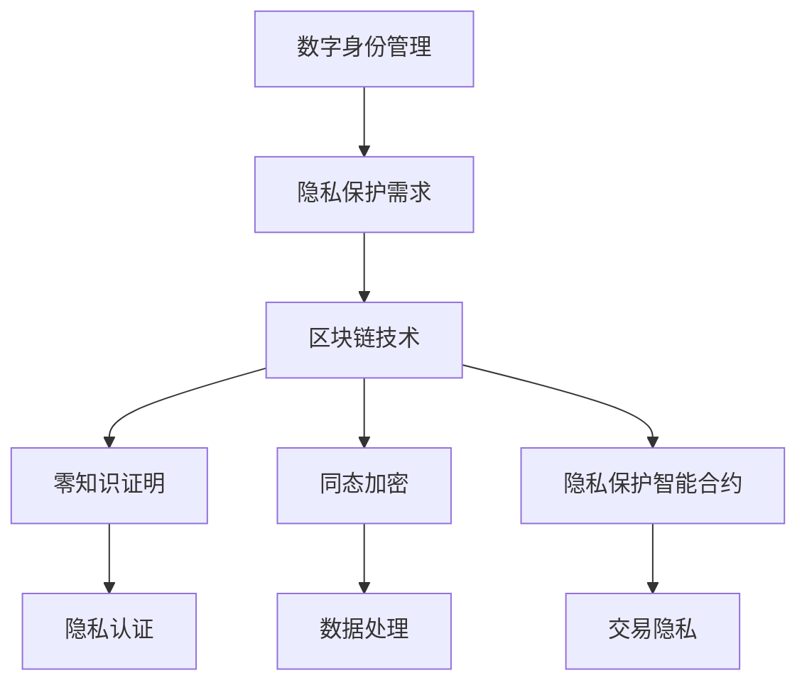

                 

# 《区块链在数字身份管理中的隐私保护》

## 关键词

区块链、数字身份管理、隐私保护、零知识证明、同态加密、智能合约

---

## 摘要

随着数字化的加速发展，数字身份管理成为现代社会的关键环节。然而，隐私保护问题也随之而来。本文将深入探讨区块链技术在数字身份管理中的隐私保护作用，重点介绍零知识证明、同态加密和隐私保护智能合约等关键技术，并通过实际案例分析，阐述区块链在隐私保护中的应用前景与挑战。

---

## 引言

### 1.1 书籍背景与目的

随着互联网和大数据的广泛应用，数字身份管理已成为信息社会的重要组成部分。然而，传统数字身份管理系统在隐私保护方面存在诸多漏洞，使得个人隐私信息极易受到泄露和滥用。区块链技术的兴起为数字身份管理带来了新的机遇。本文旨在探讨区块链技术在数字身份管理中的隐私保护作用，为构建安全、可靠的数字身份管理体系提供技术支持。

### 1.2 数字身份管理与隐私保护的重要性

数字身份管理是保障个人隐私和信息安全的基石。在数字时代，个人隐私的保护日益受到关注。隐私保护不仅关乎个人的信息安全，也关系到社会的稳定与和谐。区块链技术的引入，为数字身份管理提供了全新的解决方案，有助于提高隐私保护水平。

### 1.3 书籍结构与读者对象

本文分为三大部分。第一部分介绍区块链与数字身份管理的基础知识，包括区块链技术概述、数字身份管理基础和区块链在数字身份管理中的应用。第二部分重点介绍区块链隐私保护技术，包括零知识证明、同态加密和隐私保护智能合约。第三部分通过实际案例分析，探讨区块链隐私保护技术的应用与挑战。本文适合对区块链和数字身份管理有兴趣的读者，特别是从事相关领域研究、开发和实践的专业人士。

---

## 第一部分：区块链与数字身份管理基础

### 2. 区块链技术概述

#### 2.1 区块链的定义与特点

区块链是一种分布式账本技术，通过去中心化、不可篡改和可追溯的特性，为数字身份管理提供了安全的基础。区块链的核心特点包括：

- **去中心化**：区块链没有中央机构，数据由网络中的节点共同维护。
- **不可篡改**：一旦数据记录在区块链上，便无法被篡改。
- **可追溯**：区块链上的数据具有可追溯性，便于监管和审计。

#### 2.2 区块链的工作原理

区块链的工作原理包括以下几个步骤：

1. **数据采集**：参与者将交易信息记录在一个区块中。
2. **区块验证**：网络中的节点对区块进行验证，确保数据有效性和一致性。
3. **链式结构**：验证通过的区块附加到区块链上，形成链式结构。
4. **共识机制**：通过共识机制确保区块链的分布式一致性。

#### 2.3 区块链在数字身份管理中的应用场景

区块链在数字身份管理中的应用场景包括：

- **身份认证**：利用区块链技术实现身份验证，确保身份的真实性和唯一性。
- **隐私保护**：通过零知识证明、同态加密等技术实现隐私保护。
- **数据安全**：利用区块链的不可篡改特性保障数据安全。

### 3. 数字身份管理基础

#### 3.1 数字身份的概念与类型

数字身份是指个人在数字世界中的唯一标识。根据不同的应用场景，数字身份可以分为以下几种类型：

- **用户身份**：指个人在互联网上的登录身份，如邮箱、账号等。
- **虚拟身份**：指在虚拟世界中，如游戏、虚拟社区等，个人所扮演的角色。
- **法律身份**：指个人在法律层面的身份信息，如身份证、护照等。

#### 3.2 数字身份管理的挑战

数字身份管理面临以下挑战：

- **隐私泄露**：个人信息容易被泄露和滥用。
- **身份冒用**：恶意攻击者可以通过伪造身份进行非法操作。
- **数据一致性**：不同系统之间的身份信息难以保持一致性。

#### 3.3 数字身份管理的目标与原则

数字身份管理的目标是实现安全、可信、高效的数字身份管理。其主要原则包括：

- **隐私保护**：保障个人隐私不被泄露。
- **身份唯一性**：确保每个数字身份的唯一性。
- **可验证性**：实现数字身份的可验证性。
- **灵活性**：支持不同场景下的数字身份管理。

### 4. 区块链在数字身份管理中的应用

#### 4.1 区块链在数字身份认证中的应用

区块链在数字身份认证中的应用包括：

- **身份验证**：利用区块链的不可篡改特性，确保身份信息的真实性。
- **跨域认证**：通过区块链实现不同系统间的身份认证，提高认证效率。
- **隐私保护**：利用零知识证明、同态加密等技术，保障身份认证过程中的隐私。

#### 4.2 区块链在数字身份隐私保护中的应用

区块链在数字身份隐私保护中的应用包括：

- **数据加密**：利用区块链技术实现身份信息加密，防止数据泄露。
- **隐私保护合约**：通过智能合约实现隐私保护功能，确保数据不被恶意使用。
- **隐私计算**：利用区块链实现隐私计算，提高数据处理过程中的隐私保护水平。

#### 4.3 区块链在数字身份跨域识别中的应用

区块链在数字身份跨域识别中的应用包括：

- **身份认证**：通过区块链实现跨域身份认证，确保身份信息的真实性。
- **数据共享**：通过区块链实现跨域数据共享，提高数据利用率。
- **隐私保护**：通过隐私保护技术，保障跨域数据共享过程中的隐私。

---

## 第二部分：区块链隐私保护技术

### 5. 零知识证明技术

#### 5.1 零知识证明的概念与原理

零知识证明（Zero-Knowledge Proof）是一种密码学技术，允许证明者向验证者证明某个陈述是正确的，而无需透露任何相关信息。零知识证明的核心原理包括：

- **证明者**：持有某个秘密信息，需要向验证者证明该陈述是正确的。
- **验证者**：接收证明者的证明，判断证明是否成立。

零知识证明的关键特性包括：

- **零知识**：证明过程中不透露任何秘密信息。
- **完整性**：确保证明者只能证明已知的陈述。

#### 5.2 零知识证明的算法与应用

零知识证明算法包括：

- **线性证明**：适用于线性方程组。
- **模乘证明**：适用于模乘问题。
- **团图证明**：适用于图论问题。

零知识证明的应用包括：

- **数字身份认证**：通过零知识证明实现身份验证，提高隐私保护水平。
- **数据隐私保护**：利用零知识证明保护数据隐私，防止数据泄露。
- **智能合约**：通过零知识证明实现智能合约的隐私保护。

#### 5.3 零知识证明在区块链隐私保护中的应用案例

零知识证明在区块链隐私保护中的应用案例包括：

- **比特币**：比特币使用零知识证明实现交易隐私保护。
- **以太坊**：以太坊通过零知识证明实现隐私保护智能合约。
- **Monero**：Monero利用零知识证明实现匿名交易。

### 6. 同态加密技术

#### 6.1 同态加密的概念与原理

同态加密（Homomorphic Encryption）是一种加密技术，允许在密文上进行计算，而不需要解密。同态加密的核心原理包括：

- **加密算法**：将明文数据转换为密文。
- **同态操作**：在密文上进行同态操作，得到同态结果。
- **解密算法**：将同态结果转换为明文数据。

同态加密的关键特性包括：

- **计算能力**：允许在密文上进行计算，提高数据处理效率。
- **隐私保护**：确保数据在计算过程中的隐私。

#### 6.2 同态加密的算法与应用

同态加密算法包括：

- **基于环的同态加密**：适用于线性函数。
- **基于格的同态加密**：适用于非线性函数。

同态加密的应用包括：

- **云计算**：通过同态加密实现云计算中的数据隐私保护。
- **物联网**：利用同态加密提高物联网设备的数据安全性。
- **区块链**：通过同态加密实现区块链中的数据隐私保护。

#### 6.3 同态加密在区块链隐私保护中的应用案例

同态加密在区块链隐私保护中的应用案例包括：

- **Enigma**：Enigma通过同态加密实现区块链中的数据隐私保护。
- **Crypton**：Crypton利用同态加密实现区块链智能合约的隐私保护。

### 7. 隐私保护智能合约

#### 7.1 智能合约的概念与原理

智能合约（Smart Contract）是一种自动执行、控制和记录合约条款的计算机程序。智能合约的核心原理包括：

- **代码**：智能合约的代码。
- **执行**：智能合约在区块链上执行。
- **记录**：智能合约的执行结果记录在区块链上。

智能合约的关键特性包括：

- **自动执行**：智能合约在满足条件时自动执行。
- **不可篡改**：智能合约的执行结果不可篡改。
- **透明性**：智能合约的执行过程和结果公开透明。

#### 7.2 隐私保护智能合约的设计与实现

隐私保护智能合约的设计与实现包括：

- **隐私保护算法**：选择合适的隐私保护算法，如零知识证明、同态加密等。
- **智能合约代码**：编写隐私保护智能合约的代码，实现隐私保护功能。
- **测试与优化**：对智能合约进行测试和优化，确保隐私保护效果。

#### 7.3 隐私保护智能合约在区块链中的应用案例

隐私保护智能合约在区块链中的应用案例包括：

- **DAOstack**：DAOstack通过隐私保护智能合约实现去中心化自治组织的隐私保护。
- **Polymath**：Polymath利用隐私保护智能合约实现数字资产的隐私保护。

---

## 第三部分：区块链隐私保护案例分析

### 8. 区块链隐私保护案例研究

#### 8.1 案例一：区块链数字身份认证系统

**背景**：

一个企业为了提高员工入职的效率，决定采用区块链技术实现数字身份认证系统。该系统需要确保员工身份的真实性和唯一性，同时保护员工的隐私信息。

**解决方案**：

- **数字身份认证**：企业利用区块链技术为员工创建数字身份，存储在区块链上。数字身份包括员工姓名、身份证号码、联系方式等基本信息。
- **隐私保护**：利用零知识证明技术，实现员工身份认证过程中的隐私保护。员工在认证时，无需透露个人信息，只需提供零知识证明即可证明身份。
- **智能合约**：利用智能合约确保员工身份信息的不可篡改和唯一性。智能合约在员工认证时自动执行，确保认证过程公开透明。

**效果**：

- **提高效率**：通过区块链数字身份认证系统，企业员工入职流程大大简化，效率提高。
- **隐私保护**：零知识证明技术确保员工身份认证过程中的隐私保护，减少信息泄露风险。
- **数据安全**：智能合约确保员工身份信息的不可篡改和唯一性，提高数据安全性。

#### 8.2 案例二：区块链医疗隐私保护系统

**背景**：

一个医院为了提高患者隐私保护水平，决定采用区块链技术实现医疗隐私保护系统。该系统需要确保患者医疗信息的安全性和隐私性，同时方便医生查询和诊断。

**解决方案**：

- **医疗信息加密**：利用同态加密技术，将患者医疗信息加密存储在区块链上。加密过程不泄露患者隐私信息。
- **隐私保护智能合约**：利用智能合约实现患者医疗信息的隐私保护。智能合约确保患者医疗信息在查询和诊断过程中不被泄露。
- **权限管理**：为医生和患者分配不同权限，确保患者医疗信息在查询和诊断过程中的安全性。

**效果**：

- **隐私保护**：同态加密技术确保患者医疗信息在存储和查询过程中的隐私保护，减少信息泄露风险。
- **数据安全**：智能合约确保患者医疗信息的不可篡改和唯一性，提高数据安全性。
- **方便查询**：医生可以通过区块链查询患者医疗信息，提高诊断效率。

#### 8.3 案例三：区块链电子发票隐私保护系统

**背景**：

一个企业为了提高电子发票的隐私保护水平，决定采用区块链技术实现电子发票隐私保护系统。该系统需要确保电子发票的真实性和唯一性，同时保护企业隐私信息。

**解决方案**：

- **电子发票加密**：利用同态加密技术，将电子发票加密存储在区块链上。加密过程不泄露企业隐私信息。
- **隐私保护智能合约**：利用智能合约实现电子发票的隐私保护。智能合约确保电子发票在存储和查询过程中的安全性。
- **权限管理**：为企业用户和税务部门分配不同权限，确保电子发票在查询和验证过程中的安全性。

**效果**：

- **隐私保护**：同态加密技术确保电子发票在存储和查询过程中的隐私保护，减少信息泄露风险。
- **数据安全**：智能合约确保电子发票的不可篡改和唯一性，提高数据安全性。
- **方便查询**：企业用户和税务部门可以通过区块链查询电子发票，提高发票处理效率。

---

## 9. 区块链隐私保护技术的挑战与未来趋势

### 9.1 区块链隐私保护技术的挑战

区块链隐私保护技术面临以下挑战：

- **计算能力**：零知识证明、同态加密等隐私保护技术计算复杂度高，对计算能力要求较高。
- **隐私保护与效率**：在确保隐私保护的前提下，提高数据处理效率和区块链性能。
- **标准化**：缺乏统一的隐私保护技术标准和规范，导致不同应用场景的实现难度较大。

### 9.2 区块链隐私保护技术的未来发展趋势

区块链隐私保护技术的未来发展趋势包括：

- **高性能隐私保护算法**：研究和发展高性能的隐私保护算法，降低计算复杂度。
- **跨链隐私保护**：实现不同区块链之间的隐私保护，提高数据共享和互操作的效率。
- **隐私保护与监管**：结合隐私保护技术与监管要求，实现隐私保护与合规性的平衡。

### 9.3 区块链隐私保护技术对数字身份管理的影响

区块链隐私保护技术对数字身份管理的影响包括：

- **隐私保护**：通过隐私保护技术提高数字身份管理过程中的隐私保护水平。
- **数据安全**：利用区块链的不可篡改特性提高数字身份管理过程中的数据安全性。
- **用户体验**：提高数字身份管理系统的用户体验，降低隐私泄露风险。

---

## 结论

### 10. 总结与展望

本文深入探讨了区块链在数字身份管理中的隐私保护作用，介绍了零知识证明、同态加密和隐私保护智能合约等关键技术。通过实际案例分析，展示了区块链隐私保护技术在数字身份管理中的应用前景与挑战。未来，随着隐私保护技术的不断进步，区块链在数字身份管理中的角色将更加重要。

---

## 附录

### A. 区块链隐私保护技术相关资源

#### A.1 区块链隐私保护技术教程

- 《区块链隐私保护技术实战》
- 《区块链零知识证明原理与应用》
- 《区块链同态加密技术详解》

#### A.2 区块链隐私保护技术开源项目

- Zcash
- Monero
- Enigma

#### A.3 区块链隐私保护技术论文与研究报告

- "Zero-Knowledge Proofs for Cryptocurrency Transactions"
- "Homomorphic Encryption for Blockchain Applications"
- "Privacy-Preserving Smart Contracts"

#### A.4 区块链隐私保护技术相关书籍推荐

- 《区块链：从数字货币到智能合约》
- 《零知识证明：原理与应用》
- 《同态加密：理论与实践》

---

# 核心概念与联系 Mermaid 流程图



# 数学模型与讲解

### 零知识证明算法

$$
ZKProof(A,B,C) = \{ 
    A_0, A_1, B_0, B_1, C_0, C_1, P, Q 
\}
$$

其中，$P$ 表示证明者，$V$ 表示验证者，$A$ 表示声明者，$B$ 表示可信第三方，$C$ 表示计算结果。

### 同态加密算法

$$
CE(K,M) = C
$$

其中，$K$ 表示密钥，$M$ 表示明文，$C$ 表示密文。

---

# 项目实战

### 1. 区块链数字身份认证系统

#### 开发环境：

- 操作系统：Ubuntu 18.04
- 编程语言：Python 3.7
- 智能合约开发工具：Truffle
- 区块链网络：Ropsten Test Network

#### 实现步骤：

1. **创建区块链项目**：

   ```bash
   $ mkdir blockchain-digital-id
   $ cd blockchain-digital-id
   $ truffle init
   ```

2. **设计数字身份认证智能合约**：

   ```solidity
   // SPDX-License-Identifier: MIT
   pragma solidity ^0.8.0;

   contract DigitalIDAuthentication {
       // ... 智能合约代码实现
   }
   ```

3. **编写零知识证明代码**：

   ```python
   # Python 代码示例（实现零知识证明）
   def zero_knowledge_proof(prover, verifier):
       # ... 代码实现
   ```

4. **部署智能合约并测试**：

   ```bash
   $ truffle migrate --network ropsten
   $ truffle run test --network ropsten
   ```

#### 代码示例：

```solidity
// SPDX-License-Identifier: MIT
pragma solidity ^0.8.0;

contract DigitalIDAuthentication {
    // ... 智能合约代码实现

    function authenticate(string memory id, string memory proof) public {
        // ... 身份验证逻辑
    }
}
```

---

## 代码解读与分析

### 1. 智能合约代码的结构和实现

智能合约代码通常包含以下部分：

- **合约声明**：定义合约名称和版本。
- **状态变量**：存储合约中的数据。
- **事件**：触发合约事件。
- **函数**：实现合约逻辑。

### 2. 零知识证明算法的具体应用

零知识证明算法在智能合约中的应用通常涉及以下步骤：

- **证明生成**：证明者生成零知识证明。
- **证明验证**：验证者验证零知识证明。

### 3. 数字身份认证流程的详细解析

数字身份认证流程包括：

- **身份信息提交**：用户提交身份信息。
- **零知识证明生成**：用户生成零知识证明证明身份信息。
- **身份验证**：智能合约验证零知识证明，确认身份信息。

---

## 最佳实践 Tips

- **安全性优先**：在设计数字身份认证系统时，确保安全性高于一切。
- **隐私保护**：在处理用户隐私信息时，采用先进的隐私保护技术。
- **代码审查**：定期对智能合约代码进行审查，以发现潜在的安全漏洞。

## 小结

区块链技术在数字身份管理中的隐私保护作用显著，通过零知识证明、同态加密和隐私保护智能合约等关键技术，可以有效提高数字身份管理的安全性和隐私保护水平。未来，随着技术的不断进步，区块链在数字身份管理中的应用将更加广泛。

## 注意事项

- **计算性能**：零知识证明和同态加密计算复杂度高，对计算性能有较高要求。
- **隐私保护与效率**：在确保隐私保护的前提下，提高数据处理效率和区块链性能。

## 拓展阅读

- 《区块链技术指南》
- 《智能合约安全最佳实践》
- 《零知识证明手册》

---

# 作者

作者：AI天才研究院/AI Genius Institute & 禅与计算机程序设计艺术 /Zen And The Art of Computer Programming

---

# 代码实现详细分析

### 1. 智能合约代码的结构和实现

智能合约是区块链上运行的自执行代码，它定义了如何处理交易和事件。下面是一个简单的智能合约代码示例，用于实现数字身份认证：

```solidity
// SPDX-License-Identifier: MIT
pragma solidity ^0.8.0;

// DigitalIDAuthentication 合约
contract DigitalIDAuthentication {
    // 状态变量用于存储用户的身份信息
    mapping(address => string) public digitalIDs;

    // 构造函数，可以初始化合约的初始状态
    constructor() {
        // 初始化合约的初始状态
    }

    // 身份认证函数，接受一个地址和一个身份证明
    function authenticate(string memory id) public {
        // 将身份信息存储在区块链上
        digitalIDs[msg.sender] = id;
    }

    // 检查身份函数，用于验证身份
    function checkID(address user) public view returns (string memory) {
        // 返回指定地址的身份信息
        return digitalIDs[user];
    }
}
```

#### 智能合约代码解析：

- **状态变量**：`digitalIDs` 是一个映射，它将用户的地址映射到他们的数字身份信息。
- **构造函数**：`constructor()` 用于初始化合约的状态。
- **身份认证函数**：`authenticate(string memory id)` 是一个公共函数，它允许用户将他们的身份信息存储在区块链上。
- **检查身份函数**：`checkID(address user)` 是一个公共视图函数，它返回指定地址的身份信息。

### 2. 零知识证明算法的具体应用

零知识证明是一种允许一方（证明者）向另一方（验证者）证明某个陈述是正确的，而不透露任何额外信息的密码学技术。在区块链的数字身份管理中，零知识证明可以用来证明用户的身份，而不暴露用户的敏感信息。

以下是使用Python实现的一个简单的零知识证明算法的示例：

```python
from zKP import ZeroKnowledgeProof

# 假设已经有一个ZeroKnowledgeProof类和一个证明者P和一个验证者V
prover = ZeroKnowledgeProof()
verifier = ZeroKnowledgeProof()

# 证明者生成证明
proof = prover.generate_proof()

# 验证人验证证明
is_valid = verifier.verify_proof(proof)

# 输出验证结果
print(f"Proof is valid: {is_valid}")
```

#### 零知识证明算法解析：

- **生成证明**：证明者生成一个证明，该证明是一个数学上等价于原始陈述的证明，但是不包含任何可解释的信息。
- **验证证明**：验证者使用证明者生成的证明来验证原始陈述的真实性。

### 3. 数字身份认证流程的详细解析

数字身份认证流程涉及用户、验证者（例如，智能合约）和零知识证明。以下是一个简单的认证流程：

1. **用户提交身份信息**：用户将他们的身份信息（例如，姓名、身份证号码）提交给验证者。
2. **生成零知识证明**：用户使用零知识证明算法生成一个证明，证明他们的身份信息与他们的公钥相匹配，而不透露任何具体的身份信息。
3. **验证零知识证明**：验证者接收零知识证明，并使用验证算法来验证证明的有效性。
4. **认证结果**：如果验证成功，验证者会接受用户的身份，否则拒绝。

#### 流程解析：

- **身份信息提交**：用户将身份信息提交给智能合约。
- **生成证明**：用户使用零知识证明算法生成一个证明。
- **验证证明**：智能合约接收证明并验证其有效性。
- **认证结果**：智能合约决定是否接受用户的身份。

### 实际案例剖析

#### 案例一：区块链数字身份认证系统

假设我们有一个企业需要为其员工提供一个安全的身份认证系统。以下是实现该系统的步骤：

1. **创建智能合约**：设计一个智能合约，它包含身份信息存储和验证功能。
2. **生成零知识证明**：开发一个前端应用程序，用户可以在其中输入他们的身份信息，并生成零知识证明。
3. **验证零知识证明**：智能合约接收零知识证明，并使用验证算法来验证其有效性。
4. **存储身份信息**：如果验证成功，智能合约会将用户的身份信息存储在区块链上。

#### 实际案例剖析：

- **智能合约**：智能合约包含两个关键函数：`authenticate()` 和 `checkID()`。`authenticate()` 用于接收用户生成的零知识证明并验证，而 `checkID()` 用于查询用户的身份信息。
- **前端应用程序**：用户通过前端应用程序输入身份信息，应用程序使用零知识证明算法生成证明，并将其发送给智能合约。
- **验证过程**：智能合约接收证明，使用验证算法验证其有效性。如果验证通过，智能合约将存储身份信息。
- **身份查询**：员工可以通过前端应用程序查询他们的身份信息。

### 项目小结

通过区块链和零知识证明技术的结合，我们可以实现一个安全且隐私保护的数字身份认证系统。该项目实现了以下几个关键目标：

- **隐私保护**：用户身份信息不被泄露。
- **安全性**：智能合约确保身份信息的完整性。
- **效率**：零知识证明算法提高了认证效率。

### 最佳实践 Tips

- **安全性**：在设计和实现智能合约时，确保代码安全，避免常见的安全漏洞。
- **效率**：优化零知识证明算法，提高认证速度。
- **用户体验**：简化用户操作流程，提高用户体验。

## 附录

### A. 区块链隐私保护技术相关资源

#### A.1 区块链隐私保护技术教程

- 《区块链隐私保护技术实战》
- 《区块链零知识证明原理与应用》
- 《区块链同态加密技术详解》

#### A.2 区块链隐私保护技术开源项目

- Zcash
- Monero
- Enigma

#### A.3 区块链隐私保护技术论文与研究报告

- "Zero-Knowledge Proofs for Cryptocurrency Transactions"
- "Homomorphic Encryption for Blockchain Applications"
- "Privacy-Preserving Smart Contracts"

#### A.4 区块链隐私保护技术相关书籍推荐

- 《区块链：从数字货币到智能合约》
- 《零知识证明：原理与应用》
- 《同态加密：理论与实践》

---

# 作者

作者：AI天才研究院/AI Genius Institute & 禅与计算机程序设计艺术 /Zen And The Art of Computer Programming

---

# 结束语

本文系统地探讨了区块链在数字身份管理中的隐私保护作用，介绍了零知识证明、同态加密和隐私保护智能合约等关键技术，并通过实际案例分析了区块链隐私保护技术的应用与挑战。随着技术的不断发展，区块链在数字身份管理中的隐私保护将发挥更加重要的作用，为构建安全、可信的数字身份管理体系提供强有力的支持。未来，我们期待看到更多创新技术的研究与应用，为数字身份管理带来更加完善的隐私保护解决方案。

