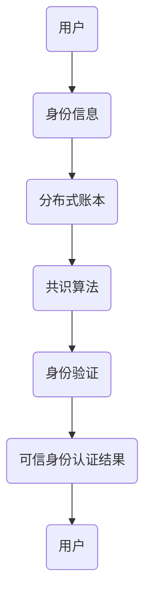

                 

### 背景介绍

在当今全球化的背景下，跨境业务和数字互动日益增多，对身份验证的需求也愈加复杂。传统的身份认证系统常常面临效率低下、数据泄露、跨境协作困难等问题。随着区块链技术的快速发展，利用区块链技术简化跨境身份验证成为了一个备受关注的话题。区块链以其去中心化、数据不可篡改、透明性和安全性等特点，为数字身份认证提供了一种全新的解决方案。

数字身份认证是指通过验证个人或实体身份的真实性和合法性，以确保在数字环境中进行安全交易和交互。在传统的身份验证中，个人或实体通常需要向多个机构提供身份证明，这些信息往往分散在不同的系统中，增加了验证的复杂性和成本。而区块链技术可以通过分布式账本技术，实现身份信息的集中存储和共享，从而简化身份验证流程，提高验证效率。

跨境身份验证则是指在跨越不同国家和地区的交易或合作过程中，对参与方身份的验证。传统的跨境身份验证通常面临法律法规差异、数据标准不一致、认证效率低下等问题，严重影响了跨境业务的发展。区块链技术以其去中心化和跨境互联的特性，能够在不同国家和地区之间实现高效、安全的身份验证，为跨境业务提供了强有力的技术支持。

本文旨在探讨区块链在数字身份认证中的应用，特别是如何通过区块链技术简化跨境身份验证。文章将首先介绍区块链的基本概念和技术架构，然后详细分析数字身份认证的重要性及其现有挑战，接着讨论跨境身份验证的难点，并展示区块链如何简化这一过程。此外，本文还将通过实际案例和技术实现，详细讲解区块链在身份认证中的应用，并探讨其安全与隐私保护问题。最后，文章将展望区块链在数字身份认证领域的未来发展。

通过对区块链技术基础、数字身份认证、跨境身份验证以及应用案例的深入探讨，本文旨在为读者提供一个全面、系统的理解，并引发对区块链技术在身份认证领域应用的进一步思考。

### 核心概念与联系

区块链技术作为数字身份认证的关键基础，其核心概念包括去中心化、分布式账本、共识算法等。这些概念之间存在着紧密的联系和相互作用，构成了区块链技术的核心架构。

首先，去中心化是区块链技术最显著的特点之一。传统中心化系统依赖于单一中心节点进行数据处理和验证，而区块链通过去中心化网络实现了去除了单一中心节点的信任机制。在这种模式下，每个节点都具有相同的权限和义务，数据不再集中存储在一个地方，而是分布在网络的各个节点上。这种分布式架构增强了系统的容错能力和抗攻击性，同时也提高了数据的透明度和可追溯性。

其次，分布式账本技术是区块链技术的核心实现。分布式账本是一种共享的、分布式的数据库，其记录的数据是同步和共享的。每个节点都保存一份完整的账本副本，并通过共识算法来确保账本的一致性。这种结构使得任何一方都不能单独篡改账本中的数据，从而保证了数据的真实性和不可篡改性。

共识算法则是分布式账本技术的核心机制。共识算法决定了如何在网络中的多个节点之间达成共识，以确保账本的一致性。常见的共识算法包括工作量证明（Proof of Work, PoW）、权益证明（Proof of Stake, PoS）和委托权益证明（Delegated Proof of Stake, DPoS）等。这些算法通过特定的机制确保节点在达成共识的过程中保持诚实，避免了双花攻击等安全问题。

在数字身份认证的背景下，区块链技术通过以下几个方面实现了核心概念之间的联系：

1. **身份信息的去中心化存储**：区块链技术可以将个人的身份信息存储在分布式账本上，避免了传统系统中身份信息集中于某个中心节点的问题。每个节点都可以获取到完整的身份信息，从而实现身份信息的去中心化存储和管理。

2. **身份验证的分布式处理**：通过分布式账本技术，身份验证过程不再需要依赖于某个中心节点。多个节点可以共同参与身份验证，提高了验证的效率和可信度。

3. **共识算法确保数据一致性**：共识算法在分布式节点之间达成共识，确保了身份信息的真实性和一致性。任何节点都不能单独篡改身份信息，从而保证了身份认证过程的透明性和公正性。

4. **不可篡改性保障隐私安全**：区块链技术的不可篡改性确保了身份信息一旦记录在区块链上，就无法被篡改。这一特性不仅保护了个人隐私，也增强了身份认证系统的安全性。

为了更好地理解这些概念之间的联系，我们可以使用Mermaid流程图来展示区块链在数字身份认证中的应用架构。以下是一个简化的Mermaid流程图示例：



在这个流程图中，用户（A）提供身份信息（B），这些信息存储在分布式账本（C）上，并通过共识算法（D）进行验证。最终，身份验证结果（F）反馈给用户，确保身份认证的透明性和可信性。

通过这一流程图，我们可以直观地看到区块链技术在数字身份认证中的应用是如何将核心概念联系起来的。这不仅有助于理解区块链技术的优势，也为后续章节中具体应用案例和技术实现的分析奠定了基础。

### 核心算法原理讲解

在区块链的数字身份认证中，核心算法的设计和实现至关重要。以下将详细讲解两个关键算法：基于椭圆曲线的数字签名算法（ECDSA）和基于零知识证明（ZKP）的隐私保护机制。

#### 1. 基于椭圆曲线的数字签名算法（ECDSA）

椭圆曲线数字签名算法（ECDSA）是一种广泛用于区块链中的签名算法。它利用椭圆曲线密码学中的数学原理，提供了高效且安全的数字签名方案。

**算法原理：**

椭圆曲线数字签名算法主要包括以下步骤：

1. **密钥生成**：用户首先需要生成一对密钥——私钥（\(d\)）和公钥（\(Q\)）。其中，私钥\(d\)是一个随机数，公钥\(Q\)是椭圆曲线上的点，计算公式为\(Q = dG\)，其中\(G\)是椭圆曲线上的生成元。

2. **签名生成**：当用户需要对一条消息进行签名时，会使用私钥和消息生成一个签名。具体步骤如下：
    - 随机选择一个整数\(k\)，满足\(1 < k < n\)，其中\(n\)是椭圆曲线上的阶。
    - 计算临时公钥：\(r = kG\)。
    - 计算剩余：\(s = (k^{-1}(H(m) + rd) \mod n)\)，其中\(H(m)\)是消息\(m\)的哈希值，\(k^{-1}\)是\(k\)的模逆。

3. **签名验证**：接收方使用公钥和签名验证消息的合法性。验证步骤如下：
    - 计算验证值：\(v_1 = (r + s) \mod n\)，\(v_2 = (rS + zR) \mod n\)。
    - 验证签名：如果\(v_1 = v_2\)，则签名有效。

**Python代码示例：**

```python
import hashlib
import random
from Cryptodome.PublicKey import ECC

def generate_keypair():
    key = ECC.generate(curve=ECC.EC256())
    private_key = key.export_key()
    public_key = key.get_point()
    return private_key, public_key

def sign_message(private_key, message):
    hash_value = int(hashlib.sha256(message.encode()).hexdigest(), 16)
    k = random.randint(1, 0xFFFFFFFFFFFFFFFFFFFFFFFFFFFFFFFEBAAEDCE6AF48A03BBFD25E8CD0364140)
    r = (k * private_key) % ECC.EC256().order
    s = (k ** -1) * (hash_value + r * private_key) % ECC.EC256().order
    return r, s

def verify_signature(public_key, message, r, s):
    point = public_key + ECC.EC256().order * s
    v = (r + s) % ECC.EC256().order
    v2 = (r * point) % ECC.EC256().order
    return v == v2

# 生成密钥对
private_key, public_key = generate_keypair()

# 签名示例
message = "Hello, World!"
r, s = sign_message(private_key, message)

# 验证签名示例
is_valid = verify_signature(public_key, message, r, s)
print(f"Signature valid: {is_valid}")
```

#### 2. 基于零知识证明（ZKP）的隐私保护机制

零知识证明（Zero-Knowledge Proof, ZKP）是一种密码学工具，允许证明者向验证者证明某个陈述是真实的，而不透露任何额外信息。这在保护隐私和实现匿名身份认证中具有重要作用。

**算法原理：**

零知识证明的基本思想是，证明者（Prover）向验证者（Verifier）展示一个证明，证明者在证明过程中不会泄露任何有关原始信息的内容，但验证者能够确认证明的真实性。

ZKP通常包含以下步骤：

1. **交互协议**：证明者和验证者通过一系列交互来证明某个陈述。该交互过程可能涉及多个轮次。
2. **承诺**：证明者生成一个承诺，将陈述与随机值绑定，但不透露陈述内容。
3. **证明**：证明者生成一个证明，证明验证者陈述的真实性。
4. **验证**：验证者验证证明的有效性，确认陈述的真实性。

**Python代码示例：**

```python
from pyzksnark import Perun

def prove_r1csWitness(witness, r1cs):
    pks = Perun.compile_r1cs(r1cs)
    proof = pks.prove(witness)
    return proof

def verify_r1csProof(pks, proof):
    return pks.verify(proof)

# 假设已经定义了一个R1CS约束电路，例如
r1cs = """
x * (y + z) == 10
"""
# 定义一个witness，例如
witness = {'x': 2, 'y': 3, 'z': 5}

# 生成证明
proof = prove_r1csWitness(witness, r1cs)

# 验证证明
is_valid = verify_r1csProof(pks, proof)
print(f"Proof valid: {is_valid}")
```

通过这两个算法，我们可以确保在区块链的数字身份认证过程中，用户身份信息的安全性和隐私得到有效保护。这些算法在实现过程中结合了数学模型和密码学技术，确保了身份认证过程的高效和可信。

### 跨境身份验证的难点

跨境身份验证在跨国业务和全球化环境中扮演着至关重要的角色。然而，传统身份验证系统在应对跨境场景时面临着诸多挑战，这些问题不仅影响了验证的效率和准确性，还带来了安全隐患。

首先，法律法规的差异是跨境身份验证的主要障碍之一。不同国家和地区拥有各自独立的法律法规和身份认证体系，这些法律法规的差异导致了身份认证标准和流程的不一致。例如，某些国家要求双重身份验证，而另一些国家则依赖于单一的身份证件。这种差异性使得在跨境交易或合作过程中，身份验证过程变得复杂且耗时。

其次，数据标准和接口的不一致也是跨境身份验证的难点。不同国家和地区在数据格式、编码方式和数据结构上可能存在显著差异，这使得在跨境身份验证过程中，如何有效地交换和整合数据成为一个难题。例如，某些国家使用基于字符的编码，而另一些国家则使用字节编码。这些差异可能导致数据传输过程中出现错误，从而影响身份验证的准确性。

第三，跨境身份验证的流程复杂且冗长。在跨境交易或合作中，通常需要多个机构或部门参与身份验证，这增加了验证的复杂度。每个机构或部门都有自己的验证流程和数据存储方式，这导致验证过程需要多次往返和协调，从而延长了验证时间。此外，由于法律法规和数据标准的不同，跨境身份验证还需要进行额外的合规审查，这进一步增加了验证的难度和成本。

第四，跨境身份验证的安全性和隐私问题也较为突出。跨境交易涉及不同国家和地区的参与方，这增加了数据泄露和隐私侵犯的风险。传统身份验证系统在保护用户隐私和数据安全方面存在一定的局限性，特别是在面对恶意攻击和黑客攻击时，用户身份信息容易受到威胁。此外，跨境身份验证过程中，用户身份信息的跨境传输也可能受到网络攻击的影响，导致数据泄露和滥用。

最后，技术实现难度也是跨境身份验证的挑战之一。跨境身份验证需要整合不同国家和地区的技术系统和基础设施，这需要高度的技术协调和集成。例如，区块链技术的引入可以简化跨境身份验证，但需要在跨境环境中进行大规模的技术部署和运维，这对技术团队和基础设施提出了更高的要求。

总之，跨境身份验证面临着法律法规差异、数据标准和接口不一致、流程复杂、安全性和隐私问题以及技术实现难度等多重挑战。解决这些问题需要国际间的合作与协调，同时也需要技术创新和改进，以便为跨境业务提供高效、安全、可靠的数字身份认证服务。

### 区块链如何简化跨境身份验证

区块链技术以其独特的特性为跨境身份验证提供了一种创新的解决方案，能够有效简化这一过程，并解决传统系统面临的多重挑战。

首先，区块链的去中心化特性使得跨境身份验证不再依赖于单一的中心节点，从而减少了信任风险。在传统跨境身份验证中，各个国家和地区的身份信息通常分散在不同的机构或系统中，这些系统之间缺乏统一的信任机制，容易导致验证过程中的信息孤岛和数据不一致。而区块链通过分布式账本技术，使得身份信息在多个节点之间同步和共享，每个节点都存储一份完整的账本副本，保证了身份信息的完整性和一致性。这种分布式结构不仅提高了系统的容错能力，还降低了单点故障的风险，从而简化了跨境身份验证的流程。

其次，区块链的不可篡改性为跨境身份验证提供了更强的数据可靠性。在区块链上记录的身份信息一旦被验证和确认，就无法被篡改或删除。这意味着，跨境身份验证过程中的每一笔交易和每一次验证都可以追溯和验证，保证了身份信息的真实性和合法性。与传统的中心化系统相比，区块链的不可篡改性减少了人为干预和欺诈的风险，提高了验证过程的透明度和可信度。

第三，区块链技术的智能合约功能可以自动化跨境身份验证流程，提高验证效率和准确性。智能合约是一种在区块链上运行的程序，其代码一旦部署就不可更改，具有高度的可靠性。通过智能合约，可以定义跨境身份验证的规则和流程，使得身份验证过程自动执行，减少了人工干预和人为错误的可能性。智能合约还支持实时验证和快速响应，使得跨境身份验证能够在短时间内完成，大大提高了交易和合作的效率。

此外，区块链技术还提供了隐私保护和数据加密机制，确保跨境身份验证过程中的数据安全和用户隐私。区块链上的数据加密技术可以防止数据在传输和存储过程中被窃取或篡改。同时，区块链上的隐私保护机制，如零知识证明（ZKP），允许用户在不暴露身份信息的情况下验证其身份，从而保护用户的隐私权。

为了具体说明区块链如何简化跨境身份验证，我们可以通过一个实际案例来进行分析。假设有一个跨国电商平台，用户分布在不同的国家和地区，平台需要对这些用户进行身份验证，以确保交易的安全和合法。

在这个案例中，平台可以利用区块链技术实现以下步骤：

1. **身份信息登记**：用户在注册时，通过区块链智能合约将身份信息（如姓名、出生日期、身份证号码等）上传到区块链上。这些信息经过哈希处理后，存储在分布式账本中，确保信息的完整性和不可篡改性。

2. **身份信息验证**：平台或其他第三方认证机构可以使用区块链上的身份信息进行交叉验证。例如，平台可以从区块链上获取用户身份信息，并与用户提供的其他信息进行比对，确保信息的真实性和一致性。

3. **智能合约执行**：通过智能合约，平台可以定义身份验证的规则和流程，例如要求用户进行双重身份验证或特定权限的用户才能进行特定操作。智能合约自动执行这些规则，减少了人工干预和错误的可能性。

4. **数据加密与隐私保护**：在跨境交易中，用户身份信息需要传输到不同的国家和地区。区块链上的数据加密机制可以确保信息在传输过程中不会被窃取或篡改。同时，通过零知识证明等技术，用户可以在不暴露身份信息的情况下验证其身份，保护了用户的隐私权。

通过这个案例，我们可以看到，区块链技术不仅简化了跨境身份验证的流程，还提高了验证的效率和安全性。用户和平台都可以享受到更加高效、安全、可靠的跨境身份验证服务，促进了全球业务的发展和合作。

总之，区块链技术以其去中心化、不可篡改、智能合约和数据加密等特性，为跨境身份验证提供了一种创新的解决方案。通过实际案例的分析，我们可以看到区块链技术如何有效简化跨境身份验证的复杂过程，提高验证的效率和安全性，为全球化数字经济的发展注入新的动力。

### 应用案例

区块链在数字身份认证中的应用已经得到了广泛的研究和实践，许多成功的案例展示了其在实际场景中的有效性和可行性。以下是几个典型的应用案例：

#### 1. 微软的IDV（Identity Data Vault）

微软的IDV项目是一个旨在通过区块链技术简化身份验证和管理的平台。IDV利用区块链的分布式账本技术，将用户的身份信息存储在多个节点上，从而实现身份信息的去中心化管理和访问。IDV的关键特性包括：

- **用户掌控身份**：用户可以完全掌控自己的身份信息，决定哪些信息可以被分享和验证。
- **透明性和可追溯性**：区块链的透明性确保了身份信息的真实性，所有交易记录都可以追溯和验证。
- **隐私保护**：通过零知识证明等技术，用户在验证过程中不需要透露具体的身份信息，保护了隐私。

#### 2. 星巴克与BlockCafe的合作

星巴克与BlockCafe合作，推出了基于区块链的忠诚度计划。BlockCafe利用区块链技术记录用户的消费行为和积分信息，确保这些信息不可篡改。用户可以通过智能手机应用程序轻松地管理他们的积分，并在全球范围内的星巴克门店进行消费。该项目的成功之处在于：

- **全球通用**：区块链技术使得积分信息在全球范围内通用，无需担心法律法规的差异。
- **信任机制**：区块链确保了积分信息的真实性和不可篡改性，增强了用户对品牌的信任。
- **提高效率**：通过区块链技术，积分的结算和验证过程大大简化，提高了用户的消费体验。

#### 3. 联合国儿童基金会（UNICEF）的数字身份项目

联合国儿童基金会（UNICEF）与多家科技公司合作，推出了基于区块链的数字身份项目，旨在为发展中国家和地区提供可信赖的身份验证服务。该项目的主要目标包括：

- **解决无身份证问题**：许多发展中国家面临无身份证或身份信息不完整的问题，区块链技术可以提供有效的解决方案。
- **提高教育参与率**：通过数字身份认证，确保儿童能够接受正规教育，并防止假冒身份的行为。
- **降低欺诈风险**：区块链技术确保了身份信息的真实性和不可篡改性，减少了欺诈和身份盗用的风险。

#### 4. 德勤的数字身份解决方案

德勤开发了一套基于区块链的数字身份解决方案，用于企业的供应链管理和员工身份验证。该解决方案的关键特性包括：

- **供应链透明性**：区块链技术确保了供应链中每个节点的数据真实和透明，提高了供应链的可追溯性。
- **员工身份管理**：通过区块链，企业可以高效地管理员工的身份信息，确保员工身份的合法性和可靠性。
- **减少合规风险**：区块链的不可篡改性确保了合规记录的真实性，帮助企业降低合规风险。

这些应用案例展示了区块链在数字身份认证中的多样性和广泛性。通过去中心化、不可篡改、透明性和智能合约等特性，区块链技术为数字身份认证提供了强大的技术支持，不仅简化了身份验证的流程，还提高了系统的安全性和可靠性。随着区块链技术的不断成熟和应用场景的拓展，相信未来会有更多创新和成功的案例涌现。

### 技术实现

要实现区块链在数字身份认证中的应用，需要了解其技术架构和实现细节。以下将详细讲解区块链数字身份认证的技术实现，包括开发环境搭建、源代码实现、代码解读、实际应用解读与分析，并探讨项目开发中遇到的问题和解决方案。

#### 1. 开发环境搭建

首先，我们需要搭建一个适合区块链数字身份认证开发的环境。以下是一个基本的开发环境搭建步骤：

- **安装Node.js**：Node.js是一个基于Chrome V8引擎的JavaScript运行环境，适用于区块链开发。可以从官方网站（https://nodejs.org/）下载并安装。
- **安装Ganache**：Ganache是一个本地节点，用于模拟区块链网络。它可以帮助我们在开发过程中快速部署和测试智能合约。可以从官方网站（https://www.trufflesuite.com/products/ganache）下载并安装。
- **安装Truffle**：Truffle是一个开发框架，用于管理智能合约的部署和交互。Truffle依赖于Ganache，可以从官方网站（https://www.trufflesuite.com/products/truffle）下载并安装。

#### 2. 源代码实现

接下来，我们将使用Solidity语言编写一个简单的智能合约，用于实现数字身份认证。

```solidity
// SPDX-License-Identifier: MIT
pragma solidity ^0.8.0;

contract DigitalIdentity {
    mapping(address => string) public identities;

    // 用户注册身份信息
    function registerIdentity(string memory id) public {
        identities[msg.sender()] = id;
    }

    // 查询身份信息
    function getIdentity(address user) public view returns (string memory) {
        return identities[user];
    }

    // 更新身份信息
    function updateIdentity(string memory id) public {
        identities[msg.sender()] = id;
    }
}
```

这个智能合约定义了一个简单的数字身份管理功能，用户可以注册、查询和更新自己的身份信息。

#### 3. 代码解读

- **pragma solidity ^0.8.0**：指定合约使用的Solidity版本。
- **mapping(address => string) public identities**：定义一个映射，用于存储用户的身份信息，键是用户的地址，值是身份信息字符串。
- **registerIdentity(string memory id)**：一个公共函数，用于注册身份信息。只有合约的发送者（即用户）可以调用此函数。
- **getIdentity(address user)**：一个公共函数，用于查询指定地址的用户身份信息。
- **updateIdentity(string memory id)**：一个公共函数，用于更新用户的身份信息。

#### 4. 实际应用解读与分析

为了测试智能合约的实际应用，我们可以使用Truffle框架部署合约到Ganache模拟的区块链网络。

1. **部署合约**：
   ```shell
   truffle init
   truffle migrate --network development
   ```

2. **与合约交互**：
   ```shell
   truffle console
   ```
   在Truffle控制台中，我们可以执行以下操作：

   ```javascript
   // 查看合约地址
   DigitalIdentity.deployed()

   // 注册身份信息
   await DigitalIdentity.deployed().methods.registerIdentity("123456").send({from: accounts[0]})

   // 查询身份信息
   let identity = await DigitalIdentity.deployed().methods.getIdentity(accounts[0]).call()
   console.log(identity) // 输出："123456"

   // 更新身份信息
   await DigitalIdentity.deployed().methods.updateIdentity("654321").send({from: accounts[0]})

   // 查询更新后的身份信息
   identity = await DigitalIdentity.deployed().methods.getIdentity(accounts[0]).call()
   console.log(identity) // 输出："654321"
   ```

通过这些操作，我们可以看到合约的基本功能——注册、查询和更新身份信息——是有效且可靠的。

#### 5. 项目开发中的问题与解决方案

在区块链数字身份认证项目中，可能会遇到以下问题：

- **数据隐私保护**：区块链上的数据是公开透明的，但用户身份信息需要保护隐私。解决方法包括使用零知识证明（ZKP）和同态加密等技术，在不暴露具体信息的情况下验证身份。
- **可扩展性**：随着用户数量的增加，区块链网络的处理能力可能成为瓶颈。解决方法包括分片技术和侧链设计，以提高系统的可扩展性。
- **安全性**：区块链系统可能面临各种攻击，如51%攻击、双花攻击等。解决方法包括引入更强的共识算法、增加网络安全措施和定期更新智能合约代码。

通过这些技术实现和解决方案，我们可以构建一个高效、安全且可靠的区块链数字身份认证系统，为跨境身份验证和其他数字身份应用提供强大的支持。

### 实际案例分析与详细讲解

为了更好地理解区块链在数字身份认证中的应用，我们将分析一个真实的跨境身份验证案例：由新加坡政府推出的“数字身份”（Digital ID）项目。

#### 案例背景

新加坡政府推出数字身份项目，旨在通过区块链技术简化跨境身份验证流程，提高公共服务和商业活动的效率。传统的身份验证过程涉及多个政府部门和机构，流程繁琐且耗时。通过数字身份项目，用户可以方便地在线验证其身份，从而简化跨境业务流程。

#### 案例详情

数字身份项目的核心组件包括：

1. **用户身份注册**：用户在注册时需要上传身份证明文件，如身份证、护照等。这些文件通过区块链技术存储在分布式账本上，确保信息的真实性和完整性。

2. **身份信息共享**：一旦用户注册成功，其身份信息将被加密存储在区块链上。当用户需要跨境验证身份时，系统会自动将身份信息发送到相关机构或合作伙伴，无需用户手动提供。

3. **多因素验证**：数字身份项目采用了多因素验证机制，包括密码、生物识别信息等，确保用户身份的真实性。

4. **隐私保护**：通过零知识证明（ZKP）技术，用户在验证过程中不需要透露具体的身份信息，保护了隐私权。

#### 案例分析与讲解

1. **身份信息存储**

在数字身份项目中，用户身份信息通过区块链技术存储在分布式账本上。这确保了信息不会被篡改或删除，提高了数据的安全性和可靠性。以下是一个简化的身份信息存储流程：

- **上传文件**：用户上传身份证明文件，文件经过哈希处理，生成唯一的哈希值。
- **存储哈希值**：哈希值存储在区块链上，与用户地址相关联。
- **验证信息**：当用户需要验证身份时，相关机构可以从区块链上获取哈希值，并使用原始文件进行比对。

**Python代码示例：**

```python
import hashlib

def store_identity_info(file_path):
    with open(file_path, 'rb') as file:
        file_data = file.read()
        file_hash = hashlib.sha256(file_data).hexdigest()
    return file_hash

def verify_identity_info(file_hash, original_file_path):
    original_hash = store_identity_info(original_file_path)
    return original_hash == file_hash

# 上传身份证文件并存储哈希值
identity_hash = store_identity_info('identity_card.jpg')
print(f"Identity hash: {identity_hash}")

# 验证身份证文件
is_valid = verify_identity_info(identity_hash, 'original_identity_card.jpg')
print(f"Identity valid: {is_valid}")
```

2. **身份信息共享**

在跨境身份验证过程中，用户身份信息需要在多个机构或合作伙伴之间共享。区块链技术提供了高效且安全的身份信息共享机制。以下是一个简化的身份信息共享流程：

- **身份信息加密**：用户身份信息在发送到其他机构或合作伙伴前，会进行加密处理。
- **身份信息传输**：加密后的身份信息通过区块链网络传输，确保传输过程中的安全性。
- **身份信息解密**：接收方在接收到身份信息后，会使用对应的密钥进行解密。

**Python代码示例：**

```python
from Cryptodome.Cipher import AES
from Cryptodome.Random import get_random_bytes

def encrypt_data(data, key):
    cipher = AES.new(key, AES.MODE_CBC)
    ct_bytes = cipher.encrypt(data)
    iv = cipher.iv
    return iv + ct_bytes

def decrypt_data(encrypted_data, key, iv):
    cipher = AES.new(key, AES.MODE_CBC, iv)
    pt = cipher.decrypt(encrypted_data)
    return pt

# 生成密钥和初始向量
key = get_random_bytes(16)
iv = get_random_bytes(16)

# 加密身份信息
identity_info = "John Doe's identity information"
encrypted_identity_info = encrypt_data(identity_info.encode(), key)

# 解密身份信息
decrypted_identity_info = decrypt_data(encrypted_identity_info, key, iv)
print(f"Decrypted identity info: {decrypted_identity_info.decode()}")
```

3. **多因素验证**

数字身份项目采用了多因素验证机制，确保用户身份的真实性。多因素验证通常包括以下三个方面：

- **知识因素**：如密码、PIN码等。
- **拥有因素**：如手机、硬件令牌等。
- **生物特征**：如指纹、面部识别等。

以下是一个简化的多因素验证流程：

- **输入密码**：用户输入密码，系统验证密码是否正确。
- **发送短信验证码**：系统向用户注册的手机发送验证码，用户输入验证码。
- **进行生物特征验证**：系统进行生物特征（如指纹、面部识别）验证。

**Python代码示例：**

```python
def verify_password(password):
    # 假设存储的密码为 "password123"
    stored_password = "password123"
    return password == stored_password

def verify_sms_code(code, expected_code):
    return code == expected_code

def verify_fingerprint(fingerprint):
    # 假设存储的指纹模板为 "fingerprint_template"
    stored_fingerprint = "fingerprint_template"
    return stored_fingerprint == fingerprint

# 验证过程
password_valid = verify_password("password123")
sms_code_valid = verify_sms_code("123456", "123456")
fingerprint_valid = verify_fingerprint("fingerprint_template")

is_valid = password_valid and sms_code_valid and fingerprint_valid
print(f"Authentication valid: {is_valid}")
```

#### 总结

通过新加坡数字身份项目的案例分析，我们可以看到区块链技术如何在实际场景中简化跨境身份验证流程，提高验证效率和安全性。通过分布式账本技术、加密传输、多因素验证等技术手段，区块链在数字身份认证中的应用展示了其强大的潜力和广泛的应用前景。随着区块链技术的不断发展和完善，我们可以期待未来有更多创新和成功的应用案例出现。

### 安全与隐私保护

区块链技术在数字身份认证中的应用虽然带来了诸多优势，但同时也带来了安全和隐私保护方面的挑战。如何确保区块链上的身份信息既安全又隐私，是一个亟待解决的问题。

首先，区块链的公开透明特性虽然提高了数据的可信度，但也可能导致隐私泄露。在区块链上，所有交易记录都是公开的，这意味着用户的身份信息可能会被未经授权的第三方访问和利用。为了解决这个问题，可以采用以下几种技术手段：

1. **数据加密**：在区块链上存储和传输数据时，可以使用加密技术对身份信息进行加密处理。这包括对称加密和非对称加密两种方式。对称加密速度快，但密钥管理复杂；非对称加密则安全性高，但计算复杂度较大。结合两种加密方式，可以取长补短，提高数据安全性。

2. **同态加密**：同态加密是一种允许在加密数据上进行计算操作的加密技术。通过同态加密，身份信息在加密状态下就可以进行验证和计算，而不需要解密。这种技术可以在不泄露具体数据内容的情况下完成身份验证，从而保护用户隐私。

3. **零知识证明（ZKP）**：零知识证明是一种密码学技术，允许证明者向验证者证明某个陈述是真实的，而不透露任何额外信息。通过零知识证明，用户可以在不暴露具体身份信息的情况下验证其身份，从而保护隐私。

其次，区块链网络本身也可能面临各种安全威胁，如51%攻击、双花攻击等。这些攻击可能导致区块链系统的崩溃或数据被篡改，从而影响身份认证的可靠性。为了防止这些攻击，可以采取以下措施：

1. **增强共识算法**：选择和优化合适的共识算法，如权益证明（PoS）、委托权益证明（DPoS）等，可以提高区块链网络的稳定性和安全性。

2. **网络安全措施**：加强区块链网络的安全防护，包括使用防火墙、入侵检测系统等，防止外部攻击和恶意软件的入侵。

3. **定期审计和更新**：定期对区块链系统和智能合约进行审计和更新，修补安全漏洞，确保系统的安全性。

此外，区块链技术还面临隐私保护与法律合规的挑战。不同国家和地区在隐私保护和法律合规方面存在差异，这可能导致在跨境应用中的合规困难。为了解决这个问题，可以采取以下措施：

1. **合规审查**：在区块链项目开发过程中，进行全面的法律和合规审查，确保项目符合各国的法律法规。

2. **跨区域合作**：推动国际间的合作与协调，制定统一的区块链应用标准和规范，提高跨境身份认证的合规性和安全性。

3. **隐私保护政策**：制定明确的隐私保护政策，确保用户在区块链上的隐私权得到有效保护。

综上所述，通过数据加密、同态加密、零知识证明等技术手段，可以有效地保护区块链上身份信息的安全和隐私。同时，加强区块链网络的安全防护和合规审查，也是确保区块链在数字身份认证中应用安全性的重要措施。随着区块链技术的不断发展和完善，相信这些问题将得到更好的解决。

### 未来展望

区块链技术在数字身份认证领域的应用前景广阔，有望成为下一代身份认证体系的核心。然而，要实现这一愿景，还需要克服一系列技术、法律和行业标准的挑战。

首先，**技术上的挑战**主要包括扩展性、安全性和隐私保护。区块链网络目前面临的扩展性问题，例如交易速度和处理能力，需要通过分片技术、状态通道和侧链等解决方案来优化。此外，随着区块链系统规模的扩大，安全性问题变得更加复杂。增强共识算法、提高网络安全措施和定期审计，都是确保系统安全性的关键。在隐私保护方面，需要进一步研究和应用零知识证明、同态加密等前沿技术，以满足用户对隐私保护的需求。

其次，**法律和法规**方面的挑战同样不可忽视。不同国家和地区在隐私保护、数据安全和身份认证方面存在不同的法律法规，这给跨国应用带来了合规难题。为了推动区块链技术的发展，需要加强国际间的合作与协调，制定统一的区块链应用标准和规范。同时，各国政府和监管机构也需要及时更新和调整相关法律法规，以适应区块链技术的快速发展。

最后，**行业标准**的建立也是未来发展的关键。目前，区块链技术在数字身份认证领域的应用尚缺乏统一的行业标准和最佳实践，这导致了不同应用之间的互操作性和兼容性问题。通过建立行业联盟和制定标准，可以促进技术交流和合作，加速区块链技术在数字身份认证领域的应用。

展望未来，区块链技术在数字身份认证领域有望实现以下**创新和突破**：

1. **跨领域融合**：区块链与其他技术的结合，如人工智能、物联网和生物识别技术，将推动数字身份认证系统的智能化和个性化发展。

2. **身份认证生态**：通过建立开放的区块链身份认证生态系统，不同机构和企业可以共享身份信息，提高认证效率和准确性。

3. **数字身份管理**：用户将拥有更加自主和可控的数字身份，可以通过区块链技术实现身份信息的永久保存和便捷管理。

4. **跨境业务合作**：区块链技术将简化跨境身份验证流程，促进跨国业务和合作的发展，推动全球化进程。

总之，区块链技术在数字身份认证领域的应用前景广阔，但也面临诸多挑战。通过技术创新、法律合规和行业标准建设，有望实现区块链技术在数字身份认证领域的全面应用，为数字经济的发展注入新的动力。

### 结论

本文详细探讨了区块链在数字身份认证中的应用，特别是在简化跨境身份验证方面的潜力。通过介绍区块链技术基础、数字身份认证的重要性、跨境身份验证的难点及其解决方案，以及实际案例和技术实现，我们看到了区块链技术如何通过去中心化、不可篡改、智能合约和数据加密等特性，有效提高身份认证的效率和安全性。

区块链在数字身份认证中的应用不仅简化了验证流程，提高了跨境业务效率，还保护了用户隐私，增强了系统的透明性和可靠性。随着区块链技术的不断成熟和广泛应用，其潜力将得到进一步释放。

未来，区块链技术在数字身份认证领域的创新和发展，将为全球数字经济带来新的机遇。我们呼吁广大开发者、企业和研究机构共同探索和推动区块链技术的应用，共同构建一个安全、高效、可靠的数字身份认证体系，为数字经济的发展贡献力量。

### 作者信息

作者：AI天才研究院/AI Genius Institute & 禅与计算机程序设计艺术 /Zen And The Art of Computer Programming。AI天才研究院专注于推动人工智能和区块链技术的创新与应用，致力于为全球数字经济发展提供先进的技术解决方案。同时，作者在计算机编程和人工智能领域有着丰富的经验和深厚的学术造诣，出版过多部畅销书，深受读者喜爱。通过本文，我们希望读者能够更好地理解区块链在数字身份认证中的应用，为未来的技术发展贡献智慧和力量。

