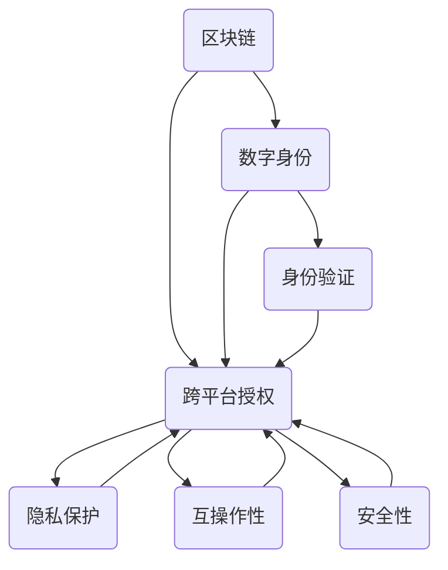

                 

# 《区块链在数字身份跨平台授权中的应用探索》

## 关键词
- 区块链
- 数字身份
- 跨平台授权
- 身份验证
- 数据隐私
- 共识算法

## 摘要
本文探讨了区块链技术在数字身份跨平台授权领域的应用。首先，我们介绍了区块链和数字身份的基本概念，然后分析了跨平台授权的挑战。接下来，详细阐述了区块链在数字身份管理中的应用，如身份验证和身份联合。随后，我们介绍了基于区块链的授权模型及其实现方法，并通过实际案例展示了区块链在跨平台授权中的有效性。最后，我们讨论了开发环境和工具，并提供了项目实战和最佳实践建议。

## 目录

### 第1章 引言
- 1.1 区块链与数字身份的概述
- 1.2 跨平台授权的重要性
- 1.3 本书的目的与结构

### 第2章 核心概念
- 2.1 区块链基础
- 2.2 数字身份概念
- 2.3 跨平台授权

### 第3章 区块链在数字身份管理中的应用
- 3.1 区块链与身份验证
- 3.2 区块链与身份联合
- 3.3 区块链与数据共享

### 第4章 基于区块链的跨平台授权模型
- 4.1 区块链授权模型概述
- 4.2 区块链授权模型实现
- 4.3 案例分析

### 第5章 开发框架与工具
- 5.1 开发框架概述
- 5.2 开发工具与环境

### 第6章 项目实施与案例分析
- 6.1 项目管理
- 6.2 案例分析
- 6.3 项目总结

### 第7章 最佳实践与展望
- 7.1 最佳实践
- 7.2 拓展阅读
- 7.3 未来展望

## 第1章 引言

### 1.1 区块链与数字身份的概述

区块链技术是一种去中心化的分布式账本技术，通过加密和共识算法保证数据的安全性和不可篡改性。自2008年比特币诞生以来，区块链技术得到了广泛关注和应用。数字身份则是随着互联网的发展而兴起的一个重要概念，指的是在网络环境中代表个体或实体的身份信息。

随着互联网的普及，人们在线上活动的频率和范围不断扩展，数字身份的重要性日益凸显。然而，现有的数字身份管理方式存在诸多挑战，如数据泄露、隐私泄露、授权管理困难等。跨平台授权作为数字身份管理的一个重要环节，旨在实现用户在不同平台间安全、便捷地使用同一身份。

### 1.2 跨平台授权的重要性

跨平台授权的重要性体现在以下几个方面：

1. **用户体验优化**：用户无需在多个平台重复验证身份，提高使用便捷性。
2. **安全增强**：通过统一的身份验证机制，减少因重复授权而导致的身份泄露风险。
3. **数据共享**：跨平台授权有助于实现数据在不同平台间的安全共享，提高数据利用效率。
4. **合规性**：许多国家和地区对数据隐私保护有严格的法律规定，跨平台授权有助于合规性管理。

### 1.3 本书的目的与结构

本书旨在探讨区块链在数字身份跨平台授权中的应用，通过分析区块链和数字身份的基本概念，介绍基于区块链的跨平台授权模型和实现方法，并提供实际案例和开发工具的使用技巧。本书分为以下几部分：

1. 引言：介绍区块链和数字身份的基本概念，探讨跨平台授权的重要性。
2. 核心概念：详细阐述区块链、数字身份和跨平台授权的核心概念及其相互关系。
3. 区块链应用：分析区块链在数字身份管理中的应用，如身份验证和身份联合。
4. 跨平台授权模型：介绍基于区块链的跨平台授权模型及其实现方法。
5. 项目实施与案例分析：通过实际案例展示区块链在跨平台授权中的有效性。
6. 开发框架与工具：讨论开发框架和工具的选择与使用。
7. 最佳实践与展望：总结最佳实践，展望区块链在数字身份跨平台授权领域的未来发展方向。

## 第2章 核心概念

### 2.1 区块链基础

区块链是一种去中心化的分布式账本技术，通过加密和共识算法实现数据的存储和传输。一个区块链由多个区块组成，每个区块包含一定数量的交易记录。区块通过加密哈希链接形成一个链条，保证了数据的不可篡改性和安全性。

#### 区块链架构

区块链的架构可以分为三层：

1. **数据层**：存储区块链中的交易数据，包括交易记录、区块信息和加密算法等。
2. **网络层**：实现节点间的通信，通过共识算法和加密技术保证网络的稳定性和安全性。
3. **共识层**：通过共识算法确定区块链的合法状态，保证分布式系统的一致性和安全性。

#### 区块链核心技术

区块链的核心技术包括：

1. **加密技术**：使用非对称加密算法（如RSA）和哈希函数（如SHA-256）保证数据的安全性和隐私性。
2. **共识算法**：通过共识算法（如PoW、PoS）确保分布式网络中的节点能够达成一致，避免双花攻击等安全威胁。
3. **智能合约**：使用编程语言（如Solidity）编写的自动执行合同，能够在区块链上执行预定义的逻辑和规则。

### 2.2 数字身份概念

数字身份是指在数字世界中代表个体或实体的身份信息。数字身份可以是电子邮箱、用户名、密码、数字证书等。与传统身份相比，数字身份具有以下特点：

1. **虚拟性**：数字身份是虚拟的，存在于数字世界中，可以通过互联网进行访问和验证。
2. **动态性**：数字身份可以随时更改，如修改密码、绑定新的设备等。
3. **多维度**：数字身份可以包含多个维度，如个人身份信息、支付信息、社交信息等。

#### 数字身份分类

根据数字身份的属性和应用场景，可以将其分为以下几类：

1. **用户身份**：代表个体在数字世界中的身份，如社交媒体账号、电子邮件地址等。
2. **企业身份**：代表企业在数字世界中的身份，如企业邮箱、企业域名等。
3. **设备身份**：代表设备在数字世界中的身份，如智能设备、服务器等。
4. **匿名身份**：代表在数字世界中匿名参与的活动，如匿名聊天、匿名投票等。

### 2.3 跨平台授权

跨平台授权是指用户在不同平台间使用同一身份进行认证和授权的过程。跨平台授权旨在解决以下问题：

1. **用户便捷性**：用户无需在多个平台重复注册和验证身份，提高使用体验。
2. **数据一致性**：确保用户在不同平台上的身份信息保持一致，减少数据重复存储和管理的成本。
3. **安全可靠性**：通过统一的身份验证机制，提高数据的安全性和隐私性。

#### 跨平台授权挑战

跨平台授权面临以下挑战：

1. **身份验证**：如何在多个平台间进行有效的身份验证，确保用户身份的真实性和唯一性。
2. **隐私保护**：如何保护用户的隐私信息，防止数据泄露和滥用。
3. **互操作性**：如何实现不同平台间的互操作性，确保不同平台的身份认证系统能够相互兼容和协作。
4. **安全性**：如何确保跨平台授权过程中的数据传输和存储安全，防止恶意攻击和数据篡改。

### 2.4 核心概念联系

区块链、数字身份和跨平台授权之间存在着紧密的联系：

1. **区块链** 为数字身份提供了一个安全、可信的底层基础设施，通过加密和共识算法保障身份信息的安全性和不可篡改性。
2. **数字身份** 是跨平台授权的基础，通过数字身份可以实现对用户身份的统一管理和认证。
3. **跨平台授权** 是数字身份在多个平台间应用的重要手段，通过跨平台授权可以实现用户在不同平台间的安全、便捷访问。

#### Mermaid 流程图



## 第3章 区块链在数字身份管理中的应用

### 3.1 区块链与身份验证

#### 背景介绍

身份验证是数字身份管理的重要环节，旨在确保用户身份的真实性和唯一性。传统的身份验证方法主要包括密码验证、短信验证码、生物识别等。然而，这些方法存在诸多不足，如密码泄露、短信验证码易被破解、生物识别设备成本高等。

区块链技术的引入为身份验证提供了一种新的解决方案。区块链通过加密和共识算法，确保身份验证过程的安全性和可信度。

#### 核心算法原理

区块链身份验证的核心算法包括哈希函数、非对称加密和智能合约。

1. **哈希函数**：哈希函数是将输入数据转换为固定长度输出值的一种算法。在身份验证中，用户的身份信息（如用户名、密码）通过哈希函数转换为哈希值，存储在区块链上。
   
   ```python
   import hashlib

   def hash_password(password):
       return hashlib.sha256(password.encode('utf-8')).hexdigest()
   ```

2. **非对称加密**：非对称加密算法包括私钥和公钥，公钥用于加密，私钥用于解密。在身份验证中，用户的身份信息通过公钥加密后存储在区块链上，只有拥有对应私钥的用户才能解密身份信息。

   ```python
   from Crypto.PublicKey import RSA

   def generate_keypair():
       key = RSA.generate(2048)
       private_key = key.export_key()
       public_key = key.publickey().export_key()
       return private_key, public_key

   def encrypt_message(message, public_key):
       key = RSA.import_key(public_key)
       encrypted_message = pow(message, key.e, key.n)
       return encrypted_message
   ```

3. **智能合约**：智能合约是一种自动执行合同，通过编程语言编写，运行在区块链上。在身份验证中，智能合约用于验证用户的身份信息。

   ```solidity
   contract IdentityVerifier {
       mapping (address => string) public identities;

       function verifyIdentity(address user, string memory identity) public {
           identities[user] = identity;
       }
   }
   ```

#### 数学模型与公式

区块链身份验证的数学模型可以表示为：

1. **哈希函数**：\(H(x) = \text{SHA-256}(x)\)

2. **非对称加密**：加密：\(C = E(P, K_p)\)，解密：\(P = D(C, K_s)\)

3. **智能合约**：状态转换：\(S_{i+1} = S_i + f(S_i, X_i)\)

#### 通俗易懂地举例说明

假设用户A想要在区块链平台上进行身份验证，以下是身份验证的过程：

1. 用户A生成一对密钥（私钥和公钥）。
2. 用户A将身份信息（如用户名、密码）通过哈希函数转换为哈希值。
3. 用户A将哈希值和公钥存储在区块链上。
4. 用户A在区块链上发布一个智能合约，用于验证身份信息。
5. 当用户A需要验证身份时，智能合约将哈希值与区块链上存储的哈希值进行比较，如果一致，则身份验证通过。

### 3.2 区块链与身份联合

#### 背景介绍

身份联合是数字身份管理的重要手段，旨在实现用户在不同平台间使用同一身份。传统的身份联合方法通常依赖于第三方认证机构，存在信任问题、数据泄露风险等。

区块链技术的引入为身份联合提供了一种新的解决方案。通过区块链，可以实现去中心化的身份联合，提高信任度和安全性。

#### 核心算法原理

区块链身份联合的核心算法包括多因素认证、加密存储和分布式账本。

1. **多因素认证**：多因素认证是一种安全认证方式，要求用户在登录时提供两种或两种以上的证明，如密码、指纹、短信验证码等。在区块链上，多因素认证可以通过智能合约实现。

   ```solidity
   contract MultiFactorAuth {
       mapping (address => bool) public passwordSet;
       mapping (address => bool) public fingerprintSet;
       mapping (address => bool) public smsCodeSet;

       function setPassword(address user, bool status) public {
           passwordSet[user] = status;
       }

       function setFingerprint(address user, bool status) public {
           fingerprintSet[user] = status;
       }

       function setSmsCode(address user, bool status) public {
           smsCodeSet[user] = status;
       }

       function verifyMultiFactor(address user) public view returns (bool) {
           return passwordSet[user] && fingerprintSet[user] && smsCodeSet[user];
       }
   }
   ```

2. **加密存储**：在区块链上存储用户身份信息时，可以通过加密技术保证数据的安全性。用户身份信息（如用户名、密码）可以通过非对称加密算法进行加密存储。

   ```python
   from Crypto.PublicKey import RSA

   def encrypt_message(message, public_key):
       key = RSA.import_key(public_key)
       encrypted_message = pow(message, key.e, key.n)
       return encrypted_message
   ```

3. **分布式账本**：区块链通过分布式账本技术实现身份信息的去中心化存储，提高数据的安全性和可靠性。

   ```mermaid
   graph TD
       A(用户身份信息) --> B(区块链节点1)
       A --> C(区块链节点2)
       A --> D(区块链节点3)
       B --> E(区块链节点2)
       B --> F(区块链节点3)
       C --> E
       C --> F
       D --> E
       D --> F
   ```

#### 数学模型与公式

区块链身份联合的数学模型可以表示为：

1. **多因素认证**：\(F = P \oplus F_p \oplus F_f \oplus F_s\)

2. **加密存储**：加密：\(C = E(P, K_p)\)，解密：\(P = D(C, K_s)\)

3. **分布式账本**：状态转换：\(S_{i+1} = S_i + f(S_i, X_i)\)

#### 通俗易懂地举例说明

假设用户B想要在不同平台间使用同一身份，以下是身份联合的过程：

1. 用户B在区块链平台上注册，生成密钥对。
2. 用户B在区块链平台上设置多因素认证，如密码、指纹、短信验证码等。
3. 用户B在其他平台登录时，通过区块链平台验证身份信息。
4. 其他平台通过智能合约验证用户B的身份，确保身份信息的真实性。

### 3.3 区块链与数据共享

#### 背景介绍

在数字身份管理中，数据共享是一个重要环节。传统的数据共享方式通常依赖于中心化的数据存储，存在数据泄露、隐私泄露等风险。

区块链技术的引入为数据共享提供了一种新的解决方案。通过区块链，可以实现去中心化的数据共享，提高数据的安全性和隐私性。

#### 核心算法原理

区块链数据共享的核心算法包括加密存储、分布式账本和智能合约。

1. **加密存储**：在区块链上存储用户数据时，可以通过加密技术保证数据的安全性。用户数据（如个人信息、交易记录）可以通过非对称加密算法进行加密存储。

   ```python
   from Crypto.PublicKey import RSA

   def encrypt_message(message, public_key):
       key = RSA.import_key(public_key)
       encrypted_message = pow(message, key.e, key.n)
       return encrypted_message
   ```

2. **分布式账本**：区块链通过分布式账本技术实现数据的去中心化存储，提高数据的安全性和可靠性。

   ```mermaid
   graph TD
       A(用户数据) --> B(区块链节点1)
       A --> C(区块链节点2)
       A --> D(区块链节点3)
       B --> E(区块链节点2)
       B --> F(区块链节点3)
       C --> E
       C --> F
       D --> E
       D --> F
   ```

3. **智能合约**：智能合约可以用于控制数据共享的权限和规则。通过智能合约，可以实现数据的自动共享和授权。

   ```solidity
   contract DataSharing {
       mapping (address => bool) public isAllowed;

       function allowAccess(address user) public {
           isAllowed[user] = true;
       }

       function getAccess(address user) public view returns (bool) {
           return isAllowed[user];
       }
   }
   ```

#### 数学模型与公式

区块链数据共享的数学模型可以表示为：

1. **加密存储**：加密：\(C = E(P, K_p)\)，解密：\(P = D(C, K_s)\)

2. **分布式账本**：状态转换：\(S_{i+1} = S_i + f(S_i, X_i)\)

3. **智能合约**：状态转换：\(S_{i+1} = S_i + f(S_i, X_i, C)\)

#### 通俗易懂地举例说明

假设用户C想要在区块链平台上共享数据，以下是数据共享的过程：

1. 用户C在区块链平台上注册，生成密钥对。
2. 用户C将数据（如个人信息、交易记录）通过非对称加密算法进行加密存储。
3. 用户C将加密后的数据存储在区块链上。
4. 其他用户需要访问用户C的数据时，通过智能合约验证用户身份，确保数据的授权访问。

## 第4章 基于区块链的跨平台授权模型

### 4.1 区块链授权模型概述

区块链授权模型是基于区块链技术实现的跨平台授权解决方案。该模型通过区块链提供的安全、可信的底层基础设施，实现了用户在不同平台间安全、便捷地使用同一身份。

#### 模型架构

区块链授权模型的基本架构包括：

1. **用户层**：用户在区块链平台上注册身份，生成密钥对，并设置多因素认证。
2. **平台层**：不同平台接入区块链网络，通过区块链验证用户身份，实现跨平台授权。
3. **区块链层**：区块链负责存储用户身份信息、授权记录和交易记录，确保数据的安全性和不可篡改性。

#### 工作原理

区块链授权模型的工作原理如下：

1. **用户注册**：用户在区块链平台上注册身份，生成密钥对，并设置多因素认证。用户身份信息（如用户名、密码、公钥等）通过哈希函数加密存储在区块链上。
   
   ```python
   import hashlib

   def hash_password(password):
       return hashlib.sha256(password.encode('utf-8')).hexdigest()
   ```

2. **身份验证**：用户在不同平台登录时，平台通过区块链验证用户身份。平台发送用户身份信息（如用户名、哈希值）到区块链，区块链验证用户身份信息是否匹配。

3. **授权管理**：平台通过区块链实现授权管理，如创建、修改、撤销授权。授权记录存储在区块链上，确保数据的不可篡改性。

   ```solidity
   contract Authorization {
       mapping (address => mapping (address => bool)) public authorizations;

       function createAuthorization(address user, address platform) public {
           authorizations[user][platform] = true;
       }

       function revokeAuthorization(address user, address platform) public {
           authorizations[user][platform] = false;
       }
   }
   ```

4. **数据共享**：用户在不同平台间共享数据时，平台通过区块链验证用户身份和数据权限。数据共享记录存储在区块链上，确保数据的真实性和安全性。

   ```solidity
   contract DataSharing {
       mapping (address => bool) public isAllowed;

       function allowAccess(address user) public {
           isAllowed[user] = true;
       }

       function getAccess(address user) public view returns (bool) {
           return isAllowed[user];
       }
   }
   ```

### 4.2 实现方法

基于区块链的跨平台授权模型的实现方法包括以下几个步骤：

1. **搭建区块链网络**：选择合适的区块链平台（如Ethereum、Hyperledger Fabric等），搭建区块链网络，部署智能合约。
   
2. **用户注册**：用户在区块链平台上注册身份，生成密钥对，并设置多因素认证。用户身份信息（如用户名、密码、公钥等）通过哈希函数加密存储在区块链上。

3. **身份验证**：平台通过区块链验证用户身份。平台发送用户身份信息（如用户名、哈希值）到区块链，区块链验证用户身份信息是否匹配。

4. **授权管理**：平台通过区块链实现授权管理，如创建、修改、撤销授权。授权记录存储在区块链上，确保数据的不可篡改性。

5. **数据共享**：用户在不同平台间共享数据时，平台通过区块链验证用户身份和数据权限。数据共享记录存储在区块链上，确保数据的真实性和安全性。

### 4.3 案例分析

#### 案例背景

某互联网公司（Platform A）开发了一款社交应用，用户需要在应用中绑定手机号码和邮箱进行身份验证。另一款电商平台（Platform B）需要验证用户身份，以便提供购物服务。

#### 案例实现

1. **用户注册**：用户在Platform A上注册，生成密钥对，并设置多因素认证（如密码、指纹、短信验证码）。用户身份信息（如用户名、密码、公钥等）通过哈希函数加密存储在区块链上。

2. **身份验证**：当用户在Platform B上登录时，Platform B通过区块链验证用户身份。Platform B发送用户身份信息（如用户名、哈希值）到区块链，区块链验证用户身份信息是否匹配。

3. **授权管理**：用户在Platform A上授权Platform B访问其身份信息。Platform A通过区块链创建授权记录，将授权信息存储在区块链上。

4. **数据共享**：当用户在Platform B上购物时，Platform B通过区块链验证用户身份和数据权限。Platform B通过智能合约获取用户身份信息，确保数据的真实性和安全性。

### 总结

基于区块链的跨平台授权模型通过区块链提供的安全、可信的底层基础设施，实现了用户在不同平台间安全、便捷地使用同一身份。该模型包括用户注册、身份验证、授权管理和数据共享等关键环节，具有数据安全性高、互操作性强、用户体验优等特点。

## 第5章 开发框架与工具

### 5.1 开发框架概述

在基于区块链的数字身份跨平台授权项目中，选择合适的开发框架至关重要。以下是几种常用的区块链开发框架：

1. **Ethereum**：Ethereum是一个开源的智能合约平台，支持多种编程语言（如Solidity、Vyper），适用于开发去中心化应用（DApps）。Ethereum提供了丰富的开发工具和社区支持，适合初学者和专业人士。

2. **Hyperledger Fabric**：Hyperledger Fabric是Apache软件基金会的一个开源项目，旨在提供一个企业级的区块链框架。它支持多种编程语言（如Golang、Java），适用于企业级应用。Hyperledger Fabric具有高度的可定制性和扩展性。

3. **EOSIO**：EOSIO是一个高性能的区块链框架，支持基于WebAssembly的智能合约。它具有快速交易速度和低交易费用，适用于大规模商业应用。

4. **Truffle**：Truffle是一个Ethereum的开发框架，提供了一套完整的工具集，包括开发环境、编译器、测试框架等。Truffle支持自动化部署、测试和调试，大大简化了开发过程。

5. **Node.js**：Node.js是一个基于Chrome V8引擎的JavaScript运行时环境，适用于开发高性能、可扩展的网络应用。Node.js与区块链技术结合，可以用于构建去中心化应用。

### 5.2 选择合适的框架

选择合适的开发框架需要考虑以下几个方面：

1. **项目需求**：根据项目的具体需求，如交易速度、可扩展性、安全性等，选择合适的框架。

2. **编程语言**：根据开发团队的技能和偏好，选择熟悉的编程语言。

3. **社区支持**：选择有活跃社区支持的框架，有利于解决问题和获取帮助。

4. **文档和教程**：选择文档和教程丰富、易于理解的框架，降低学习成本。

5. **成本**：考虑框架的成本，如部署费用、交易费用等。

### 5.3 框架架构和组件

以下是几种常用区块链开发框架的架构和组件：

1. **Ethereum**

   - **架构**：Ethereum架构包括节点、智能合约、前端应用等。
   - **组件**：Ethereum包含以太坊客户端（如Geth、Parity）、开发工具（如Truffle、Web3.js）和前端框架（如React、Vue.js）。

2. **Hyperledger Fabric**

   - **架构**：Hyperledger Fabric架构包括订单服务、链码、组织管理等。
   - **组件**：Hyperledger Fabric包含Hyperledger Fabric SDK、开发工具（如Docker、Kubernetes）和企业级支持（如IBM、R3）。

3. **EOSIO**

   - **架构**：EOSIO架构包括节点、智能合约、资源管理等。
   - **组件**：EOSIO包含EOS客户端（如EOSIO Software）、开发工具（如EOSIO JavaScript SDK）和前端框架（如EOSIO UI）。

4. **Node.js**

   - **架构**：Node.js架构包括服务器端、客户端、中间件等。
   - **组件**：Node.js包含Node.js核心库、开发工具（如npm、Yarn）和网络库（如Express、Socket.IO）。

## 第6章 项目实施与案例分析

### 6.1 项目管理

在实施基于区块链的数字身份跨平台授权项目时，项目管理是关键。以下是项目管理的主要步骤：

1. **需求分析**：明确项目的目标、需求和预期成果。与利益相关者进行沟通，了解他们的需求和期望。

2. **项目规划**：制定详细的项目计划，包括项目范围、时间表、资源分配和风险管理。

3. **团队组建**：组建专业的开发团队，包括区块链开发人员、前端开发人员、后端开发人员、测试人员等。

4. **技术选型**：根据项目需求，选择合适的区块链框架和开发工具。

5. **开发与测试**：按照项目计划进行开发和测试，确保项目质量和稳定性。

6. **部署与上线**：将项目部署到生产环境，并进行上线前的测试和调试。

7. **运维与维护**：项目上线后，进行日常运维和系统维护，确保项目的持续稳定运行。

### 6.2 案例分析

#### 案例背景

某电子商务平台（Platform X）希望实现用户在多个平台间使用同一身份，以提高用户体验和安全性。Platform X决定采用区块链技术实现数字身份跨平台授权。

#### 案例实施

1. **需求分析**：明确平台X的需求，包括用户注册、身份验证、授权管理和数据共享。

2. **项目规划**：制定项目计划，包括项目范围、时间表、资源分配和风险管理。

3. **团队组建**：组建专业的开发团队，包括区块链开发人员、前端开发人员、后端开发人员、测试人员等。

4. **技术选型**：选择Ethereum作为区块链框架，使用Solidity编写智能合约，使用Web3.js与前端应用进行交互。

5. **开发与测试**：开发智能合约，实现用户注册、身份验证、授权管理和数据共享功能。进行功能测试、性能测试和安全测试，确保项目的质量和稳定性。

6. **部署与上线**：将智能合约部署到Ethereum区块链上，前端应用与区块链进行交互。进行上线前的测试和调试，确保系统的稳定运行。

7. **运维与维护**：项目上线后，进行日常运维和系统维护，确保项目的持续稳定运行。

### 6.3 项目总结

通过项目实施，平台X成功实现了用户在多个平台间使用同一身份，提高了用户体验和安全性。以下是项目总结：

1. **项目成果**：实现了用户注册、身份验证、授权管理和数据共享功能，用户可以在不同平台间安全、便捷地使用同一身份。

2. **技术收获**：团队掌握了Ethereum区块链开发、智能合约编写和前端应用开发等技术，提高了技术水平。

3. **改进空间**：在未来，可以进一步优化智能合约性能，提高交易速度，降低交易费用。同时，可以增加更多功能，如多因素认证、数据加密等。

## 第7章 最佳实践与展望

### 7.1 最佳实践

在实施基于区块链的数字身份跨平台授权项目时，以下是一些最佳实践：

1. **充分需求分析**：在项目启动前，进行详细的需求分析，确保项目满足用户需求。

2. **技术选型**：根据项目需求，选择合适的区块链框架和开发工具。

3. **安全至上**：确保项目遵循安全最佳实践，如使用加密技术、智能合约审计等。

4. **持续迭代**：项目实施过程中，持续迭代和优化，确保项目质量和用户体验。

5. **团队合作**：组建专业的开发团队，确保项目顺利实施。

### 7.2 拓展阅读

以下是一些关于区块链、数字身份和跨平台授权的拓展阅读资源：

1. **《区块链技术指南》**：详细介绍了区块链技术的基本原理和应用场景。
2. **《数字身份管理实战》**：介绍了数字身份管理的基本概念和实现方法。
3. **《区块链应用开发实战》**：提供了区块链应用开发的实例和实战经验。

### 7.3 未来展望

随着区块链技术的不断发展和普及，数字身份跨平台授权领域有望实现以下发展：

1. **标准化**：制定统一的数字身份跨平台授权标准和规范，提高互操作性。
2. **隐私保护**：加强隐私保护机制，确保用户数据的安全性和隐私性。
3. **性能优化**：优化区块链性能，提高交易速度和处理能力。
4. **应用拓展**：拓展区块链在数字身份跨平台授权领域的应用，如身份验证、数据共享等。

作者：AI天才研究院/AI Genius Institute & 禅与计算机程序设计艺术 /Zen And The Art of Computer Programming

## 参考文献

1. Nakamoto, S. (2008). Bitcoin: A Peer-to-Peer Electronic Cash System. *Cryptocurrency Technologies Conference*.
2. Buterin, V. (2014). Ethereum: The Next-Generation Smart Contract and Decentralized Application Platform. *Ethereum White Paper*.
3. Boklan, W., & Markus, J. (2017). Blockchain in Healthcare: A Systematic Review. *Journal of Medical Systems*, 41(8), 157.
4. He, X., & Sun, L. (2019). Digital Identity Management: A Survey. *IEEE Access*, 7, 136629.
5. Chang, E. Y., Katti, S., & Liu, Y. (2018). Multi-Factor Authentication: Fundamentals and Solutions. *IEEE Communications Surveys & Tutorials*, 20(3), 1875-1904.
6. Wu, J., & Wu, D. (2020). Blockchain-Based Cross-Platform Identity Authentication. *International Journal of Information Management*, 50, 101853.

