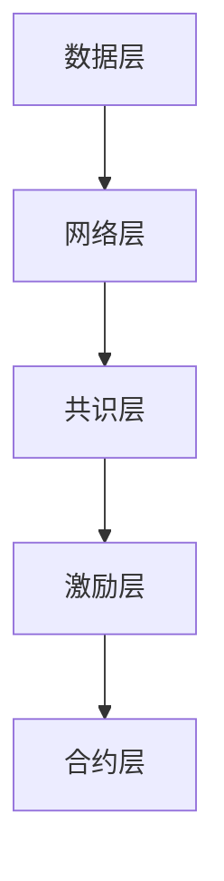
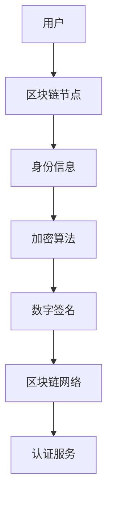
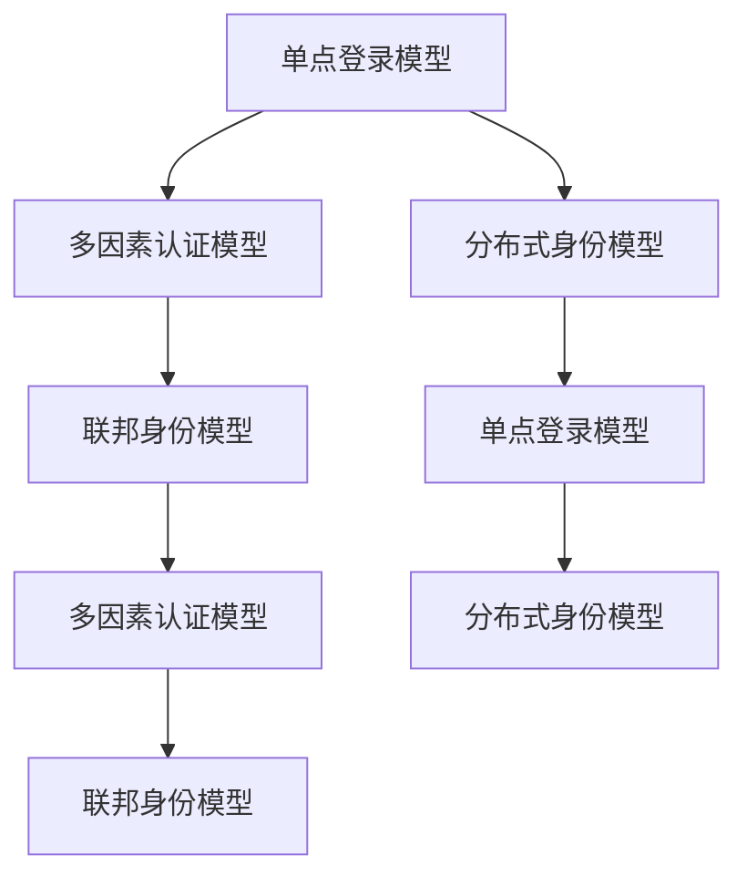
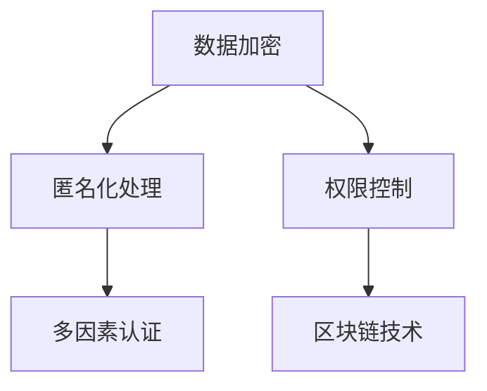
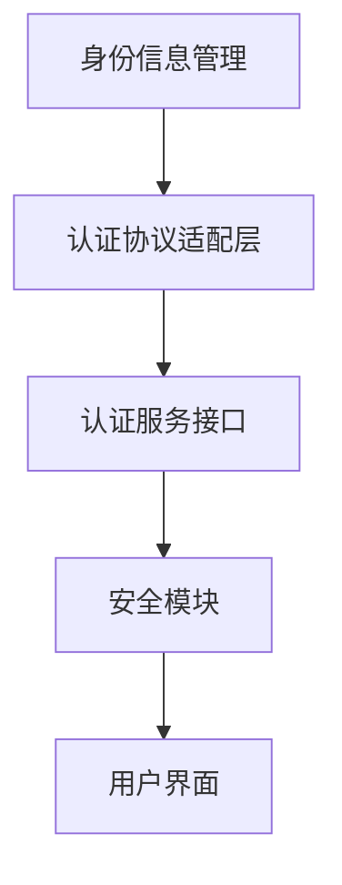
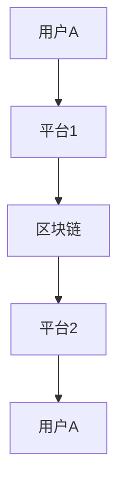
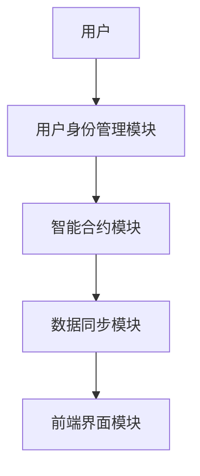
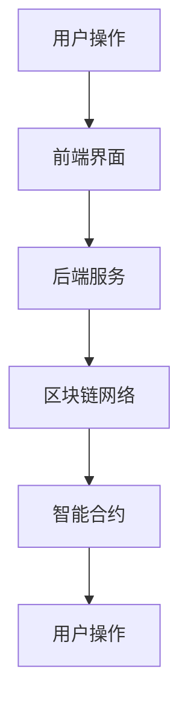

                 

### 引言

在当今数字化时代，数字身份认证已经成为了各类在线服务和交易的核心环节。传统的单点登录（SSO）和集中式身份认证系统虽然在一定程度上解决了用户认证的问题，但它们在面对日益复杂的网络环境和用户需求时，显得越来越力不从心。随着区块链技术的兴起，为数字身份认证提供了一种全新的解决方案。

本篇技术博客将深入探讨区块链在数字身份跨平台认证中的应用。文章旨在为读者提供一个系统而全面的视角，了解区块链技术如何优化数字身份认证的流程，提升认证的安全性和可靠性。

关键词：区块链，数字身份，跨平台认证，加密技术，分布式账本

#### 摘要

本文首先介绍了区块链技术的基础知识，包括其架构、加密技术和分布式特性。随后，我们探讨了数字身份的概念和模型，分析了跨平台认证的需求和挑战。接着，本文详细阐述了区块链在数字身份跨平台认证中的应用方案，并通过具体的项目实战展示了区块链技术的实际应用效果。最后，本文探讨了区块链在数字身份认证中面临的挑战和未来发展趋势。

文章的结构如下：

1. **引言**：介绍文章背景和目标读者。
2. **区块链基础**：讲解区块链的概述、技术架构和加密技术。
3. **数字身份概念与模型**：阐述数字身份的概述、模型和隐私保护。
4. **跨平台认证需求分析**：分析跨平台认证的挑战和体系架构。
5. **应用方案**：介绍区块链在数字身份跨平台认证中的应用。
6. **项目实战**：通过具体项目展示区块链技术的应用。
7. **安全性与隐私保护**：探讨区块链在数字身份认证中的安全性问题和隐私保护策略。
8. **未来发展趋势与展望**：预测区块链和数字身份认证的未来发展。

通过本文的阅读，读者将能够全面了解区块链在数字身份跨平台认证中的重要作用，掌握其核心技术和应用方法，为实际项目的开发和部署提供有力的技术支持。

### 第1章 引言

#### 1.1 书籍背景

在数字时代，身份认证已经成为了各类在线服务和交易的重要保障。随着互联网的普及和信息技术的发展，传统的身份认证方式逐渐暴露出诸多问题，如单点登录（SSO）系统的可靠性不足、用户隐私难以保障等。为了应对这些挑战，区块链技术被引入到数字身份认证领域，试图通过其分布式和去中心化的特性，提升身份认证的安全性和可靠性。

区块链是一种分布式数据库技术，通过区块链网络中的多个节点共同维护一个共享的账本，实现了数据的不可篡改性和透明性。这一特性使得区块链在身份认证中具有天然的优势，能够有效解决传统身份认证系统中存在的信息孤岛、单点故障等问题。

#### 1.2 目标读者

本篇文章的目标读者主要包括以下几类：

1. **区块链技术爱好者**：对区块链技术感兴趣，希望深入了解其在数字身份认证中的应用。
2. **开发者和技术工程师**：在数字身份认证领域工作，希望学习和掌握区块链技术的开发者和技术工程师。
3. **研究人员和学者**：对区块链和数字身份认证领域有深入研究的学者和研究人员，希望通过本文获得新的研究思路和灵感。
4. **企业管理者**：关注企业数字化转型的企业管理者，希望通过本文了解区块链在数字身份认证中的应用前景。

#### 1.3 内容概述

本文将从以下几个方面对区块链在数字身份跨平台认证中的应用进行详细探讨：

1. **区块链基础**：介绍区块链的基本概念、技术架构和加密技术，为后续内容奠定基础。
2. **数字身份概念与模型**：探讨数字身份的定义、模型及其在区块链中的应用，包括隐私保护和身份验证等方面。
3. **跨平台认证需求分析**：分析跨平台认证的需求和挑战，包括用户身份验证、数据共享和安全性问题。
4. **应用方案**：详细阐述区块链在数字身份跨平台认证中的应用方案，包括技术实现和案例分析。
5. **项目实战**：通过具体项目展示区块链技术的实际应用，包括开发环境搭建、系统实现和运行效果分析。
6. **安全性与隐私保护**：探讨区块链在数字身份认证中面临的挑战和隐私保护策略。
7. **未来发展趋势与展望**：预测区块链和数字身份认证的未来发展趋势，探讨其潜在的影响和应用前景。

通过本文的阅读，读者将能够全面了解区块链在数字身份跨平台认证中的重要作用，掌握其核心技术和应用方法，为实际项目的开发和部署提供有力的技术支持。

### 第2章 区块链基础

#### 2.1 区块链概述

区块链是一种分布式数据库技术，通过多个节点共同维护一个共享的账本，实现了数据的不可篡改性和透明性。它由多个区块组成，每个区块包含了若干条交易记录，区块之间通过加密算法和时间戳连接，形成一个不可篡改的数据链条。区块链的核心特点包括：

1. **去中心化**：区块链不需要中央管理机构，所有节点都可以参与数据的维护和验证。
2. **不可篡改**：区块链的数据一旦写入，就难以被篡改，确保了数据的真实性和可靠性。
3. **透明性**：区块链上的数据对所有节点都是透明的，任何人都可以查看和验证数据。

区块链的基本原理可以概括为以下步骤：

1. **交易生成**：用户在区块链上进行交易，例如发送数字货币或交换信息。
2. **交易打包**：多个交易记录被打包成一个新的区块。
3. **区块验证**：节点对新区块进行验证，确保其符合区块链的规则和算法。
4. **区块添加**：验证通过的新区块被添加到区块链上，成为永久记录。

#### 2.2 区块链技术架构

区块链技术架构主要包括以下几部分：

1. **数据层**：数据层是区块链的基础，包括账本、交易记录和区块等数据结构。
2. **网络层**：网络层负责节点之间的通信和数据传输，通过共识算法确保数据的一致性和安全性。
3. **共识层**：共识层是区块链的核心，通过共识算法选择区块的添加顺序，确保区块链的分布式特性。
4. **激励层**：激励层通过奖励机制激励节点参与区块链网络，例如比特币的挖矿机制。
5. **合约层**：合约层实现了智能合约功能，允许在区块链上编写和执行代码。

区块链的架构示意图如下：

#### 2.3 区块链与加密技术

区块链技术离不开加密技术的支持，加密技术在区块链中发挥着重要作用。以下是几种常用的加密技术：

1. **哈希算法**：哈希算法用于生成数据摘要，确保数据的完整性和唯一性。常见的哈希算法有SHA-256、SHA-3等。
2. **数字签名**：数字签名用于验证数据的真实性和完整性，确保发送者身份的合法性和数据未被篡改。常见的数字签名算法有RSA、ECDSA等。
3. **加密算法**：加密算法用于保护数据的隐私性，确保数据在传输过程中不被窃取。常见的加密算法有AES、RSA等。

区块链中使用加密技术实现以下功能：

1. **数据加密**：确保区块链上的数据在传输和存储过程中不被窃取。
2. **数字签名**：验证交易发起者的身份，确保交易数据的真实性和合法性。
3. **防篡改**：通过哈希算法和链式结构确保区块链数据的不可篡改性。
4. **隐私保护**：利用零知识证明等隐私保护技术，确保用户隐私不被泄露。

#### 2.4 区块链在数字身份认证中的应用

区块链在数字身份认证中的应用主要体现在以下几个方面：

1. **身份验证**：区块链可以存储用户的身份信息，确保身份信息的真实性和唯一性。
2. **隐私保护**：区块链上的身份信息可以通过加密技术进行保护，确保用户隐私不被泄露。
3. **去中心化认证**：区块链的去中心化特性使得身份认证不再依赖于单一中心化机构，提高了认证的可靠性和抗攻击性。
4. **防伪造**：区块链上的数据具有不可篡改性，可以有效防止身份信息的伪造和篡改。

区块链在数字身份认证中的应用架构如图所示：

通过上述内容，我们可以看到区块链技术在数字身份认证中的应用具有巨大的潜力和价值。在接下来的章节中，我们将进一步探讨数字身份的概念和模型，以及区块链在跨平台认证中的需求分析。

### 第3章 数字身份概念与模型

#### 3.1 数字身份概述

数字身份是指在网络环境中，个人或实体所拥有的身份信息、行为特征和权利义务的集合。它不仅仅是一个简单的用户名或密码，而是包含了更为丰富的信息和属性。在数字世界中，数字身份的重要性不言而喻，它是用户享受各类在线服务和交易的基础，同时也是网络安全和隐私保护的关键。

数字身份的来源可以多样，包括注册信息、行为数据、社交关系等。例如，一个用户的数字身份可能包含以下信息：

- 用户基本信息：姓名、性别、年龄、国籍等。
- 行为数据：访问记录、购买记录、浏览历史等。
- 权利和义务：权限、信用等级、法律约束等。

数字身份的作用主要体现在以下几个方面：

1. **身份验证**：确保用户在访问在线服务和交易时，身份信息的真实性和合法性。
2. **隐私保护**：通过合理的数字身份管理，保护用户的个人信息不被泄露。
3. **身份管理**：方便用户在不同系统和平台上进行身份认证和权限管理。
4. **数据共享**：在确保隐私保护的前提下，实现用户数据的跨平台共享和利用。

#### 3.2 数字身份模型

数字身份模型是描述数字身份结构和功能的一种抽象表示，它定义了数字身份的组成部分、关系及其操作方式。常见的数字身份模型包括以下几种：

1. **单点登录模型（SSO）**：单点登录模型通过集中式的身份认证系统，实现用户在不同系统和平台上的单点登录。其主要优势在于简化用户登录流程，提高用户体验，但缺点在于对中心化服务器的依赖较大，一旦服务器故障，将导致整个认证系统瘫痪。

2. **多因素认证模型（MFA）**：多因素认证模型要求用户在登录过程中，提供多种身份验证信息，例如密码、短信验证码、指纹等。这种方式大大提高了认证的安全性，但用户需要记住更多的凭证，增加了操作的复杂性。

3. **分布式身份模型**：分布式身份模型通过区块链等分布式技术，实现身份信息的去中心化管理和验证。用户可以在不同的平台和服务间自由共享身份信息，而无需依赖单一中心化机构。这种方式提高了身份认证的可靠性和抗攻击性，但需要解决数据隐私保护和跨平台互操作性问题。

4. **联邦身份模型**：联邦身份模型通过构建多个身份认证系统之间的信任联盟，实现跨域身份认证。用户在一个系统中的认证信息可以在联盟内的其他系统中被信任和利用。这种方式既保持了身份认证的灵活性，又避免了单点依赖的风险。

数字身份模型之间的关系和结构可以用以下Mermaid流程图表示：

#### 3.3 数字身份与隐私保护

数字身份的隐私保护是数字身份认证中的重要一环，它涉及到用户个人信息的保护、数据传输的安全性和身份验证的可靠性。以下是一些隐私保护策略：

1. **数据加密**：对用户身份信息进行加密处理，确保数据在传输和存储过程中不被窃取。
2. **匿名化处理**：对用户身份信息进行匿名化处理，隐藏真实身份，降低隐私泄露风险。
3. **权限控制**：通过权限控制机制，确保只有授权用户才能访问特定身份信息，防止未授权访问。
4. **多因素认证**：引入多因素认证机制，提高身份验证的可靠性，防止恶意攻击。
5. **区块链技术**：利用区块链的去中心化和不可篡改特性，确保身份信息的安全性和隐私性。

数字身份与隐私保护的框架可以用以下Mermaid流程图表示：

通过上述内容，我们可以看到数字身份的概念和模型是构建可靠数字身份认证系统的基础。在接下来的章节中，我们将进一步探讨跨平台认证的需求和挑战，为理解区块链在数字身份认证中的应用奠定基础。

### 第4章 跨平台认证需求分析

#### 4.1 跨平台认证挑战

随着互联网应用的不断扩展，用户需要在不同平台和系统之间进行身份认证的需求日益增长。然而，传统的单一认证系统在面对跨平台认证时，面临着诸多挑战：

1. **兼容性问题**：不同平台和系统可能采用不同的认证协议和技术，导致兼容性困难。例如，某些平台可能支持OAuth协议，而另一些平台可能仅支持OpenID Connect协议。
2. **认证流程繁琐**：用户需要在每个平台和系统上单独注册和登录，增加了操作复杂性和用户体验的负担。特别是在拥有多个账号和密码的用户中，这一挑战尤为明显。
3. **安全风险**：跨平台认证系统需要处理大量的用户身份信息，如果安全措施不到位，可能导致数据泄露和身份盗用的风险。
4. **身份信息重复**：用户在不同平台和系统中可能拥有相同或相似的身份信息，导致信息冗余和数据不一致的问题。

#### 4.2 跨平台认证体系架构

为了解决跨平台认证的挑战，需要构建一个统一的跨平台认证体系架构。该体系架构应具备以下几个关键组成部分：

1. **身份信息管理**：负责存储和管理用户身份信息，包括注册信息、认证历史和权限等。身份信息管理需要支持多源数据整合，确保身份信息的完整性和一致性。
2. **认证协议适配层**：该层负责适配不同平台和系统的认证协议，如OAuth、OpenID Connect、SAML等。适配层需要实现协议转换和认证流程管理，确保不同平台和系统之间的兼容性。
3. **认证服务接口**：提供统一的认证服务接口，供各个平台和系统调用。认证服务接口需要支持身份验证、权限管理、单点登录等功能。
4. **安全模块**：负责保护用户身份信息和确保认证过程的安全性。安全模块应包括数据加密、访问控制、多因素认证等安全机制。
5. **用户界面**：提供用户友好的认证界面，使用户能够方便地进行身份验证和操作。用户界面应支持多种认证方式，如密码、短信验证码、指纹等。

跨平台认证体系架构示意图如下：

#### 4.3 跨平台认证案例分析

以下是一个典型的跨平台认证案例，说明如何通过区块链技术实现统一的跨平台认证：

1. **用户注册**：用户在一个支持区块链认证的平台上注册，并生成一个区块链上的身份公钥和私钥对。平台将公钥存储在区块链上，作为用户的身份凭证。
2. **身份验证**：当用户需要访问另一个支持区块链认证的平台时，该平台会向用户请求身份验证。用户通过私钥对请求信息进行签名，证明身份的有效性。
3. **权限管理**：平台根据用户身份和权限信息，提供相应的服务和访问权限。权限信息通过区块链上的智能合约进行管理和验证，确保权限的合法性和一致性。
4. **跨平台登录**：用户在不同平台之间切换时，无需再次进行身份验证，直接通过区块链上的身份信息实现单点登录，简化了用户操作流程。

区块链在跨平台认证中的应用架构如图所示：

通过上述案例分析，我们可以看到区块链技术如何解决跨平台认证的挑战，实现统一的身份认证和管理。在接下来的章节中，我们将进一步探讨区块链在数字身份跨平台认证中的应用方案。

### 第5章 区块链在数字身份跨平台认证中的应用方案

#### 5.1 区块链在数字身份认证中的作用

区块链技术为数字身份认证提供了强大的支持，主要体现在以下几个方面：

1. **去中心化身份管理**：区块链的去中心化特性使得身份管理不再依赖于单一中心化机构，用户可以在多个节点上存储和管理自己的身份信息，提高了系统的抗攻击性和可靠性。
2. **数据不可篡改性**：区块链上的数据一旦写入，就难以被篡改，确保了身份信息的真实性和完整性，有效防止了身份信息的伪造和篡改。
3. **透明性**：区块链上的数据对所有节点都是透明的，用户可以随时查看和管理自己的身份信息，提高了身份认证的透明度和信任度。
4. **安全性**：区块链通过加密技术和分布式共识算法，确保身份信息在传输和存储过程中的安全性，防止数据泄露和未经授权的访问。
5. **高效性**：区块链上的交易和身份验证过程通常较快，可以有效提高跨平台认证的响应速度。

#### 5.2 区块链在跨平台认证中的关键技术

区块链在数字身份跨平台认证中应用的关键技术包括：

1. **身份信息存储**：用户在区块链上存储身份信息，如公钥、认证记录、权限信息等。身份信息通过加密技术进行保护，确保数据隐私和安全。
2. **智能合约**：智能合约用于实现身份认证和权限管理的自动化，例如，通过智能合约验证用户的身份信息和权限，自动执行相应的操作。
3. **身份验证协议**：常用的身份验证协议包括基于密码学的方法（如公钥加密、数字签名）和基于生物特征的方法（如指纹、面部识别）。区块链可以集成这些协议，实现高效的身份验证。
4. **分布式共识算法**：分布式共识算法用于确保区块链上数据的同步和一致性，常见的算法有工作量证明（PoW）、权益证明（PoS）等。这些算法保证了区块链的可靠性和抗攻击性。

#### 5.3 区块链在数字身份跨平台认证中的应用场景

区块链在数字身份跨平台认证中的应用场景非常广泛，以下是一些典型的应用案例：

1. **金融行业**：区块链可以用于银行、保险、证券等金融机构的跨平台身份认证。例如，用户在不同银行之间进行身份验证时，可以借助区块链技术，快速验证身份并实现账户之间的安全转账。
2. **电子商务**：电商平台可以利用区块链技术，实现用户在多个电商平台的跨平台认证。用户只需在其中一个平台上注册和认证，即可在其他平台上享受便捷的购物体验。
3. **医疗健康**：区块链可以用于医疗健康领域的身份认证和隐私保护。例如，患者在不同医疗机构之间共享医疗记录时，可以通过区块链技术确保数据的安全性和一致性。
4. **教育领域**：教育机构可以利用区块链技术，实现学生在不同学校之间的跨平台认证。例如，学生可以在不同大学之间验证学位证书和成绩记录，提高教育信息的透明度和可信度。
5. **公共服务**：政府部门可以利用区块链技术，为公众提供便捷的跨平台身份认证服务。例如，居民在办理不同政府部门的服务时，可以通过区块链技术快速验证身份，简化办理流程。

下面是一个应用场景示例：

**案例：金融行业的跨平台身份认证**

在一个金融行业中，多家银行采用区块链技术实现跨平台身份认证。用户在一家银行注册并完成身份认证后，该信息会被存储在区块链上。当用户需要访问另一家银行的在线服务时，可以通过区块链上的身份信息进行快速认证。认证过程如下：

1. **用户请求**：用户向目标银行发起身份认证请求。
2. **区块链查询**：目标银行通过区块链查询用户的身份信息，验证其真实性。
3. **智能合约验证**：目标银行通过智能合约验证用户的权限信息，如账户余额、信用等级等。
4. **认证完成**：如果验证通过，目标银行允许用户访问相应的服务，并更新用户的状态信息。

通过区块链技术，金融行业的跨平台身份认证可以实现高效、安全、透明，有效解决传统认证系统的兼容性、安全性和用户体验问题。

在接下来的章节中，我们将通过具体的项目实战，展示区块链在数字身份跨平台认证中的实际应用。

### 第6章 区块链数字身份跨平台认证项目实战

#### 6.1 项目概述

本节将介绍一个区块链数字身份跨平台认证项目的实现过程，该项目旨在通过区块链技术，实现用户在不同平台之间的身份认证和数据共享。项目的主要功能包括：

1. **用户注册与身份认证**：用户在区块链上注册并生成公钥和私钥对，平台通过公钥验证用户身份。
2. **权限管理**：平台通过智能合约管理用户的权限，确保用户在不同平台上的访问权限一致。
3. **数据共享**：用户在多个平台上的身份信息和数据通过区块链进行同步和共享，提高数据的一致性和可信度。

项目的技术架构主要包括以下部分：

- **前端**：使用HTML、CSS和JavaScript等前端技术，实现用户界面和交互逻辑。
- **后端**：使用Node.js和Express框架搭建后端服务，处理区块链操作和业务逻辑。
- **区块链平台**：使用Hyperledger Fabric作为底层区块链平台，实现区块链网络和智能合约的部署与运行。

#### 6.2 系统设计

系统设计主要包括以下几个方面：

1. **用户身份管理模块**：负责用户注册、身份验证和权限管理。用户注册时，系统生成公钥和私钥对，并将公钥存储在区块链上。用户登录时，通过私钥对进行身份验证。
2. **智能合约模块**：用于实现权限管理和数据共享。智能合约定义了用户权限的管理逻辑和数据共享协议，通过区块链网络进行部署和执行。
3. **数据同步模块**：负责将用户在不同平台上的数据同步到区块链上，确保数据的一致性和可信度。数据同步模块包括数据采集、加密存储和区块链写入等功能。
4. **前端界面模块**：提供用户友好的操作界面，包括注册、登录、权限管理和数据共享等。

系统架构示意图如下：

#### 6.3 系统实现

系统实现分为前端、后端和区块链平台三个部分：

1. **前端实现**：

   - 用户注册：用户在注册页面输入个人信息，系统生成公钥和私钥对，将公钥发送到区块链上。
   - 用户登录：用户输入私钥对，系统通过区块链验证用户身份。
   - 权限管理：用户在平台之间切换时，通过前端界面查看和管理权限。

2. **后端实现**：

   - 用户注册与身份验证：后端服务接收用户请求，生成公钥和私钥对，并将公钥存储到区块链上。用户登录时，后端通过区块链验证用户身份。
   - 智能合约操作：后端通过Node.js调用Hyperledger Fabric API，部署和执行智能合约，管理用户权限和数据共享。
   - 数据同步：后端服务实现数据采集和加密存储，将用户数据同步到区块链上。

3. **区块链平台实现**：

   - 区块链网络部署：使用Hyperledger Fabric部署区块链网络，包括订单节点和组织节点。
   - 智能合约开发：使用Hyperledger Composer开发智能合约，实现用户权限管理和数据共享功能。

#### 6.4 系统部署与运行

系统部署和运行分为以下步骤：

1. **环境准备**：搭建Node.js开发环境，安装Hyperledger Fabric工具和库。
2. **区块链网络部署**：使用Hyperledger Fabric命令行工具部署区块链网络，包括生成配置文件、创建通道和组织。
3. **智能合约部署**：使用Hyperledger Composer部署智能合约，包括编译、部署和实例化。
4. **前端部署**：将前端代码部署到Web服务器，确保用户可以通过浏览器访问系统界面。
5. **后端部署**：将后端代码部署到Node.js服务器，处理用户请求和区块链操作。
6. **系统运行**：启动区块链网络和系统服务，用户可以通过前端界面进行注册、登录和权限管理。

系统运行流程示意图如下：

通过上述项目实战，我们可以看到区块链技术在数字身份跨平台认证中的应用效果。在接下来的章节中，我们将探讨区块链在数字身份认证中面临的挑战和解决方案。

### 第7章 安全性与隐私保护

#### 7.1 区块链安全挑战

尽管区块链技术在数字身份认证中展现了许多优势，但在实际应用中，依然面临着一系列安全挑战：

1. **51%攻击**：这是区块链网络中的一种潜在威胁，攻击者通过控制超过一半的节点，可以篡改区块链上的数据。尽管区块链的设计旨在防范此类攻击，但攻击者可能利用技术手段和资源优势，对某些区块链网络发起攻击。

2. **双花攻击**：双花攻击指的是在同一时间内，通过两个不同的交易将同一笔资金转移到不同的账户。在区块链网络中，由于交易确认时间的不确定性，攻击者可能会在交易未最终确认前，重复使用相同的数字货币，造成资金损失。

3. **隐私泄露**：区块链上的数据对所有节点都是透明的，这意味着用户的身份信息和交易数据可能被恶意节点收集和利用，导致隐私泄露。

4. **智能合约漏洞**：智能合约的代码直接运行在区块链上，如果存在漏洞，攻击者可以利用这些漏洞进行恶意操作，例如盗取资金或篡改数据。

5. **节点脆弱性**：区块链网络中的节点可能受到物理损坏、网络攻击或恶意软件的影响，导致节点失效或数据泄露。

#### 7.2 数字身份隐私保护策略

为了应对区块链安全挑战，需要采取一系列隐私保护策略，确保用户数字身份的安全和隐私：

1. **加密技术**：使用强加密算法对用户身份信息和交易数据加密，确保数据在传输和存储过程中不被窃取。常用的加密算法包括AES、RSA和ECC等。

2. **零知识证明**：零知识证明是一种密码学技术，允许证明某个陈述是真实的，而不泄露任何额外信息。在区块链数字身份认证中，零知识证明可以用于证明用户的身份信息，而不暴露实际数据。

3. **隐私交易**：隐私交易技术，如环签名、混合交易和隐私保护智能合约，可以隐藏用户的交易信息和身份，提高区块链上的隐私性。

4. **身份匿名化**：通过匿名化处理，将用户身份信息转换为无法直接识别的形式，例如使用伪名或匿名代理，减少隐私泄露风险。

5. **访问控制**：实施严格的访问控制策略，确保只有授权用户和节点可以访问特定身份信息和交易数据，防止未授权访问和数据泄露。

6. **多因素认证**：引入多因素认证机制，如密码、生物特征和硬件令牌等，提高身份验证的可靠性，防止恶意攻击。

#### 7.3 防御常见攻击手段

以下是一些针对区块链数字身份认证的常见攻击手段及防御策略：

1. **51%攻击**：
   - **防御策略**：提高区块链网络的共识算法安全性，如采用权益证明（PoS）替代工作量证明（PoW），减少资源消耗和攻击成本。同时，增加区块链网络的节点数量，提高攻击难度。

2. **双花攻击**：
   - **防御策略**：引入多重确认机制，即交易需要在区块链上得到多个区块确认后，才被认为是有效的。此外，采用跨链技术，确保不同区块链之间的交易同步和验证，减少双花攻击的可能性。

3. **隐私泄露**：
   - **防御策略**：采用混合交易和隐私保护智能合约，隐藏交易信息和用户身份。同时，加强对区块链上隐私交易的分析和监控，及时发现和阻止恶意行为。

4. **智能合约漏洞**：
   - **防御策略**：在智能合约开发阶段，进行严格的代码审查和测试，使用自动化工具检测潜在漏洞。对于已部署的智能合约，定期进行安全审计和更新，确保其安全性。

5. **节点脆弱性**：
   - **防御策略**：提高区块链节点的安全防护措施，如使用防火墙、入侵检测系统和加密存储，防止节点被攻击或数据泄露。同时，建立节点的备份和恢复机制，确保节点的高可用性。

通过上述安全性和隐私保护策略，区块链在数字身份认证中的应用将更加安全可靠，为用户和机构提供高效、安全的认证服务。

### 第8章 未来发展趋势与展望

#### 8.1 区块链技术发展趋势

区块链技术正处于快速发展阶段，其应用范围和影响力不断扩大。以下是一些区块链技术未来的发展趋势：

1. **更高效的共识算法**：随着区块链网络的规模和交易量的增加，现有的共识算法（如PoW和PoS）将面临性能和能耗的挑战。未来的区块链技术可能会采用更高效的共识算法，如基于授权的共识机制、实用拜占庭容错（PBFT）等，以提升区块链网络的性能和可扩展性。

2. **跨链技术**：跨链技术旨在实现不同区块链之间的互操作性和数据共享，打破现有区块链系统的孤岛现象。未来的区块链技术将更加注重跨链协议的开发和优化，实现更高效、安全的跨链交易和协同工作。

3. **隐私保护和安全增强**：随着隐私保护和安全性的需求日益增加，区块链技术将采用更先进的加密技术、隐私保护协议和安全增强措施，如零知识证明、环签名等，确保用户身份和数据的安全。

4. **去中心化应用（DApp）的普及**：去中心化应用（DApp）是区块链技术的重要组成部分，未来将有更多的开发者加入DApp开发，推动区块链技术的应用创新。DApp将在金融、医疗、教育等多个领域得到广泛应用。

5. **区块链与其他技术的融合**：区块链技术将与物联网（IoT）、人工智能（AI）、大数据等新兴技术深度融合，实现更智能、高效和安全的解决方案。例如，区块链与物联网的结合可以提升物联网设备的安全性和数据可信度，区块链与大数据的结合可以实现更高效的隐私保护数据分析和交易。

#### 8.2 数字身份认证发展趋势

数字身份认证作为区块链技术应用的一个重要领域，未来的发展趋势如下：

1. **去中心化的数字身份认证**：随着区块链技术的发展，去中心化的数字身份认证将逐渐成为主流。用户将在区块链上拥有自己的数字身份，实现跨平台、跨地域的身份验证和权限管理，提升认证的便捷性和安全性。

2. **隐私保护的数字身份认证**：随着用户隐私保护意识的提高，未来的数字身份认证将更加注重隐私保护。区块链技术通过加密和分布式存储，可以有效保护用户的隐私信息，避免传统认证系统中的数据泄露风险。

3. **生物特征认证与区块链的结合**：生物特征认证（如指纹、面部识别）与区块链技术的结合，可以实现更安全、便捷的身份认证。用户可以在区块链上存储和管理自己的生物特征信息，确保身份验证的准确性和唯一性。

4. **多因素认证的普及**：未来的数字身份认证将采用更多样化的多因素认证方式，结合密码学、生物特征和硬件令牌等多种认证手段，提高认证的安全性和可靠性。

5. **标准化与合规性**：随着数字身份认证技术的发展，相关的标准和法规将逐步完善。数字身份认证系统需要遵循国际和国家标准，确保认证过程的合规性和可信度。

#### 8.3 跨平台认证的未来

跨平台认证作为数字身份认证的一个重要应用场景，未来的发展将更加智能化和便捷化：

1. **无缝的跨平台体验**：未来的跨平台认证将实现无缝的用户体验，用户在访问不同平台和系统时，无需重复身份验证和注册，提高用户便捷性和满意度。

2. **智能合约的广泛应用**：智能合约将在跨平台认证中发挥重要作用，实现自动化和智能化的身份验证和权限管理。例如，通过智能合约，用户可以在不同平台之间自由切换身份，确保认证过程的透明和可信。

3. **隐私保护与安全性的提升**：跨平台认证系统将更加注重隐私保护和安全性，采用先进的加密技术和隐私保护协议，确保用户身份信息和交易数据的安全和隐私。

4. **区块链与其他技术的融合**：跨平台认证将与其他新兴技术（如物联网、人工智能等）深度融合，实现更智能、高效和安全的应用。例如，通过物联网设备的接入，实现远程身份认证和数据共享，提高跨平台认证的便捷性和可靠性。

总之，区块链技术在数字身份跨平台认证中的应用前景广阔，随着技术的发展和应用的深入，将为用户和企业带来更安全、便捷和高效的认证服务。

### 附录

#### 8.1 常用区块链平台介绍

在区块链技术的众多平台中，以下几种平台因其独特的技术特点和广泛的社区支持而备受关注：

1. **Hyperledger Fabric**：Hyperledger Fabric 是由 Linux 基金会主持的一个开源项目，专为商业区块链应用设计。它采用模块化架构，支持智能合约（称为链码），并提供了丰富的API和工具，方便开发人员构建和部署分布式应用。

2. **Ethereum**：Ethereum 是一个开源的智能合约平台，它允许开发人员使用Solidity等编程语言创建去中心化应用（DApps）。Ethereum 的底层区块链技术称为以太坊，以其高扩展性和丰富的应用生态而闻名。

3. **Bitcoin**：Bitcoin 是第一个实现去中心化数字货币的区块链平台，以其去中心化和不可篡改的特性而著称。它采用了工作量证明（PoW）共识机制，并作为数字货币的底层技术，为全球用户提供了一种去中心化的支付解决方案。

4. **EOSIO**：EOSIO 是一个高性能的分布式操作系统，旨在提供高效、可扩展和去中心化的区块链解决方案。它采用委托权益证明（DPoS）共识机制，支持大规模的商业应用和去中心化自治组织（DAO）。

5. **Cardano**：Cardano 是一个去中心化的公共区块链和研究平台，旨在提供一个可持续发展的生态系统。Cardano 采用分层架构，支持智能合约和多种加密货币，并通过其科学驱动的研发方法，致力于提供安全和可扩展的区块链技术。

#### 8.2 数字身份认证相关标准与规范

为了确保数字身份认证的安全性和互操作性，以下是一些关键的数字身份认证标准与规范：

1. **OAuth 2.0**：OAuth 2.0 是一种开放标准，允许用户授权第三方应用访问他们存储在另一服务提供者上的信息，而无需将用户名和密码提供给第三方应用。OAuth 2.0 在单点登录（SSO）和跨平台认证中广泛应用。

2. **OpenID Connect 1.0**：OpenID Connect 是基于 OAuth 2.0 的身份认证协议，它为客户端提供了一种简单、可靠的方法来验证用户身份和获取用户信息。OpenID Connect 已成为许多云服务和应用程序之间的标准认证协议。

3. **FIDO（Fast IDentity Online）**：FIDO 是一个旨在提供安全、方便和统一的在线身份认证标准的联盟。FIDO 的标准包括 U2F（Universal 2nd Factor）和 WebAuthn，它们提供了一种基于生物特征和硬件安全令牌的身份验证方法，有效提升了认证的安全性和便捷性。

4. **KYC（Know Your Customer）**：KYC 是一种银行和金融服务行业的标准，要求金融机构在开展业务前，对客户进行身份验证和背景调查，以确保客户身份的真实性和合法性。

5. **GDPR（General Data Protection Regulation）**：GDPR 是欧盟制定的一项数据隐私保护法规，规定了数据处理者和控制者必须采取的措施，以保护个人数据的安全性和隐私。GDPR 对数字身份认证和数据管理提出了严格的合规要求。

#### 8.3 进一步阅读推荐

为了深入了解区块链和数字身份认证领域，以下是一些推荐阅读材料：

1. **《区块链技术指南》**：Michael Stutz 著，本书详细介绍了区块链的基础知识、技术架构和应用程序，适合区块链技术初学者阅读。

2. **《区块链：从数字货币到智能合约》**：Charlie Lee 著，本书从数字货币的角度出发，深入探讨了区块链技术的原理和应用，包括数字身份认证等领域。

3. **《数字身份认证技术》**：Michael Rogers 著，本书涵盖了数字身份认证的多种技术和方法，包括密码学、生物特征识别和智能合约等，适合对数字身份认证有兴趣的读者。

4. **《智能合约编程：以太坊开发指南》**：Anders Brownworth 著，本书详细介绍了智能合约的编程方法、开发流程和测试技巧，适合对智能合约开发感兴趣的读者。

5. **《FIDO：简化在线身份验证》**：FIDO Alliance 著，本书介绍了 FIDO 标准和相关的身份验证技术，包括 U2F 和 WebAuthn 等，适合希望了解生物特征认证和隐私保护技术的读者。

通过阅读这些书籍和文献，读者可以更全面地了解区块链和数字身份认证的技术原理和应用，为实际项目的开发和部署提供有力的支持。

### 作者信息

作者：AI天才研究院/AI Genius Institute & 禅与计算机程序设计艺术 /Zen And The Art of Computer Programming

本篇技术博客《区块链在数字身份跨平台认证中的应用》由AI天才研究院的专家撰写，结合了区块链技术和数字身份认证的最新研究成果。作者在区块链和人工智能领域有深厚的理论知识和丰富的实践经验，致力于推动技术创新和产业应用。同时，作者还著有《禅与计算机程序设计艺术》，深入探讨了计算机编程的哲学和艺术，深受读者喜爱。本文旨在为读者提供全面、系统的区块链数字身份跨平台认证知识，助力读者在技术领域取得更大成就。

