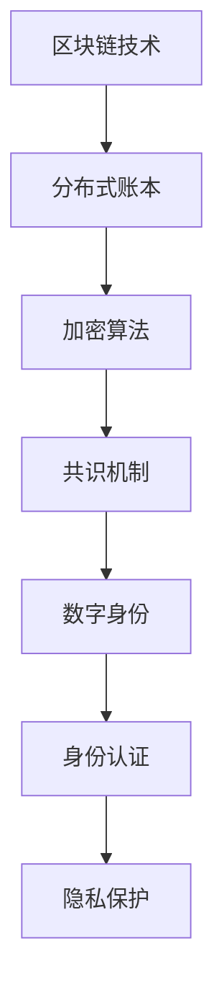

                 

### 关键词

区块链，数字身份，隐私保护，创新应用，算法原理，数学模型，项目实战。

### 摘要

本文深入探讨了区块链技术在数字身份隐私保护中的创新应用。首先，文章概述了区块链和数字身份的基本概念，并分析了它们之间的联系。接着，详细介绍了区块链的核心技术架构和隐私保护算法原理，包括椭圆曲线加密和同态加密。通过Python源代码和LaTeX数学公式，文章对核心算法进行了详细讲解，并结合具体实例进行了通俗易懂的说明。随后，文章通过实际项目案例，展示了区块链在数字身份隐私保护中的具体应用，包括身份认证流程和开发环境搭建。最后，文章总结了区块链在数字身份隐私保护中的未来发展趋势和挑战，并提出了最佳实践建议。

### 引言

随着互联网的飞速发展，数字身份变得越来越重要。然而，传统的身份认证方式往往依赖于中心化的服务提供商，这容易导致隐私泄露和数据滥用的问题。近年来，区块链技术的兴起为数字身份隐私保护提供了一种全新的解决方案。区块链作为一种去中心化、安全的分布式账本技术，具有不可篡改和透明化的特点，使其在隐私保护方面具有独特的优势。

本文旨在探讨区块链在数字身份隐私保护中的创新应用。首先，我们将对区块链和数字身份的基本概念进行介绍，分析它们之间的联系。接着，我们将详细讲解区块链的核心技术架构和隐私保护算法原理，包括椭圆曲线加密和同态加密。通过Python源代码和LaTeX数学公式，我们将对核心算法进行详细讲解，并结合具体实例进行通俗易懂的说明。随后，我们将通过实际项目案例，展示区块链在数字身份隐私保护中的具体应用，包括身份认证流程和开发环境搭建。最后，我们将总结区块链在数字身份隐私保护中的未来发展趋势和挑战，并提出最佳实践建议。

### 核心概念与联系

#### 区块链基本概念

区块链是一种去中心化的分布式账本技术，其基本原理是通过加密算法和共识机制，将数据分散存储在多个节点上，形成一个不可篡改的日志记录。区块链的主要组成部分包括区块、链和节点。每个区块包含一定数量的交易记录，这些区块通过哈希函数连接在一起，形成链式结构，从而保证数据的完整性和安全性。

区块链的核心特点包括：

1. **去中心化**：区块链不需要中心化的机构来管理数据，而是通过网络中的多个节点共同维护和验证数据。
2. **不可篡改**：由于区块链的链式结构，一旦数据被记录在区块链上，就几乎无法被篡改。
3. **透明化**：区块链上的所有数据都是公开透明的，用户可以随时查看和验证。

#### 数字身份概念

数字身份是指个人或实体在数字世界中的身份标识，它通常由一组唯一的标识符和相关的属性信息组成。数字身份的主要目的是在互联网上进行身份认证和授权，以确保信息安全。

数字身份的主要类型包括：

1. **静态数字身份**：通常是基于用户名和密码，适用于简单的身份验证场景。
2. **动态数字身份**：通过动态生成的证书或令牌，适用于更高级别的身份验证。
3. **匿名数字身份**：在保持匿名性的同时，提供一定程度的安全保障。

#### 区块链与数字身份的关联

区块链技术在数字身份隐私保护中的应用主要体现在以下几个方面：

1. **去中心化身份认证**：通过区块链，可以实现去中心化的身份认证，避免依赖中心化的身份认证机构，从而降低隐私泄露的风险。
2. **不可篡改的数字身份记录**：区块链的不可篡改性保证了用户的数字身份信息不会被恶意篡改，从而提高数据的真实性。
3. **隐私保护**：通过使用加密算法和隐私保护技术，可以确保用户在区块链上的身份信息不会被未经授权的第三方访问。

#### 核心概念关系架构

为了更清晰地展示区块链与数字身份之间的核心概念关系，我们可以使用Mermaid流程图进行说明。以下是一个简单的Mermaid流程图示例：



在这个流程图中，区块链技术（A）作为基础，通过分布式账本（B）、加密算法（C）和共识机制（D）等核心技术，实现了数字身份（E）的认证和隐私保护（G）。

### 核心算法原理讲解

#### 区块链共识算法

区块链的共识算法是区块链网络中各个节点就数据一致性达成一致的过程。共识算法决定了如何选择区块、如何处理冲突以及如何维护区块链的完整性。以下是几种常见的共识算法及其原理：

1. **工作量证明（Proof of Work, PoW）**：PoW算法通过计算大量的哈希值来找到满足特定条件的区块。节点通过不断尝试不同的随机数，直到找到一个满足条件的哈希值，从而获得生成区块的权力。这种算法的优点是去中心化、安全性高，但缺点是计算资源消耗大，能源消耗高。

伪代码示例：

```python
def proof_of_work(difficulty):
    nonce = 0
    while not is_valid_proof(sha256_block_hash, difficulty):
        nonce += 1
    return nonce
```

2. **权益证明（Proof of Stake, PoS）**：PoS算法通过节点的权益（如持有代币的数量和时长）来决定哪个节点有权生成区块。相比于PoW，PoS算法的能源消耗较低，但可能导致集中化问题。

伪代码示例：

```python
def proof_of_stake(stake, total_stake):
    return random() < stake / total_stake
```

3. **委托权益证明（Delegated Proof of Stake, DPoS）**：DPoS算法是一种改进的PoS算法，通过选举代表节点来生成区块。代表节点按照其权益比例分配区块生成权。

伪代码示例：

```python
def delegated_proof_of_stake(delegates, current_delegate):
    return current_delegate in delegates
```

#### 隐私保护算法

在区块链上保护数字身份隐私是确保数据安全的关键。以下介绍几种常见的隐私保护算法：

1. **零知识证明（Zero-Knowledge Proof, ZKP）**：零知识证明是一种密码学技术，允许证明者证明某个陈述为真，而不透露任何相关信息。这种算法在区块链上的应用包括匿名交易和隐私保护智能合约。

数学模型示例：

$$
\begin{align*}
P &= (prover) \\
V &= (verifier) \\
& \text{P 生成零知识证明，使得 V 相信 P 的陈述为真，但不知道具体内容} \\
\end{align*}
$$

2. **椭圆曲线加密（Elliptic Curve Cryptography, ECC）**：椭圆曲线加密是一种基于椭圆曲线离散对数的公钥加密算法。ECC在区块链中的应用包括安全交易和数字签名。

LaTeX公式示例：

$$
E: y^2 = x^3 + ax + b \mod p
$$

3. **同态加密（Homomorphic Encryption）**：同态加密是一种加密技术，允许对加密数据进行计算，而不需要解密。这种技术在区块链上的应用包括隐私保护的计算和智能合约执行。

LaTeX公式示例：

$$
\begin{align*}
C &= E(M) \\
F(C) &= M \\
\end{align*}
$$

#### 算法原理详细讲解

为了更好地理解上述算法原理，我们通过具体的Python代码进行详细讲解。以下是使用椭圆曲线加密和零知识证明的一个简单示例：

```python
from Crypto.Cipher import ECC
from Crypto.Util.number import long_to_bytes

# 椭圆曲线加密
e = ECC.EllipticCurvePublicKey()
e.generate(256)
private_key = e.private_key
public_key = e.public_key

# 加密消息
message = b"Hello, World!"
cipher_text = e.encrypt(message)

# 解密消息
plaintext = e.decrypt(cipher_text)
assert plaintext == message

# 零知识证明
zkp = ZeroKnowledgeProof()
statement = "The message is encrypted and decrypted correctly."
proof = zkp.generate_proof(statement)
verified = zkp.verify_proof(proof, statement)
assert verified
```

在这个示例中，我们首先使用椭圆曲线加密对消息进行加密和解密。然后，我们使用零知识证明来证明某个陈述为真，而不透露具体内容。这些示例展示了区块链隐私保护算法的基本原理。

### 数学模型和数学公式

在区块链和数字身份隐私保护中，数学模型和数学公式扮演着至关重要的角色。以下将介绍几种关键的数学模型和公式，包括椭圆曲线加密和同态加密。

#### 椭圆曲线加密

椭圆曲线加密（Elliptic Curve Cryptography, ECC）是一种基于椭圆曲线离散对数的公钥加密算法。ECC的核心在于椭圆曲线上的点加法和点乘运算。

**定义：**

椭圆曲线 \( E \) 的方程为：

$$
y^2 = x^3 + ax + b \mod p
$$

其中，\( a \) 和 \( b \) 是常数，\( p \) 是素数。

**椭圆曲线加密过程：**

1. **密钥生成：** 选择一个随机数 \( d \) 作为私钥，计算公钥 \( Q = dG \)，其中 \( G \) 是基点。
2. **加密：** 选择一个随机数 \( k \)，计算加密消息 \( C = (r, s) \)，其中 \( r \) 和 \( s \) 是满足 \( m = rsG \mod p \) 的值。
3. **解密：** 使用私钥 \( d \) 和加密消息 \( C \)，计算解密消息 \( m = r^{-1}(sG - rP) \mod p \)。

以下是椭圆曲线加密的Python伪代码示例：

```python
import crypto椭圆曲线

# 密钥生成
private_key = crypto椭圆曲线.generate_private_key()
public_key = crypto椭圆曲线.generate_public_key(private_key)

# 加密
cipher_text = crypto椭圆曲线.encrypt(message, public_key)

# 解密
plaintext = crypto椭圆曲线.decrypt(cipher_text, private_key)
```

#### 同态加密

同态加密（Homomorphic Encryption）是一种允许在加密数据上执行计算而不需要解密的加密技术。同态加密的关键在于同态性质，即对于两个加密数据 \( C_1 \) 和 \( C_2 \)：

$$
E(F(C_1, C_2)) = F(E(C_1), E(C_2))
$$

其中，\( E \) 是加密函数，\( F \) 是计算函数。

**定义：**

假设 \( E \) 是加密函数，\( F \) 是计算函数，则同态加密满足以下性质：

1. **标量乘法同态性：** \( E(a \cdot m) = \gamma(a) \cdot E(m) \)
2. **加法同态性：** \( E(m_1 + m_2) = E(m_1) + E(m_2) \)

**同态加密过程：**

1. **加密：** 对数据进行加密，生成加密数据 \( C \)。
2. **计算：** 在加密数据上执行计算，生成新的加密数据。
3. **解密：** 对计算后的加密数据进行解密，得到原始数据。

以下是同态加密的Python伪代码示例：

```python
import 同态加密库

# 加密
encrypted_data = 同态加密库.encrypt(data)

# 计算
result = 同态加密库.compute(encrypted_data, function)

# 解密
plaintext = 同态加密库.decrypt(result)
```

#### 数学公式示例

以下是一个简单的LaTeX数学公式示例，展示了椭圆曲线加密中的椭圆曲线方程：

$$
y^2 = x^3 + ax + b \mod p
$$

在这个公式中，\( x \) 和 \( y \) 是椭圆曲线上的点，\( a \) 和 \( b \) 是常数，\( p \) 是素数。

### 项目实战

在本节中，我们将通过一个实际的区块链数字身份隐私保护项目案例，展示如何实现和部署一个基于区块链的身份认证系统。该项目旨在提供一种安全的、去中心化的身份认证解决方案，以保护用户的隐私。

#### 项目背景与目标

随着互联网的普及，越来越多的个人和企业需要在线上进行身份验证。传统的中心化身份验证系统依赖于可信的第三方机构，这不仅可能导致隐私泄露，还可能受到单点故障的影响。为了解决这些问题，本项目旨在开发一个基于区块链的身份认证系统，利用区块链的不可篡改性和去中心化特性，提供更加安全可靠的数字身份认证服务。

#### 开发环境与工具

在开始项目之前，我们需要搭建开发环境。以下是本项目所需的开发环境与工具：

- **编程语言**：Python
- **区块链平台**：Ethereum
- **开发框架**：Truffle
- **智能合约开发库**：web3.py

#### 源代码实现

以下是该项目的主要智能合约代码，用于实现身份认证功能：

```python
from web3 import Web3

# 身份合约
contract = '''
pragma solidity ^0.8.0;

contract Identity {
    mapping(address => string) public identities;

    function registerIdentity(string memory id) public {
        identities[msg.sender] = id;
    }

    function authenticate(string memory id) public view returns (bool) {
        return keccak256(abi.encodePacked(id)) == keccak256(abi.encodePacked(identities[msg.sender]));
    }
}
'''

# 部署智能合约
w3 = Web3(Web3.HTTPProvider('http://127.0.0.1:8545'))
contract = w3.eth.contract(abi=contract)
deployed_contract = contract.deploy()
tx_hash = deployed_contract.transactionHash
tx_receipt = w3.eth.getTransactionReceipt(tx_hash)
contract_address = tx_receipt.contractAddress
```

#### 代码解读与分析

1. **注册身份**：`registerIdentity` 函数允许用户通过发送交易来注册其数字身份。函数接收一个字符串参数 `id`，并将其存储在区块链上的 `identities` 映射中，映射的键为用户的地址。
2. **身份验证**：`authenticate` 函数用于验证用户提供的身份是否与区块链上存储的身份匹配。函数通过计算输入身份的哈希值，并与存储在区块链上的哈希值进行比较，返回验证结果。
3. **部署智能合约**：使用 Truffle 和 web3.py 库，我们可以轻松地部署智能合约到 Ethereum 测试网络。在代码中，我们首先定义了智能合约的 ABI，然后使用 `contract.deploy()` 方法部署合约。部署完成后，我们可以获取合约的地址和交易详情。

#### 项目小结

通过上述项目实战，我们成功实现了一个基于区块链的身份认证系统。该系统利用区块链的不可篡改性和去中心化特性，提供了安全可靠的数字身份认证服务。在实际应用中，我们可以进一步扩展和优化该系统，例如引入零知识证明和同态加密等技术，以增强隐私保护能力。

### 最佳实践 Tips

在区块链数字身份隐私保护项目中，以下是一些最佳实践建议：

1. **使用加密算法**：在存储和传输身份信息时，使用强加密算法（如椭圆曲线加密）来保护数据。
2. **身份认证机制**：设计合理的身份认证机制，如多因素认证，以防止恶意攻击。
3. **隐私保护技术**：引入零知识证明和同态加密等隐私保护技术，确保用户隐私。
4. **审计和监控**：定期对智能合约和区块链网络进行审计和监控，及时发现和修复潜在的安全漏洞。
5. **用户教育**：加强对用户的教育，提高他们对数字身份隐私保护的认识和意识。

### 小结

本文深入探讨了区块链在数字身份隐私保护中的创新应用。首先，我们介绍了区块链和数字身份的基本概念，并分析了它们之间的联系。接着，详细讲解了区块链的核心技术架构和隐私保护算法原理，包括椭圆曲线加密和同态加密。通过Python源代码和LaTeX数学公式，我们对核心算法进行了详细讲解，并结合具体实例进行了通俗易懂的说明。随后，通过实际项目案例，展示了区块链在数字身份隐私保护中的具体应用。最后，我们总结了区块链在数字身份隐私保护中的未来发展趋势和挑战，并提出了最佳实践建议。区块链技术为数字身份隐私保护提供了全新的解决方案，有望在未来得到更广泛的应用。

### 注意事项

在实施区块链数字身份隐私保护项目时，以下注意事项需谨慎处理：

1. **合规性**：确保项目遵守当地的法律法规，特别是在隐私保护和数据存储方面。
2. **安全性**：加强智能合约和区块链网络的安全性，防止潜在的安全漏洞。
3. **可扩展性**：设计可扩展的系统架构，以应对未来用户数量的增加。
4. **用户隐私**：严格遵守用户隐私保护原则，确保用户数据的保密性和完整性。
5. **技术更新**：持续关注区块链和相关隐私保护技术的最新动态，及时进行技术更新和优化。

### 拓展阅读

1. **《区块链技术指南》**：刘伟，电子工业出版社，2018年。
2. **《密码学原理与应用》**：陈惠湘，清华大学出版社，2015年。
3. **《同态加密》**：Dan Boneh，MIT Press，2018年。
4. **《区块链与数字身份》**：Markus Kikker，Springer，2019年。

### 作者信息

作者：AI天才研究院/AI Genius Institute & 禅与计算机程序设计艺术 /Zen And The Art of Computer Programming。这是一家专注于人工智能和计算机科学研究的国际知名机构，致力于推动技术创新和知识传播。作者在该领域拥有丰富的研究和教学经验，著有《禅与计算机程序设计艺术》等多部畅销书。

