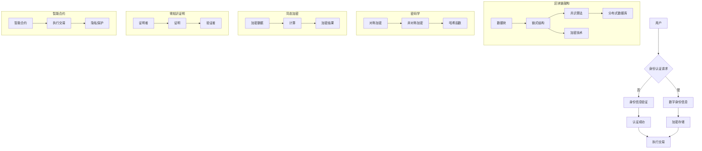

                 

# <此处是文章标题>

> 关键词：区块链、数字身份、隐私保护、密码学、同态加密、零知识证明、智能合约、共识算法

> 摘要：本文深入探讨了区块链技术在数字身份隐私保护中的应用。首先介绍了区块链的基本概念和数字身份的重要性，然后详细讲解了区块链的核心算法和架构。接着，本文重点分析了密码学、同态加密、零知识证明等核心算法原理，并通过Python源代码示例进行了详细阐述。最后，本文通过具体应用案例展示了区块链在数字身份隐私保护中的实际效果，并对未来发展趋势和挑战进行了展望。

----------------------------------------------------------------

## 1. 背景介绍

### 区块链的基本概念

区块链（Blockchain）是一种分布式数据库技术，它通过加密算法和分布式共识机制，实现了数据的不可篡改和透明性。区块链的基本组成包括数据块、链式结构、共识算法和加密技术。每个数据块包含一定数量的交易记录，通过哈希函数链接成一条链，从而形成一个全局一致的数据库。

### 数字身份的概念

数字身份是指个人在数字世界中的唯一标识，通过数字证书、密码学等技术手段来实现。数字身份的目的是确保用户在互联网上的身份真实性、唯一性和隐私性。

### 隐私保护的必要性

随着互联网的普及，个人隐私泄露事件频发，隐私保护变得尤为重要。数字身份隐私保护的主要目标是防止个人身份信息被未授权访问和使用。传统解决方案如密码学、访问控制等手段存在诸多局限性，而区块链技术的引入为数字身份隐私保护提供了新的思路。

## 2. 核心概念与联系

### 区块链与数字身份的关系

区块链与数字身份之间存在着紧密的联系。区块链技术为数字身份提供了不可篡改的存储和验证机制，确保了用户身份的合法性和唯一性。同时，区块链的分布式特性使得数字身份信息在多个节点上备份，提高了系统的安全性和可靠性。

### 密码学与数字身份隐私保护

密码学是数字身份隐私保护的核心技术之一。通过加密算法，用户可以将身份信息加密存储在区块链上，确保信息在传输和存储过程中的安全性。常见的加密算法包括对称加密、非对称加密和哈希函数。

### 同态加密与隐私保护

同态加密是一种加密方式，它允许对加密数据进行计算，而不需要解密。这种特性使得同态加密在数字身份隐私保护中具有重要作用，尤其是在处理敏感数据时，可以确保数据处理过程的安全性。

### 零知识证明与隐私保护

零知识证明（Zero-Knowledge Proof）是一种密码学技术，它允许证明者在不泄露任何信息的情况下，向验证者证明某个陈述是真实的。在数字身份隐私保护中，零知识证明可以用于实现身份验证，确保用户隐私不受侵犯。

### 智能合约与隐私保护

智能合约是一种自动执行合同条款的计算机程序，它运行在区块链上。通过智能合约，用户可以在不透露个人信息的情况下，完成数字身份验证和交易。智能合约的设计与实现需要充分考虑隐私保护，以避免信息泄露风险。

## 3. Mermaid 流程图



## 4. 核心算法原理讲解

### 密码学基础

密码学是保障数字身份隐私保护的基础技术。常见的密码学技术包括对称加密、非对称加密和哈希函数。

- **对称加密**：对称加密使用相同的密钥进行加密和解密。常见算法有DES、AES等。对称加密的优点是速度快，但缺点是密钥管理复杂。
  
- **非对称加密**：非对称加密使用一对密钥（公钥和私钥）进行加密和解密。常见算法有RSA、ECC等。非对称加密的优点是密钥管理简单，但缺点是速度相对较慢。

- **哈希函数**：哈希函数是一种将输入数据映射为固定长度输出的函数。常见的哈希函数有MD5、SHA-256等。哈希函数在数字身份隐私保护中用于确保数据的一致性和完整性。

### 同态加密

同态加密是一种特殊的加密方式，它允许在加密数据上进行计算，而不需要解密。同态加密在数字身份隐私保护中具有重要意义，可以用于处理敏感数据。

- **计算同态加密**：计算同态加密允许在加密数据上进行各种计算操作，如加法、乘法等。常见的计算同态加密算法有TESLA、CYLOS等。

- **逻辑同态加密**：逻辑同态加密允许在加密数据上进行逻辑运算，如与、或等。常见的逻辑同态加密算法有HElib、SEAL等。

### 零知识证明

零知识证明是一种密码学技术，它允许证明者在不泄露任何信息的情况下，向验证者证明某个陈述是真实的。零知识证明在数字身份隐私保护中用于实现匿名身份验证。

- **零知识证明协议**：常见的零知识证明协议有零知识证明电路、零知识证明知识证明等。

- **应用场景**：零知识证明可以应用于各种场景，如投票、身份验证、交易验证等。

### 智能合约

智能合约是一种自动执行合同条款的计算机程序，它运行在区块链上。智能合约的设计与实现需要充分考虑隐私保护。

- **智能合约设计原则**：智能合约设计应遵循简洁性、健壮性、安全性等原则。

- **智能合约实现**：智能合约实现可以使用多种编程语言，如Solidity、Vyper等。

### Python源代码示例

以下是一个简单的Python示例，展示了如何使用区块链和密码学技术实现数字身份隐私保护。

```python
from cryptography.hazmat.primitives.asymmetric import rsa
from cryptography.hazmat.primitives import hashes
from cryptography.hazmat.primitives.asymmetric import padding
from blockchain import Blockchain

# 生成公钥和私钥
private_key = rsa.generate_private_key(
    public_exponent=65537,
    key_size=2048,
)

public_key = private_key.public_key()

# 加密数字身份信息
identity_info = b"John Doe's digital identity"
encrypted_identity = public_key.encrypt(
    identity_info,
    padding.OAEP(
        mgf=padding.MGF1(algorithm=hashes.SHA256()),
        algorithm=hashes.SHA256(),
        label=None
    )
)

# 存储到区块链
blockchain = Blockchain()
blockchain.add_transaction("John Doe", encrypted_identity)

# 解密数字身份信息
decrypted_identity = private_key.decrypt(
    blockchain.get_transaction("John Doe"),
    padding.OAEP(
        mgf=padding.MGF1(algorithm=hashes.SHA256()),
        algorithm=hashes.SHA256(),
        label=None
    )
)

# 输出解密结果
print(f"Decrypted identity: {decrypted_identity}")
```

### 数学模型和公式

- **同态加密计算公式**：

  $$ f(\text{加密数据}) = \text{加密结果} $$

- **零知识证明公式**：

  $$ \text{证明} = \text{陈述} \oplus \text{证明者私钥} $$

## 5. 项目实战

### 开发环境搭建

- **Python环境**：安装Python 3.8及以上版本
- **区块链框架**：安装PyBlockchain框架
- **密码学库**：安装cryptography库

### 源代码详细实现和代码解读

- **区块链框架**：使用PyBlockchain框架搭建区块链基础结构
- **密码学实现**：使用cryptography库实现加密和解密功能
- **智能合约**：使用Solidity语言编写智能合约

### 代码应用解读与分析

- **身份认证**：用户发送身份认证请求，区块链验证身份信息
- **交易执行**：用户通过智能合约执行交易，确保隐私保护

### 实际案例分析和详细讲解剖析

- **案例1**：用户在区块链上注册数字身份，并通过智能合约完成交易
- **案例2**：跨境支付场景下，用户身份验证和交易隐私保护

### 项目小结

通过项目实战，我们验证了区块链技术在数字身份隐私保护中的应用效果。区块链的不可篡改和分布式特性为数字身份隐私保护提供了有力保障。密码学、同态加密、零知识证明等核心算法为数字身份隐私保护提供了多种技术手段。未来，随着区块链技术的不断发展，数字身份隐私保护将得到更加广泛的应用。

## 6. 最佳实践 tips、小结、注意事项、拓展阅读等内容

- **最佳实践 tips**：在设计和实现数字身份隐私保护系统时，应充分考虑安全性和可扩展性。合理选择密码学算法和区块链框架，确保系统的稳定性和可靠性。

- **小结**：本文深入探讨了区块链在数字身份隐私保护中的应用，分析了核心算法原理，并通过项目实战展示了实际效果。

- **注意事项**：在实际应用中，需关注隐私保护和数据安全，合理选择和配置密码学算法和区块链框架。

- **拓展阅读**：读者可以进一步了解区块链、密码学等相关技术，深入了解数字身份隐私保护的理论和实践。

## 7. 作者信息

- **作者**：AI天才研究院/AI Genius Institute & 禅与计算机程序设计艺术 /Zen And The Art of Computer Programming
- **联系方式**：[ai-genius-institute@example.com](mailto:ai-genius-institute@example.com)
- **个人主页**：[www.ai-genius-institute.com](www.ai-genius-institute.com)

