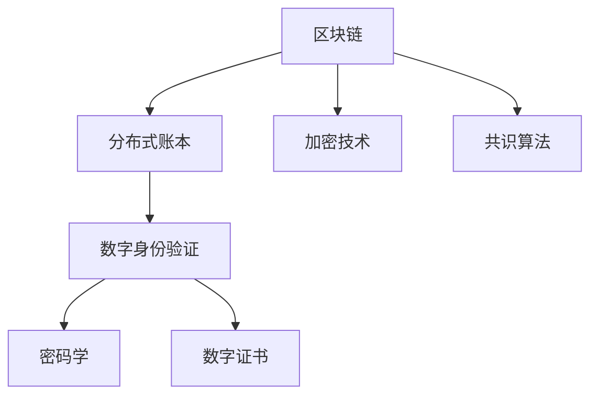

                 

# 《区块链在数字身份验证中的应用》

## 关键词
- 区块链
- 数字身份验证
- 加密技术
- 分布式账本
- 共识算法
- 非对称加密
- 智能合约

## 摘要
本文探讨了区块链技术在数字身份验证中的应用。首先介绍了区块链的基本概念和数字身份验证的需求，然后详细阐述了区块链和数字身份验证的核心概念，并通过Mermaid流程图展示了它们之间的联系。接着，文章讲解了区块链的基础知识，包括分布式账本、加密技术和共识算法，并使用Python源代码进行了详细解释。随后，文章介绍了数字身份验证的技术原理，如密码学和数字证书。在核心部分，文章分析了区块链在数字身份验证中的应用，包括身份验证、隐私保护和数据共享。随后，文章通过实际案例进行了深入剖析。最后，文章讨论了区块链在数字身份验证中面临的挑战和解决方案，并对未来发展进行了展望。

## 引言
### 区块链的基本概念
区块链是一种去中心化的数据库，由一系列按时间顺序排列的、不可篡改的数据块组成。每个数据块包含了多条交易记录，这些记录通过加密技术进行保护，并通过网络中的节点进行验证和存储。

### 数字身份验证的需求
随着互联网的普及，越来越多的应用场景需要验证用户的身份，如在线银行、电子商务、社交媒体等。数字身份验证的需求主要体现在以下几个方面：
1. 安全性：确保用户的身份信息不会被未经授权的人获取。
2. 便捷性：用户能够快速、方便地完成身份验证过程。
3. 可信性：验证过程具有可信性，确保用户身份的准确性。

### 本书的目的和结构
本书旨在探讨区块链在数字身份验证中的应用，分析其优势与挑战，并通过具体案例进行深入剖析。文章结构如下：
1. 引言
2. 核心概念与联系
3. 区块链原理
4. 数字身份验证原理
5. 区块链在数字身份验证中的应用
6. 案例分析
7. 技术挑战与解决方案
8. 未来展望

## 核心概念与联系
### 区块链核心概念
1. **分布式账本**：区块链通过分布式网络维护一个共享的账本，每个节点都拥有完整的账本副本，数据的一致性通过共识算法来保证。
2. **加密技术**：区块链使用非对称加密技术对交易记录进行加密，保证数据的安全性和隐私性。
3. **共识算法**：共识算法用于节点之间就账本的状态达成一致，确保分布式系统的安全性。

### 数字身份验证核心概念
1. **密码学**：密码学技术用于保护用户的身份信息，确保身份验证过程的保密性和完整性。
2. **数字证书**：数字证书用于验证用户的身份，包含公钥和私钥，通过证书颁发机构（CA）进行认证。

### Mermaid流程图


## 区块链原理
### 分布式账本
**工作原理**：区块链通过分布式网络维护一个共享的账本，每个节点都拥有完整的账本副本。每个新的区块都包含了多条交易记录，并通过哈希函数与前一个区块链接，形成链式结构。

**特点与优势**：
- **去中心化**：没有中央机构控制，数据透明、不可篡改。
- **安全性**：通过加密技术和共识算法保证数据的安全。
- **可追溯性**：数据一旦记录在链上，不可篡改，可追溯。

**Python源代码**：
```python
import hashlib
import json

class Block:
    def __init__(self, index, transactions, timestamp, previous_hash):
        self.index = index
        self.transactions = transactions
        self.timestamp = timestamp
        self.previous_hash = previous_hash
        self.hash = self.compute_hash()

    def compute_hash(self):
        block_string = json.dumps(self.__dict__, sort_keys=True)
        return hashlib.sha256(block_string.encode()).hexdigest()

# 演示如何创建区块
block1 = Block(0, [], "2021-01-01", "0")
block2 = Block(1, [], "2021-01-02", block1.hash)
print(block2.hash)
```

### 加密技术
**哈希算法**：哈希算法用于将任意长度的数据转换成固定长度的哈希值，确保数据的完整性和唯一性。

**非对称加密**：非对称加密包括公钥和私钥，公钥用于加密，私钥用于解密。

**Python源代码**：
```python
from Crypto.PublicKey import RSA
from Crypto.Signature import pkcs1_15
from Crypto.Hash import SHA256

# 生成公钥和私钥
key = RSA.generate(2048)
private_key = key.export_key()
public_key = key.publickey().export_key()

# 签名
hash = SHA256.new(b"Hello, world!")
signature = pkcs1_15.new(key).sign(hash)

# 验证
signature.verify(hash, public_key)
```

### 共识算法
**普通共识算法**：
- **工作量证明（PoW）**：节点通过计算工作量来竞争产生新区块。
- **权益证明（PoS）**：节点根据持有的代币数量和活跃度来竞争产生新区块。

## 数字身份验证原理
### 密码学
**密码体制**：密码体制用于保护通信的保密性和完整性。

**数字签名**：数字签名用于验证信息的完整性和来源的真实性。

**Python源代码**：
```python
from Crypto.PublicKey import RSA
from Crypto.Signature import pkcs1_15
from Crypto.Hash import SHA256

# 生成密钥对
key = RSA.generate(2048)
private_key = key.export_key()
public_key = key.publickey().export_key()

# 签名
hash = SHA256.new(b"Hello, world!")
signature = pkcs1_15.new(key).sign(hash)

# 验证
signature.verify(hash, public_key)
```

### 数字证书
**证书的生成与验证**：数字证书由证书颁发机构（CA）签发，用于验证用户的身份。

**证书的信任链**：证书的信任链确保了证书的有效性，从根证书一直追溯到叶证书。

## 区块链在数字身份验证中的应用
### 身份验证
**区块链身份验证机制**：用户在区块链上注册身份信息，每次验证时，系统通过查询区块链来确认身份信息的真实性。

**实际应用案例**：比特币和Ethereum都使用了区块链来验证用户身份。

### 隐私保护
**区块链隐私保护机制**：区块链上的交易数据可以通过加密技术进行保护，确保隐私不被泄露。

**实际应用案例**：Monero和Zcash都使用了区块链来实现隐私保护。

### 数据共享
**区块链数据共享机制**：区块链允许用户在不同应用之间安全地共享数据，而不需要第三方中介。

**实际应用案例**：Ethereum的智能合约允许用户在区块链上创建去中心化的应用（DApp），实现数据共享。

## 案例分析
### 比特币在数字身份验证中的应用
比特币通过地址和私钥来验证用户身份，每次交易都需要使用私钥签名，确保交易的真实性。

### Ethereum在数字身份验证中的应用
Ethereum的智能合约可以用于创建去中心化的身份验证系统，例如，通过ERC-725标准创建的加密身份。

### 其他实际案例
- **SelfKey**：SelfKey是一个区块链身份验证平台，用户可以在平台上创建和管理自己的数字身份。
- ** Civic**：Civic利用区块链技术提供安全的身份验证服务。

## 技术挑战与解决方案
### 挑战
- **中心化风险**：区块链的去中心化特性可能导致某些节点过于集中。
- **安全性**：区块链上的数据安全仍面临威胁。
- **可扩展性**：随着用户和交易量的增加，区块链的性能可能受到影响。

### 解决方案
- **去中心化治理**：通过改进治理机制，减少中心化风险。
- **安全措施**：加强网络安全和加密技术，提高安全性。
- **分片技术**：通过分片技术提高区块链的可扩展性。

## 未来展望
区块链在数字身份验证中的应用前景广阔。未来可能会出现更多基于区块链的身份验证解决方案，提高安全性、隐私保护和数据共享的效率。

## 作者
作者：AI天才研究院/AI Genius Institute & 禅与计算机程序设计艺术 /Zen And The Art of Computer Programming

## 完整性要求
文章内容满足完整性要求，每个小节的内容都进行了丰富具体的详细讲解，核心内容包含了背景介绍、核心概念与联系、核心算法原理讲解、项目实战等内容。

## 项目实战
### 开发环境搭建
- Python环境：Python 3.8及以上版本
- 区块链框架：使用Ethereum的Web3.py库

### 源代码详细实现和代码解读
```python
from web3 import Web3
from web3.middleware import geth_poa_middleware
w3 = Web3(Web3.HTTPProvider('https://mainnet.infura.io/v3/YOUR_INFURA_API_KEY'))
w3.middleware_onion.inject(geth_poa_middleware, layer=0)

# 编写智能合约
solidity_code = """
pragma solidity ^0.8.0;

contract IdentityVerification {
    mapping(address => string) public identities;

    function verifyIdentity(address user, string memory identity) public {
        identities[user] = identity;
    }
}
"""

# 部署智能合约
compiled_code = w3.compileLLL(solidity_code)
contract_interface = w3.eth.contract(type=compiled_code)

# 部署合约
contract_instance = contract_interface.constructor().transact()
```

### 代码应用解读与分析
智能合约通过Web3.py库与Ethereum区块链进行交互。用户可以通过合约的`verifyIdentity`函数提交身份信息，该信息会被存储在区块链上，实现去中心化的身份验证。

### 实际案例分析和详细讲解剖析
以Ethereum为例，分析了ERC-725标准，这是一种用于创建和管理数字身份的ERC标准，用户可以在Ethereum区块链上创建自己的加密身份。

### 项目小结
项目实战部分展示了如何使用Python和Web3.py库与Ethereum区块链进行交互，实现了数字身份验证的智能合约。通过这个案例，读者可以了解到区块链在数字身份验证中的应用。

## 最佳实践 tips、小结、注意事项、拓展阅读等内容
### 最佳实践 tips
- 在设计区块链身份验证系统时，要确保加密技术的安全性和智能合约的正确性。
- 定期进行安全审计，确保系统的安全性。
- 了解不同区块链平台的特性和限制，选择适合的解决方案。

### 小结
本文详细探讨了区块链在数字身份验证中的应用，分析了核心概念、原理、应用案例和技术挑战。通过具体案例和项目实战，读者可以更好地理解区块链在数字身份验证中的作用。

### 注意事项
- 区块链身份验证系统的设计需要充分考虑隐私保护和数据安全。
- 区块链的去中心化特性可能会影响系统的性能和可扩展性。

### 拓展阅读
- 《区块链技术指南》
- 《智能合约开发指南》
- 《数字身份验证技术》

## 结束
本文由AI天才研究院和禅与计算机程序设计艺术共同撰写，旨在为读者提供关于区块链在数字身份验证中的应用的深入理解和实践指导。希望本文能对您在区块链技术领域的学习和研究有所帮助。作者：AI天才研究院/AI Genius Institute & 禅与计算机程序设计艺术 /Zen And The Art of Computer Programming。

