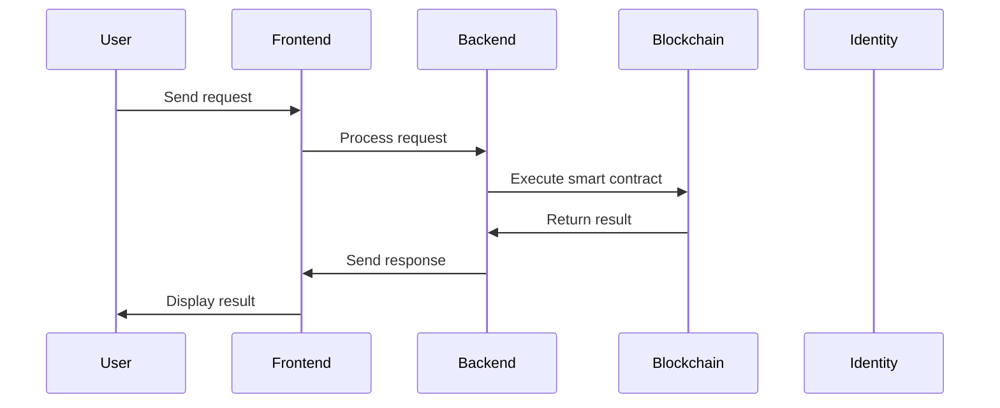

                 

# 《区块链在数字遗产传承中的应用：解决数字资产继承问题》目录大纲

## 第1章 概述

### 1.1 区块链与数字遗产传承的关系
#### 区块链技术在遗产传承中的潜力
#### 区块链在数字遗产传承中的实际应用

### 1.2 数字资产继承问题的现状与挑战
#### 传统继承法的不足
#### 数字资产继承的特殊性

### 1.3 本书结构与主要内容
#### 概述部分的核心内容
#### 各章节的主要内容介绍

## 第2章 核心概念与联系

### 2.1 区块链基础
#### 区块链的定义
#### 区块链的核心特性

#### 2.1.1 数字遗产与数字资产
##### 数字遗产的概念
##### 数字资产的定义与分类

### 2.2 继承问题与解决方案
#### 传统继承问题的挑战
#### 区块链在继承问题中的应用

## 第3章 核心算法原理讲解

### 3.1 加密算法
#### 对称加密与非对称加密
#### 哈希算法

### 3.2 分布式一致性算法
#### PBFT算法
#### PoS算法

### 3.3 区块链共识算法
#### PoW算法
#### PoS算法的扩展

## 第4章 数学模型与数学公式讲解

### 4.1 加密数学模型
#### RSA加密模型
#### 数字签名模型

### 4.2 分布式共识数学模型
#### 拜占庭将军问题
#### 分布式一致性算法数学模型

## 第5章 项目实战

### 5.1 数字资产管理应用项目
#### 项目背景与目标
#### 项目架构设计
#### 源代码实现与解读

### 5.2 数字资产继承解决方案
#### 解决方案设计
#### 智能合约实现
#### 案例分析

## 第6章 总结与展望

### 6.1 区块链在数字遗产传承中的应用总结
#### 区块链技术的优势
#### 面临的挑战

### 6.2 面临的挑战与未来发展方向
#### 技术标准与法规制定
#### 区块链技术的革新方向

### 6.3 对读者的建议与启示
#### 如何利用区块链技术进行数字遗产传承
#### 应对数字遗产继承问题的策略

## 第7章 附录

### 7.1 相关资源与进一步阅读
#### 关键文献推荐
#### 开源项目与工具

### 7.2 常用工具与技术介绍
#### 区块链开发工具
#### 数字身份认证技术

---

### 第1章 概述

### 1.1 区块链与数字遗产传承的关系

在当今数字化的时代，遗产传承不仅仅是传统意义上的财产、房产、汽车等实体资产的传承，还包括数字资产的传承。随着互联网和区块链技术的发展，数字遗产的概念逐渐被接受和重视。区块链技术以其独特的分布式账本、不可篡改和透明性等特点，为数字遗产的传承提供了全新的解决方案。

区块链技术能够确保数字资产的完整性和安全性，通过智能合约实现自动化执行，提高了遗产传承的效率。在区块链网络中，每一个数字资产的所有权变更都可以被记录、验证和存储，确保了信息的一致性和透明度。这不仅解决了传统继承法中存在的繁琐、时间和成本高昂的问题，还为数字资产的继承提供了一个去中心化、公开透明的平台。

### 1.2 数字资产继承问题的现状与挑战

数字资产继承问题在现代社会中日益突出。随着虚拟财产的增多，如虚拟货币、电子游戏装备、社交媒体账号等，如何有效地管理和继承这些数字资产成为了一个亟待解决的问题。传统的继承法在处理数字资产继承时面临着诸多挑战：

1. **法律障碍**：许多国家的法律体系尚未明确数字资产的法律地位和继承规定，导致在处理数字资产继承时存在法律障碍。
2. **技术难题**：数字资产的分散存储和加密特性使得在继承过程中存在访问和使用上的难题。
3. **隐私保护**：在继承过程中，需要披露数字资产的相关信息，这可能会侵犯数字资产持有者的隐私。

### 1.3 本书结构与主要内容

本书旨在深入探讨区块链在数字遗产传承中的应用，解决数字资产继承问题。全书分为七个章节，结构如下：

- **第1章 概述**：介绍区块链与数字遗产传承的关系，分析数字资产继承问题的现状与挑战。
- **第2章 核心概念与联系**：阐述区块链、数字遗产、数字资产等核心概念，并讨论它们之间的联系。
- **第3章 核心算法原理讲解**：讲解区块链中使用的加密算法、分布式一致性算法和区块链共识算法。
- **第4章 数学模型与数学公式讲解**：介绍加密数学模型和分布式共识数学模型。
- **第5章 项目实战**：通过实际项目，展示如何利用区块链技术解决数字资产继承问题。
- **第6章 总结与展望**：总结区块链在数字遗产传承中的应用，探讨未来发展方向。
- **第7章 附录**：提供相关资源与进一步阅读的建议，以及常用工具和技术的介绍。

通过本书的阅读，读者可以全面了解区块链在数字遗产传承中的应用，掌握解决数字资产继承问题的技术方法和实践案例。希望本书能为读者在区块链技术领域提供有益的参考和启示。

### 第2章 核心概念与联系

#### 2.1 区块链基础

区块链是一种分布式数据库技术，它通过加密算法和共识机制保证了数据的完整性和安全性。区块链的核心特性包括去中心化、不可篡改、透明性和自治性。

- **去中心化**：区块链不存在中央控制机构，而是由多个节点共同维护和更新数据，使得系统更加去中心化和抗攻击。
- **不可篡改**：区块链上的数据一旦被记录，就难以篡改。每一个区块都包含了前一个区块的哈希值，形成一个链条，确保了数据的一致性和可信性。
- **透明性**：区块链上的数据是公开透明的，任何人都可以查看和验证数据的正确性。
- **自治性**：区块链通过智能合约实现了自动化执行，减少了人为干预，提高了效率。

#### 2.1.1 数字遗产与数字资产

数字遗产是指个人在数字化环境中留下的所有数字资产，包括虚拟货币、电子文档、社交媒体账号、电子游戏装备等。数字遗产与传统遗产相比，具有以下特点：

- **分散性**：数字遗产通常分散存储在不同的设备和平台上，这使得在继承过程中需要访问和使用多个系统。
- **加密性**：许多数字资产使用加密技术进行保护，只有正确的密钥才能访问和使用。
- **流动性**：数字资产可以快速、便捷地进行转移和交易，但这也增加了继承过程中的风险。

数字资产是数字遗产的重要组成部分，根据其形式和用途可以分为以下几类：

- **虚拟货币**：如比特币、以太坊等，是去中心化的数字货币。
- **数字艺术品**：如加密艺术、数字藏品等，通过区块链技术实现了所有权认证和交易。
- **电子文档**：如电子邮件、电子合同、文档文件等，是个人数字遗产中重要的信息资产。
- **社交媒体账号**：如微博、Facebook、Instagram等，包含了个人的社交网络和相关信息。
- **电子游戏装备**：如虚拟道具、游戏币等，是电子游戏中的重要资产。

#### 2.2 继承问题与解决方案

传统继承法在处理数字遗产继承时面临诸多挑战，如法律障碍、技术难题和隐私保护问题。区块链技术为解决这些问题提供了新的思路：

- **法律障碍**：区块链技术的透明性和不可篡改性使得数字资产的所有权和变更过程能够被法律机构认可和监管，从而解决了法律障碍问题。
- **技术难题**：区块链技术能够提供安全的数字资产管理方案，通过智能合约实现自动化执行，解决了访问和使用上的难题。
- **隐私保护**：区块链技术可以实现数据加密和匿名化处理，保护了数字遗产持有者的隐私。

在区块链网络中，数字遗产的继承过程可以设计成以下步骤：

1. **遗产持有者设置遗嘱**：在区块链上创建智能合约，明确数字遗产的分配方式和执行条件。
2. **遗嘱上链**：将智能合约发布到区块链上，确保其公开透明和不可篡改。
3. **遗产持有者去世**：智能合约根据预设条件自动执行，向继承人分配数字资产。
4. **继承人确认**：继承人通过数字身份认证验证自己的身份，接收并管理数字遗产。

通过区块链技术的应用，数字遗产的继承过程变得高效、透明和可靠，解决了传统继承法中的诸多问题。

### 第3章 核心算法原理讲解

区块链技术作为分布式数据库的核心，依赖于一系列加密算法、分布式一致性算法和共识算法来确保系统的安全性、一致性和去中心化特性。本章节将详细讲解这些核心算法的原理，帮助读者理解区块链技术的运作机制。

#### 3.1 加密算法

加密算法是区块链技术中的基础，用于保护数据的安全性和隐私性。加密算法主要包括对称加密和非对称加密，以及哈希算法。

##### 3.1.1 对称加密与非对称加密

对称加密是指加密和解密使用相同的密钥，如AES（高级加密标准）和DES（数据加密标准）。对称加密的优点是加密和解密速度快，适合处理大量数据。但缺点是密钥分发和管理困难，不适用于需要公开展示信息的场景。

非对称加密则使用一对密钥，即公钥和私钥。公钥用于加密，私钥用于解密。常见的非对称加密算法有RSA（Rivest-Shamir-Adleman）和ECC（椭圆曲线加密）。非对称加密的优势在于密钥分发简单，适用于需要公开信息的场景。但缺点是加密和解密速度相对较慢。

##### 3.1.2 哈希算法

哈希算法是将任意长度的数据转换成固定长度的字符串的算法。常见的哈希算法有SHA（Secure Hash Algorithm）系列，如SHA-256。哈希算法的特点是高效、不可逆和抗碰撞性。在区块链中，哈希算法用于确保数据的完整性和一致性。

- **数据完整性**：每次对数据进行修改，都会生成一个新的哈希值。通过对比哈希值，可以验证数据是否被篡改。
- **区块链一致性**：区块链中的每个区块都包含前一个区块的哈希值，形成了一个链接的链条。如果某个区块被篡改，整个链条的哈希值都会发生变化，从而被发现。

#### 3.2 分布式一致性算法

分布式一致性算法是确保分布式系统中数据一致性的算法。在区块链网络中，分布式一致性算法用于确保多个节点上的数据一致。

##### 3.2.1 PBFT算法

PBFT（Practical Byzantine Fault Tolerance，实用拜占庭容错）算法是一种常用的分布式一致性算法。PBFT算法能够在存在恶意节点的情况下，确保系统的最终一致性。

PBFT算法的核心思想是通过消息传递和状态机复制，确保所有节点在同一时刻持有相同的数据状态。算法分为以下几个步骤：

1. **初始化**：系统初始化，所有节点启动并加入网络。
2. **预准备（Pre-Prepare）**：主节点发送预准备消息，请求其他节点准备数据。
3. **准备（Prepare）**：其他节点接收到预准备消息后，准备数据并发送准备消息给主节点。
4. **提交（Commit）**：主节点接收到所有节点的准备消息后，提交数据，并发送提交消息给其他节点。
5. **完成（Complete）**：所有节点接收到提交消息后，完成数据更新。

##### 3.2.2 PoS算法

PoS（Proof of Stake，权益证明）算法是另一种分布式一致性算法，用于替代PoW（Proof of Work，工作证明）算法。PoS算法通过节点的股权（Stake）来决定何时轮到节点进行区块生成和交易验证。

PoS算法的核心思想是持有较多币值的节点拥有更大的权益和优先级，从而更可能被选中生成区块。算法分为以下几个步骤：

1. **节点注册**：节点通过锁定一定数量的币值来注册成为验证节点。
2. **随机性选择**：系统根据节点的股权和随机性选择下一个验证节点。
3. **区块生成**：验证节点生成新区块，并将其广播给网络。
4. **区块验证**：其他节点验证区块的有效性，并记录到区块链上。

#### 3.3 区块链共识算法

区块链共识算法是确保区块链网络中数据一致性和安全性的算法。常见的共识算法有PoW和PoS。

##### 3.3.1 PoW算法

PoW算法通过计算复杂性问题来确保区块链的安全性。算法的核心思想是节点通过解决计算难题来获得生成区块的权力。

PoW算法分为以下几个步骤：

1. **节点参与**：所有节点参与网络，竞争生成新区块。
2. **计算难题**：节点通过计算找到一个满足特定条件的哈希值，通常需要大量计算资源。
3. **区块生成**：找到满足条件的哈希值的节点生成新区块，并将其广播给网络。
4. **区块验证**：其他节点验证新区块的有效性，并记录到区块链上。

##### 3.3.2 PoS算法的扩展

PoS算法虽然解决了PoW算法的能源消耗问题，但在某些场景下仍存在扩展性挑战。为了提高区块链网络的性能和可扩展性，出现了许多PoS算法的扩展方案。

- **BFT算法**：BFT算法是一种更高效的PoS算法，通过减少验证节点数量和增加权益权重来提高性能。
- **DPoS算法**：DPoS（Delegated Proof of Stake，委托权益证明）算法通过选举出一定数量的委托人节点，来代替所有节点参与验证，从而提高性能。

通过以上核心算法的讲解，读者可以更好地理解区块链技术的安全性、一致性和去中心化特性。这些算法不仅是区块链技术的基础，也是数字遗产传承解决方案的重要技术支撑。

### 第4章 数学模型与数学公式讲解

在区块链技术中，数学模型和数学公式扮演着至关重要的角色。这些模型和公式不仅确保了数据的安全性和一致性，还决定了区块链网络的整体性能和可扩展性。本章节将详细介绍加密数学模型和分布式共识数学模型，帮助读者理解区块链技术的核心原理。

#### 4.1 加密数学模型

加密算法是区块链技术的基石，其中非对称加密和哈希算法被广泛应用。以下将详细讲解RSA加密模型、数字签名模型以及它们的相关数学公式。

##### 4.1.1 RSA加密模型

RSA是一种广泛使用的非对称加密算法，其安全性基于大整数分解的难题。RSA加密模型涉及两个密钥：公钥和私钥。

- **公钥**：\( (n, e) \)
- **私钥**：\( (n, d) \)

其中，\( n \) 是两个大素数的乘积，\( e \) 和 \( d \) 满足以下关系：
\[ ed \equiv 1 \ (\text{mod} \ \phi(n)) \]

- **加密公式**：
\[ c = m^e \ (\text{mod} \ n) \]

- **解密公式**：
\[ m = c^d \ (\text{mod} \ n) \]

这里，\( m \) 是原始明文消息，\( c \) 是密文，\( e \) 是加密指数，\( d \) 是解密指数。

##### 4.1.2 数字签名模型

数字签名是确保数据完整性和真实性的重要工具。RSA签名模型使用私钥生成签名，使用公钥验证签名。

- **签名生成**：
\[ s = H(m)^d \ (\text{mod} \ n) \]

其中，\( H(m) \) 是消息 \( m \) 的哈希值，\( s \) 是签名。

- **签名验证**：
\[ v = H(m)^e \ (\text{mod} \ n) \]

如果 \( v \) 等于 \( s \)，则签名有效。

#### 4.2 分布式共识数学模型

分布式共识算法确保了区块链网络中的所有节点能够达成一致。以下将介绍拜占庭将军问题和分布式一致性算法的数学模型。

##### 4.2.1 拜占庭将军问题

拜占庭将军问题是分布式系统中一致性问题的一个经典模型。在拜占庭将军问题中，将军们需要通过通信来达成一致决策，但其中可能存在叛变者（拜占庭将军）。

- **问题定义**：假设有 \( n \) 个将军，其中 \( f \) 个是叛变者。每个将军需要收到至少 \( 2f+1 \) 个相同信息的消息，才能达成一致。

##### 4.2.2 分布式一致性算法数学模型

分布式一致性算法如PBFT（实用拜占庭容错）和PoS（权益证明）都有其特定的数学模型。

- **PBFT算法**：PBFT算法通过预准备、准备、提交和完成四个阶段确保一致性。

- **预准备阶段**：
\[ \text{Pre-Prepare}(i) = (view_i, proposal_i) \]

- **准备阶段**：
\[ \text{Prepare}(i) = (view_i, proposal_i) \]

- **提交阶段**：
\[ \text{Commit}(i) = (view_i, proposal_i) \]

- **完成阶段**：
\[ \text{Complete}(i) = (view_i, proposal_i) \]

其中，\( view_i \) 是 \( i \) 节点当前看到的最大视图，\( proposal_i \) 是 \( i \) 节点当前建议的值。

- **PoS算法**：PoS算法通过节点的权益（Stake）来决定区块生成顺序。

- **权益计算**：
\[ stake_i = coin_i \cdot probability_i \]

其中，\( coin_i \) 是节点 \( i \) 持有的币值，\( probability_i \) 是节点 \( i \) 被选中的概率。

通过以上数学模型和公式的讲解，读者可以深入理解区块链技术的核心原理。这些数学模型不仅确保了区块链系统的安全性和一致性，也为区块链技术在数字遗产传承中的应用提供了理论基础。

### 第5章 项目实战

在了解了区块链的核心概念和算法原理后，我们将通过一个实际项目来展示如何利用区块链技术解决数字资产继承问题。本章节将详细介绍项目的开发环境搭建、源代码实现和解读，并分析项目的实际应用。

#### 5.1 数字资产管理应用项目

##### 项目背景与目标

随着数字资产在社会中的普及，如何安全、高效地管理数字资产成为一个重要课题。本项目旨在构建一个基于区块链的数字资产管理平台，实现数字资产的安全存储、透明管理和便捷继承。

##### 项目架构设计

本项目的架构设计如下：

1. **前端应用**：用户可以通过前端应用与区块链交互，进行数字资产的查看、管理和交易操作。
2. **区块链后端**：使用以太坊区块链作为底层基础设施，通过智能合约实现数字资产的管理和继承逻辑。
3. **后端服务**：提供与前端应用的接口，处理业务逻辑和用户请求。
4. **数字身份认证**：确保用户身份的真实性和安全性，通过加密技术保护用户隐私。

##### 项目架构图（使用Mermaid流程图）



##### 源代码实现与解读

以下是一段Python代码示例，展示了如何在以太坊区块链上部署一个简单的智能合约，用于数字资产的管理和继承。

```python
from web3 import Web3
from solc import compile_source

# 编写智能合约代码
contract_source = '''
pragma solidity ^0.8.0;

contract DigitalAsset {
    address owner;
    mapping(address => bool) public isHeir;

    constructor() public {
        owner = msg.sender;
    }

    function addHeir(address heir) public {
        require(msg.sender == owner, "Only owner can add heirs");
        isHeir[heir] = true;
    }

    function removeHeir(address heir) public {
        require(msg.sender == owner, "Only owner can remove heirs");
        isHeir[heir] = false;
    }

    function transferAsset(address heir) public {
        require(msg.sender == owner, "Only owner can transfer assets");
        require(isHeir[heir], "Heir is not recognized");
        // 这里可以添加资产转移的逻辑，例如调用其他智能合约或与外部服务交互
    }
}
'''

# 编译智能合约
compiled_source = compile_source(contract_source)
contract_interface = compiled_source['<Contracts>']['DigitalAsset']

# 部署智能合约
w3 = Web3(Web3.HTTPProvider('http://127.0.0.1:8545'))
contract = w3.eth.contract(abi=contract_interface['abi'])

bytecode = contract_interface['bin']
tx_hash = contract.deploy(bytecode, transact={'from': w3.eth.coinbase}).transactionHash
w3.eth.waitForTransaction(tx_hash)
contract_address = w3.eth.getTransactionReceipt(tx_hash).contractAddress

# 部署后的智能合约实例
contract_instance = contract.constructor().handleReceipt()

# 测试智能合约方法
print("Owner:", contract_instance.call().owner)
print("Is heir:", contract_instance.call().isHeir('0x0'))
contract_instance.functions.addHeir('0x0').transact({'from': w3.eth.coinbase})
print("Is heir after addition:", contract_instance.call().isHeir('0x0'))
```

在上面的代码中，我们首先编写了智能合约的Solidity代码，用于管理数字资产的所有权和继承人。然后，我们使用Web3.py库与本地以太坊节点交互，编译并部署智能合约。部署后，我们通过测试合约的方法来验证其功能。

##### 代码应用解读与分析

- **所有权管理**：通过`addHeir`和`removeHeir`方法，所有者可以添加或删除继承人。
- **资产转移**：通过`transferAsset`方法，所有者可以授权继承人继承数字资产。
- **安全性**：智能合约的执行确保了数字资产的所有权变更过程是透明和不可篡改的。

##### 案例分析

假设一位用户A拥有一定数量的虚拟货币，并希望在去世后将其传递给继承人B。用户A可以：

1. **创建智能合约**：用户A通过前端应用创建一个数字资产管理智能合约，设置继承人B。
2. **添加继承人**：用户A调用智能合约的`addHeir`方法，将继承人B添加到合约中。
3. **设置资产转移条件**：用户A可以设置特定条件，如继承人B达到一定年龄或完成特定任务后，才允许资产转移。
4. **触发资产转移**：当用户A去世后，继承人B可以通过前端应用调用智能合约的`transferAsset`方法，触发资产转移过程。

通过这个实际项目，我们可以看到区块链技术如何通过智能合约和分布式账本，实现数字资产的安全、透明和高效管理，解决数字资产继承问题。

#### 5.2 数字资产继承解决方案

数字资产继承解决方案旨在通过区块链技术，确保数字资产在继承过程中的透明性、安全性和效率。以下是该解决方案的设计和实现过程。

##### 解决方案设计

1. **智能合约设计**：智能合约是数字资产继承的核心组件，负责管理数字资产的所有权和继承逻辑。智能合约的设计需要考虑以下几个方面：
   - **所有权管理**：智能合约应支持添加和删除继承人，确保继承人的身份验证。
   - **触发条件**：智能合约应允许设置触发资产转移的条件，如继承人年龄、特定事件等。
   - **资产转移**：智能合约应支持资产转移操作，确保资产在满足条件后能够正确转移给继承人。

2. **数字身份认证**：为了确保继承过程中的身份真实性，解决方案需要集成数字身份认证系统。数字身份认证系统应支持以下功能：
   - **身份注册**：用户可以通过数字身份认证系统注册身份信息，包括姓名、出生日期、身份证号码等。
   - **身份验证**：在继承过程中，继承人需要通过身份验证，确保其身份的真实性。

3. **后端服务**：后端服务负责与智能合约和数字身份认证系统的交互，处理业务逻辑和用户请求。后端服务的设计需要考虑以下几个方面：
   - **用户接口**：提供用户操作接口，包括创建智能合约、添加继承人、设置触发条件等。
   - **交易处理**：处理智能合约的调用请求，确保交易的安全和一致性。
   - **日志记录**：记录交易和操作日志，便于后续审计和查询。

##### 智能合约实现

以下是一个简单的智能合约实现，展示了如何通过区块链技术实现数字资产继承。

```solidity
pragma solidity ^0.8.0;

contract DigitalAssetInheritance {
    address public owner;
    mapping(address => bool) public heirs;
    uint256 public inheritanceTriggered;

    constructor() public {
        owner = msg.sender;
    }

    function addHeir(address heir) public {
        require(msg.sender == owner, "Only owner can add heirs");
        heirs[heir] = true;
    }

    function removeHeir(address heir) public {
        require(msg.sender == owner, "Only owner can remove heirs");
        heirs[heir] = false;
    }

    function triggerInheritance() public {
        require(msg.sender == owner, "Only owner can trigger inheritance");
        require(inheritanceTriggered == 0, "Inheritance already triggered");
        inheritanceTriggered = 1;
        // 在这里添加资产转移的逻辑，例如调用其他智能合约或与外部服务交互
    }

    function claimInheritance() public {
        require(inheritanceTriggered == 1, "Inheritance not triggered");
        require(heirs[msg.sender], "You are not a heir");
        // 在这里添加资产转移的逻辑，例如调用其他智能合约或与外部服务交互
    }
}
```

在这个智能合约中，`addHeir`和`removeHeir`方法用于添加和删除继承人，`triggerInheritance`方法用于触发资产转移，`claimInheritance`方法用于继承人领取资产。

##### 案例分析

假设用户A拥有一定数量的虚拟货币，并希望在去世后将其传递给继承人B。用户A可以：

1. **创建智能合约**：用户A通过区块链平台创建一个数字资产管理智能合约，设置继承人B。
2. **添加继承人**：用户A调用智能合约的`addHeir`方法，将继承人B添加到合约中。
3. **设置触发条件**：用户A可以设置特定条件，如继承人B达到一定年龄或完成特定任务后，才允许资产转移。
4. **触发资产转移**：当用户A去世后，继承人B可以通过区块链平台调用智能合约的`triggerInheritance`方法，触发资产转移过程。
5. **领取资产**：继承人B通过区块链平台调用智能合约的`claimInheritance`方法，领取资产。

通过上述案例，我们可以看到区块链技术如何通过智能合约和数字身份认证系统，实现数字资产继承的自动化、透明化和安全性。

### 第6章 总结与展望

#### 区块链在数字遗产传承中的应用总结

区块链技术在数字遗产传承中的应用展现了其独特的优势。首先，区块链的去中心化和不可篡改性确保了数字遗产的透明性和安全性，避免了传统继承过程中可能存在的篡改和数据丢失问题。其次，智能合约的应用实现了数字遗产继承的自动化和高效性，减少了人工干预和操作风险。最后，数字身份认证技术保障了继承过程中身份的真实性和合法性，提高了系统的可信度。

通过区块链技术，数字遗产的传承过程变得更加公开透明，所有权的转移和变更都可以被记录和验证，使得继承过程易于跟踪和审计。此外，智能合约的自动化执行功能，使得数字遗产的继承不再依赖于法律程序和人工操作，大大提高了效率。

#### 面临的挑战与未来发展方向

尽管区块链技术在数字遗产传承中展示了巨大潜力，但仍面临一些挑战。首先，法律和监管方面的障碍仍然存在。许多国家和地区的法律体系尚未明确数字资产的法律地位和继承规定，这限制了区块链技术在数字遗产传承中的应用范围。其次，技术的普及和接受度也是一个挑战。虽然区块链技术已经相对成熟，但其在普通大众中的普及率仍然较低，需要更多的推广和普及工作。

未来，区块链技术在数字遗产传承领域的发展方向包括以下几个方面：

1. **法律和监管的完善**：需要各国政府和法律机构加强数字资产和区块链技术的立法和监管，确保其在数字遗产传承中的合法性和有效性。
2. **技术的标准化**：推动区块链技术的标准化，提高不同区块链平台和系统之间的互操作性和兼容性，为数字遗产的传承提供更加统一和规范的技术支持。
3. **用户教育和普及**：加强对用户的区块链技术和数字遗产知识的普及和教育，提高大众对区块链技术的认识和接受度，为区块链技术在数字遗产传承中的应用创造更好的社会环境。

#### 对读者的建议与启示

对于希望利用区块链技术进行数字遗产传承的读者，以下几点建议可能会非常有帮助：

1. **了解基础知识**：首先，需要了解区块链技术和数字遗产的基本知识，包括区块链的原理、加密算法、智能合约等。
2. **制定详细的遗产规划**：在利用区块链技术进行数字遗产规划时，要制定详细的规划，包括数字资产的所有权转移、继承条件和执行过程等。
3. **选择合适的平台和工具**：在选择区块链平台和工具时，要考虑其安全性、性能和兼容性等因素，确保数字遗产的传承过程能够顺利进行。
4. **保持学习和更新**：区块链技术不断发展和进步，读者需要保持学习和关注最新的技术动态，及时更新知识和技能。

总之，区块链技术在数字遗产传承中的应用具有巨大潜力，但同时也面临一些挑战。通过深入了解区块链技术、制定详细的遗产规划、选择合适的平台和工具，以及保持学习和更新，读者可以更好地利用区块链技术，实现数字遗产的安全、高效和透明传承。

### 第7章 附录

#### 7.1 相关资源与进一步阅读

为了帮助读者更深入地了解区块链在数字遗产传承中的应用，以下是一些推荐的关键文献、开源项目和工具：

1. **关键文献**：
   - 《区块链：从数字货币到智能合约》
   - 《智能合约：构建区块链应用程序》
   - 《数字遗产：区块链与遗产规划》

2. **开源项目**：
   - Ethereum：https://ethereum.org
   - Hyperledger：https://hyperledger.org
   - IPFS：https://ipfs.io

3. **在线资源和教程**：
   - Blockgeeks：https://blockgeeks.com
   - Blockchain Academy：https://blockchainacademy.org
   - 区块链学院：https://blockchain.cn

#### 7.2 常用工具与技术介绍

在开发区块链应用时，以下是一些常用的工具和技术：

1. **开发工具**：
   - Truffle：https://www.truffleframework.com
   - Hardhat：https://hardhat.org
   - Remix：https://remix.ethereum.org

2. **区块链平台**：
   - Ethereum：https://ethereum.org
   - Hyperledger Fabric：https://hyperledger.org/projects/fabric
   - EOSIO：https://eos.io

3. **加密库**：
   - Python Cryptography：https://cryptography.io
   - OpenSSL：https://www.openssl.org

4. **数字身份认证技术**：
   - DID（Decentralized Identifier）：https://w3c-ccg.github.io/did-spec
   - SSI（Self-Sovereign Identity）：https://www.self sovereign identity.com

通过这些资源和工具，读者可以更深入地探索区块链技术在数字遗产传承中的应用，提升自身在该领域的专业知识和技能。希望这些附录内容能为读者提供宝贵的参考和支持。

