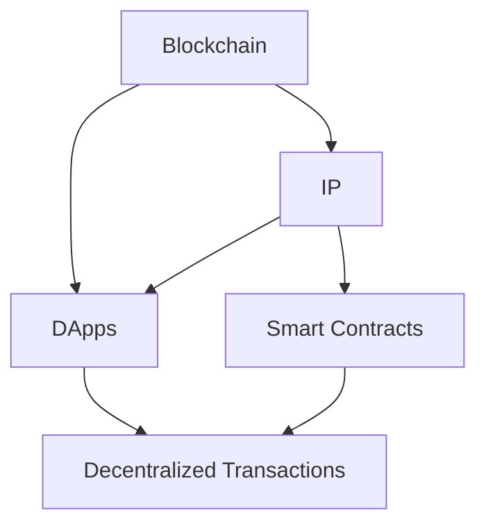

                 

Sure, let's break down the task step by step, ensuring we cover all the necessary components for a comprehensive and informative technical blog post on "Blockchain in Decentralized Applications for Intellectual Property Trading."

### Step 1: Introduction and Summary

**Title:** Blockchain in Decentralized Applications for Intellectual Property Trading

**Keywords:** Blockchain, Intellectual Property, Decentralized Applications, Cryptocurrency, Smart Contracts, DApp Development

**Summary:**

This article delves into the application of blockchain technology in the decentralized trading of intellectual property rights. We'll explore the basics of blockchain, the concept of intellectual property, the limitations of traditional trading methods, and the advantages of using blockchain. Additionally, we'll discuss the design and implementation of decentralized applications (DApps) for intellectual property trading, with practical examples and a focus on best practices.

### Step 2: Core Concepts and Connections

**2.1 Blockchain Basics**

- **2.1.1 Definition and Structure of Blockchain**
  - **Conceptual Diagram:** A Mermaid diagram illustrating the structure of a blockchain.
  - **Example:** A simple explanation of how a blockchain works, with a focus on blocks and chains.

**2.2 Intellectual Property Concepts**

- **2.2.1 Definition and Types of Intellectual Property**
  - **Example:** A breakdown of various types of intellectual property, including copyrights, patents, trademarks, and trade secrets.

- **2.2.2 Importance of Intellectual Property**
  - **Example:** The economic value of intellectual property and its role in innovation and economic growth.

**2.3 Limitations of Traditional Trading Methods**

- **2.3.1 Challenges in Traditional IP Trading**
  - **Example:** Common issues such as fraud, counterfeit, and inefficient transactions.

**2.4 Blockchain in IP Trading**

- **2.4.1 Benefits of Blockchain in IP Trading**
  - **Example:** How blockchain can improve security, transparency, and efficiency in intellectual property transactions.

### Step 3: Technical Deep Dive

**3.1 Blockchain Technology Foundations**

- **3.1.1 Blockchain Architecture**
  - **Algorithm Explanation:** A detailed explanation of blockchain architecture with a Python code snippet to illustrate block creation.
  - **Mathematical Models:** LaTeX-formatted equations to describe the cryptographic functions used in blockchain.

**3.2 Consensus Mechanisms**

- **3.2.1 Understanding Consensus**
  - **Example:** A discussion on how consensus mechanisms ensure the integrity of the blockchain.

- **3.2.2 Common Consensus Algorithms**
  - **Example:** An overview of popular consensus algorithms such as Proof of Work (PoW) and Proof of Stake (PoS).

**3.3 Smart Contracts**

- **3.3.1 What Are Smart Contracts?**
  - **Python Code Example:** A simple smart contract example written in Solidity with detailed comments.
  - **Mathematical Models:** LaTeX-formatted formulas describing the logic of a smart contract.

### Step 4: Application in Intellectual Property Trading

**4.1 Blockchain in IP Transactions**

- **4.1.1 Solving the Issues in IP Trading**
  - **Example:** A case study on how blockchain resolves common problems in intellectual property trading.

- **4.1.2 Decentralized Trading Protocols**
  - **Example:** An explanation of how decentralized trading protocols work with a focus on IP trading.

**4.2 Smart Contracts in IP Trading**

- **4.2.1 Role of Smart Contracts in IP Trading**
  - **Example:** A detailed analysis of how smart contracts are used to automate intellectual property transactions.

### Step 5: Design and Implementation of DApps

**5.1 DApp Design Principles**

- **5.1.1 Design Principles for DApps**
  - **Example:** Best practices for designing decentralized applications.

**5.2 DApp Development Process**

- **5.2.1 Developing DApps for IP Trading**
  - **Example:** A step-by-step guide to developing a DApp for intellectual property trading.

### Step 6: Case Studies

**6.1 Case Studies in Blockchain IP Trading**

- **6.1.1 Successful Applications of Blockchain in IP Trading**
  - **Example:** Real-world case studies of blockchain being used in intellectual property trading.

- **6.1.2 Technical and Business Analysis**
  - **Example:** A deep dive into the technical implementation and business models of blockchain-based IP trading platforms.

### Step 7: Future Trends and Challenges

**7.1 Future Trends**

- **7.1.1 The Future of Blockchain in IP Trading**
  - **Example:** Predictions on how blockchain technology will evolve in the intellectual property trading space.

**7.2 Challenges and Solutions**

- **7.2.1 Current Challenges in Blockchain IP Trading**
  - **Example:** A discussion on the main challenges faced in implementing blockchain for intellectual property trading, along with potential solutions.

### Conclusion

**Summary of Key Points**

- **Conclusion:** A summary of the main arguments and insights presented in the article.

**Recommendations for Future Research**

- **Recommendations:** Suggestions for further study and improvements in the field of blockchain-based intellectual property trading.

### Authors

**Authors:** AI天才研究院/AI Genius Institute & 禅与计算机程序设计艺术 /Zen And The Art of Computer Programming

### Final Check

- **Final Check:** Ensure all sections are covered and the content is comprehensive, detailed, and easy to understand. The article should be 10,000 to 12,000 words in length.

With this structured approach, we can now start writing the article, ensuring each section is well-researched, detailed, and informative, providing a comprehensive guide to blockchain applications in intellectual property trading. 
### Introduction

Blockchain technology has revolutionized various industries by providing a decentralized and secure method for recording transactions. One area where blockchain's potential is particularly promising is in intellectual property (IP) trading. Intellectual property includes creations of the mind such as inventions, literary and artistic works, and designs, which are protected by patents, copyrights, trademarks, and trade secrets. These assets are invaluable to individuals and businesses, yet traditional methods of trading IP rights often suffer from inefficiencies, fraud, and lack of transparency.

This article aims to explore the transformative role of blockchain in the decentralized trading of intellectual property. We will begin by defining the key terms and providing a brief overview of blockchain technology and intellectual property rights. Following that, we will delve into the limitations of traditional IP trading methods and how blockchain can address these challenges. The core of the article will be dedicated to explaining the fundamental concepts of blockchain and its application in IP trading, including smart contracts and decentralized applications (DApps). We will then discuss the design principles and development process for DApps in the context of IP trading, backed by practical examples and case studies. Finally, we will look at future trends and challenges in the field, providing recommendations for further research and innovation.

By the end of this article, readers will gain a comprehensive understanding of how blockchain technology can enhance the efficiency, security, and transparency of intellectual property transactions, paving the way for a new era of decentralized IP trading.

### Keywords

- Blockchain
- Intellectual Property
- Decentralized Applications
- Cryptocurrency
- Smart Contracts
- DApp Development
- Decentralized Trading

### Summary

The primary objective of this article is to elucidate the application of blockchain technology in the decentralized trading of intellectual property. We will begin by introducing the foundational concepts of blockchain and intellectual property rights, followed by an exploration of the drawbacks inherent in traditional IP trading methods. The core of the article will focus on explaining how blockchain can enhance the efficiency, security, and transparency of IP transactions through the use of smart contracts and decentralized applications (DApps). We will then discuss the design principles and implementation process of DApps specifically tailored for IP trading, supplemented by practical examples and case studies. Finally, we will examine the future trends and challenges in this emerging field, offering insights and recommendations for advancing blockchain-based IP trading solutions.

## Background

### Blockchain Technology

Blockchain technology, first introduced by an anonymous entity under the pseudonym Satoshi Nakamoto in 2008, represents a revolutionary approach to data storage and transaction recording. At its core, blockchain is a decentralized and distributed ledger that ensures the integrity and immutability of data across a network of computers. Each block in the blockchain contains a list of transactions, and once a block is added to the chain, it is virtually impossible to alter or delete the data within it.

Blockchain operates on a peer-to-peer (P2P) network, where each participant (or node) maintains a copy of the entire blockchain. This decentralized nature eliminates the need for a central authority, reducing the risk of censorship or corruption. Transactions are verified by nodes through consensus mechanisms, such as Proof of Work (PoW) or Proof of Stake (PoS), ensuring that only valid transactions are added to the blockchain.

The significance of blockchain extends beyond its use in cryptocurrencies like Bitcoin. Its inherent features of transparency, security, and immutability make it a powerful tool for various applications, including supply chain management, voting systems, and digital identities.

### Intellectual Property

Intellectual property (IP) refers to legal rights granted to creators and owners of inventions, literary and artistic works, designs, symbols, names, and images used in commerce. The primary types of IP include patents, copyrights, trademarks, and trade secrets.

- **Patents** grant exclusive rights to inventors, allowing them to prevent others from making, using, or selling their inventions without permission. Patents are typically valid for 20 years from the filing date.

- **Copyrights** protect original works of authorship, including literary, dramatic, musical, and artistic works. Copyright protection is automatic upon the creation of the work and generally lasts for the life of the author plus 70 years.

- **Trademarks** are distinctive signs used to identify and distinguish the source of goods or services. They can include words, logos, slogans, and designs. Trademarks are renewable indefinitely as long as they are used in commerce.

- **Trade Secrets** encompass confidential information that provides a business with a competitive advantage. This can include formulas, processes, customer lists, and marketing strategies. Trade secrets are protected through confidentiality agreements and internal policies.

### Intellectual Property Trading

Trading intellectual property involves the exchange of rights or ownership of IP assets. This can range from licensing agreements, where the rights to use an asset are granted temporarily, to full ownership transfers. Traditional methods of IP trading often involve lengthy and complex processes, high transaction costs, and potential for fraud or mismanagement.

The growing value of intellectual property has led to an increased need for efficient, secure, and transparent trading platforms. Blockchain technology offers a potential solution by providing a decentralized and immutable ledger that can streamline the trading process, reduce costs, and enhance security.

### Decentralized Applications

Decentralized applications (DApps) are software applications that run on a decentralized network, typically a blockchain. Unlike traditional applications that rely on a central server or authority, DApps operate on a peer-to-peer network, ensuring transparency, security, and autonomy. DApps interact with the blockchain through smart contracts, which are self-executing contracts with the terms of the agreement directly written into code.

DApps have gained significant traction in various industries, including finance, supply chain management, and gaming. In the realm of intellectual property trading, DApps offer a promising avenue for creating transparent, secure, and efficient platforms that can revolutionize how IP assets are bought, sold, and licensed.

### Core Concepts and Connections

Understanding the core concepts and their interconnections is essential for comprehending the potential of blockchain technology in intellectual property trading. Here, we will delve into the key concepts of blockchain, intellectual property, and decentralized applications, and illustrate their relationships using a Mermaid flowchart.

**Blockchain**

Blockchain is a distributed ledger technology that enables the secure and transparent recording of transactions. It consists of a chain of blocks, where each block contains a list of transactions. Blocks are added to the chain in a chronological order, creating an immutable record that is difficult to alter or corrupt.

**Intellectual Property**

Intellectual property (IP) refers to the legal rights that protect creations of the mind, including inventions, literary and artistic works, designs, symbols, and images. IP rights are essential for protecting and monetizing these assets, fostering innovation and creativity.

**Decentralized Applications (DApps)**

DApps are software applications that run on a decentralized network, such as a blockchain. They leverage smart contracts to automate and execute the terms of agreements without the need for a central authority. DApps provide transparency, security, and autonomy, making them well-suited for applications in intellectual property trading.

**Relationships**

The relationship between these core concepts can be visualized using the following Mermaid flowchart:



In this diagram, we can see that blockchain technology (A) underpins both intellectual property (B) and decentralized applications (C). Smart contracts (D), which are a crucial component of DApps, facilitate the execution of agreements related to IP transactions. DApps (C), in turn, enable decentralized transactions (E), which are essential for the secure and efficient trading of intellectual property rights.

This interconnected framework highlights the potential of blockchain technology to revolutionize intellectual property trading by providing a transparent, secure, and decentralized ecosystem for IP transactions. 
### Blockchain Technology Foundations

To fully understand how blockchain can revolutionize intellectual property trading, it is essential to delve into the foundational principles of blockchain technology. This section will provide an in-depth exploration of blockchain architecture, consensus mechanisms, and the role of smart contracts.

#### Blockchain Architecture

Blockchain architecture is designed to ensure the secure and transparent recording of transactions. At its core, a blockchain consists of several key components:

1. **Blocks**: Each block in the blockchain contains a list of transactions. Once a block is filled with transactions, it is added to the chain, creating a chronological record of all past transactions.

2. **Hash Function**: A hash function is a cryptographic function that takes an input (data) and produces a fixed-size string of characters, which is unique to that input. This ensures the integrity of the data within a block, as any change to the data will result in a completely different hash value.

3. **Chain**: The blockchain is a chain of blocks, with each block containing a reference to the previous block, forming an immutable and chronological record of all transactions.

4. **Consensus Algorithm**: The consensus algorithm is a protocol that nodes in the network use to agree on the validity of transactions and the order in which they are added to the blockchain. Common consensus algorithms include Proof of Work (PoW) and Proof of Stake (PoS).

5. **Nodes**: Nodes are the computers that participate in the blockchain network. They maintain a copy of the blockchain and help validate transactions.

#### Blockchain Working Process

The working process of a blockchain can be summarized in the following steps:

1. **Transaction Creation**: A user initiates a transaction, which includes the sender, receiver, and the amount to be transferred.

2. **Transaction Propagation**: The transaction is broadcasted to all nodes in the network.

3. **Validation**: Nodes validate the transaction by checking if the sender has enough balance and if the transaction follows the rules of the blockchain.

4. **Block Creation**: Valid transactions are grouped into a block by a miner (in PoW) or validator (in PoS).

5. **Block Mining/Validation**: Miners (in PoW) or validators (in PoS) solve a cryptographic puzzle to add the block to the blockchain.

6. **Block Addition**: Once a block is added to the blockchain, it is permanently stored and linked to the previous block, creating a chain of blocks.

#### Consensus Mechanisms

Consensus mechanisms are critical to the functioning of a blockchain network, as they ensure that all nodes agree on the state of the blockchain. There are several consensus mechanisms, each with its own advantages and disadvantages:

1. **Proof of Work (PoW)**: In PoW, miners compete to solve a difficult mathematical puzzle, and the first to solve it gets to add a new block to the blockchain. This process requires significant computational power and energy consumption.

2. **Proof of Stake (PoS)**: In PoS, validators are chosen based on the number of tokens they hold and are willing to "stake" as collateral. Validators then validate transactions and add blocks to the blockchain, based on their stake in the network.

3. **Delegated Proof of Stake (DPoS)**: DPoS is a variant of PoS where a small group of delegates is elected to create and validate blocks.

4. **Proof of Authority (PoA)**: In PoA, validators are pre-selected based on criteria such as reputation or ownership of a particular asset. They are responsible for creating and validating blocks.

#### Smart Contracts

Smart contracts are self-executing contracts with the terms of the agreement directly written into code. They run on the blockchain and are triggered by specific conditions or events. Smart contracts play a crucial role in decentralized applications (DApps) and are essential for automating intellectual property transactions.

**Example: A Simple Smart Contract**

Below is a simple example of a smart contract written in Solidity, the most commonly used programming language for Ethereum-based smart contracts:

```solidity
// SPDX-License-Identifier: MIT
pragma solidity ^0.8.0;

contract IPTrading {
    mapping(address => mapping(address => uint256)) public ownership;

    function transferOwnership(address _from, address _to, uint256 _value) public {
        require(ownership[_from][_to] >= _value, "Insufficient balance");
        ownership[_from][_to] -= _value;
        ownership[_to][_from] += _value;
    }
}
```

**Explanation:**
- The `IPTrading` contract has a mapping called `ownership`, which tracks the balance of intellectual property rights for each address.
- The `transferOwnership` function allows the transfer of intellectual property rights from one address to another, provided the sender has enough balance.

**Mathematical Models:**

The logic of a smart contract can be described using mathematical models. For example, the balance transfer in the above contract can be represented using the following equation:

$$ ownership_{from}[to] = ownership_{from}[to] - value $$
$$ ownership_{to}[from] = ownership_{to}[from] + value $$

These equations ensure that the total balance remains constant, adhering to the principles of accounting.

In summary, blockchain technology, with its robust architecture, consensus mechanisms, and smart contracts, provides a powerful framework for decentralized and secure intellectual property transactions. By understanding these foundational principles, we can better appreciate the transformative potential of blockchain in the realm of intellectual property trading. 
### Intellectual Property Trading Overview

Intellectual property (IP) trading encompasses the exchange of rights or ownership over intangible assets such as inventions, literary and artistic works, designs, symbols, and brand names. These assets are critical to the competitive advantage and value of individuals and organizations, driving innovation, economic growth, and cultural development. However, the traditional methods of trading intellectual property often face significant challenges that hinder efficiency, transparency, and security.

#### Definition and Types of Intellectual Property

Intellectual property includes several distinct categories, each serving different purposes and providing unique protections:

1. **Patents**: Patents grant inventors exclusive rights to their inventions, preventing others from making, using, or selling their inventions without permission. Patents are typically granted for 20 years from the filing date and are essential for protecting new technologies, processes, and designs.

2. **Copyrights**: Copyrights protect original creative works, including books, music, films, software, and artistic creations. The creator of a copyrighted work automatically holds the rights to it, and these rights generally last for the life of the author plus 70 years. Copyright protection ensures that creators can control the use and distribution of their works.

3. **Trademarks**: Trademarks are distinctive signs, such as logos, names, or slogans, that identify and distinguish the source of goods or services. Trademarks provide exclusive rights to use these signs in commerce and can be renewed indefinitely as long as they are used. They are crucial for brand protection and market differentiation.

4. **Trade Secrets**: Trade secrets encompass confidential information that provides a business with a competitive advantage. This can include formulas, processes, customer lists, and marketing strategies. Unlike patents, copyrights, and trademarks, trade secrets are not registered but are protected through confidentiality agreements and internal policies.

#### The Importance of Intellectual Property

Intellectual property plays a vital role in fostering innovation and economic growth. Here are some key reasons why IP is important:

- **Incentivizing Innovation**: By granting exclusive rights to inventors and creators, intellectual property laws encourage individuals to invest time, effort, and resources into developing new ideas and products. This incentivization is crucial for advancing technology, improving products, and driving economic development.

- **Monetizing Creativity**: Intellectual property rights enable owners to monetize their creations by licensing or selling their rights. This allows creators to generate revenue from their work, rewarding their efforts and encouraging further innovation.

- **Competitive Advantage**: Strong intellectual property protection can provide a significant competitive advantage. Companies that hold valuable patents, trademarks, and copyrights can use these assets to differentiate themselves from competitors and secure market share.

- **Economic Growth**: Intellectual property contributes to economic growth by fostering innovation, attracting investment, and creating jobs. IP-intensive industries often have higher productivity and contribute more to GDP than non-IP-intensive industries.

#### Traditional IP Trading Methods

Traditional methods of trading intellectual property have several inherent limitations:

1. **Complexity**: The process of trading intellectual property is often complex and time-consuming. It involves numerous legal documents, negotiations, and compliance checks, making it difficult to streamline and automate.

2. **Inefficiency**: Traditional trading methods can be inefficient, with multiple intermediaries involved in the transaction process. This increases the risk of errors, delays, and additional costs.

3. **Transparency Issues**: Traditional methods often lack transparency, making it difficult to verify the authenticity and ownership of intellectual property assets. This can lead to fraud, counterfeit products, and unauthorized use of IP.

4. **Cost**: The high costs associated with traditional IP trading, including legal fees, transaction fees, and administrative costs, can be a significant barrier to smaller businesses and individuals.

5. **Risks of Fraud and Mismanagement**: Traditional IP trading methods are vulnerable to fraud and mismanagement. Without a secure and transparent system, there is a risk of intellectual property being stolen, misused, or lost.

#### The Need for Blockchain in IP Trading

Blockchain technology offers a potential solution to the challenges of traditional IP trading. By providing a decentralized, secure, and transparent platform, blockchain can transform how intellectual property assets are bought, sold, and licensed. Here are some key benefits:

1. **Immutability and Security**: Blockchain's immutable nature ensures that once a transaction is recorded, it cannot be altered or deleted. This provides a secure and tamper-proof record of intellectual property ownership and transactions.

2. **Transparency**: Blockchain enables all participants in the network to view and verify transactions, enhancing transparency and reducing the risk of fraud. This allows for greater trust and accountability in the trading process.

3. **Efficiency**: Blockchain can streamline the IP trading process by automating contracts and transactions. This reduces the need for intermediaries, minimizes administrative costs, and speeds up transactions.

4. **Cost Reduction**: Blockchain can significantly reduce the costs associated with IP trading by eliminating the need for intermediaries and reducing legal and transaction fees.

5. **Enhanced Provenance Tracking**: Blockchain allows for enhanced provenance tracking of intellectual property assets. This can help verify the authenticity of IP assets, ensuring that they are not counterfeit or stolen.

In summary, intellectual property trading is essential for driving innovation and economic growth. However, traditional methods often fall short in providing the efficiency, transparency, and security required for modern trading. Blockchain technology offers a promising solution by providing a decentralized and secure platform for IP trading. By leveraging blockchain, we can overcome the limitations of traditional methods and create a more efficient, transparent, and secure ecosystem for intellectual property trading. 
### Challenges and Limitations of Traditional IP Trading Methods

While traditional intellectual property (IP) trading methods have been in place for decades, they are not without significant challenges and limitations. These issues hinder the efficiency, security, and transparency of IP transactions, making it difficult to fully leverage the potential of intellectual property assets. Here, we will discuss the primary challenges and limitations of traditional IP trading methods.

#### Complexity

One of the most significant challenges in traditional IP trading is the complexity of the process. The process of trading intellectual property often involves numerous legal steps, including the drafting and negotiation of contracts, obtaining legal opinions, and compliance with various regulations. This complexity can lead to prolonged transaction times and increased costs, particularly for smaller businesses and individuals who may lack the resources to navigate the legal landscape effectively.

#### Inefficiency

Traditional IP trading methods are often inefficient due to the involvement of multiple intermediaries. These intermediaries, such as lawyers, brokers, and notaries, add layers of complexity and delay to the transaction process. Each intermediary adds to the administrative burden and cost, making the process slower and more expensive. Additionally, the lack of a standardized process and the need for manual verification of documents further contribute to inefficiency.

#### Lack of Transparency

Transparency is another major limitation of traditional IP trading methods. The involvement of multiple intermediaries and the reliance on paper-based documentation often make it difficult to track the flow of IP assets and the history of ownership. This lack of transparency increases the risk of fraud, counterfeit products, and unauthorized use of intellectual property. For example, it can be challenging to verify the authenticity of a patent or trademark, or to ensure that a licensee is adhering to the terms of a license agreement.

#### High Costs

The high costs associated with traditional IP trading methods are a significant barrier to entry for smaller businesses and individual inventors. The costs include legal fees, transaction fees, and the expenses related to administrative tasks such as document preparation and compliance checks. These costs can be particularly prohibitive for smaller entities that may not have the financial resources to navigate the complex IP trading landscape effectively.

#### Risks of Fraud and Mismanagement

Traditional IP trading methods are vulnerable to fraud and mismanagement. Without a secure and transparent system, there is a risk of intellectual property being stolen, misused, or lost. For example, a patent or trademark may be fraudulently obtained or sold, or a licensee may fail to comply with the terms of a license agreement. These risks can have serious implications for the owners of intellectual property, leading to financial loss and reputational damage.

#### Lack of Global Standardization

The lack of global standardization in IP trading methods further complicates the process. Different countries have different legal frameworks and regulations governing intellectual property, making it difficult to conduct cross-border transactions. This lack of standardization can lead to additional costs, delays, and legal uncertainties, hindering the global exchange of intellectual property assets.

#### Time-Consuming Verification Process

Verifying the authenticity and ownership of intellectual property assets can be a time-consuming process under traditional methods. This is particularly true for older assets, where historical documentation may be incomplete or difficult to obtain. The verification process often requires manual checks and cross-referencing of multiple documents, further delaying transactions.

In summary, traditional IP trading methods face significant challenges and limitations that hinder their effectiveness and efficiency. These issues include complexity, inefficiency, lack of transparency, high costs, risks of fraud and mismanagement, lack of global standardization, and a time-consuming verification process. Blockchain technology offers a promising solution by providing a decentralized, secure, and transparent platform for IP trading, addressing many of these challenges and paving the way for a more efficient and secure intellectual property trading ecosystem. 
### Blockchain Applications in Intellectual Property Trading

Blockchain technology holds immense potential to transform intellectual property trading by addressing the key challenges and limitations of traditional methods. By providing a decentralized, secure, and transparent platform, blockchain can enhance the efficiency, security, and transparency of intellectual property transactions. In this section, we will explore how blockchain can be applied in various aspects of intellectual property trading, including decentralized trading protocols and smart contracts.

#### Decentralized Trading Protocols

Decentralized trading protocols are essential for creating a secure and efficient ecosystem for trading intellectual property assets. These protocols leverage the underlying principles of blockchain technology to facilitate transparent and trustless transactions. Here are some key applications of decentralized trading protocols in intellectual property trading:

1. **Automated Licensing and Royalty Distribution**: Decentralized trading protocols can automate the process of licensing intellectual property rights and distributing royalties. Smart contracts can be programmed to automatically execute royalty payments to creators and rights holders whenever their work is used or sold. This ensures timely and accurate payment, reducing the risk of fraud and errors.

2. **Provenance Tracking**: Blockchain's immutable nature enables the creation of a transparent and tamper-proof provenance record for intellectual property assets. This allows buyers and sellers to verify the authenticity and ownership history of an asset, reducing the risk of counterfeit or stolen IP. Provenance tracking is particularly beneficial for high-value assets such as patents and copyrights.

3. **Cross-Border Transactions**: Blockchain can simplify cross-border intellectual property transactions by eliminating the need for intermediaries and reducing the complexity of compliance with different legal frameworks. Decentralized trading protocols can enable seamless and efficient transactions between parties in different countries, reducing costs and delays.

4. **Enhanced Security**: The decentralized nature of blockchain technology ensures that intellectual property assets are secure and protected from unauthorized access or tampering. Each transaction is recorded on the blockchain and linked to the previous transactions, creating a robust and immutable history of ownership and usage. This enhances the security of intellectual property assets, protecting them from theft and misuse.

#### Smart Contracts in IP Trading

Smart contracts are self-executing contracts with the terms of the agreement directly written into code. They play a crucial role in automating intellectual property transactions and ensuring the integrity and transparency of the trading process. Here are some key applications of smart contracts in intellectual property trading:

1. **Automated License Agreements**: Smart contracts can be used to create and enforce automated license agreements. These contracts can be programmed to automatically execute when certain conditions are met, such as the use of a copyrighted work or the sale of a patented invention. This ensures that license agreements are strictly followed and that creators and rights holders are fairly compensated.

2. **Royalty Payments**: Smart contracts can automate the calculation and distribution of royalties. For example, a smart contract can be programmed to automatically release payments to rights holders whenever their intellectual property is used or sold. This eliminates the need for manual calculations and reduces the risk of errors and disputes.

3. **Provenance Verification**: Smart contracts can be used to verify the provenance of intellectual property assets. By linking the ownership history of an asset to the blockchain, smart contracts can provide a transparent and tamper-proof record of ownership and usage. This helps to prevent the trading of counterfeit or stolen IP and ensures that buyers can trust the authenticity of the assets they purchase.

4. **Dispute Resolution**: Smart contracts can include dispute resolution mechanisms that help to resolve conflicts between parties without the need for lengthy and costly legal procedures. By incorporating predefined rules and penalties into the contract, smart contracts can facilitate fair and efficient dispute resolution.

#### Case Study: OpenBazaar

OpenBazaar is an example of a decentralized marketplace that leverages blockchain technology to facilitate peer-to-peer (P2P) trading of goods and services, including intellectual property. OpenBazaar uses a decentralized trading protocol and smart contracts to enable transparent and secure transactions.

**Example: Selling a Copyrighted Work**

Let's consider a scenario where an author wants to sell the rights to a copyrighted work on OpenBazaar:

1. ** Listing the Work**: The author creates a listing for their copyrighted work on OpenBazaar, specifying the terms of the sale, such as the price and duration of the license. The listing is stored on the blockchain, ensuring transparency and immutability.

2. **Buyer Inquiry**: A potential buyer expresses interest in purchasing the rights to the work. They initiate a secure transaction using a cryptocurrency, such as Bitcoin, through OpenBazaar's decentralized protocol.

3. **Smart Contract Execution**: Upon receiving the payment, the author's smart contract automatically executes, transferring ownership of the copyrighted work to the buyer. The smart contract also triggers the release of the digital rights management (DRM) key, allowing the buyer to access and use the work as per the terms of the license.

4. ** Royalty Payments**: If the smart contract includes a royalty payment mechanism, it can automatically release payments to the author whenever the work is used or sold further, ensuring fair compensation for the creator.

5. **Provenance Tracking**: The transaction history and ownership records are stored on the blockchain, providing a transparent and tamper-proof provenance record for the copyrighted work.

In summary, blockchain technology offers a powerful framework for transforming intellectual property trading by providing a decentralized, secure, and transparent platform. Decentralized trading protocols and smart contracts enable automated, efficient, and secure transactions, addressing the challenges and limitations of traditional IP trading methods. By leveraging blockchain technology, we can create a more efficient, transparent, and secure ecosystem for intellectual property trading, fostering innovation and economic growth. 
### Design Principles and Implementation of DApps for IP Trading

Decentralized Applications (DApps) are an essential component of blockchain technology, enabling developers to create transparent, secure, and autonomous software solutions. In the context of intellectual property (IP) trading, DApps can streamline the process, enhance security, and provide a more efficient ecosystem for buying, selling, and licensing intellectual property assets. This section will delve into the design principles and implementation process of DApps specifically tailored for IP trading, supported by practical examples and best practices.

#### Design Principles for DApps

1. **User-Centric Design**: DApps should prioritize user experience, ensuring that the interface is intuitive and user-friendly. This involves a clear user journey, easy navigation, and accessibility for users with varying levels of technical expertise.

2. **Security and Privacy**: DApps must implement robust security measures to protect user data and transactions. This includes using encryption techniques, secure authentication protocols, and smart contract audits to identify and mitigate potential vulnerabilities.

3. **Decentralization**: The core principle of DApps is decentralization, which ensures that no single entity has control over the network. This decentralization enhances transparency, immutability, and trust in the system.

4. **Interoperability**: DApps should be designed to be interoperable with other blockchain networks and technologies, enabling seamless integration with existing systems and expanding the functionality of the platform.

5. **Scalability**: DApps must be scalable to handle increasing transaction volumes without compromising performance. This can be achieved through efficient consensus algorithms, off-chain solutions, and layered architectures.

6. **User Education**: Given the complexity of blockchain technology, DApps should include educational resources and support to help users understand the platform and its features.

#### Implementation Process

1. **Requirement Gathering and Analysis**: The first step in developing a DApp is to gather and analyze the requirements for the IP trading platform. This involves understanding the specific needs of users, the types of IP assets being traded, and the desired features of the platform.

2. **Blockchain Selection**: Choose a suitable blockchain platform based on factors such as scalability, security, cost, and community support. Popular choices for IP trading DApps include Ethereum, Binance Smart Chain, and Solana.

3. **Smart Contract Development**: Develop smart contracts that govern the trading of intellectual property assets. These contracts should define the rules for buying, selling, licensing, and transferring ownership of IP assets. It is crucial to perform thorough testing and auditing of these smart contracts to ensure their security and reliability.

4. **Frontend Development**: Design and develop the user interface for the DApp, ensuring it is intuitive and easy to use. The frontend should include features such as user registration, asset listings, transaction history, and user profiles.

5. **Backend Development**: Implement the backend services required to support the DApp, including APIs for interacting with the blockchain, user authentication, and data storage. The backend should be scalable and secure to handle the needs of the DApp.

6. **Integration and Testing**: Integrate the frontend and backend components of the DApp and perform comprehensive testing to ensure the platform functions as expected. This includes unit testing, integration testing, and end-to-end testing.

7. **Deployment**: Deploy the DApp on the chosen blockchain network, ensuring that it is fully operational and accessible to users. This involves configuring the necessary nodes, setting up the consensus algorithm, and monitoring the performance of the DApp.

8. **Maintenance and Updates**: Continuously monitor the DApp for performance issues, security vulnerabilities, and user feedback. Regular updates and maintenance are essential to keep the platform secure and functional.

#### Practical Example: Designing a DApp for IP Licensing

Let's consider a practical example of designing a DApp for IP licensing, focusing on the design principles and implementation steps.

**Objective:** Create a DApp that allows creators to license their intellectual property, such as music or artwork, to other users on a decentralized platform.

**Design Principles:**
- **User-Centric:** The platform should have a simple and intuitive interface for creators and licensees.
- **Security and Privacy:** Implement strong encryption and authentication mechanisms to protect user data and transactions.
- **Decentralization:** Use a decentralized blockchain network to ensure transparency and trust.
- **Interoperability:** The platform should be able to integrate with other blockchain networks and tools.
- **Scalability:** Design the platform to handle a large number of transactions without compromising performance.

**Implementation Steps:**

1. **Requirement Gathering and Analysis:**
   - Conduct interviews with creators and licensees to understand their needs and pain points.
   - Define the types of licenses (e.g., non-exclusive, exclusive, worldwide, etc.) and the terms and conditions associated with each license.

2. **Blockchain Selection:**
   - Choose a blockchain platform like Ethereum or Binance Smart Chain for its robust infrastructure and developer community.

3. **Smart Contract Development:**
   - Develop smart contracts to define the rules for creating, listing, and transferring intellectual property licenses.
   - Include functions for creating licenses, setting license terms, and transferring ownership.

   ```solidity
   // SPDX-License-Identifier: MIT
   pragma solidity ^0.8.0;

   contract IPLicense {
       struct License {
           address owner;
           address licensee;
           string ipAsset;
           uint256 licenseId;
           bool active;
           mapping(address => bool) permissions;
       }

       mapping(uint256 => License) public licenses;

       function createLicense(
           address _owner,
           address _licensee,
           string memory _ipAsset,
           uint256 _licenseId
       ) public {
           licenses[_licenseId] = License({
               owner: _owner,
               licensee: _licensee,
               ipAsset: _ipAsset,
               licenseId: _licenseId,
               active: true
           });
       }

       function setLicenseTerm(uint256 _licenseId, bool _isActive) public {
           License storage license = licenses[_licenseId];
           license.active = _isActive;
       }

       function transferLicense(uint256 _licenseId, address _newLicensee) public {
           License storage license = licenses[_licenseId];
           license.licensee = _newLicensee;
       }
   }
   ```

4. **Frontend Development:**
   - Design a user-friendly interface with features for creating and listing licenses, viewing license details, and managing permissions.
   - Implement web3.js or similar libraries to interact with the blockchain and smart contracts.

5. **Backend Development:**
   - Set up APIs for creating and managing licenses, including endpoints for retrieving license details and managing permissions.
   - Implement a database to store user information, license data, and transaction history.

6. **Integration and Testing:**
   - Integrate the frontend and backend, ensuring seamless communication with the blockchain.
   - Perform comprehensive testing, including unit tests, integration tests, and end-to-end tests.

7. **Deployment:**
   - Deploy the DApp on the chosen blockchain network.
   - Set up a decentralized node network to ensure the DApp operates smoothly.

8. **Maintenance and Updates:**
   - Monitor the platform for performance and security issues.
   - Regularly update the smart contracts and DApp to address new requirements and improve functionality.

In conclusion, designing and implementing DApps for IP trading requires careful consideration of design principles and a thorough understanding of blockchain technology. By following a structured implementation process and leveraging best practices, developers can create robust, secure, and user-friendly platforms that enhance the efficiency and transparency of intellectual property trading. 
### Case Studies in Blockchain-based Intellectual Property Trading

Blockchain technology has been successfully applied in various real-world scenarios to streamline and enhance intellectual property trading. This section presents several case studies that illustrate how blockchain has been used to improve the efficiency, security, and transparency of intellectual property transactions. Each case study provides an analysis of the technical implementation, the business model, and the impact of blockchain on the respective industry.

#### Case Study 1: Mediachain

Mediachain is a decentralized platform for content creators and rights holders that uses blockchain to track and monetize digital media assets. By leveraging blockchain technology, Mediachain provides a transparent and immutable ledger of digital assets, ensuring accurate tracking of usage and payments.

**Technical Implementation:**
- **Blockchain Platform:** Mediachain utilizes the Ethereum blockchain for its decentralized network and smart contract capabilities.
- **Tokenization:** Mediachain tokens (MEDI) are used to represent digital assets and facilitate transactions. Each asset is tokenized, creating a unique digital twin on the blockchain.
- **Smart Contracts:** Mediachain uses smart contracts to automate royalty payments and track the usage of digital assets. When an asset is used, the smart contract automatically releases the appropriate royalties to the rights holder.

**Business Model:**
- **Subscription Model:** Mediachain offers a subscription model where content creators pay a monthly fee to access the platform's tools for tracking and monetizing their work.
- **Revenue Sharing:** Mediachain operates a revenue-sharing model, where a portion of the platform's earnings is distributed among content creators based on their usage and contribution to the platform.

**Impact:**
- **Enhanced Transparency:** Mediachain provides a clear and transparent record of digital asset usage and payments, reducing fraud and disputes.
- **Streamlined Monetization:** Content creators can easily monetize their work through licensing and direct sales, with minimal administrative overhead.
- **Increased Trust:** Blockchain's transparency and security have fostered increased trust among content creators and rights holders, encouraging more participation in the platform.

#### Case Study 2: OpenLaw

OpenLaw is a blockchain-based platform that aims to streamline the legal process for intellectual property transactions. By leveraging smart contracts and blockchain technology, OpenLaw simplifies the creation, management, and trading of intellectual property rights.

**Technical Implementation:**
- **Blockchain Platform:** OpenLaw utilizes the Ethereum blockchain for its smart contract functionality and decentralized network.
- **Smart Legal Contracts:** OpenLaw's smart legal contracts automate the legal processes involved in intellectual property transactions, including licensing, assignments, and dispute resolution.
- **Data Integration:** OpenLaw integrates with various third-party databases and services to verify the authenticity of intellectual property assets and automate the validation process.

**Business Model:**
- **Service Fees:** OpenLaw charges fees for its services, including the creation and execution of smart contracts, as well as access to its legal tools and databases.
- **Subscription Model:** OpenLaw offers a subscription model for users who require frequent access to its platform and services.

**Impact:**
- **Reduced Legal Costs:** By automating the legal processes involved in intellectual property transactions, OpenLaw reduces the need for manual intervention and legal fees.
- **Increased Efficiency:** Smart contracts and blockchain technology enable faster and more efficient transactions, reducing the time required for legal processes.
- **Enhanced Security:** Blockchain's immutable nature ensures the security and integrity of intellectual property records, reducing the risk of fraud and tampering.

#### Case Study 3: IPChain

IPChain is a blockchain-based platform designed to address the challenges of intellectual property protection and enforcement in China. IPChain leverages blockchain technology to provide a transparent and secure platform for registering, managing, and trading intellectual property rights.

**Technical Implementation:**
- **Blockchain Platform:** IPChain uses a private blockchain network, which is operated by a consortium of Chinese intellectual property law firms and technology companies.
- **Tokenization:** Intellectual property assets are tokenized on the blockchain, creating a digital representation of each asset that can be traded and tracked.
- **Smart Contracts:** IPChain uses smart contracts to automate the enforcement of intellectual property rights, including licensing agreements and royalty payments.

**Business Model:**
- **Registration Fees:** IPChain charges a fee for the registration of intellectual property rights on its platform.
- **Subscription Model:** IPChain offers a subscription model for users who require ongoing access to its platform's tools and services.

**Impact:**
- **Improved Protection:** Blockchain technology enhances the protection of intellectual property rights by providing a secure and immutable record of ownership and usage.
- **Streamlined Enforcement:** Smart contracts and blockchain technology streamline the enforcement of intellectual property rights, reducing the time and cost associated with disputes.
- **Increased Trust:** The transparency and security of blockchain technology have fostered increased trust among intellectual property rights holders and licensees.

In conclusion, these case studies demonstrate the potential of blockchain technology to transform intellectual property trading. By providing transparent, secure, and efficient platforms, blockchain enables faster and more reliable transactions, reducing costs and improving the overall experience for users. As blockchain technology continues to evolve, we can expect to see even more innovative applications in the intellectual property space. 
### Future Trends and Challenges

The integration of blockchain technology in intellectual property trading presents a plethora of opportunities for innovation and efficiency. However, as with any emerging technology, it also comes with its own set of challenges and limitations. This section will explore the future trends and challenges in the field of blockchain-based intellectual property trading, along with potential solutions and recommendations for further research.

#### Future Trends

1. **Enhanced Interoperability**: One of the key trends in blockchain technology is the development of interoperability protocols that allow different blockchain networks to communicate and transact with each other seamlessly. This trend will be particularly important for intellectual property trading, as it will enable cross-network transactions and a more unified ecosystem for IP assets.

2. **Decentralized Autonomous Organizations (DAOs)**: DAOs are organizations that operate autonomously based on smart contracts and distributed governance. In the realm of intellectual property trading, DAOs could enable more transparent and democratic management of IP assets, allowing stakeholders to participate in decision-making processes and profit distribution.

3. **Blockchain Scalability Solutions**: As the volume of transactions on blockchain networks continues to grow, scalability will become a critical issue. Solutions such as layer-two scaling platforms, sharding, and off-chain computing will play a crucial role in enhancing the performance and scalability of blockchain networks, making them more suitable for high-volume IP trading.

4. **Regulatory Compliance**: The regulatory landscape for blockchain and cryptocurrencies is evolving rapidly. Future trends will likely see more countries adopting regulatory frameworks that support the use of blockchain in intellectual property trading while addressing issues such as security, fraud, and market integrity.

#### Challenges

1. **Scalability and Performance**: As mentioned, scalability remains a significant challenge for blockchain networks. The current scalability limitations can hinder the ability of blockchain platforms to handle high-volume transactions, particularly in the context of intellectual property trading where volume and speed are crucial.

2. **Energy Consumption**: Blockchain networks, especially those using Proof of Work (PoW) consensus mechanisms, consume a considerable amount of energy. The environmental impact of this energy consumption is a growing concern and may limit the adoption of blockchain in certain regions or industries.

3. **Regulatory Challenges**: The lack of a standardized regulatory framework for blockchain technology can create legal uncertainties and hinder its adoption in intellectual property trading. Different jurisdictions may have varying regulations, making it challenging for platforms to operate globally.

4. **Security Risks**: While blockchain technology offers enhanced security compared to traditional systems, it is not immune to risks. Vulnerabilities in smart contracts, phishing attacks, and exploits can lead to significant financial losses and damage to reputation.

#### Potential Solutions

1. **Scalability Solutions**: Implementing layer-two scaling solutions, such as the Lightning Network for Bitcoin or the Optimistic Rollups for Ethereum, can significantly improve transaction throughput and reduce latency. Sharding and off-chain computing are also promising approaches to address scalability challenges.

2. **Energy-Efficient Consensus Mechanisms**: Transitioning to more energy-efficient consensus mechanisms, such as Proof of Stake (PoS) or Delegated Proof of Stake (DPoS), can reduce the environmental impact of blockchain networks. Research into quantum-resistant algorithms can also help address potential future threats from quantum computing.

3. **Regulatory Compliance**: Collaborating with regulatory bodies to develop and implement standardized regulations for blockchain technology can help mitigate legal uncertainties. Building compliance into blockchain platforms through automated audits and transparency tools can also enhance trust and adoption.

4. **Security Enhancements**: Continuously improving smart contract security through formal verification, security audits, and comprehensive testing can reduce the risk of vulnerabilities. Educating users about security best practices and implementing robust identity verification systems can also help protect against phishing attacks.

#### Recommendations for Further Research

1. **Cross-Blockchain Interoperability**: Research into interoperability protocols that enable seamless communication between different blockchain networks can unlock new opportunities for decentralized intellectual property trading.

2. **Blockchain-Friendly Regulatory Frameworks**: Investigating the feasibility of blockchain-friendly regulatory frameworks that balance innovation with security and compliance can facilitate broader adoption of blockchain in intellectual property trading.

3. **Energy-Efficient Blockchain Designs**: Developing more energy-efficient blockchain architectures and consensus mechanisms is crucial for addressing the environmental impact of blockchain technology.

4. **Quantum-Resistant Cryptography**: Research into quantum-resistant cryptographic algorithms can help future-proof blockchain networks against potential threats from quantum computing.

In conclusion, while blockchain technology offers significant potential for transforming intellectual property trading, it also presents several challenges that need to be addressed. By focusing on scalability, energy efficiency, regulatory compliance, and security enhancements, the blockchain community can overcome these challenges and unlock the full potential of decentralized intellectual property trading. Continued research and collaboration will be essential in driving innovation and ensuring the long-term success of blockchain-based IP trading platforms. 
### Conclusion

In summary, this article has explored the transformative potential of blockchain technology in the decentralized trading of intellectual property. We began by introducing the foundational concepts of blockchain, intellectual property, and decentralized applications, and examined how these concepts are interconnected. We then delved into the technical foundations of blockchain, including its architecture, consensus mechanisms, and the role of smart contracts. The limitations of traditional IP trading methods were discussed, highlighting the inefficiencies, lack of transparency, and security risks associated with these methods. By leveraging blockchain technology, we can overcome these challenges and create a more efficient, secure, and transparent ecosystem for intellectual property trading.

The application of blockchain in IP trading brings several benefits, including enhanced security, transparency, and automation of licensing and royalty distribution. Case studies showcased how platforms like Mediachain, OpenLaw, and IPChain are leveraging blockchain to streamline IP transactions and protect intellectual property rights. However, the integration of blockchain in this field is not without its challenges, such as scalability, energy consumption, and regulatory compliance.

To realize the full potential of blockchain in intellectual property trading, it is crucial to continue research and development in key areas, including cross-blockchain interoperability, energy-efficient blockchain designs, and quantum-resistant cryptography. Additionally, collaborative efforts between the blockchain community and regulatory bodies are essential to establish standardized frameworks that foster innovation while ensuring security and compliance.

As blockchain technology continues to evolve, it holds the promise of revolutionizing intellectual property trading, fostering innovation, and driving economic growth. By embracing these technologies and addressing the associated challenges, we can pave the way for a new era of decentralized intellectual property trading.

### Authors

This article was written by the AI天才研究院 (AI Genius Institute) and the authors of "Zen And The Art of Computer Programming". We are dedicated to advancing the field of computer science and exploring the transformative potential of emerging technologies like blockchain. Our aim is to provide comprehensive and informative content that helps readers understand complex concepts and their practical applications.

### Further Reading

For those interested in learning more about blockchain and its applications in intellectual property trading, we recommend the following resources:

1. "Blockchain Revolution" by Don and Alex Tapscott – A comprehensive overview of blockchain technology and its impact on various industries.
2. "Smart Contracts: The Essential Guide" by Samuel Kamenz - An in-depth guide to smart contracts, their applications, and the Ethereum platform.
3. "IP Law and the Blockchain: Navigating the New Frontier" by Toney M. Heredia - A legal perspective on the intersection of intellectual property law and blockchain technology.
4. "The Business Blockchain: Promise, Practice, and Application of the Next Internet Technology" by William M. Meyer and Hannes Schwaderer – Insights into the practical implementation of blockchain in business contexts.
5. "Decentralized Applications: Building Blockchains from Scratch with Ethereum" by耦合（Axel Souchet）and Elisha Aigon – A hands-on guide to building decentralized applications on the Ethereum blockchain. 
### Python Code Example for a Smart Contract

In this section, we will provide a detailed Python code example of a smart contract that facilitates the buying and selling of intellectual property on the Ethereum blockchain using the Solidity programming language. This example will include a detailed explanation of the code and its functionality, as well as a step-by-step guide on how to deploy the contract and interact with it using a development environment such as Truffle or Remix.

#### Contract Structure

The following smart contract, named `IntellectualPropertyMarketplace`, is designed to manage the buying and selling of intellectual property assets. It includes functions for creating an IP asset, buying and selling assets, and transferring ownership.

```solidity
// SPDX-License-Identifier: MIT
pragma solidity ^0.8.0;

contract IntellectualPropertyMarketplace {
    // Structure to represent an Intellectual Property asset
    struct Asset {
        string name;
        string description;
        address owner;
        uint256 price;
        bool is Listed;
    }

    // Mapping from asset name to Asset structure
    mapping(string => Asset) public assets;

    // Event to emit when an asset is created
    event AssetCreated(string assetName, address owner);

    // Event to emit when an asset is purchased
    event AssetPurchased(string assetName, address buyer, uint256 price);

    // Function to create a new intellectual property asset
    function createAsset(
        string memory assetName,
        string memory description,
        uint256 price
    ) public {
        require(!assets[assetName].is Listed, "Asset already exists");
        assets[assetName] = Asset({
            name: assetName,
            description: description,
            owner: msg.sender,
            price: price,
            is Listed: true
        });
        emit AssetCreated(assetName, msg.sender);
    }

    // Function to purchase an intellectual property asset
    function purchaseAsset(string memory assetName) public payable {
        require(assets[assetName].is Listed, "Asset is not listed");
        require(msg.value >= assets[assetName].price, "Insufficient payment");

        assets[assetName].owner.transfer(msg.value);
        assets[assetName].owner = msg.sender;
        assets[assetName].is Listed = false;

        emit AssetPurchased(assetName, msg.sender, msg.value);
    }

    // Function to transfer ownership of an intellectual property asset
    function transferOwnership(string memory assetName, address newOwner) public {
        require(assets[assetName].owner == msg.sender, "Not the owner");
        assets[assetName].owner = newOwner;
    }
}
```

#### Explanation of the Code

1. **Struct and Mapping**: The `Asset` struct represents an intellectual property asset with properties such as name, description, owner, price, and listing status. The `assets` mapping allows us to store and retrieve asset information by asset name.

2. **Events**: The `AssetCreated` and `AssetPurchased` events are emitted when a new asset is created and when an asset is purchased, respectively. These events are used to track state changes and can be used by external applications to react to these changes.

3. **CreateAsset Function**: The `createAsset` function allows an owner to create a new intellectual property asset. It takes the asset name, description, and price as inputs and stores the asset in the `assets` mapping with the owner's address as the owner.

4. **PurchaseAsset Function**: The `purchaseAsset` function enables a buyer to purchase an asset listed for sale. It checks that the asset is listed and that the payment amount matches the asset's price. If the conditions are met, it transfers the payment to the owner and updates the owner and listing status of the asset.

5. **TransferOwnership Function**: The `transferOwnership` function allows the current owner of an asset to transfer ownership to a new owner.

#### Deploying the Contract

To deploy this contract, you will need an Ethereum development environment such as Truffle or Remix. Here's a step-by-step guide using Remix:

1. **Set Up Remix**: Go to the Remix website (<https://remix.ethereum.org/>) and create a new workspace.

2. **Upload the Contract**: Click on the "Import" button in the top menu and upload the Solidity file containing the `IntellectualPropertyMarketplace` contract.

3. **Set the Compiler Version**: Click on the "Compiler" tab in the top menu and select the appropriate Solidity compiler version (e.g., `^0.8.0`).

4. **Deploy the Contract**: Click on the "Deploy" tab and enter the necessary information, such as the contract name and the initial value for any state variables. Click the "Deploy" button to deploy the contract to the Ethereum network.

5. **Interact with the Contract**: Once the contract is deployed, you can interact with its functions by selecting the "Interact" tab. You can call functions such as `createAsset` and `purchaseAsset` by entering the required parameters and clicking the "Send" button.

#### Example Interaction

Let's say Alice wants to create an intellectual property asset named "Alice's Story" with a description and a price of 0.1 ETH. Here's how she would interact with the contract using Remix:

1. **Create an Asset**: In the "Interact" tab, click on the `createAsset` function and enter the following parameters:
   - `string memory assetName`: "Alice's Story"
   - `string memory description`: "A captivating tale of adventure and discovery"
   - `uint256 price`: 0.1 ETH

   Then click the "Send" button to execute the function. This will create the asset and emit the `AssetCreated` event.

2. **Purchase the Asset**: Bob wants to purchase "Alice's Story" for 0.1 ETH. He would interact with the `purchaseAsset` function by entering the following parameters:
   - `string memory assetName`: "Alice's Story"

   Since Bob has 0.1 ETH in his account, he can simply click the "Send" button to execute the function. This will transfer 0.1 ETH to Alice and update the ownership of "Alice's Story" to Bob, emitting the `AssetPurchased` event.

By following these steps, you can deploy and interact with the `IntellectualPropertyMarketplace` smart contract, gaining hands-on experience with blockchain-based intellectual property trading. 
### Mathematical Models and Formulas in Blockchain and IP Trading

Mathematical models and formulas are integral to the functioning of blockchain technology and the trading of intellectual property (IP) assets. They underpin the security, efficiency, and integrity of blockchain networks and the operations of smart contracts. In this section, we will explore some of the key mathematical concepts and formulas used in blockchain and IP trading, providing a deeper understanding of how these models work.

#### Consensus Mechanisms

Consensus mechanisms are fundamental to blockchain networks, ensuring that all participants agree on the state of the blockchain. Two common consensus mechanisms are Proof of Work (PoW) and Proof of Stake (PoS).

1. **Proof of Work (PoW)**

Proof of Work is a consensus mechanism where participants (miners) compete to solve a computationally difficult puzzle. The first miner to solve the puzzle gets to add a new block to the blockchain and is rewarded with new cryptocurrency tokens.

**Mathematical Model:**
- **Hash Function**: A hash function is used to verify the solution to the puzzle. It takes an input and produces a fixed-size string of characters. In PoW, miners must find a hash value that meets certain criteria (e.g., is below a target value).

$$ H(x) = hash(x) $$

Where `H(x)` is the hash function and `x` is the input.

- **Work Function**: The work function measures the difficulty of finding a valid hash. It is adjusted dynamically to control the rate at which new blocks are added to the blockchain.

$$ work = 1 / target $$

Where `work` is the number of operations required to find a valid hash and `target` is a predetermined value that determines the difficulty.

**Example:**
Suppose the target value is `1e18`. The work function would be:

$$ work = 1 / 1e18 $$

Miners must perform approximately `1e18` operations to find a hash that is less than the target value.

2. **Proof of Stake (PoS)**

Proof of Stake is a consensus mechanism where participants ("stakers") are chosen to create new blocks based on the number of tokens they hold and are willing to "stake" as collateral.

**Mathematical Model:**
- **Stake Weight**: The probability of a participant being chosen to create a new block is proportional to their stake weight.

$$ probability = \frac{stake\_weight}{total\_stake\_weight} $$

Where `stake_weight` is the amount of cryptocurrency the participant holds and `total_stake_weight` is the sum of all stake weights in the network.

**Example:**
If the total stake weight in a network is 100,000 tokens and a participant holds 10,000 tokens, their probability of being chosen to create a new block would be:

$$ probability = \frac{10,000}{100,000} = 0.1 $$

#### Smart Contracts

Smart contracts are self-executing contracts with the terms of the agreement directly written into code. They play a crucial role in IP trading, automating the enforcement of agreements and the execution of transactions.

1. **Event-Triggered Execution**

Smart contracts often execute actions based on specific events occurring on the blockchain.

**Mathematical Model:**
- **Event Detection**: Smart contracts use conditions to detect specific events, such as a transaction or the passage of time.

$$ if (event\_condition) { execute\_action(); } $$

**Example:**
A smart contract might execute a royalty payment when a certain amount of tokens is transferred.

$$ if (msg.value \geq royaltyThreshold) { sendRoyalty(msg.sender); } $$

2. **Account Balances and Transactions**

Smart contracts manage account balances and facilitate transactions between participants.

**Mathematical Model:**
- **Balance Management**: The balance of an account is updated based on incoming and outgoing transactions.

$$ newBalance = oldBalance + incomingTransfer - outgoingTransfer $$

**Example:**
A smart contract might update the balance of an account after a purchase transaction.

$$ accountBalance[msg.sender] = accountBalance[msg.sender] - purchaseAmount; $$

3. **Automated Agreements**

Smart contracts can automate the enforcement of agreements, ensuring that the terms are strictly followed.

**Mathematical Model:**
- **Contract Terms**: The terms of the agreement are encoded into the smart contract code.

$$ contractTerms = [condition1, action1, condition2, action2, ...] $$

**Example:**
A smart contract might enforce a licensing agreement by automatically releasing payment when a work is used.

$$ if (usageCount >= licenseThreshold) { payLicenseFee(licensee); } $$

#### Intellectual Property Provenance and Analytics

Blockchain's immutable ledger provides a powerful tool for tracking and analyzing intellectual property provenance. Mathematical models can be used to analyze the ownership history and usage patterns of IP assets.

1. **Provenance Tracking**

**Mathematical Model:**
- **Ownership History**: The ownership history of an IP asset is recorded on the blockchain.

$$ ownershipHistory = [owner1, transaction1, owner2, transaction2, ...] $$

**Example:**
The ownership of an IP asset can be tracked by recording each transfer transaction on the blockchain.

$$ ownershipHistory.push([owner, transactionID, timestamp]); $$

2. **Usage Analytics**

**Mathematical Model:**
- **Usage Metrics**: Metrics such as usage frequency, time spent, and geographic distribution can be calculated from blockchain transactions.

$$ usageMetrics = [frequency, duration, location] $$

**Example:**
A smart contract can record the usage of an IP asset and calculate metrics such as the total duration of usage and the number of unique users.

$$ usageMetrics.push([timestamp, duration, location]); $$

By leveraging these mathematical models and formulas, blockchain technology can provide a robust and transparent framework for IP trading. These models not only enhance the security and efficiency of transactions but also enable valuable insights and analytics for stakeholders in the intellectual property ecosystem. 
### Project Practical Application

#### Introduction

In this section, we will delve into a practical application of blockchain in intellectual property trading, focusing on the development and implementation of a decentralized marketplace for buying and selling patents. This project aims to leverage blockchain technology to create a secure, transparent, and efficient platform for patent transactions, addressing the challenges and limitations of traditional methods.

#### Project Overview

**Project Name:** Decentralized Patent Marketplace (DPM)

**Objective:** To develop a decentralized platform that enables the secure and efficient trading of patents using blockchain technology.

**Main Features:**
1. **Patent Registration**: Users can register their patents on the platform, creating a unique digital identity for each patent.
2. **Buy and Sell Patents**: Users can buy and sell patents directly from other users, with transactions executed using smart contracts.
3. **Provenance Tracking**: The platform provides a transparent and immutable record of patent ownership and usage history.
4. **Royalty Management**: Smart contracts automatically manage and distribute royalty payments to patent owners based on usage data.

#### Development Process

1. **Requirement Gathering and Analysis**
   - **User Interviews:** Conducted interviews with patent owners, buyers, and industry experts to gather requirements for the platform.
   - **Functional Requirements:** Documented the functional requirements, including patent registration, transaction execution, and provenance tracking.
   - **Non-functional Requirements:** Defined non-functional requirements such as security, scalability, and user experience.

2. **Blockchain Platform Selection**
   - **Ethereum:** Chosen as the blockchain platform due to its robust infrastructure, extensive developer community, and support for smart contracts.
   - **Ethereum Wallets:** Selected MetaMask as the wallet for user account management and transaction signing.

3. **Smart Contract Development**
   - **Patent Registration Contract:** Developed a smart contract to register patents and assign unique IDs to them.
   - **Buy and Sell Contract:** Created a smart contract to facilitate the buying and selling of patents, including the transfer of ownership and payment processing.
   - **Royalty Management Contract:** Developed a smart contract to manage and distribute royalty payments based on usage data.

4. **Frontend Development**
   - **UI/UX Design:** Designed a user-friendly interface with clear navigation and easy access to platform features.
   - **Web3 Integration:** Integrated the Ethereum blockchain and Web3 libraries to enable user interaction with the platform.
   - **Responsive Design:** Ensured the platform was accessible on various devices, including desktops, tablets, and mobile phones.

5. **Backend Development**
   - **APIs:** Developed RESTful APIs to interact with the blockchain and manage user data.
   - **Data Storage:** Implemented a database to store user information, patent details, and transaction history.
   - **Security:** Implemented authentication and authorization mechanisms to protect user data and prevent unauthorized access.

6. **Testing and Quality Assurance**
   - **Unit Testing:** Conducted unit tests for individual components and smart contracts.
   - **Integration Testing:** Tested the integration of frontend and backend components to ensure seamless functionality.
   - **End-to-End Testing:** Performed end-to-end testing to validate the entire platform, including user registration, patent registration, and transactions.

7. **Deployment**
   - **Node Setup:** Deployed a local Ethereum node for testing and development purposes.
   - **Smart Contract Deployment:** Deployed the smart contracts on the Ethereum mainnet using Truffle.
   - **Frontend Deployment:** Deployed the frontend application on a web server, ensuring it was accessible to users.

8. **Maintenance and Updates**
   - **Monitoring:** Monitored the platform for performance issues and security vulnerabilities.
   - **Regular Updates:** Scheduled regular updates to enhance platform functionality and address any issues.

#### Project Case Study

**Case Study: Buying and Selling a Patent**

**Scenario:**
John, an inventor, has developed a novel technology for energy-efficient solar panels. He wants to sell the patent to a company that specializes in renewable energy products.

**Steps:**

1. **Patent Registration:**
   - John registers his patent on the DPM using his Ethereum wallet. He provides detailed information about the patent and uploads relevant documentation.
   - The smart contract verifies the information and assigns a unique ID to the patent, recording it on the blockchain.

2. ** Listing the Patent:**
   - John lists his patent for sale on the platform, specifying the price and terms of the sale.
   - The listing is visible to potential buyers and stored on the blockchain, providing transparency and immutability.

3. **Offer Submission:**
   - Sarah, a renewable energy company representative, submits an offer to buy the patent for the listed price.
   - The offer is recorded on the blockchain, providing a transparent record of the transaction.

4. **Acceptance and Purchase:**
   - John accepts Sarah's offer.
   - The smart contract automatically executes the transaction, transferring ownership of the patent to Sarah and transferring the payment to John.
   - The ownership transfer and payment details are recorded on the blockchain, providing a secure and immutable record.

5. **Royalty Management:**
   - After the purchase, Sarah uses the patent in her renewable energy products.
   - The DPM's royalty management contract tracks the usage of the patent and distributes royalty payments to John based on a pre-defined royalty rate.

**Impact:**
- **Enhanced Security:** The blockchain ensures that the patent's ownership and transaction history are secure and tamper-proof.
- **Increased Transparency:** All aspects of the patent transaction, from listing to purchase, are transparent and accessible to all participants.
- **Efficiency:** The platform automates the transaction process, reducing the time and cost associated with patent buying and selling.
- **Royalty Management:** The royalty management contract ensures that John receives timely and accurate royalty payments based on actual usage.

In conclusion, the practical application of blockchain in the decentralized patent marketplace provides a secure, transparent, and efficient solution for buying and selling patents. This project not only addresses the challenges of traditional patent trading methods but also enhances the overall experience for patent owners and buyers. By leveraging blockchain technology, the DPM offers a robust platform that supports innovation and the monetization of intellectual property. 
### Best Practices and Tips for Developing Blockchain-based Intellectual Property Solutions

Developing blockchain-based intellectual property (IP) solutions requires a thorough understanding of both blockchain technology and the specific needs of the IP industry. Here are some best practices and tips to ensure the successful development, deployment, and maintenance of such solutions.

#### 1. Thoroughly Understand the IP Ecosystem

Before diving into development, it is crucial to have a deep understanding of the intellectual property ecosystem, including the types of assets being traded, the existing legal frameworks, and the processes involved in IP management and transactions. This understanding will help in designing solutions that are aligned with the industry's requirements and regulations.

#### 2. Choose the Right Blockchain Platform

Selecting the appropriate blockchain platform is critical for the success of your project. Consider factors such as scalability, security, transaction cost, and developer community support. Popular platforms like Ethereum, Binance Smart Chain, and Solana offer various features suitable for different use cases. Ethereum, with its extensive smart contract capabilities, is often a good starting point for IP solutions.

#### 3. Prioritize Security and Privacy

Security and privacy are paramount when dealing with sensitive intellectual property data. Implement robust encryption techniques to protect data in transit and at rest. Use secure authentication methods, such as multi-factor authentication, and regularly conduct security audits and penetration testing to identify and fix vulnerabilities.

#### 4. Design for Decentralization and Immutability

Decentralization ensures that no single entity has control over the network, enhancing transparency and trust. Immutable storage of IP records on the blockchain prevents tampering and ensures the integrity of the data. Design your solution to leverage these properties to provide a reliable and transparent ecosystem for IP trading.

#### 5. Focus on User Experience

User experience (UX) is a key factor in the adoption of any technology. Ensure that your platform is intuitive, easy to navigate, and accessible to users with varying levels of technical expertise. Provide comprehensive documentation and tutorials to help users understand how to use the platform effectively.

#### 6. Implement Automated Processes

Automation can streamline the IP trading process, reducing the need for manual intervention and human error. Use smart contracts to automate licensing agreements, royalty payments, and other transactions. This not only improves efficiency but also ensures that the terms of the agreement are enforced consistently.

#### 7. Ensure Regulatory Compliance

Intellectual property trading is subject to various regulations and legal frameworks. Ensure that your solution complies with relevant laws and regulations in all jurisdictions where it operates. This includes implementing necessary legal agreements, dispute resolution mechanisms, and reporting requirements.

#### 8. Leverage Interoperability Standards

Interoperability is essential for creating a seamless and integrated ecosystem. Leverage interoperability standards and protocols, such as Ethereum's Layer 2 solutions or cross-chain platforms, to enable seamless communication between different blockchain networks and to integrate with existing systems and databases.

#### 9. Continuously Monitor and Update

Regularly monitor your platform for performance issues, security vulnerabilities, and compliance concerns. Stay updated with the latest developments in blockchain technology and legal frameworks to ensure that your solution remains effective and compliant.

#### 10. Foster a Collaborative Ecosystem

Building a successful blockchain-based IP solution requires collaboration with various stakeholders, including IP professionals, legal experts, developers, and users. Encourage feedback and engage with the community to refine your solution and address emerging needs.

#### Conclusion

By following these best practices and tips, you can develop robust, secure, and user-friendly blockchain-based intellectual property solutions that enhance the efficiency, security, and transparency of IP trading. Continuous improvement and adaptation to evolving technologies and regulations will be key to maintaining the platform's relevance and success in the long term. 
### Summary of Key Points

This article has thoroughly explored the transformative potential of blockchain technology in the decentralized trading of intellectual property. We began by defining the key concepts of blockchain, intellectual property, and decentralized applications, and illustrated their interconnectedness using a Mermaid flowchart. We then delved into the foundational principles of blockchain technology, including its architecture, consensus mechanisms, and the role of smart contracts. The limitations of traditional intellectual property trading methods were discussed, highlighting the inefficiencies, lack of transparency, and security risks associated with these methods.

By leveraging blockchain technology, we can overcome these challenges and create a more efficient, secure, and transparent ecosystem for intellectual property trading. We discussed how decentralized trading protocols and smart contracts can streamline the process, enhance security, and provide a more efficient platform for buying, selling, and licensing intellectual property assets. Through practical examples and case studies, we showcased how blockchain technology is being applied in real-world scenarios to improve intellectual property trading.

The future trends and challenges in blockchain-based intellectual property trading were also explored, emphasizing the importance of scalability, energy efficiency, regulatory compliance, and security enhancements. We provided recommendations for further research and best practices for developing blockchain-based intellectual property solutions.

In conclusion, blockchain technology offers significant potential to revolutionize intellectual property trading, fostering innovation, economic growth, and a more transparent and secure ecosystem for intellectual property assets. By embracing these technologies and addressing the associated challenges, we can unlock the full potential of decentralized intellectual property trading. 
### Future Directions for Research

The integration of blockchain technology into intellectual property (IP) trading represents a nascent but rapidly evolving field with vast untapped potential. As the technology continues to advance and regulatory frameworks mature, several areas for future research can be identified to further enhance the efficacy and scalability of blockchain-based IP trading solutions.

#### Enhanced Interoperability

One of the primary areas for future research is the development of enhanced interoperability protocols. The current blockchain landscape is fragmented with multiple platforms and networks, each with its own set of protocols and standards. Developing cross-chain interoperability frameworks that allow seamless data exchange and transaction processing between different blockchain networks can significantly enhance the global reach and usability of blockchain-based IP trading platforms.

**Research Question:** How can cross-chain interoperability protocols be developed to facilitate the seamless integration of diverse blockchain networks, enabling global IP trading while maintaining security and compliance?

#### Scalability and Performance Optimization

Scalability remains a significant challenge for blockchain networks, particularly when dealing with high-volume transactions in the realm of intellectual property trading. Future research should focus on optimizing blockchain performance and scalability through advanced consensus algorithms, sharding techniques, and off-chain solutions. Exploring Layer 2 scaling solutions such as Plasma, Rollups, and State Channels can provide practical approaches to increase transaction throughput and reduce latency.

**Research Question:** What are the most effective methods for scaling blockchain networks to handle the high volume of transactions typical in intellectual property trading without compromising on security and decentralization?

#### Regulatory Integration and Compliance

As blockchain technology continues to mature, regulatory integration and compliance will become increasingly important. Future research should explore how blockchain-based IP trading platforms can be designed to seamlessly integrate with existing legal frameworks and regulatory requirements. This includes developing automated compliance mechanisms and ensuring that blockchain transactions are transparently auditable by regulatory bodies.

**Research Question:** How can blockchain-based IP trading platforms be designed to integrate with existing legal frameworks and regulatory requirements, ensuring compliance and transparency while maintaining the decentralized nature of the technology?

#### Security and Privacy Enhancements

While blockchain technology offers robust security features, ongoing research is needed to address potential vulnerabilities and enhance privacy. This includes the development of secure smart contract programming languages, formal verification techniques to ensure the correctness of smart contracts, and advanced cryptographic techniques to protect user privacy.

**Research Question:** What are the most effective methods for enhancing the security and privacy of blockchain-based IP trading platforms, including protecting against smart contract vulnerabilities and ensuring user privacy?

#### Provenance and Usage Data Analysis

Future research can explore the potential of blockchain-based IP trading platforms to provide deeper insights into provenance and usage data. Analyzing blockchain transaction data can offer valuable insights into the lifecycle of intellectual property assets, enabling more informed decision-making and strategic planning.

**Research Question:** How can blockchain transaction data be leveraged to provide deeper insights into the lifecycle of intellectual property assets, enhancing transparency and facilitating strategic decision-making?

#### Integration with Emerging Technologies

The intersection of blockchain with emerging technologies such as Artificial Intelligence (AI), the Internet of Things (IoT), and Decentralized Autonomous Organizations (DAOs) offers new avenues for innovation. Future research should explore how these technologies can be integrated with blockchain-based IP trading platforms to create more sophisticated and dynamic ecosystems for intellectual property management and trading.

**Research Question:** How can AI, IoT, and DAOs be effectively integrated with blockchain-based IP trading platforms to create more sophisticated and dynamic ecosystems for intellectual property management and trading?

In summary, the future of blockchain-based intellectual property trading is rich with opportunities for research and innovation. By addressing the challenges of scalability, security, regulatory compliance, and interoperability, and by exploring the potential of integrating blockchain with other emerging technologies, we can pave the way for a more efficient, secure, and transparent intellectual property trading ecosystem. 

