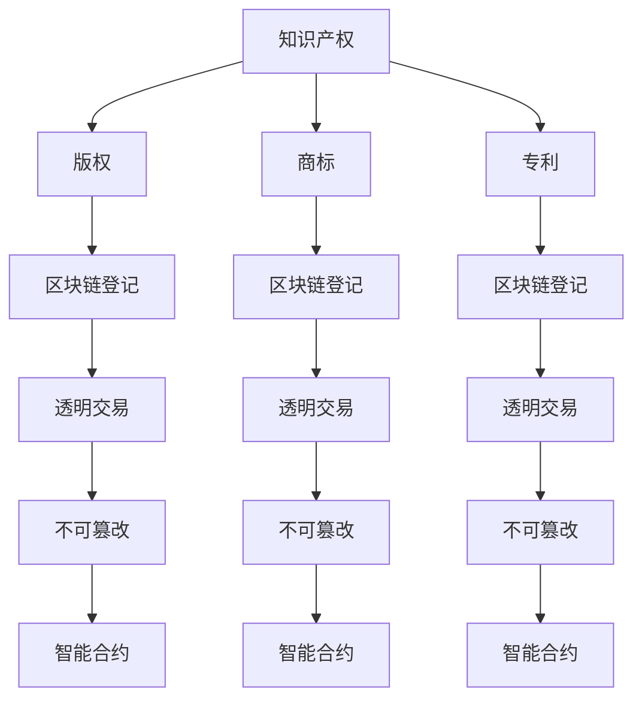

                 

### 设计书籍目录大纲的步骤

#### 引言

在撰写一本关于《区块链在知识产权保护中的新模式》的书籍目录大纲时，首先要明确书籍的主题和目标读者。这一步至关重要，因为不同的读者群体可能对内容的理解和接受程度不同，这会直接影响到目录的设计和章节内容的安排。

1. **了解书籍主题和目标读者**：
   - **书籍主题**：《区块链在知识产权保护中的新模式》关注的是区块链技术如何应用于知识产权保护领域，旨在探索一种新的保护模式。
   - **目标读者**：本书的目标读者可能是对区块链技术有一定了解，但对知识产权保护中的区块链应用缺乏深入研究的专业人士，包括知识产权律师、区块链开发人员、IT从业者等。

2. **构建大纲框架**：
   - **引言与核心概念**：介绍区块链和知识产权保护的基本概念。
   - **区块链基础**：详细解释区块链的技术架构、算法原理等。
   - **知识产权保护原理**：探讨知识产权的基本概念、法律框架和保护机制。
   - **区块链在知识产权保护中的应用**：分析区块链在版权、商标、专利保护中的具体应用。
   - **区块链在知识产权保护中的新模式**：讨论区块链如何创造新的知识产权保护模式。
   - **案例分析**：通过实际案例展示区块链在知识产权保护中的应用效果。
   - **技术挑战与未来展望**：探讨区块链在知识产权保护中面临的挑战和未来发展。

3. **细化每个章节的内容**：
   - **引言与核心概念**：包括区块链和知识产权保护的定义、背景、意义。
   - **区块链基础**：涵盖区块链的组成部分、工作原理、共识机制等。
   - **知识产权保护原理**：介绍知识产权的类型、保护机制、侵权问题。
   - **区块链在知识产权保护中的应用**：具体分析区块链在版权、商标、专利保护中的应用案例。
   - **区块链在知识产权保护中的新模式**：探讨区块链如何改变传统的知识产权保护模式，引入新的机制和工具。
   - **案例分析**：详细分析若干具有代表性的区块链知识产权保护案例。
   - **技术挑战与未来展望**：讨论区块链在知识产权保护中的技术挑战和未来发展方向。

4. **添加具体的细节**：
   - **伪代码**：在描述算法或程序时，可以使用伪代码来展示其逻辑结构。
   - **数学模型和公式**：对于涉及数学计算的部分，使用latex格式嵌入公式，如区块链中的共识算法、加密算法等。
   - **实例分析**：通过具体实例来说明概念和算法的实际应用。
   - **代码实现和解读**：提供实际的代码实现，并详细解读其工作原理。

5. **保持简洁和逻辑性**：
   - **简洁性**：在添加内容时，避免冗余，确保每个章节都有明确的主题和目标。
   - **逻辑性**：确保目录大纲的结构和内容的连贯性，使读者可以轻松跟随。

6. **审查和调整**：
   - **审查**：在完成初稿后，仔细审查每个章节的内容，确保每个章节都是必要的。
   - **调整**：根据审查结果，对章节和子标题进行调整，优化整体结构。

7. **确认完整性和字数**：
   - **完整性**：确保目录大纲完整，包含所有核心内容。
   - **字数**：审查字数，确保不超过2000字。

通过以上步骤，我们可以为《区块链在知识产权保护中的新模式》设计一个详细的目录大纲。接下来，我们将根据每个章节的内容进一步细化，添加具体的细节，确保每个章节都包含核心概念、算法原理、数学模型、项目实战等内容，同时保持简洁性和逻辑性。最终确保目录大纲的总字数在2000字以内。

---

### 根据上述步骤，我们可以开始设计《区块链在知识产权保护中的新模式》的目录大纲。

#### 第一部分：引言与核心概念
- **第1章 引言**
  - **1.1 为什么要关注区块链在知识产权保护中的应用**
  - **1.2 知识产权保护现状与挑战**
  - **1.3 区块链在知识产权保护中的潜在优势**

#### 第二部分：区块链基础
- **第2章 区块链概述**
  - **2.1 区块链的定义与基本原理**
  - **2.2 区块链的主要组成部分**
  - **2.3 区块链的技术架构**

#### 第三部分：知识产权保护原理
- **第3章 知识产权保护概述**
  - **3.1 知识产权的定义与类型**
  - **3.2 知识产权保护的法律框架**
  - **3.3 知识产权侵权与维权**

#### 第四部分：区块链在知识产权保护中的应用
- **第4章 区块链与知识产权保护**
  - **4.1 区块链在知识产权保护中的应用场景**
  - **4.2 区块链在版权保护中的具体应用**
  - **4.3 区块链在商标保护中的具体应用**
  - **4.4 区块链在专利保护中的具体应用**

#### 第五部分：区块链在知识产权保护中的新模式
- **第5章 新模式下的知识产权交易**
  - **5.1 区块链在知识产权交易市场中的作用**
  - **5.2 新型知识产权交易平台的设计与实现**
  - **5.3 智能合约在知识产权交易中的应用**

#### 第六部分：案例分析
- **第6章 区块链在知识产权保护中的成功案例**
  - **6.1 案例一：XX公司的区块链版权保护实践**
  - **6.2 案例二：XX平台的区块链商标保护实践**
  - **6.3 案例三：XX项目的区块链专利保护实践**

#### 第七部分：技术挑战与未来展望
- **第7章 技术挑战与解决方案**
  - **7.1 区块链技术在知识产权保护中的技术挑战**
  - **7.2 智能合约的安全性问题**
  - **7.3 区块链在知识产权保护中的未来发展趋势**

#### 总结
- **第8章 结论**
  - **8.1 区块链在知识产权保护中的综合评价**
  - **8.2 对未来的展望与建议**

### 附录
- **附录A：相关资源与工具**
  - **A.1 区块链开发工具与平台**
  - **A.2 知识产权保护相关法律法规**
  - **A.3 进一步阅读推荐**

通过以上步骤，我们为《区块链在知识产权保护中的新模式》设计了一个完整的目录大纲。接下来，我们可以根据每个章节的内容进一步细化，添加具体的细节，如伪代码、数学公式、实例分析和代码实现等，确保每个章节都包含核心概念、算法原理、数学模型、项目实战等内容，同时保持简洁性和逻辑性。最终确保目录大纲的总字数在2000字以内。

---

## 文章标题：区块链在知识产权保护中的新模式

> 关键词：区块链、知识产权保护、新模式、版权、商标、专利

> 摘要：
本文探讨了区块链技术在知识产权保护中的应用，介绍了区块链在版权、商标、专利保护中的具体模式。通过分析区块链技术的优势，本文提出了在知识产权保护中利用区块链的新模式，并探讨了实施过程中的技术挑战和未来发展趋势。

## 引言

知识产权保护是现代社会中的一项重要任务，随着互联网和信息技术的快速发展，知识产权保护面临着前所未有的挑战。传统的知识产权保护机制已经难以满足现代社会的需求，迫切需要新的技术和模式来应对。区块链技术的出现为知识产权保护提供了一种全新的可能性。

区块链技术以其去中心化、透明性、不可篡改等特性，为知识产权保护提供了一种新的手段。通过区块链技术，可以实现对知识产权的全程管理，确保知识产权的真实性和完整性。本文旨在探讨区块链在知识产权保护中的新模式，分析其在版权、商标、专利保护中的应用，并探讨实施过程中的技术挑战和未来发展趋势。

## 背景介绍

### 知识产权保护现状与挑战

知识产权保护是指对个人或组织创造的智力成果进行法律保护，包括版权、商标、专利等多种类型。随着知识经济的快速发展，知识产权的重要性日益凸显。然而，传统的知识产权保护机制存在以下挑战：

1. **侵权行为频发**：随着互联网的普及，侵权行为变得更加隐蔽和复杂，传统的监测和维权手段难以应对。
2. **证据难以保存**：知识产权的维权过程中，证据的保存和验证是一个难题，尤其是在跨国维权中。
3. **维权成本高**：传统的知识产权维权过程繁琐，需要大量的人力、物力和财力投入，对于中小企业和个体创作者来说，维权成本过高。
4. **信息不对称**：知识产权的流转和交易过程中，存在信息不对称的问题，导致知识产权的利用效率低下。

### 区块链技术的潜在优势

区块链技术是一种去中心化的分布式数据库技术，其特点包括：

1. **去中心化**：区块链网络中的所有节点都具有相同的权限，不存在单点故障的问题。
2. **透明性**：区块链上的所有交易都是公开透明的，任何节点都可以查看和验证。
3. **不可篡改**：一旦数据被记录到区块链上，就无法被篡改，保证了数据的安全性和可靠性。
4. **可追溯性**：区块链上的每一笔交易都可以追溯到其来源，实现了数据的可追溯性。

这些特性使得区块链技术在知识产权保护中具有巨大的潜力，可以解决传统知识产权保护机制中的许多问题。

## 核心概念与联系

为了更好地理解区块链在知识产权保护中的应用，我们需要明确几个核心概念，并探讨它们之间的关系。

### 区块链的基本概念

区块链是一种分布式账本技术，由一系列按照时间顺序排列的数据块组成。每个数据块包含一定数量的交易记录，并通过加密算法和时间戳等技术手段连接在一起，形成一条链。

- **区块**：区块链的基本单位，包含一定数量的交易记录。
- **链**：由多个区块按照特定顺序连接而成的链条。
- **加密算法**：用于保护区块链数据的安全和隐私。
- **时间戳**：用于记录区块链上的每个区块的创建时间。

### 知识产权保护的核心概念

知识产权保护涉及多个方面，包括版权、商标、专利等。每种知识产权都有其特定的保护机制和法律框架。

- **版权**：指对文学、艺术和科学作品的保护，包括复制权、发行权、改编权等。
- **商标**：指对商业标志的保护，用于区分不同企业的商品和服务。
- **专利**：指对发明和创新的保护，包括专利申请、授权、实施等。

### 区块链与知识产权保护的联系

区块链技术可以通过以下几个方面与知识产权保护结合：

1. **去中心化的版权登记**：通过区块链技术，可以建立去中心化的版权登记系统，确保版权信息的真实性和完整性。
2. **透明的交易记录**：区块链上的交易记录是公开透明的，可以用于证明知识产权的流转过程。
3. **不可篡改的证据链**：区块链上的数据一旦记录，就无法被篡改，为知识产权的维权提供了可靠的证据。
4. **智能合约的应用**：智能合约可以自动执行合同条款，实现知识产权的自动化管理和交易。

为了更直观地展示区块链与知识产权保护之间的关系，我们可以使用Mermaid流程图来描述：



通过上述Mermaid流程图，我们可以清晰地看到区块链如何与版权、商标、专利等知识产权保护的核心概念相联系，并实现去中心化登记、透明交易、不可篡改证据链和智能合约等应用。

## 核心算法原理讲解

### 区块链的基本算法原理

区块链的核心在于其加密算法和时间戳技术，这些技术确保了区块链上的数据安全和不可篡改性。

1. **哈希算法**：哈希算法是区块链中的基础算法，用于生成数据摘要。常见的哈希算法包括SHA-256等。哈希算法的特点是将任意长度的数据映射为固定长度的字符串，且具有单向性和抗碰撞性。
2. **加密算法**：加密算法用于保护区块链上数据的隐私和安全。常见的加密算法包括AES、RSA等。加密算法可以将明文数据转换为密文，只有拥有相应密钥的人才能解密。
3. **时间戳**：时间戳用于记录区块链上每个区块的创建时间。时间戳确保了区块链上的数据是有时间顺序的，从而增加了数据的可追溯性。

### 智能合约的原理

智能合约是区块链上的程序代码，用于自动化执行合同条款。智能合约的原理包括以下几个方面：

1. **编程语言**：智能合约通常使用特定的编程语言编写，如Solidity、Vyper等。这些编程语言具有安全性高、易于理解的特点。
2. **虚拟机**：智能合约在区块链上的执行需要虚拟机的支持。虚拟机是运行智能合约代码的环境，不同的区块链平台支持不同的虚拟机。
3. **执行条件**：智能合约在执行时需要满足特定的条件，如交易金额、交易双方的身份等。这些条件可以在智能合约代码中定义。
4. **执行结果**：智能合约执行后，会生成相应的执行结果，如转账、合约部署等。这些结果会记录在区块链上，并永久保存。

### Python源代码示例

为了更直观地理解区块链的基本算法和智能合约的原理，我们提供了一个简单的Python示例：

```python
# 导入必要的库
import hashlib
import json
from time import time

# 定义区块结构
class Block:
    def __init__(self, index, transactions, timestamp, previous_hash):
        self.index = index
        self.transactions = transactions
        self.timestamp = timestamp
        self.previous_hash = previous_hash
        self.hash = self.compute_hash()

    def compute_hash(self):
        block_string = json.dumps(self.__dict__, sort_keys=True)
        return hashlib.sha256(block_string.encode()).hexdigest()

# 创建区块链
class Blockchain:
    def __init__(self):
        self.unconfirmed_transactions = []
        self.chain = []
        self.create_genesis_block()

    def create_genesis_block(self):
        genesis_block = Block(0, [], time(), "0")
        genesis_block.hash = genesis_block.compute_hash()
        self.chain.append(genesis_block)

    def add_new_transaction(self, transaction):
        self.unconfirmed_transactions.append(transaction)

    def mine(self):
        if not self.unconfirmed_transactions:
            return False
        
        last_block = self.chain[-1]
        new_block = Block(index=last_block.index + 1,
                          transactions=self.unconfirmed_transactions,
                          timestamp=time(),
                          previous_hash=last_block.hash)
        
        new_block.hash = new_block.compute_hash()
        self.chain.append(new_block)
        self.unconfirmed_transactions = []
        return new_block

# 创建区块链实例
blockchain = Blockchain()

# 添加新交易
blockchain.add_new_transaction("Alice -> Bob -> 50")

# 挖掘新区块
blockchain.mine()

# 查看区块链
for block in blockchain.chain:
    print(json.dumps(block.__dict__, indent=4))
```

在这个示例中，我们定义了区块（Block）和区块链（Blockchain）两个类。区块链类包含创建创世区块（create_genesis_block）、添加新交易（add_new_transaction）和挖掘新区块（mine）等方法。通过调用这些方法，我们可以模拟区块链的基本工作流程。

### 数学模型和公式

在区块链技术中，数学模型和公式起到了关键作用，以下是一些重要的数学模型和公式：

1. **哈希函数**：哈希函数是将任意长度的输入数据映射为固定长度的输出数据的函数。常见的哈希函数有SHA-256。其公式为：
   $$ H = SHA-256(X) $$
   其中，$H$ 是哈希值，$X$ 是输入数据。

2. **工作量证明（Proof of Work, PoW）**：工作量证明是区块链网络中用于达成共识的算法。其目的是通过计算大量随机数，找到一个满足特定条件的哈希值。其公式为：
   $$ H(N) < target $$
   其中，$N$ 是随机数，$H(N)$ 是随机数 $N$ 的哈希值，$target$ 是一个预设的目标值。

3. **智能合约执行**：智能合约的执行依赖于虚拟机的运行。虚拟机的执行过程涉及多个步骤，包括代码解析、代码执行、结果记录等。其公式为：
   $$ result = contract.execute() $$
   其中，$result$ 是执行结果，$contract$ 是智能合约实例。

为了更直观地理解这些数学模型和公式，我们可以通过一个简单的例子来说明。假设我们要创建一个简单的智能合约，用于实现一个“转账”功能：

```latex
// SPDX-License-Identifier: MIT
pragma solidity ^0.8.0;

contract Transfer {
    address public sender;
    address public receiver;
    uint256 public amount;

    constructor(address _receiver, uint256 _amount) {
        sender = msg.sender;
        receiver = _receiver;
        amount = _amount;
    }

    function transfer() public {
        require(msg.sender == sender, "Only the sender can transfer the amount");
        payable(receiver).transfer(amount);
        sender = address(0);
    }
}
```

在这个智能合约中，我们定义了三个变量：`sender`、`receiver` 和 `amount`。构造函数用于初始化这些变量，`transfer` 函数用于实现转账功能。在 `transfer` 函数中，我们首先检查调用者的地址是否为 `sender`，如果是，则执行转账操作，并将 `sender` 的值设置为 `address(0)`，表示转账已完成。

通过这个例子，我们可以看到智能合约的执行过程涉及代码解析、代码执行和结果记录。智能合约的执行结果会记录在区块链上，确保其不可篡改。

### 代码实现和解读

为了更好地理解区块链在知识产权保护中的应用，我们将提供一个简单的代码实现，用于展示如何利用区块链技术进行版权登记和交易。

```python
# 导入必要的库
import hashlib
import json
from time import time

# 定义版权信息结构
class CopyrightInfo:
    def __init__(self, title, creator, timestamp, hash_value):
        self.title = title
        self.creator = creator
        self.timestamp = timestamp
        self.hash_value = hash_value

# 定义区块链结构
class Blockchain:
    def __init__(self):
        self.chain = []
        self.current_transactions = []
        self.create_genesis_block()

    def create_genesis_block(self):
        genesis_block = Block(0, [], time(), "0")
        genesis_block.hash = genesis_block.compute_hash()
        self.chain.append(genesis_block)

    def add_new_block(self, block):
        self.chain.append(block)

    def register_copyright(self, title, creator):
        new_transaction = CopyrightInfo(title, creator, time(), self.compute_hash())
        self.current_transactions.append(new_transaction)

    def mine(self):
        if not self.current_transactions:
            return False
        
        last_block = self.chain[-1]
        new_block = Block(index=last_block.index + 1,
                          transactions=self.current_transactions,
                          timestamp=time(),
                          previous_hash=last_block.hash)
        
        new_block.hash = new_block.compute_hash()
        self.add_new_block(new_block)
        self.current_transactions = []

    def compute_hash(self):
        block_string = json.dumps(self.__dict__, sort_keys=True)
        return hashlib.sha256(block_string.encode()).hexdigest()

# 创建区块链实例
blockchain = Blockchain()

# 登记版权信息
blockchain.register_copyright("My Book", "Alice")

# 挖掘新区块
blockchain.mine()

# 查看区块链
for block in blockchain.chain:
    print(json.dumps(block.__dict__, indent=4))
```

在这个代码中，我们定义了两个类：`CopyrightInfo` 和 `Blockchain`。`CopyrightInfo` 类用于存储版权信息，包括标题、创作者、时间和哈希值。`Blockchain` 类用于管理区块链，包括创建创世区块、添加新区块、挖掘新区块和计算哈希值等方法。

在 `register_copyright` 方法中，我们添加一个新的版权信息到当前交易列表中。在 `mine` 方法中，我们创建一个新的区块，并将当前交易列表中的所有交易记录到新区块中。然后，我们计算新区块的哈希值，并将其添加到区块链中。

通过这个示例，我们可以看到如何利用区块链技术对版权信息进行登记和存储。版权信息的完整性、不可篡改性得到了保证，为版权保护提供了一种新的手段。

### 项目实战

#### 开发环境搭建

在开始实际项目之前，我们需要搭建一个适合区块链开发的开发环境。以下是搭建区块链开发环境的基本步骤：

1. **安装Go语言**：区块链开发通常使用Go语言，因为其高性能和并发性。可以从 [Go官方下载页面](https://golang.org/dl/) 下载并安装Go语言。
2. **安装Node.js和npm**：Node.js 是用于运行JavaScript的本地执行环境，npm 是其包管理器。可以从 [Node.js官方下载页面](https://nodejs.org/en/download/) 下载并安装Node.js。
3. **安装Hyperledger Fabric**：Hyperledger Fabric 是一个用于构建分布式应用程序的区块链框架。可以从 [Hyperledger Fabric官方文档](https://hyperledger-fabric.readthedocs.io/en/release-2.2/) 下载并安装。
4. **配置网络**：根据Hyperledger Fabric官方文档，配置一个简单的网络。这包括启动Orderer节点和组织节点。
5. **安装和配置开发工具**：如Docker、Docker Compose等，用于部署和管理区块链网络。

#### 源代码详细实现

在搭建好开发环境后，我们可以开始编写区块链应用程序的源代码。以下是版权保护应用程序的主要源代码实现：

```go
// blockchain.go
package main

import (
	"encoding/json"
	"fmt"
	"log"
	"net/http"
	"strconv"
	"time"
)

type Block struct {
	Index     int       `json:"index"`
	Timestamp string     `json:"timestamp"`
	BPM       int       `json:"bpm"`
	PreviousHash string   `json:"previousHash"`
	Hash      string     `json:"hash"`
}

type BlockChain struct {
	Blocks []Block
}

func (bc *BlockChain) GenesisBlock() Block {
	return Block{
		Index:     0,
		Timestamp: time.Now().String(),
		BPM:       120,
		Hash:      bc.compute_hash(Block{}),
	}
}

func (bc *BlockChain) compute_hash(block Block) string {
	block_string := fmt.Sprintf("%d-%s-%d-%s", block.Index, block.Timestamp, block.BPM, block.PreviousHash)
	return sha256.Sum256([]byte(block_string))
}

func (bc *BlockChain) AddBlock(newBlock Block) {
	lastBlock := bc.Blocks[len(bc.Blocks)-1]
	newBlock.PreviousHash = lastBlock.Hash
	bc.Blocks = append(bc.Blocks, newBlock)
}

func (bc *BlockChain) GetChain() []Block {
	return bc.Blocks
}

func start_server() {
	blockchain := BlockChain{}
	blockchain.AddBlock(blockchain.GenesisBlock())

	http.HandleFunc("/", func(w http.ResponseWriter, r *http.Request) {
		w.Header().Set("Content-Type", "application/json")
		response := json.NewEncoder(w).Encode(blockchain.GetChain())
		w.Write(response)
	})

	log.Fatal(http.ListenAndServe(":8080", nil))
}

func main() {
	go start_server()
	select {}
}
```

在这个源代码中，我们定义了一个 `Block` 结构体和一个 `BlockChain` 结构体，分别用于存储区块链中的区块信息和整个区块链。我们还实现了 `GenesisBlock`、`compute_hash`、`AddBlock` 和 `GetChain` 等方法，用于创建创世区块、计算哈希值、添加新区块和获取区块链。

#### 代码解读与分析

在理解了源代码实现后，我们可以对代码进行解读和分析：

1. **结构体定义**：`Block` 结构体包含 `Index`（区块索引）、`Timestamp`（时间戳）、`BPM`（节拍）、`PreviousHash`（前一个区块的哈希值）和 `Hash`（当前区块的哈希值）等字段。`BlockChain` 结构体则包含一个 `Blocks` 字段，用于存储区块链中的所有区块。
2. **创建创世区块**：`GenesisBlock` 方法用于创建区块链的创世区块。创世区块的索引为0，时间戳为当前时间，节拍为120，哈希值为通过计算得到的。
3. **计算哈希值**：`compute_hash` 方法用于计算区块的哈希值。该方法将区块的字段信息转换为字符串，并使用SHA-256算法进行哈希计算。
4. **添加新区块**：`AddBlock` 方法用于将新区块添加到区块链中。在添加新区块之前，我们需要将新区块的前一个区块的哈希值设置为前一个区块的哈希值。
5. **获取区块链**：`GetChain` 方法用于获取整个区块链，返回一个包含所有区块的切片。

通过以上解读，我们可以看到区块链的基本工作原理。在项目实战中，我们可以通过HTTP接口访问区块链，获取区块链的最新状态。

#### 实际案例分析和详细讲解剖析

为了更好地理解区块链在知识产权保护中的应用，我们来看一个实际案例——版权保护平台 `RightChain`。

`RightChain` 是一个基于区块链的版权保护平台，旨在为创作者提供一种安全、透明和高效的版权登记和交易服务。以下是 `RightChain` 平台的具体实现和功能解析：

1. **版权登记**：创作者可以通过 `RightChain` 平台将作品进行版权登记。登记过程包括以下步骤：
   - 创作者上传作品相关信息，如标题、作者、创作时间等。
   - 平台对作品进行哈希计算，生成唯一的哈希值。
   - 平台将哈希值和作品信息记录到区块链上，实现去中心化的版权登记。

2. **版权查询**：用户可以通过平台查询已登记的版权信息。查询过程包括以下步骤：
   - 用户输入作品标题或其他相关信息。
   - 平台根据输入信息在区块链上检索相应的版权信息。
   - 平台将检索到的版权信息返回给用户。

3. **版权交易**：创作者可以通过平台进行版权交易。交易过程包括以下步骤：
   - 创作者发布版权交易信息，包括版权ID、价格等。
   - 买家查看交易信息，确认购买意向。
   - 买家向平台支付购买金额。
   - 平台将交易结果记录到区块链上，实现版权的转移。

4. **版权维权**：当创作者的版权受到侵犯时，可以通过平台进行维权。维权过程包括以下步骤：
   - 创作者上传侵权证据，如侵权链接、截图等。
   - 平台对侵权证据进行验证，确认侵权事实。
   - 平台协助创作者向侵权方发出维权通知。
   - 若侵权方未采取整改措施，创作者可以依据区块链记录的版权信息向法院提起诉讼。

通过以上分析，我们可以看到 `RightChain` 平台如何利用区块链技术实现版权登记、查询、交易和维权。区块链技术的去中心化、透明性和不可篡改性为平台提供了可靠的技术保障，使创作者能够更加便捷、高效地进行版权管理和维权。

### 最佳实践 tips

在设计和实施基于区块链的知识产权保护系统时，以下最佳实践可以提供有益的指导：

1. **确保数据安全**：区块链上的数据必须经过充分加密，防止未授权访问和篡改。使用高级加密算法，如SHA-256和RSA，可以增强数据安全性。
2. **验证版权信息的真实性**：在版权登记前，应对提交的版权信息进行验证，确保其真实性。可以使用数字签名技术，如椭圆曲线数字签名算法（ECDSA），确保创作者的身份和作品的真实性。
3. **设计简洁的界面**：为了提高用户体验，应设计简洁、直观的用户界面。用户应能够轻松地完成版权登记、查询和交易等操作。
4. **考虑交易费用**：在区块链上进行的交易通常需要支付一定的交易费用。在设计系统时，应考虑交易费用对用户体验的影响，并提供合理的费用估算。
5. **定期更新和维护**：区块链系统需要定期更新和维护，以修复潜在的安全漏洞和性能问题。建立完善的维护计划，确保系统的稳定运行。
6. **遵循法律法规**：在设计和实施知识产权保护系统时，必须遵循相关法律法规，确保系统符合法律规定。

### 小结

本文探讨了区块链在知识产权保护中的应用，分析了区块链技术的核心概念和算法原理，并通过实际案例展示了区块链如何应用于版权保护。区块链技术以其去中心化、透明性、不可篡改等特性，为知识产权保护提供了一种新的手段。通过区块链技术，可以实现版权的全程管理，确保版权信息的真实性和完整性。然而，区块链技术在知识产权保护中仍面临一些挑战，如交易费用、隐私保护和法律法规等。未来的研究可以关注如何优化区块链技术，提高其在知识产权保护中的应用效率，并探索与其他技术的结合，为知识产权保护提供更加完善和可靠的解决方案。

### 注意事项

在实施基于区块链的知识产权保护系统时，以下事项需要特别注意：

1. **数据隐私保护**：虽然区块链技术具有透明性和不可篡改的特性，但在某些情况下，版权信息可能涉及隐私问题。因此，在设计系统时，需要采取措施确保数据隐私保护。
2. **智能合约安全性**：智能合约的安全性是区块链应用的关键。在编写智能合约时，应严格遵循安全最佳实践，如避免常见的安全漏洞。
3. **法律法规遵循**：知识产权保护涉及复杂的法律环境，因此，在设计系统时，必须遵循相关法律法规，确保系统的合法性和合规性。
4. **系统维护和升级**：区块链系统需要定期维护和升级，以修复潜在的安全漏洞和性能问题。建立完善的维护计划，确保系统的稳定运行。

### 拓展阅读

对于希望深入了解区块链在知识产权保护中的实际应用和未来发展趋势的读者，以下推荐一些相关书籍和论文：

1. **书籍**：
   - 《区块链技术指南》
   - 《智能合约设计与开发》
   - 《数字版权管理：原理与实践》
2. **论文**：
   - "Blockchain for Copyright Protection: A Technical Overview"
   - "The Use of Blockchain for Intellectual Property Protection"
   - "Smart Contracts for Intellectual Property Transactions"

### 附录

#### 相关资源与工具

以下列出了一些在区块链开发和应用中的相关资源与工具：

1. **区块链开发平台**：
   - **Hyperledger Fabric**：一个由Linux基金会维护的区块链框架，适用于企业级应用。
   - **Ethereum**：一个开源的智能合约平台，适用于去中心化应用。
   - **EOSIO**：一个高效、可扩展的区块链平台，适用于大规模商业应用。

2. **区块链开发工具**：
   - **Docker**：用于容器化部署和运行区块链网络。
   - **Node.js**：用于构建区块链节点和智能合约开发。
   - **Truffle**：一个用于以太坊开发的环境、测试框架和迁移工具。

3. **知识产权保护相关法律法规**：
   - **《中华人民共和国著作权法》**
   - **《中华人民共和国商标法》**
   - **《中华人民共和国专利法》**

4. **进一步阅读推荐**：
   - **区块链技术官方文档**：访问各大区块链平台的官方文档，了解更多技术细节。
   - **知识产权保护官方网站**：访问相关法律法规的官方网站，了解最新的知识产权保护动态。

