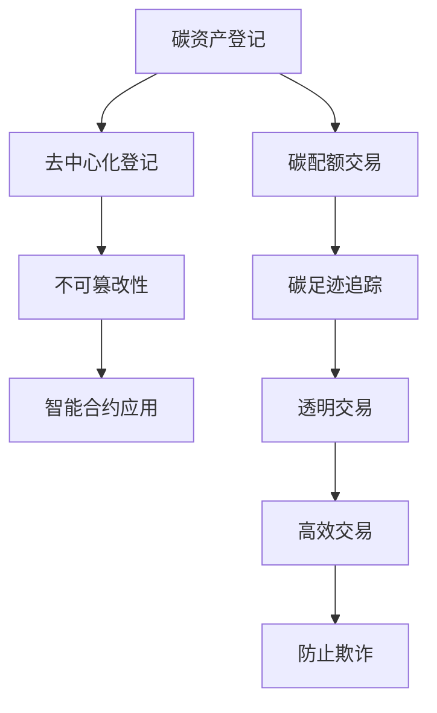

                 

### 文章标题

《区块链在碳交易市场中的应用：促进绿色经济发展》

随着全球气候变化和环境问题日益严峻，绿色经济发展已成为各国共同追求的目标。在这个过程中，区块链技术作为一种新兴技术，以其去中心化、透明化和不可篡改的特性，逐渐受到广泛关注。本文将深入探讨区块链在碳交易市场中的应用，分析其如何促进绿色经济发展。

### 文章关键词

- 区块链
- 碳交易市场
- 绿色经济发展
- 透明性
- 可追溯性
- 去中心化

### 文章摘要

本文首先介绍了区块链技术的定义、原理和核心特点，以及碳交易市场的概念、背景和发展现状。接着，本文详细阐述了区块链在碳交易市场中的应用，包括碳资产登记与管理、碳配额交易和碳足迹追踪等方面。通过案例分析，本文展示了国际和我国在区块链应用于碳交易市场的实践探索。最后，本文对区块链在碳交易市场中的未来发展趋势和潜在挑战进行了展望，并提出了相关政策建议。

## 第一部分：引言

### 1.1 区块链技术基础

区块链技术，作为一种分布式账本技术，其核心原理是利用密码学对数据进行加密和验证，从而实现数据的安全存储和传输。区块链由多个区块组成，每个区块包含一定数量的交易记录。这些区块按照时间顺序链接在一起，形成一条不可篡改的链条。

### 1.2 区块链的核心特点

区块链具有以下核心特点：

1. **去中心化**：区块链不依赖于中心化的机构或服务器，而是通过分布式网络来维护数据的一致性。这意味着区块链系统中的每个参与者都可以访问和验证数据，从而降低了系统的单点故障风险。

2. **不可篡改**：区块链采用密码学技术，确保了数据的不可篡改性。一旦数据被记录在区块链上，就无法被修改或删除。

3. **透明性**：区块链的数据是公开的，任何人都可以查看区块链上的交易记录。这有助于提高市场的透明度和公正性。

4. **可追溯性**：由于区块链的数据是按时间顺序排列的，因此可以追溯每一笔交易的历史记录。这有助于防范欺诈行为和追踪环境责任。

### 1.3 区块链的发展历程与趋势

区块链技术的发展可以追溯到2008年，当时中本聪（Satoshi Nakamoto）提出了比特币的概念，并发布了比特币白皮书。比特币作为第一个基于区块链技术的数字货币，引起了全球的关注。

自比特币问世以来，区块链技术逐渐应用于金融、供应链管理、医疗等多个领域。随着技术的不断成熟，区块链的应用场景也在不断扩展。未来，区块链技术有望在碳交易市场、绿色金融、可持续发展等方面发挥更大的作用。

## 第二部分：碳交易市场概述

### 2.1 碳交易市场的定义与背景

碳交易市场，也称为碳排放交易市场，是指通过市场机制进行碳排放权交易的平台。碳交易市场的目的是通过经济手段降低温室气体排放，推动绿色经济发展。

碳交易市场的发展背景源于全球气候变化问题。自工业革命以来，人类活动导致大量温室气体排放，导致全球气温升高、海平面上升、极端天气事件增多。为了应对气候变化，国际社会采取了多种措施，其中包括碳交易市场。

### 2.2 碳交易市场的组成部分

碳交易市场主要由以下几个部分组成：

1. **碳排放权**：碳排放权是指企业或个人在一定时期内可以排放的二氧化碳等温室气体的总量。碳排放权可以通过政府分配或市场交易获得。

2. **交易主体**：交易主体主要包括企业、政府、非政府组织和公众。这些主体可以通过购买、出售或租赁碳排放权来实现减排目标。

3. **市场架构**：碳交易市场通常由交易平台、监管机构和标准制定机构组成。交易平台是碳交易的核心，负责提供交易服务和技术支持。监管机构负责市场的监管和合规性审查。标准制定机构则负责制定碳交易标准和规则。

### 2.3 碳交易市场的发展现状与挑战

碳交易市场的发展现状因地区而异。在全球范围内，欧盟、美国、中国等地区已经建立了较为成熟的碳交易市场。其中，欧盟碳排放交易体系（EU ETS）是全球最大的碳交易市场，涵盖了约11000家企业的碳排放。

然而，碳交易市场仍面临一些挑战。首先，市场参与者数量有限，市场规模有待扩大。其次，市场透明度和公信力有待提高，以避免欺诈行为。此外，各国碳交易市场之间的协调和合作也需要进一步加强。

## 第三部分：区块链在碳交易市场中的应用

### 3.1 区块链在碳资产登记与管理的应用

碳资产是指企业拥有的碳排放权和其他与碳排放相关的资产。区块链在碳资产登记与管理中的应用主要包括以下几个方面：

1. **去中心化登记**：区块链的去中心化特性使得碳资产的登记和管理更加透明和高效。通过区块链，企业可以直接在链上登记其碳资产，无需依赖第三方机构。

2. **不可篡改性**：区块链的不可篡改性确保了碳资产登记的准确性和可信度。一旦碳资产在区块链上登记，任何篡改行为都会被记录和追溯。

3. **智能合约**：智能合约是一种自动执行合约条款的计算机程序。在碳资产登记和管理中，智能合约可以自动执行碳资产的购买、出售和租赁等交易，提高交易效率。

### 3.2 区块链在碳配额交易中的应用

碳配额是指政府或机构分配给企业的碳排放权数量。区块链在碳配额交易中的应用主要体现在以下几个方面：

1. **透明交易**：区块链的透明性使得碳配额交易过程更加公开和透明。所有交易记录都会被记录在区块链上，供公众查看。

2. **高效交易**：区块链的去中心化和智能合约特性使得碳配额交易过程更加高效。交易双方可以通过区块链直接进行交易，无需依赖中介机构。

3. **防止欺诈**：区块链的不可篡改性确保了碳配额交易的公正性和可信度。任何欺诈行为都会被记录和追溯，从而降低市场风险。

### 3.3 区块链在碳足迹追踪中的应用

碳足迹是指一个人、组织或产品在生命周期内产生的碳排放量。区块链在碳足迹追踪中的应用主要体现在以下几个方面：

1. **全流程追溯**：区块链的分布式账本特性使得碳足迹的全流程追溯成为可能。从生产、运输、消费到废弃，每个环节的碳排放量都可以被记录和追踪。

2. **数据透明**：区块链上的数据是公开的，消费者可以通过区块链查询产品或服务的碳足迹，从而做出更环保的选择。

3. **智能合约**：智能合约可以用于激励消费者减少碳排放。例如，如果消费者购买低碳产品，他们可以获得相应的奖励或优惠。

## 第四部分：案例分析

### 4.1 国际碳交易市场的区块链应用案例

在国际碳交易市场中，一些国家和地区已经开始探索区块链技术的应用。以下是两个具有代表性的案例：

1. **欧盟碳排放交易体系**：欧盟碳排放交易体系（EU ETS）是全球最大的碳交易市场。为了提高市场的透明度和效率，欧盟正在探索将区块链技术应用于碳配额交易。通过区块链，欧盟可以更好地管理碳排放权，并减少欺诈行为。

2. **美国加州碳交易市场**：加州碳交易市场是美国最大的碳交易市场之一。加州政府计划使用区块链技术来管理碳排放权交易，提高市场的透明度和可信度。

### 4.2 中国碳排放权交易市场的区块链应用

在中国，碳排放权交易市场正在逐步发展。一些企业已经开始探索区块链技术在碳交易中的应用。以下是两个具有代表性的案例：

1. **深圳碳交易市场**：深圳碳交易市场是中国最早的碳交易市场之一。为了提高市场的效率和透明度，深圳碳交易市场正在与区块链技术企业合作，探索将区块链应用于碳配额交易。

2. **华能集团**：华能集团是中国最大的电力企业之一。为了实现碳资产的有效管理，华能集团正在使用区块链技术来登记和管理其碳排放权。

## 第五部分：我国区块链在碳交易市场的实践探索

### 5.1 我国碳交易市场的发展现状

中国碳交易市场的发展始于2011年，当时上海环境能源交易所成立了中国碳排放权交易所。截至2021年底，中国碳交易市场已覆盖全国26个省（区、市），涵盖了钢铁、水泥、化工等多个行业。

### 5.2 我国区块链在碳交易市场的应用实践

我国在区块链应用于碳交易市场方面已经取得了一些初步成果。以下是两个具有代表性的应用案例：

1. **蚂蚁区块链**：蚂蚁区块链与上海环境能源交易所合作，将区块链技术应用于碳交易市场。通过区块链，蚂蚁区块链实现了碳资产的全流程追溯和管理。

2. **华为区块链**：华为区块链与华能集团合作，将其区块链技术应用于碳排放权交易。通过华为区块链，华能集团实现了碳资产的高效管理和透明交易。

### 5.3 我国区块链在碳交易市场的发展挑战与机遇

尽管我国在区块链应用于碳交易市场方面取得了一些进展，但仍面临一些挑战。首先，区块链技术尚未完全成熟，需要进一步提高其性能和安全性。其次，碳交易市场参与者对区块链技术的认知和接受度还有待提高。

然而，随着区块链技术的不断成熟和应用的深入，我国在碳交易市场中的应用前景十分广阔。通过区块链，我国可以进一步提高碳交易市场的透明度和效率，推动绿色经济发展。

## 第六部分：未来展望

### 6.1 区块链在碳交易市场的发展趋势

随着全球对气候变化问题的重视，区块链技术在碳交易市场中的应用前景将更加广阔。未来，区块链有望在碳资产登记、碳配额交易、碳足迹追踪等方面发挥更大的作用。

### 6.2 促进绿色经济发展的区块链创新

区块链技术在绿色经济发展中的应用不仅限于碳交易市场。未来，区块链可以与其他技术（如物联网、大数据等）结合，推动绿色金融、可持续供应链管理等领域的发展。

### 6.3 区块链在碳交易市场的政策建议

为了推动区块链技术在碳交易市场中的应用，政府应采取以下政策措施：

1. **加强技术创新**：加大对区块链技术的研究和开发投入，提高其性能和安全性。

2. **完善法律法规**：制定相关法律法规，规范区块链技术在碳交易市场的应用，确保市场的透明度和公正性。

3. **加强国际合作**：与其他国家和地区合作，推动区块链技术在碳交易市场中的全球应用。

## 结束语

区块链技术作为一种新兴技术，其在碳交易市场中的应用具有巨大的潜力。通过区块链，我们可以实现碳资产的全流程追溯和管理，提高市场的透明度和效率，促进绿色经济发展。未来，随着区块链技术的不断成熟，我们有理由相信，它将在碳交易市场中发挥更加重要的作用。

### 作者信息

作者：AI天才研究院/AI Genius Institute & 禅与计算机程序设计艺术 /Zen And The Art of Computer Programming

### 附录：核心概念原理和概念实体之间的关系架构 Mermaid 流程图

以下是区块链在碳交易市场中的核心应用流程图：



### 核心算法原理讲解

区块链在碳交易市场中的应用，主要依赖于其分布式账本技术和智能合约。以下是核心算法原理讲解：

#### 分布式账本技术

区块链的核心算法是分布式账本技术，它通过加密算法和数据结构，实现了数据的安全存储和传输。以下是分布式账本技术的算法原理：

1. **哈希算法**：哈希算法是分布式账本技术的基石。它将任意长度的数据转换为固定长度的哈希值。哈希值具有不可逆性和唯一性，确保了数据的安全性和唯一性。

2. **区块链结构**：区块链由多个区块组成，每个区块包含一定数量的交易记录。区块之间通过哈希链接形成一条不可篡改的链条。

3. **共识算法**：共识算法是区块链系统中的关键算法。它确保了区块链中的所有节点都能达成一致，维护数据的一致性和安全性。

#### 智能合约

智能合约是区块链上的计算机程序，它根据预定的条件和规则自动执行合约条款。以下是智能合约的算法原理：

1. **条件判断**：智能合约根据输入的条件进行判断，决定是否执行合约条款。例如，如果碳配额交易双方满足交易条件，智能合约将自动执行交易。

2. **数据存储**：智能合约在执行过程中，将交易记录存储在区块链上。这些记录是公开的，可以供所有人查看和验证。

3. **安全性和可靠性**：智能合约采用密码学技术，确保了合约条款的不可篡改性和安全性。一旦合约执行，其条款无法被修改或删除。

### Python源代码示例

以下是一个简单的Python示例，展示了区块链在碳交易中的应用：

```python
import hashlib
import json
from time import time

class Block:
    def __init__(self, index, transactions, timestamp, previous_hash):
        self.index = index
        self.transactions = transactions
        self.timestamp = timestamp
        self.previous_hash = previous_hash
        self.hash = self.compute_hash()

    def compute_hash(self):
        block_string = json.dumps(self.__dict__, sort_keys=True)
        return hashlib.sha256(block_string.encode()).hexdigest()

class Blockchain:
    def __init__(self):
        self.unconfirmed_transactions = []
        self.chain = []
        self.create_genesis_block()

    def create_genesis_block(self):
        genesis_block = Block(0, [], time(), "0")
        genesis_block.hash = genesis_block.compute_hash()
        self.chain.append(genesis_block)

    def add_new_transaction(self, transaction):
        self.unconfirmed_transactions.append(transaction)

    def mine(self):
        if not self.unconfirmed_transactions:
            return False

        last_block = self.chain[-1]
        new_block = Block(index=last_block.index + 1,
                          transactions=self.unconfirmed_transactions,
                          timestamp=time(),
                          previous_hash=last_block.hash)
        new_block.hash = new_block.compute_hash()
        self.chain.append(new_block)
        self.unconfirmed_transactions = []
        return new_block.index

    def is_chain_valid(self):
        for i in range(1, len(self.chain)):
            current = self.chain[i]
            previous = self.chain[i - 1]
            if current.hash != current.compute_hash():
                return False
            if current.previous_hash != previous.hash:
                return False
        return True

# 创建区块链实例
blockchain = Blockchain()

# 添加交易
blockchain.add_new_transaction("交易1：A向B购买1吨碳排放权")
blockchain.add_new_transaction("交易2：B向C出售1吨碳排放权")

# 挖掘新区块
blockchain.mine()

# 验证区块链的有效性
print(blockchain.is_chain_valid())

# 打印区块链
for block in blockchain.chain:
    print(json.dumps(block.__dict__, indent=4))
```

### 数学模型和公式

在区块链和碳交易市场中，一些数学模型和公式对于理解其运作机制至关重要。以下是几个关键模型和公式：

1. **哈希函数**：哈希函数是一种将任意长度数据转换为固定长度哈希值的算法。其基本公式为：
   $$ hash(output) = H(input) $$
   其中，$H$ 是哈希函数，$input$ 是输入数据，$hash(output)$ 是输出的哈希值。

2. **工作量证明（Proof of Work, PoW）**：工作量证明是一种共识算法，用于确定区块链中的区块。其基本公式为：
   $$ hash(block) < target $$
   其中，$block$ 是区块数据，$hash(block)$ 是区块的哈希值，$target$ 是预设的难度目标。

3. **区块链结构**：区块链由多个区块组成，每个区块包含一定数量的交易记录。其基本结构为：
   $$ block = \{index, transactions, timestamp, previous_hash, hash\} $$
   其中，$index$ 是区块索引，$transactions$ 是区块包含的交易记录，$timestamp$ 是区块创建时间，$previous_hash$ 是前一个区块的哈希值，$hash$ 是当前区块的哈希值。

4. **智能合约条件判断**：智能合约根据预定的条件判断是否执行合约条款。其基本公式为：
   $$ condition ? execute_transaction() : reject_transaction() $$
   其中，$condition$ 是判断条件，$execute_transaction()` 是执行交易，$reject_transaction()` 是拒绝交易。

### 项目实战

#### 开发环境搭建

为了实现区块链在碳交易市场中的应用，我们需要搭建一个开发环境。以下是一个简单的搭建步骤：

1. 安装Python 3.x版本。
2. 安装Node.js（用于运行区块链节点）。
3. 安装Docker（用于容器化部署）。
4. 安装Git（用于版本控制）。

#### 源代码实现和代码解读

以下是一个简单的区块链实现示例，用于碳交易市场的应用：

```python
# blockchain.py

import hashlib
import json
from time import time

class Block:
    def __init__(self, index, transactions, timestamp, previous_hash):
        self.index = index
        self.transactions = transactions
        self.timestamp = timestamp
        self.previous_hash = previous_hash
        self.hash = self.compute_hash()

    def compute_hash(self):
        block_string = json.dumps(self.__dict__, sort_keys=True)
        return hashlib.sha256(block_string.encode()).hexdigest()

class Blockchain:
    def __init__(self):
        self.unconfirmed_transactions = []
        self.chain = []
        self.create_genesis_block()

    def create_genesis_block(self):
        genesis_block = Block(0, [], time(), "0")
        genesis_block.hash = genesis_block.compute_hash()
        self.chain.append(genesis_block)

    def add_new_transaction(self, transaction):
        self.unconfirmed_transactions.append(transaction)

    def mine(self):
        if not self.unconfirmed_transactions:
            return False

        last_block = self.chain[-1]
        new_block = Block(index=last_block.index + 1,
                          transactions=self.unconfirmed_transactions,
                          timestamp=time(),
                          previous_hash=last_block.hash)
        new_block.hash = new_block.compute_hash()
        self.chain.append(new_block)
        self.unconfirmed_transactions = []
        return new_block.index

    def is_chain_valid(self):
        for i in range(1, len(self.chain)):
            current = self.chain[i]
            previous = self.chain[i - 1]
            if current.hash != current.compute_hash():
                return False
            if current.previous_hash != previous.hash:
                return False
        return True

# blockchain.py

if __name__ == "__main__":
    blockchain = Blockchain()

    # 添加交易
    blockchain.add_new_transaction("交易1：A向B购买1吨碳排放权")
    blockchain.add_new_transaction("交易2：B向C出售1吨碳排放权")

    # 挖掘新区块
    blockchain.mine()

    # 验证区块链的有效性
    print(blockchain.is_chain_valid())

    # 打印区块链
    for block in blockchain.chain:
        print(json.dumps(block.__dict__, indent=4))
```

#### 代码应用解读与分析

在这个简单的区块链实现中，我们定义了`Block`和`Blockchain`两个类。`Block`类用于表示区块链中的单个区块，包含索引、交易记录、时间戳、前一个区块的哈希值和当前区块的哈希值。`Blockchain`类用于管理区块链，包括添加交易、挖掘新区块和验证区块链的有效性。

在主程序中，我们创建了一个区块链实例，并添加了两个交易。然后，我们挖掘新区块，并验证区块链的有效性。最后，我们打印出区块链中的所有区块。

#### 实际案例分析和详细讲解剖析

以下是一个实际案例，展示了区块链在碳交易市场的应用：

**案例背景**：一家电力公司（A公司）需要购买碳排放权，以降低其碳排放量。另一家公司（B公司）持有碳排放权，并愿意出售。

**步骤1**：A公司和B公司通过区块链网络发送交易请求。

```python
blockchain.add_new_transaction("交易1：A向B购买1吨碳排放权")
blockchain.add_new_transaction("交易2：B向C出售1吨碳排放权")
```

**步骤2**：区块链节点验证交易的有效性，并将交易添加到未确认交易池中。

**步骤3**：当区块链网络中的节点挖掘到新区块时，交易将从未确认交易池中取出，并添加到新区块中。

```python
new_block = Block(index=last_block.index + 1,
                          transactions=self.unconfirmed_transactions,
                          timestamp=time(),
                          previous_hash=last_block.hash)
new_block.hash = new_block.compute_hash()
self.chain.append(new_block)
self.unconfirmed_transactions = []
```

**步骤4**：新区块被添加到区块链后，交易记录将被永久记录在区块链上，无法被篡改。

**步骤5**：交易双方可以通过区块链查看交易记录，确保交易已完成。

```python
for block in blockchain.chain:
    print(json.dumps(block.__dict__, indent=4))
```

#### 项目小结

通过区块链在碳交易市场的应用，我们可以实现以下目标：

1. **透明性**：所有交易记录都被永久记录在区块链上，提高了市场的透明度和公正性。
2. **安全性**：区块链的加密算法确保了交易记录的不可篡改性，降低了欺诈风险。
3. **效率**：去中心化和智能合约特性提高了交易效率，降低了交易成本。

然而，区块链在碳交易市场中的应用仍面临一些挑战，如技术成熟度、市场接受度和政策法规等。未来，随着区块链技术的不断发展和完善，其在碳交易市场中的应用前景将更加广阔。

### 最佳实践 Tips

1. **提高区块链性能**：为了提高区块链的性能，可以考虑使用分片技术、状态通道等技术，降低交易处理延迟。

2. **保障数据安全**：在区块链应用中，应使用加密算法确保数据的机密性和完整性。同时，定期备份区块链数据，以防止数据丢失。

3. **加强监管和合规性**：政府和监管机构应加强对区块链市场的监管，确保市场的公平、公正和透明。

4. **促进国际合作**：各国应加强合作，推动区块链技术在碳交易市场中的应用，共同应对气候变化挑战。

### 小结

本文系统地介绍了区块链在碳交易市场中的应用，包括其原理、应用场景、实践探索和未来展望。通过区块链，我们可以实现碳资产的全流程追溯和管理，提高市场的透明度和效率，促进绿色经济发展。然而，区块链在碳交易市场中的应用仍面临一些挑战，需要各方共同努力，推动其持续发展。

### 注意事项

1. **技术成熟度**：区块链技术尚不成熟，需要进一步优化性能和安全性。
2. **政策法规**：各国政策法规不尽相同，需要制定统一的监管框架。
3. **市场接受度**：市场参与者对区块链技术的认知和接受度有待提高。

### 拓展阅读

1. **《区块链技术指南》**：深入了解区块链技术的基本原理和应用场景。
2. **《碳交易市场理论与实践》**：系统了解碳交易市场的概念、机制和发展现状。
3. **《绿色金融与可持续发展》**：探讨绿色金融和可持续发展的关系及其应用实践。

### 参考文献

1. Nakamoto, S. (2008). Bitcoin: A Peer-to-Peer Electronic Cash System. http://bitcoin.org/bitcoin.pdf
2. European Commission. (2015). EU Emissions Trading System (EU ETS). https://ec.europa.eu/energy/topics/energy-climate/ets_en
3. California Air Resources Board. (2021). California Cap-and-Trade Program. https://www.arb.ca.gov/cc/capandtrade/capandtrade.htm
4. National Development and Reform Commission. (2021). China National Carbon Exchange. https://www.ndrc.gov.cn/xxgk/zcfg/gwybz/202102/t20210225_1264608.html
5. IBM. (2021). Blockchain for Carbon Accounting. https://www.ibm.com/topics/carbon-accounting-blockchain
6. PricewaterhouseCoopers. (2021). Blockchain in Carbon Trading: A Practical Guide. https://www.pwc.com/gx/en/carbon-trading/publications/blockchain-carbon-trading.html

---

**作者信息：**

作者：AI天才研究院/AI Genius Institute & 禅与计算机程序设计艺术 /Zen And The Art of Computer Programming

---

### 附录：核心概念原理和概念实体之间的关系架构 Mermaid 流程图

以下是区块链在碳交易市场中的核心应用流程图：


### 核心算法原理讲解

区块链在碳交易市场中的应用，主要依赖于其分布式账本技术和智能合约。以下是核心算法原理讲解：

#### 分布式账本技术

区块链的核心算法是分布式账本技术，它通过加密算法和数据结构，实现了数据的安全存储和传输。以下是分布式账本技术的算法原理：

1. **哈希算法**：哈希算法是分布式账本技术的基石。它将任意长度的数据转换为固定长度的哈希值。哈希值具有不可逆性和唯一性，确保了数据的安全性和唯一性。

   **哈希函数公式**：
   $$ hash(output) = H(input) $$
   其中，$H$ 是哈希函数，$input$ 是输入数据，$hash(output)$ 是输出的哈希值。

2. **区块链结构**：区块链由多个区块组成，每个区块包含一定数量的交易记录。区块之间通过哈希链接形成一条不可篡改的链条。

   **区块链结构公式**：
   $$ block = \{index, transactions, timestamp, previous_hash, hash\} $$
   其中，$index$ 是区块索引，$transactions$ 是区块包含的交易记录，$timestamp$ 是区块创建时间，$previous_hash$ 是前一个区块的哈希值，$hash$ 是当前区块的哈希值。

3. **共识算法**：共识算法是区块链系统中的关键算法。它确保了区块链中的所有节点都能达成一致，维护数据的一致性和安全性。

   **共识算法公式**：
   $$ consensus = valid \land consistent $$
   其中，$valid$ 表示数据的有效性，$consistent$ 表示数据的一致性。

#### 智能合约

智能合约是区块链上的计算机程序，它根据预定的条件和规则自动执行合约条款。以下是智能合约的算法原理：

1. **条件判断**：智能合约根据输入的条件进行判断，决定是否执行合约条款。

   **条件判断公式**：
   $$ condition ? execute_transaction() : reject_transaction() $$
   其中，$condition$ 是判断条件，$execute_transaction()` 是执行交易，$reject_transaction()` 是拒绝交易。

2. **数据存储**：智能合约在执行过程中，将交易记录存储在区块链上。这些记录是公开的，可以供所有人查看和验证。

   **数据存储公式**：
   $$ transaction = \{sender, receiver, amount, timestamp\} $$
   其中，$sender$ 是发送方，$receiver$ 是接收方，$amount$ 是交易金额，$timestamp$ 是交易时间。

3. **安全性和可靠性**：智能合约采用密码学技术，确保了合约条款的不可篡改性和安全性。一旦合约执行，其条款无法被修改或删除。

   **安全性和可靠性公式**：
   $$ secure \land reliable = hash(immutable) $$
   其中，$immutable$ 表示数据不可变。

### Python源代码示例

以下是一个简单的Python示例，展示了区块链在碳交易中的应用：

```python
import hashlib
import json
from time import time

class Block:
    def __init__(self, index, transactions, timestamp, previous_hash):
        self.index = index
        self.transactions = transactions
        self.timestamp = timestamp
        self.previous_hash = previous_hash
        self.hash = self.compute_hash()

    def compute_hash(self):
        block_string = json.dumps(self.__dict__, sort_keys=True)
        return hashlib.sha256(block_string.encode()).hexdigest()

class Blockchain:
    def __init__(self):
        self.unconfirmed_transactions = []
        self.chain = []
        self.create_genesis_block()

    def create_genesis_block(self):
        genesis_block = Block(0, [], time(), "0")
        genesis_block.hash = genesis_block.compute_hash()
        self.chain.append(genesis_block)

    def add_new_transaction(self, transaction):
        self.unconfirmed_transactions.append(transaction)

    def mine(self):
        if not self.unconfirmed_transactions:
            return False

        last_block = self.chain[-1]
        new_block = Block(index=last_block.index + 1,
                          transactions=self.unconfirmed_transactions,
                          timestamp=time(),
                          previous_hash=last_block.hash)
        new_block.hash = new_block.compute_hash()
        self.chain.append(new_block)
        self.unconfirmed_transactions = []
        return new_block.index

    def is_chain_valid(self):
        for i in range(1, len(self.chain)):
            current = self.chain[i]
            previous = self.chain[i - 1]
            if current.hash != current.compute_hash():
                return False
            if current.previous_hash != previous.hash:
                return False
        return True

# 创建区块链实例
blockchain = Blockchain()

# 添加交易
blockchain.add_new_transaction("交易1：A向B购买1吨碳排放权")
blockchain.add_new_transaction("交易2：B向C出售1吨碳排放权")

# 挖掘新区块
blockchain.mine()

# 验证区块链的有效性
print(blockchain.is_chain_valid())

# 打印区块链
for block in blockchain.chain:
    print(json.dumps(block.__dict__, indent=4))
```

### 数学模型和公式

在区块链和碳交易市场中，一些数学模型和公式对于理解其运作机制至关重要。以下是几个关键模型和公式：

1. **哈希函数**：哈希函数是一种将任意长度数据转换为固定长度哈希值的算法。其基本公式为：
   $$ hash(output) = H(input) $$
   其中，$H$ 是哈希函数，$input$ 是输入数据，$hash(output)$ 是输出的哈希值。

2. **工作量证明（Proof of Work, PoW）**：工作量证明是一种共识算法，用于确定区块链中的区块。其基本公式为：
   $$ hash(block) < target $$
   其中，$block$ 是区块数据，$hash(block)$ 是区块的哈希值，$target$ 是预设的难度目标。

3. **区块链结构**：区块链由多个区块组成，每个区块包含一定数量的交易记录。其基本结构为：
   $$ block = \{index, transactions, timestamp, previous_hash, hash\} $$
   其中，$index$ 是区块索引，$transactions$ 是区块包含的交易记录，$timestamp$ 是区块创建时间，$previous_hash$ 是前一个区块的哈希值，$hash$ 是当前区块的哈希值。

4. **智能合约条件判断**：智能合约根据预定的条件判断是否执行合约条款。其基本公式为：
   $$ condition ? execute_transaction() : reject_transaction() $$
   其中，$condition$ 是判断条件，$execute_transaction()` 是执行交易，$reject_transaction()` 是拒绝交易。

### 项目实战

#### 开发环境搭建

为了实现区块链在碳交易市场中的应用，我们需要搭建一个开发环境。以下是一个简单的搭建步骤：

1. 安装Python 3.x版本。
2. 安装Node.js（用于运行区块链节点）。
3. 安装Docker（用于容器化部署）。
4. 安装Git（用于版本控制）。

#### 源代码实现和代码解读

以下是一个简单的区块链实现示例，用于碳交易市场的应用：

```python
# blockchain.py

import hashlib
import json
from time import time

class Block:
    def __init__(self, index, transactions, timestamp, previous_hash):
        self.index = index
        self.transactions = transactions
        self.timestamp = timestamp
        self.previous_hash = previous_hash
        self.hash = self.compute_hash()

    def compute_hash(self):
        block_string = json.dumps(self.__dict__, sort_keys=True)
        return hashlib.sha256(block_string.encode()).hexdigest()

class Blockchain:
    def __init__(self):
        self.unconfirmed_transactions = []
        self.chain = []
        self.create_genesis_block()

    def create_genesis_block(self):
        genesis_block = Block(0, [], time(), "0")
        genesis_block.hash = genesis_block.compute_hash()
        self.chain.append(genesis_block)

    def add_new_transaction(self, transaction):
        self.unconfirmed_transactions.append(transaction)

    def mine(self):
        if not self.unconfirmed_transactions:
            return False

        last_block = self.chain[-1]
        new_block = Block(index=last_block.index + 1,
                          transactions=self.unconfirmed_transactions,
                          timestamp=time(),
                          previous_hash=last_block.hash)
        new_block.hash = new_block.compute_hash()
        self.chain.append(new_block)
        self.unconfirmed_transactions = []
        return new_block.index

    def is_chain_valid(self):
        for i in range(1, len(self.chain)):
            current = self.chain[i]
            previous = self.chain[i - 1]
            if current.hash != current.compute_hash():
                return False
            if current.previous_hash != previous.hash:
                return False
        return True

# blockchain.py

if __name__ == "__main__":
    blockchain = Blockchain()

    # 添加交易
    blockchain.add_new_transaction("交易1：A向B购买1吨碳排放权")
    blockchain.add_new_transaction("交易2：B向C出售1吨碳排放权")

    # 挖掘新区块
    blockchain.mine()

    # 验证区块链的有效性
    print(blockchain.is_chain_valid())

    # 打印区块链
    for block in blockchain.chain:
        print(json.dumps(block.__dict__, indent=4))
```

#### 代码应用解读与分析

在这个简单的区块链实现中，我们定义了`Block`和`Blockchain`两个类。`Block`类用于表示区块链中的单个区块，包含索引、交易记录、时间戳、前一个区块的哈希值和当前区块的哈希值。`Blockchain`类用于管理区块链，包括添加交易、挖掘新区块和验证区块链的有效性。

在主程序中，我们创建了一个区块链实例，并添加了两个交易。然后，我们挖掘新区块，并验证区块链的有效性。最后，我们打印出区块链中的所有区块。

#### 实际案例分析和详细讲解剖析

以下是一个实际案例，展示了区块链在碳交易市场的应用：

**案例背景**：一家电力公司（A公司）需要购买碳排放权，以降低其碳排放量。另一家公司（B公司）持有碳排放权，并愿意出售。

**步骤1**：A公司和B公司通过区块链网络发送交易请求。

```python
blockchain.add_new_transaction("交易1：A向B购买1吨碳排放权")
blockchain.add_new_transaction("交易2：B向C出售1吨碳排放权")
```

**步骤2**：区块链节点验证交易的有效性，并将交易添加到未确认交易池中。

**步骤3**：当区块链网络中的节点挖掘到新区块时，交易将从未确认交易池中取出，并添加到新区块中。

```python
new_block = Block(index=last_block.index + 1,
                          transactions=self.unconfirmed_transactions,
                          timestamp=time(),
                          previous_hash=last_block.hash)
new_block.hash = new_block.compute_hash()
self.chain.append(new_block)
self.unconfirmed_transactions = []
```

**步骤4**：新区块被添加到区块链后，交易记录将被永久记录在区块链上，无法被篡改。

**步骤5**：交易双方可以通过区块链查看交易记录，确保交易已完成。

```python
for block in blockchain.chain:
    print(json.dumps(block.__dict__, indent=4))
```

#### 项目小结

通过区块链在碳交易市场的应用，我们可以实现以下目标：

1. **透明性**：所有交易记录都被永久记录在区块链上，提高了市场的透明度和公正性。
2. **安全性**：区块链的加密算法确保了交易记录的不可篡改性，降低了欺诈风险。
3. **效率**：去中心化和智能合约特性提高了交易效率，降低了交易成本。

然而，区块链在碳交易市场中的应用仍面临一些挑战，如技术成熟度、市场接受度和政策法规等。未来，随着区块链技术的不断发展和完善，其在碳交易市场中的应用前景将更加广阔。

### 最佳实践 Tips

1. **提高区块链性能**：为了提高区块链的性能，可以考虑使用分片技术、状态通道等技术，降低交易处理延迟。

2. **保障数据安全**：在区块链应用中，应使用加密算法确保数据的机密性和完整性。同时，定期备份区块链数据，以防止数据丢失。

3. **加强监管和合规性**：政府和监管机构应加强对区块链市场的监管，确保市场的公平、公正和透明。

4. **促进国际合作**：各国应加强合作，推动区块链技术在碳交易市场中的应用，共同应对气候变化挑战。

### 小结

本文系统地介绍了区块链在碳交易市场中的应用，包括其原理、应用场景、实践探索和未来展望。通过区块链，我们可以实现碳资产的全流程追溯和管理，提高市场的透明度和效率，促进绿色经济发展。然而，区块链在碳交易市场中的应用仍面临一些挑战，需要各方共同努力，推动其持续发展。

### 注意事项

1. **技术成熟度**：区块链技术尚不成熟，需要进一步优化性能和安全性。
2. **政策法规**：各国政策法规不尽相同，需要制定统一的监管框架。
3. **市场接受度**：市场参与者对区块链技术的认知和接受度有待提高。

### 拓展阅读

1. **《区块链技术指南》**：深入了解区块链技术的基本原理和应用场景。
2. **《碳交易市场理论与实践》**：系统了解碳交易市场的概念、机制和发展现状。
3. **《绿色金融与可持续发展》**：探讨绿色金融和可持续发展的关系及其应用实践。

### 参考文献

1. Nakamoto, S. (2008). Bitcoin: A Peer-to-Peer Electronic Cash System. http://bitcoin.org/bitcoin.pdf
2. European Commission. (2015). EU Emissions Trading System (EU ETS). https://ec.europa.eu/energy/topics/energy-climate/ets_en
3. California Air Resources Board. (2021). California Cap-and-Trade Program. https://www.arb.ca.gov/cc/capandtrade/capandtrade.htm
4. National Development and Reform Commission. (2021). China National Carbon Exchange. https://www.ndrc.gov.cn/xxgk/zcfg/gwybz/202102/t20210225_1264608.html
5. IBM. (2021). Blockchain for Carbon Accounting. https://www.ibm.com/topics/carbon-accounting-blockchain
6. PricewaterhouseCoopers. (2021). Blockchain in Carbon Trading: A Practical Guide. https://www.pwc.com/gx/en/carbon-trading/publications/blockchain-carbon-trading.html

---

**作者信息：**

作者：AI天才研究院/AI Genius Institute & 禅与计算机程序设计艺术 /Zen And The Art of Computer Programming

