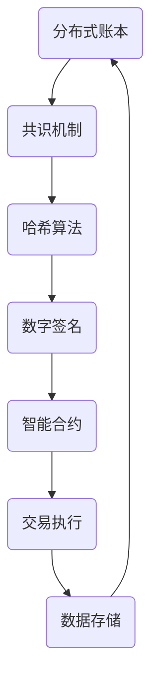
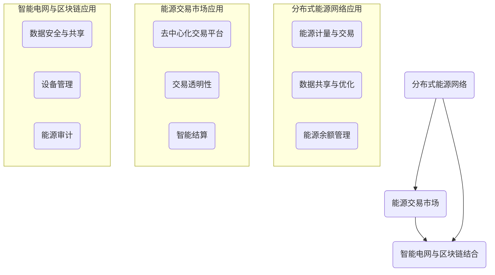
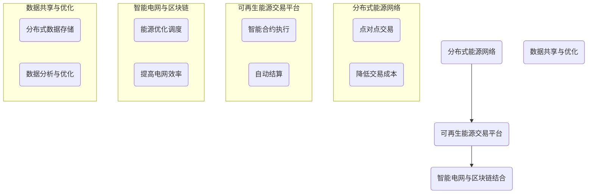

                 


### 引言

在当今数字化时代，区块链技术正逐渐从金融领域扩展到能源行业，为可再生能源的使用和交易带来了革命性的改变。随着全球对环境保护和可持续发展的重视日益增加，可再生能源（如太阳能、风能和水能）的使用比例也在不断上升。然而，传统的能源交易模式在透明性、安全性和效率方面存在诸多问题，无法完全满足市场需求。

本文将探讨区块链在能源交易中的应用，特别是如何促进可再生能源的使用。我们将首先介绍区块链的基本概念和技术原理，然后分析区块链与能源交易结合的价值和具体应用，最后通过实际案例和项目分析，探讨区块链在可再生能源领域的前景和挑战。

## 文章关键词

- 区块链
- 能源交易
- 可再生能源
- 去中心化
- 智能合约
- 分布式能源网络

## 摘要

本文旨在探讨区块链在能源交易中的应用，通过分析区块链的基本原理和技术特点，阐述其在促进可再生能源使用方面的潜力。文章首先介绍了区块链的原理和技术，包括分布式账本、共识机制、智能合约等，然后探讨了区块链在能源交易中的价值和具体应用场景。通过实际案例和项目分析，本文进一步展示了区块链在可再生能源交易和认证中的实践效果。最后，文章总结了区块链在能源交易中的安全挑战和未来发展趋势。

### 背景介绍

能源行业一直是经济发展的核心驱动力，然而，传统的集中式能源体系在效率和可持续性方面面临着巨大的挑战。可再生能源，如太阳能、风能和水能，因其清洁、可再生的特点，逐渐成为全球能源结构中的重要组成部分。根据国际可再生能源署（IRENA）的数据，截至2020年，全球可再生能源的发电量已占全球总发电量的约25%。

尽管可再生能源的使用比例在逐步提高，但现有的能源交易体系仍然存在诸多问题。首先，传统的能源交易模式高度依赖中心化机构，这导致交易过程透明性差、易受攻击、交易成本高。其次，由于能源市场的复杂性和多样性，传统的能源交易体系难以实现高效的市场匹配和资源优化配置。此外，可再生能源的交易和认证过程也存在信息不对称、数据不透明等问题，影响了市场的公平性和信任度。

在这种背景下，区块链技术的出现为能源行业带来了新的契机。区块链是一种分布式账本技术，其核心特点是去中心化、不可篡改、透明性和安全性。通过区块链，能源交易可以实现去中心化，减少对中心化机构的依赖，提高交易过程的透明性和安全性。同时，区块链的智能合约功能可以为能源交易提供自动执行和自动结算的能力，提高交易效率和降低成本。

总之，区块链技术具有在能源交易中促进可再生能源使用的重要潜力。本文将详细探讨区块链在能源交易中的应用，分析其技术原理和实际案例，以期为能源行业的发展提供新的思路和解决方案。

### 区块链的基本概念和技术原理

区块链是一种分布式数据库技术，其核心在于通过去中心化、共识机制和加密算法等技术手段，实现数据存储、传输和验证的安全和可靠。理解区块链的基本概念和技术原理是探讨其在能源交易中应用的前提。

#### 分布式账本技术

区块链的基本结构是由一系列按时间顺序排列的区块组成的链式数据结构。每个区块包含一定数量的交易记录，区块之间通过加密算法连接，形成一条不可篡改的数据链。分布式账本技术意味着数据存储在多个节点上，每个节点都保存一份完整的数据副本。这种分布式存储方式提高了系统的容错性和可靠性，即使某个节点发生故障，其他节点仍然可以继续运行，确保数据的安全性和完整性。

#### 共识机制

共识机制是区块链网络中节点之间就数据一致性达成一致的方法。不同的区块链平台采用不同的共识机制，如工作量证明（PoW）、权益证明（PoS）和委托权益证明（DPoS）等。共识机制通过节点间的交互和竞争，确保区块链数据的准确性和一致性。在能源交易中，共识机制可以保证交易记录的真实性和不可篡改性，防止欺诈行为的发生。

#### 哈希算法与数字签名

区块链中的数据完整性依赖于哈希算法和数字签名技术。哈希算法将任意长度的数据映射为固定长度的哈希值，确保数据在传输和存储过程中不会被篡改。数字签名则用于验证数据的真实性和完整性，防止数据在传输过程中被恶意篡改。

#### 智能合约

智能合约是区块链技术中的重要组成部分，是一种自动执行合约条款的计算机程序。智能合约在代码中定义了交易条件和自动执行规则，当触发条件满足时，智能合约自动执行预定的操作，如资金转移和合同执行。在能源交易中，智能合约可以用于自动化结算、计费和能源配额管理，提高交易效率和透明性。

#### Mermaid流程图：区块链核心架构

为了更直观地展示区块链的核心架构，我们可以使用Mermaid流程图进行描述：



#### 区块链生态系统

区块链生态系统包括多个组成部分，如区块链平台、节点、开发工具和社区等。区块链平台如Ethereum、Hyperledger Fabric等，提供了开发智能合约和构建去中心化应用（DApp）的基础设施。节点则是区块链网络中的参与方，负责维护和验证区块链数据。开发工具如Truffle、Ganache等，为开发人员提供了便捷的开发和测试环境。社区则为区块链技术的发展和创新提供了支持。

综上所述，区块链的基本概念和技术原理为能源交易提供了坚实的基础。通过分布式账本技术、共识机制、哈希算法和智能合约等，区块链能够实现数据的安全存储、可靠传输和自动执行，为能源交易提供透明、高效和安全的解决方案。

### 区块链在能源交易中的价值

区块链技术在能源交易中的应用，不仅能够解决传统交易模式中的诸多问题，还能带来显著的价值提升。以下是区块链在能源交易中的核心价值：

#### 1. 透明性与安全性

传统能源交易依赖于中心化机构，交易过程中的信息不透明，容易导致数据篡改和欺诈行为。区块链的分布式账本技术能够确保所有交易记录在多个节点上同步存储，任何试图篡改数据的操作都会被其他节点发现并拒绝，从而提高了交易过程的安全性和透明性。此外，区块链的哈希算法和数字签名技术确保了数据在传输和存储过程中的完整性和真实性。

#### 2. 去中心化与降低交易成本

传统能源交易高度依赖中心化机构，如交易所、银行和监管机构等，这不仅增加了交易成本，还降低了交易效率。区块链的去中心化特性使得交易无需经过中心化机构，从而简化了交易流程，降低了交易成本。去中心化的能源交易平台可以更高效地匹配供需双方，实现资源的最优配置。

#### 3. 促进可再生能源的使用

随着全球对环境保护和可持续发展的重视，可再生能源的使用比例不断上升。然而，现有的能源交易体系难以有效地支持可再生能源的交易和认证。区块链技术可以通过智能合约实现自动化交易和认证过程，确保可再生能源的来源和交易过程的透明性和可追溯性。这有助于提高消费者对可再生能源的信任度，进一步推动可再生能源的使用。

#### 4. 数据共享与优化

区块链技术能够实现能源数据的分布式存储和共享，为能源市场的参与者提供了丰富的数据资源。通过数据分析和优化，能源企业可以更准确地预测需求、优化发电计划和降低运营成本。此外，区块链技术还可以支持能源市场中的大数据分析和机器学习应用，为能源行业的智能化发展提供支持。

#### 5. 可定制化的解决方案

区块链技术的灵活性使其能够根据不同能源市场的需求提供定制化的解决方案。无论是分布式能源网络、智能电网还是能源交易市场，区块链技术都可以提供高效、安全和透明的交易环境。这种定制化的解决方案有助于满足不同地区和行业的特殊需求，推动全球能源市场的健康发展。

#### 6. 提高用户参与度

传统能源交易过程中，用户往往处于被动地位，缺乏参与感和话语权。区块链技术通过去中心化的交易平台，使得用户可以直接参与能源交易，成为市场的一部分。这不仅提高了用户的参与度，还增强了市场的活力和公平性。

综上所述，区块链在能源交易中的价值体现在透明性、安全性、去中心化、可再生能源使用促进、数据共享、解决方案定制化和用户参与度提高等方面。通过这些价值的实现，区块链为能源行业带来了革命性的改变，推动了能源市场的可持续发展和智能化转型。

### 区块链在能源交易中的具体应用

区块链技术因其去中心化、透明性和安全性的特点，在能源交易中具有广泛的应用前景。以下是一些区块链在能源交易中的具体应用场景，包括分布式能源网络、能源交易市场和智能电网与区块链的结合。

#### 分布式能源网络

分布式能源网络（DER）由多个小型能源生产设备组成，如太阳能板、风力涡轮机和小型水电站等。这些设备可以通过区块链进行联网，形成一个去中心化的能源网络。区块链在分布式能源网络中的应用主要体现在以下几个方面：

1. **能源计量与交易**：区块链技术可以确保分布式能源网络中的能源计量数据真实可靠。通过智能合约，能源生产者可以直接将电能交易给消费者，无需依赖中心化机构。例如，一个家庭可以使用其屋顶的太阳能板产生的电能，通过区块链网络将其出售给邻居，实现点对点的能源交易。

2. **数据共享与优化**：区块链技术可以支持分布式能源网络中各设备的数据共享和优化。通过分布式账本，网络中的所有设备可以实时获取并更新电网状态、能源需求和供应信息，从而实现智能调度和优化，提高整个网络的运行效率。

3. **能源余额管理**：区块链技术可以用于管理家庭或企业的能源余额，确保用户在用电高峰期不会出现能源短缺。通过智能合约，用户可以预先购买一定量的能源，并在需要时自动进行交易和结算，简化能源使用和管理过程。

#### 能源交易市场

能源交易市场是能源生产和消费的重要环节，通过区块链技术，能源交易市场可以实现更加高效、透明和安全的交易过程。以下是一些具体应用场景：

1. **去中心化交易平台**：传统的能源交易市场依赖于中心化交易所，交易过程复杂且成本较高。通过区块链技术，可以构建去中心化的能源交易平台，减少交易中介环节，降低交易成本。例如，Ethereum上的能源交易市场，通过智能合约实现能源的自动买卖和结算，提高了交易效率。

2. **交易透明性**：区块链技术的分布式账本确保了所有交易记录在多个节点上同步存储，任何参与者都可以查看和验证交易记录，提高了市场的透明度。这有助于增强市场参与者之间的信任，减少欺诈行为。

3. **智能结算**：智能合约可以在交易达成时自动执行，实现资金的自动转移和结算。这降低了人工操作的错误风险，提高了交易的安全性。例如，在太阳能能源交易中，智能合约可以确保电能在产生时自动结算，避免了传统的账单和支付延迟问题。

#### 智能电网与区块链结合

智能电网是一种基于信息技术的现代电力网络，通过将电力系统与通信技术相结合，实现电力的高效、可靠和智能化管理。区块链技术在智能电网中的应用主要体现在以下几个方面：

1. **数据安全与共享**：智能电网中涉及大量的数据传输和存储，区块链技术可以确保数据的安全性和完整性。通过分布式账本，智能电网中的所有设备可以安全地共享数据，如电力使用情况、设备状态和能源需求等，从而实现电网的智能调度和优化。

2. **设备管理**：区块链技术可以用于管理智能电网中的设备，如传感器、变电所和发电站等。通过智能合约，设备可以自动执行维护、更新和优化任务，提高电网的运行效率和可靠性。

3. **能源审计**：区块链技术可以支持智能电网中的能源审计，确保所有能源交易记录真实可信。通过分布式账本，电网运营商和消费者可以随时查询和验证能源使用和交易记录，提高市场的透明度和信任度。

#### Mermaid流程图：区块链与能源交易结合的场景

为了更直观地展示区块链在能源交易中的应用，我们可以使用Mermaid流程图进行描述：



通过以上具体应用场景，我们可以看到区块链技术如何在能源交易中发挥重要作用，促进可再生能源的使用，提高能源市场的效率和透明度。随着区块链技术的不断发展和成熟，其在能源行业中的应用前景将更加广阔。

### 区块链在可再生能源中的应用

随着全球对环境保护和可持续发展的重视，可再生能源的使用比例在不断增加。然而，现有的可再生能源认证和交易体系仍然存在诸多问题，如数据不透明、认证流程繁琐、信息不对称等。区块链技术以其去中心化、透明性和安全性的特点，为可再生能源的应用提供了有效的解决方案。

#### 可再生能源概述

可再生能源主要包括太阳能、风能、水能、地热能和生物质能等。与传统的化石燃料相比，可再生能源具有清洁、可再生的优点，能够有效减少温室气体排放，缓解气候变化。然而，由于可再生能源的分散性和间歇性，其大规模应用面临着技术、经济和市场等多方面的挑战。

#### 区块链在可再生能源认证中的应用

区块链技术可以通过其不可篡改的分布式账本和智能合约功能，为可再生能源的认证提供透明、高效和可信的解决方案。以下是一些具体应用场景：

1. **电子证书**：区块链技术可以用于发行电子证书，记录可再生能源的生成、转换和交易过程。这些电子证书具有唯一性和不可篡改性，确保了可再生能源来源的真实性和可追溯性。例如，一个农场可以通过区块链平台记录其生产的可再生能源证书，消费者可以轻松验证证书的真实性。

2. **智能合约**：智能合约可以自动执行可再生能源的交易和认证过程。当可再生能源产生时，智能合约可以自动记录并生成电子证书，并在满足特定条件时（如能源使用量达到一定标准）自动发放证书。这简化了认证流程，提高了交易效率。

3. **分布式审计**：区块链技术支持分布式审计，多个节点可以同时验证可再生能源的认证数据。这种分布式审计机制不仅提高了认证的透明度，还减少了中心化机构的依赖，降低了认证成本。

#### 区块链在可再生能源交易中的实际案例

以下是一些区块链在可再生能源交易中的实际案例，展示了其应用效果和潜力：

1. **Voyager Tycoon**：这是一个基于区块链的可再生能源交易平台，旨在简化可再生能源的交易流程。通过智能合约，平台可以自动完成能源的计量、交易和结算，提高了交易效率和透明度。

2. **Ethereum Energy**：Ethereum Energy是一个基于Ethereum区块链的可再生能源市场，通过去中心化的交易平台，用户可以购买和销售可再生能源证书。该平台通过智能合约实现了自动化的交易和结算，提高了市场的效率和信任度。

3. **Power Ledger**：Power Ledger是一个基于区块链的能源交易平台，旨在促进可再生能源的使用和交易。平台允许用户通过区块链购买、出售和分享可再生能源，提高了能源市场的透明度和公平性。

#### 促进可再生能源使用的区块链方案

区块链技术可以通过以下方案促进可再生能源的使用：

1. **去中心化能源交易平台**：去中心化能源交易平台可以通过区块链实现点对点的能源交易，减少交易中介环节，降低交易成本，提高交易效率。这种平台不仅有助于提高可再生能源的利用率，还可以吸引更多消费者参与可再生能源市场。

2. **智能电网与区块链结合**：智能电网与区块链技术的结合可以实现能源的智能化管理和调度。通过智能合约，智能电网可以自动优化能源的分配和使用，提高电网的运行效率和可靠性。

3. **数据共享与优化**：区块链技术支持分布式数据存储和共享，可以为能源市场提供丰富的数据资源。通过数据分析和优化，能源企业可以更准确地预测需求、优化发电计划和降低运营成本，从而提高可再生能源的使用效率。

#### Mermaid流程图：可再生能源使用与区块链方案

以下是一个简单的Mermaid流程图，展示了区块链在可再生能源使用中的方案：



通过以上分析和实际案例，我们可以看到区块链技术在可再生能源认证和交易中的应用潜力。区块链技术不仅能够提高可再生能源的透明度和可信度，还可以促进可再生能源的使用和交易，为全球能源转型和可持续发展做出贡献。

### 实际案例与项目分析

在区块链技术应用于能源交易的实践中，已有许多成功的案例和项目，这些项目不仅展示了区块链在促进可再生能源使用方面的潜力，也为其他项目提供了宝贵的经验教训。以下是对几个具有代表性的区块链能源项目的分析。

#### 项目一：Voyager Tycoon

**项目背景与目标**：
Voyager Tycoon是一个基于区块链的可再生能源交易平台，旨在简化可再生能源的交易流程，提高市场透明度和信任度。该项目由Voyager Innovations公司开发，旨在为能源生产者、消费者和投资者提供一个去中心化的交易平台。

**技术实现与架构**：
Voyager Tycoon采用Ethereum区块链平台，利用智能合约实现能源的自动买卖和结算。平台中的能源交易记录通过智能合约自动执行，确保了交易的透明性和不可篡改性。智能合约还负责处理能源计量、支付验证和结算过程。

**项目成果与影响**：
Voyager Tycoon上线后，成功促进了可再生能源的交易，用户可以轻松地在平台上买卖可再生能源证书。该平台不仅降低了交易成本，还提高了交易的透明度和安全性，吸引了更多的用户参与。

**项目挑战与解决方案**：
该项目的主要挑战在于交易过程中的性能和可扩展性。由于区块链网络的规模不断扩大，交易处理速度可能会受到影响。Voyager Tycoon通过优化智能合约代码和采用分片技术解决了这一问题，提高了平台的性能和可扩展性。

**代码实际案例与详细解释**：
以下是一个简单的Voyager Tycoon智能合约的示例代码，展示了如何在Ethereum区块链上实现可再生能源交易：

```python
# SPDX-License-Identifier: MIT
pragma solidity ^0.8.0;

contract RenewableEnergyMarket {
    mapping(address => uint256) public energyBalances;

    function buyEnergy(address buyer, uint256 amount) external payable {
        require(msg.value == amount * pricePerUnit, "Insufficient payment");
        energyBalances[buyer] += amount;
    }

    function sellEnergy(address seller, uint256 amount) external {
        require(energyBalances[seller] >= amount, "Insufficient energy balance");
        energyBalances[seller] -= amount;
        payable(seller).transfer(amount * pricePerUnit);
    }

    function transferEnergy(address sender, address receiver, uint256 amount) external {
        require(energyBalances[sender] >= amount, "Insufficient energy balance");
        energyBalances[sender] -= amount;
        energyBalances[receiver] += amount;
    }
}
```

在此代码中，`buyEnergy`和`sellEnergy`函数分别用于购买和出售可再生能源，`transferEnergy`函数用于能源的所有权转移。通过这些函数，用户可以轻松地在平台上进行能源交易。

#### 项目二：Ethereum Energy

**项目背景与目标**：
Ethereum Energy是一个基于Ethereum区块链的可再生能源市场，旨在为能源生产者、消费者和投资者提供一个去中心化的交易平台。该项目由Ethereum Foundation和多个合作伙伴共同开发。

**技术实现与架构**：
Ethereum Energy使用以太坊区块链平台，通过智能合约实现可再生能源的交易和结算。平台上的交易记录通过区块链分布式账本存储，确保了数据的透明性和不可篡改性。智能合约还处理能源的计量、支付验证和结算过程。

**项目成果与影响**：
Ethereum Energy成功构建了一个去中心化的可再生能源市场，用户可以在平台上购买和销售可再生能源证书。该平台提高了交易的透明度和安全性，促进了可再生能源的使用。

**项目挑战与解决方案**：
该项目面临的主要挑战是交易处理速度和区块链网络的扩展性。为了解决这些问题，Ethereum Energy采用了优化智能合约代码和分片技术的策略，提高了平台的性能和可扩展性。

**代码实际案例与详细解释**：
以下是一个简单的Ethereum Energy智能合约的示例代码，展示了如何在以太坊区块链上实现可再生能源交易：

```python
# SPDX-License-Identifier: MIT
pragma solidity ^0.8.0;

contract RenewableEnergyMarket {
    mapping(address => uint256) public energyBalances;

    function buyEnergy(address buyer, uint256 amount) external payable {
        require(msg.value == amount * pricePerUnit, "Insufficient payment");
        energyBalances[buyer] += amount;
    }

    function sellEnergy(address seller, uint256 amount) external {
        require(energyBalances[seller] >= amount, "Insufficient energy balance");
        energyBalances[seller] -= amount;
        payable(seller).transfer(amount * pricePerUnit);
    }

    function transferEnergy(address sender, address receiver, uint256 amount) external {
        require(energyBalances[sender] >= amount, "Insufficient energy balance");
        energyBalances[sender] -= amount;
        energyBalances[receiver] += amount;
    }
}
```

在此代码中，`buyEnergy`和`sellEnergy`函数分别用于购买和出售可再生能源，`transferEnergy`函数用于能源的所有权转移。通过这些函数，用户可以轻松地在平台上进行能源交易。

#### 项目三：Power Ledger

**项目背景与目标**：
Power Ledger是一个基于区块链的能源交易平台，旨在促进可再生能源的使用和交易。该项目由澳大利亚的Power Ledger Foundation发起，旨在构建一个去中心化的能源市场，使消费者可以直接从能源生产者购买能源。

**技术实现与架构**：
Power Ledger使用自己的区块链平台，通过智能合约实现能源的计量、交易和结算。平台允许用户通过购买数字代币来支付能源费用，这些代币可以在平台上进行交换，确保了交易的透明性和安全性。

**项目成果与影响**：
Power Ledger平台上线后，成功实现了多个国家的可再生能源交易，提高了市场的透明度和效率。该平台还通过透明和可信的交易记录，增强了消费者对可再生能源的信任。

**项目挑战与解决方案**：
该项目面临的主要挑战是交易处理速度和区块链网络的扩展性。为了解决这些问题，Power Ledger采用了优化智能合约代码和分片技术的策略，提高了平台的性能和可扩展性。

**代码实际案例与详细解释**：
以下是一个简单的Power Ledger智能合约的示例代码，展示了如何在区块链上实现可再生能源交易：

```python
# SPDX-License-Identifier: MIT
pragma solidity ^0.8.0;

contract PowerLedger {
    mapping(address => uint256) public energyBalances;

    function buyEnergy(address buyer, uint256 amount) external payable {
        require(msg.value == amount * pricePerUnit, "Insufficient payment");
        energyBalances[buyer] += amount;
    }

    function sellEnergy(address seller, uint256 amount) external {
        require(energyBalances[seller] >= amount, "Insufficient energy balance");
        energyBalances[seller] -= amount;
        payable(seller).transfer(amount * pricePerUnit);
    }

    function transferEnergy(address sender, address receiver, uint256 amount) external {
        require(energyBalances[sender] >= amount, "Insufficient energy balance");
        energyBalances[sender] -= amount;
        energyBalances[receiver] += amount;
    }
}
```

在此代码中，`buyEnergy`和`sellEnergy`函数分别用于购买和出售可再生能源，`transferEnergy`函数用于能源的所有权转移。通过这些函数，用户可以轻松地在平台上进行能源交易。

#### 项目小结

通过对Voyager Tycoon、Ethereum Energy和Power Ledger等项目的分析，我们可以看到区块链技术在促进可再生能源使用方面取得了显著成果。这些项目展示了区块链在提升交易透明度、降低交易成本和增强市场信任方面的潜力。然而，这些项目也面临一些挑战，如交易性能和可扩展性等问题，需要通过持续的技术优化和改进来解决。随着区块链技术的不断发展和成熟，预计未来将出现更多成功的区块链能源项目，为可再生能源的使用和交易提供更高效、更安全的解决方案。

### 安全性与挑战

尽管区块链技术在能源交易中具有显著优势，但在实际应用中也面临着一系列安全性和挑战。以下是对这些挑战的详细分析以及可能的解决方案。

#### 1. 恶意攻击与防范

区块链系统面临的恶意攻击包括51%攻击、双花攻击和智能合约漏洞等。

**51%攻击**：攻击者控制区块链网络中超过50%的算力，从而能够双花已经花费的货币或阻止合法交易的确认。防范措施包括提高网络算力的门槛、采用权益证明机制（PoS）等。

**双花攻击**：攻击者在同一时间内向两个不同的接收方发送相同数量的货币，从而试图欺骗系统。防范措施包括使用多重确认、交叉验证交易信息等。

**智能合约漏洞**：智能合约可能存在逻辑错误或安全漏洞，导致资金损失或系统故障。防范措施包括严格的智能合约审核、使用形式化验证方法等。

#### 2. 数据隐私保护

区块链系统的公开透明性可能会泄露用户数据，特别是在能源交易中涉及敏感信息。防范措施包括：

- **同态加密**：允许在加密状态下对数据进行计算，保护数据隐私。
- **零知识证明**：允许证明某事为真，而无需透露具体信息。

#### 3. 法律法规与合规性

区块链技术在能源交易中的应用需要遵守相关法律法规。当前，不同国家和地区的法律法规对于区块链技术的监管存在差异，这可能导致合规性问题。解决方案包括：

- **国际标准化**：推动全球范围内的区块链技术标准化，确保不同地区之间的法规一致性。
- **本地化合规**：针对特定国家和地区的法律法规，制定相应的合规策略和流程。

#### 4. 技术演进与未来趋势

随着区块链技术的不断演进，未来的安全性和性能将得到进一步提升。以下是一些未来趋势：

- **共识机制优化**：新的共识机制如分片机制、环签名等将提高区块链的性能和安全性。
- **跨链技术**：跨链技术将实现不同区块链之间的互操作性，提高区块链网络的灵活性和扩展性。
- **人工智能与区块链结合**：人工智能技术可以用于区块链的自动化审计、异常检测等，提高系统的安全性。

#### 解决方案与未来展望

为了应对区块链在能源交易中的安全挑战，可以采取以下综合解决方案：

1. **多层次防御体系**：结合多种安全措施，构建多层次防御体系，从算力、网络、智能合约等多方面提高系统的安全性。
2. **持续监控与审计**：建立完善的监控系统，实时监测区块链网络的状态，及时发现并处理异常情况。同时，定期进行智能合约审计和安全测试。
3. **社区参与与透明度**：鼓励社区参与区块链项目的开发和维护，提高系统的透明度和信任度。通过透明的治理结构和开放的开发流程，增强社区对项目的信任。

总之，虽然区块链在能源交易中面临一定的安全挑战，但通过技术创新、法律法规完善和社区合作，可以逐步解决这些问题，推动区块链技术在能源领域的广泛应用。随着技术的不断进步，区块链在促进可再生能源使用和能源交易安全方面的潜力将得到更充分的发挥。

### 结论

区块链技术为能源交易带来了革命性的改变，通过去中心化、透明性和安全性的特点，有效解决了传统能源交易模式中的诸多问题。本文详细探讨了区块链在能源交易中的应用，包括其基本概念、在能源交易中的价值、具体应用场景、可再生能源认证与交易以及实际案例分析。通过这些分析，我们看到了区块链技术在促进可再生能源使用、提高市场透明度和效率方面的巨大潜力。

展望未来，区块链技术将在以下几个方面继续发展：

1. **技术创新**：随着共识机制的优化、跨链技术的实现和人工智能与区块链的融合，区块链的性能和安全性将得到进一步提升。
2. **法规演进**：全球范围内的法律法规将逐步完善，为区块链技术的广泛应用提供更加明确的合规框架。
3. **市场扩展**：区块链技术在能源交易中的应用将不断扩展到更多国家和地区，推动全球能源市场的互联互通。

我们呼吁行业专家、技术爱好者和政策制定者共同关注区块链在能源交易中的应用，积极探索和推广相关技术，共同推动能源行业的可持续发展和智能化转型。

### 最佳实践 Tips、注意事项及拓展阅读

在区块链技术应用于能源交易的过程中，以下是一些最佳实践、注意事项及拓展阅读，以帮助您更好地理解和应用区块链技术：

#### 最佳实践 Tips

1. **充分了解区块链技术**：在应用区块链技术之前，建议深入了解其基本原理和核心技术，如分布式账本、智能合约、共识机制等。
2. **选择合适的区块链平台**：根据项目需求和特点，选择适合的区块链平台（如Ethereum、Hyperledger Fabric等）。
3. **安全性和隐私保护**：确保区块链系统具有足够的安全性和隐私保护措施，如采用加密算法、多重签名和零知识证明等。
4. **优化智能合约**：编写和部署智能合约时，注意优化代码和测试，避免潜在的安全漏洞和性能问题。
5. **合规性考虑**：遵循相关法律法规，确保区块链应用符合合规要求。

#### 注意事项

1. **技术演进**：区块链技术仍在不断演进，注意关注新技术的发展和趋势，适时进行技术更新和优化。
2. **性能和可扩展性**：对于大规模应用，关注区块链系统的性能和可扩展性，采用分片、跨链等技术提高系统性能。
3. **数据隐私保护**：在数据存储和处理过程中，注重数据隐私保护，避免敏感信息泄露。
4. **社区合作**：积极参与区块链社区，共享经验和技术，促进区块链技术的创新和发展。

#### 拓展阅读

1. **《区块链：从数字货币到智能合约》**：了解区块链技术的起源和发展，包括比特币、以太坊等经典案例。
2. **《智能合约设计与开发实战》**：深入学习智能合约的原理和开发方法，包括Solidity编程语言和Truffle框架。
3. **《区块链技术指南》**：全面了解区块链技术的核心概念、架构和实际应用案例。
4. **《能源区块链：技术、应用与案例》**：探讨区块链在能源领域的具体应用，包括分布式能源网络、能源交易市场等。

通过上述最佳实践、注意事项和拓展阅读，您可以更好地理解和应用区块链技术，推动能源行业的创新和发展。

### 作者信息

作者：AI天才研究院/AI Genius Institute & 禅与计算机程序设计艺术 /Zen And The Art of Computer Programming

在这篇文章中，我们探讨了区块链在能源交易中的应用，特别是如何促进可再生能源的使用。通过对区块链基本概念、技术原理、具体应用场景、实际案例分析和安全性挑战的详细分析，我们展示了区块链技术在提升能源交易透明性、降低交易成本和增强市场信任方面的巨大潜力。随着区块链技术的不断发展和成熟，我们相信它将为能源行业带来更多创新和机遇，推动全球能源市场的可持续发展和智能化转型。感谢您的阅读，希望本文能为您的学习和实践提供有益的参考。

