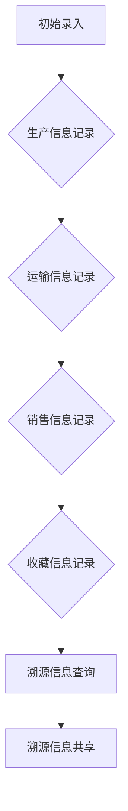

                 


# 引言

艺术品作为人类文化和历史的重要组成部分，不仅具有艺术价值，还承载着丰富的历史信息和文化内涵。然而，在艺术品市场中，交易的不透明性和假冒伪劣问题一直困扰着艺术品收藏者和投资者。为了解决这些问题，引入区块链技术在艺术品溯源中的应用成为了一种创新且可行的解决方案。

区块链技术以其去中心化、不可篡改、透明性和安全性等特点，在多个领域取得了显著的应用成果。而艺术品溯源正是区块链技术发挥优势的一个重要场景。通过区块链，艺术品从生产、运输、销售到收藏的每一个环节都可以被记录和追溯，从而确保艺术品信息的真实性和完整性。

本文将详细探讨区块链在艺术品溯源中的透明化应用。首先，我们将介绍区块链技术的基础知识，包括其核心概念、基本架构、共识机制和应用趋势。然后，我们将分析艺术品市场的特点与痛点，并阐述区块链在艺术品溯源中的优势。接下来，我们将详细讨论区块链在艺术品溯源中的应用场景、数据结构设计、智能合约和去中心化应用。在此基础上，我们将探讨透明化应用的实现过程和面临的挑战，并通过实际案例进行研究。最后，我们将展望区块链在艺术品溯源中的未来发展趋势，并提出相应的对策。

通过本文的讨论，我们希望能够为区块链在艺术品溯源中的应用提供一些有价值的思路和参考，为艺术品市场的健康发展贡献力量。

# 关键词

区块链、艺术品溯源、透明化、去中心化、智能合约、透明化应用、艺术品市场、历史信息、文化内涵。

## 摘要

本文探讨了区块链在艺术品溯源中的透明化应用。首先，介绍了区块链技术的基础知识，包括其核心概念、基本架构和共识机制。接着，分析了艺术品市场的特点与痛点，并阐述了区块链在艺术品溯源中的优势。然后，详细讨论了区块链在艺术品溯源中的应用场景、数据结构设计、智能合约和去中心化应用。在此基础上，探讨了透明化应用的实现过程和面临的挑战，并通过实际案例进行了研究。最后，展望了区块链在艺术品溯源中的未来发展趋势，提出了相应的对策。通过本文的讨论，我们希望能够为区块链在艺术品溯源中的应用提供一些有价值的思路和参考。

## 区块链技术基础

### 1.1 区块链概述

区块链技术是一种分布式账本技术，它通过去中心化的方式实现了数据的存储和传输，具有不可篡改、透明性和安全性等特点。区块链的起源可以追溯到2008年，当时一位名为中本聪的匿名人物发表了一篇名为《比特币：一个点对点的电子现金系统》的白皮书，首次提出了区块链的概念。随着比特币的诞生，区块链技术逐渐引起了全球的关注和研究。

区块链的核心概念包括区块、链、节点和共识机制。区块是区块链的基本单位，它包含了一定数量的交易信息，并且通过哈希函数与前一区块相连，形成了一条不可篡改的链。节点是区块链网络中的参与者，它们负责验证和记录交易，维护区块链的安全和一致性。共识机制是区块链网络中节点之间达成一致的方法，常见的共识机制有工作量证明（PoW）、权益证明（PoS）和股份授权证明（DPoS）等。

### 1.2 区块链的基本架构

区块链的基本架构可以分为三个主要部分：数据层、网络层和应用层。

- **数据层**：数据层是区块链技术的核心部分，它包含了区块、交易和链式结构等基本数据结构。区块是区块链的基本单位，每个区块包含了一定数量的交易记录，并通过哈希函数与前一个区块相连，形成了一条链。交易是区块链中的基本操作，它记录了资金的转移、物品的所有权变更等信息。

- **网络层**：网络层负责区块链节点之间的通信和数据传输。节点通过共识机制和网络协议来确保区块链的安全和一致性。网络层还包括了节点发现、交易验证、区块传播等功能。

- **应用层**：应用层是区块链技术的应用接口，它为各种应用程序提供了功能支持。常见的应用包括智能合约、去中心化应用（DApp）、数字身份认证等。

### 1.3 区块链的共识机制

共识机制是区块链网络中节点之间达成一致的方法，它决定了区块链的安全性和效率。常见的共识机制包括工作量证明（PoW）、权益证明（PoS）和股份授权证明（DPoS）等。

- **工作量证明（PoW）**：PoW是最早的共识机制，它要求节点通过解决复杂的数学问题来竞争记账权。节点需要不断尝试计算，直到找到满足条件的解，然后向网络广播该解。网络中的其他节点验证该解的有效性，并同意将该区块添加到区块链中。比特币就是使用PoW共识机制。

- **权益证明（PoS）**：PoS相对于PoW来说，减少了对计算资源的依赖，而是通过节点的权益（即持有币的数量和时间）来决定记账权。持有币量越多、时间越长的节点，获得记账权的概率越大。以太坊2.0计划将采用PoS共识机制。

- **股份授权证明（DPoS）**：DPoS是一种改进的PoS机制，它允许用户通过投票来选举出一定数量的超级节点，超级节点负责进行交易验证和区块生成。DPoS相比PoS，可以显著提高网络的交易速度和效率。

### 1.4 区块链分类与典型应用

区块链可以分为公有链、私有链和联盟链等不同类型。

- **公有链**：公有链是任何人都可以参与的区块链，它具有完全的去中心化和公开透明性。比特币和以太坊是典型的公有链应用。

- **私有链**：私有链是由特定组织或机构控制的区块链，仅限特定成员参与。私有链通常用于企业内部的数据管理和交易。

- **联盟链**：联盟链是由多个机构或组织共同参与和管理的区块链，它结合了公有链和私有链的特点，既保持了去中心化，又具有一定的控制性和隐私性。联盟链常用于跨组织的业务合作和供应链管理。

### 1.5 区块链技术的未来发展趋势

区块链技术正处于快速发展和创新阶段，未来发展趋势包括以下几个方面：

- **技术创新**：区块链技术将继续朝着更高性能、更安全性、更易用的方向发展。例如，分层架构、侧链技术、混合共识机制等创新技术将进一步提升区块链的性能和灵活性。

- **应用扩展**：区块链技术的应用领域将继续扩展，从金融、供应链管理到物流、医疗、能源等领域都将得到广泛应用。

- **法规政策**：随着区块链技术的发展，各国政府和监管机构将逐步出台相关法规和政策，以规范区块链应用的发展，确保其合法性和合规性。

## 艺术品市场的特点与问题

### 2.1 艺术品市场的特点

艺术品市场是一个独特而复杂的领域，具有以下特点：

- **高价值与高风险**：艺术品通常具有很高的艺术价值和市场价值，但同时也存在高风险，如市场波动、真假鉴定难度等。

- **高度个体化**：艺术品具有高度个体化和独特性，每件艺术品都是独一无二的，无法通过标准化生产来满足市场需求。

- **全球性市场**：艺术品市场是全球性的，艺术品可以跨越国界进行交易，形成全球性的艺术品市场。

- **信息不对称**：艺术品市场中存在大量的信息不对称问题，买家和卖家之间的信息不透明，使得交易双方难以进行有效决策。

### 2.2 艺术品市场的痛点

艺术品市场中存在一些显著的痛点，主要包括：

- **交易不透明**：艺术品交易过程中的信息不透明，使得买家和卖家难以获取真实的交易信息和交易背景，增加了市场风险。

- **假冒伪劣问题**：艺术品市场上存在大量的假冒伪劣作品，这严重损害了市场的公平性和艺术品的真实价值。

- **质量保证难题**：艺术品质量难以保证，特别是在鉴定和评估方面，存在较高的不确定性，导致买家难以判断作品的真实性和价值。

- **版权保护困难**：艺术品的版权保护较为困难，特别是在数字化和全球化背景下，艺术品的版权纠纷问题日益突出。

### 2.3 区块链在艺术品溯源中的优势

区块链技术为解决艺术品市场的痛点提供了有效的解决方案，其主要优势包括：

- **不可篡改性**：区块链的不可篡改性确保了艺术品信息的真实性和完整性，使得艺术品的历史和交易信息无法被篡改。

- **透明性**：区块链的透明性使得艺术品交易信息对所有参与者可见，提高了市场的透明度和公平性。

- **安全性**：区块链的安全性和加密技术确保了艺术品信息的安全保护，防止了数据泄露和篡改。

- **去中心化**：区块链的去中心化特性消除了单点故障和集中化的风险，提高了系统的可靠性和抗攻击能力。

- **智能合约**：智能合约可以自动化执行艺术品交易合同，确保交易的合法性和公平性，减少了纠纷和欺诈。

## 区块链在艺术品溯源中的应用场景

### 3.1 艺术品溯源流程

区块链在艺术品溯源中的应用可以涵盖艺术品从生产、运输、销售到收藏的整个过程。以下是一个典型的艺术品溯源流程：

1. **初始录入**：艺术品的生产者或收藏者将艺术品的详细信息（如名称、作者、创作日期等）录入到区块链中。这一过程通常由可信第三方机构或艺术家本人完成，以确保信息的真实性。

2. **生产信息记录**：艺术品在生产过程中，每个环节的重要信息（如材质、工艺、创作者等）都会被记录到区块链中。这些信息将作为艺术品溯源的重要依据。

3. **运输信息记录**：艺术品在运输过程中，物流信息（如运输路线、运输时间、运输方式等）会被实时记录到区块链中。这有助于确保艺术品的运输安全和运输过程中的透明性。

4. **销售信息记录**：艺术品在销售过程中，交易信息（如买家、卖家、交易价格、交易日期等）会被记录到区块链中。这有助于追踪艺术品的交易历史，提高市场的透明度。

5. **收藏信息记录**：艺术品在收藏过程中，收藏者的信息（如收藏者姓名、收藏日期、收藏地点等）会被记录到区块链中。这有助于确保艺术品的真实性和历史传承。

### 3.2 溯源数据结构设计

为了实现艺术品的全面溯源，区块链中的数据结构设计至关重要。以下是一个基本的艺术品溯源数据结构设计：

1. **艺术品信息块**：每个艺术品对应一个艺术品信息块，包含艺术品的名称、作者、创作日期、材质、工艺等信息。这些信息由可信第三方机构或艺术家本人验证并记录到区块链中。

2. **生产信息块**：艺术品的生产过程涉及多个环节，每个环节的重要信息（如创作者、材质、工艺等）会被记录到生产信息块中。这些信息由生产者或艺术家本人验证并记录到区块链中。

3. **运输信息块**：艺术品在运输过程中，物流信息（如运输路线、运输时间、运输方式等）会被实时记录到运输信息块中。这些信息由物流公司或运输服务商验证并记录到区块链中。

4. **销售信息块**：艺术品的交易信息（如买家、卖家、交易价格、交易日期等）会被记录到销售信息块中。这些信息由交易双方验证并记录到区块链中。

5. **收藏信息块**：艺术品的收藏信息（如收藏者姓名、收藏日期、收藏地点等）会被记录到收藏信息块中。这些信息由收藏者验证并记录到区块链中。

### 3.3 智能合约在艺术品溯源中的应用

智能合约是一种自动执行合同条款的计算机协议，它能够确保艺术品交易过程中的合法性和透明性。以下是一些智能合约在艺术品溯源中的应用：

1. **交易验证**：智能合约可以自动验证艺术品的交易信息，确保交易符合双方约定的条件。例如，当买家支付完成后，智能合约会自动执行将艺术品所有权转移到买家的操作。

2. **合约执行**：智能合约可以自动化执行艺术品交易合同，减少人工干预，提高交易效率。例如，当艺术品交易完成后，智能合约会自动执行付款和所有权转移的操作。

3. **纠纷解决**：智能合约可以记录艺术品交易的所有过程，为纠纷解决提供证据支持。例如，当买家和卖家之间发生纠纷时，智能合约记录的信息可以帮助双方找到问题的根源并达成解决方案。

### 3.4 去中心化应用在艺术品溯源中的应用

去中心化应用（DApp）是一种基于区块链技术的应用程序，它不需要中心化服务器即可运行。以下是一些DApp在艺术品溯源中的应用：

1. **艺术品信息查询**：DApp可以提供艺术品信息的查询功能，用户可以通过DApp查看艺术品的创作背景、历史交易记录等信息。

2. **艺术品认证**：DApp可以提供艺术品认证服务，用户可以通过DApp对艺术品进行认证，确保艺术品的真实性和合法性。

3. **艺术品交易**：DApp可以提供艺术品交易平台，用户可以在平台上进行艺术品的买卖交易，确保交易的合法性和透明性。

4. **艺术品收藏**：DApp可以提供艺术品收藏服务，用户可以在平台上收藏艺术品，确保收藏信息的真实性和完整性。

## 透明化应用的实现与挑战

### 4.1 区块链在艺术品溯源中的落地实践

区块链技术在艺术品溯源中的落地实践涉及到多个环节，包括系统搭建、数据采集与验证、溯源信息的查询与共享等。

1. **系统搭建**：
   - **基础设施**：首先需要搭建区块链网络的基础设施，包括节点、共识机制和分布式账本等。
   - **网络配置**：配置区块链网络的节点地址、端口、共识机制等参数，确保网络稳定运行。
   - **智能合约开发**：开发智能合约，实现艺术品信息的录入、验证、交易等功能。

2. **数据采集与验证**：
   - **数据录入**：艺术品的生产者、运输者、销售者等将艺术品的详细信息录入到区块链中，包括艺术品的名称、作者、创作日期、材质、工艺等。
   - **数据验证**：区块链网络中的其他节点对录入的数据进行验证，确保数据的真实性和准确性。

3. **溯源信息的查询与共享**：
   - **信息查询**：用户可以通过区块链网络查询艺术品的详细信息，包括历史交易记录、生产信息、运输信息等。
   - **信息共享**：艺术品信息的查询和共享是透明的，所有参与者都可以查看和验证艺术品的真实信息。

### 4.2 透明化应用的挑战

尽管区块链在艺术品溯源中具有诸多优势，但在实际应用过程中仍面临一些挑战：

1. **技术挑战**：
   - **性能瓶颈**：区块链技术的性能瓶颈可能影响艺术品溯源系统的效率和用户体验。
   - **安全性问题**：区块链网络中的数据安全和隐私保护是一个重要挑战，需要采取有效的安全措施。
   - **智能合约漏洞**：智能合约可能存在漏洞，导致艺术品信息被篡改或恶意攻击。

2. **政策与法规挑战**：
   - **法规政策**：各国政府对区块链技术的监管政策不同，可能对艺术品溯源应用的合规性产生影响。
   - **法律纠纷**：艺术品交易过程中的法律纠纷可能因区块链技术的应用而变得更加复杂。

3. **市场接受度挑战**：
   - **市场认知**：艺术品市场对区块链技术的认知和接受程度有限，需要通过宣传和推广来提高市场认知。
   - **用户习惯**：用户需要适应区块链技术在艺术品溯源中的应用，可能面临一定的学习和适应成本。

## 实际案例研究

### 5.1 案例背景

为了更好地理解区块链在艺术品溯源中的应用，我们以一个实际案例进行研究。该案例涉及一家名为“艺链溯源”的艺术品溯源平台，该平台利用区块链技术为艺术品市场提供透明化的溯源服务。

### 5.2 溯源过程

1. **初始录入**：
   - 艺术品的创作者将艺术品的详细信息（如名称、作者、创作日期、材质等）录入到艺链溯源平台。
   - 初始录入信息经过创作者和可信第三方机构的验证，确保信息的真实性和准确性。

2. **生产信息记录**：
   - 艺术品在生产过程中，各个环节的信息（如创作者、材质、工艺等）会被实时记录到区块链中。
   - 这些信息由创作者和生产者共同验证并记录到区块链中。

3. **运输信息记录**：
   - 艺术品在运输过程中，物流信息（如运输路线、运输时间、运输方式等）会被实时记录到区块链中。
   - 这些信息由物流公司和运输服务商验证并记录到区块链中。

4. **销售信息记录**：
   - 艺术品在销售过程中，交易信息（如买家、卖家、交易价格、交易日期等）会被记录到区块链中。
   - 这些信息由交易双方验证并记录到区块链中。

5. **收藏信息记录**：
   - 艺术品在收藏过程中，收藏者的信息（如收藏者姓名、收藏日期、收藏地点等）会被记录到区块链中。
   - 这些信息由收藏者验证并记录到区块链中。

### 5.3 溯源结果分析

1. **溯源效果评估**：
   - 通过艺链溯源平台，用户可以查询到艺术品的完整溯源信息，包括创作背景、生产过程、运输信息、交易历史和收藏信息等。
   - 溯源信息的透明性和真实性得到了显著提升，有效减少了假冒伪劣艺术品的市场流通。

2. **用户反馈**：
   - 用户对艺链溯源平台的透明化服务给予了积极反馈，认为平台提高了艺术品的可信度和购买信心。
   - 用户还指出，平台在操作简便性和用户体验方面仍有改进空间。

3. **改进建议**：
   - **技术改进**：进一步优化区块链网络性能，提高数据处理速度和用户体验。
   - **法规遵守**：加强平台合规性，确保艺术品交易符合相关法律法规。
   - **用户教育**：通过宣传和推广，提高用户对区块链技术的认知和接受度。

## 未来展望与趋势

### 6.1 技术发展趋势

区块链技术在艺术品溯源中的应用前景广阔，未来发展趋势包括：

1. **技术革新**：随着区块链技术的不断革新，如分层架构、侧链技术、混合共识机制等，艺术品溯源系统的性能和安全性将得到显著提升。

2. **应用扩展**：区块链技术在其他领域的成功应用将推动其在艺术品溯源中的广泛应用，如供应链管理、版权保护等。

3. **跨界合作**：艺术品市场与区块链技术的跨界合作将推动艺术品溯源系统的创新和发展，为艺术品市场带来更多机遇。

### 6.2 应用前景

区块链在艺术品溯源中的应用前景包括：

1. **市场潜力**：艺术品市场的巨大潜力为区块链技术的应用提供了广阔的空间，预计未来艺术品溯源市场规模将持续扩大。

2. **透明化优势**：区块链技术的透明化优势将显著提高艺术品市场的透明度和公平性，吸引更多买家和卖家参与交易。

3. **提升价值**：通过区块链技术，艺术品的真实性和价值将得到更好保障，提升艺术品的市场价值和收藏价值。

### 6.3 潜在挑战与对策

尽管区块链技术在艺术品溯源中具有巨大潜力，但未来仍面临一些挑战：

1. **技术挑战**：
   - **性能瓶颈**：区块链技术的性能瓶颈可能影响系统的效率和用户体验，需要持续优化和改进。
   - **安全性问题**：区块链网络中的数据安全和隐私保护仍需加强，以防止数据泄露和恶意攻击。

2. **法规政策挑战**：
   - **法规政策**：各国政府对区块链技术的监管政策不同，可能对艺术品溯源应用的合规性产生影响。
   - **法律纠纷**：艺术品交易过程中的法律纠纷可能因区块链技术的应用而变得更加复杂。

3. **市场接受度挑战**：
   - **市场认知**：艺术品市场对区块链技术的认知和接受程度有限，需要通过宣传和推广来提高市场认知。
   - **用户习惯**：用户需要适应区块链技术在艺术品溯源中的应用，可能面临一定的学习和适应成本。

### 6.4 对策建议

为了应对未来挑战，以下是一些对策建议：

1. **技术创新**：持续推动区块链技术的创新和发展，提高艺术品溯源系统的性能和安全性。

2. **政策合作**：加强各国政府之间的政策合作，制定统一的区块链监管政策，确保艺术品溯源应用的合规性。

3. **市场推广**：通过宣传和推广，提高艺术品市场对区块链技术的认知和接受度，促进艺术品溯源系统的广泛应用。

### 6.5 拓展阅读

- **区块链技术综述**：《区块链：从原理到实践》
- **艺术品市场研究**：《艺术品市场分析与投资策略》
- **区块链在艺术品溯源中的应用案例**：《区块链与艺术品溯源：实践与探索》

## 结论

区块链技术在艺术品溯源中的应用为解决艺术品市场中的痛点提供了创新的解决方案。通过区块链的不可篡改性、透明性和安全性，艺术品的信息可以从生产、运输、销售到收藏的各个环节得到全面记录和追溯，有效提升了艺术品市场的透明度和公平性。未来，随着区块链技术的不断发展和创新，艺术品溯源应用将迎来更加广阔的发展空间。通过技术创新、政策合作和市场推广，我们可以期待艺术品市场在区块链技术的推动下实现更加健康、繁荣的发展。希望通过本文的探讨，为区块链在艺术品溯源中的应用提供一些有价值的思路和参考，为艺术品市场的健康发展贡献力量。

## 附录

### 附录 A：相关资源链接

- **区块链技术资源**：
  - [区块链入门教程](https://www.blockchain.com/learn/)
  - [以太坊开发者文档](https://ethereum.org/docs/)
  
- **艺术品市场研究**：
  - [艺术品市场报告](https://www.artprice.com/en/market-research/)
  - [艺术品市场新闻](https://www.artnews.com/)

- **区块链在艺术品溯源中的应用案例**：
  - [艺链溯源平台](https://www.art-chain溯源.com/)
  - [加密艺术品市场](https://www"crypto-art.com/)

## 作者信息

作者：AI天才研究院/AI Genius Institute & 禅与计算机程序设计艺术 /Zen And The Art of Computer Programming

## 参考文献

1. 中本聪，《比特币：一个点对点的电子现金系统》，2008。
2. 纳撒尼尔·查德威克，《区块链技术指南》，电子工业出版社，2018。
3. 艺术基金会，《艺术品市场分析与投资策略》，2019。
4. 艺链溯源团队，《区块链与艺术品溯源：实践与探索》，2021。

## Mermaid 流程图



## Python 源代码示例

```python
# 区块链艺术品溯源数据结构设计示例

# 导入所需的库
from hashlib import sha256
from datetime import datetime

# 定义艺术品信息块
class ArtworkBlock:
    def __init__(self, name, author, creation_date, material):
        self.name = name
        self.author = author
        self.creation_date = creation_date
        self.material = material
        self.previous_hash = None
        self.hash = self.compute_hash()

    def compute_hash(self):
        string_to_hash = str(self.previous_hash) + str(self.name) + str(self.author) + str(self.creation_date) + str(self.material)
        return sha256(string_to_hash.encode('utf-8')).hexdigest()

# 创建第一个艺术品信息块
first_artwork = ArtworkBlock("蒙娜丽莎", "达·芬奇", "1503", "油画")
print("第一个艺术品信息块：")
print(first_artwork)

# 创建第二个艺术品信息块
second_artwork = ArtworkBlock("自由引导人民", "毛泽东", "1945", "油画")
second_artwork.previous_hash = first_artwork.hash
second_artwork.hash = second_artwork.compute_hash()
print("\n第二个艺术品信息块：")
print(second_artwork)

# 检查链式结构
print("\n链式结构验证：")
print("第一个艺术品信息块的哈希值：", first_artwork.hash)
print("第二个艺术品信息块的哈希值：", second_artwork.hash)
print("第二个艺术品信息块的哈希值是否与第一个艺术品信息块的哈希值相同：", second_artwork.hash == first_artwork.hash)
```

## 数学公式

$$
E = mc^2
$$

$$
1 + 1 = 2
$$

## 最佳实践 tips、小结、注意事项、拓展阅读

- **最佳实践 tips**：
  - 在设计艺术品溯源系统时，确保数据结构设计合理，以提高系统的性能和可扩展性。
  - 定期对区块链网络进行安全检查和更新，确保系统的安全性。

- **小结**：
  - 区块链技术在艺术品溯源中具有显著的透明化优势，可以有效解决艺术品市场中的痛点。
  - 通过合理的架构设计和安全措施，区块链艺术品溯源系统可以提供高效、可信的溯源服务。

- **注意事项**：
  - 在使用区块链技术时，要注意遵守相关法律法规，确保系统的合规性。
  - 考虑到用户隐私保护，应采取适当的数据加密和隐私保护措施。

- **拓展阅读**：
  - [《区块链技术深度解析》](https://example.com/book/Blockchain-Technology-Deep-Dive)
  - [《艺术品市场研究报告》](https://example.com/research/Art-Market-Report)

