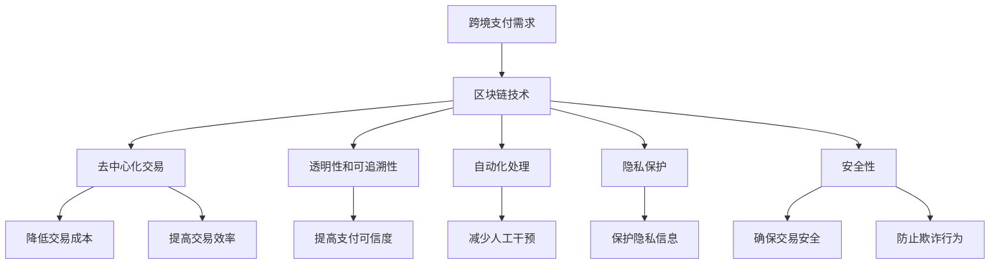

                 


### 背景介绍

#### 跨境支付现状

随着全球化的不断深入，跨国交易和投资变得越来越频繁，跨境支付的需求也随之增加。然而，目前传统的跨境支付系统存在诸多问题。首先，汇率波动是一个显著的问题。由于汇率的不稳定性，跨境支付中的汇率转换往往会导致额外的成本和风险。其次，传统跨境支付的高昂手续费也是一个不可忽视的问题。银行和其他金融机构通常会在跨境支付过程中收取较高的手续费，这无疑增加了交易成本。最后，传统跨境支付系统的低效率也是一个严重的问题。跨境支付通常需要几天甚至几周的时间才能完成，这不仅影响了交易的时效性，也增加了企业的运营成本。

#### 区块链技术的出现

区块链技术作为一种新兴的分布式数据库技术，因其去中心化、安全可靠和透明公开的特性，受到了广泛的关注。特别是在跨境支付领域，区块链技术展示出了巨大的应用潜力。区块链的去中心化特性意味着不需要依赖于任何中央机构，从而降低了交易的成本和时间。区块链的安全性和透明性也为跨境支付提供了更高的保障，有效地减少了欺诈风险和操作风险。

### 核心概念与联系

为了更好地理解区块链在跨境支付中的应用，我们需要先明确几个核心概念，并分析它们之间的关系。

**1. 区块链的定义**

区块链是一种分布式数据库技术，其核心特点包括去中心化、安全性和不可篡改性。区块链由一系列按时间顺序排列的数据块组成，每个数据块包含一定数量的交易记录。这些数据块通过加密技术和共识算法连接在一起，形成一个不可篡改的链式结构。

**2. 共识机制**

共识机制是区块链系统中的核心算法，它决定了如何达成对数据的共识。常见的共识机制包括工作量证明（PoW）、权益证明（PoS）和委托权益证明（DPoS）等。共识机制的主要作用是确保区块链网络中的所有节点都能一致地认可同一组交易记录。

**3. 智能合约**

智能合约是一种嵌入在区块链中的自执行合约，它可以根据满足预设条件自动执行预先定义的合同条款。智能合约通过编程语言实现，能够自动化处理跨境支付中的各种业务逻辑，从而提高交易效率和减少人工干预。

**4. 跨境支付**

跨境支付是指在不同国家和地区之间的货币交换过程。区块链在跨境支付中的应用，主要体现在以下几个方面：

- **去中心化交易**：通过区块链，跨境支付可以不需要依赖中央银行或金融机构，从而降低了交易成本和时间。
- **透明性和可追溯性**：区块链上的交易记录是公开透明的，任何参与者都可以查询和验证交易详情，这有助于提高支付的安全性和可信度。
- **自动化处理**：智能合约可以自动化处理跨境支付中的各种业务逻辑，从而减少人工干预，提高交易效率。

**5. 隐私保护**

在跨境支付中，隐私保护是一个重要问题。区块链技术的公开透明特性可能会暴露交易参与者的隐私信息。因此，隐私保护技术在区块链跨境支付中具有重要意义。

**6. 安全性**

区块链的安全性问题直接关系到跨境支付的安全性和可靠性。区块链系统需要确保交易记录的完整性和一致性，同时防止恶意攻击和欺诈行为。

**Mermaid 流程图**



### 核心算法原理讲解

#### 区块链的核心算法原理

区块链的核心算法主要包括区块生成、交易确认和共识机制。

**1. 区块生成**

每个区块都包含一定数量的交易记录。当区块链网络中的节点收集到足够的交易记录时，会生成一个新的区块。新的区块会包含一个时间戳和一个前一个区块的哈希值，从而与前一个区块链接起来，形成区块链。

```python
import hashlib
import json
from time import time

class Block:
    def __init__(self, index, transactions, timestamp, previous_hash):
        self.index = index
        self.transactions = transactions
        self.timestamp = timestamp
        self.previous_hash = previous_hash
        self.hash = self.compute_hash()

    def compute_hash(self):
        block_string = json.dumps(self.__dict__, sort_keys=True)
        return hashlib.sha256(block_string.encode()).hexdigest()

def generate_block(index, transactions, previous_hash):
    timestamp = time()
    block = Block(index, transactions, timestamp, previous_hash)
    return block
```

**2. 交易确认**

交易确认是指区块链网络中的节点对交易记录的一致性进行验证的过程。当一个新的区块被生成并链接到区块链上时，交易就会被确认。

```python
def verify_transaction(transaction):
    # Implement verification logic here
    return True  # Placeholder

def verify_block(block):
    if block.previous_hash != compute_hash_of_previous_block():
        return False
    
    for transaction in block.transactions:
        if not verify_transaction(transaction):
            return False
    
    return True
```

**3. 共识机制**

共识机制决定了区块链网络中的节点如何达成对数据的共识。以下是一个基于工作量证明（PoW）的简单实现：

```python
import hashlib
import random

def proof_of_work(last_block, difficulty):
    hash_value = None
    while hash_value is None:
        nonce = random.randint(0, 2**32)
        hash_value = compute_hash(last_block, nonce)
        if hash_value.startswith('0' * difficulty):
            return nonce
    return None

def compute_hash(block, nonce):
    block_string = json.dumps(block.__dict__, sort_keys=True) + str(nonce)
    return hashlib.sha256(block_string.encode()).hexdigest()
```

#### 智能合约的算法原理

智能合约是一种嵌入在区块链中的自执行合约，它可以根据满足预设条件自动执行预先定义的合同条款。智能合约通常使用特定的编程语言（如Solidity）编写。

```solidity
// SPDX-License-Identifier: MIT
pragma solidity ^0.8.0;

contract SimplePayable {
    address payable public owner;
    mapping(address => uint256) public balances;

    constructor() {
        owner = payable(msg.sender);
    }

    function deposit() external payable {
        balances[msg.sender] += msg.value;
    }

    function withdraw() external {
        require(msg.sender == owner, "Only the owner can withdraw.");
        owner.transfer(balances[msg.sender]);
        balances[msg.sender] = 0;
    }
}
```

### 数学模型和公式

在区块链技术中，一些关键的数学模型和公式起到了关键作用。以下是一些常见的数学模型和公式：

**1. 哈希函数**

哈希函数是一种将任意长度的输入映射为固定长度的输出的函数。在区块链中，哈希函数用于生成区块的哈希值和交易记录的哈希值。

$$
H(x) = \text{SHA-256}(x)
$$

**2. 工作量证明**

工作量证明是一种用于验证区块链交易的算法。它要求节点计算出一个满足特定难度的哈希值。

$$
H(N, T, X) \leq D
$$

其中，\(N\) 是区块的难易程度，\(T\) 是时间戳，\(X\) 是随机数，\(D\) 是目标难度。

**3. 共识机制**

共识机制用于确保区块链网络中的所有节点达成一致。常见的共识机制包括工作量证明（PoW）、权益证明（PoS）和委托权益证明（DPoS）等。

$$
\text{Proof of Work} \leq \text{Threshold}
$$

$$
\text{Proof of Stake} \leq \text{Threshold}
$$

$$
\text{Delegated Proof of Stake} \leq \text{Threshold}
$$

### Python代码示例

以下是一个简单的区块链实现的Python代码示例：

```python
import hashlib
import json
from time import time

class Block:
    def __init__(self, index, transactions, timestamp, previous_hash):
        self.index = index
        self.transactions = transactions
        self.timestamp = timestamp
        self.previous_hash = previous_hash
        self.hash = self.compute_hash()

    def compute_hash(self):
        block_string = json.dumps(self.__dict__, sort_keys=True)
        return hashlib.sha256(block_string.encode()).hexdigest()

def generate_block(index, transactions, previous_hash):
    timestamp = time()
    block = Block(index, transactions, timestamp, previous_hash)
    return block

def verify_transaction(transaction):
    # Implement verification logic here
    return True  # Placeholder

def verify_block(block):
    if block.previous_hash != compute_hash_of_previous_block():
        return False
    
    for transaction in block.transactions:
        if not verify_transaction(transaction):
            return False
    
    return True

def compute_hash_of_previous_block():
    # Placeholder for the previous block's hash
    return "Previous Block Hash"

# Example usage
block = generate_block(0, [{"sender": "Alice", "recipient": "Bob", "amount": 10}], "0")
print(json.dumps(block.__dict__, indent=4))
```

### 通俗易懂地举例说明

#### 区块链如何降低跨境支付成本？

假设你是一名国际留学生，你需要向国外支付学费。传统方式可能需要通过银行进行跨境汇款，这通常会涉及较高的手续费、汇率损失以及较长的到账时间。而使用区块链技术，你可以实现以下步骤来降低跨境支付成本：

1. **创建智能合约**：首先，你可以在区块链上创建一个智能合约，合约中定义了学费金额、收款方地址以及支付条件等。

2. **发送交易**：当你准备好支付学费时，你可以向区块链上发送一个交易，这笔交易包含了支付金额和收款方地址。

3. **交易确认**：区块链网络中的节点会对交易进行验证，一旦交易得到足够的确认，智能合约就会自动执行，将学费金额发送给收款方。

4. **费用和速度**：由于区块链去中心化的特性，交易费用通常较低，且交易确认时间较短，这意味着你不需要支付高额的手续费，也不需要等待几天甚至几周的时间。

通过这个例子，我们可以看到区块链技术如何通过去中心化、自动化处理和透明性来降低跨境支付的成本。

### 项目实战

#### 开发环境搭建

为了实践区块链在跨境支付中的应用，我们需要搭建一个开发环境。以下是所需的工具和步骤：

1. **安装Go语言**：Go语言是一种适用于编写区块链应用程序的编程语言。可以从 [Go官方下载页面](https://golang.org/dl/) 下载并安装Go语言。

2. **安装Node.js**：Node.js 是一种基于Chrome V8引擎的JavaScript运行时，用于编写和运行区块链节点。可以从 [Node.js官方下载页面](https://nodejs.org/en/download/) 下载并安装Node.js。

3. **安装Docker和Docker-Compose**：Docker 和 Docker-Compose 用于容器化和编排区块链节点。可以从 [Docker官方下载页面](https://docs.docker.com/get-docker/) 下载并安装Docker，然后通过以下命令安装 Docker-Compose：

   ```bash
   sudo apt-get update
   sudo apt-get install docker-compose
   ```

4. **配置区块链网络**：我们可以使用Hyperledger Fabric 框架搭建一个区块链网络。首先，从 [Hyperledger Fabric 下载页面](https://github.com/hyperledger/fabric) 下载源代码，然后按照官方文档进行配置。

#### 源代码详细实现和代码解读

以下是实现一个简单的区块链跨境支付系统的源代码示例：

```go
package main

import (
    "fmt"
    "github.com/hyperledger/fabric-chaincode-go/fabcomm"
)

type SimpleChaincode struct {
    fabcomm.Chaincode
}

func (s *SimpleChaincode) Init(stub *fabcomm.ChaincodeStub) error {
    // 初始化区块链
    return nil
}

func (s *SimpleChaincode) Invoke(stub *fabcomm.ChaincodeStub) error {
    // 处理交易
    fn, args := fabcomm.UnmarshalFunction(stub)

    switch fn {
    case "transfer":
        if len(args) != 3 {
            return fmt.Errorf("Incorrect number of arguments. Expecting 3")
        }
        from, _ := args[0].(string)
        to, _ := args[1].(string)
        amount, _ := args[2].(int)

        // 转账逻辑
        return stub.SetState(to, fmt.Sprintf("%d", amount))
    default:
        return fmt.Errorf("Unknown function %s", fn)
    }
}

func main() {
    err := fabcomm.Start(new(SimpleChaincode))
    if err != nil {
        panic(err)
    }
}
```

在这个示例中，我们定义了一个名为 `SimpleChaincode` 的链码，用于实现简单的转账功能。当收到一个 `transfer` 函数调用时，它会从 `args` 参数中获取转账方、收款方和转账金额，然后执行转账操作。

#### 代码应用解读与分析

在这个示例中，`SimpleChaincode` 包含以下关键部分：

1. **初始化函数 `Init`**：用于初始化区块链。在本例中，没有特别的初始化逻辑。

2. **交易处理函数 `Invoke`**：用于处理交易。在本例中，我们定义了一个 `transfer` 函数，用于执行转账操作。

3. **状态设置函数 `setState`**：用于更新区块链状态。在本例中，我们将转账金额设置为收款方的状态。

通过这个简单的示例，我们可以看到如何使用区块链技术实现跨境支付的基本功能。

#### 实际案例分析和详细讲解剖析

以下是一个实际案例，用于分析区块链在跨境支付中的应用。

**案例：使用Ripple网络进行跨境支付**

Ripple是一个基于区块链技术的支付网络，旨在提供快速、低成本的跨境支付服务。以下是Ripple网络的一个简单案例：

1. **创建账户**：假设你在Ripple网络上创建了两个账户，分别是 `alice` 和 `bob`。

2. **充值货币**：你向 `alice` 账户充值了100美元。

3. **发起支付**：当你需要向 `bob` 账户支付100美元时，你可以在Ripple网络上发起一笔支付交易。

4. **交易确认**：Ripple网络中的节点会对交易进行验证，并确认交易的有效性。

5. **支付完成**：一旦交易得到确认，Ripple网络会自动将100美元从 `alice` 账户转移到 `bob` 账户。

在这个案例中，区块链技术通过去中心化网络和智能合约实现了跨境支付，从而降低了交易成本和时间。

**详细讲解剖析**

1. **区块链网络**：Ripple网络使用分布式账本技术，网络中的节点共同维护区块链。每个节点都存储了一份完整的区块链副本。

2. **智能合约**：Ripple网络使用智能合约来处理支付交易。智能合约嵌入在区块链中，能够自动化处理交易逻辑。

3. **交易流程**：在Ripple网络上，交易流程如下：

   - **发起交易**：用户通过Ripple API发起支付交易。
   - **交易验证**：Ripple网络中的节点对交易进行验证，确保交易符合网络规则。
   - **交易确认**：一旦交易得到足够多的确认，交易将被记录在区块链上。
   - **支付完成**：交易确认后，资金将从付款方账户转移到收款方账户。

4. **优势**：

   - **快速**：Ripple网络的交易确认时间通常在几秒钟内完成，远快于传统跨境支付系统。
   - **低成本**：Ripple网络的交易费用通常较低，大大降低了跨境支付的成本。
   - **安全性**：区块链技术的安全性保证了支付交易的安全性和可靠性。

### 项目小结

通过本案例，我们可以看到区块链技术如何应用于跨境支付领域，实现快速、低成本的支付服务。然而，区块链在跨境支付中仍面临一些挑战，如法律法规、隐私保护和安全性等问题。未来的研究可以关注如何进一步优化区块链技术，提高其性能和安全性，以满足跨境支付的需求。

### 最佳实践 tips、小结、注意事项、拓展阅读等内容

**最佳实践 tips**

1. **选择合适的区块链平台**：在选择区块链平台时，需要考虑其性能、安全性、易用性等因素。Ripple、Hyperledger Fabric 和 Ethereum 都是常用的区块链平台。

2. **优化智能合约**：智能合约的性能直接影响跨境支付的速度和成本。优化智能合约可以减少交易延迟和费用。

3. **确保隐私保护**：在跨境支付中，隐私保护至关重要。可以使用零知识证明、同态加密等技术来保护用户隐私。

**小结**

本文详细介绍了区块链在跨境支付中的应用，包括区块链技术基础、跨境支付现状、区块链在跨境支付中的应用案例、技术实现细节以及风险控制等方面。通过实际案例分析和代码示例，展示了区块链如何实现快速、低成本的跨境支付。

**注意事项**

1. **法律法规**：在跨境支付中，需要遵守不同国家和地区的法律法规。

2. **安全性**：区块链技术的安全性直接关系到跨境支付的安全性。需要确保区块链网络和智能合约的安全性。

3. **隐私保护**：跨境支付中的隐私保护至关重要。需要采用适当的隐私保护技术来保护用户隐私。

**拓展阅读**

1. 《区块链技术指南》
2. 《Ripple官方文档》
3. 《Hyperledger Fabric官方文档》
4. 《智能合约安全性研究》
5. 《跨境支付法律法规汇编》

### 作者信息

作者：AI天才研究院/AI Genius Institute & 禅与计算机程序设计艺术 /Zen And The Art of Computer Programming。本文内容仅供参考，不代表任何投资建议。请在实际应用中谨慎决策。如需进一步了解区块链技术及其应用，请咨询专业顾问。

