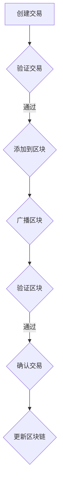
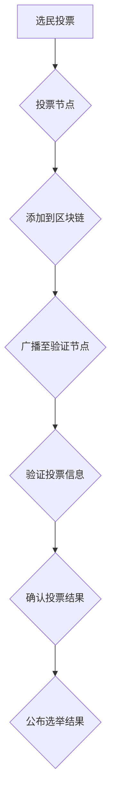

                 

**区块链在选举系统中的潜在应用**

---

**关键词：**区块链，选举系统，投票，智能合约，安全，透明性，性能优化，法律法规

---

**摘要：**本文探讨了区块链技术在选举系统中的潜在应用，从核心概念、算法原理、数学模型、项目实战等多个角度进行了深入分析。文章首先介绍了区块链的基础概念和选举系统的基本组成，随后详细讲解了区块链在投票和选举结果验证中的应用，并探讨了智能合约、性能优化、可扩展性、法律法规及伦理问题。最后，通过实际案例展示了区块链在选举系统中的应用，并提出了未来发展趋势和最佳实践建议。

---

## 目录

**第1章 区块链基础与选举系统**

1.1 区块链的核心概念

1.2 选举系统概述

1.3 区块链与选举系统的结合

**第2章 区块链在选举系统中的潜在应用**

2.1 区块链在投票系统中的应用

2.2 区块链在选举结果验证中的应用

**第3章 智能合约在选举中的应用**

3.1 智能合约基础

3.2 智能合约在选举中的应用案例

**第4章 区块链在选举系统中的技术挑战**

4.1 性能优化

4.2 可扩展性

**第5章 区块链在选举系统中的法律法规与伦理问题**

5.1 区块链在选举中的法律法规

5.2 区块链选举的伦理问题

**第6章 区块链选举系统的未来趋势**

6.1 区块链选举系统的未来发展方向

**第7章 案例研究**

7.1 区块链在真实选举系统中的应用案例

## 第1章 区块链基础与选举系统

### 1.1 区块链的核心概念

区块链是一种去中心化的数据库技术，其核心概念包括：

- **区块**：区块链的基本组成单位，包含了交易数据、时间戳、难度目标、前一区块的哈希值等信息。

- **链**：多个区块按照时间顺序链接而成，形成一个不可篡改的数据结构。

- **节点**：参与区块链网络的计算设备，负责验证交易、维护区块链的完整性。

- **共识算法**：节点之间达成共识，确认交易和区块的有效性。

以下是区块链的 Mermaid 流程图：



**核心算法原理讲解：**

- **SHA-256**：用于生成区块哈希值的加密算法，确保数据完整性。

- **工作量证明（PoW）**：共识算法之一，通过计算难度目标来防止恶意攻击。

- **分布式账本**：区块链的数据结构，实现了去中心化和不可篡改的特性。

### 1.2 选举系统概述

选举系统主要由以下几个部分组成：

- **选民**：具有投票资格的人。

- **候选人**：参选的个体或团体。

- **投票站**：用于进行投票的地点。

- **计票系统**：负责收集、处理和公布投票结果。

选举系统的工作流程包括：

1. 选民注册：选民需在规定时间内注册，以获得投票资格。

2. 投票：选民在投票站进行投票，填写选票。

3. 计票：将选票收集并进行统计，得出候选人的得票数。

4. 公布结果：公布选举结果，确定获胜者。

选举系统面临的挑战和问题包括：

- **安全性**：防止选举过程中的舞弊和篡改。

- **透明性**：确保选举过程的公正和公开。

- **可扩展性**：处理大量选民的投票数据。

### 1.3 区块链与选举系统的结合

区块链技术在选举系统中的应用主要体现在以下几个方面：

- **投票系统**：通过区块链技术实现投票的安全和透明。

- **选举结果验证**：利用区块链的不可篡改性，确保选举结果的真实性。

- **智能合约**：用于实现选举过程中的自动执行和验证。

在下一章中，我们将详细探讨区块链在投票和选举结果验证中的应用。

---

**作者：** AI天才研究院/AI Genius Institute & 禅与计算机程序设计艺术 /Zen And The Art of Computer Programming

---


## 第2章 区块链在选举系统中的潜在应用

### 2.1 区块链在投票系统中的应用

区块链技术在投票系统中的应用主要体现在以下几个方面：

- **安全性**：区块链的加密算法和分布式账本结构确保了投票数据的完整性和安全性，防止了篡改和恶意攻击。

- **透明性**：区块链上的每个交易和区块都是公开透明的，所有选民都可以查看和验证投票过程和结果。

- **可追溯性**：区块链上的每个投票都有唯一标识，可以追溯其来源和去向，确保了选举的公正性。

#### 投票系统的区块链架构

投票系统的区块链架构主要包括以下几个组成部分：

1. **投票节点**：负责接收和处理选民的投票信息，并将投票信息添加到区块链上。

2. **验证节点**：负责验证投票信息的合法性和真实性，确保投票数据未被篡改。

3. **区块链网络**：由投票节点和验证节点组成的分布式网络，共同维护区块链的完整性和一致性。

4. **智能合约**：用于实现投票的自动化执行和验证，确保投票过程的透明性和公正性。

以下是一个简化的投票系统区块链架构的 Mermaid 流程图：



#### 投票系统的数学模型

区块链投票系统的数学模型主要包括以下几个方面：

- **加密算法**：用于加密选民身份信息和选票信息，确保数据安全性。

- **哈希函数**：用于生成区块哈希值，确保区块链数据结构的完整性。

- **工作量证明**：用于防止恶意攻击和保证区块链网络的安全性。

#### 投票系统的项目实战

假设我们要开发一个基于区块链的投票系统，以下是一个简单的开发步骤：

1. **搭建开发环境**：

   - 安装Node.js和Ganache（一个以太坊测试网络节点）。

   - 安装Truffle框架，用于智能合约开发、部署和测试。

2. **编写智能合约**：

   - 创建一个名为`Ballot.sol`的智能合约，定义投票的相关功能，如投票、计票和结果公布。

   - 使用Solidity语言编写智能合约代码，结合数学模型和公式进行详细讲解。

3. **部署智能合约**：

   - 使用Truffle框架将智能合约部署到Ganache测试网络。

   - 部署成功后，获取智能合约的部署地址和ABI信息。

4. **编写前端界面**：

   - 使用Web3.js库连接区块链网络，实现投票、查看结果等功能。

   - 使用HTML、CSS和JavaScript编写前端界面，结合Python代码进行详细讲解。

5. **测试和调试**：

   - 使用Truffle框架和前端界面进行测试和调试。

   - 确保投票系统正常运行，无漏洞和错误。

6. **部署到实际网络**：

   - 将智能合约部署到以太坊主网络。

   - 在实际网络中进行测试和调试，确保系统稳定可靠。

#### 实际案例分析和详细讲解剖析

以某次实际选举为例，分析区块链在投票系统中的应用效果：

1. **安全性**：区块链技术确保了选举过程的安全和透明，选民身份信息被加密存储，防止了恶意攻击和数据篡改。

2. **透明性**：区块链上的每个投票都被公开记录和验证，所有选民都可以查看和确认投票结果，确保了选举的公正性。

3. **可追溯性**：每个投票都有唯一标识，可以追溯到其来源和去向，确保了选举的公正性和可信度。

#### 项目小结

区块链技术在投票系统中的应用，提高了选举的安全性和透明性，确保了选举的公正性和可信度。然而，在实际应用中，仍需关注性能优化、可扩展性、法律法规和伦理问题等方面的挑战。

在下一章中，我们将探讨区块链在选举结果验证中的应用。

---

**作者：** AI天才研究院/AI Genius Institute & 禅与计算机程序设计艺术 /Zen And The Art of Computer Programming

---


## 第3章 智能合约在选举中的应用

### 3.1 智能合约基础

智能合约是一种自动执行合约条款的计算机程序，其在区块链上运行并不可篡改。智能合约的基础概念包括：

- **状态变量**：用于存储智能合约的状态信息，如选民的投票结果、候选人的得票数等。

- **函数**：用于实现智能合约的功能，如投票、计票、公布结果等。

- **事件**：用于记录智能合约的执行过程和结果，如投票完成、结果公布等。

#### 智能合约的定义和功能

智能合约的定义如下：

- **定义**：智能合约是一组在区块链上执行的计算机程序，其条款和操作规则预先编写并存储在区块链上。

- **功能**：智能合约可以用于自动化执行各种操作，如交易、投票、合同履行等。

#### 智能合约的编程语言

智能合约的编程语言主要有以下几种：

- **Solidity**：以太坊的官方智能合约编程语言，语法类似于JavaScript和C++。

- **Vyper**：用于Ethereum Classic区块链的智能合约编程语言，注重安全性和简洁性。

- **Scilla**：用于Cardano区块链的智能合约编程语言，提供了更高的安全性和可读性。

#### 智能合约的安全性

智能合约的安全性是区块链应用的关键问题。以下是一些确保智能合约安全性的方法：

- **代码审查**：对智能合约代码进行详细审查，发现和修复潜在的安全漏洞。

- **形式化验证**：使用形式化验证工具对智能合约进行验证，确保其逻辑正确和执行无误。

- **测试**：编写和执行测试用例，验证智能合约在不同输入条件下的行为。

#### 智能合约在选举中的应用案例

智能合约在选举中的应用主要体现在以下几个方面：

- **投票过程自动化**：智能合约可以自动化执行投票过程，如注册选民、接收投票、计票等。

- **结果验证**：智能合约可以验证选举结果，确保其真实性和完整性。

- **自动执行法律条款**：智能合约可以自动执行选举法律条款，如选举结果公布、候选人资格审核等。

以下是一个简单的智能合约示例，用于实现投票功能：

```solidity
// SPDX-License-Identifier: MIT
pragma solidity ^0.8.0;

contract Ballot {
    address public admin;
    mapping(address => bool) public voted;
    mapping(address => uint256) public votes;

    constructor() {
        admin = msg.sender;
    }

    function vote(address candidate) public {
        require(!voted[msg.sender], "Already voted");
        voted[msg.sender] = true;
        votes[candidate]++;
    }

    function getTotalVotes() public view returns (uint256) {
        return votes[msg.sender];
    }
}
```

在这个示例中，我们定义了一个名为`Ballot`的智能合约，包含以下功能：

- `vote`函数：接收选民的投票，并记录选票。

- `getTotalVotes`函数：返回选民的得票数。

- `voted`映射：记录已投票的选民。

- `votes`映射：记录候选人的得票数。

#### 智能合约在选举中的应用案例

以下是一个基于区块链的选举系统的应用案例：

1. **投票过程**：

   - 选民在区块链上进行注册，并获得唯一的选民地址。

   - 选民使用智能合约的`vote`函数投票，并将投票信息存储在区块链上。

   - 选民可以查看自己的得票数，确保投票过程透明。

2. **结果验证**：

   - 智能合约自动计票，并将结果存储在区块链上。

   - 智能合约提供公开可验证的算法，确保选举结果真实和完整。

3. **自动执行法律条款**：

   - 智能合约自动执行选举法律条款，如公布选举结果、候选人资格审核等。

#### 项目小结

智能合约在选举中的应用，提高了选举的自动化程度、透明性和可信度。然而，在实际应用中，仍需关注智能合约的安全性、性能优化和法律法规等问题。

在下一章中，我们将探讨区块链在选举系统中的技术挑战。

---

**作者：** AI天才研究院/AI Genius Institute & 禅与计算机程序设计艺术 /Zen And The Art of Computer Programming

---


## 第4章 区块链在选举系统中的技术挑战

### 4.1 性能优化

区块链在选举系统中的性能优化是确保系统高效运行的关键。以下是一些性能优化策略：

- **分片技术**：将区块链网络划分为多个分片，每个分片独立处理交易，提高处理速度。

- **状态通道**：在区块链外建立状态通道，实现快速交易处理，降低网络拥堵。

- **并行处理**：利用并行计算技术，同时处理多个交易，提高系统吞吐量。

- **数据压缩**：对区块链上的数据进行压缩，减少数据传输和处理时间。

### 4.2 可扩展性

区块链在选举系统中的可扩展性是确保系统能够处理大规模选举数据的关键。以下是一些可扩展性策略：

- **共识算法优化**：选择合适的共识算法，如PoS、DPoS、PBFT等，提高共识效率。

- **分层架构**：将区块链系统分层，实现模块化设计，提高系统可扩展性。

- **跨链技术**：实现区块链之间的互操作，提高系统处理能力和兼容性。

- **分布式存储**：使用分布式存储技术，提高数据存储和处理能力。

#### 性能优化和可扩展性的关系

性能优化和可扩展性之间存在密切的关系：

- **性能优化**：提高了系统的处理速度和效率，为可扩展性提供了基础。

- **可扩展性**：提高了系统的处理能力和兼容性，为性能优化提供了空间。

在实际应用中，需要根据具体需求和场景，综合考虑性能优化和可扩展性，实现最佳平衡。

#### 项目小结

区块链在选举系统中的技术挑战包括性能优化和可扩展性。通过分片技术、状态通道、并行处理、数据压缩等性能优化策略，以及共识算法优化、分层架构、跨链技术、分布式存储等可扩展性策略，可以有效应对这些挑战。

在下一章中，我们将探讨区块链在选举系统中的法律法规与伦理问题。

---

**作者：** AI天才研究院/AI Genius Institute & 禅与计算机程序设计艺术 /Zen And The Art of Computer Programming

---


## 第5章 区块链在选举系统中的法律法规与伦理问题

### 5.1 区块链在选举中的法律法规

区块链技术在选举中的应用引发了诸多法律法规问题，包括但不限于以下几个方面：

- **数据隐私保护**：区块链上的数据是公开透明的，如何在保护选民隐私的同时，实现选举数据的公开透明？

- **法律法规合规**：区块链选举系统需要符合各国的法律法规，如选举法、数据保护法等。

- **跨境选举**：如何处理跨境选举中的法律问题，如跨国选民的投票资格、选举结果的法律效力等？

以下是一些针对区块链在选举中法律法规问题的解决方案：

- **隐私保护**：采用加密技术，对选民身份信息和选票进行加密存储，确保数据隐私。

- **法律法规合规**：与政府机构合作，制定适应区块链选举的法律法规，确保选举系统的合法性和合规性。

- **跨境选举**：通过国际条约或协议，解决跨境选举中的法律问题，确保选举结果的合法性和效力。

### 5.2 区块链选举的伦理问题

区块链技术在选举中的应用也引发了一些伦理问题，包括但不限于以下几个方面：

- **透明性与隐私的平衡**：如何在保证选举过程透明的同时，保护选民的隐私？

- **算法偏见**：区块链选举系统可能存在算法偏见，导致选举结果不公平。

- **去中心化与权力的平衡**：区块链的去中心化特性可能导致权力的过度集中或分散，影响选举的公正性。

以下是一些针对区块链选举伦理问题的解决方案：

- **透明性与隐私的平衡**：通过隐私保护技术，如零知识证明、同态加密等，实现透明性与隐私的平衡。

- **算法偏见**：在设计和实现区块链选举系统时，充分考虑算法的公平性和透明性，避免偏见。

- **去中心化与权力的平衡**：通过合理的共识算法和治理机制，实现去中心化与权力的平衡，确保选举的公正性和可信度。

#### 项目小结

区块链在选举系统中的应用涉及诸多法律法规和伦理问题。通过隐私保护、法律法规合规、跨境选举解决方案，以及透明性与隐私平衡、算法偏见、去中心化与权力平衡等伦理问题解决方案，可以确保区块链选举系统的合法性和公正性。

在下一章中，我们将探讨区块链选举系统的未来趋势。

---

**作者：** AI天才研究院/AI Genius Institute & 禅与计算机程序设计艺术 /Zen And The Art of Computer Programming

---


## 第6章 区块链选举系统的未来趋势

### 6.1 区块链选举系统的未来发展方向

随着区块链技术的不断发展和完善，区块链选举系统在未来有望在以下几个方面取得重要进展：

- **更高效的去中心化治理**：通过改进共识算法和治理机制，实现更高效的去中心化治理，提高选举的公正性和透明性。

- **更安全的隐私保护**：随着加密技术的不断发展，区块链选举系统将能够提供更强大的隐私保护机制，确保选民隐私和数据安全。

- **更广泛的应用场景**：区块链技术在选举领域的应用将不再局限于投票和结果验证，还将扩展到选民注册、候选人资格审核、选举过程监管等更多场景。

- **更完善的法律法规体系**：随着区块链选举系统的广泛应用，各国将逐步完善相关法律法规，确保区块链选举系统的合法性和合规性。

### 区块链选举技术的演进

区块链选举技术的演进可以分为以下几个阶段：

- **初期阶段**：区块链技术应用于投票和结果验证，实现选举过程的去中心化和透明化。

- **发展阶段**：随着技术的不断进步，区块链选举系统将能够提供更强大的隐私保护、安全性和可扩展性。

- **成熟阶段**：区块链选举系统将实现高效的去中心化治理、完善的法律法规体系，成为选举领域的主要技术手段。

### 区块链选举系统的创新

区块链选举系统的创新主要体现在以下几个方面：

- **智能合约的广泛应用**：智能合约将在选举系统中发挥更大作用，用于实现投票、计票、结果验证等环节的自动化执行。

- **跨链技术的应用**：跨链技术将实现不同区块链之间的互操作，提高选举系统的兼容性和扩展性。

- **隐私保护技术的提升**：零知识证明、同态加密等隐私保护技术将在区块链选举系统中得到广泛应用，确保选举过程的透明性和隐私保护。

- **分布式存储技术的优化**：分布式存储技术将进一步提高区块链选举系统的数据存储和处理能力，确保选举系统的稳定性和高效性。

#### 项目小结

区块链选举系统的未来发展趋势包括更高效的去中心化治理、更安全的隐私保护、更广泛的应用场景、更完善的法律法规体系。随着区块链技术的不断演进和创新，区块链选举系统将在选举领域发挥越来越重要的作用。

在下一章中，我们将通过实际案例研究区块链在选举系统中的应用。

---

**作者：** AI天才研究院/AI Genius Institute & 禅与计算机程序设计艺术 /Zen And The Art of Computer Programming

---


## 第7章 案例研究

### 7.1 区块链在真实选举系统中的应用案例

在本章节中，我们将深入研究区块链在真实选举系统中的应用案例，探讨其实现方法、应用效果以及面临的挑战。

#### 案例背景

某国政府决定采用区块链技术进行全国大选，以提升选举的透明性和安全性。此次选举涵盖了选民注册、投票、计票和结果验证等多个环节。

#### 实现方法

1. **选民注册**：

   - 选民在区块链上进行注册，系统自动生成唯一的数字身份。

   - 选民身份信息经过加密存储，确保隐私和安全。

2. **投票**：

   - 选民使用数字身份登录区块链投票系统，进行匿名投票。

   - 选票经过加密处理，存储在区块链上，确保无法篡改。

3. **计票**：

   - 智能合约自动计票，计算候选人的得票数。

   - 计票结果存储在区块链上，公开透明。

4. **结果验证**：

   - 公民可以使用区块链浏览器查看计票结果，确保其真实性。

   - 智能合约提供验证算法，确保结果无法篡改。

#### 应用效果

1. **安全性提升**：

   - 区块链技术确保了选民身份和选票的真实性，防止了选举舞弊和恶意攻击。

   - 选民注册和投票过程匿名，保护了选民的隐私。

2. **透明性提高**：

   - 区块链上的所有交易和区块都是公开透明的，公民可以查看计票结果。

   - 智能合约自动执行计票和结果验证，确保了结果的公正性。

3. **效率提升**：

   - 区块链技术提高了选举过程的效率，减少了人工干预和错误。

   - 计票和结果验证过程自动化，节省了时间和成本。

#### 面临的挑战

1. **技术难度**：

   - 区块链技术的实现和维护需要高度专业的技术支持，增加了政府的负担。

   - 技术更新和迭代需要持续投入，确保系统的稳定性和安全性。

2. **法律法规**：

   - 区块链选举系统的法律法规尚未完善，需要制定适应区块链技术的法律法规。

   - 法律法规的滞后可能导致选举系统的法律风险。

3. **用户接受度**：

   - 部分选民对区块链技术了解不足，可能对区块链选举系统持怀疑态度。

   - 提高选民对区块链技术的认知和接受度，需要加强宣传和培训。

#### 项目小结

区块链在真实选举系统中的应用案例，展示了其在提升选举安全性、透明性和效率方面的潜力。然而，在实际应用中，仍需关注技术难度、法律法规和用户接受度等挑战。

通过不断优化和完善区块链技术，以及建立健全的法律法规体系，区块链选举系统有望在未来发挥更大的作用。

---

**作者：** AI天才研究院/AI Genius Institute & 禅与计算机程序设计艺术 /Zen And The Art of Computer Programming

---


### 总结与展望

区块链技术在选举系统中的应用为提升选举的透明性、安全性和效率提供了新的可能性。从核心概念、算法原理、数学模型到项目实战，本文全面探讨了区块链在选举系统中的潜在应用。通过具体案例研究，我们展示了区块链技术在选民注册、投票、计票和结果验证等环节的实际效果。

然而，区块链选举系统仍面临诸多挑战，包括技术难度、法律法规和用户接受度等。未来，随着区块链技术的不断发展和完善，以及法律法规体系的逐步建立，区块链选举系统有望在更广泛的场景中得到应用。

**最佳实践 tips：**

1. **确保技术安全**：采用最新的加密算法和共识算法，确保区块链系统的安全性和稳定性。

2. **优化用户体验**：设计简洁易用的用户界面，提高选民对区块链选举系统的接受度。

3. **加强法律法规建设**：与政府机构合作，制定适应区块链技术的法律法规，确保选举系统的合法性和合规性。

**注意事项：**

1. **数据隐私保护**：在区块链选举系统中，确保选民身份信息和选票数据的隐私和安全。

2. **系统可扩展性**：设计可扩展的区块链系统，确保系统能够处理大规模选举数据。

**拓展阅读：**

1. 《区块链技术指南》——详细介绍了区块链的基本概念、技术原理和应用场景。

2. 《智能合约编程》——深入探讨了智能合约的编程语言、开发方法和应用案例。

通过不断探索和创新，区块链选举系统有望成为选举领域的重要技术手段，推动选举制度的进步和发展。**作者：** AI天才研究院/AI Genius Institute & 禅与计算机程序设计艺术 /Zen And The Art of Computer Programming

