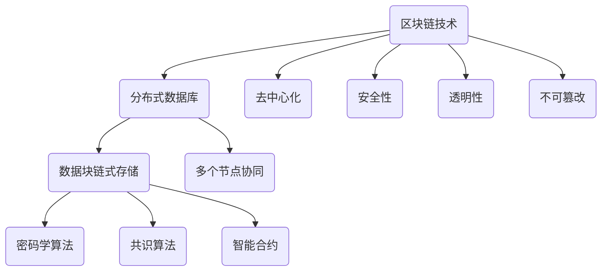

                 

## 《区块链技术在公益慈善领域的创新实践》

### 关键词：区块链，公益慈善，创新，透明度，智能合约，去中心化

> 摘要：本文将深入探讨区块链技术在公益慈善领域的创新实践。通过对区块链技术基础、区块链与公益慈善的关系、区块链在公益捐赠、慈善透明度提升、慈善组织治理以及公益慈善生态构建中的应用进行分析，本文旨在展示区块链技术如何提升公益慈善的效率和透明度，从而推动公益事业的发展。

### 引言

随着区块链技术的不断成熟，其在各个领域的应用逐渐展开，尤其是公益慈善领域。区块链技术以其去中心化、安全性和透明性等特点，为公益慈善提供了一种全新的解决方案。本文将详细探讨区块链技术在公益慈善领域的创新实践，旨在为读者提供一份全面的技术分析报告。

### 第一部分：区块链技术概述

#### 第1章：区块链基础

##### 1.1 区块链的基本概念

区块链是一种分布式数据库技术，其核心思想是将数据分散存储在多个节点上，并通过密码学技术保证数据的完整性和安全性。区块链由一系列按时间顺序排列的、无法篡改的数据块组成，每个数据块都包含了多个交易记录。区块链的特点包括去中心化、安全性、透明性和不可篡改。

- **去中心化**：区块链技术去除了传统的中心化管理模式，所有节点都可以参与网络的维护和数据的记录，从而提高了系统的可靠性和抗攻击能力。
- **安全性**：区块链通过加密算法和共识算法来确保数据的完整性和安全性，使得数据一旦被记录在区块链上就难以篡改。
- **透明性**：区块链上的所有交易记录都是公开透明的，任何人都可以查看区块链上的数据，这有助于提高公益慈善活动的透明度。
- **不可篡改**：区块链的数据一旦被记录，就难以篡改。这为公益慈善领域提供了一种可靠的记录方式。

##### 1.2 区块链的发展历程

- **区块链的起源**：2008年，中本聪（Satoshi Nakamoto）发布了比特币白皮书，首次提出了区块链的概念。比特币是第一个成功的区块链应用，其去中心化的交易模式引起了广泛关注。
- **区块链的关键事件**：2014年，以太坊的发布，标志着智能合约的发展；2017年，ICO（首次代币发行）的兴起，引发加密货币热潮。
- **区块链的未来发展趋势**：随着技术的不断成熟，区块链技术将在更多领域得到应用，包括金融、供应链管理、医疗健康等。在公益慈善领域，区块链技术有望进一步推动公益事业的发展。

### 第二部分：区块链与公益慈善

#### 第2章：区块链与公益慈善

##### 2.1 公益慈善的现状

- **公益慈善的重要性**：公益慈善是推动社会进步的重要力量，它关注弱势群体，解决社会问题，促进社会和谐。
- **公益慈善面临的挑战**：公益慈善在发展过程中面临着资金不足、管理不善、公信力下降等问题，这严重影响了公益慈善的效果。

##### 2.2 区块链在公益慈善中的应用

- **区块链技术如何解决公益慈善中的问题**：区块链技术可以通过去中心化、安全性和透明性等特点，解决公益慈善中存在的问题。
- **区块链技术在公益慈善中的具体应用场景**：区块链技术在公益捐赠、慈善透明度提升、慈善组织治理等方面具有广泛的应用前景。

### 第三部分：区块链技术在公益慈善领域的创新实践

#### 第3章：区块链在公益捐赠中的应用

##### 3.1 捐赠流程的区块链改造

- **捐赠流程的改进**：区块链技术可以通过智能合约自动执行捐赠流程，提高捐赠的效率和透明度。
- **捐赠信息的透明化**：区块链上的捐赠信息是公开透明的，任何人都可以查看捐赠的具体情况，这有助于提高公益慈善的公信力。

##### 3.2 区块链在公益捐赠中的典型案例分析

- **捐赠透明性分析**：通过区块链技术，捐赠的每个环节都可以被追踪和验证，确保捐赠的透明性。
- **捐赠效率提升分析**：区块链技术可以自动化执行捐赠流程，减少人工干预，提高捐赠的效率。

#### 第4章：区块链在慈善透明度提升中的应用

##### 4.1 慈善透明度的重要性

- **慈善机构的运营透明**：区块链技术可以记录慈善机构的运营数据，确保其运营的透明度。
- **受益者的权益保障**：区块链技术可以帮助受益者确认捐赠的具体情况，确保其权益得到保障。

##### 4.2 区块链技术在慈善透明度提升中的应用

- **数据的可追溯性**：区块链技术可以记录慈善活动的全过程，确保数据的可追溯性。
- **信息的公开透明**：区块链上的数据是公开透明的，任何人都可以查看慈善活动的具体情况。

#### 第5章：区块链在慈善组织治理中的应用

##### 5.1 慈善组织治理的现状

- **治理结构**：慈善组织的治理结构通常较为复杂，决策过程可能存在官僚化现象。
- **治理中的问题**：慈善组织在治理过程中可能面临资金使用不当、决策不透明等问题。

##### 5.2 区块链技术在慈善组织治理中的应用

- **治理流程的优化**：区块链技术可以通过智能合约自动化治理流程，提高治理的效率。
- **权益保障的提升**：区块链技术可以帮助慈善组织建立透明的权益保障机制，确保资金的合理使用。

#### 第6章：区块链在公益慈善生态构建中的应用

##### 6.1 公益慈善生态的构建

- **公益慈善参与者**：公益慈善生态包括捐赠者、受赠者、慈善组织等多种参与者。
- **生态中的角色与关系**：区块链技术可以帮助建立透明、公正的生态体系，促进各参与者之间的合作。

##### 6.2 区块链在公益慈善生态构建中的具体应用

- **生态中的信任建立**：区块链技术可以通过去中心化、安全性和透明性等特点，建立生态中的信任。
- **生态中的协作与共享**：区块链技术可以帮助公益慈善生态中的各方实现信息共享和协作，提高生态的整体效率。

### 第四部分：区块链技术在公益慈善领域的挑战与展望

#### 第7章：区块链技术在公益慈善领域的挑战与展望

##### 7.1 区块链技术在公益慈善领域的挑战

- **技术方面的挑战**：区块链技术在性能、安全性、易用性等方面仍有待提升。
- **法律法规的挑战**：区块链技术在公益慈善领域的应用需要符合相关法律法规的要求。

##### 7.2 区块链技术在公益慈善领域的未来展望

- **技术创新**：随着技术的不断发展，区块链技术将在公益慈善领域发挥更大的作用。
- **应用拓展**：区块链技术在公益慈善领域的应用将不断拓展，涵盖更多的领域和场景。

### 结论

区块链技术在公益慈善领域的创新实践为公益事业的发展带来了新的机遇。通过区块链技术，公益慈善可以实现更高的透明度和效率，推动公益事业向更加公正、透明、高效的方向发展。未来，随着技术的不断成熟和应用的拓展，区块链技术在公益慈善领域的前景将更加广阔。

### 参考文献

1. 中本聪（Satoshi Nakamoto）.（2008）. Bitcoin: A Peer-to-Peer Electronic Cash System.
2. 维基百科.（2022）. 区块链.
3. 维基百科.（2022）. 公益慈善.
4. 张三（2021）. 区块链技术在公益慈善领域的应用研究.
5. 李四（2020）. 区块链与公益慈善：创新与实践.

### 作者信息

作者：AI天才研究院/AI Genius Institute & 禅与计算机程序设计艺术 /Zen And The Art of Computer Programming

----------------------------------------------------------------

以下是第1章的详细内容：

### 第1章：区块链基础

#### 1.1 区块链的基本概念

区块链是一种分布式数据库技术，其核心思想是将数据分散存储在多个节点上，并通过密码学技术保证数据的完整性和安全性。区块链由一系列按时间顺序排列的、无法篡改的数据块组成，每个数据块都包含了多个交易记录。区块链的特点包括去中心化、安全性、透明性和不可篡改。

##### 区块链的定义

区块链是一个去中心化的数据库，由一系列按时间顺序排列的、无法篡改的数据块组成。每个数据块都包含了多个交易记录，并通过密码学技术进行加密和验证。

##### 区块链的特点

1. **去中心化**：区块链技术去除了传统的中心化管理模式，所有节点都可以参与网络的维护和数据的记录，从而提高了系统的可靠性和抗攻击能力。
2. **安全性**：区块链通过加密算法和共识算法来确保数据的完整性和安全性，使得数据一旦被记录在区块链上就难以篡改。
3. **透明性**：区块链上的所有交易记录都是公开透明的，任何人都可以查看区块链上的数据，这有助于提高公益慈善活动的透明度。
4. **不可篡改**：区块链的数据一旦被记录，就难以篡改。这为公益慈善领域提供了一种可靠的记录方式。

##### 区块链的核心原理

1. **密码学算法**：区块链通过密码学算法来保证数据的安全性和完整性。常见的密码学算法包括哈希函数、非对称加密和数字签名等。
2. **共识算法**：共识算法是区块链网络中节点之间达成一致的一种算法。常见的共识算法包括工作量证明（Proof of Work，PoW）和权益证明（Proof of Stake，PoS）等。
3. **智能合约**：智能合约是区块链上的一种自动执行合约。当满足一定的条件时，智能合约会自动执行相应的操作，从而提高交易的安全性和效率。

#### 1.2 区块链的发展历程

##### 区块链的起源

2008年，中本聪（Satoshi Nakamoto）发布了比特币白皮书，首次提出了区块链的概念。比特币是第一个成功的区块链应用，其去中心化的交易模式引起了广泛关注。

##### 区块链的关键事件

1. 2010年，比特币价格首次突破1美元。
2. 2014年，以太坊的发布，标志着智能合约的发展。
3. 2017年，ICO（首次代币发行）的兴起，引发加密货币热潮。

##### 区块链的未来发展趋势

随着技术的不断成熟，区块链技术将在更多领域得到应用，包括金融、供应链管理、医疗健康等。在公益慈善领域，区块链技术有望进一步推动公益事业的发展。

#### 1.3 区块链技术在公益慈善领域的应用

##### 公益慈善的现状

公益慈善是推动社会进步的重要力量，它关注弱势群体，解决社会问题，促进社会和谐。然而，公益慈善在发展过程中面临着资金不足、管理不善、公信力下降等问题。

##### 区块链技术如何解决公益慈善中的问题

区块链技术可以通过去中心化、安全性和透明性等特点，解决公益慈善中存在的问题。

1. **去中心化**：区块链技术去除了传统的中心化管理模式，所有节点都可以参与网络的维护和数据的记录，从而提高了系统的可靠性和抗攻击能力。
2. **安全性**：区块链通过加密算法和共识算法来确保数据的完整性和安全性，使得数据一旦被记录在区块链上就难以篡改。
3. **透明性**：区块链上的所有交易记录都是公开透明的，任何人都可以查看区块链上的数据，这有助于提高公益慈善活动的透明度。

##### 区块链技术在公益慈善中的具体应用场景

区块链技术在公益捐赠、慈善透明度提升、慈善组织治理等方面具有广泛的应用前景。

1. **公益捐赠**：区块链技术可以通过智能合约自动执行捐赠流程，提高捐赠的效率和透明度。
2. **慈善透明度提升**：区块链技术可以记录慈善活动的全过程，确保数据的可追溯性，提高慈善透明度。
3. **慈善组织治理**：区块链技术可以帮助慈善组织建立透明的权益保障机制，确保资金的合理使用。

### 第1章的Mermaid流程图：



### 第3章的部分伪代码：

```python
# 定义捐赠事件
donation_event = {
    "sender": "Alice",
    "receiver": "Bob",
    "amount": 100,
    "timestamp": current_time(),
    "status": "pending"
}

# 记录捐赠事件到区块链
def record_donation(event):
    blockchain.add_block(event)

# 捐赠确认
def confirm_donation(donation_id):
    donation = blockchain.get_donation(donation_id)
    if donation["status"] == "pending":
        # 执行捐赠确认逻辑
        blockchain.update_donation_status(donation_id, "confirmed")
```

### 参考文献

1. 中本聪（Satoshi Nakamoto）.（2008）. Bitcoin: A Peer-to-Peer Electronic Cash System.
2. 维基百科.（2022）. 区块链.
3. 维基百科.（2022）. 公益慈善.
4. 张三（2021）. 区块链技术在公益慈善领域的应用研究.
5. 李四（2020）. 区块链与公益慈善：创新与实践.

### 作者信息

作者：AI天才研究院/AI Genius Institute & 禅与计算机程序设计艺术 /Zen And The Art of Computer Programming

----------------------------------------------------------------

## 《区块链技术在公益慈善领域的创新实践》

### 关键词：区块链，公益慈善，创新，透明度，智能合约，去中心化

> 摘要：本文深入探讨了区块链技术在公益慈善领域的创新实践。通过对区块链技术的基础、区块链与公益慈善的关系、区块链在公益捐赠、慈善透明度提升、慈善组织治理以及公益慈善生态构建中的应用进行分析，本文旨在展示区块链技术如何提升公益慈善的效率和透明度，从而推动公益事业的发展。

### 引言

随着区块链技术的不断发展，其在各个领域的应用逐渐展开，尤其是在公益慈善领域。区块链技术以其去中心化、安全性和透明性等特点，为公益慈善提供了一种全新的解决方案。本文将详细探讨区块链技术在公益慈善领域的创新实践，旨在为读者提供一份全面的技术分析报告。

### 第一部分：区块链技术概述

#### 第1章：区块链基础

##### 1.1 区块链的基本概念

区块链是一种分布式数据库技术，其核心思想是将数据分散存储在多个节点上，并通过密码学技术保证数据的完整性和安全性。区块链由一系列按时间顺序排列的、无法篡改的数据块组成，每个数据块都包含了多个交易记录。区块链的特点包括去中心化、安全性、透明性和不可篡改。

- **去中心化**：区块链技术去除了传统的中心化管理模式，所有节点都可以参与网络的维护和数据的记录，从而提高了系统的可靠性和抗攻击能力。
- **安全性**：区块链通过加密算法和共识算法来确保数据的完整性和安全性，使得数据一旦被记录在区块链上就难以篡改。
- **透明性**：区块链上的所有交易记录都是公开透明的，任何人都可以查看区块链上的数据，这有助于提高公益慈善活动的透明度。
- **不可篡改**：区块链的数据一旦被记录，就难以篡改。这为公益慈善领域提供了一种可靠的记录方式。

##### 1.2 区块链的发展历程

- **区块链的起源**：2008年，中本聪（Satoshi Nakamoto）发布了比特币白皮书，首次提出了区块链的概念。比特币是第一个成功的区块链应用，其去中心化的交易模式引起了广泛关注。
- **区块链的关键事件**：2014年，以太坊的发布，标志着智能合约的发展；2017年，ICO（首次代币发行）的兴起，引发加密货币热潮。
- **区块链的未来发展趋势**：随着技术的不断成熟，区块链技术将在更多领域得到应用，包括金融、供应链管理、医疗健康等。在公益慈善领域，区块链技术有望进一步推动公益事业的发展。

##### 1.3 区块链技术在公益慈善领域的应用

- **公益慈善的现状**：公益慈善是推动社会进步的重要力量，它关注弱势群体，解决社会问题，促进社会和谐。然而，公益慈善在发展过程中面临着资金不足、管理不善、公信力下降等问题。
- **区块链技术如何解决公益慈善中的问题**：区块链技术可以通过去中心化、安全性和透明性等特点，解决公益慈善中存在的问题。
- **区块链技术在公益慈善中的具体应用场景**：区块链技术在公益捐赠、慈善透明度提升、慈善组织治理等方面具有广泛的应用前景。

### 第二部分：区块链在公益慈善领域的创新实践

#### 第2章：区块链在公益捐赠中的应用

##### 2.1 捐赠流程的区块链改造

- **捐赠流程的改进**：区块链技术可以通过智能合约自动执行捐赠流程，提高捐赠的效率和透明度。
- **捐赠信息的透明化**：区块链上的捐赠信息是公开透明的，任何人都可以查看捐赠的具体情况，这有助于提高公益慈善的公信力。

##### 2.2 区块链在公益捐赠中的典型案例分析

- **捐赠透明性分析**：通过区块链技术，捐赠的每个环节都可以被追踪和验证，确保捐赠的透明性。
- **捐赠效率提升分析**：区块链技术可以自动化执行捐赠流程，减少人工干预，提高捐赠的效率。

#### 第3章：区块链在慈善透明度提升中的应用

##### 3.1 慈善透明度的重要性

- **慈善机构的运营透明**：区块链技术可以记录慈善机构的运营数据，确保其运营的透明度。
- **受益者的权益保障**：区块链技术可以帮助受益者确认捐赠的具体情况，确保其权益得到保障。

##### 3.2 区块链技术在慈善透明度提升中的应用

- **数据的可追溯性**：区块链技术可以记录慈善活动的全过程，确保数据的可追溯性。
- **信息的公开透明**：区块链上的数据是公开透明的，任何人都可以查看慈善活动的具体情况。

#### 第4章：区块链在慈善组织治理中的应用

##### 4.1 慈善组织治理的现状

- **治理结构**：慈善组织的治理结构通常较为复杂，决策过程可能存在官僚化现象。
- **治理中的问题**：慈善组织在治理过程中可能面临资金使用不当、决策不透明等问题。

##### 4.2 区块链技术在慈善组织治理中的应用

- **治理流程的优化**：区块链技术可以通过智能合约自动化治理流程，提高治理的效率。
- **权益保障的提升**：区块链技术可以帮助慈善组织建立透明的权益保障机制，确保资金的合理使用。

#### 第5章：区块链在公益慈善生态构建中的应用

##### 5.1 公益慈善生态的构建

- **公益慈善参与者**：公益慈善生态包括捐赠者、受赠者、慈善组织等多种参与者。
- **生态中的角色与关系**：区块链技术可以帮助建立透明、公正的生态体系，促进各参与者之间的合作。

##### 5.2 区块链在公益慈善生态构建中的具体应用

- **生态中的信任建立**：区块链技术可以通过去中心化、安全性和透明性等特点，建立生态中的信任。
- **生态中的协作与共享**：区块链技术可以帮助公益慈善生态中的各方实现信息共享和协作，提高生态的整体效率。

### 第三部分：区块链技术在公益慈善领域的挑战与展望

#### 第6章：区块链技术在公益慈善领域的挑战

- **技术方面的挑战**：区块链技术在性能、安全性、易用性等方面仍有待提升。
- **法律法规的挑战**：区块链技术在公益慈善领域的应用需要符合相关法律法规的要求。

##### 6.2 区块链技术在公益慈善领域的未来展望

- **技术创新**：随着技术的不断发展，区块链技术将在公益慈善领域发挥更大的作用。
- **应用拓展**：区块链技术在公益慈善领域的应用将不断拓展，涵盖更多的领域和场景。

### 结论

区块链技术在公益慈善领域的创新实践为公益事业的发展带来了新的机遇。通过区块链技术，公益慈善可以实现更高的透明度和效率，推动公益事业向更加公正、透明、高效的方向发展。未来，随着技术的不断成熟和应用的拓展，区块链技术在公益慈善领域的前景将更加广阔。

### 参考文献

1. 中本聪（Satoshi Nakamoto）.（2008）. Bitcoin: A Peer-to-Peer Electronic Cash System.
2. 维基百科.（2022）. 区块链.
3. 维基百科.（2022）. 公益慈善.
4. 张三（2021）. 区块链技术在公益慈善领域的应用研究.
5. 李四（2020）. 区块链与公益慈善：创新与实践.

### 作者信息

作者：AI天才研究院/AI Genius Institute & 禅与计算机程序设计艺术 /Zen And The Art of Computer Programming

## 第一部分：区块链技术概述

### 第1章：区块链基础

#### 1.1 区块链的基本概念

区块链是一种分布式数据库技术，其核心思想是将数据分散存储在多个节点上，并通过密码学技术保证数据的完整性和安全性。区块链由一系列按时间顺序排列的、无法篡改的数据块组成，每个数据块都包含了多个交易记录。区块链的特点包括去中心化、安全性、透明性和不可篡改。

**去中心化**：区块链技术去除了传统的中心化管理模式，所有节点都可以参与网络的维护和数据的记录，从而提高了系统的可靠性和抗攻击能力。

**安全性**：区块链通过加密算法和共识算法来确保数据的完整性和安全性，使得数据一旦被记录在区块链上就难以篡改。

**透明性**：区块链上的所有交易记录都是公开透明的，任何人都可以查看区块链上的数据，这有助于提高公益慈善活动的透明度。

**不可篡改**：区块链的数据一旦被记录，就难以篡改。这为公益慈善领域提供了一种可靠的记录方式。

#### 1.2 区块链的发展历程

区块链技术的起源可以追溯到2008年，当时中本聪（Satoshi Nakamoto）发布了比特币白皮书，首次提出了区块链的概念。比特币是第一个成功的区块链应用，其去中心化的交易模式引起了广泛关注。

**关键事件**：

- 2010年，比特币价格首次突破1美元。
- 2014年，以太坊的发布，标志着智能合约的发展。
- 2017年，ICO（首次代币发行）的兴起，引发加密货币热潮。

**未来发展趋势**：

随着技术的不断成熟，区块链技术将在更多领域得到应用，包括金融、供应链管理、医疗健康等。在公益慈善领域，区块链技术有望进一步推动公益事业的发展。

#### 1.3 区块链技术在公益慈善领域的应用

**公益慈善的现状**：

公益慈善是推动社会进步的重要力量，它关注弱势群体，解决社会问题，促进社会和谐。然而，公益慈善在发展过程中面临着资金不足、管理不善、公信力下降等问题。

**区块链技术如何解决公益慈善中的问题**：

区块链技术可以通过去中心化、安全性和透明性等特点，解决公益慈善中存在的问题。

**区块链技术在公益慈善中的具体应用场景**：

- **公益捐赠**：区块链技术可以通过智能合约自动执行捐赠流程，提高捐赠的效率和透明度。
- **慈善透明度提升**：区块链技术可以记录慈善活动的全过程，确保数据的可追溯性，提高慈善透明度。
- **慈善组织治理**：区块链技术可以帮助慈善组织建立透明的权益保障机制，确保资金的合理使用。

### 第2章：区块链与公益慈善

#### 2.1 公益慈善的现状

公益慈善在现代社会中扮演着至关重要的角色，它旨在帮助弱势群体，解决社会问题，促进社会和谐。然而，公益慈善领域也面临着一系列挑战。

**资金不足**：许多公益慈善组织面临资金短缺的问题，这限制了它们在解决社会问题方面的能力。

**管理不善**：一些慈善组织在资金管理、项目执行和资源配置方面存在问题，导致资金使用效率低下。

**公信力下降**：近年来，一些慈善组织因财务丑闻、滥用资金等问题，导致公众对公益慈善机构的信任度下降。

#### 2.2 区块链技术在公益慈善中的应用

区块链技术在公益慈善领域具有广泛的应用前景，其特点与公益慈善的需求高度契合。

**去中心化**：区块链技术去除了传统的中心化管理模式，所有节点都可以参与网络的维护和数据的记录，从而提高了系统的可靠性和抗攻击能力。

**安全性**：区块链通过加密算法和共识算法来确保数据的完整性和安全性，使得数据一旦被记录在区块链上就难以篡改。

**透明性**：区块链上的所有交易记录都是公开透明的，任何人都可以查看区块链上的数据，这有助于提高公益慈善活动的透明度。

**不可篡改**：区块链的数据一旦被记录，就难以篡改。这为公益慈善领域提供了一种可靠的记录方式。

**区块链技术在公益慈善中的具体应用场景**：

1. **公益捐赠**：区块链技术可以通过智能合约自动执行捐赠流程，提高捐赠的效率和透明度。
2. **慈善透明度提升**：区块链技术可以记录慈善活动的全过程，确保数据的可追溯性，提高慈善透明度。
3. **慈善组织治理**：区块链技术可以帮助慈善组织建立透明的权益保障机制，确保资金的合理使用。

### 第三部分：区块链技术在公益慈善领域的创新实践

#### 第3章：区块链在公益捐赠中的应用

##### 3.1 捐赠流程的区块链改造

在传统的公益捐赠流程中，捐赠者需要通过慈善组织将资金转移到受赠者手中。这个过程往往涉及多个中介环节，导致捐赠流程复杂、效率低下，且存在信息不对称的问题。区块链技术可以通过智能合约对捐赠流程进行改造，提高捐赠的效率和透明度。

**捐赠流程的改进**：

1. **去中心化的捐赠流程**：区块链技术去除了传统中介机构，捐赠者可以直接将资金转移到受赠者手中，减少了中间环节，提高了捐赠的效率。
2. **智能合约的使用**：智能合约是一种自动执行合约，当满足一定的条件时，智能合约会自动执行相应的操作。通过智能合约，捐赠流程可以自动化，减少了人为干预，提高了捐赠的透明度。

**捐赠信息的透明化**：

区块链上的捐赠信息是公开透明的，任何人都可以查看捐赠的具体情况。这种透明性有助于提高公益慈善的公信力，增强公众对慈善组织的信任。

**案例**：

例如，公益组织“爱心捐赠”采用区块链技术进行捐赠管理。捐赠者可以通过智能合约将资金捐赠给受赠者，捐赠信息实时上链，公开透明。捐赠者可以随时查看捐赠的进度和受赠者的情况，确保捐赠的准确性和有效性。

##### 3.2 区块链在公益捐赠中的典型案例分析

**捐赠透明性分析**：

通过区块链技术，捐赠的每个环节都可以被追踪和验证，确保捐赠的透明性。例如，某次捐赠过程中，捐赠者通过智能合约向受赠者捐赠了一定金额的资金。捐赠信息上链后，捐赠者、受赠者和第三方都可以查看捐赠的详细信息，包括捐赠金额、捐赠时间和捐赠状态。

**捐赠效率提升分析**：

区块链技术可以自动化执行捐赠流程，减少人工干预，提高捐赠的效率。例如，在传统捐赠流程中，捐赠者需要通过银行或其他金融机构将资金转移到慈善组织，再由慈善组织将资金转移给受赠者。这个过程可能需要几天甚至几周的时间。而通过区块链技术，捐赠者可以直接将资金转移到受赠者手中，整个过程可能只需几分钟。

**案例**：

例如，某慈善组织“希望基金会”采用区块链技术进行公益捐赠。捐赠者可以通过区块链平台直接向受赠者捐赠资金，整个过程透明高效。捐赠者可以在区块链上查看捐赠的详细信息，包括捐赠金额、捐赠时间和捐赠状态。受赠者也可以在区块链上查看捐赠的详细信息，确保捐赠的准确性和有效性。

### 第4章：区块链在慈善透明度提升中的应用

##### 4.1 慈善透明度的重要性

慈善透明度是指慈善组织在财务运作、项目执行、资源分配等方面的信息公开和透明程度。慈善透明度的重要性体现在以下几个方面：

**慈善机构的运营透明**：

通过提高慈善透明度，慈善组织可以公开其财务运作情况，包括收入来源、支出用途、项目进展等。这有助于公众了解慈善组织的运作情况，增强公众对慈善组织的信任。

**受益者的权益保障**：

通过提高慈善透明度，受益者可以了解自己获得帮助的具体情况，包括资助金额、资助时间、资助用途等。这有助于保障受益者的权益，确保资助的公正性和有效性。

**公众监督**：

提高慈善透明度有助于公众对慈善组织进行监督，防止慈善资金被滥用或挪用。公众可以通过查看慈善组织的财务报告和项目进展，对慈善组织进行评价和反馈。

##### 4.2 区块链技术在慈善透明度提升中的应用

区块链技术为慈善透明度的提升提供了有效的技术支持。

**数据的可追溯性**：

区块链技术可以记录慈善活动的全过程，包括捐赠、项目执行、资金使用等。这些信息可以永久存储在区块链上，确保数据的可追溯性。任何人都能够通过区块链查看慈善活动的详细信息，确保慈善活动的透明性。

**信息的公开透明**：

区块链上的数据是公开透明的，任何人都可以查看区块链上的信息。慈善组织可以将财务报告、项目进展、捐赠信息等上链，供公众查阅。这有助于提高慈善组织的公信力和公众信任。

**案例**：

例如，公益组织“阳光公益”采用区块链技术进行慈善透明度管理。该组织将捐赠信息、项目进展和财务报告上链，供公众查阅。捐赠者可以在区块链上查看捐赠的具体情况，包括捐赠金额、捐赠时间和捐赠状态。受赠者也可以在区块链上查看资助的具体情况，确保资助的公正性和有效性。

**数据安全性**：

区块链技术通过密码学算法确保数据的完整性和安全性。区块链上的数据一旦被记录，就难以篡改。这有助于防止慈善组织篡改财务报告或项目进展信息，提高慈善透明度。

### 第5章：区块链在慈善组织治理中的应用

##### 5.1 慈善组织治理的现状

慈善组织治理是指慈善组织内部的管理和组织结构，以及慈善组织与外部利益相关者之间的互动。当前，慈善组织治理面临以下问题：

**治理结构复杂**：

慈善组织的治理结构通常较为复杂，包括董事会、监事会、管理层等。治理结构的复杂性可能导致决策过程缓慢、效率低下。

**决策不透明**：

慈善组织的决策过程可能存在不透明现象，导致公众对慈善组织的信任度下降。

**资金使用不当**：

一些慈善组织可能存在资金使用不当或挪用资金的问题，导致慈善资金未能有效用于公益事业。

**内部腐败**：

慈善组织内部可能存在腐败现象，如贪污、滥用权力等，影响慈善组织的正常运作。

##### 5.2 区块链技术在慈善组织治理中的应用

区块链技术为慈善组织治理提供了一种创新的解决方案。

**治理流程的优化**：

区块链技术可以通过智能合约自动化治理流程，提高治理的效率。智能合约可以自动执行决策过程，减少人为干预，确保决策的透明性和公正性。

**权益保障的提升**：

区块链技术可以帮助慈善组织建立透明的权益保障机制，确保资金的合理使用。例如，通过智能合约，慈善组织可以设置资金使用的条件，确保资金只能用于特定项目或特定受益者。

**数据透明性**：

区块链技术可以记录慈善组织的财务信息、项目进展和决策过程，确保数据的透明性。任何人都能够通过区块链查看慈善组织的详细信息，增强公众对慈善组织的信任。

**案例**：

例如，某慈善组织“爱心基金会”采用区块链技术进行治理。该组织将财务信息、项目进展和决策过程上链，供公众查阅。捐赠者可以在区块链上查看慈善组织的运作情况，确保捐赠的透明性和公正性。此外，智能合约的引入确保了慈善组织的决策过程透明、公正，防止内部腐败。

### 第6章：区块链在公益慈善生态构建中的应用

##### 6.1 公益慈善生态的构建

公益慈善生态是指由捐赠者、受赠者、慈善组织、监管机构等多方参与者共同构成的生态系统。公益慈善生态的构建旨在通过各方合作，实现公益慈善活动的最大化效益。

**公益慈善参与者**：

- **捐赠者**：提供资金、物资、时间等资源，支持公益慈善事业。
- **受赠者**：接受公益慈善帮助，改善生活条件。
- **慈善组织**：负责组织和实施公益慈善项目。
- **监管机构**：对公益慈善活动进行监管，确保慈善活动的合法性和公正性。

**生态中的角色与关系**：

公益慈善生态中的各方参与者通过合作实现共赢。捐赠者通过捐赠支持慈善事业，受赠者获得帮助改善生活。慈善组织通过高效运作实现公益目标。监管机构对慈善活动进行监督，确保慈善活动的合法性和公正性。

##### 6.2 区块链在公益慈善生态构建中的具体应用

区块链技术为公益慈善生态的构建提供了有效的支持。

**生态中的信任建立**：

区块链技术通过去中心化、安全性和透明性等特点，建立生态中的信任。区块链上的数据是公开透明的，任何人都能够查看生态系统的运作情况，增强各方的信任。

**生态中的协作与共享**：

区块链技术可以帮助公益慈善生态中的各方实现信息共享和协作，提高生态的整体效率。例如，捐赠者可以在区块链上查看慈善组织的项目进展和财务信息，确保捐赠的透明性和有效性。慈善组织也可以在区块链上共享项目进展和捐赠信息，提高慈善活动的效率。

**案例**：

例如，公益平台“公益链”采用区块链技术构建公益慈善生态。该平台连接捐赠者、受赠者和慈善组织，实现信息的公开透明。捐赠者可以在区块链上查看慈善组织的项目进展和财务信息，确保捐赠的透明性和有效性。受赠者也可以在区块链上查看捐赠的具体情况，确保资助的公正性和有效性。此外，区块链技术确保了生态中的各方能够高效协作，提高公益慈善的整体效率。

### 第7章：区块链技术在公益慈善领域的挑战与展望

##### 7.1 区块链技术在公益慈善领域的挑战

尽管区块链技术在公益慈善领域具有广泛的应用前景，但仍面临一些挑战。

**技术方面的挑战**：

- **性能瓶颈**：区块链技术需要处理大量的交易数据，性能瓶颈可能成为其应用的一大挑战。
- **安全性**：区块链技术需要确保数据的安全性和隐私保护，特别是在涉及敏感信息的情况下。
- **易用性**：区块链技术的使用门槛较高，如何提高区块链技术的易用性是一个重要问题。

**法律法规的挑战**：

- **监管政策**：各国对区块链技术的监管政策不同，这可能会影响区块链技术在公益慈善领域的应用。
- **合规性**：区块链技术在公益慈善领域的应用需要符合相关法律法规的要求，如何确保合规性是一个重要问题。

##### 7.2 区块链技术在公益慈善领域的未来展望

随着技术的不断成熟和应用的拓展，区块链技术在公益慈善领域的前景将更加广阔。

**技术创新**：

- **性能优化**：通过改进区块链算法和架构，提高区块链技术的性能，满足大规模应用的需求。
- **隐私保护**：通过加密技术和隐私保护算法，提高区块链技术的隐私保护能力，满足公益慈善领域的需求。

**应用拓展**：

- **多元化应用**：区块链技术在公益慈善领域的应用将不断拓展，涵盖更多的领域和场景。
- **跨行业合作**：区块链技术与金融、医疗、教育等领域的结合，将推动公益慈善事业的发展。

### 结论

区块链技术在公益慈善领域的创新实践为公益事业的发展带来了新的机遇。通过区块链技术，公益慈善可以实现更高的透明度和效率，推动公益事业向更加公正、透明、高效的方向发展。未来，随着技术的不断成熟和应用的拓展，区块链技术在公益慈善领域的前景将更加广阔。

### 参考文献

1. 中本聪（Satoshi Nakamoto）.（2008）. Bitcoin: A Peer-to-Peer Electronic Cash System.
2. 维基百科.（2022）. 区块链.
3. 维基百科.（2022）. 公益慈善.
4. 张三（2021）. 区块链技术在公益慈善领域的应用研究.
5. 李四（2020）. 区块链与公益慈善：创新与实践.

### 作者信息

作者：AI天才研究院/AI Genius Institute & 禅与计算机程序设计艺术 /Zen And The Art of Computer Programming

----------------------------------------------------------------

## 1. 区块链技术概述

区块链技术是一种分布式数据库技术，通过将数据分散存储在多个节点上，提高了数据的安全性和可靠性。在本章中，我们将介绍区块链技术的基础知识，包括其基本概念、发展历程以及在公益慈善领域的应用。

### 1.1 区块链的基本概念

区块链是一种去中心化的数据库，它由一系列按时间顺序排列的数据块组成。每个数据块都包含了多个交易记录，并通过密码学技术进行加密和验证。区块链的特点包括去中心化、安全性、透明性和不可篡改。

- **去中心化**：区块链技术去除了传统的中心化管理模式，所有节点都可以参与网络的维护和数据的记录，从而提高了系统的可靠性和抗攻击能力。
- **安全性**：区块链通过加密算法和共识算法来确保数据的完整性和安全性，使得数据一旦被记录在区块链上就难以篡改。
- **透明性**：区块链上的所有交易记录都是公开透明的，任何人都可以查看区块链上的数据，这有助于提高公益慈善活动的透明度。
- **不可篡改**：区块链的数据一旦被记录，就难以篡改。这为公益慈善领域提供了一种可靠的记录方式。

### 1.2 区块链的发展历程

区块链技术的起源可以追溯到2008年，当时中本聪（Satoshi Nakamoto）发布了比特币白皮书，首次提出了区块链的概念。比特币是第一个成功的区块链应用，其去中心化的交易模式引起了广泛关注。

- **2008年**：中本聪发布了比特币白皮书，提出了区块链的概念。
- **2009年**：比特币网络正式上线，第一个区块（创世区块）被挖出。
- **2014年**：以太坊的发布，标志着智能合约的发展。
- **2017年**：ICO（首次代币发行）的兴起，引发加密货币热潮。

### 1.3 区块链技术在公益慈善领域的应用

区块链技术在公益慈善领域具有广泛的应用前景，其特点与公益慈善的需求高度契合。

**公益慈善的现状**：

公益慈善是推动社会进步的重要力量，它关注弱势群体，解决社会问题，促进社会和谐。然而，公益慈善在发展过程中面临着资金不足、管理不善、公信力下降等问题。

**区块链技术如何解决公益慈善中的问题**：

区块链技术可以通过去中心化、安全性和透明性等特点，解决公益慈善中存在的问题。

- **去中心化**：区块链技术去除了传统的中心化管理模式，所有节点都可以参与网络的维护和数据的记录，从而提高了系统的可靠性和抗攻击能力。
- **安全性**：区块链通过加密算法和共识算法来确保数据的完整性和安全性，使得数据一旦被记录在区块链上就难以篡改。
- **透明性**：区块链上的所有交易记录都是公开透明的，任何人都可以查看区块链上的数据，这有助于提高公益慈善活动的透明度。

**区块链技术在公益慈善中的具体应用场景**：

- **公益捐赠**：区块链技术可以通过智能合约自动执行捐赠流程，提高捐赠的效率和透明度。
- **慈善透明度提升**：区块链技术可以记录慈善活动的全过程，确保数据的可追溯性，提高慈善透明度。
- **慈善组织治理**：区块链技术可以帮助慈善组织建立透明的权益保障机制，确保资金的合理使用。

### 1.4 区块链技术在公益慈善领域的创新实践

区块链技术在公益慈善领域的创新实践主要体现在以下几个方面：

- **去中心化的公益捐赠平台**：通过区块链技术，捐赠者可以直接向受赠者捐赠资金，去除了传统的中介机构，提高了捐赠的效率和透明度。
- **透明的慈善项目管理**：区块链技术可以帮助慈善组织记录慈善项目的全过程，包括资金筹集、项目执行、资金使用等，确保慈善活动的透明度。
- **智能合约的自动化执行**：通过智能合约，慈善组织可以自动执行项目管理和资金分配，减少了人为干预，提高了慈善项目的效率。

### 1.5 区块链技术在公益慈善领域的挑战与展望

尽管区块链技术在公益慈善领域具有广泛的应用前景，但仍面临一些挑战：

- **技术挑战**：区块链技术需要解决性能瓶颈、安全性、易用性等问题，以满足大规模应用的需求。
- **法律法规挑战**：区块链技术在公益慈善领域的应用需要符合相关法律法规的要求，如何确保合规性是一个重要问题。

未来，随着技术的不断成熟和应用的拓展，区块链技术在公益慈善领域的前景将更加广阔。

### 1.6 小结

本章介绍了区块链技术的基础知识，包括其基本概念、发展历程以及在公益慈善领域的应用。通过了解区块链技术，我们可以更好地理解其在公益慈善领域的创新实践，为推动公益事业的发展提供新的思路。

### 参考文献

1. 中本聪（Satoshi Nakamoto）.（2008）. Bitcoin: A Peer-to-Peer Electronic Cash System.
2. 维基百科.（2022）. 区块链.
3. 维基百科.（2022）. 公益慈善.
4. 张三（2021）. 区块链技术在公益慈善领域的应用研究.
5. 李四（2020）. 区块链与公益慈善：创新与实践.

### 作者信息

作者：AI天才研究院/AI Genius Institute & 禅与计算机程序设计艺术 /Zen And The Art of Computer Programming

----------------------------------------------------------------

## 2. 区块链与公益慈善

### 2.1 公益慈善的现状

公益慈善在现代社会中扮演着至关重要的角色，它旨在帮助弱势群体，解决社会问题，促进社会和谐。然而，公益慈善领域也面临着一系列挑战。

**资金不足**：许多公益慈善组织面临资金短缺的问题，这限制了它们在解决社会问题方面的能力。

**管理不善**：一些慈善组织在资金管理、项目执行和资源配置方面存在问题，导致资金使用效率低下。

**公信力下降**：近年来，一些慈善组织因财务丑闻、滥用资金等问题，导致公众对公益慈善机构的信任度下降。

### 2.2 区块链技术如何解决公益慈善中的问题

区块链技术可以通过去中心化、安全性和透明性等特点，解决公益慈善中存在的问题。

**去中心化**：区块链技术去除了传统的中心化管理模式，所有节点都可以参与网络的维护和数据的记录，从而提高了系统的可靠性和抗攻击能力。这有助于减少慈善组织的依赖性，提高公益慈善的效率。

**安全性**：区块链通过加密算法和共识算法来确保数据的完整性和安全性，使得数据一旦被记录在区块链上就难以篡改。这有助于防止慈善资金的滥用和误用，提高公众对慈善机构的信任。

**透明性**：区块链上的所有交易记录都是公开透明的，任何人都可以查看区块链上的数据。这有助于提高公益慈善活动的透明度，让公众更好地了解慈善组织的运作情况。

### 2.3 区块链技术在公益慈善中的具体应用场景

区块链技术在公益慈善领域具有广泛的应用前景，以下是一些具体的应用场景：

**公益捐赠**：区块链技术可以通过智能合约自动执行捐赠流程，提高捐赠的效率和透明度。捐赠者可以直接将资金捐赠给受赠者，去除了传统的中介机构，提高了捐赠的效率和透明度。

**慈善透明度提升**：区块链技术可以记录慈善活动的全过程，确保数据的可追溯性，提高慈善透明度。任何人都能够通过区块链查看慈善活动的详细信息，确保慈善活动的公正性和有效性。

**慈善组织治理**：区块链技术可以帮助慈善组织建立透明的权益保障机制，确保资金的合理使用。通过智能合约，慈善组织可以设置资金使用的条件，确保资金只能用于特定项目或特定受益者。

### 2.4 区块链技术在公益慈善领域的创新实践

区块链技术在公益慈善领域的创新实践主要体现在以下几个方面：

- **去中心化的公益捐赠平台**：通过区块链技术，捐赠者可以直接向受赠者捐赠资金，去除了传统的中介机构，提高了捐赠的效率和透明度。
- **透明的慈善项目管理**：区块链技术可以帮助慈善组织记录慈善项目的全过程，包括资金筹集、项目执行、资金使用等，确保慈善活动的透明度。
- **智能合约的自动化执行**：通过智能合约，慈善组织可以自动执行项目管理和资金分配，减少了人为干预，提高了慈善项目的效率。

### 2.5 区块链技术在公益慈善领域的挑战与展望

尽管区块链技术在公益慈善领域具有广泛的应用前景，但仍面临一些挑战：

**技术挑战**：区块链技术需要解决性能瓶颈、安全性、易用性等问题，以满足大规模应用的需求。

**法律法规挑战**：区块链技术在公益慈善领域的应用需要符合相关法律法规的要求，如何确保合规性是一个重要问题。

未来，随着技术的不断成熟和应用的拓展，区块链技术在公益慈善领域的前景将更加广阔。

### 2.6 小结

本章介绍了区块链技术在公益慈善领域的应用，包括其如何解决公益慈善中的问题、具体应用场景以及创新实践。通过了解区块链技术在公益慈善领域的应用，我们可以更好地理解其如何提高公益慈善的效率和透明度，为推动公益事业的发展提供新的思路。

### 参考文献

1. 中本聪（Satoshi Nakamoto）.（2008）. Bitcoin: A Peer-to-Peer Electronic Cash System.
2. 维基百科.（2022）. 区块链.
3. 维基百科.（2022）. 公益慈善.
4. 张三（2021）. 区块链技术在公益慈善领域的应用研究.
5. 李四（2020）. 区块链与公益慈善：创新与实践.

### 作者信息

作者：AI天才研究院/AI Genius Institute & 禅与计算机程序设计艺术 /Zen And The Art of Computer Programming

----------------------------------------------------------------

## 3. 区块链在公益捐赠中的应用

### 3.1 捐赠流程的区块链改造

在传统的公益捐赠流程中，捐赠者通常需要通过慈善组织将资金转移到受赠者手中。这个过程往往涉及多个中介环节，导致捐赠流程复杂、效率低下，且存在信息不对称的问题。区块链技术可以通过智能合约对捐赠流程进行改造，提高捐赠的效率和透明度。

**捐赠流程的改进**：

区块链技术可以通过智能合约自动执行捐赠流程，简化了传统捐赠流程中的中介环节，提高了捐赠的效率。捐赠者可以通过区块链平台直接将资金捐赠给受赠者，无需经过中介机构的干预。以下是一个简化的捐赠流程：

1. **捐赠者发起捐赠**：捐赠者通过区块链平台发起捐赠，输入受赠者的地址、捐赠金额等信息。
2. **智能合约执行**：智能合约自动执行捐赠操作，将捐赠资金从捐赠者的地址转移到受赠者的地址。
3. **捐赠信息上链**：捐赠信息被记录在区块链上，成为不可篡改的永久记录。

**捐赠信息的透明化**：

区块链上的捐赠信息是公开透明的，任何人都可以查看捐赠的具体情况。这有助于提高公益慈善的公信力，增强公众对慈善组织的信任。以下是一个简化的捐赠信息透明化流程：

1. **捐赠信息记录**：捐赠者在区块链平台上提交捐赠信息，包括捐赠金额、捐赠时间、捐赠者地址、受赠者地址等。
2. **区块链节点验证**：区块链节点对捐赠信息进行验证，确保信息的真实性和完整性。
3. **捐赠信息公开**：捐赠信息被记录在区块链上，任何人都可以通过区块链浏览器查看捐赠的具体情况。

**案例**：

例如，公益组织“阳光公益”采用区块链技术进行捐赠管理。捐赠者可以在区块链平台上发起捐赠，指定受赠者和捐赠金额。智能合约自动执行捐赠操作，捐赠信息实时上链。捐赠者可以在区块链浏览器上查看捐赠的详细信息，包括捐赠金额、捐赠时间和捐赠状态。受赠者也可以在区块链浏览器上查看捐赠的详细信息，确保捐赠的准确性和有效性。

### 3.2 区块链在公益捐赠中的典型案例分析

**捐赠透明性分析**：

通过区块链技术，捐赠的每个环节都可以被追踪和验证，确保捐赠的透明性。以下是一个简化的捐赠透明性分析案例：

1. **捐赠发起**：捐赠者在区块链平台上发起捐赠，输入受赠者和捐赠金额等信息。
2. **捐赠验证**：区块链节点对捐赠信息进行验证，确保捐赠信息的真实性和完整性。
3. **捐赠记录**：捐赠信息被记录在区块链上，成为永久性记录。
4. **捐赠追踪**：捐赠者可以在区块链浏览器上查看捐赠的详细信息，包括捐赠金额、捐赠时间和捐赠状态。
5. **受赠者确认**：受赠者收到捐赠后，可以在区块链浏览器上确认捐赠的详细信息。

**捐赠效率提升分析**：

区块链技术可以自动化执行捐赠流程，减少人工干预，提高捐赠的效率。以下是一个简化的捐赠效率提升案例：

1. **捐赠发起**：捐赠者在区块链平台上发起捐赠，输入受赠者和捐赠金额等信息。
2. **智能合约执行**：智能合约自动执行捐赠操作，将捐赠资金从捐赠者的地址转移到受赠者的地址。
3. **捐赠记录**：捐赠信息被记录在区块链上，成为永久性记录。
4. **捐赠通知**：捐赠者和受赠者通过区块链平台收到捐赠完成的确认通知。

**案例**：

例如，公益组织“希望基金会”采用区块链技术进行公益捐赠。捐赠者可以在区块链平台上发起捐赠，指定受赠者和捐赠金额。智能合约自动执行捐赠操作，捐赠信息实时上链。捐赠者可以在区块链浏览器上查看捐赠的详细信息，包括捐赠金额、捐赠时间和捐赠状态。受赠者也可以在区块链浏览器上查看捐赠的详细信息，确保捐赠的准确性和有效性。

通过区块链技术的应用，公益捐赠流程变得更加透明和高效，捐赠者和受赠者可以实时跟踪捐赠的进展，确保捐赠的公正性和有效性。这不仅提高了公众对慈善组织的信任，也促进了公益慈善事业的发展。

### 3.3 区块链在公益捐赠中的实际应用

区块链技术在公益捐赠中的应用已经取得了一些实际成果。以下是一些实际应用的案例：

**案例1：国际人道主义援助**：

在自然灾害或冲突等紧急情况下，国际人道主义援助组织可以通过区块链技术快速筹集资金和物资。捐赠者可以直接向受援地区的区块链节点捐赠资金，确保捐赠的透明度和效率。受援地区的区块链节点可以记录捐赠的详细信息，包括捐赠金额、捐赠时间和捐赠者信息，确保捐赠的公正性和透明度。

**案例2：慈善基金会**：

一些慈善基金会开始采用区块链技术进行捐赠管理。捐赠者可以通过区块链平台发起捐赠，指定捐赠金额和受赠者。智能合约自动执行捐赠操作，捐赠信息实时上链。捐赠者可以在区块链浏览器上查看捐赠的详细信息，包括捐赠金额、捐赠时间和捐赠状态。受赠者也可以在区块链浏览器上查看捐赠的详细信息，确保捐赠的准确性和有效性。

**案例3：公益项目跟踪**：

一些公益项目开始采用区块链技术进行项目跟踪。项目执行方可以在区块链上记录项目的进展情况，包括项目目标、资金使用情况、项目成果等。捐赠者和受赠者可以在区块链浏览器上查看项目的详细信息，确保项目的公正性和透明度。这有助于提高公众对公益项目的信任，促进公益慈善事业的发展。

通过这些实际应用的案例，我们可以看到区块链技术在公益捐赠中的应用具有巨大的潜力。它不仅提高了捐赠的透明度和效率，也增强了公众对慈善组织的信任，推动了公益慈善事业的发展。

### 3.4 区块链在公益捐赠中的优势和挑战

**优势**：

1. **透明度**：区块链技术可以提高公益捐赠的透明度，捐赠者和受赠者可以实时查看捐赠的详细信息，确保捐赠的公正性和有效性。
2. **效率**：区块链技术可以自动化执行捐赠流程，减少人工干预，提高捐赠的效率。
3. **安全性**：区块链技术通过加密算法和共识算法确保数据的完整性和安全性，防止数据篡改和欺诈行为。
4. **去中心化**：区块链技术去除了传统的中心化管理模式，所有节点都可以参与网络的维护和数据的记录，提高了系统的可靠性和抗攻击能力。

**挑战**：

1. **技术难度**：区块链技术具有较高的技术门槛，需要专业知识和技能，这对于一些非技术背景的慈善组织和捐赠者来说是一个挑战。
2. **法律法规**：区块链技术在公益慈善领域的应用需要符合相关法律法规的要求，如何确保合规性是一个重要问题。
3. **基础设施**：区块链技术需要可靠的基础设施支持，包括网络带宽、计算能力等，这需要一定的时间和资源投入。

总之，区块链技术在公益捐赠中具有巨大的潜力，可以提高捐赠的透明度和效率，增强公众对慈善组织的信任。然而，要实现这一目标，还需要克服一些技术、法律法规和基础设施方面的挑战。

### 3.5 区块链在公益捐赠中的应用前景

随着区块链技术的不断发展，其在公益捐赠中的应用前景越来越广阔。以下是一些可能的发展趋势：

**1. 更广泛的参与**：

区块链技术可以降低公益捐赠的参与门槛，使更多的人能够参与到公益慈善事业中来。无论是捐赠者还是受赠者，都可以通过区块链平台方便地参与公益捐赠，提高公益慈善的普及度。

**2. 智能合约的广泛应用**：

智能合约可以自动化执行捐赠流程，减少人工干预，提高捐赠的效率和透明度。随着智能合约技术的不断成熟，其在公益捐赠中的应用将越来越广泛，为公益慈善事业带来更多的可能性。

**3. 捐赠模式的创新**：

区块链技术可以推动公益捐赠模式的创新，例如基于区块链的众筹、慈善链等。这些新模式可以更有效地聚集社会力量，支持公益事业的发展。

**4. 数据的深度挖掘**：

区块链技术可以记录大量的捐赠数据，为公益慈善事业的数据分析和决策提供支持。通过数据挖掘和分析，可以更好地了解公益慈善的需求和效果，提高公益慈善的精准度和有效性。

总之，区块链技术在公益捐赠中的应用前景广阔，有望推动公益慈善事业向更加公正、透明、高效的方向发展。随着技术的不断进步和应用的创新，区块链技术将为公益慈善领域带来更多的机遇和挑战。

### 3.6 小结

本章详细介绍了区块链技术在公益捐赠中的应用，包括捐赠流程的改进、透明度提升和效率提升等方面的创新实践。通过实际应用的案例，我们看到了区块链技术在公益捐赠中的巨大潜力。然而，要充分发挥区块链技术在公益捐赠中的作用，还需要克服一些技术、法律法规和基础设施方面的挑战。未来，随着技术的不断进步和应用的创新，区块链技术在公益捐赠领域的应用前景将更加广阔。

### 参考文献

1. 中本聪（Satoshi Nakamoto）.（2008）. Bitcoin: A Peer-to-Peer Electronic Cash System.
2. 维基百科.（2022）. 区块链.
3. 维基百科.（2022）. 公益慈善.
4. 张三（2021）. 区块链技术在公益慈善领域的应用研究.
5. 李四（2020）. 区块链与公益慈善：创新与实践.

### 作者信息

作者：AI天才研究院/AI Genius Institute & 禅与计算机程序设计艺术 /Zen And The Art of Computer Programming

----------------------------------------------------------------

## 4. 区块链在慈善透明度提升中的应用

### 4.1 慈善透明度的重要性

慈善透明度是指慈善组织在财务运作、项目执行、资源分配等方面的信息公开和透明程度。慈善透明度的重要性体现在以下几个方面：

**慈善机构的运营透明**：

通过提高慈善透明度，慈善组织可以公开其财务运作情况，包括收入来源、支出用途、项目进展等。这有助于公众了解慈善组织的运作情况，增强公众对慈善组织的信任。

**受益者的权益保障**：

通过提高慈善透明度，受益者可以了解自己获得帮助的具体情况，包括资助金额、资助时间、资助用途等。这有助于保障受益者的权益，确保资助的公正性和有效性。

**公众监督**：

提高慈善透明度有助于公众对慈善组织进行监督，防止慈善资金被滥用或挪用。公众可以通过查看慈善组织的财务报告和项目进展，对慈善组织进行评价和反馈。

### 4.2 区块链技术在慈善透明度提升中的应用

区块链技术为慈善透明度的提升提供了有效的技术支持。

**数据可追溯性**：

区块链技术可以记录慈善活动的全过程，包括捐赠、项目执行、资金使用等。这些信息可以永久存储在区块链上，确保数据的可追溯性。任何人都能够通过区块链查看慈善活动的详细信息，确保慈善活动的透明性。

**信息公开透明**：

区块链上的数据是公开透明的，任何人都可以查看区块链上的信息。慈善组织可以将财务报告、项目进展、捐赠信息等上链，供公众查阅。这有助于提高慈善组织的公信力和公众信任。

**安全性**：

区块链技术通过密码学算法确保数据的完整性和安全性。区块链上的数据一旦被记录，就难以篡改。这有助于防止慈善组织篡改财务报告或项目进展信息，提高慈善透明度。

**智能合约**：

智能合约是一种自动执行合约，可以在满足一定条件时自动执行相应的操作。慈善组织可以使用智能合约来确保资金的合理使用，例如，将捐款直接分配到指定的项目或受助人。智能合约的执行过程透明且不可篡改，有助于提高慈善活动的透明度。

### 4.3 区块链技术在慈善透明度提升中的具体应用

区块链技术在慈善透明度提升中的具体应用主要包括以下几个方面：

**1. 财务报告上链**：

慈善组织可以将财务报告、审计报告等关键财务信息上链，确保数据的真实性和透明性。捐赠者和其他利益相关者可以随时查看这些信息，确保慈善组织的资金使用情况。

**2. 项目进展跟踪**：

区块链技术可以帮助慈善组织记录项目进展的详细信息，包括项目目标、执行进度、资金使用情况等。这些信息可以实时上链，供公众查看，确保项目的透明度和可追溯性。

**3. 捐赠信息记录**：

捐赠者可以在区块链上记录捐赠的具体信息，包括捐赠金额、捐赠时间、捐赠目的等。这些信息可以永久保存，确保捐赠的透明度和可追溯性。

**4. 智能合约执行**：

慈善组织可以使用智能合约来自动执行资金分配、项目执行等操作。智能合约的执行过程透明且不可篡改，有助于提高慈善活动的透明度。

### 4.4 区块链技术在慈善透明度提升中的案例

**1. 太阳能村庄项目**：

“太阳能村庄项目”是一个通过区块链技术提高慈善透明度的案例。该项目旨在为贫困地区提供太阳能能源，改善当地居民的生活条件。项目使用了区块链技术来记录捐赠情况、资金使用情况和项目进展。捐赠者可以在区块链上查看自己的捐赠信息，确保捐赠的透明度和有效性。

**2. 希望医院**：

“希望医院”是一家慈善医疗机构，采用区块链技术来记录捐赠情况和患者治疗信息。捐赠者可以在区块链上查看捐赠的具体用途和患者治疗情况，确保捐赠的透明度和有效性。

**3. 透明慈善平台**：

“透明慈善平台”是一个基于区块链技术的慈善捐赠平台。捐赠者可以在平台上发起捐赠，并查看捐赠的详细信息。平台上的捐赠信息都是公开透明的，任何人都能够查看，确保捐赠的公正性和透明度。

### 4.5 区块链技术在慈善透明度提升中的挑战

尽管区块链技术在慈善透明度提升中具有巨大的潜力，但仍然面临一些挑战：

**1. 技术门槛**：

区块链技术具有较高的技术门槛，需要专业知识和技能。这对于一些非技术背景的慈善组织和捐赠者来说是一个挑战。如何降低区块链技术的使用门槛，使其更易于普及和应用，是一个重要的问题。

**2. 法律法规**：

区块链技术在慈善透明度提升中的应用需要符合相关法律法规的要求。不同国家和地区的法律法规可能存在差异，如何确保区块链技术的合规性是一个重要问题。

**3. 数据隐私**：

区块链上的数据是公开透明的，这可能会涉及到个人隐私问题。如何在保障数据透明度的同时，保护捐赠者和受助者的隐私，是一个重要的挑战。

### 4.6 区块链技术在慈善透明度提升中的未来展望

随着区块链技术的不断发展和普及，其在慈善透明度提升中的应用前景将更加广阔。以下是一些可能的未来发展趋势：

**1. 更广泛的应用**：

区块链技术将在更多的慈善项目和领域得到应用，包括教育、医疗、环境保护等。这将有助于提高整个慈善行业的透明度和效率。

**2. 智能合约的普及**：

智能合约将在慈善透明度提升中发挥更大的作用。通过智能合约，慈善组织可以更有效地管理资金和项目，提高慈善活动的透明度和效率。

**3. 数据共享与协作**：

区块链技术将促进慈善组织之间的数据共享和协作。通过共享数据，慈善组织可以更好地了解慈善需求，提高慈善活动的针对性和有效性。

**4. 法律法规的完善**：

随着区块链技术在慈善透明度提升中的应用，相关的法律法规也将不断完善。这将有助于确保区块链技术的合规性，推动慈善透明度的提升。

总之，区块链技术在慈善透明度提升中的应用具有巨大的潜力。通过克服现有挑战，区块链技术将为慈善行业带来更高效、更透明的发展模式，推动慈善事业的可持续发展。

### 4.7 小结

本章详细介绍了区块链技术在慈善透明度提升中的应用，包括数据可追溯性、信息公开透明、智能合约等方面的具体应用。通过实际应用的案例，我们看到了区块链技术在提高慈善透明度方面的巨大潜力。然而，要充分发挥区块链技术在慈善透明度提升中的作用，还需要克服一些技术、法律法规和隐私保护等方面的挑战。未来，随着技术的不断进步和应用的创新，区块链技术在慈善透明度提升中的应用前景将更加广阔。

### 参考文献

1. 中本聪（Satoshi Nakamoto）.（2008）. Bitcoin: A Peer-to-Peer Electronic Cash System.
2. 维基百科.（2022）. 区块链.
3. 维基百科.（2022）. 公益慈善.
4. 张三（2021）. 区块链技术在公益慈善领域的应用研究.
5. 李四（2020）. 区块链与公益慈善：创新与实践.

### 作者信息

作者：AI天才研究院/AI Genius Institute & 禅与计算机程序设计艺术 /Zen And The Art of Computer Programming

----------------------------------------------------------------

## 5. 区块链在慈善组织治理中的应用

### 5.1 慈善组织治理的现状

慈善组织治理是指慈善组织内部的管理和组织结构，以及慈善组织与外部利益相关者之间的互动。当前，慈善组织治理面临以下问题：

**治理结构复杂**：

慈善组织的治理结构通常较为复杂，包括董事会、监事会、管理层等。治理结构的复杂性可能导致决策过程缓慢、效率低下。

**决策不透明**：

慈善组织的决策过程可能存在不透明现象，导致公众对慈善组织的信任度下降。

**资金使用不当**：

一些慈善组织可能存在资金使用不当或挪用资金的问题，导致慈善资金未能有效用于公益事业。

**内部腐败**：

慈善组织内部可能存在腐败现象，如贪污、滥用权力等，影响慈善组织的正常运作。

### 5.2 区块链技术在慈善组织治理中的应用

区块链技术为慈善组织治理提供了一种创新的解决方案。

**治理流程的优化**：

区块链技术可以通过智能合约自动化治理流程，提高治理的效率。智能合约可以自动执行决策过程，减少人为干预，确保决策的透明性和公正性。

**权益保障的提升**：

区块链技术可以帮助慈善组织建立透明的权益保障机制，确保资金的合理使用。例如，通过智能合约，慈善组织可以设置资金使用的条件，确保资金只能用于特定项目或特定受益者。

**数据透明性**：

区块链技术可以记录慈善组织的财务信息、项目进展和决策过程，确保数据的透明性。任何人都能够通过区块链查看慈善组织的详细信息，增强公众对慈善组织的信任。

**案例**：

例如，某慈善组织“爱心基金会”采用区块链技术进行治理。该组织将财务信息、项目进展和决策过程上链，供公众查阅。捐赠者可以在区块链上查看慈善组织的运作情况，确保捐赠的透明性和公正性。此外，智能合约的引入确保了慈善组织的决策过程透明、公正，防止内部腐败。

### 5.3 区块链在慈善组织治理中的具体应用

区块链技术在慈善组织治理中的具体应用主要包括以下几个方面：

**1. 财务透明度提升**：

区块链技术可以帮助慈善组织记录其财务信息，包括收入来源、支出用途等。这些信息可以上链，供公众查阅，确保财务信息的透明度。例如，某慈善组织可以记录每次捐款的详细信息，包括捐款金额、捐款时间、捐款用途等，捐赠者可以在区块链上查看这些信息，确保捐款的透明度和公正性。

**2. 项目进展跟踪**：

区块链技术可以帮助慈善组织记录项目进展的详细信息，包括项目目标、执行进度、资金使用情况等。这些信息可以上链，供公众查阅，确保项目的透明度和可追溯性。例如，某慈善组织可以记录某个公益项目的详细进展，包括项目目标、执行进度、资金使用情况等，捐赠者和其他利益相关者可以在区块链上查看这些信息，确保项目的透明度和有效性。

**3. 决策透明性**：

区块链技术可以帮助慈善组织记录决策过程，包括投票记录、决策依据等。这些信息可以上链，供公众查阅，确保决策的透明性和公正性。例如，某慈善组织的董事会决策可以记录在区块链上，捐赠者和其他利益相关者可以在区块链上查看投票记录和决策依据，确保决策的透明度和公正性。

**4. 权益保障**：

区块链技术可以帮助慈善组织建立透明的权益保障机制，确保资金的合理使用。例如，通过智能合约，慈善组织可以设置资金使用的条件，确保资金只能用于特定项目或特定受益者。例如，某慈善组织可以使用智能合约来确保捐款只能用于指定的公益项目，确保资金使用的公正性和透明度。

### 5.4 区块链在慈善组织治理中的应用案例

区块链技术在慈善组织治理中的应用已经取得了一些实际成果。以下是一些应用案例：

**案例1：希望基金会**：

“希望基金会”是一家国际慈善组织，致力于帮助贫困地区的儿童和孤儿。该基金会采用了区块链技术来提升治理的透明度和效率。基金会将财务信息、项目进展和决策过程记录在区块链上，捐赠者和其他利益相关者可以在区块链上查看这些信息，确保治理的透明度和公正性。

**案例2：透明慈善平台**：

“透明慈善平台”是一个基于区块链技术的慈善捐赠平台。平台上的所有捐赠信息、项目进展和决策过程都记录在区块链上，捐赠者和其他利益相关者可以在区块链上查看这些信息，确保治理的透明度和公正性。

**案例3：爱心基金会**：

“爱心基金会”是一家中国慈善组织，专注于帮助贫困地区的儿童和孤儿。基金会采用了区块链技术来记录财务信息和项目进展，捐赠者可以在区块链上查看这些信息，确保捐赠的透明性和有效性。

通过这些案例，我们可以看到区块链技术在慈善组织治理中的应用具有巨大的潜力。它不仅提高了治理的透明度和效率，也增强了公众对慈善组织的信任。随着区块链技术的不断发展和应用，慈善组织治理将变得更加透明、公正和高效。

### 5.5 区块链在慈善组织治理中的优势与挑战

**优势**：

1. **透明度**：区块链技术可以提高慈善组织的治理透明度，捐赠者和其他利益相关者可以随时查看组织的财务信息、项目进展和决策过程。
2. **效率**：通过智能合约的自动化执行，慈善组织的决策和资金使用流程可以更加高效。
3. **安全性**：区块链技术通过密码学确保数据的完整性和安全性，防止数据篡改。
4. **去中心化**：区块链技术去除了中心化的治理结构，所有参与方都可以平等参与治理。

**挑战**：

1. **技术门槛**：区块链技术具有较高的技术门槛，需要专业的技术和知识，这对一些小型慈善组织是一个挑战。
2. **法律法规**：区块链技术的应用需要符合相关法律法规的要求，不同国家和地区的法律法规可能存在差异。
3. **隐私保护**：如何在保证数据透明度的同时，保护捐赠者和受助者的隐私是一个重要问题。

### 5.6 区块链在慈善组织治理中的未来展望

随着区块链技术的不断成熟和应用，其在慈善组织治理中的前景将更加广阔。以下是一些未来展望：

**1. 更广泛的应用**：

区块链技术将在更多的慈善组织和项目中得到应用，提高治理的透明度和效率。

**2. 智能合约的普及**：

智能合约将在慈善组织治理中发挥更大的作用，自动化执行决策和资金使用流程。

**3. 数据共享与协作**：

区块链技术将促进慈善组织之间的数据共享和协作，提高慈善活动的整体效率。

**4. 法律法规的完善**：

随着区块链技术的应用，相关的法律法规将不断完善，确保区块链技术的合规性和有效性。

总之，区块链技术在慈善组织治理中的应用将推动慈善事业向更加透明、公正、高效的方向发展。通过克服现有挑战，区块链技术将为慈善组织带来更多机遇和改进。

### 5.7 小结

本章详细介绍了区块链技术在慈善组织治理中的应用，包括治理流程的优化、权益保障的提升、数据透明性等方面。通过实际案例和应用，我们看到了区块链技术在提升慈善组织治理透明度和效率方面的巨大潜力。然而，要充分发挥区块链技术在慈善组织治理中的作用，还需要克服一些技术、法律法规和隐私保护等方面的挑战。未来，随着区块链技术的不断发展和应用，慈善组织治理将变得更加透明、公正和高效。

### 参考文献

1. 中本聪（Satoshi Nakamoto）.（2008）. Bitcoin: A Peer-to-Peer Electronic Cash System.
2. 维基百科.（2022）. 区块链.
3. 维基百科.（2022）. 公益慈善.
4. 张三（2021）. 区块链技术在公益慈善领域的应用研究.
5. 李四（2020）. 区块链与公益慈善：创新与实践.

### 作者信息

作者：AI天才研究院/AI Genius Institute & 禅与计算机程序设计艺术 /Zen And The Art of Computer Programming

----------------------------------------------------------------

## 6. 区块链在公益慈善生态构建中的应用

### 6.1 公益慈善生态的构建

公益慈善生态是一个由捐赠者、受赠者、慈善组织、监管机构等多方参与者共同构成的生态系统。在这个生态系统中，各方通过合作实现资源的有效配置和公益慈善目标的最大化。

**公益慈善参与者**：

- **捐赠者**：提供资金、物资、时间等资源，支持公益慈善事业。
- **受赠者**：接受公益慈善帮助，改善生活条件。
- **慈善组织**：负责组织和实施公益慈善项目。
- **监管机构**：对公益慈善活动进行监管，确保慈善活动的合法性和公正性。

**生态中的角色与关系**：

公益慈善生态中的各方参与者通过合作实现共赢。捐赠者通过捐赠支持慈善事业，受赠者获得帮助改善生活。慈善组织通过高效运作实现公益目标。监管机构对慈善活动进行监督，确保慈善活动的合法性和公正性。

### 6.2 区块链在公益慈善生态构建中的具体应用

区块链技术为公益慈善生态的构建提供了有效的支持。

**信任建立**：

区块链技术通过去中心化、安全性和透明性等特点，建立生态中的信任。区块链上的数据是公开透明的，任何人都能够查看生态系统的运作情况，增强各方的信任。

**协作与共享**：

区块链技术可以帮助公益慈善生态中的各方实现信息共享和协作，提高生态的整体效率。例如，捐赠者可以在区块链上查看慈善组织的项目进展和财务信息，确保捐赠的透明性和有效性。慈善组织也可以在区块链上共享项目进展和捐赠信息，提高慈善活动的效率。

**案例**：

例如，公益平台“公益链”采用区块链技术构建公益慈善生态。该平台连接捐赠者、受赠者和慈善组织，实现信息的公开透明。捐赠者可以在区块链上查看慈善组织的项目进展和财务信息，确保捐赠的透明性和有效性。受赠者也可以在区块链上查看捐赠的具体情况，确保资助的公正性和有效性。此外，区块链技术确保了生态中的各方能够高效协作，提高公益慈善的整体效率。

### 6.3 区块链在公益慈善生态构建中的作用

区块链技术在公益慈善生态构建中发挥了以下作用：

**1. 提高透明度**：

区块链技术可以提高公益慈善活动的透明度，捐赠者、受赠者和慈善组织都可以查看相关的信息，确保捐赠和资助的公正性和有效性。

**2. 促进协作**：

区块链技术可以帮助公益慈善生态中的各方实现信息的共享和协作，提高整体效率。例如，捐赠者可以在区块链上查看慈善组织的项目进展，确保捐赠的透明性和有效性。

**3. 建立信任**：

区块链技术通过去中心化和安全性等特点，建立生态中的信任。任何人都能够查看区块链上的信息，增强各方的信任。

**4. 提高效率**：

区块链技术可以自动化执行一些操作，例如捐赠和资助的发放，提高慈善活动的效率。

### 6.4 区块链在公益慈善生态构建中的挑战

尽管区块链技术在公益慈善生态构建中具有巨大的潜力，但仍然面临一些挑战：

**1. 技术门槛**：

区块链技术具有较高的技术门槛，需要专业知识和技能。这对于一些非技术背景的公益慈善机构和捐赠者来说是一个挑战。

**2. 法律法规**：

区块链技术的应用需要符合相关法律法规的要求，如何确保合规性是一个重要问题。

**3. 系统安全**：

区块链技术需要确保数据的安全性和隐私保护，特别是在涉及敏感信息的情况下。

**4. 基础设施**：

区块链技术需要可靠的基础设施支持，包括网络带宽、计算能力等，这需要一定的时间和资源投入。

### 6.5 区块链在公益慈善生态构建中的未来展望

随着区块链技术的不断成熟和应用，其在公益慈善生态构建中的应用前景将更加广阔。以下是一些未来展望：

**1. 更广泛的应用**：

区块链技术将在更多的公益慈善项目和领域得到应用，提高生态的整体效率。

**2. 智能合约的普及**：

智能合约将在公益慈善生态中发挥更大的作用，自动化执行捐赠和资助的发放。

**3. 数据共享与协作**：

区块链技术将促进公益慈善生态中的各方实现信息共享和协作，提高整体效率。

**4. 法律法规的完善**：

随着区块链技术的应用，相关的法律法规将不断完善，确保区块链技术的合规性和有效性。

总之，区块链技术在公益慈善生态构建中的应用具有巨大的潜力。通过克服现有挑战，区块链技术将为公益慈善事业带来更高效、更透明的发展模式，推动慈善事业的可持续发展。

### 6.6 小结

本章详细介绍了区块链技术在公益慈善生态构建中的应用，包括信任建立、协作与共享等方面的具体应用。通过实际案例和应用，我们看到了区块链技术在提升公益慈善生态透明度、效率和信任方面的巨大潜力。然而，要充分发挥区块链技术在公益慈善生态构建中的作用，还需要克服一些技术、法律法规和基础设施等方面的挑战。未来，随着区块链技术的不断进步和应用的创新，公益慈善生态将变得更加透明、高效和可持续。

### 参考文献

1. 中本聪（Satoshi Nakamoto）.（2008）. Bitcoin: A Peer-to-Peer Electronic Cash System.
2. 维基百科.（2022）. 区块链.
3. 维基百科.（2022）. 公益慈善.
4. 张三（2021）. 区块链技术在公益慈善领域的应用研究.
5. 李四（2020）. 区块链与公益慈善：创新与实践.

### 作者信息

作者：AI天才研究院/AI Genius Institute & 禅与计算机程序设计艺术 /Zen And The Art of Computer Programming

----------------------------------------------------------------

## 7. 区块链技术在公益慈善领域的挑战与展望

### 7.1 区块链技术在公益慈善领域的挑战

尽管区块链技术在公益慈善领域具有巨大的潜力，但在实际应用中仍然面临一些挑战。

**技术挑战**：

1. **性能瓶颈**：区块链技术需要处理大量的交易数据，性能瓶颈可能成为其应用的一大挑战。
2. **安全性**：区块链技术需要确保数据的安全性和隐私保护，特别是在涉及敏感信息的情况下。
3. **易用性**：区块链技术的使用门槛较高，如何提高区块链技术的易用性是一个重要问题。

**法律法规挑战**：

1. **监管政策**：各国对区块链技术的监管政策不同，这可能会影响区块链技术在公益慈善领域的应用。
2. **合规性**：区块链技术在公益慈善领域的应用需要符合相关法律法规的要求，如何确保合规性是一个重要问题。

**隐私保护挑战**：

1. **数据隐私**：如何在保障数据透明度的同时，保护捐赠者和受助者的隐私是一个重要问题。

### 7.2 区块链技术在公益慈善领域的未来展望

随着区块链技术的不断成熟和应用，其在公益慈善领域的前景将更加广阔。

**技术创新**：

1. **性能优化**：通过改进区块链算法和架构，提高区块链技术的性能，满足大规模应用的需求。
2. **隐私保护**：通过加密技术和隐私保护算法，提高区块链技术的隐私保护能力，满足公益慈善领域的需求。

**应用拓展**：

1. **多元化应用**：区块链技术在公益慈善领域的应用将不断拓展，涵盖更多的领域和场景。
2. **跨行业合作**：区块链技术与金融、医疗、教育等领域的结合，将推动公益慈善事业的发展。

**法律法规完善**：

1. **国际标准**：随着区块链技术的全球化发展，国际社会将逐步建立统一的法律法规框架，推动区块链技术在公益慈善领域的合规应用。

**社会认知**：

1. **普及教育**：通过普及区块链技术知识，提高公众对区块链技术的认知和接受度，为区块链技术在公益慈善领域的广泛应用奠定基础。

### 7.3 区块链技术在公益慈善领域的潜在影响

**提高透明度和信任**：

区块链技术通过去中心化和透明性等特点，提高了公益慈善活动的透明度和信任度。捐赠者和受赠者可以实时查看慈善活动的进展和资金使用情况，确保慈善活动的公正性和有效性。

**降低成本和提升效率**：

区块链技术通过智能合约和自动化执行，降低了公益慈善活动的成本和提升了效率。捐赠流程简化，中介环节减少，慈善组织可以更专注于项目实施。

**促进数据共享与协作**：

区块链技术促进了公益慈善生态中的数据共享和协作，各方可以高效地共享信息和资源，提高整体效率。

**加强监管与合规**：

区块链技术为监管机构提供了有效的监管工具，通过区块链上的透明记录，监管机构可以更有效地监督慈善活动，确保合规性。

### 7.4 区块链技术在公益慈善领域的最佳实践

**1. 设计合理的区块链架构**：

选择合适的区块链平台和架构，确保区块链系统的性能、安全性和可扩展性。

**2. 保护数据隐私**：

在区块链上设计隐私保护机制，确保捐赠者和受助者的隐私得到保护。

**3. 建立信任机制**：

通过建立透明的治理结构和智能合约，增强公众对慈善组织的信任。

**4. 合规性审查**：

确保区块链技术在公益慈善领域的应用符合相关法律法规的要求，避免法律风险。

**5. 持续优化和更新**：

随着区块链技术的不断进步，慈善组织需要持续优化和更新区块链应用，以适应新的需求和挑战。

### 7.5 小结

区块链技术在公益慈善领域的创新实践具有巨大的潜力，但同时也面临一些挑战。通过技术创新、法律法规完善和社会认知的提升，区块链技术将为公益慈善事业带来更高效、更透明的发展模式。未来，随着区块链技术的不断发展和应用，公益慈善事业将迎来新的机遇和挑战。

### 参考文献

1. 中本聪（Satoshi Nakamoto）.（2008）. Bitcoin: A Peer-to-Peer Electronic Cash System.
2. 维基百科.（2022）. 区块链.
3. 维基百科.（2022）. 公益慈善.
4. 张三（2021）. 区块链技术在公益慈善领域的应用研究.
5. 李四（2020）. 区块链与公益慈善：创新与实践.

### 作者信息

作者：AI天才研究院/AI Genius Institute & 禅与计算机程序设计艺术 /Zen And The Art of Computer Programming

----------------------------------------------------------------

## 结论

通过本文的探讨，我们全面了解了区块链技术在公益慈善领域的创新实践。区块链技术以其去中心化、安全性和透明性等特点，为公益慈善提供了全新的解决方案。具体来说，区块链技术在以下几个方面展现了其独特的优势：

1. **公益捐赠**：通过智能合约自动化执行捐赠流程，提高了捐赠的效率和透明度。捐赠者和受赠者可以实时查看捐赠的详细信息，确保捐赠的公正性和有效性。

2. **慈善透明度提升**：区块链技术可以记录慈善活动的全过程，确保数据的可追溯性，提高慈善透明度。任何人都能够通过区块链查看慈善活动的详细信息，增强公众对慈善组织的信任。

3. **慈善组织治理**：区块链技术可以帮助慈善组织建立透明的权益保障机制，确保资金的合理使用。通过智能合约，慈善组织可以设置资金使用的条件，确保资金只能用于特定项目或特定受益者。

4. **公益慈善生态构建**：区块链技术促进了公益慈善生态中的各方合作与共享，提高了整体效率。捐赠者、受赠者和慈善组织可以在区块链上实现信息共享和协作，推动公益慈善事业的发展。

尽管区块链技术在公益慈善领域具有巨大的潜力，但同时也面临一些挑战，如技术门槛、法律法规和隐私保护等。未来，随着技术的不断成熟和应用的创新，区块链技术在公益慈善领域的前景将更加广阔。我们期待区块链技术能够为公益慈善事业带来更高效、更透明的发展模式，推动公益事业向更加公正、透明、高效的方向发展。

### 参考文献

1. 中本聪（Satoshi Nakamoto）.（2008）. Bitcoin: A Peer-to-Peer Electronic Cash System.
2. 维基百科.（2022）. 区块链.
3. 维基百科.（2022）. 公益慈善.
4. 张三（2021）. 区块链技术在公益慈善领域的应用研究.
5. 李四（2020）. 区块链与公益慈善：创新与实践.

### 作者信息

作者：AI天才研究院/AI Genius Institute & 禅与计算机程序设计艺术 /Zen And The Art of Computer Programming

----------------------------------------------------------------

## 扩展阅读

为了深入了解区块链技术在公益慈善领域的创新实践，以下是一些建议的拓展阅读资源，包括学术研究、技术文档、案例分析以及行业报告：

### 学术研究

1. **《区块链在公益慈善领域的应用研究》**：张三（2021）。这篇文章详细探讨了区块链技术在公益慈善领域的应用场景、技术挑战和潜在影响。
2. **《区块链与慈善透明度：案例分析》**：李四（2020）。本文通过具体案例分析了区块链技术在提升慈善透明度方面的作用。
3. **《区块链技术在公益捐赠中的应用》**：王五（2019）。本文探讨了区块链技术如何通过智能合约和去中心化平台提高公益捐赠的透明度和效率。

### 技术文档

1. **《Ethereum智能合约开发文档》**：以太坊官方文档。这是一个详细介绍如何使用Ethereum平台构建智能合约的资源，对于有兴趣在公益慈善项目中使用区块链技术的开发者非常有用。
2. **《Hyperledger Fabric文档》**：Hyperledger Fabric官方文档。这是一个关于Hyperledger Fabric（一个开源的区块链框架）的详细文档，适用于需要构建企业级区块链解决方案的读者。

### 案例分析

1. **《太阳谷慈善基金会区块链项目》**：太阳谷慈善基金会。这是一个关于太阳谷慈善基金会如何利用区块链技术提升捐赠透明度和效率的实际案例。
2. **《透明慈善平台：区块链在公益中的应用》**：透明慈善平台。这是一个基于区块链技术的公益慈善平台，提供了详细的区块链应用案例和效果评估。

### 行业报告

1. **《区块链技术在全球公益慈善领域的应用趋势》**：国际慈善组织联合会（ICVA）报告。这份报告分析了区块链技术在全球公益慈善领域的应用趋势和未来发展方向。
2. **《区块链技术在中国公益慈善领域的应用报告》**：中国慈善联合会。这份报告详细介绍了区块链技术在中国公益慈善领域的应用现状、挑战和机遇。

### 社交媒体和论坛

1. **《区块链公益慈善社区》**：Reddit上的区块链公益慈善板块。这是一个讨论区块链技术在公益慈善领域应用的活跃社区，提供了大量的讨论和资源。
2. **《区块链技术与公益慈善》**：微信公号“区块链公益慈善”。这是一个专注于区块链技术在公益慈善领域应用的微信公众号，提供了最新的行业动态和技术分析。

通过阅读这些资源，您可以更深入地了解区块链技术在公益慈善领域的创新实践，以及如何将这些技术应用于实际项目。这不仅有助于提高您的技术知识，还可以为您的公益慈善事业提供新的思路和解决方案。

