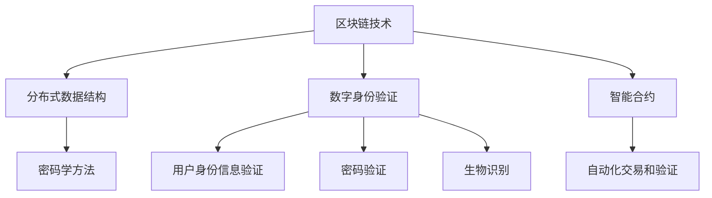

                 

### 引言：区块链技术与数字身份验证

区块链技术，作为近年来崛起的一项革命性技术，以其去中心化、不可篡改和透明性等特性，引起了全球范围内的广泛关注。而数字身份验证，作为信息安全领域的关键环节，旨在确保在线交互的安全性和隐私保护。这两者的结合，为解决数字身份管理中的难题提供了新的思路和解决方案。

**背景介绍：**

传统数字身份验证系统通常依赖于中心化的机构，如银行、认证机构等，进行用户身份的认证和验证。然而，这种中心化的架构容易受到单点故障、隐私泄露和信任危机等问题的影响。随着互联网的普及和数字化进程的加速，用户对于安全、便捷的数字身份验证需求日益增加。

区块链技术，作为一种分布式账本技术，具有去中心化、不可篡改和透明等特点。这些特性使得区块链技术在数字身份验证中具有巨大的应用潜力。通过将数字身份信息存储在区块链上，可以实现更加安全、高效和可靠的数字身份验证。

**核心概念与联系：**

在探讨区块链技术在数字身份验证中的应用之前，我们需要理解几个核心概念：

1. **区块链技术：** 区块链是一种分布式数据结构，由一系列按时间顺序排列的区块组成。每个区块都包含一定数量的交易信息，并通过密码学方法保证数据的不可篡改性和安全性。

2. **数字身份：** 数字身份是指个体在数字世界中的身份表示，通常包括姓名、证件号码、电子邮件等个人信息。

3. **数字身份验证：** 数字身份验证是一种确认数字身份真实性的过程，通常涉及用户身份信息的验证、密码验证、生物识别等手段。

4. **智能合约：** 智能合约是区块链上可自动执行的合约，通过编程逻辑实现自动化交易和验证。

为了更直观地展示这些概念之间的关系，我们可以使用Mermaid流程图来描述：



通过上述流程图，我们可以清晰地看到区块链技术、数字身份和数字身份验证之间的紧密联系。区块链技术为数字身份验证提供了安全、透明和去中心化的基础，而智能合约则实现了自动化和高效的身份验证过程。

接下来，我们将进一步探讨区块链技术在数字身份验证中的具体应用，以及这些应用如何解决传统身份验证系统中的问题。在下一章节中，我们将深入探讨区块链技术的基础知识，为理解其应用提供必要的背景知识。

### 关键词

- **区块链技术**
- **数字身份验证**
- **分布式账本**
- **智能合约**
- **去中心化**
- **隐私保护**

### 摘要

本文主要探讨了区块链技术在数字身份验证中的应用及其创新性。通过引入区块链技术，我们可以实现更加安全、高效和可靠的数字身份验证。本文首先介绍了区块链技术和数字身份验证的基本概念，并使用Mermaid流程图展示了它们之间的核心联系。接着，本文详细分析了区块链在数字身份验证中的具体应用，包括身份认证、数据管理和隐私保护等方面。最后，本文通过案例分析展示了区块链技术在数字身份验证中的成功应用，并探讨了其面临的挑战和未来发展趋势。通过本文的阅读，读者将深入理解区块链技术在数字身份验证中的创新性，以及如何利用这项技术提升数字身份验证的安全性。

### 第1章：引言：区块链技术与数字身份验证

#### 1.1 区块链技术简介

区块链技术，作为一种分布式账本技术，自2008年中本聪（Satoshi Nakamoto）首次提出以来，已经引起了全球范围内的广泛关注。区块链的核心思想是通过去中心化的方式，实现数据的可靠存储和传输。每一个区块链网络都由多个节点组成，每个节点都存储着一份完整的区块链副本。这些节点通过共识算法，共同维护区块链的完整性和一致性。

**去中心化：** 区块链的去中心化特性是其最显著的特点之一。在传统的中心化系统中，所有数据都存储在一个中央服务器上，一旦该服务器出现故障或遭到攻击，整个系统可能会瘫痪。而在区块链中，数据分散存储在各个节点上，任何一个节点的故障都不会影响整个系统的运行。这种去中心化的结构大大提高了系统的可靠性和容错性。

**不可篡改：** 区块链通过密码学方法确保数据的不可篡改性。一旦数据被记录在区块链上，就几乎不可能被篡改或删除。这是由于区块链的每个区块都通过哈希函数与前一个区块链接起来，形成一条链状结构。任何对数据的篡改都会导致链的破坏，从而被其他节点检测并拒绝。

**透明性：** 区块链的透明性意味着所有参与节点都可以查看和验证区块链上的数据。这种透明性不仅提高了数据的可信度，也为用户提供了更多的信任。

**智能合约：** 智能合约是一种自动执行的合同，它可以基于区块链进行编程和执行。智能合约通过预先设定的条件和规则，自动执行合同条款，从而避免了人为干预和欺诈行为。

**基本架构：**

区块链的基本架构包括以下几个关键组成部分：

1. **区块（Block）：** 区块是区块链的基本单位，包含一定数量的交易记录。每个区块都有一个唯一的标识符，称为哈希值，该哈希值由区块内的所有交易数据和前一个区块的哈希值通过哈希函数计算得出。

2. **链（Chain）：** 区块链是由一系列按时间顺序排列的区块组成。每个新产生的区块都通过哈希函数与前一个区块链接起来，形成一个连续的链状结构。

3. **节点（Node）：** 节点是区块链网络中的基本单元，每个节点都存储着一份完整的区块链副本。节点通过共识算法，共同维护区块链的完整性和一致性。

4. **共识算法：** 共识算法是区块链网络中节点之间达成一致的方式。常见的共识算法包括工作量证明（PoW）、权益证明（PoS）和委托权益证明（DPoS）等。

5. **网络（Network）：** 区块链网络是由多个节点组成的分布式网络。节点通过P2P协议进行通信，共享区块链上的数据。

通过理解区块链技术的基本架构和工作原理，我们可以更好地理解其在数字身份验证中的应用潜力。在下一节中，我们将进一步探讨数字身份验证的基础知识，以及区块链如何解决传统身份验证系统中的问题。

#### 1.2 数字身份验证简介

数字身份验证是指通过一定的技术和手段，验证用户在数字世界中的身份真实性和合法性。在互联网和数字技术的迅猛发展背景下，数字身份验证已成为保障信息安全、确保在线交易和提供服务的重要环节。数字身份验证的方法多样，主要包括以下几种：

**密码验证：** 密码验证是最常见的数字身份验证方法之一。用户通过设置并记住一个密码，来证明其身份的合法性。密码通常包括字母、数字和特殊字符，具有一定的复杂度，以防止被轻易破解。

**生物识别：** 生物识别技术利用人体独有的生物特征进行身份验证，包括指纹、虹膜、面部识别等。生物识别技术具有高准确性和高效性，但也存在隐私保护和安全性问题。

**双因素认证：** 双因素认证（Two-Factor Authentication, 2FA）是一种结合两种或多种验证方法的身份验证机制。常见的双因素认证包括密码加短信验证码、密码加指纹验证等。双因素认证能够大大提高账户的安全性。

**数字证书：** 数字证书是由可信第三方机构颁发的电子文档，用于证明用户的数字身份。数字证书通常包含用户的公钥和私钥，用户在访问受保护的资源时，需要提供数字证书进行身份验证。

**数字身份管理：** 数字身份管理是一种综合性的身份验证方法，通过集中管理用户的数字身份信息，确保其真实性和合法性。数字身份管理包括身份注册、身份验证、身份授权等环节，旨在实现高效、安全和可靠的数字身份验证。

**传统数字身份验证系统的挑战：**

尽管数字身份验证方法多样，但传统数字身份验证系统仍面临一些挑战：

**单点故障：** 传统身份验证系统通常依赖于中心化的机构进行身份验证，一旦中心化机构出现故障或遭受攻击，整个系统可能会瘫痪。

**隐私泄露：** 传统身份验证系统在处理用户身份信息时，容易发生隐私泄露风险。尤其是在用户密码、生物识别数据等敏感信息泄露后，可能会导致严重的后果。

**信任危机：** 中心化的身份验证系统容易受到信任危机的影响。用户对中心化机构的信任一旦动摇，可能会选择放弃使用这些服务。

**效率问题：** 传统身份验证系统在处理大量用户身份验证请求时，容易产生效率问题，导致用户等待时间过长，影响用户体验。

在下一节中，我们将探讨区块链技术在数字身份验证中的应用，分析其如何解决传统身份验证系统中的问题。

#### 1.3 区块链与数字身份验证的结合

区块链技术在数字身份验证中的应用，为解决传统系统中的挑战提供了新的思路和解决方案。区块链的去中心化、不可篡改和透明性等特点，使得其在数字身份验证中具有巨大的应用潜力。

**去中心化身份验证：**

区块链的去中心化特性，使得数字身份验证不再依赖于中心化的机构。用户可以在区块链上自行注册和管理自己的数字身份，从而避免了单点故障和信任危机的问题。每个用户都拥有自己的数字身份和私钥，可以通过私钥对数字身份进行验证，确保身份的真实性和唯一性。

**不可篡改的身份信息：**

区块链通过密码学方法确保数据的不可篡改性，这意味着一旦用户的数字身份信息被记录在区块链上，就几乎不可能被篡改或删除。这种不可篡改性确保了用户身份信息的完整性和安全性，防止了隐私泄露和数据篡改的风险。

**透明和可信的身份验证：**

区块链的透明性使得所有参与节点都可以查看和验证区块链上的数据，包括用户的身份信息。这种透明性提高了身份验证的信任度，用户可以清楚地了解自己的身份信息是如何被验证和管理的，从而增强了用户对数字身份验证系统的信任。

**智能合约的应用：**

智能合约是一种自动执行的合同，可以基于区块链进行编程和执行。在数字身份验证中，智能合约可以用于自动化身份验证过程。例如，当用户进行身份验证时，智能合约可以自动验证用户的身份信息，并执行相应的身份验证逻辑，从而大大提高了验证的效率。

**隐私保护：**

区块链的隐私保护特性，使得用户的身份信息可以在不暴露真实身份的情况下进行验证。通过零知识证明（Zero-Knowledge Proof）等隐私保护技术，用户可以在不泄露敏感信息的情况下，证明自己的身份合法性。

**去中心化的身份管理：**

区块链技术允许用户自行管理和控制自己的数字身份信息，从而实现去中心化的身份管理。用户可以在区块链上创建和管理自己的身份信息，无需依赖于中心化的机构，从而提高了身份管理的灵活性和自主性。

**案例分析：**

以某个区块链身份验证平台为例，该平台使用区块链技术来实现去中心化的身份验证。用户可以在平台上注册自己的数字身份，并使用私钥对身份信息进行加密存储。在进行身份验证时，用户只需提供身份信息和私钥，平台通过智能合约自动验证用户身份，确保验证过程透明、高效和安全。

**总结：**

通过将区块链技术与数字身份验证相结合，我们可以实现更加安全、高效和可靠的数字身份验证。区块链的去中心化、不可篡改和透明性等特点，为解决传统身份验证系统中的问题提供了新的思路和解决方案。在下一章中，我们将深入探讨区块链技术在数字身份验证中的具体应用，分析其如何解决传统身份验证系统中的挑战。

### 第2章：区块链技术基础

#### 2.1 区块链的基本架构

区块链技术作为一种分布式账本技术，其基本架构由多个关键组件构成，这些组件共同协作，确保区块链系统的稳定运行。理解这些基本组件和它们之间的相互关系，对于深入探讨区块链技术在数字身份验证中的应用至关重要。

**区块链网络：**

区块链网络是由多个节点组成的分布式网络。每个节点都是区块链系统的一个参与方，它们共同维护区块链的完整性和一致性。节点之间通过P2P（Peer-to-Peer）协议进行通信，共享区块链上的数据和交易信息。在区块链网络中，节点既可以作为交易参与者，也可以作为区块链的维护者。

**区块（Block）：**

区块是区块链的基本单元，包含一定数量的交易记录。每个区块都有一个唯一的标识符，称为区块头（Block Header），其中包括区块的版本号、上一区块的哈希值、时间戳、Merkle 树根哈希等。区块的内容是通过Merkle树结构组织的一组交易记录，这种结构确保了区块内容的高效和安全性。

**链（Chain）：**

区块链是由一系列按时间顺序排列的区块组成的。每个新产生的区块都通过哈希函数与前一个区块链接起来，形成一条连续的链状结构。这种链状结构使得区块链具有高度的不可篡改性，因为任何对区块内容的篡改都会破坏整个链的结构，从而被其他节点检测并拒绝。

**节点（Node）：**

节点是区块链网络中的基本单元，负责存储和验证区块链上的数据。每个节点都拥有一个完整的区块链副本，并通过P2P协议与其他节点进行通信。节点的主要功能包括：接收和验证交易、创建新区块、将新区块传播给其他节点、参与共识算法等。

**共识算法：**

共识算法是区块链网络中节点之间达成一致的方式。常见的共识算法包括工作量证明（PoW）、权益证明（PoS）、委托权益证明（DPoS）等。这些算法通过一系列复杂的数学计算和逻辑判断，确保区块链数据的完整性和一致性。共识算法的核心目标是防止双花攻击（Double Spending），即同一笔资金被多次消费。

**网络（Network）：**

区块链网络是由多个节点组成的分布式网络。节点通过P2P协议进行通信，共享区块链上的数据和交易信息。区块链网络的去中心化特性，使得数据存储和验证过程分散在不同的节点上，从而提高了系统的可靠性和安全性。

**智能合约（Smart Contract）：**

智能合约是一种自动执行的合同，基于区块链技术实现。智能合约通过预先设定的条件和规则，自动执行合同条款，从而避免了人为干预和欺诈行为。智能合约在区块链上的执行过程是透明和不可篡改的，用户可以随时查看和验证智能合约的执行情况。

通过理解区块链的基本架构，我们可以看到，区块链技术通过分布式网络、节点、区块、链、共识算法和智能合约等组件的协作，实现了一种去中心化、不可篡改和透明的高效数据存储和验证系统。这些基本组件和原理，为区块链技术在数字身份验证中的应用提供了坚实的基础。

#### 2.2 区块链的共识算法

共识算法是区块链技术的核心组成部分，它决定了区块链网络中节点如何达成一致，确保数据的一致性和安全性。共识算法的目的是解决分布式系统中常见的问题，如数据一致性、防双花攻击（Double Spending）和节点间的协调。以下是几种常见的共识算法：

**工作量证明（Proof of Work, PoW）**

工作量证明是最早的共识算法之一，由中本聪在比特币中提出。PoW算法的核心思想是通过计算大量随机数值（ nonce ）来找到满足特定条件的解。找到解的节点将获得区块奖励，并将新区块添加到区块链上。

**工作证明的过程：**
1. 节点接收到交易信息，生成待验证的交易数据。
2. 节点开始计算随机数值（ nonce ），将 nonce 与交易数据和前一个区块的哈希值一起通过哈希函数计算，得到一个新的哈希值。
3. 节点不断尝试不同的 nonce ，直到找到一个满足特定条件的哈希值（通常是以0开头的多个零），这个过程称为“挖矿”。
4. 找到合适哈希值的节点将生成一个新区块，并将该区块广播给其他节点。
5. 其他节点验证新区块的合法性，包括交易的有效性和哈希值是否符合条件。
6. 一旦新区块被网络中的大多数节点验证通过，它将被添加到区块链上。

**优缺点：**
- **优点：** PoW算法简单易实现，具有较高的安全性，防止了51%攻击。
- **缺点：** 挖矿过程消耗大量计算资源，可能导致能源浪费，且随着计算能力的提升，挖矿难度不断增加。

**权益证明（Proof of Stake, PoS）**

权益证明是一种替代PoW的共识算法，其核心思想是节点根据其持有的币龄（Coin Age）和权益比例参与共识过程。币龄是指节点持有代币的时间，权益比例则根据币龄和持有代币的数量计算得出。

**权益证明的过程：**
1. 节点根据币龄和权益比例计算出一个随机数，作为选票。
2. 网络中的所有节点将选票汇总，根据权重（币龄和权益比例）进行排序。
3. 排在前面的节点将被选为下一个区块的验证者，生成新区块并添加到区块链上。
4. 验证者将获得区块奖励。

**优缺点：**
- **优点：** PoS算法相较于PoW消耗更少的资源，且避免了挖矿带来的能源浪费。
- **缺点：** PoS算法容易受到“富者愈富”的问题，即持有更多代币的节点有更大的验证机会，可能导致代币分配不均。

**委托权益证明（Delegated Proof of Stake, DPoS）**

委托权益证明是对PoS算法的改进，通过选举出一定数量的代理节点（Delegate）来代表其他节点进行共识验证。

**DPoS的过程：**
1. 节点持有代币并通过投票选择出一定数量的代理节点。
2. 代理节点根据其投票权重和代币数量进行排序，成为区块验证者。
3. 验证者按照排序顺序轮流生成区块并添加到区块链上。
4. 验证者将获得区块奖励。

**优缺点：**
- **优点：** DPoS算法提升了共识过程的效率，验证者可以更快地生成区块，提高了区块链的处理能力。
- **缺点：** DPoS算法仍存在“富者愈富”的问题，且选举过程可能导致权力集中。

**混合共识算法（Hybrid Consensus Algorithm）**

混合共识算法将多种共识算法相结合，以利用各自算法的优点。例如，一个区块链系统可以同时使用PoW和PoS算法，通过PoW算法选择区块验证者，而通过PoS算法进行权益分配。

**优缺点：**
- **优点：** 混合共识算法可以在不同场景下提供灵活的共识选择，提高系统的安全性和效率。
- **缺点：** 算法复杂度增加，需要更多的资源和计算能力。

通过理解这些共识算法的工作原理和优缺点，我们可以更好地选择适合特定应用场景的共识算法，实现高效、安全、去中心化的区块链系统。

#### 2.3 智能合约原理

智能合约是一种自动执行的合同，通过编程逻辑实现特定的业务规则和条款，确保在满足条件时自动执行。智能合约的原理基于区块链技术，利用其去中心化、不可篡改和透明性等特点，为去中心化应用（DApps）和智能经济提供基础。以下将详细讲解智能合约的基本原理、编程语言和实现过程。

**基本原理：**

智能合约基于区块链的智能合约平台，如以太坊（Ethereum）、EOS等，它们提供了一种执行合约逻辑的虚拟机器。智能合约通常由两部分组成：代码和接口。代码部分定义了合约的逻辑，接口部分则提供与外部世界交互的接口。

1. **代码部分：** 智能合约的代码通常使用特定编程语言编写，如Solidity（以太坊智能合约开发语言）和C++（EOS智能合约开发语言）。代码部分定义了合约的函数、变量和事件等，实现了特定的业务逻辑。
   
2. **接口部分：** 智能合约的接口部分提供了与外部世界交互的方式，如接收交易、发送交易和调用其他合约等。通过这些接口，用户可以与智能合约进行交互，触发合约的执行。

**执行过程：**

智能合约的执行过程通常包括以下步骤：

1. **交易提交：** 用户通过区块链网络提交一个交易，交易中包含调用智能合约的函数和参数。
2. **交易验证：** 区块链网络中的节点接收并验证交易的有效性，包括检查调用权限、费用和合约代码等。
3. **合约执行：** 验证通过的交易将被合约代码解析并执行，根据输入参数和合约逻辑进行相应的操作。
4. **结果记录：** 合同执行的结果将被记录在区块链上，包括状态变化和事件触发等。
5. **交易确认：** 新区块生成后，交易将被确认并永久记录在区块链上。

**编程语言：**

不同的智能合约平台支持不同的编程语言。以下是几种主要的智能合约编程语言：

1. **Solidity：** Solidity 是以太坊智能合约开发的主要语言，它是一种面向对象的高级编程语言，易于理解和编写。
   
2. **Vyper：** Vyper 是用于以太坊智能合约的一种安全编程语言，它强调简洁性和安全性，旨在减少智能合约中的漏洞。

3. **C++：** C++ 是EOS智能合约平台的主要编程语言，它是一种高效的低级编程语言，适用于复杂的智能合约开发。

**实现过程：**

智能合约的实现过程通常包括以下步骤：

1. **需求分析：** 分析智能合约的业务逻辑和功能需求，确定合约的关键功能和性能要求。
2. **设计合约：** 根据需求分析，设计智能合约的架构和接口，定义合约的函数和变量等。
3. **编写代码：** 使用选定的编程语言编写智能合约代码，实现业务逻辑和功能。
4. **测试合约：** 在测试环境中对智能合约进行测试，包括单元测试、集成测试和性能测试等。
5. **部署合约：** 将测试通过的智能合约部署到区块链网络上，包括设置合约地址和权限等。
6. **维护合约：** 部署后，根据业务需求和技术更新，持续维护和优化智能合约。

通过理解智能合约的基本原理和编程过程，我们可以更好地利用区块链技术实现自动执行的业务逻辑，提升系统的透明性和安全性。

### 第3章：数字身份验证基础

#### 3.1 数字身份的概念

数字身份是指个体在数字世界中的身份表示，它通过一系列电子化的信息和标识符来确认和识别用户的身份。数字身份不仅包括个人的基本信息，如姓名、身份证号码、电子邮件地址等，还包括用户在特定平台或服务中的身份信息，如用户名、账户ID等。

**数字身份的重要性：**

在互联网时代，数字身份的重要性日益凸显。首先，数字身份是用户访问和交互各种在线服务的基础，如电子邮件、社交媒体、在线购物等。其次，数字身份的准确性和安全性直接关系到用户的数据隐私和安全。一旦数字身份被篡改或盗用，用户可能会遭受财产损失、隐私泄露等严重后果。

**数字身份的组成部分：**

数字身份通常由以下几个部分组成：

1. **个人基本信息：** 包括姓名、身份证号码、出生日期、性别、联系方式等基本信息。
2. **身份验证信息：** 如密码、双因素认证、生物识别信息（指纹、虹膜、面部识别等）。
3. **电子证书：** 由权威机构颁发的数字证书，用于证明用户的身份。
4. **社交信息：** 如社交媒体账号、好友关系、互动记录等。
5. **行为数据：** 如浏览记录、购物行为、支付记录等，这些数据可以帮助构建用户的行为特征。

**数字身份的特点：**

1. **唯一性：** 每个数字身份都是独一无二的，用于唯一识别一个用户。
2. **可验证性：** 数字身份需要通过各种验证手段（如密码、证书等）来确认其有效性。
3. **便携性：** 数字身份可以在不同平台和服务中共享和验证，便于用户跨平台使用。
4. **安全性：** 数字身份需要采取各种安全措施（如加密、身份验证等）来保护用户的隐私和安全。

#### 3.2 数字身份验证的方法

数字身份验证是指通过一系列技术手段，验证用户在数字世界中的身份真实性和合法性。数字身份验证的方法多种多样，主要包括以下几种：

**密码验证：**

密码验证是最常见的数字身份验证方法之一。用户通过设置并记住一个密码，来证明其身份的合法性。密码通常包括字母、数字和特殊字符，具有一定的复杂度，以防止被轻易破解。密码验证的优点是简单易用，但缺点是安全性较低，容易受到暴力破解、字典攻击等攻击方式的影响。

**双因素认证（2FA）：**

双因素认证是一种结合两种或多种验证方法的身份验证机制，以提高账户的安全性。常见的双因素认证包括密码加短信验证码、密码加指纹验证等。双因素认证通过增加额外的验证步骤，确保即使密码被泄露，账户也无法被未经授权的用户访问。

**生物识别：**

生物识别技术利用人体独有的生物特征进行身份验证，包括指纹、虹膜、面部识别等。生物识别技术的优点是高准确性和高效性，但缺点是成本较高，且需要特定的硬件设备支持。

**电子证书：**

电子证书是由权威机构颁发的电子文档，用于证明用户的身份。电子证书通常包含用户的公钥和私钥，用户在访问受保护的资源时，需要提供电子证书进行身份验证。电子证书的优点是具有较高的安全性和可信度，但缺点是使用较为复杂，需要特定的软件支持。

**数字签名：**

数字签名是一种利用公钥加密技术，验证数据发送者的身份和数据的完整性的方法。发送者在发送数据时，使用自己的私钥对数据进行签名，接收者使用发送者的公钥验证签名的有效性。数字签名的优点是具有较高的安全性和不可篡改性，但缺点是操作复杂，对硬件和软件环境有较高要求。

**数字身份管理：**

数字身份管理是一种综合性的身份验证方法，通过集中管理用户的数字身份信息，确保其真实性和合法性。数字身份管理包括身份注册、身份验证、身份授权等环节，旨在实现高效、安全和可靠的数字身份验证。

**其他验证方法：**

除了上述常见的数字身份验证方法外，还有一些其他的方法，如智能卡、令牌、一次性密码等。这些方法各有优缺点，适用于不同的应用场景。

通过理解数字身份验证的方法和特点，我们可以更好地选择适合自身需求的身份验证手段，提高数字身份验证的安全性和可靠性。

#### 3.3 数字身份管理

数字身份管理（Digital Identity Management, DIM）是指对用户数字身份的创建、验证、授权和监控过程进行管理的体系。数字身份管理不仅涉及技术层面，还包括政策和流程设计。以下将详细探讨数字身份管理的各个环节和关键要素。

**数字身份注册：**

数字身份注册是数字身份管理的第一步，即用户在数字平台或服务上创建和验证其数字身份。注册过程通常包括以下几个步骤：

1. **收集基本信息：** 用户需要提供如姓名、身份证号码、电子邮件等基本信息。
2. **身份验证：** 通过密码、双因素认证（2FA）、电子证书或生物识别技术等方法验证用户身份。
3. **创建账户：** 系统根据用户提供的信息创建数字身份，并将其与用户关联。

**身份验证：**

身份验证是确保用户数字身份真实性的过程。常见的身份验证方法包括：

1. **单因素认证：** 如密码、电子证书等。
2. **双因素认证（2FA）：** 结合密码和短信验证码、指纹、面部识别等。
3. **多因素认证：** 结合多种验证手段，如密码、电子证书和生物识别等。

**身份授权：**

身份授权是数字身份管理的重要环节，涉及用户权限的分配和监控。授权过程包括：

1. **角色分配：** 根据用户角色和职责，分配相应的权限。
2. **权限管理：** 实时监控用户权限的使用情况，确保权限的合理性和安全性。
3. **访问控制：** 使用访问控制列表（ACL）或角色基础访问控制（RBAC）等技术实现权限管理。

**身份监控与审计：**

数字身份管理需要实时监控用户身份和行为，以发现潜在的安全风险。监控过程包括：

1. **行为分析：** 对用户行为进行分析，识别异常行为。
2. **日志记录：** 记录用户身份验证、权限分配、访问日志等，以便后续审计。
3. **安全审计：** 定期进行安全审计，确保数字身份管理的合规性和安全性。

**隐私保护：**

数字身份管理涉及大量用户隐私信息，因此隐私保护至关重要。隐私保护措施包括：

1. **数据加密：** 使用加密技术保护用户数据的机密性。
2. **匿名化处理：** 对用户敏感信息进行匿名化处理，降低隐私泄露风险。
3. **隐私政策：** 制定明确的隐私政策，告知用户其个人信息的使用和保护方式。

**数字身份管理工具和技术：**

数字身份管理需要借助一系列工具和技术，包括：

1. **身份验证系统：** 用于实现身份验证功能，如密码管理、2FA、生物识别等。
2. **身份管理平台：** 用于集中管理用户身份信息，包括注册、验证、授权和监控等。
3. **身份认证协议：** 如OAuth、OpenID Connect等，用于实现跨平台身份验证和授权。
4. **加密技术：** 用于保护用户数据的机密性和完整性。

通过数字身份管理，我们可以确保用户数字身份的真实性、安全性和可靠性，为在线服务提供强有力的保障。

### 第4章：区块链技术在数字身份验证中的应用

#### 4.1 区块链在身份认证中的应用

区块链技术在数字身份验证中的应用，首先体现在身份认证方面。区块链的不可篡改性和分布式特性，使得身份认证过程变得更加安全、透明和可靠。

**去中心化身份认证：**

传统的身份认证系统通常依赖于中心化的认证机构，如银行、认证中心等。一旦这些中心化机构遭受攻击或出现故障，整个系统可能会瘫痪。区块链的去中心化特性，使得身份认证不再依赖于单一中心化机构。用户可以在区块链上自行注册和管理自己的数字身份，每个节点都存储了一份完整的身份认证记录，确保系统的容错性和安全性。

**不可篡改的身份记录：**

区块链通过密码学方法确保数据的不可篡改性。一旦用户在区块链上注册了身份信息，这些信息将被永久记录，且无法被篡改或删除。这意味着用户的身份记录是可信的，任何试图篡改这些记录的行为都会被发现并拒绝。

**透明和可验证的身份认证过程：**

区块链的透明性允许所有节点查看和验证区块链上的数据。用户可以在区块链上查询自己的身份认证记录，确保认证过程是透明的。此外，其他节点也可以验证这些记录的真实性，增强了身份认证的可信度。

**智能合约实现自动化认证：**

智能合约在区块链上可以实现自动化交易和验证。通过编写智能合约，可以在用户身份验证过程中自动执行一系列验证逻辑，如密码验证、双因素认证等。智能合约确保了身份认证过程的自动化和高效性，减少了人为干预和错误。

**案例：**

一个实际案例是身份认证平台OneName，它利用区块链技术实现了去中心化的身份认证。用户在OneName平台上注册身份信息，并使用私钥对身份信息进行加密存储。当用户需要验证身份时，系统通过智能合约自动执行验证逻辑，确保认证过程高效、安全。

#### 4.2 区块链在身份数据管理中的应用

区块链技术在身份数据管理中的应用，旨在解决传统身份数据管理中的隐私泄露、数据一致性和安全性问题。

**隐私保护：**

区块链的隐私保护特性，通过零知识证明（Zero-Knowledge Proof）等技术，允许用户在不暴露真实身份的情况下证明自己的身份合法性。这意味着用户的隐私信息可以在不泄露的情况下进行验证，有效保护了用户隐私。

**数据一致性：**

传统身份数据管理中，数据的一致性问题时常出现，如数据冗余、更新不及时等。区块链通过分布式账本技术，确保了身份数据的一致性。每个节点都存储了一份完整的身份数据副本，并通过共识算法保持数据的一致性，避免了数据不一致的问题。

**安全性：**

区块链通过密码学方法确保身份数据的安全性。一旦用户身份数据被记录在区块链上，就几乎不可能被篡改或删除。此外，区块链的去中心化特性，使得身份数据的存储和验证过程分散在不同的节点上，提高了系统的安全性。

**案例：**

一个实际案例是身份数据管理平台Decentralized Identity Foundation（DIF），它利用区块链技术实现了去中心化的身份数据管理。用户可以在DIF平台上创建和管理自己的身份数据，并通过零知识证明技术保护隐私。平台还通过智能合约实现身份数据的自动化管理和验证。

#### 4.3 区块链在隐私保护中的应用

区块链技术在隐私保护中的应用，主要体现在以下几个方面：

**隐私保护机制：**

区块链通过密码学方法，如零知识证明（Zero-Knowledge Proof）、同态加密（Homomorphic Encryption）等，实现了对用户隐私的保护。这些技术允许用户在不暴露真实身份和隐私信息的情况下，证明自己的身份和信息的合法性。

**匿名交易：**

区块链上的某些加密货币，如Monero和Zcash，实现了匿名交易。匿名交易通过将交易信息与真实身份隔离，有效保护了交易双方的隐私。

**隐私保护协议：**

区块链上的隐私保护协议，如Zcash的Sapling协议，通过改进区块链的结构和算法，提高了交易隐私保护水平。这些协议确保了用户交易信息的保密性，防止了第三方追踪和分析。

**案例：**

一个实际案例是隐私保护平台Zcash，它利用零知识证明技术实现了高度隐私保护的交易。用户在进行交易时，可以使用零知识证明技术证明交易的合法性，而不必暴露自己的身份和交易金额。

#### 4.4 区块链在数字身份验证中的综合应用

区块链技术在数字身份验证中的应用，不仅体现在身份认证、数据管理和隐私保护等方面，还通过智能合约实现了身份验证过程的自动化和高效化。

**自动化身份验证：**

智能合约在区块链上实现了自动化交易和验证。通过编写智能合约，可以自动执行身份验证逻辑，如密码验证、双因素认证等，减少了人工干预，提高了验证效率。

**高效身份验证：**

区块链的分布式账本技术，确保了身份验证的高效性。用户只需提供身份信息和私钥，智能合约即可自动验证用户身份，确保验证过程快速、准确。

**透明和可信的身份验证：**

区块链的透明性，使得身份验证过程对所有节点可见。用户可以清楚地了解自己的身份验证过程和结果，增强了身份验证的信任度。

**案例：**

一个实际案例是身份验证平台SelfKey，它利用区块链技术实现了自动化和高效的身份验证。用户在SelfKey平台上注册身份信息，并通过智能合约自动验证身份。平台还提供了多种身份认证方法，如密码、双因素认证、电子证书等，确保身份验证过程安全、可靠。

### 总结

区块链技术在数字身份验证中的应用，通过去中心化、不可篡改和透明性等特点，解决了传统身份验证系统中的隐私泄露、数据一致性和安全性问题。通过身份认证、数据管理和隐私保护等方面的应用，区块链技术为数字身份验证提供了更加安全、高效和可靠的解决方案。随着区块链技术的不断发展和成熟，其在数字身份验证中的应用将更加广泛和深入。

### 第5章：案例分析：区块链技术在数字身份验证中的成功应用

在本章中，我们将探讨几个实际案例，分析区块链技术在数字身份验证中的成功应用。这些案例涵盖了不同的行业和场景，展示了区块链技术如何为数字身份验证提供创新的解决方案。

#### 5.1 案例一：身份认证平台OneName

OneName是一个基于区块链的身份认证平台，旨在提供去中心化的身份验证服务。用户可以在OneName上注册和管理自己的数字身份，使用私钥对身份信息进行加密存储。当用户需要验证身份时，系统通过智能合约自动执行验证逻辑，确保验证过程高效、安全。

**案例分析：**
- **去中心化身份验证：** OneName去除了传统中心化身份认证机构的依赖，用户可以在区块链上自行注册和管理身份信息，提高了系统的安全性和可靠性。
- **不可篡改性：** 用户身份信息一旦在区块链上注册，就几乎无法被篡改或删除，确保了数据的真实性和可信度。
- **智能合约实现自动化验证：** OneName利用智能合约实现身份验证过程的自动化，简化了用户操作，提高了验证效率。

**应用场景：**
- **在线服务提供商：** 金融机构、电子商务平台等在线服务提供商，可以使用OneName提供的去中心化身份认证服务，提高用户认证的安全性和便捷性。
- **公共部门：** 政府机构可以利用OneName进行身份认证，实现高效、安全的公共服务。

#### 5.2 案例二：电子健康档案平台MedRec

MedRec是基于区块链的电子健康档案平台，旨在提供一个安全、可靠的健康数据存储和管理系统。用户可以在MedRec上创建和管理自己的电子健康档案，医生和医疗机构可以方便地访问和更新这些数据。

**案例分析：**
- **隐私保护：** MedRec利用区块链技术实现了健康数据的隐私保护，用户可以使用零知识证明等技术在不暴露真实身份的情况下证明自己的健康数据合法性。
- **数据一致性：** 区块链分布式账本技术确保了健康数据的一致性，医生和医疗机构可以访问和更新最新的健康数据。
- **透明和可信：** 健康数据在区块链上透明可见，用户可以查看自己的健康数据记录，确保数据真实性和可信度。

**应用场景：**
- **医疗服务：** 医疗机构可以利用MedRec平台进行电子健康档案的管理，提高医疗服务质量和效率。
- **健康管理：** 用户可以方便地管理自己的健康数据，实现个性化健康管理和预测。

#### 5.3 案例三：供应链管理平台Provenance

Provenance是一个基于区块链的供应链管理平台，旨在提供透明、可信的供应链数据管理解决方案。供应商、制造商和零售商可以在Provenance上记录和管理供应链数据，确保产品的来源和真实性。

**案例分析：**
- **透明性：** Provenance利用区块链技术实现了供应链数据的透明性，所有参与者都可以查看和验证供应链信息。
- **数据不可篡改性：** 区块链的分布式账本技术确保了供应链数据的不可篡改性，任何篡改行为都会被发现并拒绝。
- **智能合约实现自动化管理：** 通过智能合约，Provenance实现了供应链管理过程的自动化，提高了供应链效率和可靠性。

**应用场景：**
- **供应链管理：** 供应链各环节的参与方可以利用Provenance平台实现供应链数据的透明、可信管理，提高供应链的可追溯性和可靠性。
- **产品质量监控：** 通过Provenance平台，用户可以追踪产品的来源和生产过程，确保产品质量。

#### 5.4 案例四：数字身份认证平台SelfKey

SelfKey是一个基于区块链的数字身份认证平台，旨在提供一站式身份认证和管理解决方案。用户可以在SelfKey上注册、验证和管理自己的数字身份，实现跨平台的高效身份认证。

**案例分析：**
- **一站式身份认证：** SelfKey提供了多种身份认证方法，如密码、双因素认证、电子证书等，用户可以根据需求选择合适的认证方式。
- **智能合约实现自动化验证：** 通过智能合约，SelfKey实现了身份认证过程的自动化，提高了认证效率和用户体验。
- **隐私保护：** SelfKey利用区块链技术实现了用户隐私保护，用户可以在不暴露真实身份的情况下证明自己的身份合法性。

**应用场景：**
- **在线服务提供商：** 自我身份认证平台SelfKey可以为在线服务提供商提供高效、安全的身份认证服务，提高用户信任度和满意度。
- **跨境服务：** SelfKey的跨境身份认证功能，有助于简化跨国业务流程，提高跨境服务的效率。

#### 5.5 案例五：数字资产交易平台OpenNode

OpenNode是一个基于区块链的数字资产交易平台，旨在提供安全、高效的数字资产交易服务。用户可以在OpenNode上进行数字资产交易、充值和提现。

**案例分析：**
- **安全性：** OpenNode利用区块链技术确保数字资产交易的安全性和透明性，任何交易记录都不可篡改，用户资产安全得到保障。
- **高效性：** 区块链的去中心化特性提高了交易效率，用户可以快速进行数字资产交易。
- **智能合约实现自动化交易：** 通过智能合约，OpenNode实现了交易过程的自动化，简化了用户操作，提高了交易效率。

**应用场景：**
- **数字资产交易：** OpenNode可以为用户提供高效、安全的数字资产交易平台，满足数字资产交易需求。
- **金融创新：** OpenNode的数字资产交易功能，有助于推动金融创新，拓展数字资产应用场景。

通过这些案例分析，我们可以看到区块链技术在数字身份验证中的广泛应用和成功应用。区块链技术通过去中心化、不可篡改和透明性等特点，为数字身份验证提供了安全、高效和可靠的解决方案，推动了数字身份验证领域的创新发展。

### 第6章：区块链技术在数字身份验证中的挑战与未来趋势

#### 6.1 挑战分析

尽管区块链技术在数字身份验证中展现了巨大的潜力，但在实际应用过程中仍面临一系列挑战：

**1. 技术复杂性：**

区块链技术本身具有一定的复杂性，涉及密码学、共识算法、智能合约等多个技术领域。这要求开发者和维护者具备较高的技术素养，增加了开发和维护的难度。

**2. 安全性问题：**

区块链技术虽然具有去中心化和不可篡改的特性，但并非完全安全。例如，51%攻击、智能合约漏洞等安全问题仍然存在，可能对区块链系统的安全性和完整性造成威胁。

**3. 规模可扩展性：**

区块链技术的规模可扩展性是一个重大挑战。现有的区块链网络在处理大量交易时，可能面临性能瓶颈，无法满足高并发交易需求。这限制了区块链技术在某些高流量场景下的应用。

**4. 法规和监管问题：**

区块链技术在数字身份验证中的应用仍面临法律和监管挑战。不同国家和地区的法律法规对区块链技术的监管存在差异，可能导致应用困难。同时，隐私保护和数据保护等法律问题也需要在区块链应用中加以考虑。

**5. 用户接受度：**

区块链技术的普及和用户接受度仍需提高。许多用户对区块链技术不了解，对其安全性、可靠性存在疑虑，这可能阻碍区块链技术在数字身份验证中的广泛应用。

#### 6.2 技术发展趋势

为了克服上述挑战，区块链技术正朝着以下几个方向发展：

**1. 共识算法优化：**

研究人员和开发者正在不断优化共识算法，以提高区块链网络的性能和安全性。例如，股权证明（PoS）和委托权益证明（DPoS）等算法在提高交易效率方面展现了潜力。

**2. 跨链技术：**

跨链技术旨在实现不同区块链之间的互操作性和数据共享。通过跨链技术，可以实现区块链网络之间的价值传递和数据交换，提高区块链生态系统的整体效率。

**3. 加密技术和隐私保护：**

随着对隐私保护需求的增加，加密技术和隐私保护技术（如零知识证明、同态加密等）在区块链中的应用逐渐增多。这些技术有助于提高区块链系统的隐私保护水平，满足用户对数据安全的期望。

**4. 规范化和标准化：**

区块链技术的规范化和标准化工作正在逐步推进。国际和国内的标准化组织正在制定一系列标准和法规，为区块链技术的应用提供法律和监管框架。

**5. 智能合约平台进化：**

智能合约平台正朝着更智能、更灵活的方向发展。新的智能合约平台不仅支持更复杂的编程语言和合约逻辑，还提供更丰富的功能，如状态通道、去中心化金融（DeFi）等。

#### 6.3 未来前景

展望未来，区块链技术在数字身份验证中的应用前景广阔：

**1. 高度安全：**

区块链技术通过去中心化和密码学方法，提供了高度安全的数字身份验证解决方案。随着技术的不断成熟，区块链在数字身份验证中的安全性能将进一步提高。

**2. 高效便捷：**

随着共识算法和智能合约技术的优化，区块链在数字身份验证中的应用将变得更加高效和便捷。用户可以方便地进行身份认证和数据处理，提升用户体验。

**3. 互操作性强：**

通过跨链技术和互操作协议，区块链可以实现不同平台和服务之间的无缝连接，为用户提供统一的数字身份验证服务。

**4. 法律和监管成熟：**

随着区块链技术的规范化和标准化，法律法规和监管框架将逐步完善，为区块链技术的应用提供更加清晰的法律环境。

**5. 普及和应用领域扩大：**

随着用户对区块链技术的了解和接受度提高，数字身份验证将成为区块链技术的重要应用领域。从金融、医疗到公共服务，区块链在数字身份验证中的应用将不断扩大。

总之，区块链技术在数字身份验证中的应用具有巨大的潜力。尽管面临一些挑战，但随着技术的不断发展和应用的深入，区块链将在数字身份验证中发挥越来越重要的作用，推动数字身份验证领域的创新和发展。

### 第7章：附录：区块链与数字身份验证相关资源

#### 7.1 核心概念与联系流程图

为了更直观地展示区块链与数字身份验证的核心概念及其联系，我们可以使用Mermaid流程图来描述。以下是一个简化的流程图，展示了区块链、数字身份验证、智能合约等核心概念之间的关系：


#### 7.2 核心算法原理讲解与伪代码

以下是区块链技术中几个核心算法的原理讲解和伪代码：

**1. 工作量证明（Proof of Work, PoW）**

工作量证明是比特币等区块链网络采用的共识算法，用于防止双花攻击。以下是其原理的伪代码：

```python
def pow_algorithm(target_difficulty, data):
    nonce = 0
    while True:
        hash_value = sha256(nonce + data)
        if hash_value <= target_difficulty:
            return nonce, hash_value
        nonce += 1
```

**2. 股权证明（Proof of Stake, PoS）**

股权证明是一种替代PoW的共识算法，根据节点持有的币龄和权益比例选择区块验证者。以下是其原理的伪代码：

```python
def pos_algorithm(stake_pool):
    sorted_stake = sort(stake_pool, key=lambda x: x['stake'])
    total_stake = sum([x['stake'] for x in sorted_stake])
    random_number = generate_random_number()
    selected_staker = select_staker(sorted_stake, random_number, total_stake)
    return selected_staker
```

**3. 智能合约（Smart Contract）**

智能合约是区块链上的自动执行合同，以下是一个简单的智能合约示例，用于存储和读取用户数据：

```solidity
pragma solidity ^0.8.0;

contract SimpleStorage {
    uint256 public storedData;

    function store(uint256 _data) public {
        storedData = _data;
    }

    function retrieve() public view returns (uint256) {
        return storedData;
    }
}
```

#### 7.3 数学模型与公式

以下是区块链和数字身份验证中涉及的一些重要数学模型和公式，使用LaTeX格式表示：

**1. 指数衰减函数（用于权益证明中的币龄计算）**

$$
coin_age = \alpha \cdot stake \cdot e^{-\beta \cdot time
```

**2. 拉格朗日插值公式（用于实现智能合约中的插值计算）**

$$
y(x) = y_1 \cdot \frac{(x - x_2)(x - x_3) \cdots (x - x_n)}{(x_1 - x_2)(x_1 - x_3) \cdots (x_1 - x_n)} + y_2 \cdot \frac{(x - x_1)(x - x_3) \cdots (x - x_n)}{(x_2 - x_1)(x_2 - x_3) \cdots (x_2 - x_n)} + \cdots + y_n \cdot \frac{(x - x_1)(x - x_2) \cdots (x - x_{n-1})}{(x_n - x_1)(x_n - x_2) \cdots (x_n - x_{n-1})}
```

**3. 哈希函数（用于确保区块链数据的完整性）**

$$
hash_value = sha256(message)
```

#### 7.4 项目实战案例

**1. 开发环境搭建**

为了搭建一个简单的区块链与数字身份验证项目，我们可以使用Python和Ethereum的Web3.py库。以下是环境搭建的步骤：

- 安装Python和Ethereum的Web3.py库：
  ```bash
  pip install python-ethereum
  ```

- 安装Geth节点（Ethereum客户端）：
  ```bash
  wget https://github.com/ethereum/go-ethereum/releases/download/v1.10.26/go-ethereum-linux-amd64-1.10.26.tar.gz
  tar xvfz go-ethereum-linux-amd64-1.10.26.tar.gz
  cd go-ethereum
  ./geth --datadir "./ethereum-data" --networkid 15 console
  ```

**2. 源代码详细实现**

以下是简单的区块链与数字身份验证项目的源代码实现：

```python
from web3 import Web3
from web3.middleware import geth_poa_middleware
import json

# 连接到本地Geth节点
w3 = Web3(Web3.HTTPProvider('http://127.0.0.1:8545'))
w3.middleware_onion.inject(geth_poa_middleware, layer=0)

# 编写智能合约
contract_source = '''
pragma solidity ^0.8.0;

contract IdentityVerification {
    mapping(address => string) public identities;

    function register(string memory id) public {
        identities[msg.sender] = id;
    }

    function verify(address user) public view returns (string memory) {
        return identities[user];
    }
}
'''

# 部署智能合约
compiled_contract = w3.compileLLL(contract_source)
contract = w3.eth.contract(abi=compiled_contract['IdentityVerification'].abi)
contract_instance = contract.deploy()
transaction_hash = contract_instance.transact()
tx_receipt = w3.eth.waitForTransaction(transaction_hash)
contract_address = tx_receipt.contractAddress

# 注册身份信息
identity_contract = w3.eth.contract(address=contract_address, abi=compiled_contract['IdentityVerification'].abi)
identity_contract.transact({'from': w3.eth.accounts[0]}).register('123456')

# 验证身份
verified_id = identity_contract.functions.verify(w3.eth.accounts[0]).call()
print(verified_id)
```

**3. 代码应用解读与分析**

上述代码首先连接到本地Geth节点，然后编写并部署了一个简单的智能合约`IdentityVerification`，该合约实现了一个注册和验证身份的功能。用户可以通过`register`函数注册身份信息，其他用户可以通过`verify`函数验证身份。

**4. 实际案例分析和详细讲解剖析**

在实际应用中，我们可以将这个智能合约部署到一个公共区块链上，如Ethereum主网。用户可以在注册后获取一个独一无二的数字身份地址，通过该地址进行身份验证。这种方案不仅提供了去中心化的身份验证，还确保了用户身份信息的不可篡改性。

**5. 项目小结**

通过这个简单的项目，我们展示了如何使用区块链技术实现数字身份验证。尽管这是一个基础示例，但它在理解和应用区块链与数字身份验证的结合方面具有重要意义。未来，随着技术的不断发展和应用的深入，区块链在数字身份验证领域的应用将更加广泛和深入。

#### 7.5 最佳实践 tips、小结、注意事项、拓展阅读

**最佳实践 tips：**

1. **使用多重签名：** 为了提高数字身份验证的安全性，可以使用多重签名技术，确保多个私钥共同验证一个交易。
2. **定期更新智能合约：** 智能合约在部署后可能会暴露出新的安全漏洞，定期更新智能合约代码是确保系统安全的关键。
3. **保护私钥：** 私钥是数字身份验证的核心，应妥善保管，避免泄露。

**小结：**

区块链技术在数字身份验证中提供了去中心化、不可篡改和透明性的解决方案，有效解决了传统身份验证系统中的隐私泄露、数据一致性和安全性问题。通过智能合约的自动化和高效性，区块链技术在数字身份验证中的应用前景广阔。

**注意事项：**

1. **技术复杂性：** 在应用区块链技术时，应充分考虑技术复杂性，确保开发团队具备相关技术能力。
2. **法规和监管：** 在不同国家和地区，区块链技术的应用可能面临不同的法律和监管挑战，需进行充分的合规性审查。

**拓展阅读：**

1. 《区块链：从数字货币到智能合约》
2. 《智能合约安全最佳实践》
3. 《区块链技术指南》

通过以上资源和实践经验，读者可以更深入地了解区块链技术在数字身份验证中的应用，并掌握相关技术和管理方法。在未来的发展中，区块链与数字身份验证的结合将为实现更安全、高效和便捷的数字生活提供重要支撑。

### 文章标题

《区块链技术在数字身份验证中的创新》

### 文章关键词

- 区块链技术
- 数字身份验证
- 分布式账本
- 智能合约
- 去中心化
- 隐私保护

### 文章摘要

本文详细探讨了区块链技术在数字身份验证中的应用，分析了区块链技术的基础知识、数字身份验证的基本概念和方法，以及区块链在身份认证、数据管理和隐私保护等方面的具体应用。通过案例分析，展示了区块链技术在数字身份验证中的成功应用，并探讨了其面临的挑战和未来发展趋势。本文旨在为读者提供一个全面、深入的区块链与数字身份验证结合的技术解决方案。

