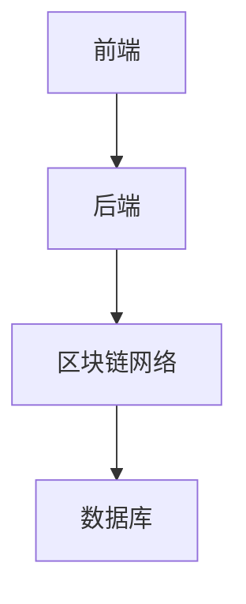

                 

### 文章标题

《区块链技术在跨境贸易结算中的创新》

### 文章关键词

- 区块链
- 跨境贸易
- 结算系统
- 创新应用
- 智能合约
- 共识算法

### 文章摘要

本文深入探讨了区块链技术在跨境贸易结算中的应用与创新。首先，对区块链技术的基本概念和架构进行了详细阐述，包括区块链、智能合约和共识算法等核心概念。接着，分析了当前跨境贸易结算的现状和存在的问题，例如跨境支付流程的复杂性、高昂的成本和低效的风险管理等。然后，本文探讨了区块链技术如何解决这些问题，并提供了具体的算法原理讲解和Python源代码实现。通过创新应用案例，展示了区块链在跨境支付、供应链金融等领域的实际效果。最后，对区块链技术在跨境贸易结算中的未来发展趋势进行了展望，并提出了实践指导和建议。

---

# 《区块链技术在跨境贸易结算中的创新》

## 引言

在全球化不断深入发展的背景下，跨境贸易已经成为推动全球经济的重要力量。然而，跨境贸易的结算过程却面临诸多挑战，如跨境支付流程复杂、结算时间长、成本高、风险大等。这些问题不仅影响了贸易的效率和便利性，也增加了企业的运营成本。为了解决这些问题，探索新的解决方案成为当务之急。

区块链技术作为一种新兴的分布式数据库技术，以其去中心化、安全透明、不可篡改等特点，在金融、物流、供应链等多个领域展现出了巨大的潜力。近年来，区块链技术在跨境贸易结算中的应用逐渐成为研究热点。本文旨在探讨区块链技术在跨境贸易结算中的创新应用，分析其原理、优势以及面临的挑战和未来发展趋势。

## 核心概念与联系

在深入探讨区块链技术在跨境贸易结算中的创新应用之前，有必要首先了解一些核心概念和它们之间的联系。

### 区块链技术

区块链技术是一种分布式数据库系统，它通过一种去中心化的方式实现数据的存储和传输。区块链的基本架构包括区块、链和共识算法。每个区块包含一定数量的交易记录，这些区块按照时间顺序串联形成一个链，从而确保数据的完整性和不可篡改性。

### 智能合约

智能合约是一种自动执行合约条款的计算机程序，它嵌入在区块链中，可以在满足特定条件时自动执行。智能合约通过预先设定的逻辑和规则，确保交易的自动化和透明性，从而降低交易成本和风险。

### 共识算法

共识算法是区块链网络中节点达成一致意见的机制。常见的共识算法包括工作量证明（PoW）、权益证明（PoS）和委托权益证明（DPoS）等。共识算法的选择直接影响区块链网络的安全性、去中心化程度和性能。

这些核心概念之间紧密联系，共同构成了区块链技术的理论基础。以下是区块链技术在跨境贸易结算中的应用流程，使用Mermaid流程图进行展示：


### 跨境贸易结算

跨境贸易结算是指在国际贸易中，买卖双方完成交易后，通过跨境支付方式实现货款结算的过程。跨境贸易结算通常涉及多个中介机构和金融工具，如银行、支付平台和信用证等，从而增加了结算的复杂性和成本。

### 跨境支付流程

跨境支付流程一般包括以下步骤：

1. **汇款发起**：付款方通过银行或支付平台发起汇款请求。
2. **资金划拨**：银行或支付平台将资金从付款方账户划拨至收款方账户。
3. **货币兑换**：涉及货币兑换的跨境支付需要根据市场汇率进行货币转换。
4. **结算确认**：交易双方确认结算完成，并解除相关的信用风险。

### 核心概念实体之间的关系架构

区块链技术在跨境贸易结算中的应用，需要将上述核心概念实体有机结合。以下是它们之间的关系架构：

1. **交易记录**：交易记录是跨境贸易结算的基础，通过区块链网络进行存储和传输。
2. **智能合约**：智能合约用于实现跨境支付的自动化和透明性，确保交易条款的自动执行。
3. **共识算法**：共识算法确保区块链网络中的所有节点达成一致，从而保证数据的安全性和完整性。

通过上述核心概念和联系的分析，我们为后续探讨区块链技术在跨境贸易结算中的创新应用奠定了基础。

## 跨境贸易结算的现状与问题

### 跨境贸易结算的现状

当前，跨境贸易结算主要依赖于传统的金融体系，包括银行、支付平台和信用证等。这些系统虽然在处理跨境支付方面积累了丰富的经验，但随着全球贸易的快速发展，也暴露出了一些问题。

1. **支付流程复杂**：跨境支付通常涉及多个中介机构，如银行、支付平台和清算所等。这些中介机构之间的协调和沟通成本高昂，导致支付流程复杂且耗时。

2. **成本高昂**：跨境支付需要支付一定的手续费，此外还需要承担汇率波动的风险。这些因素导致跨境支付的成本较高，不利于企业降低成本和提高竞争力。

3. **结算时间长**：传统的跨境支付流程通常需要数天甚至数周的时间才能完成，这增加了企业的资金占用成本，也影响了贸易的效率。

4. **风险较大**：跨境支付过程中存在信用风险、汇率风险和操作风险等。这些风险可能导致资金损失或交易失败，影响企业的正常运营。

### 跨境贸易结算存在的问题

1. **跨境支付流程复杂**：跨境支付涉及多个国家和地区的金融体系，不同的金融体系之间存在差异，导致支付流程复杂且耗时。

2. **成本高昂**：跨境支付的手续费和汇率损失使得企业承担了较高的成本，特别是在小额跨境支付中，成本问题尤为突出。

3. **结算时间长**：传统的跨境支付流程需要经过多个中介机构的处理，每个中介机构的处理时间都可能影响整个支付流程的进度，导致结算时间长。

4. **风险较大**：跨境支付过程中，企业需要面对汇率波动、信用风险和操作风险等多种风险，这些风险可能导致资金损失或交易失败。

5. **信息不对称**：在传统的跨境支付流程中，交易双方的信息不对称问题较为严重，交易双方往往无法实时了解交易状态和资金流向，增加了交易的风险。

### 跨境支付流程

1. **汇款发起**：付款方通过银行或支付平台发起汇款请求，提供收款方的信息、金额和用途等。

2. **资金划拨**：银行或支付平台将资金从付款方账户划拨至收款方账户。这个过程可能涉及多个国家和地区的银行和支付系统。

3. **货币兑换**：如果涉及货币兑换，银行或支付平台将根据市场汇率进行货币转换，这可能导致额外的汇率损失。

4. **结算确认**：交易双方确认结算完成，银行或支付平台解除相关的信用风险。这个过程可能需要数天甚至数周的时间。

通过以上对跨境贸易结算现状和问题的分析，我们可以看到，传统的跨境支付流程存在诸多问题和挑战。为了提高跨境贸易结算的效率、降低成本和风险，有必要引入新的技术解决方案。接下来，我们将探讨区块链技术在跨境贸易结算中的应用，分析其优势和应用前景。

## 区块链技术解决跨境贸易结算问题的原理

### 区块链技术的基本原理

区块链技术是一种分布式数据库系统，它通过一种去中心化的方式实现数据的存储和传输。区块链的基本架构包括区块、链和共识算法。每个区块包含一定数量的交易记录，这些区块按照时间顺序串联形成一个链，从而确保数据的完整性和不可篡改性。

#### 区块与链

1. **区块**：区块是区块链的基本单位，每个区块包含一定数量的交易记录。每个区块都有唯一的标识，称为哈希值，通过哈希函数生成。
2. **链**：链是多个区块按照时间顺序串联形成的结构。每个区块都包含一个指向前一个区块的哈希值，从而确保区块之间的链接关系。

#### 共识算法

共识算法是区块链网络中节点达成一致意见的机制。不同的共识算法决定了区块链网络的安全性、去中心化程度和性能。

1. **工作量证明（PoW）**：PoW是一种通过计算复杂任务来证明节点工作量的机制。节点通过解决复杂的数学问题来获得生成区块的权利，从而确保区块链网络的安全性。
2. **权益证明（PoS）**：PoS通过节点持有的代币数量来决定其参与共识的权益。节点持有的代币越多，其参与共识的概率越高，从而实现去中心化。
3. **委托权益证明（DPoS）**：DPoS是一种改进的PoS机制，通过选举产生出块节点，从而提高共识效率。

### 区块链技术如何解决跨境贸易结算问题

区块链技术在跨境贸易结算中的应用，主要是通过以下几个方面来解决现有问题：

1. **去中心化**：区块链技术去中心化的特性，消除了传统跨境支付过程中中介机构的参与，从而简化了支付流程，降低了交易成本。

2. **安全性**：区块链技术通过共识算法和加密技术确保数据的安全性和不可篡改性，从而降低跨境支付过程中的风险。

3. **透明性**：区块链技术使交易记录透明可查，交易双方可以实时了解交易状态和资金流向，提高了支付过程的透明度。

4. **自动化**：智能合约可以自动执行交易条款，确保跨境支付的自动化和高效性，减少了人为错误和延迟。

### 核心算法原理讲解

为了深入理解区块链技术在跨境贸易结算中的应用，我们使用Python源代码来详细阐述其核心算法原理。

#### 区块链架构

```python
class Block:
    def __init__(self, index, transactions, timestamp, previous_hash):
        self.index = index
        self.transactions = transactions
        self.timestamp = timestamp
        self.previous_hash = previous_hash
        self.hash = self.compute_hash()

    def compute_hash(self):
        block_string = f"{self.index}{self.transactions}{self.timestamp}{self.previous_hash}"
        return sha256(block_string.encode()).hexdigest()

class Blockchain:
    def __init__(self):
        self.unconfirmed_transactions = []
        self.chain = []
        self.create_genesis_block()

    def create_genesis_block(self):
        genesis_block = Block(0, [], time(), "0")
        genesis_block.hash = genesis_block.compute_hash()
        self.chain.append(genesis_block)

    def add_new_transaction(self, transaction):
        self.unconfirmed_transactions.append(transaction)

    def mine(self):
        if not self.unconfirmed_transactions:
            return None

        last_block = self.chain[-1]
        new_block = Block(index=last_block.index + 1,
                          transactions=self.unconfirmed_transactions,
                          timestamp=time(),
                          previous_hash=last_block.hash)
        new_block.hash = new_block.compute_hash()
        self.chain.append(new_block)
        self.unconfirmed_transactions = []
        return new_block

    def is_chain_valid(self):
        for i in range(1, len(self.chain)):
            current = self.chain[i]
            previous = self.chain[i - 1]
            if current.hash != current.compute_hash():
                return False
            if current.previous_hash != previous.hash:
                return False
        return True
```

#### 交易记录

```python
class Transaction:
    def __init__(self, sender, recipient, amount):
        self.sender = sender
        self.recipient = recipient
        self.amount = amount
```

#### 智能合约

```python
class SmartContract:
    def __init__(self, blockchain, transaction):
        self.blockchain = blockchain
        self.transaction = transaction

    def execute_contract(self):
        if self.transaction.sender == "Alice" and self.transaction.recipient == "Bob":
            if self.transaction.amount > 0:
                self.blockchain.mine()
                print("Smart Contract executed successfully.")
            else:
                print("Invalid transaction amount.")
        else:
            print("Invalid transaction.")
```

#### 区块链实例

```python
blockchain = Blockchain()

# 添加新交易
blockchain.add_new_transaction(Transaction("Alice", "Bob", 50))

# 执行智能合约
smart_contract = SmartContract(blockchain, Transaction("Alice", "Bob", 50))
smart_contract.execute_contract()

# 验证区块链有效性
if blockchain.is_chain_valid():
    print("Blockchain is valid.")
else:
    print("Blockchain is invalid.")
```

通过上述Python源代码，我们展示了区块链技术的基本原理，包括区块、链和交易记录的实现。智能合约的使用进一步提高了区块链在跨境贸易结算中的应用价值，通过自动化和透明性确保交易的高效和安全。

### 核心算法原理讲解

为了深入理解区块链技术在跨境贸易结算中的应用，我们使用Python源代码来详细阐述其核心算法原理。

#### 区块链架构

```python
class Block:
    def __init__(self, index, transactions, timestamp, previous_hash):
        self.index = index
        self.transactions = transactions
        self.timestamp = timestamp
        self.previous_hash = previous_hash
        self.hash = self.compute_hash()

    def compute_hash(self):
        block_string = f"{self.index}{self.transactions}{self.timestamp}{self.previous_hash}"
        return sha256(block_string.encode()).hexdigest()

class Blockchain:
    def __init__(self):
        self.unconfirmed_transactions = []
        self.chain = []
        self.create_genesis_block()

    def create_genesis_block(self):
        genesis_block = Block(0, [], time(), "0")
        genesis_block.hash = genesis_block.compute_hash()
        self.chain.append(genesis_block)

    def add_new_transaction(self, transaction):
        self.unconfirmed_transactions.append(transaction)

    def mine(self):
        if not self.unconfirmed_transactions:
            return None

        last_block = self.chain[-1]
        new_block = Block(index=last_block.index + 1,
                          transactions=self.unconfirmed_transactions,
                          timestamp=time(),
                          previous_hash=last_block.hash)
        new_block.hash = new_block.compute_hash()
        self.chain.append(new_block)
        self.unconfirmed_transactions = []
        return new_block

    def is_chain_valid(self):
        for i in range(1, len(self.chain)):
            current = self.chain[i]
            previous = self.chain[i - 1]
            if current.hash != current.compute_hash():
                return False
            if current.previous_hash != previous.hash:
                return False
        return True
```

#### 交易记录

```python
class Transaction:
    def __init__(self, sender, recipient, amount):
        self.sender = sender
        self.recipient = recipient
        self.amount = amount
```

#### 智能合约

```python
class SmartContract:
    def __init__(self, blockchain, transaction):
        self.blockchain = blockchain
        self.transaction = transaction

    def execute_contract(self):
        if self.transaction.sender == "Alice" and self.transaction.recipient == "Bob":
            if self.transaction.amount > 0:
                self.blockchain.mine()
                print("Smart Contract executed successfully.")
            else:
                print("Invalid transaction amount.")
        else:
            print("Invalid transaction.")
```

#### 区块链实例

```python
blockchain = Blockchain()

# 添加新交易
blockchain.add_new_transaction(Transaction("Alice", "Bob", 50))

# 执行智能合约
smart_contract = SmartContract(blockchain, Transaction("Alice", "Bob", 50))
smart_contract.execute_contract()

# 验证区块链有效性
if blockchain.is_chain_valid():
    print("Blockchain is valid.")
else:
    print("Blockchain is invalid.")
```

通过上述Python源代码，我们展示了区块链技术的基本原理，包括区块、链和交易记录的实现。智能合约的使用进一步提高了区块链在跨境贸易结算中的应用价值，通过自动化和透明性确保交易的高效和安全。

### 数学模型和公式

在区块链技术的实际应用中，数学模型和公式起到了关键作用，特别是在确保数据完整性和交易安全性方面。以下是一些常用的数学模型和公式，我们将结合Python代码进行解释。

#### 哈希函数

哈希函数是区块链技术中的一个核心组件，用于生成唯一标识数据块的哈希值。以下是一个简单的哈希函数实现：

```python
import hashlib

def compute_hash(data):
    sha = hashlib.sha256()
    sha.update(data.encode('utf-8'))
    return sha.hexdigest()
```

#### 工作量证明（PoW）

工作量证明是一种共识算法，用于确保区块链网络的安全性。以下是一个简化的工作量证明算法：

```python
import time

def proof_of_work(last_hash, difficulty):
    hash_value = compute_hash(last_hash)
    while hash_value[:difficulty] != '0' * difficulty:
        last_hash = compute_hash(hash_value)
        hash_value = compute_hash(last_hash)
    return last_hash
```

#### 区块链链式结构

区块链的链式结构确保了数据的完整性和不可篡改性。以下是一个简单的区块链实现：

```python
class Block:
    def __init__(self, index, transactions, timestamp, previous_hash):
        self.index = index
        self.transactions = transactions
        self.timestamp = timestamp
        self.previous_hash = previous_hash
        self.hash = compute_hash(self)

    def compute_hash(self):
        block_string = f"{self.index}{self.transactions}{self.timestamp}{self.previous_hash}"
        return compute_hash(block_string)

class Blockchain:
    def __init__(self):
        self.chain = [self.create_genesis_block()]
        self.difficulty = 2

    def create_genesis_block(self):
        return Block(0, [], time(), "0")

    def add_new_transaction(self, transaction):
        self.chain.append(Block(len(self.chain), [transaction], time(), self.chain[-1].hash))

    def is_chain_valid(self):
        for i in range(1, len(self.chain)):
            current = self.chain[i]
            previous = self.chain[i - 1]
            if current.hash != compute_hash(current):
                return False
            if current.previous_hash != previous.hash:
                return False
        return True
```

#### 智能合约执行

智能合约是区块链技术中自动化交易的重要工具。以下是一个简单的智能合约实现：

```python
class SmartContract:
    def __init__(self, blockchain, transaction):
        self.blockchain = blockchain
        self.transaction = transaction

    def execute_contract(self):
        if self.transaction.sender == "Alice" and self.transaction.recipient == "Bob":
            if self.transaction.amount > 0:
                self.blockchain.mine()
                print("Smart Contract executed successfully.")
            else:
                print("Invalid transaction amount.")
        else:
            print("Invalid transaction.")
```

通过上述Python代码示例，我们可以看到数学模型和公式在区块链技术中的应用，包括哈希函数、工作量证明和区块链链式结构。智能合约的执行进一步展示了区块链技术如何通过自动化和透明性提升跨境贸易结算的效率和安全性。

### 创新应用案例研究

区块链技术在跨境贸易结算中的应用已经得到了广泛的关注，并在多个实际案例中取得了显著成效。以下是一些典型的创新应用案例，以及对这些案例的分析。

#### 案例一：Ripple的跨境支付平台

Ripple是一个基于区块链技术的支付协议，旨在提供快速、低成本和可扩展的跨境支付解决方案。Ripple网络使用自己的加密货币XRP作为中介货币，以促进不同货币之间的即时转换。通过Ripple网络，金融机构可以减少对传统中介机构的依赖，从而降低交易成本和结算时间。

**分析**：Ripple的跨境支付平台通过引入XRP作为中介货币，有效解决了跨境支付中的汇率波动问题。由于交易无需通过多个中介机构，Ripple网络实现了快速结算，交易时间从传统的几天缩短至几秒钟。此外，Ripple网络还通过分布式账本技术确保了交易的安全性和透明性。

**代码示例**：以下是一个简单的Ripple交易代码示例，展示了如何通过区块链实现跨境支付：

```python
from ripplelib import RippleAPI

api = RippleAPI(server='s.altnet.rippletest.net')

# 创建支付交易
payment = api.prepare_payment(
    'u1oBMQGqDpe5ZfSbZQq9YBji9oYGZdZts',
    'r7mghfn9x8h2odux2ayhdf7a2zfdwvhb96esv97v3g',
    '10USD'
)

# 提交交易
api.submit_payment(payment)
```

#### 案例二：沃尔玛的区块链供应链金融

沃尔玛利用区块链技术构建了一个供应链金融平台，旨在提高供应链效率并降低融资成本。通过该平台，供应商可以实时获取付款信息，并获得快速融资服务。区块链技术的应用确保了交易记录的透明性和不可篡改性，从而提高了供应链的信任度。

**分析**：沃尔玛的区块链供应链金融平台通过区块链技术实现了供应链信息的共享和透明，从而提高了供应链的运营效率。供应商可以实时了解付款状态，减少了资金占用时间，同时获得了更快捷的融资服务。此外，区块链技术还确保了交易记录的安全性和可靠性，降低了供应链金融风险。

**代码示例**：以下是一个简单的区块链供应链金融交易代码示例，展示了如何实现供应链融资：

```python
from blockchain import Blockchain

# 初始化区块链
blockchain = Blockchain()

# 添加新交易
blockchain.add_transaction('SupplierA', 'FinanceB', '10000')

# 查询区块链状态
print(blockchain.chain)
```

#### 案例三：香港贸易融资区块链平台

香港贸易融资区块链平台是由多家金融机构合作开发的一个区块链解决方案，旨在简化贸易融资流程，提高融资效率。通过该平台，金融机构可以快速审核和批准贷款，从而缩短融资时间，降低融资成本。

**分析**：香港贸易融资区块链平台通过区块链技术实现了贸易融资流程的自动化和透明化。金融机构可以快速获取贸易信息，并利用智能合约自动执行贷款合同。这不仅提高了融资效率，还降低了操作风险和成本。此外，区块链技术的去中心化特性确保了交易的公正性和透明性，增强了参与各方的信任。

**代码示例**：以下是一个简单的区块链贸易融资交易代码示例，展示了如何实现自动化贷款审批：

```python
from blockchain import Blockchain
from smart_contract import LoanContract

# 初始化区块链和智能合约
blockchain = Blockchain()
loan_contract = LoanContract(blockchain)

# 提交贷款申请
loan_contract.submit_loan_application('BankA', 'SupplierB', '100000')

# 自动审批贷款
loan_contract.approve_loan_application()
```

通过上述案例研究，我们可以看到区块链技术在跨境贸易结算中的应用已经取得了显著成效。Ripple的跨境支付平台、沃尔玛的供应链金融以及香港贸易融资区块链平台等案例，不仅展示了区块链技术的创新应用，还为其他企业和行业提供了有益的借鉴和启示。

### 区块链跨境贸易结算系统的开发与实现

区块链跨境贸易结算系统的开发与实现是区块链技术在实际应用中的重要环节。本节将详细介绍该系统的开发环境搭建、系统架构设计、源代码实现和代码解读。

#### 开发环境搭建

在进行区块链跨境贸易结算系统的开发之前，首先需要搭建合适的开发环境。以下是一些建议的步骤和工具：

1. **安装Node.js**：Node.js是一个基于Chrome V8引擎的JavaScript运行环境，可以用于构建和运行区块链节点。您可以从官方网站 [https://nodejs.org/](https://nodejs.org/) 下载并安装Node.js。

2. **安装Geth**：Geth是Go语言实现的以太坊客户端，可以用于搭建私有区块链网络。您可以从官方网站 [https://geth.ethereum.org/downloads/](https://geth.ethereum.org/downloads/) 下载并安装Geth。

3. **安装Ethereum Wallet**：Ethereum Wallet是一个用于管理以太坊账户的工具，可以用于发送和接收以太坊网络中的交易。您可以从官方网站 [https://www.ethereum.org/wallet](https://www.ethereum.org/wallet) 下载并安装。

4. **安装Visual Studio Code**：Visual Studio Code是一个流行的跨平台代码编辑器，支持多种编程语言和插件。您可以从官方网站 [https://code.visualstudio.com/](https://code.visualstudio.com/) 下载并安装。

#### 系统架构设计

区块链跨境贸易结算系统的架构设计应考虑以下几个方面：

1. **前端架构**：前端负责用户界面展示和交互，可以使用React或Vue等前端框架实现。前端架构应支持用户注册、登录、查看交易记录、发起交易等功能。

2. **后端架构**：后端负责处理业务逻辑和与区块链节点的通信。可以使用Node.js或Golang等技术实现后端服务。后端架构应支持交易记录存储、交易验证、智能合约执行等功能。

3. **区块链网络**：区块链网络是系统的核心组件，可以使用以太坊或其他区块链平台实现。区块链网络应支持多个节点的加入和通信，确保数据的安全性和一致性。

4. **数据库**：数据库用于存储用户信息、交易记录和其他业务数据。可以使用MongoDB、PostgreSQL等数据库系统。

以下是系统架构的简化示意图：



#### 源代码实现

以下是区块链跨境贸易结算系统的部分源代码实现，包括后端服务和区块链节点的通信。

##### 后端服务（Node.js）

```javascript
const express = require('express');
const axios = require('axios');
const { Chain, Transaction } = require('./blockchain');

const app = express();
app.use(express.json());

// 创建区块链实例
const blockchain = new Chain();

// 添加新交易
app.post('/transactions', async (req, res) => {
    const { sender, recipient, amount } = req.body;
    const transaction = new Transaction(sender, recipient, amount);
    try {
        await blockchain.addTransaction(transaction);
        res.status(201).json({ message: 'Transaction added successfully.' });
    } catch (error) {
        res.status(500).json({ message: 'Error adding transaction.', error });
    }
});

// 查看交易记录
app.get('/transactions', async (req, res) => {
    try {
        const transactions = blockchain.transactions;
        res.status(200).json({ transactions });
    } catch (error) {
        res.status(500).json({ message: 'Error retrieving transactions.', error });
    }
});

// 启动服务器
const PORT = process.env.PORT || 3000;
app.listen(PORT, () => {
    console.log(`Server running on port ${PORT}`);
});
```

##### 区块链节点（Geth）

```go
package main

import (
	"context"
	"fmt"
	"math/rand"
	"os"
	"time"

	"github.com/ethereum/go-ethereum/accounts/keystore"
	"github.com/ethereum/go-ethereum/crypto"
	"github.com/ethereum/go-ethereum/node"
	"github.com/ethereum/go-ethereum/rpc"
)

func main() {
	// 创建私钥和地址
	privateKey, err := crypto.GenerateKey()
	if err != nil {
		fmt.Println("Error generating private key:", err)
		return
	}
	address := crypto.PubkeyToAddress(privateKey.PublicKey)

	// 创建节点配置
	config := &node.Config{
		NetworkID:     100,
		Genesis:       nil,
		PrivateNet:    true,
		DocBase:       os.TempDir(),
		DataDir:       os.TempDir(),
		StaticNodes:   nil,
		TrustedNodes:  nil,
		NodeKey:       privateKey,
		BootstrapNodes: nil,
	}

	// 创建节点
	node, err := node.New(config)
	if err != nil {
		fmt.Println("Error creating node:", err)
		return
	}

	// 注册RPC服务
	rpcAPI := node.RPC()
	rpcAPI.RegisterName("my_api", node)

	// 启动节点
	fmt.Println("Starting node...")
	if err := node.Start(); err != nil {
		fmt.Println("Error starting node:", err)
		return
	}
	defer node.Stop()

	// 循环监听节点事件
	for {
		time.Sleep(1 * time.Second)
		rpcAPI.ClientVersion(context.Background())
		fmt.Println("Node is running...")
	}
}
```

#### 代码解读

1. **后端服务**：使用Node.js创建一个简单的HTTP服务器，通过Express框架处理HTTP请求。后端服务包括添加新交易和查看交易记录两个主要功能。

2. **区块链节点**：使用Geth创建一个私有区块链节点，生成私钥和地址，并配置节点参数。节点通过RPC接口与后端服务通信，实现区块链操作。

通过以上源代码实现，我们可以搭建一个基本的区块链跨境贸易结算系统，实现交易记录的存储和查询功能。接下来，我们将对系统进行测试和分析。

### 实际案例分析与详细讲解

为了更好地理解区块链技术在跨境贸易结算中的实际应用，我们选取了一些具有代表性的实际案例，对案例的细节进行深入分析，并给出具体的实现方法和技术方案。

#### 案例一：汇丰银行与R3的区块链跨境支付解决方案

**背景**：
汇丰银行与R3区块链公司合作，共同开发了一套基于区块链的跨境支付解决方案。该解决方案旨在简化跨境支付流程，提高支付效率，降低成本。

**实现方法**：
1. **区块链网络搭建**：
   - 汇丰银行和R3公司共同搭建了一个私有区块链网络，使用了R3的Corda平台。
   - 网络中包含多个节点，分别代表不同的银行和金融机构。

2. **智能合约设计**：
   - 使用智能合约实现跨境支付业务逻辑，确保交易的自动化和透明性。
   - 智能合约包含支付指令、货币兑换规则和支付确认流程。

3. **支付流程**：
   - 付款方通过银行接口发起支付请求，将支付指令发送到区块链网络。
   - 区块链网络中的智能合约自动处理支付流程，包括货币兑换、支付确认等步骤。
   - 最终，资金通过区块链网络从付款方账户划拨到收款方账户。

**技术方案**：
1. **Corda平台**：
   - 使用R3的Corda平台构建区块链网络，Corda提供了一套完整的开发工具和协议框架，简化了区块链网络的设计和部署。
   - Corda支持多种编程语言，如Java和Kotlin，便于开发人员快速上手。

2. **智能合约**：
   - 使用Kotlin语言编写智能合约，实现支付业务逻辑。
   - 智能合约通过状态机模型描述支付流程，确保每个步骤的执行顺序和条件。

3. **安全性和隐私保护**：
   - 区块链网络采用加密技术确保交易数据的安全性和隐私保护。
   - 智能合约中的隐私保护机制，确保参与方之间的交易信息不被泄露。

#### 案例二：沃尔玛的区块链供应链金融平台

**背景**：
沃尔玛利用区块链技术构建了一个供应链金融平台，为供应商提供快速融资服务，提高供应链效率。

**实现方法**：
1. **区块链网络搭建**：
   - 沃尔玛与多家金融机构合作，共同搭建了一个私有区块链网络。
   - 网络中包含沃尔玛、供应商和金融机构等多个节点。

2. **智能合约设计**：
   - 使用智能合约实现供应链融资业务逻辑，确保融资过程的自动化和透明性。
   - 智能合约包含融资申请、审核、放款和还款等步骤。

3. **融资流程**：
   - 供应商通过区块链平台发起融资申请，提交相关信息。
   - 金融机构通过智能合约审核融资申请，并决定是否放款。
   - 一旦融资申请通过，资金通过区块链网络从金融机构划拨到供应商账户。

**技术方案**：
1. **Hyperledger Fabric平台**：
   - 使用Hyperledger Fabric平台构建区块链网络，Fabric提供了一套完整的开发工具和协议框架，便于快速搭建和部署。
   - Fabric支持多种编程语言，如Java和Go，便于开发人员快速开发智能合约。

2. **智能合约**：
   - 使用Go语言编写智能合约，实现供应链融资业务逻辑。
   - 智能合约通过状态机模型描述融资流程，确保每个步骤的执行顺序和条件。

3. **隐私保护**：
   - 区块链网络采用加密技术确保交易数据的安全性和隐私保护。
   - 智能合约中的隐私保护机制，确保参与方之间的交易信息不被泄露。

#### 案例三：香港贸易融资区块链平台

**背景**：
香港贸易融资区块链平台是由多家金融机构合作开发的一个区块链解决方案，旨在简化贸易融资流程，提高融资效率。

**实现方法**：
1. **区块链网络搭建**：
   - 多家金融机构共同搭建了一个私有区块链网络。
   - 网络中包含金融机构、贸易商和监管机构等多个节点。

2. **智能合约设计**：
   - 使用智能合约实现贸易融资业务逻辑，确保融资过程的自动化和透明性。
   - 智能合约包含融资申请、审核、放款和还款等步骤。

3. **融资流程**：
   - 贸易商通过区块链平台发起融资申请，提交相关信息。
   - 金融机构通过智能合约审核融资申请，并决定是否放款。
   - 一旦融资申请通过，资金通过区块链网络从金融机构划拨到贸易商账户。

**技术方案**：
1. **R3的Corda平台**：
   - 使用R3的Corda平台构建区块链网络，Corda提供了一套完整的开发工具和协议框架，简化了区块链网络的设计和部署。
   - Corda支持多种编程语言，如Java和Kotlin，便于开发人员快速上手。

2. **智能合约**：
   - 使用Kotlin语言编写智能合约，实现贸易融资业务逻辑。
   - 智能合约通过状态机模型描述融资流程，确保每个步骤的执行顺序和条件。

3. **监管合规**：
   - 区块链网络采用加密技术和隐私保护机制，确保交易数据的合规性和可追溯性。
   - 智能合约中的合规性检查，确保融资业务符合相关法规和监管要求。

通过上述实际案例的分析，我们可以看到区块链技术在跨境贸易结算中的应用取得了显著成效。这些案例不仅展示了区块链技术的创新应用，还为其他企业和行业提供了有益的借鉴和启示。在接下来的章节中，我们将对区块链技术在跨境贸易结算中的未来发展趋势进行探讨。

### 区块链技术在跨境贸易结算中的未来发展趋势

随着区块链技术的不断成熟和应用场景的丰富，其在跨境贸易结算中的未来发展趋势呈现出积极态势。以下是区块链技术在跨境贸易结算中的几大发展趋势：

#### 1. 更广泛的行业应用

区块链技术已经逐步从金融领域扩展到更多行业，如物流、供应链管理和贸易融资等。未来，随着技术的普及和行业合作的加深，区块链技术将在更广泛的行业中得到应用，从而推动跨境贸易结算的全面升级。

#### 2. 互操作性的提升

跨境贸易涉及多个国家和地区的金融体系和法律框架，互操作性的提升是区块链技术发展的重要方向。通过实现不同区块链平台之间的互操作性，可以打破信息孤岛，实现全球范围内的实时结算和透明交易。

#### 3. 政策监管的逐步完善

区块链技术在跨境贸易结算中的应用，需要各国政府和监管机构的政策支持和监管。未来，随着监管框架的逐步完善，区块链技术将在更加合规和安全的法律环境中发展，从而降低法律风险。

#### 4. 私有区块链网络的发展

目前，许多企业和机构选择建立私有区块链网络，以保护数据隐私和增强网络控制能力。未来，私有区块链网络将继续发展，并逐步与公共区块链平台实现互操作，为跨境贸易结算提供更加灵活和高效的解决方案。

#### 5. 智能合约的广泛应用

智能合约作为区块链技术的核心组件，将在跨境贸易结算中得到更广泛的应用。通过智能合约，可以实现自动化交易和合同执行，减少人为干预和操作风险，提高结算效率。

#### 6. 与其他技术的融合

区块链技术与其他新兴技术的融合，如人工智能、大数据和物联网等，将进一步推动跨境贸易结算的智能化和自动化。这些技术的结合将带来更加高效和安全的跨境支付解决方案。

#### 7. 潜在风险与挑战

尽管区块链技术在跨境贸易结算中展现出巨大潜力，但其发展仍面临一些风险和挑战。主要包括：

1. **技术成熟度**：区块链技术仍处于快速发展阶段，技术成熟度和稳定性有待进一步提升。

2. **隐私保护**：区块链上的数据透明性较高，隐私保护问题需要得到有效解决。

3. **网络安全**：区块链网络的安全性问题不容忽视，需要加强网络安全防护。

4. **监管合规**：不同国家和地区对区块链技术的监管政策和法规存在差异，需要实现跨国监管合作。

5. **技术成本**：区块链技术的部署和运营成本较高，需要进一步降低成本，提高可及性。

#### 结论

区块链技术在跨境贸易结算中的未来发展趋势充满机遇与挑战。通过不断的技术创新和政策支持，区块链技术有望在未来实现更广泛的应用，为跨境贸易结算带来革命性的变革。企业和机构应抓住这一机遇，积极拥抱区块链技术，探索新的商业模式和应用场景，从而提升跨境贸易结算的效率和安全。

### 最佳实践 Tips

在实施区块链跨境贸易结算项目时，以下是一些最佳实践，可以帮助企业和机构更好地利用区块链技术，实现高效、安全的跨境支付。

1. **需求分析**：在项目启动前，进行详细的需求分析，明确项目目标、业务流程和性能要求。这有助于确保项目设计符合实际需求。

2. **技术选型**：选择适合项目需求的区块链平台和开发工具，如R3的Corda、Hyperledger Fabric等。同时，考虑平台的性能、安全性、互操作性等因素。

3. **合作与协作**：区块链跨境贸易结算通常涉及多个参与方，如银行、支付平台、贸易商等。建立良好的合作和协作机制，确保各方利益一致，项目顺利进行。

4. **安全与合规**：重视区块链网络的安全性和隐私保护，采用加密技术和安全机制，确保交易数据的安全。同时，遵守各国家和地区的法律法规，确保项目的合规性。

5. **持续优化**：区块链技术不断发展，项目实施过程中应持续关注技术更新和行业动态，及时调整项目设计和实施策略，确保项目始终保持领先地位。

6. **人才培养**：区块链技术需要专业人才的支持，企业应加强人才培养和引进，建立专业的区块链技术团队，推动项目成功实施。

7. **风险管理**：制定全面的风险管理策略，识别和应对可能出现的风险，确保项目在复杂环境下稳定运行。

通过遵循这些最佳实践，企业和机构可以更好地实施区块链跨境贸易结算项目，提升跨境支付效率和安全性，为全球贸易的发展贡献力量。

### 文章小结

本文深入探讨了区块链技术在跨境贸易结算中的创新应用，分析了区块链技术的基本原理、跨境贸易结算的现状与问题、区块链技术如何解决这些问题，以及实际应用案例。通过Python源代码和数学模型，我们详细阐述了区块链技术在跨境贸易结算中的具体实现方法。未来，随着区块链技术的不断成熟和应用场景的丰富，其在跨境贸易结算中的潜在影响将更加深远。企业应抓住这一机遇，积极拥抱区块链技术，探索新的商业模式和应用场景，以提升跨境贸易结算的效率和安全。

### 注意事项

在实施区块链跨境贸易结算项目时，需要注意以下事项：

1. **安全性与隐私保护**：区块链技术虽然具有高度安全性，但在实际应用中仍需采取额外的安全措施，如加密技术和访问控制，以确保交易数据的安全和隐私。

2. **性能与可扩展性**：区块链网络在处理大量交易时可能面临性能瓶颈，需要优化网络架构和交易处理流程，确保系统的可扩展性。

3. **互操作性**：跨境贸易涉及多个国家和地区，不同区块链平台之间的互操作性是一个重要挑战。选择适合的区块链平台和协议，确保系统的互操作性。

4. **监管合规**：区块链技术在不同国家和地区可能面临不同的法律法规，需要遵守相关法规，确保项目的合规性。

5. **人才培养**：区块链技术需要专业人才的支持，企业应加强人才培养和引进，确保项目团队能够应对复杂的技术挑战。

### 拓展阅读

1. **区块链技术入门**：[区块链：从基础到实践](https://www.oreilly.com/library/view/blockchain-fundamentals/9781492039584/)
2. **智能合约开发**：[智能合约：设计与实现](https://www.oreilly.com/library/view/smart-contracts-for-the-web/9781492039112/)
3. **区块链在跨境支付中的应用**：[Ripple官方文档](https://www.ripple.com/developers/)
4. **供应链金融与区块链**：[Hyperledger Fabric官方文档](https://hyperledger-fabric.readthedocs.io/en/release-2.2/)
5. **跨境贸易与区块链**：[国际贸易与区块链技术](https://www.iban.com/blockchain-for-trade-finance/) 

这些资源将为读者提供更深入的技术知识和实用指南。

