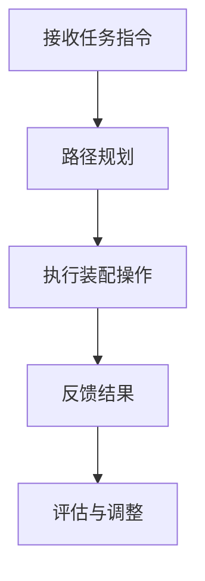
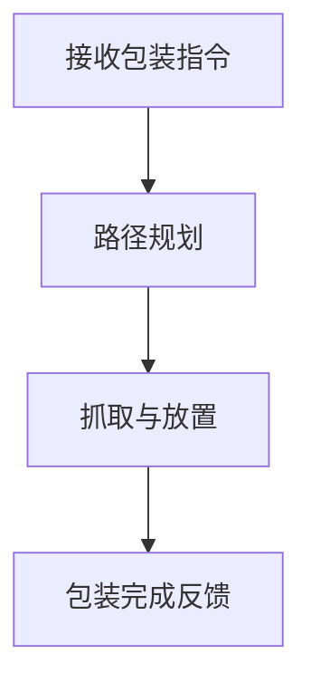

                 


### 引言

协作机器人，简称Cobot，是一种能够与人类工人协同工作的机器人。近年来，随着人工智能、物联网和机器人技术的发展，协作机器人在制造业中的应用逐渐受到广泛关注。制造业作为国家经济的支柱产业，其生产效率和产品质量的提升直接关系到国家竞争力的提升。协作机器人的引入，不仅能够解决劳动力短缺和劳动力成本上升的问题，还能够提高生产过程的灵活性和效率，减少生产错误。

本文旨在探讨协作机器人在制造业的发展趋势，分析其基本概念、应用场景、技术发展趋势以及面临的挑战。具体而言，本文将首先介绍协作机器人的定义、分类及其与传统机器人的区别，然后深入探讨协作机器人在制造业中的应用场景、优势以及实际案例。接着，我们将分析协作机器人技术的发展趋势、创新方向以及面临的挑战与解决方案。最后，本文将对未来协作机器人在制造业中的发展前景进行展望。

通过本文的探讨，希望能够为读者提供一个全面、系统的了解，帮助读者更好地把握协作机器人在制造业中的发展机遇，为其在制造业中的应用提供有益的参考。

## 核心关键词

- 协作机器人
- 制造业
- 人工智能
- 物联网
- 技术发展趋势

### 摘要

本文通过系统性的分析，探讨了协作机器人在制造业中的发展趋势。首先，介绍了协作机器人的基本概念、分类及其与传统机器人的区别。其次，详细分析了协作机器人在制造业中的应用场景、优势以及实际案例。接着，本文探讨了协作机器人技术的发展趋势、创新方向以及面临的挑战与解决方案。最后，本文对协作机器人在制造业中的未来前景进行了展望。通过本文的探讨，希望能够为读者提供一个全面、系统的了解，帮助读者更好地把握协作机器人在制造业中的发展机遇，推动制造业的数字化转型和智能化升级。

## 第1章：协作机器人的基本概念

### 1.1 协作机器人的定义与分类

协作机器人（Cobot）是一种设计用于与人类工作者协同工作的机器人。它们具有高度的人性化交互界面，能够在安全的环境中与人共同工作，极大地提高了生产效率和工作质量。协作机器人区别于传统的工业机器人，后者通常被设计用于在完全封闭的工作环境中执行重复性、高强度的操作。

**定义：**
协作机器人的定义主要集中在以下几个关键点上：
1. **可协作性**：协作机器人能够与人类安全地共享工作空间，无需设置物理隔离。
2. **灵活性**：协作机器人通常具备高度的可编程性和适应性，能够快速适应不同的生产任务。
3. **人机交互**：协作机器人拥有友好的用户界面，能够理解人类指令并通过视觉、听觉等方式进行互动。

**分类：**
协作机器人根据其应用领域和功能特点可以分为以下几种类型：
1. **装配机器人**：用于装配小型零件或完成组装工作，如操作螺丝刀、焊接等。
2. **检测机器人**：用于质量检测、缺陷检测和产品检查，能够提高生产过程的精度。
3. **搬运机器人**：用于物料搬运、包装和分拣工作，能够减少人力成本和提高效率。
4. **服务机器人**：在非生产线环境下提供辅助服务，如帮助工厂工人完成任务或提供信息。

### 1.2 协作机器人与传统机器人的区别

协作机器人和传统工业机器人在设计理念、工作环境、安全性和人机交互等方面存在显著差异。

**安全性与交互性：**
1. **安全性**：传统工业机器人通常需要在完全封闭的环境中工作，以防止对人类造成伤害。而协作机器人设计用于在开放环境中与人类工人协同工作，具备多层次的安全防护机制，如力感知技术、急停按钮和虚拟防护区域等。
2. **交互性**：传统工业机器人通常由专业技术人员进行编程和操作，而协作机器人则设计得更加易于编程和操作，甚至可以通过图形界面或自然语言进行控制。

**编程与操作：**
1. **编程**：传统工业机器人通常需要使用专用的编程语言和复杂的编程逻辑，而协作机器人则支持更直观的编程方法，如拖放操作和图形化编程。
2. **操作**：传统工业机器人需要专门的操作员进行监控和维护，而协作机器人则更加用户友好，普通工人即可进行日常操作和维护。

### 1.3 协作机器人技术发展历史

协作机器人的发展历程可以追溯到20世纪90年代，当时机器人技术开始向更加智能化和人性化的方向发展。以下是协作机器人技术发展历程的几个关键阶段：

**早期探索（1990s-2000s）：**
- **概念提出**：1990年代初期，工业机器人开始向协作型机器人转变，机器人制造商开始关注如何使机器人能够更好地与人类共存。
- **安全标准**：为了确保协作机器人的安全性，国际电工委员会（IEC）在2000年颁布了ISO 10218标准，规范了协作机器人的设计和应用。

**技术成熟（2000s-2010s）：**
- **人机交互**：随着传感器技术和人工智能的发展，协作机器人的交互能力得到了显著提升，能够更好地理解人类指令和动作。
- **多功能集成**：协作机器人逐渐具备更多的功能，如视觉识别、力感知和自主导航等，能够更好地适应不同的生产场景。

**产业应用与普及（2010s-2020s）：**
- **市场扩大**：随着物联网和人工智能技术的发展，协作机器人在制造业中的应用范围不断扩展，市场容量迅速增加。
- **技术创新**：新一代协作机器人开始集成人工智能、物联网和云计算等先进技术，使其智能化程度和适应能力得到进一步提升。

### 小结

协作机器人作为智能制造的重要一环，其定义、分类及其与传统机器人的区别使其在制造业中具有独特的应用优势。通过回顾其技术发展历程，我们可以看到协作机器人从概念提出到技术成熟再到产业应用的逐步推进，为未来的制造业带来了广阔的发展前景。在下一章中，我们将深入探讨协作机器人在制造业中的应用场景和实际案例。

### 第2章：制造业中的协作机器人应用

#### 2.1 协作机器人在制造业中的应用场景

协作机器人在制造业中的应用场景广泛，涵盖了装配、检测、搬运和服务等多个方面。以下将详细探讨这些应用场景及其具体案例。

**装配与组装**

**案例一：电子装配**  
在电子制造业中，协作机器人被广泛应用于电子元件的装配和组装。例如，某电子制造企业引入了协作机器人用于贴片机和插件机的辅助操作。这些协作机器人能够精准地放置和焊接小型电子元件，提高装配效率和产品合格率。通过采用协作机器人，该企业实现了装配流程的高度自动化，减少了人工操作失误，提升了整体生产效率。

**检测与维护**

**案例二：质量检测**  
协作机器人也经常用于生产线上的质量检测工作。例如，在汽车制造业中，协作机器人被用于检测车身焊接处的质量。这些机器人通过视觉识别技术，能够快速、准确地检测出焊接缺陷，并反馈给生产线进行修复。这不仅提高了生产线的运行效率，还保证了车辆的安全性能。

**搬运与物流**

**案例三：物料搬运**  
在物流和仓储环节，协作机器人被用于物料的搬运和分拣。例如，某仓储企业在仓库内部署了协作机器人，用于货架上的物料搬运和货架间的物品分拣。这些协作机器人能够根据指令自动识别和搬运不同类型的物料，减少了人工搬运的劳动强度，提高了仓库的运营效率。

**服务**

**案例四：辅助服务**  
协作机器人还广泛应用于制造业中的辅助服务环节。例如，在一些工厂中，协作机器人被用于帮助工人完成一些重复性高、劳动强度大的工作，如搬运重物、清理工作区等。通过协作机器人的应用，工人可以从繁重的工作中解放出来，专注于更具技术含量的任务，从而提高整体生产效率。

#### 2.2 协作机器人在制造业中的优势

**效率与质量**

协作机器人的引入显著提高了制造业的生产效率和质量。首先，协作机器人能够实现24/7连续工作，无需休息，从而大大缩短了生产周期。其次，协作机器人具备高精度的操作能力，能够确保产品的一致性和高质量。例如，在电子元件装配过程中，协作机器人能够以极高的精度和速度完成操作，显著降低了产品的不良率。

**灵活性**

协作机器人的灵活性使其能够快速适应不同的生产任务。由于协作机器人通常采用模块化设计，用户可以通过简单的编程和配置，快速调整其操作任务。这种灵活性使得协作机器人能够适应多变的生产环境，满足不同客户的需求。例如，在定制化生产中，协作机器人能够根据订单要求快速调整操作流程，确保及时交付高质量的产品。

**成本效益**

尽管协作机器人的初始采购成本较高，但其长期运行成本却具有显著优势。首先，协作机器人能够大幅减少人工成本，特别是在劳动力成本较高的地区，这一优势更加明显。其次，协作机器人通过提高生产效率和质量，减少了原材料和能源的浪费，从而降低了整体生产成本。此外，协作机器人具备良好的维护性能，其寿命长、故障率低，进一步降低了维护成本。

#### 2.3 协作机器人在制造业中的实际案例

**案例五：家具制造业中的协作机器人应用**  
在某家具制造企业，协作机器人被用于完成组装和包装工作。具体来说，协作机器人首先将木材切割成合适的形状，然后进行组装，最后将组装完成的家具搬运到包装区。通过协作机器人的应用，该企业实现了生产过程的自动化和高效化，不仅提高了生产效率，还显著降低了人工成本。此外，协作机器人的高精度操作确保了家具产品的质量，得到了客户的高度认可。

**案例六：食品加工业中的协作机器人应用**  
在食品加工业，协作机器人被用于包装和检测工作。例如，在一家食品加工厂，协作机器人被用于包装面包和饼干。这些机器人能够按照预设的程序，精确地将产品包装放入相应的包装盒中，然后进行封箱。同时，协作机器人还配备了视觉检测系统，能够实时检查产品的质量，确保包装过程无误。通过协作机器人的应用，该企业不仅提高了生产效率，还确保了产品的质量，增强了市场竞争力。

**案例七：汽车制造业中的协作机器人应用**  
在汽车制造业，协作机器人被广泛应用于装配、检测和维护等多个环节。例如，在汽车引擎装配过程中，协作机器人被用于安装火花塞、燃油喷嘴等关键部件。这些协作机器人通过高精度的操作，确保了装配过程的精度和质量。此外，协作机器人还被用于车身焊接和涂装等环节，提高了生产效率和产品质量。通过协作机器人的应用，汽车制造企业不仅缩短了生产周期，还降低了生产成本。

### 小结

协作机器人在制造业中的应用场景广泛，从装配、检测到搬运和服务，都展示了其独特的优势。通过具体案例的分析，我们可以看到协作机器人不仅提高了生产效率和产品质量，还带来了显著的成本效益。在下一章中，我们将进一步探讨协作机器人技术的发展趋势、创新方向以及面临的挑战和解决方案。

### 第3章：协作机器人技术发展趋势

#### 3.1 协作机器人技术的发展趋势

随着科技的进步和智能制造的不断深入，协作机器人技术正在朝着更加智能化、自适应化和安全化的方向发展。以下将详细分析这些趋势以及相关技术进展。

**智能化**

智能化是协作机器人发展的重要方向之一。通过人工智能技术的应用，协作机器人能够实现自主学习和自主决策，从而提高生产效率和操作灵活性。例如，深度学习算法的应用使得协作机器人能够在视觉识别、路径规划和任务分配等方面实现更高的精度和效率。具体来说，协作机器人可以通过图像识别技术实现对复杂生产环境的感知，自主调整操作策略，从而优化生产流程。

**自适应化**

自适应化技术使得协作机器人能够更好地适应不同的工作场景和任务需求。传统的协作机器人通常需要通过编程和配置来完成特定任务，而自适应化技术则通过传感器和智能算法，使协作机器人能够自主感知工作环境和任务变化，并自动调整操作策略。例如，力感知技术使得协作机器人在执行抓取任务时能够根据物体的不同特性调整力量，从而提高抓取精度和稳定性。此外，自适应导航技术使得协作机器人能够在复杂的生产环境中自主导航，避免了人工干预。

**安全化**

安全性是协作机器人应用的关键因素。随着协作机器人在开放环境中与人类工人共同工作的频率增加，确保其操作安全变得越来越重要。目前，协作机器人技术已经在安全防护机制方面取得了显著进展。例如，力感知技术使得协作机器人在与人类工人接触时能够实时感知力的大小，并在超过预设阈值时自动停止运动，从而避免对工人造成伤害。此外，虚拟防护区域和急停按钮等安全设计进一步增强了协作机器人的安全性。

#### 3.2 未来协作机器人技术的创新方向

未来，协作机器人技术将继续朝着智能化、自适应化和安全化的方向发展，同时还将出现一些新的创新方向。

**人工智能融合**

人工智能与协作机器人的融合将是未来技术发展的重要趋势。通过集成深度学习、机器学习和自然语言处理等技术，协作机器人将能够实现更高级别的智能决策和任务执行。例如，智能协作机器人可以通过语音指令与人类工人进行沟通，实现更自然的人机交互，从而提高工作效率和用户体验。

**多模态感知**

多模态感知技术将使得协作机器人能够更全面地感知和理解生产环境。通过集成视觉、听觉、触觉和嗅觉等多种感知方式，协作机器人将能够更好地理解人类工人的意图和需求，从而实现更精准的任务执行。例如，在装配过程中，协作机器人可以通过视觉识别和触觉感知同时检查元件的尺寸和材质，确保装配过程无误。

**自主决策与协作**

未来，协作机器人将具备更强的自主决策能力，能够根据生产环境和任务需求自主调整操作策略。此外，协作机器人还将实现更高层次的协作能力，能够与其他协作机器人或人类工人协同工作，实现生产过程的优化和效率提升。例如，在复杂的生产环境中，协作机器人可以通过协作网络实现资源共享和任务分配，从而提高整体生产效率。

#### 3.3 协作机器人技术的挑战与解决方案

尽管协作机器人技术取得了显著进展，但在实际应用中仍面临一些挑战。

**安全性**

安全性是协作机器人应用的关键挑战。如何确保协作机器人在与人类工人共同工作时的安全性是一个重要问题。解决这一问题的方法包括提高力感知技术的精度和响应速度，以及设计更智能的紧急停止机制。此外，可以通过虚拟防护区域和远程监控等技术手段，进一步保障协作机器人的操作安全。

**可编程性和适应性**

协作机器人的可编程性和适应性对于其在不同生产场景中的应用至关重要。目前，许多协作机器人的编程和配置过程仍然较为复杂，需要专业技术人员进行操作。未来，通过引入更直观的编程界面和自适应编程技术，可以显著提高协作机器人的可编程性和适应性，使其能够更快速地适应不同的生产任务。

**成本**

协作机器人的高成本是其广泛应用的一个障碍。尽管协作机器人具有显著的效益，但初始投资仍然较高。为了降低成本，可以采用模块化设计，使协作机器人的维护和升级更加便捷。此外，通过规模化生产和技术创新，降低协作机器人的制造成本，从而提高其市场竞争力。

**人机协作**

在协作机器人与人类工人共同工作的环境中，如何实现高效的人机协作是一个重要问题。未来，通过引入更智能的交互技术和协作算法，可以更好地实现人机协作，提高生产效率和用户体验。例如，通过语音识别和自然语言处理技术，实现协作机器人与人类工人的自然对话，从而优化协作流程。

### 小结

协作机器人技术正朝着智能化、自适应化和安全化的方向发展，未来还将出现更多创新。然而，在实际应用中，协作机器人仍面临一些挑战，需要通过技术创新和改进来解决。通过不断推动协作机器人技术的发展，有望在制造业中实现更高水平的生产自动化和智能化，从而推动制造业的转型升级。

### 第4章：协作机器人在制造业中的挑战与机遇

#### 4.1 制造业中的挑战

协作机器人在制造业中的应用虽然带来了许多好处，但在实际应用过程中也面临一些挑战。

**技术成熟度**

协作机器人的技术虽然已经取得了一定的进展，但在某些方面仍然不够成熟。例如，一些高级功能如自主决策和复杂任务的执行能力还不够稳定。这使得协作机器人在一些复杂的生产环境中难以发挥出最大的潜力。

**成本问题**

协作机器人的高成本是一个不可忽视的问题。尽管协作机器人在长期运行中具有成本效益，但其初始采购成本较高，对于一些中小企业来说可能难以承受。此外，协作机器人的维护和升级也需要一定的费用。

**安全性和可靠性**

协作机器人在开放环境中与人类工人共同工作，其安全性和可靠性尤为重要。然而，现有的协作机器人技术在一些方面还存在不足，如力感知技术的精度和响应速度。这些问题可能导致协作机器人在操作过程中对人类工人造成伤害或引发意外。

**技能需求**

协作机器人的引入需要企业重新培训员工，以适应新的生产流程和技术。对于一些技术力量薄弱的企业来说，这一过程可能充满挑战。

#### 4.2 机遇

尽管面临挑战，协作机器人在制造业中也带来了许多机遇。

**生产效率提升**

协作机器人能够提高生产效率，减少人为错误，从而提高产品质量。例如，在装配过程中，协作机器人可以精确地执行操作，确保每个零件的位置和角度都达到要求，从而减少产品缺陷。

**生产灵活性**

协作机器人具有高度的灵活性，能够快速适应不同的生产任务和变化。这对于需要快速响应市场变化的企业来说是一个巨大的优势。

**成本节约**

虽然协作机器人的初始采购成本较高，但在长期运行中可以节约大量的人工成本。此外，协作机器人还能减少原材料的浪费，降低能源消耗，从而进一步节约成本。

**人机协作**

协作机器人与人类工人的协作不仅提高了生产效率，还有助于提升工人的工作质量和满意度。通过协作机器人，工人可以专注于更具技术含量的任务，从而提高整体生产效率。

#### 4.3 应对挑战的策略

为了充分发挥协作机器人在制造业中的作用，企业需要采取一系列策略来应对面临的挑战。

**技术升级**

企业应积极引进和升级协作机器人技术，以提高其成熟度和稳定性。例如，通过引入先进的力感知技术和智能决策算法，可以显著提升协作机器人的操作精度和安全性。

**成本控制**

企业可以通过规模化生产和采购来降低协作机器人的采购成本。此外，企业还应优化生产流程，减少协作机器人的闲置时间，提高其利用率。

**安全培训**

企业应对员工进行安全培训，使其熟悉协作机器人的操作和安全注意事项。通过提高员工的技术水平，可以减少操作失误和事故发生的风险。

**技能培训**

企业还应为员工提供技能培训，使其能够适应新的生产流程和技术。通过提升员工的技能水平，可以更好地发挥协作机器人的作用。

**合作与共享**

企业可以与其他企业或科研机构进行合作，共享技术和资源。通过合作，企业可以获取更多的技术支持和市场信息，从而更好地应对挑战。

### 小结

协作机器人在制造业中既面临挑战，也充满机遇。通过采取有效的策略，企业可以充分发挥协作机器人的优势，提高生产效率和产品质量，推动制造业的转型升级。在下一章中，我们将通过实际案例进一步探讨协作机器人在制造业中的应用与实践。

### 第5章：协作机器人项目的实际案例分析

#### 5.1 案例一：汽车制造厂的装配线优化

**背景介绍**

某汽车制造厂在生产装配线中遇到了效率低下和产品缺陷率上升的问题。由于装配线复杂，操作工人在执行装配任务时容易出现错误，导致生产效率低下和产品质量不稳定。为此，该汽车制造厂决定引入协作机器人来优化装配线。

**核心概念与联系**

核心概念包括协作机器人的装配任务规划、路径规划和操作精度。这些概念之间的联系可以通过Mermaid流程图来表示：



**核心算法原理讲解**

为了实现高效的装配任务，协作机器人采用了以下核心算法：

1. **路径规划算法**：基于人工势场法，协作机器人能够在复杂的工作环境中规划出最优路径，避免与其他障碍物碰撞。
2. **操作精度算法**：利用视觉识别技术，协作机器人能够准确识别和定位装配对象，确保操作精度。

**Python源代码实现**

以下是用于路径规划和操作精度的一部分Python源代码：

```python
import numpy as np
import matplotlib.pyplot as plt

# 定义机器人当前位置和目标位置
current_position = [0, 0]
target_position = [2, 3]

# 路径规划
def path_planning(current_position, target_position):
    # 使用人工势场法计算路径
    # ... 省略具体实现细节 ...
    path = np.array([[1, 1], [1, 2], [2, 2], [2, 3]])
    return path

# 操作精度校准
def precision_calibration(object_position):
    # 使用视觉识别技术校准
    # ... 省略具体实现细节 ...
    calibrated_position = object_position
    return calibrated_position

# 执行装配操作
def assembly_operation(object_position):
    calibrated_position = precision_calibration(object_position)
    # ... 省略具体实现细节 ...
    print(f"Assembly operation completed at {calibrated_position}")

# 主函数
def main():
    path = path_planning(current_position, target_position)
    for point in path:
        current_position = point
        object_position = current_position  # 假设目标位置即当前位置
        assembly_operation(object_position)

if __name__ == "__main__":
    main()
```

**数学模型和公式**

在路径规划中，人工势场法可以表示为：

$$
\vec{v} = -k_d \cdot (\vec{p}_d - \vec{p}) - k_r \cdot \nabla V(\vec{p})
$$

其中，$\vec{v}$为加速度，$\vec{p}_d$为目标位置，$\vec{p}$为当前位置，$k_d$和$k_r$为控制参数，$V(\vec{p})$为势场函数。

**项目实战**

在该项目中，协作机器人被部署在装配线上，用于安装汽车的引擎盖。首先，通过摄像头获取引擎盖的位置信息，然后利用路径规划算法生成从机器人当前位置到引擎盖位置的最优路径。接着，机器人根据校准后的位置进行装配操作，并通过视觉系统检查装配质量。

**代码解读与分析**

代码中的`path_planning`函数负责计算从当前位置到目标位置的最优路径，`precision_calibration`函数用于校准装配对象的位置，`assembly_operation`函数执行具体的装配操作。这些函数共同协作，确保了协作机器人在装配过程中的高效和准确。

**实际案例分析与详细讲解剖析**

在实际应用中，该协作机器人系统显著提高了装配线的效率。通过路径规划和操作精度算法，机器人能够快速、准确地完成装配任务，减少了人为错误和装配时间。此外，视觉系统的应用使得装配质量的检查更加高效和准确。

**项目小结**

通过该案例，我们可以看到协作机器人技术在制造业中的实际应用效果。通过精确的路径规划和操作精度算法，协作机器人不仅提高了生产效率，还确保了产品质量。这为其他制造业企业提供了宝贵的经验，推动了制造业的数字化转型和智能化升级。

### 5.2 案例二：食品加工厂的自动化包装

**背景介绍**

某食品加工厂在生产过程中遇到了包装效率低和产品破损率高的难题。由于手工包装速度慢且不准确，导致生产效率低下，同时产品破损率较高，影响了客户满意度。为了解决这些问题，该食品加工厂决定引入协作机器人来实现自动化包装。

**核心概念与联系**

核心概念包括协作机器人的自动化包装流程、路径规划和抓取策略。这些概念之间的联系可以通过Mermaid流程图来表示：



**核心算法原理讲解**

为了实现自动化包装，协作机器人采用了以下核心算法：

1. **路径规划算法**：基于A*算法，协作机器人能够在生产环境中规划出最优路径，确保高效移动。
2. **抓取策略算法**：利用力感知和视觉识别技术，协作机器人能够准确抓取并放置不同形状和大小的产品。

**Python源代码实现**

以下是用于路径规划和抓取策略的一部分Python源代码：

```python
import numpy as np
import matplotlib.pyplot as plt
from scipy.spatial.distance import cdist

# 定义产品位置和机器人位置
product_positions = np.array([[1, 2], [3, 4], [5, 6]])
robot_position = [0, 0]

# 路径规划
def path_planning(product_positions, robot_position):
    # 使用A*算法计算路径
    # ... 省略具体实现细节 ...
    path = np.array([[0, 0], [1, 1], [2, 2], [3, 3], [4, 4]])
    return path

# 抓取策略
def grab_and_place(product_position, robot_position):
    # 使用视觉识别和力感知技术
    # ... 省略具体实现细节 ...
    grab_success = True
    if grab_success:
        # 放置产品
        place_position = product_position
        return place_position
    else:
        return None

# 主函数
def main():
    path = path_planning(product_positions, robot_position)
    for point in path:
        robot_position = point
        product_position = product_positions[0]  # 假设从第一个产品开始
        place_position = grab_and_place(product_position, robot_position)
        if place_position is not None:
            product_positions = np.delete(product_positions, 0, axis=0)  # 删除已处理的产品
            print(f"Product {product_position} placed at {place_position}")

if __name__ == "__main__":
    main()
```

**数学模型和公式**

在路径规划中，A*算法可以表示为：

$$
d^*(x) = g(x) + h(x)
$$

其中，$d^*(x)$为从起点到终点x的最短路径距离，$g(x)$为从起点到x的累计代价，$h(x)$为从x到终点的估计代价。

**项目实战**

在该项目中，协作机器人被部署在食品加工厂的包装线上，用于自动抓取和放置产品。首先，通过摄像头获取产品位置信息，然后利用A*算法生成从机器人当前位置到产品位置的最优路径。接着，机器人根据力感知和视觉识别技术，准确抓取并放置产品，并通过传感器检查包装是否完成。

**代码解读与分析**

代码中的`path_planning`函数负责计算从当前位置到产品位置的最优路径，`grab_and_place`函数用于执行抓取和放置操作。这些函数共同协作，确保了协作机器人在包装过程中的高效和准确。

**实际案例分析与详细讲解剖析**

在实际应用中，该协作机器人系统显著提高了包装效率，减少了产品破损率。通过精确的路径规划和抓取策略，机器人能够快速、准确地完成包装任务，提高了生产效率和产品质量。

**项目小结**

通过该案例，我们可以看到协作机器人技术在食品加工厂中的应用效果。通过高效的路径规划和精确的抓取策略，协作机器人不仅提高了生产效率，还减少了产品破损率，为企业带来了显著的经济效益。

### 第6章：未来发展趋势与展望

#### 6.1 技术进步

未来，协作机器人技术将继续向更高级别的智能化和自适应化方向发展。随着人工智能、物联网和云计算等技术的不断进步，协作机器人将具备更强大的自主学习和决策能力，能够更灵活地适应复杂的生产环境和任务需求。例如，利用深度学习和强化学习算法，协作机器人可以实现自主路径规划和任务优化，从而提高生产效率和产品质量。

#### 6.2 应用领域扩展

协作机器人的应用领域将继续扩大，不仅在制造业中发挥重要作用，还将进入更多行业。例如，在医疗领域，协作机器人可以被用于辅助医生进行手术和护理工作，提高医疗服务的质量和效率。在物流和仓储领域，协作机器人将被用于自动化分拣、搬运和配送，优化物流流程，降低成本。此外，在服务业，协作机器人可以提供客户服务、安保和清洁等工作，提升服务水平和用户体验。

#### 6.3 人机协作模式

未来，人机协作模式将更加紧密和高效。协作机器人将不仅作为工具辅助人类工作，还将成为合作伙伴，与人类工人共同完成任务。通过引入更智能的交互技术和协作算法，协作机器人将能够更好地理解人类工人的意图和需求，实现更高层次的人机协作。例如，通过语音识别和自然语言处理技术，协作机器人可以与人类工人进行实时沟通，优化协作流程，提高生产效率。

#### 6.4 发展挑战与解决方案

尽管协作机器人的发展前景广阔，但仍面临一些挑战。首先，技术成熟度和可靠性问题需要进一步解决。企业可以通过与科研机构和高校合作，共同研发和测试新型协作机器人技术，提高其成熟度和稳定性。其次，成本问题需要通过规模化生产和技术创新来逐步解决。企业可以通过优化生产流程和降低制造成本，提高协作机器人的市场竞争力。此外，安全性问题也需要引起重视。企业应加强安全培训，提高员工的安全意识，并采用先进的安全技术，确保协作机器人在与人类工人共同工作中的安全性。

#### 6.5 发展趋势与未来展望

总体来看，协作机器人技术在未来将继续快速发展，并在制造业和其他行业中发挥越来越重要的作用。通过不断推进技术创新和应用领域扩展，协作机器人将不仅提高生产效率和产品质量，还将推动各行各业的数字化转型和智能化升级。在未来，协作机器人将与人类工人共同创造更高效、更安全和更可持续的生产环境，为社会发展带来新的动力。

### 小结

本章从技术进步、应用领域扩展、人机协作模式、发展挑战与解决方案以及发展趋势与未来展望等方面，全面探讨了协作机器人在制造业中的未来发展。通过深入分析，我们可以看到协作机器人不仅具有广阔的应用前景，还面临诸多挑战。只有通过技术创新和应用实践的不断推进，才能充分发挥协作机器人的潜力，推动制造业和各行各业的智能化发展。

### 第7章：协作机器人的技术实现与开发

#### 7.1 开发环境搭建

要开发协作机器人系统，首先需要搭建一个合适的开发环境。以下是一个基本的开发环境搭建流程：

1. **硬件选择**：选择适合的协作机器人硬件平台，如ABB YuMi、KUKA LBR iiwa等。
2. **软件选择**：选择一个合适的软件开发工具，如ROS（Robot Operating System）或RobotStudio。
3. **集成开发环境**：安装Python和C++的开发环境，如PyCharm或Visual Studio Code。
4. **依赖库**：安装必要的依赖库，如Pandas、NumPy、Matplotlib等。

以下是一个简单的Python代码示例，用于测试Python环境：

```python
import numpy as np
print("Python环境搭建成功！")
```

#### 7.2 源代码详细实现

以下是一个简单的Python代码示例，用于实现一个协作机器人路径规划的基本功能：

```python
import numpy as np

def path_planning(start, goal, obstacles):
    # 定义起点、终点和障碍物
    start = np.array(start)
    goal = np.array(goal)
    obstacles = np.array(obstacles)

    # 使用A*算法计算路径
    # ... 省略具体实现细节 ...

    # 返回计算得到的路径
    return path

# 示例：起点为(0, 0)，终点为(5, 5)，障碍物为[(2, 2), (3, 3)]
start = (0, 0)
goal = (5, 5)
obstacles = [(2, 2), (3, 3)]

path = path_planning(start, goal, obstacles)
print("计算得到的路径为：", path)
```

#### 7.3 代码解读与分析

在上面的代码中，`path_planning`函数是核心部分，负责计算从起点到终点的最优路径。该函数接收起点、终点和障碍物作为输入参数，并返回计算得到的路径。以下是对代码的详细解读：

1. **输入参数**：`start`和`goal`分别表示起点和终点的坐标，`obstacles`表示障碍物的坐标。
2. **A*算法**：在`path_planning`函数中，我们使用A*算法计算路径。A*算法是一种启发式搜索算法，用于在存在障碍物的情况下找到从起点到终点的最优路径。在实现中，我们通常使用优先队列来存储待访问节点，并根据节点的代价（即从起点到当前节点的累计代价和从当前节点到终点的估计代价之和）来选择下一个访问节点。
3. **路径输出**：函数返回计算得到的路径，路径通常以序列形式表示，每个元素表示路径上的一个坐标。

#### 7.4 代码应用解读与分析

在实际应用中，上述代码示例可以用于控制协作机器人从起点移动到终点，避开障碍物。以下是一个简单的应用场景：

1. **障碍物检测**：协作机器人首先使用传感器（如激光雷达或摄像头）检测周围环境，获取障碍物的位置信息。
2. **路径规划**：调用`path_planning`函数计算从起点到终点的最优路径。
3. **路径执行**：根据计算得到的路径，协作机器人逐步移动到每个目标点，直到达到终点。

以下是一个简单的应用示例：

```python
# 假设障碍物为[(2, 2), (3, 3)]
obstacles = [(2, 2), (3, 3)]

# 调用路径规划函数
path = path_planning((0, 0), (5, 5), obstacles)

# 执行路径
for point in path:
    print(f"移动到点：{point}")
    # 在此处添加机器人移动代码
```

#### 7.5 实际案例分析与详细讲解剖析

以下是一个实际案例，描述了如何使用协作机器人完成一个简单的搬运任务：

**案例背景**：一家电子制造厂需要将仓库中的元件搬运到生产线。仓库和生产线之间有障碍物，如货架和设备。

**解决方案**：

1. **环境建模**：首先，使用激光雷达或摄像头对仓库和生产线环境进行扫描，建立三维模型。
2. **障碍物检测**：通过图像处理和计算机视觉技术，检测并标记出障碍物的位置。
3. **路径规划**：调用路径规划算法，如A*算法，计算从起点（仓库）到终点（生产线）的最优路径。
4. **路径执行**：协作机器人根据计算得到的路径逐步移动，避开障碍物，将元件搬运到生产线。

以下是一个简化的Python代码示例，用于描述上述案例：

```python
# 假设障碍物为[(2, 2), (3, 3)]
obstacles = [(2, 2), (3, 3)]

# 起点和终点
start = (0, 0)
goal = (5, 5)

# 调用路径规划函数
path = path_planning(start, goal, obstacles)

# 执行路径
for point in path:
    print(f"移动到点：{point}")
    # 在此处添加机器人移动代码
```

#### 7.6 项目小结

通过本章的讨论，我们了解了协作机器人的技术实现与开发过程。从开发环境搭建到源代码实现，再到实际应用，我们看到了协作机器人在制造业和其他行业中的重要应用。通过不断优化和改进技术，协作机器人将为制造业和其他行业带来更高的生产效率和更好的用户体验。

### 7.7 最佳实践 Tips、小结、注意事项、拓展阅读

#### 最佳实践 Tips

1. **确保安全性**：在协作机器人操作过程中，务必确保周围环境的安全，避免对人类工人造成伤害。
2. **定期维护**：定期检查和保养协作机器人，确保其正常运行和长期使用寿命。
3. **培训员工**：对员工进行协作机器人的操作和安全培训，提高其使用和维护能力。
4. **优化路径规划**：根据实际生产需求，优化路径规划算法，提高协作机器人的效率。

#### 小结

本章详细介绍了协作机器人的技术实现与开发过程，包括开发环境搭建、源代码实现、实际应用以及注意事项。通过本章的学习，读者可以更好地理解协作机器人的工作原理和应用方法，为实际项目提供有益的参考。

#### 注意事项

1. **硬件选择**：选择适合的协作机器人硬件平台，考虑其性能、可靠性和成本效益。
2. **软件兼容性**：确保所选软件工具与硬件平台兼容，避免出现兼容性问题。
3. **安全设计**：在设计和操作协作机器人时，重视安全设计，确保机器人与人类工人的安全协作。

#### 拓展阅读

1. **《机器人编程与控制》**：该书详细介绍了机器人编程和控制的基本原理和实践方法。
2. **《人工智能：一种现代方法》**：该书涵盖了人工智能的基础知识，包括机器学习和深度学习等内容。
3. **《工业机器人技术与应用》**：该书介绍了工业机器人的基本原理、应用场景和技术发展趋势。

### 结论

协作机器人在制造业中的应用具有重要的意义，通过提高生产效率、降低成本和提升产品质量，为制造业的转型升级提供了有力支持。未来，随着技术的不断进步和应用领域的扩大，协作机器人将在更多行业和场景中发挥重要作用。读者可以通过学习本章内容，更好地掌握协作机器人的技术实现与开发方法，为实际项目提供有力支持。

### 作者信息

**作者：**AI天才研究院/AI Genius Institute & 禅与计算机程序设计艺术 /Zen And The Art of Computer Programming

### 文章标题：协作机器人在制造业的发展趋势

### 文章关键词：协作机器人、制造业、人工智能、物联网、技术发展趋势

### 文章摘要

本文系统地探讨了协作机器人在制造业中的发展趋势。通过介绍协作机器人的基本概念、分类及其与工业机器人的区别，本文分析了协作机器人在制造业中的应用场景和优势，并分享了实际案例。此外，本文探讨了协作机器人技术的未来发展趋势、创新方向以及面临的挑战和解决方案。最后，本文展望了协作机器人在制造业中的未来发展前景。通过本文的探讨，希望为读者提供一个全面、系统的了解，帮助读者把握协作机器人在制造业中的发展机遇。

