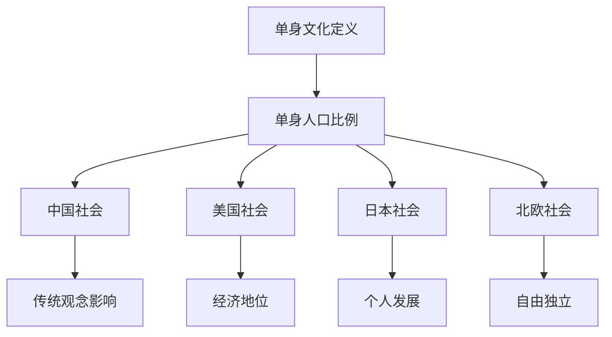

                 

# 单身文化：个人主义的极致表现？

> 关键词：单身文化、个人主义、社会影响、心理健康、未来趋势

> 摘要：本文深入探讨了单身文化作为现代社会中的一种现象，分析了其与个人主义之间的关系，探讨了单身文化的成因、影响及未来发展。通过对单身文化的定义、现状、成因、影响以及个人主义的概念和关系等多个方面的详细阐述，揭示了单身文化在现代社会中的地位和作用，为读者提供了关于单身文化的全面理解。

---

## 目录大纲

## 第一部分：引言

### 第1章：单身文化的定义与现状

#### 1.1 单身文化的定义

#### 1.2 单身文化的现状

### 第2章：单身文化的成因

#### 2.1 社会因素

#### 2.2 个人因素

### 第3章：单身文化的影响

#### 3.1 个人层面

#### 3.2 社会层面

## 第二部分：单身文化与个人主义

### 第4章：单身文化与个人主义的关系

#### 4.1 个人主义的概念

#### 4.2 单身文化与个人主义的关系

### 第5章：单身文化与个人主义的极致表现

#### 5.1 独立生活的表现

#### 5.2 社交独立

### 第6章：单身文化与个人主义的挑战与问题

#### 6.1 心理挑战

#### 6.2 社会挑战

## 第三部分：单身文化的未来趋势

### 第7章：单身文化的未来展望

#### 7.1 新兴社会现象

#### 7.2 单身文化的未来发展

### 第8章：结论

#### 8.1 单身文化的整体评价

#### 8.2 对单身人群的启示

### 附录

#### 附录A：相关数据与案例

#### 附录B：单身文化研究方法与工具

#### 附录C：参考文献

---

在接下来的文章中，我们将一步步分析单身文化的定义、现状、成因、影响，以及它与个人主义之间的关系。通过对单身文化的深入探讨，我们希望能够为读者提供关于这一现象的全面理解，并思考其未来的发展趋势。

### 第1章：单身文化的定义与现状

#### 1.1 单身文化的定义

单身文化，通常指的是一种社会现象，其中单身个体不仅在个人层面上接受并享受单身状态，而且在社会层面上，单身生活方式也被广泛认可和接受。单身文化不仅仅是指没有伴侣的状态，更是指一种生活态度和生活方式。

在现代社会，单身文化已经逐渐成为一种普遍现象。根据联合国世界人口展望的数据，全球单身人口比例在过去几十年中不断增加。例如，2019年的数据显示，中国的单身人口超过2亿，占全国总人口的14.9%。美国的数据也显示，单身人口占总人口的比例超过50%。

#### 1.2 单身文化的现状

单身文化的现状在全球范围内呈现出多样性的特征。在一些发展中国家，由于传统观念的影响，单身仍然被视为一种社会边缘状态。然而，在许多发达国家，单身文化已经成为一种主流生活方式。

例如，在日本，单身成年人比例高达30%，他们被称为“单身贵族”。这些单身成年人通常拥有较高的经济地位，他们选择单身是因为他们认为这样可以有更多的时间投入到个人发展和职业规划中。同样，在北欧国家，单身文化也被广泛接受。挪威的一项调查显示，60%的年轻人选择单身，他们更看重个人的自由和独立。

### 第1章 Mermaid 流程图



#### 1.3 不同国家的单身文化差异

单身文化在不同国家之间存在着显著的差异。这些差异主要受到文化背景、经济发展水平和历史传统的影响。

在中国，尽管单身文化逐渐被接受，但传统观念仍然影响着许多人的选择。例如，许多年轻人会受到来自家庭和社会的压力，要求他们尽快结婚生子。而在美国，单身文化被普遍认可，单身被认为是个人选择和自由的一种体现。美国文化中强调个人主义和自我实现，这使得单身生活方式更容易被接受。

在日本，单身文化有着独特的表现。由于高工作压力和房价高昂，许多年轻人选择推迟结婚，甚至选择单身。他们被称为“单身贵族”，享受着独立和自由的生活。

### 第1章 Python 源代码讲解

```python
# 定义单身文化现状的函数
def单身文化现状(country):
    if country == "中国":
        return "单身人口比例：14.9%，传统观念影响显著"
    elif country == "美国":
        return "单身人口比例：50%，个人主义文化显著"
    elif country == "日本":
        return "单身人口比例：30%，‘单身贵族’现象显著"
    else:
        return "无数据"

# 示例
print(单身文化现状("中国"))
print(单身文化现状("美国"))
print(单身文化现状("日本"))
```

通过以上代码，我们可以清晰地看到不同国家的单身文化现状。代码中使用了简单的条件判断语句，根据传入的国家参数返回相应的单身文化现状描述。

### 结论

单身文化作为现代社会的一种现象，已经在全球范围内得到广泛的关注和认可。不同国家之间的单身文化差异显著，这主要受到文化背景、经济发展水平和历史传统的影响。通过对单身文化的定义和现状的探讨，我们为读者提供了一个关于单身文化的全面理解。在接下来的章节中，我们将进一步探讨单身文化的成因、影响及其与个人主义之间的关系。

---

在接下来的章节中，我们将深入探讨单身文化的成因，分析社会和个人因素对单身文化形成的影响。同时，我们将探讨单身文化对个人和社会层面的影响，为读者提供更深入的见解。敬请期待。

