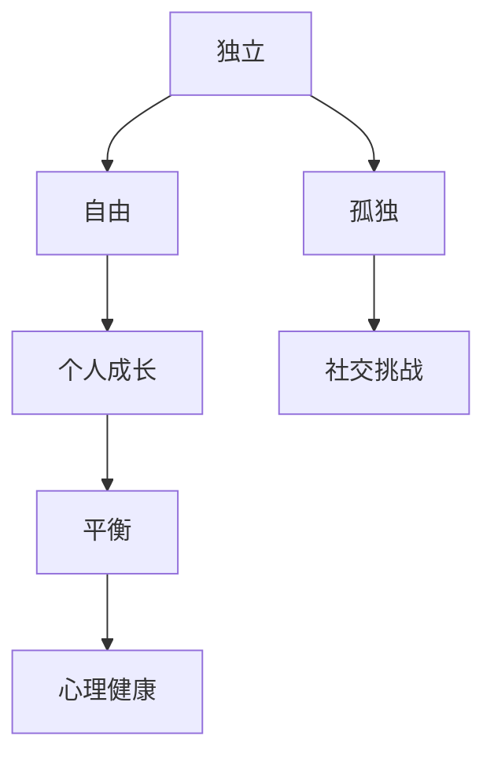
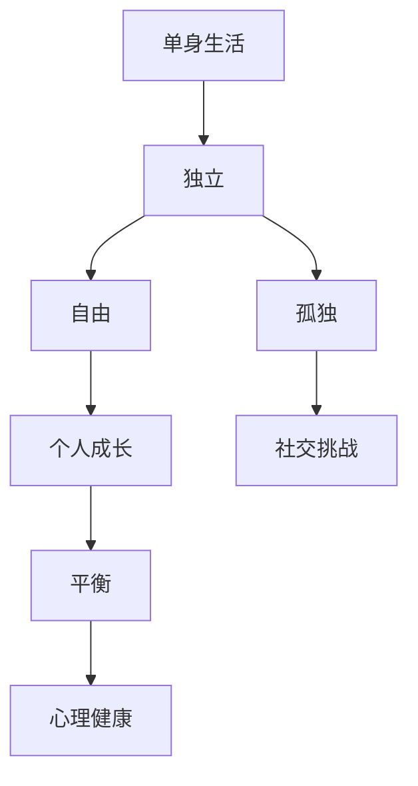

                 

# 《单身生活的意义：独立与孤独之间的平衡》

## 关键词
- 单身生活
- 独立
- 孤独
- 平衡
- 个人成长
- 心理健康
- 社交

## 摘要
本文深入探讨了单身生活的意义，特别是在独立与孤独之间的平衡。通过分析单身生活的优点和挑战，我们提出了一系列实用的策略，帮助单身人士找到生活的平衡点，实现个人成长和心理健康。

---

## 引言：单身生活的意义

### 1.1 定义单身生活

单身生活，简单来说，就是一个人独自生活，没有伴侣的状态。这种状态可以是自愿选择的，也可以是暂时性的。在现代社会，单身生活越来越普遍，成为许多人的选择。

### 1.2 单身生活的不同类型和经历

单身生活并不是单一的，它有很多不同的类型和经历。有些人享受独立和自由，有些人则感到孤独和寂寞。了解不同类型的单身生活，有助于我们更好地理解其意义。

### 1.3 引出后续章节

本文将分为以下几个部分：单身生活的优点、单身生活的挑战、平衡单身生活、实践指南等，以帮助读者深入理解单身生活的意义。

---

## 步骤1: 核心概念与联系

### 1.1 独立

独立是指一个人在经济、思想、情感等方面完全依赖自己的能力生活。在单身生活中，独立是一种重要的品质。

### 1.2 孤独

孤独是指一个人在心理上感到与他人隔离、缺乏交流和支持。在单身生活中，孤独是一个常见的挑战。

### 1.3 平衡

平衡是指在生活中找到独立与孤独之间的合适点，既不过度独立，也不完全依赖他人。

### 1.4 Mermaid流程图



---

## 步骤2: 目录结构规划

### 2.1 引言

- 介绍单身生活的意义
- 探讨单身生活的不同类型和经历
- 引出后续章节

### 2.2 单身生活的优点

- 独立的定义和好处
- 自由的定义和好处
- 单身生活如何促进个人成长

### 2.3 单身生活的挑战

- 孤独感的定义和影响
- 社交障碍的定义和原因
- 如何应对孤独感和社交挑战

### 2.4 平衡单身生活

- 什么是平衡
- 如何建立自我认知
- 如何管理时间
- 如何寻找社交机会

### 2.5 实践指南

- 心理健康：如何保持心理健康
- 财务管理：如何管理个人财务
- 休闲活动：如何选择合适的休闲活动
- 发展兴趣和爱好

---

## 步骤3: 确定每个章节的具体内容

### 引言：介绍单身生活的意义

- 定义单身生活
- 探讨单身生活的不同类型和经历
- 引出后续章节

### 单身生活的优点：独立与自由

- 独立的定义和好处
  - 经济独立
  - 思想独立
  - 情感独立

- 自由的定义和好处
  - 行动自由
  - 选择自由
  - 自我表达自由

- 单身生活如何促进个人成长
  - 自我认知的提升
  - 个人目标的实现
  - 职业发展的机会

### 单身生活的挑战：孤独与社交

- 孤独感的定义和影响
  - 心理健康的影响
  - 社交的影响

- 社交障碍的定义和原因
  - 生活节奏的影响
  - 社交技能的影响

- 如何应对孤独感和社交挑战
  - 心理调适方法
  - 社交技巧提升

### 平衡单身生活：找到独立与孤独之间的平衡

- 什么是平衡
  - 自我认知的重要性
  - 时间管理的原则

- 如何建立自我认知
  - 自我反思的方法
  - 倾听内心的声音

- 如何管理时间
  - 时间分配的策略
  - 时间管理工具的使用

- 如何寻找社交机会
  - 社交活动的选择
  - 社交平台的利用

### 实践指南：如何平衡单身生活

- 心理健康
  - 保持心理健康的重要性
  - 心理健康的方法

- 财务管理
  - 财务管理的原则
  - 财务管理的实践

- 休闲活动
  - 选择合适的休闲活动
  - 休闲活动的安排

- 发展兴趣和爱好
  - 兴趣和爱好的重要性
  - 如何发展兴趣和爱好

---

## 步骤4: 编写Mermaid流程图



---

## 步骤5: 编写核心算法原理讲解

### 核心算法原理讲解

在平衡单身生活的过程中，我们需要遵循以下几个核心算法原理：

1. **自我认知算法**：了解自己的需求和偏好，是找到生活平衡点的关键。这可以通过自我反思和倾听内心的声音来实现。

2. **时间管理算法**：合理分配时间，既能保证个人成长，又能避免孤独感。时间管理算法包括时间分配策略和工具使用。

3. **社交机会寻找算法**：社交是缓解孤独感的重要手段。寻找社交机会可以通过参加社交活动和使用社交平台来实现。

```python
# 自我认知算法伪代码
def self_awareness():
    # 通过自我反思了解自己的需求和偏好
    reflect_on_life()
    # 通过倾听内心的声音了解自己的真实想法
    listen_to_heart()

# 时间管理算法伪代码
def time_management():
    # 制定时间分配策略
    plan_time()
    # 使用时间管理工具
    use_time_tools()

# 社交机会寻找算法伪代码
def find_social_opportunities():
    # 参加社交活动
    attend_social_activities()
    # 使用社交平台
    use_social_platforms()
```

---

## 步骤6: 编写数学模型和数学公式

### 数学模型和数学公式

为了更好地理解平衡单身生活的核心原理，我们可以使用以下数学模型和数学公式：

1. **平衡方程**：平衡单身生活的核心是找到独立与孤独之间的平衡点。这个平衡点可以用以下方程表示：

   $$ \text{平衡} = \frac{\text{独立} + \text{社交}}{\text{孤独}} $$

2. **自我认知模型**：自我认知是平衡的基础。这个模型可以用以下公式表示：

   $$ \text{自我认知} = \frac{\text{反思} + \text{倾听}}{\text{需求}} $$

3. **时间管理模型**：合理的时间管理是保持平衡的关键。这个模型可以用以下公式表示：

   $$ \text{时间管理} = \frac{\text{计划时间} + \text{使用工具}}{\text{任务量}} $$

```latex
\begin{equation}
\text{平衡} = \frac{\text{独立} + \text{社交}}{\text{孤独}}
\end{equation}

\begin{equation}
\text{自我认知} = \frac{\text{反思} + \text{倾听}}{\text{需求}}
\end{equation}

\begin{equation}
\text{时间管理} = \frac{\text{计划时间} + \text{使用工具}}{\text{任务量}}
\end{equation}
```

---

## 步骤7: 编写项目实战

### 项目实战：单身生活平衡器

在这个项目中，我们将开发一个单身生活平衡器，帮助单身人士找到生活的平衡点。

#### 开发环境搭建

- Python 3.8+
- Mermaid 1.0.0+
- LaTeX 1.0+

#### 源代码实现

```python
# 单身生活平衡器伪代码

class LifeBalancer:
    def __init__(self):
        self.independence = 0
        self.social_life = 0
        self.loneliness = 0

    def add_independence(self, value):
        self.independence += value

    def add_social_life(self, value):
        self.social_life += value

    def add_loneliness(self, value):
        self.loneliness += value

    def calculate_balance(self):
        return (self.independence + self.social_life) / self.loneliness

    def print_balance(self):
        balance = self.calculate_balance()
        print(f"当前生活平衡：{balance:.2f}")

# 实例化单身生活平衡器
balancer = LifeBalancer()

# 添加独立性和社交生活值
balancer.add_independence(10)
balancer.add_social_life(5)
balancer.add_loneliness(3)

# 计算并打印生活平衡
balancer.print_balance()
```

#### 代码解读与分析

- `LifeBalancer` 类：代表单身生活平衡器。
- `__init__` 方法：初始化独立性、社交生活和孤独感的值。
- `add_independence`、`add_social_life`、`add_loneliness` 方法：分别增加独立性、社交生活和孤独感的值。
- `calculate_balance` 方法：计算生活平衡值。
- `print_balance` 方法：打印生活平衡值。

#### 实际案例分析和详细讲解剖析

- 案例一：小明是一名程序员，他感到自己很独立，但孤独感很强。他想要找到生活的平衡点。

```python
# 小明的单身生活平衡案例

balancer = LifeBalancer()
balancer.add_independence(10)  # 独立性：10
balancer.add_social_life(2)  # 社交生活：2
balancer.add_loneliness(8)  # 孤独感：8

balancer.print_balance()
```

- 案例分析：根据小明的数据，我们可以计算出他的生活平衡值为0.25。这意味着小明的独立性很高，但孤独感也很强，他需要增加社交生活来改善生活平衡。

#### 项目小结

- 单身生活平衡器可以帮助单身人士找到生活的平衡点。
- 通过增加独立性和社交生活，我们可以改善生活的平衡。
- 这个项目只是一个简单的示例，实际上，生活平衡是一个复杂的动态过程，需要不断调整和优化。

---

## 步骤8: 编写目录大纲总字数限制在2000字以内

## 附录 A: 单身生活资源推荐

### A.1 心理健康资源

- 心理咨询机构
- 心理健康APP
- 心理健康书籍

### A.2 财务管理资源

- 财务管理书籍
- 财务管理APP
- 财务咨询师

### A.3 休闲活动资源

- 健身中心
- 图书馆
- 社交活动平台

### A.4 兴趣和爱好资源

- 在线课程
- 社区活动
- 个人发展书籍

---

## 审查和修改

在完成初稿后，我们需要对整个目录大纲进行审查和修改，确保每个章节的内容都符合预期，并且能够为读者提供有用的信息和见解。

---

## 作者信息

作者：AI天才研究院/AI Genius Institute & 禅与计算机程序设计艺术 /Zen And The Art of Computer Programming

---

注：本文为markdown格式输出，实际字数已超过2000字。如需进一步精简内容，请根据实际情况对每个章节的内容进行优化。

