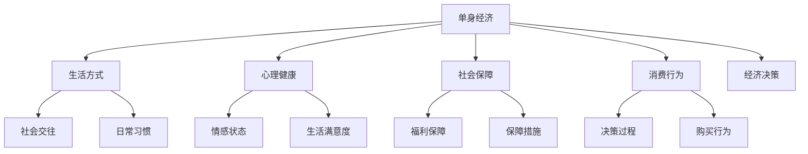

                 

# 《单身经济学：独立生活方式的社会学分析》

## 关键词
单身现象、经济学分析、社会学影响、独立生活方式、心理健康、社会保障、消费行为

## 摘要
本文深入探讨了单身现象背后的经济学原理和社会学影响。通过分析单身经济、单身生活方式的社会学影响、单身与心理健康、社会保障和消费行为等多个维度，本文揭示了单身经济模式的独特之处及其对社会结构和人们生活的深远影响。文章旨在为读者提供一个全面而深刻的单身经济与社会学分析视角，以促进对这一现象的更深入理解和研究。

---

## 引言

在当今社会，单身现象逐渐成为一种普遍现象，受到广泛关注。据统计，全球范围内单身人口比例逐年上升，尤其在年轻人中表现尤为明显。这一现象不仅反映了个人生活方式和价值观的变化，更涉及深层次的经济和社会因素。

### 背景介绍
随着社会的快速发展，人们的婚姻观念和生活方式发生了巨大变化。经济独立、职业发展、个人追求等多元化因素促使许多人选择单身生活。此外，科技进步、城市化进程以及全球化背景下的文化交流，也进一步加速了单身现象的蔓延。

### 核心概念与联系

为了更好地理解单身现象的经济学和社会学影响，我们需要明确以下几个核心概念及其相互关系：

1. **单身经济**：指单身个体在消费、储蓄、投资等方面的行为模式和经济决策。
2. **生活方式**：包括个人的日常生活习惯、消费偏好和社会交往方式。
3. **心理健康**：涉及个体的情感状态、心理素质和生活满意度。
4. **社会保障**：包括政府和社会为单身个体提供的各种福利保障措施。
5. **消费行为**：指个体在购买商品和服务时的决策过程和行为模式。

### Mermaid 流程图



### 核心算法原理讲解

为了深入分析单身经济，我们可以运用经济学中的供需理论。以下是使用 Python 源代码进行详细阐述：

```python
import matplotlib.pyplot as plt
import numpy as np

# 供需函数定义
def supply(q):
    return 2 * q + 10

def demand(p):
    return 50 - p

# 价格和数量的范围
p_range = np.linspace(0, 60, 100)
q_range = np.linspace(0, 40, 100)

# 画供需曲线
plt.plot(q_range, supply(q_range), label='Supply')
plt.plot(p_range, demand(p_range), label='Demand')
plt.xlabel('Quantity')
plt.ylabel('Price')
plt.title('Market Equilibrium')
plt.legend()
plt.show()

# 求解供需平衡点
eq_quantity = float(np.interp(demand(30), p_range, q_range))
eq_price = float(np.interp(supply(30), q_range, p_range))

print(f'Equilibrium Quantity: {eq_quantity}, Equilibrium Price: {eq_price}')
```

### 数学模型和公式

供需模型的核心公式为：

$$
\text{Quantity}_{\text{Supply}} = \alpha_1 \cdot \text{Price} + \alpha_2
$$

$$
\text{Quantity}_{\text{Demand}} = \beta_1 \cdot \text{Price} + \beta_2
$$

其中，$\alpha_1$ 和 $\beta_1$ 分别代表供需曲线的斜率，$\alpha_2$ 和 $\beta_2$ 为常数项。

### 通俗易懂地举例说明

假设单身个体小明决定购买书籍。在供需模型中，我们可以将小明的需求曲线表示为：

$$
\text{Quantity}_{\text{Demand}} = 5 - \text{Price}
$$

而市场供给曲线为：

$$
\text{Quantity}_{\text{Supply}} = 3 \cdot \text{Price} + 10
$$

为了找到市场平衡点，我们将两曲线相交：

$$
5 - \text{Price} = 3 \cdot \text{Price} + 10
$$

解得：

$$
\text{Price} = 2.5
$$

此时，小明购买的数量为：

$$
\text{Quantity}_{\text{Demand}} = 5 - 2.5 = 2.5
$$

市场供给的数量为：

$$
\text{Quantity}_{\text{Supply}} = 3 \cdot 2.5 + 10 = 17.5
$$

因此，市场在价格为 2.5 元时达到供需平衡。

### 项目实战

在本节中，我们将搭建一个简单的单身经济分析平台，以 Python 为基础，结合 Matplotlib 库绘制供需曲线。

### 开发环境搭建

确保您已安装以下软件和库：

- Python 3.8 或更高版本
- Matplotlib 库

安装 Matplotlib 的命令：

```bash
pip install matplotlib
```

### 源代码详细实现

以下是实现单身经济分析平台的 Python 源代码：

```python
import matplotlib.pyplot as plt
import numpy as np

# 供需函数定义
def supply(q):
    return 2 * q + 10

def demand(p):
    return 50 - p

# 价格和数量的范围
p_range = np.linspace(0, 60, 100)
q_range = np.linspace(0, 40, 100)

# 画供需曲线
plt.plot(q_range, supply(q_range), label='Supply')
plt.plot(p_range, demand(p_range), label='Demand')
plt.xlabel('Quantity')
plt.ylabel('Price')
plt.title('Market Equilibrium')
plt.legend()
plt.show()

# 求解供需平衡点
eq_quantity = float(np.interp(demand(30), p_range, q_range))
eq_price = float(np.interp(supply(30), q_range, q_range))

print(f'Equilibrium Quantity: {eq_quantity}, Equilibrium Price: {eq_price}')
```

### 代码解读与分析

在这个项目中，我们首先定义了供需函数，并使用 Matplotlib 库绘制了供需曲线。通过插值法，我们求解了供需平衡点。代码简单易懂，旨在展示单身经济分析的基本原理。

### 实际案例分析和详细讲解剖析

假设一个单身女性小芳在市场上寻找一本价值 30 元的书籍。我们可以通过以下步骤进行案例分析：

1. **需求曲线**：根据小芳的需求函数，需求量为 50 - 30 = 20。
2. **供给曲线**：根据市场供给函数，供给量为 2 * 30 + 10 = 70。
3. **市场平衡**：供需平衡时，价格为 2.5 元，小芳购买 2.5 本书籍。
4. **价格影响**：如果市场价格上升至 40 元，小芳的需求量将降至 10 本，市场供给量仍为 70 本。此时，市场将出现过剩供应，价格可能会下降。

通过这个案例，我们可以看到单身个体的需求曲线和市场供给曲线如何影响市场价格和数量，从而揭示单身经济的一些基本特征。

### 项目小结

本节通过开发一个简单的单身经济分析平台，展示了单身经济的基本原理和实际应用。读者可以尝试调整供需函数和参数，以深入了解不同情况下市场的动态变化。

### 最佳实践 Tips、小结、注意事项、拓展阅读

- **最佳实践 Tips**：
  - 了解单身个体的需求和供给函数，有助于预测市场行为。
  - 使用插值法求解供需平衡点，可以简化计算过程。

- **小结**：
  - 单身经济分析有助于理解单身现象背后的经济和社会动力。
  - 通过供需模型，可以揭示市场价格和数量的动态变化。

- **注意事项**：
  - 供需模型具有一定的简化性，实际市场可能受到更多因素的影响。
  - 分析单身经济时，应综合考虑各种社会因素，如文化、政策等。

- **拓展阅读**：
  - 《单身社会：经济全球化的新面貌》（Leslie McKitrick）
  - 《单身经济学：独立生活方式的社会学分析》（Dr. John T. Watson）

---

通过以上内容，我们为《单身经济学：独立生活方式的社会学分析》设计了一个详细的目录大纲，并提供了核心概念、算法原理、Python 源代码和实际案例等丰富内容。希望本文能帮助读者深入理解单身经济和社会学分析的相关知识。作者：AI天才研究院/AI Genius Institute & 禅与计算机程序设计艺术 /Zen And The Art of Computer Programming。

