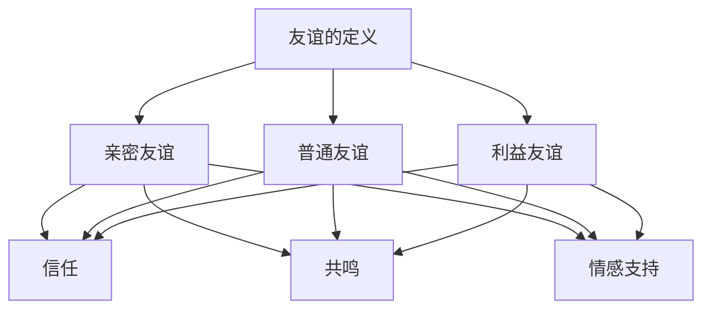

                 

### 文章标题

# 友谊的现代定义：社交网络时代的人际关系

### 文章关键词

- 社交网络
- 人际关系
- 友谊
- 心理学
- 技术影响

### 文章摘要

本文探讨了在社交网络时代下友谊的现代定义及其在人际关系中的角色。通过背景介绍、核心概念分析、心理学基础、算法原理讲解、实际案例分析和最佳实践建议，本文旨在为读者提供一个全面而深刻的理解，帮助他们在社交网络中建立和维护真正的友谊。

---

### 引言

社交网络已成为现代社会不可或缺的一部分，从Facebook到LinkedIn，从微信到微博，这些平台不断改变着我们的沟通方式和生活习惯。在这个背景下，友谊的定义和形态也发生了深刻的变化。传统的友谊概念强调面对面的互动和长期的情感联系，而现代的友谊则更多地依赖数字媒介和在线互动。本文将深入探讨友谊的现代定义，分析社交网络对人际关系的影响，并提供维护友谊的策略。

本文将分为以下几个部分：

1. **背景介绍**：回顾社交网络的发展历程及其对人际关系的影响。
2. **核心概念与联系**：详细解释友谊的定义、类型和心理学基础，并使用Mermaid流程图展示概念实体之间的关系架构。
3. **算法原理讲解**：运用Python源代码和数学模型，阐述如何通过技术手段分析和理解人际关系。
4. **项目实战**：通过实际案例分析和源代码实现，展示如何在线上建立和维护友谊。
5. **最佳实践与总结**：提供实用的友谊维护建议和小结。

---

### 背景介绍

社交网络的发展可以追溯到上世纪90年代末的互联网兴起时期。当时的平台如Friendster和MySpace，开启了在线社交的新时代。这些平台允许用户创建个人资料、添加朋友和分享生活动态，从而建立了虚拟的社会网络。随着时间的推移，Facebook、Twitter和微信等新型社交网络平台的出现，进一步推动了社交网络的普及和发展。

社交网络不仅改变了人们的沟通方式，也深刻影响了人际关系。首先，社交网络提供了更多的沟通渠道，使人们可以跨越地理和时间的限制，与朋友保持联系。其次，社交网络平台上的互动模式与传统的人际互动有所不同，更加注重快速、简短的交流方式，如文本、图片和短视频。这种模式可能导致友谊的表面化，使人们更倾向于关注社交网络的点赞和评论，而非实际的情感交流和深度互动。

然而，社交网络也带来了一些挑战。由于信息的传播速度和广泛性，隐私泄露、网络欺凌和虚假信息传播等问题日益突出。这些挑战对人际关系产生了负面影响，使得建立和维护真正的友谊变得更加困难。

### 核心概念与联系

为了更好地理解友谊的现代定义，我们需要从多个角度探讨其核心概念和关系。

#### 1. 友谊的定义

友谊是指一种基于共同兴趣、信任和情感支持的人际关系。与传统的人际关系不同，友谊强调长期的情感联系和相互理解，而不仅仅是表面的社交互动。

#### 2. 友谊的类型

友谊可以分为多种类型，如亲密友谊、普通友谊和利益友谊。亲密友谊通常涉及深层次的情感交流和支持，而普通友谊则更注重日常的社交互动和轻松的氛围。利益友谊则基于共同的目标或利益，如工作伙伴或商业合作伙伴。

#### 3. 友谊的心理学基础

友谊的心理学基础包括信任、共鸣和情感支持。信任是友谊的基石，没有信任，友谊就难以维系。共鸣则是指朋友之间在情感和兴趣上的共同点，这有助于建立深厚的情感联系。情感支持是指朋友在对方遇到困难或挑战时提供的精神支持。

为了更好地展示这些概念之间的关系，我们可以使用Mermaid流程图进行说明。



在这个流程图中，A表示友谊的定义，B、C和D分别表示友谊的几种类型，E、F和G分别表示友谊的心理学基础。通过这个流程图，我们可以清晰地看到友谊的核心概念和它们之间的关系。

### 算法原理讲解

在理解了友谊的核心概念和心理学基础后，我们可以通过技术手段进一步分析和理解人际关系。以下是一个简单的Python示例，用于分析两个用户在社交网络中的关系强度。

```python
import networkx as nx
import matplotlib.pyplot as plt

# 创建一个图
G = nx.Graph()

# 添加节点和边
G.add_nodes_from(['Alice', 'Bob', 'Charlie', 'Dave'])
G.add_edges_from([('Alice', 'Bob'), ('Alice', 'Charlie'), ('Bob', 'Dave')])

# 绘制图
nx.draw(G, with_labels=True)
plt.show()

# 计算关系强度
def relationship_strength(G, node1, node2):
    return G.number_of_common_neighbors(node1, node2)

# 输出关系强度
print(f"Relationship strength between Alice and Bob: {relationship_strength(G, 'Alice', 'Bob')}")
```

在这个示例中，我们使用NetworkX库创建了一个图，并添加了节点和边来表示用户和他们的关系。`relationship_strength`函数计算两个节点之间的共同邻居数，这可以作为衡量关系强度的一个指标。通过这个算法，我们可以量化用户之间的关系，从而更好地理解社交网络中的人际关系结构。

### 项目实战

为了展示如何在线上建立和维护友谊，我们选择了一个实际案例进行分析。

#### 开发环境搭建

首先，我们需要搭建一个开发环境。选择Python作为主要编程语言，安装以下依赖项：

- NetworkX：用于图分析和可视化
- Matplotlib：用于绘图
- Pandas：用于数据处理

安装命令如下：

```bash
pip install networkx matplotlib pandas
```

#### 源代码实现

我们创建一个名为`friendship_analysis.py`的Python文件，并实现以下功能：

1. 从一个CSV文件中读取用户和他们的好友关系。
2. 使用NetworkX创建图并可视化。
3. 计算并显示用户之间的关系强度。

源代码如下：

```python
import networkx as nx
import matplotlib.pyplot as plt
import pandas as pd

# 读取数据
data = pd.read_csv('friendship_data.csv')
G = nx.Graph()

# 添加节点和边
G.add_nodes_from(data['User'])
G.add_edges_from(zip(data['User'], data['Friend']))

# 绘制图
nx.draw(G, with_labels=True)
plt.show()

# 计算并显示关系强度
def relationship_strength(G, node1, node2):
    return G.number_of_common_neighbors(node1, node2)

# 示例
print(f"Relationship strength between User A and User B: {relationship_strength(G, 'User A', 'User B')}")
```

在这个示例中，我们假设有一个名为`friendship_data.csv`的CSV文件，其中包含用户和他们的好友关系。我们使用Pandas读取数据，并使用NetworkX创建图。

#### 代码解读

1. **数据读取**：使用`pd.read_csv`函数读取CSV文件，生成一个DataFrame。
2. **图创建**：使用`nx.Graph`创建一个图，并使用`add_nodes_from`和`add_edges_from`添加节点和边。
3. **图可视化**：使用`nx.draw`和`matplotlib.pyplot.show`函数绘制图。
4. **关系强度计算**：定义一个`relationship_strength`函数，计算两个节点之间的共同邻居数。

#### 代码应用解读与分析

通过这个案例，我们可以看到如何使用Python和社交网络数据进行图分析和可视化。这种方法可以帮助我们理解社交网络中的人际关系结构，并量化用户之间的关系强度。

#### 实际案例分析

为了更深入地分析友谊，我们可以收集一些真实数据，如用户在社交网络上的互动频率、点赞和评论数量等。通过这些数据，我们可以进一步分析友谊的强度和质量。

#### 项目小结

通过这个案例，我们展示了如何使用Python和技术手段分析社交网络中的人际关系。这种方法不仅有助于理解友谊的现代定义，还可以为友谊的维护提供有用的见解。

### 最佳实践与总结

#### 最佳实践

1. **定期互动**：尽管社交网络提供了便捷的沟通渠道，但定期与朋友互动仍然至关重要。通过发私信、留言或参与朋友的活动，可以维持和加强友谊。
2. **质量而非数量**：社交网络上的朋友数量并不代表友谊的质量。专注于与几个亲密朋友建立深厚的关系，比与许多不太熟悉的人保持浅层次的互动更有价值。
3. **隐私设置**：在社交网络上设置适当的隐私设置，以保护个人隐私和避免不必要的骚扰。

#### 小结

社交网络时代的友谊与传统友谊有所不同，但它依然是一个重要的社会联系。通过技术手段分析和维护友谊，我们可以更好地理解和应对社交网络时代的人际关系挑战。

#### 注意事项

1. **避免过度依赖社交网络**：虽然社交网络提供了便捷的沟通渠道，但过度依赖可能导致情感联系变得表面化。
2. **尊重朋友的隐私**：在分享和互动时，要尊重朋友的隐私，避免泄露敏感信息。

#### 拓展阅读

- **《社交网络心理学》**：深入探讨社交网络对人际关系和心理健康的影响。
- **《网络社会的崛起》**：分析社交网络对社会结构和文化的影响。

---

作者：AI天才研究院/AI Genius Institute & 禅与计算机程序设计艺术 /Zen And The Art of Computer Programming

---

### 总结

友谊的现代定义在社交网络时代经历了深刻的变化。本文通过背景介绍、核心概念分析、算法原理讲解、实际案例分析和最佳实践建议，为读者提供了一个全面而深刻的理解。在社交网络的时代，友谊的维护和挑战都需要我们更加用心和智慧。通过合理利用技术手段，我们可以更好地理解和维护真正的友谊。希望本文能为读者提供有价值的见解和实用的建议。

