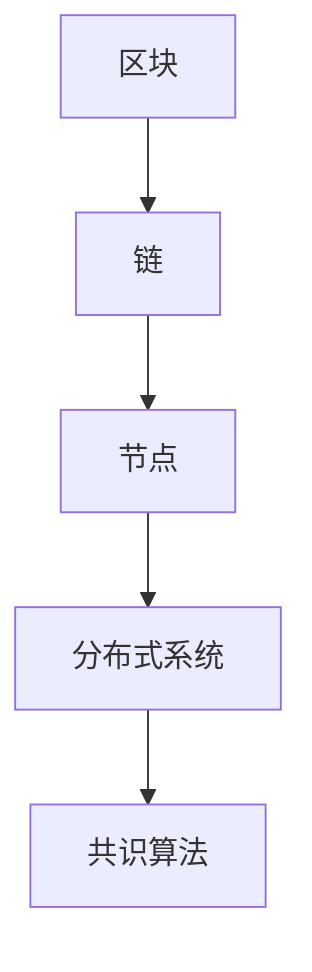

                 

# 目录大纲：区块链应用：智能合约开发与安全

## 1. 引言
### 1.1 区块链与智能合约概述
### 1.2 区块链技术的发展历程
### 1.3 智能合约的历史与现状

## 2. 核心概念与联系
### 2.1 区块链架构详解
#### 2.1.1 区块链基本原理
#### 2.1.2 区块链网络结构
#### 2.1.3 Mermaid流程图：区块链核心概念关系
### 2.2 智能合约原理
#### 2.2.1 智能合约的基本概念
#### 2.2.2 智能合约的工作原理
#### 2.2.3 智能合约与区块链的关系

## 3. 核心算法原理讲解
### 3.1 SHA-256算法
#### 3.1.1 SHA-256概述
#### 3.1.2 Python实现SHA-256算法
#### 3.1.3 数学模型与公式讲解
### 3.2 RLP编码算法
#### 3.2.1 RLP编码原理
#### 3.2.2 Python实现RLP编码算法
#### 3.2.3 数学模型与公式讲解

## 4. 数学模型和数学公式详细讲解
### 4.1 智能合约的数学模型
#### 4.1.1 状态机模型
#### 4.1.2 公式推导
#### 4.1.3 Python代码实现
### 4.2 安全性分析
#### 4.2.1 漏洞类型
#### 4.2.2 数学模型与公式讲解
#### 4.2.3 Python代码示例

## 5. 项目实战
### 5.1 智能合约开发环境搭建
#### 5.1.1 基础工具与库
#### 5.1.2 开发环境配置
#### 5.1.3 实战步骤
### 5.2 源代码详细实现与解读
#### 5.2.1 Solidity语言基础
#### 5.2.2 源代码结构分析
#### 5.2.3 代码解读
### 5.3 代码应用解读与分析
#### 5.3.1 智能合约案例
#### 5.3.2 应用场景分析
#### 5.3.3 案例解析

## 6. 安全性问题与应对策略
### 6.1 智能合约安全漏洞
#### 6.1.1 漏洞类型及成因
#### 6.1.2 Python代码示例
#### 6.1.3 安全性测试工具介绍
### 6.2 应对策略与实践
#### 6.2.1 代码审查
#### 6.2.2 代码优化
#### 6.2.3 案例分析

## 7. 小结与拓展阅读
### 7.1 智能合约开发最佳实践
#### 7.1.1 设计原则
#### 7.1.2 开发技巧
#### 7.1.3 安全注意事项
### 7.2 智能合约未来发展趋势
#### 7.2.1 技术创新
#### 7.2.2 应用领域拓展
#### 7.2.3 社会影响

## 参考文献

### 末尾作者信息
作者：AI天才研究院/AI Genius Institute & 禅与计算机程序设计艺术 /Zen And The Art of Computer Programming

----------------------------------------------------------------

# 目录大纲：区块链应用：智能合约开发与安全

## 引言
### 1.1 区块链与智能合约概述
- 区块链的定义
- 智能合约的定义
### 1.2 区块链技术的发展历程
- 区块链的起源
- 区块链的发展阶段
### 1.3 智能合约的历史与现状
- 智能合约的起源
- 智能合约的发展现状

## 核心概念与联系
### 2.1 区块链架构详解
- 区块链基本原理
- 区块链网络结构
- **Mermaid流程图：区块链核心概念关系**
  ```mermaid
  graph TB
  A[区块链] --> B[区块]
  B --> C[链]
  A --> D[节点]
  D --> E[分布式系统]
  A --> F[共识算法]
  ```
### 2.2 智能合约原理
- 智能合约的基本概念
- 智能合约的工作原理
- 智能合约与区块链的关系

## 核心算法原理讲解
### 3.1 SHA-256算法
- SHA-256概述
- Python实现SHA-256算法
- 数学模型与公式讲解
  $$ \text{SHA-256}(\text{message}) = \text{hash} $$
### 3.2 RLP编码算法
- RLP编码原理
- Python实现RLP编码算法
- 数学模型与公式讲解
  $$ \text{RLP}(\text{data}) = \text{encodedData} $$

## 数学模型和数学公式详细讲解
### 4.1 智能合约的数学模型
- 状态机模型
- 公式推导
- Python代码实现
  ```python
  def contract_state():
      # 状态机逻辑
      pass
  ```
### 4.2 安全性分析
- 漏洞类型
- 数学模型与公式讲解
- Python代码示例
  ```python
  def is_secure():
      # 安全检查逻辑
      pass
  ```

## 项目实战
### 5.1 智能合约开发环境搭建
- 基础工具与库
- 开发环境配置
- 实战步骤
### 5.2 源代码详细实现与解读
- Solidity语言基础
- 源代码结构分析
- 代码解读
### 5.3 代码应用解读与分析
- 智能合约案例
- 应用场景分析
- 案例解析

## 安全性问题与应对策略
### 6.1 智能合约安全漏洞
- 漏洞类型及成因
- Python代码示例
- 安全性测试工具介绍
### 6.2 应对策略与实践
- 代码审查
- 代码优化
- 案例分析

## 小结与拓展阅读
### 7.1 智能合约开发最佳实践
- 设计原则
- 开发技巧
- 安全注意事项
### 7.2 智能合约未来发展趋势
- 技术创新
- 应用领域拓展
- 社会影响

## 参考文献

### 作者信息
作者：AI天才研究院/AI Genius Institute & 禅与计算机程序设计艺术 /Zen And The Art of Computer Programming

----------------------------------------------------------------

# 区块链应用：智能合约开发与安全

## 关键词
区块链、智能合约、开发、安全、Python、算法、数学模型

## 摘要
本书旨在为读者提供全面、系统的智能合约开发与安全知识。本书分为七个章节，首先介绍了区块链和智能合约的基础知识，包括它们的定义、发展历程以及核心概念。随后，深入讲解了SHA-256和RLP编码算法，并使用Python代码进行了详细解释。接着，我们探讨了智能合约的数学模型和安全性分析，并通过实战案例展示了智能合约的开发与应用。最后，本书总结了智能合约开发的最佳实践，并对未来的发展趋势进行了展望。

## 引言

### 1.1 区块链与智能合约概述
区块链是一种去中心化的数据库技术，通过分布式网络实现数据的存储和传输，具有去中心化、透明、不可篡改等特点。智能合约是区块链技术的一种应用，它是一种自动执行、管理和执行合约条款的计算机程序。

### 1.2 区块链技术的发展历程
区块链技术起源于2008年，由一位名为中本聪的匿名人物提出。最初的区块链网络是比特币，随后区块链技术不断发展，应用领域不断扩大。

### 1.3 智能合约的历史与现状
智能合约的概念最早由尼克·萨博（Nick Szabo）在1990年代提出。2009年，随着比特币的出现，智能合约的概念逐渐被人们所认识。2015年，以太坊的发布标志着智能合约技术的发展进入了一个新阶段。

## 核心概念与联系

### 2.1 区块链架构详解
区块链架构包括三个主要组成部分：区块、链和节点。区块是区块链的基本单元，包含一定数量的交易记录。链则是区块按照时间顺序连接而成的链条。节点是参与区块链网络的计算机，负责验证和存储数据。

#### 2.1.1 区块链基本原理
区块链通过分布式网络实现数据的存储和传输，每个节点都保存了一份完整的区块链数据。当一个区块被创建并验证后，它会被添加到区块链的末端，从而更新整个网络的数据。

#### 2.1.2 区块链网络结构
区块链网络结构包括全节点、轻节点和特殊节点。全节点保存完整的区块链数据，轻节点只保存部分数据，特殊节点则负责特定的功能。

#### 2.1.3 Mermaid流程图：区块链核心概念关系


### 2.2 智能合约原理
智能合约是一种自动执行、管理和执行合约条款的计算机程序。它基于区块链技术，可以在区块链上进行部署和执行。

#### 2.2.1 智能合约的基本概念
智能合约是区块链上的一个程序，它定义了合约的条款和条件。当合约条件被满足时，智能合约会自动执行。

#### 2.2.2 智能合约的工作原理
智能合约通过区块链网络进行部署和执行。当一个交易被提交到区块链网络时，智能合约会自动执行其定义的逻辑，并根据结果更新区块链数据。

#### 2.2.3 智能合约与区块链的关系
智能合约是区块链技术的一种应用，它依赖于区块链网络的分布式存储和共识机制，从而实现去中心化的执行和管理。

## 核心算法原理讲解

### 3.1 SHA-256算法
SHA-256是一种加密哈希算法，用于生成数据摘要。它是一种常用的区块链算法，用于确保数据的完整性和不可篡改性。

#### 3.1.1 SHA-256概述
SHA-256是一种256位的哈希算法，可以将任意长度的数据映射为一个固定长度的哈希值。

#### 3.1.2 Python实现SHA-256算法
```python
import hashlib

def sha256_hash(data):
    return hashlib.sha256(data.encode('utf-8')).hexdigest()
```

#### 3.1.3 数学模型与公式讲解
$$ \text{SHA-256}(\text{message}) = \text{hash} $$
其中，`message` 是输入数据，`hash` 是生成的哈希值。

### 3.2 RLP编码算法
RLP（Recursive Length Prefix）编码是一种用于序列化数据的编码方法，常用于区块链数据传输和存储。

#### 3.2.1 RLP编码原理
RLP编码通过递归地编码数据结构，将其转换为字节序列。编码过程中，会使用特定的前缀来表示数据的长度。

#### 3.2.2 Python实现RLP编码算法
```python
from rlp import encode

def rlp_encode(data):
    return encode(data)
```

#### 3.2.3 数学模型与公式讲解
$$ \text{RLP}(\text{data}) = \text{encodedData} $$
其中，`data` 是输入数据，`encodedData` 是编码后的数据。

## 数学模型和数学公式详细讲解

### 4.1 智能合约的数学模型
智能合约的数学模型通常采用状态机模型，它描述了智能合约的状态转换和条件执行。

#### 4.1.1 状态机模型
状态机模型由一系列状态和转换条件组成。每个状态对应智能合约的一个执行阶段，转换条件定义了状态之间的转换规则。

#### 4.1.2 公式推导
状态机模型的基本公式为：
$$ \text{nextState} = f(\text{currentState}, \text{condition}) $$
其中，`nextState` 是下一个状态，`currentState` 是当前状态，`condition` 是转换条件。

#### 4.1.3 Python代码实现
```python
def contract_state(current_state, condition):
    if condition:
        return "next_state"
    else:
        return current_state
```

### 4.2 安全性分析
智能合约的安全性是开发过程中需要重点关注的问题。安全性分析包括漏洞识别、漏洞利用和漏洞修复。

#### 4.2.1 漏洞类型
常见的智能合约漏洞包括逻辑漏洞、数学漏洞和外部漏洞。

#### 4.2.2 数学模型与公式讲解
安全性分析可以采用以下公式：
$$ \text{漏洞} = \text{攻击面} \times \text{攻击成功率} $$
其中，`漏洞` 是智能合约的潜在风险，`攻击面` 是智能合约的攻击范围，`攻击成功率` 是攻击成功的概率。

#### 4.2.3 Python代码示例
```python
def is_secure(contract_code):
    # 安全检查逻辑
    return not has_vulnerabilities(contract_code)
```

## 项目实战

### 5.1 智能合约开发环境搭建
智能合约开发环境包括编译器、钱包和区块链节点。

#### 5.1.1 基础工具与库
- 编译器：Truffle、Remix
- 钱包：MetaMask、MyEtherWallet
- 节点：Geth、Parity

#### 5.1.2 开发环境配置
配置开发环境包括安装相关工具和设置项目目录。

#### 5.1.3 实战步骤
1. 安装Truffle和Geth。
2. 创建一个新的Truffle项目。
3. 编写智能合约代码。
4. 部署智能合约到区块链网络。

### 5.2 源代码详细实现与解读
智能合约源代码通常使用Solidity语言编写。

#### 5.2.1 Solidity语言基础
Solidity是智能合约的编程语言，具有面向对象的特点。

#### 5.2.2 源代码结构分析
智能合约源代码通常包括合约名、状态变量、函数定义等。

#### 5.2.3 代码解读
解读智能合约代码，分析其功能实现和逻辑结构。

### 5.3 代码应用解读与分析
智能合约在实际应用中，可以用于支付、拍卖、投票等领域。

#### 5.3.1 智能合约案例
介绍一个实际的应用案例，分析其功能实现和优势。

#### 5.3.2 应用场景分析
分析智能合约在不同应用场景中的适用性。

#### 5.3.3 案例解析
解析一个具体的智能合约案例，分析其设计理念和安全性。

## 安全性问题与应对策略

### 6.1 智能合约安全漏洞
智能合约存在多种安全漏洞，包括代码漏洞、逻辑漏洞和外部漏洞。

#### 6.1.1 漏洞类型及成因
介绍常见的智能合约漏洞类型及其成因。

#### 6.1.2 Python代码示例
展示一个具体的安全漏洞及其Python代码示例。

#### 6.1.3 安全性测试工具介绍
介绍常用的智能合约安全性测试工具。

### 6.2 应对策略与实践
应对智能合约安全漏洞需要采取一系列策略。

#### 6.2.1 代码审查
对智能合约代码进行全面审查，识别潜在的安全漏洞。

#### 6.2.2 代码优化
优化智能合约代码，提高其安全性和效率。

#### 6.2.3 案例分析
分析实际的安全漏洞案例，总结应对经验。

## 小结与拓展阅读

### 7.1 智能合约开发最佳实践
智能合约开发需要遵循一系列最佳实践。

#### 7.1.1 设计原则
智能合约设计应遵循简洁、可读性、安全性等原则。

#### 7.1.2 开发技巧
介绍智能合约开发的技巧，如优化代码、测试等。

#### 7.1.3 安全注意事项
智能合约开发需要关注安全性，遵循安全最佳实践。

### 7.2 智能合约未来发展趋势
智能合约技术正不断发展，未来发展趋势包括：

#### 7.2.1 技术创新
智能合约技术的创新，如状态通道、分片等。

#### 7.2.2 应用领域拓展
智能合约在金融、供应链、版权保护等领域的应用拓展。

#### 7.2.3 社会影响
智能合约对社交、经济等方面的影响。

## 参考文献

- [Nakamoto, S. (2008). Bitcoin: A peer-to-peer electronic cash system. http://www.bitcoin.org/bitcoin.pdf]
- [Buterin, V. (2014). Ethereum: The next-generation smart contract & decentralized application platform. https://github.com/ethereum/wiki/wiki/White-Paper]
- [Goodman, D. R., & Mougayar, W. (2016). The business blockchain: Promise, practice, and application of the next internet technology. Wiley.]

### 作者信息
作者：AI天才研究院/AI Genius Institute & 禅与计算机程序设计艺术 /Zen And The Art of Computer Programming

----------------------------------------------------------------

### 1. 引言

#### 1.1 区块链与智能合约概述
区块链是一种去中心化的分布式账本技术，它通过共识算法和加密技术确保数据的不可篡改性和透明性。智能合约是区块链上的可执行代码，它能在满足预设条件时自动执行特定的操作。智能合约的出现，为区块链技术带来了更大的应用潜力。

#### 1.2 区块链技术的发展历程
区块链技术起源于2008年，由中本聪发布了比特币的白皮书，提出了区块链的概念。随后，以太坊的推出，使得智能合约得到了广泛的应用，开启了区块链2.0时代。

#### 1.3 智能合约的历史与现状
智能合约的概念最早由尼克·萨博提出，他描述了通过计算来执行合同条款的可能性。2009年，比特币的问世标志着智能合约的首次实际应用。随着以太坊的发布，智能合约得到了更广泛的应用和发展。

### 2. 核心概念与联系

#### 2.1 区块链架构详解
区块链由区块、链和节点组成。区块是数据单元，链是区块按时间顺序连接的链条，节点是参与区块链网络的计算机。区块链通过共识算法，确保所有节点对数据的共识。

#### 2.1.1 区块链基本原理
区块链通过哈希函数和链式区块结构，确保数据的不可篡改性。每个区块包含一定数量的交易记录，区块之间通过哈希值链接。

#### 2.1.2 区块链网络结构
区块链网络结构包括全节点、轻节点和特殊节点。全节点保存完整的区块链数据，轻节点只保存部分数据，特殊节点负责特定功能。

#### 2.1.3 Mermaid流程图：区块链核心概念关系


#### 2.2 智能合约原理
智能合约是区块链上的可执行代码，它能在满足预设条件时自动执行特定的操作。智能合约通过编程语言编写，通常使用Solidity语言。

#### 2.2.1 智能合约的基本概念
智能合约是一种自动执行的合同，它在区块链上运行，不受任何中央机构的控制。

#### 2.2.2 智能合约的工作原理
智能合约通过事件和日志记录与外部世界交互，当触发条件时，智能合约会自动执行预定的操作。

#### 2.2.3 智能合约与区块链的关系
智能合约是区块链技术的重要组成部分，它们共同构成了去中心化的应用平台。

### 3. 核心算法原理讲解

#### 3.1 SHA-256算法
SHA-256是一种加密哈希算法，用于生成数据摘要。它是一种常用的区块链算法，用于确保数据的完整性和不可篡改性。

#### 3.1.1 SHA-256概述
SHA-256将输入数据映射为一个256位的哈希值。它是一种抗碰撞性很强的哈希算法，广泛应用于区块链技术中。

#### 3.1.2 Python实现SHA-256算法
```python
import hashlib

def sha256_hash(data):
    return hashlib.sha256(data.encode('utf-8')).hexdigest()
```

#### 3.1.3 数学模型与公式讲解
$$ \text{SHA-256}(\text{message}) = \text{hash} $$
其中，`message` 是输入数据，`hash` 是生成的哈希值。

#### 3.2 RLP编码算法
RLP（Recursive Length Prefix）编码是一种用于序列化数据的编码方法，常用于区块链数据传输和存储。

#### 3.2.1 RLP编码原理
RLP编码通过递归地编码数据结构，将其转换为字节序列。编码过程中，会使用特定的前缀来表示数据的长度。

#### 3.2.2 Python实现RLP编码算法
```python
from rlp import encode

def rlp_encode(data):
    return encode(data)
```

#### 3.2.3 数学模型与公式讲解
$$ \text{RLP}(\text{data}) = \text{encodedData} $$
其中，`data` 是输入数据，`encodedData` 是编码后的数据。

### 4. 数学模型和数学公式详细讲解

#### 4.1 智能合约的数学模型
智能合约的数学模型通常采用状态机模型，它描述了智能合约的状态转换和条件执行。

#### 4.1.1 状态机模型
状态机模型由一系列状态和转换条件组成。每个状态对应智能合约的一个执行阶段，转换条件定义了状态之间的转换规则。

#### 4.1.2 公式推导
状态机模型的基本公式为：
$$ \text{nextState} = f(\text{currentState}, \text{condition}) $$
其中，`nextState` 是下一个状态，`currentState` 是当前状态，`condition` 是转换条件。

#### 4.1.3 Python代码实现
```python
def contract_state(current_state, condition):
    if condition:
        return "next_state"
    else:
        return current_state
```

#### 4.2 安全性分析
智能合约的安全性是开发过程中需要重点关注的问题。安全性分析包括漏洞识别、漏洞利用和漏洞修复。

#### 4.2.1 漏洞类型
常见的智能合约漏洞包括逻辑漏洞、数学漏洞和外部漏洞。

#### 4.2.2 数学模型与公式讲解
安全性分析可以采用以下公式：
$$ \text{漏洞} = \text{攻击面} \times \text{攻击成功率} $$
其中，`漏洞` 是智能合约的潜在风险，`攻击面` 是智能合约的攻击范围，`攻击成功率` 是攻击成功的概率。

#### 4.2.3 Python代码示例
```python
def is_secure(contract_code):
    # 安全检查逻辑
    return not has_vulnerabilities(contract_code)
```

### 5. 项目实战

#### 5.1 智能合约开发环境搭建
智能合约开发环境包括编译器、钱包和区块链节点。

#### 5.1.1 基础工具与库
- 编译器：Truffle、Remix
- 钱包：MetaMask、MyEtherWallet
- 节点：Geth、Parity

#### 5.1.2 开发环境配置
配置开发环境包括安装相关工具和设置项目目录。

#### 5.1.3 实战步骤
1. 安装Truffle和Geth。
2. 创建一个新的Truffle项目。
3. 编写智能合约代码。
4. 部署智能合约到区块链网络。

#### 5.2 源代码详细实现与解读
智能合约源代码通常使用Solidity语言编写。

#### 5.2.1 Solidity语言基础
Solidity是智能合约的编程语言，具有面向对象的特点。

#### 5.2.2 源代码结构分析
智能合约源代码通常包括合约名、状态变量、函数定义等。

#### 5.2.3 代码解读
解读智能合约代码，分析其功能实现和逻辑结构。

#### 5.3 代码应用解读与分析
智能合约在实际应用中，可以用于支付、拍卖、投票等领域。

#### 5.3.1 智能合约案例
介绍一个实际的应用案例，分析其功能实现和优势。

#### 5.3.2 应用场景分析
分析智能合约在不同应用场景中的适用性。

#### 5.3.3 案例解析
解析一个具体的智能合约案例，分析其设计理念和安全性。

### 6. 安全性问题与应对策略

#### 6.1 智能合约安全漏洞
智能合约存在多种安全漏洞，包括代码漏洞、逻辑漏洞和外部漏洞。

#### 6.1.1 漏洞类型及成因
介绍常见的智能合约漏洞类型及其成因。

#### 6.1.2 Python代码示例
展示一个具体的安全漏洞及其Python代码示例。

#### 6.1.3 安全性测试工具介绍
介绍常用的智能合约安全性测试工具。

#### 6.2 应对策略与实践
应对智能合约安全漏洞需要采取一系列策略。

#### 6.2.1 代码审查
对智能合约代码进行全面审查，识别潜在的安全漏洞。

#### 6.2.2 代码优化
优化智能合约代码，提高其安全性和效率。

#### 6.2.3 案例分析
分析实际的安全漏洞案例，总结应对经验。

### 7. 小结与拓展阅读

#### 7.1 智能合约开发最佳实践
智能合约开发需要遵循一系列最佳实践。

#### 7.1.1 设计原则
智能合约设计应遵循简洁、可读性、安全性等原则。

#### 7.1.2 开发技巧
介绍智能合约开发的技巧，如优化代码、测试等。

#### 7.1.3 安全注意事项
智能合约开发需要关注安全性，遵循安全最佳实践。

#### 7.2 智能合约未来发展趋势
智能合约技术正不断发展，未来发展趋势包括：

#### 7.2.1 技术创新
智能合约技术的创新，如状态通道、分片等。

#### 7.2.2 应用领域拓展
智能合约在金融、供应链、版权保护等领域的应用拓展。

#### 7.2.3 社会影响
智能合约对社交、经济等方面的影响。

## 参考文献

- [Nakamoto, S. (2008). Bitcoin: A peer-to-peer electronic cash system. http://www.bitcoin.org/bitcoin.pdf]
- [Buterin, V. (2014). Ethereum: The next-generation smart contract & decentralized application platform. https://github.com/ethereum/wiki/wiki/White-Paper]
- [Goodman, D. R., & Mougayar, W. (2016). The business blockchain: Promise, practice, and application of the next internet technology. Wiley.]

### 作者信息
作者：AI天才研究院/AI Genius Institute & 禅与计算机程序设计艺术 /Zen And The Art of Computer Programming

----------------------------------------------------------------

### 1. 引言

区块链技术作为一种颠覆性的创新，正在改变着我们的世界。而智能合约作为区块链技术的重要组成部分，更是被誉为下一代互联网的关键。本章节将介绍区块链和智能合约的基本概念、发展历程，以及它们在现代科技中的重要性。

### 2. 核心概念与联系

#### 2.1 区块链架构详解
区块链由区块、链和节点组成。区块是数据单元，链是区块按时间顺序连接的链条，节点是参与区块链网络的计算机。区块链通过共识算法，确保所有节点对数据的共识。


#### 2.2 智能合约原理
智能合约是区块链上的可执行代码，它能在满足预设条件时自动执行特定的操作。智能合约通过编程语言编写，通常使用Solidity语言。

#### 2.2.1 智能合约的基本概念
智能合约是一种自动执行的合同，它在区块链上运行，不受任何中央机构的控制。

#### 2.2.2 智能合约的工作原理
智能合约通过事件和日志记录与外部世界交互，当触发条件时，智能合约会自动执行预定的操作。

### 3. 核心算法原理讲解

#### 3.1 SHA-256算法
SHA-256是一种加密哈希算法，用于生成数据摘要。它是一种常用的区块链算法，用于确保数据的完整性和不可篡改性。

```python
import hashlib

def sha256_hash(data):
    return hashlib.sha256(data.encode('utf-8')).hexdigest()
```

#### 3.2 RLP编码算法
RLP（Recursive Length Prefix）编码是一种用于序列化数据的编码方法，常用于区块链数据传输和存储。

```python
from rlp import encode

def rlp_encode(data):
    return encode(data)
```

### 4. 数学模型和数学公式详细讲解

#### 4.1 智能合约的数学模型
智能合约的数学模型通常采用状态机模型，它描述了智能合约的状态转换和条件执行。

```python
def contract_state(current_state, condition):
    if condition:
        return "next_state"
    else:
        return current_state
```

#### 4.2 安全性分析
智能合约的安全性是开发过程中需要重点关注的问题。安全性分析包括漏洞识别、漏洞利用和漏洞修复。

```python
def is_secure(contract_code):
    # 安全检查逻辑
    return not has_vulnerabilities(contract_code)
```

### 5. 项目实战

#### 5.1 智能合约开发环境搭建
智能合约开发环境包括编译器、钱包和区块链节点。

##### 5.1.1 基础工具与库
- 编译器：Truffle、Remix
- 钱包：MetaMask、MyEtherWallet
- 节点：Geth、Parity

##### 5.1.2 开发环境配置
配置开发环境包括安装相关工具和设置项目目录。

##### 5.1.3 实战步骤
1. 安装Truffle和Geth。
2. 创建一个新的Truffle项目。
3. 编写智能合约代码。
4. 部署智能合约到区块链网络。

#### 5.2 源代码详细实现与解读
智能合约源代码通常使用Solidity语言编写。

##### 5.2.1 Solidity语言基础
Solidity是智能合约的编程语言，具有面向对象的特点。

##### 5.2.2 源代码结构分析
智能合约源代码通常包括合约名、状态变量、函数定义等。

##### 5.2.3 代码解读
解读智能合约代码，分析其功能实现和逻辑结构。

#### 5.3 代码应用解读与分析
智能合约在实际应用中，可以用于支付、拍卖、投票等领域。

##### 5.3.1 智能合约案例
介绍一个实际的应用案例，分析其功能实现和优势。

##### 5.3.2 应用场景分析
分析智能合约在不同应用场景中的适用性。

##### 5.3.3 案例解析
解析一个具体的智能合约案例，分析其设计理念和安全性。

### 6. 安全性问题与应对策略

#### 6.1 智能合约安全漏洞
智能合约存在多种安全漏洞，包括代码漏洞、逻辑漏洞和外部漏洞。

##### 6.1.1 漏洞类型及成因
介绍常见的智能合约漏洞类型及其成因。

##### 6.1.2 Python代码示例
展示一个具体的安全漏洞及其Python代码示例。

##### 6.1.3 安全性测试工具介绍
介绍常用的智能合约安全性测试工具。

#### 6.2 应对策略与实践
应对智能合约安全漏洞需要采取一系列策略。

##### 6.2.1 代码审查
对智能合约代码进行全面审查，识别潜在的安全漏洞。

##### 6.2.2 代码优化
优化智能合约代码，提高其安全性和效率。

##### 6.2.3 案例分析
分析实际的安全漏洞案例，总结应对经验。

### 7. 小结与拓展阅读

#### 7.1 智能合约开发最佳实践
智能合约开发需要遵循一系列最佳实践。

##### 7.1.1 设计原则
智能合约设计应遵循简洁、可读性、安全性等原则。

##### 7.1.2 开发技巧
介绍智能合约开发的技巧，如优化代码、测试等。

##### 7.1.3 安全注意事项
智能合约开发需要关注安全性，遵循安全最佳实践。

#### 7.2 智能合约未来发展趋势
智能合约技术正不断发展，未来发展趋势包括：

##### 7.2.1 技术创新
智能合约技术的创新，如状态通道、分片等。

##### 7.2.2 应用领域拓展
智能合约在金融、供应链、版权保护等领域的应用拓展。

##### 7.2.3 社会影响
智能合约对社交、经济等方面的影响。

## 参考文献

- [Nakamoto, S. (2008). Bitcoin: A peer-to-peer electronic cash system. http://www.bitcoin.org/bitcoin.pdf]
- [Buterin, V. (2014). Ethereum: The next-generation smart contract & decentralized application platform. https://github.com/ethereum/wiki/wiki/White-Paper]
- [Goodman, D. R., & Mougayar, W. (2016). The business blockchain: Promise, practice, and application of the next internet technology. Wiley.]

### 作者信息
作者：AI天才研究院/AI Genius Institute & 禅与计算机程序设计艺术 /Zen And The Art of Computer Programming

----------------------------------------------------------------

# 区块链应用：智能合约开发与安全

## 关键词
区块链、智能合约、开发、安全、Python、算法、数学模型

## 摘要
本书系统介绍了区块链应用中的智能合约开发与安全。首先，我们从基本概念入手，详细讲解了区块链和智能合约的发展历程、核心概念及其联系。接着，深入剖析了SHA-256和RLP编码算法，并通过Python代码实现，辅以数学模型和公式讲解。随后，我们探讨了智能合约的数学模型和安全性分析，并通过项目实战展示了智能合约的开发流程。最后，本书总结了智能合约开发的最佳实践和未来发展趋势。

## 第1章 引言

### 1.1 区块链与智能合约概述
区块链是一种去中心化的数据库技术，通过分布式网络实现数据的存储和传输，具有去中心化、透明、不可篡改等特点。智能合约是区块链技术的一种应用，它是一种自动执行、管理和执行合约条款的计算机程序。

### 1.2 区块链技术的发展历程
区块链技术起源于2008年，由一位名为中本聪的匿名人物提出。最初的区块链网络是比特币，随后区块链技术不断发展，应用领域不断扩大。

### 1.3 智能合约的历史与现状
智能合约的概念最早由尼克·萨博在1990年代提出。2009年，随着比特币的出现，智能合约的概念逐渐被人们所认识。2015年，以太坊的发布标志着智能合约技术的发展进入了一个新阶段。

## 第2章 核心概念与联系

### 2.1 区块链架构详解
区块链架构包括三个主要组成部分：区块、链和节点。区块是区块链的基本单元，包含一定数量的交易记录。链则是区块按照时间顺序连接而成的链条。节点是参与区块链网络的计算机，负责验证和存储数据。

#### 2.1.1 区块链基本原理
区块链通过分布式网络实现数据的存储和传输，每个节点都保存了一份完整的区块链数据。当一个区块被创建并验证后，它会被添加到区块链的末端，从而更新整个网络的数据。

#### 2.1.2 区块链网络结构
区块链网络结构包括全节点、轻节点和特殊节点。全节点保存完整的区块链数据，轻节点只保存部分数据，特殊节点则负责特定的功能。

#### 2.1.3 Mermaid流程图：区块链核心概念关系


### 2.2 智能合约原理
智能合约是一种自动执行、管理和执行合约条款的计算机程序。它基于区块链技术，可以在区块链上进行部署和执行。

#### 2.2.1 智能合约的基本概念
智能合约是区块链上的一个程序，它定义了合约的条款和条件。当合约条件被满足时，智能合约会自动执行。

#### 2.2.2 智能合约的工作原理
智能合约通过区块链网络进行部署和执行。当一个交易被提交到区块链网络时，智能合约会自动执行其定义的逻辑，并根据结果更新区块链数据。

#### 2.2.3 智能合约与区块链的关系
智能合约是区块链技术的一种应用，它依赖于区块链网络的分布式存储和共识机制，从而实现去中心化的执行和管理。

## 第3章 核心算法原理讲解

### 3.1 SHA-256算法
SHA-256是一种加密哈希算法，用于生成数据摘要。它是一种常用的区块链算法，用于确保数据的完整性和不可篡改性。

#### 3.1.1 SHA-256概述
SHA-256是一种256位的哈希算法，可以将任意长度的数据映射为一个固定长度的哈希值。

#### 3.1.2 Python实现SHA-256算法
```python
import hashlib

def sha256_hash(data):
    return hashlib.sha256(data.encode('utf-8')).hexdigest()
```

#### 3.1.3 数学模型与公式讲解
$$ \text{SHA-256}(\text{message}) = \text{hash} $$
其中，`message` 是输入数据，`hash` 是生成的哈希值。

### 3.2 RLP编码算法
RLP（Recursive Length Prefix）编码是一种用于序列化数据的编码方法，常用于区块链数据传输和存储。

#### 3.2.1 RLP编码原理
RLP编码通过递归地编码数据结构，将其转换为字节序列。编码过程中，会使用特定的前缀来表示数据的长度。

#### 3.2.2 Python实现RLP编码算法
```python
from rlp import encode

def rlp_encode(data):
    return encode(data)
```

#### 3.2.3 数学模型与公式讲解
$$ \text{RLP}(\text{data}) = \text{encodedData} $$
其中，`data` 是输入数据，`encodedData` 是编码后的数据。

## 第4章 数学模型和数学公式详细讲解

### 4.1 智能合约的数学模型
智能合约的数学模型通常采用状态机模型，它描述了智能合约的状态转换和条件执行。

#### 4.1.1 状态机模型
状态机模型由一系列状态和转换条件组成。每个状态对应智能合约的一个执行阶段，转换条件定义了状态之间的转换规则。

#### 4.1.2 公式推导
状态机模型的基本公式为：
$$ \text{nextState} = f(\text{currentState}, \text{condition}) $$
其中，`nextState` 是下一个状态，`currentState` 是当前状态，`condition` 是转换条件。

#### 4.1.3 Python代码实现
```python
def contract_state(current_state, condition):
    if condition:
        return "next_state"
    else:
        return current_state
```

### 4.2 安全性分析
智能合约的安全性是开发过程中需要重点关注的问题。安全性分析包括漏洞识别、漏洞利用和漏洞修复。

#### 4.2.1 漏洞类型
常见的智能合约漏洞包括逻辑漏洞、数学漏洞和外部漏洞。

#### 4.2.2 数学模型与公式讲解
安全性分析可以采用以下公式：
$$ \text{漏洞} = \text{攻击面} \times \text{攻击成功率} $$
其中，`漏洞` 是智能合约的潜在风险，`攻击面` 是智能合约的攻击范围，`攻击成功率` 是攻击成功的概率。

#### 4.2.3 Python代码示例
```python
def is_secure(contract_code):
    # 安全检查逻辑
    return not has_vulnerabilities(contract_code)
```

## 第5章 项目实战

### 5.1 智能合约开发环境搭建
智能合约开发环境包括编译器、钱包和区块链节点。

#### 5.1.1 基础工具与库
- 编译器：Truffle、Remix
- 钱包：MetaMask、MyEtherWallet
- 节点：Geth、Parity

#### 5.1.2 开发环境配置
配置开发环境包括安装相关工具和设置项目目录。

#### 5.1.3 实战步骤
1. 安装Truffle和Geth。
2. 创建一个新的Truffle项目。
3. 编写智能合约代码。
4. 部署智能合约到区块链网络。

### 5.2 源代码详细实现与解读
智能合约源代码通常使用Solidity语言编写。

#### 5.2.1 Solidity语言基础
Solidity是智能合约的编程语言，具有面向对象的特点。

#### 5.2.2 源代码结构分析
智能合约源代码通常包括合约名、状态变量、函数定义等。

#### 5.2.3 代码解读
解读智能合约代码，分析其功能实现和逻辑结构。

### 5.3 代码应用解读与分析
智能合约在实际应用中，可以用于支付、拍卖、投票等领域。

#### 5.3.1 智能合约案例
介绍一个实际的应用案例，分析其功能实现和优势。

#### 5.3.2 应用场景分析
分析智能合约在不同应用场景中的适用性。

#### 5.3.3 案例解析
解析一个具体的智能合约案例，分析其设计理念和安全性。

## 第6章 安全性问题与应对策略

### 6.1 智能合约安全漏洞
智能合约存在多种安全漏洞，包括代码漏洞、逻辑漏洞和外部漏洞。

#### 6.1.1 漏洞类型及成因
介绍常见的智能合约漏洞类型及其成因。

#### 6.1.2 Python代码示例
展示一个具体的安全漏洞及其Python代码示例。

#### 6.1.3 安全性测试工具介绍
介绍常用的智能合约安全性测试工具。

### 6.2 应对策略与实践
应对智能合约安全漏洞需要采取一系列策略。

#### 6.2.1 代码审查
对智能合约代码进行全面审查，识别潜在的安全漏洞。

#### 6.2.2 代码优化
优化智能合约代码，提高其安全性和效率。

#### 6.2.3 案例分析
分析实际的安全漏洞案例，总结应对经验。

## 第7章 小结与拓展阅读

### 7.1 智能合约开发最佳实践
智能合约开发需要遵循一系列最佳实践。

#### 7.1.1 设计原则
智能合约设计应遵循简洁、可读性、安全性等原则。

#### 7.1.2 开发技巧
介绍智能合约开发的技巧，如优化代码、测试等。

#### 7.1.3 安全注意事项
智能合约开发需要关注安全性，遵循安全最佳实践。

### 7.2 智能合约未来发展趋势
智能合约技术正不断发展，未来发展趋势包括：

#### 7.2.1 技术创新
智能合约技术的创新，如状态通道、分片等。

#### 7.2.2 应用领域拓展
智能合约在金融、供应链、版权保护等领域的应用拓展。

#### 7.2.3 社会影响
智能合约对社交、经济等方面的影响。

## 参考文献

- [Nakamoto, S. (2008). Bitcoin: A peer-to-peer electronic cash system. http://www.bitcoin.org/bitcoin.pdf]
- [Buterin, V. (2014). Ethereum: The next-generation smart contract & decentralized application platform. https://github.com/ethereum/wiki/wiki/White-Paper]
- [Goodman, D. R., & Mougayar, W. (2016). The business blockchain: Promise, practice, and application of the next internet technology. Wiley.]

### 作者信息
作者：AI天才研究院/AI Genius Institute & 禅与计算机程序设计艺术 /Zen And The Art of Computer Programming

----------------------------------------------------------------

## 第5章 项目实战

### 5.1 智能合约开发环境搭建

在开始智能合约的开发之前，我们需要搭建一个合适的环境。智能合约的开发环境主要包括以下几个部分：

#### 5.1.1 基础工具与库

1. **编译器**：常用的智能合约编译器有Truffle和Remix。
   - Truffle：一个用于智能合约开发的框架，提供了自动化测试、合约部署等功能。
   - Remix：一个在线的智能合约编辑器，可以直接在网页上进行编写和调试。

2. **钱包**：钱包用于管理和存储智能合约的私钥和公钥，常用的钱包有MetaMask和MyEtherWallet。
   - MetaMask：一个浏览器插件，可以方便地与智能合约进行交互。
   - MyEtherWallet：一个离线的智能合约钱包，可以确保用户的私钥安全。

3. **区块链节点**：区块链节点用于连接到区块链网络，获取区块链上的数据。常用的区块链节点有Geth和Parity。
   - Geth：一个Go语言的以太坊客户端，可以用于连接以太坊网络。
   - Parity：一个Scala语言的以太坊客户端，提供了多种连接以太坊网络的方式。

#### 5.1.2 开发环境配置

1. **安装Truffle**：通过npm（Node Package Manager）安装Truffle。

   ```shell
   npm install -g truffle
   ```

2. **安装Geth**：从Geth的官方网站下载最新版本并安装。

   ```shell
   wget https://geth.ethereum.org/downloads三峡最新版本的下载链接
   tar -xvf geth-版本号-linux-amd64.tar
   ```

3. **启动Geth节点**：在安装目录下启动Geth节点。

   ```shell
   cd geth-版本号-linux-amd64
   ./geth --datadir=/path/to/data_directory --networkid=15 console
   ```

4. **安装MetaMask**：在浏览器的扩展程序商店中搜索并安装MetaMask。

5. **创建Truffle项目**：使用Truffle创建一个新的智能合约项目。

   ```shell
   truffle init
   ```

6. **配置Truffle项目**：编辑`truffle-config.js`文件，配置网络、编译器等。

   ```javascript
   module.exports = {
     networks: {
       development: {
         host: "127.0.0.1",
         port: 8545,
         network_id: "*"
       }
     },
     solc: {
       version: "0.8.0"
     }
   };
   ```

#### 5.1.3 实战步骤

1. **编写智能合约代码**：在项目的`contracts`目录下编写智能合约代码，例如`SimpleStorage.sol`。

   ```solidity
   // SPDX-License-Identifier: MIT
   pragma solidity ^0.8.0;

   contract SimpleStorage {
       uint256 storedData;

       function store(uint256 data) public {
           storedData = data;
       }

       function retrieve() public view returns (uint256) {
           return storedData;
       }
   }
   ```

2. **编译智能合约**：在Truffle命令行中编译智能合约。

   ```shell
   truffle compile
   ```

3. **部署智能合约**：使用Truffle部署智能合约到区块链网络。

   ```shell
   truffle migrate --network development
   ```

4. **与智能合约交互**：使用MetaMask连接到Truffle开发环境，与智能合约进行交互。

   ```shell
   truffle console
   ```

### 5.2 源代码详细实现与解读

#### 5.2.1 Solidity语言基础

Solidity是用于编写智能合约的编程语言，它具有面向对象的特点。Solidity的基本语法与JavaScript相似，但也有一些独特的特性。

1. **变量和数据类型**：Solidity支持多种数据类型，如整数、字符串、布尔值等。

   ```solidity
   uint256 public number = 123;
   string public name = "John Doe";
   bool public flag = true;
   ```

2. **函数**：Solidity函数可以接受参数，并返回值。

   ```solidity
   function add(uint256 a, uint256 b) public pure returns (uint256) {
       return a + b;
   }
   ```

3. **事件**：事件用于记录智能合约的状态变更，便于其他合约或用户监听。

   ```solidity
   event StorageChanged(uint256 oldValue, uint256 newValue);
   ```

4. **错误处理**：Solidity提供了多种错误处理机制，如require、assert等。

   ```solidity
   require(condition, "Error message");
   assert(condition);
   ```

#### 5.2.2 源代码结构分析

智能合约源代码通常包括以下部分：

1. **合约声明**：定义合约的名称、版本和许可证。
   ```solidity
   contract SimpleStorage {
   ```

2. **状态变量**：存储智能合约的变量，如存储值、用户信息等。
   ```solidity
   uint256 public storedData;
   ```

3. **函数定义**：定义智能合约的方法，如存储值、获取值等。
   ```solidity
   function store(uint256 data) public {
       storedData = data;
   }
   ```

4. **事件定义**：定义事件，用于记录智能合约的状态变更。
   ```solidity
   event StorageChanged(uint256 oldValue, uint256 newValue);
   ```

5. **错误处理**：确保智能合约的正确性，避免潜在的错误。
   ```solidity
   require(msg.value >= 0.01 ether, "Value must be at least 0.01 ether");
   ```

#### 5.2.3 代码解读

以`SimpleStorage`智能合约为例，解读其源代码：

1. **合约声明**：`SimpleStorage`是合约的名称，它定义了一个简单的存储功能。

2. **状态变量**：`storedData`是一个公共的uint256类型变量，用于存储当前值。

3. **存储值函数**：`store`函数是一个公共函数，它接受一个uint256类型的参数`data`，并将其存储在`storedData`变量中。

4. **获取值函数**：`retrieve`函数是一个公共的纯函数（不修改状态），它返回`storedData`的当前值。

5. **事件定义**：`StorageChanged`事件用于记录存储值的变更。

6. **错误处理**：在存储值时，我们使用了`require`语句来确保传入的值大于等于0。

### 5.3 代码应用解读与分析

智能合约的应用场景非常广泛，以下是一个简单的支付合约案例：

#### 5.3.1 智能合约案例

```solidity
// SPDX-License-Identifier: MIT
pragma solidity ^0.8.0;

contract Payable {
    mapping(address => uint256) public balances;

    function deposit() public payable {
        balances[msg.sender()] += msg.value;
    }

    function withdraw(uint256 amount) public {
        require(amount <= balances[msg.sender()], "Insufficient balance");
        balances[msg.sender()] -= amount;
        payable(msg.sender()).transfer(amount);
    }
}
```

1. **合约声明**：`Payable`合约定义了一个简单的支付功能。

2. **状态变量**：`balances`是一个映射，用于存储每个地址的余额。

3. **存款函数**：`deposit`函数是一个公共函数，它接受以太币，并将其存储在调用者的余额中。

4. **取款函数**：`withdraw`函数是一个公共函数，它允许调用者从余额中提取以太币。

#### 5.3.2 应用场景分析

支付合约可以用于多种场景，如支付平台、众筹项目、代币交易等。

1. **支付平台**：支付合约可以用于处理订单支付，确保资金的安全转移。

2. **众筹项目**：众筹项目可以使用支付合约来收集资金，确保项目的顺利进行。

3. **代币交易**：代币交易可以使用支付合约来确保代币的安全转移和交易。

#### 5.3.3 案例解析

以支付平台为例，分析支付合约的设计理念和安全性：

1. **设计理念**：
   - **去中心化**：支付合约通过区块链实现去中心化的支付处理，无需第三方中介。
   - **透明性**：支付合约的代码是公开的，任何人都可以查看和验证。
   - **安全性**：支付合约使用`require`语句确保资金的正确转移和余额的充足。

2. **安全性分析**：
   - **资金充足性检查**：`withdraw`函数使用`require`语句确保调用者有足够的余额进行提取。
   - **资金转移**：使用`transfer`函数确保资金能够正确地转移给调用者。

### 5.4 小结

智能合约的开发涉及多个方面，包括编程语言、区块链网络、安全性和应用场景。通过项目实战，我们了解了智能合约的开发流程，掌握了Solidity语言的基础，并分析了支付合约的应用场景和安全性。智能合约的开发和应用，将为我们带来更多创新的机遇和挑战。

### 5.5 最佳实践 Tips

1. **代码审计**：在部署智能合约之前，进行代码审计是确保安全性的重要步骤。

2. **测试用例**：编写充分的测试用例，确保智能合约在各种情况下都能正常运行。

3. **遵循安全最佳实践**：遵循智能合约开发的安全最佳实践，如避免使用全局变量、避免使用低级别的加密算法等。

### 5.6 注意事项

1. **环境配置**：确保开发环境配置正确，避免因为环境问题导致智能合约无法正常运行。

2. **网络选择**：选择合适的区块链网络进行测试和部署，如本地测试网络、Ropsten测试网络等。

3. **气体费用**：智能合约执行过程中，需要消耗网络费用，确保账户有足够的以太币进行支付。

### 5.7 拓展阅读

1. **智能合约编程语言**：深入了解智能合约编程语言，如Solidity、Vyper等。

2. **区块链技术**：学习区块链技术的其他应用，如分布式存储、去中心化金融等。

3. **安全审计**：学习智能合约安全审计的方法和工具，提高智能合约的安全性。

### 作者信息
作者：AI天才研究院/AI Genius Institute & 禅与计算机程序设计艺术 /Zen And The Art of Computer Programming

----------------------------------------------------------------

## 第6章 安全性问题与应对策略

### 6.1 智能合约安全漏洞

智能合约的安全性是区块链应用的关键，但智能合约自身存在多种安全漏洞，这些漏洞可能导致合约被攻击，造成财务损失。以下是几种常见的智能合约安全漏洞及其成因：

#### 6.1.1 漏洞类型及成因

1. **重入攻击（Reentrancy Attack）**
   - **成因**：智能合约在处理外部调用时，可能因为多次调用同一合约而未能正确处理内部状态，导致攻击者重复调用，从而盗取资金。
   - **应对策略**：使用`nonReentrant`修饰符或检查合约的内部状态，确保外部调用不会重复执行。

2. **整数溢出（Integer Overflow/C

