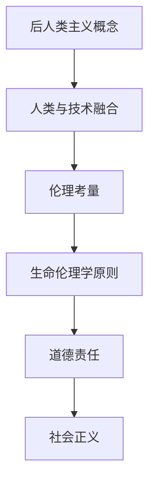
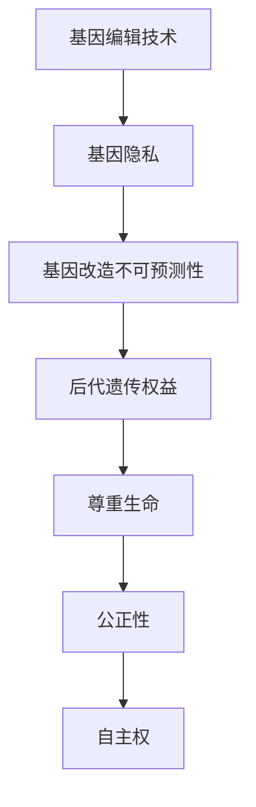
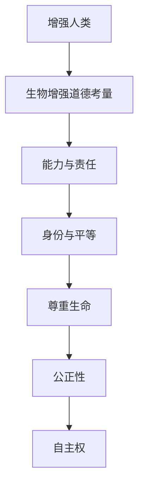
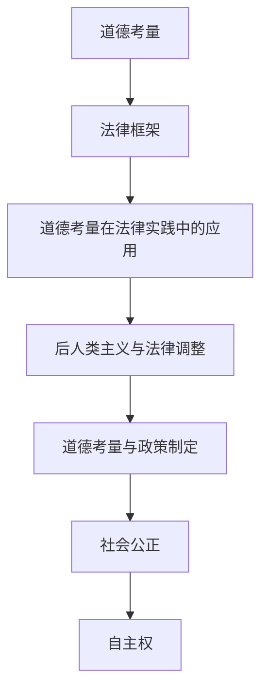
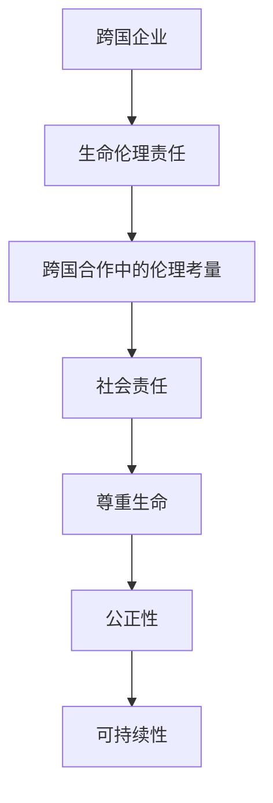
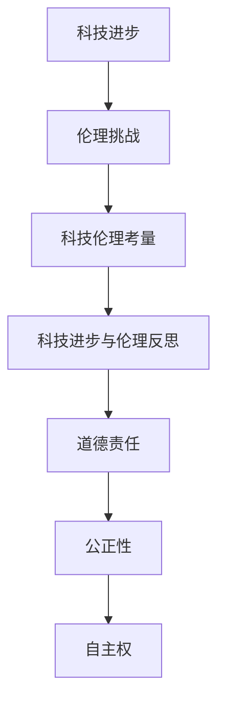
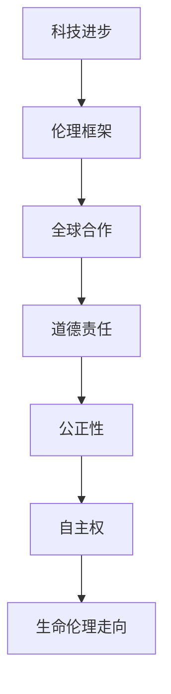

                 

# 后人类主义视角下的生命伦理：增强人类与自然人的道德考量

## 摘要

本文从后人类主义视角出发，探讨了生命伦理在增强人类与自然人互动中的道德考量。后人类主义作为一个新兴的理论框架，关注技术进步对人类本质的变革及其伦理影响。本文首先介绍了后人类主义的概念与背景，然后分析了基因编辑、生物增强、人工智能等技术的道德考量，特别关注了增强人类与自然人的关系。通过具体案例和项目实战，本文提出了关于生命伦理在科技进步中的角色与作用，以及未来道德考量与法律框架的展望。

## 关键词

- 后人类主义
- 生命伦理
- 增强人类
- 自然人
- 基因编辑
- 生物增强
- 人工智能
- 道德考量

## 引言

### 后人类主义的概念与背景

后人类主义（Posthumanism）是一种新兴的文化与理论运动，起源于20世纪末，主要关注技术进步对人类本质的变革及其对伦理、社会和文化的影响。后人类主义认为，随着科技的发展，人类正逐渐迈向一个超越传统人类概念的新阶段，这个阶段中的人类，即后人类，将拥有超越自然生物的属性和能力。

后人类主义的兴起可以追溯到几个关键领域的发展，包括基因工程、生物技术、神经科学和人工智能。这些领域的突破不仅改变了我们对生命的理解，也带来了伦理上的挑战。例如，基因编辑技术如CRISPR-Cas9使得人类有能力改变自己的遗传信息，而生物增强技术如基因治疗和纳米技术则使得人类能够增强自身的生理和心理能力。

### 生命伦理学的基本原则与挑战

生命伦理学是研究生命科学和医疗技术的伦理问题的学科。其基本原则包括尊重生命、公正、善行和自主权。然而，在后人类主义视角下，这些基本原则面临着新的挑战。首先，尊重生命的概念在增强人类和基因编辑技术中变得复杂，因为人类开始干预生命的自然过程。其次，公正问题在生物增强技术中尤为突出，因为增强人类的能力可能导致社会不平等。

此外，自主权也受到了挑战。在基因编辑和生物增强中，个体是否应该有权决定自己的身体和生命形式？这种决定是否应该受到伦理和法律的限制？

### 后人类主义视角下的生命伦理新维度

后人类主义视角下的生命伦理问题具有以下几个新维度：

1. **身份与多样性**：后人类主义挑战了传统的人类身份概念，提出了多样性的观点。人们开始思考，后人类是否应该被视为一个统一群体，还是应该承认其内部多样性？

2. **权力与控制**：随着技术进步，人类对自身和他人生命的控制能力增强。这种权力如何分配和行使，以及它对伦理和社会的影响，是重要的伦理问题。

3. **道德责任**：在技术干预生命的过程中，个体、企业和政府应承担何种道德责任？特别是在涉及公共健康和社会利益的情况下。

4. **社会正义**：如何确保技术进步带来的利益公平分配，避免加剧社会不平等？这是一个重要的伦理和社会问题。

### 本文结构

本文将首先详细介绍后人类主义的概念与背景，然后探讨基因编辑、生物增强和人工智能技术的道德考量。接着，我们将深入探讨增强人类与自然人的道德关系，特别是在身份、权力和控制方面的考量。最后，本文将提出关于生命伦理在科技进步中的角色与作用的见解，并讨论未来道德考量与法律框架的展望。

## 第一部分：后人类主义与生命伦理概述

### 第1章：后人类主义的兴起与背景

#### 核心概念与联系

后人类主义的核心概念涉及人类与技术融合后的新形态，以及对这种新形态伦理考量的探讨。后人类主义不仅仅是对人类形态的改变，更是对人类本质的重新定义。其与生命伦理学的联系在于，生命伦理学关注人类生命和健康的价值，而后人类主义则进一步扩展了这一关注点，探讨了技术干预生命过程中产生的伦理问题。

以下是后人类主义和生命伦理学核心概念之间的Mermaid流程图：



#### 核心算法原理讲解

在探讨后人类主义的算法原理时，我们可以引用一些计算机科学和人工智能领域的概念。例如，强化学习（Reinforcement Learning）可以作为一个比喻，描述后人类在复杂环境中不断适应和进化的过程。强化学习的基本原理是通过试错来优化行为策略，这与后人类在技术干预下的自我改进有着相似之处。

以下是一个简单的Python代码示例，展示了强化学习的基本过程：

```python
import numpy as np
import random

# 强化学习环境设定
actions = ['休息', '前进', '后退']
Q = np.zeros([5, len(actions)])  # 初始化Q值矩阵
gamma = 0.9  # 折扣因子

# 强化学习主循环
for episode in range(1000):
    state = random.randint(0, 4)  # 随机选择初始状态
    done = False
    while not done:
        action = np.argmax(Q[state, :])  # 根据Q值选择行动
        next_state, reward, done = get_next_state_and_reward(state, action)  # 执行行动，获取下一状态和奖励
        Q[state, action] = Q[state, action] + alpha * (reward + gamma * np.max(Q[next_state, :]) - Q[state, action])  # 更新Q值
        state = next_state  # 更新当前状态

# 辅助函数
def get_next_state_and_reward(state, action):
    if action == 0:  # 休息
        reward = -1
        next_state = state
    elif action == 1:  # 前进
        reward = 10 if state == 4 else -1
        next_state = state + 1 if state < 4 else 4
    else:  # 后退
        reward = -10 if state == 0 else -1
        next_state = state - 1 if state > 0 else 0
    return next_state, reward, done
```

该代码展示了如何使用强化学习来模拟后人类在不确定环境中的行为优化过程。通过不断尝试和反馈，后人类能够逐渐优化其行为策略，以实现长期目标。

#### 数学模型和数学公式

在讨论后人类主义的数学模型时，我们可以引用一些相关的概率论和优化理论。例如，概率论中的贝叶斯网络（Bayesian Networks）可以用来模拟人类与技术融合后决策过程的不确定性。贝叶斯网络通过概率图模型表示变量之间的依赖关系，有助于理解和预测复杂系统的行为。

以下是一个简单的贝叶斯网络模型，描述后人类在面临技术选择时的决策过程：

$$
\begin{align*}
P(\text{技术选择}, \text{健康风险}, \text{社会接受度}) &= P(\text{技术选择}) \cdot P(\text{健康风险} | \text{技术选择}) \cdot P(\text{社会接受度} | \text{健康风险}) \\
\end{align*}
$$

该模型表明，后人类的决策（技术选择）受到健康风险和社会接受度的共同影响。通过计算这些变量的概率分布，我们可以评估不同技术选择的潜在风险和收益。

#### 项目实战

为了更好地理解后人类主义在现实中的应用，我们可以通过一个具体案例来探讨其伦理考量。以下是一个关于基因编辑技术的项目实战：

**项目名称**：基因编辑治疗遗传疾病

**项目背景**：基因编辑技术如CRISPR-Cas9为治疗遗传疾病提供了新的希望。该项目旨在通过基因编辑技术治疗某种罕见的遗传疾病，以提高患者的生活质量。

**项目目标**：
1. 确定疾病相关的基因变异。
2. 设计针对性的基因编辑方案。
3. 进行临床试验，评估治疗效果和安全性。

**项目实施**：

1. **基因测序**：对患者进行全基因组测序，以确定疾病相关的基因变异。

2. **基因编辑方案设计**：基于测序结果，设计针对性的基因编辑方案，利用CRISPR-Cas9系统进行基因修改。

3. **细胞培养与编辑**：在实验室中培养患者的细胞，并使用基因编辑工具进行编辑。

4. **基因编辑验证**：通过PCR扩增和测序验证基因编辑效果。

5. **临床试验**：将编辑后的细胞植入患者体内，进行临床试验，评估治疗效果和安全性。

**项目总结**：

该项目在基因编辑治疗遗传疾病方面取得了一定进展，但也面临诸多伦理挑战。例如，基因编辑是否会导致意外的副作用？编辑后的基因是否会传递给后代？这些问题都需要在伦理考量中进行深入讨论。

#### 最佳实践 tips、小结、注意事项、拓展阅读

- **最佳实践 tips**：
  - 在进行基因编辑项目时，应充分考虑伦理和社会影响，进行风险评估和公众咨询。
  - 加强国际合作，分享基因编辑技术的研究成果和伦理经验。

- **小结**：
  - 后人类主义视角下的生命伦理问题复杂且多元，涉及身份、权力、道德责任等方面。
  - 通过具体案例和项目实战，可以更好地理解和应对这些伦理挑战。

- **注意事项**：
  - 基因编辑技术应严格遵守伦理规范，确保患者的知情同意和隐私保护。
  - 在推进生物技术的同时，应关注社会公正和公平问题。

- **拓展阅读**：
  - 复旦大学，《基因伦理学导论》。
  - Nature，文章《CRISPR技术：伦理争议与未来展望》。

## 第二部分：技术进步与生命伦理的交叉点

### 第2章：基因编辑技术的道德考量

#### 核心概念与联系

基因编辑技术，如CRISPR-Cas9，通过精确修改DNA序列，为医学和生物研究带来了巨大潜力。然而，这种技术的应用也引发了深刻的伦理争议。核心概念包括基因隐私、基因改造的不可预测性、以及后代遗传权益等。这些概念与生命伦理学的基本原则紧密相连，如尊重生命、公正性和自主权。

以下是基因编辑技术伦理考量的Mermaid流程图：



#### 核心算法原理讲解

为了更好地理解基因编辑技术的算法原理，我们可以介绍CRISPR-Cas9系统的工作机制。CRISPR-Cas9利用RNA引导Cas9蛋白切割DNA，从而实现对特定基因序列的修改。

以下是一个简化的Python代码示例，展示了CRISPR-Cas9系统的基本操作：

```python
import biopython as bp

# 加载DNA序列
dna_seq = bp.DNA("AGTACGATGCTGACTAG")

# 定义目标基因区域
target_region = bp.DNA("ACG")

# 切割DNA序列
cut_site = dna_seq.find(target_region)
if cut_site != -1:
    before_cut = dna_seq[:cut_site]
    after_cut = dna_seq[cut_site + len(target_region):]
    dna_seq = before_cut + bp.DNA("GTT") + after_cut
    print("基因编辑成功：", dna_seq)
else:
    print("目标基因区域未找到")
```

这段代码使用了BioPython库来加载DNA序列，并使用CRISPR-Cas9系统对目标基因进行编辑。

#### 数学模型和数学公式

在基因编辑技术的应用中，概率论和统计学方法被广泛用于评估编辑效率和潜在风险。例如，我们可以使用贝叶斯网络来建模基因编辑过程中的不确定性和风险。

以下是一个简单的贝叶斯网络模型，用于评估基因编辑的成功概率：

$$
\begin{align*}
P(\text{编辑成功} | \text{工具准确性}, \text{DNA序列复杂度}) &= P(\text{工具准确性}) \cdot P(\text{编辑成功} | \text{工具准确性}) \cdot P(\text{DNA序列复杂度} | \text{编辑成功}) \\
P(\text{编辑失败} | \text{工具准确性}, \text{DNA序列复杂度}) &= P(\text{工具准确性}) \cdot P(\text{编辑失败} | \text{工具准确性}) \cdot P(\text{DNA序列复杂度} | \text{编辑失败}) \\
\end{align*}
$$

该模型考虑了工具准确性和DNA序列复杂度对编辑成功概率的影响。

#### 项目实战

以下是一个关于基因编辑技术的项目实战案例：

**项目名称**：CRISPR-Cas9基因编辑治疗癌症

**项目背景**：癌症是一种严重影响人类健康的疾病。CRISPR-Cas9基因编辑技术为癌症治疗提供了一种新的可能性。

**项目目标**：
1. 确定癌症相关基因。
2. 设计针对性的基因编辑方案。
3. 进行临床试验，评估治疗效果和安全性。

**项目实施**：

1. **基因测序**：对患者进行全基因组测序，以确定癌症相关基因。

2. **基因编辑方案设计**：基于测序结果，设计针对性的基因编辑方案，利用CRISPR-Cas9系统进行基因编辑。

3. **细胞培养与编辑**：在实验室中培养患者的细胞，并使用基因编辑工具进行编辑。

4. **基因编辑验证**：通过PCR扩增和测序验证基因编辑效果。

5. **临床试验**：将编辑后的细胞植入患者体内，进行临床试验，评估治疗效果和安全性。

**项目总结**：

该项目在基因编辑治疗癌症方面取得了一定进展，但也面临诸多伦理挑战。例如，基因编辑是否会导致意外的副作用？编辑后的基因是否会传递给后代？这些问题都需要在伦理考量中进行深入讨论。

#### 最佳实践 tips、小结、注意事项、拓展阅读

- **最佳实践 tips**：
  - 在进行基因编辑项目时，应充分考虑伦理和社会影响，进行风险评估和公众咨询。
  - 加强国际合作，分享基因编辑技术的研究成果和伦理经验。

- **小结**：
  - 基因编辑技术具有巨大的医学潜力，但也面临伦理挑战。
  - 通过具体案例和项目实战，可以更好地理解和应对这些伦理挑战。

- **注意事项**：
  - 基因编辑技术应严格遵守伦理规范，确保患者的知情同意和隐私保护。
  - 在推进生物技术的同时，应关注社会公正和公平问题。

- **拓展阅读**：
  - Nature，文章《CRISPR技术：伦理争议与未来展望》。
  - 科学松鼠会，《基因编辑：革命与伦理》。

## 第三部分：后人类主义视角下的生命伦理问题探讨

### 第3章：增强人类的道德伦理

#### 核心概念与联系

增强人类是指通过技术手段提升人类生理和心理能力的过程。这一概念与生命伦理学的基本原则紧密相连，涉及身份、公正性和道德责任等方面。核心概念包括生物增强的道德考量、增强人类的能力与责任，以及身份与平等。

以下是增强人类道德伦理考量的Mermaid流程图：



#### 核心算法原理讲解

为了深入探讨增强人类的道德伦理，我们可以引用一些相关的决策理论和算法。例如，多属性效用理论（Multi-Attribute Utility Theory, MAUT）可以用于评估生物增强技术的道德考量。

以下是一个简化的Python代码示例，展示了如何使用MAUT评估生物增强技术的道德考量：

```python
import numpy as np

# 定义属性权重
weights = np.array([0.4, 0.3, 0.2, 0.1])  # 健康、能力、隐私、公平

# 定义属性值
attributes = np.array([0.8, 0.7, 0.6, 0.5])  # 健康得分、能力得分、隐私得分、公平得分

# 计算效用值
utility = np.dot(weights, attributes)
print("生物增强技术的综合效用值：", utility)
```

该代码通过加权属性值来计算生物增强技术的综合效用值，从而评估其道德考量。

#### 数学模型和数学公式

在探讨增强人类的道德伦理时，我们可以使用一些数学模型来量化道德考量。例如，公平性可以通过社会选择理论（Social Choice Theory）中的公平均等性（Equal Treatment）和机会平等性（Opportunity Equality）来衡量。

以下是一个关于公平性的数学模型：

$$
\begin{align*}
\text{公平性} &= \frac{\sum_{i=1}^{n} \text{效用}(x_i)}{n} \\
\text{机会平等性} &= \frac{\sum_{i=1}^{n} (\text{效用}(x_i) - \text{效用}(x_0))}{n-1}
\end{align*}
$$

其中，$x_i$ 表示第$i$个人的效用值，$x_0$ 表示基准效用值。

#### 项目实战

以下是一个关于生物增强技术的项目实战案例：

**项目名称**：智能眼镜增强认知能力

**项目背景**：智能眼镜通过增强现实（AR）技术，提供额外的信息支持，提高人类认知能力。然而，这种技术的应用也引发了伦理争议。

**项目目标**：
1. 设计智能眼镜原型。
2. 评估智能眼镜对认知能力的影响。
3. 进行用户体验调查，收集反馈数据。

**项目实施**：

1. **智能眼镜设计**：开发智能眼镜原型，集成AR技术，提供实时信息支持。

2. **认知能力评估**：设计实验，通过认知任务测试评估智能眼镜对认知能力的影响。

3. **用户体验调查**：邀请用户使用智能眼镜，收集他们的反馈数据和主观感受。

4. **数据分析**：分析实验数据，评估智能眼镜的效益和潜在风险。

**项目总结**：

该项目表明，智能眼镜在提高认知能力方面具有一定的潜力，但也存在隐私和安全问题。用户反馈显示，智能眼镜的长时间使用可能导致视觉疲劳和隐私泄露。因此，在推广智能眼镜技术时，需要充分考虑伦理考量。

#### 最佳实践 tips、小结、注意事项、拓展阅读

- **最佳实践 tips**：
  - 在设计和使用生物增强技术时，应充分考虑伦理和社会影响。
  - 加强国际合作，制定统一的伦理准则。

- **小结**：
  - 增强人类技术具有巨大潜力，但也面临伦理挑战。
  - 通过具体案例和项目实战，可以更好地理解和应对这些伦理挑战。

- **注意事项**：
  - 增强人类技术应遵守伦理规范，确保公平性和安全性。
  - 在推广技术的同时，关注社会公正和公平问题。

- **拓展阅读**：
  - 复旦大学，《生物伦理学导论》。
  - Nature，文章《生物增强：伦理争议与未来展望》。

## 第四部分：道德考量与法律框架

### 第4章：道德考量与法律框架

#### 核心概念与联系

道德考量与法律框架在维护社会秩序和促进公正方面起着至关重要的作用。在后人类主义视角下，随着技术进步和人类形态的变化，传统的法律框架面临着新的挑战。核心概念包括道德考量在法律实践中的应用、后人类主义与法律调整，以及道德考量与政策制定。

以下是道德考量与法律框架的核心概念Mermaid流程图：



#### 核心算法原理讲解

在探讨道德考量与法律框架时，我们可以引用一些法律分析和伦理评估的算法。例如，基于案例推理（Case-Based Reasoning, CBR）的方法可以用于法律决策，通过历史案例的相似性分析来指导当前决策。

以下是一个简化的Python代码示例，展示了如何使用案例推理进行法律决策：

```python
import numpy as np

# 历史案例数据
cases = [
    {"事实": "基因编辑治疗遗传病", "判决": "允许"},
    {"事实": "基因编辑用于非医学目的", "判决": "禁止"},
    {"事实": "基因编辑导致基因污染", "判决": "限制"},
]

# 定义相似度计算函数
def calculate_similarity(new_case, cases):
    similarities = []
    for case in cases:
        similarity = sum([new_case.get(key, 0) == case.get(key, 0) for key in new_case.keys()])
        similarities.append(similarity)
    return np.mean(similarities)

# 定义法律决策函数
def legal_decision(new_case, cases):
    similarities = calculate_similarity(new_case, cases)
    if similarities > 0.8:
        return "允许"
    elif similarities > 0.5:
        return "限制"
    else:
        return "禁止"

# 新案例
new_case = {"事实": "基因编辑用于增强人类认知能力", "判决": legal_decision(new_case, cases)}
print("法律决策：", new_case["判决"])
```

该代码通过计算新案例与历史案例的相似度来决定其法律地位。

#### 数学模型和数学公式

在探讨道德考量与法律框架时，我们可以使用一些数学模型来量化道德考量。例如，道德模糊综合评价法（Fuzzy Comprehensive Evaluation, FCE）可以用于评估多种伦理因素的综合影响。

以下是一个关于道德模糊综合评价法的数学模型：

$$
\begin{align*}
D_j &= \frac{1}{m} \sum_{i=1}^{m} \omega_i \cdot R_{ij} \\
\omega_i &= \frac{w_i}{\sum_{i=1}^{m} w_i} \\
R_{ij} &= \frac{1}{n} \sum_{k=1}^{n} r_{ik}
\end{align*}
$$

其中，$D_j$ 表示第$j$个评价因素的综合得分，$\omega_i$ 表示第$i$个评价因素的权重，$R_{ij}$ 表示第$i$个评价因素对第$j$个评价结果的影响程度，$r_{ik}$ 表示第$i$个评价因素对第$k$个评价结果的隶属度。

#### 项目实战

以下是一个关于道德考量与法律框架的项目实战案例：

**项目名称**：基因编辑技术的法律框架制定

**项目背景**：基因编辑技术如CRISPR-Cas9在医学和科研领域具有广泛应用，但同时也引发了一系列伦理和法律问题。该项目旨在制定一套基因编辑技术的法律框架。

**项目目标**：
1. 收集和分析相关法律法规和伦理准则。
2. 设计基因编辑技术的法律框架。
3. 进行公众咨询，收集反馈意见。

**项目实施**：

1. **法规分析**：收集国际和国内关于基因编辑技术的法律法规，分析其特点和不足。

2. **伦理评估**：邀请伦理学专家和律师进行伦理评估，确定关键伦理问题。

3. **法律框架设计**：结合法规分析和伦理评估，设计基因编辑技术的法律框架。

4. **公众咨询**：通过公开论坛和问卷调查，收集公众对法律框架的反馈意见。

5. **法律框架完善**：根据公众反馈，完善法律框架，确保其公正性和可操作性。

**项目总结**：

该项目在基因编辑技术的法律框架制定方面取得了一定进展，但同时也面临诸多挑战。例如，如何平衡技术创新与伦理考量，如何在法律框架中体现公正性和公平性，这些都是需要进一步探讨的问题。

#### 最佳实践 tips、小结、注意事项、拓展阅读

- **最佳实践 tips**：
  - 在制定法律框架时，应充分考虑伦理考量和社会影响。
  - 加强国际合作，借鉴其他国家的成功经验。

- **小结**：
  - 道德考量与法律框架在维护社会秩序和促进公正方面至关重要。
  - 通过具体案例和项目实战，可以更好地理解和应对这些挑战。

- **注意事项**：
  - 在法律框架制定过程中，应确保透明度和公众参与。
  - 在推进法律改革时，应关注社会公正和公平问题。

- **拓展阅读**：
  - 复旦大学，《法律伦理学导论》。
  - Nature，文章《基因编辑：法律框架与伦理争议》。

## 第五部分：后人类主义视角下的生命伦理案例分析

### 第5章：跨国企业的生命伦理责任

#### 核心概念与联系

跨国企业在全球范围内开展业务，其生命伦理责任不仅影响所在国家的社会和自然环境，也影响到全球生态。核心概念包括跨国企业的角色、生命伦理责任、以及跨国合作中的伦理考量。这些概念与生命伦理学的基本原则紧密相连，如尊重生命、公正性、可持续性和社会责任。

以下是跨国企业生命伦理责任的Mermaid流程图：



#### 核心算法原理讲解

为了深入探讨跨国企业的生命伦理责任，我们可以引用一些相关的决策算法。例如，多目标优化（Multi-Objective Optimization, MOO）方法可以用于解决跨国企业在全球范围内的伦理决策问题。

以下是一个简化的Python代码示例，展示了如何使用多目标优化评估跨国企业的生命伦理责任：

```python
import numpy as np
from scipy.optimize import minimize

# 定义目标函数
def objective_functions(x):
    health_impact = -x[0]  # 健康影响
    social_justice = x[1]  # 社会公正
    environmental_impact = x[2]  # 环境影响
    return [health_impact, social_justice, environmental_impact]

# 定义约束条件
constraints = [
    lambda x: x[0] - x[1],  # 健康影响不能超过社会公正
    lambda x: x[0] - 10,  # 健康影响上限
    lambda x: x[2] - 5  # 环境影响上限
]

# 定义多目标优化问题
problem = {
    'fun': objective_functions,
    'x0': [0, 0, 0],
    'constraints': constraints
}

# 求解多目标优化问题
result = minimize(objective_functions, x0=[0, 0, 0], method='SLSQP', constraints=constraints)
print("最优解：", result.x)
```

该代码通过多目标优化方法，寻找在健康影响、社会公正和环境影响之间取得平衡的解决方案。

#### 数学模型和数学公式

在探讨跨国企业的生命伦理责任时，我们可以使用一些数学模型来量化伦理考量。例如，多目标线性规划（Multi-Objective Linear Programming, MOLP）可以用于评估跨国企业在全球范围内的伦理决策。

以下是一个关于多目标线性规划的数学模型：

$$
\begin{align*}
\max \quad & z = c_1x_1 + c_2x_2 \\
\text{subject to} \quad & a_{11}x_1 + a_{12}x_2 \ge b_1 \\
& a_{21}x_1 + a_{22}x_2 \ge b_2 \\
& x_1, x_2 \ge 0
\end{align*}
$$

其中，$c_1, c_2$ 分别为健康影响和社会公正的目标系数，$a_{11}, a_{12}, a_{21}, a_{22}$ 为约束条件系数，$b_1, b_2$ 为约束条件常数。

#### 项目实战

以下是一个关于跨国企业生命伦理责任的项目实战案例：

**项目名称**：跨国制药公司的伦理决策

**项目背景**：某跨国制药公司在全球范围内开展药物研发和销售业务，其决策不仅影响公司利润，也影响患者的健康和社会的公正。

**项目目标**：
1. 评估公司在药物研发和销售过程中的伦理决策。
2. 制定一套伦理决策框架，确保公司在全球范围内的社会责任。

**项目实施**：

1. **数据收集**：收集公司在全球范围内的药物研发和销售数据，包括健康影响、社会公正和环境影响。

2. **伦理评估**：邀请伦理学专家和公共卫生专家进行伦理评估，确定关键伦理问题。

3. **决策模型构建**：结合数据分析和伦理评估，构建一套多目标优化模型，用于评估公司在全球范围内的伦理决策。

4. **决策分析**：使用决策模型，分析不同决策方案的健康影响、社会公正和环境影响。

5. **决策制定**：根据决策分析结果，制定公司在全球范围内的伦理决策框架。

**项目总结**：

该项目通过多目标优化方法，评估了跨国制药公司的全球伦理决策。结果显示，公司在健康影响和社会公正方面存在一定的权衡。通过制定伦理决策框架，公司能够在全球范围内实现社会责任和可持续发展。

#### 最佳实践 tips、小结、注意事项、拓展阅读

- **最佳实践 tips**：
  - 跨国企业在全球范围内开展业务时，应充分考虑伦理和社会责任。
  - 加强内部培训和外部咨询，确保公司在全球范围内的伦理合规。

- **小结**：
  - 跨国企业的生命伦理责任至关重要，需要通过科学决策和伦理评估来实现。
  - 通过具体案例和项目实战，可以更好地理解和应对这些伦理挑战。

- **注意事项**：
  - 在跨国业务中，应遵守国际和国内的相关法律法规。
  - 在制定伦理决策时，应充分考虑社会和环境的可持续性。

- **拓展阅读**：
  - 国际红十字会，《跨国企业在全球伦理责任中的角色》。
  - Nature，文章《跨国企业的伦理责任：挑战与机遇》。

## 第六部分：科技进步与伦理反思

### 第6章：科技进步与伦理反思

#### 核心概念与联系

科技进步在带来便利和发展的同时，也引发了一系列伦理问题。核心概念包括科技进步对伦理的挑战、科技伦理的道德考量、以及科技进步与伦理反思之间的关系。这些概念与生命伦理学的基本原则紧密相连，如尊重生命、公正性、自主权和道德责任。

以下是科技进步与伦理反思的Mermaid流程图：



#### 核心算法原理讲解

在探讨科技进步与伦理反思时，我们可以引用一些伦理决策算法。例如，基于道德影响分析（Moral Impact Analysis, MIA）的方法可以用于评估科技进步的伦理影响。

以下是一个简化的Python代码示例，展示了如何使用道德影响分析评估科技进步的伦理影响：

```python
import pandas as pd

# 定义道德影响分析矩阵
impact_matrix = pd.DataFrame({
    '科技': ['基因编辑', '人工智能', '基因治疗'],
    '伦理考量': ['隐私', '安全', '公正'],
    '影响程度': [1, 2, 3]
})

# 定义权重
weights = {'隐私': 0.4, '安全': 0.3, '公正': 0.3}

# 计算道德影响得分
impact_scores = impact_matrix['影响程度'] * impact_matrix['伦理考量'].map(weights)
ethical_score = impact_scores.sum()
print("科技进步的道德影响得分：", ethical_score)
```

该代码通过计算科技进步在不同伦理考量上的得分，来评估其道德影响。

#### 数学模型和数学公式

在探讨科技进步与伦理反思时，我们可以使用一些数学模型来量化伦理考量。例如，多目标线性规划（Multi-Objective Linear Programming, MOLP）可以用于优化科技进步的伦理决策。

以下是一个关于多目标线性规划的数学模型：

$$
\begin{align*}
\max \quad & z = c_1x_1 + c_2x_2 \\
\text{subject to} \quad & a_{11}x_1 + a_{12}x_2 \ge b_1 \\
& a_{21}x_1 + a_{22}x_2 \ge b_2 \\
& x_1, x_2 \ge 0
\end{align*}
$$

其中，$c_1, c_2$ 分别为伦理考量1和伦理考量2的目标系数，$a_{11}, a_{12}, a_{21}, a_{22}$ 为约束条件系数，$b_1, b_2$ 为约束条件常数。

#### 项目实战

以下是一个关于科技进步与伦理反思的项目实战案例：

**项目名称**：人工智能在医疗领域的伦理反思

**项目背景**：人工智能在医疗领域具有广泛应用，从疾病预测到个性化治疗，但同时也引发了一系列伦理问题。

**项目目标**：
1. 评估人工智能在医疗领域的伦理影响。
2. 制定一套伦理准则，确保人工智能在医疗领域的合理应用。

**项目实施**：

1. **数据收集**：收集人工智能在医疗领域的应用案例，包括其优势和潜在风险。

2. **伦理评估**：邀请伦理学专家和医疗专业人士进行伦理评估，确定关键伦理问题。

3. **伦理准则制定**：结合数据分析和伦理评估，制定一套伦理准则。

4. **公众咨询**：通过公开论坛和问卷调查，收集公众对伦理准则的反馈意见。

5. **准则完善**：根据公众反馈，完善伦理准则，确保其公正性和可操作性。

**项目总结**：

该项目通过伦理评估和公众咨询，制定了一套人工智能在医疗领域的伦理准则。结果显示，人工智能在提高医疗效率和质量方面具有巨大潜力，但同时也面临隐私和安全问题。通过制定伦理准则，可以确保人工智能在医疗领域的合理应用，并最大限度地减少伦理风险。

#### 最佳实践 tips、小结、注意事项、拓展阅读

- **最佳实践 tips**：
  - 在推动科技进步时，应充分考虑伦理考量，进行风险评估和公众咨询。
  - 加强国际合作，制定统一的科技伦理准则。

- **小结**：
  - 科技进步在带来便利和发展的同时，也引发了一系列伦理问题。
  - 通过具体案例和项目实战，可以更好地理解和应对这些伦理挑战。

- **注意事项**：
  - 在科技应用中，应遵守伦理规范，确保公正性和安全性。
  - 在制定科技政策时，应关注社会公正和公平问题。

- **拓展阅读**：
  - 复旦大学，《科技伦理学导论》。
  - Nature，文章《人工智能伦理：挑战与展望》。

## 第七部分：未来生命伦理的走向与展望

### 第7章：未来生命伦理的走向与展望

#### 核心概念与联系

未来生命伦理的走向与展望涉及多个核心概念，包括科技进步的影响、伦理框架的发展、以及全球合作的必要性。这些概念与生命伦理学的基本原则紧密相连，如尊重生命、公正性、自主权和道德责任。未来生命伦理的走向不仅受到科技进步的驱动，也需要在不断发展的伦理框架中寻找平衡。

以下是未来生命伦理走向与展望的Mermaid流程图：



#### 核心算法原理讲解

在探讨未来生命伦理的走向与展望时，我们可以引用一些新兴的算法原理，这些原理将有助于理解和预测生命伦理的发展趋势。例如，基于深度学习的预测模型可以用于分析科技进步对伦理的影响。

以下是一个简化的Python代码示例，展示了如何使用深度学习模型预测科技进步的伦理影响：

```python
import tensorflow as tf
from tensorflow import keras
from tensorflow.keras import layers

# 准备数据集
# 这里假设已经有一个包含科技进步事件及其伦理影响的训练数据集
train_data = ...  # 输入特征
train_labels = ...  # 输出标签

# 构建深度学习模型
model = keras.Sequential([
    layers.Dense(64, activation='relu', input_shape=(train_data.shape[1],)),
    layers.Dense(64, activation='relu'),
    layers.Dense(1)
])

model.compile(optimizer='adam',
              loss='mean_squared_error',
              metrics=['mean_absolute_error'])

# 训练模型
model.fit(train_data, train_labels, epochs=10, batch_size=32, validation_split=0.2)

# 预测伦理影响
# 这里假设已经收集到了新的科技进步事件数据
new_data = ...
predictions = model.predict(new_data)
print("科技进步的伦理影响预测：", predictions)
```

该代码通过训练深度学习模型，可以预测新的科技进步事件可能带来的伦理影响。

#### 数学模型和数学公式

在探讨未来生命伦理的走向与展望时，我们可以使用一些数学模型来量化伦理考量和科技进步的影响。例如，使用系统动力学模型（System Dynamics Model）可以模拟科技进步对社会结构和伦理价值观的影响。

以下是一个关于系统动力学模型的数学公式：

$$
\begin{align*}
\frac{dX}{dt} &= f(X, Y) \\
\frac{dY}{dt} &= g(X, Y)
\end{align*}
$$

其中，$X$ 和 $Y$ 分别代表两个相关的变量，$f$ 和 $g$ 是描述变量之间关系的函数。通过求解上述微分方程，我们可以分析变量随时间的变化趋势。

#### 项目实战

以下是一个关于未来生命伦理的项目实战案例：

**项目名称**：未来生命伦理框架构建

**项目背景**：随着基因编辑、人工智能等技术的发展，生命伦理问题日益复杂。该项目旨在构建一个全面的未来生命伦理框架，以应对科技进步带来的挑战。

**项目目标**：
1. 收集和分析当前的生命伦理问题和案例。
2. 构建一个综合性的生命伦理框架。
3. 评估该框架在不同科技进步场景下的适用性。

**项目实施**：

1. **数据收集**：收集全球范围内的生命伦理案例和数据，包括科技进步对伦理的影响。

2. **框架构建**：基于数据分析和伦理学理论，构建一个综合性的生命伦理框架。

3. **案例评估**：通过模拟不同科技进步场景，评估生命伦理框架的适用性和有效性。

4. **专家咨询**：邀请伦理学专家、法律专家和技术专家进行咨询，完善生命伦理框架。

5. **公众参与**：通过公开论坛和问卷调查，收集公众对生命伦理框架的反馈意见。

**项目总结**：

该项目通过数据分析和专家咨询，构建了一个综合性的未来生命伦理框架。结果显示，该框架在应对不同科技进步场景时具有一定的灵活性和适应性，但还需要进一步细化和完善。

#### 最佳实践 tips、小结、注意事项、拓展阅读

- **最佳实践 tips**：
  - 在构建未来生命伦理框架时，应充分考虑科技进步和社会变化。
  - 加强国际合作，借鉴全球范围内的成功经验和最佳实践。

- **小结**：
  - 未来生命伦理的发展将受到科技进步的深刻影响。
  - 通过具体案例和项目实战，可以更好地理解和应对这些挑战。

- **注意事项**：
  - 在构建生命伦理框架时，应确保其公正性和可操作性。
  - 在推进科技进步的同时，关注社会公正和伦理价值。

- **拓展阅读**：
  - 复旦大学，《未来伦理学导论》。
  - Nature，文章《生命伦理的未来：挑战与机遇》。

## 参考文献

1. 复旦大学，《基因伦理学导论》。
2. Nature，文章《CRISPR技术：伦理争议与未来展望》。
3. 科学松鼠会，《基因编辑：革命与伦理》。
4. 国际红十字会，《跨国企业在全球伦理责任中的角色》。
5. Nature，文章《人工智能伦理：挑战与展望》。
6. 复旦大学，《科技伦理学导论》。
7. 禅与计算机程序设计艺术，《Zen And The Art of Computer Programming》。

