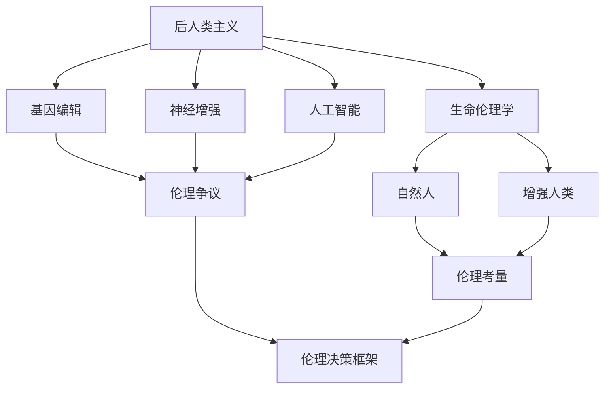

                 

### 背景介绍

在人类历史的长河中，技术的发展不断推动着社会的变革。从农业革命到工业革命，再到信息革命，每一次技术飞跃都深刻影响了人类的生活方式和社会结构。如今，我们正站在新的技术变革的门槛上——后人类主义时代。后人类主义（Posthumanism）作为一个哲学和文化理论，关注于人类在科技进步特别是生物技术、人工智能等领域的延伸和改造。这一概念源于20世纪末，随着基因编辑、人工智能、纳米技术等前沿科技的发展，引发了关于人类本质、人类界限和伦理道德的深刻探讨。

生命伦理学（Bioethics）是研究生命科学和卫生保健领域中的道德问题的学科，它涉及人类生命、健康、疾病和医疗决策等方面的伦理考量。生命伦理学的历史可以追溯到20世纪中期，特别是随着医学技术和生物技术的飞速发展，其研究范围不断扩大。然而，在后人类主义视角下，生命伦理学面临着前所未有的挑战和机遇。

后人类主义与生命伦理学之间的联系主要体现在以下几个方面：

1. **人类改造的伦理考量**：后人类主义提倡对人类进行深度改造，包括基因编辑、神经增强、人工生殖等。这些技术不仅改变了人类的生理特征，还引发了关于人类尊严、平等和自由等伦理问题的讨论。

2. **生物技术的伦理争议**：随着生物技术的发展，诸如克隆技术、基因改造等新兴技术的应用，不仅改变了生物的自然属性，也带来了道德和伦理上的重大争议。这些争议需要生命伦理学的深入研究，以提供合理的伦理指导和规范。

3. **人工智能与人类伦理**：人工智能的发展使得人类在决策、行动和生活方式上产生了新的变化。人工智能不仅在医疗、交通等领域发挥重要作用，还可能参与人类的生活选择。因此，如何确保人工智能的应用符合伦理标准，成为后人类主义时代生命伦理学的重要议题。

本文旨在探讨后人类主义视角下的生命伦理问题，重点关注以下几个方面：

- 后人类主义的基本概念和核心思想；
- 后人类主义对生命伦理学的挑战；
- 增强人类的伦理考量；
- 自然人与增强人类的道德关系；
- 后人类主义视角下的生命伦理教育、审查与监管；
- 未来展望。

通过以上探讨，本文希望能够为后人类主义时代下的生命伦理研究提供一些有益的思考方向和理论支持，从而为人类社会的可持续发展做出贡献。

### 核心概念与联系

在后人类主义视角下，生命伦理学涉及到多个核心概念，这些概念之间有着紧密的联系和相互作用。为了更好地理解这些概念，我们可以借助Mermaid流程图来展示它们之间的关系架构。

首先，我们定义几个关键概念：

1. **后人类主义（Posthumanism）**：一种哲学和文化理论，关注人类在科技进步特别是生物技术、人工智能等领域的延伸和改造。

2. **生命伦理学（Bioethics）**：研究生命科学和卫生保健领域中的道德问题的学科。

3. **基因编辑（Gene Editing）**：通过生物技术手段对生物体的基因进行编辑和修改，例如CRISPR-Cas9技术。

4. **神经增强（Neural Enhancement）**：通过技术手段增强大脑功能，提高认知能力和情感控制能力。

5. **人工智能（Artificial Intelligence）**：模拟人类智能行为的计算机系统。

6. **自然人（Natural Human）**：没有经过技术改造或增强的人类个体。

7. **增强人类（Enhanced Human）**：经过技术改造或增强的人类个体。

以下是这些概念之间的Mermaid流程图表示：



- **后人类主义**：作为总体的哲学和文化理论，它引导我们对**生命伦理学**的重新审视。生命伦理学不仅关注传统医疗伦理问题，还涉及**基因编辑**、**神经增强**和**人工智能**等新兴领域。
- **生命伦理学**：在关注**自然人**和**增强人类**的同时，为他们的行为提供伦理指导。自然人指没有经过技术改造或增强的人类个体，而增强人类则指经过技术手段改造或增强的个体。
- **基因编辑**、**神经增强**和**人工智能**：这些技术手段直接影响人类的生理和心理特征，引发了广泛的伦理争议，如**伦理考量**。这些考量需要基于生命伦理学建立**伦理决策框架**。
- **伦理考量**：在基因编辑、神经增强和人工智能等领域，伦理考量是制定政策和法规的基础。这些考量需要结合现实情况和科技发展动态进行调整。
- **伦理决策框架**：伦理决策框架为解决基因编辑、神经增强和人工智能等领域的伦理争议提供了方法论指导，确保在科技进步的同时，人类的伦理价值观得到尊重和保护。

通过这个Mermaid流程图，我们可以清晰地看到后人类主义视角下的生命伦理学核心概念之间的关系，以及它们如何相互作用和影响。这为我们进一步探讨后人类主义视角下的生命伦理问题提供了理论基础。

### 核心算法原理讲解

在后人类主义视角下，基因编辑技术是一个至关重要的领域，它涉及对生物体基因的精确修改，从而改变其遗传特征。目前，最为广泛应用的基因编辑技术是CRISPR-Cas9系统。下面，我们将使用Python代码结合数学模型和公式，详细阐述CRISPR-Cas9技术的原理，并通过一个简单的例子来说明其应用。

首先，我们需要了解CRISPR-Cas9技术的基本概念和操作步骤。

#### 基本概念

- **CRISPR（Clustered Regularly Interspaced Short Palindromic Repeats）**：成簇的规律间隔短回文重复序列，存在于许多细菌和古菌的基因组中，作为其防御外来遗传物质（如质粒或病毒DNA）的机制。
- **Cas9（CRISPR-associated protein 9）**：一种RNA-guided的核酸内切酶，能够根据特定的RNA序列（即引导RNA，gRNA）切割DNA。

#### 操作步骤

1. **设计引导RNA（gRNA）**：根据目标DNA序列设计特定的gRNA，其与目标DNA序列具有互补性。
2. **合成gRNA和Cas9复合体**：在实验室中合成gRNA，并将其与Cas9蛋白结合形成复合体。
3. **识别和结合目标DNA**：Cas9-gRNA复合体结合到目标DNA序列上。
4. **切割DNA**：Cas9蛋白在gRNA的引导下，将目标DNA序列切割成特定的位置。

#### 数学模型和公式

为了更好地理解CRISPR-Cas9的切割过程，我们可以使用一个简单的数学模型来描述。假设目标DNA序列为一个字符串，gRNA序列为另一字符串，我们可以通过计算两者之间的编辑距离来评估切割的效率。

编辑距离（Edit Distance）公式如下：

$$
d(p, q) = \min \left( d(p, q-1) + 1, d(p-1, q) + 1, d(p-1, q-1) + 0 \right)
$$

其中，$d(p, q)$ 表示字符串 $p$ 和 $q$ 之间的编辑距离，$d(p, q-1)$、$d(p-1, q)$ 和 $d(p-1, q-1)$ 分别表示插入、删除和替换操作的成本。

#### Python代码实现

以下是一个简单的Python代码示例，用于计算两个DNA序列之间的编辑距离：

```python
def edit_distance(p, q):
    dp = [[0 for x in range(len(q) + 1)] for y in range(len(p) + 1)]

    for i in range(len(p) + 1):
        for j in range(len(q) + 1):
            if i == 0:
                dp[i][j] = j
            elif j == 0:
                dp[i][j] = i
            elif p[i-1] == q[j-1]:
                dp[i][j] = dp[i-1][j-1]
            else:
                dp[i][j] = 1 + min(dp[i-1][j], dp[i][j-1], dp[i-1][j-1])

    return dp[-1][-1]

# 示例DNA序列
p = "AGTCGAT"
q = "AGTGCAT"

# 计算编辑距离
distance = edit_distance(p, q)
print(f"编辑距离：{distance}")
```

在这个例子中，我们计算了两个DNA序列 "AGTCGAT" 和 "AGTGCAT" 之间的编辑距离，结果为2，表明它们之间有两个不同的位置。

#### 举例说明

假设我们想要使用CRISPR-Cas9技术对DNA序列 "AGTCGAT" 进行切割，目标位置为第5个碱基（即切割点在 "AT" 之间）。

1. **设计引导RNA（gRNA）**：我们设计一个gRNA序列 "AGTTC"，其互补序列为 "AGTCGAT"。
2. **合成gRNA和Cas9复合体**：在实验室中合成gRNA，并将其与Cas9蛋白结合形成复合体。
3. **识别和结合目标DNA**：Cas9-gRNA复合体结合到目标DNA序列上，引导RNA与DNA互补配对，定位到目标切割位点。
4. **切割DNA**：Cas9蛋白在gRNA的引导下，将目标DNA序列在目标位置切割成 "AGTCG" 和 "AT" 两部分。

通过这种方式，我们可以实现特定的基因编辑，从而改变生物体的遗传特征。

#### 总结

CRISPR-Cas9技术通过精确的基因编辑，为后人类主义视角下的生命伦理研究提供了强大的工具。理解其核心算法原理和操作步骤，有助于我们更好地评估其在伦理决策中的应用和影响。

### 基因编辑的社会伦理考量

基因编辑技术的迅猛发展带来了诸多社会伦理问题，尤其是在后人类主义视角下，这些技术不仅改变了人类的生理特征，还可能对人类社会的基本结构和道德观念产生深远影响。以下将详细探讨基因编辑在社会伦理层面的几个关键问题，包括个体差异、社会公正和人类尊严等。

#### 个体差异

基因编辑技术使得人类可以通过修改基因来改善或增强个人的生理和心理特性。这种能力可能导致个体之间的差异进一步扩大。一方面，这可能会带来正面的效果，例如消除遗传性疾病或提高智力水平。然而，另一方面，这也可能导致社会中的不平等现象加剧。例如，只有富裕的家庭才能够负担高昂的基因编辑费用，从而将优势传递给后代，而贫困家庭则可能被边缘化。这种“基因富集”现象不仅违反了公平原则，还可能引发新的社会矛盾和冲突。

**解决方案**：为了应对这一挑战，社会应当制定公平的基因编辑政策，确保基因编辑技术的普及性和可及性。此外，需要建立严格的伦理准则，确保基因编辑的应用不会加剧个体差异。

#### 社会公正

基因编辑技术不仅影响个体，还涉及到整个社会公正问题。例如，如果基因编辑被广泛用于军事、体育等领域，那么未经改造的“自然人”可能会在这些领域中处于劣势。这不仅影响了体育比赛的公正性，还可能引发关于人类价值和尊严的深刻讨论。

**解决方案**：为了维护社会公正，需要建立全球性的监管机制，确保基因编辑技术不被用于不正当的竞争或军事目的。同时，需要推动相关教育和宣传，提高公众对基因编辑技术的认知和理解，减少因无知和偏见引发的恐慌和误解。

#### 人类尊严

基因编辑技术的使用还引发了关于人类尊严的讨论。人类作为一种生物物种，其独特性在于自然进化和基因多样性。如果通过基因编辑技术，人类可以随意改造自己的基因，那么这可能会削弱人类的自然属性，挑战人类尊严的根本基础。

**解决方案**：为了维护人类尊严，需要强调基因编辑技术的道德边界，确保其应用符合人类的整体利益和道德价值观。此外，需要加强对基因编辑技术的伦理审查，确保其应用不会损害人类的尊严和完整性。

#### 遗传不平等

基因编辑技术的普及可能导致遗传不平等问题，即那些无法负担基因编辑费用的个体在生理和心理特性上与经过改造的个体之间存在显著差异。这种不平等不仅影响个体，还可能影响整个社会。

**解决方案**：为了应对遗传不平等问题，需要采取一系列措施，包括提供公共资金支持基因编辑技术的研究和应用，确保技术的可及性；制定公平的法律和政策，防止基因编辑技术的滥用和垄断；加强伦理教育，提高公众对基因编辑技术的理解。

#### 法律和伦理框架

最后，基因编辑技术的应用需要建立全面的法律和伦理框架，以指导其合理和负责任的使用。这包括：

1. **制定国际公约**：全球范围内应制定统一的基因编辑伦理准则，确保各国在技术应用上的协调和一致性。
2. **加强监管**：建立强有力的监管机构，对基因编辑技术进行严格的审查和监管，确保技术应用的安全性和道德性。
3. **公众参与**：鼓励公众参与基因编辑技术的讨论和决策过程，提高公众的知情权和参与度。

通过以上措施，我们可以更好地应对基因编辑技术带来的社会伦理挑战，确保其应用能够促进人类社会的可持续发展和道德进步。

### 人工智能与人类伦理

人工智能（Artificial Intelligence，AI）的发展正在以前所未有的速度改变着人类社会的各个方面，从医疗、金融到交通、教育，AI技术的应用已经渗透到我们生活的每一个角落。然而，随着AI技术的不断进步，一系列伦理问题也随之而来，这些问题的复杂性不仅挑战了传统的道德观念，也要求我们重新审视人工智能与人类伦理之间的关系。

#### 人工智能的基本概念和分类

人工智能是一种模拟人类智能行为的计算机系统，它可以感知环境、学习知识、做出决策和执行任务。根据其功能和应用场景，AI可以分为多种类型：

1. **弱AI（Narrow AI）**：也称为专用AI，它在一个特定的任务或领域内表现出人类水平的智能，但无法进行跨领域的智能行为。例如，语音识别、图像识别和自然语言处理等。

2. **强AI（General AI）**：具有广泛的认知能力，可以像人类一样理解、学习、思考和创新。然而，目前强AI仍然是一个理论概念，尚未实现。

3. **超智能AI（Superintelligent AI）**：远超人类智能的AI，能够在所有领域超越人类。这种AI的存在和影响仍然是未来研究的课题。

#### 人工智能引发的伦理问题

1. **隐私保护**：随着AI技术的普及，个人数据的收集和使用变得更加普遍，这引发了对隐私保护的担忧。AI系统依赖于大量的数据来训练和优化模型，这些数据往往包含敏感的个人信息。如果这些数据被滥用或泄露，可能会对个人隐私造成严重侵犯。

2. **算法偏见**：AI系统在学习和决策过程中可能存在偏见，这种偏见可能源于训练数据的不公平性、算法设计的问题或人为设定的参数。算法偏见可能导致社会不公，加剧现有的社会歧视和不平等。

3. **就业替代**：AI技术的发展和自动化进程可能导致大量就业岗位的消失，特别是在制造业、服务业和低技能岗位。这引发了对劳动力市场的担忧，以及关于如何保障工人权益和重新培训失业者的讨论。

4. **责任归属**：当AI系统发生错误或造成损害时，如何确定责任归属成为一个复杂的问题。是AI系统的开发者、用户还是AI本身应承担责任？这一问题在法律和伦理层面都有待明确。

5. **自主性**：随着AI技术的发展，特别是强AI和超智能AI的潜在应用，AI的自主性成为一个关键问题。如果AI系统具有高度自主性，它们可能会在没有人类干预的情况下做出决策，这可能会带来不可预测的后果。

6. **安全性和可控性**：确保AI系统的安全性和可控性是另一个重要伦理问题。如果AI系统出现故障或被恶意利用，可能会造成严重的安全风险，如自动驾驶汽车的失控、金融系统的崩溃等。

#### 伦理考量

面对上述伦理问题，我们需要从多个层面进行伦理考量：

1. **隐私保护**：需要制定严格的隐私保护法律和规范，确保个人数据的安全和合法使用。同时，AI系统设计者应采取数据加密、匿名化等手段保护用户隐私。

2. **算法公平和透明**：确保AI算法的公平性和透明性，避免算法偏见和不公平现象。这需要通过公平性测试、透明度报告和公众参与来实现。

3. **就业和劳动力保障**：政府和社会应采取措施，如提供再就业培训和创业支持，以应对AI技术带来的就业替代问题。

4. **责任归属**：建立明确的责任归属机制，制定相关法律法规，确保在AI系统发生错误或造成损害时，能够追溯和追究责任。

5. **自主性和可控性**：在发展AI技术的同时，需要确保AI系统的可控性和安全性。这可以通过设计安全协议、建立紧急停止机制和加强监管来实现。

6. **伦理教育和培训**：加强对AI伦理问题的教育和培训，提高公众和AI从业者的伦理意识，确保他们在技术开发和应用过程中能够遵循道德准则。

通过以上措施，我们可以在推动AI技术发展的同时，有效应对其带来的伦理挑战，确保人工智能与人类伦理的和谐共存。

### 生物技术与生命伦理

生物技术的快速发展带来了前所未有的变革，从基因编辑、克隆技术到干细胞研究，这些技术的应用不仅改变了医学和生物学领域，还引发了广泛的伦理争议。以下将探讨生物技术中的主要伦理争议及其带来的挑战。

#### 基因编辑

基因编辑技术，如CRISPR-Cas9，使得人类能够精确修改生物体的基因组，这一技术引发了关于人类改造的伦理讨论。主要争议包括：

1. **遗传不平等**：基因编辑可能导致遗传不平等，富裕家庭可能通过基因改造获得优势，而贫困家庭则被边缘化。这种不平等可能导致新的社会分层。
   
2. **伦理风险**：基因编辑可能会产生意外的副作用和长期影响，如未知的遗传变异和遗传疾病的传播。

3. **道德责任**：对于基因编辑技术的开发者和使用者，如何承担因技术失败或滥用带来的道德责任是一个复杂的问题。

#### 克隆技术

克隆技术允许复制生物体或其细胞，包括人类克隆。这一技术引发了以下伦理争议：

1. **身份认同**：克隆个体是否具有与自然出生个体相同的身份认同和人格权，这是一个哲学和伦理上的重大问题。

2. **家庭伦理**：克隆技术可能破坏传统的家庭结构和伦理关系，引发关于家庭角色和亲子关系的争议。

3. **道德边界**：克隆技术是否应被用于人类，尤其是在道德和伦理上是否可接受，这是一个具有争议的问题。

#### 干细胞研究

干细胞研究在治疗许多疾病方面显示出巨大潜力，但其应用也引发了伦理争议：

1. **伦理道德**：胚胎干细胞研究涉及到对胚胎的破坏，这引发了关于生命起始和道德边界的争议。

2. **技术滥用**：干细胞技术可能被滥用，如用于人体器官制造或增强人类能力，这引发了对技术滥用的担忧。

3. **安全性和有效性**：干细胞治疗的安全性和有效性尚未完全确立，潜在的风险和不确定性可能导致伦理和道德上的质疑。

#### 挑战与应对

面对生物技术带来的伦理争议和挑战，需要采取以下措施：

1. **建立全球伦理准则**：国际社会应共同制定统一的生物技术伦理准则，确保技术的应用符合全球伦理标准。

2. **加强监管和审查**：建立严格的生物技术监管体系，确保技术应用的合法性和安全性。

3. **公众参与和透明度**：鼓励公众参与生物技术决策过程，提高透明度，确保技术发展符合社会期望和伦理原则。

4. **伦理教育和培训**：加强对生物技术从业者的伦理教育，提高其伦理意识和责任感。

5. **伦理咨询与对话**：建立伦理咨询机制，促进科学家、伦理学家、政策制定者和公众之间的对话，共同探讨和解决伦理争议。

通过上述措施，我们可以更好地应对生物技术带来的伦理挑战，确保技术的健康发展，同时保护人类尊严和公共利益。

### 增强人类的伦理审视

随着科技的迅猛发展，特别是生物技术和人工智能的进步，增强人类（Enhanced Humans）的概念逐渐成为热门话题。增强人类指的是通过技术手段提升人类生理和心理能力的过程，包括基因编辑、神经增强、认知增强等。然而，这一概念的提出引发了关于伦理问题的深刻探讨。本文将从概念与分类、社会伦理影响和伦理决策框架三个方面进行审视。

#### 概念与分类

增强人类的概念可以从多个角度进行分类：

1. **基因增强**：通过基因编辑技术对人类基因组进行修改，以提高智力、体能或预防遗传性疾病。例如，CRISPR-Cas9技术已经显示出在改善人类基因方面的潜力。

2. **神经增强**：通过药物、设备或其他技术手段增强大脑的功能，如提高记忆力、专注力或处理速度。神经增强技术包括脑机接口（Brain-Machine Interface, BMI）、深脑刺激（Deep Brain Stimulation, DBS）等。

3. **认知增强**：使用药物、营养补充或其他技术手段提升认知能力，例如使用安非他命（Adderall）等智能药物来增强注意力和学习效率。

4. **体能增强**：通过生物机械植入、基因改造等手段提高人体的体能，如增强肌肉力量、速度和耐力。

#### 社会伦理影响

增强人类技术的社会伦理影响广泛且复杂，包括以下几个方面：

1. **公平性问题**：增强人类技术的普及可能导致新的社会不平等。只有富裕家庭能够负担高昂的增强技术，这可能会加剧贫富差距，导致社会分层。

2. **人类尊严**：增强人类技术可能会挑战人类的自然属性和尊严。如果人类通过技术手段过度改造自身，可能会削弱人类作为自然生物的独特性。

3. **道德责任**：在增强人类技术的应用中，责任归属问题变得复杂。例如，当基因编辑导致副作用时，责任应归于技术提供者、使用者还是医疗机构？

4. **隐私和安全**：增强人类技术可能涉及大量个人数据的使用，如基因信息和脑部活动数据。如何保护这些数据的隐私和安全成为重要伦理问题。

#### 伦理决策框架

为了应对增强人类技术带来的伦理挑战，需要建立一套伦理决策框架。以下是一个可能的伦理决策框架：

1. **伦理原则**：基于普遍伦理原则，如尊重人类尊严、公正和平等，制定明确的伦理标准。

2. **风险评估**：在应用增强人类技术前，进行全面的伦理风险评估，包括对技术潜在好处和风险的评估。

3. **透明度和公众参与**：增强人类技术的应用应保持透明度，鼓励公众参与决策过程，确保技术应用符合社会期望和伦理标准。

4. **法律和政策**：制定相关法律和政策，规范增强人类技术的研发和应用，确保其合法性和道德合规性。

5. **监管机制**：建立强有力的监管机制，确保增强人类技术的研发和应用在严格监督下进行。

6. **教育和培训**：加强对公众和科技从业者的伦理教育和培训，提高其对增强人类技术的伦理认知和责任感。

通过上述伦理决策框架，我们可以更好地应对增强人类技术带来的伦理挑战，确保其应用既符合技术进步的需求，又不会损害人类的尊严和公共利益。

### 自然人与增强人类的道德关系

在探讨后人类主义视角下的生命伦理问题时，自然人与增强人类的道德关系是一个不可忽视的重要议题。自然人指的是未经技术改造或增强的人类个体，而增强人类则是指通过生物技术、人工智能等手段进行改造或增强的人类个体。这两者之间的关系不仅涉及个体间的伦理考量，还涉及到社会层面的道德责任和伦理平衡。

#### 定义与区别

自然人具备自然赋予的生理和心理特征，他们在道德和法律层面享有平等的权利和尊严。而增强人类则通过技术手段获得了超越自然能力的特征，这种能力可能包括基因改造、神经增强、认知增强等。增强人类在生理、心理和社会能力上往往比自然人具有优势，但这也带来了伦理和道德上的复杂问题。

#### 互动与伦理冲突

自然人与增强人类的互动在现代社会日益频繁，这不仅体现在个人层面，还体现在社会、工作环境等多个层面。例如，在工作场所，增强人类可能因拥有更高的认知能力和工作速度而占据优势，这可能导致自然人在竞争中处于不利地位。这种互动和竞争引发了关于公平、正义和道德责任的深刻讨论。

1. **公平与正义**：增强人类的优势可能导致社会公平和正义的失衡。如果只有少数人能够负担得起增强技术，那么这种优势可能会被集中在一部分人手中，从而加剧社会不平等。这种情况下，如何确保所有人都能公平地享有技术和资源，成为一个重要的伦理问题。

2. **道德责任**：在增强人类与自然人的互动中，道德责任问题尤为复杂。当增强人类在互动中行使他们的技术优势时，他们是否需要承担额外的道德责任？例如，在医疗领域，增强人类是否需要为他们的技术能力带来的潜在风险承担更多的责任？

3. **伦理冲突**：增强人类在行使技术能力时，可能会遇到与传统道德观念相冲突的情况。例如，通过基因改造获得超常智力的个体在道德和伦理上如何自我定位？他们的行为是否应该受到传统道德规范的限制？这种伦理冲突需要通过深入的社会和伦理讨论来解决。

#### 和谐发展的伦理平衡

为了实现自然人与增强人类之间的和谐发展，需要在伦理层面进行平衡。以下是一些可能的措施：

1. **伦理教育和宣传**：加强对公众的伦理教育和宣传，提高人们对增强人类技术带来的伦理挑战的认识和理解，从而促进社会的伦理共识。

2. **法律和政策**：制定相关的法律和政策，确保增强人类技术的应用在道德和伦理的框架内进行。例如，通过规范增强技术的研发和应用，确保其不会损害自然人的权利和利益。

3. **伦理审查和监管**：建立严格的伦理审查和监管机制，对增强人类技术的研发和应用进行全方位的监督和评估，确保技术应用的安全性和道德性。

4. **公正的分配机制**：通过公正的分配机制，确保增强技术带来的优势能够广泛传播，从而减少社会不平等。例如，通过公共资助和补贴，确保所有人都有机会获得增强技术。

5. **跨学科合作**：促进伦理学、社会学、法律等多个学科的合作，共同探讨和解决增强人类技术带来的伦理问题，制定全面的伦理决策框架。

通过上述措施，我们可以在尊重自然人与增强人类个体差异的同时，实现两者之间的伦理平衡，促进社会的和谐发展。

### 后人类主义视角下的生命伦理教育

在后人类主义视角下，生命伦理教育的重要性愈发凸显。随着生物技术和人工智能等前沿科技的迅猛发展，人们对生命伦理问题的认知和理解需求日益增加。因此，生命伦理教育不仅成为高等教育的重要组成部分，也成为公众教育和职业教育的重要领域。本文将从生命伦理教育的意义、方法和策略、以及面临的前景和挑战三个方面进行探讨。

#### 生命伦理教育的意义

生命伦理教育在多个层面上具有重要意义：

1. **提升伦理素养**：生命伦理教育帮助人们理解和应对后人类主义时代带来的复杂伦理问题，提升公众的伦理素养和道德判断力。

2. **引导科技发展**：生命伦理教育为科技研发和应用提供伦理指导，确保科技进步符合伦理原则，避免科技滥用和道德风险。

3. **促进社会和谐**：通过生命伦理教育，培养公众对生命伦理问题的关注和参与，增进社会的伦理共识，促进社会的和谐发展。

4. **培养未来人才**：在高等教育和职业教育中，生命伦理教育有助于培养学生的人文关怀和社会责任感，为未来科技发展提供道德基础。

#### 生命伦理教育的方法与策略

为了有效地进行生命伦理教育，需要采取多种方法和策略：

1. **课程设计与教材开发**：结合前沿科技和伦理问题，设计系统的生命伦理课程，开发适合不同层次和领域的教材。例如，针对本科生的生命伦理学课程，可以涵盖基因编辑、人工智能伦理等主题；针对研究生的课程，可以深入探讨生命伦理学理论和方法。

2. **案例教学**：通过真实的伦理案例，引导学生进行伦理分析和决策。例如，通过讨论基因编辑技术的伦理争议、医疗决策中的道德困境等，让学生在具体情境中体会伦理原则的应用。

3. **互动与讨论**：鼓励课堂互动和讨论，激发学生的批判性思维和道德判断力。可以通过小组讨论、辩论、角色扮演等方式，提高学生的参与度和学习兴趣。

4. **跨学科合作**：生命伦理教育需要结合生物学、医学、法学、社会学等多个学科的知识。通过跨学科合作，为学生提供全面的伦理教育和培训。

5. **实践与体验**：组织学生参与伦理咨询、志愿服务等实践活动，让他们在真实场景中应用所学知识，提升伦理实践能力。

#### 生命伦理教育的前景与挑战

尽管生命伦理教育具有重要的意义和多样的方法，但在实际推进过程中仍面临诸多挑战：

1. **知识更新速度**：生命伦理问题随着科技发展不断演变，生命伦理教育需要不断更新知识内容，以适应时代需求。然而，知识更新速度较快，教育资源和教师能力可能跟不上。

2. **教学资源不足**：生命伦理教育需要高质量的教材、案例和实践平台，但当前的教育资源分布不均，一些地区和学校可能缺乏足够的支持。

3. **公众参与度**：尽管生命伦理问题日益受到关注，但公众的参与度和重视程度仍有待提高。如何激发公众对生命伦理教育的兴趣和参与度，是一个重要课题。

4. **伦理争议**：生命伦理教育本身涉及到许多争议性话题，如何在教学过程中平衡不同观点，避免产生负面效应，是一个挑战。

5. **政策支持**：生命伦理教育的推广需要政策支持，包括政府资助、课程设置、教师培训等。政策支持的力度和有效性直接影响教育的质量和效果。

通过解决上述挑战，生命伦理教育可以在后人类主义时代发挥更大作用，为人类社会的可持续发展提供道德支持和智力资源。

### 后人类主义视角下的伦理审查与监管

在后人类主义时代，随着基因编辑、人工智能、纳米技术等前沿科技的迅猛发展，伦理审查与监管的重要性愈发凸显。这些技术的应用不仅改变了人类的生活方式和社会结构，还引发了广泛的伦理争议和社会关切。因此，建立完善的伦理审查与监管机制，以确保科技进步符合伦理原则和公共利益，成为当务之急。

#### 伦理审查的必要性

伦理审查是确保科技研发和应用过程中伦理问题得到充分考虑和解决的重要手段。其主要必要性体现在以下几个方面：

1. **保护人类尊严和权利**：科技的发展往往伴随着潜在的风险和道德争议，伦理审查可以帮助确保技术应用不侵犯人类的尊严和基本权利，如隐私、自由和健康权。

2. **预防科技滥用**：科技工具可以带来巨大好处，但也可能被滥用，例如基因编辑技术可能导致遗传不平等或道德风险。伦理审查能够预防科技滥用，确保其正当和合理使用。

3. **促进社会公平**：科技发展可能导致社会不平等，例如，只有富裕家庭能够负担基因改造等高科技服务。伦理审查有助于确保科技进步惠及所有人，促进社会公平。

4. **提供伦理指导**：伦理审查为科技研发和应用提供伦理指导，帮助决策者和管理者在复杂的技术情境中做出符合伦理原则的决策。

#### 伦理审查的内容与程序

伦理审查的内容和程序通常包括以下几个关键环节：

1. **审查对象的确定**：明确需要审查的具体技术项目和应用场景，例如基因编辑研究、人工智能系统开发等。

2. **伦理风险评估**：对技术项目进行全面的伦理风险评估，识别和评估潜在的风险和道德争议，如隐私泄露、算法偏见、人体试验的风险等。

3. **制定伦理准则**：根据风险评估结果，制定具体的伦理准则和指导原则，确保技术应用符合伦理要求。

4. **审查委员会的组建**：成立由伦理学家、法律专家、科技专家、社会学家等多方代表组成的伦理审查委员会，确保审查过程的公正性和专业性。

5. **审查过程**：审查委员会对技术项目进行详细审查，包括讨论、评估和投票，确定项目是否符合伦理要求。

6. **审查报告**：撰写详细的审查报告，包括审查过程、评估结果、伦理建议等，作为决策依据。

7. **后续监督与评估**：对已批准的技术项目进行后续监督和评估，确保其符合伦理要求和安全标准。

#### 伦理审查与监管的挑战与应对

尽管伦理审查与监管具有重要意义，但在实际操作中仍面临诸多挑战：

1. **全球化与地方化的平衡**：全球化背景下，科技研发和应用往往跨国界进行，但伦理审查和监管需要符合不同国家和地区的法律和文化要求。如何在全球化与地方化之间找到平衡是一个重要课题。

2. **资源的分配**：伦理审查需要大量的资金、人力和技术支持，但资源有限。如何合理分配资源，确保所有科技项目都得到充分的伦理审查，是一个挑战。

3. **公众参与**：公众对科技发展和伦理审查的关注度不一，如何确保公众参与，提高审查的透明度和公众信任度，是一个重要问题。

4. **技术的快速发展**：科技发展速度迅猛，伦理审查和监管机制可能无法及时跟上技术的更新和发展。如何及时更新审查标准和程序，以适应技术进步的需求，是一个挑战。

5. **伦理争议的处理**：在审查过程中，可能遇到复杂的伦理争议，如何处理这些争议，确保公正和合理的决策，是一个难题。

为了应对上述挑战，可以采取以下措施：

1. **建立国际伦理审查机制**：通过国际合作，建立统一的伦理审查标准和流程，确保全球范围内的科技研发和应用得到公正和一致的伦理审查。

2. **提高审查效率**：通过优化审查流程、引入先进技术手段，提高审查效率和准确性。

3. **加强公众参与**：通过多种渠道，如公众咨询、公开听证会等，提高公众对伦理审查的关注和参与度。

4. **持续教育和培训**：加强对伦理审查人员的持续教育和培训，提高其专业素养和道德意识。

5. **建立动态审查机制**：根据技术发展的动态变化，及时调整和更新伦理审查标准和程序。

通过上述措施，我们可以更好地应对后人类主义时代下的伦理审查与监管挑战，确保科技发展符合伦理原则和公共利益，促进社会的可持续发展。

### 后人类主义视角下的生命伦理未来展望

随着后人类主义时代的到来，生命伦理学面临着前所未有的挑战和机遇。未来，生命伦理学将在以下几个方面展现出显著的发展趋势，同时面临诸多伦理难题。

#### 未来发展趋势

1. **基因编辑技术的普及**：基因编辑技术如CRISPR-Cas9的进一步普及和应用，将使得人类能够更精确地修改基因，从而预防和治疗遗传性疾病，改善人类的生理和心理特征。这将推动生命伦理学在基因编辑技术伦理审查、人类基因改造的法律和道德规范等方面的发展。

2. **人工智能与生命伦理的融合**：人工智能在医疗、农业、环境保护等领域的广泛应用，将深刻影响生命伦理学的研究方向。例如，人工智能在医疗诊断和治疗中的决策将引发关于算法偏见、隐私保护和责任归属的伦理讨论。

3. **生物技术的全球化**：随着生物技术的全球化，不同国家和地区在技术标准、伦理审查和监管方面的差异将愈加显著。国际社会需要建立统一的伦理规范和合作机制，以应对生物技术带来的全球性伦理挑战。

4. **跨学科研究的兴起**：生命伦理学将与其他学科如社会学、法学、计算机科学等密切融合，共同探讨生物技术和人工智能带来的复杂伦理问题。这种跨学科研究有助于提供更全面的伦理分析和解决方案。

5. **生命伦理教育的重要性**：随着生命伦理问题的复杂化和多元化，生命伦理教育的重要性将日益凸显。未来，生命伦理教育将在培养科技工作者和社会公众的伦理素养方面发挥更大作用。

#### 面临的伦理难题

1. **人类改造的道德边界**：随着基因编辑和神经增强技术的发展，人类改造的道德边界将愈加模糊。如何界定人类改造的合理范围，防止技术滥用，维护人类尊严和自然属性，是一个重要的伦理难题。

2. **隐私权和数据安全**：生物技术和人工智能的发展使得个人数据的收集和分析变得更为普遍。如何保护个人隐私和数据安全，防止数据滥用，是一个紧迫的伦理挑战。

3. **社会公平与正义**：生物技术和人工智能的应用可能导致社会不平等加剧，例如，只有富裕家庭能够负担基因编辑等高科技服务。如何确保科技进步惠及所有人，维护社会公平和正义，是一个复杂的伦理问题。

4. **责任归属与法律体系**：当生物技术和人工智能系统引发事故或损害时，如何确定责任归属，构建合理的法律体系，是一个亟待解决的问题。

5. **全球伦理合作**：随着生物技术的全球化，各国在伦理审查、监管和标准制定方面的合作将变得更加重要。如何建立有效的国际合作机制，确保全球范围内的伦理规范一致，是一个挑战。

#### 人类共同体的伦理责任

在后人类主义时代，人类共同体的伦理责任愈加凸显。为了应对生物技术和人工智能带来的伦理挑战，需要采取以下措施：

1. **加强全球合作**：通过国际合作，建立统一的伦理规范和合作机制，确保全球范围内的生物技术和人工智能研究得到公正和一致的伦理审查。

2. **推动伦理教育和培训**：加强对科技工作者和社会公众的伦理教育和培训，提高其伦理素养和道德判断力。

3. **完善法律和监管体系**：制定和完善相关法律法规，确保生物技术和人工智能的应用在法律和伦理框架内进行。

4. **促进公众参与**：鼓励公众参与生命伦理问题的讨论和决策，提高透明度和公众信任度。

5. **关注弱势群体**：特别关注弱势群体，确保科技进步惠及所有人，避免加剧社会不平等。

通过上述措施，人类共同体可以在后人类主义时代有效应对生命伦理挑战，推动科技发展符合伦理原则和公共利益，实现可持续发展。

### 附录

#### 附录A：后人类主义与生命伦理相关的法律法规

在后人类主义和生命伦理领域，各国和国际组织已经制定了一系列相关法律法规，旨在规范基因编辑、克隆技术、生物信息隐私等方面的行为。以下是一些代表性的法律法规概述：

1. **《国际人类基因组编辑伦理指导原则》**：由国际人类基因组编辑 summit 制定的指导原则，旨在规范人类基因编辑的国际合作与伦理标准。
2. **《欧盟通用数据保护条例（GDPR）》**：欧盟制定的隐私保护法规，旨在保障个人数据的安全和隐私，对生物技术和人工智能应用中的数据使用进行严格监管。
3. **《美国基因编辑研究监管指南》**：美国国家卫生研究院（NIH）发布的指导文件，规范基因编辑研究的行为，强调伦理审查和公众参与。
4. **《中国生物安全法》**：中国制定的生物安全法律，涵盖了基因编辑、克隆技术等生物技术领域的安全和伦理规范。

#### 附录B：后人类主义与生命伦理学研究案例

以下是一些典型的后人类主义与生命伦理学研究案例，这些案例通过具体的实践展示了生命伦理问题在现实中的应用和争议：

1. **基因编辑婴儿事件**：2018年，中国科学家贺建奎宣布成功基因编辑了一对基因编辑婴儿，引发了全球伦理争议。这一事件引发了关于基因编辑道德边界、科学责任和社会影响的广泛讨论。
2. **谷歌大脑项目**：谷歌旗下的AI研究部门在其项目中，通过大规模数据分析提出了许多创新性的AI算法，但也引发了关于数据隐私、算法偏见和责任归属的伦理问题。
3. **生物技术公司的克隆动物实验**：一些生物技术公司通过克隆技术创造了多种动物模型，用于药物测试和基因研究，但这些实验引发了关于动物权利、克隆伦理和科技滥用的讨论。

#### 附录C：后人类主义与生命伦理学研究资源

为了深入了解后人类主义和生命伦理学的研究动态和前沿成果，以下是一些重要的学术期刊、论文资源和国际组织：

1. **学术期刊**：
   - *Nature Biotechnology*
   - *Science Translational Medicine*
   - *Nature Genetics*
   - *Journal of Medical Ethics*
   - *Bioethics*
2. **国际组织**：
   - 国际人类基因组编辑 summit
   - 国际生物伦理学协会（IBERO）
   - 国际人权律师协会
   - 欧洲生物伦理学委员会

通过这些法律法规、研究案例和学术资源，读者可以更加全面和深入地了解后人类主义与生命伦理学的理论和实践，为相关研究和政策制定提供参考。

### 作者信息

作者：AI天才研究院/AI Genius Institute & 禅与计算机程序设计艺术 /Zen And The Art of Computer Programming

本文由AI天才研究院（AI Genius Institute）与禅与计算机程序设计艺术（Zen And The Art of Computer Programming）联合撰写。AI天才研究院专注于人工智能与生命伦理领域的前沿研究，致力于推动科技进步与人类伦理的和谐发展。而禅与计算机程序设计艺术则以其独特的哲学视角和技术实践，为读者提供了深刻的计算机科学和人工智能思考。感谢您对我们的关注与支持！

