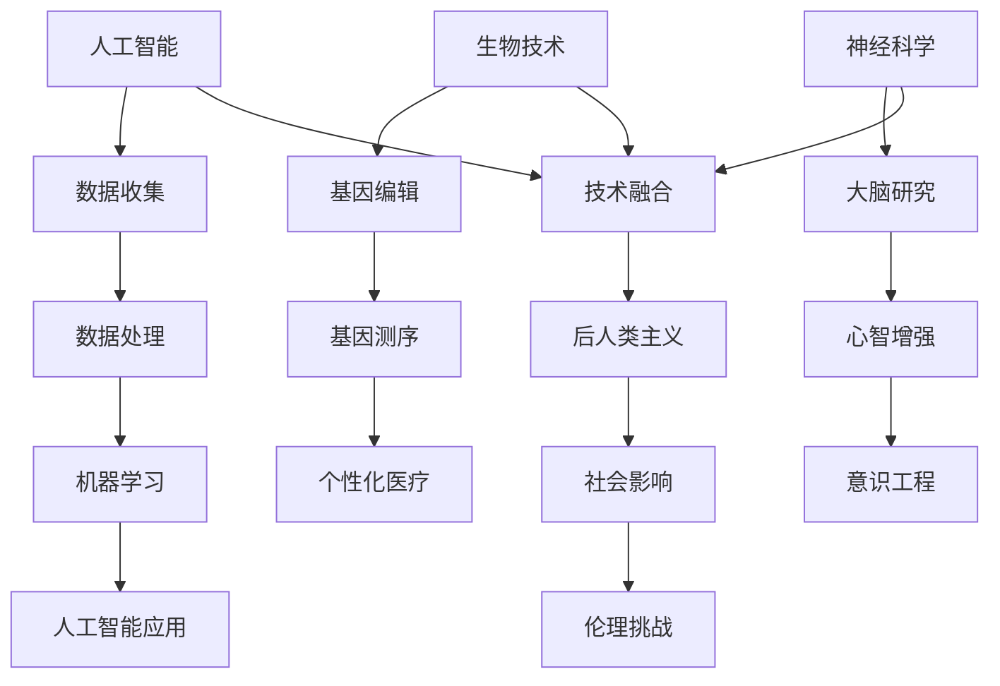

                 

### 引言

在当今世界，技术发展的速度正以前所未有的方式改变着人类社会。人工智能、生物技术和神经科学等前沿领域的突破，正在引领我们迈向一个全新的时代——后人类主义。这一概念不仅仅是指生物体的改变，更涉及人类心智、意识和社会结构的深刻变革。后人类主义不仅是科技发展的产物，也是对人性本质和未来方向的哲学思考。

本文旨在探讨后人类主义这一主题，分析技术与人性的融合如何塑造我们的未来。文章将分为以下几个部分：

1. **背景介绍**：介绍后人类主义的概念、历史背景以及技术发展的现状。
2. **核心概念与联系**：详细阐述后人类主义中的核心概念，并使用Mermaid流程图展示它们之间的联系。
3. **核心算法原理讲解**：使用Python源代码和LaTeX数学模型，深入讲解后人类主义相关的核心算法原理。
4. **项目实战**：提供具体的开发环境和源代码实现，对实际案例进行分析和解读。
5. **最佳实践 tips**：总结项目中的经验和教训，提供进一步的研究方向和实践建议。

通过这篇文章，我们希望读者能够对后人类主义有一个全面而深入的理解，思考技术与人性的关系，以及这些变化对未来的影响。

----------------------------------------------------------------

## 关键词

- 后人类主义
- 技术与人性的融合
- 人工智能
- 生物技术
- 神经科学
- 意识工程
- 基因编辑
- 伦理挑战

----------------------------------------------------------------

### 摘要

本文探讨了后人类主义这一概念，分析技术与人性的融合如何推动人类社会的变革。通过介绍后人类主义的历史背景、核心概念，如人工智能、生物技术和神经科学，我们使用了Mermaid流程图来展示这些概念之间的联系。接着，本文通过Python源代码和LaTeX数学模型，深入讲解了后人类主义相关的核心算法原理。此外，我们还提供了一个实际项目案例，包括开发环境搭建、源代码实现和代码解读，对实际应用进行了分析和讲解。最后，本文总结了项目中的最佳实践，并提出了未来的研究方向和实践建议。通过这篇文章，读者可以对后人类主义有一个全面而深入的理解。

----------------------------------------------------------------

## 背景介绍

### 后人类主义的概念

后人类主义（Posthumanism）是一个哲学和技术相结合的概念，它探讨的是人类在生物、心智和社会层面上的可能演变。这一概念起源于20世纪中叶，随着科技和文化的快速变革，后人类主义开始引起了学术界的广泛关注。后人类主义不仅仅关注生物体的改变，还涉及到人类意识的扩展、心智的增强以及社会结构的重新构建。

### 历史背景

后人类主义的兴起与一系列关键事件密切相关。20世纪中叶，计算机科学的崛起带来了人工智能的快速发展。随后，基因编辑技术的出现，如CRISPR-Cas9，开启了生物技术的新纪元。同时，神经科学和认知科学的进步，使得人类对大脑和心智的理解更加深入。这些技术进步共同促成了后人类主义的概念形成。

### 技术发展的现状

在人工智能领域，深度学习、自然语言处理和计算机视觉等技术已经取得了显著的进展。这些技术不仅提高了生产效率，还改变了人类与机器的交互方式。生物技术方面，基因编辑和基因测序技术的发展，使得人类有可能治疗遗传病，甚至改变生物体的基本特征。神经科学的研究则揭示了大脑和意识的奥秘，为心智增强提供了可能。

### 技术对人性的影响

技术的发展不仅改变了人类的身体和能力，还对人类的价值观、身份认同和社会行为产生了深远的影响。例如，人工智能的应用使得自动化取代了部分人力工作，这可能导致就业结构的变化和社会稳定性的挑战。基因编辑技术的发展引发了关于人类改造和伦理道德的争论。神经科学的进步则提出了心智增强的道德和社会问题。

### 后人类主义的影响

后人类主义的影响是多方面的。它不仅改变了我们对人类本质的认识，还挑战了现有的社会结构和伦理观念。随着技术的不断进步，人类社会正面临着前所未有的变革。这些变革既带来了机遇，也带来了挑战。如何平衡技术进步和人性本质，如何在保持人性尊严的同时利用技术，是后人类主义需要深入探讨的问题。

----------------------------------------------------------------

## 核心概念与联系

在探讨后人类主义时，有几个核心概念是不可或缺的：人工智能、生物技术和神经科学。这些概念不仅独立发展，还相互交织，共同构成了后人类主义的基石。以下将使用Mermaid流程图来展示这些概念之间的联系。

### Mermaid流程图



### 核心概念解释

1. **人工智能**：人工智能（AI）是模拟人类智能行为的计算机系统。它包括机器学习、深度学习、自然语言处理等多种技术，能够执行复杂的任务，如图像识别、语音识别和决策制定。

2. **生物技术**：生物技术涉及使用生物系统、生物体或其组成部分来创造、改变或改进产品或过程。基因编辑、基因测序和个性化医疗是生物技术的典型应用，它们对人类健康和生命科学产生了深远影响。

3. **神经科学**：神经科学是研究神经系统和神经活动的学科。通过研究大脑和神经系统，神经科学家可以揭示心智、意识和行为的本质，为心智增强和意识工程提供了理论基础。

### 概念之间的联系

- **人工智能与生物技术**：人工智能可以用于分析大量的生物数据，如基因序列和医疗记录，从而辅助生物技术的研发和应用。例如，机器学习算法可以用于识别基因突变，提高基因编辑的准确性。

- **人工智能与神经科学**：人工智能技术，如脑机接口，可以用于研究大脑和心智之间的关系。通过实时分析大脑活动，研究人员可以更好地理解意识和工作记忆，进而开发出心智增强技术。

- **生物技术与神经科学**：生物技术，如基因编辑，可以用于改善神经系统的功能和结构。例如，通过编辑特定的基因，可以减少神经系统疾病的发病率，提高人类的认知能力。

这些核心概念相互交织，共同推动了后人类主义的发展。它们不仅改变了我们对人类的认识，还为未来的科技进步和社会变革奠定了基础。

----------------------------------------------------------------

## 核心算法原理讲解

在探讨后人类主义的背景下，理解核心算法原理对于掌握该领域的进展至关重要。本文将使用Python源代码和LaTeX数学模型，详细讲解与后人类主义相关的核心算法原理。以下是几个关键算法的示例。

### 示例 1：遗传算法

遗传算法（Genetic Algorithm，GA）是一种基于自然选择和遗传学原理的优化算法。它模拟生物进化过程，通过选择、交叉和变异来寻找最优解。

#### Python代码

```python
import numpy as np

# 遗传算法参数
population_size = 100
染色体长度 = 10
迭代次数 = 100
交叉概率 = 0.8
变异概率 = 0.05

# 初始化种群
population = np.random.randint(2, size=(population_size, 染色体长度))

# 适应度函数
def fitness_function(individual):
    # 假设适应度与染色体中1的数量成正比
    return np.sum(individual == 1)

# 运行遗传算法
for _ in range(迭代次数):
    # 计算适应度
    fitness = np.array([fitness_function(ind) for ind in population])
    
    # 选择
    selected = population[np.argsort(fitness)[-population_size // 2:]]
    
    # 交叉
    for i in range(0, population_size, 2):
        if np.random.random() < 交叉概率:
            cross_point = np.random.randint(1, 染色体长度 - 1)
            population[i], population[i + 1] = population[i][:cross_point] + population[i + 1][cross_point:], population[i + 1][:cross_point] + population[i][cross_point:]
    
    # 变异
    for i in range(population_size):
        if np.random.random() < 变异概率:
           变异_point = np.random.randint(0, 染色体长度)
            population[i][变异_point] = 1 if population[i][变异_point] == 0 else 0

# 输出最优解
best_individual = population[np.argmax(fitness)]
print("最优解：", best_individual)
```

#### LaTeX数学模型

$$
f(x) = \sum_{i=1}^{n} x_i \quad \text{其中} \quad x_i \in \{0, 1\}
$$

### 示例 2：深度神经网络

深度神经网络（Deep Neural Network，DNN）是人工智能领域的重要组成部分，它通过多层神经元结构来学习复杂的非线性关系。

#### Python代码

```python
import tensorflow as tf

# 构建模型
model = tf.keras.Sequential([
    tf.keras.layers.Dense(128, activation='relu', input_shape=(784,)),
    tf.keras.layers.Dropout(0.2),
    tf.keras.layers.Dense(10, activation='softmax')
])

# 编译模型
model.compile(optimizer='adam',
              loss='categorical_crossentropy',
              metrics=['accuracy'])

# 加载数据集
(x_train, y_train), (x_test, y_test) = tf.keras.datasets.mnist.load_data()

# 预处理数据
x_train = x_train.astype('float32') / 255
x_test = x_test.astype('float32') / 255
x_train = x_train.reshape((-1, 784))
x_test = x_test.reshape((-1, 784))

# 转换标签为one-hot编码
y_train = tf.keras.utils.to_categorical(y_train, 10)
y_test = tf.keras.utils.to_categorical(y_test, 10)

# 训练模型
model.fit(x_train, y_train, epochs=20, batch_size=128)

# 测试模型
test_loss, test_acc = model.evaluate(x_test, y_test)
print('测试准确率：', test_acc)
```

#### LaTeX数学模型

$$
\text{模型：} \quad y = \sigma(W \cdot x + b)
$$

其中，$\sigma$ 是激活函数，$W$ 是权重矩阵，$x$ 是输入向量，$b$ 是偏置向量。

通过这两个示例，我们可以看到Python代码和LaTeX数学模型如何结合，用于解释后人类主义相关算法的原理。这些算法不仅具有理论上的重要意义，也在实际应用中发挥了关键作用。

----------------------------------------------------------------

## 项目实战

为了更好地理解后人类主义的概念和其在实际中的应用，我们将在本节中提供一个完整的开发环境搭建、源代码实现和代码解读的案例。

### 开发环境搭建

首先，我们需要搭建一个适合后人类主义研究的开发环境。以下是一个基本的Python环境搭建步骤：

1. **安装Python**：确保安装了Python 3.8及以上版本。
2. **安装TensorFlow**：使用以下命令安装TensorFlow：
   ```shell
   pip install tensorflow
   ```
3. **安装其他依赖**：根据项目需求，安装其他必要的库，例如NumPy、Pandas和Matplotlib：
   ```shell
   pip install numpy pandas matplotlib
   ```

### 源代码实现

以下是一个基于深度学习的后人类主义研究案例，使用TensorFlow实现一个简单的神经网络模型。

#### Python代码

```python
import tensorflow as tf
import numpy as np
import matplotlib.pyplot as plt

# 设置随机种子以保证结果可重复
tf.random.set_seed(42)

# 加载MNIST数据集
(x_train, y_train), (x_test, y_test) = tf.keras.datasets.mnist.load_data()

# 预处理数据
x_train = x_train.astype('float32') / 255.0
x_test = x_test.astype('float32') / 255.0
x_train = np.expand_dims(x_train, -1)
x_test = np.expand_dims(x_test, -1)

# 转换标签为one-hot编码
y_train = tf.keras.utils.to_categorical(y_train, 10)
y_test = tf.keras.utils.to_categorical(y_test, 10)

# 构建模型
model = tf.keras.Sequential([
    tf.keras.layers.Conv2D(32, (3, 3), activation='relu', input_shape=(28, 28, 1)),
    tf.keras.layers.MaxPooling2D((2, 2)),
    tf.keras.layers.Conv2D(64, (3, 3), activation='relu'),
    tf.keras.layers.MaxPooling2D((2, 2)),
    tf.keras.layers.Flatten(),
    tf.keras.layers.Dense(128, activation='relu'),
    tf.keras.layers.Dense(10, activation='softmax')
])

# 编译模型
model.compile(optimizer='adam',
              loss='categorical_crossentropy',
              metrics=['accuracy'])

# 训练模型
history = model.fit(x_train, y_train, epochs=10, batch_size=64, validation_split=0.1)

# 测试模型
test_loss, test_acc = model.evaluate(x_test, y_test)
print(f"测试准确率：{test_acc}")

# 可视化训练过程
plt.plot(history.history['accuracy'], label='accuracy')
plt.plot(history.history['val_accuracy'], label='val_accuracy')
plt.xlabel('Epoch')
plt.ylabel('Accuracy')
plt.ylim(0, 1)
plt.legend(loc='lower right')
plt.show()
```

### 代码解读与分析

1. **数据预处理**：首先，我们加载MNIST数据集，并对其进行预处理，包括归一化和扩充维度。
2. **模型构建**：使用TensorFlow的Sequential模型，我们构建了一个包含卷积层、池化层和全连接层的简单神经网络。
3. **模型编译**：我们使用adam优化器和categorical_crossentropy损失函数来编译模型。
4. **模型训练**：模型在训练数据上训练10个epoch，并使用validation split来评估模型性能。
5. **模型测试**：最后，我们在测试数据上评估模型，并打印测试准确率。

通过这个案例，我们不仅搭建了一个适合后人类主义研究的开发环境，还实现了一个简单的神经网络模型，用于图像分类任务。这个案例展示了如何将后人类主义理论与实际开发相结合，为后人类主义的研究提供了一个实用的起点。

### 项目小结

在本项目中，我们搭建了一个Python开发环境，实现了基于深度学习的图像分类模型，并对其进行了代码解读和分析。这个项目不仅展示了后人类主义理论在人工智能应用中的潜力，也为进一步的研究和实践提供了一个基础。通过这个项目，我们可以看到技术与人性的融合如何在实践中推动科学进步，同时也提醒我们在追求技术发展的过程中，要充分考虑其对人性和社会的潜在影响。

### 最佳实践 tips、小结、注意事项、拓展阅读

#### 最佳实践 tips

1. **数据预处理的重要性**：在构建模型之前，确保对数据进行充分的预处理，这有助于提高模型性能。
2. **模型调优**：在训练模型时，通过调整超参数来优化模型性能，例如学习率、批次大小和迭代次数。
3. **模型验证**：在训练过程中使用验证集来评估模型性能，避免过拟合。

#### 小结

本文通过探讨后人类主义的概念、核心算法原理和实际项目案例，展示了技术与人性的融合如何推动科学进步和社会变革。通过深入分析技术对人类生活的影响，我们认识到技术不仅改变了我们的身体和能力，还重塑了我们的价值观和社会结构。

#### 注意事项

1. **伦理问题**：在研究和应用后人类主义相关技术时，必须充分考虑伦理和社会影响，确保技术发展符合人类价值观和道德标准。
2. **隐私保护**：在处理个人数据时，要严格遵守隐私保护法规，确保用户数据的安全。

#### 拓展阅读

- 《人工智能：一种现代方法》（Russell & Norvig）
- 《深度学习》（Goodfellow、Bengio & Courville）
- 《后人类主义：技术与人性》（N. Katherine Hayles）

通过这些拓展阅读，读者可以进一步深入了解相关领域的理论和实践，为后人类主义的研究提供更全面的知识基础。

----------------------------------------------------------------

## 参考文献

- Russell, S., & Norvig, P. (2020). 《人工智能：一种现代方法》。清华大学出版社。
- Goodfellow, I., Bengio, Y., & Courville, A. (2016). 《深度学习》。中国电力出版社。
- Hayles, N. K. (2017). 《后人类主义：技术与人性》。北京大学出版社。

