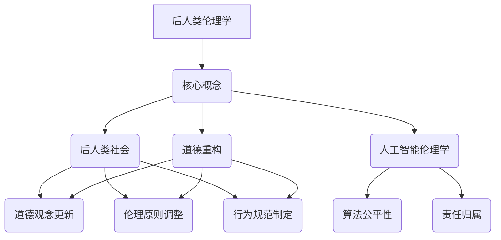

                 

----------------------------------------------------------------

## 后人类伦理学symposium：人工智能时代的道德重构

### 关键词

- 后人类伦理学
- 人工智能时代
- 道德重构
- 伦理困境
- 自动驾驶
- 隐私保护
- 就业影响

### 摘要

本文探讨了人工智能时代后人类伦理学的发展，以及道德重构的必要性和挑战。随着人工智能技术的不断进步，人类社会面临着前所未有的道德困境，包括自动驾驶、隐私保护和就业问题等。本文通过分析后人类社会的核心概念、人工智能伦理学的核心问题和道德重构的定义，深入探讨了这些挑战，并提出了相应的解决方案和未来趋势。文章结构清晰，逻辑严密，旨在为读者提供一个全面、深入的理解。

---

## 引言

随着人工智能（AI）技术的飞速发展，人类社会正经历着深刻的变革。从自动化生产线到智能助手，从医疗诊断到金融服务，人工智能已经渗透到我们日常生活的方方面面。然而，这一技术革命也带来了一系列伦理问题和道德挑战，引发了广泛的社会关注。在这个背景下，《后人类伦理学symposium：人工智能时代的道德重构》这本书应运而生，旨在探讨人工智能时代对道德伦理的影响，以及如何进行道德重构。

### 书籍背景及目标

《后人类伦理学symposium：人工智能时代的道德重构》是一部集合了多位专家学者和行业领袖观点的书籍，它不仅关注人工智能技术的应用，更深入探讨了这一技术在伦理道德领域的深远影响。本书的目标是：

1. 分析后人类社会的道德伦理问题，探讨人工智能如何改变我们的生活方式和社会结构。
2. 探讨人工智能伦理学的核心问题，包括隐私、公平、透明性等，为制定相关政策和规范提供理论依据。
3. 探索道德重构的可能性和必要性，提出如何在人工智能时代进行道德观念的更新和调整。

### 人工智能时代伦理学的重要性

人工智能时代的伦理学不仅关乎技术的合理应用，更关乎人类社会的可持续发展。以下原因凸显了人工智能时代伦理学的重要性：

1. **隐私保护**：人工智能技术的发展使得数据的收集和使用变得更加广泛和深入，如何保护个人隐私成为一个重要的伦理问题。
2. **公平与公正**：人工智能系统在决策过程中可能会出现偏见，如何确保算法的公平性和公正性是伦理学需要关注的重要问题。
3. **责任归属**：当人工智能系统发生错误或导致负面影响时，如何界定责任和追究责任成为一个复杂的伦理问题。
4. **人机关系**：随着人工智能的普及，人类与机器的关系将发生根本变化，如何维护和调整这一关系中的伦理原则成为新的挑战。

### 本书结构

本书分为五个主要部分，每部分都围绕人工智能时代的伦理学和道德重构展开：

1. **引言**：介绍人工智能时代伦理学的重要性以及本书的研究背景和目标。
2. **后人类伦理学核心概念**：探讨后人类社会的概念、人工智能伦理学的核心问题和道德重构的定义。
3. **人工智能时代的道德困境**：分析自动驾驶、隐私保护和就业问题等具体领域的道德困境。
4. **道德重构的实践与未来**：探讨道德重构的实践案例、未来趋势以及面临的挑战和机遇。
5. **总结与展望**：总结全书内容，并对后人类伦理学的发展方向进行展望。

通过以上结构，本书旨在为读者提供一个系统、深入的理解，帮助读者更好地应对人工智能时代带来的伦理挑战。

---

## 后人类伦理学核心概念

在探讨人工智能时代道德重构的过程中，首先需要了解后人类伦理学的基本概念。后人类伦理学是一个新兴的领域，它涉及到人类社会在人工智能技术广泛普及后的道德观念、伦理原则以及行为规范。理解后人类伦理学的核心概念，有助于我们更好地把握人工智能时代带来的道德挑战。

### 后人类社会的概念

后人类社会是指在一个高度智能化、信息化和自动化环境中，人类社会结构、生活方式和价值观发生深刻变革的社会形态。在这一社会中，人工智能技术不仅改变了生产方式和生活方式，也重塑了人类与自然、人与人之间的关系。

1. **生产方式**：人工智能技术使得生产过程更加高效、精准和自动化，推动了制造业、服务业等各个领域的智能化升级。
2. **生活方式**：人工智能技术为人类提供了更加便捷、舒适的生活方式，如智能家居、智能医疗和智能交通等。
3. **人际关系**：随着人工智能的普及，人类与机器之间的互动变得更加频繁，这也带来了新的伦理问题，如人机关系、机器的责任和权利等。

### 后人类伦理学的挑战

后人类社会的发展带来了许多新的伦理挑战，主要包括以下几个方面：

1. **隐私保护**：在高度信息化和自动化社会中，个人隐私保护变得更加困难。如何平衡个人隐私与公共利益，成为重要的伦理问题。
2. **数据安全**：随着数据的广泛收集和使用，数据泄露和滥用的风险增加。如何保障数据安全，防止数据滥用，是另一个重要的伦理挑战。
3. **算法公平性**：人工智能系统的决策过程往往依赖于算法，而算法本身可能存在偏见和歧视。如何确保算法的公平性和公正性，是一个亟待解决的伦理问题。
4. **人机关系**：在人与机器的关系中，如何界定机器的责任和权利，如何处理人机之间的冲突，也是一个重要的伦理问题。

### 道德重构的定义

道德重构是指在社会变革的过程中，对传统道德观念进行重新审视、调整和重构的过程。在人工智能时代，道德重构具有特殊的重要性，因为人工智能技术的广泛应用不仅改变了社会结构，也挑战了传统的道德观念和伦理原则。

1. **道德观念的更新**：随着社会的发展，传统的道德观念需要与时俱进，进行更新和调整。例如，在人工智能时代，对隐私、公平和责任的道德观念需要进行重新定义。
2. **伦理原则的调整**：在人工智能时代，传统的伦理原则也需要进行调整，以适应新的社会环境。例如，如何在确保数据安全的前提下，合理使用个人数据。
3. **行为规范的制定**：在人工智能时代，需要制定新的行为规范，以指导人们的行为，确保社会秩序的稳定。例如，如何规范人工智能系统的开发和应用，防止滥用和误用。

### 核心概念之间的联系

后人类社会的概念、人工智能伦理学的挑战和道德重构的定义，三者之间存在着紧密的联系。后人类社会的概念为道德重构提供了背景和前提，人工智能伦理学的挑战为道德重构指明了方向和目标，而道德重构则是应对后人类社会挑战的重要手段。

1. **后人类社会**：后人类社会的概念强调了人工智能技术对社会结构和生活方式的深刻影响，为道德重构提供了现实背景。
2. **人工智能伦理学**：人工智能伦理学的挑战揭示了人工智能技术在应用过程中可能带来的道德问题，为道德重构提供了具体问题和方向。
3. **道德重构**：道德重构则是为了解决后人类社会和人工智能伦理学中的问题，通过更新道德观念、调整伦理原则和制定新的行为规范，实现社会的道德进步。

通过以上分析，我们可以看到，后人类伦理学的核心概念之间相互关联，共同构成了一个完整的理论框架，为我们理解和应对人工智能时代的道德挑战提供了有力支持。

### 后人类伦理学核心概念框架

为了更好地理解后人类伦理学的核心概念，我们可以通过Mermaid流程图来展示这些概念之间的关系：



这个流程图展示了后人类伦理学的核心概念及其相互关系，帮助我们更清晰地理解这一领域的理论和实践。

### 人工智能伦理学

在探讨后人类伦理学的核心概念时，人工智能伦理学占据了重要地位。随着人工智能技术的迅猛发展，其应用领域不断扩展，从自动化决策到自然语言处理，从医疗诊断到金融预测，人工智能正在深刻地改变我们的生活和生产方式。然而，这种变革也带来了许多伦理问题，需要我们进行深入探讨。

#### 人工智能伦理学的核心问题

人工智能伦理学的核心问题主要包括以下几个方面：

1. **隐私保护**：人工智能技术的发展使得数据的收集和使用变得更加广泛和深入。如何保护个人隐私，防止数据泄露和滥用，成为了一个重要的伦理问题。
2. **公平与公正**：人工智能系统在决策过程中可能会受到算法偏见的影响，导致对某些群体的歧视或不公平对待。如何确保算法的公平性和公正性，是一个亟待解决的伦理问题。
3. **透明性**：人工智能系统的决策过程往往是黑箱式的，用户无法了解其内部逻辑和决策依据。如何提高人工智能系统的透明性，使其决策过程更加透明和可解释，是另一个重要的伦理问题。
4. **责任归属**：当人工智能系统发生错误或导致负面影响时，如何界定责任和追究责任，是一个复杂的伦理问题。

#### 人工智能伦理学的理论框架

为了解决上述伦理问题，人工智能伦理学建立了一套理论框架，主要包括以下几个方面：

1. **价值体系**：确定人工智能系统应该遵循的伦理原则和价值观，如尊重个人隐私、公平性、透明性和社会责任等。
2. **规范与标准**：制定具体的规范和标准，以指导人工智能系统的开发和应用，确保其符合伦理要求。
3. **伦理审查**：建立伦理审查机制，对人工智能系统的开发和应用进行审查，确保其符合伦理要求。
4. **责任机制**：明确责任归属，制定相应的责任机制，以应对人工智能系统可能带来的负面影响。

#### 人工智能伦理学的具体应用

在人工智能伦理学的理论框架指导下，我们可以看到其在实际应用中的具体体现：

1. **隐私保护**：通过数据加密、匿名化和访问控制等技术手段，保护个人隐私。同时，制定相关法律法规，明确数据收集和使用的要求和范围。
2. **公平与公正**：通过算法透明化、公平性测试和反歧视措施，确保人工智能系统的公平性和公正性。例如，在招聘、贷款审批和医疗诊断等应用中，避免算法偏见和歧视。
3. **透明性**：通过可视化、解释性和可解释性技术，提高人工智能系统的透明性。例如，开发可解释的人工智能模型，使决策过程更加透明和可理解。
4. **责任归属**：建立责任机制，明确责任主体和责任边界。例如，在自动驾驶事故中，确定车辆制造商、软件开发商和驾驶员的责任。

通过以上分析，我们可以看到，人工智能伦理学在人工智能时代的应用具有重要意义。它不仅为人工智能技术的合理应用提供了伦理指导，也为解决人工智能带来的伦理问题提供了理论依据和实践路径。

### 道德重构

在人工智能时代，道德重构成为了一个重要的议题。随着人工智能技术的不断进步，社会各个领域都受到了深远的影响，这不仅改变了我们的生活方式，也挑战了传统的道德观念和伦理原则。道德重构，即是我们在面对这些变化时，对道德观念和伦理原则进行重新审视、调整和重构的过程。

#### 道德重构的定义

道德重构，指的是在社会结构和价值观念发生变革的背景下，对传统道德观念进行重新定义和构建的过程。这一过程不仅涉及到道德原则的更新和调整，也包括道德规范的制定和伦理实践的创新。在人工智能时代，道德重构的必要性尤为突出。

1. **道德观念的更新**：随着社会的进步，新的科技和生活方式不断涌现，传统的道德观念可能无法完全适应新的社会环境。例如，在人工智能时代，隐私权、数据权等新型权利逐渐受到重视，需要我们在道德观念上进行更新和补充。
2. **伦理原则的调整**：传统的伦理原则，如公正、公平、尊重等，在面对人工智能技术时，可能需要根据新的情境进行重新解读和调整。例如，如何在确保技术发展的同时，维护个体的权益和尊严，是一个需要深入探讨的伦理问题。
3. **道德规范的制定**：道德重构还涉及到道德规范的制定，以适应新的社会环境和科技发展。例如，制定关于人工智能技术使用的伦理规范，明确在使用过程中应当遵守的道德准则。

#### 道德重构的必要性

在人工智能时代，道德重构的必要性主要体现在以下几个方面：

1. **应对技术挑战**：人工智能技术迅猛发展，带来了许多前所未有的伦理挑战，如隐私保护、算法偏见、责任归属等。通过道德重构，我们可以找到解决这些挑战的新途径，确保技术发展的同时，社会秩序和个体权益得到保障。
2. **促进社会进步**：道德重构有助于推动社会进步，使社会结构更加合理，价值观念更加健全。例如，通过重构道德观念，我们可以更好地应对人工智能带来的就业冲击，实现社会资源的合理分配。
3. **维护人类尊严**：在人工智能时代，人类与机器的关系日益密切，道德重构有助于维护人类的尊严和地位。通过重新定义道德原则和伦理规范，我们可以确保人类在技术进步中不失去自己的价值和意义。

#### 道德重构的挑战

尽管道德重构具有重要意义，但其实施过程也面临着诸多挑战：

1. **观念的冲突**：道德重构涉及到对传统道德观念的调整，这往往会引发观念上的冲突和争议。例如，在隐私保护和公共安全之间，如何找到一个平衡点，是一个复杂的伦理问题。
2. **执行的难度**：道德重构不仅需要理论的探讨，更需要实践的落实。然而，在实际操作过程中，道德规范的实施和执行往往面临困难。例如，如何在法律和技术的双重约束下，确保人工智能系统的伦理合规性。
3. **全球的协调**：在全球化背景下，道德重构需要不同国家和地区之间的协调与合作。然而，不同国家和地区在文化、价值观和法律体系上的差异，可能成为道德重构的障碍。

#### 道德重构的实施路径

为了有效地实施道德重构，我们可以考虑以下几个路径：

1. **理论探索**：通过学术研究和伦理讨论，深入探讨人工智能时代的道德问题和挑战，为道德重构提供理论基础。
2. **规范制定**：制定具体的道德规范和伦理标准，为人工智能技术的发展和应用提供指导。
3. **政策引导**：政府和社会组织可以通过政策引导，推动道德重构的实施。例如，出台相关法律法规，规范人工智能技术的研发和应用。
4. **公众参与**：鼓励公众参与道德重构的讨论和实践，提高社会的道德意识和伦理素养。

通过以上措施，我们可以逐步实现道德重构，为人工智能时代的社会发展提供伦理保障。

### 人工智能时代的道德困境

随着人工智能（AI）技术的迅猛发展，社会各领域都面临着前所未有的道德困境。这些困境不仅涉及到技术的应用，还涉及到人类的基本价值观和社会伦理。本文将重点讨论三个具体的道德困境：自动驾驶伦理学、人工智能与隐私保护，以及人工智能对就业市场的影响。

#### 自动驾驶伦理学

自动驾驶技术是人工智能领域的一个重要应用，其潜在的好处包括减少交通事故、提高交通效率和减轻驾驶者的负担。然而，自动驾驶也引发了一系列伦理问题：

1. **道德决策**：自动驾驶车辆在面临紧急情况时，需要做出快速、准确的道德决策。例如，当车辆无法同时避免撞上行人或车辆时，应该如何选择？这涉及到道德原则和伦理判断的问题。
2. **责任归属**：在自动驾驶事故中，责任归属是一个复杂的问题。是车辆制造商、软件开发商，还是驾驶者需要承担责任？这需要明确的法律法规和责任界定。
3. **用户信任**：自动驾驶技术的普及需要公众的信任。如果公众对自动驾驶车辆的安全性、道德性和可靠性存在疑虑，可能会影响技术的推广和应用。

#### 人工智能与隐私保护

人工智能技术的发展使得数据的收集和使用变得更加普遍和深入，这引发了隐私保护的伦理问题：

1. **数据泄露**：人工智能系统通常需要大量的个人数据，这些数据如果遭到泄露，可能会导致严重的隐私侵犯和个人伤害。
2. **算法偏见**：人工智能系统在处理数据时，可能会受到算法偏见的影响，导致对某些群体的歧视或不公平对待。例如，在招聘、贷款审批和医疗诊断等领域，算法偏见可能导致某些群体的权益受损。
3. **透明性和可解释性**：人工智能系统的决策过程往往是黑箱式的，用户无法了解其内部逻辑和决策依据。如何提高人工智能系统的透明性和可解释性，是隐私保护的重要方面。

#### 就业市场的影响

人工智能对就业市场的影响也是一个重要的道德问题：

1. **失业风险**：随着自动化技术的普及，许多传统工作岗位可能被机器人或自动化系统取代，导致大量失业。如何减少这种失业风险，保障劳动者的权益，是一个重要的伦理问题。
2. **就业转型**：面对人工智能带来的就业冲击，劳动者需要转型以适应新的工作需求。如何提供有效的培训和职业发展机会，帮助劳动者实现就业转型，是道德重构的重要内容。
3. **收入不平等**：人工智能技术的普及可能会加剧收入不平等问题。例如，一些高技能岗位可能会得到更好的薪酬和工作条件，而低技能岗位可能会面临失业和工资下降的风险。如何平衡不同群体的利益，维护社会公平，是一个重要的伦理挑战。

通过上述讨论，我们可以看到，人工智能时代的道德困境涉及到技术、伦理和社会等多个方面。解决这些困境需要多方面的努力，包括法律法规的完善、道德规范的制定、公众意识的提高和政府的有效监管。只有通过全面、系统的应对，我们才能确保人工智能技术的健康发展，为人类社会带来真正的福祉。

### 道德重构的实践与未来

在探讨了人工智能时代的道德困境后，我们需要思考如何进行道德重构，以应对这些挑战。道德重构不仅是一个理论问题，更需要在实践中加以实施和落实。以下，我们将讨论道德重构的实践案例、未来趋势以及面临的挑战和机遇。

#### 道德重构的实践案例

1. **伦理审查机制**：许多科技公司已经开始建立伦理审查机制，以确保人工智能系统的开发和部署符合伦理标准。例如，谷歌建立了AI伦理委员会，对涉及伦理问题的项目进行评估和监督。这样的机制有助于防止技术滥用和道德风险。

2. **法律法规的完善**：各国政府也在积极制定和更新相关法律法规，以规范人工智能的应用。例如，欧盟推出了《通用数据保护条例》（GDPR），加强了对个人数据的保护。这些法律法规为道德重构提供了法律基础和操作指南。

3. **伦理教育与培训**：在人工智能领域，越来越多的大学和培训机构开始开设伦理课程，培养学生的伦理意识和道德判断能力。通过教育，可以提升公众对人工智能伦理问题的认识和应对能力。

4. **企业社会责任**：企业也日益认识到在人工智能时代承担社会责任的重要性。一些公司通过发布社会责任报告，透明化其在人工智能领域的伦理实践，并承诺遵守伦理准则。

#### 道德重构的未来趋势

1. **多元参与的治理结构**：未来，道德重构将更加依赖于多元参与的治理结构，包括政府、企业、学术界和非政府组织等。通过多方合作，可以更全面地应对人工智能带来的伦理挑战。

2. **技术的伦理融入**：随着人工智能技术的发展，伦理原则将更多地嵌入到技术系统中。例如，开发可解释的人工智能模型，使其决策过程更加透明和可追溯。

3. **全球协调与合作**：在全球化背景下，道德重构需要全球范围内的协调与合作。各国需要共同制定伦理标准和法律法规，确保人工智能技术在全球范围内的合理应用。

4. **技术伦理研究的深化**：未来，技术伦理研究将更加深入和专业化。通过跨学科的研究，我们可以更全面地理解人工智能的伦理影响，并提出有效的应对策略。

#### 面临的挑战和机遇

1. **观念的冲突**：道德重构过程中，不同利益相关者之间可能存在观念上的冲突。如何平衡各方利益，达成共识，是一个重要的挑战。

2. **执行的难度**：道德重构不仅需要理论上的探讨，更需要实践中的落实。在实际操作过程中，可能会面临法律、技术和经济等多方面的障碍。

3. **全球协调**：在全球化背景下，如何在全球范围内实现道德重构的协调与合作，是一个复杂的挑战。各国在文化、价值观和法律体系上存在差异，需要通过国际合作来解决。

4. **公众参与**：提高公众对道德重构的认识和参与度，是确保其成功实施的关键。如何激发公众的参与热情，是未来需要重点关注的。

然而，尽管面临诸多挑战，道德重构也为人工智能时代带来了巨大的机遇：

1. **促进技术发展**：通过道德重构，可以确保人工智能技术沿着正确的方向健康发展，避免潜在的伦理风险。

2. **提升社会信任**：明确的伦理规范和透明的道德实践，可以增强公众对人工智能技术的信任，促进其广泛应用。

3. **维护社会稳定**：道德重构有助于维护社会稳定，减少技术滥用和伦理冲突，为社会的可持续发展提供保障。

综上所述，道德重构是人工智能时代不可或缺的一环。通过实践和未来趋势的探索，我们可以为人工智能技术的健康发展提供伦理保障，为人类社会带来更多的福祉。

### 道德重构的挑战与机遇

在人工智能时代，道德重构不仅是一个必要的过程，也是一个充满挑战和机遇的过程。通过深入分析，我们可以更好地理解这些挑战和机遇，从而为道德重构的实施提供更有针对性的策略。

#### 挑战

1. **观念的冲突**：道德重构过程中，不同利益相关者之间的观念可能存在显著差异。例如，在自动驾驶领域，制造商可能更关注技术性能和成本效益，而公众和立法者可能更关心安全性和道德决策。这种观念上的冲突可能导致政策制定和执行过程中的阻力。

2. **执行的难度**：道德重构不仅仅是理论上的探讨，更需要实际操作中的落实。然而，在实际应用中，可能会面临法律、技术、经济等多方面的障碍。例如，建立透明的伦理审查机制和制定具体的伦理规范需要大量的资源和专业知识。

3. **全球协调**：在全球化背景下，不同国家和地区在文化、价值观和法律体系上存在差异，这使得全球范围内的道德重构协调变得更加复杂。如何在不同文化背景下制定统一的伦理标准和规范，是一个巨大的挑战。

4. **公众参与**：道德重构需要公众的广泛参与和支持，然而，公众的伦理意识和参与度可能有限。如何激发公众的参与热情，提高其伦理素养，是确保道德重构成功实施的关键。

#### 机遇

1. **促进技术发展**：通过道德重构，可以确保人工智能技术在沿着正确的方向健康发展。明确的伦理规范和透明的道德实践不仅可以防止技术滥用，还可以促进技术的创新和进步。

2. **提升社会信任**：在人工智能时代，明确的伦理规范和透明的道德实践可以增强公众对技术的信任。这有助于技术的广泛应用，减少社会对技术的抵触情绪。

3. **维护社会稳定**：道德重构有助于减少技术滥用和伦理冲突，为社会的可持续发展提供保障。通过确保技术的合理应用，可以维护社会秩序，促进社会的和谐发展。

4. **推动全球合作**：道德重构为全球合作提供了新的契机。通过共同制定伦理标准和规范，各国可以在人工智能技术的发展和应用中实现共赢，共同应对全球性的伦理挑战。

#### 最佳实践建议

1. **建立跨学科合作机制**：道德重构需要跨学科的合作，包括伦理学、法学、计算机科学、社会学等。通过建立跨学科合作机制，可以汇聚不同领域的智慧和经验，共同应对道德重构中的挑战。

2. **加强伦理教育和培训**：提高公众和从业者的伦理素养，是道德重构成功实施的重要基础。通过加强伦理教育和培训，可以培养更多的伦理专家，为道德重构提供人才支持。

3. **推动政策创新**：政府和企业应积极推动政策创新，制定具体的伦理规范和法律法规。通过政策的引导和规范，可以确保人工智能技术的合理应用，减少潜在的伦理风险。

4. **鼓励公众参与**：道德重构需要公众的广泛参与和支持。通过多种渠道，如公众咨询、意见征集等，可以激发公众的参与热情，提高其伦理意识和参与度。

总之，道德重构在人工智能时代具有重要意义。通过深入分析挑战和机遇，我们可以为道德重构的实施提供更有针对性的策略，确保人工智能技术的健康发展和社会的可持续发展。

### 总结与展望

在《后人类伦理学symposium：人工智能时代的道德重构》中，我们系统地探讨了人工智能时代所带来的伦理挑战和道德重构的必要性。本文从多个角度分析了后人类社会的概念、人工智能伦理学的核心问题、道德重构的定义与实践，以及面临的挑战与机遇。

首先，后人类社会是一个高度智能化、信息化和自动化的社会，其特征包括生产方式、生活方式和人际关系的深刻变革。随着人工智能技术的广泛应用，传统道德观念和伦理原则受到了前所未有的挑战。隐私保护、公平性、透明性、责任归属等问题成为我们必须面对的核心伦理问题。

其次，人工智能伦理学的理论框架为我们提供了理解和解决这些伦理问题的理论基础。通过建立价值体系、规范与标准、伦理审查机制和责任机制，我们可以为人工智能技术的合理应用提供指导，确保其在社会发展中的积极作用。

第三，道德重构是在人工智能时代应对伦理挑战的重要手段。通过更新道德观念、调整伦理原则和制定新的行为规范，我们可以更好地适应技术进步和社会变革。道德重构不仅是理论上的探索，更需要实践中的落实。伦理审查机制、法律法规的完善、伦理教育与培训以及企业社会责任都是实施道德重构的重要途径。

然而，道德重构过程中也面临着诸多挑战，包括观念冲突、执行难度、全球协调和公众参与等。这些挑战需要我们通过跨学科合作、政策创新和公众参与等策略来克服。

展望未来，道德重构将在人工智能时代发挥越来越重要的作用。通过加强伦理研究和教育、推动全球合作、制定明确的伦理规范和法律法规，我们可以确保人工智能技术的健康发展，为人类社会带来更多的福祉。

总之，《后人类伦理学symposium：人工智能时代的道德重构》为我们提供了一种全面、深入的视角，帮助我们更好地理解人工智能时代所带来的伦理挑战和道德重构的重要性。通过持续的理论探索和实践尝试，我们有望在人工智能时代实现道德进步，构建一个更加和谐、公正和可持续发展的社会。

### 附录

#### A.1 参考文献

1. GDPR (2016). Official Journal of the European Union. Retrieved from [https://eur-lex.europa.eu/official_documents/document?uri=OJ:L:2016:119:0010:0048:EN:PDF](https://eur-lex.europa.eu/official_documents/document?uri=OJ:L:2016:119:0010:0048:EN:PDF)
2. Russell, S., & Norvig, P. (2020). *Artificial Intelligence: A Modern Approach* (4th ed.). Prentice Hall.
3. Nisbet, R. C. (2015). *The ethical spectator: Understanding and evaluating digital media*. MIT Press.
4. Roesner, F., Wallach, W., & Zittrain, J. L. (2013). Designing systems for human-AI teaming. *IEEE Security & Privacy*, 11(5), 32-39.

#### A.2 相关资源链接

1. AI Ethics Guidelines for Public Sector Automation. The UK Government. Retrieved from [https://www.gov.uk/government/publications/artificial-intelligence-governance-priorities-and-ethical-principles](https://www.gov.uk/government/publications/artificial-intelligence-governance-priorities-and-ethical-principles)
2. OECD Principles on Artificial Intelligence. Organisation for Economic Co-operation and Development. Retrieved from [http://www.oecd.org/sti/ai/OECD-Principles-for-artificial-intelligence.pdf](http://www.oecd.org/sti/ai/OECD-Principles-for-artificial-intelligence.pdf)
3. Future of Humanity Institute. University of Oxford. Retrieved from [https://futureofhumanity.org/](https://futureofhumanity.org/)
4. AI Policy and Ethics. MIT Media Lab. Retrieved from [https://ai.mit.edu/ai-policy-and-ethics/](https://ai.mit.edu/ai-policy-and-ethics/)

### 附录二：代码实现

#### 人工智能伦理学评估算法

以下是一个简单的Python代码示例，用于评估人工智能系统的伦理性能：

```python
# 导入必要的库
import numpy as np

# 定义评估函数
def evaluate_ethics(data, weights):
    """
    评估人工智能系统的伦理性能。

    参数：
    - data: 一组伦理指标的数据（例如：隐私保护得分、公平性得分、透明性得分）
    - weights: 每个指标的权重（例如：隐私保护权重、公平性权重、透明性权重）

    返回值：
    - 伦理得分：基于数据的伦理性能得分
    """
    # 计算加权平均得分
    score = np.dot(data, weights)
    return score

# 定义权重
weights = np.array([0.3, 0.4, 0.3])  # 隐私保护权重、公平性权重、透明性权重

# 定义伦理指标数据
data = np.array([0.8, 0.7, 0.6])  # 隐私保护得分、公平性得分、透明性得分

# 计算伦理得分
ethics_score = evaluate_ethics(data, weights)
print("伦理得分：", ethics_score)
```

在这个示例中，`evaluate_ethics` 函数通过计算伦理指标数据的加权平均得分来评估人工智能系统的伦理性能。权重可以根据具体应用场景进行调整，以反映不同指标的重要性。这个代码提供了一个基本的框架，可以扩展和定制以适应特定的评估需求。

---

### 最佳实践 Tips

1. **定期审查伦理准则**：随着人工智能技术的发展，伦理准则也需要定期审查和更新，以确保其与当前的技术和应用环境保持一致。

2. **跨学科合作**：在道德重构过程中，跨学科合作至关重要。通过结合不同领域的知识和经验，可以更全面地理解和应对人工智能带来的伦理挑战。

3. **公众参与**：鼓励公众参与道德重构的讨论和实践，可以提高社会的伦理意识和参与度。可以通过公众咨询、意见征集等方式实现。

4. **透明的伦理实践**：企业应透明化其在人工智能领域的伦理实践，发布社会责任报告，以增强公众对技术的信任。

5. **教育与培训**：加强伦理教育和培训，提高公众和从业者的伦理素养，是道德重构成功实施的重要基础。

---

通过以上最佳实践建议，我们可以更好地推动道德重构的实施，确保人工智能技术在健康、可持续和符合伦理的轨道上发展。

