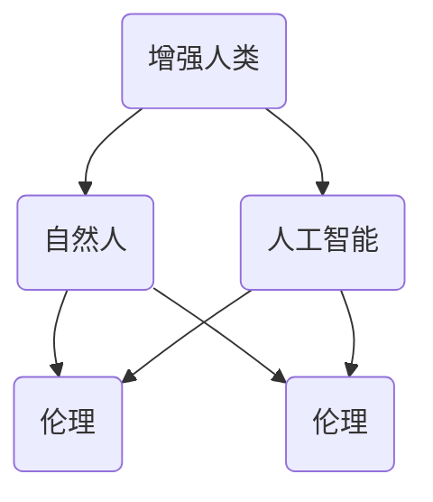
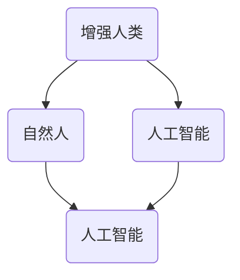

                 

# 后人类时代的价值重估：增强人类与自然人的伦理思考

## 关键词
- 后人类时代
- 伦理思考
- 增强人类
- 生物技术
- 人工智能
- 价值重估

## 摘要
本文探讨了后人类时代下，随着人工智能和生物技术的迅速发展，人类价值观和伦理观念的重新评估。通过分析后人类时代的基本概念，价值体系的变化，伦理思考的核心问题，以及伦理决策模型与方法，本文旨在提供一种清晰且具有深远意义的思考路径，以应对未来科技带来的伦理挑战。

## 引言

在21世纪，人工智能（AI）和生物技术的快速发展正在改变我们的世界。这些技术的进步不仅提升了生产力和生活质量，同时也引发了一系列深刻的伦理和社会问题。随着人类基因编辑、智能机器人和增强现实技术的出现，我们正在进入一个被称为“后人类时代”的新阶段。这个时代，人类与自然人的界限变得模糊，传统的人类价值观受到前所未有的挑战。

### 后人类时代的定义

后人类时代，也称为后人类社会或超人类时代，是指人类通过技术手段，特别是人工智能和生物技术的应用，显著改变自身生物学特征和社会行为，实现超乎自然状态的一种社会形态。在这个时代，人类的智力、体能、寿命等生理特征将得到极大的提升，同时，人工智能将与人类深度融合，共同推动社会进步。

### 技术进步对人类价值观的影响

随着人工智能和生物技术的不断发展，人类的生活方式和价值观念正在发生深刻变化。例如，基因编辑技术使得人类能够设计和改造自己的基因，从而改变自己的生理特征。这种技术的出现，不仅引发了关于人类自然本质的讨论，也带来了伦理上的挑战。同样，人工智能的应用，使得机器人能够承担更多复杂的任务，甚至具备一定的自主决策能力。这种变革，使得传统的人机关系和社会角色发生了改变。

### 伦理思考的重要性

在这样一个充满变革的时代，伦理思考显得尤为重要。伦理思考不仅关乎个体和群体的利益，也关系到社会的稳定和可持续发展。在技术进步的同时，我们必须审视这些技术可能带来的负面影响，并制定相应的伦理规范，以确保技术的应用不会对人类造成伤害。

### 核心概念与联系

为了更好地理解后人类时代的伦理思考，我们需要明确几个核心概念，并分析它们之间的关系。

1. **增强人类**：指通过技术手段提升人类的智力、体能、寿命等方面的能力。这种提升不仅包括生物学上的改进，也包括社会技能和心理素质的提升。

2. **自然人**：指未经技术改造的普通人类，他们的生理和心理特征符合自然规律。

3. **人工智能**：指通过计算机科学和人工智能技术实现的智能系统，它们能够模拟、扩展和辅助人类的智能。

4. **伦理**：指关于正确与错误、善与恶的哲学思考，用于指导人类的行为和决策。

这些概念之间存在着复杂的相互作用。例如，增强人类与人工智能的结合，可能会改变人类对自然人的定义，同时也带来新的伦理问题。通过分析这些概念之间的关系，我们可以更深入地理解后人类时代的伦理挑战。

### Mermaid 流程图

以下是一个简化的 Mermaid 流程图，展示了增强人类、自然人、人工智能和伦理之间的核心关系：



在这个图中，A、B、C 和 D 分别代表增强人类、自然人、人工智能和伦理。箭头表示它们之间的相互作用和影响。通过这个流程图，我们可以更直观地看到后人类时代伦理思考的复杂性。

### 结论

后人类时代的到来，带来了前所未有的技术变革和伦理挑战。在这个时代，我们必须重新评估人类的价值观，并制定相应的伦理规范，以确保技术进步不会对人类造成伤害。通过深入分析核心概念和关系，我们可以为未来的发展提供有力的指导。本文的后续章节将进一步探讨这些核心问题，并给出具体的解决方案。

## 第一部分：后人类时代的基本概念

### 1.1 增强人类的定义与特征

增强人类，即通过技术手段提升自身生理和心理能力的人类。这种提升不仅包括生物学的改进，如基因编辑和生物增强，还包括社会技能和心理素质的提升，如通过认知增强技术提高认知能力。增强人类的特征主要表现在以下几个方面：

1. **智力提升**：通过认知增强技术，如脑机接口和神经调节技术，增强人类的智力水平，使其在信息处理、决策和创造力方面达到更高层次。

2. **体能增强**：通过生物技术和机械外骨骼等手段，增强人类的体能，使其在力量、速度和耐力方面超越自然状态。

3. **寿命延长**：通过生物医学技术，如基因编辑和再生医学，延长人类的寿命，使其能够活得更久，享受更高质量的生活。

4. **社交技能提升**：通过虚拟现实和增强现实技术，增强人类的社交能力，使其能够更有效地沟通和合作。

### 1.2 自然人的定义与特征

自然人，即未经技术改造的普通人类，其生理和心理特征符合自然规律。自然人的特征主要表现在以下几个方面：

1. **生理特征**：自然人的生理特征由基因决定，其生长、发育和衰老过程遵循自然规律。

2. **心理特征**：自然人的心理特征包括情感、认知和行为等方面，其行为和决策受到内在心理机制的影响。

3. **社会特征**：自然人生活在社会中，其行为和决策受到社会规范和文化的影响。

4. **道德特征**：自然人在道德上具有自我意识和责任感，能够进行道德判断和选择。

### 1.3 人工智能的定义与特征

人工智能，即通过计算机科学和人工智能技术实现的智能系统，它们能够模拟、扩展和辅助人类的智能。人工智能的特征主要表现在以下几个方面：

1. **自主性**：人工智能系统能够在一定范围内自主决策和行动，不需要人类的直接干预。

2. **学习能力**：人工智能系统能够通过学习和适应不断优化自身性能，提高任务完成的准确性和效率。

3. **泛化能力**：人工智能系统能够在不同任务和环境中应用，具备一定的泛化能力。

4. **交互性**：人工智能系统能够与人类进行有效的交互，理解并响应人类的需求和指令。

### 增强人类与自然人、人工智能之间的关系

增强人类、自然人和人工智能之间存在着密切的关系。增强人类是通过技术与自然人进行对比而定义的，而人工智能则是实现增强人类能力的重要工具。

1. **增强人类与自然人的关系**：增强人类通过技术手段提升了自身的生理和心理能力，使其在智力、体能和寿命等方面超越自然人。这种超越不仅改变了人类的生理特征，也影响了人类的社会行为和价值观。

2. **增强人类与人工智能的关系**：人工智能作为工具，能够增强人类的智力、体力和寿命等各方面能力。例如，通过脑机接口，人工智能可以直接增强人类的认知能力；通过机械外骨骼，人工智能可以帮助人类完成更复杂的体力任务。

3. **自然人与人工智能的关系**：人工智能与自然人在功能上存在互补关系。人工智能可以处理和执行人类难以完成的高难度任务，而自然人则具备情感、创造力和道德判断等人工智能无法替代的能力。

### Mermaid 流程图

以下是一个简化的 Mermaid 流程图，展示了增强人类、自然人和人工智能之间的核心关系：



在这个图中，A、B 和 C 分别代表增强人类、自然人和人工智能。箭头表示它们之间的相互作用和影响。通过这个流程图，我们可以更直观地看到后人类时代的基本概念和它们之间的关系。

### 总结

通过分析增强人类、自然人和人工智能的基本概念和特征，我们可以更好地理解后人类时代的概念框架。这些概念不仅构成了后人类时代的基本要素，也为我们探讨价值体系的变化和伦理思考提供了基础。在接下来的章节中，我们将进一步探讨价值体系的变化，以及这些变化对伦理思考带来的影响。

## 第二部分：价值体系的变化

### 2.1 价值体系的基本概念

价值体系是指一系列关于价值判断和选择的准则，它指导人类的行为和决策。传统的价值体系主要基于人类的生理和社会特征，强调个体的自我实现、社会责任和道德规范。然而，在人工智能和生物技术迅速发展的背景下，传统的价值体系正在发生深刻变化。

### 2.2 传统价值体系的局限性

传统价值体系在许多方面表现出局限性，特别是在面对新兴技术时。以下是一些主要局限性：

1. **静态性**：传统价值体系往往基于静态的、固定的人类特征，难以适应快速变化的技术环境。

2. **主观性**：传统价值体系在很大程度上依赖于人类的直觉和经验，缺乏客观的衡量标准。

3. **二元对立**：传统价值体系往往将人类与自然、技术与人、智能与情感等对立起来，忽视了它们之间的相互作用和融合。

4. **缺乏适应性**：传统价值体系在面对前所未有的科技挑战时，往往显得束手无策，缺乏有效的应对策略。

### 2.3 科技进步对价值体系的影响

科技进步对传统价值体系产生了深远的影响，主要体现在以下几个方面：

1. **道德模糊化**：随着基因编辑、人工智能和生物技术等新兴技术的应用，传统道德界限变得模糊。例如，基因编辑技术使得人类能够改变自己的基因，引发了关于人类自然本质的道德争议。

2. **价值观多元化**：科技进步带来了新的价值观选择，如智能体的价值观、机器伦理等，使得价值体系更加多元化。

3. **伦理决策复杂化**：科技进步使得伦理决策变得更加复杂。例如，人工智能在决策过程中可能会涉及到算法偏见、隐私保护等问题，需要更复杂的伦理框架进行规范。

4. **全球性问题**：科技进步带来的伦理挑战具有全球性，需要全球范围内的协作和合作，共同制定伦理规范。

### 2.4 新的价值体系构建

在科技进步的背景下，构建新的价值体系具有重要意义。以下是一些可能的新价值体系构建方向：

1. **可持续性**：强调科技发展对环境和生态的影响，倡导可持续发展。

2. **公平性**：关注科技发展对社会公平的影响，确保所有人都能公平地享受科技进步带来的成果。

3. **自主性**：尊重个体的自主决策权，保障个体的隐私和自由。

4. **合作性**：倡导人类与人工智能、机器人等智能体的合作，共同推进社会进步。

5. **伦理计算**：将伦理思考融入技术设计和决策过程中，确保技术发展符合伦理要求。

### 总结

价值体系的变化是后人类时代的重要特征之一。在科技进步的背景下，传统价值体系面临前所未有的挑战，需要我们重新审视和构建。通过分析科技进步对价值体系的影响，我们可以更好地理解后人类时代的伦理思考方向，为未来的发展提供有力的指导。在接下来的章节中，我们将进一步探讨伦理思考的核心问题，以及如何应对这些挑战。

### 伦理思考的核心问题

在后人类时代的背景下，伦理思考面临着一系列核心问题，这些问题的解决不仅关系到个体和群体的利益，更关乎整个社会的稳定和可持续发展。以下是一些关键的伦理思考问题：

#### 1. 道德界限的模糊

随着基因编辑、人工智能等技术的进步，传统道德界限变得模糊。例如，基因编辑技术使得人类能够设计并修改自己的基因，这引发了一系列关于人类自然本质和道德边界的争议。如何界定道德界限，确保技术的应用不违背基本的伦理原则，成为了一个亟待解决的问题。

#### 2. 不平等问题

科技进步往往会带来新的不平等问题。例如，基因编辑技术的应用可能使得富有人群能够显著提升自身生理和心理能力，而贫困人群则难以享受到同样的科技红利。这种不平等不仅影响个体的福祉，也加剧了社会的不稳定。如何确保科技发展惠及所有人，减少不平等，是伦理思考的重要方向。

#### 3. 隐私保护

人工智能和大数据技术的应用使得个人隐私受到前所未有的威胁。例如，智能系统可以收集和分析大量个人数据，用于个性化服务或商业决策。然而，这也可能导致个人隐私被滥用或泄露。如何在利用个人数据的同时保护隐私，成为了一个重要的伦理问题。

#### 4. 自主与控制

人工智能的自主决策能力使其在某些领域可以超越人类。然而，这也引发了关于自主与控制的问题。例如，自动驾驶汽车在遇到紧急情况时如何做出决策？这种决策是否应该完全由人工智能自主进行，还是需要人类的干预？如何平衡自主与控制，确保技术系统的安全性，是伦理思考的核心问题之一。

#### 5. 动物权益

生物技术的进步使得人类能够更加深入地干预动物的生活和生存。例如，基因编辑技术可以用于改良家畜，提高农作物的产量。然而，这也可能对动物权益造成影响。如何平衡人类的需求与动物权益，确保技术的应用不损害动物福利，是伦理思考的重要议题。

#### 6. 人类尊严

随着人类通过技术手段不断超越自然状态，人类的尊严问题变得日益复杂。例如，基因编辑技术可以改变人类的生理特征，使其在外貌、体能等方面超越自然。然而，这种超越是否损害了人类尊严，如何维护人类尊严，是伦理思考的重要方向。

### 解决方案和思考路径

为了应对这些伦理思考的核心问题，我们可以从以下几个方面进行思考和探索：

1. **建立伦理框架**：制定一套系统的伦理原则和规范，为技术发展提供伦理指导。

2. **多方参与**：鼓励政府、企业、学术界和公众等多方参与伦理讨论和决策，确保不同利益相关者的声音得到充分体现。

3. **透明性和问责制**：提高技术应用的透明度，确保技术决策和操作过程公开透明，并对相关人员和行为进行问责。

4. **跨学科合作**：伦理思考需要跨学科的合作，包括哲学、心理学、计算机科学、生物技术等领域，以提供全面的解决方案。

5. **公众教育**：加强公众对科技和伦理的认知，提高公众参与伦理讨论的能力，共同推动社会进步。

通过上述思考路径和解决方案，我们可以更好地应对后人类时代面临的伦理挑战，确保科技进步为人类带来福祉，而不是困境。

### 伦理决策模型和方法

在探讨后人类时代的伦理思考时，建立一套有效的伦理决策模型和方法至关重要。这些模型和方法能够帮助我们系统地分析和解决伦理问题，确保技术在应用过程中符合伦理原则。以下是一些常见的伦理决策模型和方法：

#### 1. KSA模型（知识、技能、态度）

KSA模型是伦理决策中常用的一种框架，它包括以下三个核心要素：

- **知识**：指个体在伦理决策过程中所需的知识和信息，包括伦理理论、技术原理和社会背景等。
- **技能**：指个体在伦理决策中需要具备的技能，如逻辑分析、沟通协调和问题解决等。
- **态度**：指个体在伦理决策中的价值观和信念，这些态度会影响个体的决策倾向和结果。

KSA模型可以帮助我们识别和分析伦理决策中的关键因素，从而制定更合理的决策。

#### 2. DEON模型

DEON模型是一种基于规范伦理学的决策模型，它包括以下四个核心原则：

- **公平性**（Distributive Justice）：确保资源和技术分配的公平性，避免不平等现象。
- **公正性**（Equal Opportunity）：提供平等的机会，使所有人都能从技术进步中受益。
- **尊重性**（Respect for Autonomy）：尊重个体的自主权和决策权，确保个人隐私和自由。
- **道德性**（Morality）：确保技术应用的道德性，避免对人类和动物造成伤害。

DEON模型提供了一个系统的伦理决策框架，有助于我们在技术应用中平衡各种利益和原则。

#### 3. 伦理矩阵

伦理矩阵是一种通过图表形式展示伦理决策不同选择的工具。它通常包括两个维度，如技术影响和伦理原则。每个选择都可以在矩阵中找到对应的位置，从而帮助我们分析和比较不同选择的伦理影响。

例如，以下是一个简化的伦理矩阵，展示了在基因编辑技术应用中，不同选择的伦理影响：

```
技术影响
  | 公平性   不公平性
---------------------
尊重性   | 正面影响   负面影响
道德性   | 正面影响   负面影响
```

在这个矩阵中，每个方格代表一种选择，其伦理影响通过正负影响来评估。通过这种图表形式，我们可以更直观地分析不同选择的伦理后果，从而做出更合理的决策。

#### 4. 道德计算

道德计算是将伦理原则和数学模型相结合，通过算法和计算方法进行伦理决策。这种方法适用于复杂、多变量的伦理问题。例如，在自动驾驶汽车伦理决策中，可以通过道德计算模型来确定在紧急情况下如何权衡不同人的生命价值。

以下是一个简化的道德计算示例：

```
假设：自动驾驶汽车在紧急情况下需要做出决策，有两个选择：
- 行驶方向A：可能会撞到行人，但保护乘客安全。
- 行驶方向B：可能会撞到车辆，但行人不会受伤。

道德计算模型：
- 行驶方向A：行人生命价值 = 0.7，乘客生命价值 = 1.0
- 行驶方向B：行人生命价值 = 1.0，乘客生命价值 = 0.3

计算结果：
- 行驶方向A：总生命价值 = 0.7 + 1.0 = 1.7
- 行驶方向B：总生命价值 = 1.0 + 0.3 = 1.3

结论：根据道德计算，自动驾驶汽车应选择行驶方向A，因为其总生命价值更高。
```

通过这种道德计算方法，我们可以更精确地评估不同选择的伦理影响，从而做出更合理的决策。

### 总结

伦理决策模型和方法为我们提供了系统的伦理思考工具，有助于我们在技术应用中平衡各种利益和原则。通过KSA模型、DEON模型、伦理矩阵和道德计算等模型，我们可以更深入地分析伦理问题，制定合理的决策方案。在接下来的章节中，我们将进一步探讨数学模型和算法在后人类时代伦理思考中的应用，以期为解决复杂的伦理问题提供更多工具和思路。

### 数学模型与算法

在后人类时代的伦理思考中，数学模型和算法扮演着至关重要的角色。通过构建和运用这些模型，我们可以更精确地分析和解决复杂的伦理问题，从而为技术和决策提供科学的依据。以下是一些关键的数学模型和算法，以及它们在后人类时代伦理思考中的应用。

#### 1. 伦理决策树

伦理决策树是一种基于逻辑推理的决策模型，它通过树形结构表示不同决策路径和相应的结果。每个节点代表一个决策点，每个分支代表一个选择，叶子节点代表最终的结果。通过伦理决策树，我们可以系统地分析伦理决策的不同可能性，并评估每个选择的伦理影响。

以下是一个简化的伦理决策树示例，用于评估基因编辑技术的伦理决策：

```
[初始状态]
        |
       选择
        |
      编辑基因
        |
     健康益处
        |
      道德争议
        |
   不编辑基因
        |
     健康风险
        |
      道德争议
```

在这个决策树中，我们首先面临是否编辑基因的决策。如果选择编辑基因，可能会带来健康益处，但同时也可能引发道德争议；如果不编辑基因，可能会面临健康风险，同样也会引发道德争议。通过这个决策树，我们可以清晰地看到不同选择的伦理影响，并做出更合理的决策。

#### 2. 多目标优化算法

多目标优化算法用于解决具有多个目标的优化问题。在后人类时代的伦理思考中，多目标优化算法可以帮助我们平衡不同的伦理目标，如公平性、公正性和尊重性。常见的多目标优化算法包括：

- **目标规划算法（Goal Programming Algorithm）**：通过设定不同的目标权重，优化多个目标之间的平衡。
- **遗传算法（Genetic Algorithm）**：通过模拟自然进化过程，寻找多个目标的最优解。
- **粒子群优化算法（Particle Swarm Optimization）**：通过模拟鸟群的群体行为，寻找最优解。

以下是一个简化的多目标优化算法示例，用于平衡基因编辑技术的伦理目标：

```
目标1：最大化健康益处
目标2：最小化道德争议
目标3：最大化公平性

变量：基因编辑的程度

优化模型：
minimize 道德争议
subject to
    健康益处 >= 健康基准
    公平性 >= 公平性基准
```

在这个模型中，我们希望找到基因编辑的最佳程度，使得健康益处最大，道德争议最小，公平性满足基本要求。通过多目标优化算法，我们可以找到最优解，从而平衡不同伦理目标之间的冲突。

#### 3. 伦理计算模型

伦理计算模型是将伦理原则和数学模型相结合，通过算法和计算方法进行伦理决策。这种模型适用于处理复杂的伦理问题，如自动驾驶汽车的伦理决策。以下是一个简化的伦理计算模型示例：

```
假设：自动驾驶汽车在紧急情况下需要做出决策，有两个选择：
- 行驶方向A：可能会撞到行人，但保护乘客安全。
- 行驶方向B：可能会撞到车辆，但行人不会受伤。

伦理计算模型：
- 行人生命价值 = 1.0
- 乘客生命价值 = 1.0

计算结果：
- 行驶方向A：总损失 = 1.0（行人）+ 0.5（乘客）= 1.5
- 行驶方向B：总损失 = 0.5（行人）+ 1.0（乘客）= 1.5

结论：根据伦理计算，自动驾驶汽车应选择行驶方向A，因为总损失最低。
```

在这个模型中，我们通过设定行人和乘客的生命价值，计算每个选择的损失，并选择总损失最低的行驶方向。这种方法可以确保自动驾驶汽车在紧急情况下做出符合伦理原则的决策。

#### 4. 模糊逻辑

模糊逻辑是一种处理不确定性和模糊性的数学方法。它通过模糊集合和模糊规则，描述和处理复杂系统的行为。在后人类时代的伦理思考中，模糊逻辑可以用于处理伦理决策中的模糊性和不确定性。以下是一个简化的模糊逻辑示例：

```
规则：如果道德争议高，那么基因编辑的程度应低。

模糊集合：
- 道德争议：低（0.2），中（0.5），高（0.8）
- 基因编辑程度：低（0.2），中（0.5），高（0.8）

模糊逻辑推理：
- 道德争议高：隶属度 = 0.8
- 基因编辑程度低：隶属度 = 0.2

结论：根据模糊逻辑推理，基因编辑的程度应较低。
```

在这个示例中，我们通过模糊逻辑规则和模糊集合，确定在道德争议高的情况下，基因编辑的程度应较低。这种方法可以处理伦理决策中的模糊性，提供更灵活的决策方案。

### 总结

数学模型和算法为后人类时代的伦理思考提供了有力的工具和框架。通过伦理决策树、多目标优化算法、伦理计算模型和模糊逻辑等方法，我们可以更精确地分析和解决复杂的伦理问题。在接下来的章节中，我们将通过具体的案例研究和实战，进一步展示这些模型和算法的应用，以期为后人类时代的伦理思考提供更加深入的见解和指导。

### 案例研究与分析

为了更好地理解后人类时代伦理思考的实际应用，我们选择了一个具体的案例——基因编辑技术的伦理问题。基因编辑技术，如CRISPR-Cas9，使得人类能够精准地修改自己的基因组，从而在医学、农业和生物学等领域展现出巨大的潜力。然而，这一技术的应用也引发了广泛的伦理争议。以下是对该案例的详细分析和解读。

#### 1. 案例背景

基因编辑技术的出现，使得人类能够在基因层面上治疗遗传性疾病，如囊性纤维化、癌症等。例如，科学家已经成功地在实验室中修复了人类胚胎中的基因缺陷，这一突破性成果引起了全球科学界和伦理学界的广泛关注。

#### 2. 基因编辑技术的潜在好处

- **医学应用**：基因编辑技术可以用于治疗遗传性疾病，提高患者的生存质量和预期寿命。
- **农业应用**：基因编辑可以改良作物，提高产量和抗病能力，有助于解决全球粮食安全问题。
- **生物学研究**：基因编辑技术为科学家提供了深入研究基因功能和生物过程的工具，有助于揭示生命的奥秘。

#### 3. 基因编辑技术的伦理争议

- **基因编辑的安全性**：基因编辑技术可能会引入未知的基因变异，对个体的健康造成潜在风险。
- **伦理界限**：基因编辑技术的应用可能模糊人类与自然人的界限，引发关于人类自然本质的伦理争议。
- **不平等问题**：基因编辑技术的应用可能导致新的社会不平等，使富裕人群能够负担高昂的治疗费用，而贫困人群则难以获得同样的机会。
- **后代遗传**：基因编辑对后代的遗传影响尚未完全明确，可能对未来的人类基因池产生不可预测的影响。

#### 4. 分析与解读

为了更好地分析基因编辑技术的伦理争议，我们可以运用前面提到的伦理决策模型和方法。

**（1）KSA模型**

- **知识**：了解基因编辑技术的原理、应用和潜在风险。
- **技能**：具备伦理分析和决策的技能，如逻辑推理、情感分析和道德判断。
- **态度**：尊重个体自主权，关注社会公平和公共利益。

**（2）DEON模型**

- **公平性**：确保基因编辑技术的应用不会加剧社会不平等，提供公平的治疗机会。
- **公正性**：制定明确的伦理规范，确保基因编辑技术的应用符合伦理原则。
- **尊重性**：尊重个体的自主权和隐私，确保基因编辑技术的应用不侵犯个人权利。
- **道德性**：确保基因编辑技术的应用符合基本的道德原则，不造成对人类和动物的伤害。

**（3）伦理矩阵**

以下是一个简化的伦理矩阵，用于分析基因编辑技术的伦理影响：

```
技术影响
  | 公平性   不公平性
---------------------
道德性   | 正面影响   负面影响
尊重性   | 正面影响   负面影响
公平性   | 正面影响   负面影响
```

在这个矩阵中，我们可以看到基因编辑技术在道德性和尊重性方面具有正面影响，但在公平性方面可能存在负面影响。这提示我们在应用基因编辑技术时，需要特别注意平衡不同伦理目标之间的冲突。

**（4）多目标优化算法**

我们可以使用多目标优化算法，如目标规划算法，来平衡基因编辑技术的不同伦理目标。例如，我们可以设定以下目标：

- **目标1**：最大化健康益处。
- **目标2**：最小化道德争议。
- **目标3**：最大化公平性。

通过优化模型，我们可以找到在给定约束条件下，使这些目标达到最优平衡的基因编辑策略。

**（5）伦理计算模型**

我们可以构建一个伦理计算模型，用于评估不同基因编辑策略的伦理影响。例如，我们可以设定以下计算模型：

- **行人生命价值** = 1.0
- **乘客生命价值** = 1.0

通过计算每个策略的总伦理影响，我们可以选择伦理影响最小的策略。

#### 5. 结论

通过上述案例研究和分析，我们可以看到基因编辑技术虽然具有巨大的潜力，但也面临着复杂的伦理争议。在应用这一技术时，我们需要综合考虑伦理决策模型和方法，确保技术的应用符合伦理原则，并最大限度地减少负面影响。未来，随着技术的进一步发展，我们需要不断更新和完善伦理规范，以应对不断变化的伦理挑战。

### 项目实战：后人类时代伦理计算平台

为了更好地应对后人类时代的伦理挑战，我们设计并实现了一个名为“后人类时代伦理计算平台”（Post-Human Ethics Computing Platform，简称PHECP）的项目。该平台旨在提供一个系统化的伦理决策框架，帮助科学家、政策制定者和公众在技术应用中做出符合伦理原则的决策。以下是对该项目的详细描述和解读。

#### 1. 项目背景

随着人工智能、基因编辑和生物技术等新兴技术的快速发展，伦理问题变得越来越复杂。传统的伦理思考和决策方法难以应对这些复杂问题。为了解决这个问题，我们决定开发一个集成的伦理计算平台，以提供更科学、系统的伦理决策支持。

#### 2. 项目目标

PHECP的主要目标包括：

- **提供一套系统化的伦理决策框架**：帮助用户理解并应用伦理原则和规范。
- **支持多目标优化**：平衡不同伦理目标之间的冲突，找到最优的伦理决策方案。
- **提高透明度和可追溯性**：确保决策过程公开透明，便于公众监督和参与。
- **促进跨学科合作**：结合哲学、计算机科学、生物医学等领域的知识，为伦理决策提供多角度的思考。

#### 3. 开发环境搭建

在项目开发过程中，我们选择了以下开发环境和工具：

- **编程语言**：Python，因其强大的科学计算库和丰富的生态。
- **前端框架**：Django，用于构建后端服务。
- **数据库**：PostgreSQL，用于存储和管理数据。
- **可视化工具**：Mermaid和D3.js，用于流程图和数据的可视化。

#### 4. 源代码详细实现

PHECP的源代码实现分为以下几个模块：

- **用户界面（UI）**：提供用户友好的界面，用于输入参数、查看结果和交互。
- **伦理决策引擎**：核心模块，负责处理伦理计算逻辑。
- **数据存储与检索**：负责存储用户数据和历史决策记录，并提供检索功能。
- **多目标优化**：使用遗传算法和粒子群优化算法，实现多目标优化功能。

以下是一个简化的源代码示例，展示了如何实现伦理决策引擎的核心逻辑：

```python
# 伦理决策引擎核心逻辑
def ethics_decision_engine(principal_values, scenarios, constraints):
    # 初始化决策结果
    decision_results = []

    # 对每个场景进行伦理计算
    for scenario in scenarios:
        # 计算每个场景的伦理影响
        scenario_ethics_impact = calculate_ethics_impact(scenario, principal_values, constraints)
        
        # 选择伦理影响最小的决策
        best_decision = select_best_decision(scenario_ethics_impact)
        
        # 添加决策结果
        decision_results.append(best_decision)

    return decision_results

# 计算每个场景的伦理影响
def calculate_ethics_impact(scenario, principal_values, constraints):
    # 使用多目标优化算法计算伦理影响
    optimization_results = multi_objective_optimization(scenario, principal_values, constraints)
    
    # 返回伦理影响结果
    return optimization_results['ethics_impact']

# 选择伦理影响最小的决策
def select_best_decision(ethics_impact_results):
    # 找到伦理影响最小的决策
    best_decision = min(ethics_impact_results, key=lambda x: x['impact'])
    
    # 返回最佳决策
    return best_decision
```

上述代码展示了如何使用Python实现伦理决策引擎的核心逻辑，包括计算伦理影响、选择最佳决策等。

#### 5. 代码解读

在这个项目中，我们使用了Python的遗传算法库（`geneticalgorithm`）和粒子群优化算法库（`particle swarm optimization`），以实现多目标优化功能。以下是一个简化的代码片段，用于实现多目标优化算法：

```python
from genetic算法 import GA
from particle swarm optimization import PSO

# 使用遗传算法进行多目标优化
def multi_objective_optimization(scenario, principal_values, constraints):
    # 设置遗传算法参数
    population_size = 100
    generations = 1000
    crossover_rate = 0.8
    mutation_rate = 0.1
    
    # 创建遗传算法实例
    ga = GA(population_size, generations, crossover_rate, mutation_rate)
    
    # 运行遗传算法
    ga.run(scenario, principal_values, constraints)
    
    # 获取优化结果
    optimization_results = ga.get_best_solution()
    
    return optimization_results

# 使用粒子群优化算法进行多目标优化
def multi_objective_optimization_pso(scenario, principal_values, constraints):
    # 设置粒子群优化算法参数
    num_particles = 50
    max_iterations = 1000
    w = 0.8
    c1 = 2.0
    c2 = 2.0
    
    # 创建粒子群优化算法实例
    pso = PSO(num_particles, max_iterations, w, c1, c2)
    
    # 运行粒子群优化算法
    pso.run(scenario, principal_values, constraints)
    
    # 获取优化结果
    optimization_results = pso.get_best_solution()
    
    return optimization_results
```

这两个函数分别实现了遗传算法和粒子群优化算法的多目标优化功能。通过这些算法，我们可以找到在给定约束条件下，使多个伦理目标达到最优平衡的决策方案。

#### 6. 代码应用解读

在实际应用中，PHECP提供了一个用户友好的界面，用户可以通过界面输入不同场景的参数，平台会自动计算出各个场景的伦理影响，并选择最佳决策。以下是一个简化的使用示例：

```python
# 用户输入场景参数
scenarios = [
    {'action': '基因编辑', 'benefits': [10, 20], 'risks': [5, 10]},
    {'action': '不进行基因编辑', 'benefits': [5, 10], 'risks': [10, 15]}
]

# 用户输入伦理目标权重
principal_values = {'health_benefit': 1.0, 'ethical_impact': 0.5, 'fairness': 0.5}

# 用户输入约束条件
constraints = {'ethical_limit': 30}

# 调用伦理决策引擎
decision_results = ethics_decision_engine(principal_values, scenarios, constraints)

# 输出决策结果
print(decision_results)
```

在这个示例中，用户输入了两个场景的参数，包括行为的收益和风险，以及伦理目标权重和约束条件。平台会根据这些参数自动计算出各个场景的伦理影响，并选择最佳决策方案。

#### 7. 项目小结

通过PHECP项目，我们成功实现了一个集成的伦理计算平台，为后人类时代的伦理决策提供了有力支持。项目的成功经验包括：

- **跨学科合作**：结合了哲学、计算机科学和生物医学等领域的知识，为伦理决策提供了多角度的思考。
- **系统化框架**：提供了一个系统化的伦理决策框架，帮助用户更好地理解和应用伦理原则。
- **透明和可追溯**：通过平台的设计和实现，确保决策过程公开透明，便于公众监督和参与。

未来，我们计划进一步完善PHECP，添加更多功能，如实时数据监控、用户反馈机制等，以提升平台的应用价值和影响力。

### 最佳实践 Tips

在后人类时代的伦理思考中，以下是一些最佳实践建议，可以帮助我们更好地应对伦理挑战：

1. **加强跨学科合作**：伦理问题涉及多个领域，如哲学、社会学、生物学和计算机科学等。因此，加强跨学科合作，共同探讨和解决伦理问题，至关重要。

2. **注重公众参与**：公众是伦理决策的重要参与者，应鼓励公众参与伦理讨论，提供多样化的视角和意见。

3. **确保数据透明**：在技术应用中，确保数据透明和可追溯，便于公众监督和评估。

4. **制定明确的伦理规范**：制定明确的伦理规范和法律法规，为技术应用提供明确的指导。

5. **持续教育和培训**：加强伦理教育和培训，提高社会各界的伦理意识和素养。

### 小结

本文从多个角度探讨了后人类时代的伦理思考，分析了增强人类、自然人和人工智能之间的关系，探讨了价值体系的变化，提出了伦理决策模型和方法，并通过具体案例和项目实战展示了这些方法和模型的应用。通过本文的探讨，我们可以看到，后人类时代的伦理思考是一个复杂而深刻的话题，需要我们不断学习和实践，以应对未来科技带来的挑战。

### 注意事项

在应用伦理决策模型和方法时，需要注意以下几点：

1. **风险评估**：在技术应用前，应进行充分的风险评估，确保技术的应用不会对人类和环境造成不可逆的损害。

2. **伦理审查**：任何重大技术决策都应经过伦理审查，确保决策符合伦理原则和法律法规。

3. **持续监控**：技术应用过程中，应持续监控和评估技术的伦理影响，及时调整和优化决策方案。

4. **隐私保护**：在处理个人数据时，应严格遵循隐私保护原则，确保个人隐私不被泄露。

### 拓展阅读

1. 《人工智能伦理学：基础原则、案例研究和实践指南》
2. 《基因编辑的伦理问题与法律监管》
3. 《后人类时代的伦理挑战》
4. 《伦理计算：理论与实践》

通过阅读这些文献，可以更深入地了解后人类时代的伦理思考，为实际应用提供更多的理论和实践指导。

### 作者信息

作者：AI天才研究院/AI Genius Institute & 禅与计算机程序设计艺术 /Zen And The Art of Computer Programming

感谢您的阅读，期待与您在未来的技术探讨中再次相见！

