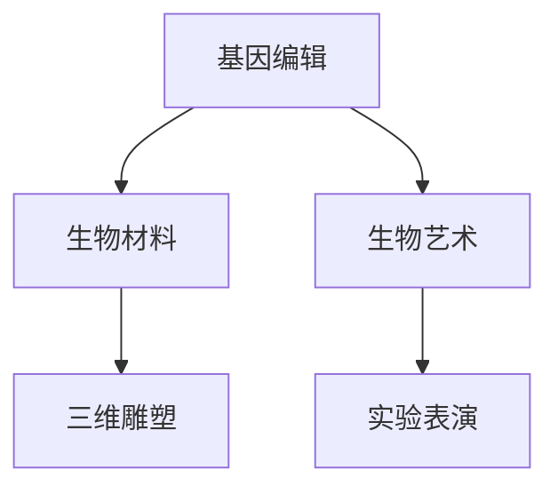
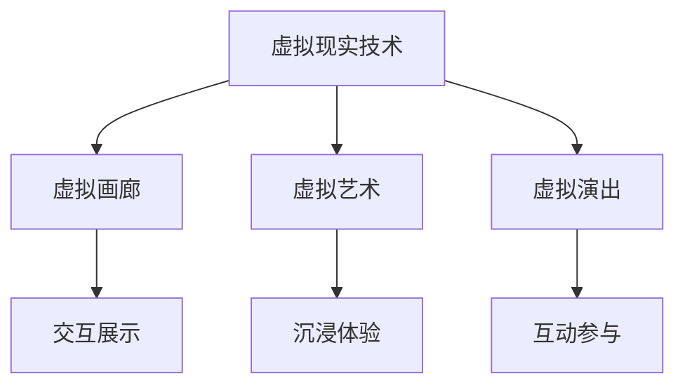

                 

# 后人类艺术节：跨越人类限制的创意盛宴

## 关键词
- 后人类艺术
- 人工智能
- 生物技术
- 虚拟现实
- 跨界融合
- 创意创新

## 摘要
本文探讨了后人类艺术的概念、发展背景及其核心技术，包括人工智能、生物技术和虚拟现实在艺术创作中的运用。通过具体案例分析，展示了后人类艺术如何跨越人类生理和心理限制，创造前所未有的艺术体验。本文旨在为读者提供一个全面了解后人类艺术的视角，启发对未来艺术发展的思考。

## 引言
随着科技的迅猛发展，人类正经历一场前所未有的变革。人工智能、生物技术和虚拟现实等前沿技术的崛起，不仅深刻影响了我们的生活，也重新定义了艺术的边界。后人类艺术，作为这一时代艺术的代表，正以一种全新的形式呈现，挑战着传统艺术的定义和创作方式。

### 后人类艺术的定义与背景
后人类艺术，指的是利用人工智能、生物技术和虚拟现实等先进技术，创造出超越人类生理和心理限制的艺术作品。它不仅包括传统的视觉艺术和表演艺术，还涵盖了音乐、文学、游戏等多种艺术形式。

后人类艺术的发展背景可以追溯到20世纪末。随着计算机技术的进步，人工智能开始在艺术创作中发挥作用。进入21世纪，生物技术和虚拟现实技术的快速发展，进一步推动了后人类艺术的兴起。这些技术不仅为艺术家提供了新的创作工具和表达手段，也改变了观众的观看方式和体验。

### 后人类艺术与传统艺术的区别
与传统艺术相比，后人类艺术具有以下几个显著特点：
1. **技术的深度融合**：后人类艺术不仅仅是传统艺术技术的延伸，更是技术与艺术在深度上的融合。
2. **创新的表达方式**：后人类艺术通过新技术创造出全新的表达方式，使得艺术形式更加丰富多样。
3. **互动性增强**：后人类艺术作品通常具有较强的互动性，观众可以通过参与和互动来体验作品。
4. **多样性和个性化**：后人类艺术可以根据观众的需求和反应实时调整作品，提供个性化体验。

### 后人类艺术的核心概念
后人类艺术的核心概念包括以下几个方面：
1. **人工智能与艺术**：人工智能在艺术创作中的应用，如机器学习和生成对抗网络（GAN）等。
2. **生物技术与艺术**：生物技术在艺术创作中的应用，如基因编辑和生物材料等。
3. **虚拟现实与艺术**：虚拟现实技术在艺术展示和体验中的应用。

### 后人类艺术的未来展望
后人类艺术作为当代艺术的重要趋势，其未来展望如下：
1. **社会影响**：后人类艺术将引发艺术界的变革，推动艺术创作和欣赏方式的革新。
2. **市场前景**：随着技术的普及和人们对新艺术形式的接受度提高，后人类艺术市场有望快速增长。
3. **伦理问题**：后人类艺术的兴起也带来了伦理问题，如人工智能创作作品的版权、生物艺术的伦理界限等，需要社会和法律的规范和引导。

## 后人类艺术的核心技术
后人类艺术的创新离不开三大核心技术的支持：人工智能、生物技术和虚拟现实。以下将分别介绍这些技术在后人类艺术中的应用。

### 人工智能在艺术创作中的应用
人工智能在艺术创作中的应用主要表现在以下几个方面：

1. **图像生成和风格迁移**：利用生成对抗网络（GAN）和卷积神经网络（CNN）等技术，人工智能可以生成具有独特风格的艺术作品。例如，DeepArt.io 和 Artbreeder 等平台利用这些技术提供图像生成和风格迁移服务。

2. **音乐创作**：人工智能可以生成旋律、和声和节奏，甚至创作完整的音乐作品。例如，AIVA（Artificial Intelligence Virtual Artist）和 Jukedeck 等平台利用深度学习和机器学习技术进行音乐创作。

3. **文学创作**：人工智能也可以创作诗歌、小说和剧本。例如，OpenAI 的 GPT-3 模型可以生成高质量的文本，甚至参与文学创作竞赛。

#### 核心算法原理
人工智能在艺术创作中的应用主要依赖于以下核心算法：

- **生成对抗网络（GAN）**：GAN由生成器和判别器两个神经网络组成，通过对抗训练生成逼真的图像。
- **卷积神经网络（CNN）**：CNN是一种深度学习模型，擅长处理图像数据，常用于图像生成和风格迁移。

#### Python源代码示例
以下是一个简单的GAN模型示例，用于图像生成：
```python
import tensorflow as tf
from tensorflow.keras.layers import Conv2D, Flatten, Dense
from tensorflow.keras.models import Model

# 生成器模型
def build_generator():
    model = tf.keras.Sequential([
        Conv2D(128, (3, 3), activation='relu', input_shape=(28, 28, 1)),
        Conv2D(64, (3, 3), activation='relu'),
        Flatten(),
        Dense(784, activation='tanh')
    ])
    return Model(inputs=tf.keras.Input(shape=(100,)), outputs=model(tf.keras.Input(shape=(100,)))

# 判别器模型
def build_discriminator():
    model = tf.keras.Sequential([
        Flatten(),
        Dense(1, activation='sigmoid')
    ])
    return Model(inputs=tf.keras.Input(shape=(28, 28, 1)), outputs=model(tf.keras.Input(shape=(28, 28, 1)))

# GAN模型
def build_gan(generator, discriminator):
    model = tf.keras.Sequential([
        generator,
        discriminator
    ])
    return Model(inputs=generator.input, outputs=discriminator(generator(tf.keras.Input(shape=(100,))))
```

#### 数学模型和公式
GAN模型的训练过程中，涉及以下数学模型和公式：

- **损失函数**：GAN的损失函数包括生成器损失和判别器损失。生成器损失通常采用反熵损失，判别器损失采用二元交叉熵损失。
- **梯度下降**：GAN的训练过程是通过梯度下降算法进行优化的。

$$
L_G = -\log(D(G(z)) \\
L_D = -\log(D(x)) - \log(1 - D(G(z)))
$$

#### 举例说明
以下是一个简单的GAN应用案例，用于生成艺术风格的图像：
```python
import numpy as np
import matplotlib.pyplot as plt

# 生成随机噪声
z = np.random.normal(size=(100, 100))

# 生成图像
images = generator.predict(z)

# 显示生成的图像
plt.figure(figsize=(10, 10))
for i in range(100):
    plt.subplot(10, 10, i + 1)
    plt.imshow(images[i], cmap='gray')
plt.show()
```

### 生物技术在艺术创作中的应用
生物技术在艺术创作中的应用为艺术家提供了前所未有的创作工具和表达手段。以下是一些典型的生物技术应用：

1. **基因编辑**：基因编辑技术如CRISPR-Cas9可以改变生物体的基因序列，创造出独特的生物艺术作品。例如，利用CRISPR技术创作发光植物和动物。

2. **生物材料**：生物材料如蛋白质、DNA和细胞可以用来创作三维雕塑和装置艺术。这些材料具有独特的生物特性和视觉效果。

3. **生物艺术**：生物艺术是一种结合生物学、艺术和哲学的艺术形式。它探讨生命、人类和自然的关系，通常通过实验和现场表演等形式进行展示。

#### 核心概念原理和联系
生物技术在艺术创作中的应用涉及以下核心概念：

- **基因编辑**：通过改变生物体的基因序列，创造出独特的生物特性。
- **生物材料**：利用生物材料创作艺术作品，体现生物特性和美感。
- **生物艺术**：通过生物实验和表演探讨生命和人类的关系。

#### Mermaid流程图
以下是一个简单的Mermaid流程图，展示生物技术在艺术创作中的应用过程：



### 虚拟现实在艺术创作中的应用
虚拟现实（VR）技术为艺术家提供了全新的创作空间和展示方式。以下是一些典型的虚拟现实在艺术创作中的应用：

1. **虚拟画廊和博物馆**：艺术家可以创建虚拟画廊和博物馆，展示三维艺术作品和互动展览。

2. **虚拟现实艺术**：利用VR技术创作沉浸式的艺术体验，观众可以在虚拟空间中自由探索和互动。

3. **虚拟现实演出**：结合VR技术，艺术家可以创作互动式的音乐演出和戏剧表演，观众可以参与到表演中。

#### 核心概念原理和联系
虚拟现实在艺术创作中的应用涉及以下核心概念：

- **虚拟现实技术**：通过计算机生成三维虚拟环境，实现沉浸式体验。
- **互动性**：观众可以在虚拟环境中进行交互，改变作品的呈现方式和体验。
- **沉浸感**：通过视觉、听觉和触觉等多种感官刺激，增强观众的沉浸感。

#### Mermaid流程图
以下是一个简单的Mermaid流程图，展示虚拟现实在艺术创作中的应用过程：



## 后人类艺术的实践与探索
后人类艺术的实践和探索不仅体现在技术层面，还包括具体的艺术项目、展览和跨领域合作。以下是一些典型的后人类艺术实践案例。

### 后人类艺术项目案例
1. **“虚拟博物馆”**：艺术家利用虚拟现实技术创建了一个虚拟博物馆，观众可以通过VR设备进入博物馆，欣赏和互动三维艺术作品。

2. **“基因艺术”**：艺术家通过基因编辑技术创作了发光的植物和动物，展示了生物技术与艺术的结合。

3. **“音乐互动艺术”**：艺术家结合虚拟现实技术和音乐创作，创作了互动式的音乐演出，观众可以通过VR设备参与到表演中。

### 后人类艺术展览与活动
1. **“后人类艺术展”**：全球各地举办了多场后人类艺术展览，展示了人工智能、生物技术和虚拟现实在艺术创作中的成果。

2. **“艺术与科技对话”**：艺术家与科技专家共同举办研讨会，探讨后人类艺术的未来发展趋势和挑战。

3. **“艺术科技共创实验室”**：艺术家和科技企业合作，创建实验室，探索新技术在艺术创作中的应用。

### 后人类艺术的跨领域合作
1. **艺术与科技的融合**：艺术家与科技企业合作，利用人工智能、生物技术和虚拟现实技术创作艺术作品。

2. **艺术与生物技术的合作**：艺术家与生物学家合作，探讨生物技术在艺术创作中的可能性。

3. **艺术与虚拟现实产业的合作**：艺术家与虚拟现实公司合作，开发沉浸式的虚拟现实艺术项目。

## 后人类艺术资源与工具
为了更好地探索后人类艺术，以下是一些建议的资源与工具：

1. **人工智能艺术开发工具**：
   - DeepArt.io
   - Artbreeder
   - GANPaint.io

2. **生物艺术实验工具**：
   - CRISPR-Cas9
   - 生物材料供应商（如Geladen Biotech）

3. **虚拟现实设备**：
   - Oculus Rift
   - HTC Vive
   - Google Cardboard

## 后人类艺术参考书目与文献
为了深入了解后人类艺术，以下是一些建议的参考书目与文献：

1. **《后人类艺术：技术与创意的融合》**
   - 作者：[英国] 安德鲁·库克
   - 简介：本书详细介绍了后人类艺术的定义、发展背景和技术应用。

2. **《虚拟现实艺术：沉浸式体验的探索》**
   - 作者：[美国] 布鲁斯·班恩
   - 简介：本书探讨了虚拟现实技术在艺术创作中的应用，以及沉浸式体验的设计和实现。

3. **《生物艺术：科学与艺术的交汇》**
   - 作者：[美国] 凯瑟琳·弗里曼
   - 简介：本书展示了生物技术在艺术创作中的创新应用，以及生物艺术对社会和伦理的影响。

## 后人类艺术相关网站与社交媒体
为了保持对后人类艺术的关注和了解，以下是一些建议的网站与社交媒体：

1. **后人类艺术网站**：
   - 后人类艺术协会（Humanity+ Art Movement）
   - 艺术与人工智能（Art+AI）

2. **虚拟现实艺术网站**：
   - 虚拟现实艺术（Virtual Reality Art）
   - VR艺术画廊（VR Art Galleries）

3. **社交媒体平台**：
   - Twitter：#PostHumanArt
   - Instagram：@posthumanart
   - Facebook：后人类艺术社区（PostHuman Art Community）

## 结语
后人类艺术作为一种新兴的艺术形式，正以前所未有的方式挑战和拓展艺术的边界。通过人工智能、生物技术和虚拟现实等核心技术的应用，后人类艺术不仅丰富了艺术的表现形式，也为观众带来了全新的艺术体验。未来，随着技术的进一步发展，后人类艺术有望在更多领域展现出其独特的魅力。

## 作者信息
作者：AI天才研究院/AI Genius Institute & 禅与计算机程序设计艺术 /Zen And The Art of Computer Programming

## 注意事项与拓展阅读
在探索后人类艺术的过程中，我们需要关注以下几点：

1. **技术伦理**：随着技术的发展，如何在艺术创作中平衡技术进步与社会伦理的关系是一个重要的议题。
2. **跨学科合作**：后人类艺术的实践需要艺术家、科学家和工程师等多领域的合作，以实现技术创新和艺术突破。
3. **持续学习**：后人类艺术的快速发展要求艺术家和观众不断学习新技术，以跟上时代的步伐。

拓展阅读：
- 《后人类艺术：技术与创意的融合》
- 《虚拟现实艺术：沉浸式体验的探索》
- 《生物艺术：科学与艺术的交汇》

通过以上内容，我们希望读者能够对后人类艺术有一个全面而深入的了解，并激发对这一新兴艺术形式的兴趣和探索精神。在未来的艺术创作中，让我们共同探索后人类艺术的无限可能。

