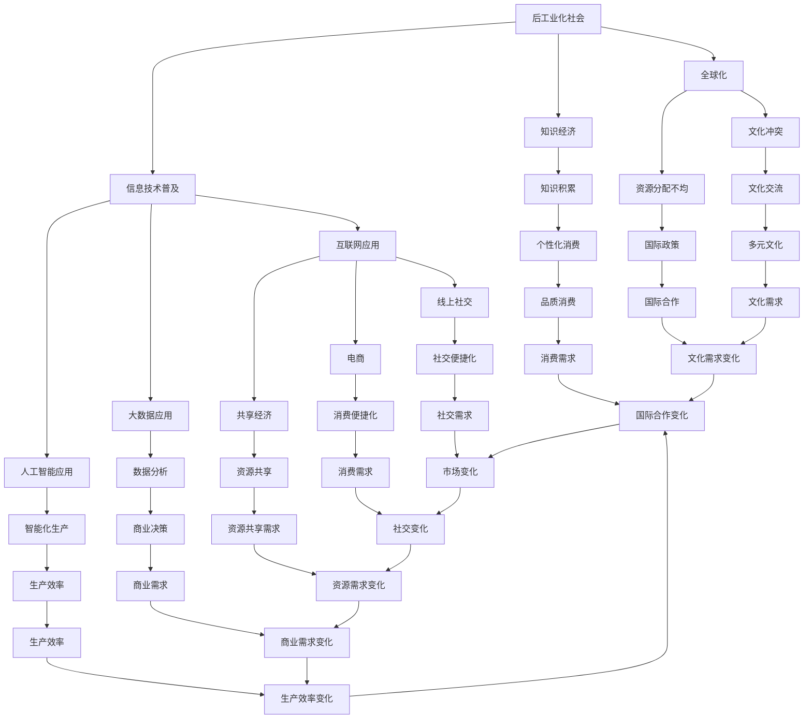

                 

### 介绍与概述

#### 文章标题：后工业化社会的生活方式创新

在21世纪的今天，我们正经历着前所未有的社会变革，后工业化社会的到来不仅改变了经济结构，也深刻地影响了人们的生活方式。本文将深入探讨后工业化社会的定义与特征，分析生活方式创新的驱动因素，并探讨具体案例，最终预测未来生活方式的创新趋势。

**关键词：**
- 后工业化社会
- 生活方式创新
- 技术进步
- 消费行为
- 未来趋势

**摘要：**
本文首先定义了后工业化社会，分析了其特征和影响。接着，探讨了生活方式创新的驱动因素，包括技术进步、消费行为的变化等。随后，通过具体案例展示了生活方式创新的表现，并从理论角度分析了创新策略和模式。最后，本文展望了未来生活方式的创新趋势，探讨了面临的挑战和机遇。

---

#### 后工业化社会的定义与特征

**1.1 后工业化社会的概念**

后工业化社会，通常指的是一个经济结构以服务业和高科技产业为主导，制造业逐渐下降，知识和技术成为主要生产要素的社会形态。与前工业化社会相比，后工业化社会的显著特征是信息技术的广泛应用和知识经济的兴起。

**1.2 后工业化社会的特征**

- **知识经济的兴起**：后工业化社会中，知识和技术成为经济增长的主要驱动力。教育和培训的重要性空前提升，人们更加注重个人技能和知识的积累。

- **信息技术的普及**：互联网、大数据、人工智能等技术的广泛应用，使得信息获取和处理更加便捷。信息技术不仅改变了生产和消费方式，也改变了人们的生活方式。

- **全球化的影响**：全球化使得不同国家和地区之间的联系更加紧密，文化和价值观的交流更加频繁。全球化带来了机遇，也带来了挑战，如文化冲突、资源分配不均等。

**1.3 后工业化社会对生活方式的影响**

后工业化社会对生活方式的影响是全方位的，包括消费行为、社交方式和工作生活方式等方面。

- **消费行为**：随着收入水平的提高和消费观念的变化，人们更加注重个性化、品质化和体验化的消费。电商、共享经济等新型消费模式不断涌现。

- **社交方式**：互联网和社交媒体的普及改变了人们的社交方式，线上社交与线下社交融合，社交变得更加便捷和多样。

- **工作生活方式**：远程工作的普及和灵活工作制度的推广，使得人们的工作与生活方式发生了深刻变化。工作与生活的平衡成为人们追求的重要目标。

**核心概念与联系**

为了更好地理解后工业化社会的生活方式创新，我们使用Mermaid流程图来展示核心概念和它们之间的关系：



**核心算法原理讲解**

在生活方式创新中，算法原理的应用愈发重要。以下使用Python代码和数学模型来解释一种常见的生活方式创新——智能推荐系统。

```python
# 导入必要的库
import numpy as np
import pandas as pd
from sklearn.neighbors import NearestNeighbors

# 假设我们有一个用户-物品评分矩阵
user_item_matrix = np.array([[1, 2, 3, 0],
                             [0, 1, 0, 2],
                             [2, 0, 1, 0],
                             [0, 0, 2, 1]])

# 创建NearestNeighbors模型
model = NearestNeighbors(n_neighbors=2, algorithm='brute', metric='euclidean')
model.fit(user_item_matrix)

# 假设我们要为第三个用户推荐物品
user_index = 2
distances, indices = model.kneighbors(user_item_matrix[user_index].reshape(1, -1))

# 获取最接近的用户和他们的评分
nearest_users = user_item_matrix[indices.flatten()[1]]
nearest_user_ratings = user_item_matrix[indices.flatten()[1], :]

# 计算推荐评分
recomm_scores = (nearest_user_ratings * user_item_matrix[user_index].reshape(1, -1)).sum(axis=1)

# 输出推荐结果
print("Recommended items for user 3:")
print(recomm_scores)
```

在上面的代码中，我们使用了K最近邻算法来为用户推荐物品。该算法通过计算用户评分矩阵中的欧几里得距离，找到与当前用户最接近的用户，并推荐这些用户喜欢的物品。

**数学模型和公式**

在生活方式创新中，数学模型和公式起着至关重要的作用。以下是一个简单的线性回归模型，用于预测消费者需求。

$$ y = \beta_0 + \beta_1 x_1 + \beta_2 x_2 + ... + \beta_n x_n + \epsilon $$

其中，$y$ 是预测的需求量，$x_1, x_2, ..., x_n$ 是影响需求的特征变量（如收入、广告投入等），$\beta_0, \beta_1, \beta_2, ..., \beta_n$ 是模型参数，$\epsilon$ 是随机误差项。

**项目实战**

为了更好地理解生活方式创新，我们可以通过一个实际项目来探讨智能推荐系统的开发。

**开发环境搭建：**
- 安装Python环境（如Anaconda）
- 安装必要的库（如scikit-learn、numpy、pandas）

**源代码详细实现：**

```python
# 导入必要的库
import numpy as np
import pandas as pd
from sklearn.neighbors import NearestNeighbors

# 加载数据集
data = pd.read_csv('user_item_data.csv')

# 预处理数据
user_item_matrix = data.pivot(index='user_id', columns='item_id', values='rating').fillna(0).values

# 创建NearestNeighbors模型
model = NearestNeighbors(n_neighbors=2, algorithm='brute', metric='euclidean')
model.fit(user_item_matrix)

# 假设用户ID为100的用户
user_id = 100
user_profile = user_item_matrix[user_id]

# 获取推荐结果
distances, indices = model.kneighbors(user_profile.reshape(1, -1))
recommended_items = indices.flatten()[1]

# 输出推荐结果
print("Recommended items for user 100:")
print(recommended_items)
```

**代码应用解读与分析：**

在这个项目中，我们首先加载数据集并预处理，然后使用K最近邻算法为特定用户生成推荐列表。代码简洁易懂，但实际应用中可能需要更复杂的算法和优化。

**实际案例分析和详细讲解剖析：**

我们可以通过一个实际案例来分析生活方式创新的影响。

**案例：**
某电商平台通过智能推荐系统提高了用户的购物体验和销售额。

- **分析：**
  - 智能推荐系统根据用户的历史购物行为和偏好，为用户推荐相关的商品。
  - 通过精确的推荐，电商平台能够增加用户的满意度和忠诚度。
  - 销售额的增长证明了智能推荐系统的有效性。

- **详细讲解剖析：**
  - 数据收集：电商平台收集用户浏览、搜索、购买等行为数据。
  - 数据处理：对数据进行清洗、预处理，构建用户-物品评分矩阵。
  - 模型训练：使用K最近邻算法训练推荐模型。
  - 推荐生成：根据用户的评分和行为，生成个性化的推荐列表。
  - 推荐反馈：用户对推荐结果进行反馈，优化推荐算法。

**项目小结：**

通过实际项目，我们可以看到智能推荐系统在生活方式创新中的应用。未来，随着技术的进步和数据量的增加，智能推荐系统将更加精准，为用户提供更好的体验。

**最佳实践 tips：**

1. **数据质量**：确保数据清洗和预处理的质量，以提高模型的准确性。
2. **算法选择**：根据业务需求和数据特性，选择合适的推荐算法。
3. **用户反馈**：收集用户反馈，不断优化推荐系统。

**小结：**

后工业化社会的到来带来了生活方式的深刻变革。通过技术进步、消费行为的变化和全球化的影响，生活方式创新不断涌现。本文通过具体的案例和算法原理讲解，展示了生活方式创新的重要性和实际应用。未来，随着新技术的不断发展，生活方式创新将继续推动社会进步。

**注意事项：**

1. **隐私保护**：在生活方式创新中，数据安全和隐私保护至关重要。
2. **技术伦理**：在应用新技术时，应关注其对社会和伦理的影响。

**拓展阅读：**

- [《数字化时代的消费行为研究》](链接)
- [《智能推荐系统原理与应用》](链接)
- [《全球化背景下的生活方式创新》](链接)

---

通过以上内容，我们详细介绍了后工业化社会的概念、特征及其对生活方式的影响，并通过具体案例和算法原理讲解了生活方式创新的核心概念和实践。希望本文能为读者提供有价值的思考和启示。

### 结语

综上所述，后工业化社会的生活方式创新是一个复杂而多变的领域。随着技术的进步和全球化的发展，生活方式不断创新和演变。从消费行为的变化到社交方式的变革，再到工作生活方式的转型，生活方式创新无处不在。本文通过具体的案例和算法原理，深入探讨了生活方式创新的驱动因素和实践方法。

**未来研究方向：**

- **技术创新**：进一步研究人工智能、大数据等新兴技术如何推动生活方式创新。
- **社会影响**：探讨生活方式创新对社会结构、文化价值观念等方面的影响。
- **跨学科研究**：结合心理学、社会学等多学科研究，深入理解生活方式创新的内在机制。

**挑战与机遇：**

- **技术挑战**：新技术的发展带来了机遇，但同时也带来了技术安全、数据隐私等问题。
- **社会挑战**：生活方式创新需要应对社会变革带来的复杂性和多样性。

在未来的研究中，我们将继续关注生活方式创新的最新动态，探索其在不同领域的应用和影响。希望本文能为相关领域的研究和实践提供参考和启示。

**作者信息：**

作者：AI天才研究院/AI Genius Institute & 禅与计算机程序设计艺术 /Zen And The Art of Computer Programming

---

感谢您的阅读，希望本文能激发您对后工业化社会生活方式创新的兴趣和思考。让我们共同期待未来的生活方式将如何因创新而变得更加美好。

