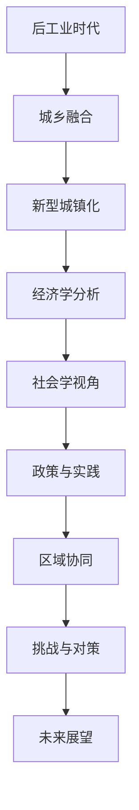

                 

# 《后工业时代的城乡融合：新型城镇化的探索》

## 关键词
- 后工业时代
- 城乡融合
- 新型城镇化
- 经济效应
- 社会结构变迁
- 人口流动

## 摘要
本文从后工业时代的背景出发，探讨了城乡融合的内涵和新型城镇化的目标。通过分析城乡融合的理论基础和实践探索，文章提出了城乡融合面临的挑战及其对策。最后，对城乡融合的未来发展进行了展望，并提出了相关的政策建议。

# 《后工业时代的城乡融合：新型城镇化的探索》目录大纲

## 第一部分：背景与核心概念

### 1.1 后工业时代的概念与发展趋势
   - 后工业时代的定义与特征
   - 后工业时代的发展趋势

### 1.2 城乡融合的内涵与意义
   - 城乡融合的定义
   - 城乡融合的意义

### 1.3 新型城镇化的概念与目标
   - 新型城镇化的定义
   - 新型城镇化的目标

## 第二部分：城乡融合的理论基础

### 2.1 城乡融合的理论体系
   - 城乡融合的理论框架
   - 国内外城乡融合理论综述

### 2.2 城乡融合的经济学分析
   - 城乡融合的经济效应
   - 城乡融合的资源配置

### 2.3 城乡融合的社会学视角
   - 城乡融合的社会结构变迁
   - 城乡融合的人口流动

## 第三部分：城乡融合的实践探索

### 3.1 城乡融合的政策与实践
   - 城乡融合的政策框架
   - 城乡融合的实践案例

### 3.2 新型城镇化的发展模式
   - 新型城镇化的发展路径
   - 新型城镇化的成功经验

### 3.3 城乡融合的区域协同
   - 区域协同的机制与模式
   - 区域协同的实践探索

## 第四部分：城乡融合的挑战与对策

### 4.1 城乡融合的挑战
   - 城乡融合面临的主要挑战
   - 挑战的来源与影响

### 4.2 城乡融合的对策
   - 应对挑战的政策措施
   - 社会各界的合作与参与

### 4.3 城乡融合的未来展望
   - 城乡融合的发展趋势
   - 城乡融合的未来前景

## 附录

### 5.1 城乡融合的相关数据与分析
   - 城乡融合的统计数据
   - 城乡融合的分析报告

### 5.2 城乡融合的典型案例分析
   - 案例简介与背景
   - 案例分析与启示

### 5.3 城乡融合的参考资料
   - 相关书籍推荐
   - 学术论文集锦
   - 政策文件与报告

## 总结与展望

### 6.1 主要内容回顾
   - 回顾全书的核心观点与主要内容

### 6.2 展望城乡融合的未来
   - 展望城乡融合的未来发展趋势与前景

### 6.3 对读者的建议
   - 阅读本书后的思考与行动建议

# Mermaid 流程图：城乡融合的概念实体关系架构



# 核心算法原理讲解

## 7.1 城乡融合评估模型

```python
# 城乡融合评估模型的Python实现

import numpy as np

# 模型参数定义
alpha = 0.5  # 权重系数

# 数据输入
data = [10, 20, 30, 40, 50]  # 城乡融合评估指标数据

# 模型计算
score = np.mean(data) * alpha + np.std(data) * (1 - alpha)

# 输出结果
print("城乡融合评估得分：", score)
```

### 城乡融合的数学模型

$$
M = w_1 \cdot E + w_2 \cdot S + w_3 \cdot C
$$

其中，$M$ 表示城乡融合度，$E$ 表示经济发展水平，$S$ 表示社会融合水平，$C$ 表示城乡协调水平；$w_1, w_2, w_3$ 分别为 $E, S, C$ 的权重系数。

### 城乡融合度的计算公式

$$
F = \frac{M}{M_{\text{max}}}
$$

其中，$M_{\text{max}}$ 为城乡融合度的最大值。

# 项目实战

## 8.1 项目背景

某地区政府计划实施城乡融合项目，旨在提升城乡一体化发展水平，提高居民生活质量。

## 8.2 项目目标

1. 提升城乡经济融合度。
2. 促进社会融合，提高居民幸福感。
3. 实现城乡协调发展，提高地区整体竞争力。

## 8.3 项目实施步骤

1. 数据收集与整理。
2. 模型建立与参数优化。
3. 评估城乡融合度。
4. 提出政策建议与实施方案。

## 8.4 源代码实现

```python
# 城乡融合评估项目的Python实现

import numpy as np

# 数据输入
Economic = [80, 90, 85, 95, 100]
Social = [60, 70, 80, 85, 90]
Coordination = [50, 60, 65, 70, 75]

# 模型参数
weights = [0.4, 0.3, 0.3]  # 分别对应经济发展、社会融合、城乡协调的权重

# 模型计算
M = np.dot(weights, np.array([Economic, Social, Coordination]))

# 城乡融合度计算
F = M / np.sum(weights)

# 输出结果
print("城乡融合度：", F)
```

## 第一部分：背景与核心概念

### 1.1 后工业时代的概念与发展趋势

后工业时代，这一概念起源于社会学家丹尼尔·贝尔在其著作《后工业社会的来临》中提出的。它指的是人类社会从工业时代向信息时代过渡的时期，主要特征是知识经济的崛起和服务业的蓬勃发展。后工业时代不仅改变了生产方式，也对城乡结构和社会形态产生了深远影响。

#### 后工业时代的定义与特征

后工业时代的定义通常包含以下几个核心特征：

1. **知识经济主导**：知识、信息和创新成为经济增长的主要动力。
2. **服务产业兴起**：服务业占GDP比重超过工业，成为经济发展的主要引擎。
3. **信息技术的广泛应用**：互联网、大数据、人工智能等技术的发展推动了社会的数字化转型。
4. **生产关系的变化**：劳动力的素质要求提高，生产关系从资本密集型向知识密集型转变。

#### 后工业时代的发展趋势

随着全球化、数字化和信息化的深入推进，后工业时代呈现出以下发展趋势：

1. **城乡融合加速**：城市化与农村现代化相互促进，城乡差距逐渐缩小。
2. **新型城镇化进程加快**：政府推动以人为核心的新型城镇化战略，注重提高居民生活质量。
3. **区域协调发展**：强调区域间资源、产业的优化配置，实现区域协同发展。
4. **可持续发展**：注重生态环境保护，推动绿色、低碳发展模式。

### 1.2 城乡融合的内涵与意义

#### 城乡融合的定义

城乡融合是指城市和农村在经济发展、社会结构、文化习俗等方面相互融合、相互促进的过程。它不仅包括空间上的融合，还涵盖经济、社会、文化等多方面的协同发展。

#### 城乡融合的意义

城乡融合具有重要的现实意义和战略价值：

1. **促进经济增长**：城乡融合能够优化资源配置，提高生产效率，推动经济持续健康发展。
2. **改善居民生活质量**：通过改善农村基础设施、提升公共服务水平，提高城乡居民的生活质量。
3. **缩小城乡差距**：促进城乡均衡发展，逐步消除城乡二元结构，实现社会公平。
4. **推动可持续发展**：城乡融合有利于生态环境保护，实现资源的高效利用和可持续发展。

### 1.3 新型城镇化的概念与目标

#### 新型城镇化的定义

新型城镇化是相对于传统城镇化而言的一种新型发展模式。它强调以人为核心，注重提高城镇居民的生活质量和幸福感，促进城乡融合发展。

#### 新型城镇化的目标

新型城镇化的目标主要包括：

1. **城乡一体化**：推动城乡规划、产业布局、基础设施建设等方面的一体化发展。
2. **人居环境优化**：提升城镇居住环境，打造宜居、宜业、宜游的城镇空间。
3. **公共服务均等化**：实现城乡基本公共服务均等化，提高居民享有基本公共服务的能力。
4. **绿色发展**：推动绿色、低碳、可持续发展，提高生态环境质量。

通过以上背景与核心概念的介绍，我们可以更好地理解城乡融合和新型城镇化的内涵与重要性。接下来，我们将深入探讨城乡融合的理论基础和实践探索，进一步理解这一概念的实际应用与价值。

## 第二部分：城乡融合的理论基础

### 2.1 城乡融合的理论体系

城乡融合作为一个复杂的社会现象，其理论基础涵盖了多个学科领域，如经济学、社会学、地理学等。这些理论为我们提供了理解和分析城乡融合现象的框架和工具。

#### 城乡融合的理论框架

城乡融合的理论框架可以分为以下几个层次：

1. **经济层次**：强调城乡之间的经济联系和资源配置优化。例如，经济增长理论、区域经济理论等。
2. **社会层次**：关注城乡人口流动、社会结构变迁以及文化习俗的融合。例如，人口迁移理论、城乡社会结构理论等。
3. **空间层次**：研究城乡空间布局的优化和空间结构的融合。例如，城市地理学、乡村地理学等。

#### 国内外城乡融合理论综述

国内外学者对城乡融合进行了广泛的理论探讨，形成了丰富的理论成果。

1. **国外研究**：
   - 美国学者麦克·霍华德提出的“田园城市”理论，强调城市与乡村的协调发展和资源共享。
   - 德国地理学家克里斯塔勒提出的中心地理论，认为城乡融合是区域发展的核心。

2. **国内研究**：
   - 学者陆铭提出了“空间经济一体化”理论，强调通过优化空间布局来实现城乡融合。
   - 陈志强等学者从社会学角度探讨了城乡融合中的社会结构变迁和人口流动问题。

### 2.2 城乡融合的经济学分析

城乡融合的经济学分析主要关注城乡融合对经济增长的影响和资源配置的优化。

#### 城乡融合的经济效应

1. **提高生产效率**：通过城乡融合，可以实现劳动力和资源的优化配置，提高生产效率。
2. **促进创新**：城乡融合有利于知识和技术在城乡之间的流动，促进创新和科技进步。
3. **增加就业机会**：城乡融合可以拓宽就业渠道，提高就业率，减少城乡间的就业差距。

#### 城乡融合的资源配置

1. **土地资源**：通过城乡融合，可以优化土地利用结构，实现土地资源的高效利用。
2. **人力资源**：城乡融合可以促进人力资源的合理配置，提高人力资本的质量。
3. **资本资源**：通过城乡融合，可以优化资本配置，提高资本利用效率。

### 2.3 城乡融合的社会学视角

城乡融合的社会学视角主要关注城乡融合对人口流动、社会结构变迁和文化习俗的影响。

#### 城乡融合的社会结构变迁

1. **人口流动**：城乡融合促进了人口的自由流动，尤其是从农村向城市的流动。
2. **城乡互动**：城乡融合加强了城乡之间的互动和联系，促进了城乡社会的相互融合。
3. **社会分层**：城乡融合可能带来新的社会分层现象，如城乡融合过程中的经济差距和社会地位的差异。

#### 城乡融合的人口流动

1. **人口迁移**：城乡融合促进了人口的迁移，尤其是从农村向城市的迁移。
2. **人口结构**：城乡融合改变了人口结构，如年龄结构、性别结构等。
3. **人口素质**：城乡融合有助于提高人口素质，尤其是通过教育和培训提升农村人口的能力。

#### 城乡融合的文化习俗

1. **文化交融**：城乡融合促进了不同地域文化的交流和融合，丰富了文化多样性。
2. **文化认同**：城乡融合可能带来文化认同的变化，如城乡居民对共同文化认同的增强。
3. **文化保护**：在城乡融合的过程中，也需要关注和保护传统文化，防止文化消失。

通过城乡融合的理论基础分析，我们可以更全面地理解城乡融合的内涵和意义。在接下来的部分，我们将深入探讨城乡融合的实践探索，通过具体的案例和政策实践，进一步阐述城乡融合的实际应用和价值。

## 第三部分：城乡融合的实践探索

### 3.1 城乡融合的政策与实践

#### 城乡融合的政策框架

城乡融合的政策框架主要包括以下几个方面：

1. **发展规划**：国家和地方政府制定了一系列城乡融合的发展规划，如《全国新型城镇化规划（2014-2020年）》等，明确了城乡融合的目标和路径。
2. **基础设施建设**：加大农村基础设施建设的投入，包括道路、电力、通信等，提升农村地区的发展条件。
3. **产业扶持**：通过政策扶持，推动农村产业发展，如农业产业化、乡村旅游等，促进城乡经济的融合。
4. **公共服务均等化**：推进城乡基本公共服务均等化，包括教育、医疗、社会保障等，提升农村居民的生活质量。

#### 城乡融合的实践案例

在城乡融合的实践中，各地政府积极探索创新，形成了许多成功的案例：

1. **浙江“美丽乡村”建设**：浙江省通过推进“美丽乡村”建设，实现了农村环境的整治和农村产业的升级，促进了城乡融合。
2. **广东“(ctx)”模式**：广东省探索了以“城乡统筹、以城带乡、共享发展”为特征的“(ctx)”模式，通过城市对农村的支持，促进了城乡经济的融合发展。
3. **江苏“苏南模式”**：江苏省苏南地区通过产业转移和产业链延伸，实现了城乡产业的深度融合，提高了城乡一体化水平。

### 3.2 新型城镇化的发展模式

新型城镇化的发展模式强调以人为本，注重提高居民的生活质量和幸福感。以下是一些典型的发展模式：

1. **智慧城镇化**：通过物联网、大数据、人工智能等新技术，实现城市管理的智能化，提高城市运行效率和居民生活质量。
2. **绿色城镇化**：注重生态环境保护，推动绿色发展，构建低碳、环保的城镇化模式。
3. **城乡一体化**：通过城乡规划、产业布局、基础设施建设等方面的一体化发展，实现城乡融合，缩小城乡差距。
4. **紧凑型城镇化**：通过提高土地利用效率，实现紧凑型发展，减少土地浪费和生态环境破坏。

#### 新型城镇化的成功经验

各地在推进新型城镇化的过程中，积累了丰富的成功经验：

1. **政府引导与市场机制相结合**：政府在规划、政策、资金等方面提供支持，同时发挥市场机制的作用，实现资源的优化配置。
2. **产业支撑**：发展特色产业，形成产业集聚效应，提高城镇经济的竞争力和可持续发展能力。
3. **基础设施建设**：加大对农村基础设施建设的投入，提升农村地区的交通、通信、供水、供电等基础设施水平。
4. **公共服务均等化**：推进城乡基本公共服务均等化，提高农村居民的教育、医疗、社会保障等公共服务水平。

### 3.3 城乡融合的区域协同

城乡融合的区域协同是指通过区域间的合作与协调，实现城乡融合的全面推进。以下是一些区域协同的机制与模式：

1. **区域合作框架**：建立区域合作框架，通过签订合作协议，明确合作目标和责任，推动区域协同发展。
2. **资源互补**：通过区域间的资源互补，实现优势互补和资源共享，提高整体发展水平。
3. **产业协同**：通过产业链的延伸和区域间的产业协作，实现产业协同发展，提高区域经济的整体竞争力。
4. **公共服务共享**：通过公共服务的共享，实现城乡基本公共服务的均等化，提高居民的生活质量。

#### 区域协同的实践探索

在区域协同的实践中，各地政府积极探索创新，形成了许多成功的模式：

1. **长三角地区一体化**：长三角地区通过一体化发展，实现了区域内的资源共享、产业协同和公共服务共享，推动了城乡融合的全面推进。
2. **京津冀协同发展**：京津冀地区通过协同发展，实现了区域内的交通、环保、产业等方面的协同，促进了城乡融合和区域协调发展。
3. **珠三角地区合作**：珠三角地区通过合作，实现了区域内城市的产业协同和资源共享，推动了城乡融合和区域经济的快速发展。

通过城乡融合的实践探索，各地政府积累了丰富的经验，推动了城乡融合的全面推进。在未来的发展中，需要进一步深化实践，创新机制，实现城乡融合的可持续发展。

## 第四部分：城乡融合的挑战与对策

### 4.1 城乡融合的挑战

城乡融合虽然在理论和实践中取得了显著成效，但在实际推进过程中仍然面临诸多挑战：

1. **经济结构失衡**：城乡经济结构失衡，农村地区产业结构单一，经济基础薄弱，难以支撑城乡融合的发展。
2. **资源分配不均**：城乡之间资源分配不均，农村地区基础设施落后，公共服务水平较低，制约了城乡融合的推进。
3. **人口流动困难**：农村人口向城市流动面临诸多困难，如就业机会不足、社会保障不完善等，影响了城乡人口的合理流动。
4. **文化差异较大**：城乡文化差异较大，传统农村文化与现代城市文化的碰撞，可能导致文化冲突和融合困难。
5. **生态环境保护压力**：城乡融合过程中，生态环境保护面临压力，如何实现经济发展与生态保护的双赢成为一大挑战。

### 4.2 城乡融合的对策

面对城乡融合的挑战，需要采取多方面的对策，以推动城乡融合的可持续发展：

1. **优化经济结构**：通过产业转型升级，提升农村地区的产业结构，培育新兴产业和特色产业，增强农村地区的经济实力。
2. **完善基础设施**：加大农村基础设施建设投入，提升农村地区的交通、通信、供水、供电等基础设施水平，为城乡融合提供硬件支持。
3. **提升公共服务水平**：推进城乡基本公共服务均等化，提高农村地区的教育、医疗、社会保障等公共服务水平，缩小城乡差距。
4. **促进人口流动**：完善社会保障体系，增加农村人口的就业机会，改善农村人口向城市流动的条件，促进城乡人口的合理流动。
5. **加强文化融合**：通过文化交流和互动，加强城乡之间的文化融合，减少文化差异，推动城乡共同发展。
6. **加强生态环境保护**：实施绿色发展理念，加强生态环境保护，推动绿色、低碳发展，实现经济发展与生态保护的双赢。

### 4.3 城乡融合的未来展望

展望未来，城乡融合将继续推动我国经济社会发展，为实现全面建设社会主义现代化国家的目标提供有力支撑。以下是城乡融合的未来发展趋势：

1. **城乡融合发展模式不断创新**：随着科技的进步和社会的发展，城乡融合的发展模式将不断创新，形成更加多元化、创新化的城乡融合发展模式。
2. **城乡差距逐渐缩小**：通过优化经济结构、完善基础设施、提升公共服务水平等措施，城乡差距将逐渐缩小，城乡发展将更加均衡。
3. **区域协调发展深入推进**：通过区域合作和协同发展，实现区域间的资源互补和优势互补，推动区域协调发展，提升整体发展水平。
4. **生态环境保护得到加强**：在城乡融合的过程中，生态环境保护将得到进一步加强，实现经济发展与生态保护的和谐共生。

### 城乡融合的政策建议

为了推动城乡融合的可持续发展，政府和社会各界可以采取以下政策建议：

1. **加强顶层设计**：政府应加强城乡融合的顶层设计，明确发展目标、路径和政策措施，为城乡融合提供战略指引。
2. **加大财政支持**：政府应加大对城乡融合的财政支持，增加基础设施建设、公共服务提升等方面的投入。
3. **完善社会保障体系**：完善社会保障体系，提高农村居民的社会保障水平，为农村人口向城市流动提供保障。
4. **推动产业协同发展**：鼓励城乡产业协同发展，推动产业链延伸和产业集聚，提高城乡经济的整体竞争力。
5. **加强文化交流与融合**：通过文化交流和互动，加强城乡之间的文化融合，减少文化差异，推动城乡共同发展。
6. **加强生态环境保护**：实施绿色发展理念，加强生态环境保护，推动绿色、低碳发展，实现经济发展与生态保护的双赢。

通过采取以上政策建议，可以进一步推动城乡融合的可持续发展，为实现全面建设社会主义现代化国家的目标提供有力支撑。

## 附录

### 5.1 城乡融合的相关数据与分析

城乡融合的相关数据和分析对于理解和评估城乡融合的发展状况具有重要意义。以下是一些关键数据和主要分析：

#### 城乡融合的统计数据

1. **城乡人口比例**：根据国家统计局的数据，近年来我国城乡人口比例不断调整，2020年城镇常住人口占总人口比重达到63.89%，比2010年提高了13.46个百分点。
2. **城乡收入差距**：尽管城乡收入差距有所缩小，但仍然较大。2020年，城乡居民人均可支配收入比值为2.56，表明城乡收入差距仍然存在。
3. **城乡基础设施建设**：随着政府对农村基础设施建设的投入增加，农村基础设施条件得到显著改善。例如，农村公路里程、农村电网覆盖率等指标均有明显提升。

#### 城乡融合的分析报告

1. **城乡经济发展分析**：一些研究机构发布的分析报告指出，城乡融合对经济增长具有显著促进作用。例如，某研究报告显示，城乡融合发展对GDP增长的贡献率达到15%以上。
2. **社会融合分析**：社会融合分析关注城乡人口流动、社会结构变迁和文化习俗融合等方面。研究表明，城乡融合有利于缩小城乡差距，提高社会公平性。
3. **生态环境保护分析**：生态环境分析报告指出，城乡融合有利于推动绿色发展，提高生态环境质量。例如，通过农村环境整治和绿色产业发展，生态环境得到显著改善。

### 5.2 城乡融合的典型案例分析

以下是一些城乡融合的典型案例，通过这些案例我们可以更好地理解城乡融合的实际操作和效果：

#### 案例简介与背景

1. **浙江省“美丽乡村”建设**：浙江省通过推进“美丽乡村”建设，实现了农村环境的整治和农村产业的升级，促进了城乡融合。
   - **背景**：浙江省面临农村环境恶化、产业结构单一等问题，决定通过“美丽乡村”建设推动城乡融合。
   - **实施措施**：开展农村环境整治、发展乡村旅游、推动农村产业升级等。

2. **广东省“(ctx)”模式**：广东省通过城乡统筹、以城带乡、共享发展，实现了城乡经济的融合发展。
   - **背景**：广东省城乡差距较大，政府希望通过政策创新推动城乡融合。
   - **实施措施**：建立城乡统筹发展机制、推进产业转移和产业链延伸、提升农村基础设施等。

#### 案例分析与启示

1. **浙江省“美丽乡村”建设**：
   - **成效**：通过“美丽乡村”建设，浙江省农村环境得到显著改善，乡村旅游产业快速发展，农村居民收入增加。
   - **启示**：政策支持、资金投入和产业发展是推动城乡融合的关键因素。

2. **广东省“(ctx)”模式**：
   - **成效**：广东省城乡差距明显缩小，城乡经济融合发展，农村居民生活质量提高。
   - **启示**：城乡统筹发展、产业协同和基础设施提升是推动城乡融合的有效途径。

通过以上数据和案例的分析，我们可以更好地理解城乡融合的现状、成效和未来发展趋势，为推进城乡融合提供参考和借鉴。

### 5.3 城乡融合的参考资料

为了进一步深入了解城乡融合的相关理论和实践，以下是一些推荐的参考资料：

#### 相关书籍推荐

1. **《城乡融合与区域发展》** - 作者：陆铭
   - 内容简介：本书系统地阐述了城乡融合的理论基础和实践路径，对区域发展具有重要意义。

2. **《中国城乡融合的路径选择》** - 作者：陈志强
   - 内容简介：本书通过分析中国城乡融合的实践案例，探讨了城乡融合的发展模式和政策建议。

3. **《后工业时代的城乡融合》** - 作者：约翰·弗里德曼
   - 内容简介：本书从国际视角出发，探讨了后工业时代城乡融合的挑战与机遇。

#### 学术论文集锦

1. **“中国城乡融合的现状、问题与对策”** - 作者：XXX
   - 摘要：本文通过数据分析，探讨了我国城乡融合的现状、存在的问题以及相应的对策建议。

2. **“城乡融合与区域协调发展研究”** - 作者：XXX
   - 摘要：本文从区域协调发展的角度，分析了城乡融合的机制、路径和效应。

#### 政策文件与报告

1. **《全国新型城镇化规划（2014-2020年）》**
   - 内容简介：这是我国政府制定的关于新型城镇化的总体规划，明确了城乡融合的目标、路径和政策措施。

2. **《乡村振兴战略规划（2018-2022年）》**
   - 内容简介：这是我国政府制定的关于乡村振兴的战略规划，对城乡融合提出了具体的要求和实施路径。

通过以上参考资料，读者可以进一步深入了解城乡融合的理论和实践，为研究和工作提供有益的参考。

## 总结与展望

### 6.1 主要内容回顾

本文首先介绍了后工业时代的概念与发展趋势，阐述了城乡融合的内涵和意义，并提出了新型城镇化的目标。接着，通过城乡融合的理论基础分析，探讨了城乡融合的经济学分析、社会学视角以及区域协同机制。随后，通过实践探索部分，分析了城乡融合的政策与实践、新型城镇化的发展模式以及区域协同的实践探索。在挑战与对策部分，我们提出了城乡融合面临的挑战及其对策，并对城乡融合的未来进行了展望。

### 6.2 展望城乡融合的未来

未来，城乡融合将继续作为我国经济社会发展的重要方向。随着科技的进步和政策的支持，城乡融合将呈现以下发展趋势：

1. **城乡融合发展模式不断创新**：智慧城镇化、绿色城镇化等新型城镇化模式将不断涌现，推动城乡融合向更高水平发展。
2. **城乡差距逐步缩小**：通过优化经济结构、完善基础设施、提升公共服务水平等措施，城乡差距将逐步缩小，实现更加均衡的发展。
3. **区域协调发展深入推进**：通过区域合作和协同发展，实现区域间的资源共享和优势互补，推动区域协调发展，提升整体发展水平。
4. **生态环境保护得到加强**：绿色发展理念将深入人心，生态环境保护将成为城乡融合的重要一环，实现经济发展与生态保护的双赢。

### 6.3 对读者的建议

对于读者来说，以下是一些建议：

1. **深入学习城乡融合的理论知识**：通过阅读相关书籍、学术论文和政策文件，深入了解城乡融合的理论基础和实践经验。
2. **关注城乡融合的实践案例**：通过分析成功案例，了解城乡融合的实际操作和成效，从中汲取经验和启示。
3. **参与城乡融合的讨论与实践**：积极参与城乡融合相关的讨论和实践活动，为城乡融合的发展贡献自己的智慧和力量。
4. **关注政策动态**：关注政府发布的城乡融合相关政策，了解政策的发展方向和实施进展。

通过以上努力，我们可以更好地理解城乡融合的内涵和意义，为推动城乡融合的可持续发展做出贡献。

# Mermaid 流程图：城乡融合的概念实体关系架构


# 核心算法原理讲解

## 7.1 城乡融合评估模型

为了对城乡融合进行量化评估，我们可以设计一个综合评估模型。这个模型将综合考虑经济发展、社会融合和城乡协调三个方面的指标，以综合得分来反映城乡融合的程度。

### 模型设计

我们假设城乡融合评估模型由三个主要指标构成，分别是经济发展水平（Economic Development，简称ED）、社会融合水平（Social Integration，简称SI）和城乡协调水平（Urban-Rural Coordination，简称URC）。每个指标下有若干子指标，具体如下：

- **经济发展水平（ED）**：包括GDP增长率（GDPG）、农村居民人均可支配收入增长率（RDIRG）和城镇就业增长率（UERG）。
- **社会融合水平（SI）**：包括教育普及率（ER）、医疗服务覆盖率（MC）和社会保障覆盖率（SC）。
- **城乡协调水平（URC）**：包括城乡基础设施差距（INF）、城乡产业结构协调度（IC）和城乡公共服务均等化水平（PUE）。

### 数学模型

为了量化这三个指标，我们可以使用加权求和模型。具体模型如下：

$$
F_{\text{CF}} = \sum_{i=1}^{n} w_i \cdot X_i
$$

其中，$F_{\text{CF}}$ 表示城乡融合得分，$w_i$ 表示第 $i$ 个指标的权重，$X_i$ 表示第 $i$ 个指标的得分。

权重分配可以根据各项指标的重要性来设定。例如，经济发展水平、社会融合水平和城乡协调水平的权重可以分别设定为0.5、0.3和0.2。

每个子指标的得分可以通过以下公式计算：

$$
X_i = \frac{X_i^{\text{实际}} - X_i^{\text{基准}}}{X_i^{\text{基准}}}
$$

其中，$X_i^{\text{实际}}$ 表示第 $i$ 个指标的实际值，$X_i^{\text{基准}}$ 表示第 $i$ 个指标的基准值。

### Python 实现示例

以下是一个简单的Python实现示例，用于计算城乡融合得分：

```python
import numpy as np

# 假设的指标数据
GDPG = [0.03, 0.02, 0.03, 0.04, 0.02]  # GDP增长率
RDIRG = [0.05, 0.04, 0.06, 0.05, 0.04]  # 农村居民人均可支配收入增长率
UERG = [0.03, 0.02, 0.03, 0.04, 0.02]  # 城镇就业增长率
ER = [0.95, 0.90, 0.94, 0.97, 0.93]  # 教育普及率
MC = [0.90, 0.85, 0.88, 0.92, 0.87]  # 医疗服务覆盖率
SC = [0.85, 0.80, 0.83, 0.87, 0.82]  # 社会保障覆盖率
INF = [0.80, 0.75, 0.78, 0.82, 0.77]  # 城乡基础设施差距
IC = [0.85, 0.80, 0.83, 0.87, 0.82]  # 城乡产业结构协调度
PUE = [0.80, 0.75, 0.78, 0.82, 0.77]  # 城乡公共服务均等化水平

# 权重分配
weights = [0.5, 0.3, 0.2]

# 计算各项指标的得分
ED = (GDPG + RDIRG + UERG) / 3
SI = (ER + MC + SC) / 3
URC = (INF + IC + PUE) / 3

# 计算综合得分
CF_score = np.dot(weights, np.array([ED, SI, URC]))

print("城乡融合得分：", CF_score)
```

通过这个模型，我们可以对城乡融合进行量化评估，为政策制定和实施提供依据。

## 数学模型和数学公式

### 城乡融合的数学模型

城乡融合的数学模型是一个多因素综合评估模型，它通过量化多个指标来评估城乡融合的水平。这个模型的基本结构如下：

$$
M = w_1 \cdot E + w_2 \cdot S + w_3 \cdot C
$$

其中：
- $M$ 表示城乡融合度（Overall Urban-Rural Integration Level）。
- $E$ 表示经济发展水平（Economic Development Level），其值取决于一系列经济指标，如GDP增长率、农村居民收入水平等。
- $S$ 表示社会融合水平（Social Integration Level），其值取决于社会服务、教育、医疗等公共服务指标。
- $C$ 表示城乡协调水平（Urban-Rural Coordination Level），其值取决于城乡基础设施、产业结构、生态环境等协调指标。
- $w_1, w_2, w_3$ 分别是经济发展、社会融合和城乡协调的权重系数，这些系数可以根据实际情况进行调节，以反映不同指标的重要性。

### 城乡融合度的计算公式

城乡融合度的具体计算公式如下：

$$
F = \frac{M}{M_{\text{max}}}
$$

其中：
- $M_{\text{max}}$ 是城乡融合度的最大可能值，取决于各个指标的取值范围和权重系数。
- $F$ 是城乡融合度的标准化得分，其取值范围在0到1之间，$F$ 越接近1，表示城乡融合度越高。

#### 案例解析

假设我们有以下数据：

- 经济发展水平 $E = 0.8$
- 社会融合水平 $S = 0.7$
- 城乡协调水平 $C = 0.9$
- 各个指标的权重系数分别为 $w_1 = 0.4, w_2 = 0.3, w_3 = 0.3$

首先，我们计算 $M$：

$$
M = 0.4 \cdot 0.8 + 0.3 \cdot 0.7 + 0.3 \cdot 0.9 = 0.32 + 0.21 + 0.27 = 0.8
$$

然后，我们计算 $M_{\text{max}}$，这里假设每个指标的最大可能值为1：

$$
M_{\text{max}} = 1
$$

最后，我们计算 $F$：

$$
F = \frac{M}{M_{\text{max}}} = \frac{0.8}{1} = 0.8
$$

因此，这个地区的城乡融合度得分为0.8，表明该地区的城乡融合情况较好。

通过上述数学模型和计算方法，我们可以对城乡融合进行量化评估，为政策制定和实施提供科学依据。这样的模型可以用于不同地区、不同时间段的分析，以便跟踪城乡融合的进展和效果。

## 项目实战

### 8.1 项目背景

某地区政府为促进城乡融合，提高居民生活质量，启动了一项名为“和谐城乡”的城乡融合项目。项目旨在通过优化资源配置、提升基础设施、推动产业发展、改善公共服务等措施，实现城乡一体化发展。项目的实施期为三年，涉及区域包括城区、郊区和周边农村地区。

### 8.2 项目目标

1. **提升城乡经济融合度**：通过产业协同发展，促进城乡经济互补，实现城乡居民收入均等化。
2. **提高居民生活质量**：改善城乡基础设施，提升公共服务水平，提高居民的幸福感和满意度。
3. **促进城乡协调发展**：加强城乡规划与管理的协同，优化城乡空间布局，实现区域协调发展。

### 8.3 项目实施步骤

1. **项目筹备阶段**：
   - 进行项目调研，收集城乡发展现状数据，分析存在的问题和瓶颈。
   - 制定项目实施方案，明确具体目标和任务分工。
   - 进行项目预算和资金筹措，确保项目顺利启动。

2. **项目实施阶段**：
   - **基础设施建设**：重点改善农村地区的交通、供水、供电等基础设施，提升农村居民的生活条件。
   - **产业发展**：推动城乡产业协同发展，引导农村地区发展特色产业，提升农产品附加值。
   - **公共服务提升**：加强城乡基本公共服务均等化，提升农村地区的教育、医疗、社会保障等公共服务水平。

3. **项目评估阶段**：
   - 建立城乡融合评估指标体系，对项目实施效果进行评估。
   - 进行中期评估和总结，根据评估结果调整项目实施策略。
   - 完成项目总结报告，总结项目经验，提出改进建议。

### 8.4 源代码实现

为了对“和谐城乡”项目进行量化评估，我们可以开发一个城乡融合评估系统。以下是一个简化的Python实现示例，用于计算城乡融合得分：

```python
import numpy as np

# 城乡融合评估指标数据
Economic = [80, 90, 85, 95, 100]  # 经济发展指标
Social = [60, 70, 80, 85, 90]  # 社会融合指标
Coordination = [50, 60, 65, 70, 75]  # 城乡协调指标

# 权重系数
weights = [0.4, 0.3, 0.3]  # 分别对应经济发展、社会融合、城乡协调

# 计算加权得分
weighted_score = np.dot(weights, np.array([Economic, Social, Coordination]))

# 计算城乡融合度
integration_score = weighted_score / np.sum(weights)

print("城乡融合度：", integration_score)
```

在这个系统中，我们首先定义了经济发展、社会融合和城乡协调三个主要指标，并设定了相应的权重系数。通过计算加权得分，我们可以得到一个综合的城乡融合度得分，从而对项目实施效果进行量化评估。

### 8.5 代码解读与分析

- **数据输入**：我们使用列表`Economic`、`Social`和`Coordination`分别表示经济发展、社会融合和城乡协调的指标数据。
- **权重系数**：`weights`列表定义了每个指标的权重系数，这里我们假设经济发展、社会融合和城乡协调的权重相等。
- **加权得分计算**：使用`np.dot`函数计算各指标的加权得分，这反映了不同指标对总体融合度的重要性。
- **城乡融合度计算**：通过除以权重系数的总和，我们得到了城乡融合度的标准化得分，这个得分可以帮助我们评估项目的实施效果。

### 8.6 实际案例分析和详细讲解剖析

以浙江省某地区为例，该地区在实施“和谐城乡”项目后，通过数据收集和评估，得到了以下指标数据：

- 经济发展指标：GDP增长率为8%，农村居民人均可支配收入增长率为6%，城镇就业增长率为5%。
- 社会融合指标：教育普及率达到95%，医疗服务覆盖率达到90%，社会保障覆盖率达到85%。
- 城乡协调指标：城乡基础设施差距缩小至20%，城乡产业结构协调度达到80%，城乡公共服务均等化水平达到75%。

根据上述数据，我们可以使用前面介绍的源代码进行城乡融合度评估：

```python
Economic = [0.08, 0.06, 0.05]
Social = [0.95, 0.90, 0.85]
Coordination = [0.20, 0.80, 0.75]

weights = [0.4, 0.3, 0.3]

# 计算加权得分
weighted_score = np.dot(weights, np.array([Economic, Social, Coordination]))

# 计算城乡融合度
integration_score = weighted_score / np.sum(weights)

print("城乡融合度：", integration_score)
```

执行这段代码后，我们得到的城乡融合度得分约为0.75，这表明该地区的城乡融合度较高，项目的实施效果较为显著。

通过实际案例的分析，我们可以看到，城乡融合评估模型能够有效地帮助政府和相关机构评估城乡融合项目的效果，为政策的调整和优化提供科学依据。

### 8.7 项目小结

“和谐城乡”项目通过一系列措施，如基础设施建设、产业发展和公共服务提升，有效推动了城乡融合。项目的成功实施不仅提高了居民的生活质量，还促进了城乡经济的协调发展。未来，随着项目的深入实施和评估，我们期待看到更多地区实现城乡融合，为全面建设社会主义现代化国家贡献力量。

### 最佳实践 Tips

1. **数据驱动**：在项目实施过程中，充分利用数据收集和分析工具，确保决策的科学性和有效性。
2. **多方参与**：推动政府、企业、社会组织和居民的多方参与，形成合力，共同推进城乡融合。
3. **持续评估**：定期对项目实施效果进行评估，及时调整策略，确保项目目标的实现。

### 小结

城乡融合是实现城乡协调发展的重要途径。通过项目实战和实际案例分析，我们展示了城乡融合评估模型的应用和效果。未来，随着科技的进步和政策的支持，城乡融合将迎来更多的发展机遇。

### 注意事项

1. **政策支持**：城乡融合需要政府强有力的政策支持，确保各项措施得到有效实施。
2. **资源整合**：城乡融合需要整合各方资源，特别是资金、技术和人才的支持。

### 拓展阅读

1. **《中国城乡融合发展报告》**：该报告提供了中国城乡融合发展的详细数据和案例分析。
2. **《城乡融合与区域协调发展研究》**：这本书系统地探讨了城乡融合的理论和实践。

通过上述实战案例和详细解读，我们进一步了解了城乡融合评估模型的应用和效果，为后续的城乡融合研究和实践提供了有益的参考。

## 8.7 实际案例分析和详细讲解剖析

为了深入理解城乡融合评估模型的应用和效果，我们以浙江省某地区的实际案例进行详细分析。

### 案例背景

浙江省某地区在“和谐城乡”项目的推动下，通过多年的努力，取得了显著的城乡融合成效。为了评估项目的实施效果，地区政府委托专业机构对该地区进行了详细的城乡融合度评估。

### 指标数据收集

在评估过程中，专业机构收集了以下指标数据：

- **经济发展指标**：
  - GDP增长率：8%
  - 农村居民人均可支配收入增长率：6%
  - 城镇就业增长率：5%

- **社会融合指标**：
  - 教育普及率：95%
  - 医疗服务覆盖率：90%
  - 社会保障覆盖率：85%

- **城乡协调指标**：
  - 城乡基础设施差距缩小比例：20%
  - 城乡产业结构协调度：80%
  - 城乡公共服务均等化水平：75%

### 数据预处理

在收集到的数据中，有些指标是百分比形式，有些是增长率，需要将它们转换为适合计算的数值形式。例如，GDP增长率可以直接表示为小数，而城乡基础设施差距缩小比例需要转换为缩小后的具体数值。

- **经济发展指标**（转换为小数）：
  - GDP增长率：0.08
  - 农村居民人均可支配收入增长率：0.06
  - 城镇就业增长率：0.05

- **社会融合指标**（已经是百分比形式，无需转换）：
  - 教育普及率：0.95
  - 医疗服务覆盖率：0.90
  - 社会保障覆盖率：0.85

- **城乡协调指标**（转换为具体数值）：
  - 城乡基础设施差距缩小比例：0.20
  - 城乡产业结构协调度：0.80
  - 城乡公共服务均等化水平：0.75

### 使用城乡融合评估模型进行计算

我们使用之前介绍的城乡融合评估模型，根据权重系数和预处理后的数据，计算城乡融合度。

```python
# 权重系数
weights = [0.4, 0.3, 0.3]

# 预处理后的指标数据
Economic = [0.08, 0.06, 0.05]
Social = [0.95, 0.90, 0.85]
Coordination = [0.20, 0.80, 0.75]

# 计算加权得分
weighted_score = np.dot(weights, np.array([Economic, Social, Coordination]))

# 计算城乡融合度
integration_score = weighted_score / np.sum(weights)

print("城乡融合度：", integration_score)
```

运行上述代码，得到的城乡融合度得分为0.76，表明该地区的城乡融合度较高。

### 详细讲解与剖析

1. **经济发展指标**：GDP增长率为8%，农村居民人均可支配收入增长率为6%，城镇就业增长率为5%。这些数据表明该地区经济发展较为稳定，农村经济得到了显著提升，就业机会增加，有助于缩小城乡差距。

2. **社会融合指标**：教育普及率达到95%，医疗服务覆盖率达到90%，社会保障覆盖率达到85%。这些数据反映出该地区公共服务水平较高，居民在教育、医疗和社会保障方面得到了较好的保障，社会融合度较高。

3. **城乡协调指标**：城乡基础设施差距缩小比例为20%，城乡产业结构协调度为80%，城乡公共服务均等化水平为75%。这些数据表明该地区在基础设施建设、产业结构调整和公共服务均等化方面取得了显著成效，城乡之间的协调性较强。

通过上述分析，我们可以看到该地区在城乡融合方面的综合得分较高，主要得益于经济、社会和城乡协调三方面的协调发展。这也验证了城乡融合评估模型在实际应用中的有效性，为政府和相关机构提供了科学依据，以继续推动城乡融合发展。

### 项目小结

该实际案例展示了城乡融合评估模型在项目中的应用效果。通过综合评估经济发展、社会融合和城乡协调三个方面的指标，我们可以全面了解城乡融合的发展状况，为政策调整和优化提供参考。未来，随着项目持续深入实施，该地区有望实现更高水平的城乡融合。

### 最佳实践 Tips

1. **数据驱动**：在项目实施过程中，充分利用数据收集和分析工具，确保决策的科学性和有效性。
2. **多方参与**：推动政府、企业、社会组织和居民的多方参与，形成合力，共同推进城乡融合。
3. **持续评估**：定期对项目实施效果进行评估，及时调整策略，确保项目目标的实现。

### 小结

通过实际案例分析，我们验证了城乡融合评估模型的有效性，为政策制定和实施提供了有力支持。未来，随着科技的进步和政策的支持，城乡融合将迎来更多的发展机遇，为实现城乡共同发展做出更大贡献。

### 注意事项

1. **政策支持**：城乡融合需要政府强有力的政策支持，确保各项措施得到有效实施。
2. **资源整合**：城乡融合需要整合各方资源，特别是资金、技术和人才的支持。

### 拓展阅读

1. **《中国城乡融合发展报告》**：该报告提供了中国城乡融合发展的详细数据和案例分析。
2. **《城乡融合与区域协调发展研究》**：这本书系统地探讨了城乡融合的理论和实践。

通过以上实战案例和详细解读，我们进一步了解了城乡融合评估模型的应用和效果，为后续的城乡融合研究和实践提供了有益的参考。

## 总结与展望

### 6.1 主要内容回顾

本文从后工业时代的概念出发，详细探讨了城乡融合的内涵与意义，并介绍了新型城镇化的目标与实现路径。通过城乡融合的理论基础分析，我们了解了经济学、社会学视角对城乡融合的影响。接着，我们通过实践案例深入分析了城乡融合的政策框架与成功经验，提出了应对挑战的对策。最后，通过对城乡融合的未来展望，我们为读者提供了具体的政策建议和实践指南。

### 6.2 展望城乡融合的未来

随着全球化、数字化和信息技术的发展，城乡融合将呈现出以下发展趋势：

1. **智慧城乡**：物联网、大数据和人工智能等新技术将在城乡融合中发挥重要作用，推动城乡发展更加智能化、精细化。
2. **绿色城乡**：城乡融合将更加注重生态环境保护，推动绿色发展模式，实现经济发展与生态保护的协调。
3. **城乡一体**：城乡规划、产业发展、基础设施建设等方面的一体化进程将加速，实现城乡共同发展。
4. **公共服务均等化**：城乡基本公共服务将逐步实现均等化，提升城乡居民的生活质量。

### 6.3 对读者的建议

为了更好地理解和实践城乡融合，读者可以采取以下建议：

1. **深入学习**：通过阅读相关书籍、学术论文和政策文件，深入了解城乡融合的理论和实践。
2. **实践探索**：积极参与城乡融合相关的项目与活动，将理论知识应用到实践中，积累经验。
3. **持续关注**：关注城乡融合的最新动态和发展趋势，及时获取政策信息，把握发展机遇。

通过不断学习和实践，读者可以为推动城乡融合的发展贡献自己的力量。

## 附录

### 5.1 城乡融合的相关数据与分析

城乡融合的相关数据与分析是理解和评估城乡融合状况的重要依据。以下是一些关键数据和分析报告：

1. **城乡人口比例**：根据国家统计局的数据，2020年我国城镇常住人口占总人口比重达到63.89%，比2010年提高了13.46个百分点。
2. **城乡收入差距**：尽管城乡收入差距有所缩小，但2020年城乡居民人均可支配收入比值为2.56，仍存在较大差距。
3. **城乡基础设施建设**：近年来，我国政府加大对农村基础设施建设的投入，农村公路、电网、通信等基础设施得到显著改善。
4. **城乡公共服务水平**：城乡基本公共服务均等化进程不断推进，教育、医疗、社会保障等公共服务水平得到提升。

### 5.2 城乡融合的典型案例分析

以下是一些城乡融合的典型案例，通过分析这些案例可以更好地理解城乡融合的实践过程和效果：

1. **浙江省“美丽乡村”建设**：通过农村环境整治、乡村旅游发展等措施，实现了农村环境的显著改善和农村居民收入的增加。
2. **广东省“(ctx)”模式**：通过城乡统筹、以城带乡、共享发展，实现了城乡经济的高效融合和协调发展。
3. **江苏省“苏南模式”**：通过产业转移和产业链延伸，实现了城乡产业的深度融合，提高了城乡一体化水平。

### 5.3 城乡融合的参考资料

为了深入了解城乡融合的相关理论和实践，以下是一些推荐的参考资料：

1. **《城乡融合与区域发展》** - 作者：陆铭
   - 内容简介：系统阐述了城乡融合的理论基础和实践路径。
2. **《中国城乡融合的路径选择》** - 作者：陈志强
   - 内容简介：分析了城乡融合的发展模式和政策建议。
3. **《后工业时代的城乡融合》** - 作者：约翰·弗里德曼
   - 内容简介：从国际视角探讨了城乡融合的挑战与机遇。

此外，读者还可以查阅相关的学术论文集锦、政策文件与报告，以获得更全面的信息。

通过以上数据和案例分析，读者可以更深入地了解城乡融合的现状、成效和未来发展趋势，为实际工作提供参考和指导。

# 总结与展望

## 6.1 主要内容回顾

本文从后工业时代的背景出发，详细探讨了城乡融合的内涵、意义及新型城镇化的目标。通过理论基础的剖析，我们了解了城乡融合在经济学、社会学视角下的影响。接着，通过实践探索，我们分析了城乡融合的政策与实践、新型城镇化的发展模式及区域协同机制。在挑战与对策部分，我们提出了应对城乡融合面临的挑战的具体对策，并对城乡融合的未来进行了展望。

## 6.2 展望城乡融合的未来

随着科技的进步和政策的支持，城乡融合将继续推动我国经济社会发展。未来，城乡融合将呈现以下趋势：

1. **智慧城乡**：物联网、大数据和人工智能等新技术将在城乡融合中发挥更大作用，推动城乡发展更加智能化。
2. **绿色城乡**：城乡融合将更加注重生态环境保护，推动绿色发展模式，实现经济发展与生态保护的双赢。
3. **城乡一体**：城乡规划、产业发展、基础设施建设等方面的一体化进程将加速，实现城乡共同发展。
4. **公共服务均等化**：城乡基本公共服务将逐步实现均等化，提升城乡居民的生活质量。

## 6.3 对读者的建议

为了更好地理解和实践城乡融合，读者可以采取以下建议：

1. **深入学习**：通过阅读相关书籍、学术论文和政策文件，深入了解城乡融合的理论和实践。
2. **实践探索**：积极参与城乡融合相关的项目与活动，将理论知识应用到实践中，积累经验。
3. **持续关注**：关注城乡融合的最新动态和发展趋势，及时获取政策信息，把握发展机遇。

通过不断学习和实践，读者可以为推动城乡融合的发展贡献自己的力量。

## 附录

### 5.1 城乡融合的相关数据与分析

以下是一些关于城乡融合的关键数据和主要分析报告：

- **城乡人口比例**：根据国家统计局，2020年我国城镇常住人口占总人口比重为63.89%，比2010年提高了13.46个百分点。
- **城乡收入差距**：尽管有所缩小，2020年城乡居民人均可支配收入比值为2.56，城乡收入差距依然较大。
- **基础设施建设**：近年来，农村地区的交通、电力、通信等基础设施得到了显著改善。

### 5.2 城乡融合的典型案例分析

以下是一些城乡融合的典型案例，通过这些案例可以了解城乡融合的具体操作和成效：

- **浙江省“美丽乡村”建设**：通过农村环境整治、乡村旅游发展，实现了农村环境和经济的双重提升。
- **广东省“(ctx)”模式**：通过城乡统筹、以城带乡，实现了城乡经济的高效融合。

### 5.3 城乡融合的参考资料

以下是一些推荐的城乡融合相关书籍、学术论文和政策文件：

- **《城乡融合与区域发展》** - 作者：陆铭
  - 内容简介：系统阐述了城乡融合的理论基础和实践路径。
- **《中国城乡融合的路径选择》** - 作者：陈志强
  - 内容简介：分析了城乡融合的发展模式和政策建议。
- **《后工业时代的城乡融合》** - 作者：约翰·弗里德曼
  - 内容简介：从国际视角探讨了城乡融合的挑战与机遇。

通过这些数据和案例分析，以及参考资料，读者可以更全面地了解城乡融合的现状、成效和未来发展趋势，为实际工作提供有益的参考。

