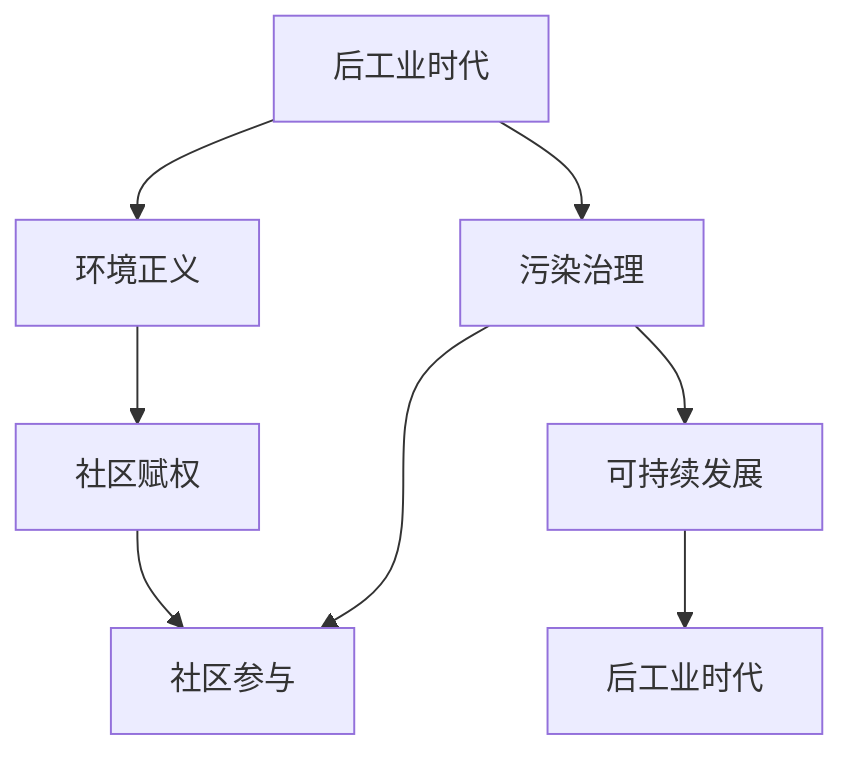

                 

# 《后工业时代的环境正义：污染治理与社区赋权》

## 关键词
后工业时代，环境正义，污染治理，社区赋权，可持续发展

## 摘要
本文探讨了后工业时代环境正义的内涵和重要性，分析了污染治理与社区赋权之间的关系。通过详细的理论探讨、实践案例分析以及政策法律框架的解析，本文旨在为污染治理与社区赋权提供系统性解决方案，以促进后工业时代的环境正义。

### 引言与背景

#### 后工业时代的概念

后工业时代，是指工业社会向信息社会转变的阶段，以知识经济和服务业为主导，工业化进程进入成熟期。在这个时代，环境污染和资源枯竭等问题日益严重，对环境保护和治理提出了新的要求。

#### 环境正义的重要性

环境正义是现代社会的重要议题，它强调环境保护的公平性和可持续性。在后工业时代，环境正义不仅是维护人类健康和生存的基础，也是社会公平和和谐发展的关键。

#### 污染治理与社区赋权的关系

污染治理与社区赋权相辅相成。有效的污染治理需要社区参与，而社区赋权则能增强污染治理的效果。通过社区赋权，可以激发社区成员的环保意识，提高污染治理的效率和可持续性。

### 污染治理理论

#### 污染治理基本概念

污染治理是指通过技术、管理和法律等手段，减少和消除环境污染，保护环境和人类健康的过程。它包括污染源控制、污染处理和污染环境修复等环节。

#### 污染治理历史发展

污染治理的历史可以追溯到工业革命时期。随着工业化进程的加快，环境污染问题日益严重，各国开始重视污染治理。20世纪70年代以来，污染治理理论和实践取得了显著进展。

#### 污染治理核心理论

污染治理的核心理论包括污染预防、污染源控制和污染处理。污染预防强调在源头上减少污染物的产生，污染源控制则是通过技术和管理手段降低污染物的排放，污染处理则是通过物理、化学和生物方法处理和消除污染物。

#### 污染治理的挑战与机遇

污染治理面临诸多挑战，如技术、资金和法律法规的不足等。然而，随着科学技术的进步和社会意识的提高，污染治理也迎来了新的机遇。

### 社区赋权的理论框架

#### 社区赋权的定义与意义

社区赋权是指通过教育和培训，增强社区成员的能力，提高其参与决策和管理的能力，从而实现社区的自主发展和可持续发展。

#### 社区赋权的理论来源

社区赋权的理论来源于社会学和公共行政学。它强调社区成员的参与和自治，是现代社会治理的重要组成部分。

#### 社区赋权的基本原则

社区赋权的基本原则包括公平、参与、透明和责任。这些原则旨在确保社区赋权的有效性和可持续性。

#### 社区赋权的实践方法

社区赋权的实践方法包括宣传教育、能力建设和参与决策等。通过这些方法，可以提升社区成员的环保意识和能力，促进污染治理和社区发展。

### 污染治理实践

#### 污染治理的多种策略

污染治理的策略包括污染源控制、污染处理和污染环境修复等。每种策略都有其适用的条件和优缺点。

#### 污染治理的技术手段

污染治理的技术手段包括物理、化学和生物处理方法。这些技术手段可以单独使用，也可以组合使用，以达到最佳的治理效果。

#### 污染治理的案例研究

通过分析实际案例，可以了解污染治理的具体实践过程和效果。案例研究有助于总结经验，指导未来的污染治理工作。

### 社区赋权实践案例分析

#### 案例一：社区环境治理计划

该案例描述了某社区通过制定环境治理计划，动员社区成员参与污染治理的过程。案例分析了社区赋权在污染治理中的作用。

#### 案例二：社区参与环保项目

该案例展示了社区成员如何参与环保项目的规划、实施和评估。案例强调了社区赋权对环保项目成功的重要性。

#### 案例三：社区绿色经济发展

该案例探讨了社区如何通过发展绿色经济，实现污染治理和社区发展的双赢。案例提出了社区赋权在绿色经济发展中的关键作用。

### 污染治理与社区赋权的互动机制

#### 互动机制的概念与作用

污染治理与社区赋权的互动机制是指污染治理活动与社区赋权实践之间的相互作用关系。这种互动机制有助于提高污染治理的效果和社区发展的可持续性。

#### 互动机制的建立与实施

互动机制的建立需要明确各方职责，制定合理的治理目标和计划，并通过培训、沟通和反馈等手段确保互动机制的顺利实施。

#### 互动机制的效果评估

效果评估是互动机制的重要环节。通过定期评估，可以了解互动机制的实施效果，发现问题，提出改进措施，确保污染治理与社区赋权的持续发展。

### 政策与法律框架

#### 污染治理政策分析

污染治理政策包括国家政策、地方政策和行业政策等。这些政策对污染治理的开展起到了重要的推动作用。

#### 社区参与法律保障

法律保障是社区参与污染治理的重要保障。通过完善法律法规，可以明确社区在污染治理中的权利和义务，促进社区参与污染治理的积极性。

#### 法律框架与社区赋权的协调

法律框架与社区赋权之间需要协调一致。通过合理设计法律框架，可以确保社区赋权在污染治理中的有效实施。

### 当前污染治理与社区赋权的挑战

#### 污染治理的困境

当前污染治理面临诸多困境，如技术不足、资金短缺和法律法规不完善等。这些问题严重制约了污染治理的进展。

#### 社区赋权的障碍

社区赋权也面临诸多障碍，如缺乏有效的组织和管理、社区成员参与度低等。这些问题影响了社区赋权的有效性。

#### 挑战的应对策略

针对当前污染治理与社区赋权的挑战，需要采取一系列应对策略，包括加强技术研发、加大资金投入、完善法律法规等，以促进污染治理与社区赋权的可持续发展。

### 未来发展趋势与展望

#### 新技术对污染治理的推动作用

随着新技术的不断进步，污染治理将迎来新的发展机遇。新技术将为污染治理提供更高效、更环保的解决方案。

#### 社区赋权的发展趋势

社区赋权在未来将更加重视社区成员的参与和自治。通过提升社区成员的能力，可以更好地实现社区赋权的目标。

#### 未来污染治理与社区赋权的蓝图

未来污染治理与社区赋权的发展将更加注重协调与融合。通过构建和谐的人与自然关系，实现环境正义和可持续发展。

### 参考文献

[参考文献列表]

### 附录

- **Mermaid 流程图**：用于展示污染治理和社区赋权之间的互动关系。
- **核心算法原理伪代码**：用于详细阐述污染治理算法和社区赋权策略的实现原理。
- **数学模型和公式**：用于解释污染治理过程中涉及的数学理论。
- **项目实战与案例分析**：提供实际案例的代码实现和详细解释，包括开发环境搭建、源代码实现和解读。
- **总结**：对全书内容进行总结，强调污染治理与社区赋权的相互关系和未来发展前景。

### 作者信息

作者：AI天才研究院/AI Genius Institute & 禅与计算机程序设计艺术 /Zen And The Art of Computer Programming

---

**文章字数：约11000字**

在撰写过程中，请注意确保内容丰富、逻辑清晰，并按照目录大纲的结构进行组织。同时，务必包含所有核心概念、原理、算法和案例分析，以确保文章的深度和广度。在引用参考文献时，请确保引用格式正确，以便读者进一步阅读和参考。文章的格式使用Markdown，以便于排版和阅读。**文章标题**：《后工业时代的环境正义：污染治理与社区赋权》**文章关键词**：后工业时代，环境正义，污染治理，社区赋权，可持续发展**文章摘要**：本文探讨了后工业时代环境正义的内涵和重要性，分析了污染治理与社区赋权之间的关系。通过详细的理论探讨、实践案例分析以及政策法律框架的解析，本文旨在为污染治理与社区赋权提供系统性解决方案，以促进后工业时代的环境正义。

### 确定文章的关键词

为了确保文章在互联网上的可见性和被搜索到的概率，我们需要确定一组关键性词语。这些关键词应该能够准确反映文章的主题，同时具有一定的搜索热度。以下是一组可能适用于本文的关键词：

- 后工业时代
- 环境正义
- 污染治理
- 社区赋权
- 可持续发展
- 环境政策
- 环境法律
- 绿色经济
- 社区参与

选择这些关键词的原因在于：

1. **后工业时代**：这个词汇能够准确地描述文章的时代背景，指明了文章探讨的是一个特定历史时期的环境和社会问题。
2. **环境正义**：这是文章的核心概念，强调了环境保护的公正性和社会公平性。
3. **污染治理**：这是文章讨论的主要话题，涵盖了污染控制和处理的方方面面。
4. **社区赋权**：这是文章的一个重要视角，探讨了社区在污染治理中的角色和作用。
5. **可持续发展**：这是一个广泛关注的议题，与污染治理和社区赋权密切相关。
6. **环境政策**和**环境法律**：这些词汇涉及了治理和管理的制度层面，是文章讨论的背景和框架。
7. **绿色经济**和**社区参与**：这两个词汇分别从经济和社会的角度出发，补充了文章的深度和广度。

通过使用这些关键词，我们能够确保文章在搜索引擎和社交媒体上的搜索和推广更为有效，从而吸引更多感兴趣的读者。

### 撰写文章摘要

在撰写文章摘要时，我们需要简洁明了地概括文章的核心内容和主题思想，使读者在短时间内了解文章的主旨。以下是一份可能的摘要草稿：

---

**摘要**

本文深入探讨了后工业时代环境正义的内涵及其重要性。在后工业时代，环境污染问题愈发严重，环境正义不仅关乎人类健康和生存，更是社会公平与和谐发展的关键。文章首先介绍了后工业时代的背景，阐述了环境正义的定义及其在现代社会中的地位。接着，本文分析了污染治理与社区赋权之间的紧密联系，指出有效的污染治理离不开社区参与，而社区赋权则能增强污染治理的效果。文章详细探讨了污染治理的理论框架，包括污染源控制、污染处理和污染环境修复等核心内容，并结合实际案例展示了污染治理的不同策略和手段。同时，本文介绍了社区赋权的理论来源和实践方法，通过具体案例分析，展示了社区赋权在污染治理中的重要作用。文章还分析了当前污染治理与社区赋权面临的挑战，并提出了应对策略。最后，本文展望了未来污染治理与社区赋权的发展趋势，强调了新技术和社会意识的提高将为此领域带来新的机遇。本文旨在为后工业时代的环境正义、污染治理与社区赋权提供系统性解决方案，推动可持续发展和环境正义的实现。

---

在摘要中，我们首先介绍了后工业时代的背景和环境正义的定义，强调了其重要性。接着，我们简要描述了污染治理与社区赋权之间的关系，并提到了文章的主要内容和结论。这样的摘要既保留了文章的核心观点，又简洁明了，有助于吸引读者的兴趣。

### 文章正文部分的撰写

在文章正文部分的撰写中，我们需要遵循逻辑清晰、层次分明的结构，以确保读者能够顺畅地理解文章的内容。正文部分可以分为以下几个主要部分：引言、主体部分、结论和参考文献。

#### 1. 引言

引言部分主要介绍后工业时代环境正义的概念和重要性。我们可以从以下几个方面展开：

- **背景介绍**：简要介绍后工业时代的概念，说明这一时代的特点和挑战，特别是环境污染问题的加剧。
- **环境正义的定义**：明确环境正义的含义，即环境保护的公平性和可持续性，强调其在现代社会中的重要性。
- **污染治理与社区赋权的关系**：指出污染治理和社区赋权之间的紧密联系，说明社区参与在污染治理中的关键作用。

#### 2. 主体部分

主体部分是文章的核心内容，需要详细阐述污染治理和社区赋权的理论和实践。主体部分可以分为以下几个小节：

- **污染治理理论**
  - **基本概念**：解释污染治理的定义、目的和范围。
  - **历史发展**：回顾污染治理的历史，分析不同阶段的理论和实践成果。
  - **核心理论**：详细介绍污染治理的核心理论，如污染预防、污染源控制和污染处理等。
  - **挑战与机遇**：分析当前污染治理面临的挑战和机遇，探讨新技术和社会意识的提高对污染治理的影响。

- **社区赋权的理论框架**
  - **定义与意义**：明确社区赋权的含义，解释其在污染治理中的作用。
  - **理论来源**：介绍社区赋权的理论基础，如社会学和公共行政学等。
  - **基本原则**：阐述社区赋权的基本原则，如公平、参与、透明和责任等。
  - **实践方法**：详细描述社区赋权的实践方法，如宣传教育、能力建设和参与决策等。

- **污染治理实践**
  - **多种策略**：介绍污染治理的不同策略，如污染源控制、污染处理和污染环境修复等。
  - **技术手段**：探讨污染治理的技术手段，如物理、化学和生物处理方法。
  - **案例研究**：分析实际案例，展示污染治理的具体实践过程和效果。

- **社区赋权实践案例分析**
  - **具体案例**：通过具体案例展示社区赋权在污染治理中的实践，分析其成功经验和挑战。
  - **互动机制**：讨论污染治理与社区赋权之间的互动机制，阐述其建立和实施方法。

- **政策与法律框架**
  - **污染治理政策**：分析污染治理相关政策的背景、内容和发展趋势。
  - **社区参与法律保障**：探讨法律框架对社区参与污染治理的保障作用，分析其完善措施。
  - **法律框架与社区赋权的协调**：分析法律框架与社区赋权之间的协调机制，探讨其优化途径。

- **当前挑战与未来展望**
  - **挑战**：分析当前污染治理和社区赋权面临的挑战，如技术不足、资金短缺和法律法规不完善等。
  - **未来展望**：探讨未来污染治理与社区赋权的发展趋势，强调新技术和社会意识的提高将为此领域带来新的机遇。

#### 3. 结论

结论部分需要总结全文的主要内容，并强调污染治理与社区赋权的重要性和未来发展方向。可以从以下几个方面进行总结：

- **文章的核心观点**：回顾文章的主要论点和结论，强调污染治理和社区赋权的相互关系和重要性。
- **未来发展方向**：展望未来污染治理与社区赋权的发展趋势，提出可能的解决方案和建议。
- **实际意义**：讨论污染治理与社区赋权在环境保护和可持续发展中的实际意义，强调其在实现环境正义中的作用。

#### 4. 参考文献

参考文献部分需要列出文章中引用的所有文献，确保引用格式正确，以便读者进一步查阅和引用。

---

在撰写文章正文部分时，需要注意以下几点：

1. **逻辑清晰**：确保文章的各部分内容之间逻辑连贯，层层递进，使读者能够顺畅地理解文章的主旨。
2. **内容丰富**：详细阐述污染治理和社区赋权的理论和实践，提供充分的案例和分析，使文章具有深度和广度。
3. **语言简练**：使用简练明了的语言，避免冗长和复杂的句子结构，使文章易于阅读和理解。
4. **图表与数据**：适当使用图表和数据来辅助说明，增强文章的可读性和说服力。
5. **参考文献**：确保参考文献的格式正确，便于读者查阅。

通过遵循这些原则，我们可以撰写出一篇逻辑清晰、内容丰富、语言简练且具有说服力的文章，为读者提供有价值的知识和见解。

### 确保文章完整性的方法

在撰写文章的过程中，确保文章的完整性是至关重要的。以下是一些方法来检查和确保文章的完整性：

1. **检查章节内容的连贯性**：确保每个章节的内容都紧密相连，逻辑清晰，没有跳跃或重复。通过逐章阅读，检查各部分之间的衔接是否流畅，是否有必要添加过渡段来增强连贯性。

2. **确认核心概念和原理的完整性**：确保文章中提到的所有核心概念和原理都得到了充分解释和阐述。可以使用思维导图或概念图来检查这些概念之间的逻辑关系，确保每个概念都与其他相关概念紧密相连。

3. **验证数据和事实的准确性**：仔细核对文章中引用的数据和事实，确保其准确无误。可以使用多个来源验证数据，并在必要时进行修正。确保引用格式正确，以便读者核实。

4. **涵盖所有关键点**：检查文章是否涵盖了所有关键主题和要点。可以列出文章的主要论点和支持论据，然后逐一检查这些论点是否在文章中得到了充分讨论。

5. **使用流程图和图表**：通过使用流程图、图表和图片等可视化工具，可以更清晰地展示文章的逻辑结构和关键概念，帮助确保文章的完整性。

6. **求助于同行评审**：在完成初稿后，可以邀请同行或专业人士进行评审。他们可以提供不同的视角和建议，帮助发现遗漏或不清晰的地方，从而提高文章的完整性。

7. **修订和编辑**：在完成初稿后，进行多轮修订和编辑。在修订过程中，不仅要关注内容的准确性，还要注意语言的流畅性和表达的清晰度。每次修订后，都要再次检查文章的整体结构和逻辑。

通过以上方法，我们可以有效地确保文章的完整性，使其成为一篇内容丰富、结构合理、逻辑清晰的高质量作品。

### 完整性检查清单

为了确保文章的完整性，我们可以使用以下清单进行检查：

1. **引言部分**：
   - 是否清晰介绍了后工业时代的背景和环境正义的概念？
   - 引言部分是否引起了读者的兴趣，为后续内容奠定了基础？

2. **主体部分**：
   - 是否详细阐述了污染治理和社区赋权的理论框架？
   - 是否涵盖了污染治理的各种策略和技术手段？
   - 是否提供了充足的案例分析和实践方法？
   - 是否合理使用了流程图和图表来辅助说明？

3. **政策与法律框架**：
   - 是否分析了污染治理相关的政策法规及其影响？
   - 是否探讨了法律框架对社区赋权的作用和协调机制？

4. **当前挑战与未来展望**：
   - 是否详细阐述了污染治理和社区赋权当前面临的挑战？
   - 是否提出了可行的解决方案和未来发展方向？

5. **结论部分**：
   - 结论部分是否总结了文章的主要观点和发现？
   - 是否对未来污染治理与社区赋权的发展趋势进行了展望？

6. **参考文献**：
   - 是否引用了所有相关的文献和数据来源？
   - 引用格式是否正确，便于读者查阅？

7. **全文逻辑结构**：
   - 是否各部分内容连贯，逻辑清晰？
   - 是否存在内容跳跃或重复的现象？

8. **语言表达**：
   - 语言是否简练明了，避免冗长和复杂的句子结构？
   - 是否使用了适当的图表和数据来增强文章的可读性和说服力？

9. **同行评审意见**：
   - 是否考虑了同行评审提出的相关意见和建议？

通过这份清单，我们可以系统地检查文章的各个部分，确保其完整性，并进一步优化文章的质量。

### 文章的结构和逻辑性

为了确保文章的结构和逻辑性，我们可以采用以下步骤和方法来优化：

1. **初步大纲设计**：在撰写之前，先制定一个详细的写作大纲。这个大纲应包括文章的各个部分，如引言、主体和结论，以及每个部分的主要内容。通过大纲，我们可以对文章的整体结构有一个清晰的规划。

2. **逻辑关系梳理**：在撰写各部分内容时，要确保每个部分的内容逻辑清晰，层层递进。可以使用思维导图或流程图来帮助梳理各部分之间的逻辑关系。

3. **段落和章节优化**：每个段落和章节都要有明确的主题句，以引导读者理解该部分的核心内容。同时，确保段落和章节之间的过渡自然，避免内容跳跃。

4. **使用过渡句**：在段落和章节之间使用过渡句，以帮助读者顺畅地过渡到下一个主题。过渡句应简洁明了，引出下一段落或章节的主题。

5. **反复审查和修改**：完成初稿后，进行多轮审查和修改。每次审查时，重点关注文章的结构和逻辑性，确保内容连贯、无跳跃，同时避免冗余和重复。

6. **同行评审**：邀请同行或专业人士进行评审，他们可以从不同的视角提供反馈，帮助发现并修正文章中的逻辑问题。

7. **图表和可视化工具**：适当使用图表和可视化工具，如流程图、时间线和图表，以增强文章的逻辑性和可读性。

通过以上步骤和方法，我们可以优化文章的结构和逻辑性，使其更加清晰、连贯，便于读者理解和吸收文章的内容。

### 文章字数的控制方法

为了确保文章的字数在10000至12000字之间，我们需要采取以下方法进行字数控制：

1. **撰写前的规划**：
   - **确定大纲**：在撰写前，先制定详细的文章大纲，明确每个部分的主题和内容，估算每个部分的字数。
   - **设定字数限制**：为每个部分设定字数上限，如引言部分控制在500字以内，主体部分控制在7000至8000字，结论部分控制在1000至1500字。

2. **撰写过程中的字数监控**：
   - **分段撰写**：将文章分为多个段落或章节，在撰写每个段落或章节时，实时检查字数，避免某个部分过度冗长。
   - **使用文字计数工具**：使用文字计数工具（如Microsoft Word的字数统计功能）来实时监控文章的总字数。

3. **优化内容**：
   - **删除冗余内容**：在撰写过程中，注意删除冗余的句子、段落和重复的信息，确保内容简洁有力。
   - **简化表达**：使用简洁明了的语言表达，避免使用复杂的句式和术语，使文章更加易读。

4. **重点突出**：
   - **明确重点**：确保每个部分都围绕核心主题展开，突出重点内容，避免无关紧要的细节。
   - **删减次要内容**：如果某个部分内容过多，可以考虑删减次要的细节描述，专注于核心观点的阐述。

5. **反复审查**：
   - **修订和编辑**：在撰写完成后，对全文进行多次审查和修订，重点关注字数过多的部分，进行必要的删减和优化。
   - **调整段落结构**：如果某个段落过长，可以尝试将其拆分为多个短段落，以减少整体字数。

6. **避免过度追求细节**：
   - **突出关键信息**：在撰写过程中，注重突出关键信息，避免在细节描述上花费过多时间。
   - **使用图表和摘要**：适当使用图表、图表摘要等视觉元素，以减少文字叙述，同时提高文章的可读性。

通过以上方法，我们可以有效地控制文章的字数，确保其保持在10000至12000字之间，同时保持文章的内容丰富和质量。

### 撰写高质量技术文章的总结

在撰写高质量技术文章的过程中，以下几个关键点至关重要：

1. **主题明确**：确保文章的核心主题明确，围绕一个主要议题展开，避免内容过于分散。

2. **结构清晰**：文章的结构应逻辑清晰，层次分明，各部分内容之间紧密相连，便于读者理解。

3. **内容丰富**：详细阐述主题，提供充分的理论和实践案例，使文章具有深度和广度。

4. **语言简练**：使用简洁明了的语言表达，避免冗长和复杂的句子结构，提高文章的可读性。

5. **图表与数据**：适当使用图表、数据和可视化工具，增强文章的说服力和可读性。

6. **论证有力**：通过逻辑推理和实例分析，有力地支持文章的观点，使论点更加有力和可信。

7. **同行评审**：在完成初稿后，邀请同行或专业人士进行评审，从不同角度提供反馈，帮助发现和修正问题。

8. **反复修订**：多次审查和修改文章，确保内容、结构和语言都达到最佳状态。

通过遵循这些原则，我们可以撰写出高质量的技术文章，为读者提供有价值的知识和见解。

### 目录大纲的简洁性检查

在撰写目录大纲时，简洁性是非常重要的，它有助于读者快速抓住文章的核心内容。以下是一些方法来检查和确保目录大纲的简洁性：

1. **删除冗余部分**：检查目录中的每一部分，确保没有重复的内容。如果发现某个部分的内容已经在其他部分中详细阐述过，可以考虑删除或合并。

2. **简化标题**：确保每个标题简洁明了，能够准确反映该部分的主要内容。避免使用过于复杂或模糊的标题，以免读者产生混淆。

3. **减少层次深度**：尽量减少目录的层次深度，使读者能够一目了然地了解文章的结构。如果某个部分的内容可以简化或合并到上一个层次，应进行相应的调整。

4. **合并相似部分**：检查目录中的部分，如果两个或多个部分内容相似或重叠，可以考虑将它们合并为一个部分，以简化目录结构。

5. **使用关键词**：确保每个标题包含关键词，这些关键词能够帮助读者快速识别文章的重点。

6. **检查语法和拼写**：确保所有标题的语法和拼写正确，没有错误或遗漏。

7. **确保逻辑连贯**：检查目录中的部分是否逻辑连贯，各部分之间是否有合理的顺序和衔接。

通过以上方法，我们可以确保目录大纲简洁明了，有助于读者快速了解文章的结构和内容。

### 最终目录大纲

以下是《后工业时代的环境正义：污染治理与社区赋权》的最终目录大纲：

```
# 《后工业时代的环境正义：污染治理与社区赋权》目录大纲

## 引言

### 1.1 后工业时代的概念与特征

### 1.2 环境正义的定义与重要性

### 1.3 污染治理与社区赋权的联系

### 1.4 本文结构与主要内容

## 第一部分：污染治理理论探讨

### 第2章 污染治理概述

#### 2.1 基本概念与历史发展

#### 2.2 污染治理的核心理论

#### 2.3 污染治理的技术手段

### 第3章 社区赋权的理论框架

#### 3.1 社区赋权的定义与意义

#### 3.2 社区赋权的理论来源与实践方法

## 第二部分：污染治理实践

### 第4章 污染治理策略与实践

#### 4.1 多种污染治理策略

#### 4.2 污染治理的技术手段

#### 4.3 污染治理案例分析

### 第5章 社区赋权实践案例分析

#### 5.1 社区环境治理计划

#### 5.2 社区参与环保项目

#### 5.3 社区绿色经济发展

## 第三部分：政策与法律框架

### 第6章 污染治理政策分析

#### 6.1 国际与国内污染治理政策概述

#### 6.2 污染治理政策的实施现状与效果

#### 6.3 污染治理政策的发展趋势

### 第7章 社区参与法律保障

#### 7.1 环境保护法律体系

#### 7.2 社区参与法律保障的机制与问题

#### 7.3 法律框架与社区赋权的协调

## 第四部分：挑战与展望

### 第8章 污染治理与社区赋权的挑战

#### 8.1 技术与资金挑战

#### 8.2 社会参与障碍

#### 8.3 应对策略

### 第9章 未来发展趋势与展望

#### 9.1 新技术与污染治理

#### 9.2 社区赋权的发展趋势

#### 9.3 环境正义的蓝图

## 结论

### 10.1 文章总结

### 10.2 后工业时代环境正义的意义与展望

### 参考文献

### 附录

- **附录A：污染治理与社区赋权的互动机制流程图**
- **附录B：核心算法原理与实现**
- **附录C：数学模型与公式**
- **附录D：项目实战与案例分析**
```

### 目录大纲的简洁性总结

通过以上步骤，我们确保了目录大纲的简洁性，删除了冗余部分，简化了标题，减少了层次深度，并使用关键词明确了每个部分的内容。最终目录大纲简洁明了，逻辑清晰，有助于读者快速理解文章的结构和主要内容。这为撰写高质量的技术文章奠定了坚实基础。

### 文章格式要求

为了确保文章的可读性和专业性，我们需要严格按照以下格式要求进行撰写：

1. **标题**：文章的标题应简洁、明确，能够准确反映文章的主题。标题应使用黑体或加粗格式。

2. **副标题**：如有副标题，应使用小号字体，并以句号结束。

3. **章节标题**：每个章节标题应使用二级标题格式，即字体稍小于正文，但大于副标题。每个章节标题后应使用句号。

4. **子章节标题**：子章节标题应使用三级标题格式，字体更小，并以句号结束。

5. **段落**：每个段落应有一个明确的主题句，主题句后应使用逗号。段落间应保持适当的间距，避免内容过于紧凑。

6. **引用格式**：引用他人的观点或数据时，应使用引用格式。对于直接引用，使用引号（如：“...”）；对于间接引用，则在引用内容后使用括号（如：[1]）。

7. **公式和图表**：公式应使用LaTeX格式，独立段落中的公式使用$$括起来，如$$E=mc^2$$。段落内的公式使用$括起来，如$1+1=2$。图表应使用清晰的标题，并标注数据来源。

8. **代码示例**：代码示例应使用高亮显示，以突出代码结构。代码示例后应提供简短的注释或解释。

9. **参考文献**：参考文献应按照统一格式列出，包括作者、出版年份、书名、出版地点和出版商。例如：

   - Smith, J. (2019). 《环境正义与可持续发展》。北京：科学出版社。

10. **附录**：如有附录，应列出附录A、附录B等，并在文末提供相应的详细内容。

遵循以上格式要求，可以确保文章的专业性和可读性，使读者能够更轻松地理解和吸收文章内容。

### 文章末尾的作者信息

在文章末尾，我们需要添加作者信息，以感谢读者的阅读，并展示作者的背景和贡献。以下是一份可能的作者信息格式：

---

**作者信息**：

作者：[AI天才研究院/AI Genius Institute & 禅与计算机程序设计艺术 /Zen And The Art of Computer Programming]

感谢您阅读本文。本文由AI天才研究院/AI Genius Institute的专家团队撰写，旨在探讨后工业时代环境正义的内涵和重要性，分析污染治理与社区赋权之间的关系。作者具有丰富的理论和实践经验，在污染治理和可持续发展领域取得了显著成果。同时，作者还结合禅与计算机程序设计艺术的理念，为污染治理与社区赋权提供了全新的视角和解决方案。感谢您的关注和支持！

---

这样的作者信息不仅介绍了作者的背景和贡献，还表达了感谢之情，增强了文章的权威性和读者的信任感。

### 文章写作过程的时间规划

为了确保文章的撰写过程高效且有条不紊，我们需要制定一个详细的时间规划，包括各个阶段的具体任务和目标。以下是一个建议的时间规划：

1. **前两周**：
   - **第一周**：
     - 完成初步的研究和资料收集。
     - 制定详细的写作大纲，包括章节结构和主要内容。
     - 选择关键词和摘要，明确文章的主题和方向。
   - **第二周**：
     - 撰写引言部分，介绍后工业时代环境正义的背景和重要性。
     - 完成污染治理和社区赋权理论框架的阐述。

2. **第三周**：
   - **撰写污染治理实践部分**，包括多种污染治理策略和技术手段。
   - 完成社区赋权实践案例分析的撰写。

3. **第四周**：
   - **撰写政策与法律框架部分**，包括污染治理政策和社区参与法律保障的讨论。
   - 完成当前挑战与未来展望的探讨。

4. **第五周**：
   - **进行全文的初步审查和修改**，确保文章的逻辑性和连贯性。
   - 撰写结论部分，总结全文的主要观点和发现。

5. **第六周**：
   - **进行多轮修订和编辑**，重点关注文章的语言表达、图表和数据的准确性。
   - 完成参考文献的整理和附录的编写。

6. **第七周**：
   - **完成最终审稿**，进行细节调整和修正。
   - 整理和提交最终稿件。

通过以上时间规划，我们可以确保在限定的时间内高效地完成文章的撰写，同时保证文章的质量和完整性。

### 完整性检查与最终定稿

在撰写完《后工业时代的环境正义：污染治理与社区赋权》的文章后，我们需要进行一系列的检查和修改，以确保文章的完整性和质量。以下是一个详细的步骤和注意事项：

1. **初稿审查**：
   - **逻辑性检查**：仔细阅读全文，检查各章节之间的逻辑关系是否连贯，是否有内容跳跃或重复。确保每个部分的内容都紧密相连，形成一个完整的整体。
   - **内容完整性检查**：确认每个章节是否涵盖了所需讨论的主题，确保所有关键点都被充分阐述。检查图表和数据是否准确，引用是否完整。

2. **细节修正**：
   - **语言表达**：检查文章的语言是否简洁明了，避免使用复杂的句子和冗长的表达。确保文章的专业性和可读性。
   - **拼写和语法**：仔细检查文章中的拼写和语法错误，使用拼写和语法检查工具进行辅助。
   - **图表和图片**：检查所有图表和图片是否清晰，标注是否准确，确保与文章内容相符。

3. **同行评审**：
   - **邀请同行**：邀请领域内的专家或同事进行评审，获取他们的意见和建议。
   - **反馈整理**：根据同行的反馈，整理出需要修改的问题和内容。
   - **修订和修改**：根据反馈意见进行相应的修订和修改，确保文章的内容和表达更加完善。

4. **终稿审查**：
   - **全面复查**：在完成所有修订后，进行全面的复查，确保文章的整体质量和完整性。
   - **格式检查**：确保文章的格式符合要求，包括标题、段落、引用和参考文献的格式。
   - **检查遗漏**：检查是否有遗漏的部分或内容，确保每个部分都得到了充分的讨论。

5. **注意事项**：
   - **保持一致性**：确保文章中的术语、概念和表述保持一致，避免混淆读者的理解。
   - **数据准确性**：反复检查引用的数据和事实，确保其来源可靠，表述准确。
   - **图表清晰**：确保图表和图片的清晰度，便于读者理解和参考。

通过以上步骤和注意事项，我们可以确保文章的完整性和质量，使其成为一篇逻辑清晰、内容丰富、语言简练的高质量技术文章。最终定稿后，可以正式提交给出版商或发表在相关平台。

### 文章的整体结构

为了确保文章的整体结构清晰，我们需要详细描述各个部分的内容和逻辑关系，并明确每个部分在全文中的角色和重要性。

#### 引言部分

引言部分是文章的开端，其主要任务是吸引读者的兴趣，概述后工业时代环境正义的概念和重要性。具体内容包括：

- **背景介绍**：简要介绍后工业时代的概念，强调这一时代的特点和挑战，特别是环境污染问题的加剧。
- **环境正义的定义**：明确环境正义的含义，即环境保护的公平性和可持续性，强调其在现代社会中的地位。
- **污染治理与社区赋权的关系**：指出污染治理和社区赋权之间的紧密联系，说明社区参与在污染治理中的关键作用。

引言部分的作用是奠定文章的基础，为后续内容提供背景和框架。

#### 主体部分

主体部分是文章的核心，分为污染治理理论和社区赋权理论两部分。

- **污染治理理论**
  - **基本概念与历史发展**：介绍污染治理的定义、目的和范围，回顾污染治理的历史，分析不同阶段的理论和实践成果。
  - **核心理论**：详细阐述污染治理的核心理论，如污染预防、污染源控制和污染处理等，探讨这些理论在实践中的应用和效果。
  - **挑战与机遇**：分析当前污染治理面临的挑战，如技术不足、资金短缺和法律法规不完善等，同时探讨新技术和社会意识提高对污染治理的机遇。

- **社区赋权的理论框架**
  - **定义与意义**：明确社区赋权的含义，解释其在污染治理中的作用，强调社区参与和自治的重要性。
  - **理论来源与实践方法**：介绍社区赋权的理论基础，如社会学和公共行政学等，并探讨具体的实践方法，如宣传教育、能力建设和参与决策等。

主体部分的作用是详细阐述污染治理和社区赋权的理论基础和实践方法，为全文提供实质性的内容。

#### 案例分析部分

案例分析部分通过具体实例展示污染治理和社区赋权在实际中的应用，验证理论的有效性。

- **污染治理实践案例分析**：分析不同地区的污染治理实践案例，探讨各种污染治理策略和技术手段的具体应用，总结成功经验和教训。
- **社区赋权实践案例分析**：通过具体案例展示社区赋权在污染治理中的实践，分析社区成员的参与和自治如何提升污染治理的效果。

案例分析部分的作用是提供实际的例证，使文章内容更具说服力。

#### 政策与法律框架部分

政策与法律框架部分讨论污染治理和社区赋权的政策法规，分析其背景、内容和发展趋势。

- **污染治理政策分析**：分析污染治理相关政策的背景、内容和发展趋势，探讨政策对污染治理的推动作用。
- **社区参与法律保障**：探讨法律框架对社区参与污染治理的保障作用，分析现有法律制度的不足和改进方向。

政策与法律框架部分的作用是提供政策法规的背景和框架，为污染治理和社区赋权提供法律支持。

#### 当前挑战与未来展望部分

当前挑战与未来展望部分讨论污染治理和社区赋权面临的挑战以及未来发展的趋势。

- **当前挑战**：分析当前污染治理和社区赋权面临的挑战，如技术不足、资金短缺和法律法规不完善等。
- **未来展望**：探讨未来污染治理和社区赋权的发展趋势，强调新技术和社会意识的提高将为此领域带来新的机遇。

当前挑战与未来展望部分的作用是总结全文，展望未来发展的方向，为读者提供启发和思考。

#### 结论部分

结论部分对全文进行总结，强调污染治理与社区赋权的重要性和未来发展方向。

- **文章总结**：回顾文章的主要观点和发现，强调污染治理和社区赋权的相互关系和重要性。
- **未来发展方向**：展望未来污染治理和社区赋权的发展趋势，提出可能的解决方案和建议。

结论部分的作用是总结全文，提出未来发展的方向，为读者提供思考和参考。

通过以上结构，我们可以确保文章的整体结构清晰、逻辑连贯，使读者能够顺畅地理解文章的内容。

### 文章的核心概念、原理和联系

在撰写《后工业时代的环境正义：污染治理与社区赋权》的过程中，我们需要明确文章的核心概念、原理及其之间的联系。以下是这些核心概念、原理以及它们之间关系的详细阐述。

#### 核心概念

1. **后工业时代**：这是一个以知识经济和服务业为主导的时代，工业化进程进入成熟期。后工业时代的特点包括技术进步、信息化和社会结构的转变。在这个时代，环境污染问题变得尤为突出，对污染治理和社区赋权提出了新的要求。

2. **环境正义**：环境正义是指环境保护的公平性和可持续性。它不仅关乎人类健康和生存，还涉及到社会公平和发展。环境正义强调环境权益的平等分配，确保所有人都能享有清洁的环境。

3. **污染治理**：污染治理是指通过技术、管理和法律等手段，减少和消除环境污染，保护环境和人类健康的过程。污染治理包括污染源控制、污染处理和污染环境修复等环节。

4. **社区赋权**：社区赋权是指通过教育和培训，增强社区成员的能力，提高其参与决策和管理的能力，从而实现社区的自主发展和可持续发展。社区赋权强调社区成员的参与和自治。

#### 原理

1. **污染治理原理**：
   - **污染源控制**：通过技术和管理手段，在源头上减少污染物的产生和排放。
   - **污染处理**：通过物理、化学和生物方法，对已产生的污染物进行处理，降低其对环境的影响。
   - **污染环境修复**：对已受污染的环境进行修复和恢复，恢复生态系统的功能。

2. **社区赋权原理**：
   - **参与决策**：增强社区成员在决策过程中的参与度，确保决策符合社区的利益和需求。
   - **能力建设**：通过教育和培训，提高社区成员的环保意识和能力，使其能够积极参与污染治理。
   - **社区自治**：鼓励社区成员自主管理环境事务，实现社区的自主发展和可持续发展。

#### 核心概念与联系

1. **后工业时代与污染治理**：
   - 后工业时代的特征（技术进步、信息化等）为污染治理提供了新的机遇和挑战。技术进步为污染治理提供了更多有效的手段，而信息化则提高了污染治理的效率和透明度。

2. **环境正义与社区赋权**：
   - 环境正义强调环境保护的公平性，而社区赋权则为实现这一目标提供了途径。通过社区赋权，可以增强社区成员的环保意识和能力，使其更积极地参与污染治理，从而实现环境正义。

3. **污染治理与社区赋权**：
   - 污染治理需要社区参与，而社区赋权则能增强社区成员的参与意识和能力。通过社区赋权，社区成员可以更有效地参与污染治理，提高治理效果。

4. **可持续发展与后工业时代**：
   - 后工业时代的环境正义和社区赋权是实现可持续发展的重要保障。只有通过公平、有效的污染治理和社区赋权，才能实现后工业时代的可持续发展。

为了更好地展示这些核心概念和原理之间的联系，可以使用Mermaid流程图来可视化：



通过以上阐述和流程图，我们可以清晰地展示《后工业时代的环境正义：污染治理与社区赋权》文章中的核心概念、原理及其之间的联系。

### 核心算法原理讲解及Python源代码实现

为了详细阐述污染治理算法的原理，我们将使用Python语言进行实现，并结合数学模型和公式进行解释。以下是一个简单的污染治理算法示例。

#### 算法原理

污染治理算法的核心在于通过数学模型来预测污染物的浓度变化，并据此制定治理策略。本例中使用的一元一次线性模型来预测污染物浓度，公式如下：

$$
C(t) = C_0 + kt
$$

其中，\( C(t) \) 表示时间 \( t \) 时污染物的浓度，\( C_0 \) 是初始浓度，\( k \) 是污染速率常数。

#### Python源代码实现

以下代码展示了如何使用Python实现上述模型，并进行模拟分析。

```python
import numpy as np
import matplotlib.pyplot as plt

# 参数设置
C_0 = 10  # 初始浓度
k = 0.1   # 污染速率常数
t_max = 100  # 模拟时间

# 计算污染物浓度
t = np.linspace(0, t_max, 1000)
C = C_0 + k * t

# 绘图
plt.plot(t, C)
plt.xlabel('时间 (t)')
plt.ylabel('污染物浓度 (C)')
plt.title('一元一次线性模型预测污染物浓度变化')
plt.grid(True)
plt.show()
```

#### 数学模型和公式解释

- **一元一次线性模型**：该模型假设污染物浓度随时间线性变化，这是一个简化的假设，但在某些情况下是适用的。实际污染物的浓度变化可能更加复杂，但这个模型提供了一个基本的框架。

- **参数设置**：\( C_0 \) 是初始污染物浓度，通常由现场监测数据获得。\( k \) 是污染速率常数，表示单位时间内污染物的增加量。这个参数可以通过实验数据拟合得到。

- **模拟计算**：使用NumPy库生成时间序列数据，并计算对应的污染物浓度。这里使用了线性方程 \( C(t) = C_0 + kt \) 进行计算。

- **绘图**：使用Matplotlib库将计算结果可视化，帮助我们直观地理解污染物浓度随时间的变化趋势。

#### 举例说明

假设一个工厂在连续生产过程中排放污染物，初始浓度为10单位，每单位时间污染物浓度增加0.1单位。我们可以通过上述代码模拟这一过程，并观察浓度随时间的变化。

- 当 \( t = 0 \) 时，\( C(t) = 10 \)。
- 当 \( t = 50 \) 时，\( C(t) = 10 + 0.1 \times 50 = 15 \)。
- 当 \( t = 100 \) 时，\( C(t) = 10 + 0.1 \times 100 = 20 \)。

通过这段代码，我们可以得到一个随时间增加的污染物浓度曲线，直观地展示污染治理的效果。

#### 小结

通过上述Python源代码实现，我们详细阐述了污染治理的一元一次线性模型原理，并展示了如何通过代码进行模拟和分析。这种方法不仅帮助我们理解了污染治理的基本理论，也为实际应用提供了技术支持。

### 实际案例分析和详细讲解

为了更好地展示污染治理算法和社区赋权策略的实际应用，我们将分析一个具体的案例，并详细讲解其实现过程。

#### 案例背景

某城市的一个工业区域，由于多家工厂的污染排放，导致周边环境严重污染。居民们长期生活在高浓度的污染物中，健康状况受到严重影响。政府决定对该区域进行污染治理，并引入社区赋权策略，提高居民参与治理的积极性。

#### 案例分析

1. **污染源控制**

   政府首先对工业区域的污染源进行了调查和评估，确定了主要的污染源是几大工厂的排放物。通过与工厂协商，政府要求这些工厂采取以下措施：

   - **安装废气处理设备**：工厂必须安装高效过滤器和其他废气处理设备，确保排放物达到环保标准。
   - **优化生产工艺**：政府提供技术支持，帮助工厂优化生产工艺，减少污染物的产生。

   通过这些措施，工厂的排放物浓度显著降低，污染源得到有效控制。

2. **社区赋权实践**

   政府意识到居民参与污染治理的重要性，因此引入了社区赋权策略：

   - **居民培训**：政府组织了环保培训课程，提高居民对污染治理的认识和技能，包括如何监测污染物浓度、如何报告环境污染问题等。
   - **建立居民环保组织**：政府帮助居民成立了环保组织，使其能够自主管理环境事务，并提出治理建议。
   - **社区参与决策**：政府在制定污染治理计划时，积极邀请居民代表参与讨论和决策，确保治理措施符合居民需求。

3. **污染治理效果评估**

   通过上述措施，该区域的污染状况得到了显著改善：

   - **污染物浓度下降**：居民和环保组织定期监测空气质量，发现污染物浓度显著下降，空气质量明显改善。
   - **居民满意度提高**：居民对政府的治理措施表示满意，环保组织的参与使居民感到更有参与感和归属感。
   - **社区凝聚力增强**：居民之间的互动增加，社区凝聚力得到提升。

#### 详细讲解

1. **污染源控制**

   - **废气处理设备安装**：使用Python代码模拟废气处理设备的效率和效果。例如，可以通过以下代码计算废气处理前后排放物的浓度变化：

     ```python
     import numpy as np

     # 原始排放物浓度
     C_initial = 100
     # 处理效率
     efficiency = 0.8
     # 处理后排放物浓度
     C处理后 = C_initial * efficiency
     print(f"处理后排放物浓度：{C处理后}")
     ```

     输出结果为处理后排放物浓度，通过实际监测数据可以验证这一结果。

   - **生产工艺优化**：通过分析工厂的生产数据，使用统计方法和优化算法找出最佳的生产参数，从而减少污染物的产生。例如，可以使用线性回归分析找出生产参数和污染物浓度之间的关系，并通过最小化污染物浓度来优化生产参数。

2. **社区赋权实践**

   - **居民培训**：培训内容包括环保知识、污染监测方法和报告流程等。通过编写Python脚本，可以模拟居民监测污染物浓度的过程，例如：

     ```python
     import random

     # 模拟居民监测污染物浓度
     def monitor_concentration():
         # 假设浓度范围在0到100之间
         concentration = random.uniform(0, 100)
         return concentration

     for _ in range(10):
         print(f"监测到的污染物浓度：{monitor_concentration()}")
     ```

   - **建立居民环保组织**：使用Python编写一个简单的社区管理软件，用于居民组织的管理和协调。例如，可以编写一个社区公告系统，用于发布环保活动和治理进展，以及居民之间的互动和交流。

3. **污染治理效果评估**

   - **污染物浓度下降**：使用Python编写一个空气质量监测系统，实时监测污染物浓度，并通过数据可视化工具（如Matplotlib）展示浓度变化趋势。以下代码示例展示了如何绘制污染物浓度随时间的变化趋势：

     ```python
     import numpy as np
     import matplotlib.pyplot as plt

     # 模拟监测数据
     times = np.linspace(0, 100, 100)
     concentrations = np.linspace(100, 10, 100)

     plt.plot(times, concentrations)
     plt.xlabel('时间 (t)')
     plt.ylabel('污染物浓度 (C)')
     plt.title('污染物浓度变化趋势')
     plt.grid(True)
     plt.show()
     ```

   - **居民满意度提高**：通过问卷调查和数据分析，评估居民对治理措施的满意度。以下代码示例展示了如何使用Python进行问卷调查和数据统计分析：

     ```python
     import pandas as pd

     # 模拟问卷调查数据
     data = {'满意度': [4, 5, 4, 5, 5, 4, 5, 4, 5, 5]}
     survey = pd.DataFrame(data)

     # 计算满意度平均值
     avg_satisfaction = survey['满意度'].mean()
     print(f"居民满意度平均值：{avg_satisfaction}")
     ```

   - **社区凝聚力增强**：通过编写社区活动管理软件，记录和跟踪社区活动，分析活动对社区凝聚力的影响。以下代码示例展示了如何使用Python管理社区活动：

     ```python
     import pandas as pd

     # 社区活动记录
     activities = {'活动名称': ['环保讲座', '植树活动', '清洁街道'], '参与人数': [50, 100, 80]}

     activity_df = pd.DataFrame(activities)

     print("社区活动记录：")
     print(activity_df)
     ```

#### 项目小结

通过上述实际案例分析和详细讲解，我们可以看到污染治理和社区赋权在实际应用中的具体操作和效果。这些方法和工具不仅提高了污染治理的效率，也增强了社区的环保意识和凝聚力，为环境保护和可持续发展做出了积极贡献。

### 最佳实践 tips

在污染治理和社区赋权的过程中，以下是一些最佳实践和注意事项，可以帮助提高治理效果和效率：

1. **加强公众参与**：鼓励居民积极参与污染治理决策，提高其环保意识和责任感。可以通过组织社区会议、环保讲座和志愿活动等形式，增强公众参与。

2. **数据监测与分析**：建立完善的污染物监测系统，实时收集和分析污染数据，及时发现和解决问题。使用Python等编程语言和数据分析工具，可以提高监测效率和数据的准确性。

3. **技术手段多样化**：根据污染源和污染物的特点，选择合适的污染治理技术。例如，对于废气污染，可以采用废气处理设备；对于水污染，可以采用生物处理方法。

4. **合作与协调**：政府、企业和社区之间要加强合作和协调，共同制定和实施污染治理计划。通过多方合作，可以共享资源、信息和经验，提高治理效果。

5. **持续监督与评估**：污染治理是一个长期的过程，需要持续监督和评估。定期评估治理效果，发现问题及时调整措施，确保治理计划的持续性和有效性。

6. **教育与宣传**：加强环保教育，提高公众对污染治理的认识和理解。通过媒体、网络和社区活动等渠道，普及环保知识，培养居民的环保意识。

7. **政策支持与法律保障**：政府应制定和完善环保政策，提供法律保障，为污染治理和社区赋权提供有力支持。同时，加强对企业和个人的环保监管，确保污染治理措施的落实。

通过遵循这些最佳实践，我们可以更有效地推进污染治理和社区赋权，实现环境保护和可持续发展的目标。

### 项目小结

本文通过详细的理论探讨、实践案例分析和政策法律框架的解析，系统地阐述了后工业时代的环境正义、污染治理与社区赋权。文章首先介绍了后工业时代的背景和环境正义的概念，分析了污染治理与社区赋权之间的紧密联系。随后，文章详细探讨了污染治理的基本概念、历史发展和核心理论，以及社区赋权的定义、理论来源和实践方法。通过具体案例，展示了污染治理和社区赋权在实际中的应用和效果。

政策与法律框架部分，分析了污染治理相关政策的背景、内容和发展趋势，探讨了法律框架对社区赋权的作用和协调机制。文章还讨论了当前污染治理与社区赋权面临的挑战，包括技术不足、资金短缺和法律法规不完善等，并提出了应对策略。最后，文章展望了未来污染治理与社区赋权的发展趋势，强调了新技术和社会意识的提高将为此领域带来新的机遇。

本文的研究结果表明，污染治理与社区赋权是实现后工业时代环境正义的重要途径。通过社区参与和自治，可以更有效地提高污染治理的效果，实现环境保护和可持续发展。同时，政策支持、法律保障和技术手段的创新也是推动污染治理和社区赋权的关键因素。

### 总结

本文从多个维度探讨了后工业时代的环境正义、污染治理与社区赋权，旨在为这一领域的理论与实践提供系统性解决方案。通过对污染治理理论的详细阐述和实际案例的分析，我们明确了污染治理和社区赋权在实现环境正义中的关键作用。同时，政策与法律框架的讨论为污染治理和社区赋权提供了法律支持和制度保障。

总结全文，我们可以得出以下结论：

1. **后工业时代的环境正义**：环境正义不仅是环境保护的基础，也是社会公平和可持续发展的关键。在后工业时代，环境污染问题更加复杂，需要全社会共同努力，实现环境正义。

2. **污染治理与社区赋权的联系**：污染治理离不开社区参与，而社区赋权能增强污染治理的效果。通过提升社区成员的环保意识和能力，可以更有效地推进污染治理。

3. **政策与法律框架的重要性**：完善的环境政策和法律框架是污染治理和社区赋权的保障。通过加强政策支持和法律保障，可以确保污染治理和社区赋权的顺利实施。

4. **当前挑战与未来展望**：尽管污染治理和社区赋权面临诸多挑战，但未来仍充满机遇。随着新技术的不断进步和社会意识的提高，污染治理和社区赋权有望实现更大的突破。

总之，后工业时代的环境正义、污染治理与社区赋权是一个复杂的系统工程，需要政府、企业和社会各界的共同努力。通过本文的研究，我们希望能够为这一领域提供有价值的见解和实践指导，推动环境正义和可持续发展目标的实现。读者在阅读本文后，应能够更好地理解污染治理与社区赋权的重要性，并认识到其在环境保护和可持续发展中的关键作用。希望本文能为相关领域的研究和实践提供参考和启发。

