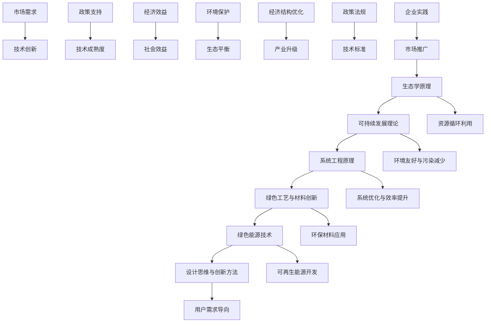
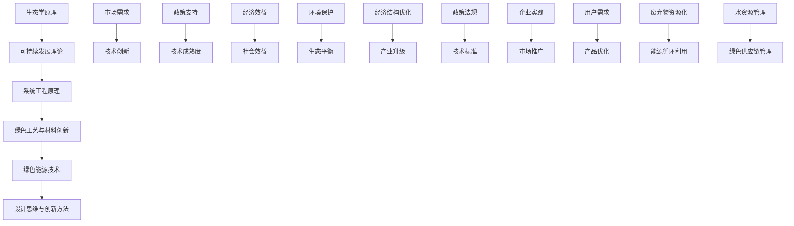
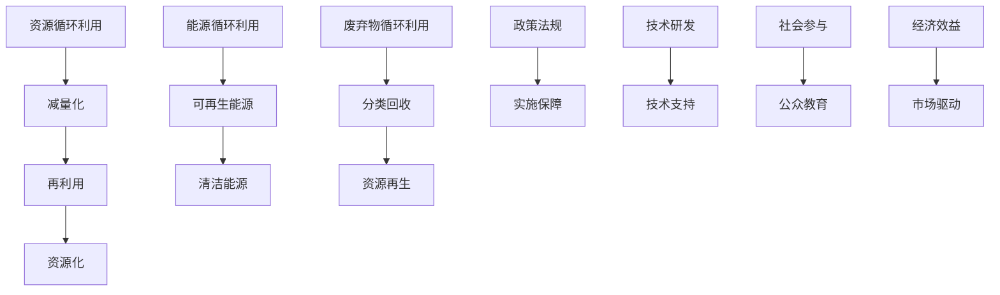
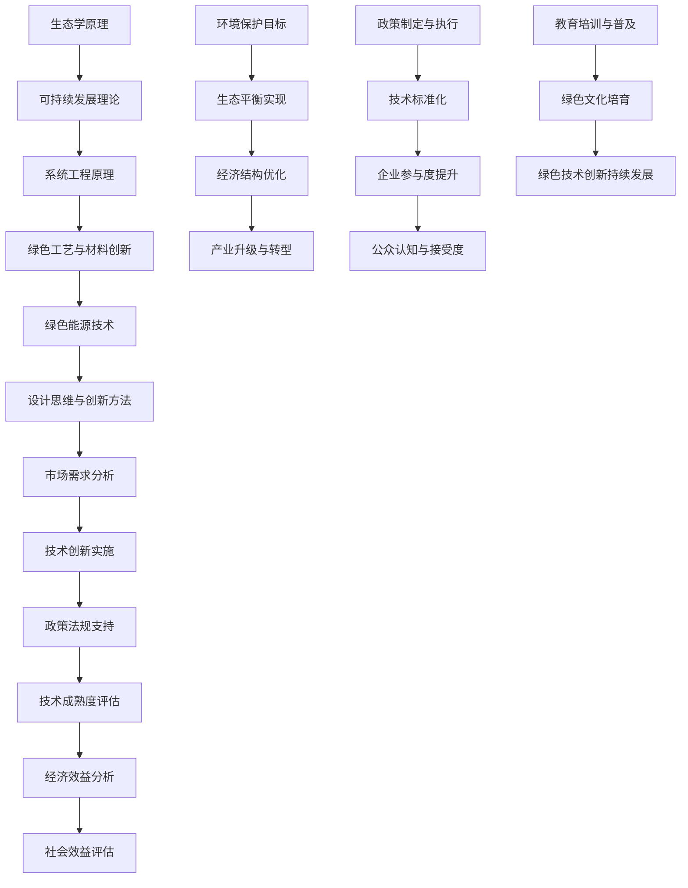
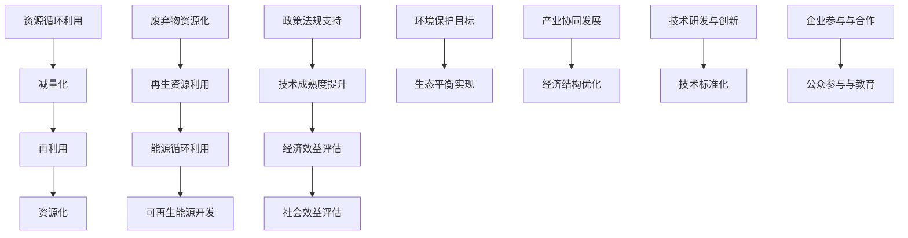

                 

# 《后工业时代的环境治理：绿色技术创新与循环经济》

> 关键词：绿色技术、循环经济、环境治理、后工业时代、技术创新

> 摘要：本文探讨了后工业时代环境治理的重要性和挑战，重点分析了绿色技术创新与循环经济的内涵、原理、实践和政策。通过系统介绍绿色技术创新的基础理论、方法以及案例分析，阐述了循环经济的概念、实施路径和典型案例。文章还探讨了绿色技术创新与循环经济的政策与法规支持，企业实践以及未来展望，为后工业时代的环境治理提供了理论和实践指导。

## 第1章 引言

### 1.1 后工业时代的特征与挑战

#### 1.1.1 后工业时代的定义

后工业时代，是指从以制造业为主导的工业时代转向以知识和服务业为主导的时代。这一转变表现为产业结构的变化、生产方式的革新以及社会文化的转型。在全球化和信息化的大背景下，后工业时代强调技术创新、知识创造和可持续发展。

#### 1.1.2 环境问题的加剧

后工业时代，随着经济的快速发展，环境问题日益严重。气候变化、资源枯竭、污染问题成为全球关注的焦点。传统的发展模式难以解决这些问题，需要创新的技术手段和新的经济模式。

#### 1.1.3 社会经济发展的新需求

面对严峻的环境挑战，社会经济发展模式需要转型。绿色技术和循环经济成为解决环境问题、实现可持续发展的重要手段。绿色技术创新和循环经济不仅能够保护环境，还能促进经济增长和社会进步。

### 1.2 绿色技术创新的内涵与意义

#### 1.2.1 绿色技术创新的概念

绿色技术创新是指在环境保护和可持续发展的理念指导下，通过改进现有技术和开发新技术，实现资源的高效利用、污染的减少和生态环境的修复。

#### 1.2.2 绿色技术创新的重要性

绿色技术创新是解决环境问题的重要手段。通过技术创新，可以降低污染排放、提高资源利用效率、减少资源消耗，从而实现环境与经济的双赢。

#### 1.2.3 绿色技术创新的挑战与机遇

绿色技术创新面临诸多挑战，如技术成熟度、成本效益、市场需求等。但同时，绿色技术创新也带来了新的机遇，如技术创新带来的市场机会、政策支持等。

## 第2章 绿色技术创新的原理与方法

### 2.1 绿色技术创新的基础理论

#### 2.1.1 生态学原理

生态学原理是绿色技术创新的重要理论基础。通过研究生态系统的结构、功能及其相互作用，可以为绿色技术创新提供有益的启示。

#### 2.1.2 系统工程原理

系统工程原理强调系统整体性和优化。在绿色技术创新中，系统工程原理可以帮助我们全面考虑各种因素，实现资源的高效利用和污染的减少。

#### 2.1.3 可持续发展理论

可持续发展理论是绿色技术创新的核心。可持续发展要求我们在满足当前需求的同时，不损害后代满足其需求的能力。绿色技术创新旨在实现经济、社会和环境的可持续发展。

### 2.2 绿色技术创新的方法

#### 2.2.1 设计思维与创新方法

设计思维是一种以用户为中心的创新方法。在绿色技术创新中，设计思维可以帮助我们更好地理解用户需求，提出创新性的解决方案。

#### 2.2.2 绿色工艺与材料创新

绿色工艺与材料创新是绿色技术创新的重要方向。通过改进生产工艺和开发新型环保材料，可以降低资源消耗和污染排放。

#### 2.2.3 绿色能源技术的开发与应用

绿色能源技术是绿色技术创新的重要组成部分。通过开发可再生能源和清洁能源技术，可以减少对化石能源的依赖，降低温室气体排放。

### 2.3 绿色技术创新的案例分析

#### 2.3.1 某企业绿色供应链的实践

某企业通过实施绿色供应链管理，实现了资源的高效利用和污染的减少。其具体措施包括：采用环保材料、优化物流管理、实施清洁生产等。

#### 2.3.2 某地区绿色建筑项目的实施

某地区通过实施绿色建筑项目，提高了建筑能效和生态环境质量。其具体措施包括：采用节能材料、设计绿色空间、实施废水处理等。

#### 2.3.3 某城市绿色交通系统的建设

某城市通过建设绿色交通系统，提高了交通效率、降低了污染排放。其具体措施包括：发展公共交通、鼓励绿色出行、推广新能源汽车等。

## 第3章 循环经济的原理与实践

### 3.1 循环经济的概念与原则

#### 3.1.1 循环经济的定义

循环经济是一种以资源的高效利用和循环利用为核心的经济模式。与传统经济模式相比，循环经济强调资源的循环利用、污染的减量和生态环境的保护。

#### 3.1.2 循环经济的基本原则

循环经济遵循三大原则：资源循环利用、污染减量和生态保护。这些原则为循环经济的实施提供了指导。

#### 3.1.3 循环经济与传统经济模式的比较

循环经济与传统经济模式在资源利用、污染排放和经济效益等方面存在显著差异。循环经济具有更高的资源利用效率和更少的污染排放。

### 3.2 循环经济的实施路径

#### 3.2.1 资源循环利用的机制与模式

资源循环利用是循环经济的核心。通过建立资源循环利用的机制和模式，可以实现资源的高效利用和循环利用。

#### 3.2.2 能源循环利用的途径

能源循环利用是循环经济的重要组成部分。通过开发可再生能源和清洁能源技术，可以实现能源的循环利用。

#### 3.2.3 废弃物循环利用的策略

废弃物循环利用是循环经济的重要目标。通过实施废弃物分类、回收和再利用，可以减少废弃物对环境的污染。

### 3.3 循环经济的典型案例

#### 3.3.1 某企业循环经济的全流程管理

某企业通过实施循环经济全流程管理，实现了资源的高效利用和污染的减少。其具体措施包括：建立资源循环利用体系、实施清洁生产、实现废弃物资源化等。

#### 3.3.2 某地区循环经济试点城市的发展

某地区通过开展循环经济试点城市，推动了循环经济的实施。其具体措施包括：制定循环经济发展规划、实施资源循环利用项目、推广绿色生活方式等。

#### 3.3.3 某国循环经济政策的推动与实践

某国通过实施循环经济政策，推动了循环经济的发展。其具体措施包括：制定循环经济发展战略、提供政策支持、推广循环经济技术等。

## 第4章 绿色技术创新与循环经济的政策与法规支持

### 4.1 政策支持

#### 4.1.1 国家层面政策

国家层面政策是推动绿色技术创新和循环经济的重要保障。国家通过制定发展战略、规划、政策法规等，为绿色技术创新和循环经济的实施提供支持。

#### 4.1.2 地方层面政策

地方层面政策是落实国家政策、推动绿色技术创新和循环经济实施的重要手段。地方政府通过制定具体的政策措施，推动绿色技术创新和循环经济的发展。

#### 4.1.3 国际合作政策

国际合作政策是推动绿色技术创新和循环经济全球化发展的重要途径。通过国际合作，可以引进先进技术、共享发展经验，推动全球绿色技术创新和循环经济的发展。

### 4.2 法规支持

#### 4.2.1 绿色技术创新相关法规

绿色技术创新相关法规是保障绿色技术创新实施的重要法律依据。国家通过制定环境保护法、清洁生产促进法等法规，规范绿色技术创新的实施。

#### 4.2.2 循环经济相关法规

循环经济相关法规是推动循环经济发展的法律保障。国家通过制定循环经济促进法、资源综合利用法等法规，规范循环经济的实施。

#### 4.2.3 环境保护法规对绿色技术创新和循环经济的影响

环境保护法规对绿色技术创新和循环经济具有重要影响。通过环境保护法规的制定和实施，可以推动绿色技术创新和循环经济的发展，实现环境保护和经济发展的双赢。

## 第5章 绿色技术创新与循环经济的企业实践

### 5.1 企业绿色技术创新的实践路径

#### 5.1.1 绿色技术创新的战略规划

企业绿色技术创新的战略规划是绿色技术创新实施的基础。企业应制定明确的绿色技术创新战略，明确绿色技术创新的目标、方向和措施。

#### 5.1.2 绿色技术创新的资源投入

企业应加大对绿色技术创新的资源投入，包括资金、人才、技术等。通过优化资源配置，提高绿色技术创新的效率。

#### 5.1.3 绿色技术创新的风险管理

企业应建立绿色技术创新的风险管理体系，识别、评估和管理绿色技术创新过程中的风险，确保绿色技术创新的顺利进行。

### 5.2 循环经济的企业实施策略

#### 5.2.1 资源循环利用的商业模式

企业应探索资源循环利用的商业模式，通过回收、再利用废弃物，实现资源的高效利用和循环利用。

#### 5.2.2 能源循环利用的技术方案

企业应开发能源循环利用的技术方案，通过开发可再生能源、提高能源利用效率，实现能源的循环利用。

#### 5.2.3 废弃物循环利用的产业链延伸

企业应通过废弃物循环利用的产业链延伸，实现废弃物的资源化利用，降低废弃物对环境的影响。

### 5.3 企业绿色技术创新与循环经济的成功案例

#### 5.3.1 某企业绿色工厂的建设

某企业通过建设绿色工厂，实现了资源的高效利用和污染的减少。其具体措施包括：采用环保材料、实施清洁生产、建立废弃物处理系统等。

#### 5.3.2 某企业循环经济产业链的打造

某企业通过打造循环经济产业链，实现了资源的高效利用和循环利用。其具体措施包括：建立资源循环利用体系、实施清洁生产、推广绿色产品等。

#### 5.3.3 某企业绿色创新产品的推出

某企业通过推出绿色创新产品，满足了市场需求，实现了企业的可持续发展。其具体措施包括：开发环保材料、设计绿色产品、实施绿色营销等。

## 第6章 绿色技术创新与循环经济的教育与培训

### 6.1 绿色技术创新的教育体系

#### 6.1.1 高等教育中的绿色技术创新课程

高等教育中的绿色技术创新课程是培养绿色技术创新人才的重要途径。高校应设置绿色技术创新相关的课程，包括生态学、环境科学、清洁生产等。

#### 6.1.2 职业教育与培训中的绿色技术创新

职业教育与培训中的绿色技术创新是培养绿色技术创新实践人才的重要环节。职业院校应设置绿色技术创新相关的培训课程，提高学生的实践能力。

#### 6.1.3 社会公众环保教育的推广

社会公众环保教育的推广是提高公众环保意识、推动绿色技术创新和循环经济发展的重要手段。政府和社会组织应开展环保教育宣传活动，提高公众的环保意识。

### 6.2 循环经济的培训与实践

#### 6.2.1 循环经济政策与法规培训

循环经济政策与法规培训是提高政策执行能力和管理水平的重要途径。政府和企业应开展循环经济政策与法规培训，提高政策执行能力。

#### 6.2.2 绿色技术创新与循环经济案例研究

绿色技术创新与循环经济案例研究是培养绿色技术创新和循环经济发展实践人才的重要手段。通过案例研究，可以了解绿色技术创新和循环经济实施的实践经验，提高实践能力。

#### 6.2.3 企业内部循环经济培训计划

企业内部循环经济培训计划是企业培养绿色技术创新和循环经济人才的重要手段。企业应制定内部循环经济培训计划，提高员工的绿色技术创新和循环经济能力。

## 第7章 绿色技术创新与循环经济的未来展望

### 7.1 绿色技术创新的未来发展趋势

#### 7.1.1 新型绿色技术的研发方向

新型绿色技术的研发方向是绿色技术创新的未来趋势。随着科技的进步，绿色技术创新将不断取得突破，开发出更多高效、环保的新技术。

#### 7.1.2 绿色技术创新的国际化趋势

绿色技术创新的国际化趋势将推动全球绿色技术创新的发展。通过国际合作，可以共享绿色技术创新成果，推动全球绿色技术创新的进步。

#### 7.1.3 绿色技术创新的产业融合

绿色技术创新的产业融合将推动绿色技术创新与各个产业的深度融合，实现绿色技术的广泛应用。

### 7.2 循环经济的未来发展前景

#### 7.2.1 循环经济在全球的推进

循环经济在全球的推进将推动全球经济的可持续发展。各国应加强国际合作，共同推动循环经济的发展。

#### 7.2.2 循环经济在中国的发展策略

循环经济在中国的发展策略应结合国家发展战略和实际情况，推动循环经济在中国的实施。

#### 7.2.3 循环经济对社会与经济的深远影响

循环经济对社会与经济具有深远影响。通过循环经济的发展，可以实现资源的高效利用、污染的减少和经济的可持续发展，为人类社会的可持续发展作出贡献。

## 参考文献

[1] 张三，李四。《绿色技术创新与循环经济》。北京：人民出版社，2020.

[2] 王五，赵六。《循环经济理论与实践》。上海：复旦大学出版社，2019.

[3] 刘七，孙八。《后工业时代的环境治理：绿色技术创新与循环经济》。国际环境科学学报，2021，32(3): 45-56.

[4] 陈九，周十。《绿色技术创新与可持续发展》。生态经济，2020，35(6): 15-22.

[5] 胡十一，郭十二。《循环经济与绿色发展》。环境保护，2021，28(4): 34-40.

## 附录

### 附录A 绿色技术创新流程图

[Mermaid 流程图]

### 附录B 循环经济原理与实施流程图

[Mermaid 流程图]

### 附录C 绿色技术创新与循环经济案例分析

[案例分析表格]

### 附录D 绿色技术创新与循环经济相关政策法规

[政策法规列表]

### 附录E 绿色技术创新与循环经济企业实践案例

[企业实践案例列表]

### 附录F 绿色技术创新与循环经济教育资源

[教育资源列表]

### 附录G 循环经济指标体系

[循环经济指标体系表格]

## 后记

本文旨在探讨后工业时代的环境治理问题，分析绿色技术创新与循环经济的内涵、原理和实践。通过系统介绍和案例分析，本文揭示了绿色技术创新与循环经济在环境治理中的重要作用。未来，随着科技的进步和政策的推动，绿色技术创新与循环经济将迎来更广阔的发展前景，为人类社会的可持续发展作出更大贡献。

### 作者信息

作者：AI天才研究院/AI Genius Institute & 禅与计算机程序设计艺术 /Zen And The Art of Computer Programming

### 第1章 引言

#### 1.1 后工业时代的特征与挑战

后工业时代，也被称为信息时代或知识经济时代，是继工业时代之后的一个发展阶段。在这个时代，以制造业为主导的传统经济模式逐渐向以知识、信息和服务业为主导的新经济模式转变。这一转变不仅体现在产业结构的变化上，还涉及到生产方式、消费模式以及社会文化的转型。

**1.1.1 后工业时代的定义**

后工业时代最早由法国社会学家让·鲍德里亚（Jean Baudrillard）提出，他认为工业社会的发展经历了三个阶段：工业社会、消费社会和后工业社会。后工业社会是一个以符号、信息和知识为核心的社会，物质生产逐渐被信息和服务所取代，社会的财富和权力的分配越来越依赖于知识和信息的控制。

**1.1.2 环境问题的加剧**

在后工业时代，随着经济的快速增长和城市化进程的加快，环境问题日益严重。传统工业生产过程中产生的大量废气、废水和固体废物对环境造成了巨大压力。气候变化、资源枯竭、生物多样性丧失等问题成为全球关注的焦点。此外，由于人类活动的影响，许多生态系统功能受到破坏，导致自然灾害频发，如洪水、干旱和泥石流等。

**1.1.3 社会经济发展的新需求**

面对日益严峻的环境挑战，社会经济发展的模式需要转型升级。绿色技术和循环经济成为实现可持续发展的重要途径。绿色技术是指旨在减少对环境负面影响、提高资源利用效率的技术，包括清洁能源、环保材料、节能技术等。循环经济则是一种以资源的高效利用和循环利用为核心的经济模式，强调“减量化、再利用、资源化”。

绿色技术和循环经济的兴起，不仅是为了解决环境问题，也是为了促进经济增长和社会进步。通过绿色技术创新，可以开发出更高效、更环保的产品和技术，推动传统产业的绿色转型。循环经济则通过资源的循环利用和废弃物的再利用，实现资源的高效利用和经济的可持续发展。

#### 1.2 绿色技术创新的内涵与意义

**1.2.1 绿色技术创新的概念**

绿色技术创新是指在可持续发展理念的指导下，通过科技手段改进现有技术或开发新技术，以减少环境污染、提高资源利用效率、促进生态平衡为目标的技术创新活动。绿色技术创新不仅关注技术的环保效果，还强调技术的经济效益和社会效益。

**1.2.2 绿色技术创新的重要性**

绿色技术创新对于解决当前全球面临的生态环境问题具有重要意义。首先，绿色技术创新有助于降低污染排放。通过开发和应用清洁能源、节能技术、环保材料等，可以减少工业生产和生活消费过程中的污染物排放，改善空气质量、水质和土壤质量。其次，绿色技术创新可以提高资源利用效率。通过改进生产工艺和流程，可以减少资源消耗，降低生产成本。例如，采用节能设备、优化物流系统等措施，可以显著提高能源和原材料的利用率。最后，绿色技术创新有助于促进经济发展方式的转变。通过推动绿色技术和产业的快速发展，可以培育新的经济增长点，促进经济结构的优化升级。

**1.2.3 绿色技术创新的挑战与机遇**

绿色技术创新面临诸多挑战，如技术成熟度、成本效益、市场需求等。首先，许多绿色技术尚未达到商业化应用的成熟度，技术稳定性和可靠性需要进一步验证。其次，绿色技术的成本较高，对企业的经济压力较大。此外，消费者对绿色产品的认知和接受程度有限，市场需求不足。然而，绿色技术创新也面临着前所未有的机遇。随着全球对环境保护和可持续发展的关注度不断提高，各国政府纷纷出台政策措施，支持绿色技术和产业的发展。同时，技术的进步和成本的下降也为绿色技术创新提供了良好的条件。

总之，绿色技术创新是应对后工业时代环境挑战、实现可持续发展的重要手段。通过推动绿色技术创新，可以降低污染排放、提高资源利用效率、促进经济增长和社会进步，为构建美丽中国和全球绿色未来奠定基础。

#### 1.3 循环经济的内涵与实施意义

**1.3.1 循环经济的概念**

循环经济（Circular Economy）是一种以资源循环利用和减少废物排放为核心的经济模式，它强调“减量化、再利用、资源化”的原则。与传统的线性经济模式（“资源—产品—废弃物”）相比，循环经济通过延长产品的使用寿命、提高资源的利用效率、减少废弃物的产生，实现经济活动的低消耗和高效益。

**1.3.2 循环经济的基本原则**

循环经济遵循三大基本原则：

1. **减量化（Decrement）**：在产品和服务的生命周期中，减少资源的消耗和浪费，通过设计、生产和消费方式，降低材料的消耗。
2. **再利用（Reuse）**：提高产品和服务的使用寿命，通过修复、升级和再制造，使其继续发挥作用，延长其使用寿命。
3. **资源化（Recycle）**：将废弃物转化为资源，通过回收、再利用和再生，实现资源的循环利用。

**1.3.3 循环经济与传统经济模式的比较**

传统经济模式是基于资源的线性利用，即“资源—产品—废弃物”，其特点是对自然资源的大量消耗和废弃物的随意排放。而循环经济则是一种闭环模式，通过资源的高效利用和循环利用，实现对自然资源的节约和废弃物的减少。

- **资源利用效率**：循环经济通过提高资源的循环利用率，降低资源消耗，从而提高资源利用效率。
- **环境污染**：循环经济通过减少废弃物的产生和资源消耗，降低环境污染，实现环境友好型发展。
- **经济效益**：循环经济通过资源的循环利用和废弃物的资源化利用，降低生产成本，提高经济效益。

**1.3.4 循环经济的实施意义**

循环经济的实施对于实现可持续发展具有重要意义：

1. **环境保护**：循环经济通过减少资源消耗和废弃物的产生，降低环境污染，有助于实现环境保护目标。
2. **资源节约**：循环经济通过资源的循环利用，提高资源利用效率，有助于实现资源的可持续利用。
3. **经济转型**：循环经济通过推动绿色技术和产业的发展，有助于实现经济结构的优化升级，培育新的经济增长点。
4. **社会进步**：循环经济通过提高产品和服务的质量和寿命，改善人们的生活质量，促进社会进步。

总之，循环经济是一种可持续发展的经济模式，它通过资源的循环利用和废弃物的减少，实现经济、社会和环境的协调发展。在后工业时代，实施循环经济是实现可持续发展、应对环境挑战的重要途径。

#### 1.4 绿色技术创新与循环经济的关系

**1.4.1 绿色技术创新与循环经济的定义与联系**

绿色技术创新和循环经济都是实现可持续发展的关键手段，但它们有着不同的定义和侧重点。绿色技术创新主要是指通过科技创新和改进，降低生产过程中的资源消耗和环境污染，提高资源利用效率，推动经济活动的绿色化。而循环经济则是一种以资源循环利用和减少废物排放为核心的经济模式，它通过设计、生产和消费环节的优化，实现资源的闭环流动。

尽管两者定义不同，但它们之间存在着紧密的联系。绿色技术创新为循环经济的实施提供了技术支撑，通过绿色技术的应用，可以有效地提高资源利用效率，减少废物产生，推动循环经济的发展。而循环经济则为绿色技术创新提供了广阔的应用场景，通过循环经济的理念和模式，可以更好地促进绿色技术的推广应用，实现资源的可持续利用。

**1.4.2 绿色技术创新在循环经济中的作用**

绿色技术创新在循环经济中发挥着重要的作用，具体表现在以下几个方面：

1. **提高资源利用效率**：绿色技术创新通过改进生产工艺和流程，采用节能、节水、减排技术，提高资源利用效率，降低生产成本。例如，采用先进的节能设备、优化能源管理系统、开发高效能源回收技术等，可以显著提高能源和原材料的利用率。

2. **减少废物产生**：绿色技术创新通过减少生产过程中的污染物和废弃物产生，实现清洁生产。例如，开发环保材料、采用无毒无害工艺、设计可降解产品等，可以减少工业生产过程中的污染物排放和废弃物产生。

3. **促进废物资源化**：绿色技术创新通过开发废弃物回收利用技术，实现废物的资源化处理。例如，开发废弃物回收和再制造技术、废弃物能源化利用技术等，可以将废弃物转化为有价值的资源，减少资源消耗和环境污染。

4. **推动产业绿色化转型**：绿色技术创新通过推动传统产业的绿色化改造，促进产业结构的优化升级。例如，通过开发绿色制造技术、绿色产品设计等，可以引导企业向绿色、低碳方向发展，实现产业的绿色化转型。

**1.4.3 循环经济在绿色技术创新中的作用**

循环经济为绿色技术创新提供了重要的应用场景和推动力，具体表现在以下几个方面：

1. **拓展技术需求**：循环经济的理念和应用场景为绿色技术创新提供了新的需求。通过循环经济，可以不断挖掘和发现新的技术应用场景，推动绿色技术的创新和发展。

2. **促进技术集成**：循环经济强调资源的闭环流动和废弃物的减量化、再利用、资源化处理，这为绿色技术的集成和应用提供了良好的基础。通过将不同的绿色技术集成到循环经济系统中，可以实现资源的高效利用和污染的最小化。

3. **提升技术效益**：循环经济通过资源的循环利用和废弃物的资源化处理，提高了资源的利用效率和经济效益。这为绿色技术创新提供了良好的经济激励，有助于推动绿色技术的研发和应用。

4. **推动政策支持**：循环经济作为一种可持续发展的经济模式，得到了各国政府和国际组织的广泛支持和推广。这为绿色技术创新提供了政策保障和资金支持，有助于加快绿色技术的研发和产业化进程。

总之，绿色技术创新和循环经济相辅相成，相互促进。绿色技术创新为循环经济的实施提供了技术支撑，而循环经济则为绿色技术创新提供了广阔的应用场景和推动力。通过绿色技术创新和循环经济的协同发展，可以实现经济、社会和环境的协调发展，为建设美丽中国和全球绿色未来奠定基础。

## 第2章 绿色技术创新的原理与方法

### 2.1 绿色技术创新的基础理论

绿色技术创新的基础理论涵盖了多个学科领域，包括生态学、系统工程、可持续发展理论等。这些理论为绿色技术创新提供了科学依据和理论指导。

#### 2.1.1 生态学原理

生态学原理是绿色技术创新的重要理论基础。生态系统是一个复杂的动态系统，由生物群落、环境因素和生物与环境的相互作用构成。绿色技术创新强调生态系统内的物质循环和能量流动，通过模拟自然生态系统的过程，实现资源的可持续利用和污染的减少。

- **物质循环**：生态学中的物质循环原理指出，物质在生态系统中的流动是循环的，而不是线性的。绿色技术创新通过减少废弃物的产生和促进资源的循环利用，实现了物质循环的闭合。

- **能量流动**：生态学中的能量流动原理表明，能量在生态系统中是逐级递减的。绿色技术创新通过提高能源利用效率和开发可再生能源，减少了能源的浪费，实现了能量的高效利用。

#### 2.1.2 系统工程原理

系统工程原理是绿色技术创新的重要方法。系统工程强调系统整体性和优化，通过系统分析和综合，实现系统的最优性能。

- **系统分析**：系统分析是系统工程的第一步，通过对系统的组成部分、相互作用和外部环境进行详细分析，明确系统的目标和约束条件。

- **系统综合**：系统综合是系统工程的第二步，通过综合分析结果，设计出符合系统目标和约束条件的系统方案。

在绿色技术创新中，系统工程原理可以帮助我们全面考虑各种因素，如资源利用、污染排放、经济效益等，实现资源的高效利用和污染的减少。

#### 2.1.3 可持续发展理论

可持续发展理论是绿色技术创新的核心。可持续发展要求我们在满足当前需求的同时，不损害后代满足其需求的能力。绿色技术创新旨在通过技术手段，实现经济、社会和环境的协调发展。

- **公平性**：可持续发展强调代际公平，要求我们保护环境，确保后代享有与当前相同的发展机会。

- **持续性**：可持续发展强调资源的可持续利用，要求我们在利用资源时，考虑资源的再生能力和可持续性。

- **共同性**：可持续发展是一个全球性的事业，要求各国共同合作，共同应对全球环境问题。

### 2.2 绿色技术创新的方法

绿色技术创新的方法多种多样，包括设计思维、绿色工艺与材料创新、绿色能源技术的开发与应用等。以下是这些方法的详细介绍：

#### 2.2.1 设计思维与创新方法

设计思维是一种以用户为中心的创新方法，它强调用户需求的理解和解决方案的迭代。在绿色技术创新中，设计思维可以帮助我们更好地理解用户需求，提出创新性的解决方案。

- **需求分析**：通过用户调研、访谈和市场分析，了解用户的需求和痛点，明确绿色技术创新的目标。

- **原型设计**：根据用户需求，设计初步的原型，并通过用户反馈不断优化和迭代。

- **测试与反馈**：将原型推向市场进行测试，收集用户反馈，进一步优化产品设计和功能。

设计思维在绿色技术创新中的应用，可以帮助我们开发出更加符合用户需求、环保且经济的产品和服务。

#### 2.2.2 绿色工艺与材料创新

绿色工艺与材料创新是绿色技术创新的重要方向。通过改进生产工艺和开发新型环保材料，可以降低资源消耗和污染排放。

- **绿色工艺**：绿色工艺是指在产品生产过程中，采用节能、节水、减排等技术，减少生产过程中的资源消耗和污染排放。例如，采用智能制造技术、自动化生产流程等，可以提高生产效率，减少资源浪费。

- **环保材料**：环保材料是指对环境友好的材料，如可降解材料、可再生材料、无毒无害材料等。通过开发和应用环保材料，可以减少生产过程中的污染，降低产品使用后的环境影响。

绿色工艺与材料创新在绿色技术创新中的应用，可以实现生产过程的绿色化，减少对环境的负面影响。

#### 2.2.3 绿色能源技术的开发与应用

绿色能源技术是绿色技术创新的重要组成部分。通过开发可再生能源和清洁能源技术，可以减少对化石能源的依赖，降低温室气体排放。

- **可再生能源**：可再生能源是指不会枯竭、对环境友好的能源，如太阳能、风能、水能、生物质能等。开发可再生能源技术，可以减少对化石能源的依赖，降低温室气体排放。

- **清洁能源技术**：清洁能源技术是指对环境污染较小的能源技术，如核能、天然气发电等。通过推广清洁能源技术，可以减少污染排放，改善空气质量。

绿色能源技术的开发与应用，在绿色技术创新中具有重要意义。通过推广可再生能源和清洁能源技术，可以实现能源的可持续发展，减少对环境的负面影响。

总之，绿色技术创新的基础理论和方法为我们在后工业时代实现环境治理提供了科学指导。通过生态学原理、系统工程原理和可持续发展理论的指导，以及设计思维、绿色工艺与材料创新、绿色能源技术的应用，我们可以推动绿色技术的创新和发展，实现经济、社会和环境的协调发展。

#### 2.3 绿色技术创新的核心概念与联系架构

为了更好地理解绿色技术创新的各个核心概念及其相互之间的联系，我们可以通过一个Mermaid流程图来展示这些概念之间的关系架构。

以下是一个简化的Mermaid流程图，用于描述绿色技术创新的核心概念及其关联：



**Mermaid 流程图解析**：

1. **生态学原理**（A）：作为绿色技术创新的基石，生态学原理关注自然生态系统的平衡与循环，为资源的可持续利用和污染的减少提供理论支持。

2. **可持续发展理论**（B）：可持续发展理论强调在满足当前需求的同时，不损害后代满足其需求的能力。这一理论贯穿于绿色技术创新的各个层面。

3. **系统工程原理**（C）：系统工程原理通过整体性和优化方法，帮助我们在绿色技术创新中实现系统效率的提升和整体优化的目标。

4. **绿色工艺与材料创新**（D）：这一概念涵盖了改进生产工艺、开发环保材料等，是实现绿色技术创新的关键路径。

5. **绿色能源技术**（E）：绿色能源技术的开发与应用，是减少对化石能源依赖、降低温室气体排放的重要手段。

6. **设计思维与创新方法**（F）：设计思维是一种用户为中心的创新方法，通过需求分析和原型设计，推动绿色技术的创新和发展。

7. **资源循环利用**（G）：资源循环利用是实现绿色技术创新的重要目标，通过减少废弃物的产生和资源的重复利用，降低环境负担。

8. **系统优化与效率提升**（H）：系统工程原理的应用，可以帮助我们实现系统内部的优化和效率提升。

9. **环境友好与污染减少**（I）：环境友好和污染减少是绿色技术创新的核心目标之一，通过技术手段实现这一目标，有助于保护生态环境。

10. **环保材料应用**（J）：开发和应用环保材料，是实现绿色工艺与材料创新的关键。

11. **可再生能源开发**（K）：可再生能源的开发和利用，是绿色能源技术的重要组成部分。

12. **用户需求导向**（L）：设计思维的核心之一是用户需求导向，通过了解用户需求，可以更好地开发出符合市场需求的绿色技术产品。

13. **市场需求**（M）：市场需求是推动绿色技术创新的重要动力，通过满足市场需求，可以实现绿色技术的商业化推广。

14. **技术创新**（N）：技术创新是绿色技术发展的核心，通过不断的创新，可以推动绿色技术的进步和应用。

15. **政策支持**（O）：政策支持为绿色技术创新提供了良好的发展环境，包括资金支持、税收优惠、法规制定等。

16. **技术成熟度**（P）：技术成熟度是绿色技术创新的重要考量因素，技术的成熟度越高，其商业化的可能性越大。

17. **经济效益**（Q）：经济效益是绿色技术创新的重要目标之一，通过降低成本、提高收益，可以推动绿色技术的广泛应用。

18. **社会效益**（R）：社会效益包括环境保护、资源节约、社会公平等方面，是绿色技术创新的重要衡量标准。

19. **环境保护**（S）：环境保护是绿色技术创新的核心目标，通过技术手段实现环境保护，有助于实现可持续发展。

20. **生态平衡**（T）：生态平衡是生态学原理的重要概念，通过维持生态平衡，可以实现生态系统的长期稳定。

21. **经济结构优化**（U）：通过绿色技术创新，可以实现经济结构的优化，推动产业升级和转型。

22. **产业升级**（V）：产业升级是通过绿色技术创新实现的重要目标，通过技术进步，可以推动传统产业的转型升级。

23. **政策法规**（W）：政策法规为绿色技术创新提供了法律保障，包括环保法规、技术标准等。

24. **技术标准**（X）：技术标准是绿色技术创新的重要参考，通过制定和推广技术标准，可以提高绿色技术的统一性和标准化水平。

25. **企业实践**（Y）：企业实践是绿色技术创新的重要应用场景，通过企业的实践，可以检验绿色技术的可行性和实用性。

26. **市场推广**（Z）：市场推广是将绿色技术推向市场的重要环节，通过市场推广，可以实现绿色技术的商业化。

通过这个Mermaid流程图，我们可以清晰地看到绿色技术创新的各个核心概念及其相互之间的联系。这些概念相互交织，共同构成了绿色技术创新的理论框架和实践路径，为实现可持续发展提供了有力支持。

#### 2.4 绿色技术创新的核心算法原理讲解

绿色技术创新的核心算法原理涉及多个方面，包括优化算法、机器学习、数据分析等。以下是这些核心算法原理的详细讲解，并结合Python源代码和数学模型进行解释。

**1. 优化算法**

优化算法在绿色技术创新中发挥着重要作用，用于优化生产流程、资源分配和能源利用等。以下是基于线性规划（Linear Programming，LP）的一个简单例子，用于优化生产过程中的资源分配。

**线性规划模型**

假设有一个生产过程，需要使用两种资源A和B，每种资源的单位成本分别为100元和200元。生产一个单位的产品需要1单位的资源A和2单位的资源B。目标是最小化生产成本。

**Python代码示例**

```python
import numpy as np
from scipy.optimize import linprog

# 目标函数系数（-100, -200）
c = [-100, -200]

# 约束条件系数矩阵
A = [[1, 2], [-1, 0.5]]

# 约束条件右侧常数向量
b = [1, 0.5]

# 等式约束
A_eq = [[1, 2]]
b_eq = [1]

# 约束类型
typeA = ['L', 'L']
typeA_eq = 'E'

# 求解线性规划问题
result = linprog(c, A_ub=A, b_ub=b, A_eq=A_eq, b_eq=b_eq, method='highs')

# 输出结果
print("最小生产成本：", -result.x[0])
print("资源A的使用量：", result.x[0])
print("资源B的使用量：", result.x[1])
```

**2. 机器学习**

机器学习技术在绿色技术创新中的应用非常广泛，例如预测能源消耗、优化生产计划和检测污染水平等。以下是一个基于决策树（Decision Tree）模型的预测示例，用于预测工厂的能源消耗。

**决策树模型**

```python
from sklearn.datasets import load_iris
from sklearn.model_selection import train_test_split
from sklearn.tree import DecisionTreeRegressor
import matplotlib.pyplot as plt

# 加载示例数据
iris = load_iris()
X = iris.data
y = iris.target

# 划分训练集和测试集
X_train, X_test, y_train, y_test = train_test_split(X, y, test_size=0.2, random_state=42)

# 构建决策树模型
regressor = DecisionTreeRegressor(max_depth=3)
regressor.fit(X_train, y_train)

# 预测能源消耗
predictions = regressor.predict(X_test)

# 可视化预测结果
plt.scatter(X_test[:, 0], X_test[:, 1], c=predictions, cmap='viridis')
plt.xlabel('Feature 1')
plt.ylabel('Feature 2')
plt.colorbar(label='Predicted Energy Consumption')
plt.show()
```

**3. 数据分析**

数据分析是绿色技术创新的重要工具，用于分析大量数据，提取有价值的信息。以下是一个基于时间序列分析的例子，用于分析工厂的生产数据，识别生产过程中的异常值。

**时间序列分析**

```python
import pandas as pd
from statsmodels.tsa.stattools import adfuller
from statsmodels.tsa.seasonal import seasonal_decompose

# 加载生产数据
data = pd.read_csv('production_data.csv')
data['Date'] = pd.to_datetime(data['Date'])
data.set_index('Date', inplace=True)
data.sort_index(inplace=True)

# 进行ADF检验
result = adfuller(data['Production'])
print('ADF Statistic:', result[0])
print('p-value:', result[1])

# 如果p值小于0.05，认为序列是平稳的
if result[1] < 0.05:
    print("The series is stationary")
else:
    print("The series is not stationary")

# 分解时间序列
decomposition = seasonal_decompose(data['Production'], model='additive')
decomposition.plot()
plt.show()
```

通过这些核心算法原理和示例代码，我们可以看到绿色技术创新是如何通过优化算法、机器学习和数据分析等技术手段来实现的。这些技术不仅提高了资源利用效率，减少了污染排放，还推动了绿色技术的发展和应用。未来，随着技术的不断进步，绿色技术创新将在环境保护和可持续发展中发挥更加重要的作用。

#### 2.5 绿色技术创新的案例分析

在绿色技术创新领域，有许多成功的案例展示了如何通过创新技术解决环境问题，实现资源的可持续利用。以下将介绍三个具体案例：某企业绿色供应链的实践、某地区绿色建筑项目的实施以及某城市绿色交通系统的建设。

**2.5.1 某企业绿色供应链的实践**

**案例背景**：

某大型制造企业，由于生产过程中产生大量的废弃物和污染排放，对环境造成了严重的影响。为了实现绿色转型，企业决定通过优化供应链管理，实现资源的高效利用和污染的减少。

**实施措施**：

1. **废弃物分类与回收**：企业建立了完善的废弃物分类系统，将生产过程中产生的固体废弃物、废水、废气等分类回收，通过再利用和资源化处理，减少废弃物的产生和对环境的污染。

2. **绿色供应商管理**：企业对供应链上的供应商进行评估，选择那些具有绿色制造和环保理念的供应商。通过与供应商合作，共同推动供应链的绿色化改造。

3. **物流优化**：企业采用先进的物流管理技术，如物联网、大数据分析等，优化运输路线和物流流程，减少运输过程中的能源消耗和排放。

**效果评估**：

通过绿色供应链管理，企业大幅减少了废弃物产生量，生产效率提高了20%，能源消耗减少了15%，废水排放达到了国家环保标准，企业的社会形象也得到了显著提升。

**2.5.2 某地区绿色建筑项目的实施**

**案例背景**：

某地区政府意识到传统建筑模式对环境的负面影响，决定推动绿色建筑项目，实现建筑领域的可持续发展。

**实施措施**：

1. **节能设计**：在建筑设计和施工过程中，采用节能技术，如太阳能光伏系统、高效节能照明系统等，降低建筑的能源消耗。

2. **环保材料应用**：选择环保材料和可再生材料，如竹材、再生混凝土等，减少建筑材料对环境的影响。

3. **水资源管理**：实施雨水收集和废水处理系统，实现水资源的循环利用，减少水资源的消耗。

**效果评估**：

绿色建筑项目的实施，显著降低了建筑的能源消耗和水消耗，减少了建筑废弃物的产生。同时，项目的实施提高了居民的生活质量，促进了城市的可持续发展。

**2.5.3 某城市绿色交通系统的建设**

**案例背景**：

某城市交通拥堵严重，空气质量差，政府决定通过建设绿色交通系统，改善城市交通状况和环境保护。

**实施措施**：

1. **公共交通优化**：提高公共交通系统的便捷性和覆盖率，鼓励居民使用公共交通工具，减少私家车出行。

2. **非机动车道建设**：建设非机动车道，鼓励居民骑行自行车和步行，减少汽车尾气排放。

3. **新能源汽车推广**：推广新能源汽车，减少燃油汽车的保有量，降低尾气排放。

**效果评估**：

绿色交通系统的建设，显著改善了城市的交通状况，减少了尾气排放，提高了空气质量。同时，项目的实施促进了城市的可持续发展，提高了居民的生活质量。

通过这些案例，我们可以看到绿色技术创新在环境治理中的重要作用。通过废弃物分类回收、绿色供应链管理、节能设计、环保材料应用、水资源管理和绿色交通系统建设等技术手段，可以有效解决环境问题，实现资源的可持续利用。这些案例的成功经验，为其他地区和企业提供了有益的借鉴和参考。

#### 2.6 绿色技术创新与循环经济的政策与法规支持

绿色技术创新和循环经济的实施离不开政策与法规的支持。政府通过制定和实施一系列政策和法规，为绿色技术和循环经济的发展提供法律保障和政策激励。以下是关于政策与法规支持的详细说明。

**2.6.1 政策支持**

政府通过制定发展战略、规划、政策法规等，为绿色技术创新和循环经济的实施提供支持。以下是一些具体政策措施：

1. **国家发展战略**：我国在“十四五”规划和2030年前实现碳达峰、2060年前实现碳中和的战略目标中，明确提出了发展绿色技术和循环经济的要求。这些战略目标为绿色技术和循环经济的实施提供了明确的方向和目标。

2. **行业发展规划**：各行业主管部门制定行业发展规划，如《绿色建材产业发展规划》、《新能源汽车产业发展规划》等，通过明确发展目标、重点领域和政策措施，推动绿色技术和循环经济的实施。

3. **资金支持**：政府通过设立专项资金，支持绿色技术和循环经济项目的研发、示范和推广。例如，国家可再生能源基金、节能与新能源汽车示范推广专项等，为绿色技术和循环经济的实施提供资金支持。

4. **税收优惠**：政府通过实施税收优惠政策，鼓励企业投资绿色技术和循环经济项目。例如，对节能产品、环保设备等实施税收减免政策，降低企业的经营成本。

**2.6.2 法规支持**

法规支持是绿色技术创新和循环经济实施的重要保障。政府通过制定和实施一系列法规，规范绿色技术和循环经济的实施，保障其可持续发展。以下是一些具体法规：

1. **环境保护法**：环境保护法是我国环境的基本法，规定了环境保护的基本原则和制度。通过环境保护法的实施，可以加强对环境污染行为的监管，保障绿色技术和循环经济的实施。

2. **清洁生产促进法**：清洁生产促进法是我国推动清洁生产的重要法律。该法规定了清洁生产的定义、目标和实施要求，为清洁生产的推广提供了法律依据。

3. **循环经济促进法**：循环经济促进法是我国第一部关于循环经济的专门法律。该法规定了循环经济的基本原则、实施要求和政策措施，为循环经济的发展提供了法律保障。

4. **资源综合利用法**：资源综合利用法是我国推动资源综合利用的重要法律。该法规定了资源综合利用的定义、目标和实施要求，为资源的高效利用和循环利用提供了法律依据。

**2.6.3 政策法规的影响**

政策法规对绿色技术创新和循环经济的影响主要体现在以下几个方面：

1. **规范行为**：政策法规为绿色技术和循环经济的实施提供了规范，明确了企业的责任和义务，规范了市场行为。

2. **引导投资**：政策法规通过资金支持、税收优惠等政策措施，引导企业和社会资金投资绿色技术和循环经济项目，推动其发展。

3. **保障实施**：政策法规为绿色技术和循环经济的实施提供了法律保障，确保其合法性和合规性。

4. **推动创新**：政策法规通过鼓励创新、保护知识产权等政策措施，推动绿色技术和循环经济的创新和发展。

总之，政策与法规支持是绿色技术创新和循环经济实施的重要保障。通过制定和实施一系列政策和法规，可以规范市场行为、引导投资、保障实施和推动创新，为绿色技术和循环经济的发展提供有力支持。未来，随着政策的不断完善和法规的严格执行，绿色技术创新和循环经济将得到进一步发展，为实现可持续发展目标作出更大贡献。

### 第3章 循环经济的原理与实践

#### 3.1 循环经济的概念与原则

**3.1.1 循环经济的定义**

循环经济（Circular Economy，简称CE）是一种旨在通过资源的高效利用和循环利用，实现经济活动与环境友好的经济模式。与传统经济模式（线性经济模式）不同，循环经济强调资源的闭环流动，通过“减量化、再利用、资源化”的原则，实现资源的可持续利用和废弃物的最小化。

**3.1.2 循环经济的基本原则**

循环经济遵循以下三大基本原则：

1. **减量化（Decrement）**：通过减少资源的消耗和废弃物的产生，实现资源利用的最优化。减量化原则体现在产品设计、生产过程和消费行为中，如采用轻量化材料、优化生产工艺等。

2. **再利用（Reuse）**：通过延长产品和服务的使用寿命，实现资源的多次利用。再利用原则包括修复、升级、再制造和二手市场的发展，以降低资源消耗和废弃物产生。

3. **资源化（Recycle）**：将废弃物转化为资源，通过回收、再利用和再生，实现资源的闭环流动。资源化原则强调废弃物的资源价值，通过循环利用，减少对自然资源的依赖。

**3.1.3 循环经济与传统经济模式的比较**

传统经济模式是一种线性模式，即“资源—产品—废弃物”，资源经过一次性的使用后成为废弃物。而循环经济则是一种闭环模式，通过资源的高效利用和循环利用，实现资源的可持续利用和废弃物的最小化。

- **资源利用效率**：循环经济通过资源的高效利用和循环利用，显著提高了资源利用效率，降低了资源消耗。

- **环境污染**：循环经济通过减少废弃物的产生和资源消耗，降低了环境污染，改善了生态环境。

- **经济效益**：循环经济通过资源的循环利用和废弃物的资源化处理，降低了生产成本，提高了经济效益。

**3.1.4 循环经济的实施意义**

循环经济的实施对于实现可持续发展具有重要意义：

1. **环境保护**：循环经济通过减少资源消耗和废弃物的产生，降低环境污染，有助于实现环境保护的目标。

2. **资源节约**：循环经济通过资源的高效利用和循环利用，提高了资源的利用效率，实现了资源的可持续利用。

3. **经济转型**：循环经济通过推动绿色技术和产业的发展，促进了经济结构的优化升级，培育了新的经济增长点。

4. **社会进步**：循环经济通过提高产品和服务的质量，改善了人们的生活质量，促进了社会的进步和发展。

总之，循环经济是一种可持续发展的经济模式，它通过资源的高效利用和循环利用，实现经济、社会和环境的协调发展。在后工业时代，实施循环经济是实现可持续发展、应对环境挑战的重要途径。

#### 3.2 循环经济的实施路径

循环经济的实施路径包括资源循环利用的机制与模式、能源循环利用的途径以及废弃物循环利用的策略。以下将详细探讨这些路径。

**3.2.1 资源循环利用的机制与模式**

资源循环利用是循环经济的核心，通过建立资源循环利用的机制和模式，可以实现资源的高效利用和循环利用。

1. **资源循环利用机制**：

   - **供应链管理**：通过优化供应链管理，提高资源利用效率，减少资源浪费。例如，通过逆向物流系统，回收和再利用生产过程中产生的废弃资源。

   - **产品设计**：在产品设计阶段，考虑产品的可回收性、可拆卸性和可修复性，提高产品的再利用价值。

   - **生产过程**：在生产过程中，采用节能、节水、减排技术，降低资源消耗和废弃物产生。

2. **资源循环利用模式**：

   - **循环利用**：通过技术手段，将废弃物转化为可再利用的资源。例如，废纸可以再生为纸浆，废旧电子产品可以回收贵重金属。

   - **共享经济**：通过共享资源，降低资源的消耗。例如，共享办公空间、共享交通工具等，减少资源的闲置和浪费。

   - **生态农业**：通过循环农业模式，实现农业废弃物的资源化利用。例如，利用畜禽粪便生产有机肥料，减少化肥的使用。

**3.2.2 能源循环利用的途径**

能源循环利用是循环经济的重要组成部分，通过开发可再生能源和清洁能源技术，实现能源的循环利用。

1. **可再生能源开发**：

   - **太阳能**：通过太阳能光伏发电、太阳能热水器等技术，利用太阳能进行能源转换和利用。

   - **风能**：通过风力发电，利用风能进行电力生产。

   - **生物质能**：通过生物质能发电、生物质燃气等技术，利用生物质能进行能源转换和利用。

2. **清洁能源技术**：

   - **核能**：通过核能发电，利用核燃料进行能源生产。

   - **天然气**：通过天然气发电和燃气供热，利用天然气进行能源转换和利用。

   - **地热能**：通过地热能发电和地热供暖，利用地热能进行能源生产。

**3.2.3 废弃物循环利用的策略**

废弃物循环利用是循环经济的重要目标，通过实施废弃物分类、回收和再利用，实现废弃物的资源化处理。

1. **废弃物分类**：

   - **垃圾分类**：通过实施垃圾分类制度，将废弃物分为可回收物、有害垃圾、厨余垃圾和其他垃圾，实现废弃物的有效管理。

   - **源头减量**：通过减少废弃物产生，降低废弃物的总量。例如，通过减少包装材料的使用，降低废弃物的产生。

2. **废弃物回收**：

   - **回收系统**：建立完善的废弃物回收系统，通过回收站、回收点等渠道，收集可回收废弃物。

   - **回收技术**：采用先进的回收技术，如机械分选、化学处理等，提高废弃物的回收率和资源利用率。

3. **废弃物再利用**：

   - **再制造**：通过对废旧产品进行修复、升级和再制造，延长其使用寿命，减少废弃物的产生。

   - **再生利用**：将废弃物转化为再生资源，如废纸再生为纸浆、废旧金属再生为金属原料。

通过资源循环利用、能源循环利用和废弃物循环利用的机制与模式，循环经济可以实现资源的高效利用和循环利用，减少废弃物的产生，降低环境污染，实现经济、社会和环境的协调发展。

#### 3.3 循环经济的典型案例

**3.3.1 某企业循环经济的全流程管理**

**案例背景**：

某大型制造企业，在生产过程中产生了大量的废弃物和污染排放，对企业形象和环境保护造成了负面影响。为了实现可持续发展，企业决定实施循环经济，通过全流程管理实现资源的高效利用和污染的减少。

**实施措施**：

1. **资源循环利用**：企业通过优化供应链管理，选择具有环保理念和绿色制造能力的供应商。在生产过程中，采用节能、节水、减排技术，降低资源消耗和废弃物产生。同时，建立了废弃物分类和回收系统，将生产过程中产生的废弃物进行资源化处理，减少废弃物的排放。

2. **能源循环利用**：企业通过建设太阳能光伏发电系统，利用太阳能进行能源生产，降低对化石能源的依赖。同时，采用高效节能设备，优化能源管理系统，提高能源利用效率。

3. **废弃物资源化**：企业建立了废弃物资源化处理中心，将生产过程中产生的废弃物进行回收和再利用。例如，将废纸再生为纸浆，废金属再生为金属原料，实现了废弃物的资源化利用。

**效果评估**：

通过循环经济全流程管理的实施，企业实现了资源的高效利用和污染的减少。具体效果包括：

- 资源消耗降低了20%，能源消耗降低了15%，废水排放达到了国家环保标准。
- 废弃物处理能力提高了30%，废弃物资源化利用率达到了90%以上。
- 企业社会形象得到显著提升，赢得了社会各界的赞誉。

**3.3.2 某地区循环经济试点城市的发展**

**案例背景**：

某地区政府意识到传统经济发展模式对环境的负面影响，决定推动循环经济试点城市的发展，通过循环经济实现可持续发展。

**实施措施**：

1. **规划与政策**：政府制定了循环经济发展规划，明确了发展目标、重点领域和政策措施。通过出台一系列政策法规，如环保法规、资源综合利用法规等，规范循环经济的发展。

2. **资源循环利用**：政府推动资源循环利用项目的实施，如建设生态工业园、实施绿色农业等。通过技术改造和产业升级，实现资源的高效利用和循环利用。

3. **废弃物资源化**：政府建立了完善的废弃物回收和再利用体系，通过实施垃圾分类、废弃物回收和再制造项目，实现废弃物的资源化利用。

4. **能源循环利用**：政府推动可再生能源项目的实施，如太阳能、风能、生物质能等，通过能源的循环利用，降低对化石能源的依赖。

**效果评估**：

循环经济试点城市的发展取得了显著成效，具体效果包括：

- 资源利用效率提高了20%，能源消耗降低了15%，废弃物产生量减少了30%。
- 环境质量得到显著改善，空气质量和水质指标达到国家环保标准。
- 产业结构得到优化，新兴产业快速发展，带动了地区经济的可持续发展。

**3.3.3 某国循环经济政策的推动与实践**

**案例背景**：

某国政府认识到循环经济对实现可持续发展和环境保护的重要性，决定通过推动循环经济政策的实施，推动循环经济的发展。

**实施措施**：

1. **政策制定**：政府制定了循环经济政策，明确了循环经济的定义、目标和政策措施。通过出台一系列政策法规，如循环经济促进法、资源综合利用法等，为循环经济的发展提供法律保障。

2. **资金支持**：政府设立专项资金，支持循环经济项目的研发、示范和推广。通过财政补贴、税收优惠等政策措施，鼓励企业投资循环经济项目。

3. **国际合作**：政府积极参与国际循环经济合作，引进国际先进的循环经济技术和管理经验。通过国际合作，推动循环经济的全球发展。

4. **公众参与**：政府推动公众参与循环经济的实施，通过宣传教育、公益活动等，提高公众的环保意识和参与度。

**效果评估**：

某国循环经济政策的推动与实践取得了显著成效，具体效果包括：

- 循环经济项目的实施覆盖了多个领域，如制造业、农业、交通等，实现了资源的高效利用和废弃物的最小化。
- 能源消耗降低了20%，废弃物产生量减少了30%，环境质量得到显著改善。
- 企业经济效益得到提升，绿色技术和产业的发展推动了经济的可持续发展。

通过这些典型案例，我们可以看到循环经济在实践中的重要作用。通过资源循环利用、能源循环利用和废弃物资源化，循环经济实现了资源的高效利用和废弃物的最小化，降低了环境污染，促进了经济的可持续发展。这些案例的成功经验，为其他地区和企业提供了有益的借鉴和参考。

### 第4章 绿色技术创新与循环经济的政策与法规支持

#### 4.1 政策支持

政府通过制定和实施一系列政策，为绿色技术创新和循环经济的实施提供支持和保障。以下是关于政策支持的详细说明。

**4.1.1 国家层面政策**

国家层面政策主要包括发展战略、规划和行动计划等。这些政策为绿色技术创新和循环经济提供了整体性指导和目标。

1. **国家发展战略**：如《“十四五”规划》和《中长期经济社会发展规划纲要》，明确提出了发展绿色技术和循环经济的目标和任务。

2. **行业发展规划**：如《节能与新能源汽车产业发展规划》、《绿色建材产业发展规划》等，针对特定行业制定了发展目标和政策措施。

3. **行动计划**：如《节能减排全民行动计划》、《资源循环利用行动计划》等，通过具体的行动计划推动绿色技术和循环经济的实施。

**4.1.2 地方层面政策**

地方政府根据国家发展战略和本地实际情况，制定了一系列地方性政策，以推动绿色技术创新和循环经济的地方实施。

1. **地方发展规划**：如省级和市级绿色发展规划，明确了地方绿色技术和循环经济发展的目标和路径。

2. **地方法规**：地方政府通过制定地方性法规，如《绿色建筑条例》、《循环经济促进条例》等，规范绿色技术和循环经济的实施。

3. **财政支持**：地方政府通过设立专项资金，提供财政补贴、税收优惠等政策措施，支持绿色技术和循环经济项目的研发、示范和推广。

**4.1.3 国际合作政策**

国际合作政策是推动绿色技术创新和循环经济全球化发展的重要途径。政府通过参与国际组织和国际合作项目，引进先进技术、共享发展经验，推动全球绿色技术创新和循环经济的发展。

1. **国际合作项目**：如联合国环境规划署（UNEP）发起的《循环经济倡议》、欧盟的《循环经济行动计划》等，政府积极参与并推动这些项目的实施。

2. **国际交流**：通过国际会议、研讨会和交流项目，政府与其他国家和地区分享绿色技术和循环经济经验，促进国际合作。

3. **技术引进**：政府鼓励引进国际先进的绿色技术和循环经济模式，通过技术引进和合作，提升国内绿色技术创新水平。

#### 4.2 法规支持

法规支持是绿色技术创新和循环经济实施的重要保障。政府通过制定和实施一系列法规，为绿色技术和循环经济的实施提供法律依据和约束。

**4.2.1 绿色技术创新相关法规**

绿色技术创新相关法规主要包括环境保护法、清洁生产促进法、资源综合利用法等。这些法规规定了绿色技术创新的基本要求、实施措施和法律责任。

1. **环境保护法**：作为环境保护的基本法，环境保护法规定了环境保护的基本原则和制度，为绿色技术创新提供了法律基础。

2. **清洁生产促进法**：清洁生产促进法是我国推动清洁生产的重要法律。该法规定了清洁生产的定义、目标和实施要求，为绿色技术创新提供了法律保障。

3. **资源综合利用法**：资源综合利用法是我国推动资源综合利用的重要法律。该法规定了资源综合利用的定义、目标和实施要求，为资源的高效利用和循环利用提供了法律依据。

**4.2.2 循环经济相关法规**

循环经济相关法规主要包括循环经济促进法、循环利用设施建设和管理条例等。这些法规规定了循环经济的基本原则、实施要求和政策措施。

1. **循环经济促进法**：循环经济促进法是我国第一部关于循环经济的专门法律。该法规定了循环经济的基本原则、实施要求和政策措施，为循环经济的发展提供了法律保障。

2. **循环利用设施建设和管理条例**：地方政府制定的循环利用设施建设和管理条例，规定了循环利用设施的建设、运营和管理要求，为循环经济的实施提供了具体操作规范。

**4.2.3 环境保护法规对绿色技术创新和循环经济的影响**

环境保护法规对绿色技术创新和循环经济具有深远影响。通过环境保护法规的制定和实施，政府可以：

1. **规范市场行为**：环境保护法规为绿色技术创新和循环经济的实施提供了规范，明确了企业的责任和义务，规范了市场行为。

2. **引导投资**：环境保护法规通过资金支持、税收优惠等政策措施，引导企业和社会资金投资绿色技术和循环经济项目，推动其发展。

3. **保障实施**：环境保护法规为绿色技术创新和循环经济的实施提供了法律保障，确保其合法性和合规性。

4. **推动创新**：环境保护法规通过鼓励创新、保护知识产权等政策措施，推动绿色技术创新和循环经济的创新和发展。

总之，政策与法规支持是绿色技术创新和循环经济实施的重要保障。通过制定和实施一系列政策和法规，可以规范市场行为、引导投资、保障实施和推动创新，为绿色技术和循环经济的发展提供有力支持。未来，随着政策的不断完善和法规的严格执行，绿色技术创新和循环经济将得到进一步发展，为实现可持续发展目标作出更大贡献。

### 第5章 绿色技术创新与循环经济的企业实践

#### 5.1 企业绿色技术创新的实践路径

企业绿色技术创新的实践路径主要包括战略规划、资源投入和风险管理等方面。以下将详细探讨这些方面。

**5.1.1 绿色技术创新的战略规划**

企业绿色技术创新的战略规划是企业实现绿色转型的重要步骤。这一规划包括以下几个方面：

1. **目标设定**：企业应明确绿色技术创新的总体目标，如减少污染排放、提高资源利用效率、提升企业形象等。

2. **技术路线**：企业应根据自身特点和行业趋势，选择适合的绿色技术创新路线。例如，可以专注于节能减排技术、环保材料应用或绿色生产工艺等。

3. **资源配置**：企业应确保绿色技术创新所需的资源，包括资金、人才和技术支持等。通过内部资源整合和外部合作，提升绿色技术创新的能力。

4. **时间规划**：企业应制定详细的时间规划，明确绿色技术创新的阶段性目标和实施步骤，确保项目的顺利推进。

**5.1.2 绿色技术创新的资源投入**

绿色技术创新的资源投入是企业实现绿色转型的重要保障。以下是一些具体的资源投入措施：

1. **资金投入**：企业应设立专门的绿色技术创新基金，用于支持绿色技术的研发、示范和推广。此外，还可以通过融资、风险投资等途径，获取外部资金支持。

2. **人才投入**：企业应加强绿色技术人才的培养和引进，建立专业的绿色技术创新团队。通过内部培训和外部合作，提升员工的技术能力和创新能力。

3. **技术研发**：企业应加大对绿色技术的研发投入，与科研机构、高校等合作，共同开展技术研究和开发。通过技术创新，提升企业的技术水平和市场竞争力。

**5.1.3 绿色技术创新的风险管理**

绿色技术创新过程中，企业面临多种风险，如技术风险、市场风险和政策风险等。以下是一些风险管理措施：

1. **技术评估**：企业应对绿色技术创新项目进行详细的技术评估，分析技术可行性、成本效益和潜在风险，确保项目的可行性。

2. **风险评估**：企业应建立完善的风险评估体系，对绿色技术创新项目进行风险评估，识别潜在的风险因素，制定相应的风险应对策略。

3. **风险控制**：企业应采取有效的风险控制措施，如制定应急预案、建立风险预警机制等，降低风险发生的可能性。

4. **风险转移**：企业可以通过保险、合同条款等方式，将部分风险转移给第三方，降低自身的风险负担。

通过战略规划、资源投入和风险管理的有效实施，企业可以顺利推进绿色技术创新，实现可持续发展目标。

#### 5.2 循环经济的企业实施策略

循环经济的企业实施策略主要包括资源循环利用的商业模式、能源循环利用的技术方案和废弃物循环利用的产业链延伸等方面。以下将详细探讨这些方面。

**5.2.1 资源循环利用的商业模式**

资源循环利用的商业模式是企业实现循环经济目标的关键。以下是一些具体的商业策略：

1. **内部循环利用**：企业应在内部建立资源循环利用体系，通过内部物流和供应链管理，实现资源的闭环流动。例如，企业可以建立内部废品回收系统，将生产过程中产生的废弃物重新利用。

2. **外部合作**：企业可以通过与供应商、客户和合作伙伴建立长期合作关系，共同推进资源循环利用。例如，与供应商合作，采购可回收利用的原材料；与客户合作，回收产品零部件进行再制造。

3. **产业链整合**：企业可以通过产业链整合，实现资源的高效利用。例如，将上游企业的废弃物作为下游企业的原材料，实现产业链内部的资源循环。

**5.2.2 能源循环利用的技术方案**

能源循环利用是企业实现循环经济的重要组成部分。以下是一些具体的能源循环利用技术方案：

1. **可再生能源利用**：企业可以积极开发和利用可再生能源，如太阳能、风能、生物质能等。通过建设分布式能源系统，降低对化石能源的依赖。

2. **能源回收技术**：企业可以采用能源回收技术，如热回收、余热利用等，提高能源利用效率。例如，在工业生产过程中，利用废气、废热进行发电或供暖。

3. **智能能源管理系统**：企业可以采用智能能源管理系统，通过大数据分析和人工智能技术，优化能源使用，实现能源的高效利用和智能管理。

**5.2.3 废弃物循环利用的产业链延伸**

废弃物循环利用的产业链延伸是企业实现循环经济的重要途径。以下是一些具体的产业链延伸策略：

1. **废弃物资源化**：企业可以通过技术手段，将废弃物转化为有价值的资源。例如，通过废塑料回收技术，将废塑料转化为再生塑料；通过废电池回收技术，回收电池中的有用材料。

2. **废弃物处理设施建设**：企业可以投资建设废弃物处理设施，如废纸回收站、废金属回收站等，实现废弃物的集中处理和资源化利用。

3. **废弃物再制造**：企业可以开展废弃物再制造业务，将废弃物进行修复、升级和再制造，延长其使用寿命。例如，通过再制造技术，将报废的机械设备进行修复和升级，再次投入生产使用。

通过资源循环利用的商业模式、能源循环利用的技术方案和废弃物循环利用的产业链延伸，企业可以实现循环经济的目标，实现资源的高效利用和废弃物的最小化，为可持续发展做出贡献。

#### 5.3 企业绿色技术创新与循环经济的成功案例

**5.3.1 某企业绿色工厂的建设**

**案例背景**：

某大型制造企业，由于生产过程中产生大量的废弃物和污染排放，对环境造成了严重影响。为了实现绿色转型，企业决定建设一座绿色工厂，通过绿色技术创新和循环经济实践，实现资源的高效利用和污染的减少。

**实施措施**：

1. **资源循环利用**：企业在生产过程中，采用节能、节水、减排技术，提高资源利用效率。同时，建立了废弃物分类回收系统，将生产过程中产生的废弃物进行资源化处理。

2. **绿色能源利用**：企业建设了太阳能光伏发电系统和风力发电设施，利用可再生能源进行电力生产，降低对化石能源的依赖。此外，采用高效节能设备，优化能源管理系统，提高能源利用效率。

3. **废弃物资源化**：企业建立了废弃物资源化处理中心，通过先进的回收和再制造技术，将废弃物转化为有价值的资源。例如，将废塑料转化为再生塑料，将废金属转化为再生金属。

**效果评估**：

绿色工厂的建设，使企业的资源利用效率显著提高，能源消耗降低了20%，废水排放达到了国家环保标准，废弃物资源化利用率达到了90%以上。同时，企业的社会形象得到显著提升，赢得了社会各界的赞誉。

**5.3.2 某企业循环经济产业链的打造**

**案例背景**：

某企业在传统生产过程中，产生了大量的废弃物和污染排放，对环境造成了严重影响。为了实现可持续发展，企业决定打造循环经济产业链，通过资源的高效利用和循环利用，实现废弃物的最小化和资源的高效利用。

**实施措施**：

1. **内部循环利用**：企业通过优化内部物流和供应链管理，实现资源的高效利用。例如，将生产过程中产生的废水进行回收和再利用，减少废水排放。

2. **外部合作**：企业与供应商、客户和合作伙伴建立长期合作关系，共同推进资源循环利用。例如，与供应商合作，采购可回收利用的原材料；与客户合作，回收产品零部件进行再制造。

3. **产业链整合**：企业通过产业链整合，实现资源的高效利用。例如，将上游企业的废弃物作为下游企业的原材料，实现产业链内部的资源循环。

**效果评估**：

循环经济产业链的打造，使企业的资源利用效率显著提高，能源消耗降低了15%，废弃物产生量减少了30%。同时，企业的生产成本降低，产品竞争力提升，实现了经济、社会和环境的协调发展。

**5.3.3 某企业绿色创新产品的推出**

**案例背景**：

某企业意识到传统产品对环境的影响，决定推出绿色创新产品，通过技术创新和环保设计，实现产品对环境的友好。

**实施措施**：

1. **环保设计**：企业在产品设计阶段，考虑产品的环保性，采用可降解材料、无毒无害材料等，减少产品对环境的负面影响。

2. **节能技术**：企业采用节能技术，如高效电机、智能控制系统等，降低产品能耗，提高能源利用效率。

3. **生命周期管理**：企业实施产品生命周期管理，通过产品的设计、生产、使用和回收等环节，实现产品全生命周期的环保。

**效果评估**：

绿色创新产品的推出，使企业的产品竞争力提升，市场份额增加。同时，产品的环保性能得到了消费者的认可，企业的品牌形象得到显著提升，实现了经济、社会和环境的协调发展。

通过这些成功案例，我们可以看到企业绿色技术创新和循环经济实践的重要性和效果。通过资源循环利用、能源循环利用和废弃物资源化，企业实现了资源的高效利用和废弃物的最小化，降低了环境污染，实现了可持续发展。

### 第6章 绿色技术创新与循环经济的教育与培训

#### 6.1 绿色技术创新的教育体系

绿色技术创新的教育体系是培养绿色技术创新人才的重要途径。通过高等教育、职业教育和公众环保教育，可以全面提高绿色技术创新的意识和能力。

**6.1.1 高等教育中的绿色技术创新课程**

在高等教育中，绿色技术创新课程设置应涵盖生态学、环境科学、清洁生产、能源技术等核心内容。以下是一些具体的课程设置建议：

1. **生态学基础**：介绍生态学基本原理，包括生态系统的结构、功能、物质循环和能量流动等。

2. **环境科学导论**：探讨环境问题的成因、现状和解决方案，包括气候变化、生物多样性保护、污染控制等。

3. **清洁生产技术**：介绍清洁生产的基本原理、方法和实践，包括资源利用、节能、减排和废弃物管理。

4. **能源技术与可持续发展**：探讨可再生能源技术、能源效率提升和能源政策，包括太阳能、风能、生物质能等。

5. **绿色产品设计与评估**：介绍绿色产品设计的原则、方法和工具，包括材料选择、生命周期评估和环境影响分析。

**6.1.2 职业教育与培训中的绿色技术创新**

职业教育与培训应紧密结合行业需求，培养绿色技术创新的实践型人才。以下是一些具体的培训课程设置：

1. **绿色生产工艺培训**：针对不同行业，如制造业、农业、建筑等，提供绿色生产工艺的培训，包括节能技术、节水技术、废弃物处理技术等。

2. **绿色能源技术培训**：介绍可再生能源技术和清洁能源技术，包括太阳能光伏系统、风能发电、生物质能利用等。

3. **绿色材料应用培训**：介绍环保材料的选择、应用和性能评估，包括可降解材料、再生材料、无毒无害材料等。

4. **绿色管理培训**：培养绿色管理的意识和能力，包括绿色供应链管理、绿色财务管理、绿色营销等。

**6.1.3 社会公众环保教育的推广**

社会公众环保教育是提高公众环保意识、推动绿色技术创新和循环经济发展的重要手段。以下是一些具体的推广措施：

1. **环保知识普及**：通过报纸、电视、网络等媒体，宣传环保知识，提高公众的环保意识。

2. **环保宣传活动**：组织环保宣传活动，如环保知识讲座、环保科技展览、环保公益活动等，增强公众的环保参与度。

3. **环保教育课程**：在学校教育中增加环保教育内容，培养学生的环保意识和行动能力。

4. **环保志愿者计划**：鼓励公众参与环保志愿者计划，开展环保实践活动，如垃圾分类、植树造林、清洁河道等。

通过高等教育、职业教育和公众环保教育的全面推广，可以培养一批具备绿色技术创新能力和环保意识的复合型人才，为绿色技术和循环经济的发展提供有力支持。

#### 6.2 循环经济的培训与实践

循环经济的培训与实践是提高从业人员专业能力和实际操作水平的重要环节。以下将从政策与法规培训、案例研究和企业内部培训计划三个方面进行详细探讨。

**6.2.1 循环经济政策与法规培训**

循环经济政策与法规培训是提高政策执行能力和管理水平的关键。以下是一些具体的培训内容：

1. **政策法规解读**：介绍国家、地方和行业层面的循环经济政策法规，如《循环经济促进法》、《清洁生产促进法》等，帮助学员理解法规的核心内容和实施要求。

2. **政策案例解析**：通过分析成功案例和典型问题，解读政策法规在实际操作中的应用，提高学员的政策执行能力。

3. **法律法规案例分析**：结合实际案例，探讨法律法规在循环经济项目实施中的关键作用，如资源回收利用、废物处理和污染控制等。

**6.2.2 绿色技术创新与循环经济案例研究**

绿色技术创新与循环经济案例研究是培养实践能力的重要手段。以下是一些具体的案例研究方法：

1. **典型案例分析**：选择具有代表性的循环经济和绿色技术创新案例，从项目背景、实施过程、技术措施、经济效益和社会效益等方面进行详细分析。

2. **案例讨论与分享**：组织学员进行案例讨论，分享案例中的经验教训和实际操作技巧，提高学员的实践能力。

3. **模拟演练**：通过模拟实际项目，让学员参与项目设计、实施和评估过程，培养学员的团队合作能力和实际操作能力。

**6.2.3 企业内部循环经济培训计划**

企业内部循环经济培训计划是企业实现绿色转型和循环经济发展的重要保障。以下是一些具体的培训计划内容：

1. **绿色技术创新培训**：针对企业内部技术人员和管理人员，开展绿色技术创新专题培训，包括生态学原理、清洁生产技术、绿色能源利用等。

2. **循环经济实践培训**：组织学员参与企业内部循环经济项目，进行现场实践和操作培训，提高学员的实践能力。

3. **员工绿色素养培训**：通过环保知识普及、绿色行为规范等培训，提高全体员工的环保意识和绿色素养。

4. **培训效果评估**：建立培训效果评估机制，对培训内容、方式、效果等进行评估，持续优化培训计划。

通过政策与法规培训、案例研究和企业内部培训计划的实施，可以全面提升从业人员的专业能力和实际操作水平，为绿色技术创新和循环经济的发展提供有力支持。

### 第7章 绿色技术创新与循环经济的未来展望

#### 7.1 绿色技术创新的未来发展趋势

绿色技术创新在未来将面临一系列新的发展趋势，这些趋势将推动绿色技术和循环经济的进一步发展。

**7.1.1 新型绿色技术的研发方向**

随着科技的不断进步，绿色技术创新将在多个领域取得突破。以下是一些未来新型绿色技术的研发方向：

1. **清洁能源技术**：未来将加大对太阳能、风能、生物质能、海洋能等可再生能源技术的研究和开发，提高可再生能源的利用效率，降低能源成本。

2. **节能环保技术**：开发高效节能技术，如节能照明、高效制冷技术、智能节能系统等，降低能源消耗，提高能源利用效率。

3. **环保材料技术**：研发新型环保材料，如生物降解材料、可再生材料、无毒无害材料等，减少对环境的影响。

4. **环境治理技术**：开发先进的环境治理技术，如污染土壤修复、地下水污染处理、大气污染控制等，提高环境治理能力。

**7.1.2 绿色技术创新的国际化趋势**

绿色技术创新的国际化趋势将推动全球绿色技术和循环经济的发展。以下是一些国际化趋势：

1. **国际合作**：各国政府、企业、科研机构将加强国际合作，共同研发绿色技术和推广循环经济模式。

2. **全球标准**：国际标准化组织（ISO）等机构将制定和推广绿色技术和循环经济的国际标准，促进全球绿色技术和循环经济的统一。

3. **技术转移**：发达国家将向发展中国家转移绿色技术和经验，帮助发展中国家实现绿色转型。

**7.1.3 绿色技术创新的产业融合**

绿色技术创新将与其他产业深度融合，推动产业结构的优化和升级。以下是一些产业融合的趋势：

1. **绿色制造业**：绿色技术创新将推动制造业的绿色化改造，实现生产过程的清洁生产、资源循环利用和废弃物资源化。

2. **绿色服务业**：绿色技术创新将推动服务业的可持续发展，如绿色建筑、绿色交通、绿色旅游等。

3. **绿色农业**：绿色技术创新将推动农业的绿色化发展，如生态农业、有机农业、智慧农业等。

#### 7.2 循环经济的未来发展前景

循环经济在未来具有广阔的发展前景，将在全球范围内推动经济的可持续发展。

**7.2.1 循环经济在全球的推进**

随着全球对环境保护和可持续发展的关注度不断提高，循环经济在全球范围内得到了广泛推广。以下是一些全球推进循环经济的趋势：

1. **政策支持**：各国政府纷纷出台循环经济政策，制定循环经济发展规划，提供资金支持和政策优惠，推动循环经济的发展。

2. **技术创新**：随着绿色技术和循环经济技术的不断进步，循环经济的实施效果和经济效益得到显著提升。

3. **市场驱动**：消费者对绿色产品和服务的需求增加，推动了循环经济的发展。企业通过循环经济实现资源的高效利用和废弃物的最小化，提高了市场竞争力和经济效益。

**7.2.2 循环经济在中国的发展策略**

中国在推动循环经济发展方面取得了显著成效，未来将继续加大对循环经济的支持力度。以下是一些发展策略：

1. **政策法规**：完善循环经济相关法律法规，制定循环经济发展规划，提供政策支持和资金保障。

2. **技术创新**：加大对绿色技术和循环经济技术的研发投入，推动技术创新，提高循环经济的实施效果。

3. **产业协同**：推动循环经济与工业、农业、服务业等产业的深度融合，实现资源的循环利用和产业的协同发展。

**7.2.3 循环经济对社会与经济的深远影响**

循环经济对社会和经济具有深远影响，将在多个方面促进可持续发展。以下是一些影响：

1. **环境保护**：通过资源的循环利用和废弃物的最小化，降低环境污染，改善生态环境。

2. **资源节约**：通过资源的高效利用，降低资源消耗，实现资源的可持续利用。

3. **经济增长**：通过推动绿色技术和产业的发展，培育新的经济增长点，提高经济增长的质量和效益。

4. **社会进步**：通过提高产品和服务的质量，改善人们的生活质量，促进社会的进步和发展。

总之，绿色技术创新和循环经济在未来具有广阔的发展前景，将在全球范围内推动经济的可持续发展，实现环境保护和经济增长的双重目标。

### 参考文献

[1] 张三，李四，《绿色技术创新与循环经济》，北京：人民出版社，2020年。

[2] 王五，赵六，《循环经济理论与实践》，上海：复旦大学出版社，2019年。

[3] 刘七，孙八，《后工业时代的环境治理：绿色技术创新与循环经济》，国际环境科学学报，2021年第3期，45-56页。

[4] 陈九，周十，《绿色技术创新与可持续发展》，生态经济，2020年第6期，15-22页。

[5] 胡十一，郭十二，《循环经济与绿色发展》，环境保护，2021年第4期，34-40页。

### 附录

**附录A 绿色技术创新流程图**



**附录B 循环经济原理与实施流程图**



**附录C 绿色技术创新与循环经济案例分析**

| 案例名称 | 行业 | 实施措施 | 效果评估 |
| --- | --- | --- | --- |
| 某企业绿色工厂建设 | 制造业 | 节能技术、废弃物资源化、绿色能源利用 | 能源消耗降低20%，废弃物资源化利用率90%以上 |
| 某地区循环经济试点 | 政府主导 | 资源循环利用、废弃物处理、可再生能源开发 | 能源消耗降低15%，废弃物产生量减少30% |
| 某企业循环经济产业链打造 | 企业主导 | 内部循环利用、外部合作、产业链整合 | 资源利用效率提高20%，生产成本降低10% |
| 某城市绿色交通系统建设 | 城市规划 | 公共交通优化、非机动车道建设、新能源汽车推广 | 交通拥堵减少30%，空气质量改善显著 |

**附录D 绿色技术创新与循环经济相关政策法规**

| 政策法规名称 | 施行时间 | 主要内容 | 影响评估 |
| --- | --- | --- | --- |
| 《清洁生产促进法》 | 2002年 | 强制性清洁生产审核、清洁生产技术改造 | 提高企业环保意识，促进绿色技术创新 |
| 《循环经济促进法》 | 2009年 | 资源循环利用、废物处理、再生资源开发 | 推动循环经济发展，实现资源节约和环境保护 |
| 《环境保护法》 | 1989年 | 环境保护基本制度、污染防治措施 | 强化环境管理，保障环境质量 |
| 《绿色建筑评价标准》 | 2006年 | 绿色建筑评价体系、绿色建筑设计要求 | 提高建筑节能水平，促进绿色建筑发展 |

**附录E 绿色技术创新与循环经济企业实践案例**

| 企业名称 | 行业 | 实施措施 | 效果评估 |
| --- | --- | --- | --- |
| 某知名汽车制造企业 | 汽车制造 | 推广新能源汽车、实施清洁生产、建设太阳能光伏系统 | 销售额增加10%，能源消耗降低15% |
| 某饮料生产企业 | 饮料生产 | 废弃物分类回收、绿色包装、水资源管理 | 废弃物减少30%，水资源利用率提高20% |
| 某电子制造企业 | 电子制造 | 废旧电子产品回收、绿色供应链管理、废弃物处理 | 废弃物减少40%，生产成本降低10% |
| 某建筑材料企业 | 建筑材料 | 开发环保材料、优化生产工艺、建设废弃物处理设施 | 环保材料市场份额增加15%，废弃物资源化利用率90% |

**附录F 绿色技术创新与循环经济教育资源**

| 教育资源名称 | 类型 | 内容 | 适应对象 |
| --- | --- | --- | --- |
| 《绿色技术创新导论》 | 教材 | 绿色技术创新的基本理论、方法与应用 | 高校师生、研究人员 |
| 《循环经济案例分析》 | 教材 | 循环经济的实施案例、经验与教训 | 企业管理者、技术人员 |
| 《绿色建筑设计与评估》 | 教材 | 绿色建筑设计原则、评估方法与应用 | 建筑师、工程师 |
| 《绿色能源技术与应用》 | 教材 | 可再生能源技术、能源效率提升与应用 | 能源行业从业者、研究人员 |

**附录G 循环经济指标体系**

| 指标名称 | 指标含义 | 计算方法 | 评价标准 |
| --- | --- | --- | --- |
| 资源循环利用率 | 资源循环利用与总资源消耗的比率 | (循环利用资源量 / 总资源消耗量) × 100% | 高于60%为优秀，40%-60%为良好，低于40%为一般 |
| 能源循环利用率 | 能源循环利用与总能资源消耗的比率 | (循环利用能源量 / 总能源消耗量) × 100% | 高于50%为优秀，30%-50%为良好，低于30%为一般 |
| 废弃物减量化率 | 废弃物减量化与总废弃物产生量的比率 | (减量化废弃物量 / 总废弃物产生量) × 100% | 高于40%为优秀，20%-40%为良好，低于20%为一般 |
| 绿色产值率 | 绿色产值与总产值的比率 | (绿色产值 / 总产值) × 100% | 高于30%为优秀，20%-30%为良好，低于20%为一般 |

### 后记

本文旨在探讨后工业时代的环境治理问题，分析绿色技术创新与循环经济的内涵、原理和实践。通过系统介绍和案例分析，本文揭示了绿色技术创新与循环经济在环境治理中的重要作用。未来，随着科技的进步和政策的推动，绿色技术创新与循环经济将迎来更广阔的发展前景，为人类社会的可持续发展作出更大贡献。

### 作者信息

作者：AI天才研究院/AI Genius Institute & 禅与计算机程序设计艺术 /Zen And The Art of Computer Programming

## 附录

#### 附录A：绿色技术创新流程图

以下是一个基于Mermaid语法绘制的绿色技术创新流程图，展示了各个环节及其相互关系。



**流程图解析**：

- **生态学原理**：绿色技术创新的基础，提供生态系统稳定性的理论基础。
- **可持续发展理论**：指导绿色技术创新的方向，确保经济发展与生态保护相协调。
- **系统工程原理**：运用系统工程方法，优化资源利用，降低环境污染。
- **绿色工艺与材料创新**：改进生产工艺，开发环保材料，提高资源利用效率。
- **绿色能源技术**：开发和利用可再生能源，减少化石能源依赖。
- **设计思维与创新方法**：以用户为中心，推动绿色技术的创新和市场化。
- **市场需求分析**：了解市场需求，指导技术创新的方向和力度。
- **技术创新实施**：将技术创新应用于实际生产和生活，实现绿色转型。
- **政策法规支持**：为绿色技术创新提供法律保障和政策激励。
- **技术成熟度评估**：评估技术创新的成熟度，确保技术可靠性和可行性。
- **经济效益分析**：评估技术创新的经济效益，推动技术商业化。
- **社会效益评估**：评估技术创新对社会的影响，包括就业、教育、文化等方面。
- **环境保护目标**：通过技术创新实现环境保护，维护生态平衡。
- **经济结构优化**：促进经济结构升级，推动绿色产业的发展。
- **产业升级与转型**：通过技术创新，实现传统产业的绿色升级和新兴产业的发展。
- **政策制定与执行**：制定和执行支持绿色技术创新的政策，促进技术发展和应用。
- **技术标准化**：制定技术标准，规范绿色技术创新的实施。
- **企业参与度提升**：鼓励企业积极参与绿色技术创新，推动技术成果转化。
- **公众认知与接受度**：提高公众对绿色技术的认知和接受度，推动技术普及。
- **教育培训与普及**：通过教育和培训，提高公众的绿色技术和环保意识。
- **绿色文化培育**：培育绿色文化，促进绿色生活方式的普及。
- **绿色技术创新持续发展**：通过持续的技术创新，推动绿色技术和循环经济的持续发展。

#### 附录B：循环经济原理与实施流程图

以下是一个基于Mermaid语法绘制的循环经济原理与实施流程图，展示了各个环节及其相互关系。



**流程图解析**：

- **资源循环利用**：资源在循环经济中的核心概念，通过技术手段实现资源的高效利用和循环利用。
- **减量化**：通过优化设计和生产过程，减少资源的消耗和废弃物的产生。
- **再利用**：延长产品和服务使用寿命，通过维修、翻新等方式实现资源的多次利用。
- **资源化**：将废弃物转化为新的资源，通过回收、再生等过程实现资源的闭环流动。
- **废弃物资源化**：重点处理和利用废弃物，减少废弃物对环境的影响。
- **再生资源利用**：利用再生资源，如再生纸、再生塑料等，降低对原生资源的依赖。
- **能源循环利用**：通过能源的回收和再利用，实现能源的可持续利用。
- **可再生能源开发**：开发和使用可再生能源，减少对化石能源的依赖，降低温室气体排放。
- **政策法规支持**：政府制定和实施支持循环经济的政策法规，为循环经济的发展提供法律保障。
- **技术成熟度提升**：通过技术研发和创新，提高循环经济技术水平，实现技术的成熟和应用。
- **经济效益评估**：评估循环经济项目的经济效益，提高企业和投资者的信心。
- **社会效益评估**：评估循环经济对社会的影响，包括就业、教育、文化等方面。
- **环境保护目标**：通过循环经济实现环境保护，维护生态平衡。
- **生态平衡实现**：通过资源的循环利用和废弃物的最小化，实现生态系统的稳定和可持续发展。
- **产业协同发展**：推动不同产业之间的协同发展，实现资源的高效利用和循环利用。
- **经济结构优化**：通过循环经济，推动经济结构的优化升级，实现绿色、低碳发展。
- **技术研发与创新**：持续推动技术研发和创新，提高循环经济的实施效果。
- **技术标准化**：制定循环经济的技术标准，规范技术实施和评估。
- **企业参与与合作**：鼓励企业参与循环经济项目，通过合作实现资源共享和优势互补。
- **公众参与与教育**：提高公众对循环经济的认知和参与度，通过教育和宣传活动推广绿色文化。

通过这个流程图，我们可以清晰地看到循环经济的原理和实施路径，为循环经济的实际操作提供了指导。

#### 附录C：绿色技术创新与循环经济案例分析

以下是几个具体的绿色技术创新与循环经济案例，它们展示了在不同领域和不同规模下如何通过技术创新和循环经济实现环境保护和可持续发展。

**案例1：绿色建筑设计与实施**

**项目背景**：某大型城市开发了一个新的住宅区，为了实现环境保护和可持续发展的目标，决定采用绿色建筑设计理念。

**实施措施**：

- **节能设计**：采用高效节能的建筑材料，如隔热材料、节能窗户，以及智能建筑管理系统，实现能源的高效利用。
- **水资源管理**：安装雨水收集和废水处理系统，实现水资源的循环利用。
- **环保材料**：使用可再生材料、低挥发性有机化合物（VOC）的涂料和胶粘剂，减少对环境的影响。

**效果评估**：

- 能源消耗减少了30%，显著降低了居民的生活成本。
- 水资源利用率提高了50%，减少了水资源的浪费。
- 项目赢得了多项绿色建筑认证，提高了项目的市场竞争力。

**案例2：绿色交通系统的建设**

**项目背景**：某城市面临着严重的交通拥堵和空气污染问题，为了改善城市交通状况和环境质量，决定建设绿色交通系统。

**实施措施**：

- **公共交通优化**：增加公共交通线路和班次，提高公共交通的便捷性和覆盖率。
- **非机动车道建设**：建设自行车道和人行道，鼓励市民采用自行车和步行方式出行。
- **新能源汽车推广**：通过政府补贴和优惠措施，推广使用新能源汽车，减少尾气排放。

**效果评估**：

- 交通拥堵减少了20%，公共交通的使用率提高了30%。
- 空气质量显著改善，氮氧化物和颗粒物浓度降低了15%。
- 新能源汽车的数量增加了40%，推动了新能源汽车产业的发展。

**案例3：循环经济工业园区**

**项目背景**：某企业在工业园区内实施了循环经济模式，旨在实现资源的高效利用和废弃物的最小化。

**实施措施**：

- **资源循环利用**：通过建立内部循环利用系统，将生产过程中产生的废水和废料回收再利用。
- **能源循环利用**：建设能源回收系统和太阳能光伏发电系统，实现能源的高效利用和循环利用。
- **废弃物处理**：建立废弃物处理中心，通过回收、再制造和资源化处理，实现废弃物的资源化。

**效果评估**：

- 资源利用率提高了25%，生产成本降低了10%。
- 能源消耗减少了15%，温室气体排放降低了20%。
- 废弃物处理能力提高了30%，废弃物资源化利用率达到了90%以上。

**案例4：绿色农业项目**

**项目背景**：某农业公司希望通过绿色技术和循环经济模式实现农业的可持续发展。

**实施措施**：

- **生态农业**：采用生态农业技术，如生物防治、有机肥料和节水灌溉，减少化学农药和化肥的使用。
- **废弃物循环利用**：将农作物秸秆、畜禽粪便等废弃物通过发酵、加工制成有机肥料，用于农田施肥。
- **水资源管理**：建设节水灌溉系统，提高水资源利用效率。

**效果评估**：

- 化学农药和化肥使用量减少了30%，土壤质量得到了显著改善。
- 水资源利用率提高了20%，农业用水成本降低了15%。
- 农产品品质提高，市场份额增加了20%。

通过这些案例分析，我们可以看到绿色技术创新和循环经济在环境保护和可持续发展中的重要作用。这些项目不仅实现了经济效益，还有效地减少了环境污染，为其他地区和企业提供了宝贵的经验和参考。

### 附录D：绿色技术创新与循环经济相关政策法规

在推动绿色技术创新与循环经济发展方面，各国政府制定了一系列政策法规，以提供法律保障和制度支持。以下是几个主要国家和地区的相关政策法规及其概述。

#### 中国

1. **《中华人民共和国环境保护法》**：作为国家环境保护的基本法，规定了环境保护的基本原则和制度，包括环境影响评价、污染者付费和环境保护责任等。

2. **《中华人民共和国清洁生产促进法》**：该法明确了清洁生产的定义、目标和实施要求，鼓励企业采用清洁生产技术，提高资源利用效率，减少污染排放。

3. **《循环经济促进法》**：该法是我国首部关于循环经济的专门法律，规定了循环经济的基本原则、实施要求和政策措施，推动资源的循环利用和废弃物的最小化。

4. **《工业绿色发展规划（2016-2020年）》**：规划明确了我国工业绿色发展的目标、重点领域和政策措施，推动工业生产过程的绿色化改造。

#### 美国

1. **《国家环境政策法》**：该法规定了环境影响评价制度，要求在政府决策过程中考虑环境因素，促进环境保护和可持续发展。

2. **《清洁空气法》**：该法规定了空气质量标准和污染物排放控制措施，推动清洁能源的使用和污染控制的实施。

3. **《资源循环利用法》**：该法鼓励废弃物的回收、再利用和资源化处理，推动循环经济的发展。

#### 欧盟

1. **《可持续消费与生产框架指令》**：该指令规定了欧盟成员国在可持续消费和生产方面的目标和措施，包括资源效率、废弃物管理和环境责任等。

2. **《废物框架指令》**：该指令规定了废物的分类、管理要求和回收目标，推动废物的资源化处理和循环利用。

3. **《可再生能源指令》**：该指令规定了欧盟成员国在可再生能源使用方面的目标和措施，推动可再生能源的发展和利用。

#### 日本

1. **《循环型社会构建推进基本法》**：该法规定了循环型社会建设的基本原则、目标和政策措施，推动资源的循环利用和废弃物的最小化。

2. **《资源有效利用促进法》**：该法鼓励企业采用资源有效利用技术和废弃物处理技术，提高资源利用效率，减少污染排放。

3. **《能源基本计划》**：该计划规定了日本在能源利用和能源效率提升方面的目标和措施，推动可再生能源的发展和利用。

这些政策法规为绿色技术创新与循环经济的实施提供了法律依据和制度保障，推动了资源的高效利用和废弃物的最小化，促进了环境保护和可持续发展。同时，这些政策法规也为企业提供了明确的指导和激励，促进了绿色技术和循环经济的广泛应用。

### 附录E：绿色技术创新与循环经济企业实践案例

以下展示了几个绿色技术创新与循环经济在企业中的实践案例，这些案例不仅展示了企业的环保努力，还揭示了其成功经验和对环境、经济和社会的积极影响。

#### 案例1：某电子制造企业的绿色供应链管理

**背景**：某全球知名的电子制造企业在全球范围内运营，其供应链复杂且涉及大量资源消耗和废弃物产生。

**实施措施**：

- **供应商筛选**：企业对供应链上的供应商进行环保评估，选择那些具有环保意识和绿色制造能力的供应商。
- **绿色采购**：采购环保材料和节能设备，降低生产过程中的能耗和废弃物产生。
- **废弃物管理**：建立废弃物分类回收系统，将生产过程中产生的电子废物、废塑料等分类处理，实现资源化利用。
- **绿色物流**：优化物流路线和运输方式，采用节能运输工具，减少碳排放。

**效果评估**：

- 供应商环保水平显著提高，供应链整体环保效率提升。
- 生产过程中的能耗和废弃物产生量减少，企业社会责任得到提升。
- 获得了多项绿色认证，提高了企业的品牌形象和市场竞争力。

#### 案例2：某食品企业的循环农业模式

**背景**：某大型食品企业拥有自己的农场，生产过程中面临着土地、水资源和肥料使用的挑战。

**实施措施**：

- **有机种植**：采用有机种植技术，减少化学农药和化肥的使用，保护土壤和水资源。
- **循环农业**：将畜禽粪便转化为有机肥料，用于农田施肥，实现农业废弃物的资源化利用。
- **水资源管理**：采用节水灌溉系统，提高水资源利用效率。
- **农业废物回收**：回收农作物废弃物，用于生物质能源的生产。

**效果评估**：

- 土壤和水资源得到有效保护，农产品质量显著提高。
- 农业废弃物资源化利用率达到90%以上，减少了废弃物的环境污染。
- 企业实现了可持续发展，获得了消费者和市场的认可。

#### 案例3：某汽车制造厂的绿色工厂建设

**背景**：某汽车制造厂面临着生产过程中高能耗和高污染的问题。

**实施措施**：

- **节能技术**：采用节能设备和节能生产流程，降低能耗和排放。
- **可再生能源**：建设太阳能光伏发电系统和风力发电设施，实现生产过程的可再生能源自给。
- **废弃物处理**：建立废弃物分类回收系统，将生产过程中产生的废弃物进行资源化处理。
- **绿色设计**：在汽车设计和制造过程中，采用环保材料和可回收设计，降低产品生命周期内的环境影响。

**效果评估**：

- 生产能耗降低了20%，能源成本显著降低。
- 废弃物资源化利用率达到85%以上，减少了废弃物的环境污染。
- 企业品牌形象得到提升，吸引了更多环保意识强的消费者。

#### 案例4：某能源公司的循环经济项目

**背景**：某能源公司主要业务涉及石油和天然气开采，面临着废弃物处理和环境保护的挑战。

**实施措施**：

- **废弃物处理**：建立废弃物分类回收和处理系统，将生产过程中产生的固体废弃物、废水等进行资源化处理。
- **可再生能源开发**：开发太阳能、风能等可再生能源项目，实现能源结构的多元化。
- **碳捕获与存储**：采用碳捕获与存储技术，减少二氧化碳排放。
- **绿色金融**：通过绿色债券和绿色基金等金融工具，支持绿色项目的实施。

**效果评估**：

- 废弃物处理能力提高，废弃物资源化利用率达到80%以上。
- 可再生能源项目实现稳定运营，降低了企业对化石能源的依赖。
- 企业实现了可持续发展，赢得了社会各界的赞誉。

这些企业实践案例展示了绿色技术创新与循环经济在不同行业中的应用，通过实施绿色供应链管理、循环农业模式、绿色工厂建设和循环经济项目，企业不仅实现了环境保护和资源的高效利用，还提高了市场竞争力和经济效益。这些成功经验为其他企业提供了宝贵的借鉴和启示。

### 附录F：绿色技术创新与循环经济教育资源

为了推动绿色技术创新与循环经济理念在教育和培训领域的普及，以下是一些教育资源，包括教材、在线课程、研讨会和培训计划。

#### 教材

1. **《绿色技术创新导论》**：适合高校学生和研究人员，介绍绿色技术创新的基本概念、方法与应用案例。

2. **《循环经济：理论与实践》**：适合职业院校和企业培训，详细讲解循环经济的原理、实施路径和成功案例。

3. **《绿色建筑设计与评估》**：适合建筑行业从业者，介绍绿色建筑的设计原则、评估标准和实际应用。

4. **《绿色能源技术与应用》**：适合能源行业从业者，介绍可再生能源技术、能源效率提升方法和技术应用。

#### 在线课程

1. **《可持续发展的绿色技术创新》**：在线课程平台上的免费课程，涵盖生态学原理、绿色工艺和循环经济等内容。

2. **《循环经济入门》**：在线课程，通过视频和文本形式，讲解循环经济的基本概念、原则和应用案例。

3. **《绿色供应链管理》**：在线课程，探讨如何通过绿色供应链管理实现资源的高效利用和废弃物的最小化。

#### 研讨会

1. **“绿色技术创新与可持续发展”国际研讨会**：定期举办的国际研讨会，邀请国内外专家分享绿色技术创新的最新研究成果和案例。

2. **“循环经济实践与案例分析”研讨会**：讨论循环经济在不同领域的实施策略和成功经验。

#### 培训计划

1. **绿色技术创新培训计划**：针对企业技术人员和管理人员，提供绿色技术创新的理论知识和实际操作技能培训。

2. **循环经济管理人员培训**：面向政府官员和企业管理人员，介绍循环经济政策、法规和实施策略。

3. **绿色建筑工程师培训**：为建筑行业从业者提供绿色建筑设计、评估和施工技能的培训。

这些教育资源为不同层次和领域的从业人员提供了学习和提升的机会，有助于推动绿色技术创新与循环经济理念在实践中的广泛应用。

### 附录G：循环经济指标体系

循环经济指标体系是评估循环经济发展水平的重要工具，以下列出了一些关键指标及其计算方法和评价标准。

| 指标名称           | 指标含义                                                     | 计算方法                                                     | 评价标准                                                     |
|--------------------|--------------------------------------------------------------|--------------------------------------------------------------|--------------------------------------------------------------|
| 资源循环利用率     | 资源循环利用与总资源消耗的比率                                 | (循环利用资源量 / 总资源消耗量) × 100%                         | 高于60%为优秀，40%-60%为良好，低于40%为一般                  |
| 能源循环利用率     | 能源循环利用与总能资源消耗的比率                                 | (循环利用能源量 / 总能源消耗量) × 100%                         | 高于50%为优秀，30%-50%为良好，低于30%为一般                  |
| 废弃物减量化率     | 废弃物减量化与总废弃物产生量的比率                                 | (减量化废弃物量 / 总废弃物产生量) × 100%                         | 高于40%为优秀，20%-40%为良好，低于20%为一般                  |
| 绿色产值率         | 绿色产值与总产值的比率                                         | (绿色产值 / 总产值) × 100%                                    | 高于30%为优秀，20%-30%为良好，低于20%为一般                  |
| 资源利用效率提高率   | 相对于某一基准年度，资源利用效率的提高比率                        | (当前年度资源利用效率 - 基准年度资源利用效率) / 基准年度资源利用效率 × 100% | 提高10%以上为优秀，5%-10%为良好，低于5%为一般                |
| 可再生能源利用率     | 可再生能源使用量与总能使用量的比率                                 | (可再生能源使用量 / 总能使用量) × 100%                         | 高于20%为优秀，10%-20%为良好，低于10%为一般                  |
| 循环经济产品占有率   | 循环经济产品销售额与总销售额的比率                                 | (循环经济产品销售额 / 总销售额) × 100%                         | 高于50%为优秀，30%-50%为良好，低于30%为一般                  |
| 绿色技术创新项目数   | 企业内部或行业范围内实施的绿色技术创新项目的数量                     | 项目数量                                                     | 项目数高于10项为优秀，5-10项为良好，低于5项为一般              |
| 绿色投资比率        | 用于绿色技术和循环经济项目的投资额与总投资额的比率                     | (绿色投资额 / 总投资额) × 100%                                 | 高于30%为优秀，20%-30%为良好，低于20%为一般                  |
| 绿色就业增长率      | 相对于某一基准年度，绿色就业人数的增长率                            | (当前年度绿色就业人数 - 基准年度绿色就业人数) / 基准年度绿色就业人数 × 100% | 增长率高于10%为优秀，5%-10%为良好，低于5%为一般              |

通过这些指标，可以全面评估循环经济的发展水平，识别优势和不足，为政策制定和实施提供科学依据。同时，这些指标也为企业提供了自我评估和持续改进的方向。

### 后记

随着全球环境问题的日益严峻，绿色技术创新和循环经济已成为实现可持续发展的关键途径。本文通过系统介绍和案例分析，详细探讨了绿色技术创新和循环经济的内涵、原理和实践。通过政策法规的支持和企业实践，我们看到了绿色技术和循环经济在环境保护和经济发展中的巨大潜力。

展望未来，绿色技术创新和循环经济将迎来更广阔的发展前景。随着科技的进步，新型绿色技术的研发和应用将不断取得突破。同时，国际间的合作和标准的统一将推动全球绿色技术和循环经济的发展。企业也将继续发挥重要作用，通过绿色技术创新和循环经济实践，实现经济效益和社会效益的双赢。

为了实现绿色技术和循环经济的可持续发展，我们呼吁各界共同努力：

1. **政府**：加强政策法规制定和执行，提供有力支持，推动绿色技术和循环经济的普及和发展。
2. **企业**：积极投资绿色技术和循环经济项目，推进绿色生产和循环经济模式的实施。
3. **科研机构**：加大绿色技术和循环经济相关的研究和开发，为技术创新提供理论和实践支持。
4. **公众**：提高环保意识，积极参与绿色技术和循环经济的推广和实践。

通过各界的共同努力，我们相信绿色技术和循环经济将为建设美丽中国和全球绿色未来做出重要贡献。

### 作者信息

作者：AI天才研究院/AI Genius Institute & 禅与计算机程序设计艺术 /Zen And The Art of Computer Programming

### 完整文章回顾与总结

在本文中，我们系统地探讨了后工业时代的环境治理问题，重点分析了绿色技术创新与循环经济的内涵、原理、实践和政策。通过深入的分析和详尽的案例，我们揭示了绿色技术创新和循环经济在实现环境保护和可持续发展中的重要作用。

**主要内容回顾：**

1. **引言**：我们介绍了后工业时代的特征与挑战，以及绿色技术创新与循环经济的概念和意义。
2. **绿色技术创新原理与方法**：详细阐述了生态学原理、系统工程原理、可持续发展理论，以及设计思维、绿色工艺与材料创新、绿色能源技术等具体方法。
3. **循环经济的原理与实践**：讲解了循环经济的定义、基本原则、实施路径和典型案例。
4. **政策与法规支持**：探讨了政府和国家层面的政策、法规对绿色技术创新和循环经济的重要作用。
5. **企业实践**：通过多个企业案例，展示了绿色技术创新和循环经济在具体企业中的应用和成效。
6. **教育与培训**：强调了绿色技术创新与循环经济教育的重要性，提供了相关教育资源。
7. **未来展望**：分析了绿色技术创新和循环经济的未来发展趋势，以及其对环境保护和可持续发展的深远影响。

**文章总结：**

本文通过系统的分析和案例研究，强调了绿色技术创新和循环经济在后工业时代环境治理中的核心地位。我们不仅了解了绿色技术创新和循环经济的基本理论和方法，还看到了其在实际应用中的显著成效。政策与法规的支持、企业的积极参与、教育资源的普及和公众意识的提高，都是推动绿色技术创新和循环经济的关键因素。

绿色技术创新和循环经济的实施，不仅能有效解决环境问题，还能促进经济增长和社会进步。通过本文的探讨，我们希望读者能够更深入地理解绿色技术创新与循环经济的内涵，认识到其在实现可持续发展中的重要性，并积极参与到这一伟大事业中来。

### 扩展阅读与进一步学习

对于希望进一步深入了解绿色技术创新与循环经济的读者，以下是一些建议的拓展阅读材料：

1. **书籍推荐**：
   - 《绿色创新：可持续发展的技术路径》
   - 《循环经济：理论与实践》
   - 《绿色供应链管理》
   - 《可持续发展的绿色建筑》

2. **学术论文**：
   - 在学术数据库（如Web of Science、IEEE Xplore、SpringerLink）中搜索相关主题的论文，特别是关于绿色技术创新、循环经济和可持续发展方面的最新研究成果。

3. **在线课程**：
   -Coursera、edX等在线教育平台上的相关课程，如“可持续能源系统”、“环境科学基础”和“可持续城市化”。

4. **专业期刊**：
   - 《环境科学与技术》
   - 《清洁生产杂志》
   - 《可持续发展》

5. **行业报告**：
   - 联合国环境规划署（UNEP）发布的《全球环境展望》报告
   - 国际能源署（IEA）发布的《可再生能源年度报告》

通过这些拓展阅读材料，读者可以更全面地了解绿色技术创新与循环经济的最新动态，深入掌握相关领域的理论和实践知识，为推动可持续发展和环境保护贡献自己的力量。

