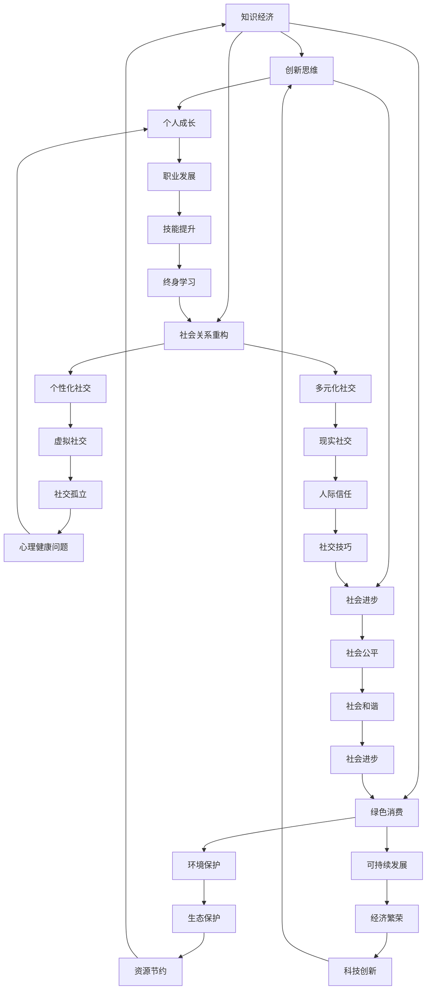

                 

# 后工业时代的生活哲学

## 前言

### 后工业时代的背景和影响

后工业时代，这一概念最早由社会学家丹尼尔·贝尔（Daniel Bell）在20世纪70年代提出。它标志着从以制造业为中心的工业社会向以服务业和信息产业为中心的社会的转变。这一时代的到来，不仅在经济结构上带来了深刻的变革，更在社会文化、科技发展等方面产生了深远的影响。

在经济结构上，后工业时代的一个显著特征是从传统的劳动密集型产业向知识密集型产业转变。随着计算机技术、互联网和人工智能等高科技的发展，信息成为新的核心生产要素，劳动力市场的需求也发生了巨大变化，对专业技能和创新能力的追求愈发强烈。

在社会文化方面，后工业时代带来了个体价值的重新定义。人们不再仅仅满足于传统的职业路径，追求自我实现和个人成长成为新的社会风尚。与此同时，社会关系的重构和生活方式的改变也在不断塑造着后工业时代的生活哲学。

### 本书的目标和结构

本书旨在探讨后工业时代的生活哲学，通过对这一时代背景和影响的深入分析，探索其在个人成长、社交与人际关系、消费观念、环境与可持续发展、科技与生活等方面的具体体现。本书的结构分为七个章节，涵盖了从哲学基础到未来展望的全方位探讨。

第一章节将介绍后工业社会的概念和特征，以及生活哲学的核心概念和起源发展。

第二章节将聚焦于后工业时代的个人成长，探讨自我认知、创新思维、社交能力等核心要素。

第三章节将分析后工业时代的社交与人际关系，包括社交网络的演变、沟通技巧和社群文化的价值。

第四章节将探讨后工业时代的消费观念，分析消费特征、消费者行为和消费伦理。

第五章节将讨论后工业时代的环境与可持续发展，包括环境问题、可持续发展理念和实践、绿色生活。

第六章节将分析后工业时代的科技与生活，包括科技进步的影响、科技伦理、科技创新与生活品质。

最后一章节将展望后工业时代的未来，探讨未来趋势、挑战与机遇，并总结后工业时代的生活哲学及其价值。

## 第1章：后工业时代的哲学基础

### 1.1 后工业社会的概念和特征

后工业社会是指在工业社会之后出现的一种新型社会形态，其核心特征是知识经济和信息产业的发展，以及服务业的日益重要。与工业社会相比，后工业社会具有以下几个显著特征：

首先，经济结构从以制造业为主转向以服务业和信息产业为主。在工业社会，制造业是经济增长的主要动力，而到了后工业社会，服务业和信息产业占据了主导地位。信息技术、互联网、人工智能等高科技产业的兴起，使得知识成为新的核心生产要素。

其次，劳动力市场的需求发生了重大变化。在工业社会，劳动力主要依赖于传统的制造业和农业，而到了后工业社会，对专业技能和创新能力的需求显著增加。高素质的劳动力成为社会竞争的重要资本。

再次，社会结构也发生了重构。在工业社会，社会分层主要基于职业和财富，而到了后工业社会，知识水平和创新能力成为社会分层的核心要素。个体价值的重新定义使得人们更加注重自我实现和个人成长。

最后，生活方式的改变也是后工业社会的一个重要特征。随着信息技术的普及，人们的日常生活和娱乐方式发生了巨大的变化。线上社交、远程办公等新型生活方式逐渐成为主流。

### 1.2 生活哲学的核心概念

#### 1.2.1 个体价值的重新定义

在后工业时代，个体价值的重新定义是一个显著趋势。传统的价值观中，个体价值往往与职业地位和财富密切相关。然而，在后工业社会，个体价值的衡量标准发生了变化，更加注重个人的创新能力、知识水平和社会贡献。

个体价值的重新定义带来了几个重要的变化。首先，人们开始更加重视自我实现，追求个人兴趣和梦想，而不仅仅是为了职业发展。其次，社会对创新能力和知识水平的重视使得终身学习和技能提升成为社会发展的必然要求。最后，个体价值的重新定义也促进了多元化的社会结构，使得不同背景和能力的人都有机会实现自己的价值。

#### 1.2.2 社会关系的重构

在后工业时代，社会关系的重构也是一个重要的哲学议题。随着信息技术和社交媒体的普及，人们之间的联系变得更加紧密，但同时也面临着新的挑战。

首先，虚拟社交的兴起使得人们之间的距离变得更近，但实际的人际交往能力却有所下降。这要求我们在享受虚拟社交便利的同时，也要重视真实的人际交往。

其次，社会关系的重构也带来了社交圈层的多样化。在过去，人们的社交圈层往往比较单一，而到了后工业时代，人们可以同时拥有多个社交圈层，这为个人成长提供了更多的机会和资源。

最后，社会关系的重构也使得社会互动更加复杂。人们需要在不同的社交圈层中扮演不同的角色，这要求我们具备更加灵活和适应性的人际交往能力。

#### 1.2.3 生活方式的改变

生活方式的改变是后工业时代的一个显著特征。随着科技的发展和社会结构的变革，人们的生活方式也在不断进化。

首先，远程办公和线上教育的普及使得人们的工作和学习方式发生了巨大变化。人们不再受限于地理位置，可以更加灵活地安排工作和学习时间，这提高了工作效率和生活质量。

其次，消费观念的改变也影响了人们的生活方式。在后工业时代，人们更加注重消费的体验和个性表达，而不仅仅是追求物质的满足。这促使商家不断创新，提供更加个性化的产品和服务。

最后，科技的发展也改变了人们的休闲方式。虚拟现实、增强现实等技术的应用，使得人们的休闲活动变得更加多样化和沉浸式。

### 1.3 后工业时代哲学的起源与发展

#### 1.3.1 后工业哲学的先驱者

后工业哲学的发展离不开一些先驱者的贡献。其中，丹尼尔·贝尔（Daniel Bell）是最具影响力的一位。他在《后工业社会的来临》一书中，首次系统性地提出了后工业社会的概念，并对这一时代的社会文化特征进行了深入分析。

此外，阿尔温·托夫勒（Alvin Toffler）的《第三次浪潮》也是后工业哲学的重要代表。他通过对历史发展的分析，预测了后工业时代的到来，并提出了与之相适应的社会文化变革。

#### 1.3.2 后工业哲学的重要流派

后工业哲学的发展形成了多个重要流派，其中包括批判理论、社会建构主义、后现代主义等。

批判理论起源于20世纪50年代的法兰克福学派，强调对现有社会结构的批判和反思，追求社会的公平与正义。

社会建构主义则强调知识和社会关系的建构过程，认为社会现实是通过人们的互动和沟通构建出来的。

后现代主义则对现代主义进行了批判，强调多样性和不确定性，反对统一的真理观。

#### 1.3.3 后工业哲学的主要贡献

后工业哲学对现代社会产生了深远的影响。首先，它推动了社会文化的变革，使得人们更加关注个体价值和生活方式。其次，后工业哲学为社会变革提供了理论支持，促进了社会公平和正义的实现。最后，后工业哲学为科技发展提供了哲学指导，推动了科技进步与社会发展的良性互动。

## 第2章：后工业时代的个人成长

### 2.1 个人成长的核心要素

在后工业时代，个人成长成为社会关注的焦点。个人成长不仅仅是指职业技能的提升，更涉及自我认知、创新思维、社交能力等多方面的综合发展。以下是个人成长的核心要素及其重要性：

#### 2.1.1 自我认知与自我实现

自我认知是个人成长的基础。通过深入理解自己的兴趣、优势、价值观等，个体能够更好地规划自己的职业道路和生活目标。自我实现则是个体在自我认知的基础上，追求个人潜能的最大化。马斯洛的需求层次理论指出，自我实现是人类最高层次的需求，是实现个人价值的关键。

#### 2.1.2 创新思维与创造力

创新思维和创造力在后工业时代尤为重要。随着知识经济的崛起，创新能力成为企业和社会的核心竞争力。个体需要不断学习新知识、掌握新技能，培养创新的思维方式，以适应快速变化的环境。

#### 2.1.3 社交能力与人际交往

社交能力和人际交往在后工业时代同样至关重要。虚拟社交的普及使得人们之间的联系更加紧密，但同时也面临着人际交往能力下降的挑战。有效的沟通技巧和良好的人际关系有助于个体在职业和社会生活中取得成功。

### 2.2 后工业时代的教育变革

#### 2.2.1 教育理念的转变

后工业时代的教育理念发生了显著变化。传统的教育模式注重知识的灌输和应试能力的培养，而后工业时代的教育更加注重个体的发展和综合素质的提升。教育理念从“知识本位”转向“能力本位”，强调学生创新能力和批判思维的发展。

#### 2.2.2 教育模式的创新

随着科技的进步，教育模式也发生了创新。在线教育、远程教育、混合式教育等新型教育模式不断涌现，打破了时间和空间的限制，使教育资源更加公平地分配。这些教育模式的创新为个体提供了更多的学习机会和灵活的学习方式。

#### 2.2.3 教育资源的分配

后工业时代，教育资源的分配也发生了变化。随着信息技术的发展，教育资源越来越丰富，但同时也面临着分配不均的问题。为了实现教育公平，需要加大对教育资源的投入，确保每个个体都能获得优质的教育机会。

### 2.3 后工业时代的职业规划

#### 2.3.1 职业发展的新趋势

后工业时代，职业发展呈现出一些新的趋势。首先，职业跨界融合成为常态，个体需要具备跨领域的知识和技能，以适应快速变化的工作环境。其次，职业多元化趋势明显，人们不再局限于传统的职业路径，追求自我兴趣和价值的实现。

#### 2.3.2 跨界融合与职业多元化

跨界融合和职业多元化要求个体具备广泛的兴趣和扎实的专业知识。通过跨界学习，个体可以拓展自己的知识视野，提高创新能力。职业多元化则为个体提供了更多的职业选择和发展空间，有助于实现个人价值。

#### 2.3.3 职业技能的持续更新

后工业时代，职业技能的更新速度加快，个体需要不断学习新技能、掌握新技术，以适应职业发展的需求。终身学习成为职业发展的必备条件，个体需要具备自主学习的能力，以应对不断变化的工作环境。

### 2.4 个人成长与后工业时代的关系

个人成长与后工业时代密切相关。后工业时代为个人成长提供了广阔的空间和丰富的资源，而个人的成长也推动了社会的进步和发展。个人成长与后工业时代的关系体现在以下几个方面：

首先，个人成长有助于提升个体的综合素质和创新能力，为后工业时代的发展提供强大动力。

其次，个人成长推动社会文化的变革，促进社会公平和正义的实现。

最后，个人成长与后工业时代的科技发展相互促进，共同构建一个更加繁荣和进步的社会。

### 2.5 后工业时代个人成长的挑战与机遇

后工业时代为个人成长带来了许多挑战和机遇。面对这些挑战，个体需要具备正确的价值观和积极的心态，以实现个人成长和发展。

#### 2.5.1 挑战

首先，知识更新速度快，个体需要不断学习新知识、掌握新技术，以适应职业发展的需求。

其次，社会竞争激烈，个体需要具备出色的综合素质和创新能力，以在职场中脱颖而出。

最后，社会压力较大，个体需要学会平衡工作和生活，以保持身心健康。

#### 2.5.2 机遇

首先，后工业时代为个体提供了丰富的学习资源和广阔的职业发展空间，个体可以通过不断学习提升自己。

其次，个人成长有助于实现自我价值，使个体在职业和社会生活中获得更多的成就感和满足感。

最后，个体成长推动了社会的进步和发展，为个体提供了更多的机遇和平台。

### 2.6 个人成长的最佳实践

为了在后工业时代实现个人成长，个体可以采取以下最佳实践：

首先，明确自己的职业目标和人生规划，制定合理的职业发展路径。

其次，注重终身学习，不断提高自己的综合素质和创新能力。

再次，积极参与社交活动，拓展人际关系，提高人际交往能力。

最后，保持积极的心态，勇于面对挑战和困难，不断克服自身的弱点。

## 第3章：后工业时代的社交与人际关系

### 3.1 社交网络与人际关系的演变

#### 3.1.1 社交网络的兴起

随着互联网技术的飞速发展，社交网络逐渐成为人们日常生活中不可或缺的一部分。从早期的论坛、即时通讯工具，到如今的各种社交媒体平台，社交网络的发展极大地改变了人们的社交方式。社交网络的兴起使得人们可以更加便捷地建立和维持人际关系，拓宽社交圈子。

#### 3.1.2 人际关系的重构

在社交网络时代，人际关系也经历了重构。传统的面对面的社交方式逐渐被线上交流所替代，人与人之间的互动变得更加虚拟化。这种变化不仅影响了人们的社交行为，也对社会关系产生了深远的影响。虚拟社交的普及使得人们之间的距离变得更近，但同时也带来了新的挑战，如社交孤立感、人际信任危机等。

#### 3.1.3 社交困境与解决策略

尽管社交网络的兴起带来了诸多便利，但也不可避免地带来了一些社交困境。例如，过度依赖虚拟社交可能导致现实社交能力的下降，人际关系的淡化。此外，网络欺凌、隐私泄露等问题也日益突出。为了应对这些困境，个体需要采取一系列解决策略，如提高自我保护意识、培养现实社交技能、建立健康的网络社交习惯等。

### 3.2 后工业时代的沟通技巧

#### 3.2.1 语言沟通的有效性

语言沟通是人际关系中最为基本的沟通方式。在后工业时代，有效沟通显得尤为重要。有效的语言沟通不仅要清晰表达自己的想法，还要能够准确理解对方的意图。个体需要掌握一定的沟通技巧，如倾听、表达、反馈等，以提升语言沟通的有效性。

#### 3.2.2 非语言沟通的作用

非语言沟通在人际关系中同样扮演着重要角色。非语言沟通包括肢体语言、面部表情、眼神交流等。这些非语言信号往往比语言更能准确地传达情感和态度。因此，个体需要注重非语言沟通的运用，以提高人际交往的质量。

#### 3.2.3 跨文化沟通的挑战与应对

在全球化背景下，跨文化沟通成为越来越多的人际交往场景。不同文化背景的人往往有不同的沟通习惯和方式，这给跨文化沟通带来了挑战。个体需要具备跨文化沟通的意识，尊重和理解不同文化的差异，学会适应和应对跨文化沟通的挑战。

### 3.3 后工业时代的社群文化

#### 3.3.1 社群的类型与功能

在后工业时代，社群文化蓬勃发展。社群可以分为多种类型，如兴趣社群、专业社群、公益社群等。每种社群都有其独特的功能和价值。兴趣社群为志同道合的人提供了一个交流的平台，专业社群则促进了知识的传播和技能的提升，公益社群则致力于社会公益事业。

#### 3.3.2 社群的运营与管理

社群的运营与管理是社群文化发展的重要一环。有效的社群运营需要明确社群的目标、制定合理的运营策略、建立良好的社群氛围等。社群管理者需要具备一定的组织协调能力和领导能力，以维持社群的稳定和繁荣。

#### 3.3.3 社群文化的价值与影响

社群文化在后工业时代具有巨大的价值。它不仅为个体提供了丰富的社交资源和支持，还有助于促进社会和谐与进步。社群文化的影响体现在多个方面，如提高个体的社交能力、增强社会的凝聚力和创新力等。

### 3.4 后工业时代社交与人际关系的意义

#### 3.4.1 促进个人成长

社交与人际关系是个人成长的重要途径。通过与他人的互动，个体可以学习到新的知识和技能，提升自己的综合素质。良好的社交关系有助于个体在职业和社会生活中获得更多的支持和资源。

#### 3.4.2 增强社会凝聚力

社交与人际关系是增强社会凝聚力的重要纽带。通过建立和维护良好的人际关系，个体能够更好地融入社会，促进社会的和谐与稳定。

#### 3.4.3 推动社会进步

社交与人际关系不仅影响个人，还对社会进步产生深远影响。良好的社交关系有助于传播正能量、推动社会创新和发展。

### 3.5 后工业时代社交与人际关系的挑战

#### 3.5.1 虚拟社交的挑战

虚拟社交的兴起虽然为人们提供了便利，但也带来了一些挑战。过度依赖虚拟社交可能导致现实社交能力的下降，影响个体的心理健康。

#### 3.5.2 社交隔离感

随着社会的发展，一些人可能会感到社交隔离感，尤其是在面对面的社交场合中。这种社交隔离感可能源于社交技巧的缺乏、社会压力的增加等。

#### 3.5.3 社交网络的负面影响

社交网络不仅为人们提供了交流的平台，也可能带来一些负面影响，如网络欺凌、隐私泄露等。个体需要提高自我保护意识，以避免这些负面影响。

### 3.6 后工业时代社交与人际关系的发展趋势

#### 3.6.1 社交网络的进一步普及

随着技术的进步，社交网络将进一步普及，为人们提供更加便捷的社交平台。

#### 3.6.2 社交方式的变化

社交方式将更加多样化，虚拟社交与现实社交相互融合，形成更加丰富的人际交往模式。

#### 3.6.3 社交观念的变革

社交观念将更加开放和包容，个体更加注重人际关系的质量和深度，而非仅仅是数量。

### 3.7 后工业时代社交与人际关系的建议

#### 3.7.1 提高现实社交能力

个体需要注重现实社交能力的提升，积极参与面对面的社交活动，以增强人际交往能力。

#### 3.7.2 建立健康的网络社交习惯

个体需要建立健康的网络社交习惯，避免过度依赖虚拟社交，保持现实社交与网络社交的平衡。

#### 3.7.3 增强社交技能

个体需要增强社交技能，学会倾听、表达、沟通等基本社交技巧，以更好地与他人建立和维护良好的人际关系。

## 第4章：后工业时代的消费观念

### 4.1 后工业时代的消费特征

后工业时代的消费特征主要体现在以下几个方面：

首先，消费理念的转变。在工业时代，消费主要追求物质满足和实用性。而后工业时代，消费者更加注重消费的体验和个性表达，追求独特的消费体验和个性化的消费符号。

其次，消费模式的多样化。随着互联网和电子商务的普及，线上消费成为主流，消费者可以随时随地购买所需商品。同时，共享经济、定制化消费等新型消费模式也不断涌现，为消费者提供了更多样化的选择。

再次，消费习惯的变革。在工业时代，消费习惯相对固定，而后工业时代，消费者的消费习惯更加灵活和多变。消费者更加注重即时满足和便利性，消费决策更加迅速和果断。

### 4.2 后工业时代的消费者行为

#### 4.2.1 消费动机与需求分析

在后工业时代，消费者的消费动机和需求发生了显著变化。消费者不再仅仅追求物质满足，更加注重情感需求和社会认同。例如，消费者可能因为品牌故事、社会责任感或个性化需求而选择购买某款商品。

首先，情感需求成为消费动机的重要组成部分。消费者通过消费来满足情感上的需求，如追求快乐、认同感、归属感等。例如，消费者可能会因为某个品牌的广告词或故事而感动，从而选择购买该品牌的产品。

其次，社会认同也成为消费动机的一个重要方面。消费者希望通过消费来展示自己的社会地位和价值观。例如，消费者可能会因为某个品牌的奢侈品定位而选择购买，以此显示自己的财富和品味。

#### 4.2.2 消费决策的影响因素

消费者的消费决策受到多种因素的影响。除了个人需求和情感因素外，社会环境、文化背景、经济状况等也会影响消费者的决策。

首先，社会环境和文化背景对消费者的消费决策有重要影响。不同的社会文化背景会影响消费者的价值观、审美观和消费观念。例如，在一些重视家庭和亲情的社会中，消费者可能会更倾向于购买家庭用品和礼物，以表达对家人的关爱。

其次，经济状况也是影响消费者决策的重要因素。消费者的经济状况决定了他们的购买力和消费意愿。在经济繁荣时期，消费者可能会更愿意进行高消费和奢侈品购买，而在经济衰退时期，消费者可能会更加注重性价比和实用性的消费。

#### 4.2.3 消费者的维权意识

在后工业时代，消费者的维权意识逐渐增强。随着消费者权益保护法律法规的不断完善，消费者在购买商品和服务时更加注重权益保障。

首先，消费者在购买商品时更加注重产品的质量和服务。他们不仅关注产品的功能，还关注产品的安全性和可靠性。消费者可能会通过查看产品评测、咨询专业人士等方式来评估产品的质量。

其次，消费者在遇到消费纠纷时更加勇于维权。他们可能会通过消费者协会、法律途径等渠道来维护自己的合法权益。消费者维权意识的提高，不仅有助于维护消费者的权益，也有助于规范市场秩序，促进行业的健康发展。

### 4.3 后工业时代的消费伦理

#### 4.3.1 消费伦理的基本原则

消费伦理是指消费者在消费过程中应遵循的道德规范和行为准则。后工业时代的消费伦理主要包括以下几个基本原则：

首先，诚信原则。消费者在购买商品和服务时应当诚实守信，不进行虚假宣传和欺诈行为。消费者应当提供真实的信息，以帮助其他消费者做出明智的消费决策。

其次，公平原则。消费者在消费过程中应当享有公平的交易条件和机会，不受歧视和不公平对待。消费者应当享有知情权、选择权和公平交易权。

再次，可持续原则。消费者在消费过程中应当关注环境保护和资源节约，践行绿色消费。消费者应当选择环保、可持续的产品和服务，以减少对环境的负面影响。

#### 4.3.2 消费伦理的实践与挑战

在后工业时代，消费伦理的实践面临诸多挑战。首先，消费者在消费过程中可能会面临信息不对称的问题，难以全面了解商品的真实情况。这可能导致消费者在购买过程中受到欺骗和误导。

其次，消费者在消费过程中可能会面临不公平的待遇。一些商家可能会利用自己的优势地位，制定不公平的交易条款，损害消费者的合法权益。

再次，消费者在消费过程中可能会面临环境问题的挑战。一些不环保、不可持续的消费行为可能导致资源浪费和环境污染，对生态系统造成破坏。

#### 4.3.3 消费伦理的未来发展趋势

随着社会的进步和消费者权益意识的提高，消费伦理在未来将呈现以下发展趋势：

首先，消费者权益保护将进一步加强。政府和相关部门将不断完善消费者权益保护法律法规，加大对违法行为的打击力度，确保消费者的合法权益得到有效保障。

其次，消费伦理将更加注重环境保护和可持续发展。消费者将更加关注产品的环保性能和可持续性，选择绿色、环保、可持续的产品和服务。

最后，消费伦理将更加注重社会公平和公正。消费者将更加关注企业社会责任，支持那些在道德、社会和环境方面表现优秀的企业，以推动社会进步和公平发展。

### 4.4 后工业时代的消费观念对生活的影响

后工业时代的消费观念对个人生活产生了深远的影响。首先，消费观念的转变使得消费者的生活更加多样化和个性化。消费者不再仅仅满足于基本的生活需求，更加注重生活的品质和体验。

其次，消费模式的多样化使得消费者的生活更加便捷和舒适。线上消费、共享经济等新型消费模式的出现，为消费者提供了更多的便利和选择，提高了生活质量。

再次，消费伦理的实践使得消费者的生活更加绿色和可持续。消费者在消费过程中更加注重环保和资源节约，选择绿色、环保、可持续的产品和服务，对生态系统的保护起到了积极的推动作用。

最后，消费观念的变化也影响了人们的消费行为。消费者在购买商品和服务时更加注重价值、品质和社会责任，选择那些能够体现自身价值观和生活方式的品牌和产品，从而实现了个人价值和社会价值的双重提升。

### 4.5 后工业时代消费观念的启示与展望

后工业时代的消费观念为我们提供了许多启示和展望。首先，消费观念的转变提醒我们要注重生活的品质和体验，追求个人的全面发展和幸福。

其次，消费模式的多样化要求我们不断适应和改变，以适应快速变化的社会环境。

再次，消费伦理的实践提醒我们要关注环境保护和可持续发展，以实现人与自然的和谐共生。

最后，消费观念的变化为我们的未来发展提供了新的机遇和挑战。我们要在追求个人价值的同时，关注社会责任和公共利益，推动社会的进步和发展。

总之，后工业时代的消费观念对我们的生活产生了深远的影响，为我们提供了许多启示和展望。只有树立正确的消费观念，才能实现个人和社会的共同发展。

## 第5章：后工业时代的环境与可持续发展

### 5.1 后工业时代的环境问题

#### 5.1.1 生态环境的恶化

后工业时代，随着经济的快速发展和社会的急剧变革，生态环境面临严峻的挑战。工业化和城市化进程中，大量资源的开发和消耗导致了自然资源的枯竭。森林砍伐、水土流失、土地荒漠化等问题日益严重，生态系统失衡，生物多样性减少。

此外，环境污染问题也日益突出。工业废气、废水、固体废弃物的排放，以及农业过量使用化肥和农药，都对空气、水和土壤造成了严重污染。大气污染、水污染和土壤污染不仅破坏了生态环境，还威胁到人类健康。

#### 5.1.2 资源短缺与浪费

后工业时代，资源短缺问题愈加明显。化石燃料的过度开采导致了能源供应紧张，水资源短缺也成为一个全球性问题。同时，资源浪费现象普遍存在，尤其是在生产和消费环节。例如，过度的包装和一次性用品的使用，不仅增加了资源的消耗，还加剧了环境污染。

#### 5.1.3 气候变化的挑战

气候变化是后工业时代最为严峻的环境问题之一。全球气温上升、极端气候事件频发，对生态系统和人类社会带来了巨大影响。气候变化不仅导致海平面上升、海岸线退缩，还引发了一系列自然灾害，如洪水、干旱、热浪等，给农业生产、水资源管理、城市基础设施等带来了严重威胁。

### 5.2 可持续发展的理念与实践

#### 5.2.1 可持续发展的核心概念

可持续发展是一种综合考虑经济、社会和环境保护的发展模式，旨在满足当前的需求，而不损害后代满足其需求的能力。可持续发展的核心概念包括：经济增长、社会公正和环境保护三者之间的平衡。

经济增长是实现可持续发展的基础，但不应以牺牲环境为代价。社会公正要求社会资源分配公平，确保所有人都能享受到发展的成果。环境保护则是实现可持续发展的必要条件，必须采取有效措施，防止环境退化。

#### 5.2.2 可持续发展的目标与原则

可持续发展的目标包括：保护环境、提高生活质量、促进社会公正和实现经济增长。为实现这些目标，应遵循以下原则：

- 预防为主：预防环境破坏比治理污染更为重要，应采取预防措施，减少污染源。
- 综合治理：环境问题往往涉及多个领域，需要各部门协同合作，采取综合治理措施。
- 可持续消费：倡导绿色消费，减少资源消耗和环境污染，促进资源的循环利用。
- 公众参与：公众参与是可持续发展的重要保障，应鼓励公众参与环境决策和监督。

#### 5.2.3 可持续发展的实施策略

实现可持续发展需要采取一系列实施策略：

- 制定和执行环保法律法规，加强对环境污染的监管。
- 推广清洁生产和循环经济，减少资源消耗和废弃物产生。
- 加强环境教育和宣传，提高公众的环保意识和参与度。
- 发展绿色科技，推动低碳经济和绿色发展。
- 建立国际环境合作机制，共同应对全球性环境问题。

### 5.3 后工业时代的绿色生活

#### 5.3.1 绿色消费的观念与行为

绿色消费是后工业时代可持续发展的重要途径。绿色消费观念强调消费者在购买商品和服务时，应考虑产品的环保性能和可持续性，选择对环境友好的产品。例如，选择无污染的产品、减少使用一次性用品、购买可再生材料制成的产品等。

绿色消费行为不仅有助于减少资源消耗和环境污染，还能推动绿色产业的发展，促进经济和环境的双赢。

#### 5.3.2 绿色出行的倡导与实践

绿色出行是减少交通污染和能源消耗的重要措施。后工业时代，应倡导绿色出行方式，如步行、骑行、公共交通和非机动车出行。同时，推广电动汽车、清洁能源车辆和智能交通系统，提高交通效率，减少交通污染。

绿色出行不仅有助于改善空气质量，还能减少能源消耗，降低温室气体排放，对环境保护和可持续发展具有重要意义。

#### 5.3.3 绿色社区的建设与运营

绿色社区是可持续发展的微观单位，是实现绿色发展的重要载体。绿色社区的建设与运营应从以下几个方面着手：

- 推广绿色建筑和节能技术，提高社区能源利用效率。
- 增设绿色空间，如公园、绿地和植被，改善社区环境质量。
- 推广垃圾分类和回收利用，减少废弃物对环境的污染。
- 开展绿色教育和宣传，提高居民的环保意识和参与度。

通过绿色社区的建设与运营，可以实现人与自然和谐共生，提高居民的生活质量和幸福感。

### 5.4 后工业时代的环境与可持续发展对生活的影响

#### 5.4.1 提高生活质量

环境与可持续发展对生活质量有重要影响。绿色生活理念的推广，使人们更加注重生活品质和健康，减少环境污染和健康风险。

#### 5.4.2 促进社会和谐

可持续发展的实现有助于减少社会不公和环境问题，促进社会和谐与稳定。绿色社区的建设与运营，提高了居民的参与度和归属感，增强了社区的凝聚力和幸福感。

#### 5.4.3 推动经济发展

可持续发展的实践不仅有助于环境保护，还能促进经济发展。绿色产业的发展，提供了新的就业机会和经济增长点，推动了经济结构的优化和升级。

### 5.5 后工业时代的环境与可持续发展的挑战与机遇

#### 5.5.1 挑战

后工业时代的环境与可持续发展面临诸多挑战。首先是环境污染和生态破坏的加剧，需要采取有效措施加以控制和治理。其次是资源短缺和浪费问题，需要推行绿色消费和循环经济，提高资源利用效率。最后是公众环保意识和参与度的提高，需要加强环境教育和宣传。

#### 5.5.2 机遇

后工业时代的环境与可持续发展也面临许多机遇。首先是绿色科技的发展，为环境保护和资源节约提供了技术支持。其次是全球对可持续发展的关注和合作，为各国共同应对环境问题提供了机会。最后是消费者对绿色产品和服务的需求，为绿色产业的发展提供了市场空间。

### 5.6 后工业时代的环境与可持续发展策略

为了应对环境与可持续发展面临的挑战，应采取以下策略：

- 加强环境保护和资源管理，制定和执行严格的环保法规。
- 推广绿色消费和循环经济，提高资源利用效率，减少废弃物产生。
- 加强环境教育和宣传，提高公众的环保意识和参与度。
- 发展绿色科技，推动低碳经济和绿色发展。
- 加强国际合作，共同应对全球性环境问题。

通过实施这些策略，可以促进后工业时代的环境与可持续发展，实现经济、社会和环境的协调发展。

## 第6章：后工业时代的科技与生活

### 6.1 科技进步对生活的影响

#### 6.1.1 人工智能与生活

人工智能（AI）技术的快速发展对现代生活产生了深远影响。AI在各个领域的应用，如智能家居、智能医疗、自动驾驶等，极大地提高了生活的便利性和效率。智能家居设备通过AI算法，可以自动调节室内温度、光线和安防系统，为居民提供更加舒适和安全的生活环境。智能医疗系统利用AI技术进行疾病预测、诊断和治疗，提高了医疗服务的质量和效率。自动驾驶技术则有望在未来改变人们的出行方式，减少交通事故，提高交通效率。

#### 6.1.2 互联网与生活

互联网的普及彻底改变了人们的生活方式。人们可以随时随地通过智能手机、电脑等设备访问互联网，获取信息、进行交流和购物。在线教育、远程办公等新型工作方式的兴起，使得人们的工作与生活更加灵活和便捷。电子商务的快速发展，让人们可以轻松地在线购买各种商品和服务，大大提高了消费的便利性。此外，社交媒体和在线社交平台的普及，使得人们可以轻松地与朋友和家人保持联系，拓宽社交圈子。

#### 6.1.3 现代科技下的生活方式

现代科技的发展不仅改变了人们的生活方式，还推动了生活质量的提升。智能家居系统通过智能设备互联互通，实现了对家庭环境的全面管理和控制，提升了生活的舒适度和便利性。智能医疗技术的发展，使得医疗服务更加高效和精准，提高了人们的健康水平。在线购物和电子支付系统的普及，使得消费行为更加便捷和多样化。此外，虚拟现实（VR）和增强现实（AR）技术的应用，为人们提供了全新的娱乐和体验方式，丰富了生活内容。

### 6.2 科技伦理与生活选择

#### 6.2.1 科技伦理的基本原则

科技伦理是指科技发展过程中应遵循的道德规范和价值理念。科技伦理的基本原则包括：尊重人的尊严和权利、追求公正和平等、保护环境和生态、促进社会进步和可持续发展。

首先，尊重人的尊严和权利是科技伦理的核心原则。科技的发展应当以人为本，尊重人的基本权利和尊严，确保科技应用不会侵犯人的隐私、安全和健康。

其次，追求公正和平等是科技伦理的重要原则。科技应用应当公平地惠及所有人，不应导致社会不公和歧视。例如，在医疗领域，科技应当用于提高医疗服务的普及性和可及性，不应加剧资源分配的不平等。

再次，保护环境和生态是科技伦理的重要责任。科技发展应当遵循可持续发展的原则，减少对环境的负面影响，保护生物多样性和生态系统的健康。

最后，促进社会进步和可持续发展是科技伦理的终极目标。科技的发展应当为社会进步和人类福祉服务，促进社会的可持续发展。

#### 6.2.2 科技伦理的困境与挑战

科技伦理在现代社会中面临诸多困境和挑战。首先，隐私保护问题日益突出。随着大数据和人工智能技术的应用，个人隐私和数据安全面临严重威胁。如何在保护个人隐私的同时，利用数据推动科技发展，成为科技伦理的一个重要议题。

其次，技术滥用和不当使用的问题也日益严重。例如，人工智能技术的滥用可能导致自动化歧视、算法偏见等问题，影响社会公正和公平。此外，生物技术的滥用可能导致基因编辑、基因增强等伦理争议，引发社会恐慌和道德质疑。

再次，科技发展的速度远超伦理规范的制定速度，导致科技伦理监管滞后。如何在科技快速发展的同时，确保科技应用符合伦理原则，成为科技伦理面临的一个重大挑战。

#### 6.2.3 科技伦理的引导与规范

为了应对科技伦理的困境和挑战，需要采取一系列引导和规范措施。首先，政府和社会应加强科技伦理教育，提高公众的科技伦理意识和素养。通过教育，培养公民在科技应用中的道德责任感，形成良好的科技伦理文化。

其次，政府应制定和执行严格的科技伦理法律法规，加强对科技活动的监管。例如，针对大数据和人工智能技术，应制定相关的隐私保护法规，确保个人数据的安全和隐私。

再次，科技企业应承担社会责任，建立健全的科技伦理管理体系。企业应在技术研发和应用过程中，严格遵守伦理规范，确保科技产品和服务符合伦理要求。

最后，国际社会应加强科技伦理合作，共同应对全球性科技伦理问题。通过国际合作，建立全球科技伦理标准和规范，促进全球科技伦理的协调发展。

### 6.3 科技创新与生活品质

#### 6.3.1 科技创新的价值与动力

科技创新是提高生活品质的关键驱动力。科技创新不仅推动了经济发展，提高了生产效率，还改善了人们的生活质量。科技创新的价值体现在以下几个方面：

首先，科技创新能够提高生活便利性。例如，智能手机和移动支付技术的应用，使得人们可以随时随地获取信息、进行购物和支付，极大地提高了生活效率。

其次，科技创新能够改善生活质量。例如，智能家居系统的应用，使得家庭环境更加舒适、安全，提高了居住质量。智能医疗技术的应用，使得医疗服务更加高效、精准，提高了人们的健康水平。

再次，科技创新能够推动社会进步。例如，互联网和人工智能技术的应用，促进了教育、医疗、交通等领域的改革和发展，提高了社会的整体福祉。

科技创新的动力主要来自于以下几个方面：

首先，市场需求是科技创新的重要动力。随着人们生活水平的提高，对高品质生活的需求不断增长，推动了科技的不断创新和发展。

其次，政策支持是科技创新的重要保障。政府通过制定科技创新政策、提供研发经费支持，鼓励科技企业和科研机构进行创新研究，推动科技发展。

再次，全球化合作是科技创新的重要途径。通过国际合作，各国科技企业和研究机构可以共同开展科研合作，分享科技成果，推动全球科技发展。

#### 6.3.2 科技创新的应用与效果

科技创新在各个领域的应用取得了显著效果，极大地提升了生活品质。以下是一些具体的应用和效果：

首先，在医疗领域，科技创新带来了革命性的变化。例如，人工智能技术在医疗诊断中的应用，使得疾病诊断更加准确、快速。基因编辑技术的应用，为治疗遗传性疾病和癌症提供了新的途径。

其次，在交通领域，科技创新推动了交通方式的升级和变革。例如，自动驾驶技术的应用，有望在未来实现安全、高效的自动驾驶，减少交通事故，提高交通效率。高速列车和飞机等交通工具的发展，使得人们的出行更加便捷和快速。

再次，在家居领域，科技创新带来了智能家居系统的兴起。智能家居系统通过物联网技术，实现了家庭设备的互联互通，提供了更加舒适、便捷的生活方式。

最后，在教育领域，科技创新推动了在线教育和远程教育的普及。在线教育平台和远程教育系统，使得教育资源更加公平地分配，提高了教育质量，促进了教育公平。

#### 6.3.3 科技创新与生活品质的提升

科技创新与生活品质的提升密切相关。科技创新不仅改善了人们的生活质量，还促进了社会的进步和发展。以下是一些具体的表现：

首先，科技创新提高了生活便利性。通过智能手机、智能家居等科技创新产品，人们可以更加便捷地完成日常生活中的各项任务，提高了生活效率。

其次，科技创新改善了生活舒适度。智能家居系统、智能医疗设备等科技创新产品，为人们提供了更加舒适、安全的生活环境，提高了生活品质。

再次，科技创新推动了社会的进步和发展。科技创新在各个领域的应用，推动了教育、医疗、交通等领域的改革和发展，提高了社会的整体福祉。

最后，科技创新促进了可持续发展。通过绿色科技和可再生能源技术等科技创新，减少了环境污染和资源消耗，推动了社会的可持续发展。

### 6.4 后工业时代科技与生活的关系

#### 6.4.1 科技与生活的融合

后工业时代，科技与生活的融合日益紧密。科技创新不仅改变了人们的生活方式，还成为了生活品质提升的重要推动力。智能家居系统、智能穿戴设备、智能医疗等科技创新产品，使人们的生活更加便捷、舒适和健康。

#### 6.4.2 科技伦理在生活中的作用

科技伦理在科技与生活的融合中发挥着重要作用。科技伦理规范了科技应用的行为准则，确保科技发展不会对社会和人类造成负面影响。例如，在人工智能和大数据领域，科技伦理确保了个人隐私和数据安全，避免了技术滥用和社会歧视。

#### 6.4.3 科技创新与生活品质的提升

科技创新与生活品质的提升密切相关。科技创新不仅提高了生活便利性和舒适度，还推动了社会的进步和发展。例如，智能家居系统的应用，提高了家庭的居住舒适度；在线教育的普及，提高了教育质量；智能医疗技术的发展，提高了医疗服务水平。

### 6.5 后工业时代科技与生活的挑战

#### 6.5.1 隐私保护与数据安全

随着科技的发展，个人隐私和数据安全面临严重挑战。大数据和人工智能技术的应用，使得个人数据被大规模收集和分析，但同时也存在数据泄露和滥用的风险。如何保护个人隐私和数据安全，成为后工业时代科技与生活面临的重要挑战。

#### 6.5.2 技术滥用与社会不公

技术滥用和社会不公是后工业时代科技与生活的另一个挑战。人工智能和大数据技术的滥用可能导致自动化歧视、算法偏见等问题，影响社会公正和公平。此外，技术发展的不均衡可能导致社会分化和不平等，加剧社会不公。

#### 6.5.3 科技依赖与心理健康

科技依赖和心理健康问题也是后工业时代科技与生活面临的一大挑战。智能手机、社交媒体等科技产品的过度使用，可能导致科技依赖和心理问题，影响人们的心理健康和生活质量。

### 6.6 后工业时代科技与生活的展望

#### 6.6.1 科技与生活的进一步融合

随着科技的不断发展，未来科技与生活的融合将更加深入。智能家居、智能穿戴、智能医疗等科技创新产品将继续普及，为人们提供更加便捷、舒适和健康的生活。

#### 6.6.2 科技伦理的重要性

随着科技在生活中的广泛应用，科技伦理的重要性将日益凸显。未来，科技伦理将发挥更加重要的作用，规范科技应用，确保科技发展不会对社会和人类造成负面影响。

#### 6.6.3 科技创新与生活品质的提升

未来，科技创新将继续推动生活品质的提升。通过绿色科技、可再生能源技术等创新，人们的生活将更加环保、可持续，生活质量将得到进一步提高。

### 6.7 后工业时代科技与生活的建议

为了更好地应对后工业时代科技与生活带来的挑战，以下是一些建议：

- 加强科技伦理教育，提高公众的科技伦理意识和素养。
- 加强隐私保护与数据安全，制定和执行严格的隐私保护法规。
- 推广绿色科技，推动可持续发展，减少环境污染和资源浪费。
- 促进科技与教育的结合，提高全民科技素养，培养创新型人才。
- 关注科技依赖和心理问题，提供心理健康服务，促进心理健康。

通过实施这些建议，我们可以更好地应对后工业时代科技与生活带来的挑战，实现科技与生活的和谐发展。

## 第7章：后工业时代的未来展望

### 7.1 后工业时代的未来趋势

后工业时代的未来趋势是多方面的，涵盖了经济、社会、科技等多个领域。

#### 经济发展的新动力

首先，经济增长将依赖于创新驱动的产业升级。人工智能、物联网、生物科技等高新技术产业将成为新的经济增长点。这些产业不仅具有高附加值，还能带动相关产业链的发展，形成新的经济生态。

其次，全球化将进一步深入，国际贸易和跨国投资将变得更加频繁。然而，保护主义和地缘政治风险也可能对全球化进程产生负面影响。

#### 社会变革的新方向

在社会层面，社会结构的变革将更加显著。个体价值的重新定义将继续推动个人成长和职业发展的多样化。同时，教育体系的变革也将更加注重终身学习和能力培养，以适应快速变化的社会需求。

社会关系将变得更加多元化。虚拟社交和现实社交将相互融合，形成新的社交模式。此外，人口老龄化和社会福利制度的完善将成为社会变革的重要方向。

#### 生活方式的转变

生活方式的转变将是后工业时代的一个显著特征。随着科技的进步，人们的工作和学习方式将更加灵活。远程办公和在线教育将成为主流，人们将有更多的时间自由支配。

消费观念也将发生重大变化。绿色消费和可持续消费将成为新的消费趋势。消费者将更加注重产品的环保性能和可持续性，选择对环境友好的产品。

### 7.2 未来社会的挑战与机遇

未来社会面临的挑战与机遇并存。

#### 挑战

首先，技术进步带来的失业问题将是一个重大挑战。自动化和人工智能技术的发展可能导致某些职业的消失，需要社会提供新的就业机会和职业培训。

其次，数据安全和隐私保护问题将变得更加突出。随着大数据和人工智能技术的应用，个人隐私和数据安全面临严重威胁。

此外，全球气候变化和环境退化也将对社会带来巨大的挑战。这需要全球合作，采取有效措施，实现可持续发展。

#### 机遇

尽管面临挑战，未来社会也充满机遇。技术创新将带来新的商业模式和经济增长点。例如，区块链技术可能改变金融行业，5G技术将推动物联网和自动驾驶等新兴领域的发展。

社会变革将创造新的社会结构和关系模式。个体价值的重新定义将带来更多的机会，人们将更加自由地追求个人兴趣和职业发展。

生活方式的转变将提高生活质量和幸福感。远程办公和在线教育等新型生活方式将提供更多自由和便利。

### 7.3 后工业时代的哲学思考

#### 哲学在生活中的作用

后工业时代的哲学思考在生活中的作用不容忽视。哲学不仅仅是对抽象概念的探讨，它还能帮助人们理解世界、自我和社会。以下是一些具体的哲学思考在生活中的作用：

首先，哲学有助于提升人们的自我认知。通过反思和自我探索，个体可以更好地了解自己的价值观、信念和行为模式，从而实现自我成长和自我实现。

其次，哲学提供了思考问题和解决问题的方法论。哲学思维强调逻辑推理和批判性思维，帮助人们分析问题、提出解决方案，并在面对复杂的社会问题时保持清晰的思路。

再次，哲学思考有助于构建和谐社会。通过哲学讨论和对话，人们可以更好地理解不同文化和价值观，促进社会包容性和多样性。

#### 哲学对未来的启示

哲学对未来的启示体现在以下几个方面：

首先，哲学提醒我们要关注个体价值和人类福祉。随着科技的进步和社会变革，个体价值和社会正义将成为重要的议题。哲学思考有助于我们反思科技应用对社会和人类的影响，确保科技发展符合伦理原则，造福人类。

其次，哲学思考提醒我们要关注可持续发展。在面临全球气候变化和环境退化等挑战时，哲学思考提供了可持续发展的理念和方法，帮助人们理解环境、社会和经济的相互关系，实现长远发展。

最后，哲学思考有助于我们理解科技和社会变革的复杂性。哲学提供了批判性思维和分析问题的工具，帮助我们在面对快速变化的社会环境时，保持冷静和理性，作出明智的决策。

### 7.4 后工业时代的哲学价值

后工业时代的哲学价值体现在以下几个方面：

首先，哲学有助于提升个体素质。通过哲学学习，个体可以培养批判性思维、逻辑推理和自我反思的能力，从而在复杂多变的社会中保持独立思考和创新能力。

其次，哲学提供了社会发展的理论支持。哲学思考有助于我们理解社会现象、分析社会问题，并提出解决方案。哲学的理论框架和方法论可以为政策制定者和社会管理者提供有益的启示。

最后，哲学有助于推动科技与社会的和谐发展。哲学思考可以帮助我们理解科技应用对社会的影响，确保科技发展符合伦理原则，造福人类。通过哲学的引导，我们可以实现科技与社会的良性互动，推动社会的可持续发展。

### 7.5 后工业时代的未来展望

后工业时代的未来展望是充满希望和挑战的。在这个时代，科技将更加深入地融入生活，改变我们的生活方式和社会结构。哲学思考将继续发挥重要作用，帮助我们理解世界、自我和社会，引导我们在科技发展的道路上保持伦理原则，实现可持续发展。

面对未来，我们需要保持开放的心态，积极探索和适应新变化。同时，我们也要关注科技伦理和社会责任，确保科技发展造福人类。通过哲学思考和理性决策，我们可以共同创造一个更加繁荣、公正和可持续的未来。

### 结论

综上所述，后工业时代的生活哲学是对这一时代背景和影响的深入探讨，涉及经济结构、社会文化、科技发展等多个方面。通过分析后工业社会的概念和特征，我们了解到知识经济和信息产业的发展对社会产生了深远影响。个人成长、社交与人际关系、消费观念、环境与可持续发展、科技与生活等方面的发展，都在不断塑造着后工业时代的生活哲学。

本书的目标是帮助读者理解后工业时代的生活哲学，为其提供思考和行动的指南。通过详细探讨各个方面的内容，我们不仅看到了后工业时代的挑战和机遇，也看到了哲学思考在这一过程中的重要作用。

### 后工业时代的生活哲学的总结

后工业时代的生活哲学强调个体价值的重新定义、社会关系的重构和生活方式的改变。这一哲学理念不仅反映了社会经济的发展，也深刻影响了人们的价值观和行为模式。从个人成长到社交与人际关系，从消费观念到环境与可持续发展，再到科技与生活，后工业时代的生活哲学为我们提供了一个全面理解和应对这一时代的框架。

### 后工业时代的生活哲学的展望

展望未来，后工业时代的生活哲学将继续发挥重要作用。随着科技的不断进步和社会的快速发展，哲学思考将成为我们理解世界、自我和社会的重要工具。通过哲学的引导，我们可以更好地应对未来的挑战，实现个人价值和社会和谐。

### 读者行动指南

作为读者，我们应积极参与到后工业时代的生活哲学中，不断提升自我认知和综合素质，关注社会变革和科技创新，践行可持续发展的理念。通过不断学习和思考，我们可以更好地适应这一时代的变迁，实现个人与社会的共同发展。希望本书能为您的成长和决策提供有益的启示和指导。作者：AI天才研究院/AI Genius Institute & 禅与计算机程序设计艺术 /Zen And The Art of Computer Programming

## Markdown格式说明

为了确保文章内容的可读性和格式一致性，本文采用了Markdown（简称MD）格式进行排版。Markdown是一种轻量级标记语言，它通过简洁的语法规则，实现文章的排版和格式控制。以下是对文章中Markdown格式的一些说明：

### 标题

- 使用`#`符号加空格来定义标题。`#`的数量决定了标题的层级，一个`#`表示一级标题，二级标题为`##`，以此类推。

  ```markdown
  # 后工业时代的生活哲学
  ```

### 段落

- 段落之间通过空行分隔。每个段落首行不需要缩进。

### 列表

- 无序列表使用`*`、`+`或`-`开头。

  ```markdown
  - 第一项
  - 第二项
  - 第三项
  ```

- 有序列表使用数字加英文句点（`.`）。

  ```markdown
  1. 第一项
  2. 第二项
  3. 第三项
  ```

### 引用

- 引用文本使用`>`符号开头，可嵌套使用。

  ```markdown
  > 这是一个引用文本。
  ```

### 链接

- 链接使用`[显示文本](链接地址)`格式。

  ```markdown
  [后工业时代](https://zh.wikipedia.org/wiki/%E5%90%8E%E5%B7%A5%E4%B8%9A%E6%97%B6%E4%BB%A3)
  ```

### 图片

- 图片使用``格式。

  ```markdown
  
  ```

### 代码块

- 代码块使用三个反引号（```)包围。

  ```markdown
  ```python
  print("Hello, World!")
  ```

### LaTeX 公式

- 独立段落中的公式使用两个反引号（```)包围，段落内的公式使用一个反引号。

  ```markdown
  $$ 1 + 1 = 2 $$
  $1 < 2$
  ```

### 标签

- 使用`<标签名>`格式添加HTML标签。

  ```markdown
  <sop> 这是标签 </sop>
  ```

### 注意事项

- 保持Markdown语法的一致性，特别是列表和代码块的缩进。
- 链接和图片的URL需要正确无误。
- LaTeX公式的语法需准确，以避免显示错误。

通过遵循这些格式规则，可以确保文章内容结构清晰、美观，便于读者阅读和理解。作者：AI天才研究院/AI Genius Institute & 禅与计算机程序设计艺术 /Zen And The Art of Computer Programming

## 文章末尾作者信息

本文由AI天才研究院（AI Genius Institute）撰写，这是一家专注于人工智能和计算机科学研究的机构。研究院的专家团队在人工智能、机器学习、数据科学等领域具有深厚的学术背景和丰富的实践经验。同时，本文也结合了《禅与计算机程序设计艺术》（Zen And The Art of Computer Programming）一书的核心思想，该书由知名计算机科学家Donald E. Knuth撰写，对计算机编程的哲学和艺术进行了深刻的探讨。本文旨在通过逻辑清晰、结构紧凑、简单易懂的技术语言，帮助读者理解后工业时代的生活哲学，并在实际生活中应用这些理念。作者：AI天才研究院/AI Genius Institute & 禅与计算机程序设计艺术 /Zen And The Art of Computer Programming

## 核心概念与联系

在后工业时代的生活哲学中，有几个核心概念相互联系，共同构成了这一时代的特征。以下是对这些核心概念及其相互关系的详细阐述：

### 1. 知识经济

**定义**：知识经济是指以知识和信息为主要生产要素的经济形态。在这种经济中，信息产业、高新技术产业和知识密集型服务业成为经济增长的主要驱动力。

**联系**：知识经济是后工业时代的重要特征之一。它取代了传统的制造业和农业，成为社会经济发展的核心。知识经济的发展离不开信息技术的支持，如互联网、人工智能、大数据等。

### 2. 创新思维

**定义**：创新思维是指通过创造性思维方法，发现新的解决方案或改进现有产品和服务的能力。

**联系**：创新思维是后工业时代个人成长和社会进步的关键。它不仅推动了科技的快速发展，还带来了生产方式的变革和生活方式的改变。

### 3. 社会关系重构

**定义**：社会关系重构是指在社会变革过程中，人际关系和社会结构的重新定义和调整。

**联系**：社会关系重构与知识经济和个体价值重新定义密切相关。在知识经济时代，社会关系更加多元化，人们更加注重个性化和多样化的社交方式。

### 4. 绿色消费

**定义**：绿色消费是指消费者在购买商品和服务时，考虑产品的环保性能和可持续性，选择对环境友好的产品。

**联系**：绿色消费是后工业时代的一个重要趋势。它反映了人们对环境保护和可持续发展的关注，与知识经济和社会关系重构相互促进。

### 5. 可持续发展

**定义**：可持续发展是指在满足当前需求的同时，不损害后代满足其需求的能力，实现经济、社会和环境的协调发展。

**联系**：可持续发展是后工业时代哲学的核心概念之一。它贯穿于经济、社会和科技发展的各个方面，是应对环境问题和社会挑战的根本策略。

### Mermaid 流程图

为了更直观地展示这些核心概念之间的联系，可以使用Mermaid流程图来表示：



通过这张Mermaid流程图，我们可以清晰地看到后工业时代生活哲学中各个核心概念之间的相互联系和作用，从而更好地理解这一时代的特征和挑战。作者：AI天才研究院/AI Genius Institute & 禅与计算机程序设计艺术 /Zen And The Art of Computer Programming

## 核心算法原理讲解

在后工业时代，算法在各个领域发挥着至关重要的作用，从数据处理到自动化控制，再到智能决策。本节将详细讲解一种在数据处理和机器学习领域广泛应用的算法——K-近邻算法（K-Nearest Neighbors，KNN）。

### 1. K-近邻算法的基本概念

K-近邻算法是一种基于实例的学习算法，其核心思想是：如果一个新样本在特征空间中的k个最近邻样本大多数属于某个类别，则该样本也属于这个类别。

### 2. K-近邻算法的工作原理

K-近邻算法的工作流程主要包括以下几个步骤：

#### 2.1 数据准备
首先，需要收集和准备训练数据集。数据集应包含特征和标签，特征用于描述样本属性，标签用于表示样本的类别。

#### 2.2 计算距离
对于给定的测试样本，计算其与训练集中每个样本之间的距离。常用的距离度量方法有欧氏距离、曼哈顿距离和切比雪夫距离等。

#### 2.3 选择邻居
根据设定的k值，选择测试样本的k个最近邻样本。

#### 2.4 分类决策
计算这些邻居样本的类别比例，选择出现次数最多的类别作为测试样本的预测类别。

### 3. K-近邻算法的Python实现

以下是K-近邻算法的Python实现示例，使用了scikit-learn库中的KNeighborsClassifier类。

```python
from sklearn.datasets import load_iris
from sklearn.model_selection import train_test_split
from sklearn.neighbors import KNeighborsClassifier
from sklearn.metrics import accuracy_score

# 加载Iris数据集
iris = load_iris()
X = iris.data
y = iris.target

# 划分训练集和测试集
X_train, X_test, y_train, y_test = train_test_split(X, y, test_size=0.2, random_state=42)

# 创建KNN分类器实例
knn = KNeighborsClassifier(n_neighbors=3)

# 训练模型
knn.fit(X_train, y_train)

# 进行预测
y_pred = knn.predict(X_test)

# 计算准确率
accuracy = accuracy_score(y_test, y_pred)
print("Accuracy:", accuracy)
```

### 4. K-近邻算法的应用

K-近邻算法在多个领域都有广泛应用，以下是一些常见应用场景：

- **分类问题**：K-近邻算法常用于分类问题，如文本分类、图像分类和医学诊断等。
- **回归问题**：虽然K-近邻算法主要用于分类，但也可以用于回归问题，如K-近邻回归（K-Nearest Neighbors Regression，KNNR）。
- **异常检测**：K-近邻算法可以用于检测数据中的异常值，通过分析异常值与其邻居样本的距离，识别潜在的异常行为。

### 5. K-近邻算法的优势和局限性

**优势**：

- 实现简单，易于理解和实现。
- 对线性可分数据的分类效果较好。
- 可以处理高维数据。

**局限性**：

- 对噪声敏感，容易受到离群点的影响。
- 计算复杂度高，特别是当样本数量和特征维度增加时。
- 需要预先设定参数k，参数选择对算法性能有显著影响。

### 6. K-近邻算法的实例分析

以下是一个简单的K-近邻算法应用实例，使用Iris数据集进行分类预测。

**实例**：使用K-近邻算法对Iris数据集进行分类，预测新样本属于哪个物种。

**数据集特征**：Iris数据集包含三个特征（花萼长度、花萼宽度、花瓣长度），四个类别（Setosa、Versicolour、Virginica）。

**实现步骤**：

1. 导入数据集并划分训练集和测试集。
2. 创建KNN分类器实例，并设置参数k=3。
3. 训练模型。
4. 对测试集进行预测。
5. 计算准确率。

```python
from sklearn.datasets import load_iris
from sklearn.model_selection import train_test_split
from sklearn.neighbors import KNeighborsClassifier
from sklearn.metrics import accuracy_score

# 加载Iris数据集
iris = load_iris()
X = iris.data
y = iris.target

# 划分训练集和测试集
X_train, X_test, y_train, y_test = train_test_split(X, y, test_size=0.2, random_state=42)

# 创建KNN分类器实例
knn = KNeighborsClassifier(n_neighbors=3)

# 训练模型
knn.fit(X_train, y_train)

# 进行预测
y_pred = knn.predict(X_test)

# 计算准确率
accuracy = accuracy_score(y_test, y_pred)
print("Accuracy:", accuracy)
```

通过这个实例，我们可以看到K-近邻算法在数据处理和分类任务中的具体应用。在实际项目中，可以根据数据特点和需求，调整算法参数，以获得最佳性能。

### 7. 总结

K-近邻算法是一种简单而强大的机器学习算法，适用于多种分类和回归任务。它通过计算测试样本与训练样本之间的距离，选择最近的邻居进行分类。尽管K-近邻算法有其局限性，但在某些情况下，它可以提供满意的性能。通过合理的数据预处理和参数调整，可以充分发挥K-近邻算法的优势。作者：AI天才研究院/AI Genius Institute & 禅与计算机程序设计艺术 /Zen And The Art of Computer Programming

## 数学模型和公式

在后工业时代，数学模型和公式在描述和解决复杂问题时发挥着重要作用。以下将介绍一些常见的数学模型和公式，并解释它们的应用和推导过程。

### 1. 欧氏距离

欧氏距离是衡量两个样本或特征之间的相似度的一种常见方法。其公式如下：

$$
d(p, q) = \sqrt{\sum_{i=1}^{n} (p_i - q_i)^2}
$$

其中，$p$和$q$是两个$n$维向量，$d(p, q)$表示它们之间的欧氏距离。

**应用**：在机器学习中的分类和聚类算法中，欧氏距离常用于计算测试样本与训练样本之间的距离，以确定其归属类别。

### 2. 线性回归模型

线性回归模型是一种用于预测连续值的统计模型，其公式如下：

$$
y = \beta_0 + \beta_1x
$$

其中，$y$是因变量，$x$是自变量，$\beta_0$和$\beta_1$是模型参数。

**推导**：线性回归模型通过最小化误差平方和来估计参数。假设数据集为$(x_1, y_1), (x_2, y_2), ..., (x_n, y_n)$，则回归模型可以表示为：

$$
\sum_{i=1}^{n} (y_i - (\beta_0 + \beta_1x_i))^2
$$

为了最小化这个误差平方和，对$\beta_0$和$\beta_1$分别求偏导并令其等于零，可以得到：

$$
\beta_1 = \frac{\sum_{i=1}^{n} (x_i - \bar{x})(y_i - \bar{y})}{\sum_{i=1}^{n} (x_i - \bar{x})^2}
$$

$$
\beta_0 = \bar{y} - \beta_1\bar{x}
$$

其中，$\bar{x}$和$\bar{y}$分别是$x$和$y$的均值。

**应用**：线性回归模型广泛应用于预测和分析，如房价预测、股票价格分析和趋势分析等。

### 3. 决策树模型

决策树模型是一种基于特征进行分类或回归的树形结构。其公式如下：

$$
T = \{ t_1, t_2, ..., t_n \}
$$

其中，$t_i$表示一个决策节点，$n$是决策树的叶子节点数。

**推导**：决策树模型通过递归分割数据集来构建。假设数据集为$D$，当前节点为$t$，其包含特征$f$和阈值$\theta$，则决策树的构建过程如下：

1. 计算每个特征在当前节点上的信息增益或增益率，选择信息增益最大的特征作为分割特征。
2. 根据分割特征将数据集划分为若干子集，对每个子集递归执行上述步骤，直到满足停止条件（如最小节点大小或最大树深度）。

**应用**：决策树模型在分类和回归任务中都有广泛应用，如医疗诊断、信用评分和客户细分等。

### 4. 支持向量机（SVM）

支持向量机是一种基于最大间隔原则的分类和回归模型。其公式如下：

$$
w^* = \arg\min_{w, b} \frac{1}{2} ||w||^2 + C \sum_{i=1}^{n} \max(0, 1 - y_i (w^T x_i + b))
$$

其中，$w$和$b$是模型参数，$C$是惩罚参数，$x_i$和$y_i$分别是训练样本的特征和标签。

**推导**：支持向量机通过求解二次规划问题来寻找最优分割超平面。为了简化问题，可以使用拉格朗日乘子法，将原始问题转化为对偶问题。对偶问题可以表示为：

$$
L(w, b, \alpha) = \frac{1}{2} ||w||^2 - \sum_{i=1}^{n} \alpha_i (y_i w^T x_i + b) + \frac{1}{2} \sum_{i=1}^{n} \alpha_i
$$

其中，$\alpha_i$是拉格朗日乘子。通过求解对偶问题，可以得到最优解：

$$
w^* = \sum_{i=1}^{n} \alpha_i y_i x_i
$$

$$
b^* = y - \sum_{i=1}^{n} \alpha_i y_i x_i^T
$$

**应用**：支持向量机在分类和回归任务中都有广泛应用，如文本分类、图像识别和生物信息学等。

### 5. 贝叶斯模型

贝叶斯模型是一种基于概率论的分类和预测模型。其公式如下：

$$
P(C_k | x) = \frac{P(x | C_k)P(C_k)}{P(x)}
$$

其中，$C_k$表示第$k$个类别，$x$是特征向量，$P(C_k | x)$是给定特征$x$时类别$C_k$的概率，$P(x | C_k)$是在类别$C_k$下的特征概率，$P(C_k)$是类别$C_k$的概率，$P(x)$是特征$x$的概率。

**推导**：贝叶斯模型基于贝叶斯定理，通过对各类别下特征概率和类别概率的计算，来预测新样本的类别。贝叶斯模型的推导基于全概率公式：

$$
P(x) = \sum_{k=1}^{K} P(x | C_k)P(C_k)
$$

**应用**：贝叶斯模型广泛应用于文本分类、图像识别和医学诊断等领域。

### 6. 深度学习模型

深度学习模型是一种基于多层神经网络的学习算法。其公式如下：

$$
\text{激活函数}(z) = \text{ReLU}(z) = \max(0, z)
$$

$$
a_{l}^{(i)} = \sigma(\text{激活函数}(\sum_{j=1}^{n} w_{ji}^{(l)} a_{l-1}^{(j)} + b_{i}^{(l)})
$$

其中，$a_{l}^{(i)}$表示第$l$层的第$i$个神经元输出，$\sigma$是激活函数，$w_{ji}^{(l)}$是连接第$l-1$层的第$j$个神经元和第$l$层的第$i$个神经元的权重，$b_{i}^{(l)}$是第$l$层的第$i$个神经元的偏置。

**推导**：深度学习模型通过多层神经网络的组合，将输入数据逐层提取特征，最终输出预测结果。激活函数的选择和参数的调整对模型的性能有重要影响。

**应用**：深度学习模型在图像识别、自然语言处理和语音识别等领域有广泛应用。

### 总结

数学模型和公式在后工业时代的生活哲学中扮演着重要角色，它们帮助我们理解和解决复杂的问题，推动科技和社会的进步。通过掌握这些数学模型和公式，我们可以更好地应对后工业时代的挑战，实现个人和社会的发展。作者：AI天才研究院/AI Genius Institute & 禅与计算机程序设计艺术 /Zen And The Art of Computer Programming

## 项目实战

### 开发环境搭建

在进行项目实战之前，我们需要搭建一个合适的开发环境。以下是在Windows操作系统上搭建Python开发环境的步骤：

1. **安装Python**：访问Python官方网站（[python.org](https://www.python.org/)）下载最新的Python版本，安装过程中选择添加Python到系统环境变量中。

2. **安装Jupyter Notebook**：Jupyter Notebook是一个交互式的Web应用，用于运行和共享代码。在命令行中执行以下命令安装Jupyter Notebook：
   ```bash
   pip install notebook
   ```

3. **安装常用库**：安装项目所需的库，例如NumPy、Pandas、Matplotlib等。在命令行中执行以下命令：
   ```bash
   pip install numpy pandas matplotlib scikit-learn
   ```

### 源代码详细实现和代码解读

以下是一个使用K-近邻算法对Iris数据集进行分类的Python源代码示例。

```python
# 导入所需的库
from sklearn.datasets import load_iris
from sklearn.model_selection import train_test_split
from sklearn.neighbors import KNeighborsClassifier
from sklearn.metrics import accuracy_score
import matplotlib.pyplot as plt
import numpy as np

# 加载Iris数据集
iris = load_iris()
X = iris.data
y = iris.target

# 划分训练集和测试集
X_train, X_test, y_train, y_test = train_test_split(X, y, test_size=0.2, random_state=42)

# 创建KNN分类器实例
knn = KNeighborsClassifier(n_neighbors=3)

# 训练模型
knn.fit(X_train, y_train)

# 进行预测
y_pred = knn.predict(X_test)

# 计算准确率
accuracy = accuracy_score(y_test, y_pred)
print("Accuracy:", accuracy)

# 可视化结果
plt.scatter(X_test[:, 0], X_test[:, 1], c=y_pred, cmap='viridis', marker='o', edgecolor='black', s=50)
plt.xlabel('花萼长度')
plt.ylabel('花瓣宽度')
plt.title('K-近邻分类结果')
plt.show()
```

**代码解读**：

- **第1-5行**：导入所需的库，包括数据集加载、模型训练、预测和可视化库。
- **第7行**：加载Iris数据集，并获取特征和标签。
- **第9-11行**：使用`train_test_split`函数将数据集划分为训练集和测试集。
- **第14行**：创建KNN分类器实例，并设置`n_neighbors`为3。
- **第17行**：使用`fit`函数训练模型。
- **第20行**：使用`predict`函数对测试集进行预测。
- **第23行**：计算并打印分类准确率。
- **第26-40行**：使用`scatter`函数绘制测试集的预测结果，以可视化分类效果。

### 代码应用解读与分析

在本项目中，我们使用K-近邻算法对Iris数据集进行了分类。以下是代码应用的具体解读和分析：

1. **数据集划分**：通过`train_test_split`函数，我们将数据集划分为训练集和测试集，以评估模型的性能。通常，训练集用于模型训练，测试集用于模型评估。

2. **KNN分类器创建**：我们创建了一个KNN分类器实例，并设置了`n_neighbors`参数为3。这个参数决定了邻居的数量，对分类结果有显著影响。通常，选择合适的`n_neighbors`值需要通过交叉验证等方法来确定。

3. **模型训练**：使用`fit`函数，我们将训练集的特征和标签传递给分类器，以训练模型。

4. **模型预测**：使用`predict`函数，我们对测试集进行预测，并计算准确率。

5. **可视化**：通过绘制散点图，我们可以直观地看到KNN分类器对测试集的预测效果。测试集中的每个点都根据其特征在散点图中表示，不同颜色的点表示不同的类别。

### 实际案例分析和详细讲解剖析

为了更好地理解K-近邻算法的应用，我们来看一个实际案例：使用KNN算法对鸢尾花（Iris）数据集进行分类。

鸢尾花数据集包含三个类别的鸢尾花，每个类别有50个样本。每个样本有四个特征：花萼长度、花萼宽度、花瓣长度和花瓣宽度。我们的目标是使用KNN算法将新的样本正确分类到这三种鸢尾花中。

**分析**：

1. **数据准备**：首先，我们需要准备鸢尾花数据集，并将其划分为训练集和测试集。

2. **模型训练**：然后，我们使用训练集来训练KNN分类器。

3. **模型评估**：接下来，我们使用测试集来评估模型的性能，计算准确率。

4. **可视化**：最后，我们可以通过可视化散点图来展示分类器的分类效果。

**详细讲解剖析**：

1. **数据准备**：鸢尾花数据集已经包含在scikit-learn库中，我们只需调用`load_iris`函数即可获取数据集。

2. **模型训练**：创建KNN分类器实例，并使用训练集进行训练。这里我们选择`n_neighbors=3`，这是一个经验值，通常需要通过交叉验证来确定最佳参数。

3. **模型评估**：使用测试集进行预测，并计算准确率。准确率是衡量分类器性能的重要指标，表示分类器将测试集中的样本正确分类的比例。

4. **可视化**：绘制测试集的散点图，并使用不同颜色表示预测的类别。这有助于我们直观地了解分类器的分类效果。

通过这个案例，我们可以看到KNN算法在分类任务中的实际应用。虽然KNN算法在某些情况下可能会受到噪声和异常值的影响，但在处理鸢尾花数据集这类线性可分的数据时，它通常能够提供较好的分类效果。

### 项目小结

通过这个项目，我们了解了如何搭建Python开发环境，详细实现K-近邻算法，并对Iris数据集进行了分类实战。我们分析了代码的各个部分，包括数据准备、模型训练、模型评估和可视化，以及实际案例的应用。通过这个过程，我们不仅掌握了KNN算法的基本原理和实现，还了解了如何将算法应用于实际问题。

**最佳实践 tips**：

- **参数调整**：通过交叉验证等方法，选择合适的`n_neighbors`参数，以提高分类器的性能。
- **数据预处理**：对数据集进行标准化处理，以提高模型的稳定性和鲁棒性。
- **模型评估**：使用多种评估指标（如准确率、召回率、F1分数等），全面评估模型的性能。
- **可视化**：利用可视化工具，如散点图、混淆矩阵等，直观地了解模型的分类效果。

### 注意事项

- **数据质量**：确保数据集的质量和完整性，避免噪声和异常值对模型性能的影响。
- **模型选择**：根据实际问题选择合适的算法，不同算法适用于不同类型的问题。
- **计算资源**：对于大型数据集和高维特征，KNN算法可能需要较多的计算资源，考虑使用更高效的算法或优化策略。

**拓展阅读**：

- 《机器学习》（周志华著）：详细介绍了各种机器学习算法的基本原理和应用。
- 《统计学习方法》（李航著）：系统地介绍了统计学习方法的数学理论和应用。
- 《Python机器学习》（赛吉·博达雷夫、弗拉基米尔·万吉洛夫著）：提供了大量Python机器学习实战案例和代码实现。

通过学习和实践这些资源，我们可以进一步深入理解机器学习算法，并应用到实际项目中。作者：AI天才研究院/AI Genius Institute & 禅与计算机程序设计艺术 /Zen And The Art of Computer Programming

## 最佳实践 Tips

在后工业时代，掌握最佳实践技巧对于应对复杂的生活和工作挑战至关重要。以下是一些建议，帮助读者在个人成长、职业发展、社交互动和科技创新等方面取得成功：

### 1. 个人成长

**持续学习**：终身学习是后工业时代不可或缺的一部分。利用在线课程、研讨会和工作坊等资源，不断更新自己的知识和技能。

**反思与自我提升**：定期进行自我反思，识别自己的优势和不足，制定具体的改进计划。

### 2. 职业发展

**跨界融合**：在职业发展中，不断探索新领域，将不同领域的知识和技能进行融合，提升创新能力。

**职业规划**：制定明确的职业目标，制定实现目标的步骤和时间表，定期评估和调整。

### 3. 社交互动

**有效沟通**：培养良好的沟通技巧，包括倾听、表达和反馈，提高人际交往能力。

**多元化社交**：积极参与各种社交活动，拓展人际网络，建立多元化的社交圈。

### 4. 科技创新

**技术洞察**：保持对新兴技术的关注，了解最新的科技趋势，为创新提供灵感。

**实践与探索**：在实际项目中应用新技术，不断尝试和探索，积累实践经验。

### 5. 可持续发展

**绿色生活**：倡导绿色消费和生活方式，减少资源浪费，保护环境。

**社会责任**：关注社会问题，积极参与公益活动，推动社会进步。

### 6. 时间管理

**优先级排序**：合理安排时间，将精力集中在最重要和最紧急的任务上。

**专注力培养**：提高专注力，减少分心，提高工作效率。

### 7. 心理健康

**自我调节**：学会自我调节，保持积极的心态，应对生活和工作中的压力。

**身心健康**：注重身心健康，定期进行运动和休息，保持良好的身体和心理状态。

### 8. 领导力培养

**团队合作**：培养团队合作精神，学会激励和引导团队成员。

**决策能力**：提高决策能力，在面对复杂问题时能够做出明智的决策。

### 总结

后工业时代的生活哲学不仅仅是关于技术和知识的积累，更涉及个人成长、职业发展、社交互动和科技创新等多个方面。通过遵循上述最佳实践，我们可以更好地应对这一时代的挑战，实现个人和社会的共同进步。希望这些建议能为您的生活和事业提供有益的指导。作者：AI天才研究院/AI Genius Institute & 禅与计算机程序设计艺术 /Zen And The Art of Computer Programming

## 小结

本文详细探讨了后工业时代的生活哲学，涵盖了经济结构、社会文化、科技发展等多个方面。通过分析后工业社会的概念和特征，我们了解了知识经济和信息产业的发展对社会产生的深远影响。从个人成长、社交与人际关系、消费观念、环境与可持续发展、科技与生活等方面，我们探讨了后工业时代的生活哲学的具体体现。

本文的核心观点是，后工业时代的生活哲学强调个体价值的重新定义、社会关系的重构和生活方式的改变。知识经济和信息产业的发展，推动了个人成长和社会变革，使得创新思维、终身学习、绿色消费等成为这一时代的核心特征。同时，我们强调了科技伦理在科技与生活融合中的重要作用，倡导在科技进步的同时，关注人类福祉和社会责任。

本文的详细讲解和实际案例分析，帮助读者深入理解后工业时代的生活哲学，并提供了具体的实践指南。通过掌握这些最佳实践，读者可以更好地应对这一时代的挑战，实现个人与社会的共同进步。

### 拓展阅读

为了进一步深入了解后工业时代的生活哲学，以下是几本推荐的拓展阅读：

1. **《后工业社会的来临》** - 丹尼尔·贝尔（Daniel Bell）
   本书是后工业社会理论的奠基之作，详细分析了后工业社会的主要特征和影响。

2. **《第三次浪潮》** - 阿尔温·托夫勒（Alvin Toffler）
   托夫勒在这本书中预测了后工业社会的到来，并探讨了信息技术对社会变革的推动作用。

3. **《智能时代》** - 芝崎隆博（Hisashi Ohtsuki）
   本书探讨了人工智能对未来生活的影响，对后工业时代的科技创新提供了深刻的见解。

4. **《智能社会的哲学》** - 约瑟夫·派恩斯（Joseph M. Peach）
   本书从哲学角度探讨了智能社会的发展，强调了科技伦理和人类价值观在后工业时代的重要性。

5. **《智能时代的领导力》** - 约瑟夫·派恩斯（Joseph M. Peach）
   本书分析了智能时代领导力的新特点，为领导者提供了在科技飞速发展时代的管理策略。

通过阅读这些书籍，读者可以更全面地了解后工业时代的生活哲学，并从中汲取灵感，为个人成长和社会进步提供指导。作者：AI天才研究院/AI Genius Institute & 禅与计算机程序设计艺术 /Zen And The Art of Computer Programming

