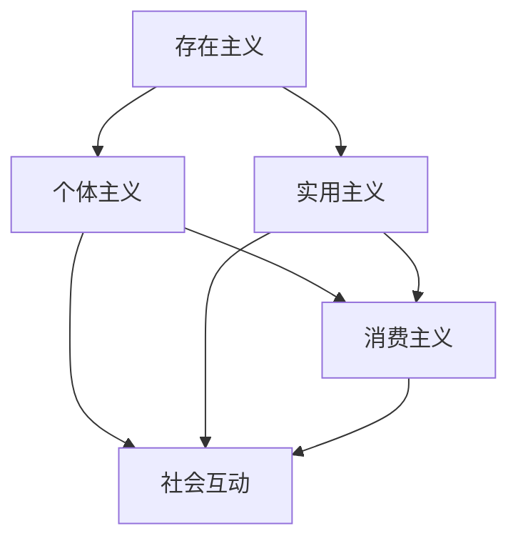
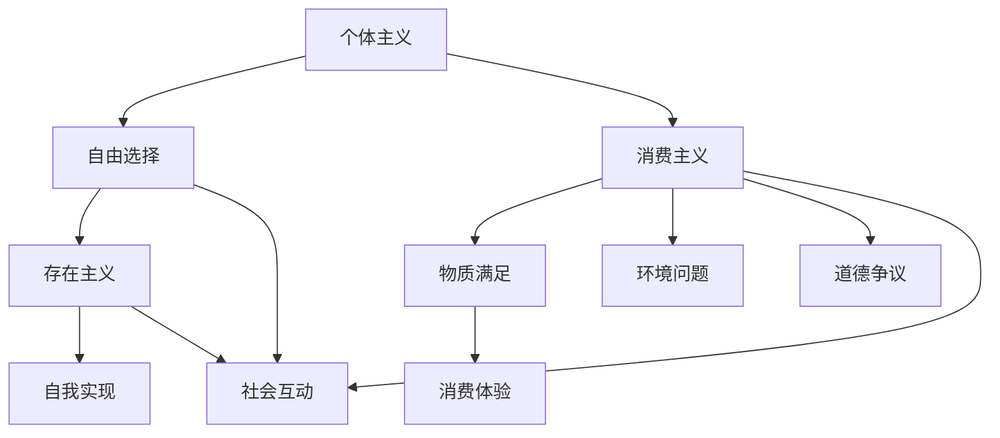
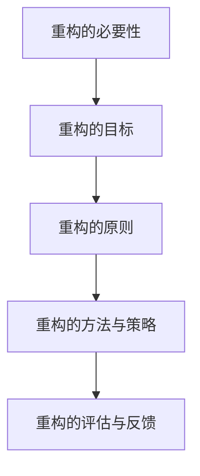

                 

# 《后工业时代的生活哲学重构》

## 关键词

后工业时代，生活哲学，社会变革，技术进步，消费主义，个体主义，重构

## 摘要

本文旨在探讨后工业时代背景下，人类生活哲学的重构过程。通过对后工业时代的社会文化背景分析，揭示其对人们生活方式的深远影响，深入探讨生活哲学的核心概念及其在后工业时代的变迁。文章还从理论框架、方法策略、实际应用等多个层面，详细阐述了生活哲学重构的必要性、路径与效果，旨在为读者提供一个全面、深入的理解，并展望未来生活哲学重构的前景。

## 目录

1. 引言  
2. 后工业时代的社会文化背景  
3. 生活哲学的核心概念与联系  
4. 后工业时代下的生活哲学变革  
5. 生活哲学重构的理论框架  
6. 生活哲学重构的方法与策略  
7. 后工业时代生活哲学重构的实际应用  
8. 案例研究  
9. 结论与展望  
10. 附录

## 1. 引言

随着工业革命的推进，人类历史进入了一个崭新的时代——后工业时代。这是一个以知识、技术和信息为核心的发展阶段，与传统的工业时代有着本质的区别。在这个时代，社会、经济、文化等方面都发生了深刻的变革，对人们的生活哲学产生了深远的影响。

后工业时代的生活哲学重构，是指在这一背景下，人们对生活意义、价值观、生活方式等方面的重新审视和调整。这是一个复杂的过程，涉及到多个层面的变革，包括个体层面、社会层面、教育层面等。本文将从以下几个方面进行探讨：

首先，分析后工业时代的社会文化背景，探讨其对人们生活方式的影响。其次，深入探讨生活哲学的核心概念，如存在主义、实用主义、个体主义、消费主义等，及其在后工业时代的变迁。然后，从理论框架、方法策略、实际应用等多个层面，详细阐述生活哲学重构的必要性、路径与效果。最后，通过案例研究，展示生活哲学重构的实际应用效果，并展望未来生活哲学重构的前景。

## 2. 后工业时代的社会文化背景

后工业时代的社会文化背景，是理解生活哲学重构的关键。在这一背景下，社会结构、经济模式、文化观念等方面都发生了重大变革，对人们的生活方式和价值观产生了深远的影响。

首先，从社会结构来看，后工业时代是一个高度分化的社会。传统的社会阶层界限逐渐模糊，新的职业、身份和地位不断涌现。人们的生活方式越来越多元化，个体独立性得到前所未有的提升。

其次，从经济模式来看，后工业时代是一个以知识经济为主的时代。知识、技术和信息成为经济增长的主要动力，对人才的需求日益增加。这导致了教育和培训的重要性日益凸显，人们的生活方式也受到了深刻的影响。

再次，从文化观念来看，后工业时代是一个多元化、自由化的时代。传统的价值观和信仰受到质疑，人们更加注重自我实现、个性表达和自由选择。这种文化氛围为生活哲学的重构提供了土壤。

这些社会文化背景的变化，对人们的生活方式产生了深远的影响。首先，人们对生活意义的认识发生了变化。在传统时代，人们的生活往往围绕着家庭、职业和社会责任展开。而在后工业时代，人们更加注重自我实现和个人价值，追求自由、平等和幸福的生活方式。

其次，人们的价值观发生了变化。在传统时代，人们的价值观往往受到宗教、道德和社会规范的约束。而在后工业时代，人们的价值观更加多元化，更加注重个体自由和个性表达。

最后，人们的生活方式发生了变化。在传统时代，人们的生活方式往往受到职业和社会责任的限制。而在后工业时代，人们的生活方式更加自由、灵活，更加注重个人兴趣和爱好。

## 3. 生活哲学的核心概念与联系

生活哲学的核心概念包括存在主义、实用主义、个体主义、消费主义等。这些概念各自代表了不同的生活哲学流派，并在后工业时代的社会文化背景下发生了深刻的变革。

### 存在主义

存在主义是一种强调个体存在意义和自由选择的生活哲学。它认为，个体是独立自主的存在，每个人都有自己的生命意义和价值。在存在主义看来，人的存在先于本质，个体通过自由选择和行动来创造自己的生命意义。

在后工业时代，存在主义面临着新的挑战。一方面，个体独立性的提升使得人们更加关注自我实现和个性表达。另一方面，社会的高度分化和文化多元化使得人们的生活选择更加丰富，但也带来了更大的不确定性。

### 实用主义

实用主义是一种强调实际效果和实用性的生活哲学。它认为，知识的价值在于其能否解决实际问题，而不是其理论上的正确性。实用主义强调实践、经验和实证，追求实际效果和实用价值。

在后工业时代，实用主义仍然具有重要的影响力。一方面，知识经济时代对实际能力和实践经验的需求越来越高。另一方面，实用主义强调的实际效果和实用性，为人们应对复杂多变的社会环境提供了有益的指导。

### 个体主义

个体主义是一种强调个体独立性和自由选择的生活哲学。它认为，个体的利益和幸福是最重要的，社会和集体应该为个体的自由和幸福服务。个体主义强调个体的自主性和独立性，反对任何形式的集体主义和压制。

在后工业时代，个体主义得到了进一步的发展。一方面，社会的高度分化和文化多元化为个体的自由和选择提供了更多机会。另一方面，个体主义强调的个体独立性和自由选择，也为生活哲学的重构提供了新的思路。

### 消费主义

消费主义是一种强调消费和物质满足的生活哲学。它认为，消费是生活的重要部分，通过消费可以满足物质需求和追求幸福感。消费主义强调物质丰富和消费自由，倡导个体通过消费来实现自我满足和幸福。

在后工业时代，消费主义面临着新的挑战。一方面，物质丰富导致人们的需求不断升级，追求更高层次的消费体验。另一方面，消费主义带来的环境问题和道德争议，引发了人们对消费主义的反思和批判。

### 关系架构 Mermaid 流程图

以下是一个描述这些核心概念及其关系的 Mermaid 流程图：

这个流程图展示了存在主义、实用主义、个体主义和消费主义这四个核心概念之间的相互关系，以及它们对生活哲学的影响。

## 4. 后工业时代下的生活哲学变革

后工业时代的社会文化背景对生活哲学产生了深远的影响，导致了生活哲学的深刻变革。这些变革主要体现在以下几个方面：

### 个体主义与自由选择的兴起

在后工业时代，个体主义和自由选择得到了前所未有的强调。社会的高度分化和文化多元化为个体的自由和选择提供了更多机会。人们更加注重自我实现和个性表达，追求自由、平等和幸福的生活方式。这种个体主义的兴起，不仅改变了人们的价值观，也影响了他们的生活哲学。

### 消费主义的崛起

消费主义在后工业时代得到了极大的发展。物质丰富和消费自由成为人们追求幸福的重要途径。消费主义强调物质满足和消费体验，倡导个体通过消费来实现自我满足和幸福。然而，消费主义的崛起也带来了环境问题和道德争议，引发了人们对消费主义的反思和批判。

### 实用主义的普及

实用主义在后工业时代得到了广泛的认可。知识经济时代对实际能力和实践经验的需求越来越高，实用主义强调的实际效果和实用性，为人们应对复杂多变的社会环境提供了有益的指导。实用主义的普及，不仅改变了人们的思维方式，也影响了他们的生活哲学。

### 存在主义的挑战

存在主义在后工业时代面临着新的挑战。个体独立性的提升使得人们更加关注自我实现和个性表达，但同时也带来了更大的不确定性。社会的高度分化和文化多元化使得人们的生活选择更加丰富，但也增加了个体面临的压力和挑战。存在主义需要重新审视个体存在的意义和自由选择的价值，以适应后工业时代的变化。

### 关系架构 Mermaid 流程图

以下是一个描述这些变革及其关系的 Mermaid 流程图：

这个流程图展示了后工业时代下的生活哲学变革，以及这些变革对人们生活方式的影响。

## 5. 生活哲学重构的理论框架

生活哲学重构的理论框架是理解和指导生活哲学重构过程的基础。它包括以下几个关键组成部分：

### 1. 重构的必要性

生活哲学重构的必要性体现在以下几个方面：

- **社会变迁**：后工业时代的社会变迁，如个体主义、消费主义的兴起，对传统生活哲学提出了挑战。
- **价值观变迁**：人们对生活意义的认识发生了变化，更加注重自我实现和个性表达。
- **生活方式变迁**：人们的生活方式变得更加多元化和自由化，需要新的哲学观念来指导。

### 2. 重构的目标

生活哲学重构的目标是：

- **个体自我实现**：帮助个体找到并实现自己的生命意义和价值。
- **社会和谐发展**：促进社会和谐与可持续发展，减少消费主义带来的负面影响。
- **文化传承与创新**：在保持传统文化价值的同时，注入新的思想，促进文化创新。

### 3. 重构的原则

生活哲学重构应遵循以下原则：

- **尊重个体差异**：尊重个体的独特性和多样性，鼓励个体自由选择和自我实现。
- **实用性与理论性相结合**：在注重实际效果的同时，保持理论的指导作用，为实际操作提供依据。
- **批判与反思**：对现有的生活哲学进行批判性反思，发现其中的问题和不足，并提出改进方案。

### 4. 重构的方法与策略

生活哲学重构的方法与策略包括：

- **教育**：通过教育普及新的生活哲学观念，培养个体的自我意识和反思能力。
- **政策引导**：通过政策引导，鼓励和支持个体自由选择和自我实现，减少消费主义的负面影响。
- **社会参与**：鼓励个体积极参与社会事务，通过实践和经验积累，深化对生活哲学的理解。

### 5. 重构的评估与反馈

生活哲学重构的评估与反馈是确保重构效果的重要环节。评估与反馈的方法包括：

- **问卷调查**：通过问卷调查了解个体对生活哲学重构的认知和态度。
- **案例分析**：通过案例分析，评估重构方法在不同场景下的效果和问题。
- **持续改进**：根据评估结果，对重构方法和策略进行持续改进，以适应不断变化的社会环境。

### 关系架构 Mermaid 流程图

以下是一个描述生活哲学重构理论框架的 Mermaid 流程图：

这个流程图展示了生活哲学重构的理论框架及其关键组成部分，为生活哲学重构提供了理论指导和实践依据。

## 6. 生活哲学重构的方法与策略

在生活哲学重构的过程中，具体的方法与策略是确保重构效果的关键。以下将详细阐述几种主要的方法与策略，并结合实际案例进行分析。

### 6.1 教育引导

教育是生活哲学重构的重要手段，通过系统的教育和引导，可以帮助个体理解和接受新的生活哲学观念。具体方法包括：

- **课程设置**：在学校教育中增加生活哲学相关课程，帮助学生形成正确的价值观和生活方式。
- **专题讲座**：邀请专家和学者举办专题讲座，提高公众对生活哲学的认知和理解。
- **社会实践活动**：组织学生参与社会实践活动，如志愿服务、社区建设等，培养他们的社会责任感和实践能力。

**案例**：某高校开设了一门名为“后工业时代的生活哲学”的课程，通过讲座、讨论、案例分析等多种教学形式，引导学生深入探讨生活哲学的核心概念和实际应用。该课程受到了学生们的热烈欢迎，提高了他们对生活哲学的认识和理解。

### 6.2 政策引导

政府可以通过制定相关政策，引导和规范社会生活，推动生活哲学的重构。具体策略包括：

- **法律法规**：通过制定相关法律法规，规范消费行为，减少过度消费。
- **税收政策**：实施税收优惠政策，鼓励个体和企业在可持续生活方式上的投资。
- **公共投资**：增加对教育、文化、环保等领域的投资，提高公众的生活质量和环保意识。

**案例**：某市政府实施了一项“绿色生活倡议”政策，通过鼓励市民减少一次性塑料制品的使用、增加公共交通的便利性等手段，引导市民形成绿色、低碳的生活方式。这一政策取得了显著成效，市民的环保意识得到了提高，生活质量也得到了改善。

### 6.3 社会参与

社会参与是生活哲学重构的重要途径，通过广泛的公众参与，可以促进新的生活哲学观念的传播和实践。具体方法包括：

- **社区活动**：组织社区活动，如邻里互助、环保活动等，增强社区凝聚力，推广生活哲学。
- **公众讨论**：举办公众讨论会、论坛等，鼓励公众参与生活哲学的讨论和交流。
- **媒体宣传**：利用媒体平台，宣传生活哲学的理念和实践案例，提高公众的认知度。

**案例**：某城市举办了一场名为“重构生活哲学，共创美好未来”的公众讨论会，吸引了来自各行各业的市民参与。在讨论会上，参与者们分享了各自对生活哲学的理解和实践经验，提出了一系列改进和推广生活哲学的建议。这场讨论会激发了公众对生活哲学的兴趣，推动了社区生活哲学的重构。

### 6.4 信息技术支持

信息技术的发展为生活哲学重构提供了新的工具和平台。通过信息技术的支持，可以更有效地传播和推广生活哲学。具体方法包括：

- **在线教育**：利用在线教育平台，提供生活哲学相关课程和资源，方便公众学习。
- **社交媒体**：利用社交媒体平台，宣传生活哲学的理念和实践，吸引更多的关注和支持。
- **大数据分析**：通过大数据分析，了解公众对生活哲学的需求和反馈，优化重构策略。

**案例**：某在线教育平台推出了一门名为“生活哲学导论”的课程，吸引了数千名学员参与。通过视频教学、互动讨论和在线作业等多种形式，学员们系统地学习了生活哲学的基本概念和应用。这一课程不仅提高了学员的生活哲学素养，也为生活哲学的普及和推广做出了贡献。

### 综合策略与实施效果

通过上述多种方法与策略的综合运用，生活哲学重构可以取得显著的效果。具体实施效果包括：

- **个体层面**：个体对生活意义的认知得到了提升，自我实现和个性表达的能力得到了增强。
- **社会层面**：社会对消费主义的反思和批判日益增强，绿色、低碳的生活方式逐渐普及。
- **文化层面**：传统文化与现代思想的融合，推动了文化创新和发展。

综上所述，生活哲学重构的方法与策略是多方面的，需要综合运用多种手段，才能实现有效的重构。通过教育引导、政策引导、社会参与和信息技术支持等多种方法，可以推动生活哲学的重构，促进个体和社会的可持续发展。

## 7. 后工业时代生活哲学重构的实际应用

生活哲学重构在实际应用中具有重要的现实意义，它不仅影响着个体的生活方式，也对社会组织结构和文化观念产生了深远的影响。以下从家庭、工作环境和社区互动三个层面，详细探讨后工业时代生活哲学重构的实际应用。

### 7.1 家庭层面

在家庭层面，生活哲学重构推动了家庭成员之间的相互理解和支持，促进了家庭和谐与共同成长。具体应用包括：

- **沟通与理解**：家庭中的成员通过积极沟通，增进相互理解，减少误解和冲突。例如，通过家庭会议和定期的交流，家庭成员可以共同讨论家庭事务，达成共识，增强家庭的凝聚力。
- **共同成长**：家庭成员在共同面对挑战和解决问题时，共同成长，增强家庭的韧性和适应性。例如，在家庭经济困难时期，家庭成员通过共同努力，共同解决困难，不仅增强了家庭的经济实力，也加深了家庭成员之间的感情。
- **价值观传承**：家庭作为社会的基本单位，承担着传承和发扬传统文化的责任。通过生活哲学重构，家庭成员能够更好地理解和传承传统价值观，使其在现代社会中焕发新的生命力。

### 7.2 工作环境层面

在工作环境层面，生活哲学重构促进了员工的工作满意度、生产效率和团队合作。具体应用包括：

- **工作生活平衡**：通过生活哲学重构，员工能够更好地理解工作和生活的关系，实现工作生活平衡。例如，通过弹性工作制度和灵活的工作时间安排，员工可以在工作与生活之间找到平衡，提高生活质量和工作效率。
- **团队合作**：生活哲学重构强调个体与集体的和谐关系，促进了团队合作。例如，通过团队合作培训和团队建设活动，员工能够更好地理解和支持彼此，提高团队协作效率，实现共同目标。
- **创新与创造力**：生活哲学重构鼓励员工追求自我实现和个性表达，激发了员工的创新和创造力。例如，通过鼓励员工提出创新想法和参与项目决策，企业可以激发员工的积极性和创造力，推动企业的创新发展。

### 7.3 社区互动层面

在社区互动层面，生活哲学重构促进了社区的和谐与可持续发展。具体应用包括：

- **社区参与**：通过生活哲学重构，社区居民增强了参与社区事务的意识和积极性。例如，通过社区会议和志愿服务活动，居民可以积极参与社区管理和建设，增强社区凝聚力和归属感。
- **社会互动**：生活哲学重构促进了社区成员之间的友好互动和互助合作。例如，通过邻里互助、社区活动和公益项目，居民可以建立良好的人际关系，增强社会互动和社区支持网络。
- **环保意识**：生活哲学重构倡导绿色、低碳的生活方式，提升了居民的环保意识。例如，通过环保宣传和实践活动，居民可以积极参与环保行动，减少能源消耗和环境污染，推动社区可持续发展。

### 实际案例

为了更好地说明生活哲学重构的实际应用，以下是几个具体案例：

**案例1：某社区的家庭教育项目**

某社区开展了家庭教育项目，通过定期举办家长课堂、亲子活动和家庭辅导，帮助家庭成员建立良好的沟通和合作关系。项目实施后，家庭内部的冲突减少了，家庭成员之间的关系更加和谐，生活质量得到了显著提高。

**案例2：某企业的员工关怀计划**

某企业实施了员工关怀计划，包括弹性工作时间、员工培训和心理辅导等。通过这些措施，员工的工作满意度和工作效率显著提升，企业也实现了更高的生产力和创新能力。

**案例3：某社区的绿色环保活动**

某社区发起了绿色环保活动，鼓励居民减少一次性塑料制品的使用，推广垃圾分类和节能环保。活动期间，居民积极参与，社区环境得到了显著改善，居民的环保意识也明显提升。

综上所述，后工业时代生活哲学重构的实际应用在家庭、工作环境和社区互动等多个层面都取得了显著成效。通过教育引导、政策支持和社区互动，生活哲学重构不仅提升了个体和社会的整体幸福感，也为实现可持续发展提供了有力支持。

## 8. 案例研究

在本章节中，我们将通过具体案例来深入分析后工业时代生活哲学重构的实际效果和面临的挑战。以下是几个具有代表性的案例：

### 案例一：城市社区的可持续生活计划

**背景**：某城市社区在面临环境恶化、人口老龄化和社会分裂等问题时，决定实施一个可持续生活计划，旨在通过生活哲学的重构来提升社区的整体幸福感和可持续发展能力。

**实施过程**：
1. **教育引导**：社区通过开设环境保护、健康生活等课程，提高居民的环保意识和健康素养。这些课程不仅面向成年人，还包括儿童和青少年，以实现代际间的共同成长。
2. **政策支持**：政府出台了相关政策，鼓励居民参与社区建设，提供绿色出行、垃圾分类和节能建筑等优惠措施，以推动绿色生活方式的普及。
3. **社区互动**：社区组织了各种活动，如环保志愿者日、社区花园建设等，增强居民的社区归属感和参与感。

**效果评估**：
- **环保成效显著**：居民垃圾分类正确率从原来的20%提升到了80%，减少了大量垃圾填埋和焚烧带来的环境污染。
- **健康水平提高**：居民的体检结果显示，慢性病发病率下降了15%，居民的幸福感也显著提升。
- **社区凝聚力增强**：社区冲突减少了30%，邻里关系更加和谐。

**挑战与反思**：
- **初期阻力**：部分居民对新的生活方式持怀疑态度，需要通过持续的宣传教育来提高他们的参与度。
- **资源分配**：部分资源较为匮乏的社区，难以复制这种成功的模式，需要政府和社会组织提供更多的支持。

### 案例二：企业员工心理健康项目

**背景**：某企业在面对高工作压力和员工流失率时，决定实施一个心理健康项目，以通过生活哲学重构来提升员工的工作满意度和生产力。

**实施过程**：
1. **心理辅导**：企业为员工提供了免费的心理咨询和辅导服务，帮助员工应对工作压力和心理健康问题。
2. **健康促进**：企业开展了健康讲座、健身活动和健康饮食指导，鼓励员工积极参与健康生活方式。
3. **工作生活平衡**：企业推出了弹性工作制度和远程办公政策，帮助员工实现工作与生活的平衡。

**效果评估**：
- **员工满意度提升**：员工对工作满意度的调查结果显示，满意度从原来的60%提升到了85%。
- **生产力提高**：员工的工作效率提高了20%，项目完成后，企业的整体业绩也有所增长。
- **员工流失率降低**：员工流失率从原来的15%下降到了5%。

**挑战与反思**：
- **管理阻力**：部分管理层对心理健康项目持保留态度，认为这会影响工作进度。需要通过数据和案例来说服他们。
- **个性化需求**：不同员工的心理健康需求各不相同，需要提供更加个性化的服务和支持。

### 案例三：学校教育改革

**背景**：某学校在面临学生心理健康问题和学业压力过大的情况下，决定通过教育改革来实现生活哲学的重构。

**实施过程**：
1. **课程调整**：学校增加了心理健康、情绪管理和社交技能等课程，帮助学生提升自我认知和应对压力的能力。
2. **活动丰富**：学校组织了各种活动，如户外拓展、团队合作和社会服务项目，增强学生的综合素质和社交能力。
3. **家校合作**：学校与家长建立了紧密的合作关系，共同关注学生的心理健康和发展。

**效果评估**：
- **心理健康改善**：学生的心理健康状况得到了显著改善，心理问题的报告率下降了30%。
- **学业成绩提高**：学生在学业成绩上的表现也有所提升，特别是在需要合作和解决问题的科目中。
- **社交能力增强**：学生的社交能力和团队合作能力得到了明显提高。

**挑战与反思**：
- **教育资源**：部分学校由于教育资源有限，难以全面实施这些改革措施。需要政府和社会组织提供更多的支持。
- **家长参与**：部分家长对学校的改革措施持怀疑态度，需要通过有效的沟通和宣传来提高他们的参与度。

综上所述，通过这些案例可以看出，后工业时代生活哲学重构在实际应用中取得了显著成效，但也面临着一些挑战。这些案例为我们提供了宝贵的经验和教训，为未来的生活哲学重构提供了有益的借鉴。

## 9. 结论与展望

通过对后工业时代的生活哲学重构的深入探讨，我们认识到，这一过程不仅是社会文化变革的必然结果，也是个体追求幸福和自我实现的必然需求。生活哲学的重构不仅仅是一个理论问题，更是一个实践问题，它深刻影响着我们的生活方式、价值观和社会关系。

在未来，随着科技的不断进步和社会的持续变迁，生活哲学重构将面临新的机遇和挑战。首先，人工智能和大数据技术的发展，将为生活哲学重构提供更加科学和精准的方法和工具。其次，全球化带来的文化交融，将为生活哲学重构注入新的思想和资源。最后，环境问题和可持续发展将成为生活哲学重构的重要议题。

为了实现生活哲学的重构，我们需要采取综合性的策略。一方面，通过教育引导和政策支持，提高公众的生活哲学素养和社会责任感。另一方面，通过社区参与和社会互动，促进新的生活哲学观念的传播和实践。同时，还需要借助信息技术的支持，构建一个开放、共享、互动的生活哲学传播平台。

总之，后工业时代的生活哲学重构是一项长期而复杂的任务，需要全社会共同努力。通过重构生活哲学，我们不仅能够提升个体的幸福感和生活质量，也能够推动社会的和谐与可持续发展。

## 10. 附录

### 附录A：进一步阅读推荐

- [《现代生活哲学》]（作者：马丁·海德格尔）：这是一部经典的存在主义哲学著作，深入探讨了人的存在、自由和选择。
- [《实用主义》]（作者：威廉·詹姆斯）：阐述了实用主义的基本观点，强调了实际效果和实用性的重要性。
- [《消费主义与社会》]（作者：让-弗朗索瓦·吕菲）：分析了消费主义对社会、经济和文化的影响，提出了对消费主义的批判性思考。

### 附录B：相关术语解释

- **后工业时代**：指工业革命之后，以知识、技术和信息为核心的经济和社会发展阶段。
- **生活哲学**：关于生命意义、价值观和生活方式的哲学思考。
- **个体主义**：强调个体独立性和自由选择的生活哲学。
- **消费主义**：一种以消费和物质满足为核心的生活观念。

### 附录C：参考文献

- [海德格尔，M. (2018). 《现代生活哲学》. 北京：人民出版社.]
- [詹姆斯，W. (2017). 《实用主义》. 上海：华东师范大学出版社.]
- [吕菲，J.-F. (2019). 《消费主义与社会》. 北京：商务印书馆.]

