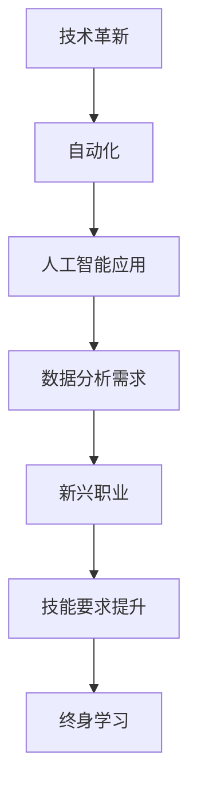

                 

### 引言

在迅速变革的后工业时代，职业规划的重要性愈发凸显。后工业时代，以信息技术、人工智能和智能制造为代表的新兴产业蓬勃发展，技术进步与全球化进程使得职场环境发生了深刻变化。传统职业结构逐渐瓦解，新的职业形态和岗位不断涌现，对从业者的职业素养和技能提出了新的要求。

**职业规划**，作为一种有意识地、有目标地管理职业生涯的行为，成为个体在职场中取得成功的关键。它不仅关乎个人职业发展的路径，更关乎在复杂多变的职场环境中如何保持竞争力。然而，职业规划并非一成不变，它需要随着外部环境的变化和个体内在需求的发展进行调整。

**终身学习**，成为职业规划中不可或缺的一部分。随着技术的飞速发展，知识的更新换代速度不断加快，单一技能的依赖性减弱，终身学习成为了保持职业竞争力的基础。通过不断学习，个体可以不断拓展自己的知识边界，提升技能水平，从而在职场中占据有利位置。

**多元发展**，是后工业时代职业规划的新趋势。多元发展不仅指在职业领域内的横向扩展，还包括跨领域的综合发展。通过多元发展，个体可以增强自己的职业弹性，提升适应变化的能力，为职业生涯的发展提供更多可能性。

本文将从后工业时代职业变迁的背景出发，详细探讨职业规划的重要性，深入分析终身学习和多元发展的策略与实践，并结合成功案例进行剖析，为读者提供实用的职业规划建议。通过本文的阅读，读者将更好地理解后工业时代职业规划的核心要义，为自己的职业生涯奠定坚实的基础。

### 后工业时代的特点与职业影响

后工业时代，亦被称为信息时代或知识经济时代，其特点主要体现在以下几个方面：技术进步、全球化进程、新兴产业的发展以及职场文化的转变。这些变化不仅深刻影响了职业环境，也对从业者的职业素质和技能提出了新的要求。

**技术进步对职业的影响**

技术进步是后工业时代的核心驱动力之一。人工智能、大数据、物联网等新兴技术的广泛应用，极大地改变了传统职业的运作模式。例如，自动化技术的普及使得许多重复性的劳动被机器取代，而需要高度创造性、复杂问题解决能力的新兴职业应运而生。这不仅要求从业者掌握新的技术工具，更需要具备跨学科的知识储备和创新能力。

为了具体阐述技术进步对职业的影响，我们可以使用Mermaid流程图来描绘技术进步对职业变革的路径：



在这个流程图中，我们可以看到，从技术革新到自动化，再到人工智能应用和数据需求的增加，最终催生了新兴职业，并且对从业者的技能要求不断提高，从而推动了终身学习的重要性。

**全球化与职场国际化**

全球化是后工业时代另一个显著特征。随着全球化的深入，职场环境变得更加多元化和国际化。跨国公司的大量出现，国际贸易的繁荣，以及远程工作的普及，都使得职场国际化成为一种趋势。在国际化的职场中，从业者不仅需要掌握本国的职业技能，还需要具备跨文化沟通能力、国际视野和全球协作的能力。

全球化背景下，职业竞争变得更加激烈。同一岗位可能在不同的国家和地区都有应聘者，这要求从业者不断提升自己的专业能力和软技能，以在竞争中脱颖而出。此外，全球化还带来了职业发展的新机遇。跨国企业提供的多样化工作环境和跨文化经验，可以帮助从业者快速成长和拓展职业视野。

**新兴产业与职业需求**

新兴产业的兴起是后工业时代的又一重要特征。以信息技术、人工智能、生物科技、新能源等为代表的新兴产业，不断创造出新的职业机会。例如，人工智能领域的数据科学家、机器学习工程师，生物科技领域的基因编辑专家、生物信息分析师，新能源领域的电池研发工程师、可再生能源项目管理人员等。

新兴产业的发展不仅创造了大量新职业，还改变了传统职业的结构。许多传统职业面临着被淘汰或转型的风险，而新的职业需求不断涌现。为了适应这一变化，从业者需要不断关注新兴产业的动态，及时调整自己的职业规划，以把握职业发展的新机遇。

总之，后工业时代的特点与职业影响是多方面的，技术进步、全球化进程、新兴产业的兴起，共同构成了这个时代的职业背景。在这种背景下，从业者需要具备终身学习的能力，不断提升自己的专业素质和软技能，以适应不断变化的职业需求。通过有效的职业规划和持续的学习，个体可以在后工业时代的职业舞台上取得成功。

### 职业规划的重要性

在快速变化的职场环境中，**职业规划**的重要性不言而喻。职业规划不仅是对未来职业生涯的预见和规划，更是应对职场不确定性的有效工具。有效的职业规划能够帮助个人明确职业目标，提升职业素养，增强职场竞争力。

**职业规划的定义与目标**

职业规划，通常定义为个人为实现职业发展目标而进行的一系列有意识、有计划的行为。它包括对自身职业兴趣、能力和价值观的评估，对职业市场的分析，以及制定具体的职业发展策略。职业规划的目标是帮助个人在职场中找到适合自己的发展路径，实现职业目标，并在职业生涯中保持持续的成长和进步。

一个明确的职业目标，是职业规划的基石。它为个人提供了前进的方向和动力，使个体在职业道路上更加有目的和有计划地行动。职业目标可以分为短期、中期和长期三个层次。短期目标通常是指一年内的具体行动计划，如提升某项技能或完成某个项目；中期目标是指三年到五年的职业发展计划，如晋升为高级职位或转入某个新兴领域；长期目标则是五到十年以上的职业愿景，如成为某一领域的专家或领导者。

**职业规划的关键因素**

职业规划的成功离不开几个关键因素的支撑：

1. **自我认知与职业定位**：自我认知是职业规划的基础。个人需要深入了解自己的兴趣、价值观、能力、优势和劣势，从而确定最适合自己的职业方向。职业定位则是基于自我认知，对个人职业目标的具体描述和定位。

2. **职业市场分析与预测**：职业市场分析是职业规划的重要环节。通过了解行业发展趋势、岗位需求变化、薪资水平等信息，个人可以更好地把握职业市场的动态，为自己的职业规划提供有力支持。职业市场预测则是对未来职业趋势的判断，帮助个人及时调整职业规划，以适应市场的变化。

3. **资源整合与利用**：职业规划过程中，个人需要整合各种资源，包括人脉、知识、技能和资金等。合理利用这些资源，可以加速职业发展的进程。例如，通过参加行业会议、网络研讨会、职业培训等，可以扩大知识面和技能水平，提高职业竞争力。

**职业规划的实施方法**

制定和实施职业规划，通常可以遵循以下步骤：

1. **自我评估**：通过自我反思和评估，了解自己的兴趣、价值观、能力和目标。

2. **市场调研**：搜集职业市场信息，包括行业趋势、岗位需求、薪资水平等。

3. **目标设定**：明确短期、中期和长期职业目标，并将其分解为具体的行动步骤。

4. **制定策略**：根据个人情况和市场环境，制定具体的职业发展策略，包括学习计划、工作计划、晋升路径等。

5. **执行与调整**：实施职业规划，并根据实际情况进行调整和优化。

6. **持续监控与评估**：定期评估职业规划的执行情况和效果，及时调整策略，确保职业目标实现。

**职业规划的意义与挑战**

职业规划对于个人职业生涯的意义重大。首先，它能够帮助个人明确职业目标，避免盲目择业和职业发展的困惑。其次，职业规划可以提升个人的职业素养和竞争力，使其在职场中更具优势。此外，职业规划还可以帮助个人应对职场变化，提高职业弹性和适应性。

然而，职业规划也面临一些挑战。首先是自我认知的准确性，个人需要真实、全面地了解自己。其次是市场环境的复杂性和不确定性，职业规划需要根据市场变化进行调整。此外，执行过程中可能遇到各种困难和阻力，需要个人具备坚定的意志和持续的学习能力。

总之，职业规划是后工业时代个人职业发展的必备工具。通过有效的职业规划，个体可以在快速变化的职场环境中找到自己的位置，实现职业目标，并在职业生涯中保持持续的成长和进步。

### 终身学习与职业发展

在快速变化的后工业时代，**终身学习**不仅是个人成长的必要手段，更是职业发展的基石。随着技术的不断进步和知识的快速更新，单一技能和短暂的学习已经无法满足职业发展的需求。终身学习，通过持续的技能提升和知识更新，帮助个人在职场中保持竞争力，实现职业生涯的可持续发展。

#### 终身学习的概念与意义

**终身学习**，指的是个人在其一生中不断通过学习获取知识、提升技能和增强能力的过程。它不仅仅是在学校教育结束后的继续学习，更是一种持续的学习态度和生活方式。终身学习强调个体主动、自觉地通过多种形式和渠道获取新知识，适应不断变化的社会和职场环境。

终身学习对职业发展具有重要的意义。首先，它能够帮助个人不断提升自身技能，保持与时代同步。技术的飞速发展使得许多传统技能迅速过时，只有通过持续学习，个体才能掌握最新的技术工具和知识，从而在职场中脱颖而出。其次，终身学习有助于个人拓展知识面，增强跨学科的能力，提升创新能力。在多元化、复杂的职场环境中，跨学科的知识和技能往往能够为个体带来更多的职业发展机会。最后，终身学习能够增强个人的适应能力和职业弹性，使其在面临职业变化和挑战时能够迅速调整和应对。

#### 终身学习的策略与实践

要实现终身学习，个人需要制定科学有效的学习策略，并付诸实践。

1. **学习资源的选择**

   首先，个人需要选择适合自己的学习资源。这些资源可以包括在线课程、专业书籍、学术论文、行业会议等。在线课程如Coursera、edX等平台提供了丰富的在线教育资源，涵盖了各个领域的专业知识。专业书籍是获取系统化知识的有效途径，特别是经典的教科书和行业著作。学术论文则可以帮助个人了解最新的学术研究成果和行业动态。行业会议则提供了一个交流和学习的机会，能够帮助个人拓展人脉，获取第一手行业信息。

2. **学习计划的制定**

   终身学习需要一个明确的计划。个人可以制定短期、中期和长期的学习计划。短期计划通常是指一个月或三个月内的学习任务，如完成某门在线课程或阅读几本书。中期计划则是一年到两年的学习目标，如掌握一项新技能或获得某个专业认证。长期计划则是五年或更长时间的职业发展目标，如成为某个领域的专家。制定学习计划时，个人需要根据自己的职业目标和时间安排，合理分配学习任务和进度。

3. **学习方法的实践**

   学习方法的实践是终身学习的重要环节。个人可以通过多种学习方法提高学习效果，如主动学习、合作学习、探究学习等。主动学习要求个体积极参与学习过程，主动提问和解决问题；合作学习则通过与他人的讨论和协作，实现知识的共享和互补；探究学习通过实验和实践，加深对知识的理解和应用。此外，个人还可以利用技术工具，如学习管理软件、在线笔记工具等，提高学习效率和组织能力。

#### 终身学习在职业发展中的作用

终身学习在职业发展中发挥着重要作用。首先，它能够提升个人的专业技能和知识水平，使个体在职场中具备更高的竞争力。掌握最新技术和管理知识，能够帮助个人在专业领域内不断进步，获得职业晋升的机会。其次，终身学习有助于个人拓展职业视野，增强跨领域的能力。在多元化、全球化的职场环境中，具备跨学科知识和技能的个体往往具有更多的职业发展机会。最后，终身学习能够增强个人的适应能力和职业弹性，使其在面临职场变化和挑战时能够迅速调整和应对，保持职业生涯的稳定和可持续发展。

总之，终身学习是后工业时代职业发展的必然选择。通过制定科学有效的学习策略，持续提升自身技能和知识水平，个人可以更好地适应职业环境的变化，实现职业目标，并在职业生涯中保持持续的进步和成长。

### 多元发展的概念与类型

在快速变化的后工业时代，**多元发展**已经成为职业规划的重要策略之一。多元发展不仅指在职业领域内的横向扩展，还包括跨领域的综合发展。通过多元发展，个体可以增强职业弹性，提升适应能力，为职业生涯的发展提供更多的可能性。

#### 多元发展的定义

**多元发展**，通常指的是个人在职业上不仅局限于某一特定领域或岗位，而是通过学习新的技能、掌握多种职业角色或跨界合作，实现职业多样化和综合发展的过程。多元发展不仅仅是职业领域的扩展，更是一种思维方式和生活态度的转变，要求个体具备开放的心态和不断探索的精神。

#### 多元发展的类型

1. **职业领域内的多元发展**

   职业领域内的多元发展是指个人在同一个职业领域内，通过学习新的技能和知识，拓展职业范围和深度。例如，一个软件工程师可以学习前端开发、后端开发、移动应用开发等不同方向的技能，从而在多个子领域内具备竞争力。

2. **跨领域的综合发展**

   跨领域的综合发展则是指个人在不同职业领域之间进行转换和发展。这通常需要个体具备跨学科的知识和技能，例如，一个市场营销专业的毕业生可以通过学习和实践，进入项目管理、数据分析或法律咨询等领域。跨领域的综合发展不仅拓宽了职业选择，也为个体带来了更多的职业机会和挑战。

3. **跨界合作与职业网络**

   跨界合作是多元发展的另一种形式。通过与其他领域的专家、企业和组织合作，个体可以在合作中学习和创新，实现知识的交叉融合。跨界合作不仅能够带来新的业务机会，还可以帮助个体拓展职业网络，获取更多的资源和信息。

#### 多元发展的优势

1. **增强职业弹性**

   多元发展能够增强个体的职业弹性。在职业领域内或跨领域学习新技能，使个体在面对职场变化时能够迅速调整和适应。具备多种技能和知识，个体在职业变动时具有更高的灵活性和适应性。

2. **提升创新能力和竞争力**

   多元发展有助于个体提升创新能力和竞争力。通过跨学科的知识和技能，个体能够在解决问题时采用多样化的思维方式和工具，从而提高创新效率。此外，多元发展的背景也为个体在职业竞争中提供了更多的优势。

3. **拓展职业机会**

   多元发展能够为个体拓展职业机会。在不同领域内具备技能，使个体在职业选择上更加多样，不仅能够在传统职业中找到机会，还可以在新兴产业和新兴领域中发现新的职业发展路径。

总之，多元发展是后工业时代职业规划的重要策略之一。通过在职业领域内或跨领域的学习和拓展，个体可以增强职业弹性，提升竞争力，拓展职业机会，为自己的职业生涯创造更多的可能性。

### 跨界合作与职业网络

在快速变化的职场环境中，**跨界合作**和**职业网络**的构建已经成为职业发展的重要策略。跨界合作通过整合不同领域的资源和知识，推动创新和业务拓展；职业网络则提供了资源和支持，帮助个体在职业生涯中实现更高效的发展。

#### 跨界合作的本质

**跨界合作**，是指不同领域、不同背景或不同组织之间的合作。它不仅涉及技术和业务的融合，还包括文化、管理和资源的整合。跨界合作的本质在于通过资源共享、优势互补和协同创新，实现合作双方的共同目标和价值。

1. **资源共享**：跨界合作使不同领域的资源得到整合和优化。例如，一个科技公司可以通过与医疗机构合作，共享技术资源和患者数据，开发出更加精准的医疗解决方案。

2. **优势互补**：跨界合作可以使不同领域的优势得到互补。例如，一个市场营销专家可以与技术开发团队合作，将市场洞察和技术创新相结合，推出更加符合市场需求的产品。

3. **协同创新**：跨界合作能够激发创新思维，推动新业务模式的诞生。通过跨领域的协作，个体可以借助不同的视角和工具，解决单一领域难以克服的难题。

#### 跨界合作的优势

1. **拓展业务范围**：跨界合作可以帮助企业或个人拓展业务范围，开拓新的市场和客户群体。例如，一家电商平台可以与物流公司合作，提供更完善的物流服务，从而提升用户体验和满意度。

2. **提高创新能力**：跨界合作通过引入外部知识和资源，可以激发创新思维，提高创新能力。合作双方在交流过程中可以相互借鉴，共同探索新的解决方案。

3. **增强竞争力**：跨界合作使企业或个人具备更丰富的技能和资源，从而提高在市场竞争中的竞争力。通过跨领域的合作，个体可以提供更加多元化、定制化的服务，满足客户的不同需求。

#### 构建职业网络的策略

构建强大的职业网络是跨界合作的基础。以下是一些有效的策略：

1. **参加行业会议和活动**：行业会议和活动是结识同行业专家和潜在合作伙伴的好机会。通过参加这些活动，可以扩展人脉，获取最新的行业信息。

2. **利用社交媒体**：社交媒体平台如LinkedIn、Twitter等是构建职业网络的重要工具。通过定期发布专业内容、参与讨论和互动，可以提升自己的行业影响力，吸引更多的职业机会。

3. **参与专业社群**：加入专业社群，如技术论坛、行业协会等，可以与行业内的专家和同行建立联系。通过参与社群的活动和讨论，可以获取有价值的资源和信息。

4. **主动沟通与互动**：在构建职业网络时，主动与同行和潜在合作伙伴进行沟通和互动至关重要。通过分享经验和知识，可以建立互信和合作的基础。

总之，跨界合作和职业网络的构建是职业发展的重要策略。通过跨界合作，个体可以拓展业务范围，提高创新能力，增强竞争力；通过构建职业网络，个体可以获得更多的资源和机会，实现职业目标。在快速变化的职场环境中，跨界合作和职业网络将成为个体职业发展的关键优势。

### 职业弹性与适应性

在快速变化的后工业时代，**职业弹性**和**适应性**成为职业发展的核心要素。职业弹性指的是个人在面对职场变革和挑战时，能够迅速适应和应对的能力；而适应性则是指个人在变化的环境中调整自己、持续发展的能力。具备职业弹性和适应性，个体不仅能够在职场中保持竞争力，还能在变化中找到新的机遇。

#### 职业弹性的定义

**职业弹性**，是指个人在职场中能够灵活应对各种变化和挑战的能力。这包括以下几个方面：

1. **技能多样性**：具备多种技能和知识，使个体能够在不同岗位和环境中迅速适应和转换。
2. **信息获取能力**：能够快速获取新信息，了解行业动态和趋势，及时调整职业规划。
3. **心理素质**：具备良好的心理素质，能够面对职场压力和不确定性，保持积极乐观的心态。

#### 职业弹性的重要性

职业弹性在职业生涯中具有至关重要的意义：

1. **适应职场变化**：随着技术的进步和全球化进程的加快，职场环境不断变化。具备职业弹性的个体能够快速适应这些变化，抓住新的机遇。
2. **提升职业竞争力**：在多变的市场环境中，具备职业弹性的个体能够更好地应对职业挑战，提升自己的职业竞争力。
3. **职业发展可持续性**：职业弹性使个体能够在职业生涯中保持持续的发展，避免因职场变化而陷入困境。

#### 提高职业弹性的方法

要提高职业弹性，个体可以采取以下几种方法：

1. **终身学习**：通过不断学习和更新知识，提升自身的技能和知识水平，增强对新技术和新趋势的适应能力。
2. **跨领域学习**：学习不同领域的知识和技能，提高跨学科的能力，从而增强职业的多样性。
3. **积极应对挑战**：面对职场挑战时，保持积极的态度，勇于尝试新事物，通过实践积累经验。
4. **构建职业网络**：建立广泛的职业网络，获取更多的信息和资源，提升在职场中的适应能力。

总之，职业弹性和适应性是后工业时代职业发展的关键。通过终身学习、跨领域学习和积极应对挑战，个体可以提升自己的职业弹性，增强在职场中的适应能力，实现职业生涯的持续发展。

### 成功职业规划案例分析

在快速变化的后工业时代，成功的职业规划案例不仅为个体提供了宝贵的经验，更为整个行业提供了有益的启示。以下，我们通过一个真实的职业规划案例，详细解析其背景、职业规划过程和策略，以及最终的结果和启示。

#### 案例背景与挑战

王先生，35岁，是一名软件工程师。他拥有计算机科学学士学位，曾在一家大型互联网公司担任软件开发工程师，拥有丰富的编程经验。然而，随着人工智能和大数据技术的兴起，传统的软件开发岗位逐渐被取代，王先生开始感受到职业发展的压力。面对技术日新月异的变化，他意识到需要通过职业规划来提升自己的竞争力。

**背景挑战**：

1. **技术变革**：人工智能和大数据技术的快速发展，使得传统软件工程师的技能逐渐过时。
2. **职业前景**：传统软件开发岗位需求减少，新兴领域如数据科学、人工智能等岗位需求增加。
3. **个人兴趣**：王先生对数据科学和人工智能领域感兴趣，但缺乏相关的专业知识和实践经验。

#### 职业规划过程与策略

王先生在意识到职业挑战后，开始制定详细的职业规划，以应对未来的变化。

**职业规划过程**：

1. **自我评估**：王先生首先进行了自我评估，了解自己的兴趣、优势和劣势。他发现自己对数据分析和人工智能领域非常感兴趣，但理论知识不足，实践经验欠缺。
2. **市场分析**：王先生通过市场调研，了解了当前人工智能和数据科学领域的职业需求、薪资水平和未来发展趋势。他发现，具备这些领域知识的工程师在市场上非常受欢迎，薪资待遇也远高于传统软件开发工程师。
3. **目标设定**：基于自我评估和市场分析，王先生设定了短期和长期职业目标。短期目标是学习数据科学和人工智能的基本知识，并参与相关项目积累实践经验；长期目标是成为数据科学或人工智能领域的专家，甚至创业开设自己的公司。

**职业规划策略**：

1. **学习计划**：王先生制定了一个详细的学习计划，包括参加在线课程、阅读专业书籍、参与项目实践等。他选择了Coursera上的数据科学和机器学习课程，并参加了多个开源项目，积累实践经验。
2. **资源整合**：王先生利用各种资源，如行业会议、专业社群和职业导师，扩大自己的知识面和人脉网络。他通过参加行业会议，了解最新的技术动态和行业趋势；通过专业社群，结识了许多行业专家，获取宝贵的经验和建议。
3. **职业转型**：在学习和积累实践经验的基础上，王先生开始寻找与数据科学和人工智能相关的职位。他通过LinkedIn等职业社交平台，主动与相关领域的公司和招聘负责人建立联系，并通过面试展示自己的技能和潜力。

#### 案例结果与启示

通过严格的职业规划和不懈的努力，王先生最终实现了职业目标。

**案例结果**：

1. **成功转型**：王先生成功转型为数据科学家，在一家人工智能公司担任数据科学工程师，薪资和职位都得到了显著提升。
2. **职业成就**：王先生参与了多个重要的项目，为公司的数据分析和人工智能应用提供了关键支持，获得了公司的认可和奖励。
3. **个人成长**：通过职业规划，王先生不仅在技术和专业能力上取得了显著进步，还培养了良好的职业素养和心态，成为职场中的佼佼者。

**启示**：

1. **终身学习**：在快速变化的职场环境中，终身学习是提升竞争力的关键。个体需要不断更新知识，学习新技术，保持与时代的同步。
2. **明确目标**：设定清晰的职业目标，并制定具体的实施策略，是实现职业成功的重要前提。目标设定应结合个人兴趣和市场需求，确保具有现实性和可行性。
3. **跨界合作**：通过跨界合作，整合外部资源和知识，可以加速职业发展的进程。建立广泛的职业网络，获取更多的机会和支持。
4. **积极应对变化**：面对职场变革，保持积极的态度，勇于尝试新事物，通过实践积累经验，是提升职业弹性和适应性的关键。

总之，王先生的职业规划案例为我们提供了一个成功的范例，展示了在快速变化的后工业时代，如何通过职业规划实现职业目标。通过终身学习、明确目标、跨界合作和积极应对变化，个体可以在职场中取得成功，并为未来的职业发展奠定坚实的基础。

### 职业规划未来展望

随着后工业时代的不断演进，职业规划的未来面临着新的挑战与机遇。在人工智能、物联网、生物科技等新兴技术的推动下，职场环境将发生深刻变化，职业需求、职业形态和职业发展路径都将发生重大转变。以下，我们将探讨未来职业规划的趋势、面临的挑战以及应对策略。

#### 未来职业发展的趋势

1. **技术驱动的发展**：人工智能和大数据技术的进一步普及，将推动自动化和智能化的进程，传统职业结构将逐渐被重构。新兴职业如数据科学家、人工智能工程师、机器学习专家等需求将大幅增加。

2. **职业形态的多样化**：远程工作、兼职工作和自由职业者的兴起，将改变传统的全职工作模式。职业形态的多样化不仅提供了更多的就业选择，也为职业规划带来了新的挑战。

3. **全球职业一体化**：全球化进程的加快，将使职场环境更加国际化。跨国企业和全球协作将越来越普遍，国际视野和跨文化沟通能力将成为职业发展的重要技能。

4. **职业发展的可持续性**：随着可持续发展理念的提升，绿色经济和环保领域将成为未来职业发展的重要方向。职业规划者需要关注环境保护和社会责任，将可持续发展理念融入职业发展中。

#### 职业规划面临的挑战

1. **技能需求的快速变化**：技术的快速发展使得许多传统技能迅速过时，职业规划者需要不断更新自己的知识和技能，以适应职业需求的变化。

2. **职场竞争的加剧**：随着全球化和新兴产业的兴起，职场竞争将变得更加激烈。职业规划者需要提升自己的综合素质和竞争力，才能在职场中脱颖而出。

3. **职业弹性的需求**：快速变化的职场环境要求个体具备更高的职业弹性，能够迅速适应和应对各种变化。职业规划者需要培养自己的适应能力和创新思维。

4. **个人隐私和数据安全**：随着数字化进程的推进，个人隐私和数据安全问题日益突出。职业规划者需要关注个人信息保护和数据安全，确保在职业发展中不受侵害。

#### 应对策略

1. **终身学习**：在快速变化的职场环境中，终身学习是提升竞争力的关键。职业规划者应制定长期学习计划，持续更新知识和技能。

2. **跨领域发展**：通过跨领域学习和多元化发展，职业规划者可以增强自身的职业弹性，提升适应变化的能力。

3. **构建职业网络**：建立广泛的职业网络，获取更多的资源和机会。通过跨界合作，整合外部资源和知识，加速职业发展的进程。

4. **灵活应对变化**：保持开放的心态，积极应对职场变化。通过实践积累经验，提升自己的适应能力和创新思维。

5. **注重可持续发展**：关注环境保护和社会责任，将可持续发展理念融入职业发展中，实现个人职业目标与社会责任的统一。

总之，未来职业规划将面临诸多挑战，但也充满机遇。通过终身学习、跨领域发展、构建职业网络和灵活应对变化，职业规划者可以更好地应对未来的职场环境，实现职业目标和社会价值。

### 附录

#### 附录 A: 职业规划资源与工具

为了帮助读者更好地实施职业规划，以下是一些常用的资源与工具：

1. **在线学习平台**：如Coursera、edX、Udacity等，提供丰富的在线课程和认证。
2. **职业评估工具**：如职业性格测试、职业兴趣测试等，帮助个人了解自身优势与职业方向。
3. **职业社交平台**：如LinkedIn、职业社交网络，帮助个人建立职业网络、获取职业信息和机会。
4. **职业咨询服务**：职业规划师或咨询师，提供专业的职业规划建议和指导。

#### 附录 B: 参考文献

1. **Dawson, C. (2018). *Future Work Skills 2020*. Future of Skills.
2. **Laurie, D. (2019). *The Career Advancement Planner*. John Wiley & Sons.
3. **Pascual, J. (2020). *Designing Your Life: How to Build a Well-Lived Joyful Life*. Random House.

#### 附录 C: Mermaid 流程图示例

以下是一个简单的Mermaid流程图示例，用于描述技术进步对职业变革的过程：


#### 附录 D: Python 源代码示例

以下是一个简单的Python代码示例，用于演示如何通过数据分析和机器学习来识别职业趋势：

```python
import pandas as pd
from sklearn.cluster import KMeans

# 加载职业数据
data = pd.read_csv('career_data.csv')

# 数据预处理
data = data[['Job Title', 'Industry', 'Location', 'Salary']]

# 选取特征
X = data[['Industry', 'Location']]

# K-means聚类
kmeans = KMeans(n_clusters=5, random_state=0).fit(X)

# 职业分类
data['Cluster'] = kmeans.predict(X)

# 打印职业趋势
print(data.groupby('Cluster')['Job Title'].count())
```

通过以上源代码，可以分析不同职业集群中的岗位需求，从而为职业规划提供数据支持。

### 结束语

在快速变化的后工业时代，职业规划的重要性不容忽视。终身学习、多元发展和职业弹性，是应对职业挑战、实现职业生涯可持续发展的关键。通过科学合理的职业规划，个体可以更好地适应职场变化，抓住职业发展机遇。希望本文能为读者提供有益的启示和指导，助力其在职场中取得成功。作者：AI天才研究院/AI Genius Institute & 禅与计算机程序设计艺术 /Zen And The Art of Computer Programming。

