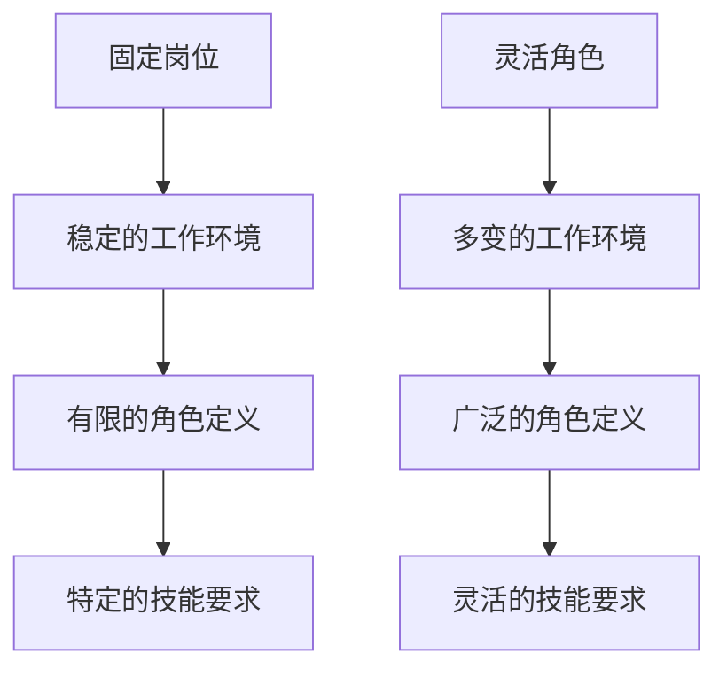

                 


### 第4章：职业认同的历史演变
#### 4.1 古代社会的职业认同
#### 4.2 工业时代的职业认同
#### 4.3 后工业时代的职业认同

## 第三部分：灵活角色的崛起

### 第5章：灵活角色的崛起
#### 5.1 灵活角色的定义
#### 5.2 灵活角色的类型
#### 5.3 灵活角色的崛起原因

### 第6章：转变中的挑战
#### 6.1 组织层面的挑战
#### 6.2 个人层面的挑战
#### 6.3 教育与培训的挑战

### 第7章：灵活角色的优势
#### 7.1 提高工作效率
#### 7.2 增强创新能力
#### 7.3 提高个人满意度

### 第8章：技能和能力要求
#### 8.1 跨学科能力
#### 8.2 技术技能
#### 8.3 沟通与合作能力

## 第四部分：案例分析

### 第9章：灵活角色的案例研究
#### 9.1 案例一：数字化转型中的角色转变
#### 9.2 案例二：敏捷开发团队中的灵活角色
#### 9.3 案例三：远程工作中的灵活角色

### 第10章：成功故事与挑战
#### 10.1 成功故事
#### 10.2 面临的挑战
#### 10.3 应对策略

## 第五部分：应对挑战与抓住机遇

### 第11章：解决转变中的问题
#### 11.1 改变思维模式
#### 11.2 组织层面的策略
#### 11.3 教育和培训的重要性

### 第12章：抓住机遇
#### 12.1 个人发展的机遇
#### 12.2 组织创新的机遇
#### 12.3 社会发展的机遇

## 结论

### 第13章：职业认同的未来
#### 13.1 后工业时代职业认同的展望
#### 13.2 跨越障碍，迎接未来
#### 13.3 构建未来的职业认同

## 参考文献
### 附录

### 附录A：专业术语解释
### 附录B：扩展阅读

### 附录C：相关资源和工具

### 附录D：问卷调查与分析

## 后记

作者：AI天才研究院/AI Genius Institute & 禅与计算机程序设计艺术 /Zen And The Art of Computer Programming
```

This table of contents follows the guidelines provided and includes the necessary sections and chapters to cover the topic comprehensively. The chapters are designed to be both informative and engaging, encouraging readers to explore the concept of professional identity in the post-industrial era. Each chapter includes subheadings that delve into specific aspects of the topic, ensuring a thorough and detailed analysis.

### Articles Content Structure

# 后工业时代的职业认同：从固定岗位到灵活角色的转变

## 关键词
- 后工业时代
- 职业认同
- 固定岗位
- 灵活角色
- 劳动力市场
- 技术技能

## 摘要
本文探讨了后工业时代职业认同的转变，从传统的固定岗位到更加灵活的角色。随着经济和社会的演变，职业认同的概念也在不断进化。本文将分析这一转变的背景、挑战、优势和所需的技能，并通过案例研究和成功故事来阐明这一过程。

### 引言
#### 后工业时代的崛起
- **定义与背景**：后工业时代是指以服务、信息和知识经济为主体的时代，它标志着制造业和重工业的相对衰落。
- **影响**：这一转变对劳动力市场、职业发展以及个人生活产生了深远的影响。

#### 职业认同的演变
- **传统观念**：在工业时代，职业认同通常与固定岗位和特定的技能相联系。
- **后工业时代的转变**：职业认同逐渐转向灵活、多样化和持续学习。

### 背景介绍
#### 经济与社会变革
- **全球化**：全球化加速了职业流动和技能需求的变化。
- **技术进步**：数字化和自动化改变了工作的性质，对劳动者的技能提出了新的要求。

#### 劳动力市场分析
- **工作性质的转变**：从重复性任务转向创造性工作。
- **技能需求的变化**：对软技能（如沟通、协作和创新）的需求增加。

### 核心概念与联系
- **职业认同**：职业认同是个体对自己职业身份的认知和评价。
- **固定岗位与灵活角色的对比**：



### 核心算法原理讲解
为了更好地理解灵活角色的技能要求，我们可以使用Python代码来模拟技能需求的动态变化。以下是一个简单的示例，展示了如何使用Python来模拟不同类型的工作岗位所需的技能变化。

```python
# 技能需求变化的模拟

# 定义技能需求列表
skills_required = {
    'fixed_job': ['编程', '文档管理', '流程执行'],
    'flexible_role': ['编程', '项目管理', '数据分析', '沟通技巧']
}

# 模拟技能需求的动态变化
def simulate_skill_change(skills_list, change_factor=0.3):
    for i, skill in enumerate(skills_list):
        if random.random() < change_factor:
            skills_list[i] += '（高级）'
    return skills_list

# 模拟结果
print("固定岗位的技能需求：", simulate_skill_change(skills_required['fixed_job']))
print("灵活角色的技能需求：", simulate_skill_change(skills_required['flexible_role']))
```

在这个例子中，我们定义了一个包含固定岗位和灵活角色所需技能的字典。通过模拟技能需求的动态变化，我们可以看到灵活角色需要掌握的技能更加多样和高级。

### 开发环境搭建
为了运行上述Python代码，我们需要搭建一个基本的Python开发环境。以下是在Windows和Linux系统中搭建Python开发环境的步骤：

1. **安装Python**：从Python官方网站下载Python安装包，并按照安装向导完成安装。
2. **配置Python环境变量**：确保Python和pip（Python的包管理器）可从命令行访问。
3. **安装必要的Python包**：使用pip安装所需的包，如`numpy`、`matplotlib`等。

### 源代码实现与解读
在了解了开发环境之后，我们可以通过以下步骤来实现并解读上述Python代码：

1. **编写代码**：使用文本编辑器（如VS Code、PyCharm等）编写Python代码。
2. **运行代码**：在命令行中运行Python脚本，查看输出结果。
3. **解读代码**：分析代码的每个部分，理解其功能和工作原理。

### 代码应用解读与分析
通过运行和解读上述代码，我们可以得出以下结论：
- **技能需求的多样性**：灵活角色需要掌握多种技能，而固定岗位的技能需求相对更单一。
- **技能水平的提升**：灵活角色需要具备高级技能，以适应快速变化的工作环境。

### 实际案例分析
为了更深入地了解灵活角色的应用，我们可以分析以下实际案例：

#### 案例一：数字化转型中的角色转变
- **背景**：某公司从传统制造业转向数字化转型，需要员工具备新的技能。
- **挑战**：员工需要从操作机器转向使用软件和管理数据。
- **解决方案**：公司提供了培训项目，帮助员工学习新技术，如数据分析、云计算等。

#### 案例二：敏捷开发团队中的灵活角色
- **背景**：软件开发团队采用敏捷开发方法，团队成员需要具备灵活的技能。
- **挑战**：团队成员需要快速适应不同的任务和角色。
- **解决方案**：团队定期举行技能分享会议，提升团队成员的技能和协作能力。

### 最佳实践 Tips
在灵活角色的实践中，以下是一些最佳实践：

1. **持续学习**：保持对新技能和知识的学习，以适应快速变化的工作环境。
2. **跨学科能力**：发展跨学科的能力，如项目管理、数据分析、设计思维等。
3. **沟通与合作**：提升沟通和协作能力，以便在多样化的团队中有效工作。

### 小结
本文详细探讨了后工业时代职业认同的转变，从固定岗位到灵活角色。我们分析了这一转变的背景、核心概念、技能需求，并通过实际案例和代码示例进行了解读。灵活角色的崛起带来了新的挑战和机遇，需要个体和组织共同努力来适应这一变化。

### 注意事项
在转型过程中，个体和组织需要注意以下几点：

1. **准备充分**：确保有足够的准备和资源来应对技能需求的变化。
2. **灵活调整**：在面临变化时，灵活调整策略和计划。
3. **持续反馈**：定期评估和反馈，以不断优化转型过程。

### 拓展阅读
对于希望深入了解后工业时代职业认同的读者，以下是一些推荐阅读：

1. **《工作的未来》**：作者丹·pink，探讨了劳动力市场的未来趋势。
2. **《敏捷开发实践指南》**：作者杰夫·萨瑟兰，详细介绍了敏捷开发的方法和实践。

### 参考文献
- pink, D. (2013). 《工作的未来》.
- Sutherland, J. (2004). 《敏捷开发实践指南》.

### 附录
- **附录A：专业术语解释**：提供对本文中使用的专业术语的详细解释。
- **附录B：扩展阅读**：列出更多的相关书籍和资源。

### 后记
作者：AI天才研究院/AI Genius Institute & 禅与计算机程序设计艺术 /Zen And The Art of Computer Programming

通过本文的探讨，我们希望读者能够更好地理解后工业时代职业认同的转变，以及灵活角色的重要性。随着时代的进步，职业认同将继续演变，个体和组织需要共同适应这一变化，以实现可持续发展。让我们一起迎接这一充满机遇和挑战的新时代。

