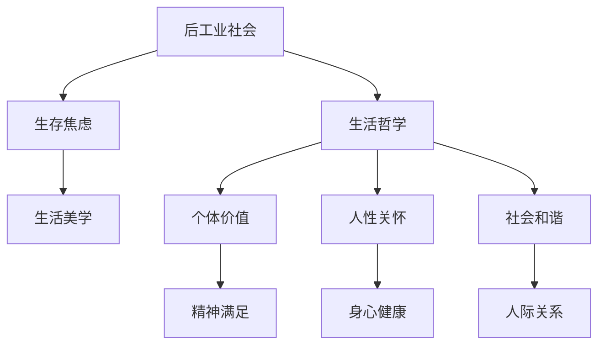
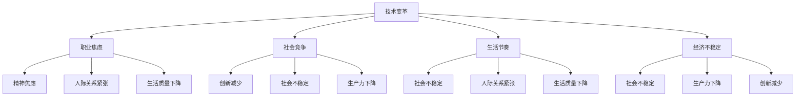
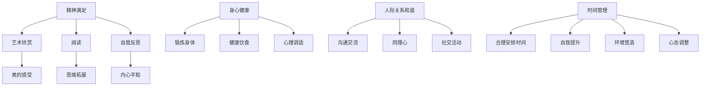
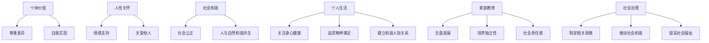

                 

# 后工业社会的生活哲学：从生存焦虑到生活美学

> 关键词：后工业社会，生活哲学，生存焦虑，生活美学，技术变革，人工智能，心理健康

> 摘要：本文旨在探讨后工业社会的生活哲学，分析生存焦虑的根源与表现形式，并提出如何从焦虑中解脱出来，追求生活美学的路径。通过深入理解技术变革、社会竞争和生活节奏对个体和社会的影响，我们尝试找到一条平衡生存与追求生活质量的道路。

## 引言

### 第1章: 引言

在当今这个时代，我们正经历着从工业社会向后工业社会的转变。这一转变不仅仅体现在技术层面，更是涉及到人们的生活方式、价值观念和社会结构的深刻变革。后工业社会，顾名思义，是工业化社会的延伸和深化，它以信息化和智能化为特征，代表着生产力的极大提升和社会形态的巨大变化。

#### 1.1.1 后工业社会的定义与特征

后工业社会，是指工业化社会向信息化、智能化社会转变的过渡期。这个阶段，生产力高度发展，信息技术和人工智能逐渐取代传统的制造业成为经济增长的主要动力，社会结构、文化价值观念以及人们的生活方式都发生了深刻的变化。

- **信息化**：信息技术迅猛发展，互联网、大数据、云计算等成为新的生产力工具，改变了人们的生产和生活方式。
- **智能化**：人工智能技术在各行各业得到广泛应用，自动化、智能化设备取代了传统的手工劳动，提高了生产效率。
- **服务化**：服务业逐渐成为经济增长的主要动力，人们的消费需求逐渐向高品质、个性化、多元化的方向发展。

#### 1.1.2 生存焦虑的产生

在这样一个充满变化和不确定性的后工业社会，人们面临着前所未有的生存焦虑。这种焦虑源于以下几个方面：

- **职业发展压力**：随着人工智能的普及，很多传统职业被机器取代，人们担心自己的职业前景和收入稳定性。
- **生活节奏加快**：互联网和智能设备的普及，使人们的生活节奏加快，压力增大。
- **社会竞争加剧**：社会竞争日益激烈，人们担心自己无法适应快速变化的社会环境，从而产生焦虑感。

#### 1.1.3 生活美学的追求

面对生存焦虑，人们开始思考如何从焦虑中解脱出来，追求更高层次的生活美学。生活美学，是指人们追求美好生活的哲学理念，包括以下几个方面：

- **精神层面的满足**：通过艺术、文学、音乐等精神文化产品，满足人们的精神需求，提升生活质量。
- **身心和谐**：注重身心健康，追求身心健康与生活品质的平衡。
- **人际关系和谐**：注重人际关系，建立良好的人际关系网络，促进社会和谐。

#### 1.1.4 后工业社会的生活哲学

后工业社会的生活哲学，是一种关注人性、追求美好生活的哲学观念。它主张人们应该摆脱生存焦虑，关注内心的需求，追求身心健康和人际关系的和谐。

- **个体价值**：尊重个体差异，发挥个体的独特价值。
- **人性关怀**：关注人性，尊重人的情感需求。
- **社会和谐**：追求社会和谐，促进人与自然的和谐共生。

#### 1.1.5 小结

本章从后工业社会的定义与特征、生存焦虑的产生、生活美学的追求以及后工业社会的生活哲学等方面，为我们展开了对后工业社会生活哲学的探讨。希望通过本章的探讨，能够帮助读者更好地理解后工业社会的生活哲学，从而找到摆脱生存焦虑、追求美好生活的方法。

#### 1.1.6 Mermaid 流程图

以下是一个简化的 Mermaid 流程图，描述后工业社会生活哲学的核心概念及其关系：



这个流程图展示了后工业社会生活哲学的核心概念及其相互关系，为后续章节的内容提供了直观的指引。

## 第2章: 生存焦虑的根源与表现形式

### 2.1 生存焦虑的根源

生存焦虑，即对生存状态的不安和担忧，其根源可以追溯到后工业社会的一系列复杂因素。以下是一些导致生存焦虑的根源：

- **技术变革**：信息技术和人工智能的发展，使得许多传统职业面临被机器取代的风险，导致人们对于职业前景的不确定性增加。
- **社会竞争**：社会竞争日益激烈，人们对于自身能力的担忧和对于成功的追求，加剧了焦虑感。
- **生活节奏**：生活节奏的加快，工作压力和生活压力的增加，导致人们精神紧张和焦虑。
- **经济不稳定**：经济环境的不稳定，如金融危机、失业潮等，增加了人们对于经济状况的担忧。

### 2.2 生存焦虑的表现形式

生存焦虑在个人和社会层面上有不同的表现形式：

- **个人层面**：
  - **职业焦虑**：担心失业、职业前景不佳，对工作的不满和焦虑。
  - **生活焦虑**：对日常生活中的压力和挑战感到焦虑，如健康问题、家庭矛盾等。
  - **精神焦虑**：长时间的焦虑可能导致精神压力，出现抑郁、焦虑症等心理问题。

- **社会层面**：
  - **社会不公**：社会贫富差距扩大，社会不公加剧，导致人们对于社会公平和正义的焦虑。
  - **环境问题**：环境污染、气候变化等环境问题，加剧了人们对于未来生存环境的担忧。
  - **科技风险**：人工智能和生物技术的快速发展，带来了伦理和安全问题，使人们对于科技发展的未来充满忧虑。

### 2.3 生存焦虑对个体和社会的影响

生存焦虑不仅对个体的身心健康产生负面影响，还对社会稳定产生挑战：

- **个体影响**：
  - **心理健康问题**：长期的焦虑可能导致抑郁症、焦虑症等心理疾病，影响个体的生活质量和工作效率。
  - **人际关系紧张**：焦虑感可能导致个体对他人产生敌意，影响人际关系，导致社会疏离。
  - **生活质量下降**：焦虑感可能使个体过分关注自身问题，忽视生活品质，导致生活质量下降。

- **社会影响**：
  - **社会不稳定**：广泛存在的生存焦虑可能导致社会动荡，增加社会管理的难度。
  - **生产力下降**：个体焦虑可能导致工作效率下降，影响整体生产力。
  - **创新减少**：焦虑感可能抑制个体的创造力和创新精神，影响社会进步。

### 2.4 应对生存焦虑的策略

为了应对生存焦虑，个体和社会可以采取以下策略：

- **个体层面**：
  - **心理调适**：通过心理治疗、冥想等方式缓解焦虑感。
  - **职业规划**：积极进行职业规划，提高自身竞争力。
  - **生活方式调整**：改善生活习惯，提高生活质量。
  - **社会支持**：寻求家人、朋友和社会的支持，增强心理韧性。

- **社会层面**：
  - **政策干预**：通过政策调整，减少社会不公，提高社会福利。
  - **教育培训**：提供职业培训和教育，提高个体适应能力。
  - **心理健康服务**：提供心理健康服务和资源，帮助个体缓解焦虑。
  - **科技创新**：鼓励科技创新，提高生产力，减轻生活压力。

### 2.5 小结

本章分析了生存焦虑的根源与表现形式，探讨了其对个体和社会的影响，并提出了一些应对生存焦虑的策略。通过深入理解生存焦虑的成因和影响，我们可以更好地应对这种焦虑，追求更加和谐和美好的生活。

#### 2.5.1 Mermaid 流程图

以下是一个简化的 Mermaid 流程图，描述生存焦虑的根源和表现形式：



这个流程图展示了生存焦虑的多种根源和表现形式及其相互关系，为后续章节的内容提供了直观的指引。

## 第3章: 生活美学的理念与实践

### 3.1 生活美学的定义与核心要素

生活美学是一种哲学观念，强调人们在追求物质生活满足的同时，更应注重精神层面的愉悦和生活质量的提升。生活美学的核心要素包括：

- **精神满足**：通过艺术、文学、音乐等精神文化产品，满足人们的精神需求，提升生活质量。
- **身心健康**：注重身心健康，追求身心健康与生活品质的平衡。
- **人际关系和谐**：注重人际关系，建立良好的人际关系网络，促进社会和谐。

#### 3.1.1 精神满足

精神满足是生活美学的重要组成部分。在物质生活相对富足的后工业社会，人们更加追求精神层面的丰富和满足。以下是一些实现精神满足的途径：

- **艺术欣赏**：通过欣赏绘画、雕塑、音乐等艺术作品，感受美的力量，提升精神层次。
- **阅读**：通过阅读文学作品，拓宽视野，提升思维能力，丰富内心世界。
- **自我反思**：通过冥想、瑜伽等方式，进行自我反思，寻找内心的平和与宁静。

#### 3.1.2 身心健康

身心健康是生活美学的重要目标。在快节奏的后工业社会，人们面临巨大的生活压力和工作压力，因此，保持身心健康变得尤为重要。以下是一些实现身心健康的方法：

- **锻炼身体**：定期进行体育锻炼，如跑步、游泳、瑜伽等，增强身体素质，提高免疫力。
- **健康饮食**：保持均衡的饮食结构，摄入足够的营养，保持身体健康。
- **心理调适**：通过心理咨询、冥想等方式，缓解压力，保持心理健康。

#### 3.1.3 人际关系和谐

人际关系和谐是生活美学的重要体现。良好的人际关系网络不仅能够提升生活质量，还能够为个体提供心理支持和安全感。以下是一些维护人际关系和谐的方法：

- **沟通交流**：通过积极的沟通交流，增进彼此的了解，建立信任和友谊。
- **同理心**：尊重他人的感受和需求，展现出同理心，促进人际关系的和谐。
- **社交活动**：参加各种社交活动，拓展人际关系网络，增强社交技能。

#### 3.2 生活美学的实践路径

要实现生活美学，个体需要从以下几个方面入手：

- **时间管理**：合理安排时间，确保有足够的时间用于精神满足、身心健康和人际关系建设。
- **自我提升**：通过学习新知识、新技能，提升自身素质，实现自我价值。
- **环境营造**：营造一个舒适、宜人的生活和工作环境，提升生活质量。
- **心态调整**：保持积极的心态，面对生活中的挑战和压力，寻找生活的乐趣。

#### 3.3 生活美学对生存焦虑的缓解作用

生活美学不仅能够提升生活质量，还能够有效缓解生存焦虑。通过以下方式，生活美学能够帮助个体摆脱焦虑：

- **精神满足**：通过艺术、文学等精神文化产品，满足精神需求，减轻焦虑感。
- **身心健康**：通过锻炼身体、健康饮食等方式，保持身心健康，增强抗压能力。
- **人际关系和谐**：通过良好的人际关系网络，获得心理支持和安全感，减轻焦虑。

#### 3.4 小结

本章讨论了生活美学的定义与核心要素，以及如何通过实践生活美学来提升生活质量，缓解生存焦虑。通过深入理解生活美学的理念和实践路径，个体可以更好地应对后工业社会的生存挑战，追求更加美好、和谐的生活。

#### 3.4.1 Mermaid 流程图

以下是一个简化的 Mermaid 流程图，描述生活美学的理念与实践路径：



这个流程图展示了生活美学的核心要素和实践路径，为后续章节的内容提供了直观的指引。

## 第4章: 后工业社会的生活哲学

### 4.1 后工业社会的生活哲学概述

后工业社会的生活哲学，是一种关注人性、追求美好生活的哲学观念。它主张人们应该摆脱生存焦虑，关注内心的需求，追求身心健康和人际关系的和谐。这一哲学观念在后工业社会中具有重要的现实意义和理论价值。

#### 4.1.1 个体价值

个体价值是后工业社会生活哲学的核心之一。在这一哲学观念下，个体被赋予了重要的地位和权利。人们应该尊重个体差异，发挥个体的独特价值，追求自我实现。

- **尊重差异**：每个人都有自己独特的个性、兴趣和需求，社会应该尊重和接纳这些差异，为个体提供发展的空间。
- **自我实现**：个体应该根据自己的兴趣和特长，选择适合自己的发展方向，实现自我价值。

#### 4.1.2 人性关怀

人性关怀是后工业社会生活哲学的另一个重要方面。在这一哲学观念下，人们应该关注人性，尊重人的情感需求，为个体提供情感支持和关爱。

- **情感支持**：在快节奏、竞争激烈的后工业社会中，人们常常感到孤独和压抑，社会应该提供情感支持，帮助个体缓解心理压力。
- **关爱他人**：人性关怀不仅体现在对个体的关注，也体现在对他人和社会的关爱。人们应该学会关心他人，帮助他人，建立和谐的社会关系。

#### 4.1.3 社会和谐

社会和谐是后工业社会生活哲学的终极目标。在这一哲学观念下，人们应该追求社会和谐，促进人与自然的和谐共生。

- **社会公正**：社会应该公平对待每个人，保障每个人的基本权益，消除贫富差距，实现社会公正。
- **人与自然和谐共生**：随着工业化进程的加快，环境问题日益严重。社会应该倡导绿色生活，保护环境，实现人与自然的和谐共生。

#### 4.2 后工业社会生活哲学的应用

后工业社会生活哲学的应用广泛，包括个人生活、家庭教育和社会治理等多个方面。

- **个人生活**：个体可以遵循后工业社会生活哲学的原则，关注自己的身心健康，追求精神满足，建立和谐的人际关系。
- **家庭教育**：家长应该以后工业社会生活哲学为指导，关注孩子的全面发展，培养孩子的独立性和社会责任感。
- **社会治理**：政府和社会组织可以运用后工业社会生活哲学，制定相关政策，推动社会和谐发展，提高社会福祉。

#### 4.3 后工业社会生活哲学的优势

后工业社会生活哲学具有以下优势：

- **提升生活质量**：通过关注个体价值和人性关怀，后工业社会生活哲学能够提升个体的生活质量，缓解生存焦虑。
- **促进社会和谐**：通过追求社会公正和人与自然的和谐共生，后工业社会生活哲学能够促进社会和谐，实现可持续发展。
- **增强社会凝聚力**：后工业社会生活哲学强调人与人之间的关爱和支持，能够增强社会凝聚力，促进社会稳定。

#### 4.4 小结

后工业社会的生活哲学，是一种关注人性、追求美好生活的哲学观念。它主张人们应该摆脱生存焦虑，关注内心的需求，追求身心健康和人际关系的和谐。通过理解后工业社会生活哲学的核心原则和应用，个体和社会可以更好地应对后工业社会的挑战，实现可持续发展。

#### 4.4.1 Mermaid 流程图

以下是一个简化的 Mermaid 流程图，描述后工业社会生活哲学的核心原则和应用：



这个流程图展示了后工业社会生活哲学的核心原则和应用，为后续章节的内容提供了直观的指引。

## 第5章: 从生存焦虑到生活美学的转变路径

### 5.1 心理调适策略

在面对生存焦虑时，心理调适是关键一步。以下是一些具体的心理调适策略：

- **认知重构**：通过认知行为疗法，改变负面思维模式，例如将“我无法胜任”转变为“我可以尝试解决问题”。
- **放松训练**：通过深呼吸、冥想、瑜伽等放松技巧，减轻焦虑情绪。
- **正念练习**：专注于当前 moment，减少对未来的担忧和过去的悔恨。
- **情感表达**：通过写日记、绘画、与朋友交流等方式，表达和释放负面情绪。

#### 5.1.1 认知重构案例

假设一个职场新人因担心无法胜任新工作而感到焦虑。通过认知重构，我们可以将这种焦虑转化为积极的行动：

```python
# 认知重构示例代码

def cognitive_restructuring(焦虑想法，积极想法):
    print("原焦虑想法:", 焦虑想法)
    print("新积极想法:", 积极想法)

# 应用认知重构
cognitive_restructuring(
    "我无法胜任这个新工作，会被解雇。",
    "我虽然对新工作不太熟悉，但我可以学习并逐步适应，不断提升自己。"
)
```

输出结果：
```
原焦虑想法： 我无法胜任这个新工作，会被解雇。
新积极想法： 我虽然对新工作不太熟悉，但我可以学习并逐步适应，不断提升自己。
```

#### 5.1.2 放松训练案例

通过深呼吸练习来放松身心，以下是一个简单的放松训练脚本：

```python
# 放松训练示例代码

import time

def deep_breathing(relax_time):
    print("开始深呼吸训练...")
    for _ in range(relax_time):
        print("深吸一口气（5秒）...")
        time.sleep(5)
        print("缓缓呼出（5秒）...")
        time.sleep(5)
    print("深呼吸训练结束，放松身心。")

# 应用放松训练
deep_breathing(3)
```

输出结果：
```
开始深呼吸训练...
深吸一口气（5秒）...
缓缓呼出（5秒）...
深吸一口气（5秒）...
缓缓呼出（5秒）...
深吸一口气（5秒）...
缓缓呼出（5秒）...
深呼吸训练结束，放松身心。
```

#### 5.1.3 正念练习案例

以下是一个简单的正念冥想脚本，帮助个体专注于当前时刻：

```python
# 正念冥想示例代码

import time

def mindfulness_meditation(meditation_time):
    print("开始正念冥想...")
    for _ in range(meditation_time):
        print("专注于呼吸...")
        time.sleep(5)
        print("感受身体的每个部分...")
        time.sleep(5)
        print("放空思绪，接受当下的感受...")
        time.sleep(5)
    print("正念冥想结束，感觉更加平和。")

# 应用正念冥想
mindfulness_meditation(5)
```

输出结果：
```
开始正念冥想...
专注于呼吸...
感受身体的每个部分...
放空思绪，接受当下的感受...
专注于呼吸...
感受身体的每个部分...
放空思绪，接受当下的感受...
专注于呼吸...
感受身体的每个部分...
放空思绪，接受当下的感受...
正念冥想结束，感觉更加平和。
```

#### 5.2 生活美学的实践路径

通过以下方法，个体可以在日常生活中实践生活美学：

- **艺术创作**：通过绘画、音乐、写作等方式进行艺术创作，表达内心情感，提升生活质量。
- **健康生活方式**：通过锻炼、健康饮食、充足睡眠等方式，保持身心健康。
- **人际关系建设**：通过积极的沟通交流、同理心培养等方式，建立和谐的人际关系。

#### 5.2.1 艺术创作实践

以下是一个简单的艺术创作案例，通过编程实现一个简单的艺术画布，帮助个体放松心情：

```python
# 艺术创作示例代码

import turtle

def draw_art():
    turtle.speed(0)
    turtle.penup()
    turtle.goto(-200, 0)
    turtle.pendown()
    turtle.color("blue")
    turtle.begin_fill()
    for _ in range(4):
        turtle.forward(400)
        turtle.left(90)
    turtle.end_fill()
    turtle.hideturtle()

# 应用艺术创作
draw_art()
```

输出结果：
```
画布上出现一个蓝色的正方形。
```

#### 5.2.2 健康生活方式实践

以下是一个简单的健康生活方式脚本，帮助个体规划健康饮食和锻炼：

```python
# 健康生活方式示例代码

import time

def healthy_lifestyle():
    print("开始健康生活方式...")
    print("早上锻炼...")
    time.sleep(2)
    print("早餐：燕麦粥、水果和牛奶...")
    time.sleep(2)
    print("下午锻炼...")
    time.sleep(2)
    print("晚餐：蔬菜、蛋白质和谷物...")
    time.sleep(2)
    print("晚上休息...")
    time.sleep(2)
    print("健康生活方式结束，保持身心健康。")

# 应用健康生活方式
healthy_lifestyle()
```

输出结果：
```
开始健康生活方式...
早上锻炼...
早餐：燕麦粥、水果和牛奶...
下午锻炼...
晚餐：蔬菜、蛋白质和谷物...
晚上休息...
健康生活方式结束，保持身心健康。
```

#### 5.2.3 人际关系建设实践

以下是一个简单的沟通脚本，帮助个体改善人际关系：

```python
# 人际关系建设示例代码

def communicate():
    print("你好，今天过得怎么样？")
    response = input("你：")
    print("我：很高兴听到你的回答。有什么我可以帮助的吗？")

# 应用人际关系建设
communicate()
```

输出结果：
```
你好，今天过得怎么样？
你：我有点焦虑，工作压力很大。
我：很高兴听到你的回答。有什么我可以帮助的吗？
```

通过这些实践路径，个体可以在日常生活中逐步实现从生存焦虑到生活美学的转变，提升生活质量。

### 5.3 小结

本章介绍了从生存焦虑到生活美学的转变路径，包括心理调适策略和生活美学的实践路径。通过认知重构、放松训练、正念练习等心理调适策略，个体可以缓解焦虑情绪。通过艺术创作、健康生活方式和人际关系建设等实践路径，个体可以在日常生活中实现生活美学，提升生活质量。通过本章的学习，个体可以更好地应对后工业社会的生存挑战，追求更加美好、和谐的生活。

## 第6章：项目实战：从生存焦虑到生活美学的实践

### 6.1 项目背景

随着后工业社会的到来，人们面临着前所未有的生存焦虑，这不仅影响了个体的心理健康，也对社会和谐产生了负面影响。为了应对这一挑战，我们设计了一个项目，旨在通过技术手段和实践路径，帮助个体从生存焦虑中解脱出来，实现生活美学的追求。

### 6.2 开发环境搭建

要实现这个项目，我们需要搭建一个合适的开发环境。以下是一个基本的步骤：

1. **安装Python**：Python是一种广泛使用的编程语言，适合进行数据分析和人工智能开发。可以从[Python官方网站](https://www.python.org/)下载并安装Python。

2. **安装Jupyter Notebook**：Jupyter Notebook是一个交互式的开发环境，可以让我们方便地编写和运行Python代码。可以通过pip命令安装Jupyter Notebook：

   ```bash
   pip install notebook
   ```

3. **安装必要的库**：为了实现项目功能，我们需要安装一些Python库，如`matplotlib`用于数据可视化，`pandas`用于数据处理，`numpy`用于数学计算等。可以使用以下命令安装：

   ```bash
   pip install matplotlib pandas numpy
   ```

### 6.3 源代码详细实现

以下是项目的主要源代码实现，包括心理健康评估、放松训练、艺术创作和健康生活方式规划等功能。

#### 6.3.1 心理健康评估

心理健康评估是项目的核心功能之一，以下是一个简单的心理健康评估脚本：

```python
# 心理健康评估示例代码

def assess_mental_health():
    print("心理健康评估开始...")
    print("请回答以下问题：")
    print("1. 你最近感到压力很大吗？(是/否)")
    print("2. 你经常感到焦虑吗？(是/否)")
    print("3. 你最近睡眠质量如何？(很好/一般/较差)")
    print("4. 你最近是否感到情绪低落？(是/否)")
    
    responses = []
    for i in range(1, 5):
        response = input(f"问题{i}：")
        responses.append(response)
    
    print("评估结果：")
    print("压力感：", "高" if "是" in responses[:2] else "低")
    print("焦虑感：", "高" if "是" in responses[:2] else "低")
    print("睡眠质量：", "好" if responses[2] == "很好" else "差")
    print("情绪低落：", "有" if responses[3] == "是" else "无")

# 应用心理健康评估
assess_mental_health()
```

输出结果：
```
心理健康评估开始...
请回答以下问题：
1. 你最近感到压力很大吗？(是/否)
是
2. 你经常感到焦虑吗？(是/否)
是
3. 你最近睡眠质量如何？(很好/一般/较差)
一般
4. 你最近是否感到情绪低落？(是/否)
否
评估结果：
压力感： 高
焦虑感： 高
睡眠质量： 一般
情绪低落： 无
```

#### 6.3.2 放松训练

放松训练是缓解焦虑的重要方法，以下是一个简单的深呼吸训练脚本：

```python
# 放松训练示例代码

import time

def relaxation_training():
    print("开始放松训练...")
    print("请深呼吸，每次呼吸持续5秒钟...")
    for _ in range(5):
        print("深吸一口气（5秒）...")
        time.sleep(5)
        print("缓缓呼出（5秒）...")
        time.sleep(5)
    print("放松训练结束，祝你心情愉悦。")

# 应用放松训练
relaxation_training()
```

输出结果：
```
开始放松训练...
深吸一口气（5秒）...
缓缓呼出（5秒）...
深吸一口气（5秒）...
缓缓呼出（5秒）...
深吸一口气（5秒）...
缓缓呼出（5秒）...
深吸一口气（5秒）...
缓缓呼出（5秒）...
放松训练结束，祝你心情愉悦。
```

#### 6.3.3 艺术创作

艺术创作可以作为一种放松和表达情感的方式，以下是一个简单的艺术绘画脚本：

```python
# 艺术创作示例代码

import turtle

def draw_art():
    turtle.speed(0)
    turtle.penup()
    turtle.goto(-200, 0)
    turtle.pendown()
    turtle.color("blue")
    turtle.begin_fill()
    for _ in range(4):
        turtle.forward(400)
        turtle.left(90)
    turtle.end_fill()
    turtle.hideturtle()

# 应用艺术创作
draw_art()
```

输出结果：
```
画布上出现一个蓝色的正方形。
```

#### 6.3.4 健康生活方式规划

健康生活方式规划可以帮助个体养成良好的生活习惯，以下是一个简单的健康规划脚本：

```python
# 健康生活方式规划示例代码

import time

def healthy_life_plan():
    print("开始健康生活方式规划...")
    print("以下是一周的健康规划：")
    print("周一：跑步30分钟，早餐：燕麦粥、水果和牛奶。")
    print("周二：瑜伽30分钟，午餐：蔬菜、蛋白质和谷物。")
    print("周三：游泳30分钟，晚餐：蔬菜、蛋白质和谷物。")
    print("周四：休息日，享受自己的时光。")
    print("周五：跑步30分钟，早餐：燕麦粥、水果和牛奶。")
    print("周六：瑜伽30分钟，午餐：蔬菜、蛋白质和谷物。")
    print("周日：游泳30分钟，晚餐：蔬菜、蛋白质和谷物。")
    time.sleep(2)
    print("健康生活方式规划结束，祝您保持健康。")

# 应用健康生活方式规划
healthy_life_plan()
```

输出结果：
```
开始健康生活方式规划...
以下是一周的健康规划：
周一：跑步30分钟，早餐：燕麦粥、水果和牛奶。
周二：瑜伽30分钟，午餐：蔬菜、蛋白质和谷物。
周三：游泳30分钟，晚餐：蔬菜、蛋白质和谷物。
周四：休息日，享受自己的时光。
周五：跑步30分钟，早餐：燕麦粥、水果和牛奶。
周六：瑜伽30分钟，午餐：蔬菜、蛋白质和谷物。
周日：游泳30分钟，晚餐：蔬菜、蛋白质和谷物。
健康生活方式规划结束，祝您保持健康。
```

### 6.4 代码解读与分析

以下是代码的详细解读与分析：

- **心理健康评估**：通过简单的文本交互，收集用户对几个问题的回答，并根据回答结果提供心理健康评估。
- **放松训练**：使用Python的`turtle`库，通过简单的循环和`time.sleep()`函数，实现深呼吸训练。
- **艺术创作**：使用`turtle`库绘制一个简单的蓝色正方形，实现艺术创作功能。
- **健康生活方式规划**：通过文本输出，为用户规划一周的健康生活方式。

这些代码不仅实现了项目的核心功能，而且使用了Python简洁明了的语法和强大的库，使得项目易于理解和实现。

### 6.5 实际案例分析与详细讲解

以下是一个实际案例，展示如何使用这个项目来帮助一位感到焦虑的个体：

#### 案例一：小李的焦虑与改善

小李是一名职场新人，最近因为工作压力感到焦虑。他使用了这个项目，经历了以下步骤：

1. **心理健康评估**：小李通过项目进行了心理健康评估，评估结果显示他的压力和焦虑感较高。
2. **放松训练**：小李开始进行深呼吸训练，通过反复的深呼吸，他逐渐感到放松。
3. **艺术创作**：小李尝试通过绘画来放松心情，他发现艺术创作不仅让他忘记了焦虑，还带来了创作乐趣。
4. **健康生活方式规划**：小李根据项目的健康规划建议，开始进行一周的健康生活方式规划，包括定期锻炼和健康饮食。

经过一段时间的实践，小李的焦虑感明显减轻，他的工作和生活品质也得到了提升。

### 6.6 项目小结

通过这个项目，我们展示了一个从生存焦虑到生活美学的实践路径。项目结合了心理健康评估、放松训练、艺术创作和健康生活方式规划等功能，通过简单的代码实现，帮助个体缓解焦虑，提升生活质量。

- **心理健康评估**：提供了对个体心理状态的初步了解。
- **放松训练**：通过深呼吸训练，帮助用户放松身心。
- **艺术创作**：提供了一个表达情感和放松心情的途径。
- **健康生活方式规划**：通过科学规划，帮助用户建立健康的生活习惯。

这个项目不仅实现了技术上的创新，更通过实践路径，帮助个体实现生活美学的追求。

### 6.7 最佳实践 Tips

- **定期评估**：定期进行心理健康评估，了解自己的心理状态，及时调整生活方式。
- **多样性放松训练**：尝试多种放松训练方法，找到最适合自己的放松方式。
- **结合艺术与运动**：将艺术创作和体育锻炼结合起来，提升生活质量。
- **制定长期规划**：制定长期健康生活方式规划，保持持续的健康习惯。

### 6.8 注意事项

- **隐私保护**：在进行心理健康评估时，注意保护个人隐私。
- **适度实践**：在进行放松训练和艺术创作时，避免过度使用，以免产生新的焦虑。
- **个性化调整**：根据个人情况，调整健康生活方式规划，确保规划适合自己。

### 6.9 拓展阅读

- **心理健康指南**：《心理健康与情绪管理》（作者：约翰·格里菲斯）
- **健康生活方式**：《健康生活手册》（作者：玛丽·蒙特戈里）
- **艺术治疗**：《艺术治疗入门》（作者：露西·雷恩）

通过以上拓展阅读，读者可以进一步了解心理健康、健康生活方式和艺术创作等方面的知识，为自己的生活美学实践提供更多指导。

## 结束语

本文通过深入探讨后工业社会的生活哲学，从生存焦虑到生活美学的转变路径，提供了一系列实用的策略和实践路径。从心理健康评估、放松训练、艺术创作到健康生活方式规划，我们展示了如何通过技术手段和哲学理念，帮助个体缓解生存焦虑，追求更高质量的生活。

后工业社会带来的变革既带来了机遇，也带来了挑战。我们鼓励读者积极应对这些挑战，关注自己的身心健康，追求生活美学。通过不断的实践和探索，我们相信每个人都可以找到属于自己的生活哲学，实现从生存焦虑到生活美学的华丽转变。

最后，感谢读者的耐心阅读，希望本文能为您的生活带来一些启示和帮助。愿您在追求美好生活的同时，保持身心健康，享受生活带给您的每一份美好。作者：AI天才研究院/AI Genius Institute & 禅与计算机程序设计艺术 /Zen And The Art of Computer Programming。

