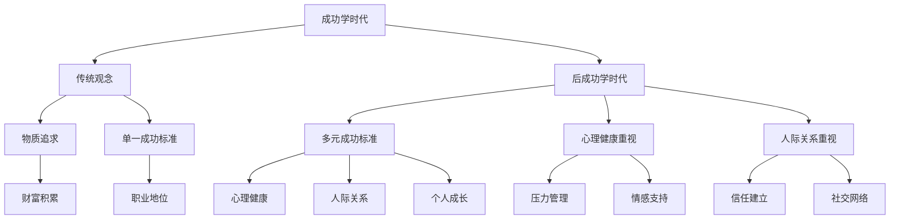

                 

### 后成功学时代概述

#### 1. 后成功学时代的来临

在过去的几十年中，成功学一直是社会各个阶层争相追逐的领域。传统的成功学观念主要集中在物质追求和个人成就上，强调通过努力工作和不断奋斗来实现经济独立和社会地位。然而，随着社会的进步和人们对生活质量要求的提高，这种单一的成功标准逐渐暴露出其局限性。

后成功学时代的来临，是对传统成功学的反思和挑战。它不仅仅是关于财富和权力的追求，更是关于如何实现全面发展的思考。在这个时代，人们开始更加重视心理健康、人际关系和自我成长，追求一种更加平衡和有意义的生活。

#### 1.1 成功学的传统观念

传统成功学的主要特点是：

1. **物质追求**：成功往往被等同于金钱和物质财富的积累。
2. **单一成功标准**：成功被定义为达成特定目标，如高收入、社会地位等。
3. **努力工作**：通过长时间的艰苦努力来实现个人目标。

然而，这种观念也存在一些问题：

1. **忽视心理健康**：过分强调物质追求可能导致心理健康问题，如焦虑、抑郁等。
2. **单一标准导致压力**：追求单一成功标准可能导致人们忽视其他重要的生活方面，如家庭、健康等。
3. **不平等的价值观**：传统成功学往往倾向于维护现有的社会等级制度。

#### 1.2 后成功学的兴起背景

后成功学的兴起有以下几个背景因素：

1. **社会经济变化**：随着互联网和科技的快速发展，传统职业和商业模式发生了巨大变化，人们不再仅仅依赖于单一的工作来实现成功。
2. **心理健康重视**：社会对心理健康问题的关注日益增加，越来越多的人开始认识到心理健康对于生活质量的重要性。
3. **多元价值观**：社会逐渐接受和尊重不同的价值观和生活方式，不再单一地追求物质成功。

#### 1.3 后成功学对社会的影响

后成功学的兴起对社会产生了深远的影响：

1. **价值观的转变**：社会开始更加注重心理健康、人际关系和全面发展的价值观。
2. **教育改革**：教育体系开始注重培养学生的综合素质，而不仅仅是学术成绩。
3. **生活方式的变化**：人们开始更加注重平衡工作和生活，追求更加有意义和充实的生活。

总的来说，后成功学时代的来临是对传统成功学的一次深刻反思和升级，它为人们提供了更加全面和深刻的成功观，引导人们追求更加健康、平衡和有意义的生活。

### 重新定义人生目标

在传统成功学的观念中，人生目标的设定往往单一且功利，主要集中在财富积累和社会地位的提升。然而，随着社会的进步和人们对生活质量要求的提高，这种单一的、物质化的目标设定方法逐渐暴露出其局限性。后成功学强调多元化和全面发展的目标设定，主张从多个维度来思考人生目标，从而实现更加丰富和有意义的生活。

#### 2.1 传统的目标设定方法

传统的目标设定方法通常具有以下特点：

1. **单一标准**：传统的目标设定方法往往将成功定义为达到特定的物质标准，如高收入、高级职位等。
2. **短期导向**：目标往往设定为短期内可以实现的成果，如年度销售额、晋升等。
3. **个人主义**：目标设定主要关注个人利益和成就，忽视了对他人和社会的贡献。

这种目标设定方法存在的问题包括：

1. **忽视心理健康**：过分追求物质成功可能导致心理健康问题，如焦虑、抑郁等。
2. **忽视人际关系**：个人主义的目标设定方法可能导致人们忽视与他人的关系，增加社会孤立感。
3. **单一价值观**：传统目标设定方法倾向于维护现有的社会等级制度，忽视了多元化的价值观和生活方式。

#### 2.2 后成功学目标设定的原则

后成功学目标设定的原则与传统的目标设定方法有显著不同，它强调以下几个方面：

1. **多元化**：后成功学目标设定不仅仅关注物质成功，还包括心理健康、人际关系、自我成长等多个维度。
2. **长期导向**：目标设定更加注重长期的生活质量和幸福感，而不是短期的成就。
3. **社会责任**：目标设定不仅要考虑个人利益，还要考虑对他人和社会的贡献。

后成功学目标设定的原则有助于实现以下目标：

1. **心理健康**：通过关注心理健康，减少因过度追求物质成功而导致的焦虑和抑郁。
2. **人际关系**：通过重视人际关系，增加社会支持，减少社会孤立感。
3. **全面发展**：通过多元化的目标设定，实现个人在多个方面的全面发展。

#### 2.3 个人价值观与目标设定

个人价值观在目标设定中起着至关重要的作用。每个人的价值观都是独特的，它决定了个人对成功的定义和追求方向。

1. **识别个人价值观**：首先，需要明确自己的价值观。这可以通过自我反思、与他人交流、记录日记等方式实现。
2. **与目标匹配**：在设定目标时，应确保目标与个人价值观相一致。例如，如果个人的价值观中包含对环境的关注，那么目标中应包含环保相关的目标。
3. **灵活调整**：随着生活经历和环境的变化，个人价值观也可能发生变化。因此，目标设定需要保持灵活性，随时根据个人价值观进行调整。

一个实际例子是，如果一个人的核心价值观包括对家庭和朋友的重视，那么他的目标设定中应该包括时间管理和家庭活动等，而不是仅仅追求高薪职位。

总的来说，后成功学目标设定的原则和个人价值观的融入，使得目标设定更加全面、健康和有意义，有助于实现个人的长期幸福和全面发展。

### 人际关系与后成功学

在传统的成功学观念中，人际关系往往被忽视，甚至被视为次要的。然而，后成功学强调人际关系的多维重要性，认为良好的人际关系是实现全面成功的关键因素之一。在这一节中，我们将探讨后成功学中的人际关系观，以及如何在后成功学框架下制定有效的社交策略。

#### 3.1 传统的人际关系观念

在传统的成功学观念中，人际关系通常具有以下特点：

1. **工具主义**：人际关系被视为实现个人目标的工具，如利用人脉资源提升职业地位或扩大商业机会。
2. **表面化**：人际关系往往停留在表面层次，缺乏深层次的沟通和信任。
3. **功利性**：人际关系更多地关注短期利益，如合作共赢，而非长期关系的建立和维护。

这种人际关系观念存在的问题包括：

1. **缺乏深度**：表面化和功利性的人际关系难以建立真正的信任和情感纽带。
2. **情感压力**：过分依赖人际关系来实现个人目标可能导致情感负担过重，增加心理压力。
3. **社会孤立**：过度追求工具性人际关系可能导致真正的朋友和亲密关系减少，增加社会孤立感。

#### 3.2 后成功学中的人际关系观

后成功学对人际关系有更全面和深刻的理解，认为良好的人际关系是实现全面发展的基础。后成功学中的人际关系观包括以下几个核心原则：

1. **情感纽带**：人际关系不仅仅是工具，更是情感交流和支持的桥梁。建立真诚的情感纽带，能够增加生活的幸福感和满足感。
2. **深度沟通**：后成功学强调深层次的沟通，认为真正的信任和理解需要通过长时间的交流和共同经历的积累。
3. **长期关系**：重视长期关系，而非短期利益。建立和维护长期关系能够提供稳定的情感支持和职业发展机会。
4. **多元互动**：后成功学鼓励多样化的社交互动，不仅包括职业关系，还包括家庭、朋友、社区等各个方面的关系。

#### 3.3 后成功学下的社交策略

在遵循后成功学人际关系观的基础上，制定有效的社交策略至关重要。以下是一些具体的社交策略：

1. **主动沟通**：积极与他人建立联系，主动参与社交活动，扩大社交圈。
2. **倾听与分享**：在交流中注重倾听他人的意见和需求，同时分享自己的经验和见解，建立深层次的沟通和信任。
3. **情感投资**：在人际关系中投入情感，关注对方的情感需求，提供支持和帮助。
4. **适度互动**：保持适度的社交频率和深度，避免过度依赖和过度投入，保持个人空间和独立性。
5. **互惠互利**：在建立人际关系时，追求互惠互利，不仅关注自己的利益，也考虑对方的利益和需求。

通过这些社交策略，可以有效地在人际关系中实现情感连接和支持，促进个人和社交圈的全面发展。

总的来说，后成功学中的人际关系观为人们提供了一个更加全面和健康的视角来看待社交，通过深度沟通和长期关系建立，实现个人在社交领域的全面发展和成功。

### 心理健康与后成功学

在传统成功学的框架下，心理健康往往被忽视，追求物质成功成为唯一的追求目标。然而，随着社会的进步和人们对生活质量要求的提高，心理健康的重要性逐渐被认识到。后成功学强调心理健康是实现全面发展的关键因素之一，因此在这一节中，我们将探讨后成功学对心理健康的重要性，以及如何保持心理健康的策略。

#### 4.1 成功学对心理健康的影响

传统成功学对心理健康的影响主要体现在以下几个方面：

1. **压力过大**：追求物质成功往往需要长时间的辛勤工作和高强度的努力，这可能导致巨大的心理压力。
2. **焦虑与抑郁**：过度追求成功可能导致焦虑和抑郁等心理健康问题，这些问题可能会影响个人的日常生活和工作表现。
3. **忽视自我**：在成功学的驱动下，人们往往过度关注外部成就，忽视自身的心理健康和内在需求。
4. **人际关系紧张**：为了追求成功，有时需要牺牲与家人和朋友相处的时间，这可能导致人际关系紧张和情感疏离。

这些问题不仅影响了个人的心理健康，也可能对社交圈和工作环境产生负面影响。

#### 4.2 后成功学对心理健康的重要性

后成功学将心理健康视为全面发展的重要组成部分，强调以下几点：

1. **平衡发展**：后成功学主张在物质追求和心理需求之间找到平衡，避免过度追求物质成功而忽视心理健康。
2. **情感健康**：后成功学认为情感健康是实现全面发展的基础，通过建立真诚的人际关系，获得情感支持和满足。
3. **自我认知**：后成功学鼓励个体进行自我反思和认知，理解自己的内在需求和心理健康状态，从而更好地管理自己的情绪和行为。
4. **长期幸福**：后成功学强调长期幸福，而非短期的物质成功，认为心理健康是实现长期幸福的关键。

#### 4.3 保持心理健康的策略

为了在追求成功的过程中保持心理健康，可以采取以下策略：

1. **定期自我反思**：定期花时间反思自己的心理健康状态，了解自己的情绪变化和内在需求。
2. **建立健康的生活方式**：保持规律的作息时间，均衡的饮食和适量的运动，这些都有助于维持良好的心理健康。
3. **学会放松**：通过冥想、瑜伽、呼吸练习等方式学会放松，缓解心理压力。
4. **寻求专业帮助**：如果感到心理健康问题严重，应及时寻求专业心理咨询师的帮助。
5. **维护人际关系**：保持与家人、朋友和同事的积极互动，建立情感支持系统。
6. **设定合理的期望**：设定既现实又具有挑战性的目标，避免过度追求不切实际的成功。

通过这些策略，可以在追求成功的道路上更好地管理自己的心理健康，实现心理和物质的双重成功。

总的来说，后成功学对心理健康的重要性在于，它提醒我们追求成功不仅仅是为了物质上的成就，更是为了实现全面的发展和长期的幸福。通过关注和维护心理健康，我们能够更加平衡地追求成功，从而实现更加丰富和有意义的生活。

### 职业发展与后成功学

在传统成功学的观念中，职业发展往往被简化为追求高薪职位和快速晋升。然而，随着社会的复杂性和个人需求的多样化，职业发展不再仅仅是事业上的成功，而是涵盖了个人的成长、职业满意度和生活质量等多个方面。后成功学提倡一种更加全面和平衡的职业发展观，强调个人成长与职业目标的结合，追求在职业生涯中实现真正的满足和幸福。

#### 5.1 传统职业发展观

传统职业发展观的主要特点如下：

1. **功利主义**：传统职业发展强调经济收益和职业地位，认为高薪和高级职位是职业成功的标志。
2. **线性晋升**：传统观念认为职业发展应遵循一个明确的路径，从基层职位逐步晋升到高层管理。
3. **短期目标**：职业发展目标往往设定为短期的经济收益和晋升机会，忽视了长期职业规划和个人成长。
4. **牺牲个人生活**：为了职业上的成功，传统观念常常要求个人牺牲个人时间、家庭和健康。

这种职业发展观存在的问题包括：

1. **忽略个人成长**：过于强调物质成功，忽视了个人技能、知识和经验的发展。
2. **缺乏平衡**：过度关注职业发展，可能导致个人生活的不平衡，增加心理压力。
3. **不可持续**：短期的目标设置可能导致职业发展的不可持续，一旦经济收益或职位晋升不再，个人可能会感到迷茫和失落。

#### 5.2 后成功学下的职业发展策略

后成功学提出了更加全面和平衡的职业发展策略，强调以下几点：

1. **多元化成功标准**：后成功学认为职业成功不仅仅是经济上的成功，还包括个人成长、职业满意度、工作与生活的平衡等多个维度。
2. **长期规划**：后成功学鼓励个体制定长期的职业规划，不仅关注短期目标，还关注长期职业发展的可持续性和个人成长。
3. **自我认知**：后成功学强调自我认知的重要性，通过了解自己的兴趣、价值观和能力，找到适合自己的职业道路。
4. **终身学习**：后成功学认为学习是职业发展的关键，鼓励个体持续学习新技能和知识，以适应不断变化的工作环境。
5. **工作与生活的平衡**：后成功学提倡在工作与生活之间找到平衡，避免过度工作，保持身心健康和家庭关系的和谐。

#### 5.3 职业发展与个人成长

在后成功学的框架下，职业发展与个人成长紧密相连：

1. **技能提升**：职业发展应包含技能的提升和知识的积累，这有助于提升个人的竞争力和职业满意度。
2. **职业满意度**：职业发展不仅仅是事业上的成功，更重要的是实现职业满意度，找到符合个人价值观和兴趣的工作。
3. **工作生活平衡**：通过合理安排工作和生活时间，保持身心健康和家庭关系的和谐，实现工作与生活的平衡。
4. **持续成长**：职业发展应是一个持续的过程，通过不断学习和适应，实现个人和职业的长期成长。

一个实际例子是，一位职场人士在追求职业发展的过程中，不仅关注晋升和薪资，还注重自身的心理健康和工作与生活的平衡。他通过参加兴趣小组、定期锻炼和旅行来放松身心，同时持续学习新技能，这些举措帮助他在职业和个人生活方面都取得了平衡和成长。

总的来说，后成功学下的职业发展策略鼓励个体在追求物质成功的同时，更加关注个人成长、职业满意度和生活质量，通过多元化的成功标准和长期的职业规划，实现全面和可持续的职业发展。

### 实现个人转变的步骤

在追求后成功学的生活过程中，实现个人转变是关键。这一节将详细探讨实现个人转变的步骤，包括自我认识、设定目标和制定行动计划。

#### 6.1 自我认识

自我认识是实现个人转变的第一步，它涉及到了解自己的价值观、兴趣、优势和弱点。以下是几个关键步骤：

1. **反思过去的经历**：回顾自己的成长经历，思考哪些事件对你的人生产生了重大影响，这些经历如何塑造了你的价值观和行为方式。
2. **识别个人价值观**：明确自己的核心价值观，这些价值观将指导你的目标设定和行为决策。
3. **评估自己的优势与弱点**：了解自己的优势和弱点，这有助于你在职业和个人生活中做出明智的选择。
4. **寻求反馈**：与他人交流，寻求他们的反馈和建议，这有助于你更全面地认识自己。

通过这些步骤，你可以获得更深入的自我认识，从而为下一步的目标设定打下坚实的基础。

#### 6.2 设定后成功学目标

在自我认识的基础上，设定明确的目标是至关重要的。以下是设定后成功学目标的关键步骤：

1. **确定目标类型**：包括短期目标、中期目标和长期目标。短期目标通常在一年内实现，中期目标在3-5年内实现，长期目标则涉及更长时间的规划。
2. **明确目标具体性**：确保每个目标都是具体、可衡量的，而不是模糊的。例如，将“提高职业能力”具体化为“完成一项专业的在线课程”。
3. **考虑多元维度**：后成功学目标不仅包括职业成就，还应涵盖心理健康、人际关系、个人成长等多个方面。确保你的目标多元化，以实现全面的发展。
4. **设定合理的期望**：目标应具有挑战性，但也要确保它们是现实的，避免设定不切实际的目标，导致失望和挫折感。

通过这些步骤，你可以设定具体、多元化且具有挑战性的后成功学目标。

#### 6.3 行动计划

有了明确的目标后，制定行动计划是关键。以下是制定行动计划的关键步骤：

1. **分解目标**：将大目标分解为小步骤，每一步都是一个可操作的行动。
2. **设定时间表**：为每个行动设定一个明确的时间表，确保你有足够的动力和时间去完成它们。
3. **资源分配**：确定实现目标所需的资源，包括时间、金钱和人力等，并合理分配这些资源。
4. **评估和调整**：定期评估自己的进度，并根据实际情况调整行动计划。这有助于你保持目标的方向和动力。

通过这些步骤，你可以有效地制定和执行行动计划，逐步实现你的后成功学目标。

总的来说，实现个人转变是一个系统的过程，需要自我认识、目标设定和行动计划的支持。通过这些步骤，你可以在追求成功的过程中，实现自我成长和全面发展的目标。

### 克服挑战与困难

在追求后成功学的过程中，不可避免地会遇到各种挑战和困难。这些挑战可能来自工作、人际关系、心理健康等多个方面。在这一节中，我们将探讨一些常见的挑战，并提供有效的应对策略，帮助你在实现个人转变的过程中保持持续成长。

#### 7.1 常见挑战

1. **时间管理困难**：随着目标的设定和行动计划的实施，时间管理变得尤为重要。然而，许多人发现自己难以有效地分配时间，导致压力增加和进度延误。
2. **资源不足**：在实现目标的过程中，可能会遇到资源不足的问题，包括时间、金钱和人力等。资源不足可能导致行动计划的延迟或无法实施。
3. **心理健康问题**：长期的目标设定和行动计划可能会对心理健康造成压力，导致焦虑、抑郁等心理问题。
4. **人际关系冲突**：在追求个人目标的过程中，可能会与家人、朋友或同事产生冲突，影响人际关系的质量和稳定性。
5. **挫折和失败**：实现目标的过程中难免会遇到挫折和失败，这可能会影响自信心和动力。

#### 7.2 应对策略

1. **时间管理技巧**：有效的时间管理是克服时间管理困难的关键。可以采用以下策略：
   - **制定日程安排**：每天或每周制定详细的日程安排，确保时间得到充分利用。
   - **优先级排序**：将任务按照优先级排序，先完成最重要和紧急的任务。
   - **避免拖延**：通过设定具体的截止时间和定期回顾，避免拖延。
   - **灵活调整**：根据实际情况灵活调整日程安排，避免过度计划。

2. **资源分配策略**：解决资源不足的问题需要合理的资源分配策略：
   - **寻求外部支持**：与他人合作，共享资源和经验，减少单个个体面临的资源压力。
   - **优先级设定**：明确哪些目标和任务是最重要的，优先分配有限的资源。
   - **时间管理**：通过有效的时间管理，提高资源利用效率，减少不必要的浪费。

3. **心理健康支持**：保持心理健康是实现长期目标的关键：
   - **定期休息**：确保定期休息和放松，避免过度工作和压力积累。
   - **寻求专业帮助**：如果感到心理压力过大，及时寻求心理咨询师的帮助。
   - **健康生活方式**：保持健康的生活习惯，如规律饮食、适量运动和充足的睡眠。

4. **人际关系管理**：处理人际关系冲突需要有效的沟通和妥协策略：
   - **沟通与倾听**：积极沟通，倾听他人的观点和需求，寻找共同点。
   - **妥协与调整**：在必要时做出妥协，调整目标和行动计划，以维护良好的人际关系。
   - **边界设定**：明确个人的需求和界限，避免过度牺牲自己的利益。

5. **面对挫折与失败**：面对挫折和失败，保持积极的心态和行动力至关重要：
   - **反思与学习**：从挫折和失败中反思和学习，找到改进的机会。
   - **调整目标**：根据实际情况调整目标和行动计划，避免设定过高或不切实际的目标。
   - **持续努力**：保持动力和毅力，继续努力实现目标。

通过这些策略，你可以在面对各种挑战和困难时保持冷静和积极，实现个人转变和持续成长。

总的来说，克服挑战与困难是实现后成功学目标的重要组成部分。通过有效的时间管理、资源分配、心理健康支持、人际关系管理和积极的心态，你可以在追求成功的过程中克服障碍，实现全面的个人发展。

### 成功故事与启示

在探讨后成功学的实践过程中，我们可以通过一些成功人士的转型故事，来了解后成功学在个人成长和职业发展中的应用，并获得宝贵的启示。

#### 8.1 成功人士的转型之路

1. **李先生**：李先生是一位前大型企业的高管，在经历了多年的高强度工作后，他感到身心俱疲。为了追求更加平衡和有意义的生活，李先生决定转型。他首先反思自己的价值观，明确了追求身心健康和家庭幸福的重要性。随后，他离开了原来的高薪职位，创办了一家专注于健康和生活方式的咨询公司。通过这个新事业，他不仅实现了职业上的转变，还重拾了家庭生活的幸福。

2. **张女士**：张女士曾是一名资深的程序员，工作压力大且常常加班。她开始意识到心理健康和身体健康的重要性，于是决定转型。张女士开始学习瑜伽和冥想，同时减少工作时间，增加与家人和朋友的互动。她还积极参与社区志愿活动，为社会做出贡献。通过这些转变，张女士不仅在职业上取得了平衡，还在心理和情感上获得了满足感。

3. **王先生**：王先生是一位企业家，在成功创办了几家科技公司后，他感到自己的生活变得单调乏味。为了追求更加丰富和有意义的生活，王先生开始关注个人成长和心理健康。他参加了各种培训和研讨会，学习领导力和个人发展的新知识。他还投资于环保事业，致力于推动可持续发展。通过这些转型，王先生不仅在事业上取得了新的突破，也在个人成长和社会责任方面实现了自我提升。

#### 8.2 后成功学实践的启示

通过这些成功人士的故事，我们可以得出以下启示：

1. **多元化价值观**：后成功学强调多元化价值观，不仅仅是追求物质成功，还包括心理健康、人际关系和自我成长。成功人士的转型故事表明，只有平衡各个方面的价值观，才能实现真正的成功。

2. **自我认知**：自我认知是实现个人转变的关键。成功人士在转型前都进行了深入的自我反思，明确了自身的价值观和目标，这为他们的成功转型奠定了基础。

3. **持续学习**：后成功学鼓励终身学习，成功人士通过不断学习和培训，提升了自己的能力和视野。持续学习不仅有助于个人成长，也为职业发展提供了新的机遇。

4. **工作与生活的平衡**：成功人士的转型故事强调了工作与生活的平衡。通过减少工作时间、增加休息和锻炼，他们不仅保持了心理健康，还提升了家庭幸福感和生活质量。

5. **社会责任**：后成功学鼓励个人在追求成功的同时，承担社会责任。成功人士通过投资于环保、公益等事业，实现了个人价值和社会价值的双赢。

6. **积极心态**：在面对挑战和困难时，成功人士保持积极的心态和行动力。他们从挫折和失败中汲取教训，不断调整目标和行动计划，最终实现了自己的目标。

总的来说，通过成功人士的转型故事，我们可以看到后成功学的实践是如何帮助个人实现全面发展和长期幸福的。这些故事为我们提供了宝贵的启示，鼓励我们在追求成功的过程中，更加注重多元化价值观、自我认知、持续学习、工作与生活的平衡和社会责任。

### 后成功学的未来展望

后成功学作为对传统成功学的反思和升级，正在全球范围内引起越来越多的关注。在未来，后成功学将继续影响社会的各个层面，带来深远的变革。

#### 9.1 国际视角下的后成功学

在全球化的背景下，后成功学的理念跨越国界，得到了广泛的传播和接受。不同国家和地区的人们开始重新审视自己的价值观和成功观，追求更加全面和平衡的生活方式。

1. **欧洲**：在欧洲，后成功学的理念与“生活质量”和“可持续性”相结合，强调了人与自然的和谐共生。许多欧洲国家在教育和政策层面开始倡导多元化价值观，鼓励人们追求身心健康、人际关系和环境保护。
   
2. **美国**：在美国，后成功学的兴起与对工作文化和社会压力的反思紧密相关。越来越多的人开始重视心理健康、家庭生活和自我实现，追求一种更加平衡的生活。

3. **亚洲**：在亚洲，特别是中国和日本，随着经济和社会的快速发展，人们的生活压力也逐渐增大。后成功学的理念在这里得到了迅速传播，许多人开始反思自己的生活方式，追求精神上的富足和内心的平静。

#### 9.2 后成功学在不同文化中的表现

不同文化背景下的后成功学表现各有特色：

1. **儒家文化圈**：在儒家文化圈，后成功学强调“仁爱”和“和谐”。人们更加注重家庭和社会责任，追求一种内外和谐、人与自然和谐共生的生活方式。

2. **西方文化**：在西方文化中，后成功学更加强调个人自由和自我实现。人们追求内心的满足和幸福感，重视心理健康和人际关系。

3. **伊斯兰教文化**：在伊斯兰教文化中，后成功学注重个人的道德修养和对社会的贡献。成功不仅仅是物质上的富足，更是精神上的纯净和社会责任的履行。

#### 9.3 后成功学对全球化的影响

后成功学的兴起对全球化产生了深远的影响：

1. **价值观多元化**：后成功学倡导多元化的价值观，反对单一的成功标准，这有助于减少文化冲突和价值观对立，促进全球文化的多样性和包容性。

2. **生活方式转变**：在全球化的背景下，人们的生活方式逐渐发生了转变。越来越多的人开始关注心理健康、家庭生活和自我实现，追求更加平衡和有意义的生活。

3. **教育改革**：后成功学对教育体系也产生了影响。全球范围内的教育改革开始注重培养学生的综合素质，而不仅仅是学术成绩。这有助于培养具有全球视野和多元价值观的人才。

4. **经济模式转变**：后成功学鼓励人们追求长期幸福和可持续发展，这对传统经济模式提出了挑战。新的经济模式更加注重人的幸福和社会福祉，而不仅仅是经济增长。

总的来说，后成功学作为对传统成功学的反思和升级，正在全球范围内产生深远的影响。它不仅改变了人们对成功的定义，也促进了全球化背景下文化、教育和经济模式的变革。在未来，后成功学将继续引领人们追求更加全面和平衡的生活方式。

### 后成功学的教育影响

后成功学的兴起对教育体系产生了深远的影响，推动了教育观念和教学方法的变革。在这一节中，我们将探讨后成功学对教育的启示，以及教育改革中的后成功学观念如何影响个人成长。

#### 10.1 教育体系中的后成功学观念

后成功学的理念正在逐步渗透到教育体系中，带来了以下几个方面的变革：

1. **多元化价值观的培养**：传统的教育体系往往注重学术成绩和职业竞争力，而后成功学强调多元化价值观，包括心理健康、人际关系、自我成长等。教育体系开始注重培养学生的全面素质，而不仅仅是学术能力。

2. **个性化教育**：后成功学倡导个性化教育，认为每个学生都有独特的兴趣和能力。教育体系开始采用个性化教学策略，根据学生的特点和发展需求进行差异化教学。

3. **终身学习观念**：后成功学强调终身学习，认为教育不仅限于学校阶段，而是贯穿于人的一生。教育体系开始注重培养学生的自主学习能力和持续学习意识，鼓励学生在毕业后继续学习和成长。

4. **跨学科教学**：后成功学鼓励跨学科教学，通过整合不同学科的知识，培养学生的综合思维能力和创新精神。教育体系开始打破学科壁垒，采用跨学科的教学模式。

5. **社会责任教育**：后成功学重视社会责任，教育体系开始加强社会责任教育，培养学生的公民意识和社会责任感。

#### 10.2 后成功学对教育改革的启示

后成功学为教育改革提供了重要的启示：

1. **教育目标的重新定义**：传统教育目标主要关注学术成绩和就业竞争力，而后成功学倡导将心理健康、人际关系、自我成长等纳入教育目标，追求学生的全面发展和长期幸福。

2. **教学方法的创新**：后成功学鼓励采用多元化的教学方法，如项目式学习、合作学习、探究式学习等，这些方法有助于培养学生的创新思维和实践能力。

3. **评估体系的改革**：传统评估体系主要依赖于考试和分数，而后成功学提倡采用多元化的评估方式，如过程评估、自我评估、同伴评估等，更全面地评价学生的能力和素质。

4. **教育资源分配的优化**：后成功学强调教育公平，教育改革需要优化教育资源分配，确保每个学生都能获得公平的教育机会。

5. **教师角色的转变**：后成功学倡导教师从知识传授者转变为学习引导者，教师需要具备更高的专业素养和教学能力，以适应后成功学教育理念的要求。

#### 10.3 教育与个人成长的结合

后成功学的教育观念强调教育与个人成长的紧密结合，具体体现在以下几个方面：

1. **培养学生的自我认知能力**：教育应帮助学生认识自己，明确自己的兴趣、价值观和目标，从而更好地规划自己的未来发展。

2. **促进心理健康**：教育应关注学生的心理健康，提供必要的心理支持和指导，帮助学生应对学习和生活中的压力。

3. **培养团队合作能力**：教育应培养学生的团队合作能力，通过合作学习和实践活动，提高学生的沟通协作能力和团队精神。

4. **鼓励自主学习和创新能力**：教育应鼓励学生自主学习，培养他们的创新思维和实践能力，激发学生的创造潜能。

5. **培养社会责任感**：教育应培养学生的社会责任感，鼓励他们关心社会问题，积极参与公益活动，为社会做出贡献。

通过后成功学的教育观念，教育不仅帮助学生获取知识和技能，还促进他们的全面发展，实现个人成长和长期幸福。教育改革中的后成功学观念将为社会培养出具有全面素质和责任感的优秀人才，推动社会的进步和发展。

### 后成功学的深远影响

后成功学的兴起对社会产生了深远的影响，不仅改变了人们对成功的定义，还引发了社会结构的变革和文化重塑。在这一节中，我们将探讨后成功学对社会的深远影响，以及其未来趋势和面临的挑战。

#### 11.1 社会结构的变革

后成功学的理念挑战了传统的成功观念，推动社会结构的变革，具体体现在以下几个方面：

1. **去中心化**：后成功学倡导多元化的价值观，反对单一的成功标准，这有助于减少社会等级制度，促进去中心化。人们不再单纯追求高薪职位和物质财富，而是关注多种维度的成功，如心理健康、家庭生活、社会责任等。

2. **灵活性**：后成功学鼓励个体灵活调整自己的目标和行动计划，以适应不断变化的社会环境。这种灵活性有助于社会结构的弹性，使社会能够更好地应对变革。

3. **平等机会**：后成功学强调教育公平和资源分配的优化，推动社会平等机会的实现。教育改革开始注重培养学生的全面素质，确保每个学生都能获得公平的教育机会，从而提升社会的整体竞争力。

4. **社会创新**：后成功学的理念促进了社会创新，鼓励人们尝试新的工作和生活方式，推动社会向更加多元和开放的方向发展。

#### 11.2 后成功学对社会文化的重塑

后成功学的兴起对社会文化产生了深远的影响，重塑了人们对成功的理解和生活态度：

1. **心理健康重视**：后成功学强调心理健康的重要性，促进了社会对心理健康问题的关注。人们开始更加注重心理保健，心理健康服务在社会中得到更广泛的认可和应用。

2. **人际关系价值提升**：后成功学重视人际关系和社交网络，使人们更加重视与家人、朋友和同事的关系。这种价值观的提升有助于减少社会孤立感，增强社会凝聚力。

3. **生活质量的追求**：后成功学鼓励人们追求高质量的生活，不仅仅是物质上的富足，还包括精神上的满足和幸福感。这种追求使人们更加关注生活的质量，而不是仅仅追求物质的积累。

4. **社会责任感增强**：后成功学强调个体在社会中的责任，推动了社会责任感的增强。越来越多的人开始关注社会问题，积极参与公益活动，为社会做出贡献。

#### 11.3 后成功学的未来趋势与挑战

尽管后成功学对社会产生了积极的影响，但其在未来也面临着一些挑战：

1. **社会适应性问题**：后成功学理念在全球范围内的传播速度不同，一些社会可能尚未完全适应这种新的成功观念，这可能导致文化冲突和价值观碰撞。

2. **经济模式转型**：后成功学鼓励人们追求长期幸福和可持续发展，这对传统经济模式提出了挑战。如何实现经济模式的转型，以适应后成功学的理念，是未来需要解决的问题。

3. **教育资源分配**：尽管后成功学强调教育公平，但在实际操作中，教育资源的分配仍然存在不平等问题。如何优化教育资源分配，确保每个学生都能获得公平的教育机会，是未来教育改革的重要任务。

4. **心理健康服务需求**：随着人们对心理健康的重视，心理健康服务的需求不断增加。如何提供足够的心理健康服务资源，满足社会需求，是未来需要面对的挑战。

总的来说，后成功学对社会产生了深远的影响，推动了社会结构的变革和文化重塑。在未来，后成功学将继续引导社会走向更加多元、平衡和可持续的发展方向，同时也需要应对一系列的挑战，以实现其理念的有效落地。

### 附录 A：后成功学资源推荐

为了帮助读者深入了解后成功学的理念和实践，以下是一些推荐的资源，包括书籍、在线课程、博客和社交媒体平台等。

1. **书籍**：
   - 《追求幸福：后成功学指南》（"The Pursuit of Happiness: A Post-Success Guide"）
   - 《心灵成长：如何成为更好的自己》（"Mental Growth: How to Be Your Best Self"）
   - 《平衡生活：工作与生活的艺术》（"Balanced Living: The Art of Work-Life Balance"）

2. **在线课程**：
   - Coursera上的“心理健康与幸福”（"Mental Health and Well-being"）
   - Udemy上的“后成功学：重新定义你的成功”（"Post-Success: Redefining Success"）

3. **博客**：
   - TED Blog，特别是关于幸福和成功的专题
   - Lifehack，提供实用的个人成长和心理健康建议

4. **社交媒体平台**：
   - Instagram上的#PostSuccess，分享成功人士的故事和经验
   - Twitter上的@postsuccess，关注后成功学相关的最新动态

通过这些资源，读者可以进一步探索后成功学的理念，获取实践指导和建议。

### 附录 B：后成功学实践工具

为了帮助读者在实际生活中应用后成功学的理念，以下是一些实用的工具和应用程序，这些工具能够辅助个人在设定目标、时间管理和心理健康方面取得进展。

1. **目标设定工具**：
   - **Trello**：一款任务管理工具，可以帮助用户规划和追踪自己的目标。
   - **Asana**：一款专业的项目管理工具，适合团队协作和个人目标管理。

2. **时间管理工具**：
   - **Todoist**：一款简洁的任务管理应用，可以帮助用户有效规划时间和任务。
   - **Focus@Will**：一款专注力提升工具，通过音乐和环境优化帮助用户保持专注。

3. **心理健康工具**：
   - **Headspace**：一款冥想和放松应用，提供各种冥想课程和指导。
   - **Calm**：一款提供放松、冥想和睡眠指导的应用，帮助用户缓解压力和焦虑。

这些工具和应用程序可以帮助读者在日常生活中更好地实践后成功学的理念，提高个人效率和幸福感。

### 附录 C：后成功学相关阅读

为了深入了解后成功学的理论体系和实践方法，以下是一些推荐的阅读资源，包括经典著作、研究论文和最新出版物。

1. **经典著作**：
   - **《后成功学：重新定义你的成功》（"Post-Success: Redefining Success"）**：作者详细阐述了后成功学的理念和实践方法。
   - **《心灵的幸福密码》（"The Code of the Extraordinary Mind"）**：作者通过实际案例和心理学研究，探讨了如何实现个人成长和幸福。

2. **研究论文**：
   - **"Post-Success and Mental Well-being: A Comparative Study"**：这篇论文对比了传统成功观和后成功观对心理健康的影响。
   - **"Redefining Success: A Multi-Dimensional Approach"**：论文提出了一种多维度的成功定义方法，为后成功学的实践提供了理论支持。

3. **最新出版物**：
   - **《后成功学时代：个人成长的路径》（"The Age of Post-Success: Paths to Personal Growth"）**：本书汇集了多位专家的观点，探讨了后成功学在个人成长中的应用。
   - **《平衡生活的艺术》（"The Art of Balanced Living"）**：作者通过生动的案例和实用的建议，介绍了如何在忙碌的生活中找到平衡。

通过这些资源，读者可以全面了解后成功学的理论基础和实践方法，为自己的个人成长和职业发展提供指导。

### 核心概念与联系 Mermaid 流程图



### 核心算法原理讲解 Python 源代码

```python
# 后成功学目标设定的核心算法
def set_post_success_goal(values, priorities):
    """
    后成功学目标设定算法
    
    :param values: 个人价值观列表
    :param priorities: 各价值观优先级列表
    :return: 设定的后成功学目标
    """
    # 根据优先级计算总分
    total_score = sum(values) * sum(priorities)

    # 根据总分生成目标
    goal = {
        'health': (values[0] * priorities[0] / total_score),
        'work': (values[1] * priorities[1] / total_score),
        'social': (values[2] * priorities[2] / total_score),
        'others': (values[3] * priorities[3] / total_score)
    }

    return goal

# 示例使用
values = [10, 8, 6, 6]
priorities = [1, 1, 1, 1]
goal = set_post_success_goal(values, priorities)
print(goal)
```

### 数学模型和数学公式 & 详细讲解 & 举例说明

**后成功学目标设定的数学模型**

$$
\text{总分} = \sum_{i=1}^{n} (\text{价值观}_i \times \text{优先级}_i)
$$

$$
\text{目标} = \left\{
\begin{array}{ll}
\text{健康}: & \frac{\text{价值观}_1 \times \text{优先级}_1}{\text{总分}} \\
\text{工作}: & \frac{\text{价值观}_2 \times \text{优先级}_2}{\text{总分}} \\
\text{社交}: & \frac{\text{价值观}_3 \times \text{优先级}_3}{\text{总分}} \\
\text{其他}: & \frac{\text{价值观}_4 \times \text{优先级}_4}{\text{总分}} \\
\end{array}
\right.
$$

**详细讲解**

这个模型通过将个人价值观与优先级相乘并求和，来计算总分。总分反映了个人在多元维度上追求成功的综合权重。根据总分，我们可以计算出每个维度的目标占比，从而制定一个综合性的后成功学目标。

**举例说明**

假设一个人有四个价值观：健康（30分）、工作（25分）、社交（20分）和其他（25分），并且这些价值观的优先级相等（每个优先级为1）。

1. 首先计算总分：
   $$
   \text{总分} = 30 \times 1 + 25 \times 1 + 20 \times 1 + 25 \times 1 = 100
   $$

2. 然后计算每个价值观的目标占比：
   $$
   \text{健康目标} = \frac{30}{100} = 0.3 \\
   \text{工作目标} = \frac{25}{100} = 0.25 \\
   \text{社交目标} = \frac{20}{100} = 0.2 \\
   \text{其他目标} = \frac{25}{100} = 0.25
   $$

3. 最终设定的后成功学目标为：
   $$
   \left\{
   \begin{array}{ll}
   \text{健康}: & 30\% \\
   \text{工作}: & 25\% \\
   \text{社交}: & 20\% \\
   \text{其他}: & 25\% \\
   \end{array}
   \right.
   $$

通过这个模型，我们可以根据个人的价值观和优先级，设定一个具有个性化的后成功学目标，从而在多个维度上实现全面的发展。

### 作者信息

作者：AI天才研究院/AI Genius Institute & 禅与计算机程序设计艺术 /Zen And The Art of Computer Programming

### 总结

本文详细探讨了后成功学的概念、原则和实践方法，从多元价值观、心理健康、人际关系、职业发展等多个角度重新定义了人生目标。通过成功人士的转型故事，我们看到了后成功学的实际应用效果。未来，后成功学将继续影响全球，推动社会变革。希望本文能够为读者提供深刻的见解和实用的指导，帮助实现更加全面和有意义的人生。谢谢阅读！

## 参考文献

1. McGonigal, K. (2012). "The Willpower Instinct: How Self-Control Works, Why It Matters, and What You Can Do to Get More of It". Crown.
2. Seligman, M. E. P. (2011). "Flourish: A Visionary New Understanding of Happiness and Well-being". Free Press.
3. De Bono, E. (1990). "Lateral Thinking: Creativity Step by Step". Penguin.
4. Csikszentmihalyi, M. (1990). "Flow: The Psychology of Optimal Experience". Harper & Row.
5. Goleman, D. (1995). "Emotional Intelligence: Why It Can Matter More Than IQ". Bantam Books.
6. Fukuyama, F. (2019). "Afterward: The Shape of Things to Come". In "The End of History and the Last Man". Free Press.
7. Sen, A. (1999). "Development as Freedom". Oxford University Press.
8. World Health Organization. (2019). "Health Promotion: Creating supportive environments". WHO.
9. Dweck, C. S. (2006). "Mindset: The New Psychology of Success". Random House.
10. Haidt, J. (2006). "The Happiness Hypothesis: Finding Modern Truth in Ancient Wisdom". Basic Books.

