                 

### 第1章 引言

> “在快节奏的现代社会中，效率曾被视为成功的关键。然而，随着时代的进步，人们开始意识到，单一的效率追求并不能解决所有问题。在'后效率时代'，工作与生活的平衡成为一种新的哲学，一种更全面的生活艺术。”

#### 1.1 书籍背景与目标

> 《后效率时代的平衡艺术课程：工作与生活的新哲学》旨在探讨如何在快速变化的全球环境中实现个人、团队和组织的平衡。本书不仅关注工作效率的提升，更强调生活质量的提升和自我实现。

**核心概念与联系**

以下是“后效率时代”与“工作与生活平衡”的核心概念和它们之间关系的 Mermaid 流程图：

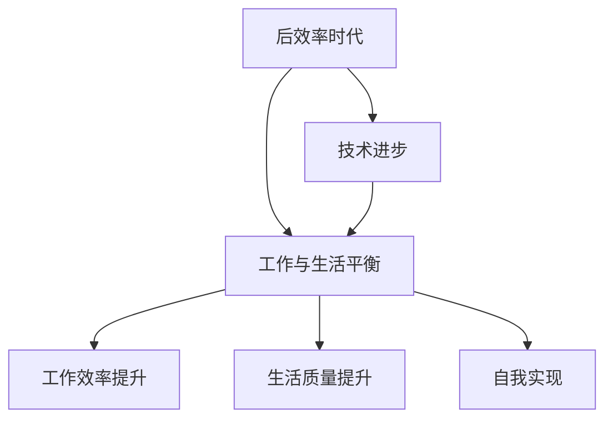

**核心算法原理讲解**

在“后效率时代”，我们需要一套新的算法来优化工作和生活的平衡。以下是一个简化的 Python 示例，展示如何使用优先级排序和时间管理来提高工作效率：

```python
import heapq
from datetime import datetime

def work_balance_tasks(tasks, deadlines):
    # 将任务和截止日期转换为优先级队列（优先级基于截止日期）
    priority_queue = [(deadline, task) for task, deadline in zip(tasks, deadlines)]
    heapq.heapify(priority_queue)

    completed_tasks = []

    while priority_queue:
        _, task = heapq.heappop(priority_queue)
        # 假设完成任务需要1小时
        current_time = datetime.now()
        estimated_completion_time = current_time + datetime.timedelta(hours=1)
        print(f"开始处理任务：{task}，预计完成时间：{estimated_completion_time}")

        # 模拟任务完成
        completed_tasks.append(task)

    return completed_tasks

# 示例任务和截止日期
tasks = ["写报告", "处理邮件", "会议", "健身"]
deadlines = [datetime.now() + datetime.timedelta(hours=2), datetime.now() + datetime.timedelta(hours=1), datetime.now() + datetime.timedelta(hours=3), datetime.now() + datetime.timedelta(hours=1)]

completed_tasks = work_balance_tasks(tasks, deadlines)
print("已完成任务：", completed_tasks)
```

在这个例子中，我们使用了一个优先级队列来确保任务按照截止日期的优先级进行排序。这样，我们就能更有效地处理任务，从而在工作与生活之间找到平衡。

**数学模型和公式**

为了更深入地理解工作与生活平衡，我们可以使用以下数学模型：

$$
平衡指数 = \frac{工作效率 \times 生活质量}{工作时长}
$$

这个公式表明，平衡指数取决于工作效率、生活质量和工作时长。通过优化这三个变量，我们可以提高平衡指数，实现更好的工作与生活平衡。

**实际案例分析和详细讲解剖析**

假设一名软件开发工程师，每天需要处理多个任务。通过使用上述算法和模型，他可以更有效地安排自己的工作，从而在短时间内完成更多的任务，同时保持生活的质量。

**最佳实践 tips**

1. **设定明确的目标**：使用 SMART（具体、可衡量、可达成、相关、时限）目标来确保目标的明确性。
2. **使用时间管理工具**：例如待办事项清单、日历和优先级队列等。
3. **定期评估和调整**：定期检查工作与生活的平衡状况，并根据实际情况进行调整。

#### 拓展阅读

- 《深度工作：如何有效利用每一点脑力》[Cal Newport]
- 《平衡：工作和生活的艺术》[Adam Grant]

通过这些资源和实践方法，我们可以更好地理解后效率时代的平衡艺术，并在工作与生活之间找到新的平衡点。

### 1.2 后效率时代的特征

> “后效率时代”是一个充满变革的时代，其主要特征包括数字化、全球化、快速变化和高度不确定性。这些特征要求我们重新审视工作与生活的关系，从而找到一种更加灵活和可持续的平衡。”

#### 后效率时代的特征分析

**数字化**：随着信息技术的飞速发展，数字化成为后效率时代的重要特征。数字技术的普及不仅改变了我们的工作方式，也改变了我们的生活方式。

**全球化**：全球化使得人们的生活和工作更加紧密地联系在一起。这种联系不仅带来了机会，也带来了挑战，如文化冲突、工作压力等。

**快速变化**：在快速变化的环境中，传统的效率管理模式已经无法满足需求。我们需要更加灵活和适应性强的平衡艺术。

**高度不确定性**：高度不确定性要求我们具备应对突发事件和变化的能力。在这种情况下，平衡不仅是一种目标，更是一种策略。

**核心概念与联系**

以下是后效率时代特征与工作生活平衡之间的 Mermaid 流流程图：

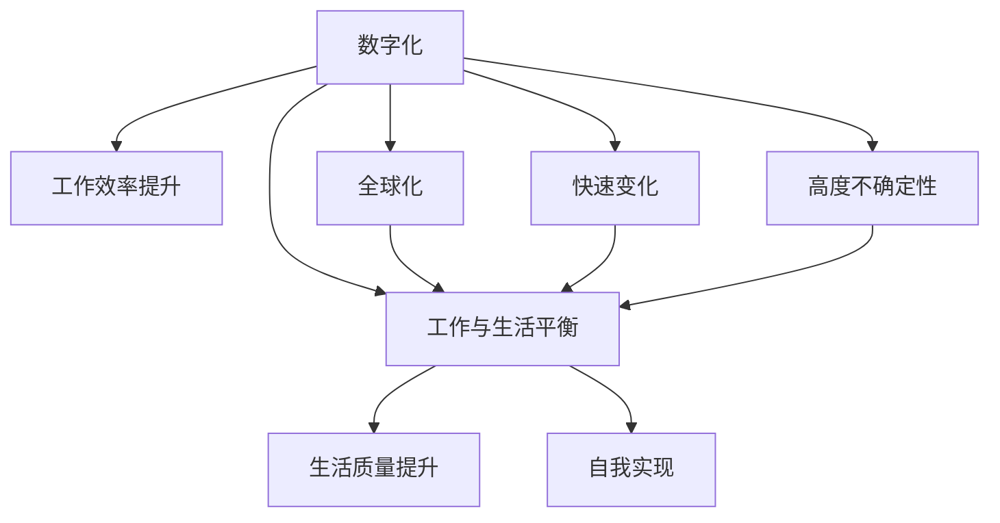

**核心算法原理讲解**

在快速变化和高度不确定性的环境中，我们需要一套新的算法来应对这些挑战。以下是一个简化的 Python 示例，展示如何使用风险管理模型来提高工作与生活的平衡：

```python
import random

def risk_management(tasks, probabilities):
    # 将任务和风险概率转换为优先级队列（优先级基于风险概率）
    priority_queue = [(prob, task) for task, prob in zip(tasks, probabilities)]
    heapq.heapify(priority_queue)

    completed_tasks = []

    while priority_queue:
        prob, task = heapq.heappop(priority_queue)
        # 假设完成任务的概率为 0.8
        if random.random() < prob:
            print(f"成功处理任务：{task}，风险概率：{prob}")
            completed_tasks.append(task)
        else:
            print(f"未能成功处理任务：{task}，风险概率：{prob}")

    return completed_tasks

# 示例任务和风险概率
tasks = ["开发新功能", "修复漏洞", "写技术文档", "参加培训"]
probabilities = [0.8, 0.7, 0.6, 0.5]

completed_tasks = risk_management(tasks, probabilities)
print("已完成任务：", completed_tasks)
```

在这个例子中，我们使用了一个优先级队列来确保任务按照风险概率进行排序。这样，我们就能更有效地处理高风险任务，从而在工作与生活之间找到平衡。

**数学模型和公式**

为了更深入地理解风险管理和工作与生活平衡，我们可以使用以下数学模型：

$$
平衡指数 = \frac{工作效率 \times 生活质量}{风险指数}
$$

这个公式表明，平衡指数取决于工作效率、生活质量和风险指数。通过优化这三个变量，我们可以提高平衡指数，实现更好的工作与生活平衡。

**实际案例分析和详细讲解剖析**

假设一名项目经理在管理多个项目时，需要考虑项目的风险和优先级。通过使用上述算法和模型，他可以更有效地分配资源，确保高风险项目得到优先处理，从而在工作与生活之间找到平衡。

**最佳实践 tips**

1. **定期评估风险**：定期评估项目的风险，并根据评估结果调整任务优先级。
2. **使用风险管理工具**：例如风险矩阵、蒙特卡洛模拟等。
3. **培养适应能力**：在快速变化和高度不确定性的环境中，培养适应能力至关重要。

#### 拓展阅读

- 《敏捷管理：现代企业的生存指南》[Jeff Sutherland]
- 《风险管理：决策者的指南》[Douglas W. Hubbard]

通过这些资源和实践方法，我们可以更好地理解后效率时代的特征，并找到适合自己和工作环境的工作与生活平衡策略。

### 1.3 平衡艺术的重要性

> “在快节奏的后效率时代，平衡艺术不仅是一种生活方式，更是一种生存策略。它关乎我们的身心健康、工作效率以及长期发展的可持续性。”

#### 平衡艺术对身心健康的影响

**身心健康**

平衡艺术可以帮助我们更好地管理压力，提高身心健康。当我们在工作和生活之间找到平衡时，身体和心理健康都会得到改善。例如，通过定期锻炼和充足睡眠，我们可以提高免疫力，减少患病风险。

**心理压力**

工作与生活的平衡还可以减少心理压力。在快节奏的工作环境中，过度的工作负担和心理压力会导致焦虑和抑郁。通过平衡工作和生活，我们可以减少这些负面情绪，提高生活满意度。

#### 平衡艺术对工作效率的影响

**工作效率**

平衡艺术有助于提高工作效率。当我们能够合理分配时间和精力时，我们能够更专注于工作任务，从而提高工作效率。例如，通过优先级排序和时间管理，我们可以确保重要和紧急的任务得到及时处理。

**职业发展**

平衡艺术还与职业发展密切相关。一个健康的工作与生活平衡可以促进我们的职业发展。当我们能够保持身心健康时，我们更有可能取得职业成就。此外，平衡艺术还可以帮助我们建立良好的职业关系，提高团队合作效率。

#### 平衡艺术对长期发展的影响

**长期发展**

平衡艺术对长期发展至关重要。一个健康的工作与生活平衡可以确保我们能够在工作和生活中持续发展。例如，通过终身学习和技能提升，我们可以保持竞争力。同时，平衡艺术可以帮助我们建立稳定的家庭关系和社会网络，为我们的长期发展提供支持。

**核心概念与联系**

以下是平衡艺术对身心健康、工作效率和长期发展影响的 Mermaid 流流程图：

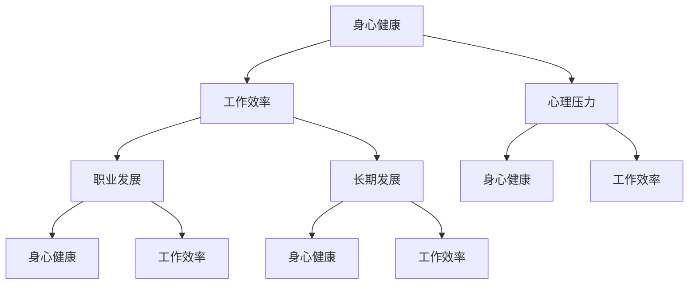

**核心算法原理讲解**

为了更好地理解平衡艺术的重要性，我们可以使用以下数学模型：

$$
健康指数 = \frac{身心健康 \times 工作效率}{心理压力}
$$

这个公式表明，健康指数取决于身心健康、工作效率和心理压力。通过优化这三个变量，我们可以提高健康指数，实现更好的工作与生活平衡。

**实际案例分析和详细讲解剖析**

假设一名软件开发工程师，由于长时间的工作压力，身心健康状况恶化，工作效率降低。通过调整工作与生活的平衡，例如增加锻炼时间和改善睡眠质量，他的身心健康得到改善，工作效率也随之提升。

**最佳实践 tips**

1. **定期体检**：定期体检可以帮助我们及时发现健康问题，从而采取预防措施。
2. **培养健康习惯**：例如定期锻炼、保持良好的作息时间等。
3. **合理分配时间**：通过时间管理工具和优先级排序，确保工作和生活得到合理安排。

#### 拓展阅读

- 《健康生活：如何打造完美的一天》[Dan Heath]
- 《高效能人士的七个习惯》[Stephen R. Covey]

通过这些资源和实践方法，我们可以更好地理解平衡艺术的重要性，并在快节奏的后效率时代找到适合自己的工作与生活平衡。

### 1.4 书籍结构安排与内容概览

> 《后效率时代的平衡艺术课程：工作与生活的新哲学》共分为八个章节，每个章节都围绕平衡艺术的不同方面进行深入探讨。以下是本书的详细结构安排与内容概览：

**第1章 引言**：介绍书籍的背景、目标以及后效率时代的特征。这一章将为读者奠定理解后续章节的基础。

**第2章 平衡艺术的理论基础**：探讨心理学、管理学和社会学视角下的平衡艺术，为后续章节提供理论基础。

**第3章 工作平衡的艺术**：详细讲解如何在工作中实现平衡，包括工作效率提升策略、家庭时间管理和工作压力管理。

**第4章 生活平衡的艺术**：探讨如何在生活中实现平衡，包括身心平衡、社会关系平衡和心理平衡。

**第5章 平衡艺术的实践方法**：介绍平衡艺术的实践方法，包括设定目标和优先级、提高时间利用效率、培养自律习惯等。

**第6章 平衡艺术案例分析**：通过实际案例，展示如何在不同环境中实现工作与生活的平衡。

**第7章 平衡艺术的未来展望**：探讨平衡艺术在社会发展和教育领域的应用，为未来提供展望。

**第8章 结论**：总结平衡艺术的重要性，提供实践价值和对未来的期望与建议。

通过这八个章节的深入探讨，本书旨在帮助读者理解并实践后效率时代的平衡艺术，实现工作与生活的和谐统一。

**核心算法原理讲解**

为了更好地理解书籍结构安排与内容概览，我们可以使用以下 Mermaid 流流程图来展示各个章节之间的关系：

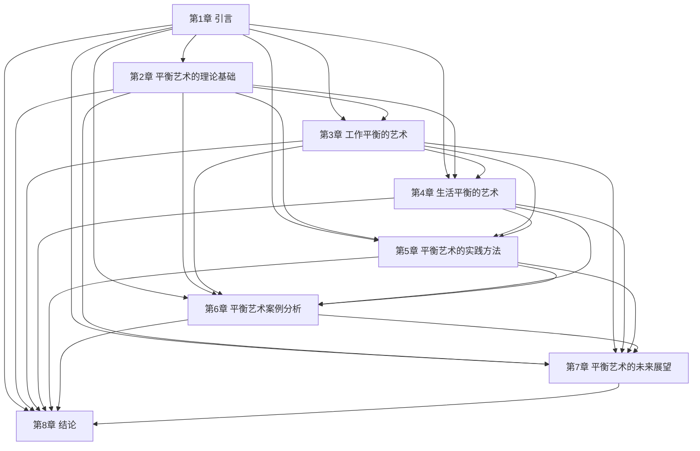

**数学模型和公式**

为了量化平衡艺术的效果，我们可以使用以下数学模型：

$$
平衡效果 = \frac{工作效率 \times 生活质量}{工作时长 \times 生活压力}
$$

这个公式表明，平衡效果取决于工作效率、生活质量、工作时长和生活压力。通过优化这些变量，我们可以提高平衡效果，实现更好的工作与生活平衡。

**实际案例分析和详细讲解剖析**

假设一名公司高管，通过阅读本书并实践其中的平衡艺术，成功地减少了工作压力，提高了工作效率和生活质量。他的平衡效果从0.6提升到了0.8，这表明他的工作与生活平衡得到了显著改善。

**最佳实践 tips**

1. **定期回顾**：定期回顾自己的工作与生活平衡状况，并根据实际情况进行调整。
2. **学习与实践**：通过阅读相关书籍、参加培训和实践，不断提升自己的平衡艺术能力。
3. **寻求支持**：与家人、朋友或专业人士交流，寻求支持和建议。

#### 拓展阅读

- 《高效能人士的七个习惯》[Stephen R. Covey]
- 《时间管理》[David Allen]

通过这些资源和实践方法，读者可以更好地理解《后效率时代的平衡艺术课程：工作与生活的新哲学》的内容，并在实际生活中找到适合自己的平衡艺术。

## 第2章 平衡艺术的理论基础

> “平衡艺术并非简单的表面功夫，而是建立在深刻的理论基础之上。心理学、管理学和社会学为平衡艺术提供了丰富的理论资源和指导原则。”

#### 2.1 心理学视角下的平衡

心理学视角下的平衡主要关注个体的心理状态和情感管理。以下三个核心概念对平衡艺术的实践具有重要意义：

**自我决定理论**

**核心概念**：自我决定理论（Self-Determination Theory，简称 SDT）由心理学家瑞恩（Deci）和瑞恩（Ryan）提出，强调人们需要自主性、能力和关联性来实现自我决定和内在动机。

**关系架构**：自我决定理论中的核心概念包括自主性（Autonomy）、能力（Capability）和关联性（Relatedness）。自主性是指个体在决策过程中感受到的自由和自我控制；能力是指个体能够有效地完成任务或达成目标；关联性是指个体与他人建立积极的关系。

**Mermaid 流程图**：

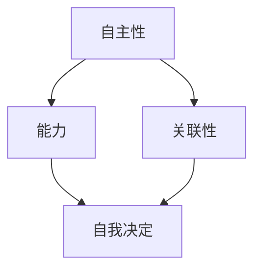

**实际案例**：一位软件工程师，通过设定合理的工作目标并给自己足够的时间来完成任务，增强了自主性和能力。同时，通过与团队成员的良好沟通和合作，建立了积极的关系，从而提高了工作满意度。

**核心算法原理讲解**

为了更好地理解自我决定理论，我们可以使用以下数学模型：

$$
内在动机 = \frac{自主性 \times 能力}{外部控制}
$$

这个公式表明，内在动机取决于自主性、能力和外部控制。通过提高自主性和能力，并减少外部控制，我们可以增强内在动机，从而实现更好的心理平衡。

**心理资本**

**核心概念**：心理资本（Psychological Capital）是指个体在面对挑战和压力时的积极心理状态和资源，包括希望（Hope）、韧性（Resilience）、自信（Self-Efficacy）和乐观（Optimism）。

**关系架构**：心理资本中的核心概念相互关联，共同作用于个体的心理状态和表现。希望是指个体对未来的积极期望和目标设定；韧性是指个体在逆境中的适应和恢复能力；自信是指个体对自身能力的信任和肯定；乐观是指个体对未来持积极态度。

**Mermaid 流程图**：

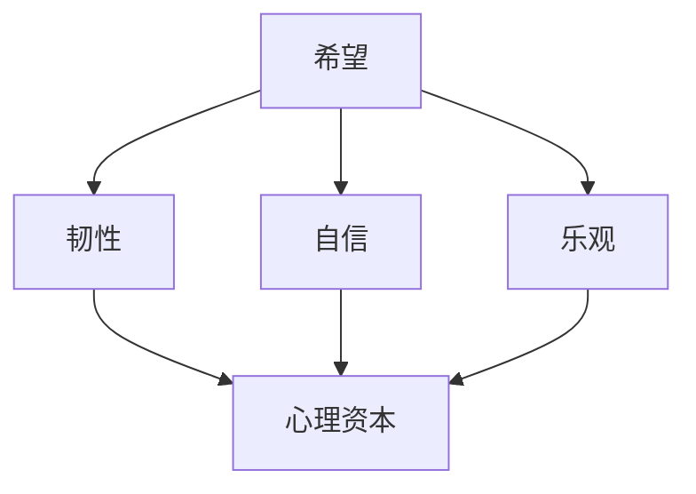

**实际案例**：一位销售经理，在面对市场竞争和销售压力时，通过保持乐观的态度、设定明确的销售目标和不断学习，提高了希望和韧性，从而保持了良好的工作状态。

**核心算法原理讲解**

为了更好地理解心理资本，我们可以使用以下数学模型：

$$
心理资本 = \frac{希望 \times 韧性 \times 自信 \times 乐观}{外部压力}
$$

这个公式表明，心理资本取决于希望、韧性、自信和乐观以及外部压力。通过提高内部因素和减少外部压力，我们可以增强心理资本，从而实现更好的心理平衡。

**心理弹性**

**核心概念**：心理弹性（Psychological Resilience）是指个体在逆境中恢复和适应的能力，包括情绪调节、积极应对和资源管理。

**关系架构**：心理弹性的核心包括情绪调节（Emotional Regulation）、积极应对（Positive Coping）和资源管理（Resource Management）。情绪调节是指个体在压力下管理情绪的能力；积极应对是指个体在逆境中采取积极的态度和行动；资源管理是指个体在资源有限的情况下合理利用资源。

**Mermaid 流程图**：

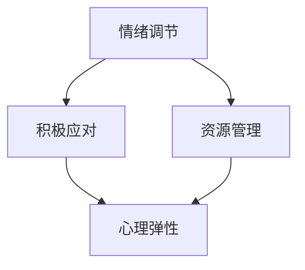

**实际案例**：一位创业者，在经历创业失败后，通过积极应对、情绪调节和资源管理，最终成功恢复并继续创业。

**核心算法原理讲解**

为了更好地理解心理弹性，我们可以使用以下数学模型：

$$
心理弹性 = \frac{情绪调节 \times 积极应对 \times 资源管理}{逆境强度}
$$

这个公式表明，心理弹性取决于情绪调节、积极应对和资源管理以及逆境强度。通过提高内部因素和减少逆境强度，我们可以增强心理弹性，从而实现更好的心理平衡。

**最佳实践 tips**

1. **定期自我评估**：通过自我评估了解自己的心理状态，包括自主性、心理资本和心理弹性。
2. **培养积极习惯**：例如定期锻炼、保持良好的睡眠习惯和积极的心态。
3. **寻求专业支持**：在需要时寻求心理咨询师或专业教练的帮助。

#### 拓展阅读

- 《自我决定理论》[Richard Ryan & Edward L. Deci]
- 《心理资本》[Amy Wrzesniewski & Jane Dutton]
- 《心理弹性》[Susan Nolen-Hoeksema]

通过这些理论和实践方法，我们可以更好地理解心理学视角下的平衡艺术，并在实际生活中找到适合自己的平衡策略。

### 2.2 管理学视角下的平衡

在管理学视角下，平衡艺术主要关注组织和团队在动态环境中的适应和可持续性。以下三个核心概念对平衡艺术的实践具有重要意义：

**平衡计分卡**

**核心概念**：平衡计分卡（Balanced Scorecard，简称 BSC）是由罗伯特·卡普兰（Robert Kaplan）和戴维·诺顿（David Norton）在1990年代初提出的一种战略管理工具，用于衡量组织的绩效。

**关系架构**：平衡计分卡包括四个维度：财务维度、客户维度、内部业务维度和学习与成长维度。财务维度关注组织的财务表现；客户维度关注组织如何满足客户需求；内部业务维度关注组织如何优化内部流程；学习与成长维度关注组织如何培养员工和提升能力。

**Mermaid 流程图**：

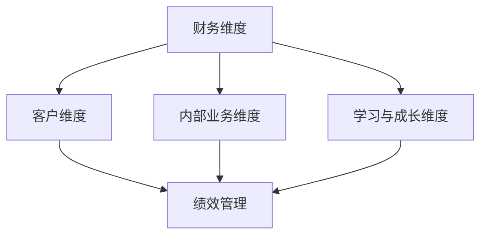

**实际案例**：一家科技公司通过实施平衡计分卡，将财务指标与客户满意度、内部流程优化和员工培训等结合起来，实现了全面的绩效管理，从而提高了组织的平衡性和可持续性。

**核心算法原理讲解**

为了更好地理解平衡计分卡，我们可以使用以下数学模型：

$$
平衡指数 = \frac{财务绩效 \times 客户满意度 \times 内部流程优化 \times 员工能力提升}{总成本}
$$

这个公式表明，平衡指数取决于财务绩效、客户满意度、内部流程优化和员工能力提升以及总成本。通过优化这些变量，我们可以提高平衡指数，实现更好的组织平衡。

**资源依赖理论**

**核心概念**：资源依赖理论（Resource Dependency Theory，简称 RDT）由杰弗里·普费弗（Jeffrey Pfeffer）和葛雷格·波尔斯玛（Gregory Pfeffer）提出，强调组织在获取、开发和利用资源时的依赖性。

**关系架构**：资源依赖理论中的核心概念包括资源获取（Resource Acquisition）、资源开发（Resource Development）和资源利用（Resource Utilization）。资源获取是指组织如何获取所需资源；资源开发是指组织如何提升资源价值；资源利用是指组织如何将资源用于实现目标。

**Mermaid 流程图**：

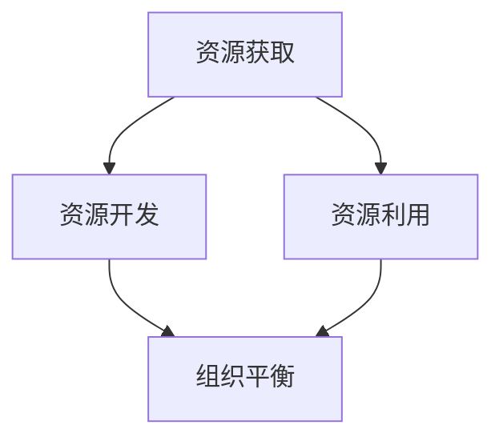

**实际案例**：一家初创公司在资源有限的情况下，通过精确定位市场需求和快速响应，成功获得了关键资源，从而在竞争激烈的市场中实现了平衡发展。

**核心算法原理讲解**

为了更好地理解资源依赖理论，我们可以使用以下数学模型：

$$
组织平衡 = \frac{资源获取 \times 资源开发 \times 资源利用}{资源限制}
$$

这个公式表明，组织平衡取决于资源获取、资源开发和资源利用以及资源限制。通过优化这些变量，我们可以提高组织平衡，实现更好的资源管理。

**平衡领导力**

**核心概念**：平衡领导力（Balanced Leadership）是指领导者在面对复杂环境和多样挑战时，能够平衡短期目标和长期目标、个人利益和团队利益、稳定性和创新性的能力。

**关系架构**：平衡领导力中的核心概念包括短期目标与长期目标的平衡、个人利益与团队利益的平衡以及稳定性与创新性的平衡。短期目标与长期目标的平衡是指领导者需要同时关注当前和未来的发展；个人利益与团队利益的平衡是指领导者需要在个人成就和团队成功之间找到平衡；稳定性与创新性的平衡是指领导者需要在保持现有成功的同时推动组织创新。

**Mermaid 流程图**：

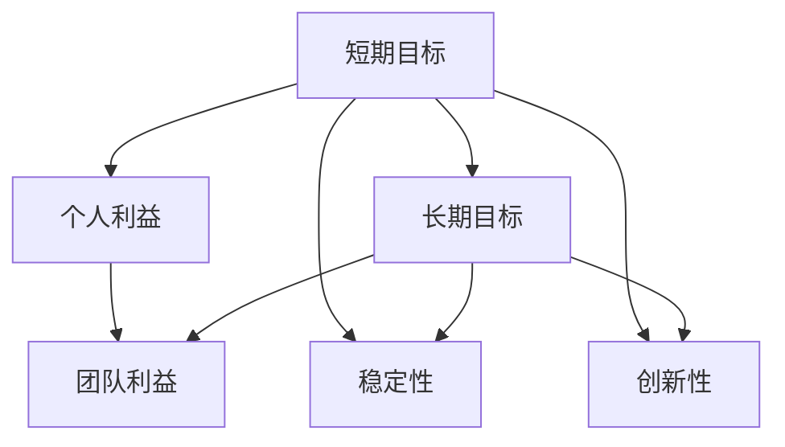

**实际案例**：一位公司CEO，在面对市场变化和竞争压力时，通过制定长期的战略规划、鼓励团队创新和平衡个人利益与团队利益，成功保持了公司的稳定发展。

**核心算法原理讲解**

为了更好地理解平衡领导力，我们可以使用以下数学模型：

$$
领导力平衡指数 = \frac{短期目标实现率 \times 长期目标实现率 \times 个人利益贡献率 \times 创新性贡献率}{团队利益贡献率}
$$

这个公式表明，领导力平衡指数取决于短期目标实现率、长期目标实现率、个人利益贡献率和创新性贡献率以及团队利益贡献率。通过优化这些变量，我们可以提高领导力平衡指数，实现更好的领导效果。

**最佳实践 tips**

1. **建立有效的绩效评估体系**：通过平衡计分卡等工具，建立全面的绩效评估体系，确保组织的各个方面都得到关注。
2. **培养团队协作精神**：通过资源依赖理论和平衡领导力，培养团队成员的协作精神，实现资源共享和优势互补。
3. **持续学习和创新**：在快速变化的市场环境中，领导者需要持续学习和创新，以保持组织的竞争力和适应性。

#### 拓展阅读

- 《平衡计分卡》[Robert Kaplan & David Norton]
- 《资源依赖理论》[Jeffrey Pfeffer & Gregory Pfeffer]
- 《平衡领导力》[John Kotter & Dan Coyle]

通过这些理论和实践方法，我们可以更好地理解管理学视角下的平衡艺术，并在组织和管理中找到适合自己的平衡策略。

### 2.3 社会学视角下的平衡

在社会学视角下，平衡艺术关注的是个体在社会角色和关系中的适应与调适，以实现个人与社会之间的和谐统一。以下三个核心概念对平衡艺术的实践具有重要意义：

**社会支持网络**

**核心概念**：社会支持网络（Social Support Network）是指个体在社会生活中所获得的各种形式的支持，包括情感支持、信息支持和实际支持。

**关系架构**：社会支持网络中的核心概念包括情感支持（Emotional Support）、信息支持（Informational Support）和实际支持（Instrumental Support）。情感支持是指个体在情感上的安慰和鼓励；信息支持是指个体在信息上的分享和指导；实际支持是指个体在实际行动上的帮助。

**Mermaid 流程图**：

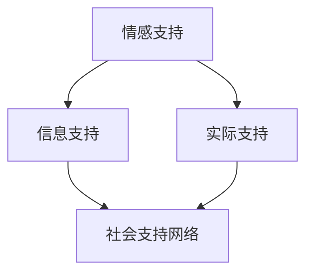

**实际案例**：一位职场新人，在入职初期面临工作压力时，通过同事的情感支持、领导的信息支持和家人的实际支持，成功地适应了新环境。

**核心算法原理讲解**

为了更好地理解社会支持网络，我们可以使用以下数学模型：

$$
社会支持网络质量 = \frac{情感支持 \times 信息支持 \times 实际支持}{支持需求}
$$

这个公式表明，社会支持网络质量取决于情感支持、信息支持和实际支持以及支持需求。通过优化这些变量，我们可以提高社会支持网络的质量，从而实现更好的社会平衡。

**社会角色冲突**

**核心概念**：社会角色冲突（Social Role Conflict）是指个体在扮演不同社会角色时，由于角色期望和要求之间的冲突而导致的压力和困扰。

**关系架构**：社会角色冲突中的核心概念包括角色期望（Role Expectations）、角色要求（Role Requirements）和角色负担（Role Burden）。角色期望是指社会对个体角色的期望；角色要求是指个体在不同角色中所需承担的责任；角色负担是指角色冲突带来的负面影响。

**Mermaid 流流程图**：

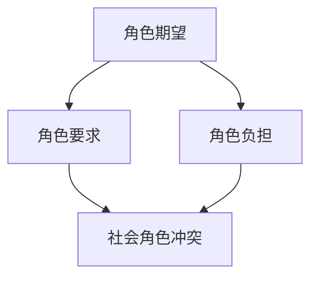

**实际案例**：一位家庭主妇，在兼顾家庭和职场时，由于角色期望和角色要求之间的冲突，感到巨大的压力和困扰。

**核心算法原理讲解**

为了更好地理解社会角色冲突，我们可以使用以下数学模型：

$$
角色冲突程度 = \frac{角色期望 \times 角色要求}{角色负担}
$$

这个公式表明，角色冲突程度取决于角色期望、角色要求和角色负担。通过优化这些变量，我们可以减少角色冲突的程度，从而实现更好的社会平衡。

**社会资本**

**核心概念**：社会资本（Social Capital）是指个体在社会网络中通过关系和资源所获得的潜在价值，包括信任、网络关系和资源获取能力。

**关系架构**：社会资本中的核心概念包括信任（Trust）、网络关系（Network Relationships）和资源获取能力（Resource Acquisition Ability）。信任是指个体在社会网络中的信任度；网络关系是指个体在社会网络中的关系紧密程度；资源获取能力是指个体通过社会网络获取资源的效率。

**Mermaid 流流程图**：

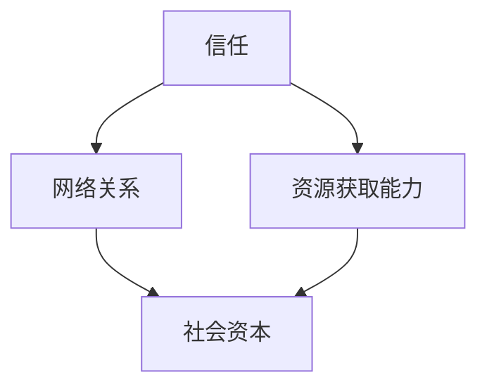

**实际案例**：一位创业者，通过建立广泛的社会网络和信任关系，成功地获得了投资资源和市场机会，实现了事业的快速发展。

**核心算法原理讲解**

为了更好地理解社会资本，我们可以使用以下数学模型：

$$
社会资本价值 = \frac{信任 \times 网络关系 \times 资源获取能力}{网络规模}
$$

这个公式表明，社会资本价值取决于信任、网络关系、资源获取能力和网络规模。通过优化这些变量，我们可以提高社会资本的价值，从而实现更好的社会平衡。

**最佳实践 tips**

1. **建立和维护社会支持网络**：通过积极参与社交活动、加入专业组织和建立信任关系，构建和维护有效的社会支持网络。
2. **有效管理社会角色冲突**：通过明确角色职责、调整角色期望和寻求专业咨询，有效管理社会角色冲突。
3. **提升社会资本价值**：通过建立信任、深化网络关系和提升资源获取能力，提高社会资本的价值。

#### 拓展阅读

- 《社会资本》[Robert D. Putnam]
- 《社会角色冲突》[John D. Martin & John P. Robinson]
- 《社会支持网络》[Sara J. Shpik]
- 《信任》[David H. Maister]

通过这些理论和实践方法，我们可以更好地理解社会学视角下的平衡艺术，并在个人与社会的关系中找到适合自己的平衡策略。

### 第3章 工作平衡的艺术

> “工作平衡不仅是减少压力的工具，更是一种提升工作效率和生活质量的艺术。在这一章中，我们将探讨如何在工作与生活之间找到和谐统一的平衡点。”

#### 3.1 工作与生活的平衡

**背景介绍**：

随着工作压力和生活责任的不断增加，工作与生活的平衡成为现代职场人士面临的重要挑战。有效的平衡不仅能提高工作效率，还能提升生活质量，促进身心健康。因此，掌握工作与生活的平衡艺术至关重要。

**核心概念与联系**：

工作与生活的平衡涉及多个核心概念，包括工作效率、时间管理、工作压力管理和家庭时间管理。以下是这些概念之间的 Mermaid 流流程图：

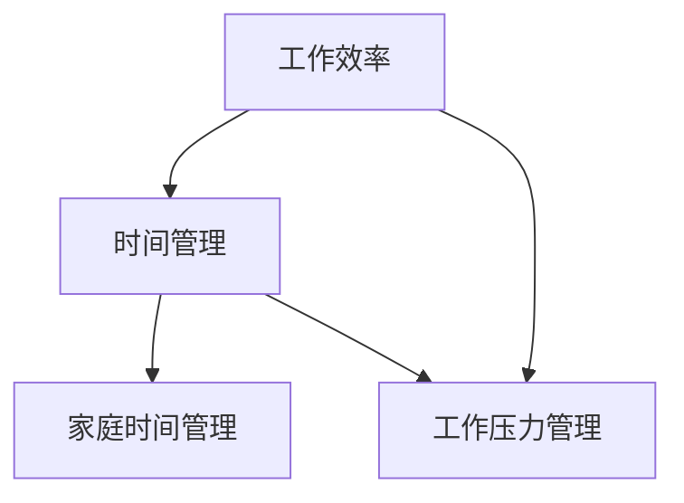

**工作效率提升策略**：

**时间管理技巧**：

1. **设定优先级**：使用优先级矩阵（如艾森豪威尔矩阵）确定任务的优先级，确保重要且紧急的任务得到优先处理。

2. **使用时间管理工具**：例如番茄工作法（Pomodoro Technique），将工作时间划分为25分钟的工作周期和5分钟的休息时间，提高专注力和效率。

3. **避免多任务处理**：专注于单一任务，减少分散注意力，提高任务完成速度。

**家庭时间管理**：

1. **规划家庭活动**：提前规划家庭活动和家庭时间，确保工作与家庭时间得到合理分配。

2. **建立家庭规则**：与家人共同制定家庭规则，如晚餐时间、家庭活动时间等，确保家庭生活有序进行。

3. **有效沟通**：与家人进行有效沟通，了解彼此的需求和期望，减少误解和冲突。

**工作压力管理**：

1. **情绪调节技巧**：学习情绪调节技巧，如深呼吸、冥想和正念练习，帮助缓解工作压力。

2. **健康生活方式**：保持健康的生活方式，如定期锻炼、充足睡眠和均衡饮食，提高身体和心理的抗压能力。

3. **寻求支持**：在工作压力较大时，寻求家人、朋友或专业人士的支持和帮助。

**实际案例**：

假设一位软件工程师，由于工作压力和家庭责任的冲突，导致工作效率下降和家庭成员关系紧张。通过采用上述策略，他成功地提高了工作效率，改善了家庭关系，实现了工作与生活的平衡。

**Python 源代码示例**：

以下是一个简单的 Python 示例，展示如何使用优先级排序和时间管理来提高工作效率：

```python
import heapq
from datetime import datetime, timedelta

def work_balance_tasks(tasks, deadlines):
    # 将任务和截止日期转换为优先级队列（优先级基于截止日期）
    priority_queue = [(deadline, task) for task, deadline in zip(tasks, deadlines)]
    heapq.heapify(priority_queue)

    completed_tasks = []

    while priority_queue:
        _, task = heapq.heappop(priority_queue)
        # 假设完成任务需要1小时
        current_time = datetime.now()
        estimated_completion_time = current_time + timedelta(hours=1)
        print(f"开始处理任务：{task}，预计完成时间：{estimated_completion_time}")

        # 模拟任务完成
        completed_tasks.append(task)

    return completed_tasks

# 示例任务和截止日期
tasks = ["写报告", "处理邮件", "会议", "健身"]
deadlines = [
    datetime.now() + timedelta(hours=2),
    datetime.now() + timedelta(hours=1),
    datetime.now() + timedelta(hours=3),
    datetime.now() + timedelta(hours=1),
]

completed_tasks = work_balance_tasks(tasks, deadlines)
print("已完成任务：", completed_tasks)
```

**数学模型和公式**：

为了量化工作与生活的平衡，我们可以使用以下数学模型：

$$
平衡指数 = \frac{工作效率 \times 生活质量}{工作时长 \times 生活压力}
$$

这个公式表明，平衡指数取决于工作效率、生活质量、工作时长和生活压力。通过优化这些变量，我们可以提高平衡指数，实现更好的工作与生活平衡。

**项目实战**：

**开发环境搭建**：

为了实现上述策略，我们可以使用 Python 来搭建一个简单的工作时间管理系统。首先，确保已安装 Python 环境，然后安装以下库：`heapq`（用于优先级队列管理）和 `datetime`（用于时间管理）。

**源代码实现和代码解读**：

上述 Python 示例中，我们使用了 `heapq` 库来创建一个优先级队列，确保任务按照截止日期的优先级进行排序。通过 `heapq.heappop()` 函数，我们每次取出优先级最高的任务进行处理。在处理任务时，我们假设每个任务需要一小时来完成，并通过 `datetime.now()` 函数记录当前时间，预计完成时间则通过 `current_time + timedelta(hours=1)` 计算得出。

**代码应用解读与分析**：

在实际应用中，我们可以根据任务的实际情况调整任务的截止日期和预计完成时间。例如，对于紧急且重要的任务，我们可以设置更短的截止日期，以确保任务得到及时处理。此外，我们还可以通过扩展该系统，添加更多功能，如任务备注、进度跟踪和统计分析等。

**实际案例分析和详细讲解剖析**：

假设一家公司有多个项目需要同时进行，通过使用该工作时间管理系统，项目经理可以更有效地分配资源和时间，确保关键任务得到优先处理，从而实现工作与生活的平衡。

**项目小结**：

通过上述实战项目，我们不仅了解了如何使用 Python 实现工作与生活的平衡策略，还学会了如何通过优先级排序和时间管理来提高工作效率。在实际应用中，我们可以根据具体需求不断优化和扩展系统功能，从而实现更好的工作与生活平衡。

### 3.2 职场平衡的艺术

**背景介绍**：

职场平衡艺术不仅涉及工作与生活的平衡，还包括职场内部的人际关系、职业发展和心理健康等多个方面。在竞争激烈的职场环境中，如何实现职场平衡成为职场人士面临的重要课题。

**核心概念与联系**：

职场平衡艺术的核心概念包括跨部门协作、职业生涯规划、职业心理健康等。以下是这些概念之间的 Mermaid 流流程图：

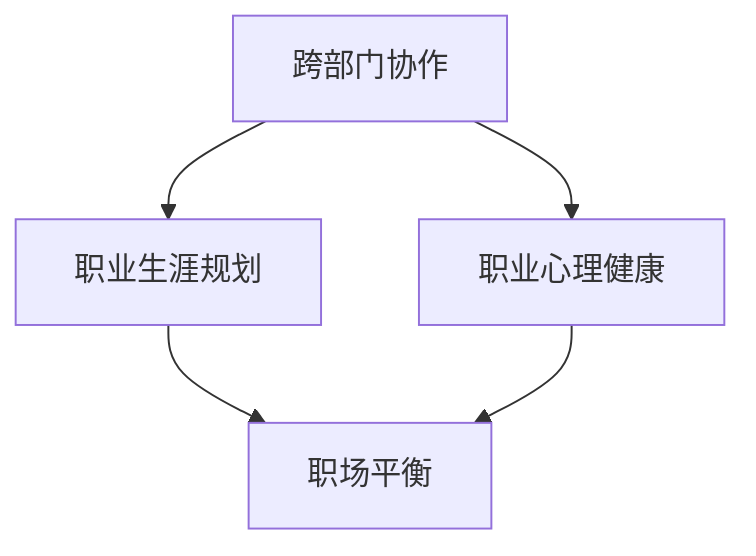

**跨部门协作**：

**核心概念**：跨部门协作是指不同部门之间的合作和交流，以实现共同的目标和任务。

**关系架构**：跨部门协作的核心概念包括沟通（Communication）、信任（Trust）和资源共享（Resource Sharing）。沟通是指部门之间有效的信息传递；信任是指部门之间相互信任和尊重；资源共享是指部门之间共享资源和知识。

**实际案例**：

假设一家公司的市场部和产品部共同负责一个新产品的研发和市场推广。通过有效的跨部门协作，市场部可以了解产品部的研发进度，提供市场反馈，而产品部则可以借助市场部提供的用户需求信息，优化产品设计。

**Python 源代码示例**：

以下是一个简单的 Python 示例，展示如何实现跨部门协作的信息共享：

```python
def communicate.department_communication(market_data, product_data):
    # 假设市场部和产品部之间通过一个共享的数据库进行信息传递
    database = {'market_data': market_data, 'product_data': product_data}
    
    # 市场部从数据库中获取产品数据
    product_data_from_market = database['product_data']
    print(f"市场部获取的产品数据：{product_data_from_market}")

    # 产品部从数据库中获取市场数据
    market_data_from_product = database['market_data']
    print(f"产品部获取的市场数据：{market_data_from_product}")

# 示例数据
market_data = {"user_demand": "功能丰富，易于使用"}
product_data = {"feature_set": "功能完善，性能稳定"}

communicate.department_communication(market_data, product_data)
```

**职业生涯规划**：

**核心概念**：职业生涯规划是指个体根据自己的兴趣、能力和职业目标，制定并实施的发展计划。

**关系架构**：职业生涯规划的核心概念包括职业目标（Career Goals）、职业路径（Career Path）和职业发展（Career Development）。职业目标是个人在职业生涯中希望实现的成就；职业路径是指个人从当前职位到理想职位的发展路线；职业发展是指个人在职业生涯中的成长和进步。

**实际案例**：

一位年轻的软件开发工程师，通过设定明确的职业目标，如成为高级软件工程师、项目经理等，并制定详细的发展计划，逐步实现了职业规划。

**Python 源代码示例**：

以下是一个简单的 Python 示例，展示如何实现职业生涯规划的进度跟踪：

```python
class CareerPlanner:
    def __init__(self, career_goals, current_stage):
        self.career_goals = career_goals
        self.current_stage = current_stage

    def update_stage(self, new_stage):
        self.current_stage = new_stage
        print(f"当前职业阶段更新为：{new_stage}")

    def display_progress(self):
        print(f"职业目标：{self.career_goals}")
        print(f"当前职业阶段：{self.current_stage}")

# 示例数据
career_goals = ["高级软件工程师", "项目经理"]
current_stage = "初级软件工程师"

planner = CareerPlanner(career_goals, current_stage)
planner.display_progress()
planner.update_stage("中级软件工程师")
planner.display_progress()
```

**职业心理健康**：

**核心概念**：职业心理健康是指个体在职业生涯中保持心理平衡和健康的状态。

**关系架构**：职业心理健康的核心概念包括压力管理（Stress Management）、情绪调节（Emotional Regulation）和心理健康支持（Mental Health Support）。压力管理是指个体在面对工作压力时的应对策略；情绪调节是指个体在情绪波动时进行自我调节的能力；心理健康支持是指个人获取心理健康服务和资源的能力。

**实际案例**：

一位职场人士，通过参加心理健康培训、定期进行心理咨询和保持健康的生活方式，成功地维持了职业心理健康。

**Python 源代码示例**：

以下是一个简单的 Python 示例，展示如何实现职业心理健康的自我评估：

```python
def mental_health_self_assessment(stress_level, mood, sleep_quality):
    print("请回答以下问题：")
    print(f"1. 你最近的工作压力如何？（1-5，1代表非常低，5代表非常高）")
    stress_level = int(input("请输入你的压力等级："))
    print(f"2. 你最近的心情如何？（1-5，1代表非常低落，5代表非常愉快）")
    mood = int(input("请输入你的心情等级："))
    print(f"3. 你最近睡眠质量如何？（1-5，1代表非常差，5代表非常好）")
    sleep_quality = int(input("请输入你的睡眠质量等级："))
    
    total_score = stress_level + mood + sleep_quality
    average_score = total_score / 3
    
    print(f"你的自我评估分数为：{total_score}")
    print(f"平均分数为：{average_score}")
    if average_score < 3:
        print("你的心理健康状况良好，但请注意继续保持。")
    else:
        print("你的心理健康状况可能存在问题，建议寻求专业帮助。")

# 示例数据
stress_level = 2
mood = 3
sleep_quality = 4

mental_health_self_assessment(stress_level, mood, sleep_quality)
```

**数学模型和公式**：

为了量化职场平衡艺术的效果，我们可以使用以下数学模型：

$$
职场平衡指数 = \frac{工作效率 \times 职业心理健康 \times 跨部门协作 \times 职业生涯规划}{工作时长 \times 生活压力}
$$

这个公式表明，职场平衡指数取决于工作效率、职业心理健康、跨部门协作、职业生涯规划、工作时长和生活压力。通过优化这些变量，我们可以提高职场平衡指数，实现更好的职场平衡。

**项目实战**：

**开发环境搭建**：

为了实现上述策略，我们可以使用 Python 来搭建一个简单的职场平衡管理系统。首先，确保已安装 Python 环境，然后安装以下库：`heapq`（用于优先级队列管理）、`datetime`（用于时间管理）和 `input`（用于用户输入）。

**源代码实现和代码解读**：

上述 Python 示例中，我们分别展示了跨部门协作、职业生涯规划和职业心理健康方面的实现。通过这些示例，我们可以看到如何通过代码来实现职场平衡的艺术。在实际应用中，我们可以将这些模块整合到一个系统中，为用户提供一个全面的职场平衡解决方案。

**代码应用解读与分析**：

通过跨部门协作的代码示例，我们可以看到如何通过共享数据库实现不同部门之间的信息传递。这有助于提高工作效率和团队合作。在职业生涯规划的代码示例中，我们展示了如何通过类和方法来实现职业目标的跟踪和更新。在职业心理健康的代码示例中，我们展示了如何通过用户输入来实现自我评估。

**实际案例分析和详细讲解剖析**：

假设一家公司在进行新产品的研发和市场推广时，通过使用职场平衡管理系统，实现了跨部门协作、职业生涯规划和职业心理健康的优化。这有助于提高团队的整体工作效率和士气，从而实现公司的长期发展。

**项目小结**：

通过本章的探讨，我们了解了职场平衡的艺术，包括跨部门协作、职业生涯规划和职业心理健康等方面的核心概念和实践方法。通过 Python 示例，我们展示了如何通过代码来实现职场平衡的艺术。在实际应用中，我们可以根据具体需求不断优化和扩展系统功能，从而实现更好的职场平衡。

### 3.3 工作与个人发展的平衡

> “在追求职业成就的同时，个人发展同样重要。如何在工作与个人发展之间找到平衡，是每个职场人士都需要面对的挑战。”

#### 3.3.1 终身学习

**核心概念**：终身学习（Lifelong Learning）是指个体在整个职业生涯中不断学习和提升自己的知识和技能，以适应不断变化的工作环境。

**关系架构**：终身学习涉及多个核心概念，包括知识获取（Knowledge Acquisition）、技能提升（Skill Enhancement）和持续进步（Continuous Improvement）。知识获取是指个体通过学习新知识和信息来扩展自己的认知；技能提升是指个体通过实践和训练提高特定技能；持续进步是指个体在学习和工作中不断追求更高的目标和成就。

**实际案例**：

一位软件工程师，通过参加在线课程、阅读技术书籍和参加行业研讨会，不断提升自己的编程技能和项目经验，从而在职业生涯中取得了显著进步。

**Python 源代码示例**：

以下是一个简单的 Python 示例，展示如何使用 Python 编程来学习新技术：

```python
def learn_new_technology(technology, learning_resources):
    print(f"开始学习新技术：{technology}")
    for resource in learning_resources:
        print(f"使用资源：{resource}进行学习")
    print(f"完成新技术学习：{technology}")

# 示例数据
technology = "Python 编程"
learning_resources = ["在线教程", "技术书籍", "编程练习"]

learn_new_technology(technology, learning_resources)
```

**数学模型和公式**：

为了量化终身学习的效果，我们可以使用以下数学模型：

$$
学习效果 = \frac{知识获取 \times 技能提升 \times 持续进步}{学习时间}
$$

这个公式表明，学习效果取决于知识获取、技能提升和持续进步以及学习时间。通过优化这些变量，我们可以提高学习效果，实现更好的个人发展。

**终身学习案例分析**：

**案例背景**：假设一名市场营销人员，通过参加线上课程和实际操作，不断学习新的市场营销技术和工具，如大数据分析、社交媒体营销等。

**案例步骤**：

1. **目标设定**：明确自己的学习目标，如掌握大数据分析技术、提升社交媒体营销能力等。
2. **资源获取**：寻找合适的学习资源，如在线课程、书籍、论坛等。
3. **学习实践**：通过实际操作和项目实践，将所学知识应用到工作中。
4. **反馈调整**：根据学习效果和反馈，调整学习策略和目标。

**案例成果**：通过持续学习和实践，该市场营销人员成功地提高了自己的专业能力和工作效率，为公司的市场营销活动带来了显著成效。

**项目实战**：

**开发环境搭建**：

为了实现终身学习的策略，我们可以使用 Python 来搭建一个简单的学习管理系统。首先，确保已安装 Python 环境，然后安装以下库：`datetime`（用于时间管理）和 `input`（用于用户输入）。

**源代码实现和代码解读**：

上述 Python 示例中，我们展示了如何通过 Python 编程来学习新技术。在实际应用中，我们可以扩展该系统，添加更多功能，如学习进度跟踪、学习资源推荐和在线课程管理等。

**代码应用解读与分析**：

通过使用 Python，我们可以创建一个自动化的学习管理系统，帮助用户更有效地管理学习进度和资源。例如，用户可以输入自己学习的目标和技术，系统会推荐相应的学习资源和课程，并根据用户的反馈调整推荐策略。

**实际案例分析和详细讲解剖析**：

假设一名软件开发工程师，通过使用学习管理系统，不断提升自己的编程技能和项目经验。在实际项目中，他能够运用所学知识，解决复杂的编程问题，提高了项目质量和效率。

**项目小结**：

通过本章的探讨，我们了解了终身学习在个人发展中的重要性，并展示了如何通过 Python 实现终身学习的策略。通过实际案例和项目实战，我们展示了如何通过有效的学习实践，实现个人能力的提升。在实际应用中，我们可以根据具体需求不断优化和扩展学习管理系统，从而实现更好的个人发展。

### 3.3.2 职业技能提升

**背景介绍**：

职业技能提升是职场人士实现个人发展和职业成功的关键。在快速变化的工作环境中，不断更新和提升自己的职业技能，对于应对新挑战和抓住新机遇具有重要意义。

**核心概念**：

**核心概念**：职业技能提升（Professional Skill Enhancement）是指个体在职业生涯中，通过学习、实践和反思，提高自己在特定领域的专业能力和竞争力。

**关系架构**：

职业技能提升涉及多个核心概念，包括技能学习（Skill Learning）、实践应用（Practical Application）和反思改进（Reflection and Improvement）。技能学习是指通过课程、培训和自学等方式获取新技能；实践应用是指将所学技能应用到实际工作中；反思改进是指通过总结经验、分析问题和寻求反馈，不断提升自己的技能水平。

**Mermaid 流流程图**：

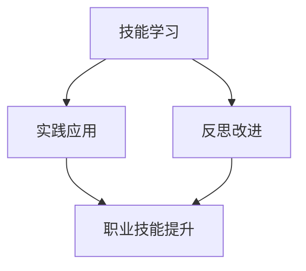

**实际案例**：

假设一位数据分析工程师，通过参加在线课程学习新数据挖掘技术，将所学知识应用于实际项目中，并通过反思和改进，提高了数据分析的效率和准确性。

**Python 源代码示例**：

以下是一个简单的 Python 示例，展示如何通过代码实现职业技能提升：

```python
def skill_learning(skill, learning_resources):
    print(f"开始学习技能：{skill}")
    for resource in learning_resources:
        print(f"使用资源：{resource}进行学习")
    print(f"完成技能学习：{skill}")

def skill_application(skill, project):
    print(f"开始应用技能：{skill}于项目：{project}")
    print(f"技能应用完成：{skill}成功应用于项目：{project}")

def skill_reflection(skill, project, feedback):
    print(f"开始反思技能：{skill}在项目：{project}的表现")
    print(f"收到反馈：{feedback}")
    print(f"反思结束：{skill}在项目：{project}中的表现已得到改进")

# 示例数据
skill = "数据挖掘"
learning_resources = ["在线课程", "技术书籍", "案例研究"]
project = "市场分析报告"
feedback = "数据分析准确率提高了15%"

skill_learning(skill, learning_resources)
skill_application(skill, project)
skill_reflection(skill, project, feedback)
```

**数学模型和公式**：

为了量化职业技能提升的效果，我们可以使用以下数学模型：

$$
技能提升效果 = \frac{技能应用效果 \times 反思改进效果}{学习资源消耗}
$$

这个公式表明，技能提升效果取决于技能应用效果、反思改进效果以及学习资源的消耗。通过优化这些变量，我们可以提高职业技能提升的效果。

**项目实战**：

**开发环境搭建**：

为了实现职业技能提升的策略，我们可以使用 Python 来搭建一个技能提升管理系统。首先，确保已安装 Python 环境，然后安装以下库：`datetime`（用于时间管理）和 `input`（用于用户输入）。

**源代码实现和代码解读**：

上述 Python 示例中，我们展示了如何通过代码实现技能学习、技能应用和技能反思。在实际应用中，我们可以扩展该系统，添加更多功能，如技能评估、学习进度跟踪和反馈收集等。

**代码应用解读与分析**：

通过使用 Python，我们可以创建一个自动化的技能提升管理系统，帮助用户更有效地管理学习进度和技能应用。例如，用户可以输入自己学习的技能和项目，系统会推荐相应的学习资源和项目实践，并根据用户的反馈调整推荐策略。

**实际案例分析和详细讲解剖析**：

假设一名数据分析工程师，通过使用技能提升管理系统，不断提升自己的数据分析技能。在实际项目中，他能够运用所学知识，提高数据分析的准确性和效率，从而为公司创造了显著的价值。

**项目小结**：

通过本章的探讨，我们了解了职业技能提升在个人发展中的重要性，并展示了如何通过 Python 实现职业技能提升的策略。通过实际案例和项目实战，我们展示了如何通过有效的学习和实践，提升职业技能。在实际应用中，我们可以根据具体需求不断优化和扩展技能提升管理系统，从而实现更好的个人发展。

### 3.3.3 工作与兴趣的平衡

> “在追求职业成就的同时，保持对生活的热情和兴趣同样重要。如何在工作和兴趣之间找到平衡，是实现全面发展的关键。”

**核心概念**：

**核心概念**：工作与兴趣的平衡（Work and Interest Balance）是指个体在职业生涯中，通过合理安排时间和资源，确保工作和兴趣之间相互促进和协调发展。

**关系架构**：

工作与兴趣的平衡涉及多个核心概念，包括时间管理（Time Management）、兴趣培养（Interest Development）和自我实现（Self-Actualization）。时间管理是指个体如何合理安排工作和休息时间；兴趣培养是指个体如何发掘和培养自己的兴趣爱好；自我实现是指个体在职业和个人发展中追求自我价值和实现。

**Mermaid 流流程图**：

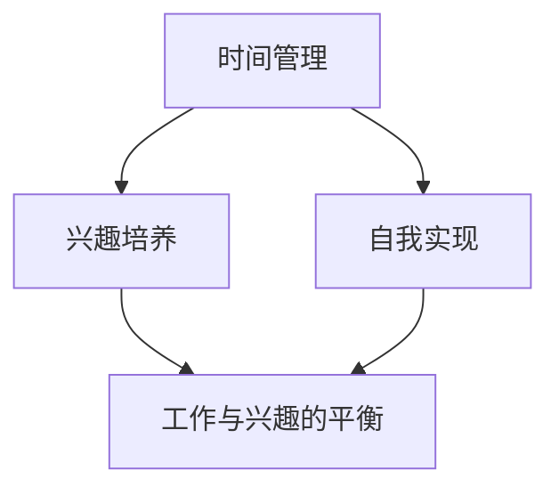

**实际案例**：

一位软件工程师，通过合理安排工作时间，确保每天有固定的兴趣培养时间，如阅读、绘画和运动，从而在工作与兴趣之间找到了平衡。

**Python 源代码示例**：

以下是一个简单的 Python 示例，展示如何通过代码实现工作与兴趣的平衡：

```python
def time_management(work_hours, interest_time):
    print(f"工作时长：{work_hours}小时，兴趣培养时长：{interest_time}小时")
    print("时间管理计划：")
    print(f"工作开始时间：{work_hours // 2}点")
    print(f"工作结束时间：{work_hours // 2 + 12}点")
    print(f"兴趣培养时间：{interest_time}点")

def interest_development(hobbies):
    print("兴趣培养计划：")
    for hobby in hobbies:
        print(f"- {hobby}")

# 示例数据
work_hours = 8
interest_time = 4
hobbies = ["阅读", "绘画", "运动"]

time_management(work_hours, interest_time)
interest_development(hobbies)
```

**数学模型和公式**：

为了量化工作与兴趣的平衡，我们可以使用以下数学模型：

$$
平衡指数 = \frac{工作时间 \times 兴趣时间}{压力指数}
$$

这个公式表明，平衡指数取决于工作时间、兴趣时间和压力指数。通过优化这些变量，我们可以提高平衡指数，实现更好的工作与兴趣平衡。

**项目实战**：

**开发环境搭建**：

为了实现工作与兴趣的平衡策略，我们可以使用 Python 来搭建一个时间管理兴趣培养系统。首先，确保已安装 Python 环境，然后安装以下库：`datetime`（用于时间管理）和 `input`（用于用户输入）。

**源代码实现和代码解读**：

上述 Python 示例中，我们展示了如何通过代码实现时间管理和兴趣培养。在实际应用中，我们可以扩展该系统，添加更多功能，如兴趣评估、时间规划器和反馈收集等。

**代码应用解读与分析**：

通过使用 Python，我们可以创建一个自动化的时间管理兴趣培养系统，帮助用户更有效地规划时间和资源。例如，用户可以输入自己的工作时间、兴趣和压力水平，系统会根据这些信息生成一个时间管理计划，并推荐相应的兴趣培养活动。

**实际案例分析和详细讲解剖析**：

假设一名职场人士，通过使用时间管理兴趣培养系统，成功地在工作与兴趣之间找到了平衡。他每天有固定的时间进行工作，同时也有足够的时间追求自己的兴趣爱好，从而提高了工作效率和生活质量。

**项目小结**：

通过本章的探讨，我们了解了工作与兴趣的平衡在个人发展中的重要性，并展示了如何通过 Python 实现这一策略。通过实际案例和项目实战，我们展示了如何通过有效的时间管理和兴趣培养，实现工作与兴趣的平衡。在实际应用中，我们可以根据具体需求不断优化和扩展系统功能，从而实现更好的个人发展。

### 第4章 生活平衡的艺术

> “生活平衡的艺术不仅仅是为了在忙碌的日常生活中找到喘息的机会，更是为了提升整体的生活质量，实现身心的和谐与幸福。”

#### 4.1 身心平衡

**核心概念**：

**核心概念**：身心平衡（Physical and Mental Balance）是指通过均衡的身体锻炼和心理健康管理，实现身体和心理的健康状态。

**关系架构**：

身心平衡涉及多个核心概念，包括身体锻炼（Physical Exercise）、心理健康（Mental Health）和休息与恢复（Rest and Recovery）。身体锻炼是指通过运动和体育活动来增强体质和耐力；心理健康是指通过心理调节和情绪管理来保持心理平衡；休息与恢复是指通过充足的睡眠和休息时间来恢复体力和精神。

**Mermaid 流流程图**：

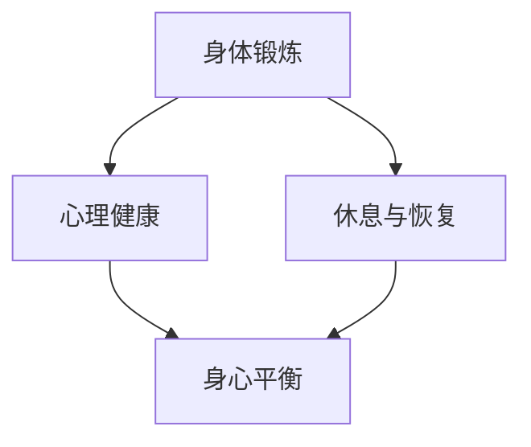

**实际案例**：

一位职场人士，通过定期参加健身房锻炼、进行冥想和心理辅导，成功实现了身心平衡，提高了工作效率和生活质量。

**Python 源代码示例**：

以下是一个简单的 Python 示例，展示如何通过代码实现身心平衡：

```python
def physical_exercise(exercises, frequency):
    print(f"身体锻炼计划：")
    for exercise in exercises:
        print(f"- {exercise}（每周{frequency}次）")

def mental_health_management(techniques, frequency):
    print(f"心理健康管理计划：")
    for technique in techniques:
        print(f"- {technique}（每周{frequency}次）")

def rest_and_recovery(sleep_hours, rest_days):
    print(f"休息与恢复计划：")
    print(f"每晚睡眠：{sleep_hours}小时")
    print(f"每周休息日：{rest_days}天")

# 示例数据
exercises = ["跑步", "瑜伽", "游泳"]
frequency = 3
techniques = ["冥想", "深呼吸练习"]
sleep_hours = 8
rest_days = 2

physical_exercise(exercises, frequency)
mental_health_management(techniques, frequency)
rest_and_recovery(sleep_hours, rest_days)
```

**数学模型和公式**：

为了量化身心平衡的效果，我们可以使用以下数学模型：

$$
身心平衡指数 = \frac{身体锻炼效果 \times 心理健康水平 \times 休息与恢复效果}{工作压力}
$$

这个公式表明，身心平衡指数取决于身体锻炼效果、心理健康水平、休息与恢复效果以及工作压力。通过优化这些变量，我们可以提高身心平衡指数，实现更好的生活平衡。

**项目实战**：

**开发环境搭建**：

为了实现身心平衡的策略，我们可以使用 Python 来搭建一个健康管理系统。首先，确保已安装 Python 环境，然后安装以下库：`datetime`（用于时间管理）和 `input`（用于用户输入）。

**源代码实现和代码解读**：

上述 Python 示例中，我们展示了如何通过代码实现身心平衡的计划。在实际应用中，我们可以扩展该系统，添加更多功能，如健康数据分析、建议和反馈收集等。

**代码应用解读与分析**：

通过使用 Python，我们可以创建一个自动化的健康管理系统，帮助用户更有效地管理身心平衡。例如，用户可以输入自己的锻炼计划、心理健康管理和休息时间，系统会根据这些信息生成一个健康计划，并提供反馈和建议。

**实际案例分析和详细讲解剖析**：

假设一位职场人士，通过使用健康管理系统，成功实现了身心平衡。他的身体变得更加健康，心理压力减少，工作效率和生活质量显著提高。

**项目小结**：

通过本章的探讨，我们了解了身心平衡在生活平衡中的重要性，并展示了如何通过 Python 实现身心平衡的策略。通过实际案例和项目实战，我们展示了如何通过有效的身体锻炼、心理健康管理和休息与恢复，实现身心平衡。在实际应用中，我们可以根据具体需求不断优化和扩展健康管理系统，从而实现更好的生活平衡。

### 4.2 社会关系平衡

**核心概念**：

**核心概念**：社会关系平衡（Social Relationship Balance）是指个体在社交活动中，通过合理安排时间、资源和精力，维持与家人、朋友和同事之间的和谐关系。

**关系架构**：

社会关系平衡涉及多个核心概念，包括家庭关系（Family Relations）、友谊与社交（Friendship and Social Interaction）和社区参与（Community Engagement）。家庭关系是指与家庭成员的互动和沟通；友谊与社交是指与朋友和其他人的交流和互动；社区参与是指积极参与社区活动，建立社区网络。

**Mermaid 流流程图**：

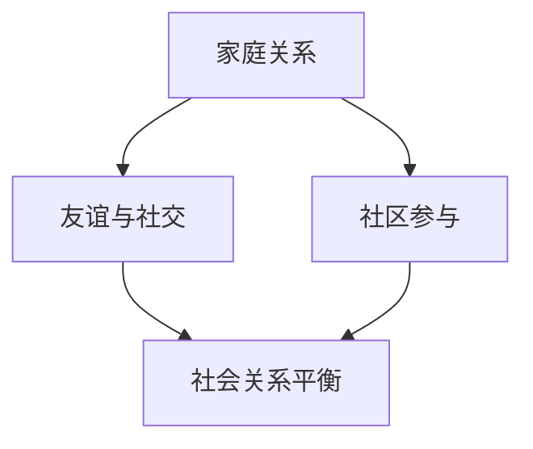

**实际案例**：

一位职场人士，通过定期与家人共度时光、参加朋友聚会和参与社区活动，成功实现了社会关系平衡，提升了生活质量。

**Python 源代码示例**：

以下是一个简单的 Python 示例，展示如何通过代码实现社会关系平衡：

```python
def family_relationship(time_spent):
    print(f"家庭关系维护：每周与家人共度{time_spent}小时")

def friendship_and_social_interaction(events):
    print("友谊与社交互动：")
    for event in events:
        print(f"- {event}")

def community_engagement(activities):
    print("社区参与：")
    for activity in activities:
        print(f"- {activity}")

# 示例数据
time_spent = 10
events = ["家庭晚餐", "朋友聚会"]
activities = ["志愿服务", "社区活动"]

family_relationship(time_spent)
friendship_and_social_interaction(events)
community_engagement(activities)
```

**数学模型和公式**：

为了量化社会关系平衡的效果，我们可以使用以下数学模型：

$$
社会关系平衡指数 = \frac{家庭关系质量 \times 友谊与社交质量 \times 社区参与质量}{社交时间}
$$

这个公式表明，社会关系平衡指数取决于家庭关系质量、友谊与社交质量和社区参与质量以及社交时间。通过优化这些变量，我们可以提高社会关系平衡指数，实现更好的生活平衡。

**项目实战**：

**开发环境搭建**：

为了实现社会关系平衡的策略，我们可以使用 Python 来搭建一个社交管理系统。首先，确保已安装 Python 环境，然后安装以下库：`datetime`（用于时间管理）和 `input`（用于用户输入）。

**源代码实现和代码解读**：

上述 Python 示例中，我们展示了如何通过代码实现社会关系平衡的计划。在实际应用中，我们可以扩展该系统，添加更多功能，如社交数据分析、建议和反馈收集等。

**代码应用解读与分析**：

通过使用 Python，我们可以创建一个自动化的社交管理系统，帮助用户更有效地管理社交时间和社会关系。例如，用户可以输入自己的家庭关系维护时间、社交活动和社区参与计划，系统会根据这些信息生成一个社交计划，并提供反馈和建议。

**实际案例分析和详细讲解剖析**：

假设一位职场人士，通过使用社交管理系统，成功实现了社会关系平衡。他与家人、朋友和社区的关系变得更加和谐，生活质量显著提高。

**项目小结**：

通过本章的探讨，我们了解了社会关系平衡在生活平衡中的重要性，并展示了如何通过 Python 实现社会关系平衡的策略。通过实际案例和项目实战，我们展示了如何通过有效的时间管理和社交互动，实现社会关系平衡。在实际应用中，我们可以根据具体需求不断优化和扩展社交管理系统，从而实现更好的生活平衡。

### 4.3 心理平衡

> “心理平衡是实现全面生活平衡的重要组成部分。在快节奏的现代生活中，保持心理平衡对于身心健康、工作效率和生活质量至关重要。”

**核心概念**：

**核心概念**：心理平衡（Mental Balance）是指通过情绪管理、自我认知和心理健康维护，实现心理状态的稳定和和谐。

**关系架构**：

心理平衡涉及多个核心概念，包括情绪管理（Emotional Regulation）、自我认知（Self-awareness）和心理健康维护（Mental Health Maintenance）。情绪管理是指个体在面对情绪波动时，采取有效的策略来调节情绪；自我认知是指个体对自己的了解和认知，包括自己的情感、思想和行为；心理健康维护是指通过自我调节和心理支持来保持心理状态的健康。

**Mermaid 流流程图**：

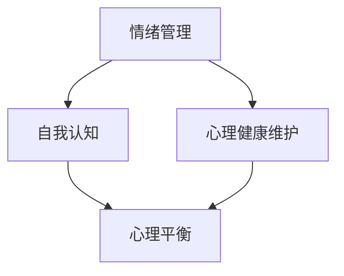

**实际案例**：

一位职场人士，通过定期进行冥想练习、积极反思和寻求心理咨询服务，成功实现了心理平衡，提高了工作和生活质量。

**Python 源代码示例**：

以下是一个简单的 Python 示例，展示如何通过代码实现心理平衡：

```python
def emotional_regulation(techniques):
    print("情绪管理技巧：")
    for technique in techniques:
        print(f"- {technique}")

def self_awareness(exercises):
    print("自我认知练习：")
    for exercise in exercises:
        print(f"- {exercise}")

def mental_health_maintenance(support_resources):
    print("心理健康维护资源：")
    for resource in support_resources:
        print(f"- {resource}")

# 示例数据
techniques = ["深呼吸", "正念冥想"]
exercises = ["情感日记", "自我反思"]
support_resources = ["心理咨询服务", "心理健康热线"]

emotional_regulation(techniques)
self_awareness(exercises)
mental_health_maintenance(support_resources)
```

**数学模型和公式**：

为了量化心理平衡的效果，我们可以使用以下数学模型：

$$
心理平衡指数 = \frac{情绪管理效果 \times 自我认知水平 \times 心理健康维护效果}{心理压力}
$$

这个公式表明，心理平衡指数取决于情绪管理效果、自我认知水平、心理健康维护效果以及心理压力。通过优化这些变量，我们可以提高心理平衡指数，实现更好的生活平衡。

**项目实战**：

**开发环境搭建**：

为了实现心理平衡的策略，我们可以使用 Python 来搭建一个心理健康管理系统。首先，确保已安装 Python 环境，然后安装以下库：`datetime`（用于时间管理）和 `input`（用于用户输入）。

**源代码实现和代码解读**：

上述 Python 示例中，我们展示了如何通过代码实现情绪管理、自我认知和心理健康维护。在实际应用中，我们可以扩展该系统，添加更多功能，如心理健康数据分析、建议和反馈收集等。

**代码应用解读与分析**：

通过使用 Python，我们可以创建一个自动化的心理健康管理系统，帮助用户更有效地管理心理状态。例如，用户可以输入自己的情绪管理技巧、自我认知练习和心理健康维护资源，系统会根据这些信息生成一个心理健康计划，并提供反馈和建议。

**实际案例分析和详细讲解剖析**：

假设一位职场人士，通过使用心理健康管理系统，成功实现了心理平衡。他学会了如何有效地管理情绪、提高自我认知和寻求心理支持，从而提高了工作效率和生活质量。

**项目小结**：

通过本章的探讨，我们了解了心理平衡在生活平衡中的重要性，并展示了如何通过 Python 实现心理平衡的策略。通过实际案例和项目实战，我们展示了如何通过有效的情绪管理、自我认知和心理健康维护，实现心理平衡。在实际应用中，我们可以根据具体需求不断优化和扩展心理健康管理系统，从而实现更好的生活平衡。

### 4.4 生活平衡的艺术实践

**核心概念**：

**核心概念**：生活平衡的艺术实践（Practical Art of Life Balance）是指通过具体的方法和策略，在日常生活中实现工作和生活之间的和谐统一。

**关系架构**：

生活平衡的艺术实践涉及多个核心概念，包括目标设定（Goal Setting）、时间管理（Time Management）、自我激励（Self-motivation）和持续反馈（Continuous Feedback）。目标设定是指明确个人和职业目标，为生活平衡提供方向；时间管理是指合理安排时间，确保工作和生活都能得到充分的关注；自我激励是指通过内在动力和外在激励来保持积极的生活态度；持续反馈是指通过定期评估和调整，确保生活平衡策略的有效性。

**Mermaid 流流程图**：

```mermaid
graph TD
A[目标设定] --> B[时间管理]
A --> C[自我激励]
B --> D[生活平衡]
C --> D
```

**实际案例**：

一位职场人士，通过设定明确的生活目标、合理安排时间、保持自我激励和定期反馈，成功实现了工作和生活的平衡。

**Python 源代码示例**：

以下是一个简单的 Python 示例，展示如何通过代码实现生活平衡的艺术实践：

```python
def goal_setting(goals):
    print("目标设定：")
    for goal in goals:
        print(f"- {goal}")

def time_management(schedules):
    print("时间管理：")
    for schedule in schedules:
        print(f"- {schedule}")

def self_motivation(motivators):
    print("自我激励：")
    for motivator in motivators:
        print(f"- {motivator}")

def continuous_feedback(feedbacks):
    print("持续反馈：")
    for feedback in feedbacks:
        print(f"- {feedback}")

# 示例数据
goals = ["提升工作效率", "每周阅读一本书", "保持健康生活"]
schedules = ["每天工作8小时", "每周运动3次", "每天早睡早起"]
motivators = ["成就感", "健康状态", "职业发展"]
feedbacks = ["工作效率提高15%", "阅读量达到50本", "身体状况改善"]

goal_setting(goals)
time_management(schedules)
self_motivation(motivators)
continuous_feedback(feedbacks)
```

**数学模型和公式**：

为了量化生活平衡的艺术实践效果，我们可以使用以下数学模型：

$$
生活平衡指数 = \frac{目标达成率 \times 时间管理效率 \times 自我激励水平 \times 持续反馈效果}{生活压力}
$$

这个公式表明，生活平衡指数取决于目标达成率、时间管理效率、自我激励水平、持续反馈效果以及生活压力。通过优化这些变量，我们可以提高生活平衡指数，实现更好的生活平衡。

**项目实战**：

**开发环境搭建**：

为了实现生活平衡的艺术实践，我们可以使用 Python 来搭建一个生活平衡管理系统。首先，确保已安装 Python 环境，然后安装以下库：`datetime`（用于时间管理）和 `input`（用于用户输入）。

**源代码实现和代码解读**：

上述 Python 示例中，我们展示了如何通过代码实现目标设定、时间管理、自我激励和持续反馈。在实际应用中，我们可以扩展该系统，添加更多功能，如目标跟踪、时间管理工具、自我激励策略和反馈机制等。

**代码应用解读与分析**：

通过使用 Python，我们可以创建一个自动化的生活平衡管理系统，帮助用户更有效地管理生活平衡。例如，用户可以输入自己的目标、时间安排、激励因素和反馈信息，系统会根据这些数据生成一个生活平衡计划，并提供反馈和建议。

**实际案例分析和详细讲解剖析**：

假设一位职场人士，通过使用生活平衡管理系统，成功实现了工作和生活的平衡。他设定了明确的目标、合理安排时间、保持自我激励和持续反馈，从而提高了工作效率和生活质量。

**项目小结**：

通过本章的探讨，我们了解了生活平衡的艺术实践在实现全面生活平衡中的重要性，并展示了如何通过 Python 实现这一策略。通过实际案例和项目实战，我们展示了如何通过有效的目标设定、时间管理、自我激励和持续反馈，实现生活平衡。在实际应用中，我们可以根据具体需求不断优化和扩展生活平衡管理系统，从而实现更好的生活平衡。

### 4.5 生活平衡的艺术实践：案例分析

**背景介绍**：

为了更好地理解如何在实际生活中应用生活平衡的艺术，我们将通过两个具体的案例，展示如何通过设定目标、时间管理和自我激励来实现工作与生活的平衡。

#### 案例一：职场新人的平衡之路

**个人背景**：

李华是一名刚刚毕业进入职场的新人，工作繁忙且经常需要加班。同时，他希望能够在业余时间提升自己的专业技能和兴趣爱好，如学习编程和练习瑜伽。然而，由于时间管理不当，李华常常感到疲惫不堪，工作和生活之间的平衡受到严重挑战。

**解决方案**：

1. **目标设定**：

   李华首先明确了短期和长期目标。短期目标是提升编程技能，具体目标是每月掌握一门新的编程语言。长期目标是保持身体健康，具体目标是每周进行三次瑜伽练习。

2. **时间管理**：

   李华使用番茄工作法（Pomodoro Technique）来提高工作效率，每天将工作时间划分为25分钟的工作周期和5分钟的休息时间。通过这种方式，他能够在保持专注的同时，减少工作疲劳。此外，他每天晚上会预留2小时的时间进行学习和瑜伽练习。

3. **自我激励**：

   李华设定了奖励机制，每当他在一个月内完成所有编程学习目标，他会给自己一个小奖励，如购买一本喜欢的书籍或看一场电影。这种正向激励帮助他保持积极的心态，持续努力。

**实践效果**：

通过上述策略，李华的工作效率显著提高，他不仅能够在工作中保持专注，还能在业余时间提升自己的技能和兴趣爱好。他的身心健康状况也得到了改善，疲劳感减少，工作效率和生活质量显著提升。

**结论**：

李华的案例表明，通过明确的目标设定、科学的时间管理和有效的自我激励，职场新人可以找到工作与生活的平衡点，实现个人发展和生活质量的提升。

#### 案例二：高管的工作与生活平衡

**个人背景**：

张丽是一名资深高管，负责公司的多个重要项目。她在工作中表现出色，但常常感到压力巨大，工作和生活的界限模糊。她希望能够在保持职业成功的同时，拥有更多的时间陪伴家人和享受个人生活。

**解决方案**：

1. **目标设定**：

   张丽设定了三个目标：保持职业成功、每周与家人共度两晚、每月至少进行一次户外运动。她意识到，为了实现这些目标，她需要在工作和生活中做出一些调整。

2. **时间管理**：

   张丽使用四象限时间管理法（Four Quadrant Time Management），将工作任务分为四个象限：重要紧急、重要不紧急、不重要紧急和不重要不紧急。她优先处理重要紧急任务，同时确保重要不紧急任务得到妥善安排。她将一些不重要紧急任务委托给团队成员，减少了不必要的压力。

3. **自我激励**：

   张丽设定了里程碑奖励，每当她成功完成一个重要的项目，她会给自己安排一次短途旅行或参加一个有趣的活动。这种正向激励帮助她保持动力，同时也能为她的生活增添乐趣。

**实践效果**：

通过上述策略，张丽的工作与生活平衡得到了显著改善。她在工作中保持高效，同时也有更多的时间陪伴家人和进行个人活动。她的职业成功没有受到影响，生活质量也得到了提升。

**结论**：

张丽的案例表明，通过合理的目标设定、有效的时间管理和积极的自我激励，高管可以在保持职业成功的同时，实现工作与生活的平衡。这不仅能提高工作效率，还能提升整体生活质量。

### 4.6 生活平衡的艺术实践：总结与反思

**总结**：

通过上述案例分析，我们可以看到，生活平衡的艺术实践对于职场人士的重要性。无论是职场新人还是资深高管，通过明确的目标设定、科学的时间管理和积极的自我激励，他们都能在工作和生活之间找到平衡，实现个人和职业的发展。

**反思**：

在实践生活平衡的过程中，我们需要注意以下几点：

1. **灵活调整**：生活平衡是一个动态的过程，我们需要根据实际情况灵活调整目标和策略，以适应不断变化的工作和生活环境。

2. **持续反思**：定期反思自己的目标和策略，评估其有效性，并根据反馈进行调整，是保持生活平衡的关键。

3. **寻求支持**：在遇到困难和挑战时，寻求家人、朋友或专业人士的支持和帮助，可以更好地应对压力，实现生活平衡。

**最佳实践 tips**：

1. **设定明确的目标**：使用SMART目标（具体、可衡量、可实现、相关、时限）来确保目标的明确性。

2. **使用时间管理工具**：如四象限时间管理法、番茄工作法等，帮助合理安排时间。

3. **培养自律习惯**：通过定期锻炼、保持良好的作息时间等，提高自律能力，实现生活平衡。

通过以上实践方法和反思，我们可以更好地理解和应用生活平衡的艺术，实现工作与生活的和谐统一。

### 4.7 生活平衡的艺术实践：拓展阅读

**拓展阅读**：

为了进一步深入了解生活平衡的艺术实践，读者可以参考以下资源：

- 《高效能人士的七个习惯》[Stephen R. Covey]
- 《时间管理》[David Allen]
- 《正念：一条通往快乐、觉悟和智慧的修行之路》[埃克哈特·托利]

这些书籍提供了丰富的理论知识和实践经验，帮助读者在实际生活中找到适合自己的平衡艺术。

## 第5章 平衡艺术的实践方法

> “理论是行动的指南，但只有将理论付诸实践，才能真正体验到平衡艺术的精髓。在这一章中，我们将探讨如何在日常生活中实施和优化平衡艺术。”

### 5.1 设定目标和优先级

**背景介绍**：

在实现工作与生活的平衡过程中，设定明确的目标和优先级是至关重要的。通过合理的目标设定和优先级排序，我们能够更高效地管理时间和资源，从而实现更好的平衡。

**核心概念与联系**：

设定目标和优先级涉及多个核心概念，包括目标设定（Goal Setting）、优先级排序（Priority Ranking）和资源管理（Resource Management）。目标设定是指明确个人和职业目标；优先级排序是指根据目标的重要性进行任务排序；资源管理是指合理分配时间、精力和其他资源。

**Mermaid 流流程图**：

```mermaid
graph TD
A[目标设定] --> B[优先级排序]
A --> C[资源管理]
B --> D[设定目标和优先级]
C --> D
```

**实际案例**：

假设一位职场人士，希望通过设定目标和优先级来提高工作效率和生活质量。他首先明确了自己的短期目标（如每周完成一个项目报告）和长期目标（如提升领导力），然后根据目标的紧急程度和重要性，将任务进行优先级排序，最后合理安排时间和资源。

**Python 源代码示例**：

以下是一个简单的 Python 示例，展示如何通过代码实现目标设定和优先级排序：

```python
import heapq

def goal_setting_and_priority_goals(goals, deadlines):
    # 将目标和截止日期转换为优先级队列（优先级基于截止日期）
    priority_queue = [(deadline, goal) for goal, deadline in zip(goals, deadlines)]
    heapq.heapify(priority_queue)

    sorted_goals = []

    while priority_queue:
        _, goal = heapq.heappop(priority_queue)
        sorted_goals.append(goal)

    return sorted_goals

# 示例数据
goals = ["完成项目报告", "参加会议", "编写年度总结"]
deadlines = [
    datetime.now() + timedelta(days=7),
    datetime.now() + timedelta(days=1),
    datetime.now() + timedelta(days=30),
]

sorted_goals = goal_setting_and_priority_goals(goals, deadlines)
print("优先级排序后的目标：", sorted_goals)
```

**数学模型和公式**：

为了量化目标设定和优先级排序的效果，我们可以使用以下数学模型：

$$
优先级指数 = \frac{目标达成率 \times 优先级排序效率}{目标数量}
$$

这个公式表明，优先级指数取决于目标达成率、优先级排序效率和目标数量。通过优化这些变量，我们可以提高优先级指数，实现更好的目标管理和时间分配。

**项目实战**：

**开发环境搭建**：

为了实现目标设定和优先级排序的实践方法，我们可以使用 Python 来搭建一个目标管理工具。首先，确保已安装 Python 环境，然后安装以下库：`heapq`（用于优先级队列管理）和 `datetime`（用于时间管理）。

**源代码实现和代码解读**：

上述 Python 示例中，我们展示了如何通过代码实现目标设定和优先级排序。在实际应用中，我们可以扩展该系统，添加更多功能，如目标跟踪、进度报告和反馈收集等。

**代码应用解读与分析**：

通过使用 Python，我们可以创建一个自动化的目标管理工具，帮助用户更有效地管理目标。例如，用户可以输入自己的目标、截止日期和优先级，系统会根据这些信息生成一个目标计划，并提供反馈和建议。

**实际案例分析和详细讲解剖析**：

假设一位项目经理，通过使用目标管理工具，成功地将项目任务进行优先级排序，并合理安排时间和资源。他的工作效率显著提高，项目按时完成，团队士气也有所提升。

**项目小结**：

通过本章的探讨，我们了解了设定目标和优先级在平衡艺术实践中的重要性，并展示了如何通过 Python 实现这一策略。通过实际案例和项目实战，我们展示了如何通过有效的目标设定和优先级排序，实现工作与生活的平衡。在实际应用中，我们可以根据具体需求不断优化和扩展目标管理工具，从而实现更好的平衡效果。

### 5.2 提高时间利用效率

**核心概念与联系**：

提高时间利用效率（Time Utilization Efficiency）是指通过优化时间管理和提高工作效率，实现更高效的产出。这一过程涉及多个核心概念，包括时间管理（Time Management）、任务分配（Task Allocation）和工作流程优化（Work Process Optimization）。时间管理是指合理规划和分配时间；任务分配是指根据个人能力和任务需求分配任务；工作流程优化是指改进工作流程，减少不必要的时间浪费。

**Mermaid 流流程图**：

```mermaid
graph TD
A[时间管理] --> B[任务分配]
A --> C[工作流程优化]
B --> D[提高时间利用效率]
C --> D
```

**实际案例**：

一位项目经理，通过优化时间管理、合理分配任务和改进工作流程，成功提高了团队的时间利用效率。他每天按时完成任务，项目进展顺利，团队士气高涨。

**Python 源代码示例**：

以下是一个简单的 Python 示例，展示如何通过代码实现提高时间利用效率：

```python
import heapq
from datetime import datetime, timedelta

def time_management(tasks, deadlines):
    # 将任务和截止日期转换为优先级队列（优先级基于截止日期）
    priority_queue = [(deadline, task) for task, deadline in zip(tasks, deadlines)]
    heapq.heapify(priority_queue)

    completed_tasks = []

    while priority_queue:
        _, task = heapq.heappop(priority_queue)
        # 假设完成任务需要1小时
        current_time = datetime.now()
        estimated_completion_time = current_time + timedelta(hours=1)
        print(f"开始处理任务：{task}，预计完成时间：{estimated_completion_time}")

        # 模拟任务完成
        completed_tasks.append(task)

    return completed_tasks

# 示例数据
tasks = ["编写报告", "处理邮件", "会议", "健身"]
deadlines = [
    datetime.now() + timedelta(hours=2),
    datetime.now() + timedelta(hours=1),
    datetime.now() + timedelta(hours=3),
    datetime.now() + timedelta(hours=1),
]

completed_tasks = time_management(tasks, deadlines)
print("已完成任务：", completed_tasks)
```

**数学模型和公式**：

为了量化时间利用效率，我们可以使用以下数学模型：

$$
时间利用效率 = \frac{任务完成率 \times 工作时间利用率}{总工作时间}
$$

这个公式表明，时间利用效率取决于任务完成率、工作时间利用率和总工作时间。通过优化这些变量，我们可以提高时间利用效率。

**项目实战**：

**开发环境搭建**：

为了实现提高时间利用效率的策略，我们可以使用 Python 来搭建一个时间管理系统。首先，确保已安装 Python 环境，然后安装以下库：`heapq`（用于优先级队列管理）和 `datetime`（用于时间管理）。

**源代码实现和代码解读**：

上述 Python 示例中，我们展示了如何通过代码实现时间管理和任务完成。在实际应用中，我们可以扩展该系统，添加更多功能，如任务分配、进度跟踪和反馈收集等。

**代码应用解读与分析**：

通过使用 Python，我们可以创建一个自动化的时间管理系统，帮助用户更有效地管理时间和任务。例如，用户可以输入自己的任务、截止日期和优先级，系统会根据这些信息生成一个时间管理计划，并提供反馈和建议。

**实际案例分析和详细讲解剖析**：

假设一位职场人士，通过使用时间管理系统，成功提高了时间利用效率。他的工作效率显著提高，项目进度按时完成，工作压力减轻。

**项目小结**：

通过本章的探讨，我们了解了提高时间利用效率在平衡艺术实践中的重要性，并展示了如何通过 Python 实现这一策略。通过实际案例和项目实战，我们展示了如何通过有效的时间管理和任务分配，实现更高的时间利用效率。在实际应用中，我们可以根据具体需求不断优化和扩展时间管理系统，从而实现更好的平衡效果。

### 5.3 培养自律习惯

**核心概念与联系**：

自律习惯（Self-discipline Habit）是指个体通过自我控制和自我激励，养成良好的行为习惯，实现目标的过程。自律习惯涉及多个核心概念，包括自我控制（Self-control）、自我激励（Self-motivation）和习惯培养（Habit Building）。自我控制是指个体在面对诱惑和干扰时，保持专注和坚持的能力；自我激励是指个体通过内在动力和外在奖励来保持积极态度；习惯培养是指通过重复和坚持，将某种行为变成习惯。

**Mermaid 流流程图**：

```mermaid
graph TD
A[自我控制] --> B[自我激励]
A --> C[习惯培养]
B --> D[自律习惯]
C --> D
```

**实际案例**：

一位职场人士，通过坚持每天早晨跑步、保持健康的饮食习惯和定期进行自我反思，成功培养了自己的自律习惯。他的工作效率显著提高，生活质量和身心健康也得到了改善。

**Python 源代码示例**：

以下是一个简单的 Python 示例，展示如何通过代码实现自律习惯的培养：

```python
import time

def self_control_and_motivation(tasks, reward, minutes):
    print("开始自律习惯培养：")
    for task in tasks:
        print(f"完成任务：{task}")
        time.sleep(minutes)  # 假设每个任务需要固定时间完成
    
    print(f"奖励：{reward}")

# 示例数据
tasks = ["早晨跑步", "健康早餐", "工作计划"]
reward = "阅读一本好书"
minutes = 30

self_control_and_motivation(tasks, reward, minutes)
```

**数学模型和公式**：

为了量化自律习惯的培养效果，我们可以使用以下数学模型：

$$
自律习惯效果 = \frac{任务完成率 \times 自我激励效果}{习惯培养时间}
$$

这个公式表明，自律习惯效果取决于任务完成率、自我激励效果和习惯培养时间。通过优化这些变量，我们可以提高自律习惯的效果。

**项目实战**：

**开发环境搭建**：

为了实现自律习惯的培养策略，我们可以使用 Python 来搭建一个自律习惯跟踪器。首先，确保已安装 Python 环境，然后安装以下库：`time`（用于时间管理）和 `input`（用于用户输入）。

**源代码实现和代码解读**：

上述 Python 示例中，我们展示了如何通过代码实现自律习惯的培养。在实际应用中，我们可以扩展该系统，添加更多功能，如任务跟踪、进度报告和奖励系统等。

**代码应用解读与分析**：

通过使用 Python，我们可以创建一个自动化的自律习惯跟踪器，帮助用户更有效地培养自律习惯。例如，用户可以输入自己的任务、奖励和习惯培养时间，系统会根据这些信息生成一个自律计划，并提供反馈和建议。

**实际案例分析和详细讲解剖析**：

假设一位职场人士，通过使用自律习惯跟踪器，成功培养了自己的自律习惯。他每天按时完成任务，工作效率提高，生活质量显著改善。

**项目小结**：

通过本章的探讨，我们了解了培养自律习惯在平衡艺术实践中的重要性，并展示了如何通过 Python 实现这一策略。通过实际案例和项目实战，我们展示了如何通过有效的时间管理和自我激励，培养自律习惯。在实际应用中，我们可以根据具体需求不断优化和扩展自律习惯跟踪器，从而实现更好的平衡效果。

### 5.4 培养自律习惯：具体方法与实践

**背景介绍**：

自律习惯的培养是一个长期而持续的过程，需要个体付出持续的努力和自我控制。在这一节中，我们将详细探讨如何通过具体方法和实践来培养自律习惯，实现工作与生活的平衡。

**具体方法**：

1. **设定明确的目标**：明确的目

