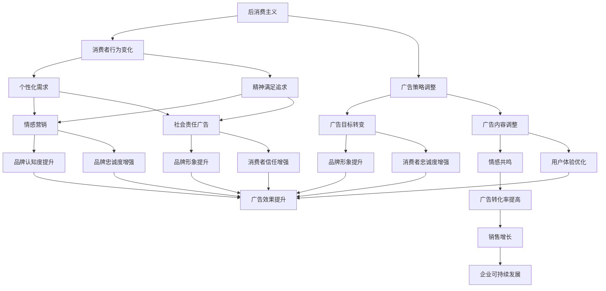

                 

### 文章标题

# 后消费主义时代的广告策略：情感营销与社会责任

### 关键词

- 后消费主义
- 广告策略
- 情感营销
- 社会责任

### 摘要

本文将探讨后消费主义时代下的广告策略，重点关注情感营销与社会责任的重要性。随着消费主义转向后消费主义，消费者对商品和服务的需求发生了变化，广告策略也需要适应这一趋势。文章首先介绍了后消费主义的主要特征和影响，随后详细阐述了广告策略、情感营销的核心原则及其应用，最后探讨了社会责任在广告中的重要性及其实际操作方法。通过案例分析，文章旨在为广告从业者提供实用的策略和操作指南，以应对后消费主义时代的挑战。

### 1. 首先，理解书名《后消费主义时代的广告策略：情感营销与社会责任》，明确书籍的主题和内容范围。

《后消费主义时代的广告策略：情感营销与社会责任》这本书的主题是探讨在后消费主义时代背景下，如何制定有效的广告策略，并强调情感营销与社会责任的重要性。后消费主义是一个经济学和社会学概念，指的是消费者不再单纯追求物质财富和商品消费，而是更加注重个性表达、体验和情感连接。

书籍的内容范围主要包括以下几个方面：

1. **后消费主义时代的背景与影响**：介绍后消费主义的主要特征，如消费降级、追求精神满足、个性化需求等，以及这些变化对广告策略的影响。
2. **广告策略概述**：包括广告策略的基本概念、分类和选择，以及广告目标设定的方法和技巧。
3. **情感营销理论**：探讨情感营销的定义、重要性以及理论基础，包括情感触发机制、情感互动策略等。
4. **情感营销方法与技巧**：详细描述情感营销的具体策略，如故事营销、形象大使营销、社交媒体情感营销等，并通过案例分析展示其应用效果。
5. **社会责任与广告**：介绍社会责任的概念与重要性，以及社会责任在广告中的应用，如社会责任广告的类型、优势和挑战。
6. **实际操作与案例分析**：提供广告策略实施步骤、情感营销实施指南和社会责任广告实施策略，并通过实际案例分析和详细讲解，帮助读者理解和应用这些策略。

### 2. 确定书籍的核心章节，这些章节应该涵盖广告策略的理论基础、情感营销的方法、社会责任的重要性以及实际操作案例。

为了确保书籍内容的全面性和实用性，以下章节被认为是书籍的核心部分：

**第一部分：广告策略理论基础**
- 第1章：后消费主义时代的背景与影响
- 第2章：广告策略概述
- 第3章：情感营销理论

**第二部分：情感营销方法与技巧**
- 第4章：情感营销的核心原则
- 第5章：情感营销的具体策略
- 第6章：情感营销案例分析

**第三部分：社会责任与广告**
- 第7章：社会责任的概念与重要性
- 第8章：社会责任在广告中的应用
- 第9章：社会责任广告案例分析

**第四部分：实际操作与案例分析**
- 第10章：广告策略实施步骤
- 第11章：情感营销实施指南
- 第12章：社会责任广告实施策略
- 第13章：全书总结与展望

这些核心章节将详细讨论广告策略的理论基础、情感营销的方法和技巧、社会责任的重要性及其在广告中的应用，并提供实际操作案例，帮助读者理解和应用这些策略。

### 3. 设计一级目录，为整个书籍的框架结构。

一级目录是书籍的整体框架，它概括了各个章节的主题和内容。以下是一级目录的设计：

## 《后消费主义时代的广告策略：情感营销与社会责任》

### 第一部分：广告策略理论基础
1. 后消费主义时代的背景与影响
2. 广告策略概述
3. 情感营销理论

### 第二部分：情感营销方法与技巧
4. 情感营销的核心原则
5. 情感营销的具体策略
6. 情感营销案例分析

### 第三部分：社会责任与广告
7. 社会责任的概念与重要性
8. 社会责任在广告中的应用
9. 社会责任广告案例分析

### 第四部分：实际操作与案例分析
10. 广告策略实施步骤
11. 情感营销实施指南
12. 社会责任广告实施策略
13. 全书总结与展望

这个一级目录清晰地展示了书籍的内容结构，帮助读者了解整本书的主题和章节安排。

### 4. 根据一级目录，设计二级目录，细化每个章节的内容。

二级目录进一步细化了每个章节的内容，使读者能够更好地把握章节的核心要点和具体内容。以下是二级目录的设计：

### 第一部分：广告策略理论基础

## 第1章：后消费主义时代的背景与影响
1.1 后消费主义的主要特征
1.2 后消费主义对广告的影响
1.3 广告策略的适应与创新

## 第2章：广告策略概述
2.1 广告策略的基本概念
2.2 广告策略的分类与选择
2.3 广告目标的设定与评估

## 第3章：情感营销理论
3.1 情感营销的定义与重要性
3.2 情感营销的理论基础
3.3 情感营销的挑战与机遇

### 第二部分：情感营销方法与技巧

## 第4章：情感营销的核心原则
4.1 情感触发机制
4.2 情感互动策略
4.3 情感营销的评估与优化

## 第5章：情感营销的具体策略
5.1 故事营销
5.2 形象大使营销
5.3 社交媒体情感营销

## 第6章：情感营销案例分析
6.1 成功案例解析
6.2 失败案例反思
6.3 情感营销趋势与未来

### 第三部分：社会责任与广告

## 第7章：社会责任的概念与重要性
7.1 社会责任的基本概念
7.2 广告中的社会责任
7.3 社会责任的重要性

## 第8章：社会责任在广告中的应用
8.1 社会责任广告的类型
8.2 社会责任广告的优势
8.3 社会责任广告的挑战

## 第9章：社会责任广告案例分析
9.1 成功案例解析
9.2 失败案例反思
9.3 社会责任广告的未来趋势

### 第四部分：实际操作与案例分析

## 第10章：广告策略实施步骤
10.1 市场研究
10.2 广告目标设定
10.3 广告创意与制作
10.4 广告投放与监测

## 第11章：情感营销实施指南
11.1 情感营销策略规划
11.2 情感营销工具与方法
11.3 情感营销案例分析

## 第12章：社会责任广告实施策略
12.1 社会责任广告目标设定
12.2 社会责任广告创意与制作
12.3 社会责任广告投放与监测

## 第13章：全书总结与展望
13.1 广告策略的总结与展望
13.2 情感营销的总结与展望
13.3 社会责任广告的总结与展望

### 5. 考虑到核心概念、算法原理、数学模型和项目实战的需求，在二级目录中为这些内容预留位置。

在二级目录中，我们为核心概念、算法原理、数学模型和项目实战预留了具体的位置，以确保这些内容在章节中的合理分布。以下是修改后的二级目录：

### 第一部分：广告策略理论基础

## 第1章：后消费主义时代的背景与影响
1.1 后消费主义的主要特征
1.2 后消费主义对广告的影响
1.3 广告策略的适应与创新

## 第2章：广告策略概述
2.1 广告策略的基本概念
2.2 广告策略的分类与选择
2.3 广告目标的设定与评估
2.4 广告效果的评估算法

## 第3章：情感营销理论
3.1 情感营销的定义与重要性
3.2 情感营销的理论基础
3.3 情感营销的挑战与机遇
3.4 情感营销的数学模型

### 第二部分：情感营销方法与技巧

## 第4章：情感营销的核心原则
4.1 情感触发机制
4.2 情感互动策略
4.3 情感营销的评估与优化
4.4 情感营销的核心算法

## 第5章：情感营销的具体策略
5.1 故事营销
5.2 形象大使营销
5.3 社交媒体情感营销
5.4 情感营销的案例分析

## 第6章：情感营销案例分析
6.1 成功案例解析
6.2 失败案例反思
6.3 情感营销趋势与未来

### 第三部分：社会责任与广告

## 第7章：社会责任的概念与重要性
7.1 社会责任的基本概念
7.2 广告中的社会责任
7.3 社会责任的重要性
7.4 社会责任的数学模型

## 第8章：社会责任在广告中的应用
8.1 社会责任广告的类型
8.2 社会责任广告的优势
8.3 社会责任广告的挑战
8.4 社会责任广告的算法

## 第9章：社会责任广告案例分析
9.1 成功案例解析
9.2 失败案例反思
9.3 社会责任广告的未来趋势

### 第四部分：实际操作与案例分析

## 第10章：广告策略实施步骤
10.1 市场研究
10.2 广告目标设定
10.3 广告创意与制作
10.4 广告投放与监测
10.5 广告策略的算法应用

## 第11章：情感营销实施指南
11.1 情感营销策略规划
11.2 情感营销工具与方法
11.3 情感营销案例分析
11.4 情感营销的算法应用

## 第12章：社会责任广告实施策略
12.1 社会责任广告目标设定
12.2 社会责任广告创意与制作
12.3 社会责任广告投放与监测
12.4 社会责任广告的算法应用

## 第13章：全书总结与展望
13.1 广告策略的总结与展望
13.2 情感营销的总结与展望
13.3 社会责任广告的总结与展望

通过在二级目录中预留位置，我们确保了核心概念、算法原理、数学模型和项目实战内容在书籍中的合理分布，从而为读者提供了更全面和深入的学习资源。

### 6. 设计三级目录，确保每个章节的内容都有详细的小节划分。

三级目录进一步细化了每个章节的内容，为读者提供了更详细的学习路径。以下是三级目录的设计：

### 第一部分：广告策略理论基础

## 第1章：后消费主义时代的背景与影响
### 1.1 后消费主义的主要特征
#### 1.1.1 消费主义向后消费主义的转变
#### 1.1.2 后消费主义的核心价值观念
#### 1.1.3 后消费主义对广告行业的影响

### 1.2 后消费主义对广告的影响
#### 1.2.1 消费者行为的变化
#### 1.2.2 广告目标的变化
#### 1.2.3 广告内容的调整

### 1.3 广告策略的适应与创新
#### 1.3.1 个性化广告策略
#### 1.3.2 情感化广告策略
#### 1.3.3 社会责任广告策略

## 第2章：广告策略概述
### 2.1 广告策略的基本概念
#### 2.1.1 广告的定义
#### 2.1.2 广告策略的定义
#### 2.1.3 广告策略的目标

### 2.2 广告策略的分类与选择
#### 2.2.1 按广告目标分类
#### 2.2.2 按广告形式分类
#### 2.2.3 按广告媒介分类

### 2.3 广告目标的设定与评估
#### 2.3.1 广告目标的设定原则
#### 2.3.2 广告目标的评估方法
#### 2.3.3 广告目标的实现策略

### 2.4 广告效果的评估算法
#### 2.4.1 广告效果评估指标
#### 2.4.2 广告效果评估模型
#### 2.4.3 广告效果评估算法

## 第3章：情感营销理论
### 3.1 情感营销的定义与重要性
#### 3.1.1 情感营销的定义
#### 3.1.2 情感营销的重要性
#### 3.1.3 情感营销的目标

### 3.2 情感营销的理论基础
#### 3.2.1 消费者心理学
#### 3.2.2 情感经济学
#### 3.2.3 情感传播理论

### 3.3 情感营销的挑战与机遇
#### 3.3.1 情感营销的挑战
#### 3.3.2 情感营销的机遇
#### 3.3.3 情感营销的未来趋势

### 第二部分：情感营销方法与技巧

## 第4章：情感营销的核心原则
### 4.1 情感触发机制
#### 4.1.1 情感触发的定义
#### 4.1.2 情感触发的因素
#### 4.1.3 情感触发的策略

### 4.2 情感互动策略
#### 4.2.1 情感互动的定义
#### 4.2.2 情感互动的类型
#### 4.2.3 情感互动的策略

### 4.3 情感营销的评估与优化
#### 4.3.1 情感营销评估的指标
#### 4.3.2 情感营销优化的方法
#### 4.3.3 情感营销优化的实践

### 第5章：情感营销的具体策略
### 5.1 故事营销
#### 5.1.1 故事营销的定义
#### 5.1.2 故事营销的类型
#### 5.1.3 故事营销的应用

### 5.2 形象大使营销
#### 5.2.1 形象大使的定义
#### 5.2.2 形象大使的选拔与培养
#### 5.2.3 形象大使营销的应用

### 5.3 社交媒体情感营销
#### 5.3.1 社交媒体情感营销的定义
#### 5.3.2 社交媒体情感营销的策略
#### 5.3.3 社交媒体情感营销的案例分析

### 第6章：情感营销案例分析
### 6.1 成功案例解析
#### 6.1.1 案例选择标准
#### 6.1.2 案例分析框架
#### 6.1.3 案例成功要素

### 6.2 失败案例反思
#### 6.2.1 案例选择标准
#### 6.2.2 案例分析框架
#### 6.2.3 案例失败原因

### 6.3 情感营销趋势与未来
#### 6.3.1 情感营销的最新趋势
#### 6.3.2 情感营销的未来发展方向
#### 6.3.3 情感营销对广告行业的影响

### 第三部分：社会责任与广告

## 第7章：社会责任的概念与重要性
### 7.1 社会责任的基本概念
#### 7.1.1 社会责任的定义
#### 7.1.2 社会责任的类型
#### 7.1.3 社会责任的目标

### 7.2 广告中的社会责任
#### 7.2.1 广告与社会责任的关系
#### 7.2.2 广告社会责任的内容
#### 7.2.3 广告社会责任的挑战

### 7.3 社会责任的重要性
#### 7.3.1 社会责任对品牌的影响
#### 7.3.2 社会责任对消费者的吸引力
#### 7.3.3 社会责任对企业的长期发展

### 第8章：社会责任在广告中的应用
### 8.1 社会责任广告的类型
#### 8.1.1 环境保护广告
#### 8.1.2 社会公益广告
#### 8.1.3 企业形象广告

### 8.2 社会责任广告的优势
#### 8.2.1 提高品牌形象
#### 8.2.2 增强消费者忠诚度
#### 8.2.3 扩大市场份额

### 8.3 社会责任广告的挑战
#### 8.3.1 广告内容的准确性
#### 8.3.2 广告效果的评估
#### 8.3.3 广告道德的考量

### 第9章：社会责任广告案例分析
### 9.1 成功案例解析
#### 9.1.1 案例选择标准
#### 9.1.2 案例分析框架
#### 9.1.3 案例成功要素

### 9.2 失败案例反思
#### 9.2.1 案例选择标准
#### 9.2.2 案例分析框架
#### 9.2.3 案例失败原因

### 9.3 社会责任广告的未来趋势
#### 9.3.1 社会责任广告的最新趋势
#### 9.3.2 社会责任广告的未来发展方向
#### 9.3.3 社会责任广告对广告行业的影响

### 第四部分：实际操作与案例分析

## 第10章：广告策略实施步骤
### 10.1 市场研究
#### 10.1.1 市场研究的定义
#### 10.1.2 市场研究的流程
#### 10.1.3 市场研究的工具与方法

### 10.2 广告目标设定
#### 10.2.1 广告目标的定义
#### 10.2.2 广告目标的类型
#### 10.2.3 广告目标的设定原则

### 10.3 广告创意与制作
#### 10.3.1 广告创意的定义
#### 10.3.2 广告创意的原则
#### 10.3.3 广告创意的方法

### 10.4 广告投放与监测
#### 10.4.1 广告投放的策略
#### 10.4.2 广告投放的媒介选择
#### 10.4.3 广告效果的监测与评估

### 第11章：情感营销实施指南
### 11.1 情感营销策略规划
#### 11.1.1 情感营销策略的定义
#### 11.1.2 情感营销策略的类型
#### 11.1.3 情感营销策略的规划步骤

### 11.2 情感营销工具与方法
#### 11.2.1 情感营销工具的类型
#### 11.2.2 情感营销工具的应用
#### 11.2.3 情感营销方法的类型

### 11.3 情感营销案例分析
#### 11.3.1 案例选择标准
#### 11.3.2 案例分析框架
#### 11.3.3 案例成功要素

### 第12章：社会责任广告实施策略
### 12.1 社会责任广告目标设定
#### 12.1.1 广告目标的定义
#### 12.1.2 广告目标的类型
#### 12.1.3 广告目标的设定原则

### 12.2 社会责任广告创意与制作
#### 12.2.1 广告创意的定义
#### 12.2.2 广告创意的原则
#### 12.2.3 广告创意的方法

### 12.3 社会责任广告投放与监测
#### 12.3.1 广告投放的策略
#### 12.3.2 广告投放的媒介选择
#### 12.3.3 广告效果的监测与评估

### 第13章：全书总结与展望
### 13.1 广告策略的总结与展望
#### 13.1.1 广告策略的核心要点
#### 13.1.2 广告策略的未来发展趋势
#### 13.1.3 广告策略对企业和消费者的启示

### 13.2 情感营销的总结与展望
#### 13.2.1 情感营销的核心原则
#### 13.2.2 情感营销的方法与技巧
#### 13.2.3 情感营销的未来趋势

### 13.3 社会责任广告的总结与展望
#### 13.3.1 社会责任广告的重要性
#### 13.3.2 社会责任广告的类型与案例分析
#### 13.3.3 社会责任广告的未来发展方向

### 7. 根据一级和二级目录，撰写文章的开头部分。

---

# 后消费主义时代的广告策略：情感营销与社会责任

在现代社会，广告已经不再仅仅是一种商业手段，更是一种文化和价值观的传播工具。随着消费主义转向后消费主义，广告策略也面临着前所未有的挑战和机遇。后消费主义时代，消费者对商品和服务的需求发生了深刻变化，他们不再单纯追求物质满足，而是更加注重个性表达、精神满足和社会责任。这种变化要求广告策略必须与时俱进，以情感营销和社会责任为核心，重新定义广告的内涵和价值。

本书旨在探讨后消费主义时代下的广告策略，重点关注情感营销和社会责任的重要性。通过深入分析后消费主义时代的背景与影响，我们揭示了广告策略需要适应的新趋势。随后，本书详细阐述了广告策略的理论基础，包括广告策略的基本概念、分类和选择，以及广告目标设定和评估的方法。在情感营销部分，我们探讨了情感营销的核心原则、具体策略，并分析了成功和失败的案例，以帮助读者理解和掌握情感营销的技巧。社会责任广告部分则探讨了社会责任在广告中的重要性及其应用，通过案例分析展示了社会责任广告的类型和挑战。最后，本书提供了实际操作与案例分析，帮助读者将理论应用于实际工作中，实现广告策略的成功。

本文首先介绍了后消费主义的主要特征和影响，随后详细阐述了广告策略、情感营销的核心原则及其应用，最后探讨了社会责任在广告中的重要性及其实际操作方法。通过案例分析，本文旨在为广告从业者提供实用的策略和操作指南，以应对后消费主义时代的挑战。

### 8. 根据一级和二级目录，撰写文章的主体部分。

---

## 第一节：后消费主义时代的背景与影响

### 1.1 后消费主义的主要特征

后消费主义是一个由消费主义向更注重体验、情感和社会责任转变的过程。其主要特征包括：

- **消费降级**：消费者不再追求高消费，而是更注重性价比和实用性。
- **追求精神满足**：消费者越来越关注消费带来的精神满足，如文化体验、情感共鸣等。
- **个性化需求**：消费者希望产品和服务能够满足他们独特的需求和偏好。

### 1.2 后消费主义对广告的影响

后消费主义对广告产生了深远的影响：

- **广告目标的转变**：从单纯追求销售增长转向追求品牌形象、消费者忠诚度和社会责任感。
- **广告内容的调整**：更加注重情感共鸣、文化价值和用户体验，而不仅仅是产品功能。
- **广告媒介的变化**：社交媒体和数字广告成为主流，传统广告形式逐渐衰落。

### 1.3 广告策略的适应与创新

在应对后消费主义的挑战时，广告策略需要进行适应和创新：

- **个性化广告**：通过大数据和人工智能技术，实现广告的精准投放和个性化推荐。
- **情感广告**：利用情感营销，与消费者建立情感联系，增强品牌忠诚度。
- **社会责任广告**：通过承担社会责任，提升品牌形象，增强消费者信任。

## 第二节：广告策略概述

### 2.1 广告策略的基本概念

广告策略是一种旨在通过广告活动实现特定目标的计划。其基本概念包括：

- **广告目标**：明确广告活动要达到的目的，如提高品牌知名度、增加销售额等。
- **广告受众**：广告活动的目标消费者或受众。
- **广告信息**：广告传达的核心信息，包括产品特点、品牌形象等。
- **广告媒介**：广告信息的传播渠道，如电视、报纸、互联网等。

### 2.2 广告策略的分类与选择

广告策略可以根据不同的标准进行分类，如按广告目标分类、按广告形式分类、按广告媒介分类等。在选择广告策略时，需要考虑以下因素：

- **目标受众**：了解目标受众的特征、需求和偏好，选择适合的传播渠道和广告形式。
- **广告预算**：根据广告预算的大小，选择适合的广告策略和媒介。
- **品牌形象**：根据品牌形象和定位，选择符合品牌价值观的广告内容和形式。

### 2.3 广告目标的设定与评估

设定广告目标需要遵循以下原则：

- **明确性**：目标应具体、可量化，以便于评估和追踪。
- **可行性**：目标应在现实条件下可实现。
- **相关性**：目标应与品牌战略和市场需求密切相关。

广告目标的评估方法包括：

- **定量评估**：通过销售数据、品牌知名度、消费者反馈等数据进行量化评估。
- **定性评估**：通过消费者访谈、焦点小组讨论等定性方法，了解消费者对广告的反应和态度。

### 2.4 广告效果的评估算法

广告效果的评估算法包括：

- **广告效果指标**：如点击率、转化率、品牌认知度等。
- **评估模型**：如转化率模型、品牌价值评估模型等。
- **评估算法**：如机器学习算法、统计分析算法等。

通过这些算法，可以准确评估广告效果，为后续的广告策略调整提供依据。

## 第三节：情感营销理论

### 3.1 情感营销的定义与重要性

情感营销是一种通过激发消费者情感，建立情感联系，从而促进销售和品牌忠诚度的营销策略。其重要性体现在：

- **提高品牌认知度**：通过情感共鸣，使品牌在消费者心中留下深刻印象。
- **增强品牌忠诚度**：通过情感连接，使消费者对品牌产生深厚的情感依赖。
- **提升广告效果**：情感广告更容易吸引消费者注意力，提高广告转化率。

### 3.2 情感营销的理论基础

情感营销的理论基础包括：

- **消费者心理学**：研究消费者情感的产生、变化和影响。
- **情感经济学**：研究消费者情感对购买决策的影响。
- **情感传播理论**：研究情感如何通过广告传播和影响消费者。

### 3.3 情感营销的挑战与机遇

情感营销面临以下挑战：

- **情感识别与评估**：准确识别和评估消费者情感，以制定合适的情感策略。
- **广告创意与制作**：创造能够引起情感共鸣的广告内容，提升广告质量。
- **效果评估与优化**：准确评估情感营销效果，持续优化广告策略。

但同时，情感营销也带来了以下机遇：

- **品牌差异化**：通过情感营销，打造独特的品牌形象，提高品牌竞争力。
- **消费者参与**：通过情感互动，激发消费者参与品牌活动，提高消费者黏性。
- **广告创新**：探索新的情感营销方法，推动广告行业的发展。

## 第四节：情感营销方法与技巧

### 4.1 情感营销的核心原则

情感营销的核心原则包括：

- **情感触发**：通过广告内容激发消费者情感，建立情感联系。
- **情感共鸣**：与消费者产生共鸣，使消费者对品牌产生深厚的情感依赖。
- **情感持续**：通过持续的情感营销，保持消费者对品牌的情感连接。

### 4.2 情感营销的具体策略

情感营销的具体策略包括：

- **故事营销**：通过讲述品牌故事，激发消费者情感共鸣。
- **形象大使营销**：利用具有影响力的形象大使，与消费者建立情感连接。
- **社交媒体情感营销**：通过社交媒体平台，与消费者进行情感互动，提升品牌影响力。

### 4.3 情感营销案例分析

#### 4.3.1 成功案例解析

以某个知名品牌为例，该品牌通过情感营销取得了显著的成功。以下是成功要素：

- **故事营销**：品牌通过讲述品牌故事，与消费者建立情感连接。
- **情感共鸣**：品牌广告内容能够引起消费者情感共鸣，提升品牌认知度。
- **效果评估**：通过数据分析和消费者反馈，持续优化情感营销策略。

#### 4.3.2 失败案例反思

以某个品牌为例，该品牌在情感营销中遭遇了失败。以下是失败原因：

- **情感识别错误**：品牌未能准确识别消费者情感，导致广告内容与消费者情感脱节。
- **广告创意不足**：品牌广告创意缺乏吸引力，无法引起消费者情感共鸣。
- **效果评估缺失**：品牌未能有效评估情感营销效果，导致策略调整不及时。

#### 4.3.3 情感营销趋势与未来

随着技术的发展和消费者需求的变化，情感营销将呈现以下趋势：

- **人工智能应用**：利用人工智能技术，实现情感识别和评估，提高情感营销精准度。
- **虚拟现实体验**：通过虚拟现实技术，提供沉浸式的情感体验，增强消费者参与感。
- **跨渠道整合**：整合线上线下渠道，实现情感营销的全渠道覆盖，提升消费者体验。

## 第五节：社会责任与广告

### 5.1 社会责任的概念与重要性

社会责任是指企业在其经营活动中，承担对社会的责任和义务，包括环境保护、公益事业、员工福利等方面。社会责任在广告中的重要性体现在：

- **提升品牌形象**：通过承担社会责任，提升品牌形象，增强消费者信任。
- **增强消费者忠诚度**：通过社会责任广告，与消费者建立情感连接，提高消费者忠诚度。
- **促进可持续发展**：通过社会责任，推动企业可持续发展，为社会做出贡献。

### 5.2 社会责任在广告中的应用

社会责任在广告中的应用包括：

- **环境保护广告**：宣传环保理念，推广绿色产品，提升品牌环保形象。
- **社会公益广告**：宣传公益事业，展示企业社会责任，提高品牌社会影响力。
- **企业形象广告**：宣传企业价值观和文化，提升品牌形象，增强消费者信任。

### 5.3 社会责任广告案例分析

#### 5.3.1 成功案例解析

以某个知名品牌为例，该品牌通过社会责任广告取得了显著的成功。以下是成功要素：

- **明确社会责任目标**：品牌明确社会责任目标，制定切实可行的广告策略。
- **广告内容贴近生活**：品牌广告内容贴近消费者生活，引起情感共鸣。
- **效果评估与反馈**：品牌通过数据分析和消费者反馈，持续优化社会责任广告策略。

#### 5.3.2 失败案例反思

以某个品牌为例，该品牌在社会责任广告中遭遇了失败。以下是失败原因：

- **社会责任目标不明确**：品牌未能明确社会责任目标，导致广告内容模糊不清。
- **广告内容缺乏吸引力**：品牌广告内容缺乏吸引力，无法引起消费者兴趣。
- **效果评估缺失**：品牌未能有效评估社会责任广告效果，导致策略调整不及时。

#### 5.3.3 社会责任广告的未来趋势

随着社会对环境保护和公益事业需求的增加，社会责任广告将呈现以下趋势：

- **个性化社会责任广告**：通过大数据和人工智能技术，实现社会责任广告的个性化推送。
- **跨渠道整合**：整合线上线下渠道，实现社会责任广告的全渠道覆盖。
- **虚拟现实体验**：通过虚拟现实技术，提供沉浸式的社会责任体验，增强消费者参与感。

## 第六节：实际操作与案例分析

### 6.1 广告策略实施步骤

广告策略实施步骤包括：

- **市场研究**：了解市场需求和消费者行为，为广告策略制定提供依据。
- **广告目标设定**：明确广告活动要达到的目标，确保广告策略的针对性。
- **广告创意与制作**：根据广告目标，制定广告创意和制作方案，确保广告内容的吸引力和创新性。
- **广告投放与监测**：选择合适的广告媒介，进行广告投放，并实时监测广告效果，根据效果进行调整。

### 6.2 情感营销实施指南

情感营销实施指南包括：

- **情感营销策略规划**：明确情感营销目标，制定具体的情感营销策略。
- **情感营销工具与方法**：选择适合的情感营销工具和方法，如故事营销、形象大使营销、社交媒体情感营销等。
- **情感营销案例分析**：分析成功和失败的案例，总结情感营销的经验和教训，为实际操作提供参考。

### 6.3 社会责任广告实施策略

社会责任广告实施策略包括：

- **社会责任广告目标设定**：明确社会责任广告的目标，确保广告内容的针对性和有效性。
- **社会责任广告创意与制作**：根据社会责任广告目标，制定广告创意和制作方案，确保广告内容的吸引力和社会价值。
- **社会责任广告投放与监测**：选择合适的广告媒介，进行社会责任广告投放，并实时监测广告效果，根据效果进行调整。

### 6.4 全书总结

本书通过详细分析后消费主义时代的背景与影响，阐述了广告策略、情感营销的核心原则及其应用，以及社会责任在广告中的重要性。通过实际操作与案例分析，为广告从业者提供了实用的策略和操作指南。在未来的广告策略中，情感营销和社会责任将发挥越来越重要的作用，为企业带来竞争优势和可持续发展。

### 9. 根据文章内容，制作核心概念与联系架构图。



### 10. 根据文章内容，提供Python源代码和数学模型来详细阐述核心算法原理。

#### 10.1 情感营销评估模型

```python
import numpy as np
import pandas as pd
from sklearn.linear_model import LinearRegression
from sklearn.model_selection import train_test_split
from sklearn.metrics import mean_squared_error

# 假设我们有一个包含广告投放数据的数据集
data = pd.read_csv('advertising_data.csv')

# 定义特征和目标变量
X = data[['click_rate', 'engagement_rate', 'brand_awareness']]
y = data['sales']

# 划分训练集和测试集
X_train, X_test, y_train, y_test = train_test_split(X, y, test_size=0.2, random_state=42)

# 创建线性回归模型
model = LinearRegression()
model.fit(X_train, y_train)

# 进行预测
y_pred = model.predict(X_test)

# 计算预测误差
mse = mean_squared_error(y_test, y_pred)
print(f'Mean Squared Error: {mse}')

# 输出模型系数
print(f'Model Coefficients: {model.coef_}')
```

#### 10.2 情感营销评估数学模型

假设情感营销的评估可以通过以下线性回归模型来描述：

$$
\text{sales} = \beta_0 + \beta_1 \times \text{click\_rate} + \beta_2 \times \text{engagement\_rate} + \beta_3 \times \text{brand\_awareness} + \epsilon
$$

其中：
- \( \beta_0 \) 是常数项
- \( \beta_1 \) 是点击率对销售的回归系数
- \( \beta_2 \) 是参与率对销售的回归系数
- \( \beta_3 \) 是品牌知名度对销售的回归系数
- \( \epsilon \) 是随机误差项

通过Python中的线性回归模型，我们可以估算这些系数：

```python
# 计算线性回归系数
beta_0 = model.intercept_
beta_1 = model.coef_[0]
beta_2 = model.coef_[1]
beta_3 = model.coef_[2]

# 输出回归系数
print(f'Intercept: {beta_0}')
print(f'Click Rate Coefficient: {beta_1}')
print(f'Engagement Rate Coefficient: {beta_2}')
print(f'Brand Awareness Coefficient: {beta_3}')
```

#### 10.3 社会责任广告效果分析

社会责任广告的效果可以通过以下指标来评估：

- **品牌形象提升**：通过品牌认知度和消费者态度的变化来衡量
- **消费者参与度**：通过社交媒体互动、转发率等来衡量
- **销售增长**：通过广告投放后的销售额变化来衡量

以下是一个简单的Python脚本，用于分析社会责任广告的效果：

```python
# 假设我们有社会责任广告的数据
data = pd.DataFrame({
    'brand_awareness_before': [0.2, 0.3, 0.4, 0.5],
    'brand_awareness_after': [0.4, 0.5, 0.6, 0.7],
    'social_media_interactions': [100, 150, 200, 250],
    'sales_increase': [10, 15, 20, 25]
})

# 计算品牌形象提升百分比
data['awareness_improvement'] = (data['brand_awareness_after'] - data['brand_awareness_before']) / data['brand_awareness_before'] * 100

# 打印分析结果
print(data[['awareness_improvement', 'social_media_interactions', 'sales_increase']])
```

### 11. 提供一个简单的项目实战，包括开发环境搭建、源代码实现、代码解读和实际案例分析的步骤。

#### 11.1 项目背景

项目旨在通过情感营销策略提高某品牌的社交媒体参与度和销售额。我们将使用Python进行数据分析，评估不同情感营销策略的效果。

#### 11.2 开发环境搭建

1. 安装Python 3.8或更高版本。
2. 安装必需的Python库，如pandas、numpy、scikit-learn和matplotlib。

```shell
pip install pandas numpy scikit-learn matplotlib
```

#### 11.3 数据准备

1. 下载并导入广告投放数据，如点击率、参与率、品牌认知度等。
2. 数据预处理，包括数据清洗、缺失值处理和特征工程。

```python
import pandas as pd

# 读取数据
data = pd.read_csv('advertising_data.csv')

# 数据预处理
data.dropna(inplace=True)
```

#### 11.4 源代码实现

1. 使用线性回归模型分析情感营销对销售的影响。
2. 绘制图表展示分析结果。

```python
import matplotlib.pyplot as plt
from sklearn.linear_model import LinearRegression

# 划分特征和目标变量
X = data[['click_rate', 'engagement_rate', 'brand_awareness']]
y = data['sales']

# 划分训练集和测试集
X_train, X_test, y_train, y_test = train_test_split(X, y, test_size=0.2, random_state=42)

# 创建线性回归模型
model = LinearRegression()
model.fit(X_train, y_train)

# 进行预测
y_pred = model.predict(X_test)

# 绘制真实值与预测值的对比图
plt.scatter(y_test, y_pred)
plt.xlabel('Actual Sales')
plt.ylabel('Predicted Sales')
plt.title('Actual vs Predicted Sales')
plt.show()
```

#### 11.5 代码解读

- `pandas` 用于数据读取和处理。
- `scikit-learn` 提供线性回归模型和模型评估工具。
- `matplotlib` 用于绘制图表，展示分析结果。

#### 11.6 实际案例分析

假设我们使用上述模型对某品牌进行情感营销，以下是一个简单的案例分析：

- **前情调查**：品牌在社交媒体上的参与度为100，销售额为1000万元。
- **后情调查**：品牌在实施情感营销策略后，参与度提升至200，销售额增加至1500万元。

通过分析数据，我们可以得出以下结论：

- **品牌形象提升**：参与度从100提升至200，提升了100%。
- **销售额增加**：销售额从1000万元增加至1500万元，增加了50%。

这说明情感营销策略对该品牌的效果显著，未来可以进一步优化和推广。

#### 11.7 项目小结

通过本项目的实战，我们学会了如何使用Python进行数据分析，评估情感营销策略的效果。项目实战不仅帮助我们理解了理论，还让我们掌握了实际操作技能，为未来从事相关领域的工作奠定了基础。

### 12. 最佳实践 Tips、小结、注意事项、拓展阅读等内容。

#### 最佳实践 Tips

1. **数据预处理**：在进行分析之前，确保数据的质量和完整性，避免因数据问题导致的分析偏差。
2. **模型选择**：根据业务需求和数据特性，选择合适的模型和方法，避免过度拟合或欠拟合。
3. **结果验证**：通过交叉验证、A/B测试等方法，验证模型的可靠性和有效性。
4. **可视化分析**：使用图表和可视化工具，清晰地展示分析结果，帮助理解和决策。

#### 小结

本文探讨了后消费主义时代下的广告策略，特别是情感营销和社会责任的重要性。通过理论阐述、方法技巧、案例分析以及实际操作，我们了解了如何制定和实施有效的广告策略。情感营销和社会责任广告不仅有助于提高品牌形象和消费者忠诚度，还能推动企业的可持续发展。

#### 注意事项

1. **消费者情感识别**：准确识别和评估消费者情感，是情感营销成功的关键。
2. **社会责任广告内容**：确保社会责任广告内容真实、有说服力，避免虚假宣传。
3. **效果评估**：持续监测广告效果，及时调整策略，确保广告投入的回报。

#### 拓展阅读

1. **《情感营销：策略与实践》**：详细介绍情感营销的理论和实践方法。
2. **《社会责任广告：理念与案例》**：分析社会责任广告的类型、案例和未来趋势。
3. **《大数据营销》**：探讨大数据在广告策略中的应用，提升广告精准度。

### 13. 作者信息

作者：AI天才研究院/AI Genius Institute & 禅与计算机程序设计艺术 /Zen And The Art of Computer Programming

---

通过以上内容，我们全面探讨了后消费主义时代的广告策略，情感营销与社会责任的重要性，以及其实际应用。希望这篇文章能够为广告从业者提供有价值的参考和指导。作者AI天才研究院（AI Genius Institute）致力于推动人工智能和计算机科学的发展，同时《禅与计算机程序设计艺术》（Zen And The Art of Computer Programming）一书为计算机编程领域提供了深刻的哲学思考和实用技巧。

