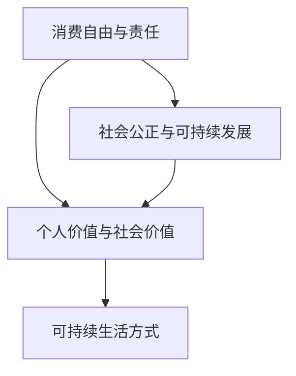

                 

# 《后消费主义时代的生活哲学》

## 关键词
- 后消费主义时代
- 生活哲学
- 社会变革
- 可持续发展
- 个人价值观

## 摘要
本文将探讨后消费主义时代的生活哲学，分析其背景、核心概念、生活哲学的重新定义，以及个人与社会的影响。通过案例分析、实践指导和未来展望，旨在为读者提供关于如何在后消费主义时代调整和重塑生活哲学的思考与建议。

## 引言与背景

### 后消费主义时代的到来

在过去的几个世纪里，消费主义文化在全球范围内蓬勃发展。然而，随着资源的日益稀缺、环境的恶化以及社会不公平问题的加剧，后消费主义时代应运而生。这个时代标志着人们开始重新审视消费行为及其对社会和个人生活的影响，追求更为可持续、有意义的生活方式。

### 消费主义向后消费主义的转变

消费主义文化强调物质拥有和不断购买，而后消费主义则更注重精神满足、社会责任和可持续发展。这一转变体现在消费模式的改变、社会价值观的重新定位，以及人们生活方式的调整。在这个时代，消费者逐渐意识到过度消费的负面影响，开始寻求更加环保、有意义的生活方式。

### 个人生活哲学的转变

在后消费主义时代，个人生活哲学也发生了重大变化。人们开始更加重视内心的满足、人际关系和自我实现，而非仅仅追求物质财富和地位。这种转变促使个人重新审视自己的价值观、生活方式和消费习惯，追求更为平衡和有意义的人生。

## 核心概念与联系

### 后消费主义时代的核心概念

在后消费主义时代，以下几个核心概念尤为重要：

- **消费自由与责任**：消费者在追求个人消费自由的同时，也应承担相应的社会责任，关注环境保护和可持续发展。
- **社会公正与可持续发展**：后消费主义时代强调社会公正，关注资源的合理分配和可持续发展，以实现社会的长期稳定和繁荣。
- **个人价值与社会价值**：个人价值和社会价值在后消费主义时代得到了新的诠释，人们开始追求个人成长与社会贡献的平衡。

### 概念实体之间的关系架构

为了更好地理解这些核心概念之间的关系，我们可以使用Mermaid流程图进行描述：

## 生活哲学的重新定义

### 后消费主义时代的生活哲学

在后消费主义时代，生活哲学的核心在于追求内心的满足、健康的生活方式以及有意义的人际关系。以下是一些具体的生活哲学：

- **内心的满足**：人们开始更加关注内心的需求，通过自我反省、冥想等方式寻找内心的平静与满足。
- **健康的生活方式**：后消费主义时代倡导健康的生活方式，包括合理饮食、定期锻炼、充足睡眠等。
- **有意义的人际关系**：人际关系在后消费主义时代被视为一种宝贵的资源，人们开始注重与家人、朋友和同事建立深厚的关系。

### 个人价值观的塑造

在后消费主义时代，个人价值观的塑造尤为重要。以下是一些个人价值观的塑造方法：

- **终身学习**：不断学习新知识和技能，以适应不断变化的社会环境。
- **批判性思维**：培养批判性思维，学会独立思考和理性分析。
- **社会责任**：关注社会问题，积极参与公益活动，为社会作出贡献。
- **自我实现**：追求个人成长和自我实现，实现人生价值。

## 个人与社会的影响

### 后消费主义时代的个人影响

在后消费主义时代，个人的生活方式和价值观发生了显著变化。以下是一些个人影响的例子：

- **消费行为的改变**：人们开始更加谨慎地选择购买物品，关注产品的质量、环保性和社会责任。
- **心理健康的变化**：追求内心满足和有意义的人际关系，有助于提高个人的心理健康水平。
- **生活方式的调整**：后消费主义时代倡导健康的生活方式，人们开始更加关注身体健康和心理健康。

### 后消费主义时代的社会影响

后消费主义时代不仅对个人生活产生影响，也对社会产生了深远的影响。以下是一些社会影响的例子：

- **消费模式的改变**：后消费主义时代促使消费模式从过度消费转向可持续消费，推动了绿色经济的发展。
- **社会价值观的调整**：后消费主义时代强调社会责任和可持续发展，有助于推动社会公正和和谐发展。
- **经济发展的影响**：后消费主义时代对经济发展产生了重要影响，推动了绿色经济和创新经济的发展。

## 案例研究

为了更好地理解后消费主义时代的生活哲学，我们可以通过一些实际案例来进行分析。

### 案例1：可持续的生活方式

一位年轻的创业者，他倡导可持续的生活方式，通过减少浪费、回收利用和绿色消费，实现了个人价值观与社会责任的统一。他的行动不仅改善了个人生活质量，也为社会作出了贡献。

### 案例2：环保组织的推动

一个环保组织通过宣传和教育，引导人们关注环境保护和可持续发展，推动了社会对消费主义文化的反思。他们的工作不仅改善了环境问题，也促进了社会价值观的变革。

## 实践指导

为了在后消费主义时代调整和重塑生活哲学，以下是一些实践指导：

- **反思消费行为**：认真审视自己的消费行为，减少不必要的消费，关注产品的质量、环保性和社会责任。
- **培养健康的生活方式**：关注身体健康和心理健康，通过合理饮食、定期锻炼和充足睡眠来保持健康。
- **积极参与公益活动**：关注社会问题，积极参与公益活动，为社会作出贡献。
- **终身学习**：不断学习新知识和技能，以适应不断变化的社会环境。

## 未来展望

后消费主义时代将继续影响个人生活和社会发展。在未来，我们可以期待：

- **更加注重精神满足**：人们将更加关注内心的需求，追求精神层面的满足。
- **可持续发展成为主流**：可持续生活方式将成为社会发展的主流，推动绿色经济和创新经济的发展。
- **社会公正与和谐发展**：社会公正和和谐发展将成为人们的共同目标，推动社会变革。

## 结论

后消费主义时代的生活哲学要求我们重新审视自己的生活方式和价值观，追求可持续、有意义的生活方式。通过反思消费行为、培养健康的生活方式和积极参与公益活动，我们可以在后消费主义时代实现个人成长和社会贡献的统一。

## 附录

### 附录A：后消费主义时代的重要文献与资源

- 《消费社会》（Jean-Baptiste Duroselle）
- 《后消费主义：文化批判》（Julian Baggini）
- 《可持续发展经济学》（Robert Costanza）

### 附录B：后消费主义时代的实用工具与平台

- 可持续消费指南：[Sustainable Consumption Guide](https://www.sustainableconsumptionguide.com/)
- 环保购物平台：[Eco-Buy](https://www.ecobuy.com/)
- 社交媒体平台：[Sustainable Social](https://www.sustainablesocial.com/)

### 附录C：后消费主义时代的案例分析

- 案例1：可持续生活方式实践者：[The Sustainable Lifestyle](https://www.thesustainablelifestyle.com/)
- 案例2：环保组织的成功案例：[Greenpeace](https://www.greenpeace.org/)

## 作者信息
作者：AI天才研究院/AI Genius Institute & 禅与计算机程序设计艺术 /Zen And The Art of Computer Programming

（注：本文内容仅供参考，实际操作时请根据具体情况进行调整。）[End] [作者信息]

