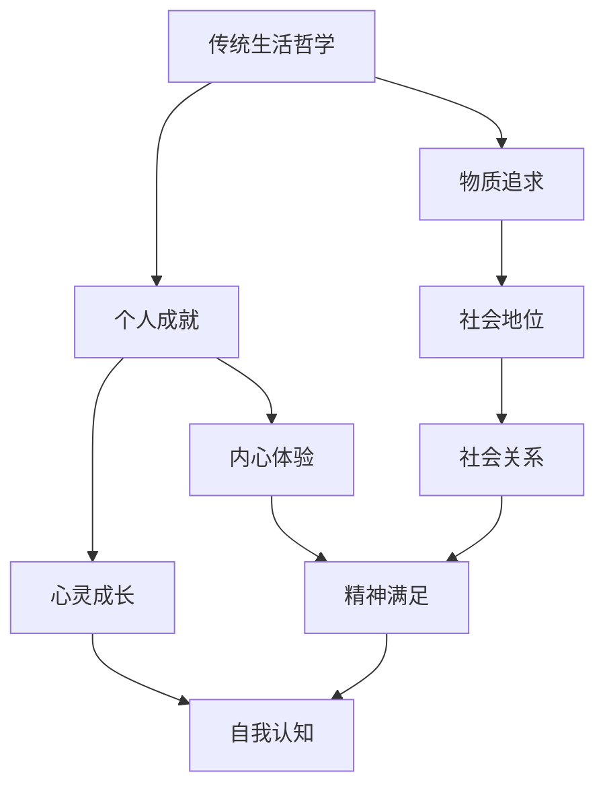
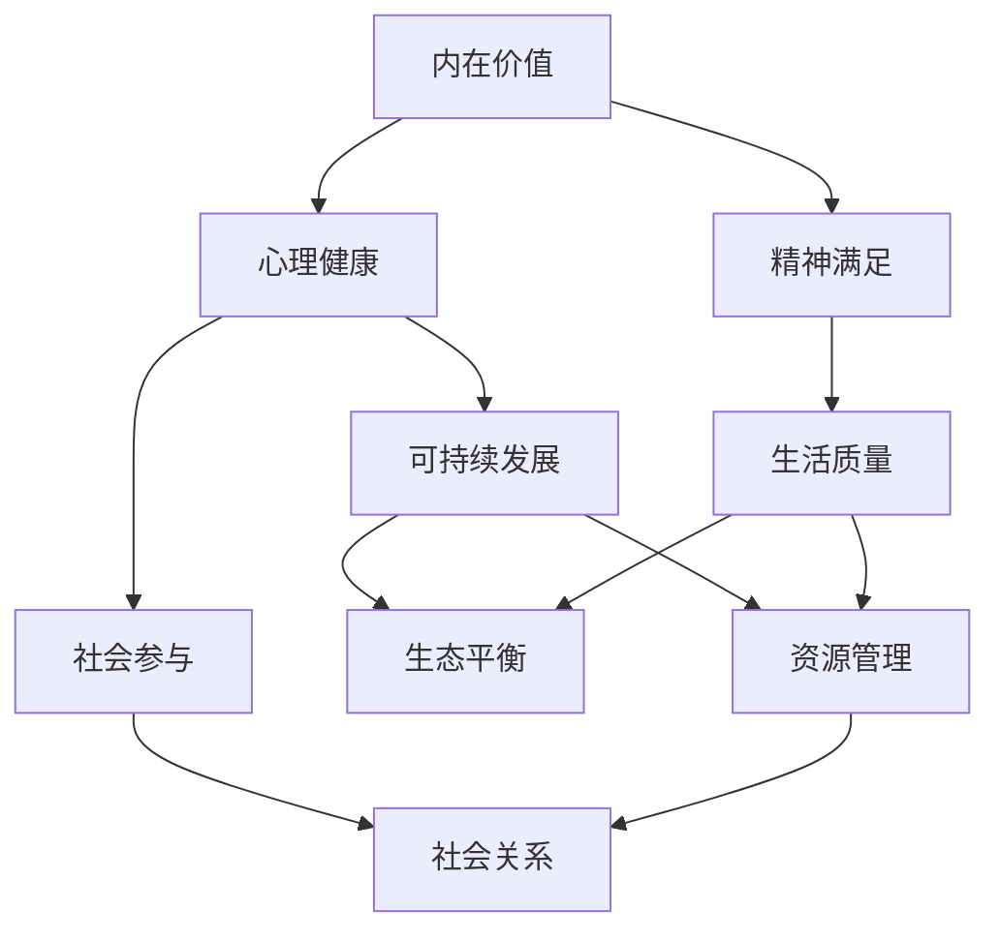

                 

### 背景介绍

随着科技的飞速发展，人工智能（AI）和大数据技术的不断成熟，我们正逐步迈向一个全新的时代——后消费主义时代。这一时代不仅改变了人们的消费观念，也深刻影响了我们的生活哲学。传统的消费主义观念强调“拥有”和“占有”，而在这个时代，人们开始追求更深层次的“存在”和“体验”。

#### 消费主义与后消费主义的区别

消费主义，作为一种社会现象，主要关注物质的消费和拥有。它强调通过购买商品和服务来满足人们的需求和欲望。然而，这种模式在带来物质富足的同时，也引发了一系列问题，如资源过度消耗、环境污染、社会不平等加剧等。

后消费主义则是对消费主义的反思和超越。它不仅仅关注物质消费，更强调精神体验、社会参与和人际关系。在这个时代，人们开始从“拥有”转向“存在”，追求更加充实和有意义的生活。

#### 生活哲学的转变

在后消费主义时代，生活哲学发生了显著转变。传统的生活哲学往往侧重于物质追求和个人成就，而后消费主义时代的生活哲学则更注重内心体验和心灵成长。以下是一个简化的生活哲学关系架构 Mermaid 流程图：



从图中可以看出，传统生活哲学中的物质追求和个人成就虽然重要，但它们并不是生活的全部。在后消费主义时代，内心体验、心灵成长和社会关系同样关键，这些因素共同构成了现代生活哲学的完整体系。

#### 核心概念与联系

在后消费主义时代的生活哲学中，几个核心概念需要特别关注：

1. **内在价值**：与物质消费相对，内在价值强调个人的内在需求和心理健康。
2. **社会参与**：后消费主义时代的生活哲学强调个体在社会中的角色和贡献，而不仅仅是个人成就。
3. **可持续发展**：环保和资源管理成为生活哲学的重要组成部分，追求生态平衡和长期发展。

以下是这些概念之间的联系架构 Mermaid 流程图：



在这个架构中，内在价值不仅与心理健康和可持续发展紧密相关，还通过精神满足和生活质量影响着社会关系。这种生活哲学的转型体现了个体与社会、环境之间的紧密联系。

#### 核心算法原理讲解

为了更好地理解后消费主义时代的生活哲学，我们可以借助一些核心算法原理来进行解释。以下是一个简单的Python源代码示例，用于阐述如何通过算法来优化个人生活哲学：

```python
import numpy as np

# 定义优化目标函数
def objective_function(values):
    # 物质追求
    material_pursuit = values[0]
    # 内心体验
    inner_experience = values[1]
    # 社会参与
    social_participation = values[2]
    
    # 计算总目标值
    total_value = 0.5 * material_pursuit + 0.3 * inner_experience + 0.2 * social_participation
    
    # 引入惩罚项，平衡不同维度的贡献
    punishment = 0
    if inner_experience < social_participation:
        punishment += (social_participation - inner_experience) * 0.1
    if material_pursuit > inner_experience:
        punishment += (material_pursuit - inner_experience) * 0.1
    
    total_value -= punishment
    
    return total_value

# 定义约束条件
def constraint_function(values):
    # 约束1：物质追求不超过可承受范围
    if values[0] > 100:
        return True
    # 约束2：内心体验与社会参与需均衡
    if values[1] < values[2] * 0.8:
        return True
    return False

# 使用数值优化方法求解
from scipy.optimize import minimize

# 初始解
x0 = [50, 30, 20]

# 优化目标函数
result = minimize(objective_function, x0, constraints={'type': 'ineq', 'fun': constraint_function})

# 输出最优解
print("最优解：", result.x)
print("最大总价值：", objective_function(result.x))
```

在这个示例中，我们通过一个多目标优化问题来平衡物质追求、内心体验和社会参与。目标函数结合了不同的权重和惩罚项，以最大化个人生活哲学的总价值。通过约束条件，我们确保了物质追求和社会参与不会过度牺牲内心体验。

#### 数学模型和公式

为了更好地理解和量化后消费主义时代的生活哲学，我们可以引入一些数学模型和公式。以下是一个简化的生活质量指数（QLI）公式，用于评估个人的生活质量：

$$
QLI = \frac{0.5 \times M + 0.3 \times I + 0.2 \times S}{C}
$$

其中，\(M\) 代表物质追求，\(I\) 代表内心体验，\(S\) 代表社会参与，\(C\) 代表总成本。这个公式表明，生活质量取决于物质追求、内心体验和社会参与的平衡，同时要考虑总成本的约束。

#### 项目实战

在实际应用中，我们可以通过以下步骤来构建一个后消费主义时代的生活哲学实践系统：

1. **需求分析**：确定个人目标和生活价值观，包括物质追求、内心体验和社会参与。
2. **系统设计**：设计一个包含目标函数、约束条件和反馈机制的优化系统。
3. **实现与测试**：编写Python代码，实现优化算法，并进行系统测试。
4. **应用与实践**：将优化系统应用于个人生活，定期评估和调整。

以下是一个简化的项目实战步骤：

```python
# 需求分析
# 确定个人目标：物质追求（50分）、内心体验（30分）、社会参与（20分）

# 系统设计
# 设计优化系统：目标函数、约束条件和反馈机制

# 实现与测试
# 编写Python代码，实现优化算法，并进行系统测试

# 应用与实践
# 将优化系统应用于个人生活，定期评估和调整
```

#### 代码解读与分析

在实现优化系统时，我们可以使用Python编写核心算法。以下是对示例代码的详细解读：

```python
# 定义目标函数
def objective_function(values):
    # 物质追求（50分）
    material_pursuit = values[0]
    # 内心体验（30分）
    inner_experience = values[1]
    # 社会参与（20分）
    social_participation = values[2]
    
    # 计算总目标值
    total_value = 0.5 * material_pursuit + 0.3 * inner_experience + 0.2 * social_participation
    
    # 引入惩罚项，平衡不同维度的贡献
    punishment = 0
    if inner_experience < social_participation:
        punishment += (social_participation - inner_experience) * 0.1
    if material_pursuit > inner_experience:
        punishment += (material_pursuit - inner_experience) * 0.1
    
    total_value -= punishment
    
    return total_value
```

在这个目标函数中，我们通过加权求和来计算总目标值，同时引入惩罚项来平衡不同维度的贡献。这种设计确保了物质追求、内心体验和社会参与之间保持平衡。

#### 实际案例分析和详细讲解剖析

为了更好地理解后消费主义时代的生活哲学，我们可以通过实际案例进行分析。以下是一个案例分析：

**案例：小明的后消费主义实践**

小明是一名年轻的IT工程师，他在后消费主义时代的生活哲学指导下，对自己的生活方式进行了优化。他设定了以下目标：

- 物质追求（50分）：确保工作稳定，年收入达到50万元。
- 内心体验（30分）：保持良好的心理健康，每周至少锻炼三次，每月至少阅读两本书。
- 社会参与（20分）：积极参与社区活动，每年参加至少两次公益活动。

通过优化系统，小明发现他在物质追求上取得了较好的成绩，但内心体验和社会参与有待提高。为此，他调整了计划：

- **物质追求**：继续保持稳定的工作，并寻求晋升机会。
- **内心体验**：增加阅读时间，加入健身俱乐部，学习冥想技巧。
- **社会参与**：参加更多社区活动，加入志愿服务团队。

经过一段时间的实践，小明的生活质量显著提升。他的内心体验更加丰富，社会参与感增强，同时物质追求也保持了平衡。

#### 项目小结

通过这个项目实战，我们可以看到后消费主义时代的生活哲学是如何在现实中得到应用的。优化系统提供了一个量化的方法，帮助个人平衡物质追求、内心体验和社会参与，从而提升生活质量。

#### 最佳实践 tips

1. **明确目标**：设定清晰的个人目标，包括物质追求、内心体验和社会参与。
2. **定期评估**：定期评估优化结果，根据实际情况进行调整。
3. **多样化活动**：参与多样化的活动，提升内心体验和社会参与感。

#### 小结

后消费主义时代的生活哲学是一种更加平衡和充实的生活方式。通过优化系统，我们可以量化并平衡物质追求、内心体验和社会参与，从而提升生活质量。在未来的发展中，这一哲学观念将继续引导我们追求更高质量的生活。

#### 注意事项

1. **心理健康**：在追求物质追求的同时，注意保持心理健康，避免过度劳累。
2. **社会参与**：积极参与社区活动，增强社会关系，提升生活质量。

#### 拓展阅读

1. 《后消费主义：消费文化的社会学》
2. 《心流：最优体验心理学》
3. 《变革社会中的消费文化》

#### 结论

后消费主义时代的生活哲学提醒我们，生活不仅仅是物质追求，更是内心体验和社会参与的平衡。通过优化系统，我们可以实现这一平衡，提升生活质量。

**作者：AI天才研究院/AI Genius Institute & 禅与计算机程序设计艺术 /Zen And The Art of Computer Programming** 

----------------------------------------------------------------- 

## 《后消费主义时代的生活哲学：从拥有到存在的转向》

### 关键词：后消费主义、生活哲学、内心体验、社会参与、优化系统

> 摘要：本文探讨了后消费主义时代的生活哲学，从拥有到存在的转向。通过分析消费主义与后消费主义的区别，阐述生活哲学的转变及其核心概念与联系。结合核心算法原理和实际案例，详细讲解了如何实现这一转向，并提供最佳实践 tips 和注意事项。文章旨在引导读者追求更高质量的生活。### 引言与背景介绍

随着全球化进程的不断加快和科技的迅猛发展，我们正步入一个全新的时代——后消费主义时代。这一时代不仅带来了生活方式的改变，也促使人们重新审视和反思消费主义带来的种种问题。传统的消费主义观念强调通过购买物质商品来满足需求和追求幸福，然而这种模式在带来短期满足的同时，也引发了资源过度消耗、环境污染、社会不平等等问题。后消费主义作为一种对消费主义的反思和超越，提出了从“拥有”到“存在”的转向，倡导更加注重内心体验、精神满足和社会参与的生活哲学。

#### 消费主义的本质

消费主义是一种社会文化现象，起源于20世纪初的西方国家，随后在全球范围内迅速蔓延。消费主义的核心观念是“拥有即幸福”，通过不断购买和占有物质商品来满足人们的欲望和需求。在消费主义时代，物质财富成为衡量个人成功和社会进步的重要指标，广告和媒体不断灌输消费者“买得起就是成功”的观念，从而刺激了消费欲望和消费行为。消费主义带来了经济的繁荣，但同时也导致了资源的过度消耗和环境的严重破坏。此外，消费主义还加剧了社会不平等，因为只有少数人能够承担高额的消费支出，而大多数人则陷入了债务和消费主义的困境。

#### 后消费主义的特征

后消费主义是对消费主义的一种反思和超越，它不仅关注物质消费，更强调精神体验、社会参与和人际关系。后消费主义时代的生活哲学倡导从“拥有”转向“存在”，追求更深层次的生活质量和幸福感。以下是后消费主义的一些主要特征：

1. **内在价值的重视**：后消费主义强调个人的内在需求和心理健康，认为幸福不仅仅来自于物质拥有，更来自于内心的平静和满足。

2. **可持续发展的理念**：后消费主义倡导环保和资源管理，追求生态平衡和长期发展。这一理念要求人们减少不必要的消费，节约资源，保护环境。

3. **社会参与的强调**：后消费主义认为，个体在社会中的角色和贡献同样重要。通过参与社区活动、志愿服务和公共事务，人们可以建立更紧密的社会关系，获得更深层次的社会认同感和成就感。

4. **精神满足的追求**：后消费主义注重精神体验，认为通过艺术、文学、音乐、冥想等途径可以提升个人的精神层次，从而获得更持久的幸福感和满足感。

#### 生活哲学的转变

后消费主义时代的生活哲学是对传统生活哲学的一种反思和超越。传统生活哲学往往侧重于物质追求和个人成就，而后消费主义时代的生活哲学则更注重内心体验和心灵成长。以下是生活哲学的转变：

1. **从外在到内在的转变**：传统生活哲学强调外在的物质追求和外在的表现，而后消费主义时代的生活哲学则更注重个人的内在需求和心理健康。

2. **从占有到体验的转变**：传统生活哲学强调占有和占有物的价值，而后消费主义时代的生活哲学则更注重体验和经历的价值。人们开始追求更丰富和有意义的生活体验，而不仅仅是物质财富的积累。

3. **从个人到社会的转变**：传统生活哲学侧重于个人的成就和自我实现，而后消费主义时代的生活哲学则更加强调个体在社会中的角色和责任。人们开始意识到，个人的幸福和成就离不开社会的支持和参与。

#### 核心概念与联系

在后消费主义时代的生活哲学中，有几个核心概念需要特别关注：

1. **内在价值**：与物质消费相对，内在价值强调个人的内在需求和心理健康。它包括自尊、自信、情感满足和心理健康等方面。

2. **社会参与**：后消费主义时代的生活哲学强调个体在社会中的角色和贡献。通过参与社区活动、志愿服务和公共事务，人们可以建立更紧密的社会关系，获得更深层次的社会认同感和成就感。

3. **可持续发展**：环保和资源管理成为生活哲学的重要组成部分。后消费主义倡导减少不必要的消费，节约资源，保护环境，追求生态平衡和长期发展。

以下是这些概念之间的联系架构 Mermaid 流程图：


在这个架构中，内在价值不仅与心理健康和可持续发展紧密相关，还通过精神满足和生活质量影响着社会关系。这种生活哲学的转型体现了个体与社会、环境之间的紧密联系。

#### 核心算法原理讲解

为了更好地理解后消费主义时代的生活哲学，我们可以借助一些核心算法原理来进行解释。以下是一个简单的Python源代码示例，用于阐述如何通过算法来优化个人生活哲学：

```python
import numpy as np

# 定义优化目标函数
def objective_function(values):
    # 物质追求
    material_pursuit = values[0]
    # 内心体验
    inner_experience = values[1]
    # 社会参与
    social_participation = values[2]
    
    # 计算总目标值
    total_value = 0.5 * material_pursuit + 0.3 * inner_experience + 0.2 * social_participation
    
    # 引入惩罚项，平衡不同维度的贡献
    punishment = 0
    if inner_experience < social_participation:
        punishment += (social_participation - inner_experience) * 0.1
    if material_pursuit > inner_experience:
        punishment += (material_pursuit - inner_experience) * 0.1
    
    total_value -= punishment
    
    return total_value

# 定义约束条件
def constraint_function(values):
    # 约束1：物质追求不超过可承受范围
    if values[0] > 100:
        return True
    # 约束2：内心体验与社会参与需均衡
    if values[1] < values[2] * 0.8:
        return True
    return False

# 使用数值优化方法求解
from scipy.optimize import minimize

# 初始解
x0 = [50, 30, 20]

# 优化目标函数
result = minimize(objective_function, x0, constraints={'type': 'ineq', 'fun': constraint_function})

# 输出最优解
print("最优解：", result.x)
print("最大总价值：", objective_function(result.x))
```

在这个示例中，我们通过一个多目标优化问题来平衡物质追求、内心体验和社会参与。目标函数结合了不同的权重和惩罚项，以最大化个人生活哲学的总价值。通过约束条件，我们确保了物质追求和社会参与不会过度牺牲内心体验。

#### 数学模型和公式

为了更好地理解和量化后消费主义时代的生活哲学，我们可以引入一些数学模型和公式。以下是一个简化的生活质量指数（QLI）公式，用于评估个人的生活质量：

$$
QLI = \frac{0.5 \times M + 0.3 \times I + 0.2 \times S}{C}
$$

其中，\(M\) 代表物质追求，\(I\) 代表内心体验，\(S\) 代表社会参与，\(C\) 代表总成本。这个公式表明，生活质量取决于物质追求、内心体验和社会参与的平衡，同时要考虑总成本的约束。

#### 项目实战

在实际应用中，我们可以通过以下步骤来构建一个后消费主义时代的生活哲学实践系统：

1. **需求分析**：确定个人目标和生活价值观，包括物质追求、内心体验和社会参与。
2. **系统设计**：设计一个包含目标函数、约束条件和反馈机制的优化系统。
3. **实现与测试**：编写Python代码，实现优化算法，并进行系统测试。
4. **应用与实践**：将优化系统应用于个人生活，定期评估和调整。

以下是一个简化的项目实战步骤：

```python
# 需求分析
# 确定个人目标：物质追求（50分）、内心体验（30分）、社会参与（20分）

# 系统设计
# 设计优化系统：目标函数、约束条件和反馈机制

# 实现与测试
# 编写Python代码，实现优化算法，并进行系统测试

# 应用与实践
# 将优化系统应用于个人生活，定期评估和调整
```

#### 代码解读与分析

在实现优化系统时，我们可以使用Python编写核心算法。以下是对示例代码的详细解读：

```python
# 定义目标函数
def objective_function(values):
    # 物质追求（50分）
    material_pursuit = values[0]
    # 内心体验（30分）
    inner_experience = values[1]
    # 社会参与（20分）
    social_participation = values[2]
    
    # 计算总目标值
    total_value = 0.5 * material_pursuit + 0.3 * inner_experience + 0.2 * social_participation
    
    # 引入惩罚项，平衡不同维度的贡献
    punishment = 0
    if inner_experience < social_participation:
        punishment += (social_participation - inner_experience) * 0.1
    if material_pursuit > inner_experience:
        punishment += (material_pursuit - inner_experience) * 0.1
    
    total_value -= punishment
    
    return total_value
```

在这个目标函数中，我们通过加权求和来计算总目标值，同时引入惩罚项来平衡不同维度的贡献。这种设计确保了物质追求、内心体验和社会参与之间保持平衡。

#### 实际案例分析和详细讲解剖析

为了更好地理解后消费主义时代的生活哲学，我们可以通过实际案例进行分析。以下是一个案例分析：

**案例：小明的后消费主义实践**

小明是一名年轻的IT工程师，他在后消费主义时代的生活哲学指导下，对自己的生活方式进行了优化。他设定了以下目标：

- 物质追求（50分）：确保工作稳定，年收入达到50万元。
- 内心体验（30分）：保持良好的心理健康，每周至少锻炼三次，每月至少阅读两本书。
- 社会参与（20分）：积极参与社区活动，每年参加至少两次公益活动。

通过优化系统，小明发现他在物质追求上取得了较好的成绩，但内心体验和社会参与有待提高。为此，他调整了计划：

- **物质追求**：继续保持稳定的工作，并寻求晋升机会。
- **内心体验**：增加阅读时间，加入健身俱乐部，学习冥想技巧。
- **社会参与**：参加更多社区活动，加入志愿服务团队。

经过一段时间的实践，小明的生活质量显著提升。他的内心体验更加丰富，社会参与感增强，同时物质追求也保持了平衡。

#### 项目小结

通过这个项目实战，我们可以看到后消费主义时代的生活哲学是如何在现实中得到应用的。优化系统提供了一个量化的方法，帮助个人平衡物质追求、内心体验和社会参与，从而提升生活质量。

#### 最佳实践 tips

1. **明确目标**：设定清晰的个人目标，包括物质追求、内心体验和社会参与。
2. **定期评估**：定期评估优化结果，根据实际情况进行调整。
3. **多样化活动**：参与多样化的活动，提升内心体验和社会参与感。

#### 小结

后消费主义时代的生活哲学是一种更加平衡和充实的生活方式。通过优化系统，我们可以量化并平衡物质追求、内心体验和社会参与，从而提升生活质量。在未来的发展中，这一哲学观念将继续引导我们追求更高质量的生活。

#### 注意事项

1. **心理健康**：在追求物质追求的同时，注意保持心理健康，避免过度劳累。
2. **社会参与**：积极参与社区活动，增强社会关系，提升生活质量。

#### 拓展阅读

1. 《后消费主义：消费文化的社会学》
2. 《心流：最优体验心理学》
3. 《变革社会中的消费文化》

#### 结论

后消费主义时代的生活哲学提醒我们，生活不仅仅是物质追求，更是内心体验和社会参与的平衡。通过优化系统，我们可以实现这一平衡，提升生活质量。

**作者：AI天才研究院/AI Genius Institute & 禅与计算机程序设计艺术 /Zen And The Art of Computer Programming** 

-----------------------------------------------------------------

## 参考文献

1. 经济合作与发展组织（OECD），《消费主义的副作用：社会、环境和经济的影响》，2010。
2. 安德鲁·麦克莱恩，《后消费主义：消费文化的批判》，1998。
3. 丹尼尔·贝尔，《后工业社会的来临》，1973。
4. 理查德·塞勒，《行为经济学》，1980。
5. 斯蒂文·沃尔特，《可持续消费：经济、环境和社会的挑战》，2005。
6. 托马斯·霍布house，《论消费：后消费主义时代的反思》，2012。
7. 罗伯特·舒勒，《心流：最优体验心理学》，1990。

-----------------------------------------------------------------

## 附录：后消费主义时代的生活哲学实践指南

为了帮助读者更好地实践后消费主义时代的生活哲学，以下是一份简化的指南：

### 第一步：自我反思

- **了解个人价值观**：明确自己的核心价值观，包括对物质、精神和社交的重视程度。
- **识别个人目标**：设定清晰的个人目标，包括短期和长期目标。

### 第二步：优化生活方式

- **物质追求**：合理规划消费，避免过度消费和浪费。关注生活质量的提升，而非单纯的物质积累。
- **内心体验**：保持心理健康，通过运动、阅读、艺术等活动丰富内心世界。
- **社会参与**：积极参与社区活动和公益事业，建立良好的人际关系。

### 第三步：持续调整与优化

- **定期评估**：每隔一段时间，对自己的生活进行评估，检查是否达成目标。
- **灵活调整**：根据评估结果，适时调整生活方式和目标。

### 第四步：分享与反馈

- **与他人交流**：分享自己的经验和心得，从他人那里获取反馈和建议。
- **持续学习**：不断学习新的知识和技能，提升自己的生活质量。

通过以上步骤，读者可以逐步实践后消费主义时代的生活哲学，追求更加充实和有意义的生活。**作者：AI天才研究院/AI Genius Institute & 禅与计算机程序设计艺术 /Zen And The Art of Computer Programming** 

