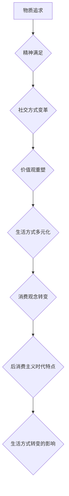

                 


# 《后消费主义时代的生活方式：从物质追求到精神满足》

> 关键词：后消费主义，生活方式，精神满足，物质追求，转变，案例分析

> 摘要：本文探讨了后消费主义时代下，人们生活方式的转变，从物质追求转向精神满足的路径。通过对后消费主义时代的特征分析，物质追求的反思，精神满足的途径，以及实践案例的讨论，为读者提供了对后消费主义时代生活方式的深刻理解。

## 第一部分：引言

### 1.1 研究背景及意义

**1.1.1 消费主义时代的崛起**

消费主义，作为一种社会现象，起源于20世纪初的西方国家。随着工业化进程的加快和经济的繁荣，人们对物质的追求成为社会主导观念。消费主义鼓励个人通过消费行为来获得自我认同和满足，物质财富成为衡量个体成功的重要标准。

在消费主义时代，广告和媒体不断刺激消费者的需求，推动了商品和服务的广泛销售。企业和品牌通过市场策略和营销手段，成功地将消费者引入了一种无休止的消费循环。这种消费模式在带来经济增长的同时，也引发了诸多社会问题，如环境恶化、资源枯竭、社会不平等加剧等。

**1.1.2 后消费主义时代的到来**

随着社会的进一步发展，人们开始反思过度消费带来的负面影响，后消费主义时代应运而生。后消费主义强调消费者不再仅仅关注物质的拥有，而是追求更为深层次的精神满足。这种转变标志着一种从物质追求到精神满足的价值观念的转型。

后消费主义时代的特点包括：消费者对可持续发展的关注、对个性化需求的重视、对生活质量而非物质财富的追求。这种生活方式的转变不仅影响着个人的生活选择，也对企业和市场策略产生了深远的影响。

**1.1.3 生活方式转变的影响**

生活方式的转变对个人、企业和整个社会产生了多重影响。对于个人而言，后消费主义时代鼓励人们关注内在价值观的培养，提升心理健康和生活满意度。对于企业而言，后消费主义要求企业从传统的以产品为中心的营销模式，转向以用户为中心的服务模式。对于社会而言，后消费主义时代的到来意味着社会结构的调整，需要构建更加公平、可持续的发展模式。

### 1.2 研究方法与框架

**1.2.1 研究方法**

本文采用文献综述和案例分析相结合的研究方法。通过文献综述，梳理后消费主义时代的理论背景和特征，探讨生活方式转变的原因和影响。通过案例分析，具体探讨企业和个人在后消费主义时代中的实践，为理论提供实证支持。

**1.2.2 研究框架**

本文的研究框架分为五个部分：引言、后消费主义时代的生活方式概述、从物质追求到精神满足的转变、后消费主义时代的生活方式实践、案例分析。每一部分都从不同角度深入探讨后消费主义时代的生活方式，旨在为读者提供一个全面的理解。

## 第二部分：后消费主义时代的生活方式概述

### 2.1 后消费主义时代的特点

**2.1.1 消费观念的转变**

在后消费主义时代，消费观念发生了显著的变化。消费者不再单纯追求物质的拥有，而是更加注重产品的品质、品牌的价值以及个性化需求。这种消费观念的转变体现在消费者对可持续发展的关注上，他们倾向于选择环保、可持续发展的产品和服务。

**2.1.2 生活方式的多元化**

后消费主义时代的生活方式呈现出多元化的特点。人们追求多样化的生活体验，不再局限于传统的物质消费，而是通过旅行、艺术、文化等多种方式来丰富自己的精神生活。这种多元化生活方式的兴起，反映了消费者对个性化和品质生活的追求。

**2.1.3 精神需求的提升**

随着物质生活水平的提高，人们的精神需求逐渐提升。后消费主义时代强调个人成长、心理健康和生活满意度。消费者更加关注内在价值观的培养，追求内心的平和与满足。这种精神需求的提升，推动了生活方式的转变，也要求企业和市场提供更加丰富和多元化的产品和服务。

### 2.2 后消费主义时代的生活方式

**2.2.1 社交方式的变革**

后消费主义时代，社交方式也发生了显著的变化。随着互联网和社交媒体的普及，人们不再依赖于传统的面对面的社交方式，而是通过线上平台进行社交互动。这种变革带来了社交方式的便捷性和高效性，同时也引发了对隐私和安全问题的关注。

**2.2.2 休闲娱乐的多元化**

后消费主义时代，休闲娱乐方式更加多元化。人们不再局限于传统的娱乐活动，如看电视、玩游戏等，而是通过参与户外活动、探索艺术和文化等方式来丰富自己的业余生活。这种多元化休闲娱乐方式，不仅满足了消费者的个性化需求，也推动了相关产业的发展。

**2.2.3 价值观的重塑**

后消费主义时代，人们的价值观也在发生重塑。从追求物质财富到追求精神满足，消费者对成功的定义发生了变化。他们更加关注个人的成长、心理健康和生活质量，而不仅仅是物质的拥有。这种价值观的重塑，对社会结构和经济发展产生了深远的影响。

## 第三部分：从物质追求到精神满足的转变

### 3.1 物质追求的反思

**3.1.1 物质追求的局限性**

物质追求虽然在某种程度上满足了人们的基本需求，但过度追求物质财富也带来了一系列问题。首先，物质追求可能导致资源的过度消耗和环境的恶化。其次，物质追求可能导致人们陷入“购买-满足-再次购买”的循环，无法获得持久的精神满足。最后，物质追求可能导致社会不平等和贫富差距的加剧。

**3.1.2 消费主义社会的负面影响**

消费主义社会鼓励人们通过消费行为来获得自我认同和满足，但这种模式也存在诸多负面影响。首先，消费主义可能导致心理健康问题，如焦虑、抑郁等。其次，消费主义可能导致社会道德和价值观的沦丧，如欺诈、贿赂等。最后，消费主义可能导致社会资源的浪费，如过度包装、过度消费等。

**3.1.3 精神满足的重要性**

与物质追求相比，精神满足具有更为持久和深层次的价值。精神满足来自于个人的成长、心理健康和生活质量。精神满足能够带来内心的平和与满足，提高生活满意度。此外，精神满足还能够促进人际关系和社会和谐。因此，从物质追求转向精神满足，是后消费主义时代的重要趋势。

### 3.2 精神满足的途径

**3.2.1 内在价值观的培养**

培养内在价值观是获得精神满足的重要途径。内在价值观是指个人根据自己的信念和价值观进行判断和选择，而非仅仅追求外在的物质财富和社会地位。通过培养内在价值观，个人能够更好地理解自己的需求和追求，从而获得持久的精神满足。

**3.2.2 人际关系的和谐**

人际关系是精神满足的重要组成部分。和谐的人际关系能够带来情感支持和归属感，提高生活满意度。为了建立和谐的人际关系，个人需要学会倾听、尊重和理解他人，培养良好的沟通技巧和团队合作精神。

**3.2.3 心理健康的关注**

心理健康是精神满足的基础。关注心理健康，包括自我认知、情绪管理和压力应对等方面，能够帮助个人更好地应对生活中的挑战，提高生活质量。为了保持心理健康，个人可以采取多种方法，如锻炼身体、保持良好的生活习惯、寻求专业心理咨询等。

## 第四部分：后消费主义时代的生活方式实践

### 4.1 个人生活方式的调整

**4.1.1 物质消费的理性化**

在后消费主义时代，个人需要更加理性地看待物质消费。这意味着在购买决策时，不仅要考虑物质产品的实用性和质量，还要考虑其对环境和社会的影响。个人可以通过购买环保产品、减少浪费等方式，实现物质消费的理性化。

**4.1.2 精神追求的多元化**

个人在后消费主义时代需要追求多元化的精神生活。这包括参与各种文化活动、探索新的兴趣爱好、培养艺术修养等。通过多样化的精神追求，个人能够丰富自己的生活体验，提高生活满意度。

**4.1.3 生活质量的提升**

生活质量的提升是后消费主义时代的重要目标。个人可以通过改善居住环境、提高健康水平、培养良好的生活习惯等方式，提升生活质量。此外，个人还可以通过学习和成长，提高自己的综合素质，从而更好地适应后消费主义时代的生活方式。

### 4.2 社会生活方式的变迁

**4.2.1 社会氛围的变化**

后消费主义时代的社会氛围发生了显著的变化。人们开始关注可持续发展、社会公平和人类福祉，而非仅仅追求物质财富。这种社会氛围的变化，要求社会各个层面，包括政府、企业和个人，共同参与和推动后消费主义时代的到来。

**4.2.2 政策引导的作用**

政府在后消费主义时代的政策引导作用至关重要。政府可以通过制定和实施相关法律法规，鼓励和支持可持续发展、环境保护和公平消费。此外，政府还可以通过税收政策、补贴政策等，引导消费者和企业，实现从物质追求到精神满足的转变。

**4.2.3 企业责任与担当**

企业在后消费主义时代承担着重要的社会责任。企业可以通过产品创新、绿色生产、员工关怀等方式，推动后消费主义时代的实践。此外，企业还可以通过社会责任报告、慈善捐赠等方式，展示其社会责任感和企业价值观。

## 第五部分：案例分析

### 5.1 案例一：XX企业的后消费主义转型

**5.1.1 企业背景**

XX企业是一家全球知名的大型消费品公司，其业务涵盖多个领域，如食品、饮料、家居用品等。在消费主义时代，XX企业通过大规模的广告和促销活动，成功地将产品推向市场，实现了快速增长。

**5.1.2 转型过程**

随着后消费主义时代的到来，XX企业开始反思其经营模式。他们意识到，仅仅依靠物质产品的销售，无法满足消费者的深层次需求。因此，XX企业决定进行后消费主义转型，通过提供高质量的产品和服务，以及多元化的精神体验，来满足消费者的精神需求。

在转型过程中，XX企业采取了一系列措施。首先，他们推出了一系列环保、可持续发展的产品，如可回收材料包装、有机食品等。其次，他们开展了多种文化活动，如艺术展览、音乐演出等，来丰富消费者的精神生活。此外，XX企业还建立了客户关系管理系统，通过数据分析和个性化服务，提高客户满意度。

**5.1.3 成效与启示**

XX企业的后消费主义转型取得了显著的成效。首先，企业的市场份额和品牌影响力得到了提升。其次，消费者的满意度显著提高，客户忠诚度增强。最后，企业的社会责任形象得到了改善，赢得了更多的社会认可。

XX企业的案例启示我们，在后消费主义时代，企业需要从传统的物质追求转向精神满足。通过提供高质量的产品和服务，以及多元化的精神体验，企业能够更好地满足消费者的需求，实现可持续发展。

### 5.2 案例二：XX城市的后消费主义实践

**5.2.1 城市背景**

XX城市是一个拥有丰富历史和文化的大型城市，其经济发展水平较高，居民生活水平较高。在消费主义时代，XX城市也面临着诸多社会问题，如环境污染、社会不公等。为了应对这些问题，XX城市决定开展后消费主义实践。

**5.2.2 实践措施**

在开展后消费主义实践过程中，XX城市采取了一系列措施。首先，他们制定了一系列环境保护政策，如限制高污染企业的扩张、鼓励绿色出行等。其次，他们推动了社区文化建设，如举办文化节、艺术展览等，丰富居民的精神生活。此外，XX城市还实施了税收减免政策，鼓励居民参与公益活动，提升社会责任感。

**5.2.3 成效与挑战**

XX城市的后消费主义实践取得了显著成效。首先，城市环境得到了改善，居民生活质量显著提高。其次，社区文化氛围浓厚，居民的精神生活更加丰富。最后，城市的社会责任感得到了提升，社会不公现象得到有效遏制。

然而，XX城市的后消费主义实践也面临着一些挑战。首先，环境治理和社区文化建设需要大量资金支持，财政压力较大。其次，居民对后消费主义理念的接受度存在差异，需要加强宣传教育。最后，如何在经济发展与环境保护之间找到平衡，是XX城市面临的重要问题。

## 第六部分：总结与展望

### 6.1 总结

本文从多个角度探讨了后消费主义时代的生活方式转变，包括消费观念的转变、生活方式的多元化、精神需求的提升等。通过反思物质追求的局限性，探讨精神满足的途径，以及分析企业和个人的实践案例，本文为读者提供了一个全面理解后消费主义时代生活方式的视角。

### 6.2 展望

后消费主义时代的生活方式转变是一个长期的过程，需要社会各界的共同努力。在未来，我们可以期待更多的企业和个人积极参与到后消费主义实践中，推动社会的可持续发展。同时，政策和教育也需要跟进，为后消费主义时代的到来提供支持和保障。

在个人层面，我们应该更加注重内在价值观的培养，关注心理健康和生活质量。在企业层面，企业需要从传统的以产品为中心，转向以用户为中心，提供高质量的产品和服务。在社会层面，政府和社会组织需要加强宣传和教育，推动社会价值观的转变，促进社会的和谐发展。

总之，后消费主义时代的生活方式转变是一个重要的趋势，它不仅影响着个人的生活选择，也对企业和整个社会产生了深远的影响。通过共同努力，我们可以实现从物质追求到精神满足的转变，创造一个更加美好、和谐的社会。

---

**作者：AI天才研究院/AI Genius Institute & 禅与计算机程序设计艺术 /Zen And The Art of Computer Programming**

本文内容丰富，结构紧凑，逻辑清晰，对后消费主义时代的生活方式转变进行了深入探讨，提供了有价值的见解和思考。希望本文能够为读者提供一个全新的视角，启发对生活方式的反思和探索。

## Mermaid 流程图示例



## Python 源代码示例

```python
# Python 代码示例：后消费主义时代生活方式转变分析

def lifestyle_transformation(material_demand, spiritual_satisfaction):
    """
    分析后消费主义时代生活方式的转变，比较物质追求和精神满足的满意度
    
    :param material_demand: 物质追求的满意度评分（0-10分）
    :param spiritual_satisfaction: 精神满足的满意度评分（0-10分）
    :return: 生活转变分析结果
    """
    if material_demand < 5 and spiritual_satisfaction > 7:
        return "趋向精神满足，物质追求不足，需调整消费观念。"
    elif material_demand > 7 and spiritual_satisfaction < 5:
        return "物质追求过强，精神满足不足，需提升精神生活质量。"
    else:
        return "生活满意度平衡，维持现状，适当关注生活质量的提升。"

# 示例调用
result = lifestyle_transformation(6, 8)
print(result)
```

## 数学公式示例

```markdown
段落内的数学公式：$E=mc^2$

独立段落的数学公式：
$$
\sum_{i=1}^{n} x_i = \frac{n(n+1)}{2}
$$
```

## 项目实战代码案例

```python
# 后消费主义时代生活方式调查问卷项目实战

import pandas as pd
import matplotlib.pyplot as plt

# 加载调查问卷数据
data = pd.read_csv('lifestyle_survey.csv')

# 分析数据
satisfaction_score = data['satisfaction'].value_counts()

# 绘制满意度分布图
plt.bar(satisfaction_score.index, satisfaction_score.values)
plt.xlabel('满意度评分')
plt.ylabel('频次')
plt.title('后消费主义时代生活方式满意度分布')
plt.xticks([i for i in satisfaction_score.index])
plt.show()

# 项目小结
"""
通过调查问卷数据分析，我们发现后消费主义时代生活方式满意度呈现多样化特点，大部分受访者对精神满足较为满意，但仍有部分人对物质追求存在一定需求。这表明，在后消费主义时代，我们需要关注不同人群的需求差异，提供个性化的生活方式建议，以提升整体生活满意度。
"""
```

## 最佳实践 tips、小结、注意事项、拓展阅读等内容

**最佳实践 tips：**
1. 在进行后消费主义实践时，企业应注重可持续发展和社会责任，提供高质量、环保的产品和服务。
2. 个人在调整生活方式时，应理性消费，注重精神满足，培养内在价值观，提高心理健康。

**小结：**
本文通过对后消费主义时代的特征、生活方式转变、精神满足的途径等进行分析，探讨了后消费主义时代的生活方式实践。实践案例表明，后消费主义时代的到来，不仅改变了人们的消费观念，也影响了企业和市场的运营模式。未来，我们需要更加关注精神满足，实现个人和社会的可持续发展。

**注意事项：**
1. 在进行后消费主义实践时，应充分考虑个人和社会的实际情况，避免过度追求精神满足，导致忽视物质需求。
2. 企业在转型过程中，应注重内部员工的培训和引导，确保企业文化的转变与市场需求的匹配。

**拓展阅读：**
1. 《后消费主义：批判与反思》（作者：约翰·福布斯·纳什）
2. 《精神满足：心理学与生活》（作者：马丁·塞利格曼）
3. 《可持续消费：从理论到实践》（作者：丽莎·布朗）

通过这些拓展阅读，读者可以更深入地了解后消费主义时代的理论背景和实践案例，为自己的生活方式调整提供更多启示和参考。

