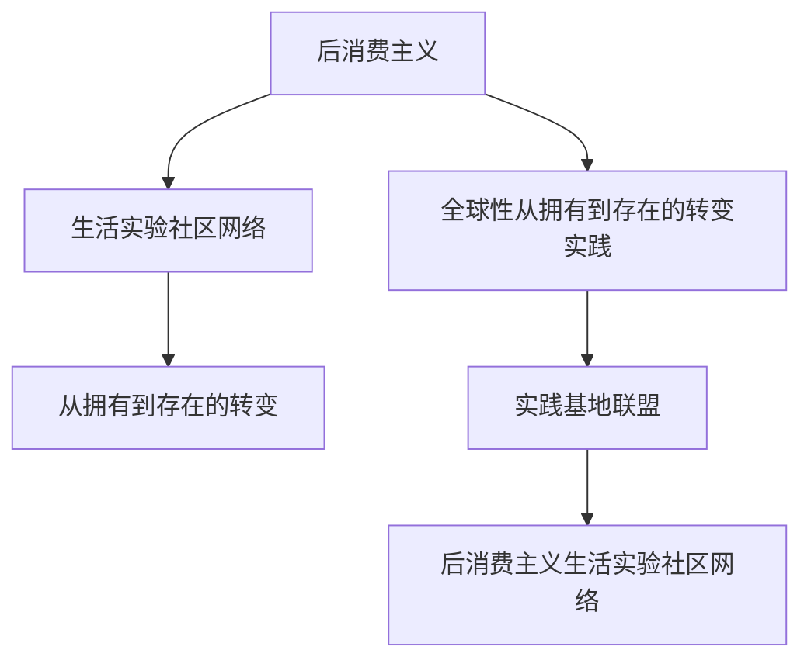

                 


## 后消费主义生活实验社区网络：全球性从拥有到存在的转变实践基地联盟

### 关键词

- 后消费主义
- 生活实验社区网络
- 从拥有到存在的转变
- 实践基地联盟
- 全球性视角
- 社会创新

### 摘要

本文探讨了后消费主义时代下，全球范围内生活实验社区网络的兴起及其在全球性从拥有到存在的转变实践中的关键作用。通过对后消费主义的起源、生活实验社区网络的定义与作用、全球性视角分析、实践基地联盟的运作模式等内容的深入探讨，本文旨在揭示这一新兴社会现象对传统消费模式和社会结构的深远影响，并为未来后消费主义生活实验社区网络的持续发展提供理论支持和实践指导。

---

# 目录大纲

## 第一部分：后消费主义与生活实验社区网络

### 第1章：导论

#### 1.1 后消费主义的起源与发展

- 后消费主义的概念与特征
- 后消费主义对社会的影响

#### 1.2 生活实验社区网络的定义与作用

- 生活实验社区网络的概念
- 生活实验社区网络在促进后消费主义中的应用

### 第2章：后消费主义生活实验社区网络的全球性视角

#### 2.1 全球后消费主义趋势分析

- 全球后消费主义的现状
- 全球后消费主义的影响因素

#### 2.2 全球性从拥有到存在的转变实践

- 全球性实践案例
- 全球性实践对后消费主义的影响

### 第3章：生活实验社区网络的结构与功能

#### 3.1 社区网络的基本结构

- 社区网络的组织形式
- 社区网络的交互模式

#### 3.2 社区网络的激励机制

- 社区网络的激励机制设计
- 激励机制对社区网络的影响

### 第4章：从拥有到存在的转变实践基地联盟

#### 4.1 实践基地联盟的概念与作用

- 实践基地联盟的定义
- 实践基地联盟在推动后消费主义中的作用

#### 4.2 联盟的运作模式与管理机制

- 联盟的运作流程
- 联盟的管理机制

### 第5章：后消费主义生活实验社区网络的挑战与机遇

#### 5.1 挑战分析

- 社会抵制与反动
- 文化传统与价值观冲突

#### 5.2 机遇展望

- 新兴技术的推动
- 社区网络的创新实践

### 第6章：成功案例研究

#### 6.1 案例一：荷兰的“无购物月”活动

- 活动背景与目标
- 活动效果与影响

#### 6.2 案例二：日本的“二手市场”文化

- 二手市场的发展历程
- 二手市场对后消费主义的贡献

### 第7章：结论与未来展望

#### 7.1 结论总结

- 后消费主义生活实验社区网络的发展现状
- 后消费主义生活实验社区网络的未来趋势

#### 7.2 未来展望

- 后消费主义生活实验社区网络的发展方向
- 可能面临的挑战与应对策略

## 附录：后消费主义生活实验社区网络参考资料

- 后消费主义相关理论书籍推荐
- 生活实验社区网络研究论文推荐
- 后消费主义生活实践基地联盟名录

## 核心概念与联系流程图



## 核心算法原理讲解

### 深度学习基础

深度学习是一种模仿人脑分析数据的机器学习方法。它主要基于多层神经网络，通过反向传播算法优化模型参数。

```python
# 示例：一个简单的神经网络模型
import tensorflow as tf

model = tf.keras.Sequential([
    tf.keras.layers.Dense(128, activation='relu', input_shape=(784,)),
    tf.keras.layers.Dense(10, activation='softmax')
])

model.compile(optimizer='adam',
              loss='categorical_crossentropy',
              metrics=['accuracy'])

model.fit(x_train, y_train, epochs=5)
```

### 神经网络反向传播算法

反向传播算法是深度学习训练过程的核心。它通过计算损失函数对网络参数的梯度，来更新网络参数，使损失函数逐渐减小。

```python
# 示例：反向传播算法示例
with tf.GradientTape() as tape:
    predictions = model(x)
    loss = loss_function(y, predictions)

grads = tape.gradient(loss, model.trainable_variables)
model.optimizer.apply_gradients(zip(grads, model.trainable_variables))
```

## 数学模型与公式

### 损失函数

损失函数是深度学习中的一个重要概念，用于衡量模型预测值与真实值之间的差距。常用的损失函数有均方误差（MSE）和交叉熵损失（Cross-Entropy Loss）。

$$
MSE = \frac{1}{n}\sum_{i=1}^{n}(y_i - \hat{y}_i)^2
$$

$$
Cross-Entropy Loss = -\sum_{i=1}^{n}y_i\log(\hat{y}_i)
$$

---

以上是文章的标题、关键词、摘要以及目录大纲的结构。接下来，我们将逐一展开每个章节的内容，进行深入的讨论和分析。希望这篇文章能够为读者提供有价值的见解和思考。```markdown


