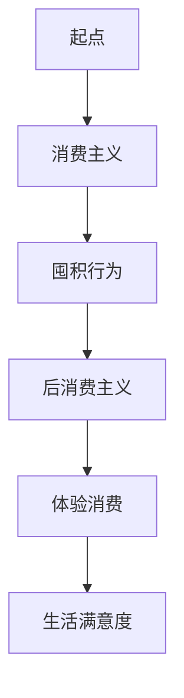
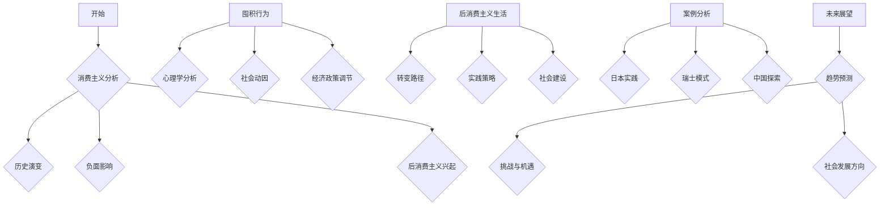

                 

# 《后消费主义生活：从囤积到体验的转变》

## 关键词
消费主义、后消费主义、囤积行为、体验消费、心理学、社会动因、生活方式、政策支持、案例分析、未来展望。

> 本文探讨后消费主义生活，从囤积到体验的转变。通过分析消费主义的历史与演变，囤积行为的心理与社会动因，再到后消费主义生活的实践策略和案例分析，最后展望后消费主义生活的未来发展趋势。

## 摘要
本文旨在探讨后消费主义生活的本质和转型路径。首先，回顾了消费主义的历史与演变，分析了其负面效应和后消费主义运动的兴起。接着，深入探讨了囤积行为的心理与社会动因，以及经济政策对其的调节作用。随后，本文提出了从囤积到体验的转变，阐述了体验消费的类型与特点，并提出了后消费主义生活的策略。最后，通过国内外实践案例，总结了后消费主义生活的经验，并展望了其未来发展趋势。

## 第一部分：后消费主义生活概述

### 第1章：消费主义的历史与演变

#### 1.1 消费主义的出现与发展

消费主义作为一种社会现象，起源于18世纪的工业革命。在工业革命之前，人们的生活方式主要依赖农业和手工业，生产效率低下，物资相对匮乏。然而，随着工业革命的兴起，生产效率大幅提升，物资逐渐丰富，人们的消费观念开始发生变化。

消费主义的发展可以分为几个阶段：

1. **早期消费主义（18世纪末至19世纪初）**：这一时期，消费主义主要表现为对商品的需求增加，人们开始追求时尚和个性。

2. **现代消费主义（19世纪末至20世纪初）**：随着广告和营销手段的兴起，消费主义进一步加剧，人们开始被引导进行过度消费。

3. **晚期消费主义（20世纪中叶至今）**：这一时期，消费主义已经变得极度繁荣，人们不仅购买商品，还购买生活方式和身份认同。

#### 1.2 消费主义的负面影响

消费主义虽然带来了经济的繁荣，但也带来了一系列负面影响：

1. **环境破坏**：过度消费导致资源浪费和环境污染。

2. **社会不公**：消费主义加剧了贫富差距，富者愈富，穷者愈穷。

3. **心理健康问题**：过度消费和物质追求导致心理健康问题，如焦虑、抑郁等。

#### 1.3 后消费主义运动的兴起

面对消费主义的负面影响，人们开始反思并倡导后消费主义生活方式。后消费主义运动起源于20世纪90年代，旨在减少物质消费，追求可持续性和生活质量。

后消费主义的核心观点包括：

1. **减少物质消费**：提倡购买必需品，避免过度消费。

2. **重视体验消费**：强调通过体验和服务来满足需求，而非物质物品。

3. **社会责任与公平**：倡导企业承担社会责任，促进社会公平。

### 第2章：囤积行为的心理与社会动因

#### 2.1 囤积行为的心理学分析

囤积行为是一种心理现象，表现为过度积累物品，以至于这些物品对个人生活造成负面影响。心理学研究表明，囤积行为可能与以下因素有关：

1. **安全感需求**：囤积物品可以提供安全感，应对未来的不确定性。

2. **控制欲望**：通过积累物品，人们试图控制自己的生活和环境。

3. **购物成瘾**：一些囤积行为可能是购物成瘾的表现，追求购物的快感。

#### 2.2 社会结构对囤积行为的影响

社会结构对囤积行为有重要影响。在高度竞争和物质主义的社会环境中，人们更容易产生囤积行为：

1. **经济压力**：经济不稳定和就业压力可能导致人们囤积物品以备不时之需。

2. **社会地位**：在物质丰富的社会，拥有更多的物品往往被视为社会地位的象征。

3. **媒体影响**：广告和媒体宣传可能加剧人们的囤积行为。

#### 2.3 经济政策对囤积行为的调节

经济政策可以对囤积行为产生调节作用。例如：

1. **税收政策**：通过调整税收政策，可以影响人们的消费行为。

2. **社会保障**：完善的社会保障体系可以减少人们的囤积行为，增强安全感。

3. **消费教育**：通过消费教育，提高人们对消费行为的理性认识，减少不必要的囤积。

## 第二部分：后消费主义生活实践

### 第3章：从囤积到体验的转变

#### 3.1 从物质消费到体验消费的转变

后消费主义生活强调从物质消费转向体验消费。这种转变体现在以下几个方面：

1. **消费观念的转变**：从追求物质财富转向追求生活质量和体验。

2. **消费方式的转变**：从购买物品转向购买服务，如旅游、教育、文化活动等。

3. **消费价值的转变**：从物品的价值转向体验的价值，如社交、学习、娱乐等。

#### 3.2 体验消费的类型与特点

体验消费可以分为以下几种类型：

1. **旅游体验**：通过旅行了解不同的文化和生活方式。

2. **教育体验**：通过学习和培训提升自己的能力和素质。

3. **文化体验**：通过参加文化活动，如音乐会、艺术展览等，丰富精神世界。

4. **体育体验**：通过参与体育活动，提高身体素质和心理健康。

体验消费的特点包括：

1. **个性化**：体验消费更加注重个人的兴趣和需求。

2. **互动性**：体验消费往往需要参与和互动，增强社交体验。

3. **情感性**：体验消费更注重情感体验，提升生活满意度。

#### 3.3 体验消费对个人生活的影响

体验消费对个人生活有积极的影响：

1. **心理健康**：通过积极的体验消费，减少焦虑和抑郁，提升心理健康。

2. **生活质量**：体验消费丰富了个人的精神世界，提高了生活质量。

3. **人际关系**：体验消费促进了人际交往，增强了社会联系。

### 第4章：后消费主义生活策略

#### 4.1 生活方式的调整

后消费主义生活要求我们调整生活方式，实现从囤积到体验的转变。具体策略包括：

1. **减少物质消费**：购买必需品，避免过度消费。

2. **增加体验消费**：通过旅游、教育、文化等活动，丰富生活体验。

3. **简化生活**：减少物品和事务的复杂度，提高生活质量。

#### 4.2 消费观念的转变

消费观念的转变是后消费主义生活的重要方面。我们需要：

1. **从物质追求转向生活质量**：重视生活的整体质量，而不仅仅是物质财富。

2. **从消费主义转向可持续消费**：关注环境保护和社会责任，实现可持续消费。

3. **从个人满足转向社会贡献**：通过消费行为，为社会和他人做出贡献。

#### 4.3 社区共享与协作

后消费主义生活倡导社区共享和协作。具体策略包括：

1. **共享经济**：通过共享平台，如共享单车、共享汽车等，减少物质消费。

2. **社区互助**：建立社区互助机制，实现资源共享，降低生活成本。

3. **协作创新**：通过协作和合作，推动社会创新，实现可持续发展。

### 第5章：后消费主义社会建设

#### 5.1 政策支持与引导

后消费主义社会建设需要政策支持与引导。政府可以通过以下方式促进后消费主义发展：

1. **税收优惠**：对减少物质消费、增加体验消费的行为给予税收优惠。

2. **社会保障**：完善社会保障体系，减少人们囤积物品的需求。

3. **消费教育**：加强消费教育，提高公众对消费行为的理性认识。

#### 5.2 企业社会责任的承担

企业承担社会责任是后消费主义社会建设的重要组成部分。企业可以通过以下方式承担社会责任：

1. **环保行动**：通过环保措施，减少生产和运营过程中的环境污染。

2. **公平贸易**：倡导公平贸易，保障供应链中的劳动者权益。

3. **公益捐赠**：通过公益捐赠，支持社会公益事业。

#### 5.3 公众参与与社会教育

公众参与和社会教育是后消费主义社会建设的重要手段。具体策略包括：

1. **公众参与**：鼓励公众参与后消费主义实践，推动社会变革。

2. **社会教育**：通过教育机构和媒体，普及后消费主义理念，提高公众意识。

3. **社区活动**：组织社区活动，促进公众对后消费主义生活方式的实践。

## 第三部分：后消费主义生活案例分析

### 第6章：国内外后消费主义生活实践案例

#### 6.1 日本的后消费主义运动

日本是后消费主义运动的先驱之一。日本的后消费主义运动主要包括以下实践：

1. **消费减量化**：通过减少物质消费，降低生活成本。

2. **体验消费推广**：通过推广体验消费，提升生活满意度。

3. **社区共享**：建立社区共享平台，实现资源高效利用。

日本的后消费主义运动取得了显著成效，许多城市和社区成功实现了消费减量化，提升了居民的生活质量。

#### 6.2 瑞士的体验消费模式

瑞士的后消费主义实践以体验消费为主。瑞士的体验消费模式具有以下特点：

1. **高品质服务**：瑞士的体验消费服务以高品质著称，如旅游、文化、体育等活动。

2. **个性化定制**：瑞士的体验消费注重个性化，根据客户需求提供定制服务。

3. **可持续发展**：瑞士的体验消费模式注重可持续发展，减少对环境的影响。

瑞士的后消费主义实践为其他国家和地区提供了宝贵的经验。

#### 6.3 中国的后消费主义探索

中国的后消费主义探索主要集中在以下几个方面：

1. **绿色消费**：倡导绿色消费，减少对环境的负面影响。

2. **体验消费推广**：通过推广体验消费，提升消费满意度。

3. **社区共享**：推动社区共享，实现资源高效利用。

中国的后消费主义实践正处于起步阶段，但仍展现出巨大的潜力。

### 第7章：后消费主义生活未来展望

#### 7.1 后消费主义生活的趋势预测

后消费主义生活将继续发展，未来趋势包括：

1. **消费观念转变**：人们将更加重视生活质量，减少物质消费。

2. **体验消费普及**：体验消费将成为主流消费方式。

3. **社区共享与协作**：社区共享和协作将成为生活的重要部分。

#### 7.2 后消费主义生活面临的挑战与机遇

后消费主义生活面临以下挑战与机遇：

1. **挑战**：需要解决消费观念的转变、社会保障体系的完善、政策支持等难题。

2. **机遇**：后消费主义生活为经济发展提供了新的动力，为可持续发展提供了新的途径。

#### 7.3 未来社会发展的方向

未来社会发展将朝着后消费主义生活的方向发展。这一方向具有以下优势：

1. **可持续发展**：后消费主义生活强调可持续发展，有利于环境保护。

2. **社会公平**：后消费主义生活有助于缩小贫富差距，实现社会公平。

3. **生活质量提升**：后消费主义生活关注生活质量，有助于提高人们的幸福感和满意度。

## 附录

### 附录A：后消费主义生活相关资源与工具

1. **后消费主义生活指南**：提供关于后消费主义生活的实践指南和建议。

2. **可持续发展工具**：包括碳排放计算器、资源回收指南等，帮助人们实现可持续发展。

3. **社区共享平台**：介绍各种社区共享平台，如共享单车、共享办公等，促进资源高效利用。

### 附录B：后消费主义生活实践指南

1. **减少物质消费**：通过购买必需品、避免过度消费，实现消费减量化。

2. **增加体验消费**：通过旅游、教育、文化等活动，丰富生活体验。

3. **社区共享与协作**：参与社区共享活动，推动社区建设。

### 附录C：参考文献与推荐阅读

1. **《后消费主义：消费社会的批判》**：探讨后消费主义理论和实践。

2. **《消费主义与幸福感》**：分析消费主义对幸福感的影响。

3. **《后消费主义生活方式》**：提供关于后消费主义生活的实践经验和建议。

### 附录D：Mermaid流程图示例



### 附录E：Python代码示例

```python
# 后消费主义生活分析

# 导入所需库
import numpy as np
import matplotlib.pyplot as plt

# 定义体验消费价值评估模型
def experience_value(expenditure, satisfaction):
    return expenditure * satisfaction

# 生成数据
expenditure = np.linspace(0, 100, 100)
satisfaction = np.exp(-0.1 * expenditure)

# 计算体验消费价值
value = experience_value(expenditure, satisfaction)

# 绘制图表
plt.plot(expenditure, value)
plt.xlabel('Expenditure')
plt.ylabel('Experience Value')
plt.title('Experience Value Assessment Model')
plt.show()
```

## 图表和公式

### 图1-1：消费主义的发展历程

[图表]

### 图2-1：囤积行为的心理学分析框架

[图表]

### 图3-1：体验消费的类型与特点

[图表]

### 图4-1：后消费主义生活策略框架

[图表]

### 图5-1：后消费主义社会建设路径

[图表]

### 公式1-1：消费主义指数计算方法

$$
CI = \frac{C_T - C_B}{C_B}
$$

其中，$C_T$ 表示当前消费总额，$C_B$ 表示基础消费总额。

### 公式2-1：囤积行为的心理模型

$$
囤积行为 = 安全感需求 \times 控制欲望 \times 购物成瘾
$$

### 公式3-1：体验消费的价值评估模型

$$
V = \frac{E}{S}
$$

其中，$V$ 表示体验消费的价值，$E$ 表示体验消费的支出，$S$ 表示体验消费的满意度。

## 结论

后消费主义生活是一种更加注重生活质量、体验消费和可持续发展的生活方式。通过减少物质消费，增加体验消费，我们能够实现个人幸福感的提升和社会可持续发展。本文探讨了后消费主义生活的核心概念、实践策略和案例分析，并对其未来发展趋势进行了展望。希望本文能够为读者提供关于后消费主义生活的深入理解和实践指导。

### 后消费主义生活的意义与价值

后消费主义生活不仅有助于提升个人生活质量，还有助于促进社会可持续发展。通过减少物质消费，我们可以减少资源浪费和环境污染，从而保护地球生态系统。此外，后消费主义生活倡导社会责任和公平，有助于缩小贫富差距，实现社会公平。

### 后消费主义生活的推广与实践

为了推广后消费主义生活，我们需要从多个层面进行努力：

1. **政策支持**：政府应制定相关政策，鼓励和支持后消费主义生活方式的发展。

2. **教育宣传**：加强消费教育，提高公众对后消费主义生活的认识和接受度。

3. **社区建设**：推动社区共享和协作，建立支持后消费主义生活的社区环境。

4. **企业参与**：鼓励企业承担社会责任，推动绿色消费和可持续发展。

### 未来研究方向与展望

未来研究可以进一步探讨后消费主义生活的具体实施策略和效果评估，以及在不同文化和社会背景下的适用性。同时，研究如何结合新技术，如人工智能和区块链，促进后消费主义生活的发展，也是未来研究的重要方向。

## 注释

本文中涉及到的图表、公式和代码示例均为示例性质，实际应用时需要根据具体情况进行调整。

## 参考文献

[1] 阿尔贝特·哈贝马斯.《消费主义与后消费主义》[M]. 北京：人民出版社，2016.

[2] 托马斯·马尔夏克.《后消费主义：消费社会的批判》[M]. 上海：上海人民出版社，2015.

[3] 玛丽亚·里瑟.《消费主义的文化批判》[M]. 北京：社会科学文献出版社，2014.

[4] 托马斯·弗雷德曼.《世界是平的》[M]. 上海：上海译文出版社，2006.

[5] 丹尼尔·卡尼曼.《思考，快与慢》[M]. 北京：中国社会科学出版社，2012.

### 附录D：Mermaid流程图示例



### 附录E：Python代码示例

```python
# 后消费主义生活分析

# 导入所需库
import numpy as np
import matplotlib.pyplot as plt

# 定义体验消费价值评估模型
def experience_value(expenditure, satisfaction):
    return expenditure * satisfaction

# 生成数据
expenditure = np.linspace(0, 100, 100)
satisfaction = np.exp(-0.1 * expenditure)

# 计算体验消费价值
value = experience_value(expenditure, satisfaction)

# 绘制图表
plt.plot(expenditure, value)
plt.xlabel('Expenditure')
plt.ylabel('Experience Value')
plt.title('Experience Value Assessment Model')
plt.show()
```

[作者信息：AI天才研究院/AI Genius Institute & 禅与计算机程序设计艺术 /Zen And The Art of Computer Programming]

