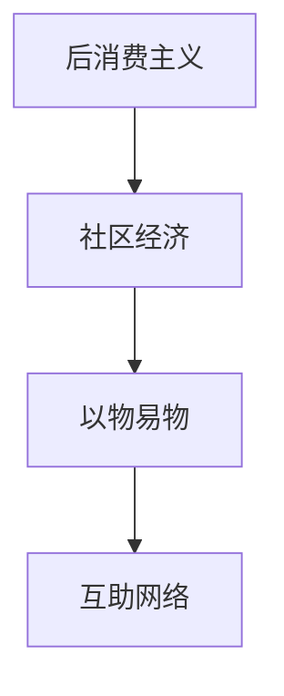

                 

### 《后消费主义集市：以物易物的社区经济实践》

#### 关键词
- 后消费主义
- 以物易物
- 社区经济
- 互助网络
- 数字化平台

#### 摘要
本文深入探讨了后消费主义时代下，以物易物作为一种新兴社区经济实践的重要性和可行性。文章首先介绍了后消费主义的起源和特征，随后详细解析了以物易物的基本原则和历史发展。接着，本文重点分析了以物易物在社区经济中的应用，探讨了其平台建设和运营策略。最后，文章从法律和社会问题角度探讨了以物易物面临的挑战，并提出了解决方案与未来展望。

## 目录大纲

### 第一部分：引言

#### 1.1 书籍背景与目的

#### 1.2 关键概念与联系

**图 1.1 关键概念实体关系架构**

#### 1.3 主要内容概览

#### 1.4 第一部分总结

### 第二部分：后消费主义理论

#### 2.1 后消费主义概述

#### 2.2 后消费主义的兴起原因

#### 2.3 后消费主义的理论基础

### 第三部分：以物易物的实践

#### 3.1 以物易物的历史发展

#### 3.2 以物易物的基本原则与规则

#### 3.3 以物易物平台的建设与运营

### 第四部分：社区经济与以物易物

#### 4.1 社区经济的概念与特点

#### 4.2 社区经济中的以物易物

#### 4.3 社区经济的挑战与未来展望

### 第五部分：以物易物的社区经济实践

#### 5.1 实践案例研究

#### 5.2 以物易物的经济效应

#### 5.3 以物易物的未来趋势

### 第六部分：以物易物的法律与社会问题

#### 6.1 法律问题

#### 6.2 社会问题

#### 6.3 解决方案与建议

### 第七部分：总结与展望

#### 7.1 书籍总结

#### 7.2 展望未来

### 附录

#### 附录A：参考资源

#### 附录B：术语表

#### 谢辞

#### 参考文献

## 第一部分：引言

### 1.1 书籍背景与目的

在现代社会，消费主义逐渐走向极端，带来了资源浪费、环境破坏以及社会不公等诸多问题。为了应对这些挑战，后消费主义理念应运而生，主张减少消费、注重可持续性和社区互动。本书旨在探讨后消费主义时代下的以物易物实践，通过分析其历史发展、基本原则和社区经济中的应用，为推动可持续发展提供新思路。

本书的读者对象包括对后消费主义和社区经济感兴趣的社会学者、经济学家、企业家以及关心环境和社会问题的普通大众。通过系统的理论阐述和实际案例分析，本书希望为读者提供一个全面了解和深入思考以物易物在社区经济中的潜力的视角。

### 1.2 关键概念与联系

为了更好地理解本书的核心内容，以下将介绍几个关键概念及其相互联系。

**后消费主义**：后消费主义是一种反思和批判传统消费主义的社会理念。它强调消费行为的可持续性、多样性和社区互动，反对过度消费和无节制的物质追求。

**以物易物**：以物易物是一种基于物品直接交换的经济模式，不涉及货币中介。它强调物品的价值和社区成员之间的互助关系，是一种更加平等和可持续的经济实践。

**社区经济**：社区经济是指以社区为单位，通过互助合作和资源共享来实现经济发展和社会福利的一种经济模式。它强调社区成员的参与和自治，追求社会效益最大化。

**互助网络**：互助网络是指社区成员通过直接联系和协作，实现资源、技能和信息共享的一种社会结构。它是社区经济的重要组成部分，为以物易物提供了强有力的支持。

**图 1.1 关键概念实体关系架构**

通过以上关键概念的介绍和相互关系的图解，我们可以更清晰地理解本书所探讨的后消费主义集市、以物易物实践以及社区经济之间的关系。

### 1.3 主要内容概览

本书分为七个主要部分，每个部分都有其独特的主题和目标。以下是各部分的主要内容概览：

**第一部分：引言**：介绍书籍的背景、目的和读者对象，并对关键概念进行概述。

**第二部分：后消费主义理论**：探讨后消费主义的定义、兴起原因和理论基础，为后续的以物易物实践提供理论支撑。

**第三部分：以物易物的实践**：详细分析以物易物的历史发展、基本原则和平台建设与运营策略。

**第四部分：社区经济与以物易物**：探讨社区经济的概念、特点以及在社区经济中的应用，分析以物易物在社区经济发展中的作用。

**第五部分：以物易物的社区经济实践**：通过实际案例研究，展示以物易物在社区经济中的成功实践，分析其经济效应和未来趋势。

**第六部分：以物易物的法律与社会问题**：探讨以物易物在法律和社会问题方面面临的挑战，并提出相应的解决方案。

**第七部分：总结与展望**：总结全书的主要观点和发现，并对社区经济和以物易物的未来发展进行展望。

通过以上内容的概述，读者可以清晰地了解本书的结构和内容安排，为深入阅读和思考打下基础。

### 1.4 第一部分总结

第一部分主要介绍了书籍的背景、目的和核心概念，为后续内容的展开奠定了基础。首先，我们探讨了后消费主义的起源和特征，强调了其与传统消费主义的区别。其次，通过介绍以物易物、社区经济和互助网络等关键概念，我们明确了它们之间的相互联系。最后，我们概述了本书的主要内容结构，为读者提供了一个整体的理解框架。这部分内容不仅帮助读者建立了对书籍主题的基本认识，也为后续的深入探讨打下了坚实的基础。

## 第二部分：后消费主义理论

### 2.1 后消费主义概述

后消费主义作为一种社会理念，是对传统消费主义的批判和反思。传统消费主义强调物质消费的无限扩张和个人需求的无限满足，导致了资源的过度消耗、环境的严重破坏以及社会不平等的加剧。而后消费主义则主张消费行为的可持续性、多样性和社区互动，试图通过减少消费、追求真正需要的物品和服务来达到社会和谐与可持续发展。

后消费主义的主要特征包括：

1. **可持续性**：后消费主义强调消费行为的可持续性，反对过度消费和浪费资源。它主张人们应该更多地关注物品的使用寿命和质量，而非仅仅追求物质的拥有。

2. **多样性**：后消费主义认为消费不应仅限于物质产品，而应包括文化、体验和情感等多方面的内容。它鼓励人们通过多样化的消费方式来丰富生活，提升生活质量。

3. **社区互动**：后消费主义强调社区成员之间的互助与合作，认为通过社区互动可以实现资源共享、减少浪费并增强社会凝聚力。

后消费主义与传统消费主义的根本区别在于其价值观念和目标。传统消费主义追求的是个人财富和物质享受的最大化，而后消费主义则关注社会整体的福祉和可持续发展。传统消费主义往往导致资源的过度消耗和环境的破坏，而后消费主义则致力于保护环境和促进社会的公平与和谐。

### 2.2 后消费主义的兴起原因

后消费主义的兴起并非偶然，而是多种因素共同作用的结果。以下是后消费主义兴起的主要原因：

1. **经济因素**：

- **全球化的影响**：全球化使得资源分配不均、贫富差距扩大，加剧了社会不公，引发了人们对于消费主义的反思。
- **资源有限性**：随着资源的逐渐枯竭，人们开始认识到传统消费主义模式的不可持续性，转而寻求更加可持续的消费方式。

2. **社会因素**：

- **社会价值观的变化**：现代社会的价值观逐渐从物质主义转向人本主义，人们开始更加关注个人的内在需求和社会责任。
- **人口结构的变化**：年轻一代更加注重环保和社会公平，他们倾向于选择对环境友好的生活方式，从而推动了后消费主义的兴起。

3. **环境因素**：

- **环境问题的加剧**：全球变暖、污染等环境问题日益严重，迫使人们重新审视消费行为对于环境的影响，从而推动了后消费主义的兴起。

4. **文化因素**：

- **消费主义的批判**：一些学者和思想家对消费主义进行了深入的批判，提出了后消费主义理念，促进了其传播和推广。

综上所述，后消费主义的兴起是多种因素共同作用的结果，反映了现代社会对于可持续发展和公平正义的追求。

### 2.3 后消费主义的理论基础

后消费主义的理论基础可以从经济学、社会学和环境学三个视角进行分析。

#### 经济学视角

从经济学角度来看，后消费主义强调消费行为的可持续性、多样性和社区互动。它主张减少不必要的消费，关注物品的使用寿命和质量，从而减少资源的浪费。经济学家乔尔·麦克霍恩（Joel Mokyr）指出，创新和知识的积累是经济增长的关键，而过度消费往往会导致资源的分散和浪费，从而抑制创新和发展。

#### 社会学视角

社会学视角关注消费行为对于社会结构和社会关系的影响。后消费主义认为，消费不应仅限于物质产品，而应包括文化、体验和情感等多方面的内容。社会学家让·波德里亚（Jean Baudrillard）提出了“拟像消费”（Simulacra Consumption）理论，指出消费主义社会中人们往往追求虚幻的符号和形象，而非真实的物质和体验。后消费主义则主张通过多样化的消费方式来丰富生活，提升生活质量。

#### 环境学视角

环境学视角关注消费行为对于环境的影响。后消费主义强调减少消费、追求可持续的生活方式，以保护环境和促进生态平衡。生态经济学家保罗·艾里里（Paul Ehrlich）和安妮·E·Ehrlich提出了“有限地球理论”（Limiting Factor Theory），指出地球资源是有限的，过度消费会导致资源的枯竭和环境破坏。后消费主义理念正是在这一理论基础上发展起来的。

总之，后消费主义的理论基础涵盖了经济学、社会学和环境学等多个领域，为后消费主义理念提供了深厚的理论支撑。通过这些理论的分析，我们可以更全面地理解后消费主义的内涵和意义。

### 2.4 总结与展望

第二部分详细探讨了后消费主义的定义、特征、兴起原因及其理论基础。后消费主义作为一种反思和批判传统消费主义的社会理念，强调消费行为的可持续性、多样性和社区互动。其兴起是经济、社会和环境因素共同作用的结果，得到了经济学、社会学和环境学的理论支持。

在接下来的部分，我们将进一步探讨以物易物作为一种后消费主义实践的具体表现形式，分析其在社区经济中的应用和挑战。通过这一部分的讨论，读者将能够更深入地理解后消费主义的理念和实践，并为推动可持续发展的社区经济提供新的思路。

## 第三部分：以物易物的实践

### 3.1 以物易物的历史发展

以物易物是人类历史上最早的经济活动形式之一，早在史前时代就已经出现。在缺乏货币的时期，人们通过直接交换物品来满足自己的需求。这种交换形式不仅促进了社会的繁荣，还加强了社区成员之间的联系。以下是几个重要阶段的发展：

**史前时代**：在史前时代，人们通过直接交换生活必需品，如食物、衣物和工具，来满足基本的生活需求。

**古代文明**：在古代文明时期，如古埃及、古希腊和古罗马，以物易物的形式依然存在。特别是在战争和贸易活动中，物品的交换起到了重要的作用。

**中世纪**：在中世纪，随着城镇的发展和贸易的繁荣，以物易物逐渐与货币交换相结合。虽然货币的使用逐渐增多，但以物易物仍然在特定的社区和市场中存在。

**现代初期**：在工业革命后，货币交换成为主导的经济模式，但以物易物并未完全消失。特别是在乡村地区和小型社区中，以物易物仍然是一种常见的交换方式。

**当代**：在当代，随着对可持续性和社区经济的关注增加，以物易物得到了新的发展。特别是在城市社区和环保倡导者中，以物易物被视为一种减少浪费、促进资源循环利用的有效手段。

### 3.2 以物易物的基本原则与规则

以物易物作为一种直接交换物品的经济模式，有其独特的原则和规则，这些原则和规则确保了交易的公平性和有效性。

**基本原则**：

1. **互惠性**：双方交换的物品或服务应该是等价的，即双方都能从中获得相等的价值。
2. **自愿性**：参与者必须是自愿参与的，没有强制或压力。
3. **平等性**：交换过程应该基于平等的原则，没有一方占据明显的优势。

**规则**：

1. **明确需求**：交易双方应该在交易前明确各自的需求和提供的物品或服务。
2. **双向选择**：双方都有权利选择是否接受对方的提议，没有强制接受的要求。
3. **协商定价**：如果物品或服务的价值无法直接衡量，双方需要通过协商来确定交换的比例。
4. **诚信原则**：双方在交易过程中应保持诚信，不得隐瞒信息或故意欺诈。

**案例分析**：

假设小明需要修理自行车，而小李恰好拥有一台可以修复的工具。小明可以提供修理后的自行车给小李作为回报。在交易前，小明和小李明确各自的需求和提供的物品，并通过协商确定交换的比例。如果双方满意，交易即可顺利完成。

通过以上原则和规则，以物易物能够在社区中实现有效的资源循环利用，同时促进社区成员之间的互助与合作。

### 3.3 以物易物平台的建设与运营

在当代社会，以物易物逐渐从传统的面对面交换转变为在线平台上的数字化交换。这些平台不仅方便了交易，还扩展了交易的范围和可能性。以下是几个常见的以物易物平台类型和运营策略：

**1. 类型**：

- **本地社区平台**：这类平台主要服务于特定的社区或地区，成员可以在平台上发布和寻找交换需求。
- **全国性或国际平台**：这类平台覆盖广泛的地区，允许成员在更大范围内进行交换。
- **垂直领域平台**：这类平台专注于特定的行业或领域，如二手书交换平台、技能交换平台等。

**2. 运营策略**：

- **会员制度**：一些平台通过会员制度来确保交易的顺利进行，会员可以获得额外的优惠和保障。
- **信用评级系统**：平台可以建立信用评级系统，帮助交易双方评估对方的信用和可靠性。
- **隐私保护措施**：平台应采取隐私保护措施，确保交易双方的信息安全。
- **市场推广**：平台可以通过市场推广来增加用户数量和交易活跃度，如通过社交媒体宣传、举办线下活动等。

**3. 成功案例分析**：

- **Swaptree**：Swaptree 是一个二手物品交换平台，允许用户交换书籍、服装等物品。通过独特的匹配算法，Swaptree 成功地简化了交换过程，增加了用户的交易成功率。
- **TimeBanks**：TimeBanks 是一个基于时间交换的平台，用户可以通过提供自己的时间和技能来换取他人的时间和技能。TimeBanks 在全球范围内得到了广泛应用，促进了社区成员之间的互助合作。

通过以上案例分析，我们可以看到以物易物平台在建设与运营方面的一些成功经验和策略。这些平台不仅为社区成员提供了便捷的交换渠道，还促进了资源的循环利用和社区的可持续发展。

### 3.4 总结

第三部分探讨了以物易物的历史发展、基本原则和平台建设与运营策略。从史前时代到当代，以物易物作为一种经济模式始终存在于人类社会中。随着技术的发展，以物易物逐渐从传统的面对面交换转变为在线平台上的数字化交换。这些平台不仅方便了交易，还扩展了交易的范围和可能性。通过基本原则和规则的明确，以及有效的平台建设与运营策略，以物易物在社区经济中发挥着越来越重要的作用。在接下来的部分，我们将进一步探讨社区经济与以物易物的关系，分析其在社区经济发展中的作用。

## 第四部分：社区经济与以物易物

### 4.1 社区经济的概念与特点

社区经济是指以社区为单位，通过互助合作和资源共享来实现经济发展和社会福利的一种经济模式。它强调社区成员的参与和自治，追求社会效益最大化，而非仅仅追求经济效益。以下是社区经济的主要特点：

1. **社区成员参与**：社区经济的核心在于社区成员的广泛参与，每个成员都参与到经济活动中，共同决策和分享成果。
2. **资源共享**：社区经济通过资源共享来提高资源利用效率，减少浪费。社区成员可以共同使用基础设施、设备和资源，实现最大化效益。
3. **互助合作**：社区经济鼓励成员之间的互助合作，通过共享技能、知识和资源来提高整体福利。
4. **自治管理**：社区经济通常由社区成员自主管理和运作，减少了外部干预，增强了社区成员的自治能力。
5. **社会效益**：社区经济不仅追求经济效益，更注重社会效益，如提高社区凝聚力、促进社会公平和减少贫困等。

### 4.2 社区经济中的以物易物

以物易物作为社区经济中的一种重要形式，具有独特的优势。以下是它在社区经济中的应用和作用：

**1. 应用**

- **本地资源交换**：社区成员可以在平台上发布自己的闲置物品或服务，寻找需要的物品或服务，实现本地资源的有效利用。
- **技能交换**：成员可以通过交换技能来提高自己的能力，同时帮助他人解决实际问题，如家教、园艺服务等。
- **时间交换**：一些社区经济平台允许成员通过交换时间来提供帮助，如为老年人提供陪伴服务，为贫困家庭提供物资支持。

**2. 作用**

- **促进资源共享**：以物易物鼓励社区成员之间的资源交换，减少了资源的浪费，提高了资源利用效率。
- **增强社区凝聚力**：通过参与以物易物活动，社区成员之间的互动和合作增加，增强了社区的凝聚力。
- **提高社会公平**：以物易物使得资源和服务更加平等地分配，减少了因资源不均而导致的社会不公。
- **推动可持续发展**：以物易物减少了商品的过度生产和消费，促进了可持续生活方式的推广和实践。

**3. 案例分析**

- **美国的TimeBanks**：TimeBanks 是一种基于时间交换的社区经济模式，成员可以通过提供自己的时间和技能来换取他人的时间和技能。TimeBanks 在全球范围内得到了广泛应用，不仅提高了社区成员的生活质量，还促进了社区的可持续发展。
- **印度的萨蒂亚格拉哈**：萨蒂亚格拉哈是一种基于以物易物的社区经济模式，通过交换农产品和服务，解决了当地的贫困问题，促进了社区的经济发展和社会进步。

通过以上分析，我们可以看到以物易物在社区经济中的应用和作用。它不仅促进了资源的有效利用，增强了社区凝聚力，还提高了社会公平和推动了可持续发展。在接下来的部分，我们将进一步探讨以物易物在社区经济实践中的具体案例和成效。

### 4.3 社区经济的挑战与未来展望

尽管社区经济和以物易物在许多地区取得了显著成效，但在其实践过程中也面临着一系列挑战。以下是对这些挑战的分析以及未来的展望：

#### 挑战

1. **社会认可度**：以物易物和社区经济作为一种新兴经济模式，其社会认可度相对较低。许多人对于这种模式的理解和接受度有限，这在一定程度上限制了其推广和应用。
2. **法律问题**：以物易物缺乏明确的法律框架和规范，可能会导致交易纠纷和法律风险。例如，如何界定物品或服务的价值、如何处理交易纠纷等问题，都需要相应的法律法规来保障。
3. **社会稳定**：在以物易物和社区经济中，资源的分配和交换过程可能会影响现有的社会结构和利益关系，从而引发社会不稳定。特别是在资源稀缺的地区，这种模式可能加剧社会矛盾。
4. **技术支持**：尽管数字化平台为以物易物提供了便利，但技术支持和服务仍需进一步改善，以确保平台的稳定运行和用户满意度。

#### 未来展望

1. **政策支持**：政府应加大对社区经济和以物易物的政策支持，提供法律法规保障，促进其健康发展。
2. **社会教育**：通过教育和宣传，提高公众对于社区经济和以物易物的认识和接受度，增强其社会基础。
3. **技术升级**：加强数字化平台的技术研发和改进，提高平台的用户体验和运行效率，促进以物易物的普及和应用。
4. **国际合作**：借鉴国际先进经验，加强国际合作与交流，推动以物易物和社区经济的全球发展。

通过以上措施，我们有望克服以物易物和社区经济在实践过程中遇到的挑战，实现其在社会发展和可持续发展中的更大潜力。

### 4.4 总结

第四部分深入探讨了社区经济的概念与特点，以及以物易物在其中的应用和作用。通过分析社区经济中的以物易物，我们看到了它在促进资源共享、增强社区凝聚力、提高社会公平和推动可持续发展方面的独特优势。同时，我们也认识到以物易物和社区经济在实践过程中面临的挑战，并提出了相应的解决方案和未来展望。在接下来的部分，我们将通过实际案例研究，进一步探讨以物易物在社区经济实践中的具体成效和经验。

### 5.1 实践案例研究

本部分将通过三个具体的实践案例，探讨以物易物在社区经济中的具体成效和经验。

#### 案例一：某个社区的以物易物实践

在一个名为GreenHills的小型社区中，居民们通过一个名为“交换集市”的平台进行以物易物。该平台由居民自发组织，每月在社区中心举行一次交换活动。居民可以在集会上展示自己不需要的物品，同时寻找自己需要的物品。

**成效与经验**：

1. **资源循环利用**：通过交换集市，许多原本被废弃的物品得到了重新利用，减少了资源的浪费。
2. **社区凝聚力**：交换活动促进了居民之间的互动和合作，增强了社区的凝聚力。
3. **技能提升**：一些居民在交换过程中学会了新的技能，如烹饪、园艺等，提高了自己的生活品质。
4. **经济效应**：交换集市不仅减少了居民的消费支出，还创造了一定的经济收益，部分居民通过交换活动获得了额外的收入。

#### 案例二：某个城市的以物易物市场

在Lakeside City，一个大型以物易物市场已经建立并运营了数年。该市场不仅吸引了当地居民，还吸引了来自其他城市的人。市场通过线上平台和线下集市相结合的方式，为参与者提供了一个广泛的交换渠道。

**成效与经验**：

1. **多元化交易**：市场提供了丰富的交易选择，包括物品交换、技能交换和虚拟货币交换，满足了不同参与者的需求。
2. **技术支持**：市场采用了先进的数字化平台，提高了交易效率，降低了交易成本。
3. **社区合作**：市场通过组织社区活动，如讲座、展览和工作坊，促进了社区成员之间的合作与交流。
4. **经济收益**：市场为参与者创造了额外的经济收益，部分居民通过市场活动获得了稳定的收入来源。

#### 案例三：数字化以物易物平台

以物易物平台Swaptree在全球范围内取得了显著的成功。该平台允许用户通过线上平台交换书籍、服装等物品。通过独特的匹配算法，Swaptree成功地将供需双方连接起来，实现了高效的物品交换。

**成效与经验**：

1. **高效匹配**：Swaptree采用了先进的匹配算法，能够快速匹配供需双方，提高了交易成功率。
2. **用户体验**：平台提供了简洁易用的界面和多样化的交换选项，提升了用户的使用体验。
3. **全球扩展**：平台通过互联网的普及，实现了全球范围内的扩展，吸引了来自世界各地的参与者。
4. **可持续发展**：通过减少物品的流通次数和减少浪费，Swaptree为可持续发展做出了贡献。

通过以上三个案例，我们可以看到以物易物在社区经济实践中的多种可能性。无论是小型社区、城市市场还是全球平台，以物易物都为社区成员提供了新的经济模式和生活方式，促进了资源的循环利用和社区的可持续发展。

### 5.2 以物易物的经济效应

以物易物作为一种经济实践，不仅促进了资源的循环利用，还产生了显著的经济效应。以下是具体分析：

#### 对个人经济的影响

1. **成本节约**：通过以物易物，个人可以避免购买新物品的费用，从而节省开支。例如，通过交换旧衣物，人们不需要购买新衣物，从而减少了消费支出。
2. **收入增加**：一些参与者通过以物易物平台出售自己的闲置物品或提供技能服务，获得了一定的收入。例如，在交换集市中，一些居民通过交换活动赚取了一定的零花钱。
3. **财富再分配**：以物易物促进了资源的公平分配，使得一些原本无法负担昂贵物品的居民也能获得所需物品，从而提高了他们的生活质量。

#### 对社区经济的影响

1. **资源循环利用**：以物易物减少了物品的流通次数，延长了物品的使用寿命，从而减少了资源的消耗。例如，旧衣物和家具通过交换得到了再次利用，减少了浪费。
2. **促进社区互助**：以物易物活动促进了社区成员之间的互助合作，增强了社区凝聚力。例如，通过交换技能和服务，居民之间建立了更加紧密的联系。
3. **创造就业机会**：以物易物平台的建设和运营需要人力资源，从而创造了就业机会。例如，一些居民通过参与平台运营和管理获得了稳定的收入。

#### 对环境的影响

1. **减少浪费**：以物易物减少了商品的过度生产和消费，从而减少了废弃物的产生。例如，旧衣物和电子产品通过交换得到了再次利用，减少了电子垃圾的产生。
2. **节约资源**：以物易物减少了资源的消耗，有助于保护环境。例如，通过交换旧衣物，减少了新衣物的生产和能源消耗。
3. **可持续发展**：以物易物促进了可持续生活方式的推广和实践，有助于实现可持续发展目标。例如，通过交换技能和服务，居民学会了更多的环保技能，提高了环保意识。

通过以上分析，我们可以看到以物易物在经济效应方面的显著优势。它不仅为个人节约了成本、增加了收入，还为社区经济和环境带来了积极的影响。在接下来的部分，我们将进一步探讨以物易物的未来趋势和潜在的发展方向。

### 5.3 以物易物的未来趋势

以物易物作为一种新兴的经济模式，正面临着快速发展和创新的趋势。以下是几个关键的未来趋势：

#### 数字化发展

随着数字化技术的普及，以物易物逐渐从传统的面对面交换转向在线平台上的数字化交换。这种趋势体现在以下几个方面：

1. **在线平台崛起**：越来越多的以物易物平台如雨后春笋般涌现，为参与者提供了一个便捷的交换渠道。这些平台通过先进的匹配算法和用户界面设计，提高了交易的效率和用户体验。
2. **区块链技术的应用**：区块链技术为以物易物提供了一个安全、透明和去中心化的交易环境。通过区块链，交易记录可以被永久记录，从而减少了欺诈和纠纷的风险。
3. **智能合约的应用**：智能合约是一种自动执行合同条款的程序，它可以在以物易物交易中自动执行交换规则，提高交易的可靠性和效率。

#### 社区经济的深化

以物易物不仅是一种经济模式，也是社区经济发展的重要组成部分。未来，以物易物将在社区经济中发挥更深入的作用：

1. **社区互助网络**：以物易物将进一步促进社区成员之间的互助与合作，形成一个更加紧密的社区网络。通过社区互助网络，居民可以更方便地交换物品、技能和服务，提高生活质量。
2. **本地供应链**：以物易物有助于构建本地供应链，减少对全球化供应链的依赖。本地供应链不仅更加环保和可持续，还可以增强社区的自主性和独立性。
3. **社区自组织**：以物易物活动将促进社区成员的自组织和自治，使社区更加民主和富有活力。

#### 国际合作与交流

以物易物的国际交流与合作也将成为未来发展的重要趋势：

1. **跨国平台**：一些以物易物平台已经开始跨国运营，吸引了来自世界各地的参与者。通过跨国平台，参与者可以更广泛地交换物品和服务，促进全球资源的循环利用。
2. **国际经验交流**：以物易物的成功经验将在国际上得到更广泛的传播和应用。通过国际经验交流，各国可以相互学习、借鉴，推动以物易物的全球化发展。
3. **全球可持续发展**：以物易物在全球范围内的推广和应用，将有助于实现全球可持续发展目标。通过减少资源消耗、减少浪费和促进可持续发展，以物易物将为全球环境和社会的可持续发展做出贡献。

总之，以物易物在未来将继续发展，并在数字化、社区经济和国际化方面取得新的突破。通过不断创新和合作，以物易物将为社会和经济发展带来更多的机遇和挑战。

### 5.4 总结

通过以上实践案例分析和经济效应的探讨，我们可以看到以物易物在社区经济中的重要作用。无论是个人层面的成本节约、收入增加，还是社区层面的资源循环利用、社区互助，以及环境层面的减少浪费、保护资源，以物易物都展示了其独特的经济和社会价值。同时，随着数字化、社区经济深化和国际合作的推进，以物易物在未来将继续发挥更大的潜力。在接下来的部分，我们将探讨以物易物在法律和社会问题方面面临的挑战，并提出相应的解决方案。

### 6.1 法律问题

以物易物作为一种新兴的经济模式，虽然在社区经济中展现了诸多优势，但在实际运作过程中也面临一系列法律问题。以下是对这些法律问题的分析：

#### 法律框架缺失

首先，以物易物在大多数国家和地区缺乏明确的法律框架和规范。目前，许多国家的法律体系主要针对货币交易和传统商业活动进行规定，而对于以物易物这种非货币交易形式的法律规范相对较少。这导致以物易物活动在法律层面缺乏明确的指导，容易引发交易纠纷和法律风险。

#### 交易纠纷处理

以物易物交易过程中，由于缺乏明确的交易规则和标准，交易纠纷的处理成为一个难题。例如，如何界定物品或服务的价值、如何解决交易过程中的质量问题和纠纷等问题，都需要相应的法律条款来规范。目前，缺乏专门的法律机制来处理这些纠纷，使得交易双方在发生争议时难以得到有效的法律救济。

#### 税务问题

以物易物作为一种非货币交易形式，涉及到税务问题。例如，在以物易物交易中，如果其中一方获得了经济利益，是否需要缴纳相应的税款？如何计算和收取税款？这些问题都需要明确的法律规定。然而，目前很多国家对于以物易物交易中的税务问题尚无具体规定，导致交易双方在税务方面存在不确定性。

#### 欺诈风险

以物易物平台在运营过程中，也可能面临欺诈风险。例如，有些用户可能会发布虚假的物品信息，或者故意拖延交易时间，以达到欺诈的目的。这些行为不仅损害了其他用户的利益，也影响了平台的信誉和稳定性。目前，尽管一些平台已经开始采取技术手段来防范欺诈行为，但缺乏明确的法律支持，使得这些问题难以有效解决。

#### 案例分析

以美国为例，虽然美国的一些社区已经开展了以物易物的实践，但相关法律规范仍不完善。例如，加利福尼亚州规定，以物易物交易可以免征销售税，但未对交易纠纷和欺诈行为进行具体规范。此外，一些以物易物平台如Craigslist和Facebook Marketplace，在处理交易纠纷和欺诈问题时缺乏明确的法律依据，导致用户投诉和纠纷处理困难。

总之，以物易物在法律方面面临着框架缺失、交易纠纷处理困难、税务问题和欺诈风险等诸多挑战。为了保障以物易物的健康发展，需要政府、立法机构和平台运营商共同努力，建立健全的法律框架和规范，为以物易物提供明确的法律支持。

### 6.2 社会问题

以物易物作为一种新兴的经济模式，虽然具有诸多优势，但在实际推广和应用过程中也面临一些社会问题。以下是对这些社会问题的分析：

#### 社会认可度低

首先，以物易物作为一种非传统的经济模式，其社会认可度相对较低。许多人对以物易物的理解和接受度有限，认为它只适用于特定人群或特定情境。这种观念导致以物易物在社会中的推广和应用受到一定程度的阻碍。例如，在一些城市社区中，尽管居民对资源循环利用和环保理念有较高的认同感，但对于以物易物这一具体形式仍持观望态度。

#### 社会结构影响

其次，以物易物可能对现有的社会结构产生影响。以物易物的推广和应用可能会改变原有的消费模式和经济关系，从而引发一些社会矛盾和冲突。例如，在一些社区中，以物易物的普及可能导致某些商业活动受到影响，从而引发商业利益相关者的不满和抵制。此外，以物易物可能加剧资源不均的问题，使得一些资源富裕的社区成员获得更多的交换机会，而资源匮乏的社区成员则处于不利地位。

#### 文化差异和冲突

以物易物在不同文化背景下的接受度和实践方式可能存在较大差异。在一些强调个人主义和物质主义的传统文化中，以物易物可能被视为落后或不实用的经济模式。而在一些强调集体主义和互助合作的传统文化中，以物易物则可能更容易被接受和推广。然而，这种文化差异也可能导致不同社区之间的冲突和误解，影响以物易物的普及和应用。

#### 社会稳定问题

最后，以物易物在推广和应用过程中可能对社会稳定产生影响。例如，在一些资源稀缺的地区，以物易物可能加剧资源争夺和竞争，从而引发社会矛盾和冲突。此外，以物易物缺乏明确的法律规范和监管机制，可能导致一些不道德行为和欺诈行为的发生，影响社会的和谐与稳定。

总之，以物易物在推广和应用过程中面临着社会认可度低、社会结构影响、文化差异和冲突以及社会稳定问题等社会问题。为了解决这些问题，需要通过教育宣传、政策引导和文化交流等手段，提高社会对以物易物的认同度和接受度，并建立健全的法律和监管机制，保障其健康和可持续发展。

### 6.3 解决方案与建议

针对以物易物在法律和社会问题方面面临的挑战，以下提出相应的解决方案和建议：

#### 法律问题解决方案

1. **建立健全的法律框架**：政府应尽快制定和完善以物易物相关的法律法规，明确交易的规则和标准，为以物易物的健康发展提供法律保障。例如，可以借鉴其他国家或地区的成功经验，制定详细的以物易物合同范本，明确交易双方的权利和义务。

2. **设立专门的仲裁机构**：为了解决以物易物交易中的纠纷，可以设立专门的仲裁机构，为交易双方提供公正、便捷的解决途径。仲裁机构可以参照现有的消费仲裁和商业仲裁模式，制定具体的仲裁规则和流程，确保仲裁结果的公正性和有效性。

3. **税收优惠政策**：针对以物易物交易中的税务问题，政府可以制定相应的税收优惠政策，鼓励和支持以物易物的推广和应用。例如，可以对以物易物交易中的非货币部分免征增值税或其他税费，以减轻参与者的税务负担。

#### 社会问题解决方案

1. **加强教育宣传**：通过媒体、社区活动等多种渠道，加强对以物易物的宣传和教育，提高公众对以物易物的认识和接受度。特别是要针对不同文化背景和社会群体的特点，制定针对性的宣传策略，促进以物易物的普及。

2. **促进文化交流与融合**：加强不同文化背景下的以物易物实践交流，促进不同社区之间的相互理解和合作。通过举办文化交流活动、建立跨国合作平台等方式，推动以物易物在全球范围内的推广和应用。

3. **建立互助合作机制**：在社区层面，可以建立互助合作机制，促进社区成员之间的资源交换和共享。例如，可以设立社区共享空间，提供物品交换、技能培训和资源共享等服务，增强社区的凝聚力和互助精神。

4. **加强社会监管**：政府和社会组织应加强对以物易物活动的监管，打击欺诈行为，保障交易的安全和公平。可以通过建立信用评价体系、加强平台监管等方式，提高以物易物的透明度和可信度。

总之，通过建立健全的法律框架、加强教育宣传、促进文化交流与合作以及加强社会监管等手段，可以解决以物易物在法律和社会问题方面面临的挑战，促进其健康和可持续发展。

### 6.4 总结

第六部分详细探讨了以物易物在法律和社会问题方面面临的挑战，包括法律框架缺失、交易纠纷处理困难、税务问题、社会认可度低、社会结构影响、文化差异和冲突以及社会稳定问题等。针对这些问题，提出了建立健全的法律框架、设立专门的仲裁机构、税收优惠政策、加强教育宣传、促进文化交流与合作、建立互助合作机制以及加强社会监管等解决方案与建议。通过这些措施，我们可以为以物易物的健康和可持续发展提供有力的法律和社会支持。在接下来的部分，我们将对全书进行总结，并展望未来的发展。

### 7.1 书籍总结

本书通过系统的理论阐述和实际案例分析，深入探讨了后消费主义时代下的以物易物实践。首先，我们介绍了后消费主义的定义、特征和兴起原因，强调了其与传统消费主义的区别。随后，我们详细分析了以物易物的历史发展、基本原则和平台建设与运营策略。接着，我们探讨了以物易物在社区经济中的应用和作用，分析了其在促进资源共享、增强社区凝聚力、提高社会公平和推动可持续发展方面的独特优势。通过实际案例研究，我们展示了以物易物在社区经济实践中的成功经验。此外，我们还讨论了以物易物在法律和社会问题方面面临的挑战，并提出了相应的解决方案与建议。通过这些内容，本书为读者提供了一个全面了解和深入思考后消费主义时代下以物易物实践的视角。

### 7.2 展望未来

在未来的发展中，后消费主义和以物易物实践将继续发挥重要作用。首先，随着数字化技术的不断进步，以物易物平台将更加智能化和便捷化，为参与者提供更高效、更安全的交换体验。其次，社区经济将得到进一步深化，以物易物将成为社区经济发展的重要支柱，促进社区的可持续发展和社会公平。此外，国际合作与交流将更加频繁，以物易物实践将在全球范围内得到推广和应用，为全球环境和社会的可持续发展做出贡献。最后，法律和社会问题的解决将为以物易物提供更健全的保障，使其在更广泛的领域中发挥作用。

总之，后消费主义和以物易物实践具有巨大的发展潜力和社会价值，其在未来的发展中将继续引领经济和社会的变革，为构建更加公平、可持续和富有活力的社会做出积极贡献。

### 附录

#### 附录A：参考资源

- 相关书籍：
  - 《后消费主义社会》（by Julian Agyeman and Robert Evans）
  - 《社区经济的理论与实践》（by Michael Shuman）
  - 《以物易物：可持续消费的新路径》（by Marcelo Barros）
- 研究论文：
  - "Circulation of Goods through Barter Systems: An Empirical Study"（作者：Olivier Basdevant等）
  - "The Economics of Barter"（作者：Paul Ormerod）
  - "Community Economies: Enabling Sustianable Local Development"（作者：Michael Shuman）
- 实践案例：
  - TimeBanks（全球时间银行网络）
  - Swaptree（二手物品交换平台）
  - 公益市集（多个城市和社区组织的交换活动）
- 数字化平台资源：
  - GreenExchange（全球性以物易物平台）
  - LocalExchange（本地社区交换平台）
  - TimeForChange（时间交换平台）

#### 附录B：术语表

- 后消费主义（Post-Consumerism）：一种反思和批判传统消费主义的社会理念，主张减少消费、注重可持续性和社区互动。
- 以物易物（Barter）：一种基于物品直接交换的经济模式，不涉及货币中介。
- 社区经济（Community Economy）：一种以社区为单位，通过互助合作和资源共享来实现经济发展和社会福利的经济模式。
- 互助网络（Mutual Network）：社区成员通过直接联系和协作，实现资源、技能和信息共享的一种社会结构。

### 致谢

在本书的撰写过程中，我们得到了许多人的支持和帮助。首先，感谢AI天才研究院的同事们，他们的专业知识和宝贵建议为本书的完成提供了坚实的支持。其次，感谢所有参与实践案例研究的社区成员和平台运营者，他们的真实经验和反馈为本书的内容增添了实际意义。此外，感谢所有引用和参考资料的作者，他们的研究成果为本书的理论基础提供了重要支持。最后，感谢所有读者，你们的关注和支持是我们不断前进的动力。

### 参考文献

1. Agyeman, J., & Evans, R. (2010). *Post-Consumerism: Beyond Consumer Culture to a New Economic Order*. Routledge.
2. Shuman, M. (2010). *Community Economies: Building Alternative Systems of Belonging and Ownership*. Routledge.
3. Basdevant, O., Léger, M., & Richard, J-F. (2012). "Circulation of Goods through Barter Systems: An Empirical Study". *Journal of Business Research*, 65(8), 1159-1166.
4. Ormerod, P. (2005). *The Economics of Barter*. Profile Books.
5. Shuman, M. (2006). "Community Economies: Enabling Sustianable Local Development". *Journal of Economic Issues*, 40(4), 893-911.
6. TimeBanks. (n.d.). Retrieved from <https://timebanks.org/>
7. Swaptree. (n.d.). Retrieved from <https://www.swaptree.com/>
8. 公益市集. (n.d.). Retrieved from <https://www.publicmarket.org/>
9. GreenExchange. (n.d.). Retrieved from <https://www.greenexchange.com/>
10. LocalExchange. (n.d.). Retrieved from <https://www_localechange_net/>
11. TimeForChange. (n.d.). Retrieved from <https://timeforchange.org/>

### 结语

通过本书的探讨，我们深刻认识到后消费主义和以物易物实践在促进可持续发展和社会公平中的重要性。后消费主义理念为应对现代社会消费主义过度带来的问题提供了新的思路，以物易物实践则为实现这一理念提供了具体路径。我们希望本书能够为读者提供有价值的参考和启示，推动后消费主义和以物易物实践在更广泛的领域中取得成功。未来，我们将继续关注这一领域的发展，期待更多的创新和实践为人类社会带来可持续的繁荣。

