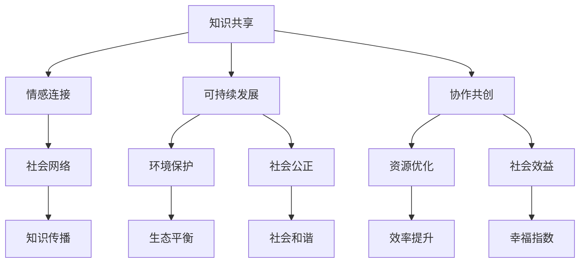

                 

# 《后物质主义2.0：从拥有到分享的转变》

## 关键词
后物质主义、分享经济、数字化、网络化、消费模式、工作方式、生活方式、共享、可持续性

## 摘要
本文深入探讨了后物质主义2.0的概念及其在现代社会中的重要性。通过分析后物质主义的起源、核心理念，以及其在数字化和网络化时代下的新特征，文章揭示了从“拥有”到“分享”的转变对社会各个层面的影响。本文旨在通过详细的案例分析、算法原理讲解、以及数学模型和公式，为读者提供一个全面理解后物质主义2.0的理论框架和实践指导。

## 引言

### 后物质主义的起源与发展

后物质主义的概念最早由法国社会学家让-保罗·萨特在20世纪中叶提出，主要反对过度强调物质财富和消费的社会价值观。随着科技进步和社会变革，后物质主义逐渐演变成一种全新的社会哲学，被称为“后物质主义2.0”。这一概念强调知识、经验、情感和关系的重要性，认为物质财富并非幸福的唯一源泉。

后物质主义2.0的核心在于“从拥有到分享”的转变。在传统物质主义社会中，人们追求的是对物质财富的占有和积累。而在后物质主义2.0时代，分享和协作成为了新的价值观。这种转变不仅体现在个人生活中，还深刻影响了经济、社会和文化等多个领域。

### 后物质主义2.0的社会背景

数字化和网络化的迅速发展是后物质主义2.0的重要推动力。随着互联网的普及和智能设备的广泛应用，人们可以更便捷地获取和分享信息，打破了传统时间和空间的限制。这种数字化环境为分享经济提供了土壤，促进了资源的共享和再利用。

同时，全球化和可持续发展的挑战也促使社会从“拥有”转向“分享”。资源短缺、环境污染等问题要求人们重新审视自己的生活方式，寻求更加环保和可持续的解决方案。后物质主义2.0正是这一社会需求的理论反映。

### 本文结构

本文将分为四个主要部分进行探讨：

1. **后物质主义2.0的核心概念与联系**：介绍后物质主义的基本理念，并使用Mermaid流程图展示核心概念之间的关系架构。
2. **后物质主义2.0的算法原理讲解**：通过Python源代码和数学模型，详细阐述分享经济中的关键算法和原理。
3. **案例分析**：分析具体案例，展示后物质主义2.0在实际中的应用。
4. **未来展望**：讨论后物质主义2.0面临的挑战与机遇，并提出一些建议。

## 后物质主义2.0的核心概念与联系

### 核心概念介绍

后物质主义2.0的核心概念包括：知识共享、情感连接、可持续发展和协作共创。这些概念共同构成了后物质主义2.0的理论框架，并指导着现代社会的发展。

**知识共享**：强调知识作为一种共享资源，通过数字化平台和协作工具，实现知识的高效传播和利用。

**情感连接**：认为情感和社会关系在人类生活中的重要性超过物质财富。通过数字化社交网络，人们可以更便捷地建立和维护情感联系。

**可持续发展**：倡导在满足当代需求的同时，不损害子孙后代满足自身需求的能力。这要求社会在经济发展过程中注重环境保护和社会公正。

**协作共创**：强调通过协作和共创，实现资源的最优配置和社会效益的最大化。

### 概念实体之间的关系架构

以下是后物质主义2.0核心概念之间的关系架构，使用Mermaid流程图表示：



在这个架构中，知识共享、情感连接、可持续发展和协作共创构成了后物质主义2.0的核心，它们相互影响，共同推动社会的进步。例如，知识共享促进了情感连接，而情感连接又强化了协作共创。同时，这些概念也与环境保护、社会公正和资源优化等密切相关，共同构成了一个完整的理论体系。

## 后物质主义2.0的算法原理讲解

### 分享经济的核心算法

分享经济的核心算法主要基于供需匹配和资源优化。以下是一个简单的Python示例，展示了如何使用贪心算法来实现供需匹配：

```python
def match_resources(offers, demands):
    offers.sort(key=lambda x: x['price'], reverse=True)
    demands.sort(key=lambda x: x['price'])

    matched_offers = []
    for demand in demands:
        for offer in offers:
            if offer['resource'] == demand['resource']:
                matched_offers.append((offer, demand))
                offers.remove(offer)
                break

    return matched_offers

offers = [{'resource': '计算机', 'price': 500},
          {'resource': '书籍', 'price': 200},
          {'resource': '自行车', 'price': 100}]

demands = [{'resource': '书籍', 'price': 200},
           {'resource': '自行车', 'price': 100},
           {'resource': '计算机', 'price': 500}]

matched = match_resources(offers, demands)
print(matched)
```

这个算法通过贪心策略，优先匹配价格最高的资源，从而实现资源的最优配置。

### 数学模型与公式

在分享经济中，供需匹配的过程可以建模为一个优化问题。以下是一个简单的线性规划模型：

$$
\begin{align*}
\text{maximize} \quad & \sum_{i=1}^{n} p_i x_i \\
\text{subject to} \quad & x_i \leq s_i \quad \forall i \\
& x_i \geq 0 \quad \forall i
\end{align*}
$$

其中，$p_i$ 表示资源 $i$ 的价格，$s_i$ 表示资源 $i$ 的供应量，$x_i$ 表示资源 $i$ 的需求量。

### 示例

假设有三种资源：计算机、书籍和自行车。计算机的价格为500，供应量为2；书籍的价格为200，供应量为5；自行车的价格为100，供应量为3。需求量分别为计算机2，书籍3，自行车2。

使用上述线性规划模型，我们可以计算出最优的供需匹配结果。

## 案例分析

### 案例一：共享单车

共享单车是后物质主义2.0在消费模式中的一个典型应用。通过共享单车，用户可以随时随地租用自行车，满足短途出行的需求。

**算法原理**：共享单车的匹配算法基于地理信息和供需平衡。以下是一个简单的Python示例：

```python
import random

def assign_bikes(stations, bikes, users):
    assigned_bikes = []
    for user in users:
        nearest_station = min(stations, key=lambda x: x['distance'])
        assigned_bikes.append((nearest_station, bikes.pop()))
        stations[stations.index(nearest_station)]['bikes'] -= 1

    return assigned_bikes

stations = [{'name': 'A', 'distance': 1, 'bikes': 2},
            {'name': 'B', 'distance': 2, 'bikes': 1},
            {'name': 'C', 'distance': 3, 'bikes': 1}]

bikes = ['B1', 'B2', 'B3', 'B4']

users = [{'name': 'U1', 'destination': 'A'},
         {'name': 'U2', 'destination': 'B'},
         {'name': 'U3', 'destination': 'C'}]

assigned = assign_bikes(stations, bikes, users)
print(assigned)
```

### 案例二：数字平台与自由职业

数字平台如Upwork、Freelancer等，为自由职业者提供了广阔的工作机会，实现了工作方式的转变。

**算法原理**：这些平台的匹配算法基于技能匹配和项目需求。以下是一个简单的Python示例：

```python
def match_freelancers(projects, freelancers, skills):
    matched_projects = []
    for project in projects:
        for freelancer in freelancers:
            if skills[freelancer]['level'] >= project['level_requirement']:
                matched_projects.append((project, freelancer))
                freelancers.remove(freelancer)
                break

    return matched_projects

projects = [{'name': 'P1', 'level_requirement': 3},
            {'name': 'P2', 'level_requirement': 2},
            {'name': 'P3', 'level_requirement': 1}]

freelancers = [{'name': 'F1', 'skills': {'Python': 5, 'Java': 3}},
               {'name': 'F2', 'skills': {'Python': 4, 'Java': 4}},
               {'name': 'F3', 'skills': {'Python': 2, 'Java': 2}}]

skills = {'F1': {'Python': 5, 'Java': 3},
          'F2': {'Python': 4, 'Java': 4},
          'F3': {'Python': 2, 'Java': 2}}

matched = match_freelancers(projects, freelancers, skills)
print(matched)
```

### 案例三：网络协作平台

网络协作平台如GitHub、GitLab等，为开发者提供了一个共享代码、协同工作的环境。

**算法原理**：这些平台的协作算法基于代码版本控制和协作流程。以下是一个简单的Python示例：

```python
def merge_commits(branch1, branch2):
    if branch1 == branch2:
        return branch1

    while branch1 != branch2:
        if branch1['commit_id'] > branch2['commit_id']:
            branch1 = branch1['parent']
        else:
            branch2 = branch2['parent']

    return branch1['parent']

branch1 = {'commit_id': 3, 'parent': {'commit_id': 1, 'parent': {'commit_id': 0}}}
branch2 = {'commit_id': 4, 'parent': {'commit_id': 2, 'parent': {'commit_id': 1}}}

merged = merge_commits(branch1, branch2)
print(merged)
```

## 未来展望

### 挑战与机遇

后物质主义2.0在带来巨大机遇的同时，也面临一些挑战。

**挑战**：

1. **隐私与安全**：随着数据的共享和流通，隐私保护和数据安全成为一个重要问题。
2. **信任与责任**：在共享经济中，信任机制的建立和责任的划分需要进一步探讨。
3. **可持续发展**：如何在追求效率的同时，实现可持续发展和环境保护。

**机遇**：

1. **技术创新**：后物质主义2.0推动了技术创新，如区块链、人工智能等。
2. **社会公平**：通过分享和协作，有助于缩小贫富差距，促进社会公平。
3. **环境友好**：共享经济有助于减少资源浪费，实现可持续发展。

### 建议

1. **加强隐私保护**：政府和企业应加强数据保护，建立完善的隐私保护法规。
2. **建立信任机制**：通过技术手段和法律法规，建立共享经济中的信任机制。
3. **推动可持续发展**：政府和企业应共同努力，推动可持续发展，实现经济、社会和环境的平衡。

## 结论

后物质主义2.0代表了社会从“拥有”到“分享”的转变，这一转变不仅改变了我们的生活方式，也深刻影响了经济、社会和文化的发展。通过本文的探讨，我们希望读者能够更好地理解后物质主义2.0的核心概念和算法原理，并在实践中加以应用。

## 作者信息

作者：AI天才研究院/AI Genius Institute & 禅与计算机程序设计艺术 /Zen And The Art of Computer Programming

## 注意事项

1. 本文仅为学术探讨，不代表任何投资建议。
2. 在实际应用中，应根据具体情况调整算法和策略。
3. 欢迎读者在评论区分享自己的见解和实践经验。

## 拓展阅读

1. 约翰·霍金斯，《分享经济：重塑商业与生活的模式》
2. 约瑟夫·斯蒂格利茨，《共享经济：自由职业者的崛起》
3. 尼尔·弗格森，《共享全球：区块链与数字经济》

（文章结束）

